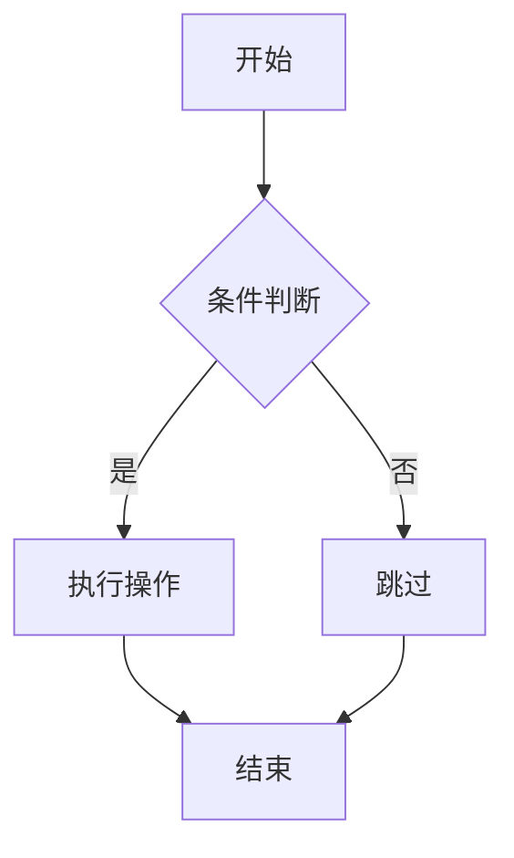

# Test

──[ 测试页面 ]──────────────────────────────────────────────────[ 自定义语法测试 ]

本页面用于测试项目的所有自定义语法渲染效果。

:::important
以下测试覆盖了 #[C|所有自定义语法]：ANSI 颜色、容器块、分隔线、数学公式、
Mermaid 流程图、INK 渐变文字、Plain Text 代码块等。
:::

──[ 1.0 ]──────────────────────────────────────────────[ ANSI 颜色标记测试 ]

  #[r|红色]  #[g|绿色]  #[y|黄色]  #[b|蓝色]  #[m|紫色]  #[c|青色]  #[w|白色]  #[k|黑色]

  #[R|亮红]  #[G|亮绿]  #[Y|亮黄]  #[B|亮蓝]  #[M|亮紫]  #[C|亮青]  #[W|亮白]  #[K|灰色]

──[ 2.0 ]────────────────────────────────────────────────────[ 容器块测试 ]

:::important
这是一个 #[R|重要信息] 容器，用于强调关键内容。
内部支持 #[G|ANSI 颜色]、**加粗**、*斜体* 等 Markdown 语法。
:::

:::warning[警告标题]
这是一个带标题的警告容器。
:::

:::note
这是一个普通注释容器。
:::

──[ 3.0 ]────────────────────────────────────────────────────[ 数学公式测试 ]

行内公式：$E = mc^2$、$\int_0^\infty e^{-x^2} dx = \frac{\sqrt{\pi}}{2}$

块级公式：

$$
\sum_{i=1}^{n} i = \frac{n(n+1)}{2}
$$

$$
\begin{bmatrix}
a & b \\
c & d
\end{bmatrix}
$$

──[ 4.0 ]──────────────────────────────────────────────[ Mermaid 流程图测试 ]



──[ 5.0 ]────────────────────────────────────────────────[ Plain Text 测试 ]

```Plain Text
┌──────────────────────────────────┐
│  Plain Text 块保留原始格式       │
│  空格和换行均按原样渲染          │
│  适合展示 ASCII Art 和框线图     │
└──────────────────────────────────┘
    ┌──┐    ┌──┐
    │  │    │  │
    └──┘    └──┘
```

──[ 6.0 ]──────────────────────────────────────────────[ INK 渐变文字测试 ]

--[ ink ]--
|INK Gradient Text Effect
~RRRRRRGGGGGYYYYYYCCCCCBBBBBBBMMMMMMM

--[ ink ]--
|Multi-Line INK Block
~RRRRRRRRRRRRRRRRRRRRRRRRRRR
|Second line with different colors
~GGGGGGGGGGGGGGGGGGGGGGGGGGGGG

──[ 7.0 ]──────────────────────────────────────────────────[ 表格测试 ]

| 语法特性 | 状态 | 说明 |
|----------|------|------|
| #[r|ANSI 颜色] | 正常 | 16 种 ANSI 标准颜色 |
| #[g|::: 容器] | 正常 | 支持 important/warning/note |
| #[c|KaTeX 数学] | 正常 | 行内 + 块级公式 |
| #[m|Mermaid 图表] | 正常 | 流程图/时序图/状态图 |
| #[Y|INK 渐变] | 正常 | 双行字符级颜色控制 |
| #[b|Plain Text] | 正常 | 保留原始格式的代码块 |