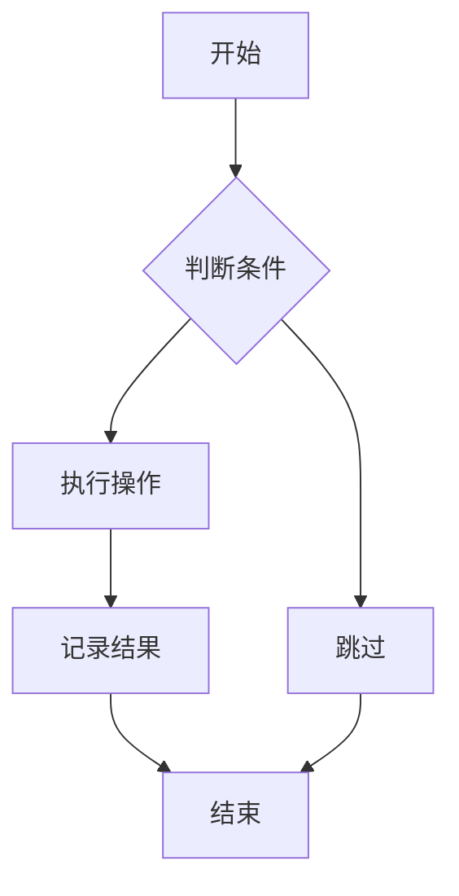
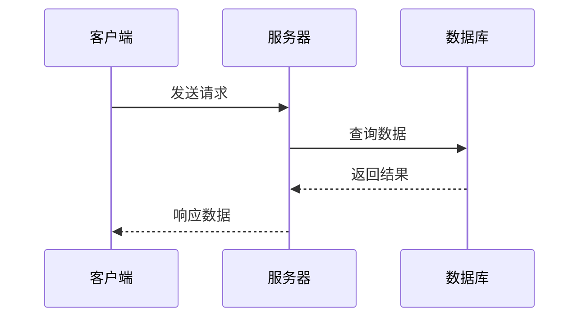
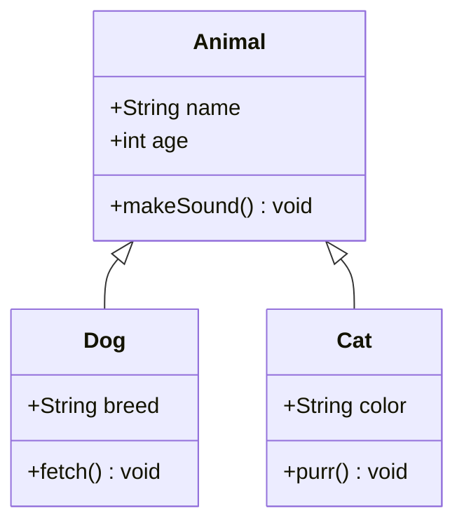
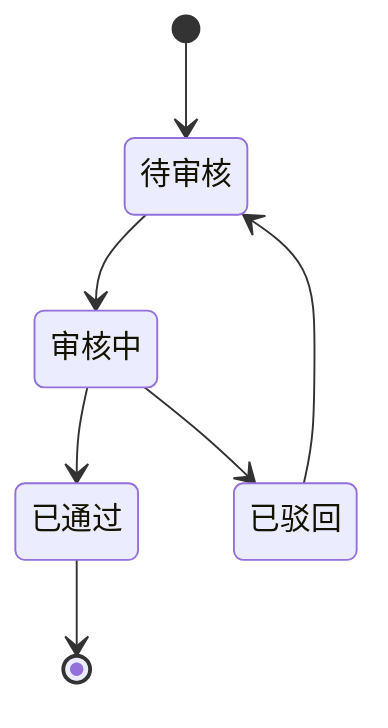
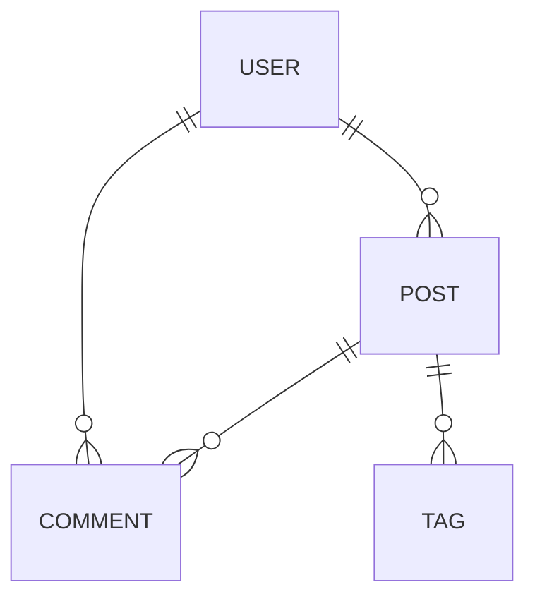
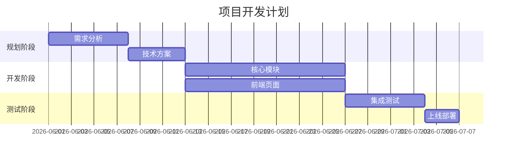
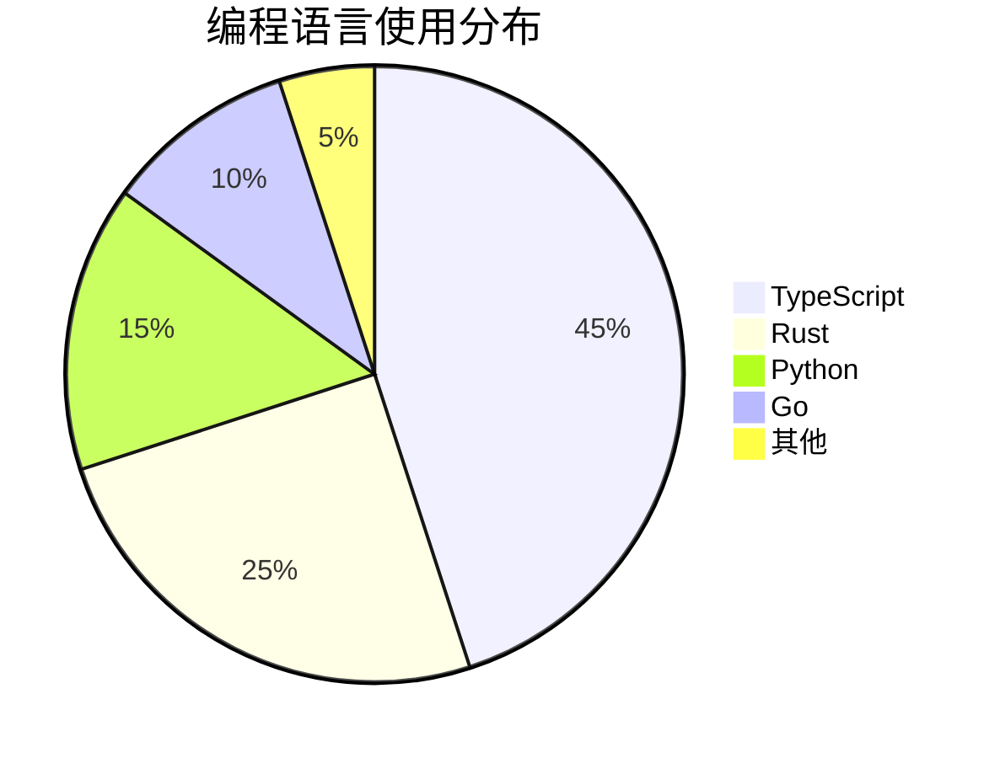
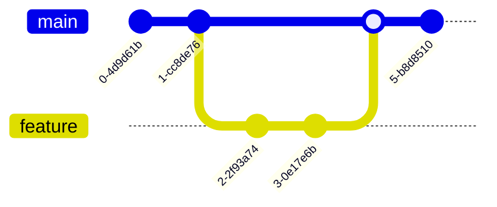
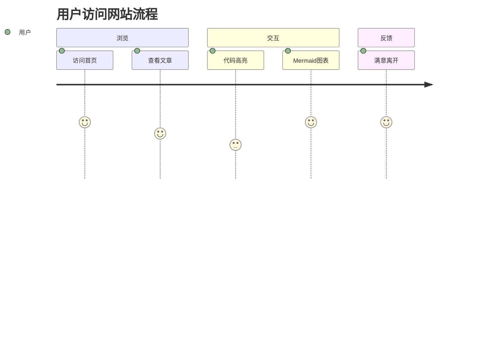

CONTENTS

── 测试说明 ───────────────────────────────────────────────────────────────

本文用于测试 Mermaid 图表的构建时渲染功能。所有图表均通过 #[b|mermaid.render()] 在构建时静态渲染为 SVG，
无需客户端 JavaScript。

── 1.0 流程图 ──────────────────────────────────────────────────────────────

── 2.0 时序图 ──────────────────────────────────────────────────────────────

── 3.0 类图 ───────────────────────────────────────────────────────────────

── 4.0 状态图 ──────────────────────────────────────────────────────────────

── 5.0 实体关系图 ──────────────────────────────────────────────────────────

── 6.0 甘特图 ──────────────────────────────────────────────────────────────

── 7.0 饼图 ───────────────────────────────────────────────────────────────

── 8.0 Git 图 ───────────────────────────────────────────────────────

── 9.0 用户旅程图 ───────────────────────────────────────────────────────

