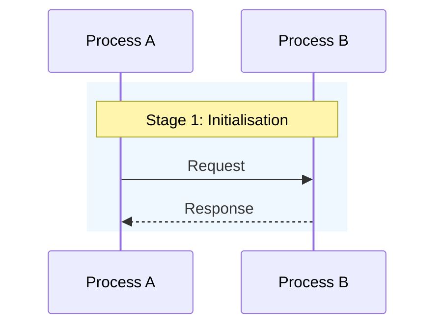
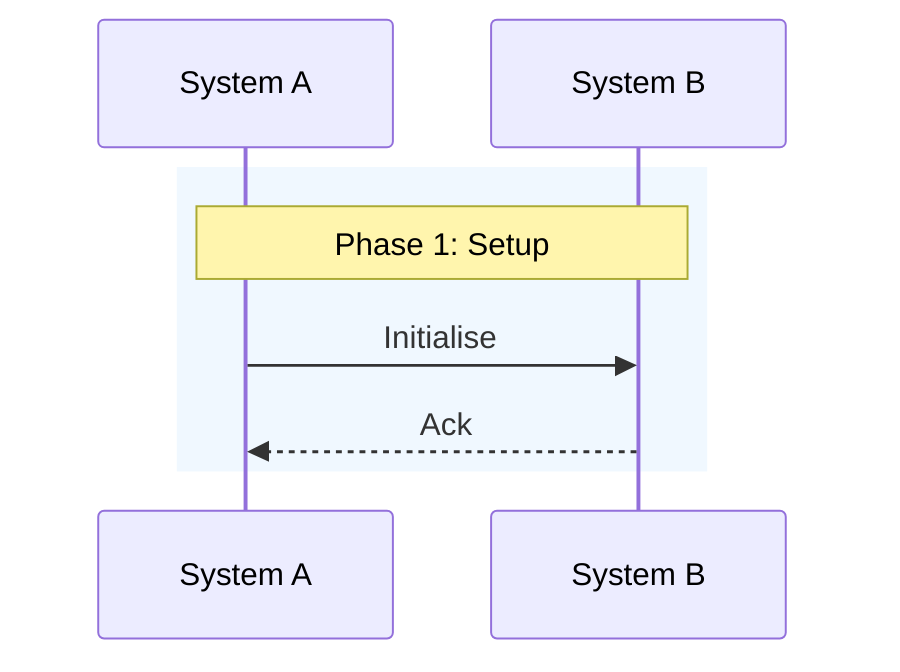

# AI Article Generation Skill — Custom Syntax Reference

> **Purpose**: This document defines the complete custom syntax system for the Entropic Blog.
> AI agents MUST reference this document when generating or editing articles to ensure
> consistent use of terminal-style formatting, ANSI colours, containers, and structural elements.
>
> **本文档定义了 Entropic 博客的完整自定义语法系统。AI 在生成或编辑文章时必须参考此文档，
> 确保正确使用终端风格格式、ANSI 颜色、容器块和结构元素。**

---

## 1.0 Frontmatter (元数据)

```yaml
---
title: "Article Title"       # 必填 · 文章标题 (Required)
date: 2026-06-26             # 必填 · 发布日期 (Required)
author: "Author Name"        # 必填 · 作者名 (Required)
order: 0                     # 可选 · 排序权重，越小越前 (Optional, default: 0)
lang: zh                     # 可选 · 语言 en/zh (Optional)
redacted: false              # 可选 · 设为 true 隐藏文章 (Optional)
---
```

| Field | Type | Required | Description |
|-------|------|----------|-------------|
| `title` | string | YES | Article title displayed in TOC and header |
| `date` | YYYY-MM-DD | YES | Publication date |
| `author` | string | YES | Author identifier |
| `order` | number | NO | Sort weight (ascending). Lower = first. Default: 0 |
| `lang` | `en` / `zh` | NO | Content language. Default: `en` |
| `redacted` | boolean | NO | Set `true` to hide from volume listings |

---

## 2.0 ANSI Colour Markers (ANSI 颜色标记)

**Syntax**: `#[role|text]`

**Standard Colours (小写 = 暗色 / lowercase = dark)**:

| Code | Colour | Display |
|------|--------|---------|
| `r` / `red` | Red | `#[r|text]` |
| `g` / `green` | Green | `#[g|text]` |
| `y` / `yellow` | Yellow | `#[y|text]` |
| `b` / `blue` | Blue | `#[b|text]` |
| `m` / `magenta` | Magenta | `#[m|text]` |
| `c` / `cyan` | Cyan | `#[c|text]` |
| `w` / `white` | White | `#[w|text]` |
| `k` / `black` | Black | `#[k|text]` |

**Bright Colours (大写 = 亮色 / uppercase = bright)**:

| Code | Colour | Display |
|------|--------|---------|
| `R` / `br-red` / `bright-red` | Bright Red | `#[R|text]` |
| `G` / `br-green` / `bright-green` | Bright Green | `#[G|text]` |
| `Y` / `br-yellow` / `bright-yellow` | Bright Yellow | `#[Y|text]` |
| `B` / `br-blue` / `bright-blue` | Bright Blue | `#[B|text]` |
| `M` / `br-magenta` / `bright-magenta` | Bright Magenta | `#[M|text]` |
| `C` / `br-cyan` / `bright-cyan` | Bright Cyan | `#[C|text]` |
| `W` / `br-white` / `bright-white` | Bright White | `#[W|text]` |
| `K` / `br-black` / `bright-black` | Grey (Bright Black) | `#[K|text]` |

**Semantic Colour Convention (语义颜色约定)**:

| Colour | Purpose | 用途 |
|--------|---------|------|
| `#[C|...]` / `#[c|...]` | Key concepts, format markers, code references | 关键概念、格式标记、代码引用 |
| `#[G|...]` / `#[g|...]` | Correct/validated data, positive results | 正确/已验证数据、正向结果 |
| `#[Y|...]` / `#[y|...]` | Offsets, sizes, boundary values, warnings | 偏移量、大小、边界值、警告 |
| `#[R|...]` / `#[r|...]` | Errors, hazards, negative controls, wrong paths | 错误、危险、负向控制、错误路径 |
| `#[b|...]` / `#[B|...]` | Navigation links, directory references | 导航链接、目录引用 |
| `#[m|...]` / `#[M|...]` | Metadata, supplementary info, tools | 元数据、补充信息、工具 |
| `#[w|...]` / `#[W|...]` | Neutral emphasis, inversion | 中性强调、反色 |

**Escaping**: Use backslash to escape special characters inside ANSI markers:
```
#[c|escape a pipe: \|]
#[c|escape a bracket: \]]
#[c|escape a hash: \#]
```

**Anti-patterns (DO NOT use)**:
- Unrecognised roles degrade to plain text — verify spelling
- Mixing ANSI with LaTeX inside `$...$` — the backslash escape conflicts
- Nesting ANSI markers: `#[r|#[g|text]]` is invalid

---

## 4.0 ::: Container Blocks (容器块)

**Syntax**: `:::type` ... `:::` or `:::type[title]` ... `:::` or `:::type title` ... `:::`

**Supported Types**:

| Type | Purpose | 用途 |
|------|---------|------|
| `:::important` | Critical information, key takeaways | 重要信息、关键结论 |
| `:::warning` | Warnings, pitfalls, danger zones | 警告、陷阱、危险区域 |
| `:::note` | Supplementary notes, tips, observations | 补充说明、技巧、观察 |

**Usage**:
```
:::important
This is a critical point that needs emphasis.
:::

:::warning[安全警告]
此操作不可逆，请谨慎执行。
:::

:::note 补充说明
这是一个额外的注释。
:::
```

**Internal Content**: Containers support full Markdown inside them, including:
- ANSI colour markers: `#[R|important]`
- Bold/italic: `**bold**`, `*italic*`
- Inline code: `` `code` ``
- Links: `[text](url)`
- Lists: `- item`

**Note**: Container content is rendered by markdown-it, so standard Markdown rules apply.

---

## 5.0 INK Gradient Text (INK 渐变文字)

**Syntax**:
```
--[ ink ]--
|text line
~mask line
```

**Structure**:
- Block starts with `--[ ink ]--` on its own line
- `|` prefix: text line (visible characters)
- `~` prefix: mask line (colour control, one char per text char)
- Block ends with a blank line

**Mask Characters** (same as ANSI colour codes):

| Char | Colour | Char | Colour |
|------|--------|------|--------|
| `r` | Red | `R` | Bright Red |
| `g` | Green | `G` | Bright Green |
| `y` | Yellow | `Y` | Bright Yellow |
| `b` | Blue | `B` | Bright Blue |
| `m` | Magenta | `M` | Bright Magenta |
| `c` | Cyan | `C` | Bright Cyan |
| `w` | White | `W` | Bright White |
| `k` | Black | `K` | Grey |
| `.` / ` ` | No colour (default) | | |

**Example**:
```
--[ ink ]--
|INK Gradient Text Effect
~RRRRRRGGGGGYYYYYYCCCCCBBBBBBBMMMMMMM
```

**Multi-line example**:
```
--[ ink ]--
|Multi-Line INK Block
~RRRRRRRRRRRRRRRRRRRRRRRRRRR
|Second line with different colours
~GGGGGGGGGGGGGGGGGGGGGGGGGGGGG
```

**Rules**:
- Text line and mask line MUST have the same number of characters
- Each pair of text/mask lines forms one INK segment
- The rendering engine handles line wrapping based on body width

---

## 6.0 ```Plain Text Blocks (纯文本块)

**Syntax**: ```` ```Plain Text ```` ... ```` ``` ````

**Purpose**: Preserve original formatting including spaces, indentation, and ASCII art
without markdown-it interpreting 4-space indents as code blocks.

**Usage**:
```
```Plain Text
┌──────────────────────────────────┐
│  This content preserves          │
│  exact whitespace and layout.    │
│  No markdown processing.         │
└──────────────────────────────────┘
    Indented line stays indented.
```
```

**When to use**:
- ASCII art diagrams
- Box-drawing structures
- Directory trees
- Any content where whitespace preservation is critical

**When NOT to use**:
- Regular code blocks → use ` ```language ` instead
- Mermaid diagrams → use ` ```mermaid `

---

## 8.0 Mermaid Diagrams (Mermaid 图表)

**Syntax**: ```` ```mermaid ```` ... ```` ``` ````

**Supported Diagram Types** (all Mermaid types are supported):

| Type | Syntax | Best For |
|------|--------|----------|
| Flowchart | `graph TD` / `graph LR` | Process flows, decision trees |
| Sequence | `sequenceDiagram` | Interaction sequences, protocol flows |
| State | `stateDiagram-v2` | State machines, lifecycle |
| Class | `classDiagram` | OOP class relationships |
| Gantt | `gantt` | Project timelines |
| Timeline | `timeline` | Historical progressions |
| Mindmap | `mindmap` | Hierarchical brainstorming |

**Best Practices**:
- Use `rect rgb(R,G,B)` to group related stages with background colours
- Use `Note over A,B: text` for explanatory annotations
- Keep participant names short and descriptive
- Use Chinese or English text in labels freely

**Example**:
```

```

**Note**: Mermaid is loaded dynamically (`import("mermaid")`). Pages without
mermaid blocks do NOT load the mermaid library (~595KB), improving performance.

---

## 9.0 KaTeX Mathematics (数学公式)

**Syntax**:
- Inline: `$...$` (single dollar)
- Block: `$$...$$` (double dollar, on its own line)

**Examples**:
```
行内公式: $E = mc^2$, $\int_0^\infty e^{-x^2} dx$

块级公式:

$$
\sum_{i=1}^{n} i = \frac{n(n+1)}{2}
$$

$$
\begin{bmatrix}
a & b \\
c & d
\end{bmatrix}
$$
```

**Important Notes**:
- Block math `$$...$$` inside table cells is automatically converted to inline `$...$`
  to prevent table structure corruption
- Use `\` for LaTeX commands (backslash is preserved)
- The rendering engine uses KaTeX, not MathJax
- All standard LaTeX math syntax is supported

**Conflict Warning**: Do NOT use ANSI colour markers inside `$...$`. The backslash
escaping conflicts with LaTeX command syntax.

---

## 10.0 Code Blocks with Syntax Highlighting (代码高亮)

**Syntax**: ```` ```language ```` ... ```` ``` ````

**Supported Languages**: All languages supported by highlight.js (190+ languages).

**Common Languages**:
```
```c          — C 语言
```python     — Python
```java       — Java
```javascript — JavaScript
```typescript — TypeScript
```rust       — Rust
```bash       — Shell/Bash
```yaml       — YAML
```json       — JSON
```
```

**Note**: Code blocks inside `:::container` blocks are also highlighted.

---

## 11.0 Tables (表格)

**Syntax**: Standard Markdown GFM tables

**Example**:
```
| Feature | Status | Notes |
|---------|--------|-------|
| #[r|ANSI Colours] | Stable | 16 colour palette |
| #[g|Containers] | Stable | 3 types |
| #[c|Mermaid] | Stable | Lazy-loaded |
```

**Note**: ANSI colour markers work inside table cells, but block math `$$...$$`
is automatically downgraded to inline `$...$` to preserve table structure.

---

## 12.0 Images (图片)

**Syntax**: `` or ``

**Image Resolution**:
- Relative paths (`./image.png`) resolve to `/images/<article-dir>/image.png`
- Absolute paths (`/images/foo.png`) are used as-is
- URLs (`https://...`) are used as-is

**Example**:
```

```

Images are rendered as `<figure>` with optional `<figcaption>` and support
lightbox preview via `data-lightbox-image` attribute.

---

## 13.0 Links (链接)

**Syntax**: `[link text](url)`

**Internal Links**:
- Volume index: `[volume 1](/volume/1/)`
- Article: `[article title](/volume/1/slug/)`

---

## 14.0 Rendering Pipeline (渲染流程)

Understanding the pipeline helps avoid syntax conflicts:

```
1. Frontmatter Parsing       →  Extract YAML metadata
2. Image Block Splitting     →  Separate image lines from text
3. Math Preprocessing        →  Extract $...$ and $$...$$, replace with placeholders
4. Plain Text Blocks         →  Extract ```Plain Text, replace with pre-rendered HTML
5. INK Block Extraction      →  Extract --[ ink ]--, render to HTML
6. Code Block Protection     →  Replace ```...``` with placeholders (preserve LaTeX backslashes)
7. ANSI Inline Processing    →  Replace #[role|text] with Unicode placeholders
8. Code Block Restoration    →  Restore code blocks
9. Container Segmentation    →  Split text by :::type markers
10. Markdown → HTML          →  markdown-it renders each segment
11. Syntax Highlighting      →  highlight.js post-processes code blocks
12. ANSI Restoration         →  Replace Unicode placeholders with <span class="ansi-*">
13. INK Restoration          →  Replace INK placeholders with rendered HTML
14. Math Restoration         →  Replace math placeholders with KaTeX HTML
15. Mermaid Transformation   →  Convert <pre><code class="language-mermaid"> to <pre class="mermaid">
```

---

## 15.0 Quick Reference Card (速查卡)

```
┌─ Frontmatter ────────────────────────────────────────────────────┐
│ ---                                                               │
│ title: "Title" | date: YYYY-MM-DD | author: "Name"               │
│ order: 0 | lang: zh/en | redacted: false                         │
│ ---                                                               │
└──────────────────────────────────────────────────────────────────┘

┌─ ANSI Colour ────────────────────────────────────────────────────┐
│ #[r|red] #[g|green] #[y|yellow] #[b|blue] #[m|magenta] #[c|cyan] │
│ #[R|bright-red] #[G|bright-green] #[Y|bright-yellow]              │
│ #[B|bright-blue] #[M|bright-magenta] #[C|bright-cyan]             │
│ #[w|white] #[k|black] #[W|bright-white] #[K|grey]                │
│                                                                    │
│ Semantic: #[C|concept] #[G|correct] #[Y|warning] #[R|error]       │
└──────────────────────────────────────────────────────────────────┘

┌─ Container ──────────────────────────────────────────────────────┐
│ :::important         :::warning[Title]         :::note Text       │
│ Content              Content                   Content            │
│ :::                  :::                       :::                │
└──────────────────────────────────────────────────────────────────┘

┌─ INK Block ──────────────────────────────────────────────────────┐
│ --[ ink ]--                                                       │
│ |text line                                                          │
│ ~RRRRGGGG...                                                      │
│ (blank line terminates block)                                      │
└──────────────────────────────────────────────────────────────────┘

┌─ Code & Diagrams ────────────────────────────────────────────────┐
│ ```language        ```mermaid         ```Plain Text               │
│ code               graph TD           ASCII art                    │
│ ```                ```                ```                          │
└──────────────────────────────────────────────────────────────────┘

┌─ Math ───────────────────────────────────────────────────────────┐
│ Inline: $E = mc^2$                                                │
│ Block:  $$                                                        │
│        \sum_{i=1}^{n} i = \frac{n(n+1)}{2}                       │
│        $$                                                         │
│                                                                    │
│ ⚠ Do NOT put ANSI #[...] inside $...$                            │
│ ⚠ $$...$$ in table cells → auto-converted to $...$               │
└──────────────────────────────────────────────────────────────────┘
```

---

## 16.0 Common Pitfalls & Conflict Resolution (常见陷阱)

| Pitfall | Problem | Solution |
|---------|---------|----------|
| `#[role|text]` inside `$...$` | Backslash conflict with LaTeX | Never mix ANSI with math |
| `$$...$$` inside table cells | Breaks table structure | Use `$...$` instead; auto-converted |
| `__INKBLOCK__` in text | Parsed as bold by markdown-it | Not an issue in v2 (uses Unicode placeholders) |
| 4-space indent in free text | Interpreted as code block | Use ```` ```Plain Text ```` block |
| `:::type` without closing `:::` | Container swallows rest of document | Always close with `:::` |
| Unknown ANSI role | Degrades to plain text silently | Verify spelling against colour table |
| Mermaid diagram not rendering | Block syntax error | Test diagram in Mermaid Live Editor |
| INK text/mask line length mismatch | Rendering may be misaligned | Ensure exact 1:1 character mapping |

---

## 17.0 Complete Example (完整示例)

```
---
title: "Example Article"
date: 2026-06-26
author: "AI"
order: 0
lang: en
redacted: false
---

# Example Article

## 1.0 Introduction

This article demonstrates #[C|all custom syntax] features in a single example.

:::important
#[R|Key takeaway]: The combination of #[C|ANSI colours] and #[G|containers]
creates a terminal-inspired visual style that is both #[Y|retro] and #[b|functional].
:::

## 2.0 Core Concepts

- **#[C|Concept A]** — Primary mechanism with #[G|validated results]
- **#[C|Concept B]** — Secondary mechanism with #[R|known limitations]
- **#[Y|Note]** — All concepts are #[b|order-weighted] for display

## 3.0 Process Flow



## 4.0 Code Example

```c
#include <stdio.h>

int main() {
    printf("Hello, World!\n");
    return 0;
}
```

## 5.0 Performance Data

| Metric | Value | Status |
|--------|-------|--------|
| Throughput | 1000 req/s | #[G|Normal] |
| Latency | 45ms | #[Y|Elevated] |
| Error Rate | 0.01% | #[G|Normal] |

## 6.0 Conclusion

:::note
This example covers all major syntax elements. For detailed syntax reference,
see the #[c|editing-guide] and #[c|writing-format-reference] articles.
:::
```

---

## 18.0 Generation Checklist (生成检查清单)

When generating or editing an article, AI MUST verify:

- [ ] Frontmatter: `title`, `date`, `author` are present and valid
- [ ] Section headings: use `##` Markdown headings for major sections
- [ ] ANSI colours: semantic convention followed (C=concept, G=correct, Y=warning, R=error)
- [ ] Containers: `:::important` for key points, `:::warning` for pitfalls, `:::note` for tips
- [ ] Mermaid diagrams: `rect` grouping for stages, `Note` for annotations
- [ ] Code blocks: language tag specified for syntax highlighting
- [ ] Math: `$$...$$` on separate lines, `$...$` inline
- [ ] No ANSI inside `$...$` math expressions
- [ ] All `:::` containers are properly closed
- [ ] INK blocks: text and mask lines have matching lengths
- [ ] Content width: body text and diagrams fit within 80 characters
- [ ] `order` field: set appropriately for each article within its volume