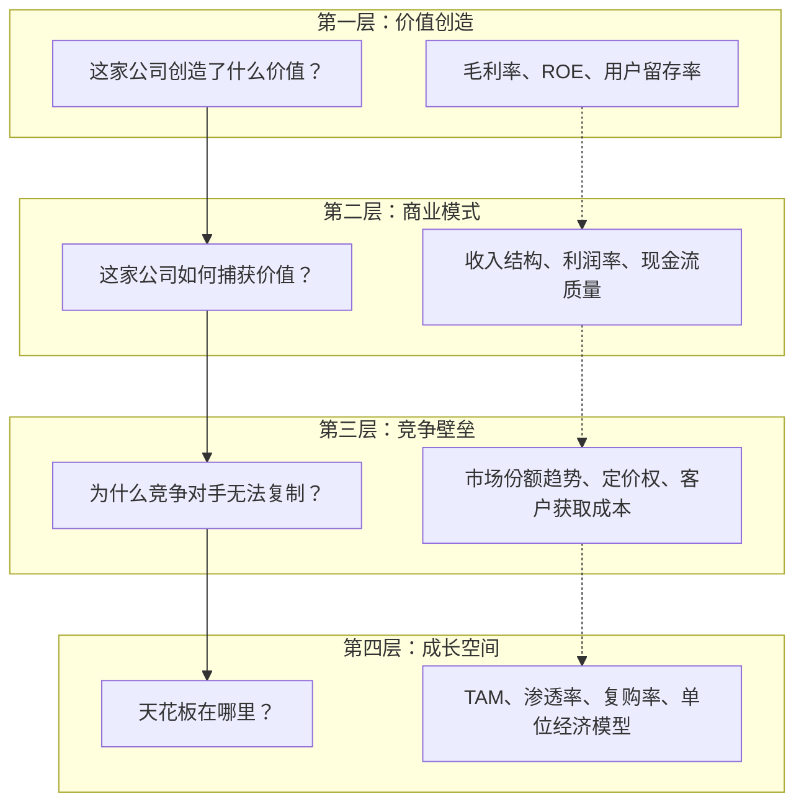

# 从商业逻辑读懂财报：核心框架与方法论

> 财报不是财务报表，而是企业用数字讲述的商业故事。本文建立一套以商业逻辑为核心的财报阅读框架，帮助你从"看数字"升级为"读生意"。

---

## 为什么你看不懂财报？

大多数人翻开财报的第一反应是：数字太多，不知道该看哪里。

问题的根源在于**阅读顺序错了**。传统的财报阅读方式是：先看三张表，再看附注，最后看管理层讨论。这种"定义导向"的读法让你陷入数字的海洋，却始终抓不住重点。

**正确的阅读顺序应该是：先理解生意，再验证数字。**

### 一个简单的自测

在阅读任何公司的财报之前，先问自己三个问题：

1. 这家公司靠什么赚钱？（商业模式）
2. 它的客户为什么选择它而不是竞争对手？（竞争优势）
3. 如果这家公司明天消失，谁会想念它？（价值创造）

如果你能回答这三个问题，你就已经建立了一个商业框架。接下来，财报的作用就是**验证、修正和深化**你对这个框架的理解。

---

## 商业逻辑框架：四层分析法

我建立了一套"四层分析法"来系统化地阅读财报。每一层对应一个商业问题，每一层都有对应的财务指标来验证。

### 第一层：价值创造 —— 生意的本质

**核心问题：** 这家公司为客户解决了什么问题？

- **评估指标：** 毛利率（定价权）、用户留存率（产品价值）、NPS（用户满意度）
- **关键洞察：** 高毛利不一定意味着高价值创造，但低毛利通常意味着低价值创造。如果一个产品毛利率不到 20%，就问自己：这个产品真的不可或缺吗？

> **案例：Costco（好市多）**
>
> | 维度     | 分析                                               |
> | -------- | -------------------------------------------------- |
> | 商业模式 | 会员制仓储零售，赚取会员费而非商品差价             |
> | 市场环境 | 美国零售业高度竞争，但仓储会员赛道集中度高         |
> | 投资价值 | 毛利率仅 11-13%，但会员续费率超 90%，ROE 长期 25%+ |
>
> Costco 的毛利率极低，但它的价值创造不在于卖货，而在于为会员精选 SKU、降低决策成本。**毛利率低不是问题，低毛利且没有其他价值捕获方式才是问题。**

### 第二层：商业模式 —— 价值如何变现

**核心问题：** 价值创造之后，钱怎么赚回来？

- **评估指标：** 收入结构（单一依赖还是多元化）、经营性现金流/净利润（利润质量）、应收账款周转天数（收款效率）
- **关键洞察：** 利润表上的"净利润"不等于真正赚到的钱。如果经营性现金流长期低于净利润，说明利润"含金量"不足。

> **案例：京东 vs 拼多多 —— 两种截然不同的零售模式**
>
> | 维度     | 京东（自营零售）               | 拼多多（平台模式）        |
> | -------- | ------------------------------ | ------------------------- |
> | 商业模式 | 自营采购+物流履约，赚差价      | 撮合交易，赚广告费和佣金  |
> | 收入结构 | 自营收入占 80%+，毛利率 14-15% | 广告收入为主，毛利率 60%+ |
> | 投资价值 | 重资产、低毛利、高壁垒         | 轻资产、高毛利、网络效应  |
>
> 同样的"电商"，商业模式完全不同。京东的利润来自**运营效率**（管理库存、物流），拼多多的利润来自**流量分发**（匹配供需）。看财报时，你首先要判断：这家公司属于哪种商业模式？

### 第三层：竞争壁垒 —— 护城河的宽度

**核心问题：** 为什么别人做不了同样的生意？

- **评估指标：** 市场份额变化、毛利率趋势、销售费用率、客户获取成本（CAC）
- **关键洞察：** 如果一家公司的毛利率在持续下降，同时销售费用率在上升，说明它的护城河正在被侵蚀。

> **案例：茅台 vs 白酒行业**
>
> | 维度       | 茅台       | 行业平均 |
> | ---------- | ---------- | -------- |
> | 毛利率     | 92%+       | 60-70%   |
> | 销售费用率 | 3% 左右    | 15-25%   |
> | 预收账款   | 数十亿级别 | 极少     |
>
> 茅台的销售费用率极低，说明它不需要打广告就有客户排队买。**预收账款（合同负债）** 是白酒行业最关键的先行指标 —— 经销商的打款意愿直接反映了产品的市场热度。

### 第四层：成长空间 —— 天花板在哪里

**核心问题：** 这个生意能做多大？能做多久？

- **评估指标：** 可触达市场规模（TAM）、渗透率、复购率、单位经济模型（UE）
- **关键洞察：** 高增长不等于好生意。如果单位经济模型（UE）是负的，增长越快死得越快。

> **案例：瑞幸咖啡 —— 从"烧钱故事"到"盈利故事"**
>
> | 阶段         | 2019（烧钱期） | 2023（盈利期） |
> | ------------ | -------------- | -------------- |
> | 门店数       | 4,500+         | 16,000+        |
> | 单店日均销售 | 约 250 元      | 约 400+ 元     |
> | 经营利润率   | 负             | 15%+           |
> | 单位经济模型 | 亏损           | 盈利           |
>
> 瑞幸的关键转折点不是门店数量的增长，而是**单位经济模型（UE）转正**。当每一杯咖啡都能赚钱时，开店才是有意义的扩张。

---

## 财报阅读的五个步骤

基于四层分析框架，我总结了一套具体的阅读步骤：

### 第一步：建立商业假设（5 分钟）

在打开财报之前，先写下你对这家公司的商业假设：

- 它的核心价值主张是什么？
- 它的主要收入来源是什么？
- 它的主要成本是什么？
- 它的竞争壁垒是什么？

### 第二步：快速扫描关键指标（10 分钟）

不要逐行读表，而是直奔关键指标：

| 关键指标     | 位置       | 关注什么                         |
| ------------ | ---------- | -------------------------------- |
| 收入增速     | 利润表     | 与行业增速对比，判断市场份额变化 |
| 毛利率       | 利润表     | 趋势变化反映定价权               |
| 经营性现金流 | 现金流量表 | 与净利润对比，判断利润质量       |
| 应收账款     | 资产负债表 | 增速超过收入增速是危险信号       |
| 有息负债     | 资产负债表 | 负债结构反映财务风险             |

### 第三步：验证商业假设（15 分钟）

用关键指标验证你的商业假设：

- 毛利率趋势是否支持你的定价权判断？
- 收入增速是否支持你的市场份额判断？
- 现金流是否支持你的利润质量判断？

### 第四步：深入异常信号（20 分钟）

对于第二步中发现的不符合预期的数据，深入阅读附注：

- 会计政策变更
- 关联交易
- 重大资产重组
- 非经常性损益

### 第五步：形成投资判断（10 分钟）

综合以上分析，回答三个问题：

1. 这家公司是否在创造真实价值？
2. 它的护城河是在变宽还是变窄？
3. 当前价格是否合理？

---

## 小结

财报阅读的核心不是会计知识，而是**商业理解力**。当你建立起"价值创造 → 商业模式 → 竞争壁垒 → 成长空间"的四层分析框架，财报就不再是枯燥的数字，而是企业用数字讲述的商业故事。

在后续文章中，我们将逐一深入剖析三张核心报表，并建立从数字到投资决策的完整转化路径。

---

_下一篇：[利润表深度解读：从收入到利润的商业故事](./02-利润表深度解读)_
