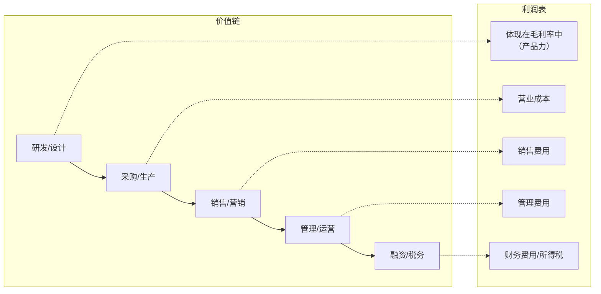

# 利润表深度解读：从收入到利润的商业故事

> 利润表不是一张简单的"收入减成本等于利润"的表格，而是企业商业模式在时间维度上的展开。每一个数字背后，都藏着一个商业决策。

---

## 利润表的结构：价值链的映射

利润表的结构天然对应了企业的价值链：



**关键认知：** 利润表每一个科目的变化，都应该能追溯到具体的商业行为。如果找不到对应的商业解释，这个数字就值得怀疑。

---

## 收入：商业模式的起点

### 收入质量比收入规模更重要

如果你只关心一个数字，那就看收入增速。但收入增速背后，有三个更关键的问题：

| 问题           | 分析维度   | 财务信号                            |
| -------------- | ---------- | ----------------------------------- |
| 收入从哪来？   | 收入结构   | 前五大客户集中度、分产品/分地区收入 |
| 收入可持续吗？ | 收入质量   | 应收账款/收入比、预收账款变化       |
| 收入有壁垒吗？ | 收入驱动力 | 量价拆分：增长来自提价还是放量？    |

### 案例分析：收入增长的质量判断

> **案例：两家增长 30% 的公司，哪家更值得投资？**
>
> | 指标             | A 公司 | B 公司 |
> | ---------------- | ------ | ------ |
> | 收入增速         | 30%    | 30%    |
> | 应收账款增速     | 50%    | 20%    |
> | 预收账款变化     | 下降   | 增长   |
> | 前五大客户集中度 | 80%    | 25%    |
>
> **判断：** A 公司的增长质量堪忧 —— 收入增长靠赊销驱动（应收增速远超收入增速），且依赖少数大客户。B 公司的增长质量更优 —— 预收账款增长说明客户在提前付款，客户分散说明依赖度低。
>
> **商业逻辑：** 应收账款增速 > 收入增速，意味着公司在用更宽松的信用政策刺激销售，这是一种"透支未来"的增长方式。在极端情况下，这可能意味着公司正在向不具备还款能力的客户销售，未来将面临大额坏账。

### 收入的"量价拆分"

对于任何产品型公司，收入增长都可以拆分为：

```
收入增长 = 销量增长 + 价格增长 + 销量×价格（交叉项）
```

- **销量驱动增长：** 说明市场在扩张或份额在提升，是健康的增长
- **价格驱动增长：** 说明产品有定价权，是更优质的增長
- **量价背离（量降价升）：** 需要警惕，可能是在收割存量客户

---

## 毛利：竞争壁垒的财务体现

### 毛利率是定价权的量化指标

**毛利率 =（收入 - 营业成本）/ 收入**

这个数字回答了三个问题：

1. 你的产品能否卖出溢价？
2. 你的成本能否有效控制？
3. 你的商业模式是否具有规模效应？

### 毛利率的行业对比

不同行业的毛利率天然不同，不能跨行业比较：

| 行业       | 典型毛利率 | 高毛利率的来源     |
| ---------- | ---------- | ------------------ |
| 软件/SaaS  | 70-85%     | 边际成本趋近于零   |
| 互联网平台 | 60-80%     | 网络效应，轻资产   |
| 品牌消费品 | 40-70%     | 品牌溢价           |
| 制造业     | 20-40%     | 规模效应，技术壁垒 |
| 零售/贸易  | 10-25%     | 周转效率           |

> **案例：Adobe 的 SaaS 转型 —— 毛利率的"假摔"**
>
> 2013 年，Adobe 宣布从一次性销售（Creative Suite）转向订阅制（Creative Cloud）。转型初期，Adobe 的毛利率从 95% 骤降至 85%，股价大跌。
>
> | 维度     | 分析                                                             |
> | -------- | ---------------------------------------------------------------- |
> | 商业模式 | 从卖软件变为租软件，收入从一次性大额变为持续性小额               |
> | 市场反应 | 短期利润下降，华尔街看空                                         |
> | 实际结果 | 转型完成后，收入从 40 亿美元增长到 190 亿美元，毛利率回升至 90%+ |
>
> **教训：** 毛利率的短期下降不一定是坏事，关键看下降的原因。Adobe 的毛利率下降是因为收入确认方式改变（一次性 → 分期），而非产品竞争力下降。**区分"会计原因"和"商业原因"的毛利率变化，是财报分析的核心能力。**

---

## 费用：商业模式的成本表达

### 销售费用率：获客效率的标尺

**销售费用率 = 销售费用 / 收入**

| 销售费用率 | 商业含义                         |
| ---------- | -------------------------------- |
| < 5%       | 产品自带流量，品牌力极强         |
| 5-15%      | 正常竞争水平                     |
| 15-30%     | 竞争激烈，依赖营销驱动           |
| > 30%      | 高度依赖营销，可能存在产品力不足 |

> **案例：完美日记 vs 雅诗兰黛 —— 两种营销模式**
>
> | 指标       | 完美日记（2020） | 雅诗兰黛 |
> | ---------- | ---------------- | -------- |
> | 毛利率     | 63%              | 76%      |
> | 销售费用率 | 65%              | 25%      |
> | 经营利润率 | 亏损             | 18%      |
>
> 完美日记毛利率不低，但销售费用率高达 65%，意味着每赚 1 块钱，就要花 6 毛 5 在营销上。这种模式高度依赖持续的流量投放，一旦削减营销支出，收入就会断崖式下跌。**高毛利率 + 高销售费用率 = 产品力不足，靠营销驱动。**

### 研发费用：未来的投资还是当下的负担？

判断研发费用的价值，不看绝对值，看**研发产出比**：

- **研发费用资本化率：** 如果公司大幅提高研发资本化率，可能是在美化当期利润
- **研发费用率趋势：** 持续下降可能意味着公司在"吃老本"
- **研发成果转化：** 新产品收入占比是最直接的衡量指标

---

## 净利润：被操纵最多的数字

### 从净利润到"真实利润"

净利润是利润表上最好看的数字，也是最容易被操纵的数字。以下是三条调整路径：

```
调整后的真实利润 = 净利润
                  - 非经常性损益（投资收益、资产处置等）
                  - 会计估计变更影响
                  - 关联交易非公允部分
```

### 非经常性损益的识别

| 项目         | 是否经常性 | 注意                                         |
| ------------ | ---------- | -------------------------------------------- |
| 政府补贴     | 看补贴性质 | 与主营业务相关的补贴可能持续，一次性补贴不是 |
| 投资收益     | 通常不是   | 除非公司主业就是投资                         |
| 资产处置收益 | 不是       | 卖房子卖地的利润不可持续                     |
| 公允价值变动 | 不是       | 市场波动产生的"纸面利润"                     |

> **案例：苏宁易购的利润"变脸"**
>
> 2014-2019 年，苏宁易购的净利润表看起来不错，但拆解后发现：
>
> | 年份 | 归母净利润 | 扣非净利润 | 差额来源           |
> | ---- | ---------- | ---------- | ------------------ |
> | 2018 | 133 亿     | -3.6 亿    | 出售阿里巴巴股票   |
> | 2019 | 98 亿      | -57 亿     | 出售苏宁小店等资产 |
>
> **商业逻辑：** 苏宁的主营零售业务（扣非净利润）长期亏损，漂亮的归母净利润全靠变卖资产。**如果你只看净利润，你会以为这是一家优秀的公司；如果你看扣非净利润，你会发现它的主营业务从未真正盈利。**

---

## 利润表的快速诊断清单

读完一篇利润表，你应该能回答以下 10 个问题：

1. 收入增长来自量还是价？
2. 收入增速与应收账款增速是否匹配？
3. 毛利率是上升还是下降？为什么？
4. 毛利率与同行相比是高还是低？
5. 销售费用率是否在上升？获客成本是否在增加？
6. 研发费用是被资本化还是费用化？
7. 财务费用率是否在上升？公司是否在加杠杆？
8. 非经常性损益占比多少？
9. 净利润与经营性现金流的差距有多大？
10. 如果去掉所有非经常性项目，公司还赚钱吗？

---

## 小结

利润表是商业模式在时间维度上的展开。收入的质量、毛利的趋势、费用的结构、利润的真实性，每一个维度都在告诉你这家公司是如何做生意的。**优秀的分析师不是在读利润表，而是在通过利润表还原企业的商业行为。**

---

_下一篇：[资产负债表中的商业模式密码](./03-资产负债表商业模式密码)_
