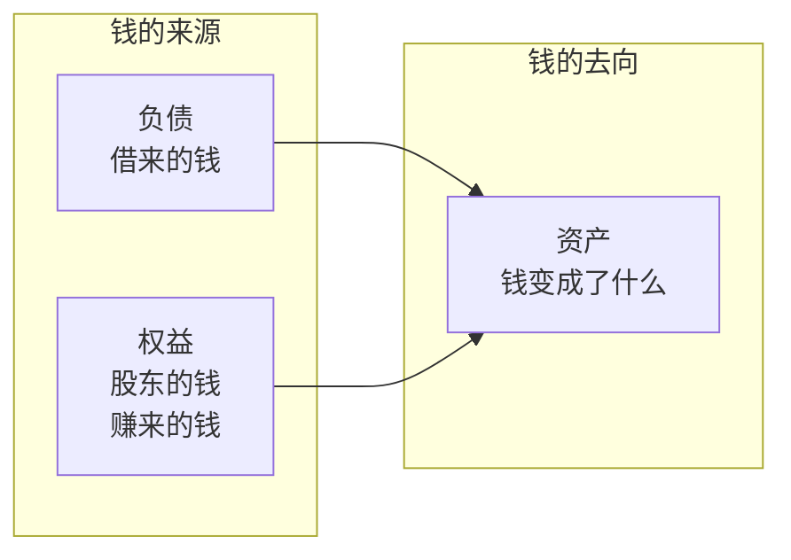

# 资产负债表中的商业模式密码

> 资产负债表是企业在某一时点的"快照"。它告诉你：钱从哪来（负债和权益），钱到哪去（资产）。资产结构直接反映商业模式的重与轻，负债结构揭示企业的财务策略与风险偏好。

---

## 资产负债表的核心等式

```
资产 = 负债 + 所有者权益
```

这个等式背后有一个深刻的商业含义：



**商业问题：** 资产负债表回答的是 —— 这家公司用谁的钱，买了什么东西，来做什么生意？

---

## 资产结构：商业模式的重与轻

### 轻重资产的定义

| 类型   | 总资产中固定资产占比 | 典型行业           | 商业特征               |
| ------ | -------------------- | ------------------ | ---------------------- |
| 重资产 | > 40%                | 制造业、航空、电信 | 高固定成本、高经营杠杆 |
| 中资产 | 20-40%               | 零售、餐饮         | 需要一定资产但非核心   |
| 轻资产 | < 20%                | 互联网、软件、服务 | 低固定成本、高边际利润 |

### 资产结构的商业含义

> **案例：台积电 vs 英伟达 —— 两种半导体商业模式**
>
> | 指标            | 台积电（代工） | 英伟达（设计） |
> | --------------- | -------------- | -------------- |
> | 固定资产/总资产 | 55%+           | 6%             |
> | 毛利率          | 53%            | 70%+           |
> | ROE             | 25%+           | 50%+           |
> | 资本支出/收入   | 35%+           | 3%             |
>
> **商业解读：**
>
> - 台积电是典型的**重资产模式**：需要持续投入巨资建设晶圆厂（一座 3nm 工厂投资超 200 亿美元），但重资产本身就是壁垒——别人拿不出这么多钱
> - 英伟达是典型的**轻资产模式**：只做芯片设计，制造外包给台积电，资产轻意味着扩张快、利润高
>
> **投资启示：** 重资产不是原罪，关键是资产能否产生超额回报。台积电虽然重资产，但 ROE 长期超过 25%，说明资产回报率足够高。**判断重资产好坏的标准是：ROIC（投入资本回报率）是否大于 WACC（加权平均资本成本）。**

### 应收账款：被客户占用的资金

**核心指标：应收账款周转天数 = 应收账款 / 日均收入**

| 周转天数趋势 | 商业含义                       | 信号强度 |
| ------------ | ------------------------------ | -------- |
| 持续下降     | 回款能力增强，产品供不应求     | 积极信号 |
| 保持稳定     | 信用政策稳定，行业惯例         | 中性信号 |
| 持续上升     | 放宽信用政策，回款困难         | 危险信号 |
| 突然跳升     | 可能虚增收入，或大客户出现问题 | 极端危险 |

> **案例：某环保工程公司的应收账款陷阱**
>
> 某环保工程公司（PPP 模式）的应收账款周转天数从 180 天飙升至 400+ 天，但收入仍在增长。表面看是"高增长"，实际上：
>
> - 应收账款增速远超收入增速，说明确认的收入中大量是"白条"
> - 客户主要是地方政府，回款周期越来越长
> - 最终大量应收账款计提坏账，公司陷入亏损
>
> **经验法则：** 如果应收账款增速连续两个季度超过收入增速 20 个百分点以上，就必须深入调查原因。

### 存货：被仓库占用的资金

存货的解读需要结合行业特性：

| 行业     | 存货风险               | 关注指标                 |
| -------- | ---------------------- | ------------------------ |
| 消费电子 | 技术迭代快，存货贬值快 | 存货跌价准备计提是否充分 |
| 白酒     | 存货越放越值钱         | 基酒储量是未来增长的弹药 |
| 服装     | 季节性强，过季贬值严重 | 存货周转天数、库龄结构   |
| 房地产   | 存货就是土地和在建项目 | 存货所在地的市场供需     |

> **案例：小米的存货管理进化**
>
> 2015-2016 年，小米遭遇成立以来最大的危机：手机销量下滑，存货积压严重。背后的商业逻辑是：
>
> - 小米采用"预售+抢购"模式，对供应链的预测能力要求极高
> - 2015 年小米过度乐观，向上游下了过多订单
> - 当销量不达预期时，存货积压导致资金链紧张
>
> 2017 年后，雷军亲自抓供应链管理，建立了更科学的存货预测模型。**存货管理对于硬件公司而言，是生死线。**

---

## 负债结构：财务策略的真相

### 有息负债 vs 无息负债

```
负债 = 有息负债 + 无息负债
```

| 类型     | 构成                             | 商业含义                       |
| -------- | -------------------------------- | ------------------------------ |
| 有息负债 | 银行借款、应付债券               | 需要支付利息，有财务风险       |
| 无息负债 | 应付账款、预收账款、应付职工薪酬 | 占用上下游资金，是竞争力的体现 |

**关键洞察：** 无息负债占比高，说明公司在产业链中地位强势。最典型的是电商平台和大型零售商。

### 预收账款（合同负债）：最优质的负债

预收账款意味着客户先付钱，公司后交货。这不仅是负债，更是**未来收入的先行指标**。

> **案例：茅台 vs 普通白酒企业的预收账款**
>
> | 指标              | 茅台                     | 某二线白酒               |
> | ----------------- | ------------------------ | ------------------------ |
> | 预收账款/季度收入 | 40-60%                   | 5-15%                    |
> | 商业含义          | 经销商抢着打款，排队等货 | 经销商不敢压货，现款现货 |
>
> **预测价值：** 茅台的预收账款变化是预测未来 1-2 个季度收入的最佳先行指标。如果预收账款下降，意味着经销商打款意愿减弱，未来收入大概率承压。

### 有息负债率：杠杆的双刃剑

**有息负债率 = 有息负债 / 总资产**

| 有息负债率 | 商业含义             | 行业示例                   |
| ---------- | -------------------- | -------------------------- |
| < 10%      | 极度保守，几乎不借钱 | 茅台、海天味业             |
| 10-30%     | 适度杠杆，正常经营   | 美的、格力                 |
| 30-50%     | 较高杠杆，需要关注   | 万科、龙湖                 |
| > 50%      | 高杠杆，风险较大     | 恒大(暴雷前)、部分航空公司 |

> **案例：恒大的杠杆游戏**
>
> 2021 年恒大暴雷前，有几个资产负债表上的危险信号：
>
> | 信号                | 具体表现                | 发现时间        |
> | ------------------- | ----------------------- | --------------- |
> | 有息负债率          | 超过 60%                | 2018 年已显现   |
> | 短期借款/长期借款   | 短期借款占比畸高        | 2019 年开始恶化 |
> | 应付账款周转天数    | 从 200 天飙升至 400+ 天 | 2020 年明显异常 |
> | 少数股东权益/净利润 | 少数股东权益异常增长    | 2019 年开始     |
>
> **教训：** 高杠杆本身不可怕，可怕的是**短债长投**（用短期借款做长期投资）。当短期借款占比过高，应付账款周期拉长，就意味着公司正在用尽一切办法维持现金流。

---

## 所有者权益：股东真正拥有的

### 从净资产到"真实净资产"

| 调整项         | 原因                           |
| -------------- | ------------------------------ |
| 商誉           | 并购溢价，可能减值但不能变现   |
| 无形资产       | 品牌、专利等，变现能力不确定   |
| 递延所得税资产 | 未来可能抵扣，但需要未来有利润 |
| 长期股权投资   | 账面价值可能不等于实际价值     |

**真实净资产 = 净资产 - 商誉 - 无形资产（扣除土地使用权） - 虚高的长期股权投资**

---

## 资产负债表的快速诊断清单

1. 固定资产占比多少？公司是重资产还是轻资产？
2. 应收账款增速是否超过收入增速？
3. 存货周转天数是否在恶化？
4. 有息负债率是多少？短期借款占比多少？
5. 预收账款是增长还是下降？
6. 商誉占总资产比例是否过高（> 20%）？
7. 货币资金能否覆盖短期有息负债？
8. 是否存在"存贷双高"（存款和贷款都高）的异常现象？

---

## 小结

资产负债表是企业的"骨骼"。它告诉你：资金结构是稳健还是激进，资产配置是轻还是重，产业链地位是强势还是弱势。**读资产负债表，本质上是在读企业的资源配置策略和风险管理能力。**

---

_下一篇：[现金流量表：企业价值创造的最终裁判](./04-现金流量表与价值创造)_
