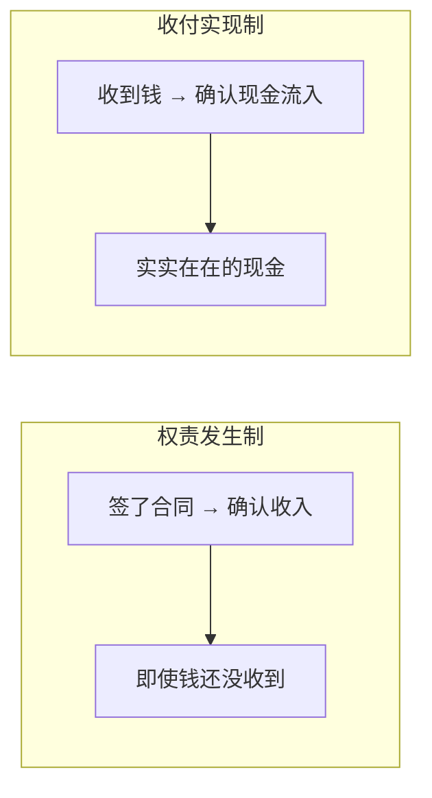

# 现金流量表：企业价值创造的最终裁判

> 利润是"观点"，现金流是"事实"。一家公司可以粉饰利润，但几乎无法粉饰现金流。现金流量表是财报中最诚实的一张表，也是识别企业真实价值创造能力的最有力工具。

---

## 为什么现金流比利润更可靠？

利润表采用的是**权责发生制**（Accrual Basis），而现金流量表采用的是**收付实现制**（Cash Basis）。两者的区别决定了现金流的可靠性：



**核心差异：** 利润表上的"收入"可能只是应收账款（白条），但现金流量表上的"现金流入"必须是真金白银。

---

## 现金流量表的三大板块

```
现金流量表 = 经营活动现金流 + 投资活动现金流 + 筹资活动现金流
```

三个板块分别对应企业的三个核心活动：

| 板块 | 对应活动 | 核心问题 |
|------|---------|---------|
| 经营活动现金流 | 主营业务运转 | 公司靠做生意能赚到现金吗？ |
| 投资活动现金流 | 资本支出与投资 | 公司把钱投到哪里去了？ |
| 筹资活动现金流 | 融资与回报股东 | 公司靠什么方式获取资金？ |

### 八大现金流组合与企业画像

| 经营 | 投资 | 筹资 | 企业画像 | 典型公司 |
|------|------|------|---------|---------|
| + | - | - | 成熟期：主业赚钱，用于投资和还债/分红 | 茅台、苹果 |
| + | - | + | 成长期：主业赚钱，但不够花，还在借钱扩张 | 宁德时代（早期） |
| + | + | - | 成熟期+收缩：主业赚钱，还在变卖资产还债 | 部分转型期企业 |
| + | + | + | 可疑：主业赚钱，还在变卖资产+借钱 | 警惕财务造假 |
| - | - | + | 烧钱期：主业不赚钱，靠融资活着 | 初创公司、京东早期 |
| - | - | - | 危机期：现金只出不进，极度危险 | 恒大暴雷前 |
| - | + | - | 衰退期：主业不赚钱，靠卖资产维持 | 部分传统企业 |
| - | + | + | 转型期：主业不赚钱，变卖资产+借钱转型 | 部分转型企业 |

---

## 经营活动现金流：企业造血能力的试金石

### 核心指标：经营现金流/净利润

**经营现金流/净利润 > 1：** 每赚 1 块钱利润，能收到超过 1 块钱的现金。利润质量高。

**经营现金流/净利润 < 0.5：** 每赚 1 块钱利润，收到的现金不到 5 毛。利润质量堪忧。

> **案例：两家利润相同的公司，不同的现金流质量**
> 
> | 指标 | 公司 A | 公司 B |
> |------|--------|--------|
> | 净利润 | 10 亿 | 10 亿 |
> | 经营性现金流 | 12 亿 | 3 亿 |
> | 经营现金流/净利润 | 1.2 | 0.3 |
> | 应收账款增加 | 1 亿 | 8 亿 |
> | 商业解读 | 利润真实，回款良好 | 利润可能虚增，大量赊销 |
> 
> **判断：** 公司 B 的 10 亿净利润中，有 8 亿变成了应收账款。这 8 亿能否收回来是不确定的。如果未来出现坏账，净利润将被大幅侵蚀。

### 自由现金流：企业真正可支配的钱

**自由现金流 = 经营活动现金流 - 资本支出（购建固定资产、无形资产等）**

自由现金流是企业在维持现有业务规模后，可以自由支配的现金。这是衡量企业价值创造的最核心指标。

> **案例：亚马逊的自由现金流传奇**
> 
> 亚马逊在 2000-2015 年间，净利润长期为负或微利，但自由现金流一直在增长：
> 
> | 年份 | 净利润 | 经营性现金流 | 资本支出 | 自由现金流 |
> |------|--------|-------------|---------|-----------|
> | 2005 | 3.6 亿 | 7.3 亿 | 2 亿 | 5.3 亿 |
> | 2010 | 11.5 亿 | 35 亿 | 9.8 亿 | 25.2 亿 |
> | 2015 | 6 亿 | 119 亿 | 46 亿 | 73 亿 |
> 
> **商业逻辑：** 亚马逊的净利润低是因为大量投资物流、AWS 数据中心（这些投资在利润表上表现为折旧，但不影响现金流）。而自由现金流持续增长，说明这些投资正在产生回报。**贝索斯从 1997 年就告诉股东：不要看净利润，看自由现金流。**

---

## 投资活动现金流：企业战略的现金表达

### 资本支出：增长还是维持？

| 资本支出/折旧 | 商业含义 |
|-------------|---------|
| > 1.5 | 在扩张，对未来有信心 |
| 1.0-1.5 | 维持现有规模，适度扩张 |
| < 1.0 | 维护性投入，可能缩减规模 |
| 持续 < 0.8 | 可能在"吃老本"，设备老化 |

> **案例：京东方 vs 面板行业的投资逻辑**
> 
> 京东方（BOE）的资本支出长期是折旧的 2-3 倍，意味着它在持续建设新的生产线。这种"烧钱"模式让很多投资者避之不及。
> 
> 但从商业逻辑看：面板行业的特点是"逆周期投资"——在行业低谷时投资建厂，在行业高峰时释放产能。京东方的持续投资不是盲目扩张，而是行业规律决定的。
> 
> **判断标准：** 看投资回报 —— 如果资本支出最终转化为收入和利润的增长，投资就是有价值的。

---

## 筹资活动现金流：资本结构的动态调整

### 筹资活动的三大信号

| 行为 | 信号 | 需要关注 |
|------|------|---------|
| 大额借款 | 可能是扩张，也可能是资金紧张 | 结合经营现金流判断 |
| 增发股票 | 稀释现有股东权益 | 融资用途是否合理 |
| 大额分红/回购 | 公司现金充裕，回报股东 | 分红率是否可持续（< 自由现金流） |

---

## 用现金流量表验证利润质量

### 三步验证法

**第一步：经营现金流 vs 净利润**

如果经营现金流长期低于净利润，需要找出原因：

| 可能原因 | 是否正常 |
|---------|---------|
| 应收账款增加 | 可能正常（业务扩张），但需关注坏账风险 |
| 存货增加 | 可能正常（备货），但需关注存货跌价 |
| 应付账款减少 | 正常（加速付款给供应商） |
| 关联方占款 | 不正常，需要深入调查 |

**第二步：自由现金流 vs 利润**

如果自由现金流持续为负，即使净利润为正，公司也可能面临资金链断裂的风险。

**第三步：现金循环周期**

```
现金循环周期 = 存货周转天数 + 应收账款周转天数 - 应付账款周转天数
```

| 现金循环周期 | 商业含义 |
|-------------|---------|
| 负值 | 先收钱后付款，强势地位（如京东、亚马逊） |
| 0-30 天 | 正常水平 |
| 30-90 天 | 需要关注资金效率 |
| > 90 天 | 资金占用严重，可能需要持续融资 |

---

## 现金流量表的快速诊断清单

1. 经营性现金流是正还是负？连续多少年了？
2. 经营现金流/净利润的比值是多少？
3. 自由现金流是否为正？趋势如何？
4. 资本支出/折旧的比值是多少？
5. 现金循环周期是几天？趋势是缩短还是延长？
6. 筹资活动现金流入的来源是什么？（借款还是增发）
7. 期末现金余额是否足以覆盖短期有息负债？
8. 是否存在"大存大贷"的异常现象？

---

## 小结

现金流量表是财报中最诚实的表。**利润可以被操纵，但现金流几乎无法操纵。** 当你发现一家公司利润很高但现金流很差，你几乎可以确定它有问题。自由现金流是衡量企业价值创造的最核心指标，也是巴菲特最看重的指标。

---

*下一篇：[行业报告与商业分析材料的阅读方法论](./05-行业报告与商业分析)*