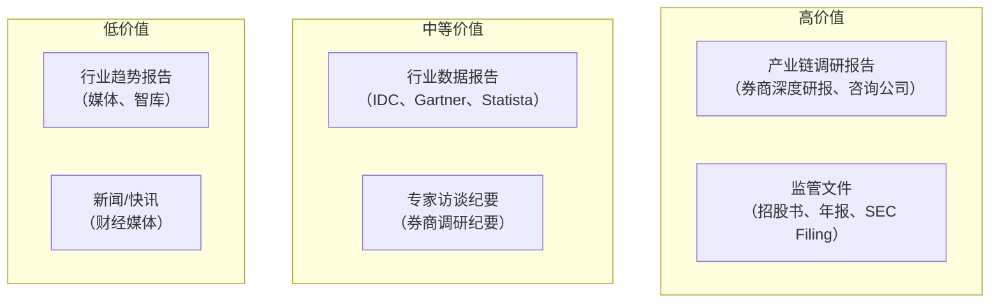
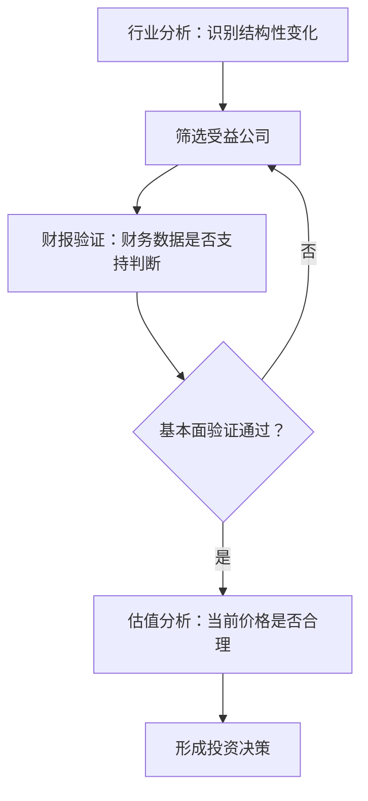

# 行业报告与商业分析材料的阅读方法论

> 行业报告是理解企业外部环境的窗口。但大多数报告是"正确的废话"——数据翔实但缺乏洞察。本文教你如何从海量报告中提取真正有用的商业信号。

---

## 行业报告的类型与价值层级

**核心原则：** 越靠近一手数据源的报告价值越高，越依赖二手加工的报告价值越低。招股书和 SEC Filing 是含金量最高的免费材料，因为它们是法律责任约束下的信息披露。

---

## 阅读行业报告的三步法

### 第一步：建立行业认知框架（问题导向）

在阅读任何报告之前，先建立自己的问题框架：

| 维度     | 核心问题                     | 关键数据来源                 |
| -------- | ---------------------------- | ---------------------------- |
| 市场规模 | 这个行业有多大？增速如何？   | 行业报告、招股书"行业概览"   |
| 竞争格局 | 谁在赚钱？谁在烧钱？         | 上市公司财报对比             |
| 价值链   | 利润集中在哪个环节？         | 产业链各环节毛利率对比       |
| 增长驱动 | 行业为什么增长？能持续多久？ | 渗透率、政策、技术趋势       |
| 进入壁垒 | 新玩家能进来吗？             | 资金门槛、技术壁垒、牌照要求 |

### 第二步：交叉验证数据（怀疑精神）

**单一数据源不可信。** 对于任何关键数据，至少寻找两个独立来源进行交叉验证。

> **案例：共享单车的市场预测陷阱**
>
> 2016-2017 年，多家咨询公司预测中国共享单车市场将达数百亿规模。但实际结果是：
>
> - 市场规模被严重高估（单价低、使用频次不及预期）
> - 竞争格局被低估（门槛低、同质化严重导致价格战）
> - 盈利能力被忽视（报告只关注市场规模，不关注单位经济模型）
>
> **教训：** 行业报告倾向于乐观预测，因为它们的客户（企业）希望看到乐观的数据。**永远不要相信单一来源的市场规模预测。**

### 第三步：从数据到判断（提炼洞察）

数据本身没有价值，价值在于数据揭示的商业信号。读完一份报告，你应该能回答：

1. 这个行业正在发生什么结构性变化？（不是周期性波动）
2. 谁是这个变化的受益者？谁是受损者？
3. 这个变化反映在哪些财务指标上？

---

## 关键信息源的评估与使用

### 招股书（IPO Prospectus）：最有价值的免费材料

招股书是理解一个行业和一个公司的最佳入口。重点关注以下章节：

| 章节                          | 内容                 | 如何使用                       |
| ----------------------------- | -------------------- | ------------------------------ |
| 风险因素（Risk Factors）      | 公司自述的最大风险   | 逆向思考：风险所在就是机会所在 |
| 行业概览（Industry Overview） | 行业定义、规模、趋势 | 建立行业认知的起点             |
| 商业模式（Business Model）    | 公司如何赚钱         | 理解价值创造与捕获             |
| 管理层讨论（MD&A）            | 管理层对经营的解释   | 了解管理层的思维方式和战略方向 |
| 财务数据（Financial Data）    | 近 3-5 年财务数据    | 验证商业模式和成长性           |

### 券商研报：会看门道

券商研报的价值不在于"买入/卖出"评级，而在于：

1. **行业数据：** 券商有专门的行业研究团队，数据通常比媒体可靠
2. **产业链调研：** 券商分析师会实地调研上下游企业
3. **财务模型：** 可以借鉴分析师的财务预测框架

**如何高效阅读券商研报：**

- 跳过开头 30% 的行业背景介绍（通常是模板）
- 跳过"投资建议"和"目标价"（存在利益冲突）
- 重点看：行业数据、竞争格局分析、财务预测的假设条件
- 对于"强烈推荐"的报告，假设作者有仓位

### 行业数据平台

| 平台                                    | 内容               | 适用场景         |
| --------------------------------------- | ------------------ | ---------------- |
| 中国：国家统计局、艾瑞咨询、36 氪研究院 | 行业规模、用户数据 | 互联网、消费行业 |
| 全球：Statista、IDC、Gartner            | 技术趋势、市场份额 | 科技行业         |
| 金融：Wind、东方财富、同花顺            | 财务数据、估值数据 | 所有行业         |
| 产业链：各行业协会、商会                | 上下游数据         | 制造业、消费品   |

---

## 商业分析中的常见陷阱

### 陷阱一：幸存者偏差

看到的永远是成功案例，忽略了大批失败者。当你看到某个行业的"平均增速"时，要问：这个数据包含了已经倒闭的公司吗？

### 陷阱二：相关不等于因果

"过去十年，iPhone 销量增长与全球变暖程度高度正相关。"这显然是荒谬的，但在商业分析中类似的错误比比皆是。

> **案例：啤酒与尿布的故事**
>
> 多年来流传"沃尔玛发现啤酒和尿布放在一起卖会提高销量"的故事。但实际上，这个故事被严重夸大和简化了。**数据分析中，相关性随处可见，但因果性需要严格的实验验证。**

### 陷阱三：锚定效应

第一眼看到的数据会影响后续判断。例如，当你看到"行业规模 1000 亿"后，你会觉得一个 50 亿规模的公司"很小"，尽管 50 亿已经是很大的公司。

**应对策略：** 在看任何数据前，先写下自己的预测，再与实际数据对比。

### 陷阱四：确认偏误

只寻找支持自己观点的信息，忽略反对证据。这在投资分析中尤其危险。

**应对策略：** 强制自己写出三条反对当前投资观点的理由。

---

## 从行业分析到投资决策的转化路径

### 结构性变化 vs 周期性波动

| 特征     | 结构性变化       | 周期性波动       |
| -------- | ---------------- | ---------------- |
| 持续时间 | 5-10 年以上      | 1-3 年           |
| 可逆性   | 不可逆           | 可逆             |
| 驱动力   | 技术、人口、政策 | 供需、库存、情绪 |
| 投资含义 | 长期趋势投资     | 择时交易         |

> **案例：新能源汽车 —— 结构性变化还是周期性波动？**
>
> 2020-2023 年，中国新能源汽车渗透率从 5% 飙升至 35%+。这是典型的结构性变化：
>
> - 技术突破（电池成本下降 90%）→ 不可逆
> - 政策驱动（双积分、补贴）→ 部分可逆但方向确定
> - 消费者认知改变 → 不可逆
>
> 但 2023-2024 年的价格战则是周期性波动：供需失衡导致，会随着行业出清而恢复。

---

## 快速阅读行业报告的诊断清单

1. 这份报告的数据来源是什么？一手还是二手？
2. 市场规模数据的时间节点和统计口径是什么？
3. 竞争格局中 TOP5 企业的市场份额合计多少？
4. 行业增长的主要驱动力是什么？能持续多久？
5. 行业利润最高的环节在哪里？为什么？
6. 报告中的预测是否过于乐观？有对应的悲观情景吗？
7. 这份报告的主要结论与 3 年前有什么不同？
8. 如果报告的结论是错的，最可能的原因是什么？

---

## 小结

行业报告是理解商业世界的工具，不是结论。**好的分析师能从 100 页报告中提取 3 个关键信号，并将其转化为可验证的投资假设。** 核心能力不是"读得多"，而是"问得对"。

---

_下一篇：[财务异常信号识别与投资决策转化](./06-财务异常识别与投资决策)_
