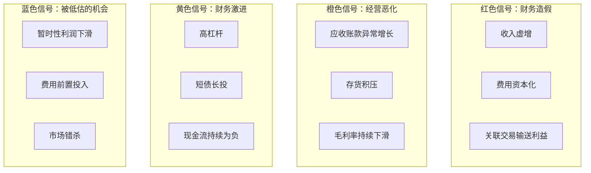
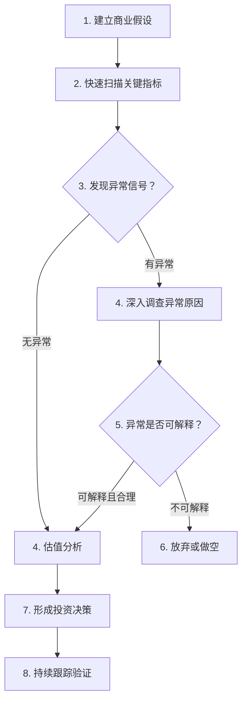

# 财务异常信号识别与投资决策转化

> 优秀的投资者不是预测未来，而是识别异常。财务异常信号是市场在告诉你"这里有问题"——问题可能是机会，也可能是陷阱。关键在于识别、验证和判断。

---

## 财务异常信号分类体系

我将财务异常信号分为四类，每类对应不同的商业含义和行动策略：



---

## 红色信号：财务造假

### 信号一：收入与现金流严重背离

**识别方法：** 收入持续高增长，但经营性现金流为负或远低于净利润。

| 指标                  | 正常范围 | 危险范围         |
| --------------------- | -------- | ---------------- |
| 经营现金流/净利润     | 0.8-1.5  | < 0.3 或持续为负 |
| 应收账款增速/收入增速 | 0.8-1.2  | > 1.5            |

> **案例：瑞幸咖啡的财务造假（2019）**
>
> 2019 年，浑水（Muddy Waters）发布做空报告，指出瑞幸咖啡存在系统性的收入造假。报告中的关键证据：
>
> | 异常信号     | 具体表现                                          |
> | ------------ | ------------------------------------------------- |
> | 单店日均销售 | 瑞幸公布 400+ 件，浑水实地调查仅 263 件           |
> | 客单价       | 瑞幸公布 11.2 元，浑水调查仅 9.97 元              |
> | 广告费用     | 瑞幸公布 3.36 亿，浑水通过 CTR 数据测算仅 1.59 亿 |
> | 其他产品收入 | 夸大 400%+                                        |
>
> **启示：** 浑水不是靠分析财报发现的造假，而是通过**实地调研**（雇佣 92 名全职和 1,418 名兼职人员，录了 11,260 小时的门店视频）验证了财务数据与商业现实的差距。**财务造假无法通过财务分析本身发现，必须结合商业逻辑和实地验证。**

### 信号二：异常的毛利率

**识别方法：** 毛利率远高于行业平均水平，且没有合理的商业解释。

| 毛利率异常 | 可能的解释               | 验证方法                 |
| ---------- | ------------------------ | ------------------------ |
| 远高于同行 | 真正的竞争优势（定价权） | 看品牌力、客户忠诚度     |
| 远高于同行 | 财务造假（少计成本）     | 看存货、应付账款是否异常 |
| 远高于同行 | 关联交易（利益输送）     | 看关联交易占比           |

> **案例：某农业公司的毛利率异常**
>
> 某农业上市公司毛利率长期维持在 40%+，而行业平均仅 15-20%。公司解释为"技术优势"，但：
>
> - 存货周转天数远超同行（说明产品并不抢手）
> - 应收账款持续增长（说明客户不急着付款）
> - 关联交易占比高（向关联方高价销售）
>
> **三者叠加，基本可以确定存在问题。** 农业行业的毛利率异常是财务造假的重灾区。

### 信号三：存贷双高

**识别方法：** 公司账上有大量现金，同时又有大量借款。

| 场景     | 商业解释                       | 危险程度 |
| -------- | ------------------------------ | -------- |
| 跨国经营 | 海外资金无法汇回，国内需要借款 | 低       |
| 行业特性 | 如房地产行业，项目公司独立核算 | 中       |
| 财务造假 | 账面现金是假的（虚构或受限）   | 高       |

> **案例：康得新（2019 年暴雷）**
>
> 康得新账上显示有 150 亿现金，但无法偿还 15 亿到期债券。事后调查发现，150 亿现金中大部分是虚构的或已被大股东占用。
>
> **"存贷双高"是财务造假最常见的信号之一。** 正常的商业逻辑是：如果账上有大量现金，为什么要借高息贷款？除非账上的现金是假的。

---

## 橙色信号：经营恶化

### 信号一：应收账款增长失控

**经验法则：** 如果连续两个季度，应收账款增速超过收入增速 20 个百分点以上，必须深入调查。

### 信号二：毛利率持续下滑

毛利率的持续下滑通常意味着竞争壁垒在削弱：

| 毛利率下滑原因 | 商业含义           | 应对策略               |
| -------------- | ------------------ | ---------------------- |
| 原材料涨价     | 行业性成本压力     | 看是否具有成本转嫁能力 |
| 产品降价       | 竞争加剧，打价格战 | 看是否为暂时性策略     |
| 产品结构变化   | 低毛利产品占比提升 | 看是否为战略调整       |

### 信号三：存货周转恶化

存货周转天数持续上升，且存货跌价准备计提不足，是经营恶化的重要信号。

---

## 黄色信号：财务激进

### 信号一：高杠杆 + 现金流恶化

高杠杆本身不是问题，但高杠杆叠加现金流恶化，就是危险信号。

**判断公式：**

```
短期有息负债 / 经营性现金流 > 2 → 危险
```

意味着公司需要两年的经营现金流才能偿还短期债务。一旦经营现金流下降，公司将面临流动性危机。

### 信号二：短债长投

用短期借款做长期投资（如建设工厂、并购），是财务管理的大忌。当短期借款到期时，长期投资尚未产生回报，公司只能借新还旧，一旦信贷收紧，就会断裂。

---

## 蓝色信号：被低估的机会

### 机会一：暂时性利润下滑

当公司利润因非经常性原因下滑，但核心竞争力未受损时，可能是买入机会。

> **案例：茅台 2013-2014 年的机会**
>
> 2013-2014 年，受"三公消费"限制和塑化剂事件影响，茅台股价大幅下跌，PE 最低跌至 10 倍以下。
>
> | 时间      | 市场情绪                         | 商业现实                           |
> | --------- | -------------------------------- | ---------------------------------- |
> | 2013-2014 | 恐慌：政务消费消失，白酒行业完蛋 | 茅台品牌力未受损，民间消费正在替代 |
> | 2015-2016 | 怀疑：茅台还能增长吗？           | 民间消费需求爆发，供需缺口扩大     |
> | 2017-2020 | 狂热：茅台永远涨                 | 茅台成为"信仰股"                   |
>
> **启示：** 市场经常把"暂时性利润下滑"当成"永久性衰退"。区分两者的关键是：**公司的核心竞争壁垒是否受损？**

### 机会二：前置费用投入期

当公司大量投入研发、市场拓展，导致当期利润被压缩，但这部分投入会在未来产生回报时，市场可能会低估公司价值。

> **案例：亚马逊 AWS 的投入期**
>
> 2006-2014 年，亚马逊在 AWS 上持续投入，但 AWS 一直不单独披露利润。市场只看到亚马逊的零售业务利润率低，却忽略了 AWS 巨大的潜在价值。
>
> 2015 年，亚马逊首次单独披露 AWS 的财务数据，市场才发现 AWS 的经营利润率高达 25%+。亚马逊股价随之大涨。

---

## 从财务分析到投资决策的完整流程



### 投资决策矩阵

| 财务质量              | 估值水平   | 投资决策         |
| --------------------- | ---------- | ---------------- |
| 高（无异常，现金牛）  | 低（低估） | 重仓买入         |
| 高（无异常，现金牛）  | 高（高估） | 持有或减仓       |
| 中（有黄色信号）      | 低（低估） | 小仓位，深入研究 |
| 中（有黄色信号）      | 高（高估） | 回避             |
| 低（有橙色/红色信号） | 任何估值   | 回避或做空       |

---

## 快速诊断清单

1. 经营现金流/净利润是否 > 0.8？
2. 应收账款增速是否超过收入增速 20%+？
3. 毛利率与行业平均的差距是否有合理商业解释？
4. 是否存在"存贷双高"？
5. 存货周转天数是否在恶化？
6. 短期有息负债/经营性现金流是否 > 2？
7. 非经常性损益占净利润比例是否 > 30%？
8. 如果明天股价腰斩，你愿意加仓吗？

---

## 小结

财务异常信号是市场送给投资者的礼物——它告诉你"这里需要关注"。**关键在于区分信号的真伪：真信号可能导致投资损失，假信号可能创造投资机会。** 区分真伪的唯一方法是：回到商业逻辑，用商业常识验证财务数据。

---

_下一篇：[0 成本 AI 工作流：金融信息采集与分析自动化](./07-零成本AI金融分析工作流)_
