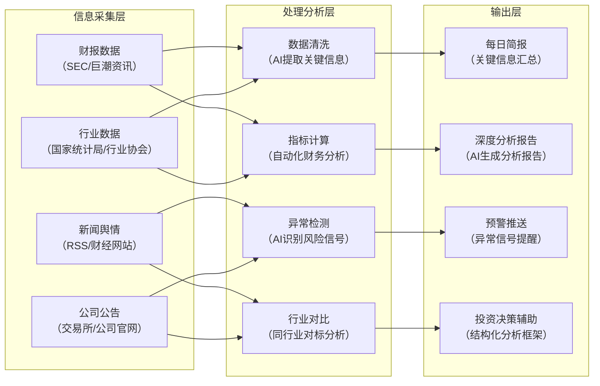
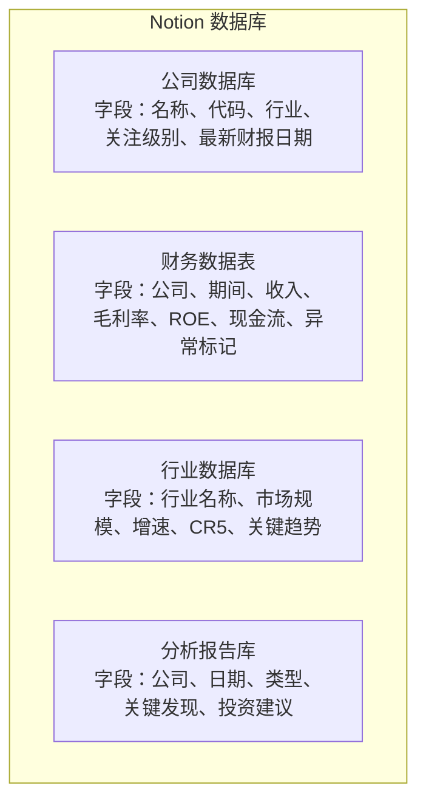
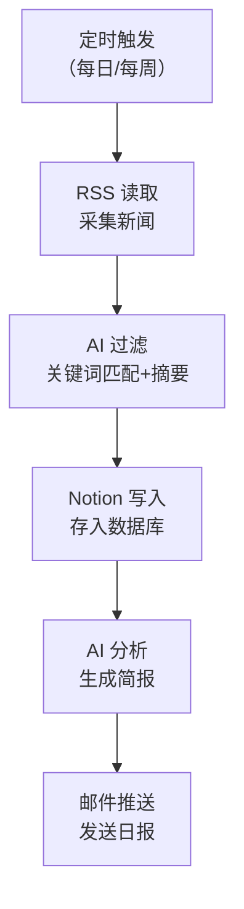
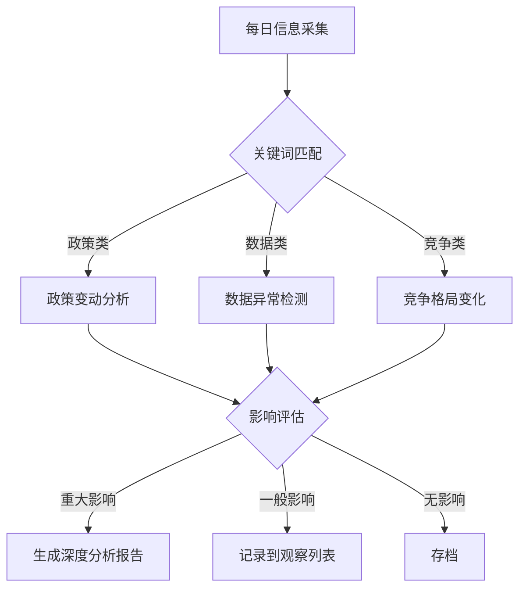

# 0成本AI工作流：金融信息采集与分析自动化

> 本文提供一套完整的"0成本AI金融分析工作流"实施方案。所有工具均为免费或提供免费额度，无需任何编程基础即可搭建，覆盖从信息采集到分析报告生成的全流程。

---

## 一、工作流总体架构



---

## 二、工具选型与配置（0成本方案）

### 2.1 核心AI工具

| 工具 | 用途 | 免费额度 | 获取方式 |
|------|------|---------|---------|
| **DeepSeek** | 财务分析、报告生成、异常检测 | 完全免费，无限制 | deepseek.com |
| **Kimi (月之暗面)** | 长文档分析（财报、招股书） | 免费，支持 20 万字上下文 | kimi.moonshot.cn |
| **通义千问** | 多模态分析（财报截图、图表） | 免费，100 万 Token/天 | tongyi.aliyun.com |
| **豆包 (字节跳动)** | 新闻摘要、舆情分析 | 免费 | doubao.com |
| **智谱清言 (ChatGLM)** | 数据分析、代码生成 | 免费 | chatglm.cn |

### 2.2 信息采集工具

| 工具 | 用途 | 免费额度 | 获取方式 |
|------|------|---------|---------|
| **Feedly** | RSS 订阅行业新闻 | 免费版 100 个源 | feedly.com |
| **Inoreader** | RSS 订阅 + 关键词过滤 | 免费版 150 个源 | inoreader.com |
| **Google Alerts** | 关键词监控（公司名、行业术语） | 完全免费 | google.com/alerts |
| **SEC EDGAR** | 美股财报、招股书 | 完全免费 | sec.gov/edgar |
| **巨潮资讯网** | A 股财报、公告 | 完全免费 | cninfo.com.cn |
| **东方财富网** | 财报数据、行业数据 | 完全免费 | eastmoney.com |
| **国家统计局** | 宏观经济数据 | 完全免费 | stats.gov.cn |

### 2.3 自动化与集成工具

| 工具 | 用途 | 免费额度 | 获取方式 |
|------|------|---------|---------|
| **Notion** | 知识库管理、数据分析存储 | 免费版够用 | notion.so |
| **飞书文档** | 数据存储、团队协作 | 免费版够用 | feishu.cn |
| **Google Sheets** | 财务数据表格、自动计算 | 完全免费 | sheets.google.com |
| **IFTTT** | 自动化触发器（新闻→邮件） | 免费版 5 个 Applet | ifttt.com |
| **Zapier** | 自动化工作流 | 免费版 100 任务/月 | zapier.com |
| **n8n（自部署）** | 高级自动化工作流 | 开源免费，需自部署 | n8n.io |
| **GitHub Actions** | 定时任务调度 | 免费 2000 分钟/月 | github.com |

---

## 三、分阶段实施计划

### 第一阶段：基础搭建（第 1-2 周）

**目标：** 建立信息采集渠道和基础分析模板。

#### 步骤 1：建立信息采集体系

**1.1 配置 RSS 订阅源**

在 Feedly 或 Inoreader 中订阅以下类别的 RSS 源：

**金融投资类：**
- 华尔街见闻（wallstreetcn.com）
- 雪球热门（xueqiu.com）
- 36氪（36kr.com）
- 财新网（caixin.com）

**行业数据类：**
- 国家统计局数据发布
- 各行业协会官网
- IDC / Gartner 中国区报告摘要

**公司公告类：**
- 巨潮资讯网（cninfo.com.cn）—— A 股公告
- SEC EDGAR —— 美股 Filing
- 港交所披露易 —— 港股公告

**1.2 配置 Google Alerts**

为每个关注的公司设置关键词监控：

```
关键词格式：
- "[公司名] + 财报"
- "[公司名] + 收购"
- "[公司名] + 高管"
- "[行业名] + 趋势"
- "[行业名] + 政策"
```

**1.3 创建 Notion 数据库**

创建以下数据库结构：



#### 步骤 2：建立分析模板

**2.1 创建财报快速分析 Prompt**

在 DeepSeek 或 Kimi 中创建以下分析模板：

```
你是一位资深财务分析师。请基于以下财报数据进行分析：

## 分析框架
1. 收入质量：收入增速 vs 应收账款增速是否匹配？
2. 利润质量：经营现金流/净利润的比值是否健康？
3. 资产质量：应收账款和存货是否有异常变化？
4. 负债风险：有息负债率、短期借款占比是否合理？
5. 成长性：收入增速的驱动力是什么？

## 异常信号检查清单
- [ ] 应收账款增速 > 收入增速 20%+
- [ ] 经营现金流/净利润 < 0.5
- [ ] 毛利率持续下滑超过 3 个季度
- [ ] 存贷双高
- [ ] 短期有息负债/经营现金流 > 2

## 请输出
1. 关键发现（3-5 条）
2. 异常信号（如有）
3. 需要进一步验证的问题
4. 初步投资建议（关注/持有/回避）
```

**2.2 创建行业分析 Prompt**

```
你是一位行业研究分析师。请基于以下信息进行分析：

## 行业分析框架
1. 行业规模与增速（近 3 年趋势）
2. 竞争格局（CR5 与变化趋势）
3. 价值链分析（利润集中在哪个环节）
4. 增长驱动力（技术/政策/消费趋势）
5. 进入壁垒（资金/技术/牌照/品牌）

## 请输出
1. 行业所处阶段（导入期/成长期/成熟期/衰退期）
2. 3 个最值得关注的公司及理由
3. 3 个最大的风险因素
4. 未来 3 年的关键观察指标
```

---

### 第二阶段：自动化流程（第 3-4 周）

**目标：** 实现关键流程的半自动化。

#### 步骤 3：搭建自动化信息采集

**3.1 使用 IFTTT 实现新闻推送**

创建以下 Applet：

| 触发条件 | 动作 | 说明 |
|---------|------|------|
| RSS 新文章（关键词匹配） | 发送到 Email | 重要新闻实时推送 |
| RSS 新文章（关键词匹配） | 保存到 Google Sheets | 新闻归档 |
| Google Alerts 新提醒 | 发送到 Email | 公司/行业动态 |

**3.2 使用 GitHub Actions 定时采集数据**

创建 `.github/workflows/finance-collector.yml`：

```yaml
name: 财报数据采集
on:
  schedule:
    - cron: '0 8 * * 1-5'  # 工作日每天 8:00 UTC
  workflow_dispatch:  # 手动触发

jobs:
  collect:
    runs-on: ubuntu-latest
    steps:
      - name: 采集关注公司的最新财报日期
        run: |
          # 使用 curl 或 Python 脚本采集数据
          # 将结果保存为 JSON 或 CSV
          echo "数据采集完成"
      
      - name: 发送邮件通知
        uses: dawidd6/action-send-mail@v3
        with:
          subject: 财报更新提醒
          body: 以下公司发布了最新财报...
          to: your-email@example.com
```

**3.3 使用 n8n 搭建分析工作流（可选，进阶）**

对于有技术能力的用户，可以使用 n8n 搭建更复杂的自动化流程：



---

### 第三阶段：深度分析与优化（第 5-8 周）

**目标：** 建立系统化的分析能力和持续优化机制。

#### 步骤 4：建立行业分析系统

**4.1 确定关键信息采集源与监测指标**

**金融行业关键监测指标：**

| 监测维度 | 指标 | 数据来源 | 更新频率 |
|---------|------|---------|---------|
| 货币政策 | LPR、MLF 利率、存款准备金率 | 央行官网 | 月度 |
| 市场流动性 | Shibor、国债收益率 | 中国货币网 | 每日 |
| 信贷数据 | 社融规模、M2 增速 | 央行 | 月度 |
| 银行经营 | 净息差、不良率、拨备覆盖率 | 银保监会 | 季度 |
| 资本市场 | IPO 数量、融资额、换手率 | 交易所 | 每日 |

**互联网行业关键监测指标：**

| 监测维度 | 指标 | 数据来源 | 更新频率 |
|---------|------|---------|---------|
| 用户增长 | MAU、DAU、用户时长 | 公司财报、QuestMobile | 季度 |
| 商业化 | ARPU、广告加载率、付费率 | 公司财报 | 季度 |
| 竞争格局 | 市场份额、用户重叠度 | 第三方报告 | 半年度 |
| 政策监管 | 反垄断、数据安全、内容审核 | 监管机构公告 | 不定期 |
| 技术趋势 | AI 大模型进展、云计算渗透率 | 行业报告 | 季度 |

**4.2 设计行业变动识别机制**



**行业变动分类标准：**

| 级别 | 定义 | 触发条件 | 行动 |
|------|------|---------|------|
| 红色 | 结构性改变 | 行业规则变更、龙头公司危机 | 立即深度分析 |
| 橙色 | 趋势性变化 | 连续 3 个月数据偏离趋势 | 周度跟踪 |
| 黄色 | 周期性波动 | 单月数据异常 | 月度复盘 |
| 蓝色 | 常规信息 | 正常范围内的波动 | 存档备查 |

#### 步骤 5：构建分析报告自动生成框架

**5.1 日报模板**

```
# 每日金融简报 - {日期}

## 一、宏观要闻
- {AI 从新闻中提取的关键宏观信息}

## 二、行业动态
### 重点关注行业
- {行业名称}：{关键动态}

## 三、公司公告
- {公司名称}：{公告类型} - {AI 摘要}

## 四、数据异动
- {指标名称}：{当前值} vs {预期值}，变动 {百分比}

## 五、今日关注
- {需要深入分析的事项}
```

**5.2 周报模板**

```
# 每周分析报告 - {周次}

## 一、市场回顾
- 本周主要指数表现
- 行业涨跌幅排名

## 二、关注公司更新
| 公司 | 本周事件 | 财务影响 | 评级变化 |
|------|---------|---------|---------|
| ... | ... | ... | ... |

## 三、异常信号跟踪
- 出现异常的公司及具体表现

## 四、下周关注
- 即将发布的财报
- 重要政策/事件
- 重点观察公司

## 五、持仓评估
- 当前持仓分析
- 调整建议
```

**5.3 深度分析报告模板**

```
# {公司名称} 深度分析报告

## 一、商业模式解读
- 价值主张
- 收入来源
- 成本结构
- 竞争优势

## 二、市场环境分析
- 行业规模与增速
- 竞争格局
- 政策环境
- 技术趋势

## 三、财务分析
### 3.1 收入与利润
### 3.2 资产负债表
### 3.3 现金流量表
### 3.4 异常信号检查

## 四、估值分析
- 相对估值（PE/PB/PS 与同行对比）
- 绝对估值（DCF 关键假设）
- 估值区间判断

## 五、投资价值评估
- 核心优势
- 主要风险
- 催化剂
- 投资建议
```

---

## 四、AI 使用技巧与最佳实践

### 4.1 Prompt 工程指南

**原则一：结构化输入**

不好的 Prompt：
> "帮我分析一下茅台的财报"

好的 Prompt：
> "请基于以下框架分析茅台 2023 年年报：
> 1. 收入质量（收入增速 vs 应收增速）
> 2. 利润质量（经营现金流/净利润）
> 3. 关键先行指标（预收账款变化）
> 4. 与五粮液、泸州老窖的对比
> 5. 异常信号检查
> [附财报数据]"

**原则二：设定分析角色**

在 Prompt 开头加上角色设定，显著提升输出质量：

> "你是一位拥有 15 年经验的消费行业分析师，专注于白酒行业。你的分析风格是：先看商业逻辑，再用财务数据验证。请用巴菲特式的语言风格进行分析..."

**原则三：要求具体输出格式**

> "请按以下格式输出：
> 1. 3 个最重要的发现（每个不超过 50 字）
> 2. 1 个最需要关注的异常信号
> 3. 1 个需要进一步验证的问题
> 4. 用 1-10 分给这家公司打分（商业模式/财务质量/成长性/估值）"

### 4.2 多工具协同策略

| 分析场景 | 推荐工具 | 使用方式 |
|---------|---------|---------|
| 长财报分析（100 页+） | Kimi | 上传 PDF，逐章节提问 |
| 财务数据计算 | DeepSeek | 上传 Excel/CSV，要求计算指标 |
| 图表分析（财报截图） | 通义千问 | 上传截图，提取关键数据 |
| 新闻舆情分析 | 豆包 | 提供新闻链接，要求摘要 |
| 代码/数据处理 | DeepSeek | 要求生成 Python 脚本 |
| 报告撰写 | DeepSeek / Kimi | 提供数据和分析框架 |

### 4.3 参数设置指南

**DeepSeek 参数建议：**

| 参数 | 推荐值 | 说明 |
|------|-------|------|
| 温度（Temperature） | 0.3-0.5 | 财务分析需要精确性，不宜过高 |
| 最大 Token | 4096-8192 | 足够生成完整分析报告 |
| 系统提示词 | 设定专业角色 | 显著提升输出质量 |

---

## 五、质量控制与结果优化

### 5.1 信息质量验证机制

**三层验证法：**

1. **来源验证：** 信息是否来自一手来源（财报、监管文件）还是二手加工？
2. **交叉验证：** 同一数据是否有至少两个独立来源确认？
3. **逻辑验证：** 数据是否符合商业常识？（如毛利率 90% 的制造业公司需警惕）

### 5.2 AI 输出质量检查清单

每次使用 AI 分析后，进行以下检查：

- [ ] AI 引用的数据是否准确？（抽查关键数字）
- [ ] AI 的结论是否有数据支撑？（不能只有观点没有数据）
- [ ] AI 是否遗漏了重要信息？（对比原始材料）
- [ ] AI 的分析逻辑是否自洽？（检查推理链条）
- [ ] AI 是否过度乐观或悲观？（检查情感倾向）

### 5.3 持续优化策略

**每周复盘：**
- 本周 AI 分析中哪些结论被验证了？哪些被推翻了？
- 哪些 Prompt 效果好？哪些需要修改？
- 是否有新的信息源需要加入？

**月度校准：**
- 异常信号预警的准确率如何？
- 分析报告的质量是否在提升？
- 是否需要调整工具组合？

---

## 六、日常维护与更新机制

### 6.1 日常操作流程（每日 30 分钟）

| 时间 | 任务 | 工具 | 耗时 |
|------|------|------|------|
| 08:30 | 查看 AI 生成的简报 | Email/Notion | 5 分钟 |
| 08:35 | 快速浏览 RSS 头条 | Feedly | 10 分钟 |
| 08:45 | 标记需要深入分析的事项 | Notion | 5 分钟 |
| 盘中 | 关注异常波动 | 东方财富 App | 随需 |
| 20:00 | AI 深度分析重点事项 | DeepSeek/Kimi | 10 分钟 |

### 6.2 每周维护（每周 2 小时）

- 更新公司数据库（新财报、新公告）
- 检查 RSS 订阅源是否有效
- 优化 AI Prompt
- 撰写周报

### 6.3 月度维护（每月 4 小时）

- 全面复盘分析结论的准确性
- 更新行业数据和监测指标
- 调整关注公司列表
- 优化自动化工作流

### 6.4 季度维护（每季度 8 小时）

- 深度更新所有关注公司的财务模型
- 重新评估行业趋势和竞争格局
- 更新 AI 分析模板和 Prompt
- 评估工具使用效果，替换无效工具

---

## 七、进阶：开源工具链替代方案

对于有一定技术背景的用户，可以使用以下开源工具替代商业产品：

| 商业工具 | 开源替代 | 部署方式 |
|---------|---------|---------|
| Feedly | FreshRSS / Miniflux | 自部署（VPS 或 Docker） |
| Notion | AppFlowy / Outline | 自部署 |
| Zapier | n8n / Huginn | 自部署 |
| Google Sheets | NocoDB / Grist | 自部署 |
| 商业 AI | Ollama + 开源模型（Qwen/DeepSeek） | 本地部署 |

**全套自部署方案成本：**

| 资源 | 方案 | 月度成本 |
|------|------|---------|
| VPS 服务器 | 阿里云/腾讯云轻量应用服务器 | 约 50-100 元 |
| 域名 | .com 域名 | 约 5 元/月（年付 60 元） |
| AI 模型 | DeepSeek 免费 API / Ollama 本地 | 0 元 |
| 总计 | | 约 55-105 元/月 |

---

## 小结

这套"0成本AI金融分析工作流"的核心思想是：**用 AI 处理重复性、结构化的信息处理工作，释放你的时间去做真正的商业判断。** AI 是一个强大的分析助手，但最终的商业判断和投资决策，仍然需要人类的商业直觉和批判性思维。

记住：**AI 负责"分析"，你负责"判断"。**

---

*本系列完。*
*返回首页阅读更多文章。*