# 计算机组成原理 · 考研核心知识点详解

> 以下内容严格覆盖 408 考研大纲全部核心知识点，每个模块均配备详细 Mermaid 图表，格式参照协议流程图标准。
> 所有流程图均标注核心字段、状态流转与关键机制，末尾附综合实战工作流串联全部知识点。

---

## 全流程综合实战工作流：从开机到程序运行（CPU 视角）

以下时序图以 **按下电源键** 为起点，串联 **BIOS 启动 → 取指 → 译码 → 执行 → 存储器访问 → Cache 命中/缺失 → 中断处理 → I/O 操作** 全链路。覆盖计组五大核心模块（数据表示、存储层次、指令系统、CPU 数据通路、总线与 I/O），体现"硬件协同工作"的完整视图。

图中每一阶段都标注了关键硬件部件、数据流向、控制信号与考研核心考点，各阶段之间通过系统总线自然衔接。

```mermaid
sequenceDiagram
    participant Power as 电源
    participant BIOS as BIOS ROM
    participant CPU as CPU(控制器+数据通路)
    participant REG as 寄存器堆
    participant ALU as ALU
    participant MMU as MMU
    participant Cache as Cache(L1/L2/L3)
    participant MEM as 主存(DRAM)
    participant BUS as 系统总线
    participant IO as I/O接口
    participant DISK as 磁盘

    rect rgba(220, 230, 255, 0.4)
    Note over Power,BIOS: ["===== 阶段0：开机引导（BIOS → POST → 加载OS）====="]
    Power->>Power: 上电，电源稳定后发POWERGOOD信号
    Note over CPU: CPU复位，CS:IP=FFFF:0000<br/>实模式，寻址1MB空间
    CPU->>BIOS: 从FFFF0H取第一条指令(jmp)
    BIOS->>BIOS: POST自检：CPU/内存/芯片组
    Note over BIOS: 检测显卡BIOS(C000:0000)<br/>初始化中断向量表(IVT)<br/>设置BIOS数据区(BDA)
    BIOS->>DISK: INT 13H 读取启动扇区(MBR)
    DISK-->>BIOS: 加载MBR到0000:7C00H
    Note over BIOS: 检查0x55AA签名<br/>跳转到0x7C00执行
    Note over CPU: Bootloader加载OS内核<br/>实模式→保护模式<br/>设置GDT/IDT，开启分页
    end

    rect rgba(240, 248, 255, 0.4)
    Note over CPU,REG: ["===== 阶段1：取指 IF（Instruction Fetch）====="]
    Note over CPU: 冯·诺依曼结构：<br/>程序指令与数据存储在同一内存<br/>按地址顺序取指执行
    CPU->>REG: PC→MAR（程序计数器送地址寄存器）
    Note over REG: PC指向下一条指令地址<br/>x86: EIP/RIP<br/>ARM: R15(PC)
    REG->>BUS: MAR→地址总线(AB)
    Note over BUS: 地址总线单向输出<br/>数据总线双向传输<br/>控制总线发读信号(MEMR#)
    BUS->>MEM: 地址选通，MEMR#有效
    Note over MEM: 存储体按地址译码<br/>选中对应存储单元
    MEM-->>BUS: 数据→数据总线(DB)
    BUS-->>REG: 数据→MDR（存储器数据寄存器）
    REG->>REG: MDR→IR（指令寄存器）
    Note over REG: IR存放当前指令：<br/>操作码(OP)+地址码(ADDR)<br/>如：MOV AX, [1000H]
    CPU->>REG: PC+1→PC（指向下一条）
    end

    rect rgba(248, 240, 255, 0.4)
    Note over CPU,ALU: ["===== 阶段2：译码 ID（Instruction Decode）====="]
    REG->>CPU: IR→控制器(指令译码器)
    Note over CPU: 硬布线控制器：<br/>组合逻辑电路直接译码<br/>速度快，但修改困难<br/>微程序控制器：<br/>逐条取微指令执行<br/>灵活，但速度较慢
    CPU->>CPU: 译码器分析操作码
    Note over CPU: 根据操作码产生：<br/>1. 微操作控制信号序列<br/>2. ALU功能选择信号<br/>3. 寄存器读写使能<br/>4. 存储器读写控制
    CPU->>REG: 读取源操作数寄存器
    Note over REG: 寻址方式分析：<br/>立即寻址：操作数在指令中<br/>寄存器寻址：操作数在R中<br/>直接寻址：EA=指令地址码<br/>间接寻址：EA=(指令地址码)<br/>变址寻址：EA=(IX)+A<br/>基址寻址：EA=(BR)+A<br/>相对寻址：EA=(PC)+A
    end

    rect rgba(255, 248, 240, 0.4)
    Note over CPU,ALU: ["===== 阶段3：执行 EX（Execute）====="]
    CPU->>ALU: 操作数A和B送入ALU输入端
    Note over ALU: ALU核心部件：<br/>- 加法器(先行进位CLA)<br/>- 逻辑运算单元(AND/OR/XOR)<br/>- 移位器(桶形移位器)<br/>- 状态标志寄存器(FLAGS)
    ALU->>ALU: 执行运算操作
    Note over ALU: 运算类型：<br/>算术：ADD/SUB/MUL/DIV<br/>逻辑：AND/OR/XOR/NOT<br/>移位：SHL/SHR/SAL/SAR<br/>比较：CMP（做减法，仅置标志）
    ALU->>REG: 结果写入目的寄存器
    Note over REG: 设置标志位：<br/>CF(进位), ZF(零), SF(符号)<br/>OF(溢出), PF(奇偶), AF(辅助)
    Note over CPU: 单周期CPU：一条指令一个时钟<br/>多周期CPU：指令分多个时钟<br/>流水线CPU：多条指令重叠执行
    end

    rect rgba(255, 240, 245, 0.4)
    Note over CPU,MEM: ["===== 阶段4：访存 MEM（Memory Access）====="]
    Note over CPU: LOAD/STORE指令需要访存<br/>如：MOV AX, [BX+1000H]
    CPU->>REG: 计算有效地址EA
    Note over REG: EA = (BX) + 1000H<br/>先送MAR，再发读写命令
    REG->>MMU: MAR→MMU(逻辑地址)
    Note over MMU: 若启用分页：<br/>逻辑地址→线性地址→物理地址<br/>段式：段基址+偏移<br/>页式：页号+页内偏移
    MMU->>Cache: 物理地址→Cache查找
    end

    rect rgba(240, 255, 248, 0.4)
    Note over CPU,Cache: ["===== 阶段5：Cache 命中/缺失（存储层次关键）====="]
    Note over Cache: Cache结构：<br/>Tag(标记) + Index(索引) + Offset(块内偏移)<br/>直接映射：固定位置，冲突多<br/>组相联：N路组内，折中方案<br/>全相联：任意位置，硬件开销大
    alt Cache命中(Hit)
        Cache-->>REG: 数据返回(1~2个时钟周期)
        Note over Cache: 命中率取决于：<br/>局部性原理(时间+空间)<br/>块大小、相联度、替换算法
    else Cache缺失(Miss)
        Note over Cache: Cache缺失处理流程：<br/>1. 暂停CPU(Stall)<br/>2. 分配Cache行
        Cache->>MEM: 从主存读取数据块
        Note over MEM: 读一个Cache块<br/>如64字节，需多总线周期<br/>支持突发传输(Burst)
        MEM-->>Cache: 返回数据块(几十~上百周期)
        Note over Cache: 3. 选择替换位置<br/>LRU：淘汰最久未用<br/>FIFO：淘汰最早进入<br/>随机：随机选择<br/>4. 更新Tag和有效位<br/>5. 若脏块需先写回(写回法)
        Cache-->>REG: 返回所需数据
    end
    Note over Cache: 写策略：<br/>写穿(Write-Through)：同时写Cache和主存<br/>写回(Write-Back)：仅写Cache，换出时写回<br/>写分配(Write-Allocate)：缺失时先调入再写<br/>非写分配(No-Write-Allocate)：直接写主存
    end

    rect rgba(245, 250, 240, 0.4)
    Note over CPU,BUS: ["===== 阶段6：流水线执行（五段流水）====="]
    Note over CPU: 经典五段流水线：<br/>IF → ID → EX → MEM → WB
    CPU->>CPU: IF: 取指（Instruction Fetch）
    Note over CPU: IF段：PC→IMEM, 指令→IF/ID锁存器
    CPU->>CPU: ID: 译码/取数（Decode/RegRead）
    Note over CPU: ID段：译码+读寄存器<br/>数据→ID/EX锁存器
    CPU->>CPU: EX: 执行（Execute）
    Note over CPU: EX段：ALU运算<br/>结果→EX/MEM锁存器
    CPU->>CPU: MEM: 访存（Memory）
    Note over CPU: MEM段：读/写数据存储器<br/>数据→MEM/WB锁存器
    CPU->>CPU: WB: 写回（Write Back）
    Note over CPU: WB段：结果写回寄存器堆
    Note over CPU: 流水线冒险：<br/>结构冒险：硬件资源冲突<br/>数据冒险：RAW/WAR/WAW<br/>控制冒险：分支/跳转指令
    end

    rect rgba(255, 250, 240, 0.4)
    Note over CPU,IO: ["===== 阶段7：中断处理（Interrupt Handling）====="]
    Note over CPU: 中断源：外部中断(INTR/NMI)<br/>内部异常(除法错/缺页/断点)<br/>软中断(INT n指令)
    IO->>CPU: 外设发出中断请求(INTR)
    Note over CPU: CPU响应中断条件：<br/>1. 当前指令执行完毕<br/>2. IF=1(开中断)<br/>3. 无更高优先级中断
    CPU->>CPU: 中断响应周期
    Note over CPU: 硬件自动完成：<br/>1. FLAGS压栈<br/>2. 关中断(IF=0, TF=0)<br/>3. CS:IP压栈（断点保护）<br/>4. 查中断向量表<br/>   中断类型号×4→向量地址<br/>5. 加载ISR入口地址→CS:IP
    CPU->>CPU: 执行中断服务程序(ISR)
    Note over CPU: ISR流程：<br/>1. 保护现场(PUSH regs)<br/>2. 开中断(STI)(允许嵌套)<br/>3. 处理中断事件<br/>4. 关中断(CLI)<br/>5. 发EOI(结束中断)<br/>6. 恢复现场(POP regs)<br/>7. IRET(返回断点)
    end

    rect rgba(248, 255, 248, 0.4)
    Note over CPU,DISK: ["===== 阶段8：DMA 与 I/O 操作====="]
    Note over CPU: I/O方式演进：<br/>程序查询→中断→DMA→通道
    Note over CPU: DMA方式：外设与主存直接交换数据<br/>CPU仅参与开始和结束
    CPU->>IO: CPU设置DMA控制器
    Note over IO: 设置参数：<br/>源地址/目标地址<br/>传输字节数<br/>传输方向(读/写)
    IO->>BUS: DMA请求总线(HOLD)
    CPU->>BUS: CPU响应(HLDA)，释放总线
    Note over BUS: DMA控制器接管总线<br/>周期窃取(Cycle Stealing)<br/>或 突发传输(Burst)
    IO->>MEM: DMA控制器→地址总线+控制信号
    DISK-->>MEM: 数据直接传输(磁盘→内存)
    Note over IO: 传输完成，DMA发中断
    IO->>CPU: 中断通知CPU传输完成
    Note over CPU: CPU处理DMA完成中断<br/>检查传输状态，继续执行
    end
```

---

## 前置概览：计组知识体系拓扑

```mermaid
graph TB
    subgraph 应用层
        APP["应用程序<br/>高级语言→汇编→机器码"]
    end

    subgraph 指令系统架构
        ISA[""指令集架构 ISA<br/>CISC(x86) vs RISC(ARM/MIPS)""]
        ADDR["寻址方式<br/>立即/直接/间接/寄存器/变址/基址/相对/堆栈"]
    end

    subgraph CPU核心
        CU["控制器<br/>硬布线/微程序"]
        DP["数据通路<br/>ALU+寄存器堆+总线"]
        PIPE["流水线<br/>IF/ID/EX/MEM/WB<br/>冒险与转发"]
    end

    subgraph 存储层次
        REG["寄存器堆<br/>最快，最小"]
        CACHE["Cache<br/>L1/L2/L3<br/>SRAM"]
        MEM["主存 DRAM<br/>DDR4/DDR5"]
        DISK["外存<br/>SSD/HDD"]
        VM["虚拟存储器<br/>页表+TLB"]
    end

    subgraph 数据表示
        NUM["数值表示<br/>原码/反码/补码/移码"]
        FLOAT["IEEE 754浮点<br/>符号+阶码+尾数"]
        ALU_UNIT["ALU<br/>加法器/乘法器/移位器"]
    end

    subgraph I/O系统
        BUS["系统总线<br/>地址/数据/控制"]
        IOIF["I/O接口<br/>端口/寄存器"]
        DMA_CTRL["DMA控制器<br/>直接存储器访问"]
        INTR["中断系统<br/>向量/优先级/嵌套"]
    end

    APP --> ISA
    ISA --> CU
    ISA --> DP
    CU --> DP
    DP --> PIPE
    REG --> CACHE --> MEM --> DISK
    NUM --> ALU_UNIT --> DP
    FLOAT --> ALU_UNIT
    DP --> BUS
    BUS --> IOIF
    IOIF --> DMA_CTRL
    IOIF --> INTR
    VM --> MEM
    CACHE --> VM
```

---

──[ 一 ]──[ 计算机系统概述 ]

### 1.1 冯·诺依曼结构

:::important
**#[C|冯·诺依曼计算机]** 的核心思想是**存储程序**：将程序指令和数据预先存入主存，CPU 自动逐条取出执行。
:::

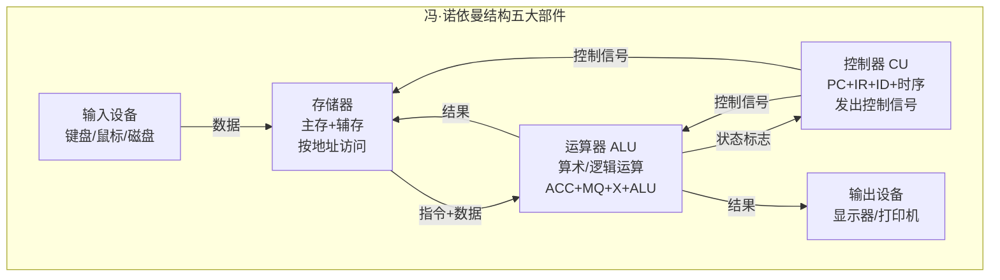

**冯·诺依曼结构特点**：

| 特点 | 说明 |
|------|------|
| **#[C|存储程序]** | 指令和数据以二进制形式存放在同一存储器中 |
| **#[C|按地址访问]** | 存储器按地址顺序线性编址 |
| **#[C|指令顺序执行]** | 默认 PC+1 顺序执行，遇转移指令才跳转 |
| **#[C|二进制编码]** | 指令和数据均用二进制表示 |
| **#[C|五大部件]** | 运算器、控制器、存储器、输入设备、输出设备 |

:::warning
**#[R|冯·诺依曼瓶颈]**：CPU 与存储器之间只有一条通路，指令和数据共享总线，造成"存储墙"问题。现代计算机采用哈佛结构（指令和数据分开存储）或 Cache 分级来缓解。
:::

### 1.2 计算机性能指标

| 指标 | 公式 | 含义 |
|------|------|------|
| **#[C|CPU 主频]** | $f = 1/T$ | 时钟频率，单位 Hz |
| **#[C|CPI]** | $CPI = \frac{\text{总时钟周期数}}{\text{IC}}$ | 每条指令平均时钟周期数 |
| **#[C|MIPS]** | $MIPS = \frac{f}{CPI \times 10^6}$ | 每秒百万条指令 |
| **#[C|MFLOPS]** | $MFLOPS = \frac{\text{浮点操作次数}}{10^6 \times T}$ | 每秒百万次浮点运算 |
| **#[C|CPU 执行时间]** | $T_{CPU} = IC \times CPI \times T_c$ | 总执行时间 |
| **#[C|IPC]** | $IPC = 1/CPI$ | 每时钟周期执行指令数 |

:::note
**CPU 执行时间公式推导**：
$$T_{CPU} = \frac{\text{指令数}}{\text{程序}} \times \frac{\text{时钟周期数}}{\text{指令}} \times \frac{\text{秒}}{\text{时钟周期}} = IC \times CPI \times T_c$$

**#[Y|CPI 是关键]**：CPI 受指令集、编译器、CPU 微架构共同影响。
:::

### 1.3 计算机层次结构

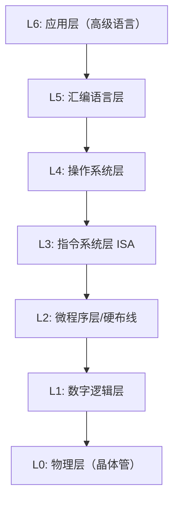

- **透明性**：下层对上层透明，ISA 是软硬件接口。
- **翻译**（高级→汇编→机器码）与**解释**（微程序逐条解释机器指令）。

---

──[ 二 ]──[ 数据的表示与运算 ]

### 2.1 进制转换

| 转换类型 | 方法 |
|----------|------|
| 二→八 | 3位一组，高位补零 |
| 二→十六 | 4位一组，高位补零 |
| 十→二 | 整数：除2取余倒排；小数：乘2取整顺排 |
| 二→十 | 按权展开求和 |

:::note
**常用对照**：$(1100)_2 = (12)_{10} = (C)_{16}$，$(1010)_2 = (10)_{10} = (A)_{16}$
:::

### 2.2 机器数表示

#### 原码 / 反码 / 补码 / 移码

```mermaid
graph TD
    subgraph 四种机器数表示
        SM[""原码<br/>[+0"]=0000, [-0]=1000<br/>符号位+绝对值<br/>加减需判断符号"]
        OC[""反码<br/>[+0"]=0000, [-0]=1111<br/>正数同原码，负数按位取反<br/>用于补码过渡"]
        TC[""补码<br/>[+0"]=[-0]=0000<br/>取反+1，统一0的表示<br/>加减法统一，电路简单"]
        BS[""移码<br/>补码符号位取反<br/>用于浮点数阶码<br/>便于比较大小""]
    end
    SM --> OC --> TC
    TC --> BS
```

**补码核心公式**：

对于 n 位（含符号位）定点整数：
$$[x]_{补} = \begin{cases} x & 0 \leq x < 2^{n-1} \\ 2^n + x & -2^{n-1} \leq x < 0 \end{cases}$$

:::important
**#[C|补码运算]**：
- 加法：$[x+y]_{补} = [x]_{补} + [y]_{补} \pmod{2^n}$
- 减法：$[x-y]_{补} = [x]_{补} + [-y]_{补}$
- **#[Y|符号位参与运算]**，进位丢弃
- **#[R|溢出判断]**：双符号位法（00=正，11=负，01=上溢，10=下溢）或 进位判断法（$C_n \oplus C_{n-1} = 1$ 溢出）
:::

**移码**：$[x]_{移} = 2^{n-1} + x$（$x$ 为真值），即补码符号位取反。

### 2.3 IEEE 754 浮点数

```mermaid
graph LR
    subgraph IEEE 754 单精度32位
        S[""S(1bit)<br/>符号""] --> E[""E(8bit)<br/>阶码(移码, 偏置127)""]
        E --> M[""M(23bit)<br/>尾数(原码, 隐含1)""]
    end
```

| 项目 | 单精度(32bit) | 双精度(64bit) |
|------|---------------|---------------|
| 符号位 S | 1 bit | 1 bit |
| 阶码 E | 8 bit (偏置127) | 11 bit (偏置1023) |
| 尾数 M | 23 bit (隐含1.M) | 52 bit (隐含1.M) |
| 真值 | $(-1)^S \times 1.M \times 2^{E-127}$ | $(-1)^S \times 1.M \times 2^{E-1023}$ |

**特殊值**：

| E | M | 含义 |
|----|-----|------|
| 全0 | 全0 | $\pm 0$ |
| 全0 | 非0 | 非规格化数 |
| 全1 | 全0 | $\pm \infty$ |
| 全1 | 非0 | NaN（非数） |

:::warning
**#[R|浮点数加减步骤]**：
1. **对阶**：小阶向大阶对齐（阶差 $\Delta E$，尾数右移）
2. **尾数加减**：按定点运算
3. **规格化**：左规/右规，调整阶码
4. **舍入**：0舍1入 / 恒置1 / 截断
5. **溢出判断**：阶码溢出则上溢/下溢

**#[Y|对阶时可能丢失精度]**（尾数右移时低位丢失）
:::

### 2.4 ALU（算术逻辑单元）

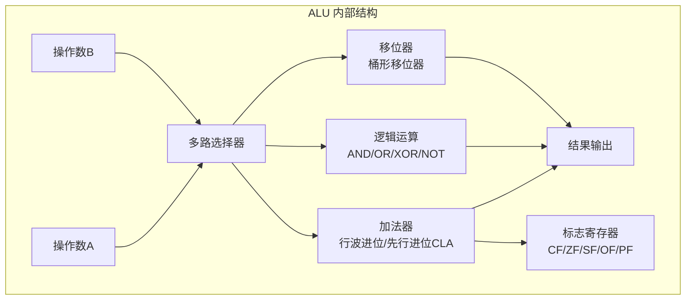

**加法器设计**：

| 类型 | 进位方式 | 延迟 | 特点 |
|------|----------|------|------|
| 串行进位（行波进位） | 逐级传递 | $O(n)$ | 简单，速度慢 |
| **#[C|先行进位 CLA]** | 并行产生 | $O(\log n)$ | 速度快，电路复杂 |
| 成组先行进位 | 组内CLA+组间串行 | 折中 | 实际 CPU 常用 |

**并行进位公式**：
- 进位产生：$G_i = A_i \cdot B_i$
- 进位传递：$P_i = A_i \oplus B_i$
- 进位输出：$C_{i+1} = G_i + P_i \cdot C_i$

### 2.5 定点乘法与除法

**定点乘法（原码一位乘）**：

| 步骤 | 操作 |
|------|------|
| 1 | 符号位：$S_P = S_X \oplus S_Y$ |
| 2 | 绝对值相乘（移位相加） |
| 3 | 乘数最低位=1 → 加被乘数，右移一位 |
| 4 | 乘数最低位=0 → 不加，右移一位 |
| 5 | 重复 n 次（n 位数值位） |

**定点除法（原码恢复余数法/加减交替法）**：

| 方法 | 特点 |
|------|------|
| 恢复余数法 | 试商→不够减则恢复余数，效率低 |
| **#[C|加减交替法]** | 不够减时左移后加除数，无需恢复，效率高 |

---

──[ 三 ]──[ 存储器层次结构 ]

### 3.1 存储层次概览

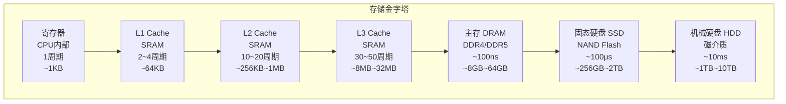

**局部性原理**：
- **#[C|时间局部性]**：刚被访问的数据/指令很快会被再次访问（循环）
- **#[C|空间局部性]**：被访问单元附近的单元将很快被访问（数组、顺序执行）

### 3.2 半导体存储器对比

| 类型 | 存储元 | 刷新 | 速度 | 功耗 | 集成度 | 用途 |
|------|--------|------|------|------|--------|------|
| **SRAM** | 双稳态触发器(6管) | 不需要 | 快 | 大 | 低 | Cache |
| **DRAM** | 电容(1管) | 需要(2ms) | 慢 | 小 | 高 | 主存 |
| **ROM** | 熔丝/二极管 | 不需要 | - | - | - | 固化程序 |
| **Flash** | 浮栅晶体管 | 不需要 | 较慢 | 低 | 很高 | SSD/U盘 |

:::note
**DRAM 刷新方式**：
- 集中刷新：一段时间集中刷新所有行（有"死区"）
- 分散刷新：每个读写周期后刷新一行（无死区，但慢）
- 异步刷新：在固定间隔内刷新一行（常用）
:::

**存储器容量扩展**：

| 扩展方式 | 连接方式 | 效果 |
|----------|----------|------|
| **#[C|位扩展]** | 地址线并联，数据线各自独立 | 增加字长（如 1K×1bit → 1K×8bit） |
| **#[C|字扩展]** | 数据线并联，高位地址译码选片 | 增加字数（如 1K×8 → 4K×8） |
| **#[C|字位扩展]** | 两者结合 | 同时增加字数和字长 |

### 3.3 Cache 详解

#### Cache 映射方式

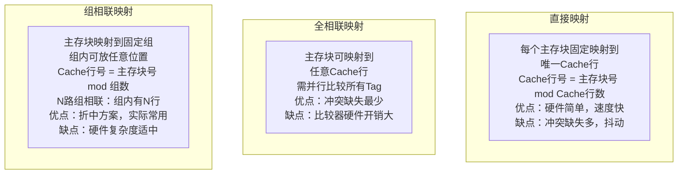

**Cache 地址分解**：

| 映射方式 | 地址分解 |
|----------|----------|
| 直接映射 | Tag \| Cache行号(Index) \| 块内偏移(Offset) |
| 全相联 | Tag \| 块内偏移(Offset) |
| 组相联 | Tag \| 组号(Index) \| 块内偏移(Offset) |

**Cache 容量计算**：
$$\text{Cache总容量} = \text{行数} \times (\text{Tag位} + \text{有效位} + \text{脏位} + \text{数据块大小})$$

#### 替换算法

| 算法 | 原理 | 特点 |
|------|------|------|
| **#[C|随机 RAND]** | 随机选择替换块 | 简单，命中率不稳定 |
| **#[C|FIFO]** | 替换最早进入的块 | 简单，不反映局部性 |
| **#[C|LRU]** | 替换最久未使用的块 | 近似最优，硬件开销大 |
| **#[C|LFU]** | 替换最不常用的块 | 需计数器，可能有历史效应 |
| **伪LRU** | 树形PLRU近似 | 实际常用，开销小 |

#### 写策略

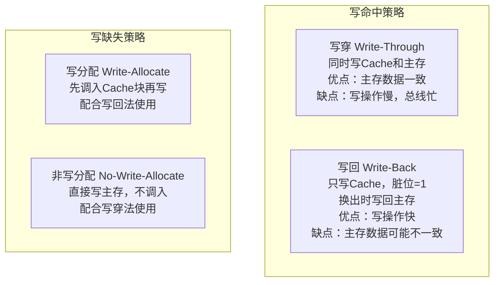

:::warning
**#[Y|典型组合]**：
- 写穿 + 非写分配（简单，一致性高）
- 写回 + 写分配（性能高，实际常用）
:::

#### 多级 Cache

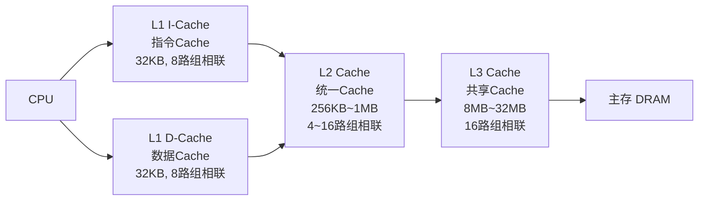

**多级 Cache 性能分析**：
$$AMAT = L1_{hit\_time} + L1_{miss\_rate} \times L1_{miss\_penalty}$$
$$L1_{miss\_penalty} = L2_{hit\_time} + L2_{miss\_rate} \times L2_{miss\_penalty}$$

:::important
**#[C|AMAT]**（Average Memory Access Time）是衡量存储层次性能的核心指标。
:::

### 3.4 虚拟存储器

#### 页表与 TLB

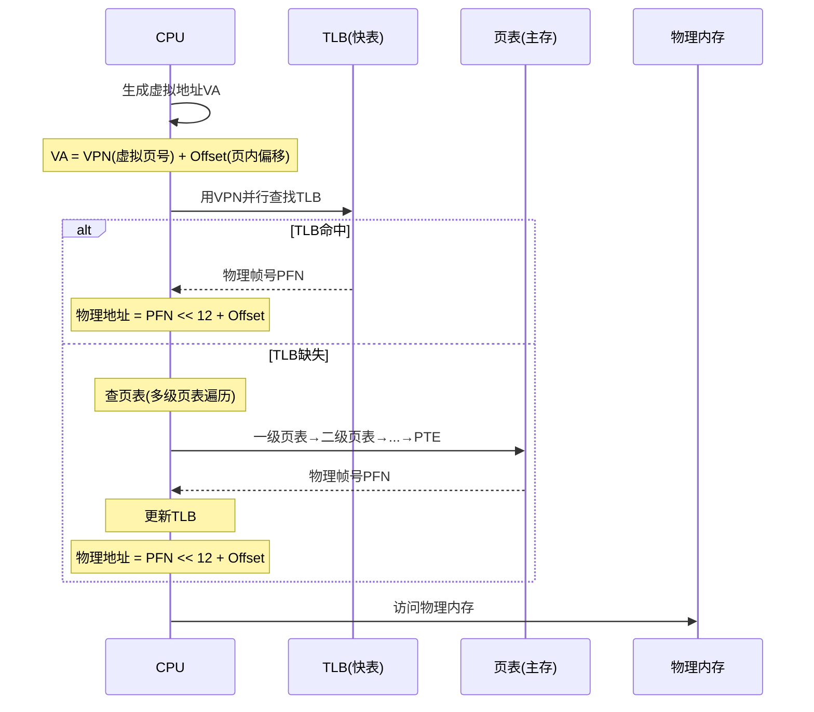

**页表项（PTE）结构**：

| 字段 | 含义 |
|------|------|
| 物理帧号 PFN | 物理页框号 |
| 有效位 P | 1=在内存，0=在外存 |
| 修改位 D | 1=被修改过（脏页） |
| 访问位 A | 1=最近被访问 |
| 保护位 | R/W/X 权限 |
| 缓存禁止 PCD | 是否可缓存 |

:::note
**TLB（Translation Lookaside Buffer）** 是页表的专用 Cache，存放最近使用的页表项。TLB 缺失时需硬件页表遍历（Page Table Walk）或软件处理。
:::

**多级页表**：将页表分页存放，只需当前使用的页表部分在内存中，节省内存。以 x86-64 为例，四级页表：PML4 → PDPT → PD → PT → 物理页。

---

──[ 四 ]──[ 指令系统 ]

### 4.1 指令格式

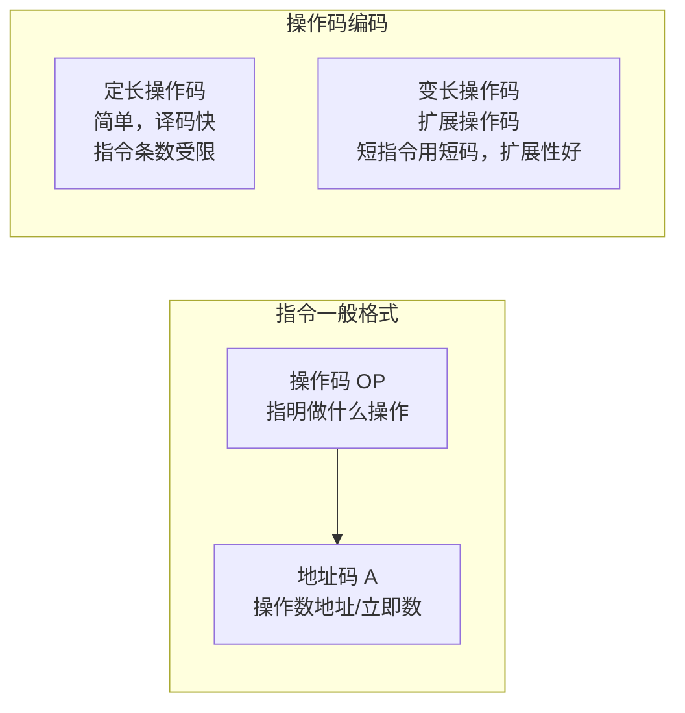

**扩展操作码设计**：

| 指令类型 | 操作码 | 特点 |
|----------|--------|------|
| 三地址 | `OP dst, src1, src2` | 最灵活，指令长 |
| 二地址 | `OP dst, src`（`dst = dst OP src`） | 常用，x86 风格 |
| 一地址 | `OP src`（`ACC = ACC OP src`） | 隐含累加器 |
| 零地址 | `OP`（操作数隐含在栈顶） | 堆栈计算机 |

### 4.2 寻址方式

```mermaid
graph TD
    subgraph 常用寻址方式
        IMM[""立即寻址<br/>操作数=指令中的立即数<br/>最快，但数据固定""]
        REG[""寄存器寻址<br/>操作数在寄存器中<br/>速度快，无需访存""]
        DIR[""直接寻址<br/>EA=指令地址码<br/>一次访存""]
        IND[""间接寻址<br/>EA=(指令地址码)<br/>多次访存，灵活""]
        IDX[""变址寻址<br/>EA=(IX)+A<br/>适合数组访问<br/>IX可自增/自减""]
        BASE[""基址寻址<br/>EA=(BR)+A<br/>适合程序重定位<br/>BR由OS设置""]
        PC_REL[""相对寻址<br/>EA=(PC)+A<br/>适合转移指令<br/>位置无关代码""]
        STACK[""堆栈寻址<br/>操作数在栈顶<br/>PUSH/POP隐含""]
    end
```

:::important
**#[C|有效地址 EA]** 计算公式汇总：

| 寻址方式 | EA 公式 | 访存次数 |
|----------|---------|----------|
| 立即寻址 | 操作数在指令中 | 0 |
| 寄存器寻址 | $R_i$ | 0 |
| 直接寻址 | $EA = A$ | 1 |
| 间接寻址 | $EA = (A)$ | 2+ |
| 变址寻址 | $EA = (IX) + A$ | 1 |
| 基址寻址 | $EA = (BR) + A$ | 1 |
| 相对寻址 | $EA = (PC) + A$ | 1 |
| 堆栈寻址 | 栈顶隐含 | 1 |
:::

### 4.3 CISC vs RISC

```mermaid
graph TD
    subgraph CISC
        C1[""复杂指令集<br/>x86架构""]
        C2["指令数量多，格式多样"]
        C3[""指令长度可变(1~15字节)""]
        C4["支持多种寻址方式"]
        C5["微程序控制为主"]
        C6["一条指令完成复杂功能"]
        C7["编译器简单"]
        C8["CPI较大，难以流水化"]
        C1 --> C2 --> C3 --> C4 --> C5 --> C6 --> C7 --> C8
    end
    subgraph RISC
        R1[""精简指令集<br/>ARM/MIPS/RISC-V""]
        R2["指令数量少，格式统一"]
        R3[""指令定长(32bit)""]
        R4[""仅Load/Store访存""]
        R5["硬布线控制为主"]
        R6["一条指令一个基本操作"]
        R7["编译器优化要求高"]
        R8["CPI≈1，易流水化"]
        R1 --> R2 --> R3 --> R4 --> R5 --> R6 --> R7 --> R8
    end
```

| 对比维度 | CISC | RISC |
|----------|------|------|
| 指令数量 | 多（x86有~1000+条） | 少（~100条） |
| 指令长度 | 变长（1~15字节） | 定长（4字节） |
| 寻址方式 | 多种，可访存 | 仅Load/Store访存 |
| 控制器 | 微程序 | 硬布线 |
| 寄存器 | 少（x86: 8个通用） | 多（MIPS: 32个通用） |
| 流水线 | 困难，CPI高 | 容易，CPI≈1 |
| 编译器 | 简单 | 复杂（需优化） |
| 典型代表 | x86/x86-64 | ARM, MIPS, RISC-V |

---

──[ 五 ]──[ 中央处理器 CPU ]

### 5.1 数据通路

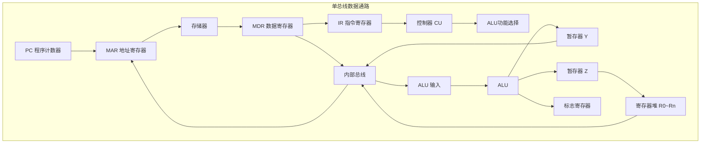

**单周期 vs 多周期 vs 流水线**：

| 类型 | 时钟周期 | CPI | 特点 |
|------|----------|-----|------|
| **#[C|单周期]** | 最长指令的执行时间 | 1 | 简单，但时钟周期长，效率低 |
| **#[C|多周期]** | 基本操作时间 | >1 | 不同指令不同周期数，效率提升 |
| **#[C|流水线]** | 流水级延迟+寄存器开销 | 理想≈1 | 多条指令重叠执行，吞吐率高 |

### 5.2 控制器设计

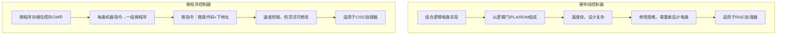

**微指令格式**：

| 格式 | 特点 | 代表 |
|------|------|------|
| **#[C|水平型]** | 每位控制一个微操作，并行度高，微指令长 | 速度快 |
| **#[C|垂直型]** | 编码表示，需译码，微指令短 | 类似机器指令 |

**微程序控制器的组成**：
- 控存 CM（Control Memory）：存放微程序
- 微指令寄存器 $\mu$IR
- 微地址形成电路
- 微地址寄存器 $\mu$AR

### 5.3 流水线技术

#### 经典五段流水线


**流水线性能指标**：

| 指标 | 公式 |
|------|------|
| 吞吐率 TP | $TP = \frac{n}{(k+n-1)\Delta t}$（n 条指令，k 段） |
| 加速比 S | $S = \frac{k \cdot n \cdot \Delta t}{(k+n-1)\Delta t} = \frac{k \cdot n}{k+n-1}$ |
| 效率 E | $E = \frac{n}{k+n-1}$ |

#### 流水线冒险

```mermaid
graph TD
    subgraph 结构冒险
        SA[""硬件资源冲突<br/>如：IF和MEM同时访存<br/>解决：指令/数据Cache分离<br/>即哈佛结构""]
    end
    subgraph 数据冒险
        RA[""RAW 先写后读<br/>最常见<br/>如：ADD R1,R2; SUB R3,R1<br/>解决：转发Forwarding/旁路<br/>或插入气泡NOP""]
        WA[""WAR 先读后写<br/>乱序执行时出现<br/>反相关""]
        WB[""WAW 先写后写<br/>乱序执行时出现<br/>输出相关""]
    end
    subgraph 控制冒险
        CA[""分支/跳转指令<br/>PC不确定，暂停流水线<br/>解决：<br/>1. 静态预测(总不跳/总跳)<br/>2. 动态预测(BTB/BHT)<br/>3. 延迟分支<br/>4. 提前计算分支目标""]
    end
```

:::warning
**#[R|数据冒险详解]**：

```
ADD R1, R2, R3   ; R1 = R2 + R3
SUB R4, R1, R5   ; R4 = R1 - R5  ← 依赖R1的新值
```

在流水线中，SUB 的 ID 段与 ADD 的 WB 段同时，R1 的值尚未写回。解决方案：
- **#[C|转发（Forwarding）]**：将 EX/MEM 或 MEM/WB 的结果直接作为 ALU 输入
- **#[C|插入气泡（Stall）]**：暂停流水线一个周期
:::

#### 超标量与动态调度

| 技术 | 描述 |
|------|------|
| **#[C|超标量]** | 多个相同流水线并行，每周期发射多条指令 |
| **#[C|超流水线]** | 进一步细分流水段，提高时钟频率 |
| **#[C|VLIW]** | 编译器静态调度，长指令字包含多个操作 |
| **#[C|动态调度]** | 硬件乱序执行（Tomasulo算法），Scoreboard记分板 |
| **#[C|寄存器重命名]** | 消除 WAR 和 WAW 伪相关 |

**Tomasulo 算法核心部件**：
- 保留站（Reservation Station）：缓冲操作数
- 公共数据总线 CDB（Common Data Bus）：广播结果
- 重排序缓冲 ROB（Re-Order Buffer）：保证精确异常

---

──[ 六 ]──[ 总线与I/O ]

### 6.1 系统总线

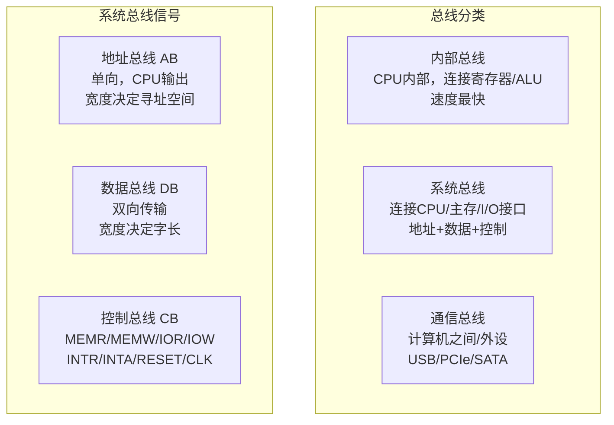

**总线性能指标**：

| 指标 | 含义 |
|------|------|
| 总线宽度 | 数据线位数，一次传输的位数 |
| 总线频率 | 总线时钟频率 |
| 总线带宽 | $B = \text{宽度} \times \text{频率}$（bps） |
| 总线周期 | 一次总线操作的时间 |

### 6.2 总线仲裁

```mermaid
graph TD
    subgraph 集中式仲裁
        CHAIN[""菊花链查询<br/>设备串行连接<br/>近CPU优先级高<br/>简单，但公平性差""]
        COUNTER[""计数器定时查询<br/>计数器轮询设备号<br/>可编程控制优先级<br/>灵活性好""]
        INDEP[""独立请求<br/>每个设备有BR/BG线<br/>仲裁器决定优先级<br/>响应最快，线多""]
    end
    subgraph 分布式仲裁
        DIST[""各设备自己判断<br/>无需中央仲裁器<br/>如：PCI总线仲裁""]
    end
```

### 6.3 I/O 方式演进

```mermaid
sequenceDiagram
    participant CPU as CPU
    participant IO as I/O接口
    participant DEV as 外设

    rect rgba(220, 230, 255, 0.4)
    Note over CPU,DEV: ["===== 程序查询方式 ====="]
    CPU->>IO: 读状态寄存器
    IO-->>CPU: 状态：未就绪
    CPU->>CPU: 循环等待(轮询)
    Note over CPU: CPU与外设完全串行<br/>CPU利用率极低
    CPU->>IO: 读状态寄存器
    IO-->>CPU: 状态：就绪
    CPU->>IO: 读/写数据寄存器
    end

    rect rgba(240, 248, 255, 0.4)
    Note over CPU,DEV: ["===== 中断方式 ====="]
    CPU->>CPU: CPU执行其他程序
    DEV->>IO: 外设就绪，发中断请求
    IO->>CPU: INTR信号
    Note over CPU: CPU响应中断<br/>保护现场→执行ISR<br/>→恢复现场→返回
    CPU->>IO: 读/写数据
    Note over CPU: CPU与外设部分并行<br/>每字节/字中断一次
    end

    rect rgba(255, 248, 240, 0.4)
    Note over CPU,DEV: ["===== DMA方式 ====="]
    CPU->>IO: 设置DMA控制器<br/>源地址/目标地址/字节数
    CPU->>CPU: CPU继续执行程序
    IO->>CPU: DMA请求(HOLD)
    CPU->>IO: DMA响应(HLDA)<br/>CPU释放总线
    IO->>DEV: 数据直接传输<br/>外设↔主存
    Note over IO: 周期窃取/突发传输<br/>CPU与DMA交替访存
    IO->>CPU: 传输完成中断
    Note over CPU: 仅块首尾CPU干预<br/>CPU与外设高度并行
    end
```

**I/O 方式对比**：

| 方式 | CPU干预 | 数据传输 | 适用场景 | 特点 |
|------|---------|----------|----------|------|
| **#[C|程序查询]** | 全程轮询 | CPU | 极简单系统 | 串行，效率最低 |
| **#[C|中断方式]** | 每字节/字中断 | CPU | 低速字符设备 | 部分并行 |
| **#[C|DMA方式]** | 仅块首尾 | DMA控制器 | 高速块设备 | 高度并行 |
| **#[C|通道方式]** | 极低 | 通道处理机 | 大型机 | 独立I/O处理机 |

### 6.4 中断处理流程

```mermaid
stateDiagram-v2
    [*] --> 执行程序: CPU正常运行
    执行程序 --> 中断请求: 外设发INTR
    中断请求 --> 中断判优: 有多个中断源
    中断判优 --> 中断响应: 优先级最高
    中断响应 --> 保护现场: 硬件自动完成
    保护现场 --> 执行ISR: 中断服务程序
    执行ISR --> 恢复现场: POP寄存器
    恢复现场 --> 执行程序: IRET返回
    执行程序 --> [*]

    note right of 中断响应: 响应条件：<br/>1.IF=1<br/>2.当前指令结束<br/>3.无更高优先级
    note right of 保护现场: 硬件：<br/>FLAGS/CS/IP压栈<br/>关中断/清TF<br/>查中断向量表
```

**中断向量表**：每个中断类型号对应 4 字节的入口地址（段地址:偏移地址）。8086 中，中断向量表位于物理地址 `00000H~003FFH`（1KB，256 个中断向量）。

**中断优先级**（从高到低）：
1. 内部异常（除法错、单步、NMI、断点、溢出）
2. 外部可屏蔽中断 INTR
3. 软中断 INT n

:::important
**#[C|中断嵌套]**：高优先级中断可打断低优先级 ISR。实现方式：在 ISR 中执行 STI（开中断）后，允许响应更高优先级中断。
:::

---

──[ 七 ]──[ 全流程综合实战：CPU 执行一条指令的完整过程 ]

### 7.1 指令执行微观流程

以 `ADD AX, [BX+1000H]`（将内存操作数与 AX 相加）为例：

```mermaid
sequenceDiagram
    participant PC as PC(IP)
    participant IMEM as 指令Cache/主存
    participant IR as IR
    participant CU as 控制器
    participant REG as 寄存器堆
    participant ALU as ALU
    participant MAR as MAR
    participant MDR as MDR
    participant DCACHE as 数据Cache
    participant FLAGS as 标志寄存器

    rect rgba(220, 230, 255, 0.4)
    Note over PC,IR: ["===== T1: 取指 ====="]
    PC->>MAR: PC→MAR
    MAR->>IMEM: 地址→地址总线
    CU->>IMEM: MEMR#有效
    IMEM-->>MDR: 指令→数据总线
    MDR->>IR: MDR→IR
    PC->>PC: PC+指令长度→PC
    end

    rect rgba(240, 248, 255, 0.4)
    Note over IR,CU: ["===== T2: 译码 ====="]
    IR->>CU: 操作码→译码器
    CU->>CU: 识别为ADD指令<br/>源操作数：BX+偏移(变址寻址)<br/>目的操作数：AX
    end

    rect rgba(255, 248, 240, 0.4)
    Note over REG,DCACHE: ["===== T3: 计算EA并取数 ====="]
    REG->>ALU: BX→ALU_A, 1000H→ALU_B
    ALU->>ALU: 计算EA=BX+1000H
    ALU->>MAR: EA→MAR
    MAR->>DCACHE: 地址→地址总线
    CU->>DCACHE: MEMR#有效
    DCACHE-->>MDR: 内存操作数→MDR
    REG->>REG: MDR→暂存器Y
    end

    rect rgba(255, 240, 245, 0.4)
    Note over REG,FLAGS: ["===== T4: 执行加法 ====="]
    REG->>ALU: AX→ALU_A, Y→ALU_B
    CU->>ALU: ALU功能选择=ADD
    ALU->>ALU: 执行 AX+Y
    ALU->>REG: 结果→暂存器Z
    ALU->>FLAGS: 设置CF/ZF/SF/OF/PF
    end

    rect rgba(240, 255, 248, 0.4)
    Note over REG: ["===== T5: 写回 ====="]
    REG->>REG: Z→AX(写回目的寄存器)
    Note over REG: 指令执行完毕<br/>开始下一条指令的取指
    end
```

### 7.2 流水线时空图

以五段流水线执行 5 条指令为例：

```mermaid
graph TD
    subgraph "流水线时空图(横轴=时钟周期)"
        T1[""T1: I1取指""]
        T2[""T2: I1译码, I2取指""]
        T3[""T3: I1执行, I2译码, I3取指""]
        T4[""T4: I1访存, I2执行, I3译码, I4取指""]
        T5[""T5: I1写回, I2访存, I3执行, I4译码, I5取指""]
        T6[""T6: I2写回, I3访存, I4执行, I5译码""]
        T7[""T7: I3写回, I4访存, I5执行""]
        T8[""T8: I4写回, I5访存""]
        T9[""T9: I5写回""]
    end
    T1 --> T2 --> T3 --> T4 --> T5 --> T6 --> T7 --> T8 --> T9
```

:::note
**#[G|吞吐率计算]**：5 条指令在 9 个周期完成，$TP = 5/(9 \times \Delta t)$。当 $n \rightarrow \infty$ 时，$TP_{max} = 1/\Delta t$。
:::

### 7.3 各阶段核心考点速查表

| 阶段 | 核心硬件 | 关键信号/操作 | 408 常考题型 |
|------|----------|---------------|-------------|
| 取指 IF | PC, MAR, MDR, IR | PC→MAR, MEMR#, MDR→IR, PC+1 | 计算 PC 值、分析指令格式 |
| 译码 ID | 指令译码器, 寄存器堆 | 操作码译码, 读寄存器 | 寻址方式判断、EA 计算 |
| 执行 EX | ALU, 暂存器 | ALU 运算, 标志位设置 | 溢出判断、补码运算 |
| 访存 MEM | MAR, MDR, Cache | 读/写内存, Cache 命中/缺失 | Cache 映射、替换算法 |
| 写回 WB | 寄存器堆 | 结果写入目的寄存器 | 转发判断、数据冒险分析 |

---

## 考研核心公式汇总

| 公式 | 含义 | 章节 |
|------|------|------|
| $T_{CPU} = IC \times CPI \times T_c$ | CPU 执行时间 | 概述 |
| $MIPS = f / (CPI \times 10^6)$ | 每秒百万指令 | 概述 |
| $[x]_{补} = 2^n + x \quad (x < 0)$ | 补码定义 | 数据表示 |
| $(-1)^S \times 1.M \times 2^{E-127}$ | IEEE 754 单精度真值 | 数据表示 |
| $C_{i+1} = G_i + P_i \cdot C_i$ | 并行进位公式 | ALU |
| $\text{AMAT} = T_{hit} + MR \times MP$ | 平均访存时间 | 存储层次 |
| $TP = n / ((k+n-1)\Delta t)$ | 流水线吞吐率 | CPU |
| $S = k \cdot n / (k+n-1)$ | 流水线加速比 | CPU |
| $B = W \times f$ | 总线带宽 | 总线 |
| $\text{Cache行号} = \text{主存块号} \bmod \text{Cache行数}$ | 直接映射 | Cache |
| $2^r \geq m + r + 1$ | 海明码校验位 | 数据校验 |

---

## 计组核心对比表

### 存储层次对比

| 层次 | 容量 | 延迟 | 介质 | 管理方式 |
|------|------|------|------|----------|
| 寄存器 | ~1KB | 1 cycle | 触发器 | 编译器分配 |
| L1 Cache | ~64KB | 2~4 cycles | SRAM | 硬件自动 |
| L2 Cache | ~256KB~1MB | 10~20 cycles | SRAM | 硬件自动 |
| L3 Cache | ~8MB~32MB | 30~50 cycles | SRAM | 硬件自动 |
| 主存 | ~8GB~64GB | ~100ns | DRAM | OS+硬件 |
| 外存 | ~256GB~2TB | ~100μs~10ms | Flash/磁盘 | OS |

### CPU 设计方式对比

| 维度 | 单周期 | 多周期 | 流水线 |
|------|--------|--------|--------|
| 时钟周期 | 最长指令延时 | 基本操作延时 | 流水级延时 |
| CPI | 1 | >1 | 理想≈1 |
| 控制逻辑 | 简单 | 复杂(状态机) | 最复杂 |
| 硬件利用率 | 低 | 中 | 高 |
| 吞吐率 | 低 | 中 | 高 |

---

> **全书总结**：计算机组成原理围绕**数据表示与运算、存储层次、指令系统、CPU 数据通路与控制器、总线与 I/O 系统**五大模块展开。数据表示是运算的基础，存储层次体现"速度-容量-价格"的折中，指令系统是软硬件接口，CPU 是控制与执行的核心，总线与 I/O 连接外部世界。掌握各模块基本概念、计算方法和工作原理，配合真题练习，可应对 408 考研要求。
>
> **#[Y|学习建议]**：计组需要从"程序员视角"上升到"硬件设计者视角"，理解每一条指令从取指到写回的完整数据通路，理解 Cache 和虚拟存储的协同工作，理解流水线中冒险的产生与解决。建议配合 MIPS/x86 汇编编程和 Logisim 电路仿真加深理解。