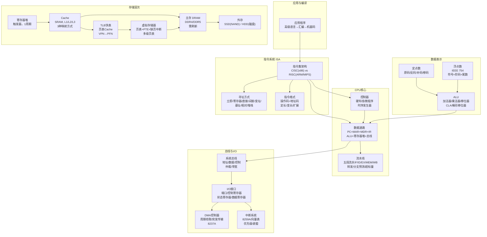

```mermaid
sequenceDiagram
    participant Power as 电源
    participant BIOS as BIOS ROM
    participant CPU as CPU
    participant REG as 寄存器堆
    participant ALU as ALU
    participant MMU as MMU
    participant Cache as Cache
    participant MEM as 主存
    participant BUS as 系统总线
    participant IO as I/O接口
    participant DMA_CTRL as DMA控制器
    participant DISK as 磁盘
    participant TLB as TLB快表
    participant PT as 页表

    %% ===================== 阶段0：开机引导 =====================
    rect rgba(220, 230, 255, 0.4)
    Note over Power,BIOS: "===== 阶段0：开机引导（BIOS POST → MBR → Bootloader → 实模式→保护模式 → 内核加载）====="
    Power->>Power: 上电，电源稳定后发POWERGOOD信号
    Note over CPU: CPU复位，CS:IP=FFFF:0000H<br/>实模式，寻址空间1MB
    CPU->>BIOS: 从FFFF0H取第一条指令(JMP)
    BIOS->>BIOS: POST自检：CPU/内存/芯片组/显卡
    Note over BIOS: 检测显卡BIOS(C000:0000)<br/>初始化中断向量表IVT(0000:03FFH)<br/>设置BIOS数据区BDA(0040:0000)
    BIOS->>DISK: INT 13H读取启动扇区(MBR, LBA=0)
    DISK-->>BIOS: 加载MBR到0000:7C00H(512字节)
    Note over BIOS: 检查最后两字节是否为0x55AA<br/>若有效，跳转到0x7C00执行
    Note over CPU: Bootloader执行：<br/>1. 读取OS内核到内存<br/>2. 设置GDT(全局描述符表)<br/>3. 设置IDT(中断描述符表)<br/>4. 开启A20地址线<br/>5. 置CR0.PE=1，进入保护模式<br/>6. 开启分页CR0.PG=1<br/>7. 跳转到内核入口
    Note over CPU: 保护模式特性：<br/>32位寻址，4GB地址空间<br/>段式+页式内存管理<br/>特权级Ring0~Ring3
    end

    %% ===================== 阶段1：取指 IF =====================
    rect rgba(240, 248, 255, 0.4)
    Note over CPU,MEM: "===== 阶段1：取指 IF（Instruction Fetch）====="
    Note over CPU: 冯·诺依曼结构核心：<br/>程序指令与数据存储在同一内存<br/>按地址顺序取指执行
    CPU->>REG: PC→MAR（程序计数器送地址寄存器）
    Note over REG: PC指向下一条指令地址<br/>x86: EIP/RIP<br/>ARM: R15(PC)<br/>顺序执行：PC←PC+指令长度<br/>转移时：PC←目标地址
    REG->>BUS: MAR→地址总线AB（单向输出）
    Note over BUS: 地址总线宽度决定寻址空间<br/>n位地址线→可寻址2^n单元<br/>32位→4GB, 64位→16EB
    CPU->>BUS: 控制总线发MEMR#（存储器读）
    Note over BUS: 控制总线信号：<br/>MEMR#/MEMW#（存储器读写）<br/>IOR#/IOW#（I/O读写）<br/>READY（等待信号）
    BUS->>MEM: 地址选通，MEMR#有效
    Note over MEM: 存储体内部：<br/>地址译码器选中对应存储单元<br/>存储矩阵输出数据<br/>读写控制电路控制方向
    MEM-->>BUS: 数据→数据总线DB（双向）
    Note over BUS: 数据总线宽度=存储字长<br/>通常为32位或64位
    BUS-->>REG: 数据→MDR（存储器数据寄存器）
    REG->>REG: MDR→IR（指令寄存器）
    Note over REG: IR存放当前指令：<br/>操作码OP + 地址码ADDR<br/>例如：ADD R1, R2, R3<br/>OP=000000(ADD), R1,R2,R3寄存器号
    CPU->>REG: PC+指令长度→PC（指向下一条）
    end

    %% ===================== 阶段2：译码 ID =====================
    rect rgba(248, 240, 255, 0.4)
    Note over CPU,REG: "===== 阶段2：译码 ID（Instruction Decode）====="
    REG->>CPU: IR→控制器（指令译码器）
    Note over CPU: 控制器两种实现：<br/>硬布线控制器：组合逻辑电路直接译码<br/>速度快，修改困难，RISC常用<br/>微程序控制器：逐条取微指令执行<br/>灵活可修改，CISC常用
    CPU->>CPU: 操作码→译码器→微操作控制信号
    Note over CPU: 译码器输出控制信号：<br/>1. ALU功能选择（ADD/SUB/AND/OR...）<br/>2. 寄存器读写使能（RegWrite/RegRead）<br/>3. 多路选择器控制（ALUSrc/MemtoReg）<br/>4. 存储器读写控制（MemRead/MemWrite）<br/>5. 分支/跳转控制（Branch/Jump）<br/>6. 流水线控制（Stall/Flush）
    CPU->>REG: 读寄存器堆：R[rs]→A, R[rt]→B
    Note over REG: 寻址方式分析（计算EA前）：<br/>立即寻址：操作数在指令中，最快<br/>寄存器寻址：操作数在寄存器，无需访存<br/>直接寻址：EA=指令地址码，访存1次<br/>间接寻址：EA=(指令地址码)，访存多次<br/>变址寻址：EA=(IX)+A，适合数组<br/>基址寻址：EA=(BR)+A，程序重定位<br/>相对寻址：EA=(PC)+A，位置无关<br/>堆栈寻址：操作数隐含栈顶
    CPU->>CPU: 多路选择器选择操作数来源
    end

    %% ===================== 阶段3：执行 EX =====================
    rect rgba(255, 248, 240, 0.4)
    Note over CPU,ALU: "===== 阶段3：执行 EX（Execute）====="
    CPU->>ALU: 操作数A和B送入ALU输入端
    Note over ALU: ALU核心部件：<br/>加法器（串行/先行进位CLA）<br/>逻辑运算单元（AND/OR/XOR/NOR）<br/>移位器（桶形移位器，单周期多位）<br/>乘法器（阵列乘法器/Booth算法）<br/>除法器（加减交替法）
    ALU->>ALU: 执行运算操作
    Note over ALU: 运算类型：<br/>算术：ADD/SUB/MUL/DIV<br/>逻辑：AND/OR/XOR/NOT<br/>移位：SHL/SHR/SAL/SAR/ROR/ROL<br/>比较：CMP（做减法，仅置标志位）
    ALU->>REG: 结果→暂存器Z→目的寄存器
    Note over REG: 标志寄存器FLAGS：<br/>CF(进位/借位标志)：无符号溢出<br/>ZF(零标志)：结果为0置1<br/>SF(符号标志)：最高位值<br/>OF(溢出标志)：有符号溢出<br/>PF(奇偶标志)：低8位1的个数为偶<br/>AF(辅助进位)：低4位向高4位进位
    Note over CPU: 溢出判断方法：<br/>双符号位法：00=正,11=负,01=上溢,10=下溢<br/>进位判断法：Cn⊕C(n-1)=1则溢出<br/>单符号位法：符号相同的两数相加<br/>结果符号与加数不同则溢出
    Note over CPU: 单周期CPU：一条指令一个时钟周期<br/>多周期CPU：指令分多个时钟周期<br/>流水线CPU：多条指令重叠执行
    end

    %% ===================== 阶段4：访存 MEM =====================
    rect rgba(255, 240, 245, 0.4)
    Note over CPU,MMU: "===== 阶段4：访存 MEM（Memory Access）====="
    Note over CPU: LOAD/STORE指令需要访存<br/>RISC：仅Load/Store指令访存<br/>CISC：运算指令也可访存
    CPU->>REG: 计算有效地址EA
    Note over REG: 变址寻址：EA=(IX)+偏移量<br/>基址寻址：EA=(BR)+偏移量<br/>相对寻址：EA=(PC)+偏移量<br/>EA送入MAR
    REG->>MMU: MAR→MMU（逻辑地址LA）
    Note over MMU: 未启用分页：LA=PA直接访存<br/>启用分页：LA→线性地址→物理地址<br/>段式管理：段基址+段内偏移<br/>段寄存器(CS/DS/SS/ES)+偏移→线性地址<br/>页式管理：页号+页内偏移→物理地址<br/>物理地址=页框号×页大小+页内偏移
    MMU->>Cache: 物理地址→Cache查找
    Note over MMU: 若Cache命中则直接返回<br/>若缺失则访问主存
    alt LOAD指令
        Cache-->>REG: 数据→MDR→目的寄存器
        Note over REG: LOAD完成，数据写入寄存器
    else STORE指令
        REG->>Cache: 寄存器数据→MDR→Cache
        Note over Cache: STORE完成，数据写入内存
    end
    end

    %% ===================== 阶段5：Cache命中与缺失 =====================
    rect rgba(240, 255, 248, 0.4)
    Note over Cache,MEM: "===== 阶段5：Cache命中与缺失（存储层次核心）====="
    Note over Cache: Cache地址分解：<br/>Tag(标记) + Index(组索引) + Offset(块内偏移)<br/>直接映射：固定位置，冲突多，硬件简单<br/>组相联映射：N路组内，折中方案<br/>全相联映射：任意位置，硬件开销大<br/>Cache容量=行数×(Tag+有效位+脏位+数据块)
    alt Cache命中(Hit)
        Cache-->>REG: 数据返回（1~2个时钟周期）
        Note over Cache: 命中率取决于：<br/>局部性原理(时间+空间)<br/>块大小(太大→调入慢，太小→命中低)<br/>相联度(越大冲突越少)<br/>替换算法(影响命中率)
    else Cache缺失(Miss)
        Note over Cache: Cache缺失处理流程：<br/>1. 暂停CPU流水线(Stall)<br/>2. 分配Cache行
        Cache->>MEM: 从主存读取数据块(一个Cache块)
        Note over MEM: 读一个Cache块(如64字节)<br/>需多总线周期<br/>支持突发传输(Burst Mode)<br/>先传关键字(Critical Word First)
        MEM-->>Cache: 返回数据块(几十~上百周期)
        Note over Cache: 3. 选择替换位置：<br/>LRU：淘汰最久未使用<br/>FIFO：淘汰最早进入<br/>随机：随机选择<br/>LFU：淘汰最不常用<br/>伪LRU：树形近似，实际常用<br/>4. 更新Tag和有效位<br/>5. 若脏块(写回法)需先写回主存
        Cache-->>REG: 返回所需数据
    end
    Note over Cache: 写策略：<br/>写穿(Write-Through)：同时写Cache和主存<br/>写回(Write-Back)：仅写Cache，换出时写回<br/>写分配(Write-Allocate)：缺失时先调入再写<br/>非写分配(No-Write-Allocate)：直接写主存<br/>典型组合：写穿+非写分配，写回+写分配
    end

    %% ===================== 阶段6：流水线执行 =====================
    rect rgba(245, 250, 240, 0.4)
    Note over CPU: "===== 阶段6：流水线执行（五段流水 + 冒险 + 转发 + 分支预测）====="
    Note over CPU: 经典五段流水线：<br/>IF → ID → EX → MEM → WB<br/>流水线寄存器分隔各段：<br/>IF/ID, ID/EX, EX/MEM, MEM/WB
    CPU->>CPU: IF: 取指（Instruction Fetch）
    Note over CPU: IF段：PC→指令存储器<br/>指令→IF/ID流水线寄存器<br/>PC+4→PC（MIPS中每条指令4字节）
    CPU->>CPU: ID: 译码/读寄存器（Decode/RegRead）
    Note over CPU: ID段：译码操作码+读寄存器<br/>数据→ID/EX流水线寄存器<br/>同时计算分支目标地址
    CPU->>CPU: EX: 执行（Execute）
    Note over CPU: EX段：ALU运算<br/>结果→EX/MEM流水线寄存器<br/>分支条件判断在此段完成
    CPU->>CPU: MEM: 访存（Memory Access）
    Note over CPU: MEM段：读/写数据存储器<br/>数据→MEM/WB流水线寄存器<br/>仅Load/Store指令有效
    CPU->>CPU: WB: 写回（Write Back）
    Note over CPU: WB段：结果写回寄存器堆<br/>MemtoReg=0: ALU结果写入<br/>MemtoReg=1: 内存数据写入
    Note over CPU: 数据冒险RAW（最常见）：<br/>后一条指令依赖前一条指令的结果<br/>解决：转发Forwarding（旁路Bypass）<br/>将EX/MEM或MEM/WB的结果<br/>直接作为ALU输入，无需等待写回<br/>若转发无法解决，插入气泡NOP
    Note over CPU: 控制冒险：<br/>分支/跳转指令导致PC不确定<br/>解决：<br/>1. 静态预测：总不跳/总跳<br/>2. 动态预测：BTB/BHT/两级自适应<br/>3. 延迟分支：延迟槽填有用指令<br/>4. 提前计算分支目标地址<br/>分支预测错误→Flush流水线
    Note over CPU: 结构冒险：<br/>硬件资源冲突（如IF和MEM同时访存）<br/>解决：指令/数据Cache分离<br/>（哈佛结构）
    end

    %% ===================== 阶段7：中断处理 =====================
    rect rgba(255, 250, 240, 0.4)
    Note over CPU,IO: "===== 阶段7：中断处理（Interrupt Handling）====="
    Note over CPU: 中断源分类：<br/>外部中断：INTR(可屏蔽), NMI(非屏蔽)<br/>内部异常：除法错/单步/断点/溢出<br/>软中断：INT n指令<br/>优先级：内部异常>NMI>INTR>软中断
    IO->>CPU: 外设通过8259A发中断请求INTR
    Note over CPU: CPU响应中断条件：<br/>1. 当前指令执行完毕<br/>2. IF=1（开中断，STI指令设置）<br/>3. 无更高优先级中断（NMI/内部异常）<br/>4. 无DMA请求（DMA优先级高于INTR）
    CPU->>CPU: 中断响应周期（INTA#）
    Note over CPU: 硬件自动完成（不可屏蔽）：<br/>1. FLAGS寄存器压栈<br/>2. 关中断：IF=0, TF=0<br/>3. 断点保护：CS:IP压栈<br/>4. 从中断控制器读中断类型号N<br/>5. 查中断向量表：N×4→向量地址<br/>   从N×4处取IP，N×4+2处取CS<br/>6. 加载ISR入口地址→CS:IP<br/>8086向量表：00000H~003FFH(1KB)
    CPU->>CPU: 执行中断服务程序ISR
    Note over CPU: ISR标准流程：<br/>1. PUSH保护现场（通用寄存器）<br/>2. STI开中断（允许中断嵌套）<br/>3. 处理中断事件<br/>4. CLI关中断<br/>5. 发EOI命令（结束中断）<br/>6. POP恢复现场<br/>7. IRET返回（恢复CS:IP和FLAGS）
    Note over CPU: 中断嵌套：<br/>高优先级中断可打断低优先级ISR<br/>需在ISR中开中断（STI）<br/>8259A支持8级优先级嵌套
    end

    %% ===================== 阶段8：DMA与I/O操作 =====================
    rect rgba(248, 255, 248, 0.4)
    Note over CPU,DISK: "===== 阶段8：DMA与I/O操作（直接存储器访问）====="
    Note over CPU: I/O方式演进：<br/>程序查询→中断方式→DMA方式→通道方式<br/>CPU干预程度逐步降低<br/>系统并行度逐步提高
    CPU->>IO: CPU设置DMA控制器(8237A)
    Note over IO: DMA控制器初始化参数：<br/>源地址/目标地址寄存器<br/>传输字节计数寄存器<br/>控制寄存器（方向/模式）<br/>模式：单字节/块/请求/级联
    CPU->>CPU: CPU继续执行程序（DMA与CPU并行）
    IO->>BUS: DMA请求总线控制权(HOLD/HRQ)
    Note over BUS: DMA请求→CPU在总线周期结束时响应
    CPU->>BUS: CPU响应(HLDA)，释放总线<br/>CPU总线输出端呈高阻态
    Note over BUS: DMA控制器接管总线：<br/>周期窃取(Cycle Stealing)：<br/>每次传输一个字节/字，交替使用总线<br/>CPU与DMA交替访存<br/>突发传输(Burst)：<br/>连续传输多个字节，传输完才释放总线<br/>效率高但CPU等待时间长
    IO->>MEM: DMA控制器→地址总线+控制信号
    Note over MEM: DMA控制器直接产生：<br/>地址信号（地址寄存器→地址总线）<br/>MEMR#/MEMW#或IOR#/IOW#<br/>每传输一个字，地址±1，计数-1
    DISK-->>MEM: 数据直接传输（磁盘→内存，不经过CPU）
    Note over DMA_CTRL: 传输完成条件：<br/>字节计数寄存器减到0<br/>→DMA控制器发TC(Terminal Count)
    IO->>CPU: 传输完成→发中断请求(INTR)
    Note over CPU: CPU处理DMA完成中断：<br/>检查传输状态<br/>决定是否启动下一次DMA<br/>继续执行后续程序
    Note over CPU: DMA与CPU访存冲突解决：<br/>1. 周期窃取：CPU暂停一个总线周期<br/>2. 交替访存：DMA与CPU时间片轮转<br/>3. 透明DMA：CPU不使用总线时DMA传输
    end

    %% ===================== 阶段9：虚拟存储器与TLB =====================
    rect rgba(255, 245, 235, 0.4)
    Note over CPU,PT: "===== 阶段9：虚拟存储器与TLB（地址转换全流程）====="
    Note over CPU: 虚拟存储器三大作用：<br/>1. 扩大地址空间（虚拟地址>物理地址）<br/>2. 内存保护（页级权限控制）<br/>3. 共享内存（多进程映射同一物理页）
    CPU->>CPU: CPU生成虚拟地址VA
    Note over CPU: VA = VPN(虚拟页号) + Offset(页内偏移)<br/>32位系统：VPN=20位, Offset=12位(4KB页)
    CPU->>TLB: 用VPN并行查找TLB快表
    Note over TLB: TLB是页表的专用Cache<br/>存放最近使用的页表项PTE<br/>全相联/组相联，Tag=VPN<br/>命中率极高（>99%）
    alt TLB命中(TLB Hit)
        TLB-->>CPU: 物理帧号PFN
        Note over CPU: 物理地址=PFN<<12+Offset<br/>直接访问Cache/物理内存
    else TLB缺失(TLB Miss)
        Note over CPU: TLB缺失→查多级页表
        CPU->>PT: 一级页表(PGD)→二级页表(PMD)→PTE
        Note over PT: x86-64四级页表遍历：<br/>PML4→PDPT→PD→PT→物理页<br/>每级查表都是一次内存访问<br/>4级页表需4次访存（极慢）
        PT-->>CPU: 物理帧号PFN
        Note over CPU: 更新TLB：<br/>VPN→PFN映射写入TLB<br/>若TLB满，按替换算法（LRU）淘汰
        Note over CPU: 物理地址=PFN<<12+Offset
    end
    Note over CPU: PTE（页表项）字段：<br/>PFN(物理帧号), P(有效位)<br/>D(脏位/修改位), A(访问位)<br/>R/W/X(权限), U/S(用户/系统)<br/>PCD(缓存禁止)
    CPU->>MEM: 访问物理内存
    Note over CPU: 缺页中断(Page Fault)：<br/>PTE.P=0→触发缺页异常<br/>OS选择替换页（LRU/Clock算法）<br/>若脏页→写回磁盘<br/>调入新页→更新页表→TLB刷新<br/>进程重新执行缺页指令
    end

    %% ===================== 阶段10：总线仲裁与数据传输 =====================
    rect rgba(235, 245, 255, 0.4)
    Note over CPU,BUS: "===== 阶段10：总线仲裁与数据传输（多主设备竞争→仲裁→传输）====="
    Note over CPU: 总线主设备：可发起总线请求<br/>CPU、DMA控制器、I/O处理器<br/>总线从设备：响应总线请求<br/>存储器、I/O接口
    Note over BUS: 总线仲裁方式：<br/>集中式：菊花链/计数器/独立请求<br/>分布式：各设备自己判断
    IO->>BUS: 设备A请求总线(BR#)
    Note over BUS: 菊花链查询：<br/>总线授权信号BG串行传递<br/>近CPU设备优先级高，公平性差<br/>3根线：BR/BG/BS<br/>计数器定时查询：<br/>计数器轮询设备号<br/>可编程控制优先级<br/>独立请求：<br/>每个设备独立BR/BG线<br/>仲裁器内部优先级逻辑<br/>响应最快，但连线多
    BUS->>IO: 仲裁器授权设备A(BG#)
    Note over IO: 设备A获得总线控制权<br/>BS#信号表示总线忙
    IO->>MEM: 主设备A→地址总线+控制信号
    Note over BUS: 总线传输周期：<br/>1. 申请阶段：主设备发BR#<br/>2. 仲裁阶段：仲裁器决定授权<br/>3. 寻址阶段：主设备发地址<br/>4. 传输阶段：数据交换<br/>5. 结束阶段：释放总线
    IO->>IO: 数据传输完成，释放总线
    Note over BUS: 总线性能指标：<br/>总线宽度：数据线位数<br/>总线频率：时钟频率<br/>总线带宽B=W×f（bps）<br/>例如：PCIe 3.0 x1≈1GB/s<br/>总线周期：一次传输的时间
    end

    %% ===================== 阶段11：数据表示与运算（补码/浮点/ALU） =====================
    rect rgba(250, 240, 255, 0.4)
    Note over ALU,REG: "===== 阶段11：数据表示与运算（补码加减法 + IEEE 754浮点运算）====="
    Note over ALU: 定点数表示：<br/>原码：符号+绝对值，[+0]≠[-0]<br/>反码：负数按位取反，中间过渡<br/>补码：取反+1，[+0]=[-0]=00...0<br/>移码：补码符号位取反，用于阶码<br/>定点纯整数范围：-2^(n-1)~2^(n-1)-1
    ALU->>ALU: 补码加法：[A+B]补=[A]补+[B]补
    Note over ALU: 补码加法规则：<br/>符号位参与运算<br/>模2^n自动丢弃进位<br/>溢出判断：双符号位或进位异或
    ALU->>ALU: 补码减法：[A-B]补=[A]补+[-B]补
    Note over ALU: [-B]补求法：<br/>[B]补连同符号位取反，末位+1<br/>减法器=加法器+取反电路
    ALU->>ALU: IEEE 754浮点加减法
    Note over ALU: 浮点加减步骤：<br/>1. 对阶：小阶向大阶对齐<br/>   ΔE=EA-EB，若ΔE>0，MB右移ΔE位<br/>2. 尾数加减：定点补码运算<br/>3. 规格化：左规/右规，调整阶码<br/>4. 舍入：0舍1入/恒置1/截断<br/>5. 溢出判断：阶码上溢/下溢<br/>单精度：S(1)+E(8,偏127)+M(23)<br/>双精度：S(1)+E(11,偏1023)+M(52)
    Note over ALU: 定点乘法：<br/>原码一位乘：符号异或，绝对值移位相加<br/>补码Booth算法：减少部分积<br/>定点除法：<br/>原码加减交替法（不恢复余数）<br/>补码加减交替法
    ALU->>REG: 运算结果→寄存器，置标志位
    end

    %% ===================== 阶段12：超标量/动态调度 =====================
    rect rgba(255, 255, 240, 0.4)
    Note over CPU: "===== 阶段12：超标量与动态调度（Tomasulo + 乱序执行）====="
    Note over CPU: 超标量技术：<br/>多个相同流水线并行<br/>每周期发射多条指令（如4发射）<br/>需多套功能部件<br/>IPC>1
    CPU->>CPU: 指令发射（Issue）
    Note over CPU: 指令从指令队列发射到保留站<br/>若操作数就绪→直接取<br/>若操作数未就绪→记录依赖
    CPU->>CPU: 保留站等待操作数
    Note over CPU: Tomasulo算法核心：<br/>保留站(RS)：缓冲操作数<br/>公共数据总线CDB：广播结果<br/>寄存器重命名：消除WAR/WAW伪相关<br/>记分板(Scoreboard)：控制发射/执行
    CPU->>CPU: 操作数就绪→执行（乱序）
    Note over CPU: 乱序执行：<br/>数据就绪的指令先执行<br/>不按程序顺序<br/>功能部件并行工作
    CPU->>CPU: 结果通过CDB广播
    Note over CPU: CDB广播：<br/>结果→所有保留站+寄存器堆<br/>等待该结果的保留站捕获数据<br/>同时更新寄存器
    CPU->>CPU: 写回/提交（顺序退休）
    Note over CPU: 重排序缓冲ROB：<br/>指令按程序顺序提交<br/>保证精确异常<br/>分支预测错误→Flush ROB
    Note over CPU: 分支预测：<br/>静态：总不跳/总跳/BTFN<br/>动态：1位/2位预测器<br/>BTB记录目标地址<br/>BHT记录跳转历史<br/>两级自适应：根据历史模式预测<br/>现代CPU预测准确率>95%
    end
```

# 可放大查看图片

# 计算机组成原理全流程知识串联 · 详细图解版
以下严格对应最终修正版Mermaid时序图，以**表格+结构化要点**为主，完整覆盖12个核心阶段的硬件交互、数据流向与考研考点。

---

## 一、前置概览：计组知识体系拓扑

---

## 二、全流程阶段总览表

| 阶段 | 阶段名称 | 对应模块 | 核心机制 | 核心事件 |
|------|----------|----------|----------|----------|
| 0 | 开机引导 | 系统概述 | BIOS POST、MBR、Bootloader、实模式→保护模式 | 从按下电源键到OS内核加载完成 |
| 1 | 取指 IF | CPU数据通路 | PC→MAR→地址总线→主存→MDR→IR | 冯·诺依曼结构按地址取指令 |
| 2 | 译码 ID | CPU数据通路+指令系统 | 操作码译码→微操作控制信号→读寄存器→寻址分析 | 控制器产生全部控制信号 |
| 3 | 执行 EX | CPU数据通路+数据表示 | 操作数→ALU→加法器/移位器/逻辑单元→结果→FLAGS | 补码运算+溢出判断+标志位 |
| 4 | 访存 MEM | 存储层次+CPU | LOAD/STORE→EA计算→MMU→逻辑地址→物理地址 | 地址转换+段页式管理 |
| 5 | Cache命中与缺失 | 存储层次 | Tag/Index/Offset→命中返回→缺失→主存→替换/写策略 | Cache映射+替换+写策略全流程 |
| 6 | 流水线执行 | CPU流水线 | 五段流水→冒险检测→转发→分支预测 | 数据冒险RAW+控制冒险+结构冒险 |
| 7 | 中断处理 | I/O系统 | INTR→关中断→FLAGS+CS:IP压栈→向量表→ISR→IRET | 中断响应周期+中断嵌套 |
| 8 | DMA与I/O操作 | I/O系统+总线 | DMA控制器设置→HOLD/HLDA→周期窃取/突发→完成中断 | 外设与主存直接交换数据 |
| 9 | 虚拟存储器与TLB | 存储层次 | VA→TLB查找→命中/缺失→页表遍历→缺页中断 | 虚拟地址到物理地址全流程 |
| 10 | 总线仲裁与传输 | 总线 | 总线请求→菊花链/计数器/独立请求→授权→传输→释放 | 多主设备竞争总线资源 |
| 11 | 数据表示与运算 | 数据表示 | 补码加减法+IEEE 754浮点运算+定点乘法/除法 | 四种机器数+浮点对阶/规格化 |
| 12 | 超标量与动态调度 | CPU高级 | Tomasulo算法+乱序执行+CDB广播+ROB顺序退休 | 现代高性能CPU微架构 |

---

## 三、分阶段详细拆解（表格化呈现）

## 0 阶段0：开机引导

**核心目标**：从按下电源键到操作系统内核加载完毕，完成硬件初始化与模式切换

**交互步骤表**：

| 序号 | 发送方 | 接收方 | 核心字段/操作 | 核心处理动作 |
|------|--------|--------|--------------|--------------|
| 1 | 电源 | CPU | POWERGOOD信号 | 电源稳定后通知CPU可以开始工作 |
| 2 | CPU | BIOS ROM | CS:IP=FFFF:0000H→地址总线 | CPU复位后从FFFF0H取第一条指令(JMP) |
| 3 | BIOS | 各硬件 | POST自检：CPU/内存/芯片组/显卡 | 检测关键硬件是否正常，初始化中断向量表IVT(0000:03FFH) |
| 4 | BIOS | 磁盘 | INT 13H读LBA=0(主引导扇区) | 读取MBR到0000:7C00H(512字节)，检查0x55AA签名 |
| 5 | BIOS | Bootloader | 跳转到0x7C00执行 | Bootloader读取OS内核，设置GDT/IDT，开A20，进入保护模式，开启分页 |
| 6 | Bootloader | OS内核 | 跳转到内核入口 | 内核初始化进程管理/内存管理/文件系统等 |

**考研核心考点**：

:::important
**#[C|BIOS启动流程]**：POST自检 → 读取MBR → 检查0x55AA → 跳转7C00 → 加载OS内核。实模式1MB寻址(CS<<4+IP)，保护模式32位寻址(段描述符+偏移)。
:::

- MBR位于0柱面0磁头1扇区(LBA=0)，固定512字节，最后两字节必须为0x55AA
- 实模式→保护模式：设置CR0.PE=1，开启分页需CR0.PG=1
- 中断向量表IVT在实模式下位于00000H~003FFH，共256个中断向量，每个4字节

---

## 1 阶段1：取指 IF

**核心目标**：根据PC值从主存取出当前指令，存入指令寄存器IR

**交互步骤表**：

| 序号 | 发送方 | 接收方 | 核心字段/操作 | 核心处理动作 |
|------|--------|--------|--------------|--------------|
| 1 | CPU(PC) | 寄存器(MAR) | PC值→MAR | 程序计数器指向当前指令地址，x86: EIP, ARM: R15 |
| 2 | 寄存器(MAR) | 系统总线 | MAR→地址总线AB | 地址总线单向输出，n位可寻址2^n单元 |
| 3 | CPU | 系统总线 | 控制总线发MEMR# | 存储器读信号有效，READY信号等待 |
| 4 | 系统总线 | 主存 | 地址+控制信号到达 | 存储体内部地址译码器选中对应单元 |
| 5 | 主存 | 系统总线 | 存储单元数据→数据总线DB | 数据总线双向传输，宽度=存储字长 |
| 6 | 系统总线 | 寄存器(MDR) | 数据总线→MDR | 存储器数据寄存器暂存取出的指令 |
| 7 | 寄存器(MDR) | 寄存器(IR) | MDR→IR | 指令寄存器存放当前指令：OP+ADDR |
| 8 | CPU | 寄存器(PC) | PC+指令长度→PC | 顺序执行指向下一条，转移指令则修改PC |

**考研核心考点**：

:::important
**#[C|取指阶段核心]**：PC→MAR→地址总线→主存→数据总线→MDR→IR→PC+1。这是冯·诺依曼结构"存储程序"思想的具体体现。
:::

:::warning
**#[R|易错点]**：PC的更新时机——在取指阶段结束时更新，不是在译码或执行阶段。MIPS中PC+4是因为每条指令4字节，x86中PC+指令长度是因变长指令。
:::

---

## 2 阶段2：译码 ID

**核心目标**：解析指令操作码，产生微操作控制信号序列，读取寄存器操作数

**交互步骤表**：

| 序号 | 发送方 | 接收方 | 核心字段/操作 | 核心处理动作 |
|------|--------|--------|--------------|--------------|
| 1 | IR | 控制器(译码器) | 操作码OP→译码器 | 硬布线：组合逻辑直接译码；微程序：OP→微程序入口地址 |
| 2 | 控制器 | 控制器 | 译码器输出→微操作控制信号 | 产生ALU选择、寄存器读写、存储器读写、多路选择器、分支等控制信号 |
| 3 | 控制器 | 寄存器堆 | 读寄存器地址rs, rt→R[rs], R[rt] | 读出的操作数送入ALU输入端或暂存器 |
| 4 | 控制器 | 控制器 | 寻址方式分析 | 立即/寄存器/直接/间接/变址/基址/相对/堆栈 |

**考研核心考点**：

:::important
**#[C|控制器设计]**是计组核心考点。硬布线控制器速度快但修改困难，适合RISC；微程序控制器灵活可修改但速度较慢，适合CISC。微程序存放在控存CM中，微指令格式分水平型和垂直型。
:::

**寻址方式EA计算速查**：

| 寻址方式 | EA公式 | 访存次数 | 用途 |
|----------|--------|----------|------|
| 立即寻址 | 操作数在指令中 | 0 | 常量 |
| 寄存器寻址 | R[i] | 0 | 变量 |
| 直接寻址 | EA=A | 1 | 全局变量 |
| 间接寻址 | EA=(A) | 2+ | 指针 |
| 变址寻址 | EA=(IX)+A | 1 | 数组 |
| 基址寻址 | EA=(BR)+A | 1 | 重定位 |
| 相对寻址 | EA=(PC)+A | 1 | 转移指令 |

---

## 3 阶段3：执行 EX

**核心目标**：ALU对操作数执行运算，将结果写入目的寄存器，设置标志位

**交互步骤表**：

| 序号 | 发送方 | 接收方 | 核心字段/操作 | 核心处理动作 |
|------|--------|--------|--------------|--------------|
| 1 | 寄存器堆 | ALU | 操作数A→ALU_A, 操作数B→ALU_B | 通过多路选择器选择操作数来源 |
| 2 | 控制器 | ALU | ALU功能选择信号 | 选择ADD/SUB/AND/OR/XOR/SHL/SHR等 |
| 3 | ALU | ALU | 执行运算 | 加法器(CLA)/逻辑单元/移位器/乘法器并行工作 |
| 4 | ALU | 寄存器堆 | 结果→暂存器Z→目的寄存器 | 暂存器Z缓冲ALU输出 |
| 5 | ALU | 标志寄存器 | 设置FLAGS | CF/ZF/SF/OF/PF/AF |

**考研核心考点**：

:::important
**#[C|补码运算与溢出判断]**是必考内容。补码加法：符号位参与运算，模2^n自动丢弃进位。溢出判断三种方法：①双符号位(00正/11负/01上溢/10下溢)；②进位异或(Cn⊕C(n-1)=1溢出)；③单符号位(同号相加异号则溢出)。
:::

:::warning
**#[R|CF vs OF 易混淆]**：CF是无符号数溢出标志(进位/借位)，OF是有符号数溢出标志。ADD指令两者可能同时为1或不同，需根据数据类型判断。
:::

**ALU内部结构**：

| 部件 | 功能 | 特点 |
|------|------|------|
| 加法器 | 补码加减法 | 行波进位(O(n)) vs 先行进位CLA(O(log n)) |
| 逻辑单元 | AND/OR/XOR/NOT | 按位操作 |
| 移位器 | SHL/SHR/SAL/SAR/ROR/ROL | 桶形移位器：单周期多位 |
| 乘法器 | 定点乘法 | 原码一位乘/Booth算法 |
| 除法器 | 定点除法 | 加减交替法(不恢复余数) |

---

## 4 阶段4：访存 MEM

**核心目标**：LOAD/STORE指令访问内存，通过MMU完成逻辑地址→物理地址转换

**交互步骤表**：

| 序号 | 发送方 | 接收方 | 核心字段/操作 | 核心处理动作 |
|------|--------|--------|--------------|--------------|
| 1 | CPU | 寄存器 | 计算有效地址EA | EA=(BR)+A或(IX)+A或(PC)+A，送入MAR |
| 2 | 寄存器(MAR) | MMU | 逻辑地址→MMU | 段式：段基址+偏移；页式：页号+页内偏移 |
| 3 | MMU | MMU | 地址转换 | 无分页：LA=PA；有分页：CR3→页目录→页表→物理页框 |
| 4 | MMU | Cache | 物理地址→Cache查找 | 若命中直接返回，若缺失访问主存 |
| 5 | Cache/主存 | 寄存器(MDR) | LOAD: 数据→MDR→目的寄存器 | 或STORE: 寄存器→MDR→Cache/主存 |

**考研核心考点**：

:::important
**#[C|段页式地址转换]**：逻辑地址→(段式)→线性地址→(页式)→物理地址。段式提供逻辑分段和内存保护，页式提供虚拟存储和内存共享。x86保护模式下两者结合使用。
:::

:::note
**分段 vs 分页**：分段是用户可见的（代码段、数据段、堆栈段），分页是系统透明的。分段消除外部碎片但有内部碎片，分页消除外部碎片且仅有少量内部碎片。
:::

---

## 5 阶段5：Cache命中与缺失

**核心目标**：利用局部性原理，通过Cache加速CPU访存，演示命中/缺失/替换/写策略

**Cache地址分解**：

| 映射方式 | 地址分解 | 映射规则 | 特点 |
|----------|----------|----------|------|
| 直接映射 | Tag \| Index \| Offset | Cache行号=主存块号 mod Cache行数 | 硬件简单，冲突多 |
| 组相联 | Tag \| Index \| Offset | 组号=主存块号 mod 组数，组内任意 | 折中，实际常用 |
| 全相联 | Tag \| Offset | 任意位置 | 冲突最少，硬件贵 |

**Cache操作流程**：

| 场景 | 命中(Hit) | 缺失(Miss) |
|------|-----------|------------|
| 读操作 | 直接返回数据(1~2周期) | 暂停CPU→从主存读块→分配行→替换→写回脏块→返回数据 |
| 写操作 | 写穿：同时写Cache和主存 写回：仅写Cache，置脏位 | 写分配：先调入再写 非写分配：直接写主存 |

**考研核心考点**：

:::important
**#[C|Cache容量计算]**：Cache总容量 = 行数 × (Tag位数 + 有效位 + 脏位 + 数据块大小×8)。注意：Tag位数取决于地址空间和映射方式，需根据具体参数计算。
:::

**替换算法对比**：

| 算法 | 原理 | 硬件开销 | 命中率 |
|------|------|----------|--------|
| 随机RAND | 随机选择 | 最低 | 不稳定 |
| FIFO | 淘汰最早进入 | 低 | 较差 |
| LRU | 淘汰最久未用 | 高 | 最优(近似) |
| LFU | 淘汰最不常用 | 中 | 有时偏低 |
| 伪LRU | 树形近似 | 中 | 接近LRU |

:::warning
**#[R|易错点]**：写策略组合必须匹配——写回法通常配合写分配，写穿法通常配合非写分配。写回法在替换脏块时需先写回主存，增加缺失开销。
:::

---

## 6 阶段6：流水线执行

**核心目标**：多条指令在不同流水段重叠执行，提高CPU吞吐率

**五段流水线各段功能**：

| 流水段 | 功能 | 流水线寄存器 | 关键操作 |
|--------|------|-------------|----------|
| IF | 取指令 | IF/ID | PC→指令存储器，PC+4→PC |
| ID | 译码/读寄存器 | ID/EX | 操作码译码+读寄存器+计算分支目标 |
| EX | 执行 | EX/MEM | ALU运算+分支条件判断 |
| MEM | 访存 | MEM/WB | 读/写数据存储器 |
| WB | 写回 | — | 结果写回寄存器堆 |

**流水线冒险详解**：

| 冒险类型 | 产生原因 | 解决方案 |
|----------|----------|----------|
| 结构冒险 | 硬件资源冲突(IF与MEM同时访存) | 指令/数据Cache分离(哈佛结构) |
| 数据冒险RAW | 后一条指令依赖前一条结果 | 转发Forwarding(旁路)，插入气泡NOP |
| 数据冒险WAR | 乱序执行时先读后写 | 寄存器重命名 |
| 数据冒险WAW | 乱序执行时先写后写 | 寄存器重命名 |
| 控制冒险 | 分支/跳转指令PC不确定 | 静态预测/动态预测/延迟分支/Flush |

**考研核心考点**：

:::important
**#[C|转发Forwarding]**：将EX/MEM或MEM/WB流水线寄存器中的结果直接作为ALU输入，无需等待WB阶段写回寄存器堆。但LOAD-USE数据冒险（LOAD后紧接使用该数据的指令）即使转发也需插入一个气泡。
:::

**流水线性能公式**：

| 指标 | 公式 | 说明 |
|------|------|------|
| 吞吐率TP | TP=n/((k+n-1)Δt) | n条指令，k段流水，Δt为时钟周期 |
| 加速比S | S=k·n/(k+n-1) | 当n→∞时S→k |
| 效率E | E=n/(k+n-1) | 当n→∞时E→1 |

:::warning
**#[R|易错点]**：流水线并不能提高单条指令的执行时间（反而因寄存器开销而增加），它提高的是**吞吐率**（单位时间完成的指令数）。流水线时钟周期由最慢的流水段决定。
:::

---

## 7 阶段7：中断处理

**核心目标**：CPU暂停当前程序，响应外设中断请求，执行ISR后返回

**中断响应流程**：

| 步骤 | 操作 | 谁完成 | 说明 |
|------|------|--------|------|
| 1 | 外设发INTR | 外设/8259A | 中断控制器汇集中断请求，判优后向CPU发INTR |
| 2 | CPU响应条件检查 | CPU | 当前指令结束+IF=1+无更高优先级+DMA未请求 |
| 3 | 中断响应周期INTA# | CPU+8259A | CPU发INTA#，8259A送中断类型号N到数据总线 |
| 4 | FLAGS压栈 | CPU(硬件) | 自动保存标志寄存器 |
| 5 | 关中断IF=0, TF=0 | CPU(硬件) | 禁止响应新中断和单步 |
| 6 | CS:IP压栈 | CPU(硬件) | 保存断点地址 |
| 7 | 查中断向量表 | CPU(硬件) | N×4处取IP，N×4+2处取CS |
| 8 | 执行ISR | CPU(软件) | 保护现场→STI→处理→CLI→EOI→恢复→IRET |

**考研核心考点**：

:::important
**#[C|中断向量表]**：8086中位于00000H~003FFH(1KB)，每个中断向量占4字节(IP:CS)。中断类型号N对应向量地址N×4。这是408高频考点。
:::

**中断优先级(从高到低)**：
1. 内部异常（除法错、单步INT 1、NMI、断点INT 3、溢出INTO）
2. 外部可屏蔽中断 INTR
3. 软中断 INT n

:::note
**#[Y|中断嵌套]**：在ISR中执行STI开中断后，更高优先级的中断可打断当前ISR。8259A支持8级优先级嵌套，全嵌套模式下IR0优先级最高。
:::

---

## 8 阶段8：DMA与I/O操作

**核心目标**：外设与主存直接交换数据，CPU仅参与开始和结束，实现高度并行

**DMA传输流程**：

| 步骤 | 操作 | 说明 |
|------|------|------|
| 1 | CPU初始化DMA控制器 | 设置源地址/目标地址/传输字节数/方向/模式 |
| 2 | CPU继续执行程序 | DMA与CPU并行工作 |
| 3 | DMA发HOLD/HRQ请求总线 | 请求CPU释放总线控制权 |
| 4 | CPU发HLDA响应 | CPU总线输出端呈高阻态，释放总线 |
| 5 | DMA接管总线传输数据 | 周期窃取或突发传输 |
| 6 | 传输完成发中断 | DMA控制器发TC(计数到0)→中断请求 |

**I/O方式对比**：

| 方式 | CPU干预程度 | 数据传输 | 并行度 | 适用场景 |
|------|------------|----------|--------|----------|
| 程序查询 | 全程轮询 | CPU | 串行 | 极简单系统 |
| 中断方式 | 每字节/字 | CPU | 部分并行 | 低速字符设备 |
| DMA方式 | 仅块首尾 | DMA控制器 | 高度并行 | 高速块设备(磁盘) |
| 通道方式 | 极低 | 通道处理机 | 最高 | 大型机 |

**考研核心考点**：

:::important
**#[C|周期窃取 vs 突发传输]**：周期窃取每次传输一个字节/字即释放总线，CPU和DMA交替使用；突发传输连续传输多个字节后再释放，效率高但CPU等待久。
:::

:::warning
**#[R|DMA与中断的区别]**：DMA仅在传输开始和结束时需要CPU干预，中断每次数据交换都需要CPU干预。DMA适合高速批量数据传输，中断适合低速随机数据传输。
:::

---

## 9 阶段9：虚拟存储器与TLB

**核心目标**：通过页表+TLB实现虚拟地址→物理地址转换，支持缺页处理

**地址转换流程**：

| 步骤 | 操作 | 涉及硬件 | 说明 |
|------|------|----------|------|
| 1 | CPU生成虚拟地址VA | CPU | VA=VPN(虚拟页号)+Offset(页内偏移) |
| 2 | TLB并行查找 | TLB | 用VPN查TLB，全相联/组相联 |
| 3a | TLB命中 | TLB | 直接获得PFN，物理地址=PFN<<12+Offset |
| 3b | TLB缺失 | MMU+页表 | 遍历多级页表→获PFN→更新TLB |
| 4 | 检查PTE | MMU | P=1有效→访问物理内存；P=0→缺页中断 |
| 5 | 缺页处理 | OS | 选择替换页→脏页写回→调入新页→更新页表 |

**考研核心考点**：

:::important
**#[C|TLB + Cache + 页表 + 虚拟存储器]**四者协同工作，是408计组最复杂的综合考点。虚拟地址→TLB→物理地址→Cache→数据，或虚拟地址→TLB缺失→页表遍历→物理地址→Cache→数据。
:::

**PTE页表项字段**：

| 字段 | 含义 | 说明 |
|------|------|------|
| PFN | 物理帧号 | 物理页框号 |
| P/V | 有效位 | 1=在内存，0=在外存(缺页) |
| D | 脏位/修改位 | 1=被修改过，换出时需写回 |
| A | 访问位 | 1=最近被访问，用于替换算法 |
| R/W/X | 保护位 | 读/写/执行权限 |
| U/S | 用户/系统 | 特权级控制 |

:::note
**多级页表**：将页表分页存放，节省内存。x86-64采用四级页表(PML4→PDPT→PD→PT)，每级9位索引，共48位虚拟地址。TLB命中时只需1次访存，TLB缺失+4级页表遍历需5次访存。
:::

---

## 10 阶段10：总线仲裁与数据传输

**核心目标**：多个主设备竞争总线使用权时，通过仲裁机制决定谁获得总线

**集中式仲裁方式对比**：

| 仲裁方式 | 信号线 | 原理 | 优点 | 缺点 |
|----------|--------|------|------|------|
| 菊花链查询 | BR/BG/BS(3根) | BG信号串行传递 | 简单，线少 | 公平性差，优先级固定 |
| 计数器定时查询 | 设备地址线+BR/BS | 计数器轮询设备号 | 灵活，可编程 | 速度较慢 |
| 独立请求 | 每设备BR+BG独立 | 仲裁器内部优先级逻辑 | 响应最快 | 连线多，成本高 |

**总线传输周期**：

| 阶段 | 操作 |
|------|------|
| 申请阶段 | 主设备发总线请求信号BR# |
| 仲裁阶段 | 仲裁器决定授权哪个主设备，发BG# |
| 寻址阶段 | 主设备发地址到地址总线，从设备识别 |
| 传输阶段 | 数据交换(读/写)，主设备控制总线 |
| 结束阶段 | 主设备释放总线，BS#撤销 |

**考研核心考点**：

:::important
**#[C|总线带宽计算]**：B = W × f。其中W为总线宽度(字节)，f为总线频率(Hz)。例如：32位总线、100MHz，带宽=4B×100M=400MB/s。若一个总线周期传输多个数据，还需乘传输次数。
:::

**总线分类**：

| 类型 | 位置 | 典型标准 | 特点 |
|------|------|----------|------|
| 内部总线 | CPU内部 | — | 连接寄存器/ALU，速度最快 |
| 系统总线 | 主板上 | PCI/PCIe | 连接CPU/主存/I/O接口 |
| 通信总线 | 计算机间 | USB/SATA/PCIe | 连接外设或其他计算机 |

---

## 11 阶段11：数据表示与运算

**核心目标**：掌握四种机器数编码、IEEE 754浮点标准、定点乘除法

**四种机器数对比**：

| 编码 | 正数表示 | 负数表示 | +0 | -0 | 范围(n位) | 用途 |
|------|----------|----------|----|----|-----------|------|
| 原码 | 符号位0+绝对值 | 符号位1+绝对值 | 0000 | 1000 | -(2^(n-1)-1)~2^(n-1)-1 | 浮点尾数 |
| 反码 | 同原码 | 按位取反 | 0000 | 1111 | -(2^(n-1)-1)~2^(n-1)-1 | 过渡 |
| 补码 | 同原码 | 取反+1 | 0000 | 0000 | -2^(n-1)~2^(n-1)-1 | 运算 |
| 移码 | 补码符号取反 | 补码符号取反 | 1000 | 1000 | -2^(n-1)~2^(n-1)-1 | 浮点阶码 |

**IEEE 754浮点格式**：

| 项目 | 单精度(32bit) | 双精度(64bit) |
|------|---------------|---------------|
| 符号S | 1 bit | 1 bit |
| 阶码E | 8 bit(偏置127) | 11 bit(偏置1023) |
| 尾数M | 23 bit(隐含1.M) | 52 bit(隐含1.M) |
| 真值 | (-1)^S×1.M×2^(E-127) | (-1)^S×1.M×2^(E-1023) |

**考研核心考点**：

:::important
**#[C|浮点加减法五步骤]**：对阶(小阶向大阶对齐)→尾数加减→规格化(左规/右规)→舍入(0舍1入/恒置1/截断)→溢出判断。对阶时小阶尾数右移可能丢失精度。
:::

**IEEE 754特殊值**：

| E | M | 含义 |
|----|----|------|
| 全0 | 全0 | ±0 |
| 全0 | 非0 | 非规格化数 |
| 全1 | 全0 | ±∞ |
| 全1 | 非0 | NaN |

---

## 12 阶段12：超标量与动态调度

**核心目标**：理解现代高性能CPU如何通过超标量、乱序执行、动态调度提升性能

**超标量技术**：

| 技术 | 描述 | 特点 |
|------|------|------|
| 超标量 | 多个相同流水线并行 | 每周期发射多条指令，IPC>1 |
| 超流水线 | 进一步细分流水段 | 提高时钟频率，CPI>1 |
| VLIW | 编译器静态调度 | 长指令字包含多个操作 |
| 动态调度 | 硬件乱序执行 | Tomasulo算法/Scoreboard |

**Tomasulo算法核心部件**：

| 部件 | 功能 | 说明 |
|------|------|------|
| 保留站RS | 缓冲操作数，等待就绪 | 每条指令分配一个保留站 |
| 公共数据总线CDB | 广播计算结果 | 所有保留站和寄存器堆监听CDB |
| 寄存器重命名 | 消除WAR/WAW伪相关 | 用物理寄存器代替逻辑寄存器 |
| 重排序缓冲ROB | 保证顺序退休 | 指令按程序顺序提交结果 |

**考研核心考点**：

:::important
**#[C|Tomasulo算法核心思想]**：通过保留站+CDB广播+寄存器重命名，实现乱序执行、顺序提交，消除WAR和WAW伪相关，只保留RAW真相关。这是现代超标量处理器的基础。
:::

**分支预测技术**：

| 类型 | 原理 | 准确率 |
|------|------|--------|
| 静态预测 | 总不跳/总跳/BTFN | 低 |
| 1位预测器 | 上次跳就预测跳 | 中 |
| 2位预测器 | 连续两次不跳才改预测 | 较高 |
| 两级自适应 | 根据历史模式预测 | 高(>90%) |
| 混合预测器 | 多种预测器投票 | 最高(>95%) |

:::note
**#[G|分支预测+推测执行]**：现代CPU不仅预测分支方向，还推测执行预测路径上的指令。若预测错误，需Flush流水线，丢弃推测执行的指令结果，从正确路径重新取指。ROB确保推测执行的结果在确认前不提交。
:::

---

## 四、考研核心公式汇总

| 公式 | 含义 | 所属章节 |
|------|------|----------|
| T_CPU = IC × CPI × T_c | CPU执行时间 | 性能指标 |
| MIPS = f / (CPI × 10^6) | 每秒百万指令 | 性能指标 |
| MFLOPS = 浮点操作数 / (10^6 × T) | 每秒百万浮点运算 | 性能指标 |
| [x]_补 = 2^n + x (x<0) | 补码定义 | 数据表示 |
| (-1)^S × 1.M × 2^(E-127) | IEEE 754单精度真值 | 数据表示 |
| C_(i+1) = G_i + P_i · C_i | 并行进位公式 | ALU |
| AMAT = T_hit + MR × MP | 平均访存时间 | 存储层次 |
| Cache总容量 = 行数×(Tag+有效位+脏位+数据块×8) | Cache容量 | 存储层次 |
| TP = n / ((k+n-1)Δt) | 流水线吞吐率 | 流水线 |
| S = k·n / (k+n-1) | 流水线加速比 | 流水线 |
| B = W × f | 总线带宽 | 总线 |
| 2^r ≥ m + r + 1 | 海明码校验位 | 数据校验 |
| Cache行号 = 主存块号 mod Cache行数 | 直接映射 | Cache |
| 物理地址 = PFN × 页大小 + Offset | 页式地址转换 | 虚拟存储器 |
| Speedup = 1 / ((1-f) + f/n) | Amdahl定律 | 性能指标 |

---

## 五、计组核心对比表

### 存储层次对比

| 层次 | 容量 | 延迟 | 介质 | 管理方式 | 局部性 |
|------|------|------|------|----------|--------|
| 寄存器 | ~1KB | 1 cycle | 触发器 | 编译器分配 | — |
| L1 Cache | ~64KB | 2~4 cycles | SRAM | 硬件自动 | 时间+空间 |
| L2 Cache | ~256KB~1MB | 10~20 cycles | SRAM | 硬件自动 | 时间+空间 |
| L3 Cache | ~8MB~32MB | 30~50 cycles | SRAM | 硬件自动 | 时间+空间 |
| 主存 | ~8GB~64GB | ~100ns | DRAM | OS+硬件 | — |
| 外存 | ~256GB~2TB | ~100μs~10ms | Flash/磁盘 | OS | — |

### CPU设计方式对比

| 维度 | 单周期 | 多周期 | 流水线 |
|------|--------|--------|--------|
| 时钟周期 | 最长指令延时 | 基本操作延时 | 流水级延时 |
| CPI | 1 | >1 | 理想≈1 |
| 控制逻辑 | 简单 | 复杂(状态机) | 最复杂 |
| 硬件利用率 | 低 | 中 | 高 |
| 吞吐率 | 低 | 中 | 高 |

### CISC vs RISC 对比

| 维度 | CISC | RISC |
|------|------|------|
| 指令数量 | 多(~1000+) | 少(~100) |
| 指令长度 | 变长(1~15字节) | 定长(4字节) |
| 寻址方式 | 多种，可访存 | 仅Load/Store访存 |
| 控制器 | 微程序 | 硬布线 |
| 寄存器 | 少(x86: 8个) | 多(MIPS: 32个) |
| 流水线 | 困难 | 容易 |
| 典型代表 | x86/x86-64 | ARM, MIPS, RISC-V |

---

> **全书总结**：计算机组成原理围绕**数据表示与运算、存储层次、指令系统、CPU数据通路与控制器、总线与I/O系统**五大模块展开。从按下电源键的BIOS自检到操作系统内核加载，从取指译码执行访存写回的五段流水到超标量乱序执行的Tomasulo算法，从Cache的三种映射方式到虚拟存储器的TLB+页表，从中断响应周期到DMA周期窃取——计组展示了计算机硬件如何协同工作，完成程序的存储与执行。
>
> **#[Y|学习建议]**：计组需要从"程序员视角"上升到"硬件设计者视角"。理解每一条指令从取指到写回的完整数据通路，理解Cache和虚拟存储器的协同工作，理解流水线中冒险的产生与解决。建议配合MIPS/x86汇编编程和Logisim电路仿真加深理解。408考研中计组选择题重在概念辨析，综合题重在地址转换、Cache映射、流水线时空图分析，需要大量练习。