# 编译原理 · 考研核心知识点详解

> 以下内容覆盖编译原理考研大纲全部核心知识点，从词法分析到目标代码生成，每个模块均配备详细 Mermaid 图表与形式化定义。
> 所有流程图均标注核心算法步骤与状态流转，末尾附全流程综合实战串联全部编译阶段。

---

## 全流程综合实战：从源代码到可执行文件

以下时序图以 **C 源文件 `hello.c` 编译为可执行文件 `hello`** 为主线，串联 **词法分析 → 语法分析 → 语义分析 → 中间代码生成 → 代码优化 → 目标代码生成** 全链路，覆盖编译原理全部核心阶段。

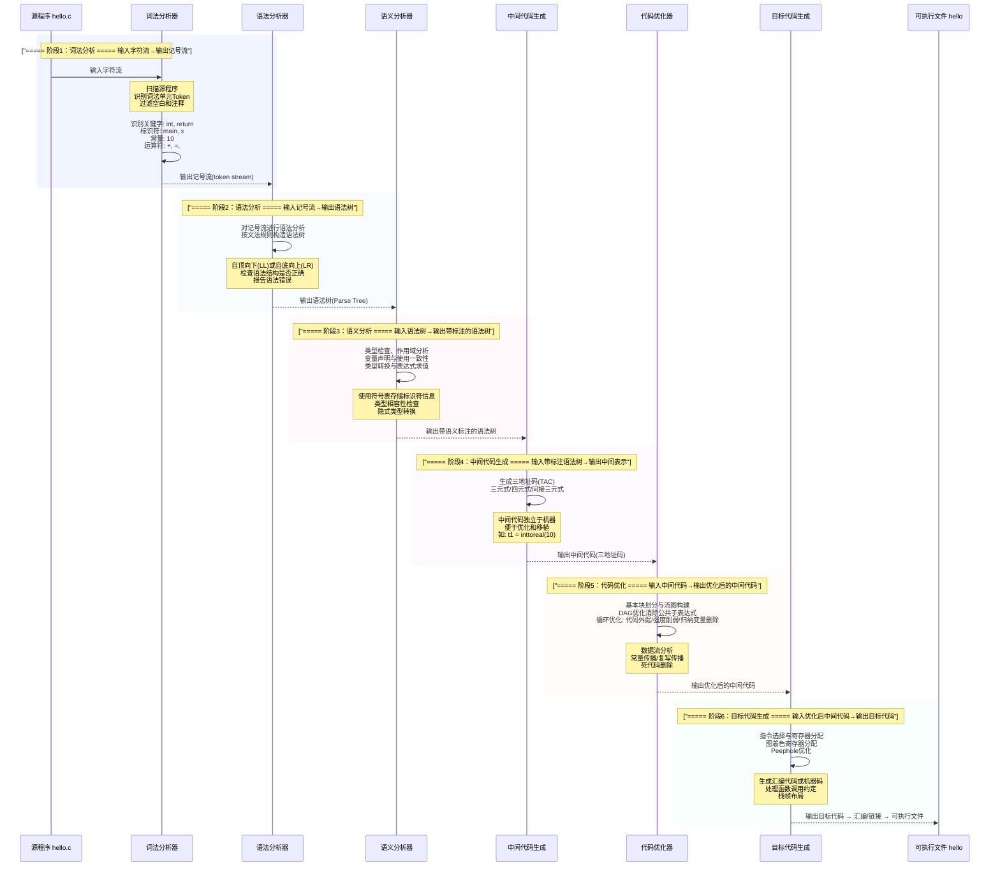

---

## 前置概览：编译原理知识体系拓扑

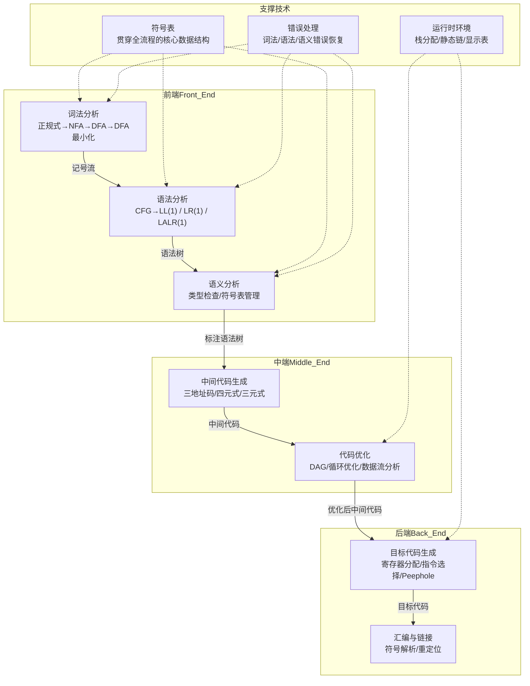

---

## 一、引论：编译过程概述

### 1.1 编译与解释

| 执行方式 | 原理 | 代表 | 特点 |
| -------- | ---- | ---- | ---- |
| #[C|编译执行] | 一次性将源程序翻译为目标代码后执行 | C/C++/Go/Rust | #[G|执行速度快]，编译时发现错误 |
| #[C|解释执行] | 逐条翻译并执行源程序 | Python/JavaScript/Bash | 交互性好，便于调试 |
| #[C|混合执行] | 编译为中间代码(字节码)后在虚拟机上解释执行 | Java/JVM, C#/CLR | 跨平台，平衡性能与灵活性 |

### 1.2 编译程序结构

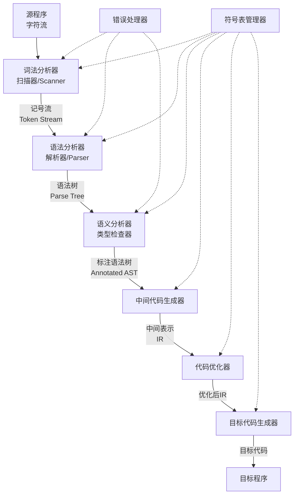

:::important
**编译程序各阶段总结**：
- **前端（Front End）**：词法分析 + 语法分析 + 语义分析 + 中间代码生成。与源语言相关，与目标机器无关。
- **中端（Middle End）**：代码优化。与源语言和目标机器均无关（在中间表示上优化）。
- **后端（Back End）**：目标代码生成。与目标机器相关，与源语言无关。
:::

### 1.3 T型图（Tombstone Diagram）

`#[C|T型图]`用于描述编译程序的实现语言、源语言和目标语言之间的关系。

:::note
**T型图示例：C 编译器用 C 实现，运行于 x86**

        ┌──────────────┐
        │      C       │   ← 源语言：编译器的输入语言（如 C）
        └──────┬───────┘
        ┌──────┴───────┐
        │      C       │   ← 实现语言：编写编译器的语言（如 C）
        └──────┬───────┘
        ┌──────┴───────┐
        │     x86      │   ← 目标语言：编译器输出的目标代码（如 x86 汇编）
        └──────────────┘

**自举（Bootstrapping）过程：**

1. 用汇编编写一个简单的 C 子集编译器 C_sub（输出汇编）
2. 用 C_sub 编写完整的 C 编译器 C_full
3. 用 C_sub 编译 C_full，得到 C_full 的可执行文件
4. 用 C_full 重新编译自身，得到最终的自举编译器
:::

### 1.4 遍（Pass）

`#[C|遍（Pass）]`是指对源程序或其中间表示从头到尾扫描一遍并完成相关处理的过程。

| 遍数 | 特点 | 代表 |
| ---- | ---- | ---- |
| **单遍编译器** | 一遍扫描即生成目标代码，速度快但优化受限 | Pascal 早期编译器 |
| **多遍编译器** | 每遍专注特定任务，便于优化和可移植 | GCC, LLVM/Clang |

:::note
**遍 vs 阶段**：阶段是逻辑划分，遍是物理划分。一遍可包含多个阶段，一个阶段也可分为多遍完成。
:::

---

## 二、词法分析

### 2.1 词法分析器的作用

`#[C|词法分析器（Lexical Analyzer / Scanner）]`读入源程序字符流，输出 `#[C|记号（Token）]`序列。

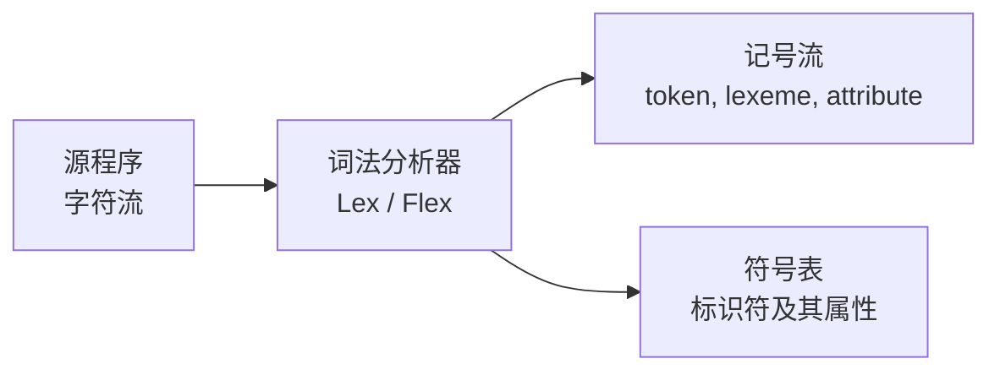

**记号（Token）的组成**：

| 组成部分 | 含义 | 示例 |
| -------- | ---- | ---- |
| **记号名** | 词法单元的抽象类别 | `id`, `num`, `if`, `+` |
| **属性值** | 该记号的具体信息 | 标识符名字、常量值 |
| **词素** | 源程序中匹配记号的字符串 | `"myVar"`, `"123"`, `"+"` |

### 2.2 正规式与正规集

`#[C|正规式（Regular Expression）]`是描述词法规则的形式化工具，`#[C|正规集（Regular Set）]`是正规式能描述的字符串集合。

| 正规式 | 正规集 | 含义 |
| ------ | ------ | ---- |
| $a$ | $\{a\}$ | 单个字符 |
| $r_1 \mid r_2$ | $L(r_1) \cup L(r_2)$ | 或（选择） |
| $r_1 r_2$ | $L(r_1) \cdot L(r_2)$ | 连接 |
| $r^*$ | $L(r)^*$ | 零次或多次重复（Kleene闭包） |
| $r^+$ | $L(r)^+$ | 一次或多次重复（正闭包） |
| $(r)$ | $L(r)$ | 分组 |
| $\varepsilon$ | $\{\varepsilon\}$ | 空串 |

:::note
**正规文法与正规式的关系**：正规文法 $G$ 产生的语言 $L(G)$ 等价于某正规式 $r$ 描述的正规集 $L(r)$。正规文法、正规式、NFA、DFA 四者等价。
:::

### 2.3 有限自动机

#### NFA vs DFA 对比

| 特性 | #[C|NFA]（非确定有限自动机） | #[C|DFA]（确定有限自动机） |
| ---- | ---------------------------- | -------------------------- |
| **状态转移** | 一个输入可有多个后继状态 | 每个输入有且仅有一个后继 |
| **$\varepsilon$ 转移** | 允许 | 不允许 |
| **实现难度** | 简单，易于构造 | 略复杂，但运行效率高 |
| **空间开销** | 状态数少 | 可能状态爆炸（$2^n$） |
| **识别效率** | 需回溯或并行模拟 | $O(n)$ 线性时间 |

#### 有限自动机五元组定义

$$M = (Q, \Sigma, \delta, q_0, F)$$

- $Q$：有限状态集合
- $\Sigma$：输入字母表
- $\delta$：状态转移函数
  - DFA：$\delta: Q \times \Sigma \to Q$
  - NFA：$\delta: Q \times \Sigma \to 2^Q$
- $q_0 \in Q$：初始状态
- $F \subseteq Q$：终止状态集合

### 2.4 NFA → DFA 转换（子集构造法）

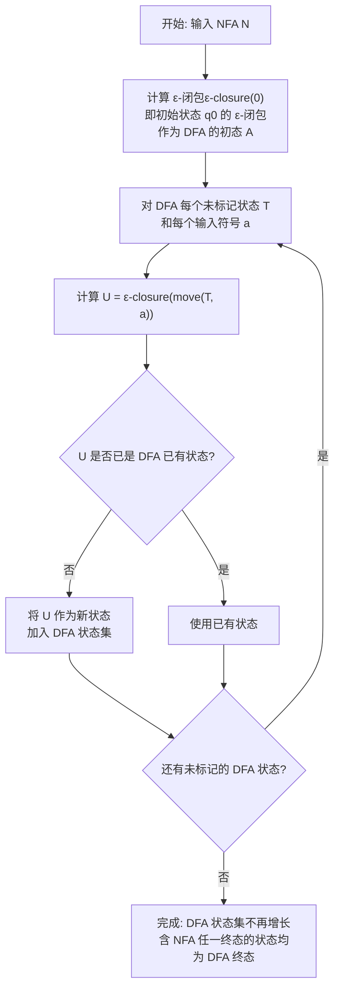

**子集构造法核心操作**：

- `#[C|ε-closure(I)]`：从状态集合 $I$ 出发，仅经过 $\varepsilon$ 边能到达的所有状态的集合
- `#[C|move(I, a)]`：从状态集合 $I$ 出发，经过输入 $a$ 能到达的状态集合

### 2.5 DFA 最小化（Hopcroft 算法）

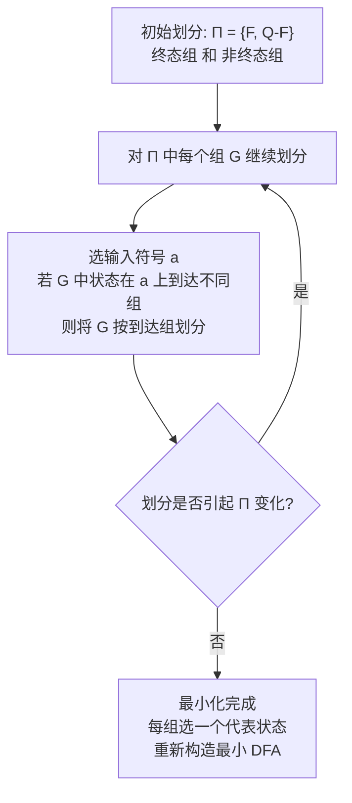

**DFA 最小化原则**：

- `#[C|等价状态]`：对任意输入串，两个状态都同时到达终态或同时不到达终态
- `#[C|可区分状态]`：存在某个输入串使两个状态到达的状态不同（一个终态一个非终态）

### 2.6 LEX/Flex 工具

```lex
/* LEX 源文件格式: 声明部分 %% 规则部分 %% 辅助函数部分 */
%{
/* C 代码声明: 变量、函数、头文件 */
#include <stdio.h>
int lineCount = 1;
%}

/* 正规定义 */
digit   [0-9]
letter  [a-zA-Z]
id      {letter}({letter}|{digit})*

%%
/* 规则部分: 模式 { 动作 } */
"if"        { return IF; }
"else"      { return ELSE; }
{id}        { yylval.id = strdup(yytext); return ID; }
{digit}+    { yylval.num = atoi(yytext); return NUM; }
"+"         { return PLUS; }
[ \t\n]     { /* 忽略空白 */ }
.           { printf("非法字符: %s\n", yytext); }
%%

int yywrap() { return 1; }
```

---

## 三、语法分析

### 3.1 上下文无关文法（CFG）

`#[C|上下文无关文法（Context-Free Grammar）]`是一个四元组：

$$G = (V_T, V_N, S, P)$$

- $V_T$：终结符集合（词法记号）
- $V_N$：非终结符集合（语法变量）
- $S \in V_N$：开始符号
- $P$：产生式集合，形式为 $A \to \alpha$，其中 $A \in V_N, \alpha \in (V_N \cup V_T)^*$

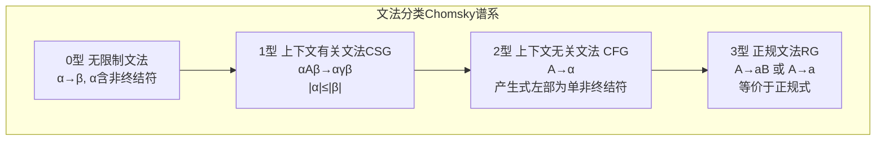

### 3.2 推导、归约与语法树

| 概念 | 定义 | 说明 |
| ---- | ---- | ---- |
| #[C|直接推导] $\Rightarrow$ | 用产生式右部替换左部 | 一步推导 |
| #[C|推导] $\Rightarrow^*$ | 零步或多步直接推导 | 推导序列 |
| #[C|归约] | 推导的逆过程 | 将产生式右部规约为左部 |
| #[C|最左推导] | 每次都替换最左非终结符 | 自顶向下分析对应 |
| #[C|最右推导] | 每次都替换最右非终结符 | 自底向上分析对应（规范推导） |
| #[C|句型] | 推导过程中出现的符号串 | 可含非终结符 |
| #[C|句子] | 仅含终结符的句型 | 语言中的合法程序 |
| #[C|语法树] | 推导的图形表示 | 树根为开始符号，叶为终结符 |

### 3.3 二义性

`#[C|二义性文法]`：存在某个句子有两棵以上不同的语法树（或两种以上不同的最左/最右推导）。

:::warning
**二义性处理方法**：
1. 改写文法，消除二义性（如引入优先级和结合性规则）
2. 附加规则（如 YACC 中使用 `%left`、`%right` 声明优先级）
3. 悬空 else 问题：规定 `else` 与最近的未匹配 `if` 配对
:::

### 3.4 自顶向下语法分析：LL(1)

#### LL(1) 文法判定条件

`#[C|LL(1)文法]`：第一个 L 表示从左到右扫描输入，第二个 L 表示最左推导，1 表示向前看一个符号。

判定条件（三条缺一不可）：
1. 文法不含左递归
2. 对每个非终结符的各候选式的 FIRST 集两两不相交
3. 若某候选式的 FIRST 含 $\varepsilon$，则其 FIRST 与 FOLLOW 不相交

#### FIRST 集与 FOLLOW 集

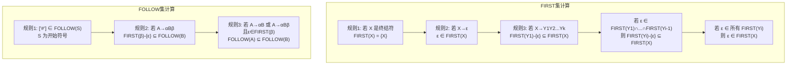

#### LL(1) 预测分析表与递归下降

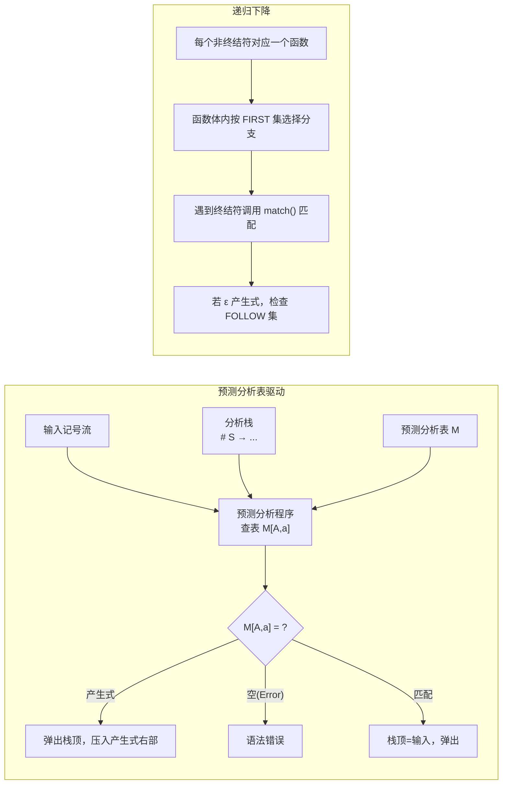

**预测分析表构造**：对每个产生式 $A \to \alpha$，
- 对每个 $a \in FIRST(\alpha)$，将 $A \to \alpha$ 填入 $M[A, a]$
- 若 $\varepsilon \in FIRST(\alpha)$，对每个 $b \in FOLLOW(A)$，将 $A \to \alpha$ 填入 $M[A, b]$

:::note
**左递归消除**：
- 直接左递归 $A \to A\alpha \mid \beta$ → $A \to \beta A'$，$A' \to \alpha A' \mid \varepsilon$
- 间接左递归：先代入展开为直接左递归，再消除
:::

### 3.5 自底向上语法分析：LR 系列

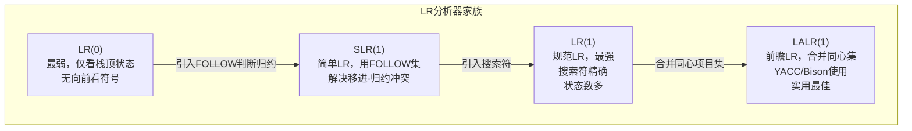

#### LR 分析器结构

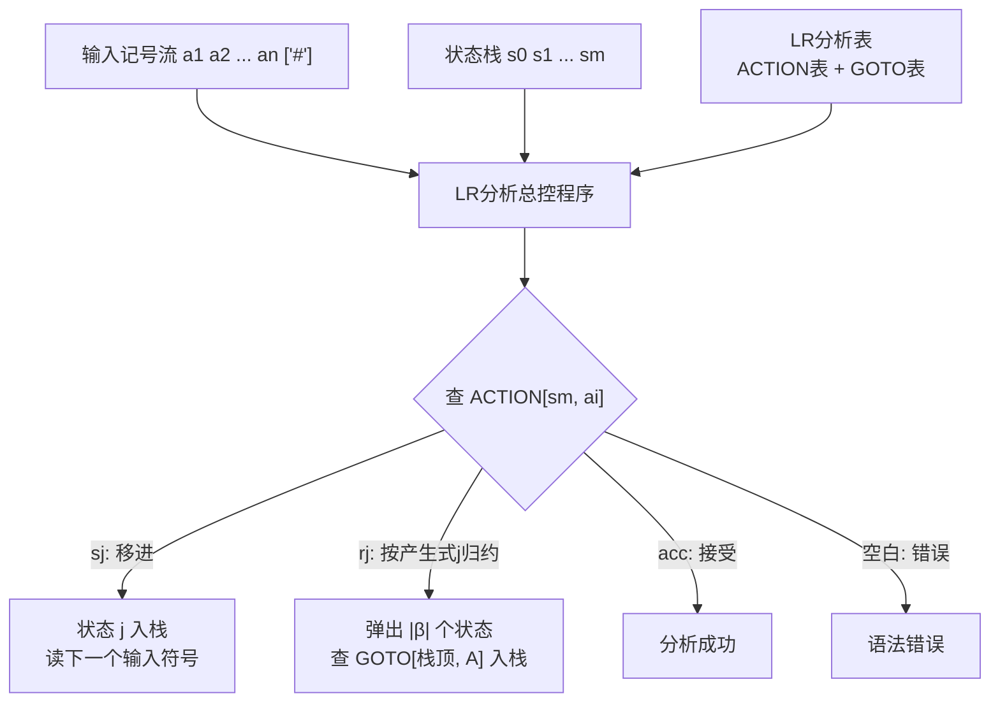

#### 活前缀与 LR 分析表

`#[C|活前缀（Viable Prefix）]`：规范句型的一个前缀，其右端不超过该句型句柄的右端。

`#[C|LR(0) 项目]`：在产生式右部加一个点 `·`，表示当前分析位置。

| 项目类型 | 形式 | 含义 |
| -------- | ---- | ---- |
| 移进项目 | $A \to \alpha \cdot a\beta$ | 期望读入终结符 $a$ |
| 待约项目 | $A \to \alpha \cdot B\beta$ | 期望归约出 $B$ |
| 归约项目 | $A \to \alpha \cdot$ | 可进行归约 |
| 接受项目 | $S' \to S \cdot$ | 分析成功 |

#### LR(1) 项目集规范族构造

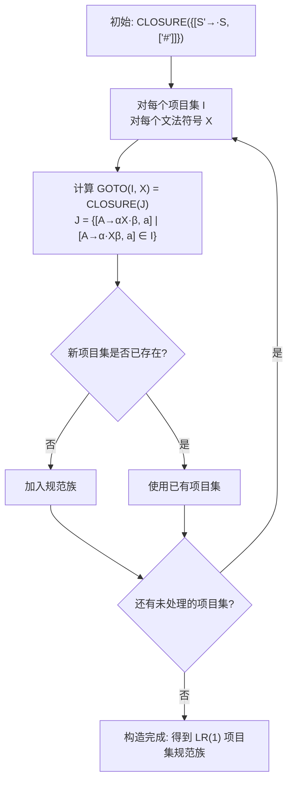

**CLOSURE(I) 计算**：若 $[A \to \alpha \cdot B\beta, a] \in I$，则对每个 $B \to \gamma$ 和每个 $b \in FIRST(\beta a)$，将 $[B \to \cdot \gamma, b]$ 加入闭包。

#### YACC/Bison 工具

```yacc
/* YACC 源文件格式: 声明部分 %% 规则部分 %% 辅助函数 */
%{
#include <stdio.h>
%}

%token ID NUM IF ELSE
%left '+' '-'        /* 左结合 */
%left '*' '/'        /* 优先级更高 */
%right UMINUS        /* 一元负号 */

%%
/* 规则部分: 产生式 { 语义动作 } */
expr: expr '+' expr  { $$ = $1 + $3; }
    | expr '-' expr  { $$ = $1 - $3; }
    | expr '*' expr  { $$ = $1 * $3; }
    | expr '/' expr  { $$ = $1 / $3; }
    | '-' expr %prec UMINUS { $$ = -$2; }
    | '(' expr ')'   { $$ = $2; }
    | ID             { $$ = symtab[$1]; }
    | NUM            { $$ = $1; }
    ;
%%

int yyerror(char *s) { printf("Error: %s\n", s); }
```

### 3.6 语法分析中的错误处理

编译程序应能`#[C|报告错误]`并`#[C|恢复]`，尽可能在一次编译中发现更多错误。

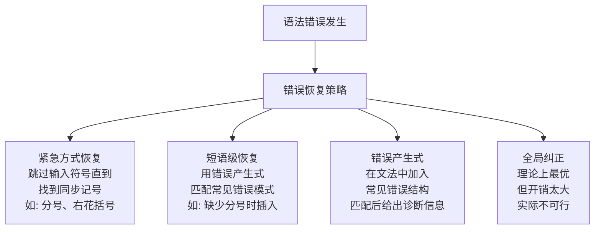

**LL(1) 错误恢复**：在预测分析表中填入错误处理入口，遇到空表项时调用错误处理例程。

**LR 错误恢复**：在 ACTION 表的空白处填入错误处理例程，如弹出栈顶若干状态或跳过若干输入符号，直到找到可恢复的状态。

### 3.7 LR 分析表构造完整示例

以下以经典文法 $E \to E + T \mid T$，$T \to T * F \mid F$，$F \to (E) \mid id$ 为例，展示 LR 分析的完整流程。

**SLR(1) 分析表**：

| 状态 | id | + | * | ( | ) | # | E | T | F |
| ---- | ---- | ---- | ---- | ---- | ---- | ---- | ---- | ---- | ---- |
| 0 | s5 | | | s4 | | | 1 | 2 | 3 |
| 1 | | s6 | | | | acc | | | |
| 2 | | r2 | s7 | | r2 | r2 | | | |
| 3 | | r4 | r4 | | r4 | r4 | | | |
| 4 | s5 | | | s4 | | | 8 | 2 | 3 |
| 5 | | r6 | r6 | | r6 | r6 | | | |
| 6 | s5 | | | s4 | | | | 9 | 3 |
| 7 | s5 | | | s4 | | | | | 10 |
| 8 | | s6 | | | s11 | | | | |
| 9 | | r1 | s7 | | r1 | r1 | | | |
| 10 | | r3 | r3 | | r3 | r3 | | | |
| 11 | | r5 | r5 | | r5 | r5 | | | |

**对 `id + id * id` 的 LR 分析过程**：

| 步骤 | 状态栈 | 符号栈 | 输入串 | 动作 |
| ---- | ------ | ------ | ------ | ---- |
| 0 | 0 | # | id+id*id# | s5 |
| 1 | 05 | #id | +id*id# | r6(F→id) |
| 2 | 03 | #F | +id*id# | r4(T→F) |
| 3 | 02 | #T | +id*id# | r2(E→T) |
| 4 | 01 | #E | +id*id# | s6 |
| 5 | 016 | #E+ | id*id# | s5 |
| 6 | 0165 | #E+id | *id# | r6(F→id) |
| 7 | 0163 | #E+F | *id# | r4(T→F) |
| 8 | 0169 | #E+T | *id# | s7 |
| 9 | 01697 | #E+T* | id# | s5 |
| 10 | 016975 | #E+T*id | # | r6(F→id) |
| 11 | 01697(10) | #E+T*F | # | r3(T→T*F) |
| 12 | 0169 | #E+T | # | r1(E→E+T) |
| 13 | 01 | #E | # | acc |

---
## 四、语法制导翻译与中间代码

### 4.1 语法制导定义（SDD）与翻译方案（SDT）

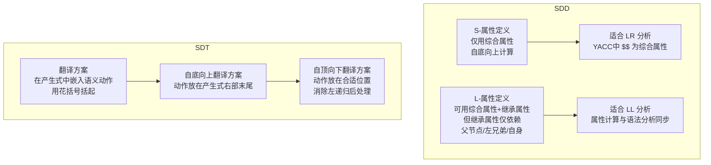

| 属性类型 | 计算方向 | 说明 |
| -------- | -------- | ---- |
| #[C|综合属性] | 自底向上（子→父） | 由子节点属性计算父节点属性 |
| #[C|继承属性] | 自顶向下（父→子/兄弟） | 由父节点或兄弟节点属性计算 |

### 4.2 中间代码形式

#### 三地址码（Three-Address Code）

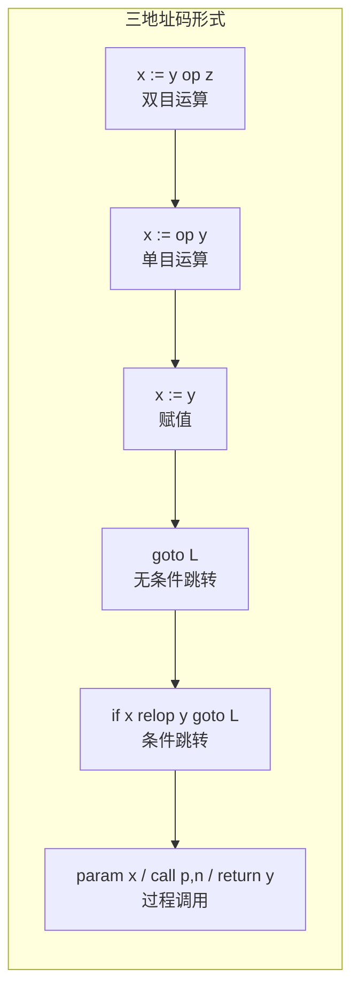

#### 中间代码表示方式对比

| 表示方式 | 结构 | 优点 | 缺点 |
| -------- | ---- | ---- | ---- |
| #[C|四元式] | `(op, arg1, arg2, result)` | 清晰，便于优化 | 临时变量多 |
| #[C|三元式] | `(op, arg1, arg2)` 用序号索引 | 节省临时变量 | 移动困难，不利于优化 |
| #[C|间接三元式] | 三元式 + 间接码表 | 结合两者优点 | 多一层间接 |
| #[C|抽象语法树AST] | 树形结构 | 保持程序结构 | 占有空间大 |
| #[C|DAG有向无环图] | 合并公共子表达式 | 节省空间，利于优化 | 构建稍复杂 |

**四元式示例**：

```python
# 表达式 a = b * -c + b * -c 的四元式表示
# (op,  arg1,  arg2,  result)
("uminus", "c",   "",    "t1")   # t1 = -c
("mul",    "b",   "t1",  "t2")   # t2 = b * t1
("uminus", "c",   "",    "t3")   # t3 = -c
("mul",    "b",   "t3",  "t4")   # t4 = b * t3
("add",    "t2",  "t4",  "t5")   # t5 = t2 + t4
("=",      "t5",  "",    "a")    # a = t5
```

### 4.3 常见语句的翻译方案

**布尔表达式短路计算**：

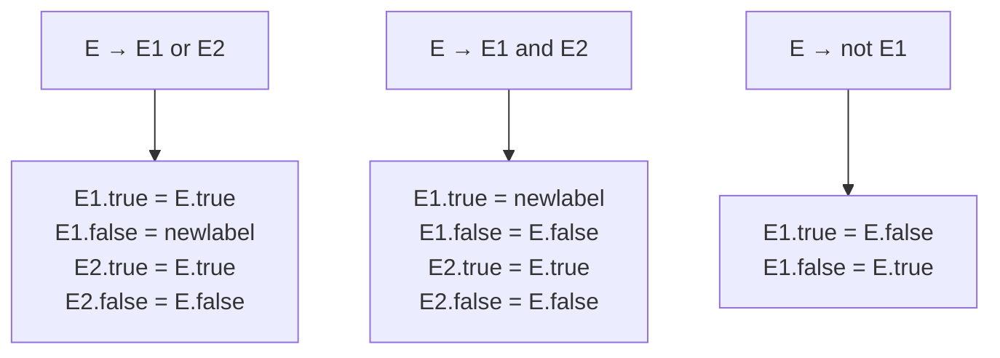

**控制流语句回填技术**：

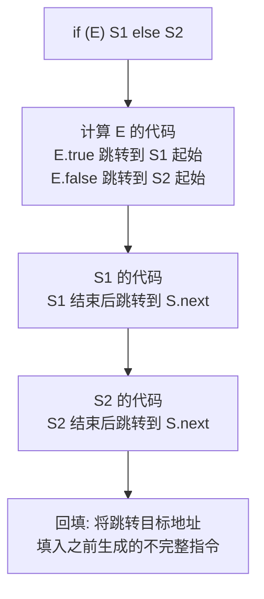

---

## 五、运行时环境

### 5.1 活动记录（Activation Record）

`#[C|活动记录（栈帧）]`是函数调用时在栈上分配的一段连续存储区，用于管理函数的一次执行。

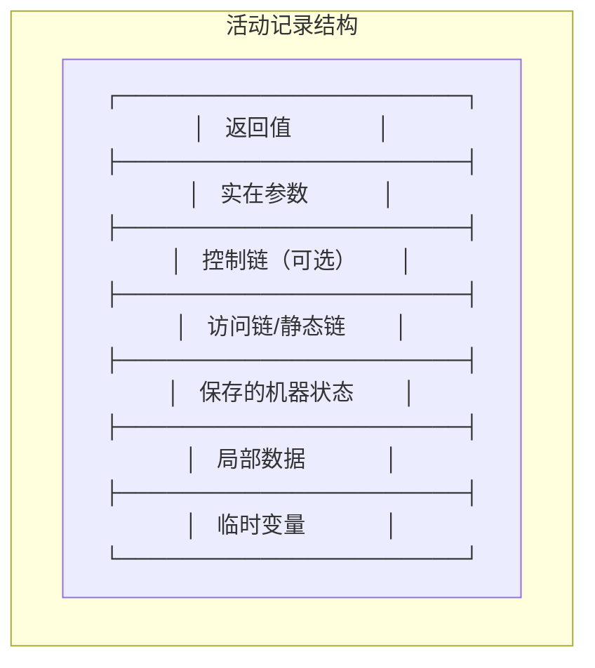

### 5.2 存储分配策略

| 策略 | 时机 | 特点 | 适用 |
| ---- | ---- | ---- | ---- |
| #[C|静态分配] | 编译时确定 | 无递归，效率高 | Fortran 77 |
| #[C|栈式分配] | 运行时动态 | 支持递归，LIFO | C/C++ 局部变量 |
| #[C|堆式分配] | 运行时按需 | 灵活，需 GC 或手动管理 | 动态对象 |

### 5.3 非局部变量访问

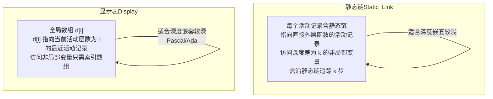

### 5.4 参数传递方式

| 方式 | 原理 | 特点 |
| ---- | ---- | ---- |
| #[C|传值调用] | 将实参的**值**传给形参 | 最安全，无法修改实参（C 默认） |
| #[C|传地址调用] | 将实参的**地址**传给形参 | 形参修改影响实参（C++ &） |
| #[C|传名调用] | 将实参**表达式文本**替换形参 | 每次使用时重新求值（Algol 60） |
| #[C|传值-结果] | 传值进入，返回时复制回去 | 类似传地址，但无别名问题 |

---

## 六、代码优化

### 6.1 优化分类

| 层次 | 优化技术 | 说明 |
| ---- | -------- | ---- |
| #[C|窥孔优化] | 删除冗余指令、合并操作 | 在目标代码上执行 |
| #[C|局部优化] | 基本块内优化 | DAG 优化、常量折叠 |
| #[C|循环优化] | 代码外提、强度削弱 | 循环是优化的重点 |
| #[C|全局优化] | 跨基本块优化 | 数据流分析、全局公共子表达式 |

### 6.2 基本块与流图

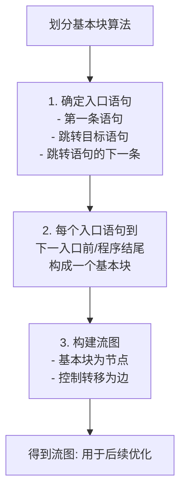

`#[C|基本块]`：一段顺序执行的语句序列，只有一条入口和一条出口，执行时从入口进入，从出口离开，中间不会跳转。

### 6.3 DAG 优化

```mermaid
flowchart TD
    A["对基本块构造 DAG<br/>每个节点代表一个计算"] --> B["节点表示:<br/>n = (op, left, right)<br/>叶节点为初始值"]
    B --> C["构造规则:<br/>1. 若存在相同节点则复用<br/>2. 否则新建节点"]
    C --> D["DAG 优化效果:<br/>消除公共子表达式<br/>复写传播<br/>死代码删除"]
    D --> E["从 DAG 重构优化的<br/>四元式序列"]
```

**DAG 节点类型**：
- 叶节点：以变量名或常量标记，可附加下标区分不同定值
- 内部节点：以运算符标记，代表计算
- 附加标识符：计算结果赋给的变量名

### 6.4 循环优化

```mermaid
flowchart TD
    subgraph 循环优化技术
        A["代码外提<br/>循环不变量移出循环<br/>L = A² + B² 中若 A,B 不变<br/>则提到循环外计算"] --> B["强度削弱<br/>将强度高的运算<br/>替换为强度低的运算<br/>乘法 → 加法"]
        B --> C["删除归纳变量<br/>基本归纳变量 i<br/>同族归纳变量 j = c*i + d<br/>若 i 仅用于控制循环<br/>则可用 j 代替 i 控制"]
        C --> D["循环展开<br/>复制循环体多次<br/>减少循环控制开销<br/>增加指令级并行"]
    end
```

**循环识别**：利用流图中的`#[C|回边]`和`#[C|必经节点]`概念。

- `#[C|必经节点]`：从入口到节点 $n$ 的所有路径都经过节点 $d$，则 $d$ 是 $n$ 的必经节点
- `#[C|回边]`：边 $n \to d$，且 $d$ 是 $n$ 的必经节点
- `#[C|自然循环]`：回边 $n \to d$ 确定的循环，$d$ 为循环头，$n$ 为循环尾

### 6.5 数据流分析

```mermaid
flowchart TD
    subgraph 到达-定值分析
        RD["分析变量定义能到达哪些点<br/>用于常量传播/复写传播"]
    end

    subgraph 活跃变量分析
        LV["分析变量在程序点之后是否被引用<br/>用于寄存器分配<br/>活跃区间不重叠的变量<br/>可共享寄存器"]
    end

    subgraph 可用表达式分析
        AE["分析表达式是否已计算且未变化<br/>用于消除全局公共子表达式"]
    end

    RD --> LV --> AE
```

**数据流方程通用形式**：

- `#[C|前向流]`：$out[B] = gen[B] \cup (in[B] - kill[B])$，$in[B] = \bigcap_{P \in pred(B)} out[P]$
- `#[C|后向流]`：$in[B] = use[B] \cup (out[B] - def[B])$，$out[B] = \bigcap_{S \in succ(B)} in[S]$

---

## 七、目标代码生成

### 7.1 目标代码生成器任务

```mermaid
graph TD
    A["优化后的中间代码"] --> B["指令选择<br/>选择合适的目标机指令"]
    B --> C["指令调度<br/>重排指令提高流水线效率"]
    C --> D["寄存器分配<br/>将变量映射到寄存器<br/>减少访存"]
    D --> E["目标代码<br/>汇编/机器码"]
```

### 7.2 寄存器分配：图着色法

```mermaid
flowchart TD
    A["构建冲突图/干涉图<br/>节点: 每个活跃期(变量)<br/>边: 两个变量活跃期重叠"] --> B["对图进行 k-着色<br/>k = 可用寄存器数<br/>相邻节点不能同色"]
    B --> C{"可k-着色?"}
    C -->|是| D["成功: 每种颜色对应一个寄存器<br/>同色变量可共享寄存器"]
    C -->|否| E["选择溢出候选<br/>将某个变量存入内存<br/>从图中删除该节点"]
    E --> B
```

**图着色寄存器分配步骤**：
1. 构建冲突图：每个虚拟寄存器为节点，活跃区间重叠的节点间连边
2. 简化：反复删除度数 < k 的节点并入栈
3. 溢出：若所有节点度数 ≥ k，选择一个溢出候选
4. 选择：按出栈顺序为节点分配颜色（寄存器）

### 7.3 Peephole 优化

`#[C|窥孔优化（Peephole Optimization）]`：在目标代码上，通过一个滑动窗口（窥孔）检查相邻几条指令，进行局部优化。

| 优化技术 | 示例 |
| -------- | ---- |
| #[C|冗余指令删除] | `MOV R0, R1; MOV R1, R0` → 删除第二条 |
| #[C|控制流优化] | `JMP L1; L1: ...` → 删除冗余跳转 |
| #[C|代数化简] | `ADD R0, #0` → 删除 |
| #[C|强度削弱] | `MUL R0, #2` → `SHL R0, #1` |
| #[C|机器特有优化] | 利用特殊指令替代多条指令 |

---

## 八、考研核心对照表

### 8.1 文法判定条件速查

| 文法类型 | 判定条件 | 分析方法 |
| -------- | -------- | -------- |
| #[C|LL(1)] | 无左递归 + FIRST 不相交 + ε 时 FIRST∩FOLLOW=∅ | 预测分析/递归下降 |
| #[C|LR(0)] | 项目集无移进-归约冲突 | LR(0) 分析 |
| #[C|SLR(1)] | 用 FOLLOW 解决冲突无二义 | SLR(1) 分析 |
| #[C|LR(1)] | 用搜索符精确判断无冲突 | LR(1) 分析 |
| #[C|LALR(1)] | 合并同心集后无冲突 | LALR(1) 分析（YACC） |

### 8.2 常见算法复杂度

| 算法 | 时间复杂度 | 空间复杂度 |
| ---- | ---------- | ---------- |
| #[C|DFA 模拟] | $O(n)$ | $O(\mid Q \mid \times \mid \Sigma \mid)$ |
| #[C|NFA→DFA 子集构造] | $O(2^{\mid Q \mid})$ 最坏 | $O(2^{\mid Q \mid})$ 最坏 |
| #[C|DFA 最小化] | $O(\mid Q \mid \log \mid Q \mid)$ | $O(\mid Q \mid)$ |
| #[C|LL(1) 分析] | $O(n)$ | $O(\mid V_N \mid \times \mid V_T \mid)$ |
| #[C|LR(1) 分析] | $O(n)$ | 状态数可能很大 |
| #[C|LALR(1) 分析] | $O(n)$ | 比 LR(1) 小很多 |

### 8.3 核心公式汇总

| 公式 | 含义 |
| ---- | ---- |
| $FIRST(\alpha) = \{a \mid \alpha \Rightarrow^* a\cdots, a \in V_T\}$ | FIRST 集定义 |
| $FOLLOW(A) = \{a \mid S \Rightarrow^* \cdots Aa\cdots, a \in V_T\}$ | FOLLOW 集定义 |
| $CLOSURE(I) = I \cup \{[B \to \cdot \gamma] \mid [A \to \alpha \cdot B\beta] \in I\}$ | LR(0) 闭包 |
| $GOTO(I, X) = CLOSURE(\{[A \to \alpha X \cdot \beta] \mid [A \to \alpha \cdot X\beta] \in I\})$ | LR GOTO 函数 |
| $out[B] = gen[B] \cup (in[B] - kill[B])$ | 数据流前向方程 |
| $in[B] = use[B] \cup (out[B] - def[B])$ | 数据流后向方程 |

### 8.4 词法/语法分析工具对比

| 工具 | 功能 | 输入 | 输出 |
| ---- | ---- | ---- | ---- |
| #[C|Lex / Flex] | 词法分析器生成 | `.l` 文件（正规式+动作） | `lex.yy.c` |
| #[C|YACC / Bison] | 语法分析器生成 | `.y` 文件（CFG+语义动作） | `y.tab.c` |
| #[C|ANTLR] | LL(*) 分析器生成 | `.g4` 语法文件 | Java/C++/Python 等 |
| #[C|LLVM] | 编译器基础设施 | LLVM IR | 多平台目标代码 |

### 8.5 文法等价转换

```mermaid
graph TD
    A["正规式"] <-->|"等价转换"| B["NFA"]
    B <-->|"子集构造法/逆子集构造"| C["DFA"]
    C -->|"最小化"| D["最小DFA"]
    A <--> E["正规文法"]
    E -->|"⊂ 真子集"| F["上下文无关文法CFG"]
```

### 8.6 符号表管理

`#[C|符号表（Symbol Table）]`是编译程序中最核心的数据结构，贯穿词法分析到目标代码生成的全部阶段。

```mermaid
graph TD
    subgraph 符号表操作
        A["插入 insert<br/>词法分析发现新标识符<br/>将其加入符号表"] --> B["查找 lookup<br/>语法/语义分析时<br/>查询标识符属性"]
        B --> C["删除 delete<br/>作用域结束时<br/>删除该作用域标识符"]
    end

    subgraph 符号表实现
        D["哈希表<br/>O(1)平均查找<br/>需处理冲突"] --> E["多符号表<br/>每个作用域一张表<br/>用作用域栈管理"]
        E --> F["链式符号表<br/>每个作用域一个哈希表<br/>通过父指针链接<br/>查找时沿链向上搜索"]
    end
```

**符号表典型表项**：

| 字段 | 含义 | 示例 |
| ---- | ---- | ---- |
| 名字 | 标识符的字符串 | `"myVar"` |
| 种类 | 变量/函数/类型/常量 | `variable` |
| 类型 | int/float/array/struct | `int[10]` |
| 作用域层级 | 嵌套深度 | `2` |
| 存储类别 | static/extern/auto/register | `auto` |
| 地址/偏移 | 运行时存储位置 | 栈帧偏移 `-8` |

### 8.7 编译后端详解：汇编与链接

```mermaid
flowchart TD
    A["汇编器 Assembler<br/>将汇编代码翻译为<br/>可重定位目标文件 .o"] --> B["目标文件结构<br/>- 代码段 .text<br/>- 数据段 .data/.bss<br/>- 符号表<br/>- 重定位表"]
    B --> C["链接器 Linker<br/>符号解析 + 重定位"]
    C --> D["符号解析<br/>将每个符号引用<br/>与一个符号定义关联"]
    C --> E["重定位<br/>合并各模块的段<br/>修正符号地址"]
    D --> F["可执行文件"]
    E --> F
```

**链接类型**：
- `#[C|静态链接]`：库代码嵌入可执行文件，文件大但独立运行
- `#[C|动态链接]`：运行时加载共享库 .so/.dll，节省空间但依赖环境

**位置无关代码（PIC）**：代码中不使用绝对地址，支持动态链接时加载到任意地址。

---
## 九、全流程综合实战

### 9.1 从 `hello.c` 到 `hello` 完整编译过程

以下以一个简单的 C 程序为例，展示编译全过程每一步的输入输出。

**源程序 `hello.c`**：

```c
#include <stdio.h>
int main() {
    int x = 10;
    int y = x + 5;
    printf("result = %d\n", y);
    return 0;
}
```

**完整编译命令**：`gcc -v hello.c -o hello` 实际执行以下步骤：

```mermaid
sequenceDiagram
    participant C as 预处理器 cpp
    participant L as 编译器 cc1
    participant A as 汇编器 as
    participant LD as 链接器 ld

    C->>C: 展开 #include<br/>替换 #define 宏<br/>处理条件编译 #ifdef
    C-->>L: hello.i（预处理后的 C 代码）
    Note over L: 编译三阶段：<br/>1. 词法分析→记号流<br/>2. 语法分析→语法树<br/>3. 语义分析→中间代码
    L->>L: 生成三地址码<br/>t1 = 10<br/>t2 = x + 5<br/>y = t2
    L->>L: 代码优化<br/>常量传播: y = 15<br/>死代码删除: 删除 x
    L->>L: 生成 x86-64 汇编代码
    L-->>A: hello.s（汇编代码）
    A->>A: 将汇编指令翻译为<br/>机器码 + 重定位信息
    A-->>LD: hello.o（可重定位目标文件）
    LD->>LD: 链接 C 运行时库 crt0.o<br/>链接 libc.so（printf 实现）<br/>符号解析与重定位
    LD-->>LD: hello（ELF 可执行文件）
```

### 9.2 各阶段输入输出对照

| 阶段 | 输入 | 输出 | 工具 |
| ---- | ---- | ---- | ---- |
| #[C|预处理] | `hello.c` | `hello.i` | `cpp` |
| #[C|编译] | `hello.i` | `hello.s` | `cc1` |
| #[C|汇编] | `hello.s` | `hello.o` | `as` |
| #[C|链接] | `hello.o` + 库文件 | `hello`（可执行） | `ld` |

### 9.3 中间代码生成实例

**源程序 AST → 三地址码**：

```python
# 源程序: int x = 10; int y = x + 5;
# 经过语义分析后生成的三地址码（四元式）

# (op,        arg1,  arg2,  result)
("const",     10,    "",     "t1")    # t1 = 10
("assign",    "t1",  "",     "x")     # x = t1
("const",     5,     "",     "t2")    # t2 = 5
("add",       "x",   "t2",   "t3")    # t3 = x + t2
("assign",    "t3",  "",     "y")     # y = t3
```

**优化后**（常量传播 + 常量折叠）：

```python
# 优化后的结果
("const",     10,    "",     "x")     # x = 10
("const",     15,    "",     "y")     # y = 15
```

### 9.4 目标代码生成实例

**优化后的三地址码 → x86-64 汇编**：

```c
// 三地址码: x = 10; y = 15; printf("result = %d\n", y);
// 生成的 x86-64 汇编（AT&T 语法）

.section .rodata
.LC0:  .string "result = %d\n"

.section .text
.globl main
main:
    pushq   %rbp              # 保存旧栈帧基址
    movq    %rsp, %rbp         # 设置新栈帧
    subq    $16, %rsp          # 分配栈空间

    movl    $10, -4(%rbp)      # x = 10
    movl    $15, -8(%rbp)      # y = 15

    movl    -8(%rbp), %esi     # 加载 y 到 esi（第二个参数）
    movl    $.LC0, %edi        # 加载格式串到 edi（第一个参数）
    movl    $0, %eax           # 清空 eax（可变参数标记）
    call    printf             # 调用 printf

    movl    $0, %eax           # 返回值 0
    leave                      # 恢复栈帧
    ret                        # 返回
```

---

> **全书总结**：编译原理围绕**词法分析 → 语法分析 → 语义分析 → 中间代码生成 → 代码优化 → 目标代码生成**这六大阶段展开。词法分析是基础，用正规式和自动机理论；语法分析是核心，LL(1) 和 LR(1) 系列方法各有适用场景；语法制导翻译连接语法与语义；中间代码承上启下；代码优化提升性能；目标代码生成面向具体硬件。符号表贯穿始终，错误处理覆盖全流程。掌握各阶段的基本概念、核心算法和形式化方法，配合真题练习，可应对考研要求。