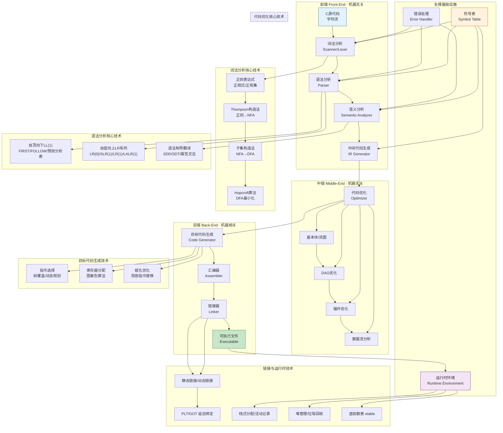

```mermaid
sequenceDiagram
    participant SRC as "C源代码<br/>source.c"
    participant LEX as "词法分析器<br/>Scanner/Lexer"
    participant PRS as "语法分析器<br/>Parser"
    participant SEM as "语义分析器<br/>Semantic Analyzer"
    participant IR as "中间代码生成器<br/>IR Generator"
    participant OPM as "代码优化器<br/>Optimizer"
    participant CG as "目标代码生成器<br/>Code Generator"
    participant ASM as "汇编器<br/>Assembler"
    participant LD as "链接器<br/>Linker"
    participant EXE as "可执行文件<br/>Executable"
    participant RT as "运行时环境<br/>Runtime"
    participant ST as "符号表<br/>Symbol Table"

    %% ===================== 阶段0：编译概览 =====================
    rect rgba(230, 240, 255, 0.4)
    Note over SRC,EXE: ===== 阶段0：编译全流程概览 =====
    Note over SRC,EXE: 从C源代码到可执行文件的全链路编译之旅<br/>前端：词法分析→语法分析→语义分析→中间代码生成<br/>中端：代码优化<br/>后端：目标代码生成→汇编→链接→可执行文件

    SRC->>LEX: 字符流输入
    Note right of SRC: int a = b + 3 * 5;
    LEX->>PRS: Token流输出：int/KW a/ID =/OP b/ID +/OP 3/NUM 星/OP 5/NUM 分号/SEP
    PRS->>SEM: 语法树 AST：赋值语句【标识符a, 表达式【标识符b, 乘法【3, 5】】】
    SEM->>IR: 带类型标注的AST，类型检查通过，变量声明完成
    IR->>OPM: 三地址码 TAC 序列：t1=3×5, t2=b+t1, a=t2
    OPM->>CG: 优化后的中间代码：t1=15, a=b+15（常量折叠优化）
    CG->>ASM: 汇编代码：mov eax,[b]分号 add eax,15分号 mov [a],eax
    ASM->>LD: 可重定位目标文件 .o<br/>机器码 + 符号表 + 重定位信息
    LD->>EXE: 可执行文件 ELF<br/>静态/动态链接完成，地址绑定
    end

    %% ===================== 阶段1：词法分析 =====================
    rect rgba(255, 245, 235, 0.4)
    Note over SRC,LEX: ===== 阶段1：词法分析 · 正则→NFA→DFA→最小化DFA =====

    Note over SRC: "正规式描述词法规则"
    Note left of SRC: "关键字: int|float|if|else|while|for|return<br/>标识符: [a-zA-Z_][a-zA-Z0-9_]*<br/>整数: [0-9]+<br/>运算符: +|-|*|/|==|!=|<=|>=|<|><br/>界符: ；|,|(|)|{|}"

    SRC->>LEX: 输入字符流: int a = 3 + 5分号
    Note over LEX: "正则→NFA Thompson构造法<br/>每个基本正规式对应一个基本NFA<br/>通过ε连接、并、闭包复合<br/>得到完整NFA(状态数=正规式长度)"
    Note over LEX: "NFA→DFA 子集构造法<br/>步骤1: 求ε-closure(初始状态集)<br/>步骤2: 对每个字符a求move(状态集, a)<br/>步骤3: 再求ε-closure → 得到DFA新状态<br/>重复直到不再产生新状态"
    Note over LEX: "DFA最小化 Hopcroft算法<br/>初始划分: 终态组 + 非终态组<br/>反复检查: 对于同一组的两个状态s,t<br/>对任意输入a, 若move(s,a)和move(t,a)在不同组<br/>则s和t 可区分 → 分裂该组<br/>直到不再分裂 → 每组为一个等价状态"
    Note over LEX: "LEX/Flex工具: 输入正规式描述文件(.l)<br/>自动生成C语言词法分析器源码<br/>核心: lex.yy.c 包含 yylex()函数"

    LEX-->>SRC: Token流输出<br/>Token结构 = 【记号名, 属性值, 词素】<br/>如: 【KW_INT, -, int】 【ID, a, a】 【OP_ASSIGN, -, =】
    end

    %% ===================== 阶段2：语法分析-自顶向下LL(1) =====================
    rect rgba(240, 255, 240, 0.4)
    Note over LEX,PRS: ===== 阶段2：语法分析(上) · 自顶向下LL(1)分析法 =====

    Note over LEX: "输入: Token流"
    LEX->>PRS: Token序列: int a = b + 3 * 5分号
    Note over PRS: "上下文无关文法CFG 四元组 G=(Vt, Vn, S, P)<br/>Vt: 终结符(token)集合<br/>Vn: 非终结符(语法变量)集合<br/>S: 开始符号<br/>P: 产生式集合"

    Note over PRS: "步骤1: 消除左递归<br/>原规则: E → E+T | T<br/>消除后: E → TE'<br/>E' → +TE' | ε<br/>立即左递归: A→Aα|β → A→βA', A'→αA'|ε"

    Note over PRS: "步骤2: 提取左公因子<br/>原规则: A → αβ1 | αβ2<br/>提取后: A → αA'<br/>A' → β1 | β2"

    Note over PRS: 步骤3: FIRST集计算<br/>FIRST(α) = {a | α⇒* a...}<br/>若α⇒* ε, 则ε∈FIRST(α)<br/>规则: 终结符加入FIRST； 非终结符递归展开

    Note over PRS: "步骤4: FOLLOW集计算<br/>FOLLOW(A) = {a | S⇒* ...Aa...}<br/>规则: 将$放入FOLLOW(S)<br/>若A→αBβ, 则将FIRST(β)-{ε}加入FOLLOW(B)<br/>若β⇒* ε, 则将FOLLOW(A)加入FOLLOW(B)"

    Note over PRS: "步骤5: 预测分析表构造<br/>对每个产生式A→α:<br/>对每个a∈FIRST(α), 将A→α填入M[A,a]<br/>若ε∈FIRST(α): 对每个b∈FOLLOW(A), 填入M[A,b]"

    Note over PRS: "LL(1)判定三条件<br/>1. 文法不含左递归<br/>2. 对每个非终结符A, 各产生式FIRST集两两不相交<br/>3. 若ε∈FIRST(A→α), 则FIRST(α)∩FOLLOW(A)=∅"

    Note over PRS: "递归下降分析: 每个非终结符对应一个子程序<br/>分析栈操作: 移进/匹配/接受/报错"
    end

    %% ===================== 阶段3：语法分析-自底向上LR系列 =====================
    rect rgba(255, 240, 255, 0.4)
    Note over LEX,PRS: ===== 阶段3：语法分析(下) · 自底向上LR系列 =====

    Note over PRS: "LR(0)项目: 在产生式右部加点 · 表示已分析位置<br/>形如 A→α·β  (移进项目) 或 A→α· (归约项目)<br/>项目集规范族: 所有LR(0)项目集的集合<br/>通过闭包CLOSURE和转移函数GOTO构造"

    Note over PRS: "LR(0)分析表: ACTION表 + GOTO表<br/>移进s: 将状态s和符号压栈<br/>归约r: 按产生式归约，弹出相应符号<br/>接受acc: 分析成功<br/>报错: 语法错误"

    Note over PRS: "SLR(1): 用FOLLOW集解决LR(0)冲突<br/>对归约项目A→α·, 仅当输入符号∈FOLLOW(A)时才归约<br/>不足: 不能处理所有LR(1)文法"

    Note over PRS: "LR(1): 引入搜索符(前瞻符)<br/>项目形式: A→α·β, a  (a为搜索符)<br/>能力强: 识别所有能用上下文无关文法描述的语言<br/>代价: 状态数庞大，是LR(0)的指数倍"

    Note over PRS: "LALR(1): 合并LR(1)的同心集<br/>同一核心项目(忽略搜索符)的项目集合并<br/>实用: 状态数=LR(0)的状态数，能力接近LR(1)<br/>副作用: 可能引入归约-归约冲突(不会引入移进-归约)"

    Note over PRS: "LR分析器结构:<br/>状态栈 | 符号栈 | 输入缓冲区 | ACTION/GOTO表<br/>移进-归约冲突: 同一状态同时有移进和归约项<br/>归约-归约冲突: 同一状态有多个归约项"

    Note over PRS: "YACC/Bison工具: 输入.y文法文件<br/>自动生成LALR(1)分析器C源码<br/>用%%分隔声明、规则、辅助代码三部分"
    end

    %% ===================== 阶段4：语法制导翻译与语义分析 =====================
    rect rgba(245, 248, 255, 0.4)
    Note over PRS,SEM: ===== 阶段4：语法制导翻译与语义分析 =====

    PRS->>SEM: 语法树 AST
    Note over SEM: "语法制导定义 SDD: 每个文法符号关联属性<br/>每个产生式关联语义规则<br/>综合属性: 自底向上计算，子节点→父节点<br/>继承属性: 自顶向下计算，父节点/兄弟→本节点"

    Note over SEM: "S属性定义: 仅含综合属性<br/>可用自底向上分析器一遍计算<br/>L属性定义: 属性依赖从左到右<br/>可用自顶向下分析器计算"

    Note over SEM: "注释语法分析树: 每个节点标注属性值<br/>语义规则执行顺序即属性计算顺序"

    Note over SEM: "符号表 组织方式:<br/>散列表: O(1)平均查找，处理冲突(拉链/开放寻址)<br/>栈式符号表: 进入作用域压栈，离开弹出<br/>条目: 名字+类型+存储类别+作用域+行号+偏移"

    Note over SEM: "类型检查: 表达式类型推导<br/>类型等价: 名等价(结构相同但类型名不同→不等价)<br/>结构等价: 结构相同即为等价<br/>类型转换: 隐式(自动提升) vs 显式(强制转换)"

    Note over SEM: "作用域规则:<br/>静态作用域: 编译时确定，查声明位置<br/>最近嵌套规则: 从内层逐层向外查找<br/>动态作用域: 运行时确定，查调用链(不常用)"
    end

    %% ===================== 阶段5：中间代码生成 =====================
    rect rgba(255, 250, 240, 0.4)
    Note over SEM,IR: ===== 阶段5：中间代码生成 · 三地址码TAC =====

    SEM->>IR: "带类型标注的AST"
    Note over IR: "三地址码 TAC: 每条指令最多三个操作数<br/>形式: x = y op z<br/>四元式: (op, arg1, arg2, result)<br/>三元式: (op, arg1, arg2) 用序号表示结果<br/>间接三元式: 在三元式基础上加间接层"

    Note over IR: "布尔表达式翻译:<br/>短路求值: A && B (A为假则不求B)<br/>A || B (A为真则不求B)<br/>真出口/假出口: 跳转到对应代码位置<br/>回填技术: 先生成跳转指令但不填目标<br/>用链表记录待填位置，目标确定后统一回填"

    Note over IR: "控制流语句翻译:<br/>if (E) S1 else S2:<br/>  E.code → if E==false goto L1； S1.code； goto L2； L1: S2.code； L2:<br/>while (E) S:<br/>  L1: E.code； if E==false goto L2； S.code； goto L1； L2:<br/>for (E1；E2；E3) S:<br/>  E1.code； L1: E2.code； if E2==false goto L2； S.code； E3.code； goto L1； L2:"

    Note over IR: "过程调用翻译:<br/>call proc, n  (n为参数个数)<br/>栈式分配: 活动记录 AR 结构<br/>AR包含: 返回地址→参数→控制链→访问链→局部数据→临时变量"
    end

    %% ===================== 阶段6：代码优化 =====================
    rect rgba(240, 248, 248, 0.4)
    Note over IR,OPM: ===== 阶段6：代码优化 · 基本块/流图/DAG/循环优化 =====

    IR->>OPM: "三地址码序列"
    Note over OPM: "基本块划分:<br/>①确定入口语句: 第一条指令/跳转目标/跳转后继<br/>②入口到下一个入口前(不含)为一个基本块<br/>流图: 基本块为节点，跳转关系为边"

    Note over OPM: "DAG优化 基本块内:<br/>每个变量对应DAG节点，重复计算合并<br/>自动消除: 公共子表达式/死代码<br/>从DAG重写三地址码，减少指令数"

    Note over OPM: "公共子表达式消除:<br/>识别重复计算: a=b+c； d=b+c → d=a<br/>常量折叠: 编译时计算常量表达式<br/>x=3*5 → x=15<br/>常量传播: 用常量值替换变量引用<br/>a=3； b=a+2 → b=5<br/>死代码删除: 删除永不被执行/结果永不使用的代码"

    Note over OPM: "循环优化:<br/>代码外提: 循环不变运算移到循环外<br/>for(i=0；i<n；i++){x=a+b；} → x=a+b； for(i=0；i<n；i++){}<br/>强度削弱: 用低代价运算替换高代价<br/>i*4 → 累加4(乘法→加法)<br/>归纳变量删除: 发现变量间的线性关系<br/>i=j*4+1, 可用i替代j避免额外计算"

    Note over OPM: "数据流分析:<br/>到达-定值: 某定值能到达哪些引用点<br/>活跃变量: 变量在某点的值之后是否被使用<br/>可用表达式: 表达式在某点是否已计算且未失效<br/>全局优化: 跨越基本块的优化"
    end

    %% ===================== 阶段7：目标代码生成 =====================
    rect rgba(255, 248, 248, 0.4)
    Note over OPM,CG: ===== 阶段7：目标代码生成 · 指令选择/寄存器分配/窥孔优化 =====

    OPM->>CG: "优化后的中间代码"
    Note over CG: "指令选择:<br/>树覆盖: 将IR表示为树，用目标指令模板覆盖<br/>每条目标指令对应一个树模式<br/>动态规划: 自底向上计算最小代价覆盖<br/>Optimal: 全局最优指令选择"

    Note over CG: "寄存器分配 图着色算法:<br/>①计算每个变量的活跃区间<br/>②构建冲突图: 节点=变量, 边=同时活跃<br/>③若节点度数<K(可用寄存器数)<br/>  则删除该节点压栈<br/>④若所有节点度数≥K → 溢出Spill<br/>  选一个代价最小的变量溢出到内存<br/>⑤重复直到所有节点可着色<br/>⑥从栈中弹出节点，分配不同颜色(寄存器)"

    Note over CG: "窥孔优化 Peephole:<br/>滑动窗口扫描已生成的指令序列<br/>局部替换: MOV R0,a； MOV a,R0 → MOV R0,a<br/>删除冗余: PUSH R0； POP R0 → 删除"

    Note over CG: "目标代码格式:<br/>可重定位机器码 / 汇编代码 / 绝对机器码<br/>指令调度: 重排指令消除流水线暂停<br/>调用约定: cdecl/stdcall/fastcall<br/>参数传递: 栈/寄存器, 调用者/被调用者清理栈"
    end

    %% ===================== 阶段8：汇编与链接 =====================
    rect rgba(235, 245, 255, 0.4)
    Note over CG,EXE: ===== 阶段8：汇编与链接 · 两遍汇编/ELF/静态与动态链接 =====

    CG->>ASM: "汇编代码 .s"
    Note over ASM: "两遍汇编:<br/>第一遍: 扫描符号表 → 记录所有标号及地址<br/>第二遍: 翻译为机器码 → 填入符号地址<br/>生成可重定位目标文件 .o"

    Note over ASM: "ELF格式 目标文件:<br/>ELF Header: 魔数/类型/入口/段表偏移<br/>.text: 代码段<br/>.data: 已初始化全局变量<br/>.rodata: 只读数据(字符串常量)<br/>.bss: 未初始化全局变量(不占文件空间)<br/>.symtab: 符号表<br/>.rel.text: 代码重定位表<br/>.rel.data: 数据重定位表"

    ASM->>LD: "可重定位目标文件 .o"
    Note over LD: "链接器 两大任务:"

    Note over LD: "任务1: 符号解析<br/>将每个符号引用与一个符号定义关联<br/>强符号: 函数/已初始化全局变量<br/>弱符号: 未初始化全局变量<br/>#R 多重定义: 多个强符号同名→链接错误<br/>#R 强弱共存: 选择强符号"

    Note over LD: "任务2: 重定位<br/>合并所有目标文件的相同段<br/>绝对重定位: 修改绝对地址引用<br/>PC相对重定位: 修改相对PC的偏移量<br/>重定位条目: offset + type + symbol"

    Note over LD: "静态链接: 编译时将所有库代码复制到可执行文件<br/>#[G] 独立运行, 无外部依赖<br/>#[R] 文件大, 更新需重新编译"

    Note over LD: "动态链接: 运行时加载共享库 .so/.dll<br/>PLT/GOT机制:<br/>PLT(过程链接表): 代码桩, 首次调用触发动态解析<br/>GOT(全局偏移表): 存储解析后的函数地址<br/>延迟绑定: 首次调用时通过动态链接器解析<br/>后续调用直接从GOT取地址"

    LD->>EXE: "可执行文件 ELF Executable"
    end

    %% ===================== 阶段9：运行时环境 =====================
    rect rgba(248, 255, 248, 0.4)
    Note over EXE,RT: ===== 阶段9：运行时环境 · 栈分配/活动记录/堆管理/GC =====

    EXE->>RT: "加载执行"
    Note over RT: "栈式存储分配: LIFO, 函数调用压栈/返回弹栈<br/>活动记录 AR = 栈帧 Frame<br/>结构: 返回地址→参数→控制链→访问链→局部变量→临时数据"

    Note over RT: "控制链 dynamic link:<br/>指向调用者的AR起始地址(BP旧值)<br/>用于函数返回时恢复调用者栈帧<br/>访问链 static link:<br/>指向最近外层词法作用域的AR<br/>用于访问非局部变量"

    Note over RT: "非局部变量访问 两种方式:<br/>静态链: 沿static link逐层向外查找<br/>显示表: 数组记录每层嵌套的AR地址<br/>直接索引O(1), 但需维护开销"

    Note over RT: "堆管理: 动态内存分配<br/>malloc/free: C语言手动管理<br/>首次适配/最佳适配/最差适配: 空闲块选择策略<br/>边界标记: 在块首尾记录大小和状态<br/>伙伴系统: 2的幂次大小分配, 快速合并"

    Note over RT: "垃圾回收 GC:<br/>标记-清除: 标记阶段从根出发标记可达对象<br/>清除阶段回收未标记对象<br/>#R 产生内存碎片"
    Note over RT: "引用计数: 每个对象记录引用数<br/>引用=0时回收, 实时回收<br/>#R 无法处理循环引用"
    Note over RT: "分代收集: 基于弱分代假说<br/>年轻代(频繁GC) 老年代(较少GC)<br/>#[G] 提升GC效率, 减少停顿时间"

    Note over RT: "虚函数表 vtable:<br/>每个有虚函数的类一张vtable<br/>对象首部存储vptr指向vtable<br/>运行时动态绑定 → 多态实现基础"
    end
```

# 可放大查看图片

# 编译原理全流程知识串联 · 详细图解版

以下严格对应 Mermaid 时序图，以**表格+结构化要点**为主，完整覆盖 10 个核心阶段的算法细节与考研考点。

---

## 一、编译系统全景知识体系拓扑图

---

## 二、全流程阶段总览表

| 阶段 | 阶段名称 | 对应编译位置 | 核心算法/机制 | 核心事件 |
|------|----------|------------|---------------|----------|
| 0 | 编译全流程概览 | 全局 | 编译前端→中端→后端 | C源码→可执行文件的完整链路 |
| 1 | 词法分析 | 前端 | 正则→NFA→DFA→最小化DFA，LEX/Flex | 字符流转换为Token流 |
| 2 | 语法分析(上) LL(1) | 前端 | 消除左递归/左公因子，FIRST/FOLLOW，预测分析表 | 自顶向下无回溯语法分析 |
| 3 | 语法分析(下) LR系列 | 前端 | LR(0)/SLR(1)/LR(1)/LALR(1)，YACC/Bison | 自底向上移进-归约分析 |
| 4 | 语法制导翻译与语义分析 | 前端 | SDD/SDT，综合/继承属性，符号表，类型检查 | 属性计算与语义检查 |
| 5 | 中间代码生成 | 前端 | 三地址码/四元式/三元式，回填技术，控制流翻译 | AST→平台无关中间表示 |
| 6 | 代码优化 | 中端 | 基本块/流图/DAG，循环优化，数据流分析 | 中间代码等价变换提升效率 |
| 7 | 目标代码生成 | 后端 | 指令选择/图着色寄存器分配/窥孔优化 | 中间代码→目标机器代码 |
| 8 | 汇编与链接 | 后端 | 两遍汇编，ELF格式，静态/动态链接，PLT/GOT | 目标文件→可执行文件 |
| 9 | 运行时环境 | 运行时 | 栈分配/活动记录/静态链，堆管理/GC，vtable | 程序执行时的内存管理 |

---

## 三、分阶段详细拆解（表格化呈现）

## 0 编译全流程概览

**核心目标**：建立从C源代码到可执行文件的完整编译链路认知

| 编译阶段 | 输入 | 输出 | 核心处理 | 所属位置 |
|----------|------|------|----------|----------|
| 词法分析 | 字符流 | Token流 | 识别单词，过滤空白/注释 | 前端 |
| 语法分析 | Token流 | 语法树 AST | 检查语法结构，构建层次树 | 前端 |
| 语义分析 | AST | 带类型标注的AST | 类型检查，符号表填充，作用域分析 | 前端 |
| 中间代码生成 | 带类型AST | 三地址码 TAC | 生成平台无关中间表示 | 前端 |
| 代码优化 | TAC | 优化后TAC | 等价变换，提升时空效率 | 中端 |
| 目标代码生成 | 优化后TAC | 汇编代码 | 指令选择，寄存器分配 | 后端 |
| 汇编 | 汇编代码 | 可重定位目标文件 .o | 翻译为机器码，生成符号表 | 后端 |
| 链接 | .o + 库 | 可执行文件 | 符号解析，重定位，库合并 | 后端 |

:::important
**考研核心考点**：

- 编译前端与后端的分界线：中间代码生成。前端机器无关，后端机器相关。
- 编译程序（Compiler）vs 解释程序（Interpreter）：编译程序产生目标程序再执行，解释程序边翻译边执行。
- 遍（Pass）：对源程序或中间表示从头到尾扫描一次。一遍扫描或多遍扫描。
:::

## 1 词法分析 · 正则→NFA→DFA→最小化DFA

**核心目标**：将字符流切割为有意义的 Token 序列，过滤无意义字符

### 1.1 正规式与正规集

| 概念 | 定义 | 示例 |
|------|------|------|
| #[C|正规式] | 用形式化语言描述单词符号的规则 | `letter(letter|digit)*` 描述标识符 |
| #[C|正规集] | 正规式所描述的所有字符串的集合 | L(`letter(letter|digit)*`) = 所有标识符 |
| #[C|优先级] | 闭包\* > 连接 > 或\| | `a|bc*` = `a|(b(c*))` |

### 1.2 正则 →NFA（Thompson 构造法）

| 步骤 | 规则 | 说明 |
|------|------|------|
| 基本正规式 ε | 一个开始状态→ε→一个终态 | 空串NFA |
| 基本正规式 a | 一个开始状态→a→一个终态 | 单字符NFA |
| 复合：并 s\|t | N(s)和N(t)用新开始/终态通过ε连接 | 并运算 |
| 复合：连接 st | N(s)的终态与N(t)的开始用ε合并 | 连接运算 |
| 复合：闭包 s\* | 添加ε从终态到开始、新终态到开始 | 闭包运算 |

### 1.3 NFA→DFA（子集构造法）

| 步骤 | 操作 | 说明 |
|------|------|------|
| 1 | #[C|ε-closure(S)] | 从状态集S出发，仅经过ε边能到达的所有状态集合 |
| 2 | #[C|move(T, a)] | 从状态集T出发，经过字符a能到达的状态集合 |
| 3 | 新DFA状态 | ε-closure(move(T, a)) 即为DFA的一个新状态 |
| 4 | 重复 | 对每个新产生的DFA状态和每个字符，重复步骤2-3 |
| 5 | DFA终态 | 包含原NFA任意终态的DFA状态即为终态 |

:::warning
**易错点**：
- NFA可以有多个开始状态(加ε边统一)，DFA必须有唯一开始状态
- NFA允许ε边，DFA不允许ε边
- 子集构造法最坏情况下DFA状态数 = 2^n(n为NFA状态数)
:::

### 1.4 DFA 最小化（Hopcroft 算法）

| 步骤 | 操作 | 说明 |
|------|------|------|
| 1 | 初始划分 | Π = {终态组, 非终态组} |
| 2 | 检查可区分性 | 对每组G，对每个输入字符a，检查move(s,a)和move(t,a)是否在同一组 |
| 3 | 分裂 | 若不在同一组，则s和t#[C|可区分]，分裂G为多个子组 |
| 4 | 重复 | 直到不再产生新的分裂 |
| 5 | 代表状态 | 每个最终组选一个代表，构造最小化DFA |

:::important
**考研核心考点**：

- 等价状态：对任意输入串，两个状态都同时到达终态或同时不到达终态
- 可区分状态：存在一个输入串能区分两者
- 最小化 DFA 的状态数 = 等价状态类的个数
- LEX/Flex：输入正规式描述文件(.l)，自动生成 `lex.yy.c`，核心函数 `yylex()`
:::

## 2 语法分析(上) · 自顶向下LL(1)

**核心目标**：从开始符号出发，根据输入 Token 流推导出语法树，每步使用最左推导

### 2.1 CFG 上下文无关文法

| 概念 | 说明 |
|------|------|
| #[C|CFG四元组] | G=(Vt, Vn, S, P)，终结符集、非终结符集、开始符号、产生式集 |
| #[C|推导] | 从开始符号出发，反复使用产生式右部替换左部 |
| #[C|最左推导] | 每次替换最左边的非终结符 |
| #[C|最右推导] | 每次替换最右边的非终结符（规范推导） |
| #[C|语法树] | 推导的图形表示，树根=S，叶子=终结符 |
| #[C|二义性] | 同一句子存在两棵不同的语法树，或两种不同的最左/最右推导 |

### 2.2 LL(1)文法构造步骤

**交互步骤表**：

| 序号 | 步骤 | 核心操作 | 考研考点 |
|------|------|----------|----------|
| 1 | #[C|消除左递归] | 立即左递归：A→Aα\|β ⇒ A→βA', A'→αA'\|ε | 间接左递归需先代入再消除 |
| 2 | #[C|提取左公因子] | A→αβ1\|αβ2 ⇒ A→αA', A'→β1\|β2 | 延迟选择，提高确定性 |
| 3 | #[C|FIRST集] | FIRST(α)={a \| α⇒\* a...}，若α⇒\* ε则ε∈FIRST(α) | 递归计算，终结符加入自身 |
| 4 | #[C|FOLLOW集] | FOLLOW(A)={a \| S⇒\* ...Aa...} | \$∈FOLLOW(S)，注意ε的情况 |
| 5 | #[C|预测分析表] | M[A,a] = A→α，若a∈FIRST(α)；若ε∈FIRST(α)且a∈FOLLOW(A)则也填入 | 每个表项最多一个产生式 |
| 6 | 判定LL(1) | 三条件：无左递归、FIRST不相交、ε-FIRST∩FOLLOW=∅ | 充要条件 |

:::warning
**易错点**：
- FIRST(α)中的α是文法符号串，不是单个非终结符
- 计算FOLLOW时，若β⇒\* ε，则FOLLOW(A)⊆FOLLOW(B)
- 预测分析表如果有多个产生式，则不是LL(1)文法
- 递归下降分析是LL(1)文法的实现方法，每个非终结符对应一个子程序
:::

## 3 语法分析(下) · 自底向上 LR 系列

**核心目标**：从输入串出发，逐步归约到开始符号，构造语法树

### 3.1 LR 系列文法对比

| 文法 | 项目形式 | 冲突解决 | 状态数 | 识别能力 |
|------|----------|----------|--------|----------|
| #[C|LR(0)] | A→α·β | 无前瞻，冲突最多 | 最少 | 最弱 |
| #[C|SLR(1)] | A→α·β | FOLLOW集解决归约冲突 | LR(0)状态数 | 强于LR(0) |
| #[C|LR(1)] | A→α·β, a | 搜索符精确解决 | 最多(指数级) | 最强 |
| #[C|LALR(1)] | A→α·β, a(合并后) | 合并同心集 | =LR(0)状态数 | 接近LR(1) |

### 3.2 LR 分析器结构

| 组件 | 说明 |
|------|------|
| #[C|状态栈] | 存储DFA状态编号序列 |
| #[C|符号栈] | 存储文法符号序列 |
| #[C|输入缓冲区] | 待分析的Token序列，末尾有\$ |
| #[C|ACTION表] | ACTION[状态, 终结符] = 移进s / 归约r / 接受acc / 报错 |
| #[C|GOTO表] | GOTO[状态, 非终结符] = 下一状态编号 |

### 3.3 LR 分析核心步骤

| 步骤 | 操作 | 说明 |
|------|------|------|
| 1 | #[C|移进 shift] | 将输入符号和GOTO表中下一状态压栈，读入下一符号 |
| 2 | #[C|归约 reduce] | 按产生式A→β归约：弹出β对应的状态和符号，压入A和GOTO[新栈顶, A] |
| 3 | #[C|接受 accept] | ACTION[栈顶状态, \$] = acc，分析成功 |
| 4 | #[C|报错 error] | ACTION表对应项为空，语法错误 |

### 3.4 冲突类型

| 冲突类型 | 描述 | 解决方式 |
|----------|------|----------|
| #[R|移进-归约冲突] | 同一状态既可移进又可归约 | SLR用FOLLOW，LR(1)用搜索符 |
| #[R|归约-归约冲突] | 同一状态有多个归约项 | LR(1)可消除大部分，LALR(1)可能引入 |

:::important
**考研核心考点**：

- LR(0)项目分类：移进项目(A→α·aβ)、归约项目(A→α·)、待约项目(A→α·Bβ)、接受项目(S'→S·)
- 项目集规范族 = 所有项目集的集合，通过 CLOSURE 和 GOTO 构造
- LALR(1)是 YACC/Bison 的默认算法，合并同心集不引入移进-归约冲突
- 活前缀：规范句型中不含句柄右侧符号的前缀，即栈中内容
:::

## 4 语法制导翻译与语义分析

**核心目标**：在语法分析过程中计算属性值，完成类型检查和语义验证

### 4.1 属性文法核心概念

| 概念 | 定义 | 计算方向 | 适用分析器 |
|------|------|----------|------------|
| #[C|综合属性] | 从子节点属性计算父节点属性 | 自底向上 | LR分析器 |
| #[C|继承属性] | 从父节点/兄弟节点属性计算本节点属性 | 自顶向下 | LL分析器 |
| #[C|S属性定义] | 仅含综合属性 | 自底向上 | LR分析器一遍完成 |
| #[C|L属性定义] | 属性依赖从左到右，继承属性不依赖右侧兄弟 | 自顶向下 | LL分析器可处理 |

### 4.2 符号表

| 组织方式 | 查找复杂度 | 特点 |
|----------|------------|------|
| #[C|散列表] | O(1)平均 | 需要处理冲突(拉链法/开放寻址) |
| #[C|栈式符号表] | 查栈顶起最近的 | 适合嵌套作用域，进入压栈离开弹出 |
| #[C|二叉树] | O(log n) | 有序，但不如散列表常用 |

| 符号表条目 | 内容 |
|------------|------|
| 名字 | 标识符字符串 |
| 类型 | int/float/struct/指针/数组等 |
| 存储类别 | auto/static/extern/register |
| 作用域 | 全局/函数/块 |
| 行号 | 声明位置 |
| 偏移 | 在活动记录中的偏移量 |

### 4.3 类型检查与类型等价

| 概念 | 说明 |
|------|------|
| #[C|类型检查] | 操作符与操作数类型匹配验证 |
| #[C|名等价] | 两个类型当且仅当名称相同时等价 |
| #[C|结构等价] | 两个类型当且仅当结构相同时等价 |
| #[C|类型转换] | 隐式转换(自动提升 char→int→float→double) 和 显式转换(强制转换) |

:::warning
**易错点**：
- 综合属性可由LR分析器在归约时计算，继承属性需要额外的分析栈/语义栈
- 名等价：`typedef int A; typedef int B;` 则A和B名不等价
- 结构等价：如果struct A和struct B内部结构完全相同，则结构等价
- 静态作用域(编译时确定) vs 动态作用域(运行时确定)：C/C++/Java使用静态作用域
:::

## 5 中间代码生成 · 三地址码TAC

**核心目标**：将 AST 转换为平台无关的中间表示，便于后续优化和代码生成

### 5.1 中间表示形式

| 形式 | 结构 | 优点 | 缺点 |
|------|------|------|------|
| #[C|四元式] | (op, arg1, arg2, result) | 显式结果，方便重排 | 需要临时变量名管理 |
| #[C|三元式] | (op, arg1, arg2) 用序号表示结果 | 不需要临时变量 | 移动代码时需改序号 |
| #[C|间接三元式] | 三元式 + 间接地址表 | 方便移动代码 | 多一层间接 |
| #[C|抽象语法树AST] | 树形结构 | 保留层次信息 | 不便于优化 |
| #[C|有向无环图DAG] | 去重后的DAG | 自动消除公共子表达式 | 复杂度高 |

### 5.2 布尔表达式与回填技术

| 概念 | 说明 |
|------|------|
| #[C|短路求值] | A && B：A为假则不求B；A \|\| B：A为真则不求B |
| #[C|真出口] | 表达式为真时跳转到的代码位置 |
| #[C|假出口] | 表达式为假时跳转到的代码位置 |
| #[C|回填] | 先生成跳转指令但不填目标，用链表记录，目标确定后统一回填 |

### 5.3 控制流语句翻译规则

| 语句 | 翻译模式 |
|------|----------|
| if (E) S1 else S2 | E.code → if !E goto L1; S1.code; goto L2; L1: S2.code; L2: |
| while (E) S | L1: E.code; if !E goto L2; S.code; goto L1; L2: |
| for (E1;E2;E3) S | E1.code; L1: E2.code; if !E2 goto L2; S.code; E3.code; goto L1; L2: |

### 5.4 过程调用与活动记录

| 概念 | 说明 |
|------|------|
| #[C|调用序列] | 参数求值→传参→保存返回地址→跳转到子程序入口 |
| #[C|返回序列] | 保存返回值→恢复调用者状态→跳转到返回地址 |
| #[C|活动记录AR] | 返回地址→实参→控制链→访问链→局部变量→临时数据 |
| #[C|控制链] | 指向调用者AR的起始地址，用于恢复栈帧 |

:::important
**考研核心考点**：

- 三地址码是编译原理中最常用的中间表示，每条指令最多三个地址
- 回填技术是自底向上生成中间代码的核心技术，避免二次扫描
- 四元式 vs 三元式：四元式多了result字段，但需要临时变量管理
- 参数传递方式：值传递、引用传递、值-结果传递、传名调用
:::

## 6 代码优化 · 基本块/流图/DAG/循环优化

**核心目标**：对中间代码进行等价变换，提升目标代码的时空效率

### 6.1 基本块与流图

| 概念 | 说明 |
|------|------|
| #[C|基本块] | 一个顺序执行的语句序列，只有一条入口和一条出口 |
| #[C|入口语句] | ①第一条语句 ②跳转目标语句 ③跳转语句的下一条 |
| #[C|流图] | 节点=基本块，有向边=控制流转移(B1→B2表示B2可能紧接B1执行) |

### 6.2 基本块内优化-DAG 方法

| 步骤 | 操作 |
|------|------|
| 1 | 为每个基本块建立DAG，每个变量对应一个节点 |
| 2 | 处理每条三地址码时，在DAG中查找或创建节点 |
| 3 | 合并相同计算：相同操作符和操作数→同一节点 |
| 4 | 从DAG重写三地址码，自动消除公共子表达式和死代码 |

### 6.3 优化技术分类

| 优化类型 | 说明 | 示例 |
|----------|------|------|
| #[C|公共子表达式消除] | 相同表达式只需计算一次 | a=b+c; d=b+c → d=a |
| #[C|常量折叠] | 编译时计算常量表达式 | x=3\*5 → x=15 |
| #[C|常量传播] | 用常量值替换变量引用 | a=3; b=a+2 → b=5 |
| #[C|死代码删除] | 删除永不执行/结果未使用的代码 | if(false){...} → 删除 |
| #[C|代码外提] | 循环不变运算移到循环外 | for循环内x=a+b(不变) → 提到循环前 |
| #[C|强度削弱] | 高代价运算→低代价运算 | i\*4 → 累加4 |
| #[C|归纳变量删除] | 发现变量间线性关系，删除冗余变量 | j=i\*4+1 → 用i替代j |

### 6.4 数据流分析

| 分析类型 | 分析内容 | 应用 |
|----------|----------|------|
| #[C|到达-定值] | 某变量定值能到达哪些引用点 | 常量传播、死代码检测 |
| #[C|活跃变量] | 变量在某点的值之后是否被使用 | 寄存器分配(不活跃可释放) |
| #[C|可用表达式] | 表达式在某点是否已计算且操作数未变 | 公共子表达式消除 |
| #[C|定值-使用链] | 定值到所有使用点的链接 | 优化和调试 |

:::warning
**易错点**：

- 基本块划分：入口语句确定后，入口到下一个入口前(不含)为一个基本块
- 代码外提的前提：循环不变运算且外提后不影响语义(出口之后不活跃)
- 强度削弱示例：`i*4`改为`t+=4`，但需要引入临时变量
- 死代码 ≠ 不可达代码：死代码是指结果不被使用的代码
:::

## 7 目标代码生成 · 指令选择/寄存器分配/窥孔优化

**核心目标**：将优化后的中间代码翻译为目标机器代码

### 7.1 指令选择

| 方法 | 说明 | 特点 |
|------|------|------|
| #[C|树覆盖] | IR表示为树，用目标指令模板覆盖 | 每模板对应一条目标指令 |
| #[C|动态规划] | 自底向上计算覆盖每个子树的最小代价 | 得到全局最优解 |
| #[C|最大覆盖] | 贪心选择覆盖最大子树的模板 | 不一定最优，但快速 |

### 7.2 寄存器分配（图着色算法）

| 步骤 | 操作 | 说明 |
|------|------|------|
| 1 | 计算活跃区间 | 确定每个变量从定义到最后使用的范围 |
| 2 | #[C|构建冲突图] | 节点=变量，边=同时活跃的两个变量 |
| 3 | #[C|简化] | 找度数<K的节点，删除并压栈 |
| 4 | #[C|溢出] | 若所有节点度数≥K，选代价最小的溢出到内存 |
| 5 | 重复 | 步骤3-4直到所有节点处理完毕 |
| 6 | #[C|选择] | 从栈中弹出节点，分配不同颜色(寄存器) |

**K = 可用寄存器数量**；冲突图着色是 NP 完全问题，但图着色启发式在实践中效果很好。

### 7.3 窥孔优化

| 优化类型 | 优化前 | 优化后 |
|----------|--------|--------|
| 冗余加载删除 | MOV R0, a; MOV a, R0 | MOV R0, a |
| 无用压栈删除 | PUSH R0; POP R0 | 删除 |
| 强度削弱 | MUL R0, 2 | SHL R0, 1 |
| 分支链优化 | JMP L1; L1: ... | 直接执行L1处代码 |

### 7.4 其他后端技术

| 技术 | 说明 |
|------|------|
| #[C|指令调度] | 重排指令顺序，减少流水线暂停和数据冒险 |
| #[C|调用约定] | cdecl(调用者清栈)、stdcall(被调用者清栈)、fastcall(寄存器传参) |
| #[C|栈帧布局] | 参数→返回地址→旧BP→局部变量→临时变量 |

:::important
**考研核心考点**：

- 图着色算法的核心思想：K 个寄存器对应 K 种颜色，冲突图可 K 着色则无需溢出
- 溢出(Spill)代价：考虑每个变量的访问频率，选频率最低的溢出
- 窥孔优化是局部优化，滑动窗口通常很小（2-3 条指令）
- 指令选择 + 寄存器分配 + 指令调度是后端三大核心问题，互相制约
:::

## 8 汇编与链接 · 两遍汇编/ELF/静态与动态链接

**核心目标**：将汇编代码翻译为机器码，并链接多个目标文件和库为可执行文件

### 8.1 两遍汇编

| 遍 | 操作 | 说明 |
|------|------|------|
| #[C|第一遍] | 扫描源代码，记录所有标号(符号)及其地址 | 构建符号表 |
| #[C|第二遍] | 将汇编指令翻译为机器码，用符号地址填充 | 生成目标文件.o |

### 8.2 ELF 目标文件格式

| 段/节 | 内容 | 说明 |
|--------|------|------|
| #[C|ELF Header] | 魔数、类型、入口地址、段表偏移 | 文件头部元信息 |
| #[C|.text] | 可执行指令的机器码 | 代码段 |
| #[C|.data] | 已初始化的全局变量和静态变量 | 数据段 |
| #[C|.rodata] | 只读数据(字符串常量、跳转表) | 只读数据段 |
| #[C|.bss] | 未初始化的全局变量 | 不占文件空间，加载时清零 |
| #[C|.symtab] | 符号表(函数名、全局变量名) | 链接和调试用 |
| #[C|.rel.text] | 代码段重定位信息 | 链接时修改代码中的地址 |
| #[C|.rel.data] | 数据段重定位信息 | 链接时修改数据中的地址 |

### 8.3 链接器两大任务

| 任务 | 操作 | 说明 |
|------|------|------|
| #[C|符号解析] | 将每个符号引用与一个符号定义关联 | 强符号(函数/已初始化全局) vs 弱符号(未初始化全局) |
| #[C|重定位] | 合并相同段，修改地址引用 | 绝对重定位 + PC相对重定位 |

### 8.4 静态链接 vs 动态链接

| 对比维度 | #[C|静态链接] | #[C|动态链接] |
|----------|------------|------------|
| 链接时机 | 编译时 | 加载时/运行时 |
| 文件大小 | 大(库代码复制到可执行文件) | 小(仅引用) |
| 独立性 | 独立运行 | 依赖.so/.dll文件 |
| 更新 | 需重新编译链接 | 替换库文件即可 |
| 内存 | 每个进程独立副本 | 多个进程共享同一份库代码 |

### 8.5 PLT/GOT 延迟绑定机制

| 组件 | 说明 |
|------|------|
| #[C|PLT] | 过程链接表，每个动态库函数一个代码桩 |
| #[C|GOT] | 全局偏移表，存储解析后的函数/变量地址 |
| #[C|延迟绑定] | 首次调用时通过动态链接器解析，后续调用直接从GOT取地址 |
| 流程 | 调用→PLT桩→GOT(首次为空)→动态链接器→GOT(填入地址)→PLT→函数 |

:::important
**考研核心考点**：

- 重定位类型：绝对重定位(修改绝对地址)和 PC 相对重定位(修改相对偏移)
- 强符号与弱符号：多个强符号同名 → 链接错误；强弱共存 → 选择强符号
- 动态链接优势：节省磁盘和内存，方便库更新，但增加运行时开销
- PLT/GOT是实现延迟绑定的核心机制，首次调用稍慢，后续调用开销极小
:::

## 9 运行时环境 · 栈分配/活动记录/堆管理/GC

**核心目标**：程序执行时的内存管理，包括栈式分配、堆管理和垃圾回收

### 9.1 栈式存储分配与活动记录

| 概念 | 说明 |
|------|------|
| #[C|栈式分配] | LIFO，函数调用时分配栈帧，返回时释放 |
| #[C|活动记录AR] | 管理函数一次执行所需信息的连续存储块 |
| #[C|控制链] | 指向调用者AR的起始地址(BP旧值)，用于恢复调用者栈帧 |
| #[C|访问链] | 指向最近外层词法作用域的AR，用于访问非局部变量 |
| #[C|栈帧结构] | 实参→返回地址→旧BP→局部变量→临时数据→传参区域(调用者) |

### 9.2 非局部变量访问

| 方法 | 实现 | 访问时间 | 维护开销 |
|------|------|----------|----------|
| #[C|静态链] | 沿static link逐层向外查找 | O(n) n为嵌套深度 | 低(仅维护一个指针) |
| #[C|显示表] | 数组d[i]直接存储第i层AR地址 | O(1) | 高(进入/离开过程需维护数组) |

### 9.3 堆管理

| 机制 | 说明 | 优缺点 |
|------|------|--------|
| #[C|malloc/free] | C语言手动管理 | 灵活但易出错(内存泄漏/悬空指针) |
| #[C|首次适配] | 选择第一个足够大的空闲块 | 快速但可能产生碎片 |
| #[C|最佳适配] | 选择最小且足够大的空闲块 | 减少浪费但搜索慢 |
| #[C|最差适配] | 选择最大的空闲块 | 剩余块更大但可能分配失败 |
| #[C|伙伴系统] | 2的幂次大小分配，分裂和合并 | 合并快速，但有内部碎片 |
| #[C|边界标记] | 块首尾记录大小和状态 | 方便合并相邻空闲块 |

### 9.4 垃圾回收 GC

| 算法 | 原理 | 优点 | 缺点 |
|------|------|------|------|
| #[C|标记-清除] | 从根出发标记可达对象，清除未标记的 | 处理循环引用 | #[R|产生碎片]，需暂停 |
| #[C|标记-整理] | 标记后，将存活对象移动到一端 | 无碎片 | 移动开销大 |
| #[C|引用计数] | 每个对象记录引用次数，为0时回收 | 实时回收 | #[R|无法处理循环引用] |
| #[C|分代收集] | 基于弱分代假说，年轻代频繁GC | #[G|效率高]，减少停顿 | 需要写屏障维护跨代引用 |
| #[C|复制收集] | 将存活对象从from-space复制到to-space | 无碎片，分配简单 | 需要两倍内存 |

### 9.5 虚函数表 vtable

| 概念 | 说明 |
|------|------|
| #[C|vtable] | 每个有虚函数的类一张虚函数表，存储虚函数地址 |
| #[C|vptr] | 对象首部(或首部附近)存储的指向vtable的指针 |
| #[C|动态绑定] | 运行时通过vptr→vtable查找实际函数地址 → 多态实现基础 |
| 调用过程 | obj->vptr → vtable → vtable[offset] → 实际函数地址 |

:::important
**考研核心考点**：

- 活动记录 AR = 栈帧，管理函数调用/返回的完整信息
- 静态链用于访问非局部变量(嵌套过程/闭包)，控制链用于恢复调用者栈帧
- 垃圾回收是自动内存管理的核心，三种基本算法各有利弊
- 虚函数表是实现运行时多态的关键，每个类一张vtable，每个对象一个vptr
:::

---

## 四、考研高频考点速查表

| 考点编号 | 考点 | 所在阶段 | 关键点 |
|----------|------|----------|--------|
| K01 | 正规式→NFA→DFA→最小化DFA | 阶段1 | Thompson→子集构造→Hopcroft，LEX工具 |
| K02 | 消除左递归与提取左公因子 | 阶段2 | 立即左递归消除公式，间接左递归先代入 |
| K03 | FIRST集与FOLLOW集计算 | 阶段2 | 递归定义，ε处理，FOLLOW集初始为$ |
| K04 | LL(1)文法判定 | 阶段2 | 三条件：无左递归+FIRST不相交+ε-FIRST∩FOLLOW=∅ |
| K05 | LR(0)/SLR(1)/LR(1)/LALR(1)对比 | 阶段3 | 项目形式、冲突解决、状态数、识别能力 |
| K06 | 移进-归约冲突与归约-归约冲突 | 阶段3 | 原因、区别、SLR/LR(1)的解决方式 |
| K07 | 综合属性与继承属性 | 阶段4 | S属性/L属性定义，适应不同分析器 |
| K08 | 符号表组织与作用域 | 阶段4 | 散列表/栈式符号表，静态作用域/最近嵌套 |
| K09 | 类型等价：名等价 vs 结构等价 | 阶段4 | 区别、适用场景 |
| K10 | 三地址码/四元式/三元式 | 阶段5 | 结构、优缺点，回填技术 |
| K11 | 布尔表达式短路求值+回填 | 阶段5 | 真出口/假出口，回填链表 |
| K12 | 基本块划分与流图构建 | 阶段6 | 入口语句三条件，DAG优化 |
| K13 | 循环优化三种技术 | 阶段6 | 代码外提/强度削弱/归纳变量删除 |
| K14 | 数据流分析 | 阶段6 | 到达-定值/活跃变量/可用表达式 |
| K15 | 寄存器分配图着色 | 阶段7 | 冲突图→简化→溢出→选择，K着色 |
| K16 | 窥孔优化 | 阶段7 | 局部窗口滑动，冗余指令消除 |
| K17 | ELF格式与两遍汇编 | 阶段8 | 各段含义，符号表，重定位表 |
| K18 | 静态链接 vs 动态链接 | 阶段8 | 时机、大小、独立性、更新方式 |
| K19 | PLT/GOT延迟绑定 | 阶段8 | 动态链接实现细节，首次调用解析 |
| K20 | 活动记录/栈帧结构 | 阶段9 | 控制链/访问链，返回地址，实参/局部变量 |
| K21 | 静态链 vs 显示表 | 阶段9 | 非局部变量访问，O(n) vs O(1) |
| K22 | 垃圾回收三种算法 | 阶段9 | 标记-清除/引用计数/分代收集 |
| K23 | 虚函数表 vtable | 阶段9 | 动态绑定，多态实现基础 |

:::note
**补充说明**：

- 编译原理考研中，词法分析和语法分析(尤其是 LL(1)和 LR 系列)是绝对重点，占分比例最高
- 语法制导翻译和中间代码生成是连接前后端的关键，需要理解属性计算和回填技术
- 代码优化中的循环优化和数据流分析是区分高分考生的难点
- 目标代码生成和后端技术的考察相对较少，但基本概念需要掌握
- 运行时环境中的活动记录和垃圾回收是近年考试热点
:::
