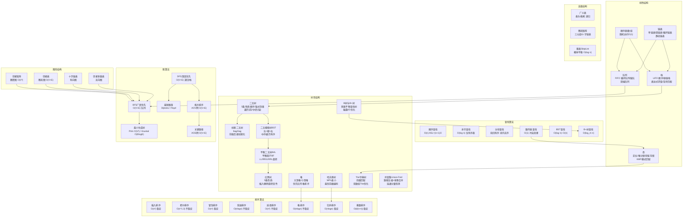

```mermaid
sequenceDiagram
    participant Client as "客户端"
    participant GW as "网关"
    participant UserSvc as "用户服务"
    participant SearchSvc as "搜索服务"
    participant ProdSvc as "商品服务"
    participant OrderSvc as "订单服务"
    participant RecEngine as "推荐引擎"
    participant SortEngine as "排序引擎"
    participant PostProc as "后处理服务"
    participant LogSvc as "日志服务"
    participant AnalySvc as "分析服务"

    %% ===================== 阶段0：系统初始化与数据加载 =====================
    rect rgba(240, 248, 255, 0.4)
    Note over Client,AnalySvc: "===== 阶段0：系统初始化与数据加载 ====="
    Note over ProdSvc: "数组 商品列表顺序存储<br/>skuList[0..N-1] 连续内存<br/>随机访问 O(1)"
    Note over OrderSvc: "链表 订单队列动态管理<br/>单链表节点：data+next<br/>头插O(1) 尾插O(n) 删除O(n)"
    Note over Client: "栈 操作撤销Undo/Redo<br/>顺序栈：top指针 栈顶操作O(1)<br/>LIFO后进先出"
    Note over GW: "队列 请求缓冲FIFO<br/>循环队列：front+rear<br/>入队O(1) 出队O(1)"

    ProdSvc->>ProdSvc: "数组初始化：顺序表存储10万商品<br/>Loc(ai)=LOC(a0)+i×sizeof(ElemType)"
    OrderSvc->>OrderSvc: "链表构建：头插法建空队列<br/>动态插入删除无需移动元素"
    Client->>Client: "双栈实现Undo/Redo<br/>操作入栈A，撤销时弹出到栈B"
    GW->>GW: "循环队列判空：(rear+1)%MAXSIZE==front<br/>牺牲一个单元区分空满"
    end

    %% ===================== 阶段1：用户认证与会话管理 =====================
    rect rgba(248, 240, 255, 0.4)
    Note over Client,UserSvc: "===== 阶段1：用户认证与会话管理 ====="
    Note over UserSvc: "散列表 HashTable 存储用户会话<br/>链地址法解决冲突<br/>负载因子α=n/m"

    Client->>GW: "POST /api/login<br/>用户名+密码"
    GW->>UserSvc: "转发认证请求"

    Note over UserSvc: "布隆过滤器 快速判断用户是否存在<br/>k个哈希函数映射到位数组<br/>可能存在误判(假阳性)<br/>不存在则一定不存在"

    UserSvc->>UserSvc: "布隆过滤器预判：用户存在？<br/>若不存在则直接返回404"

    Note over UserSvc: "MD5/SHA密码哈希<br/>散列函数设计：<br/>1.除留余数法 H(key)=key%p<br/>2.直接定址法 H(key)=a×key+b<br/>3.平方取中法<br/>4.数字分析法"

    UserSvc->>UserSvc: "密码哈希比对<br/>链地址法处理冲突：<br/>同义词链表存储在同一槽位<br/>查找ASL成功≈1+α/2"

    Note over UserSvc: "负载因子与再散列<br/>当α超过阈值(默认0.75)<br/>扩容为原来2倍，重新散列所有元素<br/>再散列O(n)"

    UserSvc->>UserSvc: "生成Session Token<br/>散列表存储：key=token→value=userInfo"
    UserSvc-->>GW: "认证成功 + Session Token"
    GW-->>Client: "登录成功，返回Token"
    end

    %% ===================== 阶段2：商品搜索与Trie自动补全 =====================
    rect rgba(255, 248, 240, 0.4)
    Note over Client,SearchSvc: "===== 阶段2：商品搜索与Trie自动补全 ====="
    Note over SearchSvc: "Trie字典树 存储搜索词<br/>前缀匹配 O(k) k为词长<br/>双数组Trie优化空间"

    Client->>GW: "GET /api/search?q=手机"
    GW->>SearchSvc: "转发搜索请求"

    SearchSvc->>SearchSvc: "Trie树前缀匹配：手→机<br/>Trie节点结构：<br/>children[26]指针数组+isEnd标记<br/>查找/插入 O(k)"

    Note over SearchSvc: "双数组Trie优化<br/>base[]+check[]两数组压缩存储<br/>base[s]+c=t, check[t]=s<br/>空间效率大幅提升"

    Note over SearchSvc: "小顶堆维护Top-K热门搜索<br/>堆：完全二叉树，父≤子<br/>插入O(logK) 查询O(1)"

    SearchSvc->>SearchSvc: "小顶堆维护Top-10热搜<br/>新词频>堆顶则替换并下沉调整<br/>堆排序：建堆O(n)+排序O(nlogn)"

    Note over SearchSvc: "堆排序原理<br/>1.建堆：从n/2向下调整<br/>2.排序：堆顶与末尾交换，调整<br/>O(nlogn) 不稳定"

    SearchSvc-->>GW: "返回搜索结果+自动补全建议+Top-K热搜"
    GW-->>Client: "搜索响应"
    end

    %% ===================== 阶段3：商品库存查询 =====================
    rect rgba(240, 255, 248, 0.4)
    Note over Client,ProdSvc: "===== 阶段3：商品库存查询 ====="
    Note over ProdSvc: "B+树索引 商品库存索引<br/>多路查找 降低树高<br/>查找O(log_m n)"

    Client->>GW: "GET /api/product/stock?id=12345"
    GW->>ProdSvc: "转发库存查询请求"

    Note over ProdSvc: "B+树 vs B树区别<br/>B+树：数据仅存叶子节点<br/>叶子节点链表连接支持范围查询<br/>B树：数据存所有节点"

    ProdSvc->>ProdSvc: "B+树索引查找：根→内部节点→叶子<br/>非叶子节点仅索引不含数据<br/>Fanout：每个节点可存大量关键字"

    Note over ProdSvc: "B+树范围查询<br/>叶子节点双向链表连接<br/>找到下界→顺序遍历叶子链表<br/>范围查询O(log_m n + k)"

    ProdSvc->>ProdSvc: "B+树范围查询：库存>1000的商品<br/>定位到叶子→顺序遍历链表"

    Note over ProdSvc: "磁盘I/O优化<br/>B+树节点大小=磁盘页大小(4KB/16KB)<br/>m阶B+树：每个节点最多m-1个关键字<br/>树高h=O(log_{⌈m/2⌉}n)<br/>一次磁盘I/O读一个节点"

    ProdSvc-->>GW: "返回库存数据+范围查询结果"
    GW-->>Client: "库存查询响应"
    end

    %% ===================== 阶段4：秒杀订单处理 =====================
    rect rgba(255, 240, 248, 0.4)
    Note over Client,OrderSvc: "===== 阶段4：秒杀订单处理 ====="
    Note over OrderSvc: "跳表SkipList 实现有序集合<br/>概率平衡 多层索引<br/>查找O(log n)"

    Client->>GW: "POST /api/seckill/order<br/>商品ID+数量"
    GW->>OrderSvc: "转发秒杀请求"

    OrderSvc->>OrderSvc: "跳表查询库存：从最高层开始<br/>跳表结构：节点含多级forward指针<br/>概率平衡：插入时随机决定层数<br/>每层概率1/2，期望层数O(log n)"

    Note over OrderSvc: "红黑树 维护订单时间排序<br/>红黑树五条性质：<br/>1.节点非红即黑<br/>2.根节点必黑<br/>3.叶节点(NIL)必黑<br/>4.红节点子节点必黑(无连续红)<br/>5.任意节点到叶的黑色节点数相同"

    OrderSvc->>OrderSvc: "红黑树插入订单：按时间序插入<br/>插入旋转/变色：<br/>父红→叔红则变色上溯<br/>父红叔黑→旋转+变色<br/>LL/RR/LR/RL四种旋转"

    Note over OrderSvc: "红黑树删除调整<br/>删除黑节点需调整：<br/>兄弟红→旋转变色<br/>兄弟黑侄子黑→兄弟变红上溯<br/>兄弟黑左侄红→LL型旋转<br/>兄弟黑右侄红→RR型旋转<br/>查找/插入/删除均为O(log n)"

    OrderSvc->>OrderSvc: "跳表扣减库存（原子操作）<br/>红黑树记录订单时间戳"

    Note over OrderSvc: "跳表 vs 红黑树<br/>跳表：实现简单，范围查询方便<br/>红黑树：严格平衡，最坏保证O(log n)<br/>Redis有序集合用跳表实现"

    OrderSvc-->>GW: "秒杀成功，订单已创建"
    GW-->>Client: "秒杀响应"
    end

    %% ===================== 阶段5：推荐系统与图遍历 =====================
    rect rgba(245, 245, 255, 0.4)
    Note over Client,RecEngine: "===== 阶段5：推荐系统与图遍历 ====="
    Note over RecEngine: "图结构 存储用户-商品关系<br/>邻接表/邻接矩阵"

    Client->>GW: "GET /api/recommend"
    GW->>RecEngine: "转发推荐请求"

    Note over RecEngine: "邻接表 vs 邻接矩阵<br/>邻接表：稀疏图节省空间<br/>邻接矩阵：稠密图，O(1)判断边<br/>邻接表空间O(V+E) 矩阵O(V²)"

    RecEngine->>RecEngine: "BFS广度优先遍历<br/>队列实现，逐层扩展<br/>O(V+E)<br/>发现相似用户（同层邻居）"

    Note over RecEngine: "DFS深度优先遍历<br/>递归/栈实现，深入探索<br/>O(V+E)<br/>发现用户兴趣链路"

    RecEngine->>RecEngine: "最短路径Dijkstra算法<br/>贪心策略，每次选最小dist<br/>O(V²) 堆优化O((V+E)logV)<br/>计算商品相似度传播路径"

    Note over RecEngine: "拓扑排序<br/>AOV网：顶点表示活动<br/>每次选入度为0的顶点输出<br/>O(V+E)<br/>构建推荐策略执行顺序"

    RecEngine->>RecEngine: "关键路径AOE网<br/>边表示活动，权值=持续时间<br/>ve最早开始时间，vl最晚开始时间<br/>ve=vl的活动为关键活动<br/>O(V+E)<br/>分析推荐链路瓶颈"

    RecEngine-->>GW: "个性化推荐列表"
    GW-->>Client: "推荐响应"
    end

    %% ===================== 阶段6：搜索结果排序 =====================
    rect rgba(255, 245, 235, 0.4)
    Note over Client,SortEngine: "===== 阶段6：搜索结果排序 ====="
    Note over SortEngine: "快速排序 分治思想<br/>平均O(nlogn) 最坏O(n²)"

    Client->>GW: "GET /api/search?q=手机&sort=price"
    GW->>SortEngine: "转发排序请求"

    Note over SortEngine: "轴值pivot选择<br/>1.首元素(顺序/逆序时最坏)<br/>2.随机选取(避免最坏)<br/>3.三数取中(首/尾/中 取中值)"

    SortEngine->>SortEngine: "快速排序：按价格分区<br/>左侧≤pivot < 右侧<br/>平均O(nlogn) 不稳定"

    Note over SortEngine: "归并排序<br/>分治：递归拆分→合并有序子序列<br/>O(nlogn) 稳定 [Y|需要O(n)辅助空间]"

    SortEngine->>SortEngine: "归并排序：按销量排序<br/>稳定排序，相同销量保持原序"

    Note over SortEngine: "外排序<br/>数据量大无法全部载入内存<br/>多路归并+败者树优化<br/>减少磁盘I/O次数"

    SortEngine->>SortEngine: "外排序处理海量搜索结果<br/>K路归并，败者树选最小<br/>败者树比较次数O(logK)"

    Note over SortEngine: "各排序算法对比<br/>插入O(n²)稳定 [Y|希尔O(n^1.3)不稳定]<br/>冒泡O(n²)稳定 [Y|选择O(n²)不稳定]<br/>快排O(nlogn)不稳定 [Y|堆排O(nlogn)不稳定]<br/>归并O(nlogn)稳定 [Y|基数O(d(n+r))稳定]"

    SortEngine-->>GW: "排序后的搜索结果"
    GW-->>Client: "排序响应"
    end

    %% ===================== 阶段7：订单后处理 =====================
    rect rgba(235, 255, 245, 0.4)
    Note over Client,PostProc: "===== 阶段7：订单后处理 ====="
    Note over PostProc: "二叉搜索树BST 订单排序<br/>AVL树 平衡维护<br/>哈夫曼树 数据压缩"

    Client->>GW: "POST /api/order/process"
    GW->>PostProc: "转发后处理请求"

    Note over PostProc: "BST中序遍历<br/>左→根→右 得到有序序列<br/>O(n)<br/>BST最坏退化为链表O(n)"

    PostProc->>PostProc: "BST按订单金额中序遍历<br/>输出有序订单列表"

    Note over PostProc: "AVL树平衡因子BF<br/>BF=左子树高-右子树高<br/>|BF|≤1 平衡<br/>插入后从下往上更新BF"

    PostProc->>PostProc: "AVL树维护订单索引<br/>LL旋转：左子树的左子树插入<br/>RR旋转：右子树的右子树插入<br/>LR旋转：左子树的右子树插入<br/>RL旋转：右子树的左子树插入<br/>查找/插入/删除O(log n)"

    Note over PostProc: "哈夫曼树<br/>WPL=∑权值×路径长度 最小<br/>每次选两个最小权值合并<br/>哈夫曼编码：最优前缀码<br/>左0右1，高频字符短编码"

    PostProc->>PostProc: "哈夫曼压缩订单数据<br/>统计字符频率→建哈夫曼树→生成编码<br/>建树O(nlogn) 编码O(n)"

    Note over PostProc: "并查集Union-Find<br/>判订单商品是否同类<br/>路径压缩：find时直接连根<br/>按秩合并：小树合入大树<br/>近似O(1)均摊"

    PostProc-->>GW: "订单处理完成"
    GW-->>Client: "后处理响应"
    end

    %% ===================== 阶段8：数据持久化与日志 =====================
    rect rgba(245, 235, 255, 0.4)
    Note over Client,LogSvc: "===== 阶段8：数据持久化与日志 ====="
    Note over LogSvc: "串 日志文本存储<br/>KMP模式匹配 O(n+m)"

    Client->>GW: "POST /api/log/analyze"
    GW->>LogSvc: "转发日志分析请求"

    Note over LogSvc: "串的存储结构<br/>1.定长顺序存储<br/>2.堆分配存储<br/>3.块链存储<br/>串的基本操作：StrAssign/StrCopy/StrCompare/Concat/SubString"

    LogSvc->>LogSvc: "日志写入：顺序存储到日志文件<br/>朴素模式匹配BF：O(n×m)<br/>逐字符比较，失配则回溯"

    Note over LogSvc: "KMP算法核心<br/>主串指针不回溯<br/>next数组：失配时模式串跳转位置<br/>next[j]=最长相等前后缀长度<br/>O(n+m)"

    LogSvc->>LogSvc: "KMP匹配日志关键字ERROR<br/>next数组构造：<br/>next[1]=0, 递推求next[j+1]<br/>部分匹配表PMT"

    Note over LogSvc: "nextval数组优化<br/>当P[j]==P[next[j]]时<br/>nextval[j]=nextval[next[j]]<br/>避免无意义的重复比较"

    LogSvc->>LogSvc: "nextval优化后匹配<br/>BM算法对比：坏字符+好后缀<br/>BM最优O(n/m) 最坏O(n×m)"

    Note over LogSvc: "字符串匹配算法对比<br/>BF：简单暴力，回溯多<br/>KMP：主串不回溯，预处理next<br/>BM：从右往左匹配，跳跃大"

    LogSvc-->>GW: "日志分析结果"
    GW-->>Client: "日志分析响应"
    end

    %% ===================== 阶段9：数据分析与报表 =====================
    rect rgba(255, 250, 235, 0.4)
    Note over Client,AnalySvc: "===== 阶段9：数据分析与报表 ====="
    Note over AnalySvc: "广义表 层次数据<br/>稀疏矩阵 压缩存储<br/>并查集 连通分量"

    Client->>GW: "GET /api/analytics/report"
    GW->>AnalySvc: "转发分析请求"

    Note over AnalySvc: "广义表<br/>LS=(a1,a2,...,an)<br/>元素可为原子或子表<br/>表头/表尾：Head(LS)=a1, Tail(LS)=(a2,...,an)<br/>深度：括号嵌套最大层数"

    AnalySvc->>AnalySvc: "广义表存储商品分类层级<br/>递归遍历广义表生成分类树"

    Note over AnalySvc: "多维数组存储<br/>行优先：LOC(i,j)=LOC(0,0)+(i×n+j)×L<br/>列优先：LOC(i,j)=LOC(0,0)+(j×m+i)×L<br/>特殊矩阵压缩：对称/三角/对角矩阵"

    AnalySvc->>AnalySvc: "多维数组存储用户行为矩阵<br/>稀疏矩阵压缩存储<br/>三元组：(行,列,值)顺序存储<br/>十字链表：行列双链表，便于插入删除"

    Note over AnalySvc: "并查集Union-Find<br/>Find：查找元素所属集合<br/>Union：合并两个集合<br/>路径压缩：find时将路径上所有节点直接连根<br/>按秩合并：秩小的根指向秩大的根<br/>均摊时间复杂度O(α(n))≈O(1)"

    AnalySvc->>AnalySvc: "并查集检测用户聚类连通分量<br/>路径压缩+按秩合并优化<br/>识别用户群组关系"

    AnalySvc-->>GW: "数据分析报表"
    GW-->>Client: "报表响应"
    end
```

# 可放大查看图片

# 数据结构全流程知识串联 · 详细图解版

以下严格对应最终修正版 Mermaid 时序图，以**表格+结构化要点**为主，完整覆盖 10 个核心阶段的 DS 知识点、算法操作与考研考点。

---

## 一、数据结构知识体系全景拓扑图

---

## 二、全流程阶段总览表

| 阶段 | 阶段名称 | 核心数据结构 | 核心算法 | 核心事件 |
|------|----------|--------------|----------|----------|
| 0 | 系统初始化与数据加载 | 数组、链表、栈、队列 | 顺序存储、链式存储、循环队列 | 商品列表加载、订单队列构建、Undo/Redo、请求缓冲 |
| 1 | 用户认证与会话管理 | 散列表、布隆过滤器 | 散列函数、链地址法、MD5/SHA | 用户登录、Session管理、负载因子与再散列 |
| 2 | 商品搜索与Trie自动补全 | Trie字典树、堆 | 前缀匹配、堆排序、Top-K | 搜索词补全、热门搜索维护 |
| 3 | 商品库存查询 | B+树 | 多路查找、范围查询 | 库存索引、磁盘I/O优化 |
| 4 | 秒杀订单处理 | 跳表、红黑树 | 概率平衡、旋转/变色 | 有序集合扣库存、订单时间排序 |
| 5 | 推荐系统与图遍历 | 图（邻接表/矩阵） | BFS、DFS、Dijkstra、拓扑排序、关键路径 | 用户-商品关系图、推荐链路 |
| 6 | 搜索结果排序 | 数组 | 快排、归并、外排序、各排序对比 | 价格/销量排序、稳定性分析 |
| 7 | 订单后处理 | BST、AVL树、哈夫曼树、并查集 | 旋转、建树、编码、压缩 | 订单排序、数据压缩、归类 |
| 8 | 数据持久化与日志 | 串、数组 | KMP、BF、BM | 日志写入、关键字匹配、next数组 |
| 9 | 数据分析与报表 | 广义表、稀疏矩阵、并查集 | 三元组、十字链表、路径压缩 | 分类层级、行为矩阵、连通分量 |

---

## 三、分阶段详细拆解（表格化呈现）

## 阶段 0：系统初始化与数据加载

### 阶段0：系统初始化与数据加载

**核心目标**：基础数据结构初始化，为电商秒杀系统提供数据支撑

**数据结构操作表**：

| 序号 | 数据结构 | 存储方式 | 核心操作 | 时间复杂度 |
|------|----------|----------|----------|------------|
| 1 | 数组（顺序表） | 连续内存存储商品列表 `skuList[0..N-1]` | 随机访问 `Loc(ai)=LOC(a0)+i×sizeof(ElemType)` | #[Y|访问O(1) 插入删除O(n)] |
| 2 | 链表（单链表） | 节点 `{data, next}` 动态分配 | 头插法建空队列、尾插法追加 | #[Y|头插O(1) 尾插O(n) 按值删除O(n)] |
| 3 | 栈（顺序栈） | `top` 指针，`data[0..MAXSIZE-1]` | `push`/`pop` 栈顶操作 | #[Y|O(1)] |
| 4 | 队列（循环队列） | `front`+`rear`，牺牲一个单元 | `enqueue`/`dequeue` | #[Y|O(1)] |

**考研核心考点**：

:::important
**线性表核心考点**
- #[C|顺序表]：随机访问 O(1)，插入删除需移动元素 O(n)，存储密度=1
- #[C|链表]：不支持随机访问，插入删除 O(1)（给定位置），存储密度 < 1
- #[C|静态链表]：用数组描述链表，`cur` 游标代替指针，用于无指针语言
- #[C|头插法 vs 尾插法]：头插法逆序，尾插法保持原序
:::

:::warning
**易错点**
- #[R|顺序表插入位置从1到n+1，移动元素个数为 n-i+1]
- #[R|循环队列队空：front==rear；队满：(rear+1)%MAXSIZE==front]
- #[R|链栈无栈满问题，顺序栈需要判满]
:::

---

## 阶段 1：用户认证与会话管理

### 阶段1：用户认证与会话管理

**核心目标**：高效用户认证、会话存储与快速检索

**交互步骤表**：

| 序号 | 操作 | 数据结构 | 核心机制 | 复杂度 |
|------|------|----------|----------|--------|
| 1 | 布隆过滤器预判 | 位数组+k个哈希函数 | 快速判断用户是否存在，不存在则直接拒绝 | #[Y|O(k) 可能存在假阳性] |
| 2 | 密码哈希 | 散列函数（MD5/SHA） | 除留余数法 `H(key)=key%p`，p 取不大于表长的素数 | #[Y|O(1)] |
| 3 | 散列表存储 Session | 散列表+链地址法 | 同义词链表存储在同一槽位 | #[Y|查找ASL成功≈1+α/2] |
| 4 | 负载因子监控 | 再散列 | α > 0.75 时扩容为原来 2 倍，重新散列所有元素 | #[Y|再散列O(n)] |

**考研核心考点**：

:::important
**散列表核心考点**
- #[C|散列函数设计]：除留余数法（最常用）、直接定址法、平方取中法、数字分析法
- #[C|冲突处理方法]：开放定址法（线性探测、平方探测、双散列）、链地址法
- #[C|平均查找长度 ASL]：散列表查找效率取决于装填因子 α=n/m
- #[C|开放定址法 ASL]：成功 ≈ (1/2)×(1+1/(1-α))，失败 ≈ (1/2)×(1+1/(1-α)²)
- #[C|链地址法 ASL]：成功 ≈ 1+α/2，失败 ≈ α+e^{-α}
:::

:::warning
**易错点**
- #[R|散列表没有"最好"的冲突处理方法，需根据实际情况选择]
- #[R|线性探测容易产生聚集(clustering)现象，平方探测可缓解]
- #[R|再散列代价高 O(n)，但均摊到每次插入为 O(1)]
- #[R|布隆过滤器：判定存在可能误判，判定不存在一定正确]
:::

---

## 阶段 2：商品搜索与Trie自动补全

### 阶段2：商品搜索与Trie自动补全

**核心目标**：高效前缀匹配搜索词、Top-K 热门搜索维护

**核心操作表**：

| 序号 | 操作 | 数据结构 | 核心机制 | 复杂度 |
|------|------|----------|----------|--------|
| 1 | 前缀匹配 | Trie 字典树 | 节点含 `children[26]` + `isEnd` 标记 | #[Y|查找/插入 O(k) k=词长] |
| 2 | 空间优化 | 双数组 Trie | `base[]+check[]` 两数组压缩 | #[Y|空间大幅减少] |
| 3 | 热门搜索维护 | 小顶堆 | 堆顶为第 K 大，新元素 > 堆顶则替换并下沉 | #[Y|插入O(logK) 查询O(1)] |
| 4 | 堆排序 | 堆 | 建堆：从 n/2 向下调整；排序：堆顶交换+调整 | #[Y|O(nlogn) 不稳定] |

**考研核心考点**：

:::important
**Trie 与堆核心考点**
- #[C|Trie 树]：空间换时间，前缀匹配 O(k)，共享公共前缀节省空间
- #[C|堆的性质]：完全二叉树，`parent(i) ≤ child(i)`（小顶堆）或 `parent(i) ≥ child(i)`（大顶堆）
- #[C|堆的存储]：数组存储，下标从 1 开始，`left=2i, right=2i+1, parent=⌊i/2⌋`
- #[C|建堆复杂度]：`O(n)`，从最后一个非叶节点 `⌊n/2⌋` 开始向下调整
- #[C|堆排序]：建堆 O(n) + n-1 次交换调整 O(nlogn)，总 O(nlogn)，不稳定
:::

:::note
**补充说明**
- #[C|双数组 Trie]：`base[s] + c = t`，`check[t] = s`，本质是压缩状态转移表
- #[C|Top-K 问题]：K 小用小顶堆，K 大用大顶堆，堆顶作为"门槛"
:::

---

## 阶段 3：商品库存查询

### 阶段3：商品库存查询

**核心目标**：高效索引查询与范围扫描，适配磁盘存储特性

**B+树 vs B树对比表**：

| 特性 | B树 | B+树 |
|------|-----|------|
| 数据存储 | 所有节点都存数据 | #[C|仅叶子节点存数据] |
| 非叶子节点 | 存储索引+数据 | #[C|仅存储索引（Fanout 更大）] |
| 叶子节点链接 | 无链接 | #[C|双向链表连接，支持范围查询] |
| 范围查询效率 | #[R|需要中序遍历整棵树] | #[G|找到下界后顺序遍历链表] |
| 查找稳定性 | 可能提前在非叶子节点命中 | #[G|每次查找都走到叶子节点，稳定] |
| 应用场景 | MongoDB 索引 | #[C|MySQL InnoDB 索引] |

**考研核心考点**：

:::important
**B树与B+树核心考点**
- #[C|B树定义]：m阶B树，每个节点最多 m-1 个关键字，最多 m 棵子树；根节点至少 2 棵子树；非根节点至少 ⌈m/2⌉ 棵子树
- #[C|B+树区别]：关键字数=子树数；非叶子节点仅索引；叶子节点含全部关键字且链表连接
- #[C|B树高度]：h ≤ log_{⌈m/2⌉}((n+1)/2) + 1
- #[C|磁盘I/O优化]：节点大小=磁盘页大小，一次 I/O 读一个节点，树高越小 I/O 越少
- #[C|B+树范围查询]：O(log_m n + k)，k 为结果数量
:::

:::warning
**易错点**
- #[R|B树插入：满节点需分裂，分裂可能向上递归到根]
- #[R|B树删除：需借位或合并，合并可能向上递归]
- #[R|B+树插入/删除只需在叶子节点操作，非叶子节点索引随之调整]
:::

---

## 阶段 4：秒杀订单处理

### 阶段4：秒杀订单处理

**核心目标**：高并发有序集合操作、订单时间排序

**跳表 vs 红黑树对比表**：

| 特性 | 跳表 (SkipList) | 红黑树 (RBTree) |
|------|-----------------|-----------------|
| 平衡方式 | #[C|概率平衡（随机层数）] | #[C|严格平衡（旋转+变色）] |
| 实现复杂度 | #[G|相对简单] | #[R|复杂（5种平衡情况）] |
| 查找复杂度 | #[Y|平均 O(log n) 最坏 O(n)] | #[Y|严格 O(log n)] |
| 范围查询 | #[G|方便（底层链表）] | #[R|需要中序遍历] |
| 应用 | Redis 有序集合 | Linux CFS、Java TreeMap |

**红黑树插入调整表**：

| 情况 | 父节点颜色 | 叔节点颜色 | 调整方式 |
|------|-----------|-----------|----------|
| 1 | 黑 | - | #[G|无需调整] |
| 2 | 红 | 红 | #[C|父叔变黑，祖父变红，祖父作为新节点上溯] |
| 3 | 红 | 黑(LL型) | #[C|右旋祖父，父变黑，祖父变红] |
| 4 | 红 | 黑(RR型) | #[C|左旋祖父，父变黑，祖父变红] |
| 5 | 红 | 黑(LR型) | #[C|左旋父转为LL，再按LL处理] |
| 6 | 红 | 黑(RL型) | #[C|右旋父转为RR，再按RR处理] |

**考研核心考点**：

:::important
**红黑树核心考点**
- #[C|红黑树五条性质]：必须全部记住，是判断是否合法的依据
- #[C|红黑树 vs AVL树]：红黑树插入最多旋转 2 次，AVL 可能 O(log n) 次；红黑树适合频繁插入删除，AVL 适合频繁查找
- #[C|根节点必黑]：插入后若根变红，需将根染黑
- #[C|红黑树高度]：h ≤ 2log₂(n+1)，最坏略高于 AVL
:::

:::warning
**易错点**
- #[R|红黑树不是 AVL 树，平衡条件更宽松]
- #[R|红黑树中 NIL 叶子节点是黑色，不是 null]
- #[R|删除黑节点才需要调整，删除红节点直接删除]
:::

---

## 阶段 5：推荐系统与图遍历

### 阶段5：推荐系统与图遍历

**核心目标**：图的存储、遍历、最短路径、拓扑排序、关键路径

**图存储方式对比表**：

| 存储方式 | 空间复杂度 | 判断边 | 遍历所有边 | 适用场景 |
|----------|-----------|--------|-----------|----------|
| 邻接矩阵 | #[Y|O(V²)] | #[Y|O(1)] | #[Y|O(V²)] | 稠密图 |
| 邻接表 | #[Y|O(V+E)] | #[Y|O(deg)] | #[Y|O(V+E)] | 稀疏图 |
| 十字链表 | #[Y|O(V+E)] | #[Y|O(deg)] | #[Y|O(V+E)] | 有向图 |
| 邻接多重表 | #[Y|O(V+E)] | #[Y|O(deg)] | #[Y|O(V+E)] | 无向图 |

**图算法核心表**：

| 算法 | 核心思想 | 时间复杂度 | 应用 |
|------|----------|-----------|------|
| BFS | 队列，逐层扩展 | #[Y|O(V+E)] | 无权图最短路径 |
| DFS | 递归/栈，深度优先 | #[Y|O(V+E)] | 连通分量、拓扑排序 |
| Dijkstra | 贪心，每次选 dist 最小 | #[Y|O(V²) 堆优化O((V+E)logV)] | 单源最短路径（非负权） |
| Floyd | 动态规划 | #[Y|O(V³)] | 所有顶点对最短路径 |
| Prim | 贪心，选最小边 | #[Y|O(V²)] | 最小生成树（稠密图） |
| Kruskal | 贪心+并查集 | #[Y|O(ElogE)] | 最小生成树（稀疏图） |
| 拓扑排序 | 每次输出入度为 0 的顶点 | #[Y|O(V+E)] | AOV 网 |
| 关键路径 | 求 ve→vl，ve=vl 为关键活动 | #[Y|O(V+E)] | AOE 网 |

**考研核心考点**：

:::important
**图核心考点**
- #[C|DFS 生成树]：深度优先遍历形成的树，连接边为树边，其余为回边
- #[C|BFS 生成树]：广度优先遍历形成的树，同层节点间无边
- #[C|Prim vs Kruskal]：Prim 适合稠密图 O(V²)；Kruskal 适合稀疏图 O(ElogE)
- #[C|Dijkstra 限制]：不能处理负权边；Floyd 可处理负权但不可有负环
- #[C|拓扑排序序列]：不唯一，只要每次选入度为 0 的顶点即可
- #[C|关键路径]：ve(源点)=0，ve(j)=max{ve(i)+w(i,j)}；vl(汇点)=ve(汇点)，vl(i)=min{vl(j)-w(i,j)}
:::

:::warning
**易错点**
- #[R|DFS 用栈（递归），BFS 用队列，不要混淆]
- #[R|Dijkstra 不能处理负权边，此时用 Bellman-Ford]
- #[R|求关键路径必须先拓扑排序，按拓扑序求 ve，按逆拓扑序求 vl]
- #[R|缩短关键活动不一定缩短工期，可能有多个关键路径]
:::

---

## 阶段 6：搜索结果排序

### 阶段6：搜索结果排序

**核心目标**：高效排序算法应用的工程实践

**排序算法对比总表**：

| 排序算法 | 最好 | 平均 | 最坏 | 空间 | 稳定性 | 核心思想 |
|----------|------|------|------|------|--------|----------|
| 直接插入 | #[Y|O(n)] | #[Y|O(n²)] | #[Y|O(n²)] | #[Y|O(1)] | #[G|稳定] | 有序区逐步扩大 |
| 希尔排序 | #[Y|O(n)] | #[Y|O(n^1.3)] | #[Y|O(n²)] | #[Y|O(1)] | #[R|不稳定] | 增量缩小插入 |
| 冒泡排序 | #[Y|O(n)] | #[Y|O(n²)] | #[Y|O(n²)] | #[Y|O(1)] | #[G|稳定] | 相邻比较交换 |
| 快速排序 | #[Y|O(nlogn)] | #[Y|O(nlogn)] | #[Y|O(n²)] | #[Y|O(logn)] | #[R|不稳定] | 分治+轴值分区 |
| 简单选择 | #[Y|O(n²)] | #[Y|O(n²)] | #[Y|O(n²)] | #[Y|O(1)] | #[R|不稳定] | 每趟选最小 |
| 堆排序 | #[Y|O(nlogn)] | #[Y|O(nlogn)] | #[Y|O(nlogn)] | #[Y|O(1)] | #[R|不稳定] | 堆结构选最值 |
| 归并排序 | #[Y|O(nlogn)] | #[Y|O(nlogn)] | #[Y|O(nlogn)] | #[Y|O(n)] | #[G|稳定] | 分治+有序合并 |
| 基数排序 | #[Y|O(d(n+r))] | #[Y|O(d(n+r))] | #[Y|O(d(n+r))] | #[Y|O(r)] | #[G|稳定] | 多关键字分配收集 |

**考研核心考点**：

:::important
**排序核心考点**
- #[C|稳定性]：相同关键字的元素在排序前后相对位置不变
- #[C|快排优化]：轴值三数取中、小数组改用插入排序、尾递归优化
- #[C|归并排序]：唯一需要 O(n) 辅助空间的 O(nlogn) 排序，适合外排序
- #[C|堆排序 vs 选择排序]：堆排序用堆结构优化选择过程，从 O(n²) 降到 O(nlogn)
- #[C|基数排序]：不基于比较，基于关键字各位分配收集，d 为位数，r 为基数
:::

:::warning
**易错点**
- #[R|快排最坏 O(n²) 发生在有序或逆序时，随机选取轴值可避免]
- #[R|堆排序不稳定，因为堆顶交换可能打乱相同元素顺序]
- #[R|希尔排序增量序列对性能影响很大，但至今没有最优增量序列]
- #[R|基数排序只能用于整数或可拆分为关键字的情况]
:::

---

## 阶段 7：订单后处理

### 阶段7：订单后处理

**核心目标**：BST 有序输出、AVL 平衡维护、哈夫曼压缩、并查集归类

**AVL 四种旋转表**：

| 旋转类型 | 插入位置 | 操作 | 旋转前 | 旋转后 |
|----------|----------|------|--------|--------|
| LL | 左子树的左子树 | #[C|右旋根节点] | A(2)→B(1)→C(0) | B(0)←左C / 右→A(0) |
| RR | 右子树的右子树 | #[C|左旋根节点] | A(-2)→B(-1)→C(0) | B(0)←左A / 右→C(0) |
| LR | 左子树的右子树 | #[C|先左旋B，后右旋A] | A(2)→B(-1)→C(0) | C(0)←左B / 右→A(0) |
| RL | 右子树的左子树 | #[C|先右旋B，后左旋A] | A(-2)→B(1)→C(0) | C(0)←左A / 右→B(0) |

**考研核心考点**：

:::important
**二叉树核心考点**
- #[C|二叉树性质]：n0=n2+1；第k层最多 2^(k-1) 个节点；深度为k的满二叉树有 2^k-1 个节点
- #[C|完全二叉树]：编号与满二叉树一一对应，高度 ⌊log₂n⌋+1
- #[C|二叉树的遍历]：前序(根左右)、中序(左根右)、后序(左右根)、层序(队列)
- #[C|线索二叉树]：利用空指针存储前驱/后继，ltag=0 指左子，ltag=1 指前驱
- #[C|树与二叉树转换]：树→二叉树：兄弟相连，断右子；森林→二叉树：每棵树转二叉树后根相连
- #[C|哈夫曼树]：WPL 最小，n 个叶子节点的哈夫曼树有 2n-1 个节点，无度为 1 的节点
- #[C|哈夫曼编码]：前缀编码，任何一个编码都不是另一个编码的前缀
- #[C|并查集]：Find 路径压缩 + Union 按秩合并后，均摊 O(α(n)) ≈ O(1)
:::

:::warning
**易错点**
- #[R|BST 删除：删除有双子节点时，用直接前驱（左子树最右）或直接后继（右子树最左）替代]
- #[R|AVL 插入：最多只需一次旋转即可恢复平衡；删除可能需要 O(log n) 次旋转]
- #[R|哈夫曼树中不存在度为 1 的节点，这是哈夫曼树的特性]
- #[R|并查集初始状态每个元素各成一个集合]
:::

---

## 阶段 8：数据持久化与日志

### 阶段8：数据持久化与日志

**核心目标**：字符串存储与高效模式匹配

**KMP next 数组计算示例**：

以模式串 `"ABABAA"` 为例（下标从 1 开始）：

| j | 1 | 2 | 3 | 4 | 5 | 6 |
|---|----|----|----|----|----|----|
| P[j] | A | B | A | B | A | A |
| next[j] | 0 | 1 | 1 | 2 | 3 | 4 |
| nextval[j] | 0 | 1 | 0 | 1 | 0 | 4 |

**next 数组递推规则**：
- `next[1] = 0`
- 已知 `next[j]`，求 `next[j+1]`：令 `k = next[j]`，若 `P[k] == P[j]`，则 `next[j+1] = k+1`；否则令 `k = next[k]` 继续回溯

**nextval 递推规则**：
- 若 `P[j] != P[next[j]]`，则 `nextval[j] = next[j]`
- 若 `P[j] == P[next[j]]`，则 `nextval[j] = nextval[next[j]]`

**字符串匹配算法对比表**：

| 算法 | 思想 | 时间复杂度 | 特点 |
|------|------|-----------|------|
| BF | 暴力匹配，逐字符比较 | #[Y|O(n×m)] | 简单，回溯多 |
| KMP | 主串不回溯，利用 next 数组 | #[Y|O(n+m)] | 预处理 next 数组 |
| BM | 从右往左匹配，坏字符+好后缀 | #[Y|最优O(n/m) 最坏O(n×m)] | 实际效率最高 |

**考研核心考点**：

:::important
**串核心考点**
- #[C|串的存储]：定长顺序存储（截断）、堆分配存储（动态）、块链存储
- #[C|KMP 核心]：主串指针 i 不回溯，模式串根据 next[j] 跳转
- #[C|next 数组]：`next[j]` = 前 j-1 个字符的最长相等前后缀长度 + 1
- #[C|nextval 优化]：避免 `P[j] == P[next[j]]` 时的无意义比较
- #[C|KMP 匹配过程]：`i` 从 1 到 n，`j` 从 1 到 m；若 `S[i]==P[j]` 则 `i++,j++`；否则 `j=next[j]`；若 `j==0` 则 `i++,j++`
:::

:::warning
**易错点**
- #[R|next 数组下标从 1 开始是408考试惯例，有些教材从 0 开始]
- #[R|next[1]=0 是标志位，表示主串需要前进一位]
- #[R|KMP 预处理 next 数组 O(m)，总匹配 O(n+m)，优于 BF 的 O(n×m)]
:::

---

## 阶段 9：数据分析与报表

### 阶段9：数据分析与报表

**核心目标**：广义表层次数据、稀疏矩阵压缩、并查集连通分量

**稀疏矩阵存储方式对比表**：

| 存储方式 | 结构 | 查找 | 插入删除 | 转置 |
|----------|------|------|----------|------|
| 三元组顺序表 | 数组 `(row, col, value)` | #[Y|O(len)] | #[R|困难] | #[Y|O(len×col)] 或 O(len)（快速转置） |
| 行逻辑链接 | 三元组 + 行起始指针 | #[Y|按行O(len)] | #[R|困难] | #[G|与三元组相同] |
| 十字链表 | 行列双链表，节点含 `row,col,value,down,right` | #[Y|O(行+列)] | #[G|O(1) 灵活] | #[R|需重建链表] |

**考研核心考点**：

:::important
**广义表与矩阵核心考点**
- #[C|广义表]：`LS=(a1,a2,...,an)`，元素可为原子或子表，长度 n，深度为括号嵌套层数
- #[C|广义表运算]：`Head(LS)=a1`，`Tail(LS)=(a2,...,an)`，注意 `Tail` 返回的是表
- #[C|特殊矩阵压缩]：对称矩阵存下三角（n(n+1)/2 个）；三角矩阵存三角区+常数；三对角矩阵 3n-2 个
- #[C|稀疏矩阵]：非零元素个数远小于总元素个数
- #[C|快速转置]：先统计每列非零元素数，再确定每列起始位置，O(len)
- #[C|并查集]：`Find(x)` 返回 x 所在集合的代表元；`Union(x,y)` 合并 x 和 y 所在集合
- #[C|路径压缩]：`Find` 时将路径上所有节点直接连到根，后续查找极快
- #[C|按秩合并]：`Union` 时将秩（高度上界）小的根指向秩大的根，避免树过高
:::

:::warning
**易错点**
- #[R|广义表 `Tail` 运算返回的是子表，不是原子，需加括号]
- #[R|稀疏矩阵三元组存储时，通常按行优先排序]
- #[R|并查集单独使用路径压缩或按秩合并，均摊复杂度为 O(log n)；两者结合达到 O(α(n))≈O(1)]
- #[R|十字链表适合稀疏矩阵的加法/乘法运算，但不适合转置]
:::

---

## 四、考研408高频考点速查

| 考点 | 所属章节 | 核心内容 | 考察频率 |
|------|----------|----------|----------|
| 链表操作 | 线性表 | 头插法/尾插法、删除指定节点、双链表 | ★★★★★ |
| 栈的应用 | 栈和队列 | 表达式求值、括号匹配、递归转非递归 | ★★★★★ |
| 循环队列 | 栈和队列 | 队空 `front==rear`，队满 `(rear+1)%MAXSIZE==front` | ★★★★ |
| KMP 算法 | 串 | next 数组手工计算、nextval 优化 | ★★★★★ |
| 二叉树遍历 | 树 | 前中后序递归/非递归、层序遍历 | ★★★★★ |
| 线索二叉树 | 树 | ltag/rtag 含义、线索化过程 | ★★★★ |
| 哈夫曼树 | 树 | WPL 计算、哈夫曼编码、n 叶子=2n-1 节点 | ★★★★★ |
| AVL 树 | 查找 | 四种旋转、平衡因子计算 | ★★★★ |
| 红黑树 | 查找 | 五条性质、插入调整 | ★★★ |
| B树/B+树 | 查找 | B树插入删除、B+树与B树区别 | ★★★★ |
| 散列表 | 查找 | ASL 计算、冲突处理、再散列 | ★★★★★ |
| 图遍历 | 图 | BFS/DFS 过程、生成树 | ★★★★★ |
| 最小生成树 | 图 | Prim 和 Kruskal 过程 | ★★★★ |
| 最短路径 | 图 | Dijkstra 过程、Floyd 递推 | ★★★★★ |
| 拓扑排序 | 图 | 入度为 0 输出、序列不唯一 | ★★★★ |
| 关键路径 | 图 | ve/vl 计算、关键活动判定 | ★★★★ |
| 排序算法对比 | 排序 | 时间复杂度、稳定性、适用场景 | ★★★★★ |
| 快速排序 | 排序 | 轴值选取、分区过程、递归树 | ★★★★★ |
| 堆排序 | 排序 | 建堆、调整堆、与选择排序关系 | ★★★★ |
| 归并排序 | 排序 | 分治合并、外排序应用 | ★★★★ |
| 并查集 | 高级 | 路径压缩、按秩合并、均摊 O(1) | ★★★ |