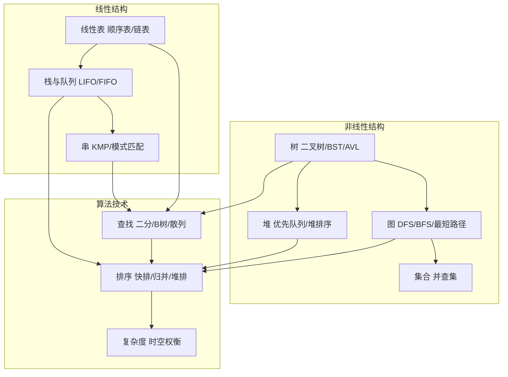
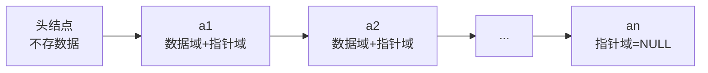
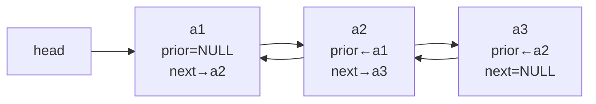
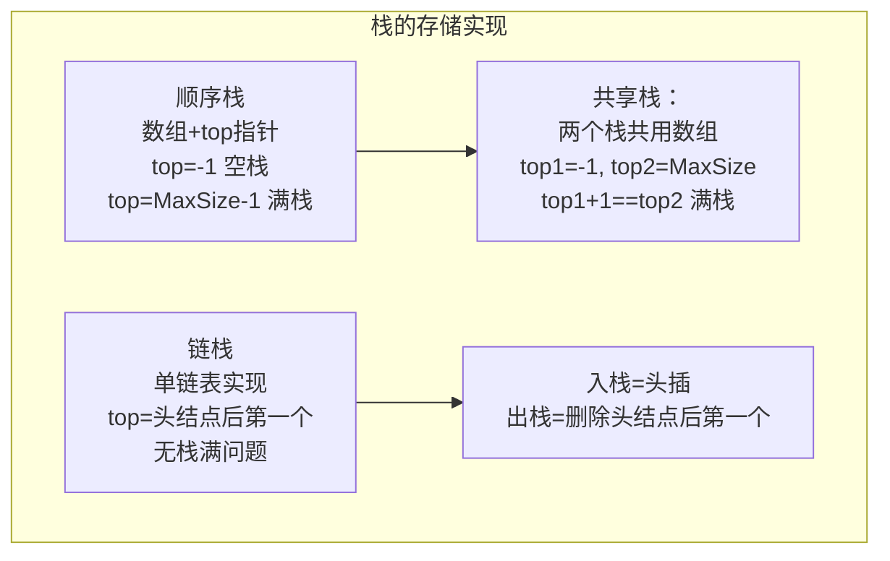
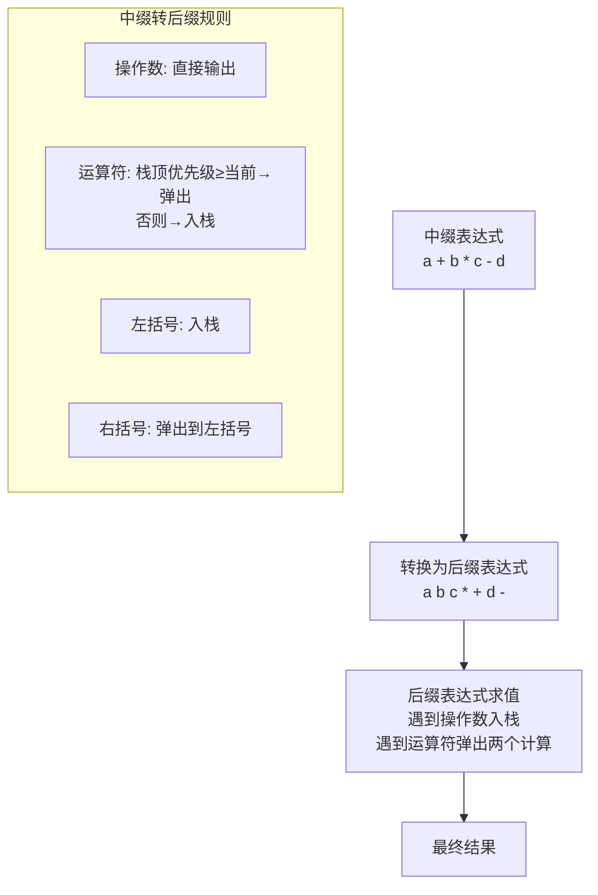
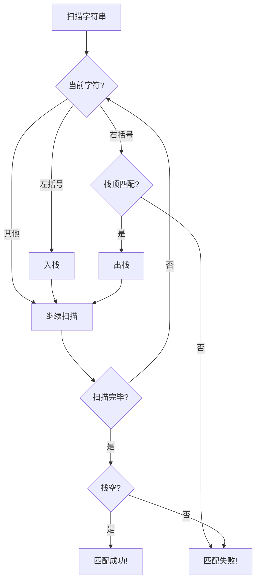
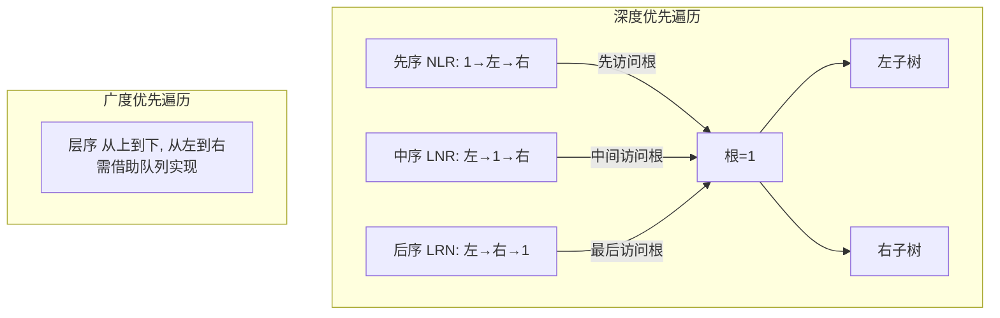
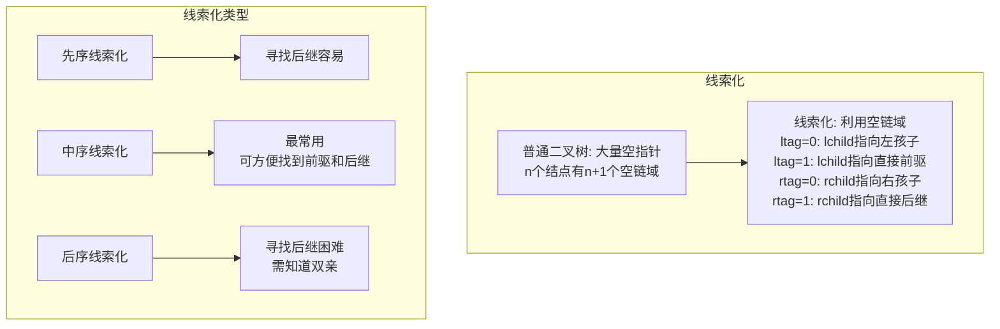
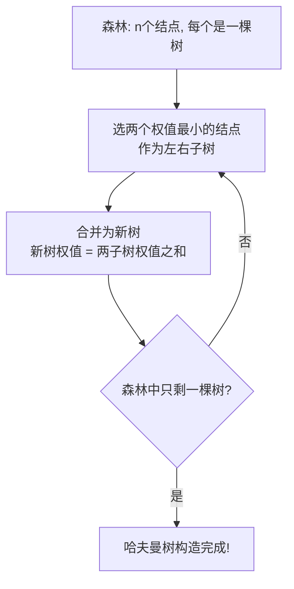
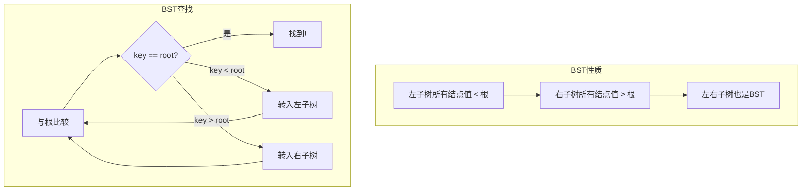

# 数据结构 · 考研408核心知识点详解

> 以下内容严格覆盖考研408大纲所有核心知识点，每个模块均配备详细 Mermaid 图表、算法伪代码与复杂度对比表。
> 所有流程图均标注核心数据结构、算法流程与关键步骤，末尾附综合实战工作流串联全部知识点。

---

## 前置概览：408 数据结构知识体系拓扑



---

──[ 一 ]──[ 线性表 ]

### 1.1 线性表定义与分类

:::important
**线性表**是 $n$ 个具有相同特性的数据元素的有限序列。$n=0$ 时称为空表。线性表是408考试中最基础的数据结构，也是其他数据结构的底层实现基础。
:::

```mermaid
graph TD
    subgraph 线性表存储结构
        A[""顺序存储 顺序表<br/>逻辑相邻=物理相邻<br/>随机存取 O(1)""] --> C[""应用场景：<br/>频繁查找、尾插尾删<br/>数据量相对固定""]
        B[""链式存储 链表<br/>逻辑相邻≠物理相邻<br/>顺序存取 O(n)""] --> D[""应用场景：<br/>频繁插入删除<br/>数据量动态变化""]
    end

    subgraph 链表变体
        E[""单链表<br/>next指针域""] --> F[""双链表<br/>prior+next指针域""]
        F --> G[""循环链表<br/>尾结点→头结点""]
        G --> H[""静态链表<br/>数组模拟链表<br/>游标代替指针""]
    end
```

### 1.2 顺序表（SeqList）

┌─────────────────────────────────────────────────────────────┐
│ 顺序表 = 数组 + 长度标记                                     │
│ 逻辑地址 = 起始地址 + 下标 × sizeof(ElemType)               │
│ 特点：#[G|可随机存取]，#[R|插入删除需移动大量元素]           │
└─────────────────────────────────────────────────────────────┘

**基本操作复杂度**：

| 操作 | 时间复杂度 | 说明 |
|------|-----------|------|
| 按位查找 | #[G|$O(1)$] | 直接通过下标访问 |
| 按值查找 | $O(n)$ | 需遍历比较 |
| 插入（平均） | $O(n)$ | 平均移动 $n/2$ 个元素 |
| 删除（平均） | $O(n)$ | 平均移动 $(n-1)/2$ 个元素 |
| 尾插/尾删 | #[G|$O(1)$] | 无需移动元素 |

```c
// 顺序表插入操作（第i个位置插入元素e）
bool ListInsert(SqList *L, int i, ElemType e) {
    if (i < 1 || i > L->length + 1) return false;  // 非法位置
    if (L->length >= MaxSize) return false;          // 表满
    for (int j = L->length; j >= i; j--)            // 从后往前移动
        L->data[j] = L->data[j - 1];
    L->data[i - 1] = e;
    L->length++;
    return true;
}
```

### 1.3 单链表（Singly Linked List）



| 操作 | 时间复杂度 | 说明 |
|------|-----------|------|
| 按位查找 | $O(n)$ | 需从头遍历 |
| 按值查找 | $O(n)$ | 需遍历比较 |
| 插入（已知前驱） | #[G|$O(1)$] | 仅修改指针 |
| 删除（已知前驱） | #[G|$O(1)$] | 仅修改指针 |
| 头插/头删 | #[G|$O(1)$] | 带头结点时 |

**头插法 vs 尾插法**：

- **头插法**：每次在头结点后插入，形成逆序链表
- **尾插法**：维护尾指针，保持原序，等价于顺序建立

```c
// 单链表头插法逆置（原地逆置）
void Reverse(LinkList L) {
    LNode *p = L->next, *q;
    L->next = NULL;               // 断开原链表
    while (p != NULL) {
        q = p->next;              // 保存后继
        p->next = L->next;        // 头插
        L->next = p;
        p = q;
    }
}
```

### 1.4 双链表与循环链表



:::note
**双链表优势**：已知结点指针时，插入/删除时间复杂度为 $O(1)$（单链表需 $O(n)$ 找前驱）。
**循环链表优势**：从任一结点出发可遍历全表，适合约瑟夫环等场景。
:::

### 1.5 线性表应用：多项式加法

```mermaid
graph TD
    A[""多项式 P(x) = 3x^5 + 2x^3 + 1""] --> B[""链表表示:<br/>(3,5)→(2,3)→(1,0)→NULL""]
    C[""多项式 Q(x) = 4x^5 + x^2""] --> D[""链表表示:<br/>(4,5)→(1,2)→NULL""]
    B --> E[""合并算法：<br/>指数相同→系数相加<br/>指数不同→取大者插入""]
    D --> E
    E --> F[""结果: (7,5)→(2,3)→(1,2)→(1,0)""]
```

---

──[ 二 ]──[ 栈与队列 ]

### 2.1 栈（Stack）

:::important
栈是**只允许在一端进行插入和删除**的线性表。后进先出（LIFO）。栈顶（Top）是允许操作的一端，栈底（Bottom）是固定端。
:::



```c
// 顺序栈基本操作
#define MaxSize 50
typedef struct {
    ElemType data[MaxSize];
    int top;  // 栈顶指针
} SqStack;

// 入栈
bool Push(SqStack *S, ElemType x) {
    if (S->top == MaxSize - 1) return false;  // 栈满
    S->data[++S->top] = x;
    return true;
}
// 出栈
bool Pop(SqStack *S, ElemType *x) {
    if (S->top == -1) return false;  // 栈空
    *x = S->data[S->top--];
    return true;
}
```

### 2.2 队列（Queue）

```mermaid
graph TD
    subgraph 队列实现
        A[""顺序队列<br/>front=rear=0<br/>入队: rear++<br/>出队: front++""] --> B[""问题: 假溢出<br/>front!=0但rear==MaxSize""]
        B --> C[""循环队列<br/>front=rear=0(队空)<br/>(rear+1)%MaxSize==front(队满)""]
        D[""链队列<br/>front→头结点<br/>rear→尾结点<br/>入队=尾插, 出队=头删""] --> E[""双端队列:<br/>两端均可入队/出队<br/>输出受限/输入受限""]
    end
```

**循环队列关键公式**：

| 含义 | 公式 |
|------|------|
| 入队 | `rear = (rear + 1) % MaxSize` |
| 出队 | `front = (front + 1) % MaxSize` |
| 队列长度 | `(rear - front + MaxSize) % MaxSize` |
| 队满条件 | `(rear + 1) % MaxSize == front`（牺牲一个单元） |

### 2.3 表达式求值（栈的核心应用）



```c
// 运算符优先级判断
int precedence(char op) {
    switch (op) {
        case '+': case '-': return 1;
        case '*': case '/': return 2;
        case '(': return 0;
    }
    return -1;
}
```

### 2.4 括号匹配



---

──[ 三 ]──[ 串 ]

### 3.1 串的定义与存储

**串**（String）是由零个或多个字符组成的有限序列。$S = "a_1 a_2 ... a_n"$。

| 存储方式 | 描述 | 特点 |
|----------|------|------|
| 定长顺序存储 | 用定长数组存储 | 可能截断 |
| 堆分配存储 | 动态分配内存 | 灵活 |
| 块链存储 | 链表存储，每结点多个字符 | 存储密度低 |

### 3.2 暴力匹配算法（BF）

```c
// 暴力匹配 - 时间复杂度 O(n×m)
int BF(char *S, char *T) {
    int i = 0, j = 0;
    int n = strlen(S), m = strlen(T);
    while (i < n && j < m) {
        if (S[i] == T[j]) { i++; j++; }
        else { i = i - j + 1; j = 0; }  // 回溯
    }
    if (j == m) return i - m;  // 匹配成功
    return -1;                  // 匹配失败
}
```

### 3.3 KMP算法（核心难点）

:::important
KMP 算法的核心是**避免主串指针回溯**，利用已匹配前缀的信息，在失配时快速移动模式串。关键数据结构是 #[C|next数组]。
:::

```mermaid
graph TD
    A[""预处理: 计算next数组""] --> B["next[j] = 模式串中<br/>前缀=后缀的最长长度"]
    B --> C[""匹配过程: i不动, j=next[j"]"]
    C --> D{"j==-1?"}
    D -->|"是"| E["i++, j++"]
    D -->|"否"| F{"S[i]==T[j]?"}
    F -->|"是"| E
    F -->|"否"| C
    E --> G{"j==m?"}
    G -->|"是"| H["匹配成功! 返回 i-m"]
    G -->|"否"| I{"i==n?"}
    I -->|"是"| J["匹配失败!"]
    I -->|"否"| F
```

**next数组手工计算口诀**：

- `next[0] = -1`（或 `next[1] = 0`，取决于下标起始）
- 对于位置 $j$，看 $T[0..j-1]$ 中前缀与后缀的最长公共长度 $k$
- `next[j] = k`（失配时跳转到位置 $k$）

```c
// KMP算法 - 时间复杂度 O(n+m)
void getNext(char *T, int next[]) {
    int j = 0, k = -1;
    next[0] = -1;
    while (j < strlen(T) - 1) {
        if (k == -1 || T[j] == T[k]) {
            j++; k++;
            next[j] = k;  // 原版
        } else {
            k = next[k];
        }
    }
}
```

**nextval 优化**：当 $T[j] == T[next[j]]$ 时，`nextval[j] = nextval[next[j]]`，避免重复比较。

---

──[ 四 ]──[ 树与二叉树 ]

### 4.1 树的基本概念

```
        A  (根)
       /|\
      B C D  (子树)
     /|   \
    E F    G
```

| 术语 | 定义 |
|------|------|
| 结点的度 | 结点拥有的子树个数 |
| 树的度 | 树中结点的最大度数 |
| 叶子结点 | 度为0的结点 |
| 树的深度/高度 | 树中结点的最大层数 |
| 路径长度 | 路径上边的数目 |

:::note
**树的性质**：
- 结点数 = 所有结点度数之和 + 1
- 度为 $m$ 的树中第 $i$ 层最多 $m^{i-1}$ 个结点
- 高度为 $h$ 的 $m$ 叉树最多 $(m^h - 1)/(m - 1)$ 个结点
:::

### 4.2 二叉树

```mermaid
graph TD
    subgraph 二叉树5种形态
        A1["空二叉树"] 
        A2[""仅根结点<br/>左右子树为空""]
        A3[""根+左子树<br/>右子树为空""]
        A4[""根+右子树<br/>左子树为空""]
        A5["根+左子树+右子树"]
    end

    subgraph 特殊二叉树
        B1[""满二叉树<br/>每层结点数=2^(h-1)""]
        B2[""完全二叉树<br/>仅最后一层可不满<br/>结点从左到右排列""]
        B3[""二叉排序树BST<br/>左<根<右""]
        B4[""平衡二叉树AVL<br/>|左高-右高|≤1""]
    end
```

**二叉树性质（必考）**：

| 性质 | 内容 |
|------|------|
| 性质1 | 第 $i$ 层最多 $2^{i-1}$ 个结点（$i \ge 1$） |
| 性质2 | 深度为 $k$ 的二叉树最多 $2^k - 1$ 个结点 |
| 性质3 | $n_0 = n_2 + 1$（叶子数 = 度为2的结点数 + 1） |
| 性质4 | $n$ 个结点的完全二叉树深度为 $\lfloor \log_2 n \rfloor + 1$ |
| 性质5 | 完全二叉树中，结点 $i$ 的左孩子为 $2i$，右孩子为 $2i+1$，双亲为 $\lfloor i/2 \rfloor$ |

### 4.3 二叉树遍历（408高频考点）



**遍历序列唯一确定二叉树**：

- 先序 + 中序 → 唯一确定二叉树
- 后序 + 中序 → 唯一确定二叉树
- 层序 + 中序 → 唯一确定二叉树
- 先序 + 后序 → #[R|不能]唯一确定（无法区分左右子树）

```c
// 中序遍历（递归）
void InOrder(BiTree T) {
    if (T != NULL) {
        InOrder(T->lchild);
        visit(T);           // 访问根结点
        InOrder(T->rchild);
    }
}

// 先序遍历（非递归 - 栈实现）
void PreOrder(BiTree T) {
    Stack S; InitStack(&S);
    BiTree p = T;
    while (p || !StackEmpty(S)) {
        while (p) {
            visit(p);               // 先访问根
            Push(&S, p);
            p = p->lchild;          // 一路向左
        }
        if (!StackEmpty(S)) {
            Pop(&S, &p);
            p = p->rchild;          // 转向右子树
        }
    }
}
```

### 4.4 线索二叉树



### 4.5 哈夫曼树（Huffman Tree）

:::important
**哈夫曼树**：带权路径长度（WPL）最小的二叉树，也称最优二叉树。
**WPL** = $\sum_{i=1}^{n} w_i \times l_i$（叶结点的权值 × 路径长度之和）
**构造原则**：#[C|权值越小离根越远，权值越大离根越近]
:::



**哈夫曼编码**：
- 左分支标0，右分支标1
- 每个字符的编码是根到叶子的路径
- 是**前缀编码**（任一编码不是其他编码的前缀）
- 带权路径长度 WPL = 所有叶结点权值 × 路径长度

### 4.6 并查集（Disjoint Set）

```mermaid
graph TD
    A[""并查集 处理不相交集合<br/>的合并与查询""] --> B["三种操作"]
    B --> C[""Initial: 每个元素自成集合<br/>parent[i"] = -1"]
    B --> D[""Find(x): 查找x所属集合<br/>返回根结点""]
    B --> E[""Union(x,y): 合并x和y的集合<br/>将一个根指向另一个根""]
    C --> F[""优化1: 按秩合并<br/>小树合并到大树""]
    D --> G[""优化2: 路径压缩<br/>查找时直接将结点<br/>挂到根下""]
```

```c
// 并查集 - 路径压缩优化
int Find(int x) {
    if (parent[x] < 0) return x;          // 找到根
    return parent[x] = Find(parent[x]);   // 路径压缩
}

void Union(int x, int y) {
    int rx = Find(x), ry = Find(y);
    if (rx == ry) return;                 // 同集合
    if (parent[rx] < parent[ry]) {        // rx树更大(负值)
        parent[rx] += parent[ry];         // 累加结点数
        parent[ry] = rx;
    } else {
        parent[ry] += parent[rx];
        parent[rx] = ry;
    }
}
```

### 4.7 二叉排序树（BST）



| BST操作 | 平均时间复杂度 | 最坏时间复杂度 |
|---------|---------------|---------------|
| 查找 | $O(\log n)$ | #[R|$O(n)$]（退化为链表） |
| 插入 | $O(\log n)$ | $O(n)$ |
| 删除 | $O(\log n)$ | $O(n)$ |

**BST删除三种情况**：
1. 叶子结点 → 直接删除
2. 单孩子 → 孩子替代
3. 双孩子 → 用直接后继（或前驱）替代，转化为情况1或2

### 4.8 平衡二叉树（AVL）

```mermaid
graph TD
    subgraph AVL定义
        A[""平衡因子 = 左子树高度 - 右子树高度<br/>任意结点的平衡因子 ∈ {-1, 0, 1}""]
    end

    subgraph 四种旋转
        B[""LL型: 右单旋<br/>在A的左孩子的左子树插入""] --> C[""RR型: 左单旋<br/>在A的右孩子的右子树插入""]
        D[""LR型: 先左后右双旋<br/>在A的左孩子的右子树插入""] --> E[""RL型: 先右后左双旋<br/>在A的右孩子的左子树插入""]
    end
```

**AVL插入调整判断口诀**：
- 从插入点向上，找到第一个 `|平衡因子|=2` 的结点A
- 看插入在A的哪个方向：LL/LR/RR/RL
- 对应应用旋转

### 4.9 红黑树性质（考纲要求掌握性质）

:::note
**红黑树5条性质**：
1. 每个结点是红色或黑色
2. 根结点是黑色
3. 叶结点（NIL）是黑色
4. 红结点的两个孩子必为黑色（不能连续红）
5. 从任一结点到其每个叶子的简单路径黑色结点数相同（黑高相等）

**推论**：最长路径 ≤ 2倍最短路径，保证近似平衡。插入删除最多 $O(\log n)$。
:::

---

──[ 五 ]──[ 图 ]

### 5.1 图的基本概念

| 术语 | 定义 |
|------|------|
| 完全图 | 无向图 $n(n-1)/2$ 条边，有向图 $n(n-1)$ 条弧 |
| 连通图 | 无向图任意两点可达 |
| 强连通图 | 有向图任意两点互相可达 |
| 生成树 | 包含所有顶点的极小连通子图（$n-1$ 条边） |
| 度 | 无向图=边数×2；有向图=入度+出度 |

### 5.2 图的存储结构

```mermaid
graph TD
    subgraph 邻接矩阵
        M1[""n×n的二维数组<br/>A[i"][j]=1 有边<br/>A[i][j]=0 无边"] --> M2[""优点: 判断边 O(1)<br/>缺点: 空间 O(n²)<br/>适合稠密图""]
    end

    subgraph 邻接表
        L1[""顶点数组 + 边链表<br/>每个顶点对应一个链表""] --> L2[""优点: 空间 O(n+e)<br/>缺点: 判断边需遍历<br/>适合稀疏图""]
    end

    subgraph 其他存储
        C1[""十字链表: 有向图<br/>同时存储出边和入边""] --> C2[""邻接多重表: 无向图<br/>便于边操作""]
    end
```

### 5.3 图的遍历

```mermaid
graph TD
    subgraph DFS深度优先
        D1["从顶点v出发"] --> D2["访问v, 标记已访问"]
        D2 --> D3["找v的第一个未访问邻接点w"]
        D3 --> D4{"w存在?"}
        D4 -->|"是"| D5[""递归DFS(w)""]
        D5 --> D3
        D4 -->|"否"| D6["回溯"]
        D6 --> D7[""复杂度: 邻接矩阵 O(n²)<br/>邻接表 O(n+e)""]
    end

    subgraph BFS广度优先
        B1["从顶点v出发"] --> B2["v入队, 标记已访问"]
        B2 --> B3{"队列空?"}
        B3 -->|"否"| B4["队首出队, 访问"]
        B4 --> B5["所有未访问邻接点入队"]
        B5 --> B3
        B3 -->|"是"| B6["遍历结束"]
    end
```

```c
// BFS广度优先遍历 (邻接矩阵)
void BFS(MGraph G, int v) {
    int queue[MAXV], front = 0, rear = 0;
    visited[v] = 1;
    queue[rear++] = v;
    while (front != rear) {
        int u = queue[front++];
        visit(u);
        for (int w = 0; w < G.n; w++) {
            if (G.edges[u][w] && !visited[w]) {
                visited[w] = 1;
                queue[rear++] = w;
            }
        }
    }
}
```

### 5.4 最小生成树（MST）

```mermaid
graph TD
    subgraph Prim算法
        P1[""初始化: 任选起点, U={v}""] --> P2["找U中各顶点到V-U的最小边"]
        P2 --> P3["将该边连接的V-U顶点加入U"]
        P3 --> P4{"U==V?"}
        P4 -->|"否"| P2
        P4 -->|"是"| P5[""MST完成! 复杂度 O(n²)""]
    end

    subgraph Kruskal算法
        K1["将所有边按权值排序"] --> K2["依次取最小边"]
        K2 --> K3{"加入后形成环?"}
        K3 -->|"是"| K4["跳过, 取下一条"]
        K3 -->|"否"| K5["加入MST边集"]
        K4 --> K2
        K5 --> K6{"已选n-1条边?"}
        K6 -->|"否"| K2
        K6 -->|"是"| K7[""MST完成! 复杂度 O(e·log e)""]
    end
```

| 算法 | 时间复杂度 | 适用图类型 | 实现核心 |
|------|-----------|-----------|----------|
| Prim | #[G|$O(n^2)$] | 稠密图 | 不断找最近顶点 |
| Kruskal | #[G|$O(e \log e)$] | 稀疏图 | 不断找最短边（并查集判环） |

### 5.5 最短路径

```mermaid
graph TD
    subgraph Dijkstra单源最短路径
        D1[""初始化: dist[v"]=∞, dist[s]=0"] --> D2["选未访问中dist最小的顶点u"]
        D2 --> D3["标记u已访问"]
        D3 --> D4[""更新u的所有邻接点v:<br/>dist[v"] = min(dist[v], dist[u]+w(u,v))"]
        D4 --> D5{"所有顶点已访问?"}
        D5 -->|"否"| D2
        D5 -->|"是"| D6[""完成! 复杂度 O(n²)<br/>仅适用于非负权边""]
    end

    subgraph Floyd多源最短路径
        F1[""初始化: A[i"][j]=边权值<br/>d[i][i]=0"] --> F2["枚举中间点k"]
        F2 --> F3["枚举起点i, 终点j"]
        F3 --> F4["A[i][j]=min(A[i][j], A[i][k]+A[k][j])"]
        F4 --> F5{"k循环结束?"}
        F5 -->|"否"| F2
        F5 -->|"是"| F6[""完成! 复杂度 O(n³)""]
    end
```

| 算法 | 时间复杂度 | 适用范围 |
|------|-----------|----------|
| #[C|Dijkstra] | $O(n^2)$ | 单源，非负权 |
| #[C|Floyd] | $O(n^3)$ | 多源，可负权（无负环） |
| Bellman-Ford | $O(n \cdot e)$ | 单源，可负权，判负环 |

### 5.6 拓扑排序与关键路径

```mermaid
graph TD
    subgraph 拓扑排序AOV网
        T1["找入度为0的顶点"] --> T2["输出该顶点"]
        T2 --> T3["删除该顶点及所有出边"]
        T3 --> T4{"所有顶点已输出?"}
        T4 -->|"是"| T5["拓扑排序成功!"]
        T4 -->|"否且无入度0顶点"| T6["有环, 无法拓扑排序!"]
        T4 -->|"否"| T1
    end

    subgraph 关键路径AOE网
        C1[""计算事件最早发生时间 ve(i)<br/>正向拓扑排序, 取最大值""] --> C2[""计算事件最迟发生时间 vl(i)<br/>逆向拓扑排序, 取最小值""]
        C2 --> C3[""计算活动最早开始 e(i)=ve(起点)""]
        C3 --> C4[""计算活动最迟开始 l(i)=vl(终点)-持续时间""]
        C4 --> C5[""e(i)==l(i) 的活动<br/>即为关键活动""]
        C5 --> C6[""关键活动组成的路径<br/>即为关键路径""]
    end
```

**关键路径口诀**：
- 最早开始时间 `ve`：从前往后，取**最大值**
- 最迟开始时间 `vl`：从后往前，取**最小值**
- 活动时间余量 `l(i) - e(i) = 0` → 关键活动

---

──[ 六 ]──[ 查找 ]

### 6.1 顺序查找

```c
// 顺序查找（带哨兵）- 时间复杂度 O(n), ASL=(n+1)/2
int SeqSearch(int a[], int n, int key) {
    a[0] = key;  // 哨兵，a[0]不存数据
    int i;
    for (i = n; a[i] != key; i--);  // 从后往前找
    return i;  // i=0表示未找到
}
```

| 查找方式 | 平均查找长度 ASL | 时间复杂度 |
|----------|-----------------|-----------|
| 顺序查找（成功） | $(n+1)/2$ | $O(n)$ |
| 顺序查找（失败） | $n+1$（无哨兵） | $O(n)$ |
| 有序表顺序查找（失败） | $(n+1)/2$ | $O(n)$ |

### 6.2 二分查找

```mermaid
graph TD
    A[""要求: 有序顺序表""] --> B["low=0, high=n-1"]
    B --> C[""mid = (low+high)/2""]
    C --> D{"key == a[mid]?"}
    D -->|"是"| E["找到! 返回mid"]
    D -->|"key < a[mid]"| F["high = mid - 1"]
    D -->|"key > a[mid]"| G["low = mid + 1"]
    F --> H{"low <= high?"}
    G --> H
    H -->|"是"| C
    H -->|"否"| I["查找失败!"]
```

```c
// 二分查找（非递归） - 时间复杂度 O(log n)
int BinarySearch(int a[], int n, int key) {
    int low = 0, high = n - 1, mid;
    while (low <= high) {
        mid = (low + high) / 2;
        if (key == a[mid]) return mid;
        else if (key < a[mid]) high = mid - 1;
        else low = mid + 1;
    }
    return -1;
}
```

**二分查找判定树**：$n$ 个结点的判定树深度为 $\lfloor \log_2 n \rfloor + 1$，ASL ≈ $\log_2(n+1) - 1$。

### 6.3 分块查找（索引顺序查找）

:::note
**分块查找**：将数据分为若干块，块内无序、块间有序。先查索引表确定块，再在块内顺序查找。
- 索引表 ASL = $(b+1)/2$（$b$ 为块数）
- 块内 ASL = $(s+1)/2$（$s$ 为每块大小）
- 总 ASL = $(b+s)/2 + 1$，当 $s=\sqrt{n}$ 时最优，ASL ≈ $\sqrt{n} + 1$
:::

### 6.4 B树与B+树

```mermaid
graph TD
    subgraph B树m阶定义
        B1["每个结点最多 m 棵子树"] --> B2[""根结点至少2棵子树<br/>非根非叶至少 ⌈m/2⌉ 棵子树""]
        B2 --> B3[""结点关键字数 = 子树数-1<br/>⌈m/2⌉-1 ≤ 关键字数 ≤ m-1""]
        B3 --> B4[""所有叶结点在同一层<br/>结点内关键字有序""]
    end

    subgraph B+树与B树区别
        P1[""B+树: 非叶结点仅索引<br/>数据全部在叶结点""] --> P2[""B+树: 叶结点链表相连<br/>支持顺序查找""]
        P3[""B树: 每个结点都存数据<br/>不支持顺序查找""] --> P4["B+树更适合作数据库索引"]
    end
```

| 特性 | B树 | B+树 |
|------|-----|------|
| 数据存储 | 每个结点存数据 | 仅叶结点存数据 |
| 非叶结点 | 关键字+数据 | 关键字+孩子指针 |
| 叶结点 | 孤立 | 链表相连 |
| 范围查询 | 需中序遍历 | #[G|高效，沿链表] |
| 查找稳定性 | 可能在非叶命中 | #[G|必须到叶结点] |

### 6.5 散列表（Hash Table）

```mermaid
graph TD
    subgraph 散列函数
        H1[""除留余数法: H(key)=key mod p<br/>p取不大于表长的最大素数""]
        H2[""直接定址法: H(key)=a×key+b""]
        H3[""平方取中法: 取key²中间几位""]
        H4[""数字分析法: 取关键字分布均匀的几位""]
    end

    subgraph 冲突处理
        C1[""开放定址法<br/>Hi=(H(key)+di) mod m""] --> D1[""线性探测: di=1,2,3...""]
        C1 --> D2[""平方探测: di=1²,-1²,2²,-2²...""]
        C1 --> D3[""再散列: di=i×H2(key)""]
        C1 --> D4[""伪随机: di=随机序列""]
        C2[""链地址法<br/>同义词链成链表""] --> D5[""优点: 无堆积<br/>适合表长不确定""]
    end
```

**散列表性能指标**：

| 指标 | 公式 |
|------|------|
| 装填因子 $\alpha$ | $\alpha = \frac{\text{记录数}}{\text{表长}}$ |
| 线性探测成功 ASL | $\frac{1}{2}(1+\frac{1}{1-\alpha})$ |
| 线性探测失败 ASL | $\frac{1}{2}(1+\frac{1}{(1-\alpha)^2})$ |
| 链地址成功 ASL | $1 + \frac{\alpha}{2}$ |
| 链地址失败 ASL | $\alpha + e^{-\alpha}$ |

:::warning
**散列表不支持范围查找和顺序遍历**。当 $\alpha$ 过大时性能急剧下降，需扩容重建。
:::

---

──[ 七 ]──[ 排序 ]

### 7.1 排序算法分类总览

```mermaid
graph TD
    subgraph 插入排序
        I1[""直接插入排序<br/>O(n²) / 稳定""] --> I2[""折半插入排序<br/>O(n²)比较次数减少<br/>但移动次数不变""]
        I2 --> I3[""希尔排序<br/>缩小增量排序<br/>O(n¹·³) ~ O(n²) / 不稳定""]
    end

    subgraph 交换排序
        E1[""冒泡排序<br/>O(n²) / 稳定""] --> E2[""快速排序<br/>分治+枢轴划分<br/>O(n·log n) / 不稳定""]
    end

    subgraph 选择排序
        S1[""简单选择排序<br/>O(n²) / 不稳定""] --> S2[""堆排序<br/>O(n·log n) / 不稳定<br/>建堆O(n), 排序O(n·log n)""]
    end

    subgraph 其他排序
        M1[""归并排序<br/>O(n·log n) / 稳定<br/>空间O(n)""] --> M2[""基数排序<br/>O(d×(n+r)) / 稳定<br/>适合多关键字""]
    end
```

### 7.2 直接插入排序

```c
// 直接插入排序 - 时间复杂度 O(n²), 稳定, 空间 O(1)
void InsertSort(int a[], int n) {
    int i, j, temp;
    for (i = 1; i < n; i++) {
        if (a[i] < a[i - 1]) {  // 需要插入
            temp = a[i];
            for (j = i - 1; j >= 0 && a[j] > temp; j--)
                a[j + 1] = a[j];  // 后移
            a[j + 1] = temp;       // 插入
        }
    }
}
```

### 7.3 希尔排序

```c
// 希尔排序 - 不稳定, 空间 O(1)
void ShellSort(int a[], int n) {
    for (int dk = n / 2; dk >= 1; dk /= 2) {  // 增量递减
        for (int i = dk; i < n; i++) {
            if (a[i] < a[i - dk]) {
                int temp = a[i], j;
                for (j = i - dk; j >= 0 && a[j] > temp; j -= dk)
                    a[j + dk] = a[j];
                a[j + dk] = temp;
            }
        }
    }
}
```

### 7.4 冒泡排序

```mermaid
graph TD
    A["i从0到n-2"] --> B["j从0到n-2-i"]
    B --> C{"a[j] > a[j+1]?"}
    C -->|"是"| D["交换a[j]和a[j+1]"]
    C -->|"否"| E["继续"]
    D --> F{"j循环结束?"}
    E --> F
    F -->|"否"| B
    F -->|"是"| G{"i循环结束?"}
    G -->|"否"| A
    G -->|"是"| H["排序完成!"]
```

### 7.5 快速排序（408核心算法）

```mermaid
graph TD
    subgraph 快排划分过程
        P1["选枢轴pivot=a[low]"] --> P2[""high从右往左找 < pivot""]
        P2 --> P3[""low从左往右找 > pivot""]
        P3 --> P4{"low < high?"}
        P4 -->|"是"| P5["交换a[low]和a[high]"]
        P5 --> P2
        P4 -->|"否"| P6["将pivot放入最终位置"]
        P6 --> P7["递归排序左右子表"]
    end
```

```c
// 快速排序 - 平均 O(n·log n), 最坏 O(n²), 不稳定
int Partition(int a[], int low, int high) {
    int pivot = a[low];  // 第一个元素作枢轴
    while (low < high) {
        while (low < high && a[high] >= pivot) high--;
        a[low] = a[high];  // 比pivot小的移到左边
        while (low < high && a[low] <= pivot) low++;
        a[high] = a[low];  // 比pivot大的移到右边
    }
    a[low] = pivot;  // 枢轴归位
    return low;
}

void QuickSort(int a[], int low, int high) {
    if (low < high) {
        int pivotPos = Partition(a, low, high);
        QuickSort(a, low, pivotPos - 1);
        QuickSort(a, pivotPos + 1, high);
    }
}
```

:::warning
**快排最坏情况**：序列基本有序时退化为 $O(n^2)$。优化方法：三数取中选枢轴、随机选枢轴、小数组改用插入排序。
:::

### 7.6 堆排序

```mermaid
graph TD
    subgraph 堆的定义
        H1[""大根堆: 每个结点 ≥ 孩子<br/>用于升序排序""] --> H2[""小根堆: 每个结点 ≤ 孩子<br/>用于降序排序""]
    end

    subgraph 堆排序步骤
        S1[""1. 建堆: 从 ⌊n/2⌋ 到1<br/>向下调整 O(n)""] --> S2["2. 将堆顶与最后一个元素交换"]
        S2 --> S3["3. 堆大小减1, 向下调整堆顶"]
        S3 --> S4{"堆大小 > 1?"}
        S4 -->|"是"| S2
        S4 -->|"否"| S5["排序完成!"]
    end
```

```c
// 堆排序 - 时间复杂度 O(n·log n), 不稳定, 空间 O(1)
void HeapAdjust(int a[], int k, int len) {
    // 将a[k]向下调整, 使其满足大根堆性质
    int temp = a[k];
    for (int i = 2 * k; i <= len; i *= 2) {  // 沿较大的孩子向下
        if (i < len && a[i] < a[i + 1]) i++;  // 选较大的孩子
        if (temp >= a[i]) break;
        a[k] = a[i];  // 孩子上移
        k = i;
    }
    a[k] = temp;
}

void HeapSort(int a[], int n) {
    // 建堆: 从最后一个非叶结点开始
    for (int i = n / 2; i >= 1; i--)
        HeapAdjust(a, i, n);
    // 依次取出堆顶
    for (int i = n; i > 1; i--) {
        swap(a[1], a[i]);      // 堆顶与末尾交换
        HeapAdjust(a, 1, i - 1);
    }
}
```

### 7.7 归并排序

```c
// 归并排序 - 时间复杂度 O(n·log n), 稳定, 空间 O(n)
void Merge(int a[], int low, int mid, int high) {
    int *b = (int*)malloc((high - low + 1) * sizeof(int));
    int i = low, j = mid + 1, k = 0;
    while (i <= mid && j <= high) {
        if (a[i] <= a[j]) b[k++] = a[i++];
        else b[k++] = a[j++];
    }
    while (i <= mid) b[k++] = a[i++];
    while (j <= high) b[k++] = a[j++];
    for (i = low, k = 0; i <= high; i++, k++)
        a[i] = b[k];
    free(b);
}

void MergeSort(int a[], int low, int high) {
    if (low < high) {
        int mid = (low + high) / 2;
        MergeSort(a, low, mid);
        MergeSort(a, mid + 1, high);
        Merge(a, low, mid, high);
    }
}
```

### 7.8 排序算法终极对比表

| 排序算法 | 最好时间 | 平均时间 | 最坏时间 | 空间 | 稳定性 | 适用场景 |
|----------|----------|----------|----------|------|--------|----------|
| 直接插入 | #[G|$O(n)$] | $O(n^2)$ | $O(n^2)$ | $O(1)$ | #[G|稳定] | 基本有序、小数据 |
| 折半插入 | $O(n\log n)$ | $O(n^2)$ | $O(n^2)$ | $O(1)$ | 稳定 | 比较代价大时 |
| 希尔排序 | $O(n^{1.3})$ | $O(n^{1.3})$ | $O(n^2)$ | $O(1)$ | #[R|不稳定] | 中等数据量 |
| 冒泡排序 | #[G|$O(n)$] | $O(n^2)$ | $O(n^2)$ | $O(1)$ | 稳定 | 基本有序 |
| 快速排序 | $O(n\log n)$ | $O(n\log n)$ | #[R|$O(n^2)$] | $O(\log n)$ | #[R|不稳定] | 数据随机、大量数据 |
| 简单选择 | $O(n^2)$ | $O(n^2)$ | $O(n^2)$ | $O(1)$ | #[R|不稳定] | 数据量小 |
| 堆排序 | $O(n\log n)$ | $O(n\log n)$ | $O(n\log n)$ | $O(1)$ | #[R|不稳定] | 取Top-K |
| 归并排序 | $O(n\log n)$ | $O(n\log n)$ | $O(n\log n)$ | #[R|$O(n)$] | #[G|稳定] | 外部排序、稳定需求 |
| 基数排序 | $O(d(n+r))$ | $O(d(n+r))$ | $O(d(n+r))$ | $O(r)$ | #[G|稳定] | 多关键字、范围小 |

:::important
**408常考排序选择题判断**：
- 一趟排序后能确定一个元素最终位置的：#[C|交换类（冒泡、快排）]和#[C|选择类（简单选择、堆排序）]
- 插入类排序一趟后不能确定最终位置
- 数据基本有序时：#[G|插入排序]最快，#[R|快排]最慢
- 关键字比较次数与初始序列无关的：#[C|简单选择排序]、#[C|折半插入排序]
- 排序趟数与初始序列无关的：#[C|直接插入排序]、#[C|简单选择排序]、#[C|基数排序]
:::

---

──[ 八 ]──[ 全流程综合实战 ]

### 8.1 从数据处理到查找排序的完整场景

```mermaid
graph TD
    subgraph 阶段1: 数据存储
        A[""原始数据: 学号+成绩<br/>多条记录""] --> B[""用顺序表存储<br/>支持随机访问""]
        B --> C[""用链表辅助<br/>动态插入删除""]
    end

    subgraph 阶段2: 数据组织
        C --> D[""构建BST便于查找<br/>学号为关键字""]
        D --> E[""BST不平衡→转为AVL<br/>旋转保持平衡""]
        E --> F[""建立散列表<br/>用除留余数法+链地址""]
    end

    subgraph 阶段3: 数据处理
        F --> G[""用栈实现<br/>递归/表达式求值""]
        F --> H[""用队列实现<br/>层序遍历/缓冲区""]
        F --> I[""用图表示<br/>课程依赖关系""]
    end

    subgraph 阶段4: 算法应用
        I --> J["拓扑排序→排课表"]
        I --> K["最短路径→最优路径"]
        I --> L["关键路径→项目管理"]
        G --> M["KMP→文本检索"]
    end

    subgraph 阶段5: 排序输出
        H --> N["堆排序→Top-K成绩"]
        F --> O["快排→成绩排名"]
        F --> P["归并排序→稳定排序"]
        N --> Q["最终结果输出"]
        O --> Q
        P --> Q
    end
```

### 8.2 综合实战：学生成绩管理系统

```mermaid
sequenceDiagram
    participant Input as 输入(成绩数据)
    participant Seq as 顺序表存储
    participant BST as BST查找树
    participant Hash as 散列表
    participant Sort as 排序模块
    participant Output as 输出结果

    rect rgba(220, 240, 255, 0.4)
    Note over Input,Seq: ===== 阶段1：数据录入与存储 =====
    Input->>Seq: 录入学生记录(学号, 姓名, 成绩)
    Note over Seq: 顺序表支持快速随机访问<br/>O(1) 按索引查询
    Seq->>BST: 以学号为关键字插入BST
    Note over BST: BST提供 O(log n) 查找<br/>但需注意平衡性
    Seq->>Hash: 以学号为关键字插入散列表
    Note over Hash: 散列提供 O(1) 近似查找<br/>装填因子控制性能
    end

    rect rgba(240, 255, 240, 0.4)
    Note over BST,Hash: ===== 阶段2：数据查询 =====
    Note over BST: 按学号查询: BST查找<br/>按成绩范围查询: 中序遍历BST
    Note over Hash: 按学号精确查询: 散列查找<br/>O(1) 平均时间
    end

    rect rgba(255, 245, 230, 0.4)
    Note over Sort,Output: ===== 阶段3：排序输出 =====
    Sort->>Sort: 快速排序: 按成绩降序排名
    Note over Sort: 堆排序: 提取Top-10高分
    Sort->>Sort: 归并排序: 保证同分稳定排序
    Sort->>Output: 输出排名表
    end
```

### 8.3 考研408常见题型与解题思路

```mermaid
graph TD
    subgraph 选择题
        C1[""时间复杂度分析<br/>看循环层数/递归关系""] --> C2[""排序算法性质<br/>记住对比表""]
        C2 --> C3[""树的性质<br/>n0=n2+1 等公式""]
        C3 --> C4[""散列表ASL<br/>直接套公式""]
    end

    subgraph 综合应用题
        A1[""算法设计题<br/>链表/树/图操作""] --> A2[""手工模拟题<br/>排序/查找/遍历过程""]
        A2 --> A3[""证明题<br/>二叉树性质/算法正确性""]
        A3 --> A4[""分析题<br/>时空复杂度/算法选择""]
    end

    C4 --> A1
    C4 --> A2
```

### 8.4 代码编写核心模板

**408算法题答题模板**：

```c
// 1. 给出算法思想（文字描述）
// 2. 给出数据结构定义
typedef struct {
    // 必要的字段
} DataType;

// 3. 实现核心函数
ReturnType Algorithm(ParameterType param) {
    // 3.1 边界检查
    // 3.2 核心逻辑
    // 3.3 返回结果
}

// 4. 分析时间复杂度与空间复杂度
// 时间复杂度: O(...)
// 空间复杂度: O(...)
```

---

## 考研核心公式速查表

| 类别 | 公式 | 说明 |
|------|------|------|
| 二叉树 | $n_0 = n_2 + 1$ | 叶子数公式 |
| 二叉树 | $h = \lfloor \log_2 n \rfloor + 1$ | 完全二叉树深度 |
| 哈夫曼 | $WPL = \sum w_i \times l_i$ | 带权路径长度 |
| 顺序查找 | $ASL_{成功} = (n+1)/2$ | 等概率 |
| 二分查找 | $ASL \approx \log_2(n+1) - 1$ | 判定树 |
| 分块查找 | $ASL \approx \sqrt{n} + 1$ | $s = \sqrt{n}$ 时 |
| 散列表 | $\alpha = n/m$ | 装填因子 |
| 散列表 | $ASL_{成功} \approx 1 + \alpha/2$ | 链地址法 |
| 排序 | $T(n) = 2T(n/2) + O(n)$ | 归并递推 |
| 排序 | $T(n) = T(n-1) + O(n)$ | 快排最坏递推 |
| 图 | 无向完全图边数 = $n(n-1)/2$ | 完全图 |
| 图 | 生成树边数 = $n-1$ | 极小连通子图 |

---

> **全书总结**：数据结构是408考试的核心科目，围绕**线性结构（表/栈/队列/串）、非线性结构（树/图）、算法技术（查找/排序）**三大模块展开。重点掌握各数据结构的**定义、存储、操作、应用**四个层次，熟练记忆复杂度对比表和核心公式，配合真题练习，可从容应对考试。建议将重点放在**二叉树遍历、图算法、排序算法对比、散列表ASL计算**等高频考点上。