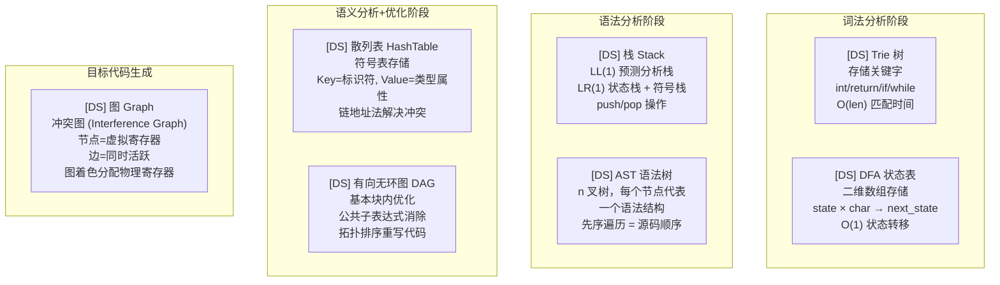
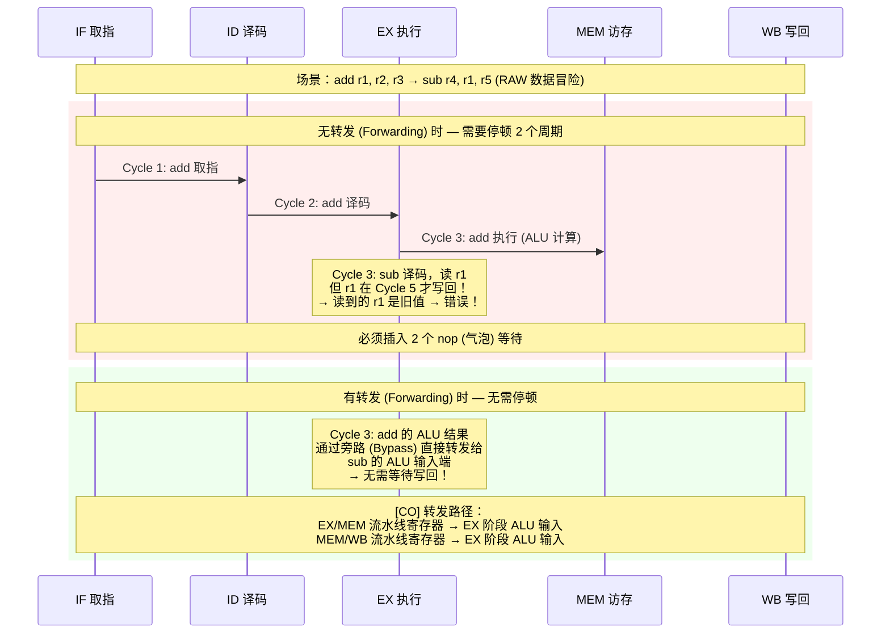
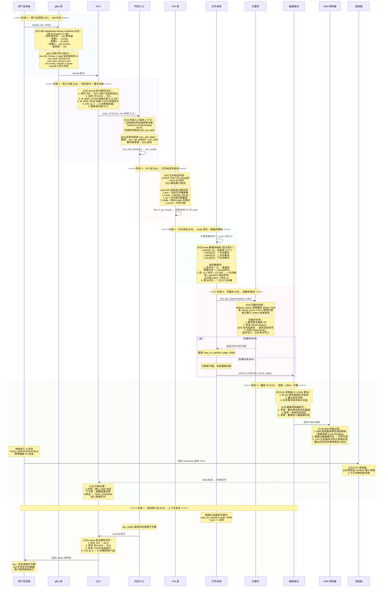
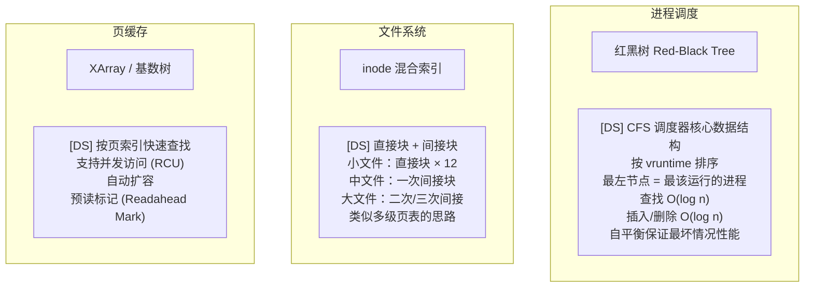
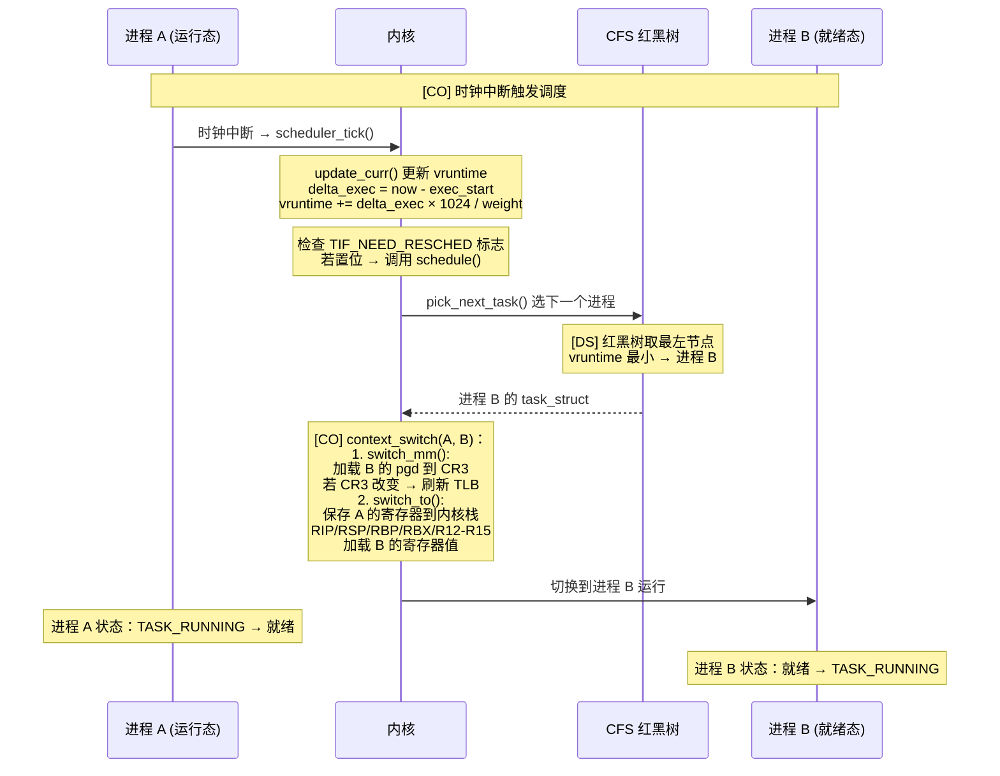
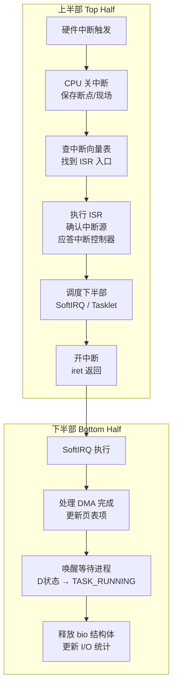
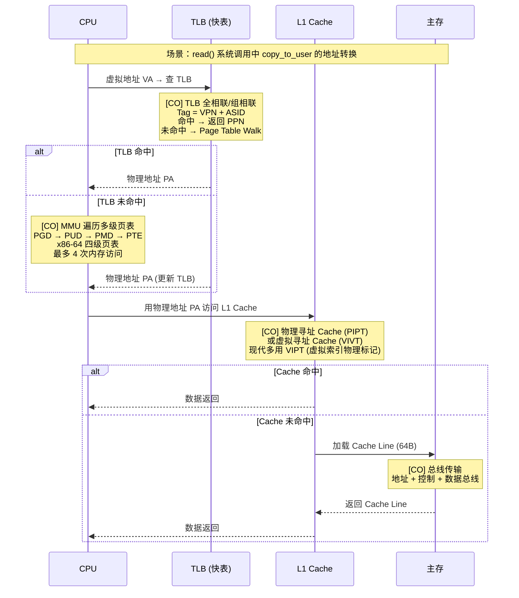

# 三科综合实战 · 计算机组成原理 × 数据结构 × 编译原理

> **目标：** 打破学科壁垒，用三个真实场景串联 #[C|计算机组成原理]、#[G|数据结构]、#[Y|编译原理] 三科核心知识。
> 每一阶段都标注了所属学科、核心数据结构、硬件机制与算法过程，体现"知识点之间不是孤立的"。

──[ 三科关系总览 ]──────────────────────────────────────────────────────[ 综合实战 ]

```mermaid
graph TB
    subgraph 编译原理
        CP1[""词法分析<br/>正则→NFA→DFA""] --> CP2[""语法分析<br/>LL(1)/LR(1)""] --> CP3[""语义分析<br/>类型检查""] --> CP4[""中间代码生成<br/>三地址码/四元式""] --> CP5[""代码优化<br/>DAG/数据流""] --> CP6[""目标代码生成<br/>指令选择/寄存器分配""]
    end

    subgraph 数据结构
        DS1[""线性表/栈/队列<br/>符号表/缓冲区""] --> DS2[""树/二叉树<br/>语法树/红黑树/堆""] --> DS3[""图/DAG<br/>优化/依赖分析""] --> DS4[""散列表<br/>符号表快速查找""] --> DS5[""B+树/B树<br/>文件索引/数据库""]
    end

    subgraph 计算机组成
        CO1[""指令系统<br/>RISC/CISC""] --> CO2[""CPU数据通路<br/>流水线/冒险""] --> CO3[""存储层次<br/>Cache/TLB/主存""] --> CO4[""I/O系统<br/>中断/DMA/总线""] --> CO5[""磁盘/SSD<br/>寻道/旋转/传输""]
    end

    CP1 -.->|"DFA 状态表"| DS1
    CP2 -.->|"语法树 AST"| DS2
    CP5 -.->|"DAG 优化"| DS3
    CP1 -.->|"符号表 散列"| DS4
    CP4 -.->|"目标代码"| CO1
    CP6 -.->|"指令流水"| CO2
    DS5 -.->|"数据库索引"| CO5
    DS2 -.->|"调度器红黑树"| CO2
```

:::important
以下三场景覆盖 #[R|考研 408] 核心交叉考点。建议先通读每个场景的时序图建立全局视野，再深入各阶段细节。
每个场景中标注了 `[CP]` 编译原理、`[DS]` 数据结构、`[CO]` 计算机组成，便于定位所属学科。
:::

***

## 场景一：从 C 源代码到程序执行的全链路

──[ 1.0 ]──[ 场景概览 ]

本场景以一段简单的 C 程序 `int add(int a, int b) { return a + b; }` 为起点，追踪从源码到最终 CPU 执行指令的完整路径。


| 阶段 | 学科 | 核心数据结构 | 关键算法/机制 |
|------|------|-------------|--------------|
| 词法分析 | #[C|CP] | 有穷自动机 DFA、Trie 树 | 正则匹配、最长匹配 |
| 语法分析 | #[C|CP] | 栈、语法树 (n叉树) | LL(1) 预测分析、LR(1) 移进-归约 |
| 语义分析 | #[C|CP] | 符号表 (散列表) | 类型检查、作用域解析 |
| 中间代码 | #[C|CP] | 四元式序列、流图 | 三地址码生成 |
| 代码优化 | #[C|CP]/[G|DS] | DAG 图、基本块流图 | 公共子表达式消除、常量折叠 |
| 目标代码 | #[C|CP]/[G|CO] | 寄存器描述符、地址描述符 | 寄存器分配 (图着色)、指令选择 |
| 加载执行 | #[G|CO] | 页表、VMA 红黑树 | 缺页中断、TLB 地址转换 |
| 流水线 | #[G|CO] | 流水线寄存器 | 转发、旁路、分支预测 |

──[ 1.1 ]──[ 全链路时序图：从源码到 CPU 执行 ]

```mermaid
sequenceDiagram
    participant SRC as C 源代码
    participant LEX as 词法分析器
    participant PAR as 语法分析器
    participant SEM as 语义分析器
    participant IR as 中间代码生成
    participant OPT as 代码优化器
    participant CG as 目标代码生成
    participant ASM as 汇编器
    participant LD as 链接器
    participant OS as OS 加载器
    participant CPU as CPU 流水线
    participant CACHE as Cache
    participant MEM as 主存

    rect rgba(240, 248, 255, 0.4)
    Note over SRC,LEX: ===== 阶段 1：词法分析 [CP] → 正则匹配 + DFA =====
    SRC->>LEX: "int add(int a, int b) { return a + b; }"
    Note over LEX: [DS] 用 Trie 树存储关键字<br/>int / return / if / while 等<br/>[CP] 正则表达式描述词法规则<br/>字母(字母|数字)* → 标识符
    Note over LEX: [CP] 正则 → NFA (Thompson 构造法)<br/>NFA → DFA (子集构造法 ε-closure)<br/>DFA 最小化 (Hopcroft 算法)
    LEX->>LEX: 逐个字符扫描，最长匹配
    Note over LEX: Token 流输出：<br/>[KW_INT] [ID:add] [LPAREN]<br/>[KW_INT] [ID:a] [COMMA]<br/>[KW_INT] [ID:b] [RPAREN]<br/>[LBRACE] [KW_RETURN] [ID:a]<br/>[PLUS] [ID:b] [SEMICOLON] [RBRACE]
    end

    rect rgba(248, 240, 255, 0.4)
    Note over LEX,PAR: ===== 阶段 2：语法分析 [CP] → 构建 AST 语法树 =====
    PAR->>PAR: LL(1) 预测分析法
    Note over PAR: [DS] 栈：压入起始符号<br/>查预测分析表 M[非终结符, 终结符]<br/>决定产生式选择
    Note over PAR: 文法规则 (简化)：<br/>FuncDef → Type ID ( Params ) Block<br/>Block → { StmtList }<br/>Stmt → return Expr ;<br/>Expr → Expr + Term | Term<br/>Term → ID | NUM
    Note over PAR: [DS] 构建 AST (n叉树结构)：<br/>FuncDef(call)<br/>├── Type(int)<br/>├── ID(add)<br/>├── Params<br/>│   ├── Param(Type=int, ID=a)<br/>│   └── Param(Type=int, ID=b)<br/>└── Block<br/>    └── Return<br/>        └── BinaryOp(+)"<br/>│           ├── ID(a)<br/>│           └── ID(b)
    PAR-->>SEM: AST 语法树
    end

    rect rgba(255, 248, 240, 0.4)
    Note over PAR,SEM: ===== 阶段 3：语义分析 [CP] → 类型检查 + 符号表 =====
    SEM->>SEM: 遍历 AST 进行语义分析
    Note over SEM: [DS] 符号表：散列表 (Hash Table)<br/>链地址法解决冲突<br/>Key = 标识符名<br/>Value = (类型, 作用域, 偏移量)
    Note over SEM: 符号表结构：<br/>┌──────────────┬──────────┬────────┬────────┐<br/>│ 标识符       │ 类型     │ 作用域 │ 偏移量 │<br/>├──────────────┼──────────┼────────┼────────┤<br/>│ add          │ int(int,int)│ 全局│  ---   │<br/>│ a            │ int      │ add    │ 0(rbp) │<br/>│ b            │ int      │ add    │ 4(rbp) │<br/>└──────────────┴──────────┴────────┴────────┘
    Note over SEM: 类型检查：<br/>1. a + b → int + int → int ✓<br/>2. return 类型 = 函数返回类型 ✓<br/>3. 变量使用前已声明 ✓
    SEM-->>IR: 带类型标注的 AST
    end

    rect rgba(240, 255, 248, 0.4)
    Note over SEM,IR: ===== 阶段 4：中间代码生成 [CP] → 三地址码 =====
    IR->>IR: 遍历 AST 生成三地址码
    Note over IR: [DS] 四元式结构 (op, arg1, arg2, result)<br/>线性表存储，便于后续优化
    Note over IR: 三地址码序列：<br/>1. (entry, add, -, - )     // 函数入口<br/>2. (param, a, -, t1)      // 形参 a<br/>3. (param, b, -, t2)      // 形参 b<br/>4. (+, a, b, t3)          // a + b<br/>5. (return, t3, -, -)     // 返回 t3<br/>6. (endfunc, add, -, -)   // 函数结束
    IR-->>OPT: 三地址码序列
    end

    rect rgba(255, 240, 245, 0.4)
    Note over IR,OPT: ===== 阶段 5：代码优化 [CP] + [DS] DAG 图 =====
    OPT->>OPT: 划分基本块，构建流图
    Note over OPT: [DS] DAG (有向无环图) 用于基本块内优化<br/>消除公共子表达式<br/>消除无用代码<br/>常量折叠 + 常量传播
    Note over OPT: 基本块优化流程：<br/>1. 构建 DAG 节点：<br/>   叶子节点 = 常量/变量初始值<br/>   内部节点 = 运算符<br/>2. DAG 优化：<br/>   相同子表达式 → 合并节点<br/>   常量运算 → 直接计算替换<br/>3. 从 DAG 重写三地址码
    Note over OPT: 本例优化：<br/>a + b 无公共子表达式，非循环<br/>→ 无重大优化机会<br/>→ 寄存器分配阶段优化
    OPT-->>CG: 优化后的三地址码
    end

    rect rgba(245, 250, 240, 0.4)
    Note over OPT,CG: ===== 阶段 6：目标代码生成 [CP] → 指令选择 + 寄存器分配 =====
    CG->>CG: 指令选择 (树覆盖 / 动态规划)
    Note over CG: [CO] x86-64 指令集：<br/>mov / add / push / pop / ret / call
    Note over CG: [DS] 寄存器分配：图着色算法<br/>节点 = 虚拟寄存器 (临时变量)<br/>边 = 两个变量同时活跃 (冲突)<br/>颜色 = 物理寄存器<br/>K 着色 → 若 K < 物理寄存器数 → 成功
    Note over CG: 寄存器分配过程：<br/>1. 构建冲突图 (Interference Graph)<br/>2. 按度数 < K 排序并压栈<br/>3. 出栈着色 (贪心)<br/>4. 若无法着色 → 溢出 (Spill) 到内存
    Note over CG: 本例简单：a, b 在寄存器中<br/>→ 无需溢出<br/>生成代码：<br/>mov eax, edi    ; a → eax<br/>add eax, esi    ; eax = a + b<br/>ret             ; 返回 (eax 为返回值)
    CG-->>ASM: x86-64 汇编代码
    end

    rect rgba(255, 250, 240, 0.4)
    Note over CG,ASM: ===== 阶段 7：汇编 + 链接 [CP] → 可执行文件 =====
    ASM->>ASM: 汇编器翻译为机器码
    Note over ASM: 两遍扫描：<br/>第1遍：建立符号表，记录标号地址<br/>第2遍：将助记符翻译为机器码
    Note over ASM: 目标文件格式 (ELF)：<br/>┌──────────────────┐<br/>│ ELF Header       │<br/>├──────────────────┤<br/>│ .text  (代码段)  │<br/>├──────────────────┤<br/>│ .data  (数据段)  │<br/>├──────────────────┤<br/>│ .rodata (只读段) │<br/>├──────────────────┤<br/>│ .symtab (符号表) │<br/>├──────────────────┤<br/>│ .rel.text (重定位)│<br/>└──────────────────┘
    ASM->>LD: 链接器处理 .o 文件
    Note over LD: 链接步骤：<br/>1. 符号解析：<br/>   将每个符号引用关联到一个定义<br/>   [DS] 散列表存储符号表<br/>2. 重定位：<br/>   合并相同段，计算最终地址<br/>   修改重定位条目中的地址引用
    LD-->>OS: 可执行文件 (ELF)
    end

    rect rgba(248, 255, 248, 0.4)
    Note over LD,OS: ===== 阶段 8：OS 加载 [CO] → 进程创建 + 页表映射 =====
    OS->>OS: execve() 系统调用
    Note over OS: [CO] 加载 ELF 到内存：<br/>1. 读取 ELF Header → 验证魔数<br/>2. 解析 Program Header Table<br/>3. 为每个 PT_LOAD 段分配 VMA<br/>4. 设置页表项 (惰性分配)
    Note over OS: [DS] 进程地址空间 VMA 管理<br/>mm_struct 用红黑树存储 VMA 节点<br/>按起始地址排序，支持快速查找
    Note over OS: 页表建立：<br/>[CO] CR3 寄存器指向 PGD<br/>多级页表 (x86-64 四级)：<br/>PGD → PUD → PMD → PTE<br/>PTE 记录物理帧号 PFN
    OS-->>CPU: 设置 RIP = ELF 入口地址
    end

    rect rgba(245, 240, 255, 0.4)
    Note over OS,CPU: ===== 阶段 9：CPU 执行 [CO] → 五级流水线 =====
    CPU->>CPU: 取指 IF: PC → I-Cache 读取指令
    Note over CPU: [CO] 经典五级流水线：<br/>IF → ID → EX → MEM → WB
    CPU->>CPU: 译码 ID: 指令解码 + 读寄存器
    Note over CPU: 控制信号生成：<br/>RegDst / ALUSrc / MemRead / MemWrite<br/>MemtoReg / RegWrite / Branch / ALUOp
    CPU->>CPU: 执行 EX: ALU 计算 a + b
    Note over CPU: [CO] 流水线冒险处理：<br/>数据冒险 → 转发 (Forwarding/Bypass)<br/>控制冒险 → 分支预测 (BTB/2-bit)<br/>结构冒险 → 分离 I-Cache/D-Cache
    CPU->>CPU: 访存 MEM: 无内存操作，直通
    CPU->>CPU: 写回 WB: 结果写入寄存器 eax
    Note over CPU: [CO] 流水线寄存器：<br/>IF/ID → ID/EX → EX/MEM → MEM/WB<br/>每个寄存器保存流水线阶段间数据
    end

    rect rgba(255, 245, 240, 0.4)
    Note over CPU,MEM: ===== 阶段 10：存储层次 [CO] → Cache + TLB + 主存 =====
    Note over CPU: [CO] 存储层次金字塔：<br/>寄存器 (1 cycle) → L1 Cache (2-4) → L2 (10-20)<br/>→ L3 (30-50) → 主存 (100-300) → SSD/磁盘 (10^5-10^7)
    CPU->>CACHE: 取指时访问 I-Cache
    Note over CACHE: [CO] Cache 结构：<br/>组相联映射 (8-way / 16-way)<br/>Tag | Index | Block Offset<br/>替换策略：LRU / 伪 LRU
    Note over CACHE: 局部性原理：<br/>[DS] 时间局部性：循环中重复访问同一变量<br/>空间局部性：顺序执行指令，数组连续访问
    alt Cache 命中
        CACHE-->>CPU: 指令/数据直接返回
    else Cache 未命中
        CACHE->>MEM: 从主存加载 Cache Line (64B)
        Note over MEM: [CO] 总线传输：<br/>地址总线 → 发送地址<br/>控制总线 → 读信号<br/>数据总线 → 返回数据
        MEM-->>CACHE: 返回 Cache Line
    end
    Note over CPU: 最终结果：eax = a + b<br/>函数返回，调用方获得返回值
    end
```

──[ 1.2 ]──[ 编译器核心数据结构详解 ]



:::note
**三科连接点：** 编译器（CP）是数据结构的"重型用户"——符号表用散列表、语法树用多叉树、优化用 DAG、寄存器分配用图着色。而计算机组成（CO）为编译器提供了目标——指令集架构（ISA）决定了编译器如何选择指令、如何分配寄存器、如何安排流水线。
:::

──[ 1.3 ]──[ 流水线冒险与数据转发详解 ]

编译器生成的目标代码需要考虑 CPU 流水线的特性。以下是流水线中经典的数据冒险场景：



| 冒险类型 | 描述 | 编译器应对策略 | 硬件应对策略 |
|----------|------|---------------|-------------|
| RAW (读后写) | 后续指令读取前一条指令的目标寄存器 | 指令调度：重排指令顺序 | 转发 (Forwarding) |
| WAR (写后读) | 后续指令写入前一条指令的源寄存器 | 寄存器重命名 | 寄存器重命名 (Tomasulo) |
| WAW (写后写) | 两条指令写入同一寄存器 | 寄存器重命名 | 寄存器重命名 |
| 控制冒险 | 分支指令导致取指不确定 | 分支延迟槽、谓词执行 | 分支预测 (BTB/2-bit) |

```mermaid
graph TB
    subgraph 编译器指令调度示例
        ORIG[""原始代码：<br/>lw r1, 0(r4)     // 加载<br/>add r2, r1, r3    // 使用 r1 (RAW!)<br/>lw r5, 4(r4)     // 独立加载<br/>add r6, r5, r7    // 使用 r5""]
        OPT[""优化后：<br/>lw r1, 0(r4)<br/>lw r5, 4(r4)     // 与 r1 无关，提前！<br/>add r2, r1, r3    // r1 已就绪<br/>add r6, r5, r7    // r5 已就绪""]
    end
    ORIG -->|"[CP] 指令调度<br/>重排 lw r5 提前"| OPT
```

──[ 1.4 ]──[ 寄存器分配图着色算法详解 ]

```mermaid
flowchart TD
    A[""输入: 虚拟寄存器 v1-v6<br/>物理寄存器 R0-R3 (4个)""] --> B[""构建冲突图<br/>节点 = 虚拟寄存器<br/>边 = 同时活跃""]
    B --> C{"所有节点度数 < 4?"}
    C -->|是| D[""任意选节点压栈<br/>从图中移除""]
    C -->|否| E[""选度数 < 4 的节点压栈<br/>若不存在 → 选溢出代价最小的节点<br/>标记为 Spill""]
    E --> F{"图是否为空?"}
    F -->|否| C
    F -->|是| G[""出栈着色<br/>给每个节点分配颜色<br/>颜色 = 物理寄存器""]
    G --> H{"Spill 节点?"}
    H -->|是| I[""Spill: 分配内存位置<br/>插入 load/store 指令<br/>重新构建冲突图""]
    H -->|否| J[""着色完成<br/>输出寄存器分配方案""]
    I --> B
```

:::warning
**寄存器压力：** 当虚拟寄存器数量超过物理寄存器时，需要将部分变量溢出（Spill）到内存（栈）。这是编译器优化的关键挑战——溢出过多会导致频繁的内存访问，抵消寄存器分配带来的性能优势。x86-64 有 16 个通用寄存器，RISC-V 有 32 个，决定了编译器可用的"颜色"数量。
:::

***

## 场景二：数据库查询的底层实现

──[ 2.0 ]──[ 场景概览 ]

本场景追踪一条 SQL 语句 `SELECT * FROM students WHERE age > 18 ORDER BY score DESC` 从解析到返回结果的完整路径。


| 阶段 | 学科 | 核心数据结构 | 关键机制 |
|------|------|-------------|---------|
| SQL 解析 | #[C|CP] | AST 语法树、散列表 | 词法分析 + 语法分析 |
| 查询优化 | #[C|CP]/[G|DS] | 查询树、等价变换规则 | 代数优化、代价估算 |
| 索引扫描 | #[G|DS] | B+ 树、散列索引 | 多路查找、范围扫描 |
| 磁盘 I/O | #[G|CO] | 磁盘块、缓冲区池 | DMA 传输、中断处理 |
| 排序 | #[G|DS] | 堆、归并段 | 外部排序 (置换-选择) |
| Cache 优化 | #[G|CO] | Cache Line | 空间局部性、预取 |

──[ 2.1 ]──[ SQL 查询全链路时序图 ]

```mermaid
sequenceDiagram
    participant SQL as SQL 查询
    participant PARSER as SQL 解析器
    participant OPT as 查询优化器
    participant EXEC as 执行引擎
    participant BPTREE as B+ 树索引
    participant BUF as 缓冲区池
    participant DISK as 磁盘
    participant DMA as DMA 控制器
    participant CPU as CPU

    rect rgba(240, 248, 255, 0.4)
    Note over SQL,PARSER: ===== 阶段 1：SQL 解析 [CP] → 词法分析 + 语法分析 =====
    SQL->>PARSER: SELECT * FROM students WHERE age > 18 ORDER BY score DESC
    Note over PARSER: [CP] 词法分析：<br/>Token: SELECT | * | FROM | ID(students)<br/>| WHERE | ID(age) | GT | NUM(18)<br/>| ORDER | BY | ID(score) | DESC
    Note over PARSER: [CP] 语法分析：<br/>[DS] 栈 + 移进-归约 (LR 分析)<br/>构建 AST：<br/>Query<br/>├── SELECT<br/>│   └── * (all columns)<br/>├── FROM<br/>│   └── students<br/>├── WHERE<br/>│   └── age > 18<br/>└── ORDER BY<br/>    └── score DESC
    PARSER-->>OPT: 查询树 (AST)
    end

    rect rgba(248, 240, 255, 0.4)
    Note over PARSER,OPT: ===== 阶段 2：查询优化 [CP] + [DS] → 代数 + 物理优化 =====
    OPT->>OPT: 查询树 → 关系代数表达式
    Note over OPT: 代数优化 (启发式规则)：<br/>1. 选择下推：σ_age>18 尽可能早执行<br/>2. 投影下推：只保留需要的列<br/>3. 选择 + 投影合并为单个算子
    Note over OPT: 物理优化 (代价估算)：<br/>[DS] 统计信息：<br/>- 表行数 N = 100000<br/>- age > 18 的选择率 ≈ 70%<br/>- B+ 树索引高度 h = 3
    Note over OPT: 代价估算对比：<br/>方案 A：全表扫描<br/>  Cost = N / 每块行数 = 100000/100 = 1000 次 I/O<br/>方案 B：age 索引范围扫描<br/>  Cost = h + 70% × N / 每块行数 ≈ 703 次 I/O<br/>方案 C：score 索引 (用于 ORDER BY)<br/>  Cost = 全索引扫描 + 回表 = 约 2000 次 I/O
    Note over OPT: 执行计划选择：<br/>用 age 索引过滤 → 临时表 → 排序<br/>或：用 score 索引直接有序扫描<br/>→ 代价比较后选择方案 B
    OPT-->>EXEC: 执行计划 (算子树)
    end

    rect rgba(255, 248, 240, 0.4)
    Note over OPT,EXEC: ===== 阶段 3：执行计划 [DS] → B+ 树索引扫描 =====
    EXEC->>EXEC: 初始化执行计划算子
    Note over EXEC: 算子流水线：<br/>IndexScan(age, >18) → Filter → Sort(score DESC) → Project
    EXEC->>BPTREE: 索引扫描：age > 18
    Note over BPTREE: [DS] B+ 树结构：<br/>根节点：<br/>  [P1, K1=20, P2, K2=40, P3]<br/>内部节点：<br/>  [P1, K1=15, P2, K2=18, P3, K3=25, P4]<br/>叶子节点 (链表)：<br/>  [K=10,rowid]→[K=12,rowid]→[K=18,rowid]→[K=19,rowid]→...
    Note over BPTREE: B+ 树查找 age > 18：<br/>1. 从根节点开始，二分查找<br/>   20 > 18 → 进入 P1 子树<br/>2. 内部节点：18 ≤ 18 → 进入 P3 子树<br/>3. 叶子节点：找到第一个 K ≥ 18<br/>4. 沿叶子链表向右遍历<br/>   K=18,19,21,22,... 直到条件不满足<br/>5. 收集 rowid 列表
    BPTREE-->>EXEC: 符合条件的 rowid 列表
    end

    rect rgba(240, 255, 248, 0.4)
    Note over BPTREE,BUF: ===== 阶段 4：磁盘 I/O [CO] → 缓冲区池 + DMA 传输 =====
    Note over EXEC: 根据 rowid 回表读取完整行数据
    EXEC->>BUF: 请求读取数据页 page_id=1001
    Note over BUF: [DS] 缓冲区池 (Buffer Pool)：<br/>使用 LRU/LRU-K 淘汰策略<br/>散列表 (Hash Table) 管理<br/>PageID → FrameID 映射
    alt 页在缓冲区池 (命中)
        BUF-->>EXEC: 直接返回内存中的页
    else 页不在缓冲区池 (未命中)
        BUF->>DISK: 发起磁盘读取请求
        Note over DISK: [CO] 磁盘 I/O 过程：<br/>1. 寻道时间 T_seek：<br/>   磁头移动到目标磁道<br/>   平均 4-8ms (HDD)<br/>2. 旋转延迟 T_rotation：<br/>   等待目标扇区转到磁头下<br/>   平均 2-4ms (7200RPM)<br/>3. 传输时间 T_transfer：<br/>   读取扇区数据
        DISK->>DMA: 启动 DMA 传输
        Note over DMA: [CO] DMA 控制器接管总线：<br/>1. CPU 设置 DMA 控制器：<br/>   源地址 (磁盘缓冲区)<br/>   目标地址 (内存页帧)<br/>   传输字节数<br/>2. DMA 窃取总线周期<br/>   数据直接从磁盘 → 内存<br/>3. 传输完成 → DMA 发中断
        DMA-->>CPU: 中断信号 (IRQ)
        Note over CPU: [CO] 中断处理：<br/>上半部：确认传输完成<br/>下半部：唤醒等待进程<br/>更新缓冲区池状态
        DISK-->>BUF: 数据页加载到缓冲区池
    end
    BUF-->>EXEC: 返回数据页内容
    end

    rect rgba(255, 240, 245, 0.4)
    Note over EXEC,CPU: ===== 阶段 5：排序 [DS] → 外部排序 (归并排序) =====
    Note over EXEC: 内存不足以容纳所有数据<br/>需要外部排序 (External Sort)
    EXEC->>EXEC: Phase 1: 生成初始归并段
    Note over EXEC: [DS] 置换-选择排序：<br/>用最小堆 (Min-Heap) 生成<br/>比简单排序更长的归并段<br/>平均长度 ≈ 2 × 内存容量
    Note over EXEC: 初始归并段生成：<br/>1. 读入数据填满内存<br/>2. 构建最小堆<br/>3. 输出堆顶，读入新数据<br/>   若新数据 ≥ 刚输出 → 新数据进堆<br/>   若新数据 < 刚输出 → 新数据暂存<br/>4. 堆空 → 当前段结束<br/>   暂存数据 → 新堆 → 下一段<br/>5. 重复直到数据读完
    Note over EXEC: 假设产生 M = 5 个归并段
    EXEC->>EXEC: Phase 2: 多路归并
    Note over EXEC: [DS] K 路归并 (K=5)：<br/>用败者树 (Loser Tree) 优化<br/>每次选出最小值只需 O(log K) 次比较<br/>vs 简单比较需要 O(K)
    Note over EXEC: 5 路归并过程：<br/>1. 每个归并段读一个块到输入缓冲区<br/>2. 败者树选择最小记录<br/>3. 输出到输出缓冲区<br/>4. 输出缓冲区满 → 写磁盘<br/>5. 输入缓冲区空 → 从磁盘读新块<br/>6. 重复直到所有段读完
    Note over EXEC: [CO] Cache 局部性优化：<br/>归并过程中顺序访问数据<br/>空间局部性好 → Cache 命中率高<br/>预取 (Prefetch) 进一步优化
    EXEC-->>CPU: 排序完成，结果集就绪
    end

    rect rgba(245, 250, 240, 0.4)
    Note over EXEC,CPU: ===== 阶段 6：返回结果 [CO] → 网络传输 =====
    Note over EXEC: 执行 Project 算子<br/>投影出 SELECT * 所需列
    Note over CPU: 结果集通过 Socket 返回客户端<br/>[CO] 网卡 DMA 直接发送数据包<br/>TCP/IP 协议栈处理分片/重传
    end
```

──[ 2.2 ]──[ B+ 树索引结构详解 ]

```mermaid
graph TD
    subgraph B+ 树内部结构
        ROOT[""根节点 (内存)<br/>[P1, 25, P2, 50, P3, 75, P4"]"]
        INTERNAL1[""内部节点<br/>[P1, 10, P2, 18, P3, 25, P4"]"]
        INTERNAL2[""内部节点<br/>[P1, 40, P2, 50, P3, 60, P4"]"]
        INTERNAL3[""内部节点<br/>[P1, 70, P2, 75, P3, 85, P4"]"]
        LEAF1[""叶子节点 (链表)<br/>[5,rowid"]→[8,rowid]→[10,rowid]"]
        LEAF2[""叶子节点<br/>[12,rowid"]→[15,rowid]→[18,rowid]"]
        LEAF3[""叶子节点<br/>[20,rowid"]→[22,rowid]→[25,rowid]"]
        LEAF4[""叶子节点<br/>[30,rowid"]→[35,rowid]→[40,rowid]"]
    end

    ROOT --> INTERNAL1
    ROOT --> INTERNAL2
    ROOT --> INTERNAL3
    INTERNAL1 --> LEAF1
    INTERNAL1 --> LEAF2
    INTERNAL1 --> LEAF3
    INTERNAL2 --> LEAF4
    LEAF1 --> LEAF2
    LEAF2 --> LEAF3
    LEAF3 --> LEAF4
```

**B+ 树核心特性：**

| 特性 | 说明 | 学科关联 |
|------|------|----------|
| 所有数据存于叶子节点 | 内部节点仅存索引 | #[C|DS] 多路平衡查找树 |
| 叶子节点用链表连接 | 支持范围查询，O(log n) + O(k) | #[C|DS] 顺序遍历 |
| 节点大小 = 磁盘块大小 | 一次 I/O 读取一个节点 | #[G|CO] 磁盘块对齐 |
| 高度 h = O(log_m n) | m 为阶数，通常 3-4 层即可 | #[C|DS] 查找效率 |
| 插入/删除保持平衡 | 分裂/合并操作 | #[C|DS] 自平衡 |

:::important
**B+ 树 vs B 树：** B+ 树所有数据在叶子节点，内部节点只存索引，这使得范围查询更高效（只需遍历叶子链表）。数据库索引普遍使用 B+ 树而非 B 树。
:::

──[ 2.3 ]──[ 外部排序流程图 ]

```mermaid
flowchart TD
    A[""输入: 大量无序数据<br/>内存缓冲区 = 3 页""] --> B[""Phase 1: 置换-选择排序<br/>生成初始归并段""]
    B --> C[""用最小堆管理内存数据<br/>输出 → 读入新数据<br/>若新数据 ≥ 刚输出 → 进堆<br/>若新数据 < 刚输出 → 暂存""]
    C --> D{"堆空?"}
    D -->|是| E[""当前段结束<br/>暂存数据 → 新堆""]
    D -->|否| C
    E --> F{"所有数据读完?"}
    F -->|否| C
    F -->|是| G["M 个初始归并段"]
    G --> H[""Phase 2: K 路归并<br/>K = min(M, 可用缓冲区数-1)""]
    H --> I[""构建败者树<br/>每次选最小记录 O(log K)""]
    I --> J["归并输出到最终结果"]
    J --> K{"所有段读完?"}
    K -->|否| I
    K -->|是| L[""输出: 有序结果集""]
```

:::note
**三科连接点：** 数据库查询是数据结构和计算机组成的完美结合——B+ 树（DS）决定了索引结构，而磁盘 I/O（CO）决定了索引的效率。SQL 解析（CP）使用编译原理的完整前端技术。查询优化器则融合了代数优化（数学）和代价估算（基于硬件特性）。
:::

──[ 2.4 ]──[ 散列索引 vs B+ 树索引对比 ]

```mermaid
graph LR
    subgraph 散列索引 Hash Index
        H1[""Key → Hash(Key) → Bucket""]
        H2[""O(1) 等值查找""]
        H3["不支持范围查询"]
        H4["散列冲突需额外处理"]
        H5["适用：= 和 IN 查询"]
        H1 --> H2 --> H3
        H1 --> H4 --> H5
    end

    subgraph B+ 树索引
        B1["Key → 树遍历 → 叶子节点"]
        B2[""O(log n) 查找""]
        B3[""支持范围查询 (链表)""]
        B4["有序存储，支持 ORDER BY"]
        B5[""适用：>, <, BETWEEN, ORDER BY""]
        B1 --> B2 --> B3
        B1 --> B4 --> B5
    end
```

| 对比维度 | 散列索引 | B+ 树索引 |
|----------|---------|----------|
| 查找复杂度 | O(1) 平均 | O(log n) |
| 范围查询 | #[R|不支持] | #[G|支持] |
| 排序 | #[R|不支持] | #[G|支持] |
| 空间利用率 | 约 50-70% | 约 67% (最少半满) |
| 磁盘 I/O | 随机 I/O | 顺序 I/O 友好 |
| 插入/删除 | O(1) 平均 | O(log n) |
| 使用场景 | 等值查找、主键查找 | 范围查询、排序、范围扫描 |

──[ 2.5 ]──[ 缓冲区池 LRU-K 算法详解 ]

```mermaid
flowchart TD
    A["页面访问请求 page_id"] --> B[""查散列表<br/>page_id → frame_id?""]
    B -->|"命中"| C[""更新 LRU-K 链表<br/>记录访问历史""]
    B -->|"未命中"| D{"有空闲帧?"}
    D -->|"是"| E["分配空闲帧"]
    D -->|"否"| F["LRU-K 淘汰算法"]
    F --> G[""计算每个页面的访问间隔<br/>倒数第 K 次访问的时间距离<br/>间隔越大 → 越可能被淘汰""]
    G --> H["选择间隔最大的页面淘汰"]
    H --> I{"页面是脏页?"}
    I -->|"是"| J[""写回磁盘 (Dirty Page Flush)""]
    I -->|"否"| K["直接丢弃"]
    J --> E
    K --> E
    E --> L["从磁盘读取新页面"]
    L --> M["更新散列表映射"]
    C --> N["返回页面数据"]
    M --> N
```

:::important
**LRU vs LRU-K：** 传统 LRU 容易被"一次性扫描"污染——大数据量扫描会将热数据全部挤出。LRU-K 通过记录最近 K 次访问的时间间隔来判断页面热度，更好地保护了真正频繁访问的热数据，对 #[C|磁盘 I/O 密集型应用]至关重要。
:::

***

## 场景三：操作系统中一个系统调用的完整路径

──[ 3.0 ]──[ 场景概览 ]

本场景追踪 `read(fd, buf, 4096)` 系统调用的完整执行路径，从用户态调用到内核处理再到返回用户态。

```mermaid
graph LR
    A[""用户程序<br/>read(fd, buf, 4096)""] --> B[""C 库函数<br/>glibc 封装""]
    B --> C[""系统调用<br/>syscall 指令""]
    C --> D[""内核态入口<br/>entry_SYSCALL_64""]
    D --> E[""系统调用表<br/>sys_call_table""]
    E --> F[""sys_read()<br/>VFS 层""]
    F --> G[""文件系统<br/>ext4/xfs""]
    G --> H[""页缓存<br/>Page Cache""]
    H --> I[""磁盘 I/O<br/>DMA + 中断""]
    I --> J[""返回用户态<br/>sysret 指令""]
```

──[ 3.1 ]──[ 系统调用全链路时序图 ]



──[ 3.2 ]──[ 系统调用中涉及的三种数据结构 ]



──[ 3.3 ]──[ 上下文切换流程图 ]



:::warning
**上下文切换开销：** 每次上下文切换涉及保存/恢复寄存器、切换页表（可能导致 TLB 刷新）、切换内核栈。频繁的上下文切换会显著降低系统性能。这也是为什么 #[R|线程切换比进程切换开销小]——线程共享地址空间，无需切换页表。
:::

──[ 3.4 ]──[ 中断处理与 DMA 流程图 ]



| 对比维度 | 上半部 (Top Half) | 下半部 (Bottom Half) |
|----------|-------------------|---------------------|
| 执行环境 | 中断上下文 (关中断) | 开中断环境 |
| 时间要求 | 越快越好 | 可稍长 |
| 能否睡眠 | #[R|不能] | 不能 (SoftIRQ) |
| 抢占 | 不可被抢占 | 可被中断 |
| 典型任务 | 确认中断源、保存数据 | 网络协议栈处理、块设备完成 |

──[ 3.5 ]──[ TLB 与 Cache 交互详解 ]

系统调用过程中涉及大量地址转换和内存访问，TLB 和 Cache 的协作至关重要：



| 缓存层次 | 访问延迟 | 容量 | 关联度 | 关键技术 |
|----------|---------|------|--------|---------|
| 寄存器 | 0 cycle | ~100B | 直接 | 编译器寄存器分配 |
| L1 I-Cache | 2-4 cycles | 32KB | 8-way | 预取、分支预测 |
| L1 D-Cache | 2-4 cycles | 32KB | 8-way | 写回/写直达 |
| L2 Cache | 10-20 cycles | 256KB-1MB | 16-way | 包容/非包容 |
| L3 Cache | 30-50 cycles | 2-32MB | 16-way | 多核共享 |
| TLB | 1 cycle | 64-256项 | 全相联 | ASID 避免刷新 |
| 主存 | 100-300 cycles | GB级 | - | DDR4/DDR5 |
| SSD | 10-100μs | TB级 | - | NVMe 协议 |
| HDD | 1-10ms | TB级 | - | 磁盘调度算法 |

──[ 3.6 ]──[ 特权级切换的硬件细节 ]

```mermaid
graph TD
    subgraph 用户态 Ring 3
        U1["用户程序执行"]
        U2[""调用 read() → glibc 封装""]
        U3["syscall 指令"]
    end

    subgraph 内核态 Ring 0
        K1[""CPU 硬件动作：<br/>1. 保存 RIP → RCX<br/>2. 保存 RFLAGS → R11<br/>3. 加载内核 RIP (MSR_LSTAR)<br/>4. 加载内核 CS/SS (MSR_STAR)<br/>5. CPL 3 → 0<br/>6. 切换内核栈""]
        K2[""entry_SYSCALL_64<br/>保存上下文到内核栈""]
        K3[""sys_read() 执行""]
        K4[""sysretq 指令<br/>恢复 RIP/RFLAGS/CS<br/>CPL 0 → 3""]
    end

    U1 --> U2 --> U3
    U3 --> K1 --> K2 --> K3 --> K4
    K4 --> U1
```

:::warning
**为什么系统调用开销大？** 一次系统调用涉及：用户态→内核态切换（保存/恢复寄存器）、TLB 刷新（若切换页表）、Cache 污染（内核代码和数据挤占 Cache）、可能的进程调度（阻塞时）。相比之下，#[G|普通函数调用]仅需 push/pop 少量寄存器和栈帧操作，开销极小。这也是为什么 #[R|vDSO (virtual Dynamic Shared Object)] 被设计出来——将高频系统调用（如 gettimeofday）映射到用户态只读内存页，避免陷入内核。
:::

***

## 三科交叉知识对照表

──[ 交叉索引 ]──────────────────────────────────────────────────────────[ 三科对照 ]

| 实际场景 | 编译原理 (CP) | 数据结构 (DS) | 计算机组成 (CO) |
|----------|--------------|-------------|----------------|
| C 程序编译 | 词法分析→语法分析→代码生成 | 符号表(散列表)、AST(树)、DAG(图) | 指令集、寄存器、寻址模式 |
| 函数调用 | ABI 约定 (参数传递) | 调用栈 (栈帧) | push/pop 指令、栈指针 RSP |
| SQL 查询 | SQL 解析→查询优化→执行计划 | B+ 树、散列索引、败者树 | 磁盘 I/O、DMA、Cache |
| 文件读取 | 无直接参与 | inode 混合索引、页缓存基数树 | 磁盘调度、DMA 传输、中断 |
| 进程调度 | 无直接参与 | 红黑树 (CFS)、优先级队列 | 上下文切换、TLB 刷新 |
| 内存分配 | 编译器生成访存指令 | 伙伴系统 (二叉树)、slab 分配器 | MMU 地址转换、TLB |
| 锁/同步 | 无直接参与 | 链表 (等待队列)、FIFO | 原子指令 (CAS)、内存屏障 |
| 网络传输 | 协议解析 (类词法) | 缓冲区环形队列 | DMA、网卡中断、总线 |

──[ 三科融合全景图 ]──────────────────────────────────────────────────[ 知识串联 ]

```mermaid
graph TB
    subgraph 场景一：C源码到执行
        S1[""CP: 编译全流程""] --> S1DS[""DS: 符号表/语法树/DAG""]
        S1DS --> S1CO[""CO: 指令流水/Cache/存储层次""]
    end

    subgraph 场景二：数据库查询
        S2[""CP: SQL解析优化""] --> S2DS[""DS: B+树/散列/败者树""]
        S2DS --> S2CO[""CO: 磁盘I/O/DMA/中断""]
    end

    subgraph 场景三：系统调用
        S3[""CP: ABI约定""] --> S3DS[""DS: 红黑树/inode/基数树""]
        S3DS --> S3CO[""CO: 特权指令/TLB/Cache""]
    end

    S1CO -.->|"硬件基础"| S2CO
    S2CO -.->|"硬件基础"| S3CO
    S1DS -.->|"树的变体"| S2DS
    S2DS -.->|"树的变体"| S3DS
```

──[ 三科核心数据结构全景 ]──────────────────────────────────────────────[ 数据结构体系 ]

```mermaid
graph TD
    subgraph 线性结构
        L1[""数组<br/>系统调用表 O(1)""] 
        L2[""链表<br/>进程等待队列""]
        L3[""栈<br/>语法分析栈/调用栈""]
        L4[""队列<br/>消息队列/就绪队列""]
    end

    subgraph 树形结构
        T1[""二叉树<br/>AST 语法树""]
        T2[""B+ 树<br/>数据库索引""]
        T3[""红黑树<br/>CFS 调度器""]
        T4[""堆<br/>外部排序""]
        T5[""基数树<br/>页缓存""]
    end

    subgraph 图形结构
        G1[""DAG<br/>基本块优化""]
        G2[""冲突图<br/>寄存器分配""]
        G3[""流图<br/>控制流分析""]
    end

    subgraph 散列结构
        H1[""散列表<br/>符号表""]
        H2[""散列索引<br/>数据库""]
        H3[""布隆过滤器<br/>缓存过滤""]
    end

    L1 --> T1
    L3 --> T1
    L2 --> T3
    T4 --> G1
    H1 --> T2
    H2 --> T3
```

:::important
#[C|数据结构是计算机科学的基石]。从编译器的符号表到操作系统的调度器，从数据库的索引到网络的缓冲区管理——每种数据结构都有其最适合的应用场景。理解数据结构的选择标准（时间复杂度、空间复杂度、硬件友好性）是区分"会写代码"和"会设计系统"的关键。
:::

***

## 综合实战：三科融合调试实例

──[ 综合 ]──[ printf 调试输出全链路 ]

以下通过一个最简单的 `printf("Hello, World!\n")` 追踪三科融合：

```mermaid
sequenceDiagram
    participant CODE as C 代码
    participant CP as 编译器 (CP)
    participant LIBC as glibc (DS)
    participant KERN as 内核 (DS)
    participant CO as 硬件 (CO)

    rect rgba(240, 248, 255, 0.4)
    Note over CODE,CP: ===== 编译期 (CP) =====
    CODE->>CP: printf("Hello, World!\n")
    Note over CP: [CP] 词法分析：识别标识符 printf<br/>[DS] 符号表查找：printf → 外部符号<br/>[CP] 语义分析：参数类型检查<br/>const char* → 匹配 ✓<br/>[CP] 代码生成：call printf@PLT
    end

    rect rgba(248, 240, 255, 0.4)
    Note over CP,LIBC: ===== 链接期 (CP) =====
    Note over CP: [CP] 链接器解析 printf 符号<br/>[DS] 散列表加速符号查找<br/>重定位 call 指令的目标地址
    Note over LIBC: 动态链接 (PLT/GOT)：<br/>首次调用 → 动态链接器解析<br/>后续调用 → 直接跳转
    end

    rect rgba(255, 248, 240, 0.4)
    Note over LIBC,CO: ===== 运行期 (DS + CO) =====
    CODE->>LIBC: 运行时调用 printf
    Note over LIBC: [DS] 格式化字符串解析<br/>遍历格式串，处理 % 格式符<br/>将输出写入缓冲区 (环形队列)
    LIBC->>KERN: write(STDOUT, buf, len)
    Note over KERN: [DS] 管道/终端缓冲区管理<br/>[CO] 系统调用 → 陷入内核
    KERN->>CO: 终端驱动 / 显卡驱动
    Note over CO: [CO] 字符输出到终端<br/>显卡帧缓冲区写入<br/>或通过 UART 串口发送
    end
```

:::important
#[C|三科融合的核心思想]：编译原理（CP）负责"翻译"——将高级语言转化为机器指令；数据结构（DS）负责"组织"——高效地存储和访问数据；计算机组成（CO）负责"执行"——在硬件层面完成计算。三者如同 #[G|翻译官]、#[Y|图书管理员]、#[R|执行力] 的关系，缺一不可。
:::

──[ 总结 ]──────────────────────────────────────────────────────────[ 三科综合实战 ]

**关键结论：**

1. **编译器是数据结构的"重型用户"**：符号表（散列表）、语法树（多叉树）、优化（DAG 图）、寄存器分配（图着色）——编译器的每个阶段都依赖特定的数据结构。

2. **数据结构效率受限于硬件特性**：B+ 树的节点大小被设计为磁盘块大小；Cache 局部性原理决定了排序算法的实际性能；页表的多级结构是对内存空间和访问时间的折中。

3. **计算机组成是前两者的"执行舞台"**：无论编译器生成的代码多好、数据结构设计多精妙，最终都要在 CPU 流水线、Cache 层次、磁盘 I/O 和中断机制上运行。理解硬件特性才能写出高性能代码。

4. **系统调用是三层连接的"枢纽"**：编译时（ABI 约定）、运行时（数据结构查找）、硬件层（特权指令切换）——一个简单的 `read()` 调用贯穿了三科全部知识。

┌─ 三科学习路径建议 ─────────────────────────────────────────────────┐
│                                                                          │
│  #[C|第一步]：先学数据结构，建立"数据如何组织"的基本认知                    │
│  #[G|第二步]：再学计算机组成，理解"指令如何执行、数据如何流动"               │
│  #[Y|第三步]：最后学编译原理，掌握"高级语言如何翻译为机器指令"               │
│  #[R|第四步]：三科融合实战，在交叉场景中加深理解                            │
│                                                                          │
└──────────────────────────────────────────────────────────────────────────┘

:::note
各学科核心考点速查：

- 编译原理重点：DFA 最小化、LL(1) 预测分析表、LR(1) 项目集、三地址码、DAG 优化、寄存器分配
- 数据结构重点：B+ 树、散列表、红黑树、图、败者树、外部排序、基数树
- 计算机组成重点：五级流水线、Cache 映射、TLB 地址转换、DMA 传输、中断处理、总线仲裁
:::