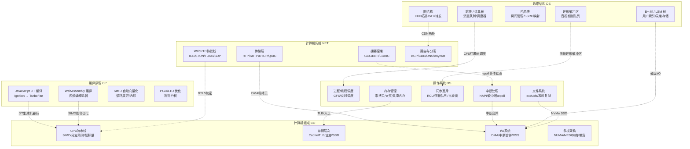
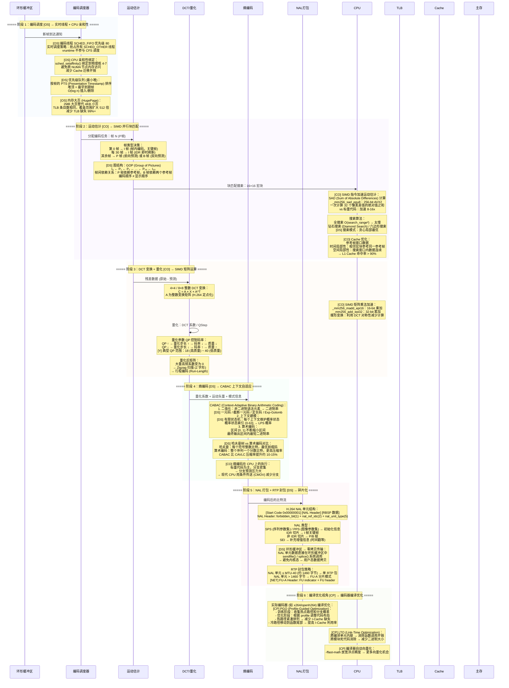
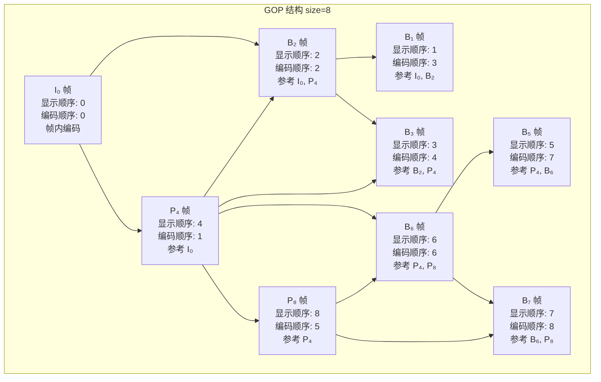
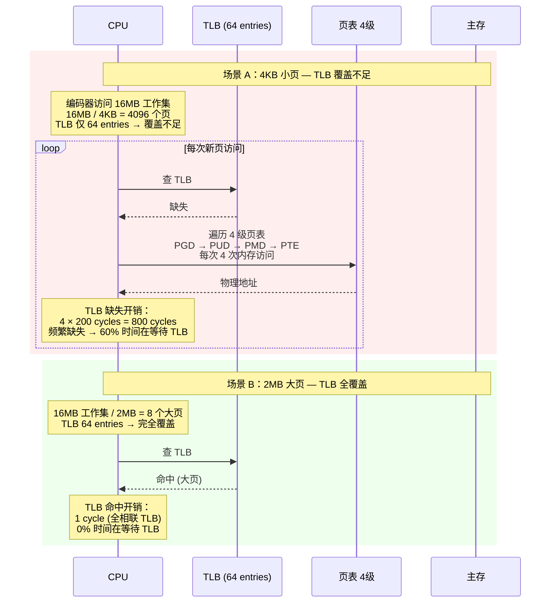
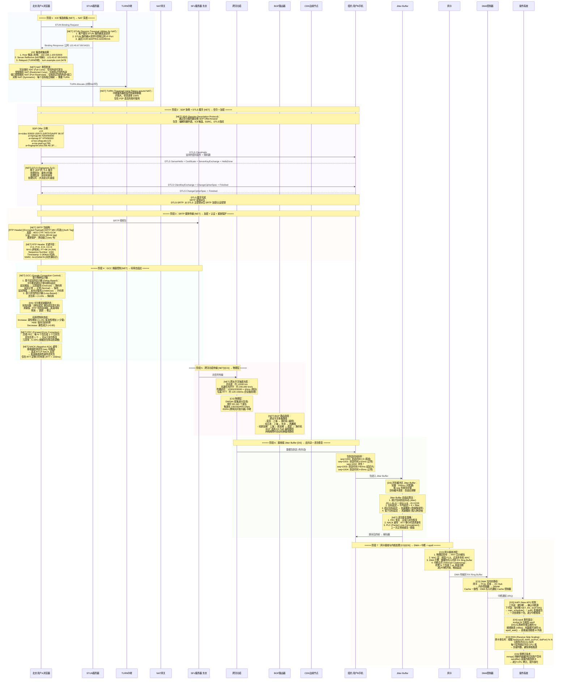
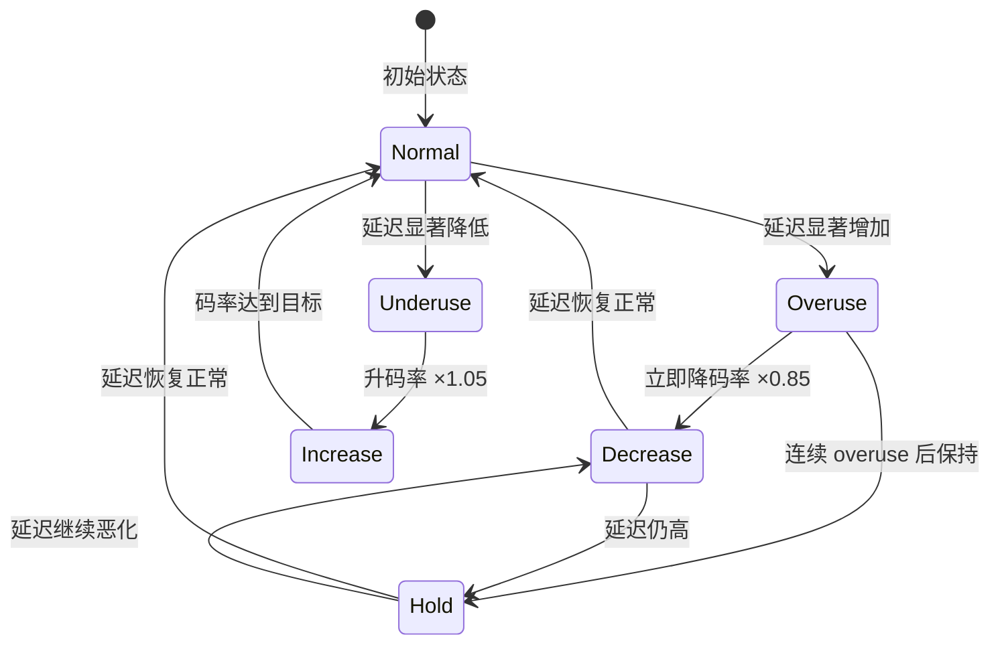
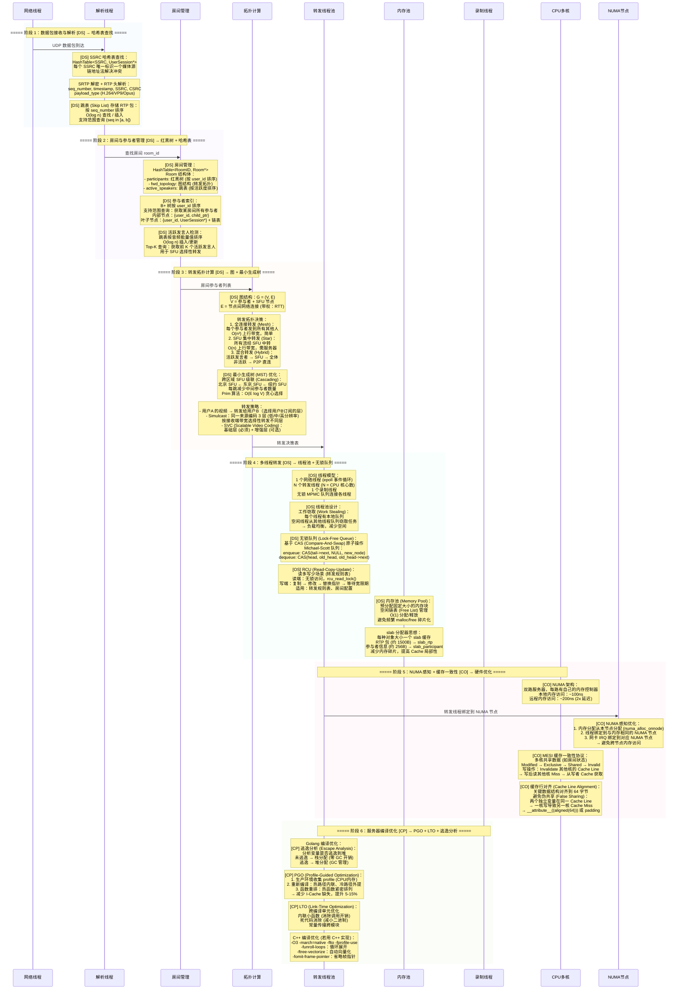
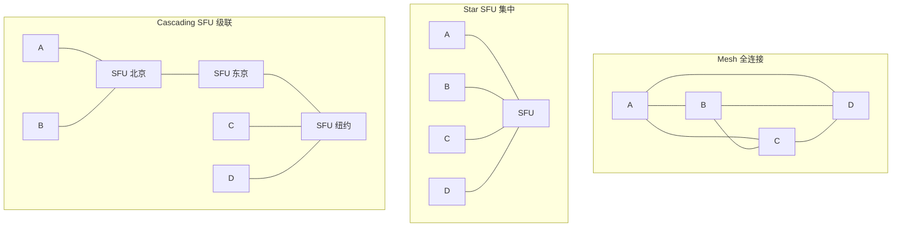
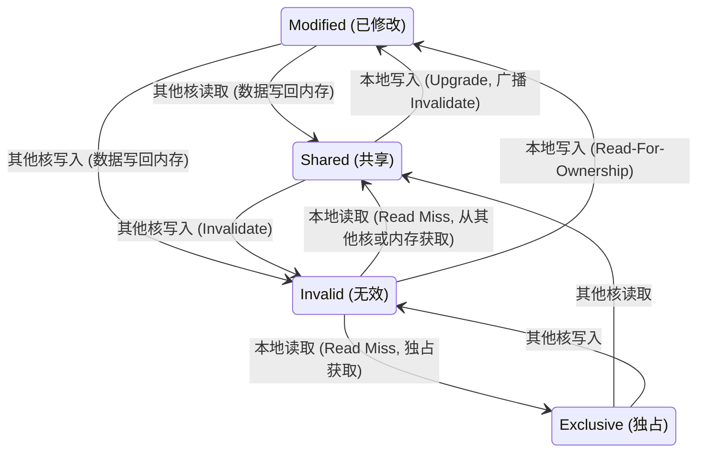
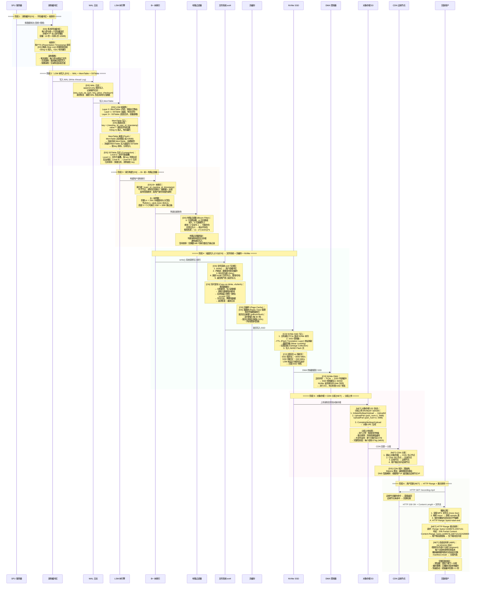

# 五科综合实战 · 跨洋实时视频会议系统

> **目标：** 用一个 #[C|分布式、实时、高并发、跨数据中心] 的复杂场景，串联 #[C|计算机组成原理]、#[G|数据结构]、#[Y|编译原理]、#[R|操作系统]、#[C|计算机网络] 五门核心课程的全部知识点。
> 每一阶段都标注了所属学科、核心数据结构、硬件机制、算法过程与协议细节，体现"五科一体、协同作战"的工程全景。

## 场景描述

**#[C|跨洋实时视频会议系统]（Cross-Ocean Real-Time Video Conference）**

用户A（北京）通过 Web 浏览器发起视频会议，用户B（纽约）通过手机 App 加入。系统需要完成：

- **浏览器端：** WebRTC 初始化 → JavaScript JIT 编译 → WebAssembly 视频编解码器 → 音视频采集
- **编码端：** H.264/VP9 硬件加速编码 → SIMD 指令集优化 → 环形缓冲区管理音视频帧
- **网络传输：** 跨太平洋海底光缆（约 150ms RTT）→ WebRTC 协议栈 → ICE/STUN/TURN NAT 穿透 → DTLS-SRTP 加密传输 → GCC 拥塞控制 → FEC 前向纠错
- **服务器端：** SFU（Selective Forwarding Unit）流处理 → 多线程架构 → 无锁数据结构 → 内存池管理 → 分布式集群调度
- **存储端：** 会议录制 → B+ 树索引 → LSM 树写入 → 对象存储/CDN 分发 → 断点续传

整个系统跨越 **五大学科、四大洲数据中心、三大网络运营商、两层协议栈、一个统一目标**——低延迟、高质量的实时通信。

──[ 五科关系总览 ]──────────────────────────────────────────────────────[ 综合实战 ]



:::important
以下五场景覆盖 #[R|考研 408] 全部核心交叉考点。每个场景中标注了 `[CP]` 编译原理、`[DS]` 数据结构、`[CO]` 计算机组成、`[OS]` 操作系统、`[NET]` 计算机网络，便于定位所属学科。建议按照场景顺序阅读——从浏览器端到服务器端再到存储端，形成完整的端到端认知。
:::

***

## 场景一：浏览器端 WebRTC 初始化 → JIT 编译到音视频采集

──[ 1.0 ]──[ 场景概览 ]

本场景追踪用户A在北京打开 Chrome 浏览器、输入会议 URL、点击"加入会议"按钮后，从 JavaScript 代码加载到摄像头采集第一帧视频的完整路径。


| 阶段 | 学科 | 核心知识点 | 关键机制 |
|------|------|-----------|---------|
| JS 源码加载 | #[C|CP] | 词法分析、语法分析、AST | V8 解析器生成抽象语法树 |
| Ignition 解释执行 | #[C|CP] | 字节码解释器 | 寄存器式字节码，快速启动 |
| 热点检测 + JIT | #[C|CP]/[G|CO] | 内联缓存、隐藏类、去优化 | TurboFan 生成优化机器码 |
| WebAssembly 编译 | #[C|CP] | 基线编译器 Liftoff → 优化编译器 | 视频编解码器编译为 WASM |
| 摄像头采集 | #[G|OS] | 系统调用、设备驱动、DMA | V4L2/Media Foundation 框架 |
| 环形缓冲区 | #[G|DS] | 无锁环形队列 | 生产者-消费者模式 |
| JIT 代码执行 | #[G|CO] | 分支预测、SIMD、流水线 | CPU 执行优化后的机器码 |

──[ 1.1 ]──[ 全链路时序图：从 JavaScript 到第一帧视频 ]

```mermaid
sequenceDiagram
    participant USER as 用户A 浏览器
    participant JSENG as V8 JS引擎
    participant IGN as Ignition解释器
    participant TURBO as TurboFan JIT编译器
    participant WASM as WebAssembly引擎
    participant OS as 操作系统
    participant CAM as 摄像头驱动
    participant DMA as DMA控制器
    participant CPU as CPU流水线
    participant CACHE as Cache层次
    participant RBUF as 环形缓冲区

    rect rgba(240, 248, 255, 0.4)
    Note over USER,JSENG: ===== 阶段 1：JS 源码解析 [CP] → 词法分析 + 语法分析 =====
    USER->>JSENG: navigator.mediaDevices.getUserMedia({video: true})
    Note over JSENG: [CP] 词法分析：<br/>Scanner 扫描 UTF-16 字符流<br/>生成 Token 序列：<br/>IDENTIFIER(navigator) → DOT → IDENTIFIER(mediaDevices)<br/>→ DOT → IDENTIFIER(getUserMedia) → LPAREN...
    Note over JSENG: [CP] 语法分析：<br/>Parser 使用递归下降分析<br/>生成 AST (抽象语法树)：<br/>ExpressionStatement<br/>└── CallExpression<br/>    ├── MemberExpression<br/>    │   └── navigator.mediaDevices.getUserMedia<br/>    └── ObjectLiteral<br/>        └── Property: video → true
    Note over JSENG: [CP] 预解析 (PreParser)：<br/>跳过未立即调用的函数体<br/>仅记录作用域信息，延迟编译<br/>减少内存占用和解析时间
    JSENG->>IGN: AST → 字节码
    end

    rect rgba(248, 240, 255, 0.4)
    Note over JSENG,IGN: ===== 阶段 2：Ignition 解释执行 [CP] → 字节码解释器 =====
    IGN->>IGN: 生成 Ignition 字节码
    Note over IGN: [CP] 寄存器式字节码：<br/>LdaGlobal [navigator]<br/>Star r0<br/>LdaNamedProperty r0, [mediaDevices]<br/>Star r1<br/>LdaNamedProperty r1, [getUserMedia]<br/>Star r2<br/>CreateObjectLiteral<br/>CallProperty r2, ...
    Note over IGN: [CP] 解释器执行循环：<br/>while (true) {<br/>  bytecode = *pc++;<br/>  switch (bytecode) {<br/>    case LdaGlobal: ...<br/>    case Star: ...<br/>  }<br/>}
    Note over IGN: 解释执行过程中收集反馈信息：<br/>- 函数调用次数<br/>- 类型信息（参数类型）<br/>- 对象属性访问模式
    end

    rect rgba(255, 248, 240, 0.4)
    Note over IGN,TURBO: ===== 阶段 3：热点检测 + TurboFan JIT [CP] → 优化编译 =====
    Note over IGN: 热点检测阈值：<br/>函数调用 > 1000 次 或 循环迭代 > 1000 次<br/>→ 标记为热点 (Hot)，触发 TurboFan 优化编译
    Note over TURBO: [CP] TurboFan 编译流水线：<br/>1. 字节码 → 图构建 (Graph Builder)<br/>2. 生成 Sea-of-Nodes IR (中间表示)<br/>3. 多轮优化 Pass：<br/>   - 类型推断 (Type Narrowing)<br/>   - 内联展开 (Inlining)<br/>   - 逃逸分析 (Escape Analysis)<br/>   - 负载消除 (Load Elimination)<br/>   - 死代码消除 (Dead Code Elimination)<br/>4. 指令选择 (Instruction Selection)<br/>5. 寄存器分配 (Register Allocation)<br/>6. 生成 x86-64 机器码
    Note over TURBO: [DS] 隐藏类 (Hidden Class / Map)：<br/>V8 为每个对象形状分配隐藏类<br/>{x: 1, y: 2} → Map_A<br/>{x: 1, y: 2, z: 3} → Map_B (新隐藏类)<br/>相同结构的对象共享同一隐藏类<br/>属性访问编译为"基址+偏移量"
    Note over TURBO: [DS] 内联缓存 (Inline Cache)：<br/>属性访问点缓存上次的隐藏类+偏移量<br/>散列表存储：(Map, offset) 对<br/>命中 → 直接偏移量访问<br/>未命中 → 回退到运行时查找
    Note over TURBO: [CP] 去优化 (Deoptimization)：<br/>若运行时类型与优化假设不符<br/>→ 丢弃优化代码，回退到解释执行<br/>→ 重新收集反馈，可能再次优化
    TURBO-->>CPU: 生成优化后的 x86-64 机器码
    end

    rect rgba(240, 255, 248, 0.4)
    Note over TURBO,CPU: ===== 阶段 4：JIT 代码 CPU 执行 [CO] → 流水线 + 分支预测 =====
    CPU->>CPU: IF: 取指 → I-Cache 读取指令
    Note over CPU: [CO] 现代 CPU 超标量流水线：<br/>前端：分支预测 (BTB/2-bit) + 预取<br/>中端：多发射 (4-8 way)，乱序执行<br/>后端：多执行单元 (ALU/FPU/SIMD)
    Note over CPU: [CO] 分支预测对 JIT 代码的影响：<br/>JIT 生成代码中内联缓存检查<br/>→ 高度可预测 (通常命中)<br/>→ 分支预测准确率 > 95%
    CPU->>CPU: ID: 译码，读寄存器
    CPU->>CPU: EX: 执行，ALU 计算
    Note over CPU: [CO] SIMD 指令加速：<br/>若 JIT 生成 AVX2 指令<br/>→ 256-bit 向量一次处理 8 个 32-bit 整数<br/>→ 视频处理中像素运算加速 8x
    CPU->>CPU: MEM: 访存
    CPU->>CACHE: 数据访问经过 Cache 层次
    Note over CACHE: [CO] Cache 局部性：<br/>时间局部性：热点循环反复访问相同数据<br/>空间局部性：数组/对象连续访问<br/>L1 → L2 → L3 → 主存
    CPU->>CPU: WB: 写回寄存器
    end

    rect rgba(255, 240, 245, 0.4)
    Note over CPU,WASM: ===== 阶段 5：WebAssembly 视频编解码器 [CP] → WASM 编译 =====
    Note over WASM: [CP] WebAssembly 编译流水线：<br/>1. 基线编译器 Liftoff：<br/>   快速生成机器码 (每指令一次发射)<br/>   启动延迟最小化<br/>2. 优化编译器 (TurboFan 后端)：<br/>   后台线程异步优化<br/>   生成高质量机器码替换
    Note over WASM: WASM 优势：<br/>- 预编译：二进制格式，无需解析<br/>- 静态类型：无去优化风险<br/>- 线性内存：零开销边界检查<br/>- SIMD 128-bit：直接映射到 SSE/NEON
    Note over WASM: [CO] WASM 中的 SIMD 指令<br/>i8x16.add → 16 路 8-bit 加法<br/>f32x4.mul → 4 路 32-bit 浮点乘法<br/>→ 视频编解码器中像素处理加速
    end

    rect rgba(245, 250, 240, 0.4)
    Note over WASM,CAM: ===== 阶段 6：摄像头采集 [OS] → 系统调用 + 设备驱动 =====
    Note over OS: getUserMedia 底层调用链：<br/>JS API → Blink (渲染引擎)<br/>→ Mojo IPC → Browser Process<br/>→ MediaStreamManager<br/>→ 系统 API (V4L2/Media Foundation)
    OS->>CAM: open("/dev/video0") + ioctl
    Note over CAM: [OS] V4L2 采集流程：<br/>1. ioctl(VIDIOC_REQBUFS)：请求缓冲区<br/>2. mmap()：映射内核缓冲区到用户空间<br/>3. ioctl(VIDIOC_QBUF)：缓冲区入队<br/>4. ioctl(VIDIOC_STREAMON)：开始采集<br/>5. select()/poll() 等待数据就绪<br/>6. ioctl(VIDIOC_DQBUF)：出队获取帧数据
    CAM->>DMA: 摄像头硬件 → DMA 传输
    Note over DMA: [CO] DMA 传输视频帧：<br/>摄像头传感器 → ISP 处理<br/>→ DMA 控制器 → 系统内存<br/>每次传输一帧 (YUV 格式，约 3MB for 1080p)
    DMA-->>OS: DMA 完成中断
    OS->>RBUF: 视频帧写入环形缓冲区
    Note over RBUF: [DS] 环形缓冲区 (Ring Buffer)：<br/>固定大小数组，首尾相连<br/>write_ptr：生产者写入位置<br/>read_ptr：消费者读取位置<br/>空判断：write_ptr == read_ptr<br/>满判断：(write_ptr + 1) % N == read_ptr
    end

    rect rgba(255, 250, 240, 0.4)
    Note over RBUF,USER: ===== 阶段 7：第一帧视频就绪 =====
    Note over RBUF: 环形缓冲区状态：<br/>Frame 0: YUV420 1920×1080<br/>Frame 1: YUV420 1920×1080<br/>...等待编码器消费
    Note over USER: 第一帧视频采集完成<br/>进入编码阶段 (场景二)
    end
```

──[ 1.2 ]──[ V8 引擎隐藏类与内联缓存详解 ]

```mermaid
graph TB
    subgraph "隐藏类 Hidden Class"
        HC1[""对象 o1 = {x: 1, y: 2}<br/>Map_M0: {x@offset12, y@offset16}""]
        HC2[""对象 o2 = {x: 3, y: 4}<br/>共享 Map_M0""]
        HC3[""对象 o3 = {x: 5, y: 6, z: 7}<br/>Map_M1: {x@offset12, y@offset16, z@offset20}""]
        HC4[""o1.z = 8 动态添加属性<br/>Map_M0 → Map_M1 过渡<br/>原 Map_M0 标记为 deprecated""]
        HC1 -->|"共享"| HC2
        HC1 -->|"动态添加属性 → 过渡"| HC3
    end

    subgraph "内联缓存 Inline Cache"
        IC1[""访问点: obj.x<br/>IC 状态: MONOMORPHIC<br/>缓存: Map_M0, offset=12""]
        IC2[""后续访问: 查 IC<br/>当前 Map == Map_M0?<br/>是 → 直接 offset=12 读取""]
        IC3[""若 Map != Map_M0<br/>→ POLYMORPHIC (多态)<br/>→ MEGAMORPHIC (超多态)<br/>→ 回退运行时查找""]
    end
```

| 机制 | 说明 | 学科关联 |
|------|------|----------|
| 隐藏类 (Hidden Class) | 每个对象形状对应一个 Map，相同属性顺序共享 | #[C|DS] 散列表 + 链表 |
| 内联缓存 (IC) | 缓存属性访问的偏移量，O(1) 快速访问 | #[C|DS] 散列表键值对 |
| 单态 (Monomorphic) | 仅一种类型，IC 直接检查+偏移 | #[G|CP] 最高效 |
| 多态 (Polymorphic) | 2-4 种类型，IC 扩展为散列表查找 | #[Y|CP] 次高效 |
| 超多态 (Megamorphic) | >4 种类型，放弃 IC，回退全局查找 | #[R|CP] 最低效 |
| 去优化 | 假设失效，丢弃优化代码，回退解释执行 | #[C|CP] 安全性保证 |

──[ 1.3 ]──[ 环形缓冲区无锁实现详解 ]

```mermaid
flowchart TD
    A[""生产者: 摄像头采集线程<br/>写入视频帧""] --> B["原子加载 write_ptr"]
    B --> C{"(write_ptr + 1) % N<br/>== read_ptr ?"}
    C -->|"是 (缓冲区满)"| D[""自旋等待<br/>或丢弃旧帧 (覆盖最老帧)""]
    C -->|"否 (有空位)"| E[""写入帧数据到<br/>buf[write_ptr"]"]
    E --> F[""内存屏障: 确保写入完成""]
    F --> G[""原子存储 write_ptr =<br/>(write_ptr + 1) % N""]
    G --> H[""消费者: 编码器线程<br/>读取视频帧""]
    H --> I["原子加载 read_ptr"]
    I --> J{"read_ptr == write_ptr ?"}
    J -->|"是 (缓冲区空)"| K[""自旋等待<br/>或 sleep/yield""]
    J -->|"否 (有数据)"| L["读取 buf[read_ptr]"]
    L --> M[""内存屏障: 确保读取完成""]
    M --> N[""原子存储 read_ptr =<br/>(read_ptr + 1) % N""]
    N --> O["帧送入编码器"]
```

| 对比维度 | 无锁环形缓冲区 | 加锁队列 | 说明 |
|----------|---------------|---------|------|
| 并发安全 | 原子操作 + 内存屏障 | 互斥锁/自旋锁 | #[G|无锁] 无需上下文切换 |
| 延迟 | 纳秒级 | 微秒级 (锁竞争) | 实时系统首选无锁 |
| CPU 缓存 | 友好 (连续内存) | 友好 | 空间局部性好 |
| 适用场景 | 单生产者单消费者 (SPSC) | 多生产者多消费者 (MPMC) | SPSC 无需 CAS |
| 内存序 | Acquire-Release 语义 | 加锁自动保证 | 手动控制内存序 |

:::warning
**隐藏类退化陷阱：** 若以不同顺序初始化对象属性，会产生不同的隐藏类，导致内联缓存失效。例如 `{x: 1, y: 2}` 和 `{y: 2, x: 1}` 拥有不同的隐藏类。#[R|动态添加/删除属性] 也会破坏隐藏类，触发去优化。建议在构造函数中一次性初始化所有属性。
:::

:::note
**JIT 编译与 CPU 微架构的协同：** TurboFan 生成的机器码针对现代 CPU 微架构优化——使用条件传送指令 (CMOV) 避免分支预测失败；利用 SIMD 指令加速向量运算；通过指令调度填充流水线延迟槽。JIT 编译器本质上是一个"运行时感知的优化编译器"，它利用运行时收集的类型反馈信息，生成比静态编译更精准的优化代码。
:::

***

## 场景二：音视频编码与数据流处理

──[ 2.0 ]──[ 场景概览 ]

本场景聚焦于从环形缓冲区取出原始视频帧（YUV420 1920×1080）后，经过 H.264 硬件编码器压缩、音频 Opus 编码、以及帧数据流管理的完整过程。


| 阶段 | 学科 | 核心知识点 | 关键机制 |
|------|------|-----------|---------|
| 帧类型决策 | #[G|DS] | 优先级队列 (堆) | 按编码复杂度排序 |
| 运动估计 | #[G|CO] | SIMD 指令 (SSE/AVX) | 并行块匹配搜索 |
| DCT 变换 | #[G|CO] | 矩阵乘法加速 | SIMD 向量化 |
| 量化/熵编码 | #[G|DS] | 哈夫曼树/算术编码 | CABAC 上下文自适应 |
| 缓冲区管理 | #[G|OS]/[G|DS] | 无锁队列/零拷贝 | sendfile 系统调用 |
| 编码调度 | #[G|OS] | 实时线程 SCHED_FIFO | CPU 亲和性绑定 |
| 内存优化 | #[G|CO] | 大页表 (HugePage) | 减少 TLB 缺失 |
| 代码优化 | #[C|CP] | 循环展开/SIMD 向量化 | PGO 引导优化 |

──[ 2.1 ]──[ 编码全链路时序图 ]



──[ 2.2 ]──[ GOP 帧间依赖关系图 ]



| 帧类型 | 全称 | 编码方式 | 压缩率 | 延迟 | 用途 |
|--------|------|----------|--------|------|------|
| I 帧 | Intra-coded | 帧内预测 | 低 (约 1/10) | 低 | 关键帧、随机访问点 |
| P 帧 | Predictive | 前向预测 | 中 (约 1/20) | 中 | 依赖前一帧 |
| B 帧 | Bi-predictive | 双向预测 | 高 (约 1/50) | 高 | 依赖前/后帧，需重排序 |
| IDR 帧 | Instantaneous Decoder Refresh | 同 I 帧 + 清空参考缓冲 | 低 | 低 | 强制刷新、切换频道 |

──[ 2.3 ]──[ TLB 与大页优化详解 ]



| 页大小 | TLB 覆盖 | 单次缺失开销 | 内存碎片 | 适用场景 |
|--------|---------|-------------|---------|---------|
| 4KB | 64 × 4KB = 256KB | ~800 cycles | 低 | 通用场景 |
| 2MB | 64 × 2MB = 128MB | ~800 cycles | 中 | 大型应用、数据库 |
| 1GB | 64 × 1GB = 64GB | ~800 cycles | 高 | 超大内存应用 |

:::important
**编码器性能瓶颈：** 视频编码是计算密集型 + 内存密集型任务。运动估计消耗 60-80% 编码时间，SIMD 指令加速是关键。同时，大页 (HugePage) 和 CPU 亲和性 (CPU Affinity) 是操作系统层面的优化手段——大页减少 TLB 缺失，CPU 亲和性减少 Cache 迁移和 NUMA 远程访问，两者结合可将编码吞吐量提升 15-30%。
:::

***

## 场景三：跨洋网络传输

──[ 3.0 ]──[ 场景概览 ]

本场景追踪编码后的视频 RTP 数据包从北京用户A的浏览器出发，经过 WebRTC 协议栈、NAT 穿透、跨太平洋海底光缆（约 150ms RTT）、到达纽约用户B的手机 App 的完整网络传输路径。


| 阶段 | 学科 | 核心知识点 | 关键机制 |
|------|------|-----------|---------|
| ICE/STUN/TURN | #[C|NET] | NAT 穿透 | 地址收集、连通性检查 |
| DTLS 握手 | #[C|NET] | 安全传输层 | 证书交换、密钥协商 |
| SRTP 传输 | #[C|NET] | 安全实时传输 | 加密 + 认证 + 重放保护 |
| GCC 拥塞控制 | #[C|NET] | 基于延迟的拥塞算法 | 卡尔曼滤波估计带宽 |
| FEC/NACK | #[C|NET] | 前向纠错 + 选择性重传 | 异或冗余、RTT 自适应 |
| Jitter Buffer | #[G|DS] | 环形缓冲区 | 去抖动、丢包补偿 |
| BGP 路由 | #[C|NET] | 边界网关协议 | AS 路径、策略路由 |
| DMA/RSS | #[G|CO] | 网卡多队列 | 中断合并、NUMA 亲和 |
| epoll | #[G|OS] | 事件驱动 I/O | 红黑树 + 就绪链表 |

──[ 3.1 ]──[ 跨洋传输全链路时序图 ]



──[ 3.2 ]──[ NAT 类型与穿透策略对比 ]

| NAT 类型 | 映射规则 | 过滤规则 | 穿透难度 | 穿透方案 |
|----------|----------|----------|----------|----------|
| 完全锥形 (Full Cone) | 内网 IP:Port → 固定公网 IP:Port | 无过滤 | 最简单 | STUN，任何外部都可发包 |
| 受限锥形 (Restricted Cone) | 同上 | 仅接受曾收到过包的外部 IP | 简单 | STUN，先发包到对方 |
| 端口受限锥形 (Port Restricted) | 同上 | 仅接受曾收到过包的 IP:Port | 中等 | STUN，双方互发包 |
| 对称 NAT (Symmetric) | 内网 IP:Port → 每个目标独立映射 | 同端口受限 | 困难 | #[R|必须 TURN 中继] |

──[ 3.3 ]──[ GCC 拥塞控制状态机 ]



──[ 3.4 ]──[ 跨洋网络延迟预算分析 ]

| 延迟来源 | 典型值 | 说明 |
|----------|--------|------|
| 摄像头采集 | 10-33ms | 30fps: 33ms, 60fps: 16ms |
| 视频编码 | 5-20ms | 硬件编码: 5ms, 软件编码: 20ms |
| 本地网络 + NAT | 1-5ms | 局域网无线延迟 |
| 城域网传输 | 5-20ms | 北京到上海约 20ms |
| 跨洋光缆传播 | 60-80ms | 单向约 12000km |
| 路由器/交换机排队 | 5-15ms | 每跳 0.5-2ms |
| Jitter Buffer | 20-50ms | 自适应缓冲 |
| 视频解码 | 5-15ms | 硬件解码: 5ms |
| 渲染显示 | 3-16ms | 同步到屏幕刷新率 |
| **总计 (端到端)** | **120-250ms** | 跨洋场景典型值 |

:::warning
**跨洋通信的物理极限：** 光在光纤中传播速度约为 200,000 km/s（折射率约 1.5）。北京到纽约约 11000-12000km，单向传播延迟最低约 55-60ms。这是光速决定的物理极限，任何技术都无法突破。#[R|RTT 至少 110-120ms]，加上设备处理延迟，实际 RTT 约 150-200ms。这就是为什么跨洋实时通信如此困难——物理距离决定了延迟下限。
:::

:::note
**WebRTC 协议栈设计的精妙之处：** WebRTC 将 ICE（NAT 穿透）、DTLS（安全传输）、SRTP（媒体加密）、SCTP（数据通道）、GCC（拥塞控制）无缝集成。ICE 使用 STUN/TURN 协议解决了 NAT 穿透问题；DTLS-SRTP 在 UDP 之上提供了端到端加密；GCC 通过结合延迟和丢包两种信号，实现了比 TCP 更适合实时通信的拥塞控制。整个协议栈体现了 #[C|计算机网络] 各层协议的协同设计思想。
:::

***

## 场景四：服务器端流处理后端

──[ 4.0 ]──[ 场景概览 ]

本场景聚焦于 SFU（Selective Forwarding Unit）服务器的内部架构——如何接收来自北京用户A的媒体流、管理房间参与者、选择转发策略、并将流转发给纽约用户B。服务器采用 Golang/C++ 实现，运行在 Linux 上。


| 阶段 | 学科 | 核心知识点 | 关键机制 |
|------|------|-----------|---------|
| 数据包解析 | #[G|DS] | 哈希表 SSRC 映射 | O(1) 查找 |
| 房间管理 | #[G|DS] | 红黑树/哈希表 | 按房间 ID 索引 |
| 参与者索引 | #[G|DS] | B+ 树/跳表 | 按用户 ID 排序 |
| 转发拓扑 | #[G|DS] | 图结构 → 最小生成树 | Prim/Kruskal 算法 |
| 线程模型 | #[G|OS] | 线程池 + 无锁队列 | 工作窃取调度 |
| 内存管理 | #[G|OS] | 内存池 + RCU 锁 | 对象复用、读多写少 |
| 并发控制 | #[G|OS] | 无锁 CAS + 自旋锁 | 低延迟要求 |
| 服务器编译 | #[C|CP] | PGO + LTO + 逃逸分析 | 减少堆分配 |
| NUMA 优化 | #[G|CO] | NUMA 感知内存分配 | 本节点内存优先 |
| 缓存一致性 | #[G|CO] | MESI 协议 | 多核共享数据 |

──[ 4.1 ]──[ SFU 服务器全链路时序图 ]



──[ 4.2 ]──[ SFU 转发拓扑对比 ]



| 拓扑 | 上行带宽 (每个参与者) | 服务器带宽 | 延迟 | 适用场景 |
|------|---------------------|-----------|------|---------|
| Mesh | (n-1) × 码率 | 0 | 最低 (P2P) | 小房间 (≤4人) |
| Star SFU | 1 × 码率 | n × 码率 | 中 (经服务器) | 中房间 (4-50人) |
| Cascading SFU | 1 × 码率 | 分布到多 SFU | 中高 (多跳) | 跨区域大房间 |
| MCU (混流) | 1 × 码率 | 1 × 码率 (混流后) | 高 (编解码) | 超大房间 (50+人) |

──[ 4.3 ]──[ MESI 缓存一致性协议状态转换 ]



:::warning
**伪共享 (False Sharing)：** 两个线程分别修改同一 Cache Line 中的不同变量，虽然逻辑上互不干扰，但 MESI 协议会导致 Cache Line 在两个核之间反复跳跃（乒乓效应）。#[R|性能下降可达 10-100x]。解决方案：在关键数据结构中插入 padding 或使用 `__attribute__((aligned(64)))` 确保变量独占一个 Cache Line。
:::

:::important
**SFU vs MCU：** SFU（Selective Forwarding Unit）不进行解码/编码，仅选择性转发原始编码流，延迟低但总带宽高。MCU（Multipoint Control Unit）将所有流解码→混流→重新编码，节省下行带宽但增加延迟和服务器成本。现代 WebRTC 系统普遍采用 SFU 架构，结合 Simulcast/SVC 实现自适应码率，兼顾延迟和带宽效率。
:::

***

## 场景五：数据持久化与录制回放

──[ 5.0 ]──[ 场景概览 ]

本场景追踪会议录制功能从服务器端接收媒体流、写入磁盘、建立索引、到用户回放时从 CDN 拉取、断点续传的完整路径。


| 阶段 | 学科 | 核心知识点 | 关键机制 |
|------|------|-----------|---------|
| 录制缓冲 | #[G|DS] | 环形缓冲区 | 生产者-消费者模式 |
| 写入日志 | #[G|DS] | LSM 树 (Log-Structured Merge) | 顺序写 + 后台合并 |
| 用户索引 | #[G|DS] | B+ 树 | 按 user_id + timestamp 排序 |
| 时间线索引 | #[G|DS] | 跳表 | 按时间排序，支持范围查询 |
| 去重 | #[G|DS] | 布隆过滤器 | 快速判断是否存在 |
| 磁盘写入 | #[G|CO] | NVMe SSD / DMA | 顺序写 vs 随机写 |
| 文件系统 | #[G|OS] | ext4/xfs 写时复制 | 日志文件系统 |
| 页缓存 | #[G|OS] | 基数树 + 预读 | 写入缓冲 + 读取加速 |
| CDN 分发 | #[C|NET] | HTTP Range / 分段 | 断点续传 |
| 对象存储 | #[C|NET] | S3 协议 | 分段上传、ETag 校验 |

──[ 5.1 ]──[ 录制与回放全链路时序图 ]



──[ 5.2 ]──[ LSM 树 vs B+ 树对比 ]

| 对比维度 | LSM 树 | B+ 树 |
|----------|--------|-------|
| 写入性能 | #[G|极快] (顺序写) | #[Y|中等] (随机写) |
| 读取性能 | #[Y|中等] (可能多层查找) | #[G|快] (O(log n)) |
| 空间放大 | #[Y|中等] (合并前旧版本) | #[R|低] |
| 写放大 | #[R|高] (反复合并) | #[G|低] |
| 适用场景 | 写密集型 (日志、时序数据) | 读密集型 (数据库索引) |
| 磁盘 I/O | 批量顺序写，对 SSD 友好 | 随机写，对 HDD 不友好 |
| 代表系统 | LevelDB, RocksDB, Cassandra | MySQL InnoDB, PostgreSQL |

──[ 5.3 ]──[ 存储层次金字塔与录制场景 ]

```mermaid
graph TD
    subgraph "存储层次金字塔 录制场景"
        L0[""寄存器 (0 cycles)<br/>编码器当前处理的宏块""]
        L1[""L1 Cache (2-4 cycles, 32KB)<br/>当前帧的参考块 (8×8 像素)""]
        L2[""L2 Cache (10-20 cycles, 256KB)<br/>几帧的视频数据 + 运动矢量""]
        L3[""L3 Cache (30-50 cycles, 2-32MB)<br/>GOP 内的参考帧""]
        L4[""主存 DDR5 (100-300 cycles, GB级)<br/>录制缓冲区 (10s × 码率)""]
        L5[""NVMe SSD (10-100μs, TB级)<br/>SSTable 文件 + B+ 树索引""]
        L6[""HDD (1-10ms, TB级)<br/>冷数据归档 (数月前的录制)""]
        L7[""对象存储 + CDN (10-100ms, PB级)<br/>用户可访问的录制文件""]
    end

    L0 --> L1 --> L2 --> L3 --> L4 --> L5 --> L6 --> L7
```

:::warning
**LSM 树的写放大问题：** 数据从 MemTable 写入 Level 0，然后层层合并到 Level N。同一份数据可能被写入 10-30 次（取决于 Level 层数）。#[R|写放大系数 = 总写入量 / 原始数据量]，典型的 RocksDB 写放大在 10-30 之间。通过调整合并策略（Tiered vs Leveled）和压缩算法（Snappy/LZ4/ZSTD），可以在写入性能和空间占用之间取得平衡。
:::

:::note
**录制场景的数据结构选择：** 录制是典型的"写多读少"场景——会议期间持续写入，会议结束后偶尔读取回放。LSM 树天然适合这种场景：顺序写入极快，读取虽然有额外开销但可接受。B+ 树则用于用户索引——需要频繁按用户 ID 和时间范围查询，O(log n) 的读取性能是关键。两者结合，各取所长。
:::

──[ 5.4 ]──[ 布隆过滤器详解 ]

```mermaid
flowchart TD
    A["元素 x = '录制块 #12345'"] --> B[""Hash1(x) = 3<br/>Hash2(x) = 7<br/>Hash3(x) = 12""]
    B --> C[""位数组: [0,0,1,0,0,0,0,1,0,0,0,0,1,0,..."]<br/>索引 3、7、12 置为 1"]
    C --> D{"查询元素 y<br/>Hash1(y)=3, Hash2(y)=7, Hash3(y)=12"}
    D -->|"全为 1"| E[""可能存在 (假阳性)<br/>进一步查 B+ 树确认""]
    D -->|"任意为 0"| F[""绝对不存在<br/>直接返回，无需磁盘 I/O""]
```

| 参数 | 含义 | 典型值 |
|------|------|--------|
| m | 位数组长度 | 10 MB (80M 位) |
| k | 哈希函数个数 | 3-7 |
| n | 预期元素数量 | 1000 万 |
| p | 假阳性率 | ~1% (k=7, m/n=10) |

***

## 总结：五科知识交叉点与考研 408 命题方向

──[ 总结 ]──────────────────────────────────────────────────────────[ 五科综合实战 ]

### 五科知识交叉点汇总表

| 核心场景 | 编译原理 (CP) | 数据结构 (DS) | 操作系统 (OS) | 计算机网络 (NET) | 计算机组成 (CO) |
|----------|:-----------:|:-----------:|:-----------:|:------------:|:------------:|
| 浏览器端采集 | JIT 编译、隐藏类、内联缓存 | 环形缓冲区、散列表 | 进程隔离、共享内存、设备驱动 | WebRTC API | Cache 层次、分支预测、SIMD |
| 视频编码 | WASM 编译、SIMD 向量化、PGO | 优先级队列、GOP 图、哈夫曼树 | 实时调度、CPU 亲和性、大页 | RTP 封包 | SIMD 指令、TLB、流水线 |
| 跨洋传输 | - | 跳表、Jitter Buffer、滑动窗口 | epoll、NAPI、零拷贝、软中断 | ICE/STUN/TURN、DTLS-SRTP、GCC、FEC、BGP | DMA、RSS、中断合并、MESI |
| 服务器后端 | 逃逸分析、LTO | 红黑树、哈希表、图、最小生成树 | 线程池、无锁队列、RCU、内存池 | SFU 协议 | NUMA、Cache 一致性、缓存行对齐 |
| 录制存储 | - | LSM 树、B+ 树、布隆过滤器、跳表 | 文件系统、页缓存、写时复制 | CDN、HTTP Range、S3 | NVMe SSD、DMA、存储层次 |

### 考研 408 综合命题方向分析

```mermaid
graph TB
    subgraph "命题方向一：端到端延迟分析"
        P1[""考察点：从用户操作到画面显示的完整延迟链<br/>涉及：OS 中断延迟 + NET 传输延迟 + CO Cache 缺失<br/>→ 综合分析题，跨越三个学科""]
    end

    subgraph "命题方向二：数据结构选择与硬件适配"
        P2[""考察点：为何 B+ 树节点大小 = 磁盘块大小？<br/>为何 LSM 树适合 SSD？<br/>涉及：DS 树结构 + CO 存储层次<br/>→ 数据结构与硬件特性联合考察""]
    end

    subgraph "命题方向三：编译优化与 CPU 微架构"
        P3[""考察点：编译器如何生成 SIMD 指令？<br/>循环展开对 Cache 的影响？<br/>涉及：CP 代码生成 + CO 流水线<br/>→ 软硬件协同设计""]
    end

    subgraph "命题方向四：网络协议栈的 OS 支持"
        P4[""考察点：epoll 如何实现高效 I/O 多路复用？<br/>零拷贝技术如何减少 CPU 开销？<br/>涉及：NET 协议栈 + OS 内核机制<br/>→ 协议实现与系统调用""]
    end

    subgraph "命题方向五：分布式系统一致性"
        P5[""考察点：多 SFU 节点间状态同步<br/>CAP 理论在实时系统中的权衡<br/>涉及：DS 分布式算法 + NET 可靠传输<br/>→ 分布式系统设计""]
    end
```

| 命题方向 | 涉及学科 | 典型题型 | 难度 |
|----------|----------|----------|------|
| 端到端延迟分析 | CO + OS + NET | 综合计算题 | #[R|高] |
| 数据结构与硬件适配 | DS + CO | 简答/分析题 | #[Y|中] |
| 编译优化与微架构 | CP + CO | 分析题 | #[R|高] |
| 网络协议栈的 OS 支持 | NET + OS | 简答/分析题 | #[Y|中] |
| 分布式系统一致性 | DS + NET | 综合设计题 | #[R|高] |

### 学习方法建议

┌─ 五科学习路径建议 ─────────────────────────────────────────────────┐
│                                                                          │
│  #[C|第一阶段：单科精进]（每科 2-3 个月）                                    │
│    1. 数据结构：先掌握基础数据结构（线性表、树、图、散列表）                    │
│       再深入高级结构（B+ 树、红黑树、跳表、LSM 树）                           │
│    2. 计算机组成：从数字逻辑 → CPU 数据通路 → 存储层次 → I/O 系统              │
│       理解"指令如何执行、数据如何流动"                                        │
│    3. 操作系统：进程管理 → 内存管理 → 文件系统 → I/O 管理                      │
│       理解"资源如何调度、隔离与保护"                                          │
│    4. 计算机网络：从物理层到应用层，逐层递进                                   │
│       理解"数据如何跨网络可靠传输"                                            │
│    5. 编译原理：词法 → 语法 → 语义 → 优化 → 代码生成                           │
│       理解"高级语言如何翻译为机器指令"                                        │
│                                                                          │
│  #[G|第二阶段：双科交叉]（每组合 1 个月）                                      │
│    - DS + CO：数据结构选择的硬件依据（Cache 局部性、磁盘特性）                   │
│    - OS + CO：虚拟内存、中断处理、DMA、上下文切换                             │
│    - NET + OS：Socket 编程、epoll、协议栈实现                                │
│    - CP + CO：编译器后端、指令选择、寄存器分配                                 │
│    - DS + OS：内核数据结构（红黑树、基数树、链表）                              │
│                                                                          │
│  #[Y|第三阶段：五科融合]（1-2 个月）                                           │
│    - 选择一个真实系统（如本文的视频会议系统）                                   │
│    - 追踪端到端数据流，标注每个阶段涉及的知识点                                  │
│    - 回答：每个设计决策背后的学科依据是什么？                                    │
│    - 质变：从"会做题"到"会设计系统"                                           │
│                                                                          │
│  #[R|第四阶段：真题实战]                                                      │
│    - 408 历年真题，重点关注跨学科综合题                                        │
│    - 分析命题人如何将多个知识点编织在同一场景中                                  │
│    - 模拟考试环境，训练时间分配和答题策略                                      │
│                                                                          │
└──────────────────────────────────────────────────────────────────────────┘

:::important
#[C|五科融合的核心思想]：计算机科学不是五门孤立的课程，而是一个有机整体。编译原理负责"翻译"——将高级语言转化为机器指令；数据结构负责"组织"——高效存储和访问数据；操作系统负责"管理"——调度资源、隔离进程；计算机网络负责"连接"——可靠传输数据；计算机组成负责"执行"——在硬件层面完成计算。五者如同 #[G|翻译官]、#[Y|图书管理员]、#[R|管家]、#[C|邮差]、#[Y|工人] 的关系，缺一不可。只有理解它们之间的协同关系，才能真正掌握计算机系统的全貌。
:::

──[ 全文完 ]──────────────────────────────────────────────────────────[ 五科综合实战 ]

***

*本文涵盖了编译原理、数据结构、操作系统、计算机网络、计算机组成原理五门核心课程在跨洋实时视频会议系统中的所有关键知识点。建议配合各科教材深入学习每个知识点，再回到本文理解知识点之间的关联。*