# 计算机网络五层核心协议全梳理 + 详细时序图
以下严格覆盖考研范围内所有**重要协议**，按五层模型分类汇总，每个核心协议均配备详细Mermaid时序图，标注报文字段、状态流转与核心机制，完全贴合谢希仁教材考点。

---

## 一、全协议汇总总表（完整版）
| 层级 | 协议全称 | 简称 | 核心功能 | 关键标识/端口 | 考研核心考点 |
|------|----------|------|----------|--------------|--------------|
| **应用层** | 超文本传输协议 | HTTP | Web网页传输 | TCP 80 | 版本区别、长连接、无状态、请求方法 |
| | 安全超文本传输协议 | HTTPS | 加密Web传输 | TCP 443 | SSL/TLS握手、加密机制、CA证书 |
| | 域名系统 | DNS | 域名↔IP解析 | UDP 53（主）/TCP 53 | 递归/迭代查询、缓存、域名结构 |
| | 文件传输协议 | FTP | 文件上传下载 | TCP 20/21 | 主动/被动模式、控制/数据双连接 |
| | 简单文件传输协议 | TFTP | 简单小文件传输 | UDP 69 | 无认证、UDP承载、适合嵌入式 |
| | 简单邮件传输协议 | SMTP | 邮件发送 | TCP 25 | 推模式、邮件服务器间转发 |
| | 邮局协议第3版 | POP3 | 邮件接收下载 | TCP 110 | 拉模式、下载后服务器删除 |
| | 互联网邮件访问协议 | IMAP | 邮件在线管理 | TCP 143 | 服务器保留副本、文件夹管理 |
| | 动态主机配置协议 | DHCP | 自动分配IP等参数 | UDP 67/68 | 四阶段、广播、租期、中继代理 |
| | 远程终端协议 | Telnet | 明文远程登录 | TCP 23 | NVT格式、明文不安全 |
| | 安全外壳协议 | SSH | 加密远程登录 | TCP 22 | 加密传输、端口转发、替代Telnet |
| | 简单网络管理协议 | SNMP | 网络设备管理 | UDP 161/162 | 管理站/代理模型、Get/Set/Trap |
| **传输层** | 传输控制协议 | TCP | 可靠面向连接传输 | 协议号6 | 三次握手、四次挥手、可靠传输、流量/拥塞控制 |
| | 用户数据报协议 | UDP | 无连接不可靠传输 | 协议号17 | 首部8字节、低时延、面向报文 |
| **网络层** | 网际协议第4版 | IPv4 | 主机寻址与分组转发 | 协议号标识上层 | 首部格式、子网划分、CIDR、分片 |
| | 地址解析协议 | ARP | IP→MAC地址转换 | 以太网类型0x0806 | 广播请求单播应答、ARP欺骗、代理ARP |
| | 反向地址解析协议 | RARP | MAC→IP地址转换 | 以太网类型0x8035 | 无盘主机、已被DHCP取代 |
| | 网际控制报文协议 | ICMP | 差错报告与网络探测 | IP封装，协议号1 | ping、tracert、差错报文类型 |
| | 网际组管理协议 | IGMP | 组播成员管理 | IP封装，协议号2 | 组播加入/退出、查询器 |
| | 路由信息协议 | RIP | 内部网关路由协议 | UDP 520 | 距离向量、15跳上限、坏消息传得慢 |
| | 开放最短路径优先 | OSPF | 内部网关路由协议 | IP封装，协议号89 | 链路状态、洪泛法、区域划分 |
| | 边界网关协议 | BGP | 外部网关路由协议 | TCP 179 | 路径向量、自治系统间、可达性 |
| | 网络地址转换 | NAT/NAPT | 私网↔公网地址转换 | 路由器实现 | 地址复用、解决IP短缺、端口转换 |
| **数据链路层** | 以太网协议 | IEEE 802.3 | 局域网帧传输 | MAC地址 | 帧格式、CSMA/CD、最小帧长 |
| | 点对点协议 | PPP | 广域网点对点链路 | 标志字段0x7E | 三阶段、字节填充、差错检测 |
| | 高级数据链路控制 | HDLC | 面向比特广域网协议 | 标志字段0x7E | 三种站、三种操作模式 |
| | 生成树协议 | STP | 防止二层环路 | 网桥协议数据单元BPDU | 根桥选举、端口角色、环路阻断 |
| | 虚拟局域网 | VLAN | 二层广播域隔离 | 802.1Q标签 | 广播域隔离、Trunk链路 |
| **物理层** | 以太网物理标准、RS-232、编码规范、信道复用标准 | - | 比特流硬件传输 | 带宽Hz、波特率Bd | 奈奎斯特、香农定理、编码方式、复用技术 |

---

## 二、分层详细时序图（每个协议独立绘制）
### （一）应用层协议时序图
#### 1. HTTP/1.1 完整请求-响应（含长连接）
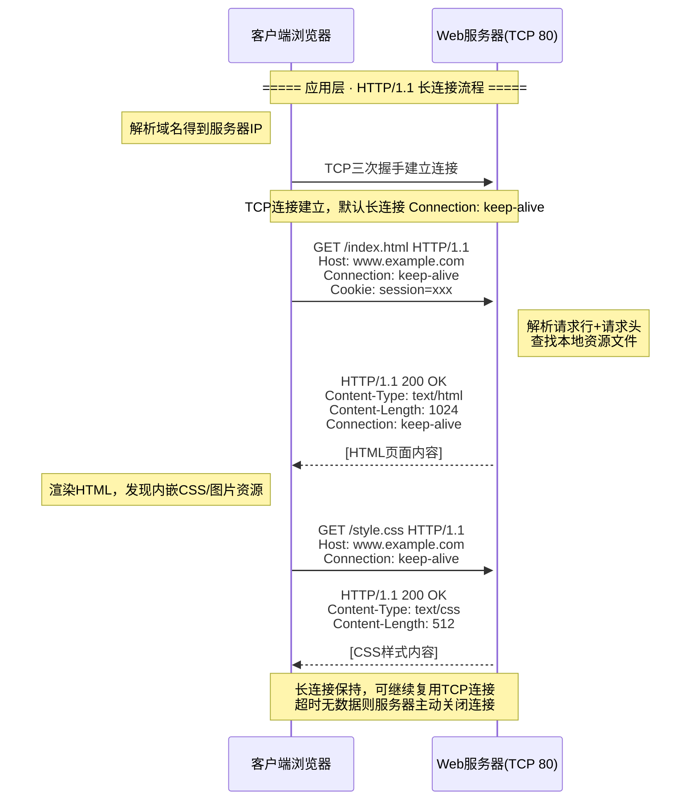
```mermaid
sequenceDiagram
    participant Client as 客户端浏览器
    participant Server as Web服务器(TCP 80)

    Note over Client,Server: ===== 应用层 · HTTP/1.1 长连接流程 =====
    Note left of Client: 解析域名得到服务器IP
    
    %% TCP建连
    Client->>+Server: TCP三次握手建立连接
    Note over Client,Server: TCP连接建立，默认长连接 Connection: keep-alive

    %% 第一个请求
    Client->>Server: GET /index.html HTTP/1.1<br/>Host: www.example.com<br/>Connection: keep-alive<br/>Cookie: session=xxx
    Note right of Server: 解析请求行+请求头<br/>查找本地资源文件
    
    Server-->>Client: HTTP/1.1 200 OK<br/>Content-Type: text/html<br/>Content-Length: 1024<br/>Connection: keep-alive<br/><br/>[HTML页面内容]
    Note left of Client: 渲染HTML，发现内嵌CSS/图片资源

    %% 第二个请求（同一条TCP连接，长连接复用）
    Client->>Server: GET /style.css HTTP/1.1<br/>Host: www.example.com<br/>Connection: keep-alive
    Server-->>Client: HTTP/1.1 200 OK<br/>Content-Type: text/css<br/>Content-Length: 512<br/><br/>[CSS样式内容]

    Note over Client,Server: 长连接保持，可继续复用TCP连接<br/>超时无数据则服务器主动关闭连接
```

#### 2. DNS 域名解析（递归+迭代完整流程）
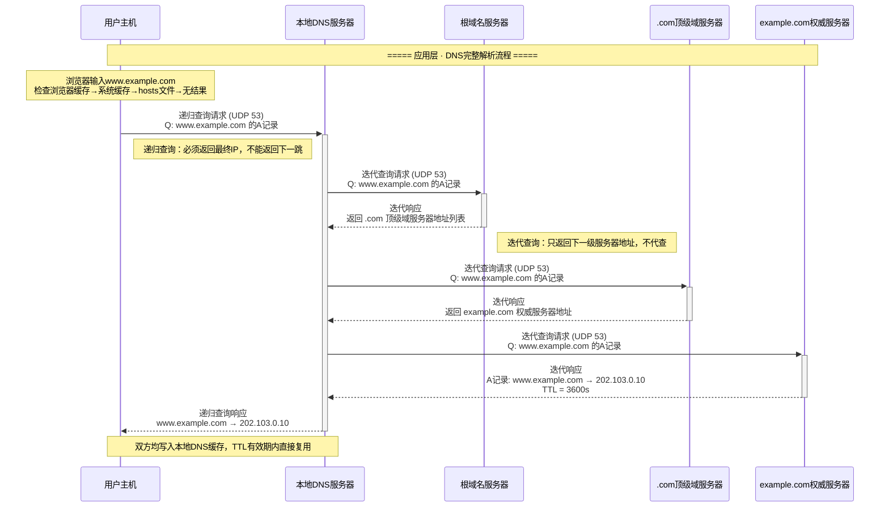
```mermaid
sequenceDiagram
    participant Host as 用户主机
    participant LocalDNS as 本地DNS服务器
    participant RootDNS as 根域名服务器
    participant TLD as .com顶级域服务器
    participant AuthDNS as example.com权威服务器

    Note over Host,AuthDNS: ===== 应用层 · DNS完整解析流程 =====
    Note over Host: 浏览器输入www.example.com<br/>检查浏览器缓存→系统缓存→hosts文件→无结果

    %% 递归查询
    Host->>+LocalDNS: 递归查询请求 (UDP 53)<br/>Q: www.example.com 的A记录
    Note left of LocalDNS: 递归查询：必须返回最终IP，不能返回下一跳

    %% 迭代查询1
    LocalDNS->>+RootDNS: 迭代查询请求 (UDP 53)<br/>Q: www.example.com 的A记录
    RootDNS-->>-LocalDNS: 迭代响应<br/>返回 .com 顶级域服务器地址列表
    Note right of RootDNS: 迭代查询：只返回下一级服务器地址，不代查

    %% 迭代查询2
    LocalDNS->>+TLD: 迭代查询请求 (UDP 53)<br/>Q: www.example.com 的A记录
    TLD-->>-LocalDNS: 迭代响应<br/>返回 example.com 权威服务器地址

    %% 迭代查询3
    LocalDNS->>+AuthDNS: 迭代查询请求 (UDP 53)<br/>Q: www.example.com 的A记录
    AuthDNS-->>-LocalDNS: 迭代响应<br/>A记录: www.example.com → 202.103.0.10<br/>TTL = 3600s

    %% 返回最终结果
    LocalDNS-->>-Host: 递归查询响应<br/>www.example.com → 202.103.0.10
    Note over Host,LocalDNS: 双方均写入本地DNS缓存，TTL有效期内直接复用
```

#### 3. DHCP 动态地址分配（四阶段完整流程）
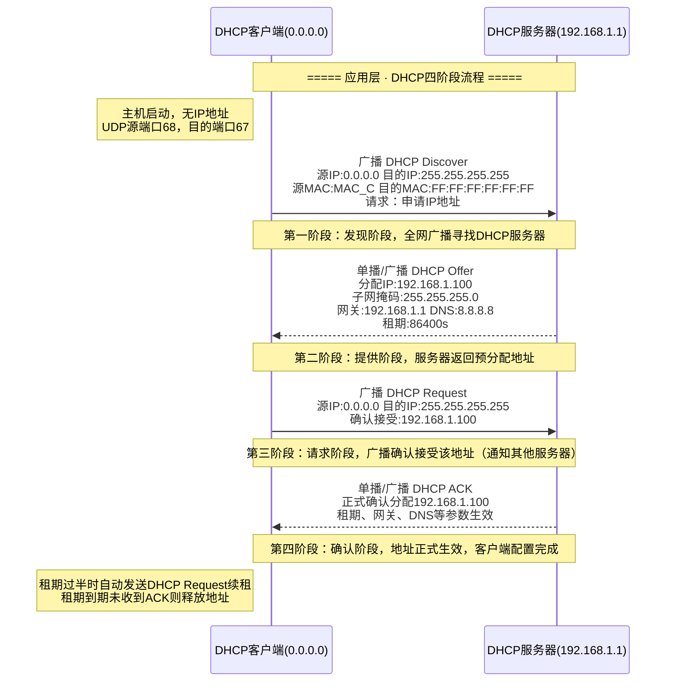
```mermaid
sequenceDiagram
    participant Client as DHCP客户端(0.0.0.0)
    participant Server as DHCP服务器(192.168.1.1)

    Note over Client,Server: ===== 应用层 · DHCP四阶段流程 =====
    Note left of Client: 主机启动，无IP地址<br/>UDP源端口68，目的端口67

    %% 阶段1：发现
    Client->>Server: 广播 DHCP Discover<br/>源IP:0.0.0.0 目的IP:255.255.255.255<br/>源MAC:MAC_C 目的MAC:FF:FF:FF:FF:FF:FF<br/>请求：申请IP地址
    Note over Client,Server: 第一阶段：发现阶段，全网广播寻找DHCP服务器

    %% 阶段2：提供
    Server-->>Client: 单播/广播 DHCP Offer<br/>分配IP:192.168.1.100<br/>子网掩码:255.255.255.0<br/>网关:192.168.1.1 DNS:8.8.8.8<br/>租期:86400s
    Note over Client,Server: 第二阶段：提供阶段，服务器返回预分配地址

    %% 阶段3：请求
    Client->>Server: 广播 DHCP Request<br/>源IP:0.0.0.0 目的IP:255.255.255.255<br/>确认接受:192.168.1.100
    Note over Client,Server: 第三阶段：请求阶段，广播确认接受该地址（通知其他服务器）

    %% 阶段4：确认
    Server-->>Client: 单播/广播 DHCP ACK<br/>正式确认分配192.168.1.100<br/>租期、网关、DNS等参数生效
    Note over Client,Server: 第四阶段：确认阶段，地址正式生效，客户端配置完成

    Note left of Client: 租期过半时自动发送DHCP Request续租<br/>租期到期未收到ACK则释放地址
```

#### 4. FTP 主动模式（PORT）
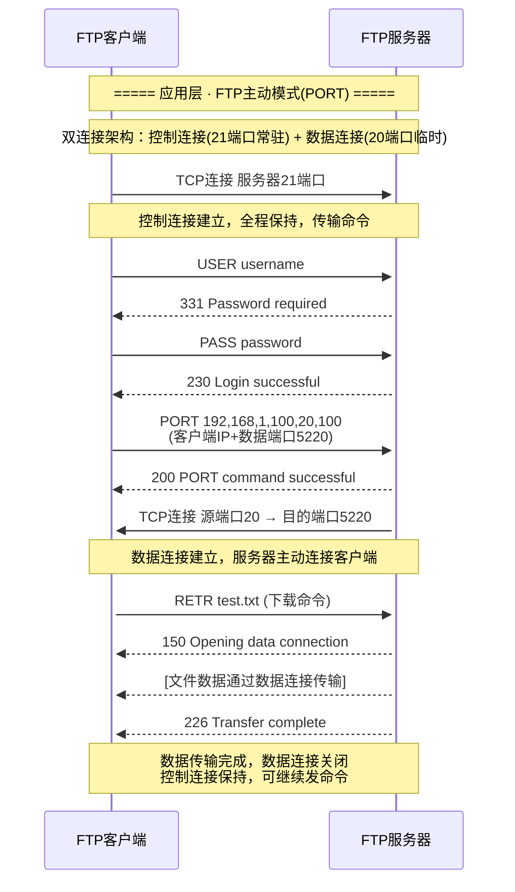
```mermaid
sequenceDiagram
    participant Client as FTP客户端
    participant Server as FTP服务器

    Note over Client,Server: ===== 应用层 · FTP主动模式(PORT) =====
    Note over Client,Server: 双连接架构：控制连接(21端口常驻) + 数据连接(20端口临时)

    %% 控制连接建立
    Client->>+Server: TCP连接 服务器21端口
    Note over Client,Server: 控制连接建立，全程保持，传输命令

    Client->>Server: USER username
    Server-->>Client: 331 Password required
    Client->>Server: PASS password
    Server-->>Client: 230 Login successful

    %% 主动模式：客户端告知数据端口
    Client->>Server: PORT 192,168,1,100,20,100<br/>(客户端IP+数据端口5220)
    Server-->>Client: 200 PORT command successful

    %% 服务器主动发起数据连接
    Server->>+Client: TCP连接 源端口20 → 目的端口5220
    Note over Client,Server: 数据连接建立，服务器主动连接客户端

    %% 传输文件
    Client->>Server: RETR test.txt (下载命令)
    Server-->>Client: 150 Opening data connection
    Server-->>Client: [文件数据通过数据连接传输]
    Server-->>Client: 226 Transfer complete

    Note over Client,Server: 数据传输完成，数据连接关闭<br/>控制连接保持，可继续发命令
```

#### 5. FTP 被动模式（PASV）
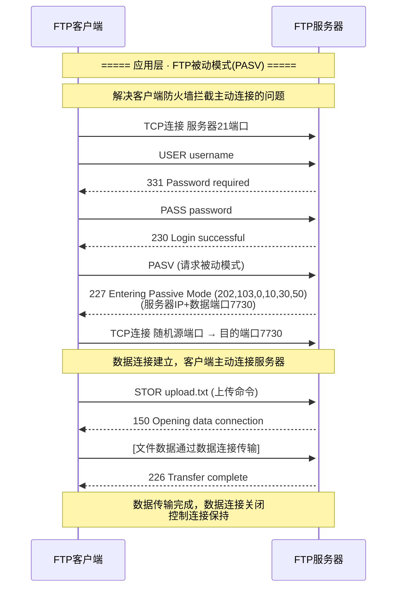
```mermaid
sequenceDiagram
    participant Client as FTP客户端
    participant Server as FTP服务器

    Note over Client,Server: ===== 应用层 · FTP被动模式(PASV) =====
    Note over Client,Server: 解决客户端防火墙拦截主动连接的问题

    %% 控制连接建立
    Client->>+Server: TCP连接 服务器21端口
    Client->>Server: USER username
    Server-->>Client: 331 Password required
    Client->>Server: PASS password
    Server-->>Client: 230 Login successful

    %% 被动模式：服务器告知数据端口
    Client->>Server: PASV (请求被动模式)
    Server-->>Client: 227 Entering Passive Mode (202,103,0,10,30,50)<br/>(服务器IP+数据端口7730)

    %% 客户端主动发起数据连接
    Client->>+Server: TCP连接 随机源端口 → 目的端口7730
    Note over Client,Server: 数据连接建立，客户端主动连接服务器

    %% 传输文件
    Client->>Server: STOR upload.txt (上传命令)
    Server-->>Client: 150 Opening data connection
    Client->>Server: [文件数据通过数据连接传输]
    Server-->>Client: 226 Transfer complete

    Note over Client,Server: 数据传输完成，数据连接关闭<br/>控制连接保持
```

#### 6. 电子邮件完整流程（SMTP发送 + POP3接收）
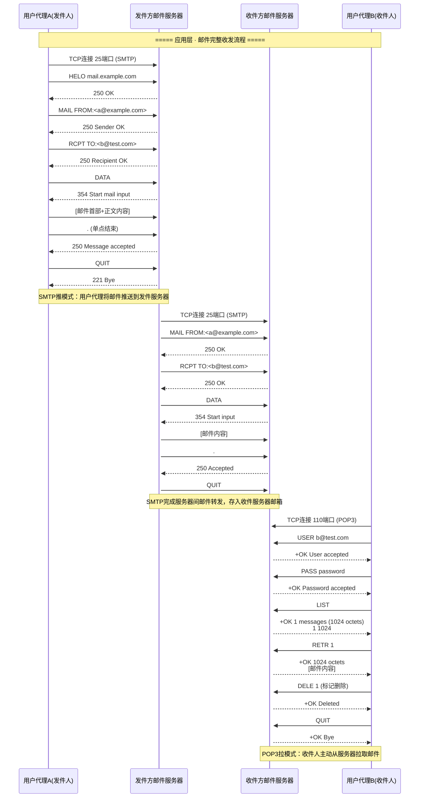
```mermaid
sequenceDiagram
    participant UA as 用户代理A(发件人)
    participant S1 as 发件方邮件服务器
    participant S2 as 收件方邮件服务器
    participant UB as 用户代理B(收件人)

    Note over UA,UB: ===== 应用层 · 邮件完整收发流程 =====

    %% 1. 发件人→发件服务器 SMTP
    UA->>+S1: TCP连接 25端口 (SMTP)
    UA->>S1: HELO mail.example.com
    S1-->>UA: 250 OK
    UA->>S1: MAIL FROM:<a@example.com>
    S1-->>UA: 250 Sender OK
    UA->>S1: RCPT TO:<b@test.com>
    S1-->>UA: 250 Recipient OK
    UA->>S1: DATA
    S1-->>UA: 354 Start mail input
    UA->>S1: [邮件首部+正文内容]
    UA->>S1: . (单点结束)
    S1-->>UA: 250 Message accepted
    UA->>S1: QUIT
    S1-->>UA: 221 Bye
    Note over UA,S1: SMTP推模式：用户代理将邮件推送到发件服务器

    %% 2. 服务器间转发 SMTP
    S1->>+S2: TCP连接 25端口 (SMTP)
    S1->>S2: MAIL FROM:<a@example.com>
    S2-->>S1: 250 OK
    S1->>S2: RCPT TO:<b@test.com>
    S2-->>S1: 250 OK
    S1->>S2: DATA
    S2-->>S1: 354 Start input
    S1->>S2: [邮件内容]
    S1->>S2: .
    S2-->>S1: 250 Accepted
    S1->>S2: QUIT
    Note over S1,S2: SMTP完成服务器间邮件转发，存入收件服务器邮箱

    %% 3. 收件人拉取邮件 POP3
    UB->>+S2: TCP连接 110端口 (POP3)
    UB->>S2: USER b@test.com
    S2-->>UB: +OK User accepted
    UB->>S2: PASS password
    S2-->>UB: +OK Password accepted
    UB->>S2: LIST
    S2-->>UB: +OK 1 messages (1024 octets)<br/>1 1024
    UB->>S2: RETR 1
    S2-->>UB: +OK 1024 octets<br/>[邮件内容]
    UB->>S2: DELE 1 (标记删除)
    S2-->>UB: +OK Deleted
    UB->>S2: QUIT
    S2-->>UB: +OK Bye
    Note over UB,S2: POP3拉模式：收件人主动从服务器拉取邮件
```

---

### （二）传输层协议时序图
#### 1. TCP 三次握手（带完整状态与序号）
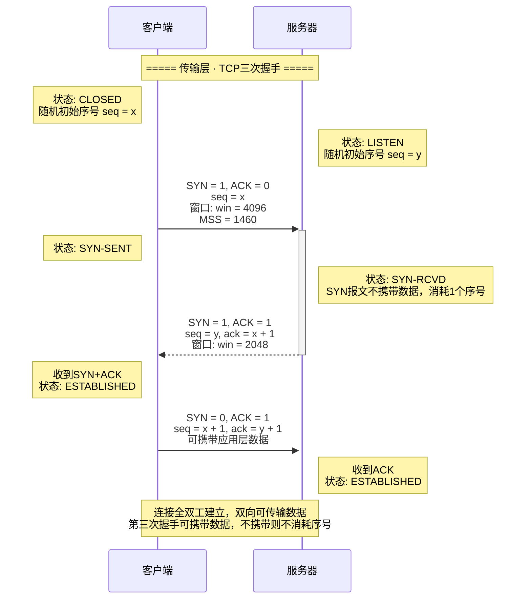
```mermaid
sequenceDiagram
    participant Client as 客户端
    participant Server as 服务器

    Note over Client,Server: ===== 传输层 · TCP三次握手 =====
    Note left of Client: 状态: CLOSED<br/>随机初始序号 seq = x
    Note right of Server: 状态: LISTEN<br/>随机初始序号 seq = y

    %% 第一次握手
    Client->>+Server: SYN = 1, ACK = 0<br/>seq = x<br/>窗口: win = 4096<br/>MSS = 1460
    Note left of Client: 状态: SYN-SENT
    Note right of Server: 状态: SYN-RCVD<br/>SYN报文不携带数据，消耗1个序号

    %% 第二次握手
    Server-->>-Client: SYN = 1, ACK = 1<br/>seq = y, ack = x + 1<br/>窗口: win = 2048
    Note left of Client: 收到SYN+ACK<br/>状态: ESTABLISHED

    %% 第三次握手
    Client->>+Server: SYN = 0, ACK = 1<br/>seq = x + 1, ack = y + 1<br/>可携带应用层数据
    Note right of Server: 收到ACK<br/>状态: ESTABLISHED

    Note over Client,Server: 连接全双工建立，双向可传输数据<br/>第三次握手可携带数据，不携带则不消耗序号
```

#### 2. TCP 四次挥手（带完整状态与2MSL）
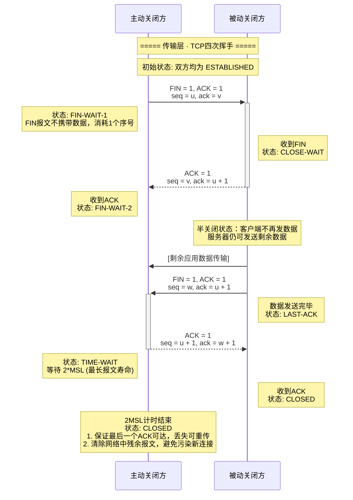
```mermaid
sequenceDiagram
    participant Client as 主动关闭方
    participant Server as 被动关闭方

    Note over Client,Server: ===== 传输层 · TCP四次挥手 =====
    Note over Client,Server: 初始状态: 双方均为 ESTABLISHED

    %% 第一次挥手
    Client->>+Server: FIN = 1, ACK = 1<br/>seq = u, ack = v
    Note left of Client: 状态: FIN-WAIT-1<br/>FIN报文不携带数据，消耗1个序号
    Note right of Server: 收到FIN<br/>状态: CLOSE-WAIT

    %% 第二次挥手
    Server-->>-Client: ACK = 1<br/>seq = v, ack = u + 1
    Note left of Client: 收到ACK<br/>状态: FIN-WAIT-2
    Note over Server: 半关闭状态：客户端不再发数据<br/>服务器仍可发送剩余数据

    %% 服务器发送完剩余数据
    Server->>Client: [剩余应用数据传输]

    %% 第三次挥手
    Server->>+Client: FIN = 1, ACK = 1<br/>seq = w, ack = u + 1
    Note right of Server: 数据发送完毕<br/>状态: LAST-ACK

    %% 第四次挥手
    Client-->>-Server: ACK = 1<br/>seq = u + 1, ack = w + 1
    Note left of Client: 状态: TIME-WAIT<br/>等待 2*MSL (最长报文寿命)
    Note right of Server: 收到ACK<br/>状态: CLOSED

    Note over Client: 2MSL计时结束<br/>状态: CLOSED<br/>1. 保证最后一个ACK可达，丢失可重传<br/>2. 清除网络中残余报文，避免污染新连接
```

#### 3. TCP 停止等待协议（可靠传输基础）
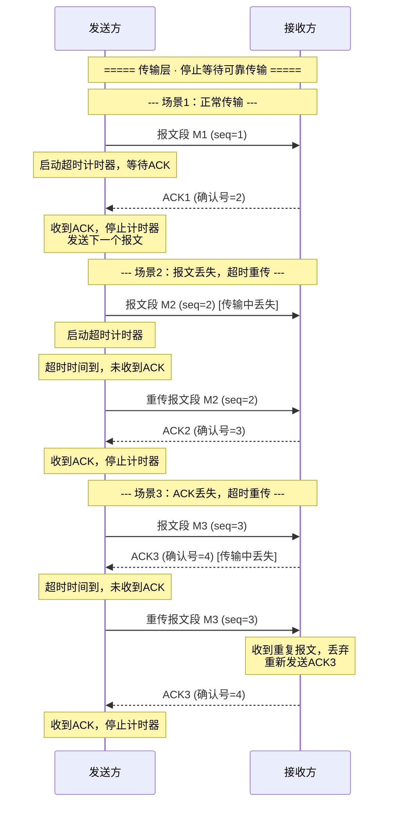
```mermaid
sequenceDiagram
    participant S as 发送方
    participant R as 接收方

    Note over S,R: ===== 传输层 · 停止等待可靠传输 =====
    
    %% 正常传输
    Note over S,R: --- 场景1：正常传输 ---
    S->>R: 报文段 M1 (seq=1)
    Note over S: 启动超时计时器，等待ACK
    R-->>S: ACK1 (确认号=2)
    Note over S: 收到ACK，停止计时器<br/>发送下一个报文

    %% 报文丢失
    Note over S,R: --- 场景2：报文丢失，超时重传 ---
    S->>R: 报文段 M2 (seq=2) [传输中丢失]
    Note over S: 启动超时计时器
    Note over S: 超时时间到，未收到ACK
    S->>R: 重传报文段 M2 (seq=2)
    R-->>S: ACK2 (确认号=3)
    Note over S: 收到ACK，停止计时器

    %% ACK丢失
    Note over S,R: --- 场景3：ACK丢失，超时重传 ---
    S->>R: 报文段 M3 (seq=3)
    R-->>S: ACK3 (确认号=4) [传输中丢失]
    Note over S: 超时时间到，未收到ACK
    S->>R: 重传报文段 M3 (seq=3)
    Note over R: 收到重复报文，丢弃<br/>重新发送ACK3
    R-->>S: ACK3 (确认号=4)
    Note over S: 收到ACK，停止计时器
```

#### 4. TCP 滑动窗口与流量控制
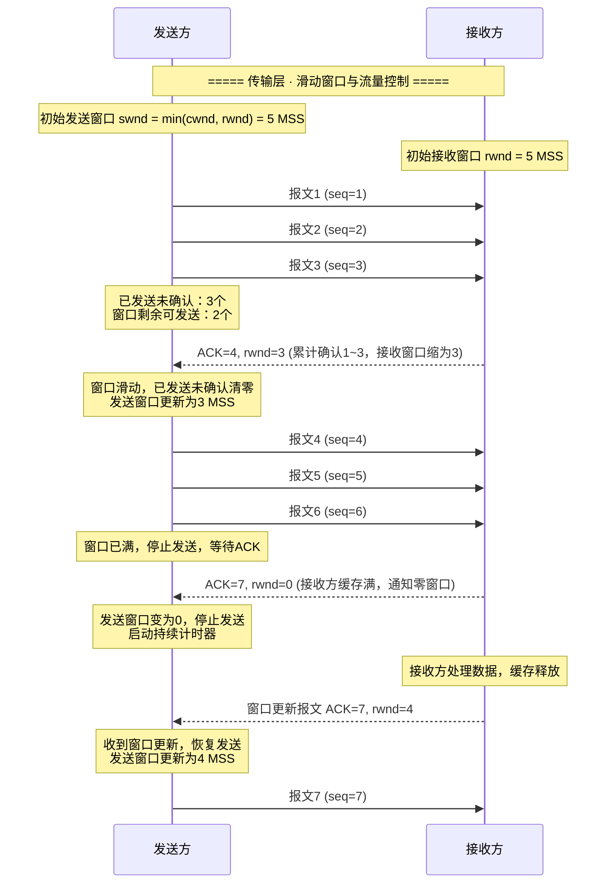
```mermaid
sequenceDiagram
    participant S as 发送方
    participant R as 接收方

    Note over S,R: ===== 传输层 · 滑动窗口与流量控制 =====
    Note over S: 初始发送窗口 swnd = min(cwnd, rwnd) = 5 MSS
    Note over R: 初始接收窗口 rwnd = 5 MSS

    %% 第一批发送
    S->>R: 报文1 (seq=1)
    S->>R: 报文2 (seq=2)
    S->>R: 报文3 (seq=3)
    Note over S: 已发送未确认：3个<br/>窗口剩余可发送：2个

    R-->>S: ACK=4, rwnd=3 (累计确认1~3，接收窗口缩为3)
    Note over S: 窗口滑动，已发送未确认清零<br/>发送窗口更新为3 MSS

    %% 第二批发送
    S->>R: 报文4 (seq=4)
    S->>R: 报文5 (seq=5)
    S->>R: 报文6 (seq=6)
    Note over S: 窗口已满，停止发送，等待ACK

    R-->>S: ACK=7, rwnd=0 (接收方缓存满，通知零窗口)
    Note over S: 发送窗口变为0，停止发送<br/>启动持续计时器

    Note over R: 接收方处理数据，缓存释放
    R-->>S: 窗口更新报文 ACK=7, rwnd=4
    Note over S: 收到窗口更新，恢复发送<br/>发送窗口更新为4 MSS

    S->>R: 报文7 (seq=7)
```

#### 5. TCP 快重传 + 快恢复详细流程
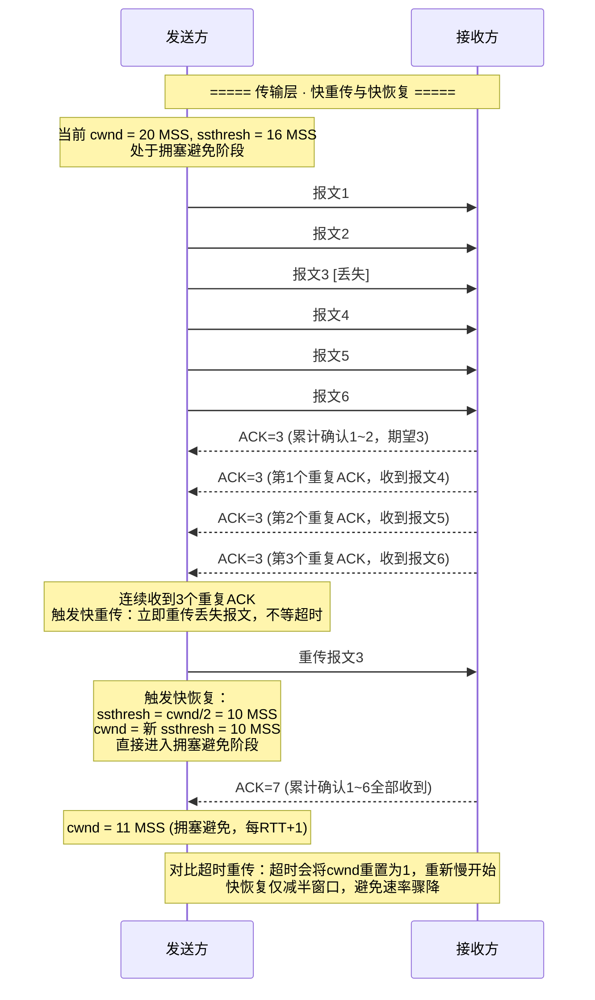
```mermaid
sequenceDiagram
    participant S as 发送方
    participant R as 接收方

    Note over S,R: ===== 传输层 · 快重传与快恢复 =====
    Note over S: 当前 cwnd = 20 MSS, ssthresh = 16 MSS<br/>处于拥塞避免阶段

    %% 批量发送，中间丢包
    S->>R: 报文1
    S->>R: 报文2
    S->>R: 报文3 [丢失]
    S->>R: 报文4
    S->>R: 报文5
    S->>R: 报文6

    %% 累计确认+重复ACK
    R-->>S: ACK=3 (累计确认1~2，期望3)
    R-->>S: ACK=3 (第1个重复ACK，收到报文4)
    R-->>S: ACK=3 (第2个重复ACK，收到报文5)
    R-->>S: ACK=3 (第3个重复ACK，收到报文6)

    Note over S: 连续收到3个重复ACK<br/>触发快重传：立即重传丢失报文，不等超时
    S->>R: 重传报文3

    Note over S: 触发快恢复：<br/>ssthresh = cwnd/2 = 10 MSS<br/>cwnd = 新 ssthresh = 10 MSS<br/>直接进入拥塞避免阶段

    R-->>S: ACK=7 (累计确认1~6全部收到)
    Note over S: cwnd = 11 MSS (拥塞避免，每RTT+1)

    Note over S,R: 对比超时重传：超时会将cwnd重置为1，重新慢开始<br/>快恢复仅减半窗口，避免速率骤降
```

---

### （三）网络层协议时序图
#### 1. ARP 地址解析协议
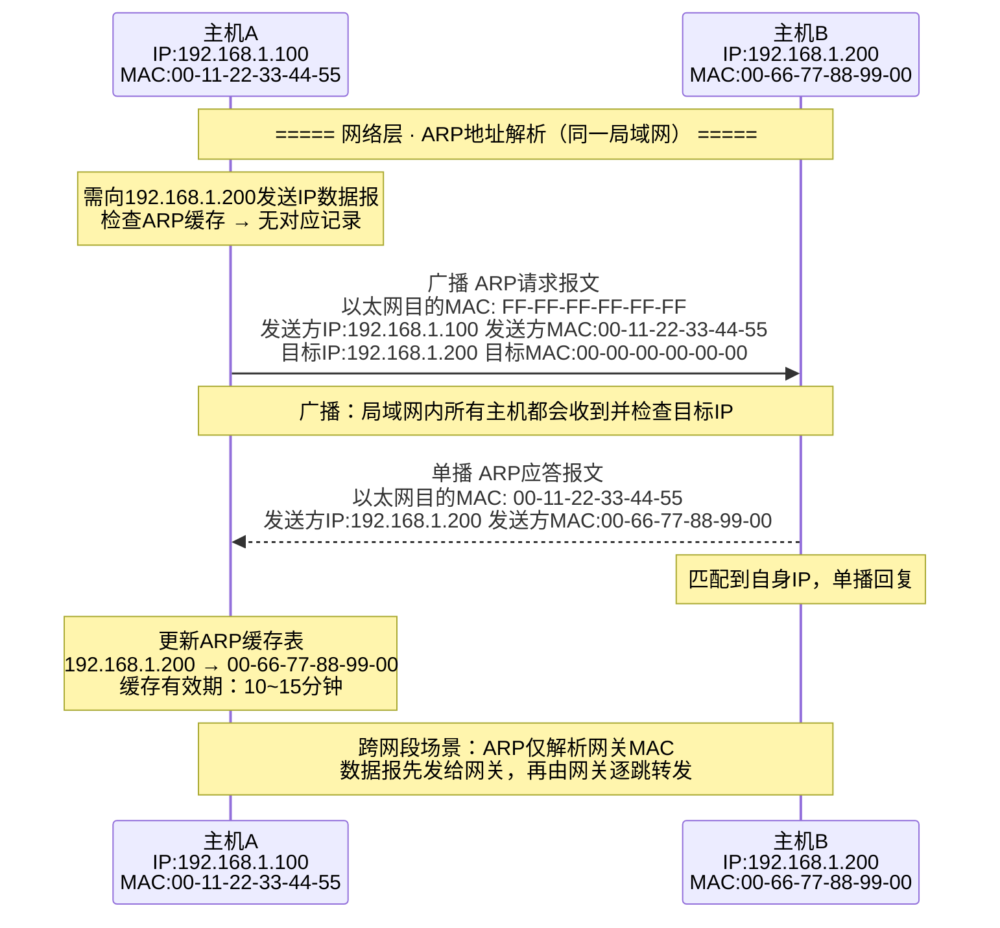
```mermaid
sequenceDiagram
    participant A as 主机A<br/>IP:192.168.1.100<br/>MAC:00-11-22-33-44-55
    participant B as 主机B<br/>IP:192.168.1.200<br/>MAC:00-66-77-88-99-00

    Note over A,B: ===== 网络层 · ARP地址解析（同一局域网） =====
    Note over A: 需向192.168.1.200发送IP数据报<br/>检查ARP缓存 → 无对应记录

    %% ARP请求
    A->>B: 广播 ARP请求报文<br/>以太网目的MAC: FF-FF-FF-FF-FF-FF<br/>发送方IP:192.168.1.100 发送方MAC:00-11-22-33-44-55<br/>目标IP:192.168.1.200 目标MAC:00-00-00-00-00-00
    Note over A,B: 广播：局域网内所有主机都会收到并检查目标IP

    %% ARP应答
    B-->>A: 单播 ARP应答报文<br/>以太网目的MAC: 00-11-22-33-44-55<br/>发送方IP:192.168.1.200 发送方MAC:00-66-77-88-99-00
    Note over B: 匹配到自身IP，单播回复

    Note over A: 更新ARP缓存表<br/>192.168.1.200 → 00-66-77-88-99-00<br/>缓存有效期：10~15分钟

    Note over A,B: 跨网段场景：ARP仅解析网关MAC<br/>数据报先发给网关，再由网关逐跳转发
```

#### 2. ICMP Ping 工作原理
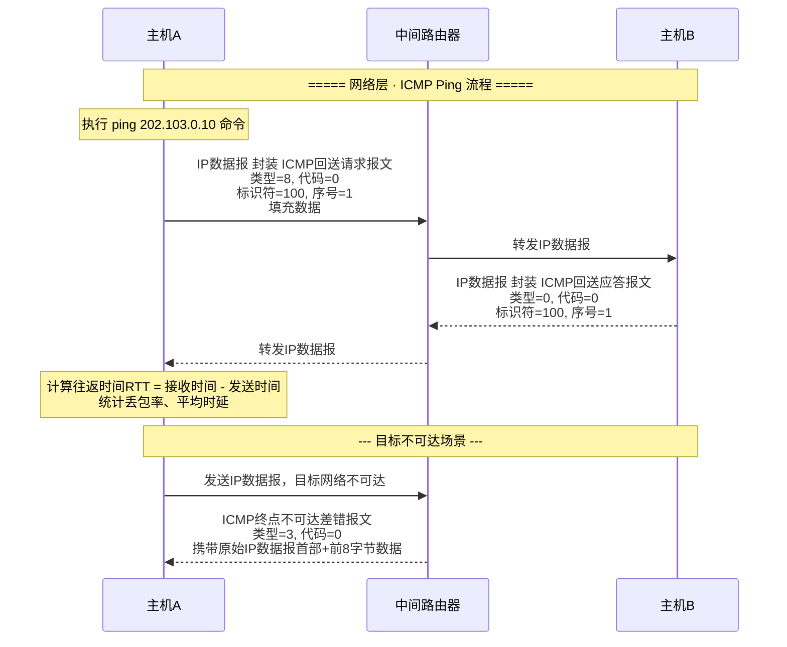
```mermaid
sequenceDiagram
    participant A as 主机A
    participant R as 中间路由器
    participant B as 主机B

    Note over A,B: ===== 网络层 · ICMP Ping 流程 =====
    Note over A: 执行 ping 202.103.0.10 命令

    %% 请求
    A->>R: IP数据报 封装 ICMP回送请求报文<br/>类型=8, 代码=0<br/>标识符=100, 序号=1<br/>填充数据
    R->>B: 转发IP数据报

    %% 应答
    B-->>R: IP数据报 封装 ICMP回送应答报文<br/>类型=0, 代码=0<br/>标识符=100, 序号=1
    R-->>A: 转发IP数据报

    Note over A: 计算往返时间RTT = 接收时间 - 发送时间<br/>统计丢包率、平均时延

    %% 不可达场景
    Note over A,B: --- 目标不可达场景 ---
    A->>R: 发送IP数据报，目标网络不可达
    R-->>A: ICMP终点不可达差错报文<br/>类型=3, 代码=0<br/>携带原始IP数据报首部+前8字节数据
```

#### 3. ICMP Traceroute 路由追踪原理
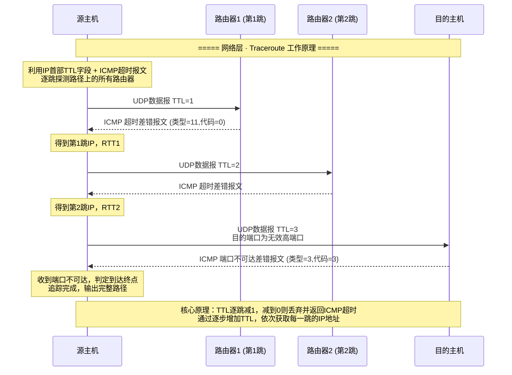
```mermaid
sequenceDiagram
    participant S as 源主机
    participant R1 as 路由器1 (第1跳)
    participant R2 as 路由器2 (第2跳)
    participant D as 目的主机

    Note over S,D: ===== 网络层 · Traceroute 工作原理 =====
    Note over S: 利用IP首部TTL字段 + ICMP超时报文<br/>逐跳探测路径上的所有路由器

    %% 第1跳
    S->>R1: UDP数据报 TTL=1
    R1-->>S: ICMP 超时差错报文 (类型=11,代码=0)
    Note over S: 得到第1跳IP，RTT1

    %% 第2跳
    S->>R2: UDP数据报 TTL=2
    R2-->>S: ICMP 超时差错报文
    Note over S: 得到第2跳IP，RTT2

    %% 到达目的主机
    S->>D: UDP数据报 TTL=3<br/>目的端口为无效高端口
    D-->>S: ICMP 端口不可达差错报文 (类型=3,代码=3)
    Note over S: 收到端口不可达，判定到达终点<br/>追踪完成，输出完整路径

    Note over S,D: 核心原理：TTL逐跳减1，减到0则丢弃并返回ICMP超时<br/>通过逐步增加TTL，依次获取每一跳的IP地址
```

#### 4. RIP 路由更新与坏消息传得慢
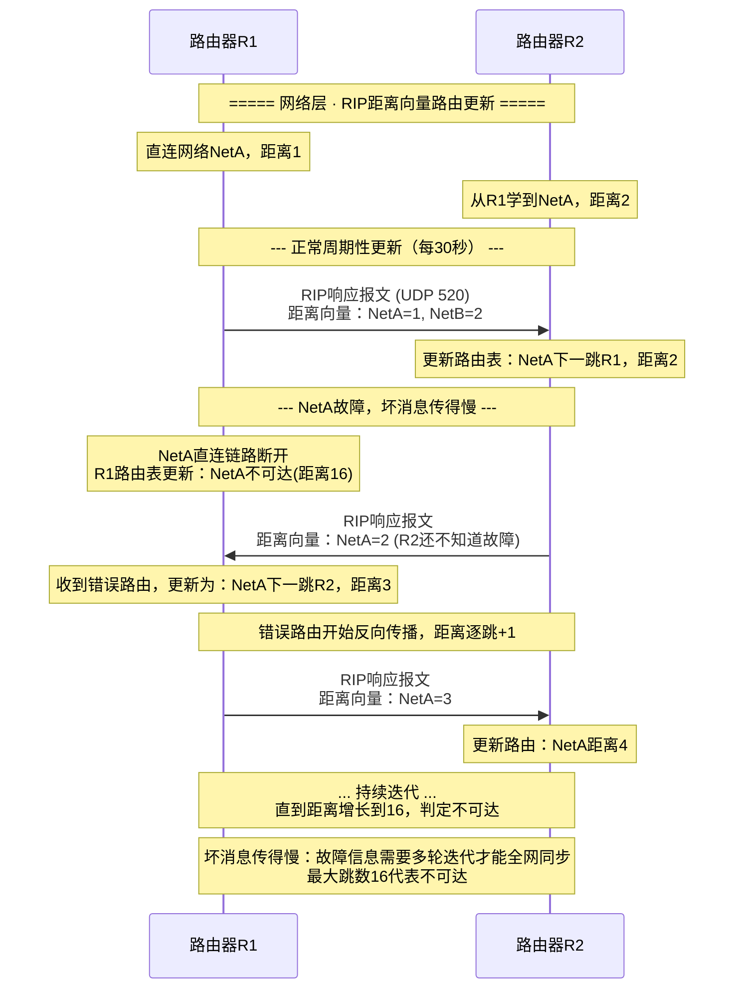
```mermaid
sequenceDiagram
    participant R1 as 路由器R1
    participant R2 as 路由器R2

    Note over R1,R2: ===== 网络层 · RIP距离向量路由更新 =====
    Note over R1: 直连网络NetA，距离1
    Note over R2: 从R1学到NetA，距离2

    %% 正常周期性更新
    Note over R1,R2: --- 正常周期性更新（每30秒） ---
    R1->>R2: RIP响应报文 (UDP 520)<br/>距离向量：NetA=1, NetB=2
    Note over R2: 更新路由表：NetA下一跳R1，距离2

    %% 故障触发坏消息传得慢
    Note over R1,R2: --- NetA故障，坏消息传得慢 ---
    Note over R1: NetA直连链路断开<br/>R1路由表更新：NetA不可达(距离16)

    R2->>R1: RIP响应报文<br/>距离向量：NetA=2 (R2还不知道故障)
    Note over R1: 收到错误路由，更新为：NetA下一跳R2，距离3
    Note over R1,R2: 错误路由开始反向传播，距离逐跳+1

    R1->>R2: RIP响应报文<br/>距离向量：NetA=3
    Note over R2: 更新路由：NetA距离4

    Note over R1,R2: ... 持续迭代 ...<br/>直到距离增长到16，判定不可达
    Note over R1,R2: 坏消息传得慢：故障信息需要多轮迭代才能全网同步<br/>最大跳数16代表不可达
```

#### 5. NAPT 端口地址转换流程
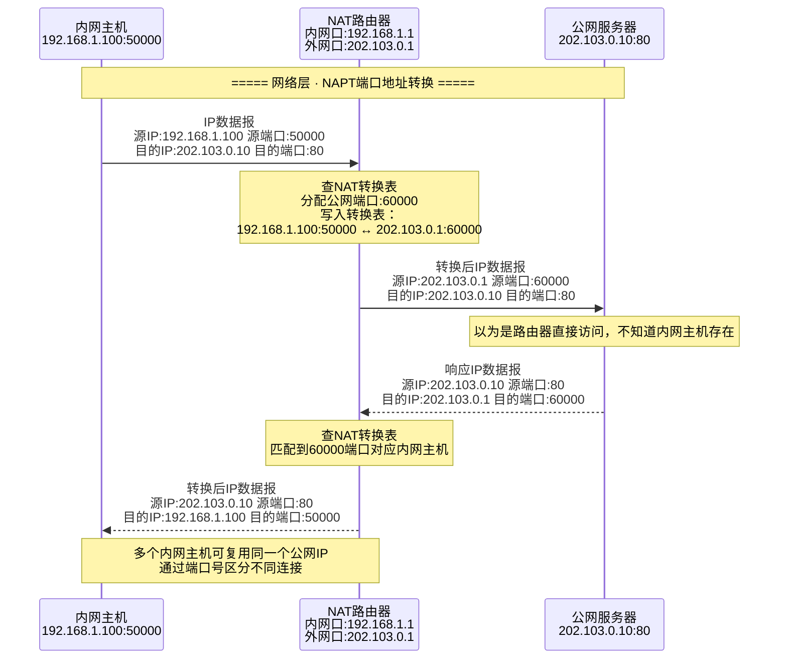
```mermaid
sequenceDiagram
    participant H as 内网主机<br/>192.168.1.100:50000
    participant R as NAT路由器<br/>内网口:192.168.1.1<br/>外网口:202.103.0.1
    participant S as 公网服务器<br/>202.103.0.10:80

    Note over H,S: ===== 网络层 · NAPT端口地址转换 =====

    %% 出方向转换
    H->>R: IP数据报<br/>源IP:192.168.1.100 源端口:50000<br/>目的IP:202.103.0.10 目的端口:80
    Note over R: 查NAT转换表<br/>分配公网端口:60000<br/>写入转换表：<br/>192.168.1.100:50000 ↔ 202.103.0.1:60000

    R->>S: 转换后IP数据报<br/>源IP:202.103.0.1 源端口:60000<br/>目的IP:202.103.0.10 目的端口:80
    Note over S: 以为是路由器直接访问，不知道内网主机存在

    %% 入方向转换
    S-->>R: 响应IP数据报<br/>源IP:202.103.0.10 源端口:80<br/>目的IP:202.103.0.1 目的端口:60000
    Note over R: 查NAT转换表<br/>匹配到60000端口对应内网主机

    R-->>H: 转换后IP数据报<br/>源IP:202.103.0.10 源端口:80<br/>目的IP:192.168.1.100 目的端口:50000

    Note over H,R: 多个内网主机可复用同一个公网IP<br/>通过端口号区分不同连接
```

---

### （四）数据链路层协议时序图
#### 1. CSMA/CD 冲突检测与退避流程
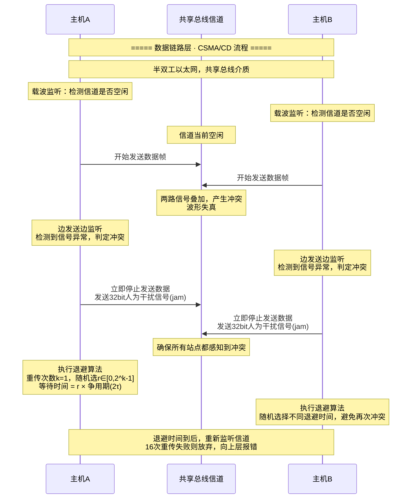
```mermaid
sequenceDiagram
    participant A as 主机A
    participant 信道 as 共享总线信道
    participant B as 主机B

    Note over A,B: ===== 数据链路层 · CSMA/CD 流程 =====
    Note over A,B: 半双工以太网，共享总线介质

    %% 先听后发
    Note over A: 载波监听：检测信道是否空闲
    Note over B: 载波监听：检测信道是否空闲
    Note over 信道: 信道当前空闲

    %% 同时发送，产生冲突
    A->>信道: 开始发送数据帧
    B->>信道: 开始发送数据帧
    Note over 信道: 两路信号叠加，产生冲突<br/>波形失真

    %% 边发边听，检测冲突
    Note over A: 边发送边监听<br/>检测到信号异常，判定冲突
    Note over B: 边发送边监听<br/>检测到信号异常，判定冲突

    %% 立即停发+干扰信号
    A->>信道: 立即停止发送数据<br/>发送32bit人为干扰信号(jam)
    B->>信道: 立即停止发送数据<br/>发送32bit人为干扰信号(jam)
    Note over 信道: 确保所有站点都感知到冲突

    %% 截断二进制指数退避
    Note over A: 执行退避算法<br/>重传次数k=1，随机选r∈[0,2^k-1]<br/>等待时间 = r × 争用期(2τ)
    Note over B: 执行退避算法<br/>随机选择不同退避时间，避免再次冲突

    Note over A,B: 退避时间到后，重新监听信道<br/>16次重传失败则放弃，向上层报错
```

#### 2. PPP 链路建立完整三阶段
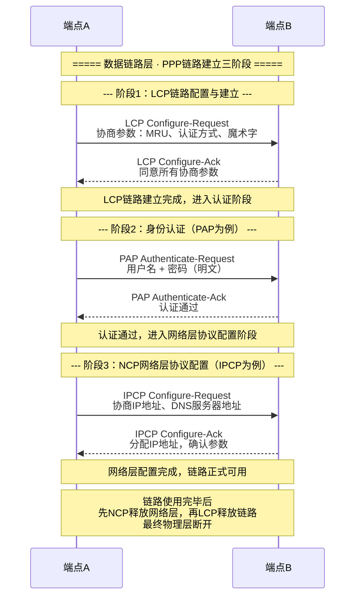
```mermaid
sequenceDiagram
    participant A as 端点A
    participant B as 端点B

    Note over A,B: ===== 数据链路层 · PPP链路建立三阶段 =====

    %% 阶段1：LCP链路建立
    Note over A,B: --- 阶段1：LCP链路配置与建立 ---
    A->>B: LCP Configure-Request<br/>协商参数：MRU、认证方式、魔术字
    B-->>A: LCP Configure-Ack<br/>同意所有协商参数
    Note over A,B: LCP链路建立完成，进入认证阶段

    %% 阶段2：认证阶段
    Note over A,B: --- 阶段2：身份认证（PAP为例） ---
    A->>B: PAP Authenticate-Request<br/>用户名 + 密码（明文）
    B-->>A: PAP Authenticate-Ack<br/>认证通过
    Note over A,B: 认证通过，进入网络层协议配置阶段

    %% 阶段3：NCP网络层配置
    Note over A,B: --- 阶段3：NCP网络层协议配置（IPCP为例） ---
    A->>B: IPCP Configure-Request<br/>协商IP地址、DNS服务器地址
    B-->>A: IPCP Configure-Ack<br/>分配IP地址，确认参数
    Note over A,B: 网络层配置完成，链路正式可用

    Note over A,B: 链路使用完毕后<br/>先NCP释放网络层，再LCP释放链路<br/>最终物理层断开
```

#### 3. 二层交换机自学习与帧转发
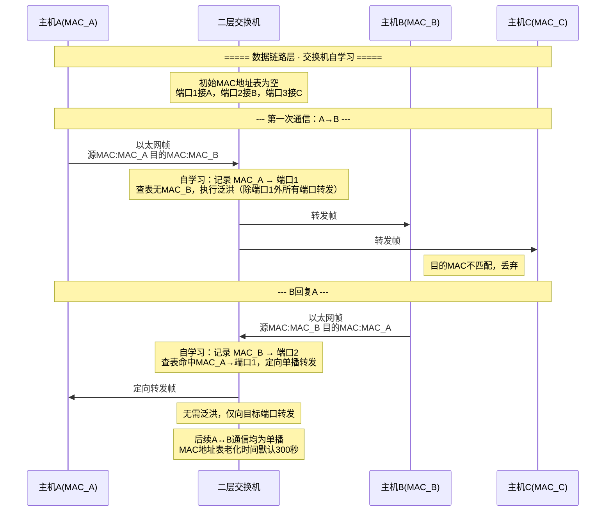
```mermaid
sequenceDiagram
    participant A as 主机A(MAC_A)
    participant SW as 二层交换机
    participant B as 主机B(MAC_B)
    participant C as 主机C(MAC_C)

    Note over A,C: ===== 数据链路层 · 交换机自学习 =====
    Note over SW: 初始MAC地址表为空<br/>端口1接A，端口2接B，端口3接C

    %% A发帧给B，第一次泛洪
    Note over A,C: --- 第一次通信：A→B ---
    A->>SW: 以太网帧<br/>源MAC:MAC_A 目的MAC:MAC_B
    Note over SW: 自学习：记录 MAC_A → 端口1<br/>查表无MAC_B，执行泛洪（除端口1外所有端口转发）

    SW->>B: 转发帧
    SW->>C: 转发帧
    Note left of C: 目的MAC不匹配，丢弃

    %% B回复A，定向转发
    Note over A,C: --- B回复A ---
    B->>SW: 以太网帧<br/>源MAC:MAC_B 目的MAC:MAC_A
    Note over SW: 自学习：记录 MAC_B → 端口2<br/>查表命中MAC_A→端口1，定向单播转发

    SW->>A: 定向转发帧
    Note over SW: 无需泛洪，仅向目标端口转发

    Note over SW: 后续A↔B通信均为单播<br/>MAC地址表老化时间默认300秒
```

---

### （五）物理层说明
物理层不存在对等实体之间的协议交互时序，它定义的是**硬件传输的电气、机械、功能、规程四大特性**，核心是将数据链路层的比特流转换为物理信号传输，不涉及逻辑交互。
- 核心考点：奈奎斯特定理、香农定理、数字编码方式、模拟调制方式、信道复用技术、传输介质分类。