```mermaid
sequenceDiagram
    participant A as 主机A
    participant D as 主机D
    participant S as 二层交换机S1
    participant R1 as 路由器R1<br/>(内网口/外网口/串口)
    participant DNS_L as 本地DNS服务器
    participant DNS_R as 根域名服务器
    participant DNS_T as .com顶级域服务器
    participant DNS_A as 权威DNS服务器
    participant B as Web服务器B
    participant R2 as 分支路由器R2

    %% ===================== 阶段1：DHCP四阶段 + 交换机自学习 + CRC校验 =====================
    rect rgb(240, 248, 255)
    Note over A,R1: ===== 阶段1：DHCP四阶段 · 主机入网 =====
    Note left of A: 初始无IP，MAC=00-11-22-33-44-55

    %% Discover
    A->>S: 【以太网帧】源MAC_A / 目的MAC全F / 类型0x0800 / FCS校验码<br/>【IP】源0.0.0.0 / 目的255.255.255.255 / 协议17 / TTL=64<br/>【UDP】源68 / 目的67<br/>【DHCP】Discover · 请求IP/网关/DNS/租期
    Note over S: 1. 接收帧，校验FCS，错误则丢弃<br/>2. 自学习：MAC_A → 端口1<br/>3. 目的广播 → 除入端口外泛洪转发
    S->>R1: 转发DHCP Discover广播帧

    %% Offer
    R1->>S: 【以太网帧】源MAC_R1内 / 目的MAC全F / FCS校验码<br/>【IP】源192.168.1.1 / 目的255.255.255.255<br/>【DHCP】Offer · 分配192.168.1.100 · 租期86400s · 网关/DNS
    Note over S: 1. 校验FCS<br/>2. 自学习：MAC_R1内 → 端口2<br/>3. 广播泛洪
    S->>A: 转发DHCP Offer广播帧
    Note left of A: 校验FCS → 解析Offer → 确认接受地址

    %% Request
    A->>S: 【DHCP】Request · 确认接受192.168.1.100 · 广播通知其他服务器
    S->>R1: 转发DHCP Request

    %% ACK
    R1->>S: 【DHCP】ACK · 地址正式生效
    S->>A: 转发DHCP ACK
    Note left of A: TCP/IP协议栈正式配置完成<br/>IP=192.168.1.100/24，网关=192.168.1.1，DNS=223.5.5.5
    end

    %% ===================== 阶段2：ARP逐跳解析 + 路由表最长前缀匹配 =====================
    rect rgb(248, 240, 255)
    Note over A,B: ===== 阶段2：ARP逐跳解析 + 路由最长前缀匹配 =====
    Note over A,B: 跨网段传输：每经过一个路由器，二层帧完全重封装<br/>IP地址端到端不变，MAC地址逐跳替换

    %% 第一跳ARP
    Note over A,R1: --- 第一跳：A获取网关内网口MAC ---
    A->>S: 【以太网帧】目的MAC全F / 类型0x0806 / FCS<br/>【ARP请求】发送方IP=192.168.1.100 MAC=MAC_A<br/>目标IP=192.168.1.1 MAC=全0
    S->>R1: 广播转发ARP请求

    %% 路由器路由匹配
    Note over R1: --- 路由器转发核心：最长前缀匹配 ---
    Note over R1: 路由表条目示例：<br/>1. 0.0.0.0/0 下一跳202.103.2.1（默认路由）<br/>2. 202.103.0.0/24 直连 外网口<br/>3. 192.168.1.0/24 直连 内网口<br/>转发逻辑：从长到短匹配前缀<br/>目的IP 202.103.0.10 匹配 202.103.0.0/24 → 直连外网口

    %% 第二跳ARP
    Note over R1,B: --- 第二跳：R1获取服务器B的MAC ---
    R1->>B: 【外网口ARP广播】发送方IP=202.103.0.1 MAC=MAC_R1外<br/>目标IP=202.103.0.10 MAC=全0
    B-->>R1: 【ARP应答单播】发送方IP=202.103.0.10 MAC=MAC_B
    Note over R1: 更新ARP缓存：202.103.0.10 → MAC_B<br/>后续转发直接查表封装二层帧

    R1->>S: 【ARP应答单播】发送方IP=192.168.1.1 MAC=MAC_R1内<br/>目标IP=192.168.1.100 MAC=MAC_A
    S->>A: 单播转发ARP应答
    Note left of A: 更新ARP缓存：192.168.1.1 → MAC_R1内
    end

    %% ===================== 阶段3：DNS解析 + 缓存机制 =====================
    rect rgb(255, 248, 240)
    Note over A,DNS_A: ===== 阶段3：DNS递归+迭代解析 + 缓存机制 =====

    %% 第一次解析：无缓存
    Note over A,DNS_A: --- 首次访问：无缓存，完整递归+迭代 ---
    A->>R1: 【帧】源MAC_A / 目的MAC_R1内 / FCS<br/>【IP】源192.168.1.100 / 目的223.5.5.5<br/>【UDP】源50000 / 目的53<br/>【DNS】递归查询 · A记录 · www.example.com
    Note over R1: NAPT转换：源端口50000→60000<br/>记录映射：192.168.1.100:50000 ↔ 202.103.0.1:60000
    R1->>DNS_L: 转发DNS递归查询

    DNS_L->>DNS_R: 迭代查询1：www.example.com
    DNS_R-->>DNS_L: 返回.com顶级域服务器地址

    DNS_L->>DNS_T: 迭代查询2：www.example.com
    DNS_T-->>DNS_L: 返回example.com权威服务器地址

    DNS_L->>DNS_A: 迭代查询3：www.example.com
    DNS_A-->>DNS_L: A记录：202.103.0.10，TTL=3600s

    DNS_L-->>R1: DNS响应
    R1->>A: 反向NAT转换后转发DNS响应
    Note left of A: 写入浏览器缓存 + 系统缓存 + 本地DNS缓存<br/>TTL内再次访问无需重新解析

    %% 第二次解析：缓存命中
    Note over A,DNS_L: --- 二次访问：缓存命中，无需迭代 ---
    A->>DNS_L: 再次查询www.example.com
    DNS_L-->>A: 直接从缓存返回结果，TTL剩余3000s
    Note over DNS_L: DNS缓存作用：减少迭代查询，提升解析速度
    end

    %% ===================== 阶段4：ICMP Ping + NAPT + IP分片 =====================
    rect rgb(240, 255, 248)
    Note over A,B: ===== 阶段4：ICMP Ping + NAPT + IP分片 =====

    %% 小包Ping：正常流程
    Note over A,B: --- 场景1：小包Ping，无需分片 ---
    A->>S: ICMP回送请求 · ID=1001 · 数据64字节<br/>总长度：20(IP)+8(ICMP)+64=92字节 < MTU 1500
    S->>R1: 转发
    Note over R1: NAPT出方向转换：<br/>源IP 192.168.1.100→202.103.0.1<br/>ICMP ID 1001→60001<br/>TTL减1，重算首部校验和<br/>二层重封装：源MAC_R1外 / 目的MAC_B
    R1->>B: 转换后ICMP请求

    B-->>R1: ICMP回送应答 · ID=60001
    Note over R1: NAPT入方向转换：<br/>查NAT表，目的IP 202.103.0.1→192.168.1.100<br/>ICMP ID 60001→1001<br/>TTL减1，重算校验和
    R1->>S: 转换后应答
    S->>A: 转发
    Note left of A: Ping成功，RTT=15ms

    %% 大包Ping：IP分片
    Note over A,B: --- 场景2：大包Ping，触发IP分片 ---
    A->>R1: ICMP请求 · 数据3000字节<br/>IP总长度=20+8+3000=3028字节 > MTU 1500
    Note over R1: 【IP分片处理】<br/>IP首部20字节，每片最大数据=1500-20=1480字节<br/>片偏移以8字节为单位<br/>第1片：数据1480B，MF=1，片偏移=0<br/>第2片：数据1480B，MF=1，片偏移=185<br/>第3片：数据48B，MF=0，片偏移=370<br/>每片独立封装，各自有IP首部，总长度不同
    R1->>B: 分片1 + 分片2 + 分片3（独立传输）

    Note over B: 【IP重组】<br/>根据ID+源IP+目的IP识别同属一个数据报<br/>根据片偏移+MF位拼接数据<br/>重组为完整ICMP报文后交付上层
    B-->>R1: ICMP回送应答
    Note left of A: 分片对传输层/应用层透明，由网络层独立完成
    end

    %% ===================== 阶段5：TCP三次握手 + HTTP长连接 =====================
    rect rgb(255, 240, 248)
    Note over A,B: ===== 阶段5：TCP三次握手 + HTTP/1.1长连接 =====
    Note left of A: 初始序号ISN x=1000
    Note right of B: 初始序号ISN y=2000

    %% 第一次握手
    A->>R1: 【TCP】SYN=1 ACK=0 seq=1000<br/>源端口50002 目的端口80<br/>窗口4096 MSS=1460 SACK_PERMITTED
    Note over R1: NAPT端口映射：50002→60002
    R1->>B: 转发SYN报文
    Note left of A: 状态：SYN-SENT
    Note right of B: 状态：SYN-RCVD

    %% 第二次握手
    B-->>R1: 【TCP】SYN=1 ACK=1 seq=2000 ack=1001<br/>窗口2048 MSS=1460
    R1->>A: 反向NAT后转发
    Note left of A: 状态：ESTABLISHED

    %% 第三次握手（可捎带数据）
    A->>R1: 【TCP】ACK=1 seq=1001 ack=2001<br/>捎带HTTP GET请求首部
    R1->>B: 转发ACK+数据
    Note right of B: 状态：ESTABLISHED
    Note over A,B: TCP连接建立，全双工通信

    %% HTTP长连接复用
    Note over A,B: --- HTTP/1.1 长连接复用同一条TCP ---
    A->>B: HTTP GET /index.html HTTP/1.1<br/>Connection: keep-alive
    B-->>A: HTTP 200 OK + HTML页面内容<br/>【TCP捎带确认】ACK捎带在响应数据中，不单独发空ACK

    A->>B: HTTP GET /style.css HTTP/1.1<br/>同一条TCP连接，无需重新握手
    B-->>A: HTTP 200 OK + CSS文件
    Note over A,B: 长连接优势：减少三次握手开销，降低时延
    end

    %% ===================== 阶段6：慢开始 + 拥塞避免 =====================
    rect rgb(245, 245, 255)
    Note over A,B: ===== 阶段6：慢开始 + 拥塞避免 =====
    Note over A: 初始：cwnd=1 MSS, ssthresh=16 MSS<br/>接收窗口足够大，发送窗口由cwnd决定

    loop 慢开始阶段（指数增长）
        A->>B: 发送cwnd个报文段
        B-->>A: 累计确认ACK（一个ACK确认多个连续报文）
        Note over A: 每收到1个新确认，cwnd+1<br/>每经过1个RTT，cwnd翻倍<br/>1 → 2 → 4 → 8 → 16 MSS
    end

    Note over A: cwnd == ssthresh == 16 MSS<br/>切换为拥塞避免算法
    loop 拥塞避免阶段（线性增长）
        A->>B: 发送cwnd个报文段
        B-->>A: 累计确认ACK
        Note over A: 每经过1个RTT，cwnd+1 MSS<br/>16 → 17 → 18 → 19 → 20 MSS
    end
    end

    %% ===================== 阶段7：快重传快恢复 + 超时重传 =====================
    rect rgb(255, 245, 235)
    Note over A,B: ===== 阶段7：两种拥塞处理：快重传 + 超时重传 =====

    %% 场景1：轻度拥塞，快重传+快恢复
    Note over A,B: --- 场景1：轻度丢包 → 快重传+快恢复 ---
    Note over A: cwnd=20 MSS，第12号报文丢失，后续报文到达
    A->>B: 发送1~20号报文（12号丢失）
    B-->>A: ACK=第12号起始（确认1~11）
    B-->>A: ACK=第12号起始（重复ACK 1，收到13号）
    B-->>A: ACK=第12号起始（重复ACK 2，收到14号）
    B-->>A: ACK=第12号起始（重复ACK 3，收到15号）

    Note over A: 连续3个重复ACK → 触发快重传
    A->>B: 立即重传第12号报文，无需等待超时

    Note over A: 触发快恢复：<br/>ssthresh = cwnd/2 = 10 MSS<br/>cwnd = 新ssthresh = 10 MSS<br/>直接进入拥塞避免
    B-->>A: ACK=第21号起始（累计确认全部1~20号）
    Note over A: cwnd=11 MSS，线性增长

    %% 场景2：严重拥塞，超时重传
    Note over A,B: --- 场景2：严重拥塞 → 超时重传 ---
    Note over A: cwnd=12 MSS，报文丢失且无后续报文<br/>无重复ACK，等待超时定时器到期
    Note over A: 超时时间到，未收到ACK → 判定严重拥塞
    Note over A: 超时处理：<br/>ssthresh = 12/2 = 6 MSS<br/>cwnd = 1 MSS<br/>重新进入慢开始阶段
    Note over A,B: 超时重传惩罚更重，快恢复更温和<br/>对应两种不同的拥塞严重程度
    end

    %% ===================== 阶段8：流量控制 + 糊涂窗口 + 停止等待 =====================
    rect rgb(235, 255, 245)
    Note over A,B: ===== 阶段8：流量控制 + 糊涂窗口综合征 + 停止等待 =====

    B-->>A: ACK，rwnd=0（零窗口通知，接收缓存满）
    Note over A: swnd = min(cwnd, rwnd) = 0<br/>停止发送，启动持续计时器

    loop 窗口探测
        A->>B: 1字节窗口探测报文
        B-->>A: ACK，rwnd仍为0
    end

    Note right of B: 缓存释放200字节空间<br/>【避免糊涂窗口】窗口太小不通知，等积累到足够大再更新
    B-->>A: 窗口更新，rwnd=512字节（达到MSS一半再通知）

    Note over A: 【Nagle算法】避免发送小报文<br/>积累数据到一个MSS或收到ACK再发送
    A->>B: 发送512字节数据

    Note over A,B: 网络持续拥塞，窗口持续缩小
    B-->>A: ACK，rwnd=1 MSS
    Note over A: 发送窗口=1 MSS<br/>退化为停止等待协议
    A->>B: 发送1个报文段
    B-->>A: 确认ACK
    Note over A: 收到确认后再发下一个<br/>滑动窗口大小为1，等价于停止等待
    end

    %% ===================== 阶段9：TCP四次挥手 + 半关闭 =====================
    rect rgb(245, 235, 255)
    Note over A,B: ===== 阶段9：TCP四次挥手 + 半关闭 + 2MSL =====
    Note over A,B: 初始状态：双方ESTABLISHED

    B->>A: 第一次挥手 FIN+ACK<br/>seq=w ack=u+1
    Note right of B: 状态：FIN-WAIT-1
    Note left of A: 状态：CLOSE-WAIT

    A-->>B: 第二次挥手 ACK<br/>seq=u+1 ack=w+1
    Note right of B: 状态：FIN-WAIT-2
    Note over A,B: 半关闭状态：B不再发送数据<br/>A仍可发送剩余数据，B继续接收

    A->>B: 剩余应用数据传输
    B-->>A: 累计确认

    A->>B: 第三次挥手 FIN+ACK<br/>seq=u' ack=w+1
    Note left of A: 状态：LAST-ACK

    B-->>A: 第四次挥手 ACK<br/>seq=w+1 ack=u'+1
    Note right of B: 状态：CLOSED
    Note left of A: 状态：TIME-WAIT<br/>等待 2*MSL
    Note left of A: 2MSL意义：<br/>1. 保证最后一个ACK可达，丢失可重传<br/>2. 清除网络残余报文，避免污染新连接
    end

    %% ===================== 阶段10：网络故障 + ICMP不可达 + NAT入站限制 =====================
    rect rgb(255, 235, 235)
    Note over A,R1: ===== 阶段10：RIP失效 + ICMP不可达 + NAT入站限制 =====

    Note over R1: 公网链路故障<br/>RIP协议检测：路由距离更新为16（不可达）<br/>坏消息传得慢，逐跳传播不可达信息

    A->>R1: HTTP请求数据报，目的IP=202.103.0.10
    Note over R1: 最长前缀匹配，无可达路由<br/>丢弃报文，返回ICMP差错
    R1->>A: ICMP终点不可达<br/>类型=3 代码=0（网络不可达）<br/>载荷：原始IP首部+TCP前8字节

    %% NAT入站限制
    Note over R1,B: --- NAT局限性：公网无法主动访问内网 ---
    B->>R1: 公网主动发起连接，目的IP=202.103.0.1 目的端口=70000
    Note over R1: 查NAT表，无对应表项<br/>主动入站连接被丢弃，不向内网转发
    Note over R1: NAT隐藏内网拓扑，公网无法直接访问内网主机<br/>需端口映射/内网穿透才能对外提供服务
    end

    %% ===================== 阶段11：PPP链路 + 字节填充透明传输 =====================
    rect rgb(235, 245, 255)
    Note over R1,R2: ===== 阶段11：PPP链路三阶段 + 字节填充 =====

    R1->>R2: LCP Configure-Request<br/>协商MRU、PAP认证、魔术字
    R2-->>R1: LCP Configure-Ack
    Note over R1,R2: LCP链路建立

    R1->>R2: PAP Authenticate-Request<br/>用户名 + 密码
    R2-->>R1: PAP Authenticate-Ack
    Note over R1,R2: 身份认证通过

    R1->>R2: IPCP Configure-Request<br/>协商IP互联地址
    R2-->>R1: IPCP Configure-Ack
    Note over R1,R2: NCP配置完成，PPP链路可用

    %% 字节填充
    Note over R1,R2: --- 透明传输：字节填充 ---
    Note over R1: 数据中出现标志字节0x7E<br/>转义规则：<br/>0x7E → 0x7D 0x5E<br/>0x7D → 0x7D 0x5D
    R1->>R2: PPP帧 · 标志0x7E · 地址·控制·协议·填充后数据·FCS · 标志0x7E
    Note over R2: 接收端反向转义，还原原始数据<br/>实现数据透明传输，内容不与标志冲突
    end

    %% ===================== 阶段12：CSMA/CD + 冲突退避 =====================
    rect rgb(255, 250, 235)
    Note over A,D: ===== 阶段12：CSMA/CD冲突检测 + 截断二进制指数退避 =====

    Note over A: 载波监听 → 信道空闲
    Note over D: 载波监听 → 信道空闲

    A->>S: 开始发送数据帧
    D->>S: 同时开始发送数据帧
    Note over S: 共享介质信号叠加，波形失真 → 冲突

    Note over A: 边发边听 → 检测到冲突
    Note over D: 边发边听 → 检测到冲突

    A->>S: 立即停止发送 + 32bit jam干扰信号
    D->>S: 立即停止发送 + 32bit jam干扰信号
    Note over S: 确保全网所有节点感知到冲突

    Note over A: 截断二进制指数退避<br/>重传次数k=1，r∈[0,2^1-1] → 随机r=0<br/>等待 0 个争用期2τ
    Note over D: 截断二进制指数退避<br/>随机r=1 → 等待 1 个争用期2τ

    A->>S: 退避结束，重传数据帧，成功
    Note over D: 信道被占用，继续等待
    D->>S: 退避结束，信道空闲，重传成功
    Note over A,D: 最多重传16次，失败则向上层报错
    end
```

# 可放大查看图片

# 计算机网络全流程知识串联 · 详细图解版
以下严格对应最终修正版Mermaid时序图，以**表格+结构化要点**为主，减少大段文字堆砌，完整覆盖12个核心阶段的协议交互、字段细节与考研考点。

---

## 一、前置拓扑与实体参数表
所有流程均基于以下固定拓扑展开：

| 实体 | 角色 | IP地址 | MAC地址 | 连接关系 |
|------|------|--------|---------|----------|
| 主机A | 内网客户端 | 初始无IP，DHCP后为 `192.168.1.100/24` | `00-11-22-33-44-55`（MAC_A） | 接入交换机S1端口1 |
| 主机D | 内网普通主机 | `192.168.1.20/24` | - | 接入交换机S1端口3 |
| 交换机S1 | 二层以太网交换机 | 无IP | 无 | 端口2连接路由器R1内网口 |
| 路由器R1 | 网关/DHCP/NAT服务器 | 内网口：`192.168.1.1/24` 外网口：`202.103.0.1/24` | 内网口：`00-AA-BB-CC-DD-EE`（MAC_R1内） 外网口：`00-FF-EE-DD-CC-BB`（MAC_R1外） | 内网接S1，外网接公网，串口接R2 |
| 本地DNS服务器 | DNS递归服务器 | `223.5.5.5` | MAC_DNS | 公网部署 |
| Web服务器B | 目标业务服务器 | `202.103.0.10/24` | `00-88-77-66-55-44`（MAC_B） | 公网部署 |
| 路由器R2 | 分支内网网关 | 串口与R1互联 | - | 内网连接主机C |
| 主机C | 分支内网主机 | `192.168.2.20/24` | - | 分支内网N2 |

---

## 二、全流程阶段总览表
| 阶段 | 阶段名称 | 对应层级 | 核心协议/机制 | 核心事件 |
|------|----------|----------|---------------|----------|
| 1 | DHCP四阶段·主机入网 | 应用层~链路层 | DHCP、UDP、IP、以太网、交换机自学习、CRC-FCS | 主机动态获取IP、网关、DNS、租期 |
| 2 | 第一跳ARP解析 | 网络层~链路层 | ARP、最长前缀匹配 | 主机获取网关内网口MAC，封装二层帧 |
| 3 | DNS解析 + 第二跳ARP（R1→DNS） | 应用层~链路层 | DNS（递归+迭代）、UDP、NAPT、ARP | 域名解析为IP，路由器完成外网口ARP |
| 4 | ICMP Ping + 第二跳ARP（R1→B）+ IP分片 | 网络层~链路层 | ICMP、NAPT、ARP、IP分片与重组 | 连通性测试，演示分片机制 |
| 5 | TCP三次握手 + HTTP长连接 | 传输层~应用层 | TCP三次握手、HTTP/1.1长连接、捎带确认 | 建立可靠连接，复用TCP传输多资源 |
| 6 | 慢开始 + 拥塞避免 | 传输层 | TCP拥塞控制、累计确认、滑动窗口 | 速率从指数增长过渡到线性增长 |
| 7 | 快重传+快恢复 + 超时重传 | 传输层 | TCP两种拥塞处理策略 | 轻度/严重拥塞的不同降级逻辑 |
| 8 | 流量控制 + 糊涂窗口 + 停止等待 | 传输层 | TCP流量控制、零窗口、Nagle算法、停止等待协议 | 接收方限速，窗口退化为停止等待 |
| 9 | TCP四次挥手 + 半关闭 + 2MSL | 传输层 | TCP连接释放、半关闭、TIME-WAIT | 可靠释放全双工连接 |
| 10 | RIP失效 + ICMP不可达 + NAT入站限制 | 网络层 | RIP、ICMP差错报文、NAT局限性 | 网络故障场景的差错反馈 |
| 11 | PPP链路三阶段 + 字节填充 | 数据链路层 | PPP（LCP/认证/NCP）、字节填充 | 广域网点对点链路建立与透明传输 |
| 12 | CSMA/CD冲突检测 + 退避重传 | 数据链路层 | CSMA/CD、截断二进制指数退避 | 共享介质局域网的冲突处理 |

---

## 三、分阶段详细拆解（表格化呈现）
### 阶段1：DHCP四阶段 · 主机入网
**核心目标**：无IP主机动态获取完整TCP/IP配置
**交互步骤表**：

| 序号 | 发送方 | 接收方 | 报文核心字段 | 核心处理动作 |
|------|--------|--------|--------------|--------------|
| 1 | 主机A | 交换机S1 | 以太网帧：源MAC_A / 目的MAC全F / 类型0x0800 / FCS IP：源0.0.0.0 / 目的255.255.255.255 / 协议17 / TTL=64 UDP：源68 / 目的67 DHCP：Discover | 交换机：① 校验FCS，错误则丢弃；② 自学习：记录MAC_A→端口1；③ 广播泛洪转发 |
| 2 | 交换机S1 | 路由器R1 | 转发DHCP Discover广播帧 | R1：识别DHCP请求，从地址池分配预分配IP |
| 3 | 路由器R1 | 交换机S1 | 以太网帧：源MAC_R1内 / 目的MAC全F IP：源192.168.1.1 / 目的255.255.255.255 DHCP：Offer（分配192.168.1.100、租期86400s、网关、DNS） | 交换机：① 自学习：记录MAC_R1内→端口2；② 广播泛洪 |
| 4 | 交换机S1 | 主机A | 转发DHCP Offer广播帧 | 主机A：校验FCS，解析Offer，确认接受地址 |
| 5 | 主机A | 交换机S1 | DHCP Request（确认接受192.168.1.100） | 广播通知其他DHCP服务器收回地址 |
| 6 | 交换机S1 | 路由器R1 | 转发DHCP Request | R1：正式确认地址分配 |
| 7 | 路由器R1 | 交换机S1 | DHCP ACK（地址正式生效） | |
| 8 | 交换机S1 | 主机A | 转发DHCP ACK | 主机A：TCP/IP协议栈配置完成 |

**考研核心考点**：
- DHCP基于UDP，客户端端口68，服务器端口67
- 客户端无IP时，源IP用`0.0.0.0`，目的IP用受限广播`255.255.255.255`
- 交换机自学习：根据帧的源MAC动态更新地址表
- FCS（CRC校验）：链路层仅检错、不纠错，校验失败直接丢弃

---

### 阶段2：第一跳ARP解析 · 主机A→网关内网口
**核心目标**：获取下一跳（网关）的MAC地址，用于封装二层帧
**交互步骤表**：

| 序号 | 发送方 | 接收方 | 报文核心字段 | 核心处理动作 |
|------|--------|--------|--------------|--------------|
| 1 | 主机A | 交换机S1 | 以太网帧：目的MAC全F / 类型`0x0806` ARP请求：发送方IP=192.168.1.100，MAC=MAC_A 目标IP=192.168.1.1，MAC=全0 | 交换机：广播泛洪转发 |
| 2 | 交换机S1 | 路由器R1 | 转发ARP请求广播帧 | R1：匹配目标IP为自身接口地址，准备应答 |
| 3 | 路由器R1 | 交换机S1 | 以太网帧：目的MAC_A（单播） ARP应答：发送方IP=192.168.1.1，MAC=MAC_R1内 目标IP=192.168.1.100，MAC=MAC_A | 交换机：查地址表，单播转发到主机A端口 |
| 4 | 交换机S1 | 主机A | 转发ARP应答单播帧 | 主机A：更新ARP缓存：`192.168.1.1 → MAC_R1内` |

**考研核心考点**：
- ARP请求**广播**，ARP应答**单播**
- 易错区分：以太网帧目的MAC是全F（广播地址）；ARP报文内部目标MAC是全0（未知占位）
- ARP仅在**同一局域网**内有效，跨网段只能解析下一跳网关的MAC
- 最长前缀匹配：路由器转发的核心规则，前缀越长优先级越高

---

### 阶段3：DNS解析 + 第二跳ARP（R1→本地DNS）
**核心目标**：域名解析为IP；演示路由器外网口的第二跳ARP触发时机
#### 3.1 第二跳ARP完整交互（R1外网口 → DNS服务器）
> 触发时机：第一个跨网段数据包到达路由器，查ARP缓存未命中后发起

| 序号 | 发送方 | 接收方 | 报文核心字段 | 核心处理动作 |
|------|--------|--------|--------------|--------------|
| 1 | 主机A | 路由器R1 | DNS递归查询报文 源IP：192.168.1.100，目的IP：223.5.5.5 UDP源50000，目的53 | R1：① 查路由→走外网口；② 查ARP缓存→无223.5.5.5记录；③ 缓存未命中，发起ARP |
| 2 | 路由器R1 | DNS服务器 | 外网ARP广播请求 源MAC_R1外 / 目的MAC全F ARP：发送方IP=202.103.0.1，目标IP=223.5.5.5 | DNS服务器：匹配自身IP，准备应答 |
| 3 | DNS服务器 | 路由器R1 | ARP单播应答 源MAC_DNS / 目的MAC_R1外 ARP：发送方IP=223.5.5.5，MAC=MAC_DNS | R1：更新外网ARP缓存：`223.5.5.5 → MAC_DNS` |
| 4 | 路由器R1 | DNS服务器 | 执行NAPT转换后，转发DNS查询报文 | 源IP替换为公网IP，源端口映射为公网端口 |

#### 3.2 DNS递归+迭代解析流程
| 序号 | 发送方 | 接收方 | 交互类型 | 核心内容 |
|------|--------|--------|----------|----------|
| 1 | 主机A | 本地DNS | 递归查询 | 查询`www.example.com`的A记录，要求返回最终结果 |
| 2 | 本地DNS | 根域名服务器 | 迭代查询1 | 查询域名，根服务器返回`.com`顶级域地址 |
| 3 | 本地DNS | .com顶级域服务器 | 迭代查询2 | 查询域名，顶级域返回`example.com`权威服务器地址 |
| 4 | 本地DNS | example.com权威服务器 | 迭代查询3 | 查询域名，权威服务器返回IP：`202.103.0.10`，TTL=3600s |
| 5 | 本地DNS | 主机A | 返回结果 | 递归响应，主机写入本地缓存 |

**考研核心考点**：
- 主机→本地DNS是**递归查询**；本地DNS→各级服务器是**迭代查询**
- DNS默认使用UDP 53端口，报文超过512字节改用TCP
- DNS缓存：浏览器缓存→系统缓存→本地DNS缓存，TTL内无需重复解析
- ARP按需触发：首次访问下一跳时才发起，后续命中缓存直接转发

---

### 阶段4：ICMP Ping + 第二跳ARP（R1→服务器B）+ IP分片
**核心目标**：测试网络连通性；演示IP分片机制
#### 4.1 第二跳ARP（R1外网口 → Web服务器B）
| 序号 | 发送方 | 接收方 | 核心动作 |
|------|--------|--------|----------|
| 1 | 主机A | 路由器R1 | 发送ICMP回送请求，目的IP=202.103.0.10 |
| 2 | 路由器R1 | Web服务器B | 查ARP缓存未命中→发起ARP广播请求 |
| 3 | Web服务器B | 路由器R1 | 返回ARP单播应答 |
| 4 | 路由器R1 | Web服务器B | 更新ARP缓存→NAPT转换→转发ICMP请求 |

#### 4.2 Ping正常流程 + IP分片场景
| 场景 | 发送方 | 接收方 | 核心参数与处理 |
|------|--------|--------|----------------|
| 小包Ping（不分片） | 主机A → 服务器B | 总长度92字节 < MTU 1500 NAPT转换源IP和ICMP ID TTL逐跳减1 |
| 大包Ping（分片） | 主机A → 服务器B | 总长度3028字节 > MTU 1500 路由器分片： 片1：数据1480B，MF=1，片偏移=0 片2：数据1480B，MF=1，片偏移=185 片3：数据48B，MF=0，片偏移=370 |
| 重组 | 服务器B | 目的主机根据IP标识+源目IP识别同属一个数据报 按片偏移+MF位拼接还原完整数据 |

**考研核心考点**：
- 片偏移以**8字节**为单位；MF=1表示后面还有分片，MF=0表示最后一片
- 分片在路由器进行，**重组只在目的主机**进行
- 分片对传输层/应用层透明，由网络层独立完成
- NAPT：同时转换IP地址+端口/标识，多内网主机复用同一公网IP

---

### 阶段5：TCP三次握手 + HTTP/1.1长连接
**核心目标**：建立可靠全双工连接，复用连接传输多资源
**交互步骤表**：

| 序号 | 发送方 | 接收方 | 报文核心字段 | 状态变化 |
|------|--------|--------|--------------|----------|
| 1 | 主机A | 服务器B | TCP：SYN=1，ACK=0，seq=1000（ISN） 源端口50002，目的端口80 窗口4096，MSS=1460 | A：SYN-SENT B：SYN-RCVD |
| 2 | 服务器B | 主机A | TCP：SYN=1，ACK=1，seq=2000（ISN），ack=1001 | A：ESTABLISHED |
| 3 | 主机A | 服务器B | TCP：ACK=1，seq=1001，ack=2001 可捎带HTTP GET请求数据 | B：ESTABLISHED |
| 4 | 主机A | 服务器B | HTTP GET /index.html，Connection: keep-alive | 长连接保持 |
| 5 | 服务器B | 主机A | HTTP 200 OK + HTML内容 【捎带确认】ACK随响应数据一起发送 | 减少空ACK开销 |
| 6 | 主机A | 服务器B | HTTP GET /style.css（同一条TCP连接） | 无需重新握手 |

**考研核心考点**：
- SYN报文不携带数据，但消耗一个序号；第三次握手ACK可携带数据
- 初始序号ISN随机生成，防止历史报文干扰连接
- HTTP/1.1默认长连接，减少三次握手开销，降低时延
- 捎带确认：全双工通信中，ACK可附在反向数据中传输

---

### 阶段6：慢开始 + 拥塞避免
**核心目标**：TCP拥塞控制的两个增长阶段
**参数设定**：初始`cwnd=1 MSS`，`ssthresh=16 MSS`，接收窗口足够大

| 阶段 | 增长规则 | 窗口变化 | 终止条件 |
|------|----------|----------|----------|
| 慢开始 | 每收到1个新确认，cwnd+1；每经过1个RTT，cwnd翻倍 | 1 → 2 → 4 → 8 → 16 MSS（指数增长） | cwnd == ssthresh |
| 拥塞避免 | 每经过1个RTT，cwnd+1 MSS | 16 → 17 → 18 → 19 → 20 MSS（线性增长） | 发生拥塞（超时/3个重复ACK） |

**考研核心考点**：
- 发送窗口 `swnd = min(cwnd, rwnd)`，拥塞控制由cwnd决定
- 慢开始“慢”指初始值小，增长速度实际是指数级
- 拥塞避免不是杜绝拥塞，而是降低增长速度，推迟拥塞到来

---

### 阶段7：快重传+快恢复 + 超时重传
**核心目标**：两种拥塞程度的不同处理策略

| 拥塞场景 | 触发条件 | 处理规则 | 后续阶段 |
|----------|----------|----------|----------|
| 轻度丢包 （快重传+快恢复） | 连续收到3个重复ACK | 1. ssthresh = 当前cwnd / 2 2. cwnd = 新的ssthresh | 直接进入拥塞避免 |
| 严重拥塞 （超时重传） | 超时定时器到期，未收到确认 | 1. ssthresh = 当前cwnd / 2 2. cwnd = 1 MSS | 重新进入慢开始 |

**考研核心考点**：
- 快重传不是拥塞控制算法，是**丢包重传机制**；真正降速的是快恢复
- 重复ACK由累计确认机制产生：丢包后后续报文到达，只会反复确认最后一个连续序号
- TCP Reno版本支持快恢复；早期Tahoe版本无论哪种拥塞都重置cwnd为1

---

### 阶段8：流量控制 + 糊涂窗口综合征 + 停止等待
**核心目标**：接收方通过窗口字段限速，极端情况退化为停止等待

| 机制 | 触发场景 | 核心行为 |
|------|----------|----------|
| 零窗口通知 | 接收缓存占满 | 接收方回复ACK时rwnd=0，发送方停止发送，启动持续计时器 |
| 窗口探测 | 零窗口状态下 | 发送方定期发1字节探测报文，查询窗口是否更新 |
| 避免糊涂窗口 | 缓存释放空间较小时 | 接收方不立即通知小窗口，积累到足够大再更新；发送方用Nagle算法合并小报文 |
| 停止等待 | 窗口缩小为1 MSS时 | 发1个报文→等1个ACK→收到后再发下一个，是滑动窗口大小为1的特例 |

**考研核心考点**：
- 流量控制是**点对点**的，针对接收方能力；拥塞控制是**全局**的，针对网络承载能力
- 持续计时器防止死锁：避免双方都等待对方发送数据
- 停止等待协议是可靠传输的基础，滑动窗口是其扩展优化

---

### 阶段9：TCP四次挥手 + 半关闭 + 2MSL
**核心目标**：可靠释放全双工连接
**交互步骤表**：

| 序号 | 发送方 | 接收方 | 报文核心字段 | 状态变化 |
|------|--------|--------|--------------|----------|
| 1 | 服务器B | 主机A | FIN=1，ACK=1，seq=w，ack=u+1 | B：FIN-WAIT-1 A：CLOSE-WAIT |
| 2 | 主机A | 服务器B | ACK=1，seq=u+1，ack=w+1 | B：FIN-WAIT-2 进入半关闭状态 |
| 3 | 主机A | 服务器B | 剩余应用数据传输 + 累计确认 | 半关闭：B不再发数据，A仍可发 |
| 4 | 主机A | 服务器B | FIN=1，ACK=1，seq=u'，ack=w+1 | A：LAST-ACK |
| 5 | 服务器B | 主机A | ACK=1，seq=w+1，ack=u'+1 | B：CLOSED A：TIME-WAIT |

**考研核心考点**：
- 四次挥手原因：TCP全双工，两个方向的连接需要分别关闭
- 半关闭：一方关闭发送通道后，仍可接收对方数据
- TIME-WAIT等待2MSL的意义：
  1. 保证最后一个ACK可达，丢失则对方重传FIN，本端可重发ACK
  2. 让本次连接所有残余报文在网络中过期，避免污染下一个新连接

---

### 阶段10：RIP失效 + ICMP不可达 + NAT入站限制
**核心目标**：网络故障场景的差错反馈 + NAT局限性
| 机制 | 场景 | 核心行为 |
|------|------|----------|
| RIP坏消息传得慢 | 公网链路故障 | RIP将故障路由距离设为16（不可达），逐跳传播，收敛慢 |
| ICMP终点不可达 | 路由器无可达路由 | 丢弃报文，向源主机返回ICMP差错报文（类型3，代码0） 载荷包含原始IP首部+传输层前8字节 |
| NAT入站限制 | 公网主动发起连接 | NAT表无对应表项，直接丢弃；公网无法主动访问内网主机 |

**考研核心考点**：
- RIP最大跳数15，16代表不可达
- ICMP差错报文不携带完整原始数据，仅首部+前8字节，用于定位进程
- NAT隐藏内网拓扑，解决IPv4地址短缺，但破坏了端到端可达性

---

### 阶段11：PPP链路三阶段 + 字节填充
**核心目标**：广域网点对点链路建立与透明传输
| 阶段 | 核心协议 | 交互内容 |
|------|----------|----------|
| 1. LCP链路建立 | LCP | 协商MRU、认证方式、魔术字；对方同意则链路建立 |
| 2. 身份认证 | PAP/CHAP | PAP明文传输用户名密码；CHAP挑战握手更安全 |
| 3. NCP网络层配置 | IPCP | 协商IP地址等网络层参数，完成后链路正式可用 |

**透明传输（字节填充）规则**：
- 数据中出现标志字节`0x7E` → 替换为`0x7D 0x5E`
- 数据中出现转义字节`0x7D` → 替换为`0x7D 0x5D`
- 接收端反向转义，还原原始数据

**考研核心考点**：
- PPP是面向字节的广域网协议，简单、支持差错检测、不纠错
- 三阶段：LCP建立 → 认证 → NCP配置
- 字节填充实现透明传输，保证数据内容不与帧标志冲突

---

### 阶段12：CSMA/CD冲突检测 + 截断二进制指数退避
**核心目标**：共享介质以太网的冲突处理机制
| 步骤 | 核心行为 |
|------|----------|
| 1. 先听后发 | 发送前监听信道，空闲才发送 |
| 2. 边发边听 | 发送过程中持续监听，检测冲突 |
| 3. 冲突停发 | 检测到冲突立即停止发送，发送32bit jam干扰信号，确保全网感知 |
| 4. 退避重传 | 执行截断二进制指数退避算法： 重传次数为k，从`[0, 2^k -1]`随机选r，等待r个争用期2τ |

**考研核心考点**：
- 争用期=2τ（信号在最远两端往返的时间）；最小帧长=带宽×争用期
- 最多重传16次，失败则向上层报错
- CSMA/CD用于半双工共享总线以太网；全双工以太网无需该机制