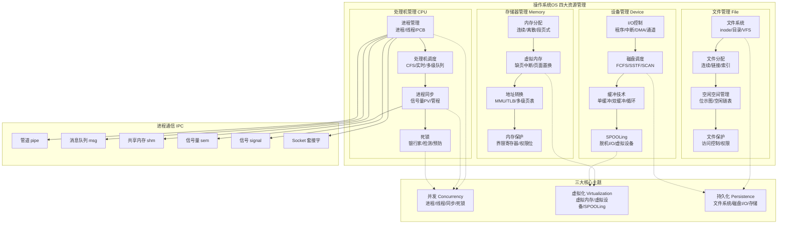

```mermaid
sequenceDiagram
    participant BIOS as BIOS/UEFI
    participant Boot as Bootloader
    participant Kernel as OS内核
    participant Shell as Shell进程
    participant Proc as 进程管理
    participant Sched as CFSScheduler
    participant Sync as 同步机制
    participant MMU as MMU/TLB
    participant PM as 物理内存
    participant PF as 缺页中断处理
    participant FS as 文件系统
    participant Disk as 磁盘IO调度
    participant IPC as 进程通信IPC
    participant Exit as 进程终止

    %% ===================== 阶段0：开机引导 =====================
    rect rgb(220, 230, 255)
    Note over BIOS,Kernel: "===== 阶段0：开机引导 Boot → Kernel Init ====="
    BIOS->>BIOS: "上电自检(POST)，检测CPU内存外设"
    Note over BIOS: "读取CMOS/SPD，确定启动设备顺序<br/>初始化中断向量表(IVT)"
    BIOS->>BIOS: "扫描启动设备，读取第0扇区(MBR)"
    Note over BIOS: "检查MBR签名 0x55AA<br/>有效则加载MBR到 0x7C00"
    BIOS->>Boot: "加载MBR到0x7C00，jmp 0x0000:0x7C00"
    Note over Boot: "Stage1(446B): 扫描分区表<br/>找到活动分区→加载VBR"
    Note over Boot: "Stage2: 实模式→保护模式<br/>设置GDT/IDT，开启A20地址线"
    Note over Boot: "加载内核映像(bzImage/vmlinuz)<br/>解析ELF头，设置启动参数"
    Boot->>Kernel: "跳转内核入口 start_kernel()"
    Note over Kernel: "start_kernel(): 初始化子系统<br/>内存管理/调度器/中断/时钟/驱动"
    Kernel->>Kernel: "创建init进程(PID=1)"
    Note over Kernel: "init进程是所有用户进程的祖先<br/>孤儿进程由init收养"
    Kernel->>Shell: "启动Shell(getty→login→shell)"
    Note over Shell: "Shell就绪，等待用户输入命令"
    end

    %% ===================== 阶段1：进程创建 =====================
    rect rgb(240, 248, 255)
    Note over Shell,Proc: "===== 阶段1：进程创建 fork+execve+COW ====="
    Note over Shell: "用户输入命令 ./a.out 回车"
    Shell->>Shell: "解析命令行参数<br/>判断是否为内置命令"
    Shell->>Proc: "fork()系统调用 (int 0x80/syscall)"
    Note over Proc: "进入内核态，sys_fork()"
    Proc->>Proc: "do_fork(): 分配新PID<br/>申请task_struct内存"
    Note over Proc: "task_struct结构体：<br/>PID/PPID/进程状态/优先级<br/>文件描述符表/内存描述符<br/>CPU上下文(寄存器快照)"
    Proc->>Proc: "copy_process(): 复制父进程资源"
    Note over Proc: "复制：task_struct/内核栈<br/>文件表引用计数+1<br/>信号处理设置继承"
    Note over Proc: "COW写时复制：<br/>父进程页表项设为只读<br/>子进程共享同一物理页<br/>实际写入时才真正复制"
    Proc-->>Shell: "子进程返回0"
    Shell->>Proc: "execve(path, argv, envp) 系统调用"
    Note over Proc: "sys_execve(): 加载ELF可执行文件<br/>1. 解析ELF头→获取入口地址<br/>2. 建立新用户态内存映射<br/>3. 建立VMA虚拟内存区域"
    Note over Proc: "VMA结构：<br/>代码段(text) VMA→只读可执行<br/>数据段(data) VMA→读写<br/>栈 VMA→读写，向下增长<br/>堆 VMA→读写，brk/sbrk"
    Note over Proc: "惰性分配物理页：<br/>建VMA时不立即分配物理页<br/>首次访问时缺页中断才分配"
    Proc->>Proc: "设置新进程入口地址→返回用户态"
    Note over Proc: "进程就绪，等待调度执行"
    end

    %% ===================== 阶段2：进程调度 =====================
    rect rgb(248, 240, 255)
    Note over Proc,Sched: "===== 阶段2：进程调度 CFS+vruntime ====="
    Proc->>Sched: "task_struct 入就绪队列"
    Note over Sched: "CFS完全公平调度：<br/>就绪队列用红黑树组织<br/>键值为vruntime虚拟运行时间"
    Note over Sched: "vruntime计算：<br/>vruntime = 实际运行时间 × (1024/nice_weight)<br/>nice值越小（优先级越高），nice_weight越大<br/>vruntime增长越慢，越容易被调度"
    Sched->>Sched: "scheduler_tick(): 时钟中断到来"
    Note over Sched: "每次tick：<br/>1. 更新当前进程vruntime<br/>2. 更新CPU负载统计<br/>3. 检查是否设置need_resched标志"
    Note over Sched: "need_resched触发条件：<br/>时间片耗尽 / 更高优先级进程就绪<br/>/ 当前进程被抢占"
    Sched->>Sched: "schedule() 主调度函数"
    Sched->>Sched: "pick_next_task(): 取红黑树最左节点"
    Note over Sched: "最左节点 = vruntime最小的进程<br/>保证公平性"
    Sched->>Sched: "context_switch(): 进程上下文切换"
    Note over Sched: "上下文切换步骤：<br/>1. switch_mm(): 切换虚拟地址空间<br/>   将新进程页表基址写入CR3<br/>2. switch_to(): 切换CPU寄存器<br/>   保存old进程的寄存器快照<br/>   恢复new进程的寄存器快照"
    Note over Sched: "进程状态转换：<br/>READY(就绪)→RUNNING(运行)<br/>RUNNING→WAITING(阻塞，等待I/O)<br/>RUNNING→READY(时间片用完)<br/>WAITING→READY(I/O完成)"
    Sched->>Proc: "新进程开始执行"
    Note over Proc: "进程A正在CPU上运行"
    end

    %% ===================== 阶段3：进程同步 =====================
    rect rgb(255, 248, 240)
    Note over Proc,Sync: "===== 阶段3：进程同步 信号量PV+管程 ====="
    Note over Proc: "进程A和进程B需要访问共享资源"
    Proc->>Sync: "进入临界区前：wait()/P操作"
    Note over Sync: "P操作(荷兰语Proberen尝试)：<br/>1. 关中断(单CPU)或自旋锁(多CPU)<br/>2. value-- (信号量值减1)<br/>3. 若 value < 0: 调用block()<br/>   将当前进程加入等待队列<br/>   设置进程状态为BLOCKED<br/>4. 开中断"
    Sync->>Proc: "P操作成功，进入临界区"
    Note over Proc: "进程A在临界区内执行"
    Note over Proc: "进程B尝试进入临界区→P操作→value<0→阻塞"
    Proc->>Sync: "离开临界区：signal()/V操作"
    Note over Sync: "V操作(荷兰语Verhogen增加)：<br/>1. 关中断<br/>2. value++<br/>3. 若 value <= 0: 调用wakeup()<br/>   从等待队列取出一个进程<br/>   设置状态为READY，加入就绪队列<br/>4. 开中断"
    Sync->>Proc: "唤醒进程B"
    Note over Sync: "管程(Monitor)：<br/>高级同步原语，封装共享变量+操作<br/>条件变量：wait()/signal()<br/>入口队列+条件等待队列"
    Note over Sync: "经典同步问题：<br/>生产者-消费者(buffer满/空)<br/>读者-写者(读共享/写互斥)<br/>哲学家进餐(防止死锁)"
    end

    %% ===================== 阶段4：死锁处理 =====================
    rect rgb(255, 245, 235)
    Note over Proc,Exit: "===== 阶段4：死锁处理 银行家算法+检测 ====="
    Note over Proc: "多个进程请求多种资源"
    Proc->>Proc: "进程请求资源R"
    Note over Proc: "银行家算法(死锁避免)：<br/>1. 试探性分配资源给进程<br/>2. 执行安全性检查算法"
    Note over Proc: "安全性检查步骤：<br/>1. Work = Available<br/>2. 找满足 Need[i] ≤ Work 的进程<br/>3. Work += Allocation[i]<br/>4. 重复直到所有进程都完成"
    Note over Proc: "若存在安全序列→分配资源<br/>若不存在安全序列→进程等待"
    Note over Proc: "死锁四个必要条件：<br/>1. 互斥条件<br/>2. 不可剥夺条件<br/>3. 请求并保持条件<br/>4. 循环等待条件"
    Note over Proc: "死锁检测：资源分配图<br/>若图中存在环→可能死锁<br/>(每类资源一个实例，环=死锁)"
    Note over Proc: "死锁预防：破坏四个必要条件之一<br/>破坏互斥→SPOOLing技术<br/>破坏不可剥夺→强制剥夺资源<br/>破坏请求并保持→一次性分配<br/>破坏循环等待→有序资源分配"
    end

    %% ===================== 阶段5：内存管理 =====================
    rect rgb(240, 255, 248)
    Note over Proc,MMU: "===== 阶段5：内存管理 段页式+TLB ====="
    Proc->>MMU: "程序访问虚拟地址 VA"
    Note over MMU: "段页式地址转换流程："
    Note over MMU: "虚拟地址结构：<br/>| 段号 | 页号 | 页内偏移 |"
    Note over MMU: "Step1: 段号→段表寄存器<br/>段表基址+段号×段表项大小<br/>→获取段描述符(段基址+段限长)"
    Note over MMU: "Step2: 段基址+页号→页表<br/>获取页表项(物理页框号+标志位)"
    Note over MMU: "Step3: 页框号×页大小+页内偏移<br/>→物理地址 PA"
    MMU->>TLB: "先查TLB快表"
    Note over TLB: "TLB是硬件Cache<br/>存储最近使用的页表项<br/>按虚拟页号VPN并行查找"
    Note over TLB: "TLB命中：直接获取物理页框号<br/>无需访问内存中的页表"
    Note over TLB: "TLB缺失：访问内存页表<br/>获取页表项后更新TLB"
    MMU->>PM: "物理地址→访问物理内存"
    Note over PM: "多级页表：<br/>页目录→页中间目录→页表→物理页<br/>节省页表内存，按需分配各级页表"
    Note over PM: "页表项标志位：<br/>P(存在位) R/W(读写) U/S(用户/内核)<br/>A(访问位) D(脏位)"
    end

    %% ===================== 阶段6：缺页中断与页面置换 =====================
    rect rgb(245, 245, 255)
    Note over Proc,PF: "===== 阶段6：缺页中断 页面置换算法 ====="
    Proc->>MMU: "访问未映射的虚拟地址"
    MMU->>MMU: "查页表，P位=0(页面不在内存)"
    MMU->>PF: "触发缺页中断(Page Fault)"
    Note over PF: "缺页中断处理流程："
    Note over PF: "1. 保存现场(寄存器压栈)<br/>2. 获取引发缺页的虚拟地址(CR2)<br/>3. 检查地址合法性(是否在VMA内)"
    PF->>PM: "检查是否有空闲物理帧"
    Note over PM: "有空闲帧：直接分配物理页<br/>从磁盘/文件读入页面内容"
    Note over PM: "无空闲帧：执行页面置换"
    PF->>PF: "选择页面置换算法"
    Note over PF: "FIFO(先进先出)：<br/>淘汰最早进入的页面<br/>存在Belady异常(页框增多缺页反而增多)"
    Note over PF: "LRU(最近最久未使用)：<br/>淘汰最长时间未访问的页面<br/>需要硬件支持(计数器/栈)"
    Note over PF: "CLOCK(NRU近似LRU)：<br/>循环扫描，检查访问位A<br/>A=0→淘汰；A=1→清0，继续扫描<br/>改进CLOCK：先找A=0 M=0，再找A=0 M=1"
    PF->>Disk: "若淘汰页为脏页(D=1)，写回磁盘"
    Note over Disk: "脏页写回：<br/>将页面内容写入交换区/文件<br/>更新磁盘映射信息"
    PF->>PM: "分配新物理帧，更新页表"
    Note over PF: "更新页表项：<br/>设置P=1，写入物理页框号<br/>清除D/A位"
    PF->>Proc: "iret返回，重新执行触发缺页的指令"
    Note over Proc: "缺页中断对用户透明<br/>进程感知不到缺页发生"
    end

    %% ===================== 阶段7：文件系统 =====================
    rect rgb(255, 240, 248)
    Note over Proc,FS: "===== 阶段7：文件系统 inode+路径解析 ====="
    Proc->>FS: "open('/home/user/file.txt', O_RDWR) 系统调用"
    Note over FS: "sys_open() 处理流程："
    Note over FS: "1. 路径解析：逐级目录项查找"
    Note over FS: "路径解析过程：<br/>'/'根目录→dentry查找'home'<br/>→'home' dentry→查找'user'<br/>→'user' dentry→查找'file.txt'"
    Note over FS: "2. 目录项(dentry)查找：<br/>在目录文件中查找文件名<br/>获取inode编号"
    Note over FS: "3. inode获取：<br/>根据inode号→磁盘inode表<br/>读取inode结构体"
    Note over FS: "inode结构体内容：<br/>文件类型权限/大小/时间戳<br/>链接计数/数据块指针<br/>不包含文件名(文件名在目录项中)"
    Note over FS: "4. 权限检查：<br/>进程UID/GID vs 文件权限<br/>读/写/执行权限逐位检查"
    FS->>Proc: "返回文件描述符fd=N"
    Note over Proc: "文件描述符表：<br/>fd→文件表项→inode<br/>记录当前文件偏移量"
    Proc->>FS: "read(fd, buf, size) / write(fd, buf, size)"
    Note over FS: "read/write处理：<br/>1. 根据fd找到文件表项<br/>2. 从文件偏移开始读/写<br/>3. 更新文件偏移量"
    Note over FS: "缓冲区缓存(Buffer Cache)：<br/>最近访问的磁盘块缓存在内存<br/>减少磁盘I/O次数"
    Note over FS: "磁盘块映射：<br/>多级索引(直接块+间接块)<br/>混合索引(Unix inode)：<br/>12个直接块+1个一级间接<br/>+1个二级间接+1个三级间接"
    FS->>Disk: "通过块映射找到磁盘块号，发起I/O"
    Note over FS: "VFS虚拟文件系统：<br/>统一接口，屏蔽底层文件系统差异<br/>支持ext4/xfs/ntfs等多种文件系统"
    end

    %% ===================== 阶段8：磁盘I/O调度 =====================
    rect rgb(235, 255, 245)
    Note over FS,Disk: "===== 阶段8：磁盘I/O调度 寻道+旋转 ====="
    FS->>Disk: "I/O请求入队列(磁道号+扇区号)"
    Note over Disk: "磁盘调度算法选择："
    Note over Disk: "FCFS(先来先服务)：<br/>按请求顺序服务<br/>寻道时间长，性能差"
    Note over Disk: "SSTF(最短寻道时间优先)：<br/>每次选离当前磁头最近的请求<br/>可能饥饿(远处请求长期得不到服务)"
    Note over Disk: "SCAN(电梯算法)：<br/>磁头单向移动，服务沿途请求<br/>到达最远端后反向移动<br/>两端请求等待时间较长"
    Note over Disk: "C-SCAN(循环扫描)：<br/>单向移动服务，到达最远端后<br/>快速返回起始端(不服务)<br/>各磁道等待时间更均匀"
    Note over Disk: "LOOK/C-LOOK：<br/>SCAN/C-SCAN的改进<br/>移动方向无请求时提前折返"
    Disk->>Disk: "磁盘访问时间计算："
    Note over Disk: "T_access = T_seek(寻道时间)<br/> + T_rotation(旋转延迟，平均半圈)<br/> + T_transfer(传输时间)"
    Note over Disk: "DMA传输：<br/>CPU设置DMA控制器参数<br/>DMA接管总线，直接内存→磁盘<br/>传输完成→DMA中断通知CPU"
    Disk->>Proc: "中断通知I/O完成"
    Note over Proc: "I/O完成后：<br/>等待进程被唤醒→加入就绪队列<br/>等待调度后继续执行"
    end

    %% ===================== 阶段9：进程通信IPC =====================
    rect rgb(255, 250, 235)
    Note over Proc,IPC: "===== 阶段9：进程通信IPC 六种方式 ====="
    Note over IPC: "管道(pipe)：<br/>pipe(fd)创建，fd[0]读/fd[1]写<br/>半双工，父子进程间使用<br/>无名管道(pipe)/有名管道(FIFO)"
    Proc->>IPC: "管道通信：write(fd[1], data, len)"
    IPC->>Proc: "read(fd[0], buf, len)"
    Note over IPC: "消息队列：<br/>msgsnd()发送/msgrcv()接收<br/>消息有类型，按类型接收<br/>异步通信，发送方无需等待"
    Note over IPC: "共享内存：<br/>shmget()创建/shmat()映射<br/>最快IPC方式，直接访问同一物理内存<br/>需配合信号量实现同步"
    Note over IPC: "信号量(Semaphore)：<br/>semop() P/V操作<br/>用于进程同步，而非数据传递<br/>System V信号量集"
    Note over IPC: "信号(Signal)：<br/>kill(pid, SIGKILL)发送信号<br/>接收方注册信号处理函数<br/>SIGKILL(9)不可捕获，SIGSTOP(19)不可忽略"
    Note over IPC: "Socket：<br/>socket()/bind()/listen()/accept()<br/>支持跨网络通信<br/>TCP(流式)/UDP(数据报)"
    Note over IPC: "IPC方式对比：<br/>速度：共享内存>管道>消息队列>Socket<br/>易用性：管道>消息队列>共享内存<br/>跨网络能力：Socket支持"
    end

    %% ===================== 阶段10：进程终止 =====================
    rect rgb(255, 235, 235)
    Note over Proc,Exit: "===== 阶段10：进程终止 exit+wait+僵尸孤儿 ====="
    Proc->>Exit: "exit(status) 系统调用"
    Note over Exit: "do_exit() 处理流程："
    Note over Exit: "1. 释放进程资源：<br/>关闭所有文件描述符<br/>释放内存映射(VMA)<br/>释放用户态页表"
    Note over Exit: "2. 设置进程状态：<br/>task_struct->state = EXIT_ZOMBIE<br/>保留task_struct和退出码<br/>其他资源已释放"
    Note over Exit: "3. 向父进程发送SIGCHLD信号"
    Exit->>Proc: "父进程收到SIGCHLD"
    Note over Proc: "父进程调用 wait()/waitpid()"
    Note over Proc: "wait() 处理：<br/>1. 查找子进程中的僵尸进程<br/>2. 获取子进程退出码(status)<br/>3. 释放子进程task_struct(PID回收)<br/>4. 返回终止子进程的PID"
    Note over Exit: "孤儿进程：<br/>父进程先于子进程终止<br/>子进程变为孤儿<br/>init进程(PID=1)收养孤儿进程<br/>init定期调用wait()回收孤儿"
    Note over Exit: "僵尸进程：<br/>子进程已终止，父进程未调用wait()<br/>task_struct保留，占用PID和少量内存<br/>大量僵尸进程耗尽PID资源"
    Note over Exit: "守护进程(Daemon)：<br/>fork()后父进程退出，子进程被init收养<br/>setsid()创建新会话，脱离终端<br/>chdir()/umask()等后续处理"
    end
```

# 可放大查看图片

# 操作系统全流程知识串联 · 详细图解版

以下严格对应上面 Mermaid 时序图，以**表格+结构化要点**为主，完整覆盖 11 个核心阶段的机制交互、数据结构与考研考点。

---

## 一、全流程阶段总览表

| 阶段 | 阶段名称           | 对应模块   | 核心机制 | 核心事件                            |
| ---- | ------------------ | ---------- | -------- | ----------------------------------- | --------------------------------------------- |
| 0    | 开机引导           | 系统启动   | #[C      | BIOS/POST/MBR/Bootloader/保护模式]  | 从加电到内核初始化，init 进程启动 Shell       |
| 1    | 进程创建           | 进程管理   | #[C      | fork/execve/COW/task_struct/VMA]    | Shell 解析命令，创建子进程加载 ELF 可执行文件 |
| 2    | 进程调度           | 处理机调度 | #[C      | CFS/vruntime/红黑树/context_switch] | 就绪队列管理，进程上下文切换，状态转换        |
| 3    | 进程同步           | 并发控制   | #[C      | 信号量 PV/管程/条件变量/临界区]     | 互斥访问共享资源，经典同步问题                |
| 4    | 死锁处理           | 死锁       | #[C      | 银行家算法/安全序列/资源分配图]     | 死锁避免/检测/预防/解除                       |
| 5    | 内存管理           | 存储器管理 | #[C      | 段页式/MMU/TLB/多级页表/CR3]        | 虚拟地址 → 物理地址转换，快表加速             |
| 6    | 缺页中断与页面置换 | 虚拟内存   | #[C      | 缺页中断/FIFO/LRU/CLOCK/改进 CLOCK] | 页面调入调出，Belady 异常，抖动               |
| 7    | 文件系统           | 文件管理   | #[C      | inode/dentry/路径解析/VFS/混合索引] | 文件打开/读写，目录查找，缓冲区缓存           |
| 8    | 磁盘 I/O 调度      | 设备管理   | #[C      | FCFS/SSTF/SCAN/C-SCAN/DMA]          | 磁盘寻道调度，中断通知，DMA 传输              |
| 9    | 进程通信 IPC       | 进程通信   | #[C      | 管道/消息队列/共享内存/信号/Socket] | 六种 IPC 方式对比，适用场景                   |
| 10   | 进程终止           | 进程管理   | #[C      | exit/do_exit/僵尸/孤儿/wait]        | 资源释放，父进程回收，init 收养孤儿           |

---

## 二、全景知识体系拓扑图

---

## 三、分阶段详细拆解（表格化呈现）

## 阶段 0：开机引导：BIOS→Bootloader→Kernel→Init

**核心目标**：从加电到操作系统内核初始化完成，启动第一个用户态进程 init

| 步骤 | 执行主体   | 核心动作                             | 关键数据结构/机制              | 考研考点                 |
| ---- | ---------- | ------------------------------------ | ------------------------------ | ------------------------ | ------------------------------------------ | --------------------------------- |
| 1    | BIOS/UEFI  | 上电自检 POST，检测 CPU/内存/外设    | CMOS 芯片存储硬件配置信息      | #[C                      | POST]是加电后第一个执行的程序              |
| 2    | BIOS       | 读取 CMOS 确定启动顺序，扫描启动设备 | 启动设备顺序由 BIOS 设置决定   | #[C                      | MBR]位于磁盘第 0 扇区，512 字节            |
| 3    | BIOS       | 读取第 0 扇区，检查 MBR 签名         | MBR 签名 #[Y                   | 0x55AA]                  | MBR 结构：446B 引导代码+64B 分区表+2B 签名 |
| 4    | BIOS       | 加载 MBR 到 #[Y                      | 0x7C00]，跳转执行              | jmp 0x0000:0x7C00        | #[C                                        | 0x7C00]是 x86 约定加载地址        |
| 5    | Bootloader | Stage1 扫描分区表，加载活动分区 VBR  | 分区表中找活动分区标志         | #[C                      | GRUB/LILO]是常见 Linux Bootloader          |
| 6    | Bootloader | Stage2 切换实模式 → 保护模式         | 设置 GDT/IDT，开启 A20 地址线  | #[C                      | 实模式]无保护，最大寻址 1MB；#[C           | 保护模式]支持 32 位寻址和内存保护 |
| 7    | Bootloader | 加载内核映像(bzImage/vmlinuz)        | 解析 ELF 头，设置启动参数      | #[C                      | ELF]可执行可链接格式                       |
| 8    | Kernel     | start_kernel()初始化各子系统         | 内存管理/调度器/中断/时钟/驱动 | #[C                      | start_kernel]是 Linux 内核初始化入口       |
| 9    | Kernel     | 创建 init 进程(PID=#[Y               | 1])                            | kernel_init()→init 进程  | #[C                                        | init 进程]是所有用户进程的祖先    |
| 10   | Kernel     | 启动 Shell(getty→login→shell)        | 执行/sbin/init→fork+exec       | Shell 就绪，等待用户输入 |

:::important
**重要考点**：MBR 位于磁盘第 0 扇区，共 512 字节（446B 引导代码+64B 分区表+2B 签名 0x55AA）。Bootloader 分为 Stage1（MBR 中）和 Stage2（磁盘上），Stage2 完成从实模式到保护模式的切换。init 进程 PID=1，是所有用户进程的祖先，负责收养孤儿进程。
:::

:::warning
**易错点**：BIOS 不是操作系统的一部分，是固化在 ROM 中的固件。MBR 签名是 0x55AA（小端序），不是 0xAA55。实模式和保护模式切换发生在 Bootloader 阶段，不是内核阶段。
:::

## 阶段 1：进程创建：fork+execve+COW 写时复制

**核心目标**：用户敲入命令后，Shell 创建子进程执行可执行文件

| 步骤 | 系统调用 | 核心动作                           | 关键数据结构              | 考研考点                                      |
| ---- | -------- | ---------------------------------- | ------------------------- | --------------------------------------------- | ----------------------------------------- |
| 1    | -        | Shell 解析命令行，判断是否内置命令 | 命令行参数 argc/argv      | 内置命令不创建子进程，直接执行                |
| 2    | fork()   | 陷入内核态，sys_fork()→do_fork()   | 分配新 PID 和 task_struct | #[C                                           | fork()]一次调用，两次返回                 |
| 3    | -        | copy_process()复制父进程资源       | task_struct/内核栈/文件表 | 子进程继承父进程的文件描述符表                |
| 4    | -        | COW 写时复制：页表项设为只读       | 共享同一物理页框架        | #[C                                           | COW]节省内存，只有实际写入才复制物理页    |
| 5    | fork()   | 子进程返回 0，父进程返回子进程 PID | 返回值区分父子进程        | 子进程 getpid()≠ 父进程，getppid()=父进程 PID |
| 6    | execve() | 加载 ELF 可执行文件，替换进程映像  | ELF 头解析 → 入口地址     | #[C                                           | execve]不创建新进程，替换当前进程地址空间 |
| 7    | -        | 建立 VMA 虚拟内存区域              | text/data/bss/stack/heap  | #[C                                           | VMA]描述进程的虚拟地址空间布局            |
| 8    | -        | 惰性分配物理页                     | 缺页中断时才真正分配      | 进程启动快，按需分配物理内存                  |

:::important
**重要考点**：fork()创建子进程，子进程是父进程的副本（COW 优化）。execve()替换进程映像，但不改变 PID。VMA 描述进程虚拟地址空间，分为代码段（只读可执行）、数据段（读写）、堆（向上增长）、栈（向下增长）。惰性分配：建 VMA 时不分配物理页，首次访问时缺页中断才分配。
:::

:::warning
**易错点**：fork()后父子进程的执行顺序不确定，取决于调度器。vfork()和 fork()的区别：vfork()父进程阻塞直到子进程调用 execve()或 exit()。execve()不会改变 PID 和文件描述符表（除非设置了 FD_CLOEXEC 标志）。
:::

## 阶段 2：进程调度：CFS 完全公平调度·vruntime·红黑树

**核心目标**：在多个就绪进程间公平分配 CPU 时间

| 步骤 | 函数/机制        | 核心动作                 | 关键数据结构                              | 考研考点                             |
| ---- | ---------------- | ------------------------ | ----------------------------------------- | ------------------------------------ | ----------------------------------- |
| 1    | -                | task_struct 加入就绪队列 | 红黑树（按 vruntime 排序）                | #[C                                  | CFS]使用红黑树而非传统运行队列      |
| 2    | -                | 计算 vruntime            | vruntime=实际运行时间 ×(1024/nice_weight) | #[C                                  | vruntime]是 CFS 调度决策的唯一依据  |
| 3    | scheduler_tick() | 时钟中断更新 vruntime    | 每次 tick 更新当前进程 vruntime           | 时钟中断频率由#[C                    | HZ]决定（通常 250/1000）            |
| 4    | -                | 检查 need_resched 标志   | 时间片耗尽/高优先级进程就绪               | #[C                                  | need_resched]触发重新调度           |
| 5    | schedule()       | 主调度函数入口           | 调用 pick_next_task()                     | #[C                                  | schedule()]是调度核心函数           |
| 6    | pick_next_task() | 取红黑树最左节点         | 最左节点=vruntime 最小的进程              | 红黑树查找复杂度 O(log n)            |
| 7    | context_switch() | 进程上下文切换           | switch_mm()+switch_to()                   | #[C                                  | 上下文切换]是纯开销，不产生有用工作 |
| 8    | switch_mm()      | 切换虚拟地址空间         | 将新进程页表基址写入 CR3                  | #[C                                  | CR3]寄存器指向当前进程的页目录基址  |
| 9    | switch_to()      | 切换 CPU 寄存器          | 保存/恢复寄存器快照                       | 包括通用寄存器、段寄存器、指令指针等 |

:::important
**重要考点**：CFS 使用红黑树组织就绪进程，键值为 vruntime。vruntime = 实际运行时间 × (1024 / nice_weight)，nice 值越小（优先级越高），vruntime 增长越慢，越容易被调度。context_switch 分为两步：switch_mm()切换地址空间（写 CR3），switch_to()切换寄存器上下文。进程状态转换：READY↔RUNNING↔WAITING，WAITING→READY（I/O 完成唤醒）。
:::

:::warning
**易错点**：CFS 没有传统意义上的"时间片"，而是根据权重动态计算。nice 值范围是-20 到+19（默认 0），nice 值越小优先级越高。线程切换不涉及 switch_mm()（同进程线程共享地址空间），开销更小。
:::

## 阶段 3：进程同步：信号量 PV 操作·管程·经典同步问题

**核心目标**：保证多个进程/线程安全访问共享资源

| 步骤 | 操作            | 核心动作                     | 关键数据结构               | 考研考点                       |
| ---- | --------------- | ---------------------------- | -------------------------- | ------------------------------ | -------------------------------- | -------------- |
| 1    | P 操作/wait()   | 进入临界区前执行             | 信号量：value+等待队列     | #[C                            | P 操作]（荷兰语 Proberen，尝试） |
| 2    | -               | 关中断或获取自旋锁           | 保证原子性                 | 单 CPU 关中断，多 CPU 用自旋锁 |
| 3    | -               | value--                      | 信号量减 1                 | #[C                            | 信号量]value 表示可用资源数      |
| 4    | -               | 若 value<0：block()挂起进程  | 加入等待队列，设置 BLOCKED | value<0 时，                   | value                            | 表示等待进程数 |
| 5    | -               | 开中断或释放自旋锁           | 恢复中断                   | 临界区执行期间保持关中断       |
| 6    | V 操作/signal() | 离开临界区后执行             | 唤醒等待进程               | #[C                            | V 操作]（荷兰语 Verhogen，增加） |
| 7    | -               | value++                      | 信号量加 1                 | 释放一个资源                   |
| 8    | -               | 若 value≤0：wakeup()唤醒进程 | 从等待队列取进程 →READY    | value≤0 表示还有进程在等待     |
| 9    | 管程            | 高级同步原语                 | 条件变量+入口队列          | #[C                            | 管程]封装共享变量和操作，更安全  |

:::important
**重要考点**：信号量 P/V 操作必须原子执行。经典同步问题三类：生产者-消费者（缓冲区满/空互斥）、读者-写者（读共享/写互斥/读写互斥，写者优先防饥饿）、哲学家进餐（5 个哲学家 5 根筷子，防止死锁的解法：最多 4 人同时拿筷子/奇数号先左后右/偶数号先右后左）。管程由编程语言支持，编译器保证互斥，比信号量更不易出错。
:::

:::warning
**易错点**：P 操作和 V 操作不能颠倒顺序。锁的粒度：粗粒度锁（简单但并发度低）vs 细粒度锁（并发度高但复杂）。自旋锁忙等待，不适合长时间持有；信号量睡眠等待，适合长时间持有。
:::

## 阶段 4：死锁处理：银行家算法·死锁检测·死锁预防

**核心目标**：处理并发系统中多个进程因竞争资源而陷入死锁的问题

| 步骤 | 机制       | 核心动作                     | 关键数据结构                                        | 考研考点                    |
| ---- | ---------- | ---------------------------- | --------------------------------------------------- | --------------------------- | --------------------------------- |
| 1    | -          | 死锁四个必要条件             | 互斥/不可剥夺/请求保持/循环等待                     | 四个条件同时满足才可能死锁  |
| 2    | 死锁预防   | 破坏四个必要条件之一         | 资源有序分配/SPOOLing                               | #[C                         | 死锁预防]是静态策略，设备利用率低 |
| 3    | 银行家算法 | 进程请求资源时进行安全性检查 | Available/Max/Allocation/Need 矩阵                  | #[C                         | 银行家算法]是死锁避免的经典算法   |
| 4    | -          | 试探性分配资源               | 假设分配后更新各矩阵                                | 不是真实分配，仅做检查      |
| 5    | -          | 执行安全性算法               | Work=Available，找 Need≤Work 的进程                 | 若能找到安全序列 → 可以分配 |
| 6    | -          | 安全序列存在 → 分配          | 不存在安全序列 → 进程等待                           | #[C                         | 安全状态]一定不会死锁             |
| 7    | 死锁检测   | 资源分配图                   | 有向图：进程 → 资源（请求边）/资源 → 进程（分配边） | 每类资源一个实例：环=死锁   |
| 8    | 死锁解除   | 剥夺资源/撤销进程/回滚       | 选择代价最小的方案                                  | #[C                         | 鸵鸟算法]：忽视死锁，多数 OS 采用 |

:::important
**重要考点**：死锁四个必要条件缺一不可。银行家算法核心是安全性检查：找满足 Need[i]≤Work 的进程，将其 Allocation 加到 Work，重复直到所有进程完成。若能找到安全序列，则为安全状态，可以分配。死锁检测频率：定期检测或进程请求资源被拒绝时检测。死锁预防破坏条件的代价：破坏互斥（SPOOLing）→ 某些设备不适用；破坏不可剥夺 → 增加系统开销；破坏请求保持 → 资源利用率低；破坏循环等待 → 资源有序分配法。
:::

:::warning
**易错点**：死锁预防和死锁避免的区别：预防是破坏必要条件（静态），避免是运行时判断（动态，银行家算法）。安全状态一定不死锁，但不安全状态不一定死锁（只是可能）。银行家算法要求进程声明最大资源需求，实际系统中进程难以预知。
:::

## 阶段 5：内存管理：段页式地址转换·TLB·多级页表

**核心目标**：将进程的虚拟地址转换为物理地址，实现地址空间隔离

| 步骤 | 硬件/机制 | 核心动作                            | 关键数据结构                  | 考研考点                             |
| ---- | --------- | ----------------------------------- | ----------------------------- | ------------------------------------ | -------------------------------------- |
| 1    | MMU       | 接收虚拟地址 VA                     | 段号+页号+页内偏移            | #[C                                  | MMU]是硬件地址转换单元                 |
| 2    | 段表      | 段号 → 段表寄存器 → 段描述符        | 段基址+段限长+访问权限        | 段号位数决定最多段数                 |
| 3    | 页表      | 段基址+页号 → 页表项                | 物理页框号+标志位(P/RW/US/AD) | 页内偏移位数决定页面大小             |
| 4    | -         | 页框号 × 页大小+页内偏移 → 物理地址 | 物理地址 PA                   | 段页式综合了分段和分页的优点         |
| 5    | TLB       | 先查 TLB 快表                       | 硬件 Cache，按 VPN 并行查找   | #[C                                  | TLB]命中率通常>99%                     |
| 6    | -         | TLB 命中 → 直接得到物理页框号       | 无需访问内存页表              | TLB 由 SRAM 实现，速度快             |
| 7    | -         | TLB 缺失 → 访存查页表 → 更新 TLB    | CR3→ 页目录 → 页表 → 物理页   | 多级页表：页目录 → 页中间目录 → 页表 |
| 8    | CR3       | 存储当前进程页目录基址              | 进程切换时更新 CR3            | #[C                                  | CR3]切换导致 TLB 刷新（除非使用 PCID） |

:::important
**重要考点**：段页式虚拟地址 = 段号 + 页号 + 页内偏移。先查段表得段基址，段基址+页号查页表得物理页框号，页框号 × 页面大小+页内偏移=物理地址。TLB（Translation Lookaside Buffer）是硬件快表，存储最近使用的页表项，命中时无需访问内存。多级页表按需分配各级页表，节省内存。页表项标志位：P（存在位）、R/W（读写）、U/S（用户/内核）、A（访问位）、D（脏位）。
:::

:::warning
**易错点**：段页式是先分段再分页，不是先分页再分段。TLB 命中并不意味着页一定在内存中（TLB 可能包含无效项）。CR3 切换会导致 TLB 刷新（硬件不支持 PCID 时），是上下文切换开销的重要来源。大页（Huge Page）可以减少 TLB 缺失，提高性能。
:::

## 阶段 6：缺页中断与页面置换：FIFO/LRU/CLOCK/改进 CLOCK

**核心目标**：当访问的页面不在物理内存中时，从磁盘调入页面并可能淘汰旧页面

| 步骤 | 机制       | 核心动作                        | 关键数据结构                    | 考研考点                   |
| ---- | ---------- | ------------------------------- | ------------------------------- | -------------------------- | -------------------------- |
| 1    | MMU        | 访问虚拟地址，查页表 P=0        | 页表项存在位为 0                | #[C                        | 缺页中断]（Page Fault）    |
| 2    | CPU        | 触发缺页中断异常                | 保存现场，获取 CR2 中的缺页地址 | CR2 存储引发缺页的虚拟地址 |
| 3    | 缺页处理   | 检查地址合法性（是否在 VMA 内） | VMA 链表/红黑树                 | 非法地址 → 段错误 SIGSEGV  |
| 4    | -          | 检查是否有空闲物理帧            | 空闲帧链表/位示图               | 有空闲帧 → 直接分配        |
| 5    | FIFO       | 淘汰最早进入的页面              | 队列结构                        | #[C                        | FIFO]存在 Belady 异常      |
| 6    | LRU        | 淘汰最久未访问的页面            | 计数器/栈                       | #[C                        | LRU]最优近似，但硬件开销大 |
| 7    | CLOCK      | 循环扫描，检查访问位 A          | 循环链表+访问位                 | #[C                        | CLOCK]（NRU）是 LRU 的近似 |
| 8    | 改进 CLOCK | 先找 A=0 M=0，再找 A=0 M=1      | 访问位 A+修改位 M               | 减少脏页写回次数，提高性能 |
| 9    | -          | 脏页写回磁盘                    | 修改位 M=1 的页面需写回         | #[C                        | 脏页]写回增加置换开销      |
| 10   | -          | 更新页表，iret 返回             | 设置 P=1，写入物理页框号        | 重新执行触发缺页的指令     |

:::important
**重要考点**：OPT（最佳置换）是理论最优，实际不可实现，作为比较基准。FIFO 简单但存在 Belady 异常（分配更多页框反而缺页率更高）。LRU 是栈算法，不会出现 Belady 异常。CLOCK 算法（NRU，Not Recently Used）：循环扫描，A=0 则淘汰，A=1 则清 0 继续扫描。改进 CLOCK 增加修改位 M：第一轮找(A=0, M=0)，第二轮找(A=0, M=1)，第三轮回到第一轮。抖动（Thrashing）：进程频繁缺页，CPU 利用率急剧下降。工作集模型：进程当前需要的页面集合，物理页框数应大于工作集大小。
:::

:::warning
**易错点**：Belady 异常只发生在 FIFO 算法中，LRU 和 CLOCK 是栈算法不会出现。改进 CLOCK 的查找顺序不能错：先找(0,0)再找(0,1)，因为(0,0)淘汰代价最小（无需写回）。缺页率 = 缺页次数 / 总访问次数。页面大小选择：太小 → 页表大/缺页多，太大 → 内部碎片/换入换出慢。
:::

## 阶段 7：文件系统：inode·路径解析·VFS·混合索引

**核心目标**：实现文件的持久化存储和高效访问

| 步骤 | 系统调用       | 核心动作                 | 关键数据结构                     | 考研考点                     |
| ---- | -------------- | ------------------------ | -------------------------------- | ---------------------------- | -------------------------------- |
| 1    | open()         | 路径解析：逐级目录项查找 | dentry→inode 编号                | #[C                          | 路径解析]分为绝对路径和相对路径  |
| 2    | -              | 目录项查找               | 目录文件内容（文件名 →inode 号） | #[C                          | dentry]是目录项缓存，加速查找    |
| 3    | -              | inode 获取               | 磁盘 inode 表 →inode 结构体      | #[C                          | inode]含元数据，不含文件名       |
| 4    | -              | 权限检查                 | UID/GID vs 文件权限位            | rwx 三组：所有者/所属组/其他 |
| 5    | open()         | 返回文件描述符 fd        | 文件描述符表 → 文件表项 →inode   | #[C                          | fd]是进程级的小整数索引          |
| 6    | read()/write() | 读/写文件数据            | 更新文件偏移量                   | 文件偏移量存储在文件表项中   |
| 7    | -              | 缓冲区缓存               | 缓存最近访问的磁盘块             | #[C                          | Buffer Cache]减少磁盘 I/O        |
| 8    | -              | 磁盘块映射               | 直接块+间接块                    | #[C                          | 混合索引]：Unix inode 的多级索引 |
| 9    | close()        | 释放文件描述符           | 递减引用计数                     | 引用计数为 0 才真正释放      |

:::important
**重要考点**：inode 结构含：文件类型权限、大小、时间戳（atime/mtime/ctime）、链接计数、数据块指针（12 个直接块+1 个一级间接+1 个二级间接+1 个三级间接）。文件名存储在目录项中，不在 inode 中。硬链接：多个目录项指向同一 inode，链接计数+1，删除文件=链接计数-1=0 才释放。软链接（符号链接）：单独文件，存储目标路径。VFS（虚拟文件系统）：统一接口层，屏蔽底层文件系统差异。文件分配方式：连续分配（顺序访问快/外部碎片）、链接分配（无碎片/随机访问慢）、索引分配（Unix 采用，混合索引）。
:::

:::warning
**易错点**：inode 不包含文件名，文件名存在于目录项中。硬链接不能跨文件系统（inode 编号只在同一文件系统内唯一），软链接可以。硬链接不能链接目录（防止循环）。open()返回的 fd 是最小可用的非负整数。文件描述符表是进程级的，文件表项是系统级的，多个 fd 可以指向同一文件表项（dup）。
:::

## 阶段 8：磁盘 I/O 调度：FCFS/SSTF/SCAN/C-SCAN/DMA

**核心目标**：优化磁盘访问顺序，减少寻道时间，提高 I/O 吞吐量

| 步骤 | 算法   | 核心动作                    | 关键参数                              | 考研考点           |
| ---- | ------ | --------------------------- | ------------------------------------- | ------------------ | ----------------------------- |
| 1    | -      | I/O 请求入队列              | 磁道号+扇区号                         | 请求按到达顺序入队 |
| 2    | FCFS   | 先来先服务，按请求顺序      | 按到达顺序服务                        | #[C                | FCFS]公平但寻道时间最长       |
| 3    | SSTF   | 最短寻道时间优先            | 选离当前磁头最近的请求                | #[C                | SSTF]吞吐量高，但可能饥饿     |
| 4    | SCAN   | 电梯算法，单向移动服务      | 到达一端后反向移动                    | #[C                | SCAN]解决了饥饿问题           |
| 5    | C-SCAN | 循环扫描，单向服务          | 到达最远端快速返回                    | #[C                | C-SCAN]各磁道等待时间更均匀   |
| 6    | LOOK   | SCAN 改进，无请求时提前折返 | 减少不必要的移动                      | #[C                | LOOK]比 SCAN 更高效           |
| 7    | -      | 磁盘访问时间计算            | T_access=T_seek+T_rotation+T_transfer | #[C                | 访问时间]是磁盘性能的核心指标 |
| 8    | DMA    | DMA 控制器接管总线传输      | 设置 DMA 参数 → 传输 → 中断通知       | #[C                | DMA]解放 CPU，实现并行        |

:::important
**重要考点**：磁盘访问时间 = 寻道时间（T_seek，最耗时）+ 旋转延迟（T_rotation，平均半圈）+ 传输时间（T_transfer，最小）。寻道时间是磁盘性能瓶颈，调度算法主要优化寻道时间。DMA 控制方式：CPU 设置 DMA 控制器（源地址、目的地址、传输长度），DMA 接管总线进行数据传输，完成后通过中断通知 CPU。I/O 控制方式演进：程序直接控制 → 中断驱动 →DMA→ 通道。SPOOLing（假脱机）：将独占设备虚拟为共享设备，如打印机 SPOOLing 系统。
:::

:::warning
**易错点**：SSTF 可能导致饥饿（远处请求长期得不到服务）。SCAN 对两端请求服务较差（刚扫过的请求等待时间长）。C-SCAN 消除饥饿但磁头复位有开销。磁盘调度算法主要优化寻道时间，不是旋转延迟或传输时间。固态硬盘（SSD）无需寻道，传统磁盘调度算法不适用。
:::

## 阶段 9：进程通信 IPC：管道·消息队列·共享内存·信号·Socket

**核心目标**：实现进程间的数据交换和同步

| 方式        | 系统调用                  | 核心特性                   | 优缺点                   | 考研考点 |
| ----------- | ------------------------- | -------------------------- | ------------------------ | -------- | ---------------------------------------- | ---------------------------- |
| 管道 pipe   | pipe(fd)/read/write       | 半双工，父子进程间，字节流 | 简单易用，但只能单向通信 | #[C      | 无名管道]用于父子进程；#[C               | 有名管道 FIFO]可用于任意进程 |
| 消息队列    | msgget/msgsnd/msgrcv      | 消息有类型，按类型接收     | 异步通信，发送方无需等待 | #[C      | 消息队列]消息有边界，不是字节流          |
| 共享内存    | shmget/shmat/shmdt        | 多个进程映射同一物理页     | 最快 IPC，但需同步配合   | #[C      | 共享内存]是最快的 IPC 方式（无内核拷贝） |
| 信号量      | semget/semop              | P/V 操作，用于同步         | 不传递数据，只用于同步   | #[C      | 信号量]是同步工具，不是通信工具          |
| 信号 Signal | kill/signal/sigaction     | 异步通知机制               | 信息量少，只能发信号编号 | #[C      | SIGKILL(9)]不可捕获，#[C                 | SIGSTOP(19)]不可忽略         |
| Socket      | socket/bind/listen/accept | 支持跨网络通信             | 通用性强，但开销大       | #[C      | Socket]可跨主机，TCP/UDP 两种模式        |

:::important
**重要考点**：IPC 速度排序：共享内存 > 管道 > 消息队列 > Socket。共享内存最快因为数据不经过内核缓冲区拷贝。管道是半双工的，双向通信需要两个管道。消息队列消息有边界，读一条消息后自动删除。信号是异步通知，SIGKILL(9)和 SIGSTOP(19)不能被捕获或忽略。Socket 支持 TCP（流式可靠）和 UDP（数据报不可靠），支持跨网络通信。
:::

:::warning
**易错点**：管道（pipe）是半双工的，不是全双工。共享内存需要配合信号量实现同步，否则会出现竞态条件。信号处理函数应尽量简单（可重入），避免在信号处理函数中调用非异步信号安全的函数。消息队列和管道的区别：消息队列按消息边界读取，管道按字节流读取。
:::

## 阶段 10：进程终止：exit·僵尸·孤儿·wait·守护进程

**核心目标**：进程正常终止，父进程回收子进程资源

| 步骤 | 系统调用/函数    | 核心动作                  | 关键数据结构                         | 考研考点                         |
| ---- | ---------------- | ------------------------- | ------------------------------------ | -------------------------------- | --------------------------------- |
| 1    | exit(status)     | 进程调用 exit()终止自身   | 退出码 status                        | #[C                              | exit()]不返回，直接终止进程       |
| 2    | do_exit()        | 释放进程资源              | 关闭文件描述符/释放内存              | 释放大部分资源，保留 task_struct |
| 3    | -                | 设置状态为 EXIT_ZOMBIE    | task_struct->state = EXIT_ZOMBIE     | #[C                              | 僵尸进程]：已终止但 PCB 未被回收  |
| 4    | -                | 向父进程发送 SIGCHLD      | 父进程收到子进程退出信号             | SIGCHLD 默认处理是忽略           |
| 5    | wait()/waitpid() | 父进程回收子进程          | 获取退出码，释放 task_struct         | #[C                              | wait()]阻塞等待任意子进程终止     |
| 6    | -                | 释放子进程 PCB            | 回收 PID，释放 task_struct           | 若不回收 → 僵尸进程，占用 PID    |
| 7    | -                | 父进程先死 → 子进程变孤儿 | init 进程收养孤儿进程                | #[C                              | 孤儿进程]由 init(PID=1)收养并回收 |
| 8    | -                | 守护进程创建              | fork→ 父进程退出 →setsid()→ 脱离终端 | #[C                              | 守护进程]在后台运行，无控制终端   |

:::important
**重要考点**：进程终止三阶段：exit()→do_exit()释放资源 → 父进程 wait()回收 PCB。僵尸进程：子进程已终止但父进程未调用 wait()回收，task_struct 保留，占用 PID 和少量内存。大量僵尸进程耗尽 PID 资源。孤儿进程：父进程先于子进程终止，子进程变孤儿，由 init 进程收养并定期调用 wait()回收。守护进程创建步骤：fork()→ 父进程 exit→ 子进程 setsid()创建新会话 →chdir("/")→umask(0)→ 关闭不需要的文件描述符。
:::

:::warning
**易错点**：僵尸进程无法被 kill 杀死（已经终止），只能通过父进程 wait()回收或终止父进程（让 init 收养）。孤儿进程不是问题（init 会回收），僵尸进程才是问题。exit()和\_exit()的区别：exit()会清理标准 I/O 缓冲区（调用 atexit 注册的函数），\_exit()直接进入内核不清理。wait()和 waitpid()的区别：waitpid()可以指定等待特定子进程，支持非阻塞模式（WNOHANG）。
:::

---

## 四、考研 408 核心考点速查表

| 知识模块 | 核心考点    | 分值趋势                                            | 重点掌握 |
| -------- | ----------- | --------------------------------------------------- | -------- | ------------------------------------------ |
| #[C      | 进程管理]   | 进程状态转换、PCB、fork/exec/wait、线程 vs 进程     | 高       | 进程三态/五态/七态模型转换图               |
| #[C      | 处理机调度] | CFS、vruntime、实时调度、多级队列、调度算法对比     | 高       | CFS 红黑树、周转时间/等待时间/响应时间计算 |
| #[C      | 进程同步]   | 信号量 P/V、管程、经典同步问题、临界区互斥实现      | 最高     | 生产者-消费者/读者-写者/哲学家进餐 PV 操作 |
| #[C      | 死锁]       | 必要条件、银行家算法、死锁检测/预防/避免/解除       | 高       | 银行家算法安全性检查手算                   |
| #[C      | 内存管理]   | 分段/分页/段页式、虚拟内存、TLB、多级页表、缺页中断 | 最高     | 地址转换计算、页表大小计算、TLB 命中率     |
| #[C      | 页面置换]   | OPT/FIFO/LRU/CLOCK/改进 CLOCK、Belady 异常、抖动    | 高       | 页面置换算法缺页次数手算                   |
| #[C      | 文件系统]   | inode、目录结构、文件分配方式、空闲空间管理、VFS    | 高       | Unix 混合索引最大文件大小计算              |
| #[C      | I/O 管理]   | 磁盘调度、I/O 控制方式、SPOOLing、缓冲区            | 中       | 磁盘访问时间计算、SCAN/C-SCAN 寻道序列     |
| #[C      | 进程通信]   | 管道/消息队列/共享内存/信号量/信号/Socket           | 中       | 六种 IPC 方式特点对比                      |
| #[C      | 系统启动]   | BIOS/MBR/Bootloader/实模式保护模式/init 进程        | 低       | MBR 结构、启动流程顺序                     |

:::note
**补充说明**：以上考点覆盖 408 操作系统科目全部核心内容，分值占比约 30~35 分（150 分总分）。进程同步 PV 操作和内存管理地址转换是计算题高频考点，建议重点练习手算。文件系统 inode 混合索引计算也是常考题型。调度算法（周转时间等）和页面置换算法（缺页次数）同样需要熟练掌握。
:::
