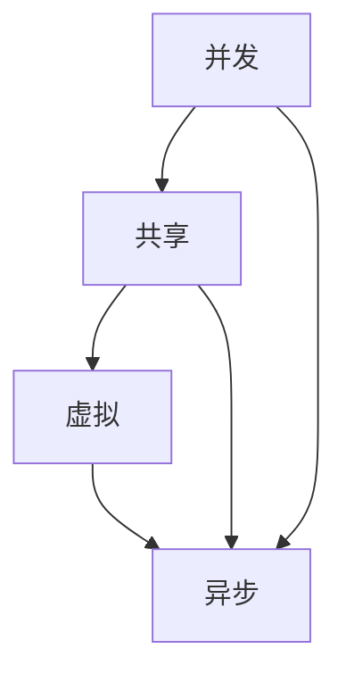
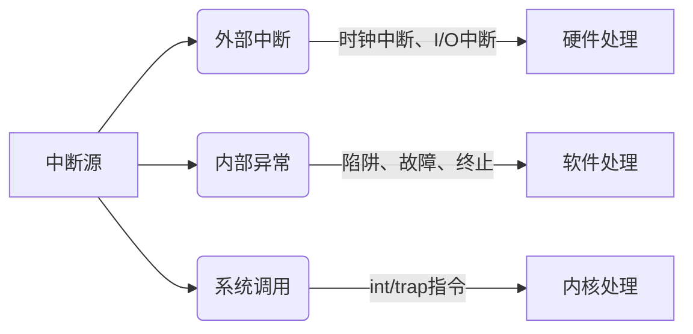
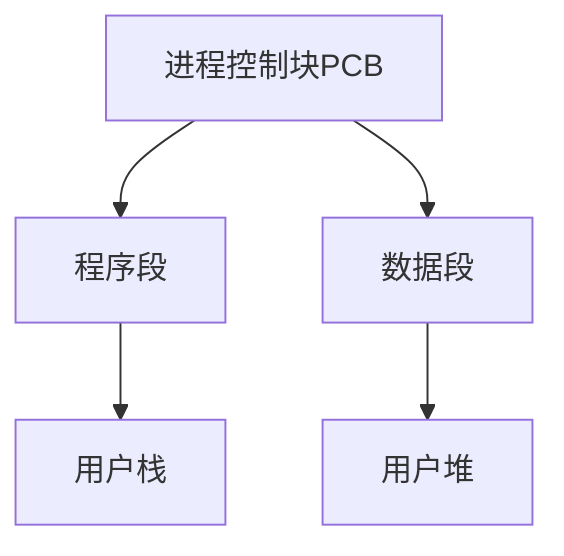
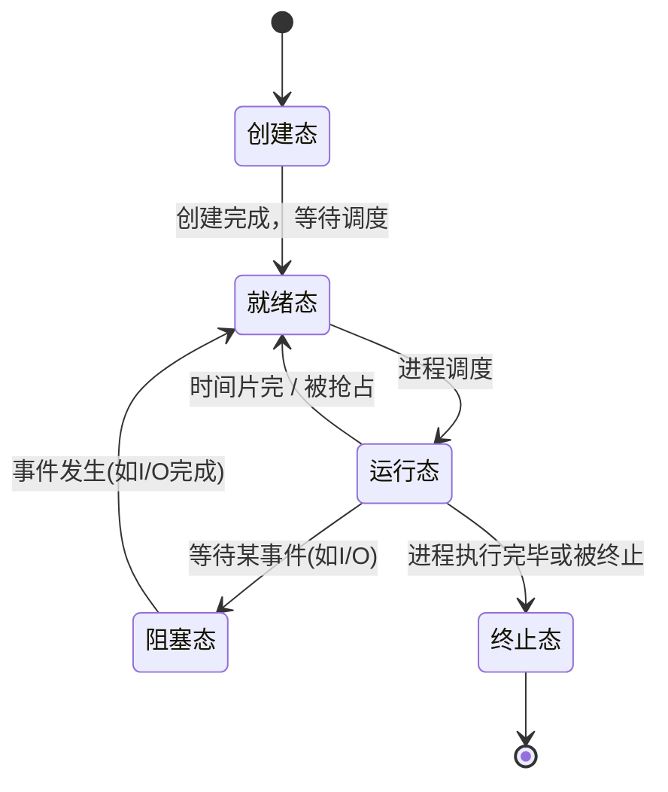
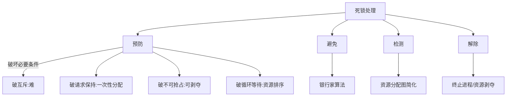
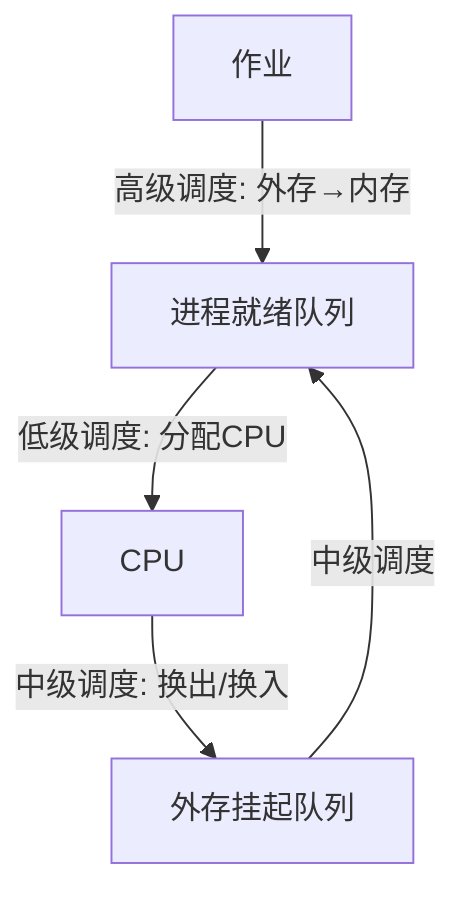
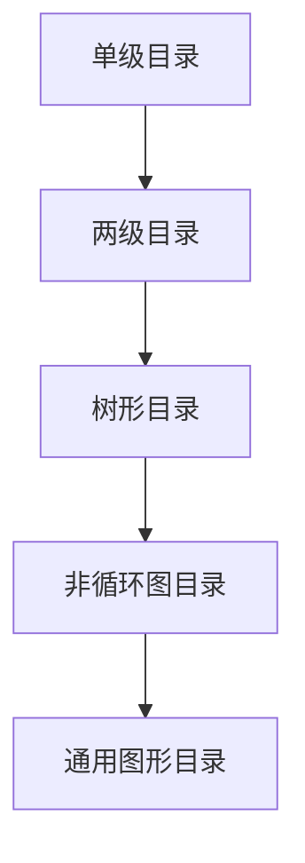
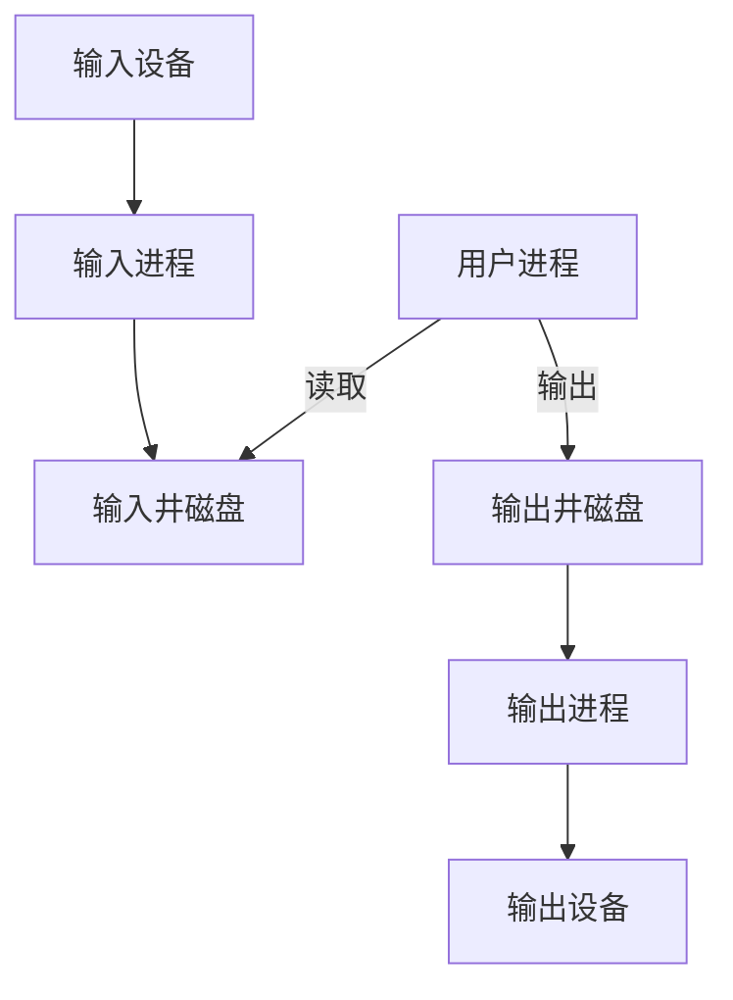

# 操作系统 · 考研核心知识点详解

## 一、操作系统概述

### 1.1 操作系统的定义与目标
操作系统是控制和管理计算机系统内各种硬件和软件资源、合理地组织计算机工作流程、方便用户使用计算机的程序集合。

**主要目标：**
- **有效性**：提高系统资源利用率，提高系统吞吐量
- **方便性**：提供用户接口，屏蔽硬件细节
- **可扩充性**：采用模块化结构，便于添加新功能
- **开放性**：遵循国际标准，兼容不同硬件

### 1.2 操作系统的作用
1. **用户与硬件之间的接口**（命令接口、程序接口、图形接口）
2. **系统资源管理者**（处理机、存储器、I/O设备、文件）
3. **虚拟机**：在裸机上扩展，提供功能更强、使用更方便的抽象计算机

### 1.3 操作系统的基本特征


- **并发**：两个或多个事件在同一时间间隔内发生（宏观并行，微观串行）
- **共享**：系统中的资源可被多个并发进程共同使用
  - 互斥共享（如打印机）
  - 同时共享（如磁盘）
- **虚拟**：通过某种技术将一个物理实体变为若干个逻辑上的对应物
  - 时分复用（处理机）
  - 空分复用（存储器）
- **异步**：进程以不可预知的速度向前推进

### 1.4 中断与异常


**中断处理过程**：
1. 关中断
2. 保存断点
3. 转入中断处理程序
4. 保存现场和屏蔽字
5. 开中断
6. 执行中断服务程序
7. 关中断
8. 恢复现场和屏蔽字
9. 开中断
10. 返回断点

### 1.5 系统调用
系统调用是用户程序获得操作系统服务的唯一接口。常用系统调用：
- 进程控制类：fork, exec, exit, wait
- 文件操作类：open, read, write, close
- 通信类：pipe, shmget, msgget
- 信息维护类：getpid, alarm, sleep

---

## 二、进程管理

### 2.1 进程的定义与组成
进程是程序在一个数据集合上的一次运行活动，是系统进行资源分配和调度的独立单位。

**进程映像组成**：


### 2.2 进程的状态与转换


在某些系统中还有**挂起态**（静止就绪、静止阻塞），通过挂起操作将进程映像换出到外存。

### 2.3 进程控制块(PCB)
PCB是进程存在的唯一标志，包含以下信息：

| 信息类别 | 主要内容 |
|----------|----------|
| 进程标识符 | PID、父进程PID、用户标识符 |
| 处理机状态 | 通用寄存器、指令计数器、程序状态字PSW |
| 进程调度 | 进程状态、优先级、等待原因、时间片 |
| 内存管理 | 基址/限长寄存器、页表指针 |
| I/O状态 | 打开文件表、设备请求队列 |
| 会计信息 | CPU时间、实际使用量、账号 |

### 2.4 进程通信
**低级通信**：信号量等传递少量信息  
**高级通信**：
- **共享存储**：进程共享内存区域，直接读写
- **管道通信**：半双工，父子进程或兄弟进程间
- **消息传递**：send/receive 原语，可分为直接和间接通信

### 2.5 线程
线程是进程内的一条执行路径，是处理机调度的基本单位。

**线程与进程对比**：

| 维度 | 进程 | 线程 |
|------|------|------|
| 调度 | 资源拥有单位 | CPU调度基本单位 |
| 并发性 | 不同进程间 | 同进程内线程间 |
| 拥有资源 | 内存、文件等 | 仅必要私有资源（栈、寄存器） |
| 系统开销 | 创建、切换开销大 | 开销小 |
| 地址空间 | 独立 | 共享同一进程空间 |

**线程模型**：
- 用户级线程（ULT）：线程库管理，内核不知道，切换快但阻塞会影响整个进程
- 内核级线程（KLT）：内核管理，切换慢但阻塞不影响其他线程
- 组合方式：多对一、一对一、多对多

### 2.6 进程同步与互斥
**临界资源**：一次仅允许一个进程使用的资源。  
**临界区**：进程中访问临界资源的那段代码。

**同步机制应遵循的原则**：
- 空闲让进
- 忙则等待
- 有限等待（避免饥饿）
- 让权等待（无法进入时应释放CPU）

**软件方法**：
- 单标志法、双标志法、双标志后检查、Peterson算法

**硬件方法**：
- 关中断（单CPU）
- Test-and-Set 指令
- Swap 指令

### 2.7 信号量机制
**整型信号量**：仅能通过P/V操作访问。
```c
wait(S) { while(S<=0); S--; }
signal(S) { S++; }
```

**记录型信号量**（解决“忙等”）：
```c
typedef struct {
    int value;          // 资源数目
    struct process *L;  // 等待队列
} semaphore;

void wait(semaphore S) {
    S.value--;
    if (S.value < 0) {
        block(S.L);     // 调用阻塞原语，放弃CPU
    }
}

void signal(semaphore S) {
    S.value++;
    if (S.value <= 0) {
        wakeup(S.L);    // 唤醒第一个等待进程
    }
}
```

**AND型信号量**：一次同时申请多个资源，全部分配或全不分配，避免死锁。

### 2.8 经典同步问题
**生产者-消费者**：
```c
semaphore mutex=1, empty=n, full=0;
producer() {
    produce item;
    wait(empty);
    wait(mutex);
    add item to buffer;
    signal(mutex);
    signal(full);
}
consumer() {
    wait(full);
    wait(mutex);
    remove item from buffer;
    signal(mutex);
    signal(empty);
    consume item;
}
```

**读者-写者**：
- 读者优先：只要读者在读，写者等待，可能造成写者饥饿
- 写者优先：有写者申请时后续读者等待
- 公平竞争：按到达顺序

**哲学家进餐**：5支筷子，避免死锁解法——最多4人同时拿左边、奇数先左偶先右等。

### 2.9 管程
管程由一组共享数据结构及操作这些结构的过程组成，实现进程同步。
- 管程内的共享变量只能由管程内的过程访问
- 进程通过调用管程过程进入管程
- 每次仅允许一个进程在管程内执行

**条件变量**：`wait()` 和 `signal()` 操作，与信号量不同：
- `wait()` 必定阻塞当前进程
- `signal()` 如果没有等待进程则无效（无累积）

### 2.10 死锁
**死锁定义**：多个进程因竞争资源而造成的一种僵局，若无外力作用，这些进程都将无法向前推进。

**产生原因**：
- 竞争不可剥夺资源
- 进程推进顺序非法

**必要条件**（4个缺一不可）：
1. 互斥条件
2. 请求和保持条件
3. 不可抢占条件
4. 循环等待条件

**处理死锁的方法**：



**银行家算法数据结构**：
- 可利用资源向量 $Available$
- 最大需求矩阵 $Max$
- 分配矩阵 $Allocation$
- 需求矩阵 $Need = Max - Allocation$

**安全性算法**：
1. 设置工作向量 $Work = Available$，完成向量 $Finish = false$
2. 找到一个满足 $Finish[i]=false$ 且 $Need_i \le Work$ 的进程
3. 若找到，$Work = Work + Allocation_i$，$Finish[i]=true$，重复2
4. 若所有进程 $Finish[i]=true$，则系统处于安全状态

**死锁检测**：
- 资源分配图无环 $\implies$ 无死锁
- 有环不一定死锁（看每类资源实例数）

**死锁解除**：
- 剥夺资源：暂停某些进程
- 撤销进程：终止所有死锁进程或逐个终止

### 2.11 处理机调度
**调度层次**：


**调度算法性能指标**：
- 周转时间 $T =$ 完成时间 $-$ 到达时间
- 带权周转时间 $W = T / 服务时间$
- 平均周转时间、平均带权周转时间
- 响应时间：从提交请求到首次响应的时间

**调度算法详解**：

| 算法 | 抢占 | 决策条件 | 特点 |
|------|------|------|------|
| FCFS | 非 | 按到达顺序 | 长作业友好，短作业可能长时间等待 |
| SJF/SPF | 均可 | 最短预计运行时间 | 平均等待时间最小，难以精确预知 |
| 优先级调度 | 均可 | 优先级 | 可能产生饥饿，通过老化解决 |
| 时间片轮转(RR) | 是 | 固定时间片 | 响应快，时间片选择影响大 |
| 多级队列 | 非/是 | 不同队列不同算法 | 进程固定队列 |
| 多级反馈队列(MLFQ) | 是 | 动态调整优先级 | 综合性能最优 |

**时间片轮转的考量**：
- 时间片过大→退化为FCFS
- 时间片过小→频繁上下文切换，效率低
- 通常选择略大于典型交互时间（如100ms）

**多级反馈队列规则**：
1. 新进程进入最高优先级队列
2. 用完时间片降级，I/O等待后升级
3. 低优先级队列时间片更长
4. 定期提升所有进程优先级（防止饥饿）

---

## 三、内存管理

### 3.1 基本概念
- **物理地址**：内存单元的实际地址
- **逻辑地址**：CPU生成的地址，程序中使用
- **地址绑定**：逻辑地址到物理地址的映射，可在编译、加载或运行时进行
- **重定位**：将逻辑地址转换为物理地址

### 3.2 连续分配方式
**单一连续分配**：内存分为系统区和用户区，仅能单道程序，简单但浪费内存。

**固定分区分配**：内存划分为固定大小分区，每个分区装入一个进程。产生**内部碎片**。

**动态分区分配**：根据进程实际需要动态分配内存，产生**外部碎片**。

**动态分区分配算法**：
- **首次适应(FF)**：按地址递增，找到第一个足够大的分区
- **最佳适应(BF)**：按容量递增，找最小能满足的分区（产生最多小碎片）
- **最差适应(WF)**：按容量递减，找最大分区（碎片较均匀）
- **邻近适应(NF)**：从上一次分配位置开始查找

**碎片整理**：
- 紧凑（拼接）：移动内存中的进程，将空闲区合并
- 动态重定位寄存器支持

### 3.3 离散分配方式

#### 3.3.1 分页存储管理
将进程的逻辑地址空间和内存物理空间都划分为大小相等的**页/块**。

**逻辑地址结构**：
$$ \text{逻辑地址} = \overbrace{\text{页号 } P}^{p\text{ 位}} \mid \overbrace{\text{页内偏移 } d}^{d\text{ 位}} $$
- 页大小 $= 2^d$，页号占 $p$ 位
- 地址空间最大页数 $= 2^p$

**页表**：每个进程一张，记录每页对应的物理块号。
```
页表基址寄存器(PTBR) ──→ 页表(内存) ──→ 物理块号 ──→ 物理地址
```

**地址变换过程**（MMU 硬件支持）：


**快表(TLB)**：
- 高速缓存，存放最近使用的页表项
- 先查TLB，若命中则快速转换；否则访存查页表

**有效访问时间(EAT)**：
$$ EAT = \alpha \times (T_{TLB} + T_m) + (1-\alpha) \times (T_{TLB} + 2T_m) $$
其中 $\alpha$ 为TLB命中率，$T_m$ 为内存访问时间。

**多级页表**：
- 将页表本身分页，建立页表目录
- 例如两级页表：外层页表 + 内层页表
- 逻辑地址：外层页号 $P_1$ + 内层页号 $P_2$ + 页内偏移 $d$
- 好处：不必连续存放页表，节省内存

**反置页表**：
- 整个系统一张页表，按物理块索引
- 每个表项（块号，进程ID，页号）
- 查找时需遍历，可用哈希加速

#### 3.3.2 分段存储管理
按用户程序逻辑划分段，段内连续，段间不连续。

**逻辑地址结构**：
$$ \text{逻辑地址} = \overbrace{\text{段号 } S}^{s\text{ 位}} \mid \overbrace{\text{段内偏移 } W}^{w\text{ 位}} $$

**段表**：每段对应一个段表项（段基址 + 段长）。
- 地址变换：段表基址寄存器 + 段号 → 段基址，物理地址 = 段基址 + 段内偏移
- 越界检查：段内偏移 < 段长

**分段与分页对比**：

| 维度 | 分页 | 分段 |
|------|------|------|
| 划分依据 | 固定大小，物理决定 | 不定长，逻辑决定 |
| 地址维度 | 一维（页号+偏移） | 二维（段号+偏移） |
| 用户可见性 | 不可见 | 可见 |
| 优缺点 | 无外碎片，有内碎片 | 有外碎片，无内碎片 |
| 共享保护 | 不易 | 容易 |

#### 3.3.3 段页式存储管理
结合分段和分页，逻辑上分段，物理上分页。

**逻辑地址结构**：
$$ \text{逻辑地址} = \text{段号 } S \mid \text{段内页号 } P \mid \text{页内偏移 } d $$

**地址变换**：
1. 段表寄存器获得段表基址
2. 段号S → 段表项：获得该段的页表基址
3. 页号P → 页表：获得物理块号
4. 物理地址 = 块号 × 页大小 + 页内偏移

三次访存（查段表、页表、数据），可用快表加速。

### 3.4 虚拟内存管理

#### 3.4.1 虚拟内存概念
**局部性原理**：
- **时间局部性**：最近访问的指令/数据不久会再访问（循环）
- **空间局部性**：访问某单元，邻近单元可能很快访问（顺序执行）

**虚拟内存特征**：
- 离散分配：进程不必全部在内存
- 部分装入：仅当前需要的部分装入内存
- 多次对换：可将暂时不用的部分换出到外存
- 虚拟存储：逻辑地址空间 > 物理内存

#### 3.4.2 请求分页存储管理
在分页基础上增加**请求调页**和**页面置换**功能。

**页表项扩展**：
| 页号 | 物理块号 | 状态位P | 访问字段A | 修改位M | 外存地址 |
|------|----------|---------|-----------|---------|----------|
|      |          | 在内存? | 访问次数/时间 | 是否修改过 | 换出时的目标 |

**缺页中断**：
- 当访问的页不在内存（状态位=0）时产生缺页中断
- 处理过程：
  1. 保护CPU现场
  2. 分析中断原因（缺页）
  3. 转入缺页中断处理程序
  4. 查找外存中所需页面的位置
  5. 若内存有空闲块，分配之；否则选一页换出
  6. 若换出页已被修改，写回外存
  7. 将所需页读入内存，更新页表
  8. 恢复CPU现场，重新执行被中断指令

**有效访问时间(EAT)**：
$$ EAT = (1-p) \times T_m + p \times (T_{page fault} + T_m) $$
其中 $p$ 为缺页率，$T_{page fault}$ 为缺页处理时间。

#### 3.4.3 页面置换算法
目标：最小化缺页率。

**最佳置换算法(OPT)**：
- 淘汰将来最长时间不再使用的页面
- 理论最优，但无法实现（需预知未来）

**先进先出(FIFO)**：
- 淘汰最早进入内存的页面
- 可能出现**Belady异常**（分配的物理块增多，缺页率反而升高）

**最近最久未使用(LRU)**：
- 淘汰最近最长时间未使用的页面
- 接近OPT，实现开销大（栈、寄存器）

**时钟算法(Clock/NRU)**：
- 为每页设访问位，循环扫描
- 若访问位=1，置0；若=0，淘汰
- 改进型Clock增加修改位，优先淘汰未修改页

**其他**：
- 最不常用(LFU)：基于访问频率
- 页面缓冲算法：维护空闲缓冲池，降低抖动

**Belady异常示例**：
物理块数：3 → 缺页次数9次，4块 → 10次（FIFO）

#### 3.4.4 页面分配策略
**固定分配**：进程生命周期内保持物理块数不变  
**可变分配**：根据运行情况动态增减

**置换范围**：
- **局部置换**：进程缺页时只能从自己的物理块中选择淘汰
- **全局置换**：可从所有进程的空闲块或整个系统选择淘汰

**三种策略组合**：
- 固定分配局部置换
- 可变分配全局置换
- 可变分配局部置换（根据缺页率调整）

#### 3.4.5 抖动与工作集
**抖动(Thrashing)**：
- 进程频繁换页，大部分时间用于处理缺页而非执行
- 原因：进程分配的物理块数小于最小要求数量
- 表现：CPU利用率急剧下降，系统吞吐量骤降

**工作集模型**：
- 工作集 $W(t, \Delta)$：在过去 $\Delta$ 时间间隔内进程访问的页面集合
- 若工作集大小 > 分配给进程的物理块数，可能引发抖动
- 预防：跟踪缺页率，检测工作集大小

**预防抖动的方法**：
- 局部置换策略
- 引入工作集算法
- 挂起若干进程（减少多道程序度）

#### 3.4.6 请求分段/段页式虚拟存储
- 请求分段：段表增加状态位、访问位、修改位、增补位、外存始址
- 缺段中断：类似缺页，但段大小不一，可能需紧凑或拼接
- 段页式虚拟存储：同样需要请求调页和置换机制

---

## 四、文件管理

### 4.1 文件系统基础
**文件**：具有符号名的一组相关信息的集合，是文件系统的基本单位。

**文件属性**：名称、类型、大小、位置、保护信息、时间日期。

**文件操作**：创建、删除、打开、关闭、读、写、定位、截断。

**文件逻辑结构**：
- **流式文件**：无结构，按字节序列（如UNIX）
- **记录式文件**：由记录组成，可定长或变长

**文件存取方法**：
- 顺序存取
- 直接存取（随机存取）
- 索引存取（按键存取）

### 4.2 目录结构
**目录**：记录文件名到物理地址映射的数据结构。

**目录组织方式**：


- **单级目录**：所有文件在同一个目录，命名冲突
- **两级目录**：主文件目录(MFD) + 用户文件目录(UFD)，分离用户
- **树形目录**：多级层次，路径名（绝对/相对）
- **非循环图目录**：允许共享，不能有环
- **通用图形目录**：允许文件共享和链接，需要垃圾回收

### 4.3 文件共享与保护
**共享方式**：
- 基于索引节点（硬链接）：多个目录项指向同一个索引节点
- 基于符号链接（软链接）：特殊文件存放另一文件的路径名

**文件保护**：
- 存取控制矩阵
- 存取控制表
- 用户权限表
- 口令
- 加密

### 4.4 文件实现
**文件分配方式**：

| 分配方式 | 原理 | 优点 | 缺点 |
|----------|------|------|------|
| 连续分配 | 文件占据连续磁盘块 | 实现简单，顺序访问快 | 外碎片，文件不能动态增长 |
| 隐式链接 | 每块存放下一块指针 | 无外碎片 | 随机访问慢，可靠性低 |
| 显式链接(FAT) | 文件分配表集中存放链指针 | 随机访问改善，FAT可缓存 | FAT占用空间，大磁盘FAT巨大 |
| 索引分配 | 每个文件有索引块存放所有块号 | 支持直接访问，无外碎片 | 索引块开销，大文件多级索引 |

**多级索引**：
- 直接块：存放数据块的块号
- 一次间接块：指向索引块的块号
- 二次间接、三次间接...

**UNIX混合索引**：
- 12个直接地址项
- 1个一次间接地址
- 1个二次间接地址
- 1个三次间接地址

**空闲空间管理**：
- **空闲表法**：连续空闲区组成表
- **空闲链表法**：所有空闲块链接
- **位示图法**：每位代表一个块，1表示已分配，0空闲
  $$ \text{块号} = (i \times \text{字长}) + j $$
- **成组链接法**：UNIX使用，结合空闲表和链表优点

### 4.5 磁盘调度
**磁盘访问时间**：
$$ T_{access} = T_{seek} + T_{rotation} + T_{transfer} $$
- 寻道时间 $T_{seek}$：磁头移动到指定磁道的时间，占比最大
- 旋转延迟 $T_{rotation}$：扇区旋转到磁头下的时间，平均为半圈时间
- 传输时间 $T_{transfer}$：数据读写的时间

**磁盘调度算法**：


- **FCFS**：先来先服务，公平但性能差
- **SSTF**：最短寻道时间优先，可能饥饿
- **SCAN(电梯算法)**：磁头单方向移动，访问沿途请求，到端点反向
- **C-SCAN**：单向移动，到端点直接返回起点（不服务），等待时间更均匀
- **LOOK**：改进的SCAN，不到达端点，遇到最外/内请求即反向
- **C-LOOK**：改进的C-SCAN，同样不到端点

**提高磁盘I/O速度**：
- 提前读取
- 延迟写入
- 优化物理块分布
- 虚拟盘（RAM盘）

---

## 五、I/O管理

### 5.1 I/O硬件
**I/O设备分类**：
- 按传输速率：低速（键盘）、中速（打印机）、高速（磁盘）
- 按信息交换单位：块设备、字符设备
- 按共享属性：独占设备、共享设备、虚拟设备

**设备控制器**：CPU与设备之间的接口，完成设备控制功能。

**I/O地址**：
- I/O独立编址：专用I/O指令
- 内存映射I/O：I/O端口与内存统一编址

### 5.2 I/O控制方式
**控制方式演进**：


**程序直接控制**：
- CPU不断查询设备状态寄存器（轮询）
- CPU与I/O设备串行工作，效率极低

**中断驱动方式**：
- CPU发出命令后继续执行
- 设备完成时发中断，CPU响应处理
- 数据每次传输仍需CPU干预（每字节/字中断）

**DMA方式**：
- DMA控制器直接在内存和设备间传送数据块
- 仅在块开始和结束时中断CPU
- 需占用总线（周期窃取或突发模式）

**I/O通道方式**：
- 通道是专用处理机，可执行通道程序
- 完成一组I/O操作，更独立于CPU

### 5.3 缓冲区技术
**引入缓冲区目的**：
- 缓和CPU与I/O速度不匹配矛盾
- 减少对CPU的中断频率
- 提高CPU和I/O并行性

**单缓冲**：
- 处理时间 $= \max(C, T) + M$，其中C为CPU处理，T为设备输入，M为数据复制时间

**双缓冲**：
- 两块缓冲区交替使用，设备可以连续输入
- 处理时间 $\approx \max(C, T)$

**循环缓冲**：
- 多块缓冲区循环使用，类似生产者-消费者

**缓冲池**：
- 系统统一管理多种缓冲区
- 三种队列：空缓冲区队列、输入队列、输出队列
- 操作：收容输入、提取输入、收容输出、提取输出

### 5.4 设备分配
**设备分配数据结构**：
- 设备控制表(DCT)
- 控制器控制表(COCT)
- 通道控制表(CHCT)
- 系统设备表(SDT)

**分配策略**：
- 先来先服务
- 优先级高者优先

**虚拟设备与SPOOLing**：


**SPOOLing系统组成**：
- 输入井和输出井（磁盘区域）
- 输入进程和输出进程
- 井管理程序

**特点**：
- 提高了I/O速度（磁盘代替低速外设）
- 将独占设备改造为共享设备
- 实现了虚拟设备功能

### 5.5 设备处理程序
即设备驱动程序，负责：
- 设备初始化
- 启动设备操作
- 处理设备中断
- 上层接口封装

**中断处理程序**：
- 唤醒等待进程
- 处理错误
- 启动下一个I/O请求

---

> **全书总结**：操作系统围绕处理机管理、存储器管理、文件管理、设备管理四大资源管理展开，进程管理是核心，内存管理承上启下。掌握各模块基本概念、算法原理和计算方法（如调度周转时间、页面置换缺页率、磁盘寻道时间等），配合真题练习，可应对考研要求。