# 操作系统 · 考研核心知识点详解

> 以下内容严格覆盖考研大纲所有核心知识点，每个模块均配备详细 Mermaid 图表，格式参照协议流程图标准。
> 所有流程图均标注核心字段、状态流转与关键机制，末尾附综合实战工作流串联全部知识点。

---

## 全流程综合实战工作流：从开机到程序运行

以下时序图以 **用户在 Shell 中敲入 `./a.out` 并回车** 为起点，串联 **进程创建 → 调度 → 同步 → 内存分配 → TLB 地址转换 → 页面置换 → 磁盘 I/O → 文件系统 → 设备 I/O → 进程通信 → 死锁避免 → 进程终止** 全链路。覆盖 OS 四大资源管理模块（处理机、存储器、文件、设备）以及并发、虚拟化、持久化三大核心主题。

图中每一阶段都标注了内部数据结构、关键函数、状态转换与考研核心考点，各阶段之间通过 OS 机制自然衔接，体现"知识点的关联性"而非孤立记忆。

```mermaid
sequenceDiagram
    participant BIOS as BIOS/UEFI
    participant Boot as Bootloader
    participant Kernel as OS内核
    participant PCB as 进程控制块
    participant Sched as 调度器
    participant Sync as 同步机制
    participant MMU as 内存管理单元
    participant TLB as TLB快表
    participant PM as 物理内存
    participant Disk as 磁盘驱动
    participant FS as 文件系统
    participant IODev as I/O设备
    participant IPC as 进程通信
    participant Banker as 银行家(死锁避免)

    rect rgba(220, 230, 255, 0.4)
    Note over BIOS,Boot: ===== 阶段0：开机引导（BIOS→Bootloader→Kernel） =====
    BIOS->>BIOS: 上电自检(POST)，检测CPU/内存/外设
    Note over BIOS: 读取CMOS/SPD芯片<br/>确定启动设备顺序<br/>初始化中断向量表(IVT)
    BIOS->>BIOS: 扫描启动设备，读取第0扇区
    Note over BIOS: 检查MBR签名 0x55AA<br/>若有效，加载MBR到0x7C00
    BIOS->>Boot: 加载MBR到0x7C00<br/>jmp 0x0000:0x7C00 移交控制权
    Note over Boot: Stage1(446B): 扫描分区表<br/>找到活动分区→加载Stage1.5/VBR
    Note over Boot: Stage2: 实模式→保护模式<br/>设置GDT/IDT，开启A20地址线<br/>加载内核映像(bzImage/vmlinuz)
    Note over Boot: 解析ELF头/Setup Header<br/>设置内核启动参数(命令行)
    Boot->>Kernel: 跳转到内核入口<br/>start_kernel() / kernel_init()
    Note over Kernel: 内核初始化流程：<br/>1. setup_arch(): 架构相关初始化<br/>2. trap_init(): 初始化IDT<br/>3. mm_init(): 初始化内存管理<br/>   (buddy system + slab分配器)<br/>4. sched_init(): 初始化调度器<br/>5. rest_init(): 创建init进程(PID=1)<br/>   → 挂载根文件系统<br/>   → 启动/sbin/init或systemd<br/>6. cpu_startup_entry(): 进入idle循环
    Note over Kernel: 用户态初始化：<br/>getty→login→Shell(bash/zsh)<br/>Shell显示提示符，等待用户输入
    end

    rect rgba(240, 248, 255, 0.4)
    Note over Kernel,PCB: ===== 阶段1：进程创建（fork + exec + COW） =====
    Kernel->>Kernel: Shell解析命令 "./a.out"
    Note over Kernel: Shell内部处理：<br/>1. 词法分析→解析命令和参数<br/>2. 检查是否为内置命令<br/>3. 搜索PATH找到可执行文件<br/>4. 确定用fork+exec策略
    Kernel->>Kernel: fork() 系统调用 (int 0x80 / syscall)
    Note over Kernel: 陷入内核态，do_fork()流程：<br/>1. 分配新PID(alloc_pid)<br/>2. 分配task_struct+内核栈<br/>3. copy_process()复制父进程：<br/>   - 复制task_struct大部分字段<br/>   - 复制文件描述符表(files_struct)<br/>   - 复制信号处理表(sighand_struct)<br/>   - 复制内存描述符(mm_struct)<br/>4. 复制页表，全部标记为只读<br/>   PTE中设置COW标志位<br/>   父子进程共享同一物理页<br/>5. 子进程返回0，父进程返回子PID
    Kernel->>PCB: 创建子进程PCB<br/>PID=1001, 状态=TASK_RUNNING<br/>tgid=1001, 调度策略=SCHED_NORMAL
    Kernel-->>Kernel: iret/sysret返回用户态<br/>父进程得到子PID=1001
    Note over Kernel: 子进程被唤醒，从fork返回<br/>返回值=0，因此进入if(pid==0)
    Note over Kernel: 子进程执行 execve("./a.out")
    Kernel->>Kernel: execve() 系统调用 → do_execve()
    Note over Kernel: 加载ELF可执行文件：<br/>1. open_exec() 打开文件<br/>2. 读取ELF头(前128字节)<br/>   验证魔数 0x7F 'E' 'L' 'F'<br/>3. 解析Program Header Table<br/>   遍历每个PT_LOAD段<br/>4. 为每个LOAD段分配VMA：<br/>   .text(代码段) → VM_READ|VM_EXEC<br/>   .rodata(只读数据) → VM_READ<br/>   .data(已初始化数据) → VM_READ|VM_WRITE<br/>   .bss(未初始化) → VM_READ|VM_WRITE<br/>   stack(栈) → VM_READ|VM_WRITE|VM_GROWSDOWN<br/>   heap(堆) → VM_READ|VM_WRITE<br/>5. 设置mm_struct.start_code/end_code等<br/>6. 设置PC=EIP=ELF入口地址(e_entry)<br/>7. flush_old_exec()释放旧进程映像
    Note over Kernel: 此时仅建立VMA映射<br/>物理页尚未分配（惰性分配）<br/>COW技术：exec后父子页表已分离
    end

    rect rgba(248, 240, 255, 0.4)
    Note over Kernel,Sched: ===== 阶段2：进程调度（CFS + 上下文切换） =====
    Note over PCB: 子进程PCB已插入就绪队列<br/>sched_class->enqueue_task()<br/>CFS: 插入红黑树(cfs_rq)
    Note over PCB: task_struct关键字段：<br/>prio=120(动态优先级)<br/>static_prio=120(nice=0)<br/>vruntime=0(新进程初始值)<br/>policy=SCHED_NORMAL
    Note over Sched: 时钟中断触发<br/>tick_periodic()→update_process_times()
    Sched->>Sched: scheduler_tick()→update_curr()
    Note over Sched: update_curr()更新vruntime：<br/>delta_exec = now - exec_start<br/>vruntime += delta_exec × (1024/weight)<br/>nice值对应权重：<br/>  nice=-20 → weight=88761<br/>  nice=0   → weight=1024<br/>  nice=19  → weight=15
    Note over Sched: 检查是否需要抢占：<br/>若vruntime - cfs_rq.min_vruntime > 粒度<br/>则设置need_resched标志
    Note over Sched: 返回用户态前检查TIF_NEED_RESCHED<br/>若置位，调用schedule()
    Sched->>Sched: schedule() → __schedule()
    Note over Sched: CFS调度器pick_next_task()：<br/>1. 从红黑树取最左节点<br/>   (vruntime最小进程)<br/>2. 将其从cfs_rq中移除<br/>3. 若红黑树为空→调度idle进程
    Note over Sched: 若无其他进程，选择idle进程<br/>设置cfs_rq->curr = idle
    Sched->>Kernel: context_switch() 上下文切换
    Note over Kernel: 上下文切换详细步骤：<br/>1. prepare_task_switch():<br/>   保存FPU/SIMD状态<br/>2. switch_mm():<br/>   加载新进程pgd到CR3<br/>   若CR3改变→需要刷新TLB<br/>3. switch_to(): 汇编实现<br/>   保存当前进程寄存器到内核栈<br/>   RIP/RSP/RBP/RBX/R12-R15<br/>   加载新进程的寄存器值<br/>   切换内核栈指针
    Note over Kernel: 进程状态转换：<br/>当前进程：运行态(TASK_RUNNING)<br/>→ 就绪态(TASK_RUNNING)<br/>新进程：就绪态→运行态<br/>注：Linux中运行和就绪统一为TASK_RUNNING
    end

    rect rgba(255, 248, 240, 0.4)
    Note over Kernel,Sync: ===== 阶段3：进程同步（信号量P/V操作 + 管程） =====
    Note over Kernel: 程序执行到临界区代码<br/>需访问共享数据结构
    Note over Kernel: 临界资源：一次仅允许一个进程使用<br/>如：共享内存区、全局计数器、文件
    Kernel->>Sync: wait(semaphore) P操作
    Note over Sync: 记录型信号量P操作原子执行：<br/>1. 关中断/自旋锁保护<br/>2. S.value--  (先减后判断)<br/>3. if S.value < 0:<br/>    调用block()原语<br/>    当前进程→阻塞态<br/>    加入S.L等待队列(FIFO)<br/>    调用schedule()放弃CPU<br/>4. 否则进程继续执行<br/>5. 开中断/释放自旋锁
    Note over Sync: 为什么先减后判断？<br/>value<0表示有进程等待<br/>|value| = 等待进程数<br/>若value=-3，表示3个进程在等待
    Note over Kernel: 进程获取信号量成功<br/>进入临界区(CS)，执行关键代码<br/>临界区执行原则：<br/>1. 尽量短小<br/>2. 不能阻塞(否则死锁)<br/>3. 必须配对P/V操作
    Note over Kernel: 离开临界区
    Kernel->>Sync: signal(semaphore) V操作
    Note over Sync: 记录型信号量V操作原子执行：<br/>1. 关中断/自旋锁保护<br/>2. S.value++<br/>3. if S.value <= 0:<br/>    调用wakeup()原语<br/>    从S.L取第一个等待进程<br/>    阻塞态→就绪态<br/>    插入就绪队列<br/>4. 开中断/释放自旋锁
    Note over Sync: 注：value<=0(不是<0)才唤醒<br/>因为value++后若=0<br/>说明之前value=-1(有等待者)
    end

    rect rgba(255, 240, 245, 0.4)
    Note over Kernel,MMU: ===== 阶段4：内存分配（malloc→brk→缺页） =====
    Note over Kernel: 程序执行 malloc(4096)
    Note over Kernel: glibc malloc实现：<br/>1. 检查空闲链表(fastbin/smallbin)<br/>2. 若不足→调用brk()或mmap()<br/>3. 小内存(<128KB)用brk扩展堆<br/>4. 大内存用mmap映射匿名页
    Kernel->>Kernel: brk() 系统调用 → sys_brk()
    Note over Kernel: brk()扩展堆区：<br/>1. 检查新brk地址是否合法<br/>   (不超出stack，不与其他VMA重叠)<br/>2. 更新mm->brk = new_brk<br/>3. 分配/扩展堆VMA<br/>   vm_start=旧brk, vm_end=新brk<br/>   vm_flags=VM_READ|VM_WRITE|VM_GROWSDOWN<br/>4. 此时仅分配虚拟地址空间<br/>   VMA记录在mm_struct的红黑树中<br/>   物理页延迟分配(惰性分配/On-Demand Paging)
    Note over Kernel: 惰性分配优点：<br/>1. 减少物理内存浪费<br/>2. 加快fork()速度<br/>3. 支持overcommit
    Kernel->>MMU: CPU首次访问新分配的堆地址
    Note over MMU: MMU查页表过程：<br/>1. 从CR3获取PGD基址<br/>2. 逐级查页表(四级)<br/>3. 发现PTE的P位=0 → 缺页！
    MMU->>Kernel: 触发缺页中断(14号异常)
    Note over Kernel: do_page_fault()处理流程：<br/>1. 读取CR2(引发缺页的线性地址)<br/>2. 检查地址是否在VMA范围内<br/>   find_vma() 搜索红黑树<br/>3. 检查访问权限：<br/>   P=0 → 真正的缺页(合法)<br/>   P=1但W=0且写访问 → COW缺页<br/>   P=1但权限不符 → SIGSEGV<br/>4. 若合法→handle_mm_fault()<br/>5. 分配物理页(伙伴系统alloc_page)<br/>6. 填充PTE：PFN|P=1|W=1|U=1<br/>7. 清零页内容(ZERO_PAGE)<br/>8. 若地址非法→发送SIGSEGV
    Note over Kernel: 返回用户态，重新执行<br/>引发缺页的那条指令
    end

    rect rgba(240, 255, 248, 0.4)
    Note over Kernel,TLB: ===== 阶段5：TLB地址转换（快表+多级页表遍历） =====
    Note over Kernel: 程序再次访问malloc分配的内存<br/>生成逻辑地址A=0x7F...1000
    Kernel->>TLB: CPU发出逻辑地址A<br/>提取VPN(虚拟页号)=A>>12
    Note over TLB: TLB是CPU内部的高速缓存<br/>全相联映射，并行查找所有表项<br/>Tag = VPN | ASID | 有效位
    Note over TLB: TLB表项结构：<br/>VPN(虚拟页号) | ASID(地址空间ID) | PPN(物理帧号) | 权限位 | 有效位
    alt TLB命中(TLB Hit)
        TLB-->>MMU: 返回PPN(物理帧号)
        Note over MMU: 物理地址 = PPN << 12 + offset<br/>地址转换完成，直接访存
    else TLB未命中(TLB Miss)
        Note over MMU: 启动Page Table Walk<br/>MMU自动遍历多级页表
        MMU->>Kernel: 读取CR3→PGD基址
        Note over MMU: x86-64四级页表遍历：<br/>PGD(页全局目录, 9bit)<br/>→ PUD(页上级目录, 9bit)<br/>→ PMD(页中间目录, 9bit)<br/>→ PTE(页表项, 9bit)<br/>每次访存需要4次内存访问<br/>共 4 × 8字节 = 32字节开销
        MMU->>MMU: PGD[511]→PUD[255]→PMD[128]→PTE[64]
        Note over MMU: 最终PTE→物理帧号PPN<br/>检查PTE权限位：<br/>P=1(存在), R/W=1(可写), U/S=1(用户)
        Note over TLB: 硬件自动更新TLB<br/>选择替换位置(随机/LRU)<br/>写入新表项: VPN|ASID|PPN|权限
        Note over MMU: 物理地址 = PPN << 12 + offset<br/>完成地址转换
    end
    MMU->>PM: 访问物理内存完成读写
    Note over TLB: 有效访问时间(EAT)：<br/>EAT = α×(T_tlb+T_mem) + (1-α)×(T_tlb+2T_mem)<br/>α=命中率, T_mem=一次访存时间<br/>两级页表下TLB miss需2次额外访存
    end

    rect rgba(245, 250, 240, 0.4)
    Note over Kernel,PM: ===== 阶段6：页面置换（改进型Clock算法） =====
    Note over Kernel: 系统运行一段时间后<br/>物理内存不足，空闲帧耗尽
    Note over Kernel: 内存水位线(Watermark)机制：<br/>WMARK_HIGH: 高于此线→无需回收<br/>WMARK_LOW: 低于此线→kswapd唤醒<br/>WMARK_MIN: 低于此线→直接回收
    Note over PM: kswapd守护进程被唤醒<br/>开始内存回收(shrink_node)
    Note over PM: 改进型Clock算法扫描流程：<br/>使用两个指针+两个标志位<br/>访问位A(Reference Bit)<br/>修改位M(Dirty Bit)
    Note over PM: 第1轮扫描：<br/>找A=0且M=0的页<br/>最近未访问也未修改<br/>→ 最佳淘汰候选，直接释放
    Note over PM: 第2轮扫描：<br/>找A=0且M=1的页<br/>最近未访问但已修改<br/>→ 淘汰前需写回磁盘
    Note over PM: 第3轮扫描：<br/>所有页A置0<br/>若A=1且M=0→A=0,M=0<br/>若A=1且M=1→A=0,M=1<br/>重新从第1轮开始
    Note over PM: 四类页面优先级：<br/>A=0,M=0(最佳淘汰) < A=0,M=1<br/>< A=1,M=0 < A=1,M=1(最不该淘汰)
    alt 找到牺牲页(A=0, M=1)
        Note over Kernel: 牺牲页为匿名页(堆/栈)<br/>需写回交换区(swap)
        Kernel->>Disk: 将牺牲页写回交换区
        Note over Disk: 写入交换分区<br/>记录swap_entry_t<br/>更新swap_map和swap_cache
    else 牺牲页为文件映射页
        Note over Kernel: M=1时写回文件<br/>M=0时直接丢弃(磁盘有副本)
    end
    Kernel->>PM: 释放物理帧<br/>更新牺牲页PTE: P=0
    Kernel->>PM: 将新页装入释放的物理帧<br/>更新PTE: P=1, PFN=新帧号
    Note over Kernel: 注意脏页写回策略：<br/>文件映射页→写回文件<br/>匿名页→写回交换区<br/>共享页→写回交换区
    end

    rect rgba(255, 250, 240, 0.4)
    Note over Kernel,Disk: ===== 阶段7：磁盘I/O（磁盘调度+DMA+中断） =====
    Note over Kernel: 缺页处理需要从磁盘加载数据<br/>构造I/O请求
    Kernel->>Kernel: 构造bio结构体<br/>bi_sector=起始扇区<br/>bi_size=传输大小<br/>bi_bdev=目标块设备
    Kernel->>Disk: submit_bio() 提交块I/O请求
    Note over Kernel: 块层(Block Layer)处理：<br/>1. bio进入I/O调度器<br/>2. I/O调度器合并相邻请求<br/>3. 按调度算法排序请求
    Note over Disk: 磁盘调度算法(C-LOOK)：<br/>1. 将请求按磁道号排序<br/>2. 磁头单向移动(如从里向外)<br/>3. 到达最远请求后<br/>   直接返回起点(不到端点)<br/>4. 开始新一轮扫描<br/>总时间 = 寻道时间 + 旋转延迟 + 传输时间
    Note over Kernel: 进程进入D状态<br/>TASK_UNINTERRUPTIBLE<br/>不可被信号唤醒<br/>等待磁盘I/O完成
    Note over Sched: 调度器选择其他就绪进程运行<br/>CPU和磁盘并行工作
    Note over Disk: 磁盘控制器完成寻道<br/>数据通过DMA方式传输
    Disk->>Disk: DMA控制器接管系统总线
    Note over Disk: DMA传输过程：<br/>1. CPU设置DMA控制器<br/>   源地址、目标地址、字节数<br/>2. DMA控制器窃取总线周期<br/>3. 数据直接从磁盘→内存<br/>   CPU与DMA交替访问内存<br/>4. 传输完成，DMA发中断信号
    Disk-->>Kernel: DMA传输完成→硬件中断(IRQ)
    Note over Kernel: 中断处理上半部(Top Half)：<br/>1. 关中断(CPU自动完成)<br/>2. 保存寄存器现场<br/>3. 确认DMA传输完成<br/>4. 应答中断控制器(APIC)<br/>5. 唤醒等待进程<br/>   TASK_UNINTERRUPTIBLE→TASK_RUNNING<br/>6. 调度下半部(Bottom Half)
    Note over Kernel: 中断处理下半部(SoftIRQ/BH)：<br/>1. 开中断环境中执行<br/>2. 更新页表项(PFN, P=1)<br/>3. 释放bio结构体<br/>4. 更新I/O统计信息<br/>5. 可被中断，但不能睡眠
    Note over Kernel: 原进程被唤醒后<br/>从schedule()返回<br/>继续执行缺页处理后续
    end

    rect rgba(248, 255, 248, 0.4)
    Note over Kernel,FS: ===== 阶段8：文件系统（open→路径解析→inode→read） =====
    Note over Kernel: 程序执行 open("data.txt", O_RDONLY)
    Kernel->>FS: open() 系统调用 → do_sys_open()
    Note over FS: 路径解析 namei()/path_lookup()：<br/>1. 从current->fs->root或pwd开始<br/>2. 逐级查找目录项(dentry)<br/>   "data.txt" → 在当前目录查找<br/>3. 每个组件：<br/>   a. 在dentry cache中查找<br/>   b. 未命中→从磁盘读取目录内容<br/>   c. 检查执行权限(x)<br/>4. 找到目标文件dentry<br/>   dentry->d_inode指向索引节点
    Note over FS: inode(i-node)关键字段：<br/>- i_mode: 文件类型+权限(rwx)<br/>- i_uid/i_gid: 所有者/组<br/>- i_size: 文件大小(字节)<br/>- i_blocks: 占用的磁盘块数<br/>- i_block[15]: 数据块指针<br/>  直接块×12 + 间接块×3<br/>- i_atime/i_mtime/i_ctime: 时间戳<br/>- i_nlink: 硬链接计数
    Note over Kernel: 权限检查：<br/>若进程UID=文件UID→检查owner权限<br/>若进程GID=文件GID→检查组权限<br/>否则→检查other权限
    FS->>FS: 分配文件描述符fd=3<br/>创建file结构体
    Note over FS: file结构体关键字段：<br/>f_pos = 0 (当前读写位置)<br/>f_mode = FMODE_READ<br/>f_op = 指向文件操作函数表<br/>f_inode = 指向inode<br/>f_count = 1 (引用计数)
    Note over FS: 将fd=3写入进程的<br/>files_struct->fd_array[3]<br/>指向刚创建的file结构体
    Kernel-->>Kernel: 返回fd=3
    Note over Kernel: 程序继续执行<br/>read(fd, buf, 4096)
    Kernel->>FS: read() 系统调用 → sys_read()
    Note over FS: 读取流程：<br/>1. 通过fd找到file结构体<br/>2. 计算逻辑块号<br/>   = f_pos / 块大小(如4096)<br/>3. 查找inode数据块映射：<br/>   i_block[0..11]→直接块<br/>   i_block[12]→一次间接块<br/>   i_block[13]→二次间接块<br/>   i_block[14]→三次间接块<br/>4. 检查页缓存(Page Cache)<br/>   find_get_page()查找<br/>   命中(Hit)→直接拷贝到用户buf<br/>   未命中(Miss)→发起磁盘读取
    alt 页缓存未命中
        FS->>Disk: 从磁盘读取数据块到页缓存
        Note over FS: 预读(read-ahead)：<br/>同时读取后续几个块<br/>利用空间局部性
    end
    Note over FS: 数据从页缓存拷贝到用户buf<br/>f_pos += 4096 (更新读写位置)
    Note over FS: 页缓存关键：<br/>以address_space为核心的基数树<br/>page->mapping→address_space<br/>address_space→inode
    end

    rect rgba(255, 240, 248, 0.4)
    Note over Kernel,IODev: ===== 阶段9：设备I/O（SPOOLing+双缓冲+设备驱动） =====
    Note over Kernel: 程序执行 printf("result=%d\n", n)<br/>→ write(STDOUT_FILENO, buf, len)
    Kernel->>IODev: write() 系统调用 → sys_write()
    Note over Kernel: 输出SPOOLing完整流程：<br/>1. 用户进程写入用户态缓冲区<br/>2. 系统调用陷入内核<br/>3. 内核将数据写入输出缓冲区<br/>   (双缓冲机制的Buffer_B)<br/>4. 输出缓冲区满→写入输出井(磁盘)<br/>5. 用户进程write()返回<br/>   不等待实际设备输出<br/>   继续执行后续代码
    Note over Kernel: SPOOLing核心思想：<br/>用磁盘(高速设备)模拟低速设备<br/>将独占设备→共享虚拟设备
    Note over IODev: 双缓冲(Double Buffering)机制：<br/>Buffer_A: 输出守护进程正在<br/>  向打印机/终端发送数据<br/>Buffer_B: CPU正在填充新数据<br/>两个缓冲区交替使用<br/>CPU和I/O设备并行工作
    Note over IODev: 输出守护进程(Spooling Daemon)：<br/>1. 从输出井(磁盘)读取待输出数据<br/>2. 按FIFO顺序处理输出请求<br/>3. 发送到物理设备(打印机/终端)<br/>4. 通过设备驱动程序完成实际I/O
    Note over Kernel: 设备驱动程序层次：<br/>1. 设备无关层(通用接口)<br/>2. 设备驱动层(具体硬件)<br/>3. 中断处理层(异步通知)
    Note over Kernel: 用户进程获得快速响应<br/>不阻塞在低速I/O设备上<br/>CPU利用率提高
    end

    rect rgba(245, 240, 255, 0.4)
    Note over Kernel,IPC: ===== 阶段10：进程通信（管道Pipe + 共享内存） =====
    Note over Kernel: 程序创建管道用于父子进程通信<br/>pipe(fd) → fd[0]读端, fd[1]写端
    Note over IPC: pipe()系统调用创建匿名管道：<br/>1. 分配一个inode(i_pipe标志)<br/>2. 分配两个file结构体：<br/>   fd[0]→f_mode=FMODE_READ<br/>   fd[1]→f_mode=FMODE_WRITE<br/>3. 内核维护环形缓冲区<br/>   默认大小16页(64KB)<br/>   pipe_buffer结构体数组<br/>4. 两个file共享同一个pipe_inode_info
    Note over Kernel: 父进程执行 fork()<br/>子进程继承fd[0]和fd[1]
    Note over Kernel: 父子进程关闭不需要的端口<br/>父: close(fd[0])  // 关闭读端<br/>子: close(fd[1])  // 关闭写端
    Kernel->>IPC: 父进程 write(fd[1], data, len)
    Note over IPC: 管道写入操作 pipe_write()：<br/>1. 检查读端是否仍打开<br/>   若读端全关闭→SIGPIPE信号<br/>2. 检查环形缓冲区剩余空间<br/>3. 空间足够→写入数据<br/>   更新head指针<br/>   唤醒等待的读者(pipe_read_wait)<br/>4. 空间不足→写者阻塞<br/>   TASK_INTERRUPTIBLE<br/>   加入pipe_write_wait等待队列<br/>   等待读者读取数据腾出空间
    Note over IPC: 管道写入是原子的：<br/>若写入量≤PIPE_BUF(4096)<br/>则保证原子性，不会交错
    Kernel->>IPC: 子进程 read(fd[0], buf, len)
    Note over IPC: 管道读取操作 pipe_read()：<br/>1. 检查环形缓冲区是否有数据<br/>2. 有数据→拷贝到用户空间<br/>   更新tail指针<br/>   唤醒等待的写者(pipe_write_wait)<br/>3. 无数据→读者阻塞<br/>   TASK_INTERRUPTIBLE<br/>   加入pipe_read_wait等待队列<br/>   等待写者写入数据<br/>4. 所有写端关闭且无数据<br/>   → read返回0(EOF)
    Note over IPC: 管道半双工通信特点：<br/>数据单向流动，FIFO顺序<br/>读完即丢弃，不可重复读<br/>仅适用于父子/兄弟进程
    Note over IPC: 若要双向通信→创建两个管道<br/>若要无关进程通信→命名管道(FIFO)<br/>或使用共享内存+信号量
    end

    rect rgba(255, 245, 240, 0.4)
    Note over Kernel,Banker: ===== 阶段11：死锁避免（银行家算法） =====
    Note over Kernel: 进程中多个线程同时请求资源<br/>R1(打印机), R2(扫描仪), R3(文件锁)
    Note over Kernel: 系统当前状态：<br/>Available = [1, 0, 2]<br/>Max需求矩阵和Allocation已分配矩阵<br/>Need = Max - Allocation
    Kernel->>Banker: 线程T1请求资源<br/>Request_1 = [0, 1, 0]
    Note over Banker: 银行家算法检查步骤：<br/>1. Request_1 ≤ Need_1?<br/>   [0,1,0] ≤ [0,2,0] ✓<br/>2. Request_1 ≤ Available?<br/>   [0,1,0] ≤ [1,0,2] ✗<br/>   → T1必须等待！
    Note over Kernel: T1进入阻塞态<br/>等待资源Available
    Kernel->>Banker: 线程T2请求资源<br/>Request_2 = [1, 0, 0]
    Note over Banker: 银行家算法检查：<br/>1. Request_2 ≤ Need_2? ✓<br/>2. Request_2 ≤ Available? ✓<br/>3. 试探分配：<br/>   Available = [0, 0, 2]<br/>   Allocation_2 += [1,0,0]<br/>   Need_2 -= [1,0,0]
    Banker->>Banker: 执行安全性算法
    Note over Banker: 安全性算法详细流程：<br/>1. Work = Available = [0,0,2]<br/>   Finish = [F,F,F,F,F]<br/>2. 找满足Need_i ≤ Work的进程<br/>   找到T2: Need_2=[0,0,0] ≤ [0,0,2]<br/>   Work = [0,0,2] + [3,0,2] = [3,0,4]<br/>   Finish[2] = T<br/>3. 继续找：T3的Need=[0,1,1] ≤ [3,0,4]<br/>   Work = [3,0,4] + [2,1,1] = [5,1,5]<br/>   Finish[3] = T<br/>4. 继续直到所有Finish[i]=T<br/>   → 存在安全序列：T2→T3→T4→T1→T0<br/>   → 系统处于安全状态！
    Note over Banker: 正式分配资源给T2<br/>T2继续执行
    Note over Kernel: 死锁避免 vs 死锁预防：<br/>避免：允许前三个必要条件<br/>  通过算法防止进入不安全状态<br/>预防：破坏四个必要条件之一<br/>  (如：一次性分配所有资源)
    Note over Kernel: 死锁检测：<br/>若不使用银行家算法<br/>定期运行死锁检测算法<br/>化简资源分配图<br/>有不可化简的进程→死锁
    end

    rect rgba(245, 245, 255, 0.4)
    Note over Kernel,PCB: ===== 阶段12：进程终止（exit→wait→僵尸→回收） =====
    Note over Kernel: 程序执行完毕<br/>main()函数返回或调用exit(0)
    Note over Kernel: C运行时清理：<br/>1. 调用atexit注册的函数<br/>2. 刷新stdio缓冲区(fflush)<br/>3. 调用_exit()系统调用
    Kernel->>Kernel: do_exit() 进程终止
    Note over Kernel: do_exit()详细流程：<br/>1. 设置task_struct->state=TASK_DEAD<br/>2. 设置PF_EXITING标志<br/>3. 释放进程资源：<br/>   a. exit_files(): 关闭所有fd<br/>      若引用计数>1→仅减少计数<br/>      若引用计数=1→真正关闭文件<br/>   b. exit_fs(): 释放fs_struct<br/>   c. exit_mm(): 释放mm_struct<br/>      减少引用计数<br/>      若为0→释放VMA和页表<br/>   d. exit_sem(): 释放信号量undo<br/>   e. exit_shm(): 释放共享内存<br/>   f. exit_sighand(): 释放信号处理<br/>4. exit_notify(): 通知父进程<br/>   向父进程发送SIGCHLD信号<br/>5. 设置exit_code=0(退出码)<br/>6. 保留task_struct和内核栈<br/>   (僵尸态，等待父进程wait)
    Note over PCB: 子进程进入僵尸态(ZOMBIE)<br/>保留信息：<br/>- PID(进程号)<br/>- exit_code(退出状态)<br/>- task_struct中的统计信息<br/>  (utime/stime/min_flt/maj_flt)<br/>释放：mm_struct, files_struct等
    Note over Kernel: 子进程调用schedule()<br/>永久放弃CPU
    Note over Kernel: 父进程在适当时机<br/>调用 waitpid(child_pid, &status, 0)
    Kernel->>Kernel: sys_wait4() 等待子进程
    Note over Kernel: wait()回收子进程：<br/>1. 查找指定PID的僵尸子进程<br/>2. 读取子进程exit_code→status<br/>3. release_task()：<br/>   a. 释放task_struct(通过slab)<br/>   b. 释放PID(归还pid_namespace)<br/>   c. 从进程树中移除<br/>4. 子进程从僵尸态彻底消失<br/>5. wait()返回子进程PID
    Note over Kernel: 特殊情况处理：<br/>1. 父进程先于子进程终止<br/>   → do_exit()中设置子进程<br/>   → real_parent=init(PID=1)<br/>   → init进程接管孤儿进程<br/>2. 父进程不调用wait()<br/>   → 子进程持续僵尸(zombie)<br/>   → 占用PID和少量内存<br/>   → PID耗尽导致fork失败<br/>   → 最终父进程退出时<br/>   → init接管并回收僵尸
    Note over Kernel: 若父进程被信号杀死<br/>且未处理SIGCHLD<br/>→ 子进程变为孤儿<br/>→ init进程自动wait()回收
    Note over Kernel: 全流程结束：<br/>从开机到程序运行完毕<br/>所有资源已正确回收<br/>系统回到稳定状态
    end
```

---

# 可放大查看图片


## 前置概览：OS 知识体系拓扑

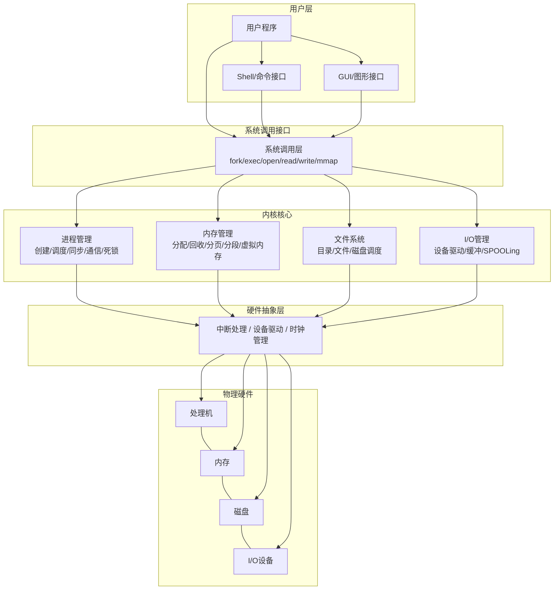
```mermaid
graph TB
    subgraph 用户层
        U1[用户程序] --> U2["Shell/命令接口"]
        U1 --> U3["GUI/图形接口"]
    end

    subgraph 系统调用接口
        SC["系统调用层<br/>fork/exec/open/read/write/mmap"]
    end

    subgraph 内核核心
        PM["进程管理<br/>创建/调度/同步/通信/死锁"]
        MM["内存管理<br/>分配/回收/分页/分段/虚拟内存"]
        FS["文件系统<br/>目录/文件/磁盘调度"]
        IO["I/O管理<br/>设备驱动/缓冲/SPOOLing"]
    end

    subgraph 硬件抽象层
        HAL["中断处理 / 设备驱动 / 时钟管理"]
    end

    subgraph 物理硬件
        CPU[处理机] --- MEM[内存]
        MEM --- DISK[磁盘]
        DISK --- DEV["I/O设备"]
    end

    U1 --> SC
    U2 --> SC
    U3 --> SC
    SC --> PM
    SC --> MM
    SC --> FS
    SC --> IO
    PM --> HAL
    MM --> HAL
    FS --> HAL
    IO --> HAL
    HAL --> CPU
    HAL --> MEM
    HAL --> DISK
    HAL --> DEV
```

---

## 一、操作系统概述

### 1.1 操作系统定义与目标

操作系统是**控制和管理计算机系统内各种硬件和软件资源、合理地组织计算机工作流程、方便用户使用计算机的程序集合**。

| 目标         | 含义                        | 实现手段                     |
| ------------ | --------------------------- | ---------------------------- |
| **有效性**   | 提高资源利用率 & 系统吞吐量 | 多道程序、分时系统、SPOOLing |
| **方便性**   | 提供用户接口，屏蔽硬件细节  | 系统调用、命令解释程序、GUI  |
| **可扩充性** | 便于添加新功能模块          | 微内核架构、模块化设计       |
| **开放性**   | 遵循国际标准，兼容不同硬件  | POSIX 标准、可移植性设计     |

### 1.2 操作系统的作用

1. **用户与硬件之间的接口**：命令接口（联机/脱机）、程序接口（系统调用）、图形接口（GUI）
2. **系统资源管理者**：处理机管理、存储器管理、I/O 设备管理、文件管理
3. **虚拟机**：在裸机上覆盖一层软件，向用户提供一台功能更强、使用更方便的抽象计算机

### 1.3 操作系统基本特征

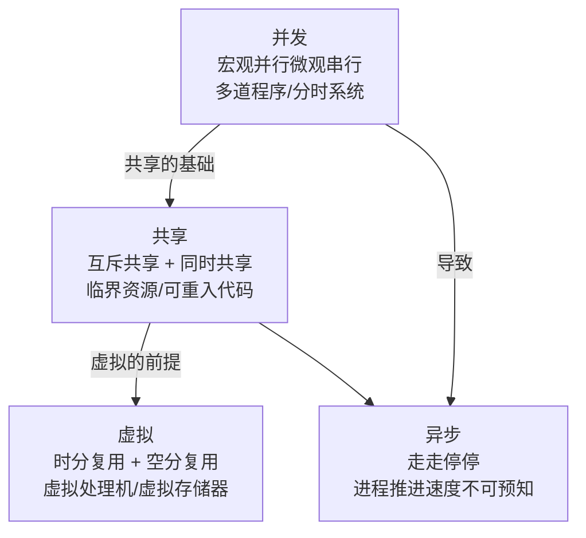
```mermaid
graph TD
    A["并发<br/>宏观并行微观串行<br/>多道程序/分时系统"] -->|"共享的基础"| B["共享<br/>互斥共享 + 同时共享<br/>临界资源/可重入代码"]
    B -->|"虚拟的前提"| C["虚拟<br/>时分复用 + 空分复用<br/>虚拟处理机/虚拟存储器"]
    A -->|"导致"| D["异步<br/>走走停停<br/>进程推进速度不可预知"]
    B --> D
```

### 1.4 操作系统发展历程


```mermaid
graph LR
    A["1940s<br/>手工操作<br/>无OS"] --> B["1950s<br/>单道批处理<br/>监督程序"]
    B --> C["1960s<br/>多道批处理<br/>中断+DMA"]
    C --> D["1970s<br/>分时系统<br/>CTSS/UNIX"]
    D --> E["1980s<br/>实时系统<br/>硬实时/软实时"]
    E --> F["1990s至今<br/>微机/网络/分布式OS"]
```

### 1.5 中断与异常

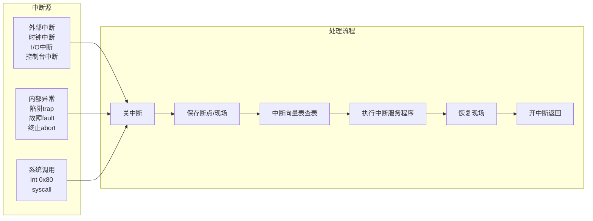
```mermaid
graph LR
    subgraph 中断源
        A["外部中断<br/>时钟中断<br/>I/O中断<br/>控制台中断"]
        B["内部异常<br/>陷阱trap<br/>故障fault<br/>终止abort"]
        C["系统调用<br/>int 0x80<br/>syscall"]
    end

    subgraph 处理流程
        D[关中断]
        E["保存断点/现场"]
        F[中断向量表查表]
        G[执行中断服务程序]
        H[恢复现场]
        I[开中断返回]
    end

    A --> D
    B --> D
    C --> D
    D --> E --> F --> G --> H --> I
```

**中断处理完整过程**：

1. 关中断（CPU 自动完成）
2. 保存断点（PC/PSW 压栈）
3. 转入中断处理程序（中断向量表索引）
4. 保存现场和屏蔽字（通用寄存器压栈）
5. 开中断（允许更高级中断嵌套）
6. 执行中断服务程序
7. 关中断
8. 恢复现场和屏蔽字
9. 开中断
10. 返回断点（IRET 指令）

### 1.6 系统调用

| 类别         | 系统调用                              | 功能                         |
| ------------ | ------------------------------------- | ---------------------------- |
| **进程控制** | fork, exec, exit, wait, kill          | 进程创建/执行/终止/等待/信号 |
| **文件操作** | open, read, write, close, lseek, stat | 文件打开/读写/关闭/定位/属性 |
| **设备管理** | ioctl, read, write                    | 设备控制与读写               |
| **信息维护** | getpid, alarm, sleep, time            | 获取进程/系统信息            |
| **通信**     | pipe, shmget, mmap, socket            | 进程间通信机制               |

**系统调用与库函数区别**：系统调用运行在内核态，涉及特权指令；库函数运行在用户态，封装了系统调用。

### 1.7 内核架构对比


```mermaid
graph TD
    subgraph 宏内核Monolithic
        M1[进程管理 + 内存管理 + 文件系统 + 设备驱动 + 网络协议栈]
        M2[全部在内核态运行]
        M3[效率高，但模块耦合紧密]
        M1 --> M2 --> M3
    end

    subgraph 微内核Microkernel
        U1[进程管理 + 内存管理 + 文件系统 + 设备驱动]
        U2[大部分在用户态]
        U3[内核仅提供IPC + 基本调度 + 中断处理]
        U1 --> U2 --> U3
    end

    subgraph 混合内核Hybrid
        H1[核心服务在内核态]
        H2[其他服务在用户态]
        H3[兼顾效率与可靠性]
        H1 --> H2 --> H3
    end
```

| 架构     | 代表                  | 优点               | 缺点                   |
| -------- | --------------------- | ------------------ | ---------------------- |
| 宏内核   | Linux, Unix           | 高效，模块间调用快 | 模块耦合紧，崩溃影响大 |
| 微内核   | Minix, QNX, L4        | 可靠，扩展性好     | 频繁 IPC，性能开销大   |
| 混合内核 | Windows NT, macOS XNU | 折中方案           | 结构复杂               |

---

## 二、进程管理

### 2.1 进程定义与组成

进程是**程序在一个数据集合上的一次运行活动**，是**系统进行资源分配和调度的独立单位**。

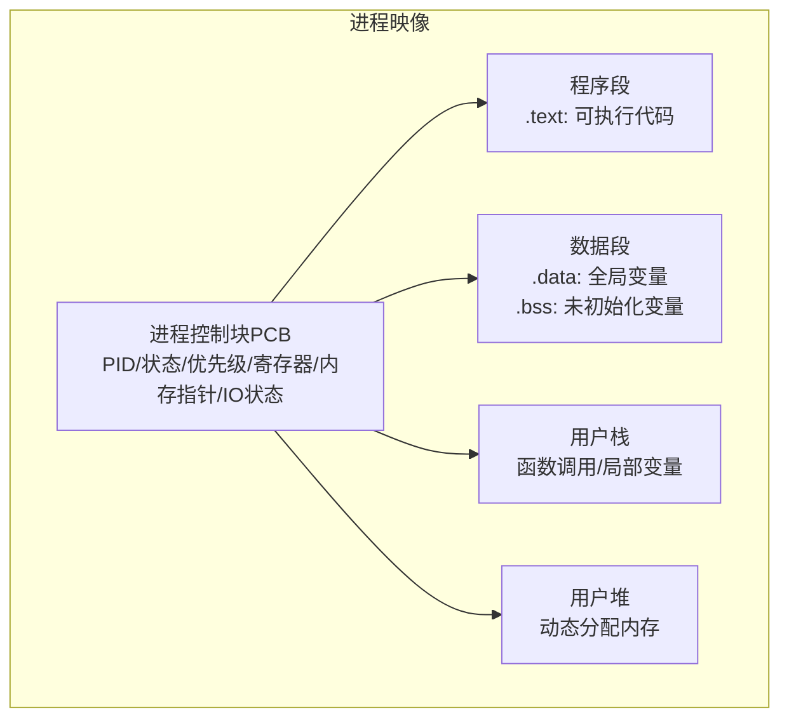
```mermaid
graph TD
    subgraph 进程映像
        PCB["进程控制块PCB<br/>PID/状态/优先级/寄存器/内存指针/IO状态"]
        CODE["程序段<br/>.text: 可执行代码"]
        DATA["数据段<br/>.data: 全局变量<br/>.bss: 未初始化变量"]
        STACK["用户栈<br/>函数调用/局部变量"]
        HEAP["用户堆<br/>动态分配内存"]
    end
    PCB --> CODE
    PCB --> DATA
    PCB --> STACK
    PCB --> HEAP
```

### 2.2 进程状态与转换

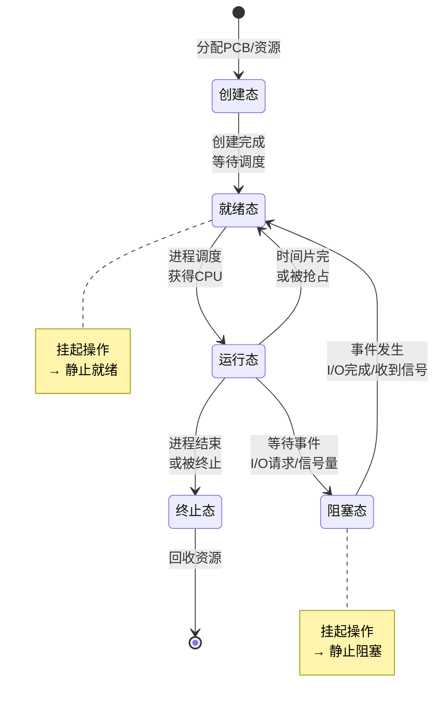
```mermaid
stateDiagram-v2
    [*] --> 创建态: 分配PCB/资源
    创建态 --> 就绪态: 创建完成<br/>等待调度
    就绪态 --> 运行态: 进程调度<br/>获得CPU
    运行态 --> 就绪态: 时间片完<br/>或被抢占
    运行态 --> 阻塞态: 等待事件<br/>I/O请求/信号量
    阻塞态 --> 就绪态: 事件发生<br/>I/O完成/收到信号
    运行态 --> 终止态: 进程结束<br/>或被终止
    终止态 --> [*]: 回收资源

    note right of 就绪态: 挂起操作<br/>→ 静止就绪
    note right of 阻塞态: 挂起操作<br/>→ 静止阻塞
```

**七状态模型**（含挂起态）：

- **活动就绪**：进程在内存，等待 CPU
- **静止就绪**：进程在外存，已就绪但被换出
- **活动阻塞**：进程在内存，等待事件
- **静止阻塞**：进程在外存，等待事件（可能事件已发生）
- **挂起原因**：用户请求、父进程请求、负荷调节、操作系统需要

### 2.3 进程控制块（PCB）详解

PCB 是**进程存在的唯一标志**，操作系统通过 PCB 感知进程的存在。

| 信息类别         | 主要内容                                             | 作用                  |
| ---------------- | ---------------------------------------------------- | --------------------- |
| **进程标识符**   | PID, 父 PID, UID, GID                                | 唯一标识进程          |
| **处理机状态**   | 通用寄存器、指令计数器 PC、程序状态字 PSW、栈指针 SP | 上下文切换时保存/恢复 |
| **进程调度信息** | 进程状态、优先级、调度策略、等待原因、时间片         | 调度决策依据          |
| **内存管理信息** | 基址/限长寄存器、页表指针（CR3）、段表指针           | 地址转换              |
| **I/O 状态信息** | 打开文件表、设备请求队列、I/O 缓冲区                 | 设备管理              |
| **会计信息**     | CPU 时间、实际使用量、资源限制                       | 记账与统计            |
| **链接信息**     | 指向其他 PCB 的指针（就绪队列、阻塞队列等）          | 队列管理              |

### 2.4 线程

线程是**进程内的一条执行路径**，是**处理机调度的基本单位**。

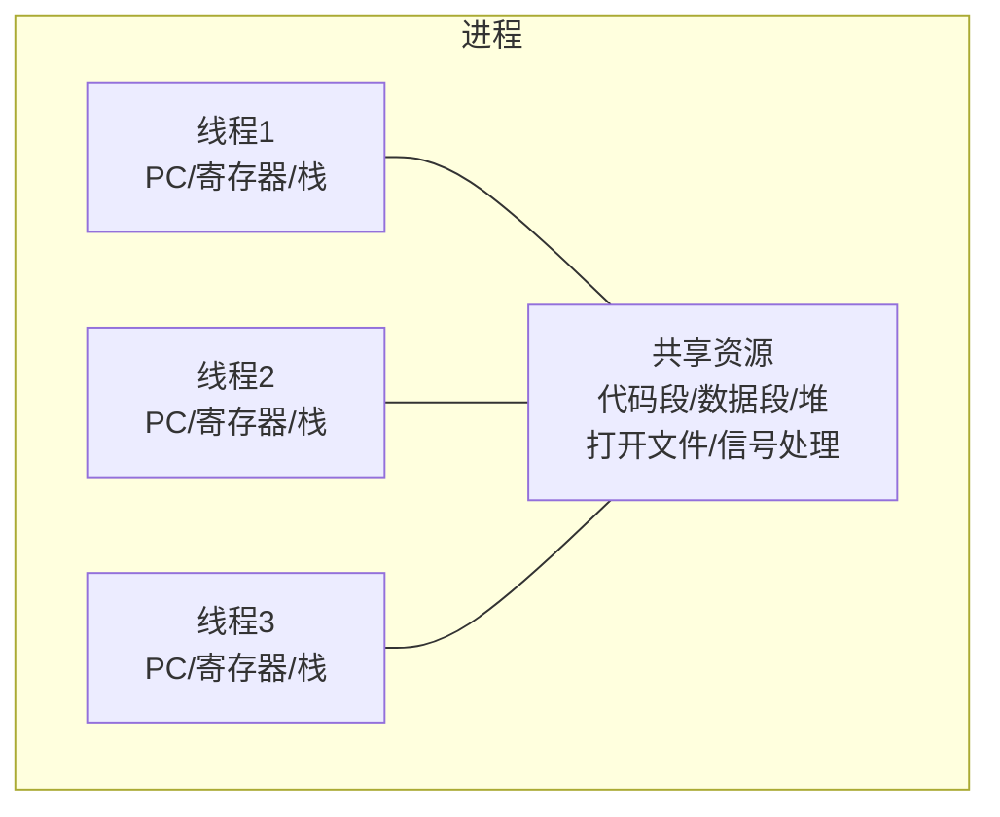
```mermaid
graph TD
    subgraph 进程
        T1["线程1<br/>PC/寄存器/栈"]
        T2["线程2<br/>PC/寄存器/栈"]
        T3["线程3<br/>PC/寄存器/栈"]
        COMMON["共享资源<br/>代码段/数据段/堆<br/>打开文件/信号处理"]
    end
    T1 --- COMMON
    T2 --- COMMON
    T3 --- COMMON
```

| 维度         | 进程                             | 线程                              |
| ------------ | -------------------------------- | --------------------------------- |
| **调度**     | 资源拥有单位                     | CPU 调度基本单位                  |
| **并发性**   | 不同进程间                       | 同一进程内线程间                  |
| **拥有资源** | 内存、文件、设备                 | 仅必要私有资源（栈、寄存器、TCB） |
| **系统开销** | 创建/切换需分配/回收资源，开销大 | 仅切换寄存器/栈，开销小           |
| **地址空间** | 独立                             | 共享同一进程地址空间              |
| **通信**     | 需 IPC 机制                      | 直接读写共享变量                  |

**线程实现方式**：

| 模型               | 描述                     | 优点                         | 缺点                       |
| ------------------ | ------------------------ | ---------------------------- | -------------------------- |
| **用户级线程 ULT** | 线程库管理，内核不知     | 切换快，不陷入内核           | 一个线程阻塞则整个进程阻塞 |
| **内核级线程 KLT** | 内核管理，调度单位是线程 | 一个阻塞不影响其他，多核并行 | 切换涉及内核，开销较大     |
| **组合（多对多）** | 多个 ULT 映射到多个 KLT  | 综合两者优点                 | 实现复杂                   |

### 2.5 进程同步与互斥

**临界资源**：一次仅允许一个进程使用的资源。
**临界区**：进程中访问临界资源的那段代码。

**同步机制应遵循的原则**：

1. **空闲让进**：临界区空闲时，允许进程进入
2. **忙则等待**：已有进程在临界区，其他进程必须等待
3. **有限等待**：等待进入临界区的进程不能无限期等待（避免饥饿）
4. **让权等待**：无法进入临界区时应立即释放 CPU（避免忙等）

**软件实现方法**：

| 方法               | 核心思想                   | 问题                             |
| ------------------ | -------------------------- | -------------------------------- |
| 单标志法           | 用一个 turn 变量指示轮到谁 | 必须交替进入，不满足空闲让进     |
| 双标志法（先检查） | 各自有 flag，先检查对方    | 可能同时进入（检查和设置不原子） |
| 双标志法（后检查） | 先设自己 flag，再检查对方  | 可能互相谦让形成死锁             |
| Peterson 算法      | flag + turn 组合           | 完美解决，但为软件实现，仍有忙等 |

**硬件实现方法**：

- **关中断**（单 CPU 环境）：进入临界区前关中断，出后开中断
- **Test-and-Set 指令**：原子操作，读取并设为 true
- **Swap/Exchange 指令**：原子交换两个变量的值

### 2.6 信号量机制


```mermaid
graph TD
    subgraph 信号量类型
        A["整型信号量<br/>while S<=0 do no-op<br/>存在忙等问题"]
        B["记录型信号量<br/>value + 等待队列<br/>block/wakeup 解决忙等"]
        C["AND型信号量<br/>一次性申请所有资源<br/>全部分配或全不分配<br/>避免死锁"]
        D["信号量集<br/>可申请多个、设定下限"]
    end
    A --> B --> C --> D
```

**记录型信号量伪代码**（C 风格）：

```c
// 记录型信号量
typedef struct {
    int value;          // 可用资源数，负值表示等待进程数
    struct process *L;  // 等待该信号量的进程阻塞队列
} semaphore;

// P 操作（wait / 荷兰语 Proberen）
void wait(semaphore S) {
    S.value--;
    if (S.value < 0) {
        // 将该进程加入 S.L 等待队列
        // 调用 block() 原语，放弃 CPU，进入阻塞态
        block(S.L);
    }
}

// V 操作（signal / 荷兰语 Verhogen）
void signal(semaphore S) {
    S.value++;
    if (S.value <= 0) {
        // 从 S.L 队列中唤醒第一个等待进程
        // 被唤醒进程从阻塞态变为就绪态
        wakeup(S.L);
    }
}
```

**信号量值含义**：

- `S.value > 0`：表示还可用的资源数目
- `S.value = 0`：资源已用完，无等待进程
- `S.value < 0`：`|S.value|` 表示等待队列中阻塞的进程数

### 2.7 经典同步问题

#### 生产者-消费者问题

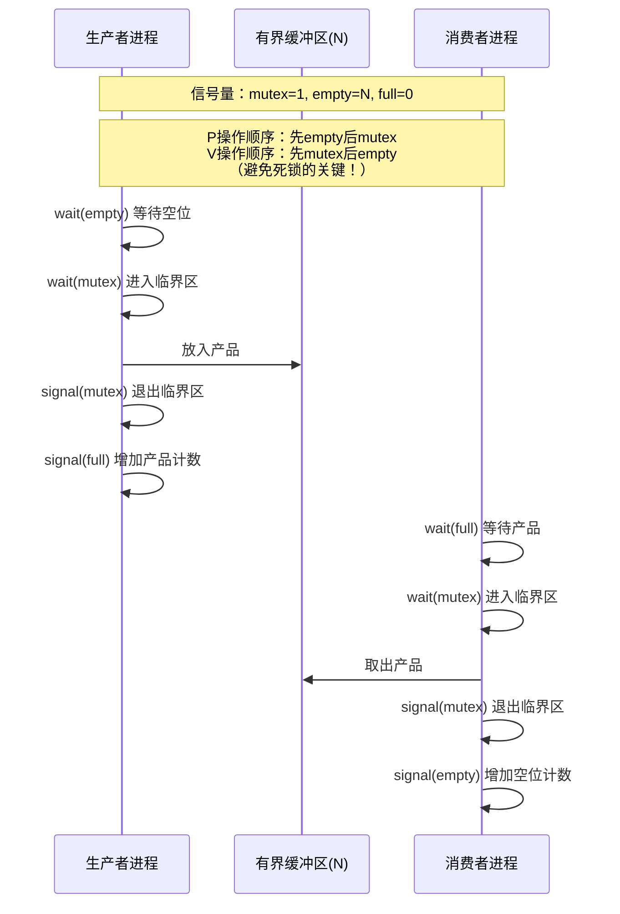
```mermaid
sequenceDiagram
    participant P as 生产者进程
    participant B as 有界缓冲区(N)
    participant C as 消费者进程

    Note over P,C: 信号量：mutex=1, empty=N, full=0
    Note over P,C: P操作顺序：先empty后mutex<br/>V操作顺序：先mutex后empty<br/>（避免死锁的关键！）

    P->>P: wait(empty) 等待空位
    P->>P: wait(mutex) 进入临界区
    P->>B: 放入产品
    P->>P: signal(mutex) 退出临界区
    P->>P: signal(full) 增加产品计数

    C->>C: wait(full) 等待产品
    C->>C: wait(mutex) 进入临界区
    C->>B: 取出产品
    C->>C: signal(mutex) 退出临界区
    C->>C: signal(empty) 增加空位计数
```

#### 读者-写者问题

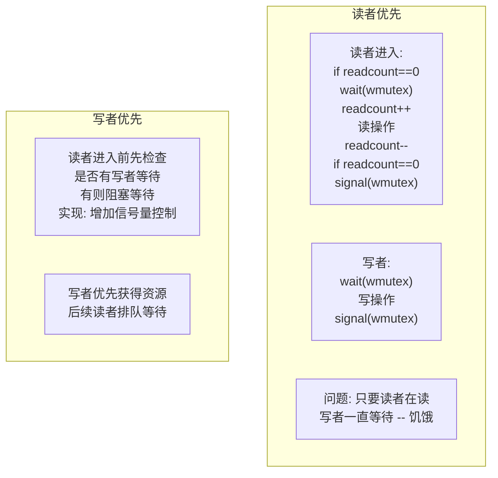
```mermaid
graph TD
    subgraph 读者优先
        R1["读者进入:
        if readcount==0
          wait(wmutex)
        readcount++
        读操作
        readcount--
        if readcount==0
          signal(wmutex)"]
        R2["写者:
        wait(wmutex)
        写操作
        signal(wmutex)"]
        R3["问题: 只要读者在读
        写者一直等待 -- 饥饿"]
    end

    subgraph 写者优先
        W1["读者进入前先检查
        是否有写者等待
        有则阻塞等待
        实现: 增加信号量控制"]
        W2["写者优先获得资源
        后续读者排队等待"]
    end
```

**读者-写者信号量设计**：

```c
// 读者优先版本
semaphore rmutex = 1;  // 保护 readcount
semaphore wmutex = 1;  // 写者互斥 / 第一个读者和写者互斥
int readcount = 0;

void reader() {
    wait(rmutex);
    if (readcount == 0) wait(wmutex);  // 第一个读者锁定写者
    readcount++;
    signal(rmutex);
    // ... 读操作 ...
    wait(rmutex);
    readcount--;
    if (readcount == 0) signal(wmutex);  // 最后一个读者释放写者
    signal(rmutex);
}

void writer() {
    wait(wmutex);       // 写者互斥
    // ... 写操作 ...
    signal(wmutex);
}
```

#### 哲学家进餐问题

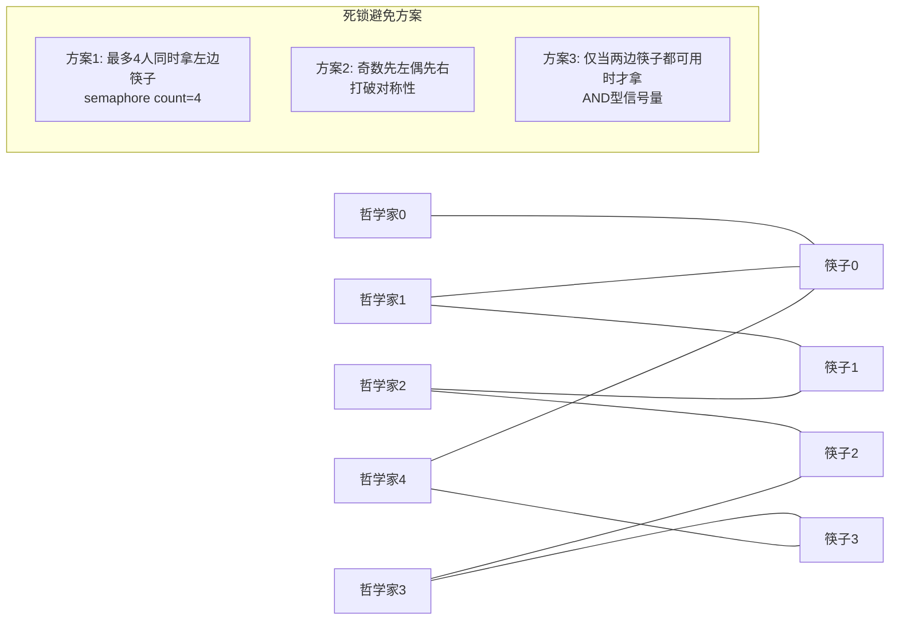
```mermaid
graph LR
    P0[哲学家0] --- C0[筷子0]
    P1[哲学家1] --- C0
    P1 --- C1[筷子1]
    P2[哲学家2] --- C1
    P2 --- C2[筷子2]
    P3[哲学家3] --- C2
    P3 --- C3[筷子3]
    P4[哲学家4] --- C3
    P4 --- C0

    subgraph 死锁避免方案
        S1["方案1: 最多4人同时拿左边筷子<br/>semaphore count=4"]
        S2["方案2: 奇数先左偶先右<br/>打破对称性"]
        S3["方案3: 仅当两边筷子都可用时才拿<br/>AND型信号量"]
    end
```

### 2.8 管程（Monitor）

管程是一种**高级同步机制**，由一组共享数据结构及操作这些结构的过程组成。

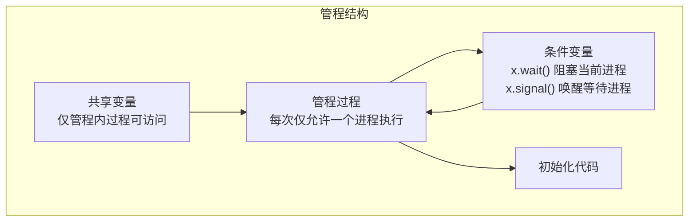
```mermaid
graph TD
    subgraph 管程结构
        SHARED["共享变量<br/>仅管程内过程可访问"] --> PROC["管程过程<br/>每次仅允许一个进程执行"]
        PROC --> COND["条件变量<br/>x.wait() 阻塞当前进程<br/>x.signal() 唤醒等待进程"]
        PROC --> INIT["初始化代码"]
        COND --> PROC
    end
```

| 特性     | 管程                                         | 信号量                     |
| -------- | -------------------------------------------- | -------------------------- |
| 封装性   | 共享变量私有，仅管程过程访问                 | 信号量全局可见             |
| 互斥     | 编译器自动保证                               | 程序员显式 P/V             |
| 条件变量 | x.wait() 总是阻塞；x.signal() 无等待则无累积 | signal() 可累积（value++） |
| 易用性   | 更安全，不易出错                             | 灵活但易出错               |

### 2.9 死锁

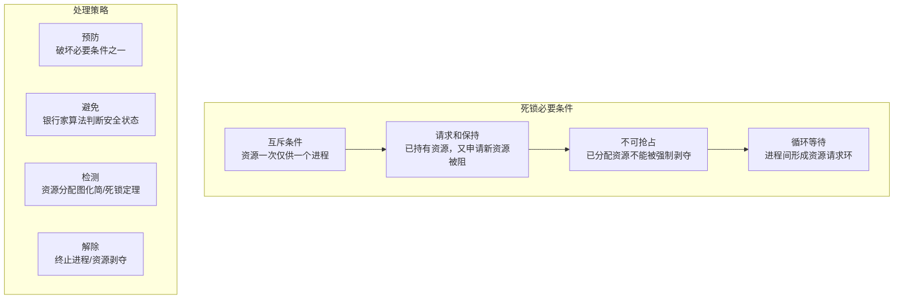
```mermaid
graph TD
    subgraph 死锁必要条件
        A["互斥条件<br/>资源一次仅供一个进程"]
        B["请求和保持<br/>已持有资源，又申请新资源被阻"]
        C["不可抢占<br/>已分配资源不能被强制剥夺"]
        D["循环等待<br/>进程间形成资源请求环"]
    end
    A --> B --> C --> D

    subgraph 处理策略
        E["预防<br/>破坏必要条件之一"]
        F["避免<br/>银行家算法判断安全状态"]
        G["检测<br/>资源分配图化简/死锁定理"]
        H["解除<br/>终止进程/资源剥夺"]
    end
```

#### 银行家算法详细流程

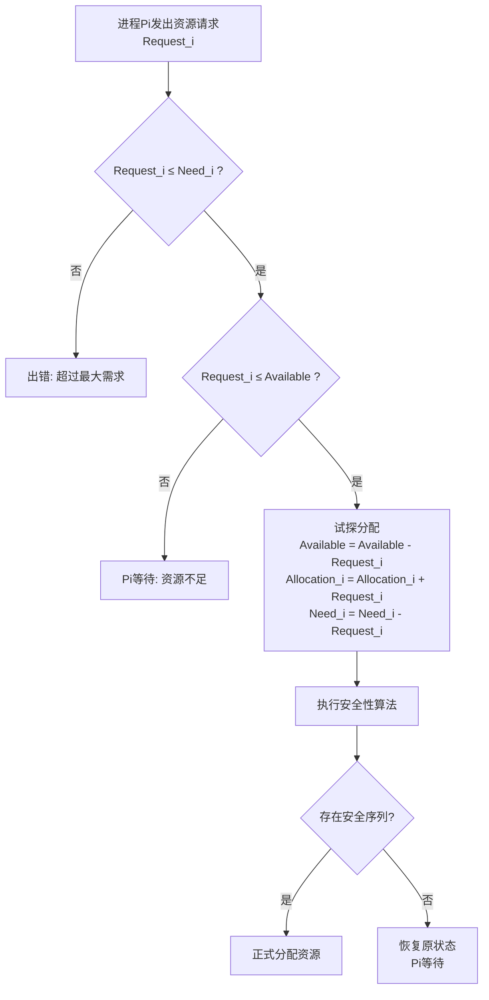
```mermaid
flowchart TD
    A[进程Pi发出资源请求Request_i] --> B{Request_i ≤ Need_i ?}
    B -->|否| C["出错: 超过最大需求"]
    B -->|是| D{Request_i ≤ Available ?}
    D -->|否| E["Pi等待: 资源不足"]
    D -->|是| F["试探分配<br/>Available = Available - Request_i<br/>Allocation_i = Allocation_i + Request_i<br/>Need_i = Need_i - Request_i"]
    F --> G[执行安全性算法]
    G --> H{存在安全序列?}
    H -->|是| I[正式分配资源]
    H -->|否| J["恢复原状态<br/>Pi等待"]
```

**安全性算法**：

1. 设置工作向量 `Work = Available`，`Finish[i] = false`
2. 找到一个满足 `Finish[i] == false` 且 `Need_i ≤ Work` 的进程
3. 若找到：`Work = Work + Allocation_i`，`Finish[i] = true`，返回步骤 2
4. 若所有 `Finish[i] == true`，则系统处于**安全状态**

**死锁检测：资源分配图化简**

- 找到既不阻塞也不孤立的进程节点，删除其所有有向边
- 重复直至不可再化简
- 若有进程节点无法删除 → 死锁

**死锁解除**：

- **剥夺资源**：从其他进程剥夺足够资源给死锁进程
- **撤销进程**：终止所有死锁进程，或逐个终止（代价最小策略）

### 2.10 处理机调度

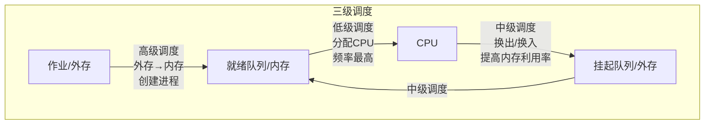
```mermaid
graph TB
    subgraph 三级调度
        A["作业/外存"] -->|高级调度<br/>外存→内存<br/>创建进程| B["就绪队列/内存"]
        B -->|低级调度<br/>分配CPU<br/>频率最高| C[CPU]
        C -->|中级调度<br/>换出/换入<br/>提高内存利用率| D["挂起队列/外存"]
        D -->|中级调度| B
    end
```

#### 调度算法对比

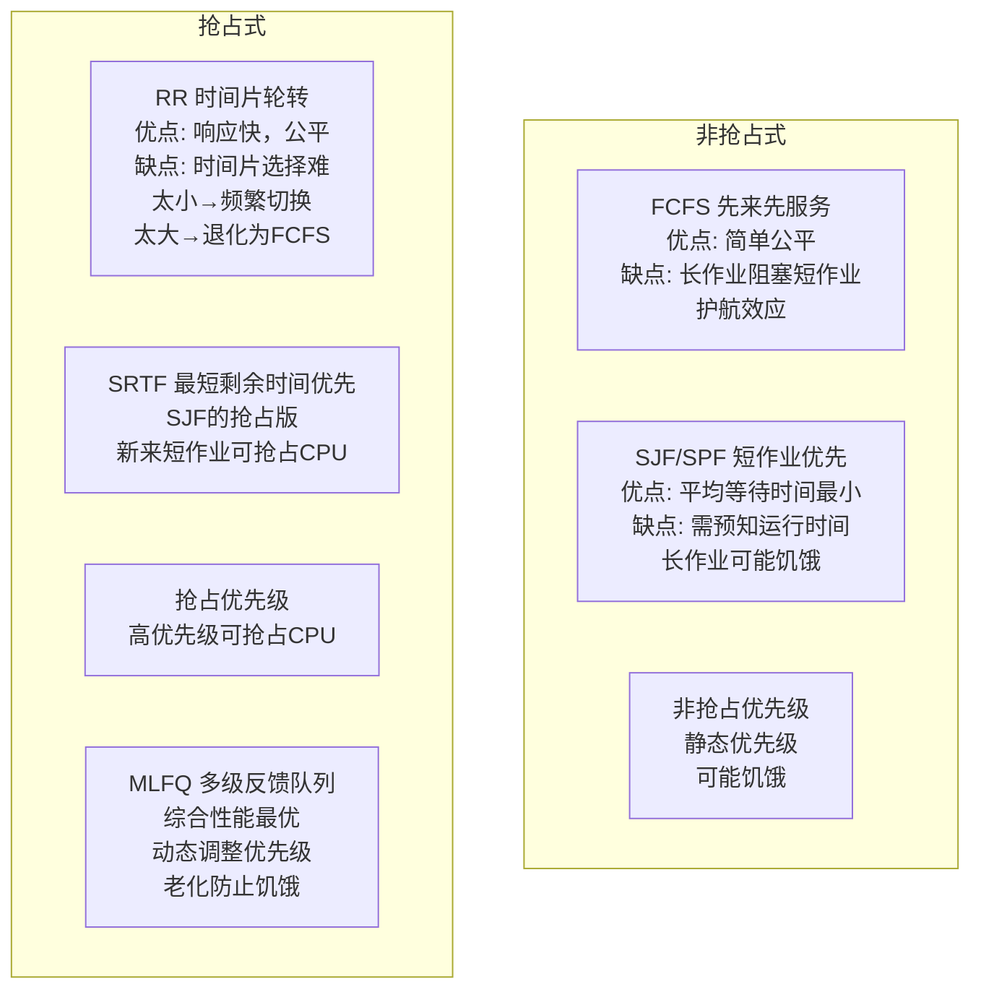
```mermaid
graph TD
    subgraph 非抢占式
        FCFS["FCFS 先来先服务<br/>优点: 简单公平<br/>缺点: 长作业阻塞短作业<br/>护航效应"]
        SJF["SJF/SPF 短作业优先<br/>优点: 平均等待时间最小<br/>缺点: 需预知运行时间<br/>长作业可能饥饿"]
        PRIO_NP["非抢占优先级<br/>静态优先级<br/>可能饥饿"]
    end

    subgraph 抢占式
        RR["RR 时间片轮转<br/>优点: 响应快，公平<br/>缺点: 时间片选择难<br/>太小→频繁切换<br/>太大→退化为FCFS"]
        SRTF["SRTF 最短剩余时间优先<br/>SJF的抢占版<br/>新来短作业可抢占CPU"]
        PRIO_P["抢占优先级<br/>高优先级可抢占CPU"]
        MLFQ["MLFQ 多级反馈队列<br/>综合性能最优<br/>动态调整优先级<br/>老化防止饥饿"]
    end
```

**多级反馈队列（MLFQ）规则**：

1. 新进程进入最高优先级队列（时间片最小）
2. 用完时间片 → 降级到下一队列（时间片加倍）
3. I/O 等待后 → 保持或提升优先级
4. 低优先级队列采用 FCFS
5. 定期将所有进程提升到最高优先级（防止饥饿/老化）

**调度性能指标**：

- 周转时间 `T = 完成时间 - 到达时间`
- 带权周转时间 `W = T / 服务时间`
- 响应时间 = 首次响应时间 - 请求时间

### 2.11 进程通信（IPC）

| 方式                 | 原理                         | 特点                      |
| -------------------- | ---------------------------- | ------------------------- |
| **共享存储**         | 进程共享内存区域，直接读写   | 速度快，需同步机制        |
| **管道（Pipe）**     | 半双工，一端写一端读，字节流 | 仅父子/兄弟进程；匿名管道 |
| **命名管道（FIFO）** | 有文件名，任意进程可访问     | 突破亲缘关系限制          |
| **消息队列**         | 消息的链表，按类型读写       | 异步，可指定消息类型      |
| **信号量**           | P/V 操作控制资源访问         | 用于同步，非数据传输      |
| **信号（Signal）**   | 异步通知事件                 | 如 SIGKILL, SIGCHLD       |
| **Socket**           | 网络通信接口                 | 跨主机通信                |

---

## 三、内存管理

### 3.1 基本概念

| 术语                     | 定义                                     |
| ------------------------ | ---------------------------------------- |
| **物理地址**             | 内存单元的实际地址，唯一标识一个存储单元 |
| **逻辑地址（虚拟地址）** | CPU 生成的地址，程序中使用               |
| **地址绑定/重定位**      | 逻辑地址 → 物理地址的映射                |
| **静态重定位**           | 装入时一次性完成地址转换                 |
| **动态重定位**           | 运行时由硬件（MMU）完成地址转换          |

**地址绑定时机**：

1. **编译时**：编译时已知位置，生成绝对代码
2. **装入时**：装入时完成重定位，装入后不可移动
3. **运行时**：执行时由 MMU 动态转换（现代 OS 使用）

### 3.2 连续分配方式

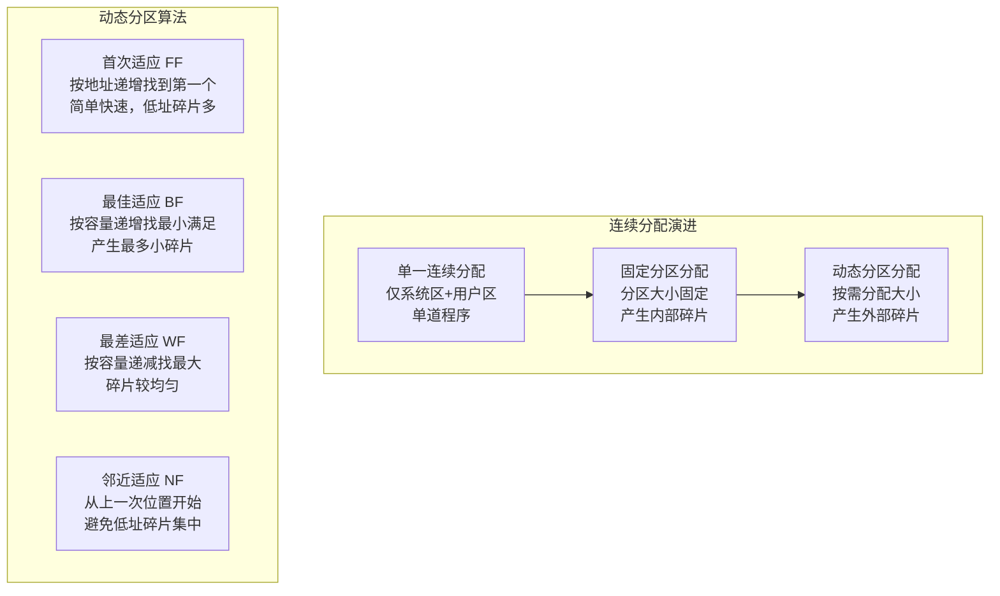
```mermaid
graph TD
    subgraph 连续分配演进
        A["单一连续分配<br/>仅系统区+用户区<br/>单道程序"] --> B["固定分区分配<br/>分区大小固定<br/>产生内部碎片"]
        B --> C["动态分区分配<br/>按需分配大小<br/>产生外部碎片"]
    end

    subgraph 动态分区算法
        D["首次适应 FF<br/>按地址递增找到第一个<br/>简单快速，低址碎片多"]
        E["最佳适应 BF<br/>按容量递增找最小满足<br/>产生最多小碎片"]
        F["最差适应 WF<br/>按容量递减找最大<br/>碎片较均匀"]
        G["邻近适应 NF<br/>从上一次位置开始<br/>避免低址碎片集中"]
    end
```

**碎片与紧凑**：

- **内部碎片**：分配给进程的内存中未被使用的部分（固定分区、分页）
- **外部碎片**：空闲分区总和满足需求但不连续，无法分配（动态分区）
- **紧凑/拼接**：移动内存中的进程，合并空闲区，需动态重定位支持

### 3.3 分页存储管理

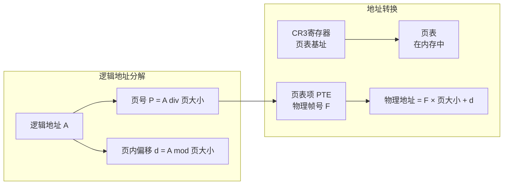
```mermaid
flowchart LR
    subgraph 逻辑地址分解
        LA[逻辑地址 A] --> P[页号 P = A div 页大小]
        LA --> D[页内偏移 d = A mod 页大小]
    end

    subgraph 地址转换
        CR3["CR3寄存器<br/>页表基址"] --> PT["页表<br/>在内存中"]
        P --> PTI["页表项 PTE<br/>物理帧号 F"]
        PTI --> PA[物理地址 = F × 页大小 + d]
    end
```

**逻辑地址结构**：

$$\text{逻辑地址} = \overbrace{\text{页号 } P}^{p\text{ 位}} \mid \overbrace{\text{页内偏移 } d}^{d\text{ 位}}$$

- 页大小 `= 2^d` 字节
- 地址空间最多 `2^p` 页
- 物理地址空间最多 `2^f` 帧（页框）

#### TLB + 多级页表地址转换流程

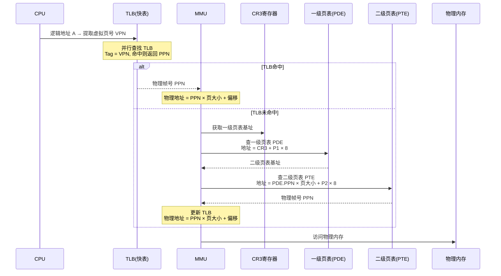
```mermaid
sequenceDiagram
    participant CPU as CPU
    participant TLB as TLB(快表)
    participant MMU as MMU
    participant CR3 as CR3寄存器
    participant L1 as 一级页表(PDE)
    participant L2 as 二级页表(PTE)
    participant MEM as 物理内存

    CPU->>TLB: 逻辑地址 A → 提取虚拟页号 VPN
    Note over TLB: 并行查找 TLB<br/>Tag = VPN, 命中则返回 PPN

    alt TLB命中
        TLB-->>MMU: 物理帧号 PPN
        Note over MMU: 物理地址 = PPN × 页大小 + 偏移
    else TLB未命中
        MMU->>CR3: 获取一级页表基址
        MMU->>L1: 查一级页表 PDE<br/>地址 = CR3 + P1 × 8
        L1-->>MMU: 二级页表基址
        MMU->>L2: 查二级页表 PTE<br/>地址 = PDE.PPN × 页大小 + P2 × 8
        L2-->>MMU: 物理帧号 PPN
        Note over MMU: 更新 TLB<br/>物理地址 = PPN × 页大小 + 偏移
    end

    MMU->>MEM: 访问物理内存
```

**有效访问时间（EAT）**：
$$EAT = \alpha \times (T_{TLB} + T_m) + (1-\alpha) \times (T_{TLB} + 2T_m)$$

其中 $\alpha$ 为 TLB 命中率，$T_m$ 为一次内存访问时间。

**多级页表优势**：

- 不必将整张页表连续存放
- 仅需将当前使用的页表部分装入内存
- 以两级页表为例：外层页号 `P1` + 内层页号 `P2` + 偏移 `d`

**反置页表**：

- 系统仅一张页表，按物理块号索引
- 表项：`(pid, 虚拟页号, 物理块号)`
- 查找时需遍历，可用哈希加速（pid+虚拟页号 → 物理块号）

### 3.4 分段与段页式

```mermaid
graph TD
    subgraph 分段管理
        S1["按逻辑单位划分<br/>代码段/数据段/栈段"]
        S2[段内连续，段间不连续]
        S3["段表: 段基址 + 段长 + 保护位"]
        S4["地址: 段号S + 段内偏移W"]
        S5["越界检查: W < 段长"]
        S1 --> S2 --> S3 --> S4 --> S5
    end

    subgraph 段页式管理
        SP1[先分段 再分页]
        SP2["段表项: 页表基址 + 页表长度"]
        SP3["地址: 段号S + 段内页号P + 页内偏移d"]
        SP4["3次访存: 段表→页表→数据"]
        SP1 --> SP2 --> SP3 --> SP4
    end
```

| 维度     | 分页               | 分段             | 段页式             |
| -------- | ------------------ | ---------------- | ------------------ |
| 划分依据 | 固定大小，物理决定 | 不定长，逻辑决定 | 逻辑分段，物理分页 |
| 地址维度 | 一维               | 二维             | 三维               |
| 用户可见 | 透明               | 可见             | 透明               |
| 碎片     | 内部碎片           | 外部碎片         | 内部碎片           |
| 共享保护 | 困难               | 容易             | 容易               |

### 3.5 虚拟内存管理

```mermaid
graph TD
    subgraph 虚拟内存基础
        LP["局部性原理<br/>时间局部性 + 空间局部性"]
        DA["离散分配<br/>进程不必连续"]
        PI["部分装入<br/>仅当前需要的部分"]
        SW["多次对换<br/>暂不需要的换出外存"]
        VS["虚拟存储<br/>逻辑空间 > 物理空间"]
    end
    LP --> DA --> PI --> SW --> VS
```

#### 缺页中断处理流程

```mermaid
sequenceDiagram
    participant CPU as CPU
    participant MMU as MMU
    participant Kernel as 缺页中断处理程序
    participant Disk as 磁盘交换区
    participant PM as 物理内存

    CPU->>MMU: 访问逻辑地址，查页表
    MMU->>MMU: 页表项 状态位P=0 → 缺页！
    MMU->>Kernel: 触发缺页中断（14号）
    Note over Kernel: 1. 检查地址合法性<br/>2. 检查是否有空闲物理帧

    alt 有空闲帧
        Note over Kernel: 分配空闲帧
    else 无空闲帧
        Kernel->>PM: 执行页面置换算法<br/>选择牺牲页
        opt 牺牲页 M位=1（已修改）
            Kernel->>Disk: 写回磁盘交换区
        end
        Kernel->>PM: 更新牺牲页表项 P=0
    end

    Kernel->>Disk: 读入所需页面到物理帧
    Kernel->>PM: 更新页表项<br/>物理帧号F, P=1, M=0
    Kernel-->>CPU: 返回，重新执行被中断指令
```

**请求分页页表项扩展**：

| 页号 | 物理块号 | 状态位 P | 访问字段 A | 修改位 M | 外存地址   |
| ---- | -------- | -------- | ---------- | -------- | ---------- |
| 4    | 0x1F     | 0        | 0          | 0        | 交换区偏移 |

- **状态位 P**：该页是否在内存（1=在，0=不在）
- **访问字段 A**：记录最近访问次数或时间（用于置换算法）
- **修改位 M**：该页是否被修改过（决定换出时是否写回磁盘）
- **外存地址**：该页在磁盘交换区的位置

**有效访问时间（EAT）**：
$$EAT = (1-p) \times T_m + p \times T_{page\_fault}$$

其中 $p$ 为缺页率，$T_{page\_fault}$ 为缺页处理时间（含磁盘 I/O）。

#### 页面置换算法对比

```mermaid
graph TD
    subgraph 理论最优
        OPT["OPT 最佳置换<br/>淘汰将来最远使用的页<br/>理论最优，无法实现<br/>用于衡量其他算法"]
    end

    subgraph 简单实现
        FIFO["FIFO 先进先出<br/>淘汰最早进入的页<br/>Belady异常: 帧多反而缺页多"]
        LRU["LRU 最近最久未使用<br/>淘汰最久未访问的页<br/>接近OPT，实现开销大<br/>栈/移位寄存器实现"]
    end

    subgraph 近似算法
        CLOCK["简单Clock/NRU<br/>循环扫描访问位<br/>A=1→置0; A=0→淘汰"]
        CLOCK2["改进型Clock<br/>同时检查A位和M位<br/>优先淘汰A=0,M=0的页<br/>减少写回磁盘次数"]
    end

    subgraph 其他
        LFU["LFU 最不常用<br/>访问频率最低的淘汰<br/>需额外计数器"]
        PB["页面缓冲算法<br/>维护空闲帧池和修改页链表<br/>降低抖动"]
    end
```

**Belady 异常**：FIFO 算法中，分配的物理块数增加，缺页次数反而增加。LRU 和 OPT 不会出现。

**改进型 Clock 算法四类页面**：

1. `A=0, M=0`：最近未访问也未修改 → 最佳淘汰页
2. `A=0, M=1`：最近未访问但已修改 → 淘汰前需写回
3. `A=1, M=0`：最近访问过但未修改 → 可能再被访问
4. `A=1, M=1`：最近访问过且已修改 → 最不该淘汰

#### 页面分配与抖动

**分配策略**：

- **固定分配局部置换**：物理块数固定，缺页时从自己的块中置换
- **可变分配全局置换**：可从所有进程空闲块中选择置换
- **可变分配局部置换**：根据缺页率动态调整块数

**抖动（Thrashing）**：

- 进程频繁换页，大部分时间用于缺页处理而非执行
- 原因：分配给进程的物理块数 < 工作集大小
- 表现：CPU 利用率急剧下降
- 预防：工作集模型、缺页率控制、挂起部分进程

**工作集**：$W(t, \Delta)$ = 在时间区间 $[t-\Delta, t]$ 内进程访问的页面集合。若工作集大小超过分配的物理块数，可能引发抖动。

---

## 四、文件管理

### 4.1 文件系统层次结构

```mermaid
graph TD
    A[用户程序] --> B["文件系统接口<br/>open/read/write/close"]
    B --> C["逻辑文件系统<br/>目录管理/存取控制"]
    C --> D["文件组织模块<br/>逻辑块→物理块映射"]
    D --> E["基本文件系统<br/>块缓存/磁盘调度"]
    E --> F["I/O控制<br/>设备驱动/中断处理"]
    F --> G[磁盘硬件]
```

### 4.2 文件逻辑与物理结构

| 逻辑结构   | 描述                        | 存取方法           |
| ---------- | --------------------------- | ------------------ |
| 流式文件   | 无结构字节序列（Unix 风格） | 顺序存取、随机存取 |
| 记录式文件 | 由定长/变长记录组成         | 顺序存取、索引存取 |

**文件物理结构（分配方式）**：

```mermaid
graph TD
    subgraph 连续分配
        CA["文件占据连续磁盘块<br/>优点: 顺序访问快，简单<br/>缺点: 外碎片，不能动态增长"]
    end

    subgraph 链接分配
        LA["隐式链接: 每块存下一块指针<br/>缺点: 随机访问慢，指针占空间"]
        FAT["显式链接FAT: 文件分配表集中存链<br/>优点: 随机访问改善<br/>缺点: FAT占用空间"]
    end

    subgraph 索引分配
        IA["每个文件有索引块<br/>索引块存放所有块号<br/>优点: 直接访问，无外碎片<br/>缺点: 索引块开销"]
    end
```

**UNIX 混合索引（i-node）**：

```mermaid
graph TD
    INODE[i-node] --> D0[直接块0]
    INODE --> D11[直接块11]
    INODE --> I1["一次间接块<br/>指向数据块号"]
    INODE --> I2["二次间接块<br/>指向一次间接块"]
    INODE --> I3["三次间接块<br/>指向二次间接块"]

    I1 --> DB1[数据块]
    I2 --> I2B[一次间接块] --> I2DB[数据块]
    I3 --> I3B[二次间接块] --> I3I1[一次间接块] --> I3DB[数据块]
```

- 12 个直接块（小文件速度快）
- 1 个一次间接块
- 1 个二次间接块
- 1 个三次间接块（支持超大文件）

### 4.3 目录结构

```mermaid
graph TD
    SLD["单级目录<br/>命名冲突"] --> TLD["两级目录<br/>MFD+UFD<br/>分离用户"]
    TLD --> TD["树形目录<br/>多级层次<br/>绝对/相对路径"]
    TD --> AGD["非循环图目录<br/>允许共享<br/>无环"]
    AGD --> GGD["通用图目录<br/>允许链接<br/>需垃圾回收"]
```

**目录项内容**：

- 文件名
- 文件属性（类型、大小、时间、权限）
- 磁盘地址（物理块号 或 i-node 编号）

### 4.4 文件共享与保护

| 共享方式               | 原理                      | 特点                         |
| ---------------------- | ------------------------- | ---------------------------- |
| **硬链接**             | 多个目录项指向同一 i-node | 链接计数，删除最后一个才释放 |
| **软链接（符号链接）** | 特殊文件存放目标路径名    | 可跨文件系统，目标删除则断链 |

**文件保护**：

- **存取控制矩阵**：全矩阵存储所有用户对文件的权限
- **存取控制表（ACL）**：每个文件一张权限表
- **用户权限表**：每个用户一张权限表
- **口令**：简单但安全性低
- **加密**：安全性高但开销大
- **Unix 权限**：rwx 三组（owner/group/other）

### 4.5 空闲空间管理

| 方法           | 原理                       | 特点                 |
| -------------- | -------------------------- | -------------------- |
| **空闲表法**   | 连续空闲区组成表           | 类似动态分区         |
| **空闲链表法** | 所有空闲块链接             | 分配/回收需遍历链表  |
| **位示图法**   | 每位代表一个块             | 简单高效，占用空间小 |
| **成组链接法** | Unix 使用，结合空闲表+链表 | 效率高，适合大磁盘   |

**位示图计算公式**：
$$\text{块号} = i \times \text{字长} + j$$

其中 `i` 为字号，`j` 为位号。`0` 表示空闲，`1` 表示已分配。

### 4.6 磁盘调度

**磁盘访问时间**：
$$T_{access} = T_{seek} + T_{rotation} + T_{transfer}$$

| 组成部分                | 描述               | 占比             |
| ----------------------- | ------------------ | ---------------- |
| 寻道时间 $T_{seek}$     | 磁头移动到指定磁道 | 最大（机械运动） |
| 旋转延迟 $T_{rotation}$ | 扇区旋转到磁头下   | 平均半圈时间     |
| 传输时间 $T_{transfer}$ | 数据读写           | 最小             |

**磁盘调度算法对比**：

```mermaid
graph TD
    subgraph 基础算法
        FCFS["FCFS 先来先服务<br/>公平，性能差<br/>磁头可能来回跳跃"]
        SSTF["SSTF 最短寻道优先<br/>性能好，可能饥饿<br/>中间磁道优先"]
    end

    subgraph 扫描算法
        SCAN["SCAN 电梯算法<br/>单方向移动<br/>到端点反向<br/>两端等待时间长"]
        CSCAN["C-SCAN<br/>单向移动<br/>端点直接返回不服务<br/>等待时间更均匀"]
    end

    subgraph 优化算法
        LOOK["LOOK<br/>不到端点，遇最外/内请求即反向"]
        CLOOK["C-LOOK<br/>单向扫描，不到端点<br/>直接返回起点"]
    end
```

**提高磁盘 I/O 速度**：

- 提前读取（预读）
- 延迟写入（write-back 缓存）
- 优化物理块分布（相关块靠近存放）
- 虚拟盘（RAM disk）

---

## 五、I/O 管理

### 5.1 I/O 控制方式演进

```mermaid
graph LR
    A["程序直接控制<br/>轮询, CPU串行等待"] -->|中断引入| B["中断驱动<br/>CPU并行, 每字节中断"]
    B -->|DMA控制器| C["DMA方式<br/>块传输, 仅中断头尾"]
    C -->|专用处理机| D["I/O通道<br/>执行通道程序<br/>更独立于CPU"]
```

| 控制方式         | CPU 干预      | 数据传输   | 适用场景       |
| ---------------- | ------------- | ---------- | -------------- |
| **程序直接控制** | 全程轮询      | CPU 完成   | 极简单设备     |
| **中断驱动**     | 每字节/字中断 | CPU 完成   | 低速字符设备   |
| **DMA**          | 仅块首尾中断  | DMA 控制器 | 块设备（磁盘） |
| **I/O 通道**     | 极低          | 通道程序   | 大型机         |

### 5.2 缓冲区技术

```mermaid
graph TD
    subgraph 单缓冲
        SB["1块缓冲区
        处理时间 = max(C,T) + M
        C: CPU处理, T: 设备输入, M: 复制"]
    end

    subgraph 双缓冲
        DB["2块缓冲区交替
        设备可连续输入
        处理时间 ≈ max(C,T)"]
    end

    subgraph 缓冲池
        BP["系统统一管理
        空缓冲队列
        输入队列
        输出队列
        收容/提取操作"]
    end
```

**引入缓冲区目的**：

1. 缓和 CPU 与 I/O 设备速度不匹配的矛盾
2. 减少对 CPU 的中断频率
3. 提高 CPU 和 I/O 设备之间的并行性
4. 解决数据粒度不匹配的问题

### 5.3 SPOOLing 系统

```mermaid
sequenceDiagram
    participant UP as 用户进程
    participant IN as 输入井(磁盘)
    participant OUT as 输出井(磁盘)
    participant IP as 输入进程(守护)
    participant OP as 输出进程(守护)
    participant IDEV as 输入设备
    participant ODEV as 输出设备

    Note over UP,ODEV: SPOOLing：将独占设备改造为共享虚拟设备

    rect rgba(240, 248, 255, 0.4)
    Note over UP,IDEV: 输入流程
    IDEV->>IP: 设备输入数据
    IP->>IN: 写入输入井
    UP->>IN: 从输入井读取（代替直接读设备）
    end

    rect rgba(255, 248, 240, 0.4)
    Note over UP,ODEV: 输出流程
    UP->>OUT: 写入输出井（速度快，不等待设备）
    UP->>UP: 继续执行其他任务
    OP->>OUT: 从输出井取出数据
    OP->>ODEV: 输出到物理设备
    end
```

**SPOOLing 系统组成**：

- 输入井和输出井（磁盘上的区域）
- 输入进程（SPi）和输出进程（SPo）
- 井管理程序

**SPOOLing 特点**：

1. 提高了 I/O 速度（磁盘代替低速外设）
2. 将独占设备改造为**共享设备**（虚拟设备）
3. 实现了**虚拟设备**功能

### 5.4 设备分配与处理

**设备分配数据结构**：

| 数据结构 | 全称         | 内容                             |
| -------- | ------------ | -------------------------------- |
| DCT      | 设备控制表   | 设备类型、标识符、状态、等待队列 |
| COCT     | 控制器控制表 | 控制器状态、等待队列             |
| CHCT     | 通道控制表   | 通道状态、忙闲标志               |
| SDT      | 系统设备表   | 系统所有设备，每设备一个 DCT     |

**设备分配策略**：

- 先来先服务
- 优先级高者优先
- 安全分配方式（请求时若阻塞则释放所有已占有资源，避免死锁）
- 不安全分配方式（请求时不释放，可能死锁）

**设备驱动程序功能**：

- 设备初始化
- 启动设备操作
- 处理设备中断（上半部+下半部）
- 向上层提供统一接口

---

## 六、考研核心公式汇总

| 公式                                                   | 含义                  |
| ------------------------------------------------------ | --------------------- |
| $EAT = \alpha(T_{TLB}+T_m) + (1-\alpha)(T_{TLB}+2T_m)$ | 带 TLB 的访存时间     |
| $EAT = (1-p)T_m + p \cdot T_{page\_fault}$             | 请求分页访存时间      |
| $T_{access} = T_{seek} + T_{rotation} + T_{transfer}$  | 磁盘访问时间          |
| $T = 完成时间 - 到达时间$                              | 周转时间              |
| $W = T / 服务时间$                                     | 带权周转时间          |
| 块号 $= i \times$ 字长 $+ j$                           | 位示图                |
| 页号 $P = A$ div 页大小，偏移 $d = A$ mod 页大小       | 逻辑地址分解          |
| 物理地址 $= F \times$ 页大小 $+ d$                     | 地址转换              |
| 片偏移 = 数据起始 / 8                                  | IP 分片（网络层相关） |

---

> **全书总结**：操作系统围绕**处理机管理、存储器管理、文件管理、设备管理**四大资源管理展开。进程管理是核心，内存管理承上启下，文件系统提供持久化，I/O 管理连接外设。掌握各模块基本概念、算法原理和计算方法（如调度周转时间、页面置换缺页率、磁盘寻道时间等），配合真题练习，可应对考研要求。
