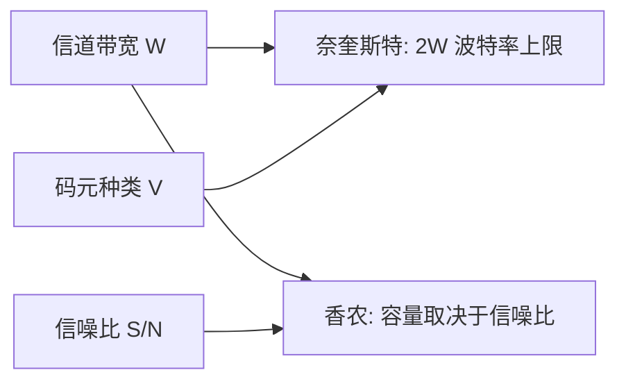
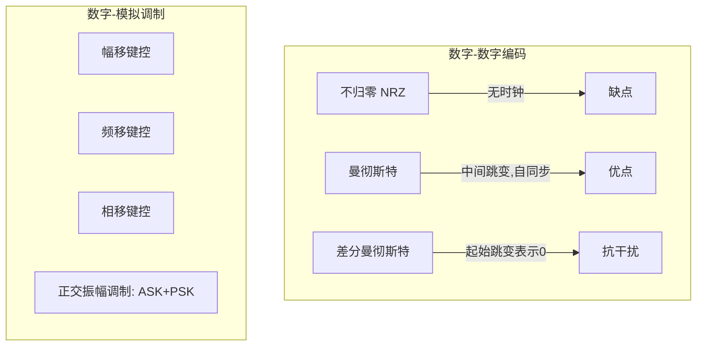
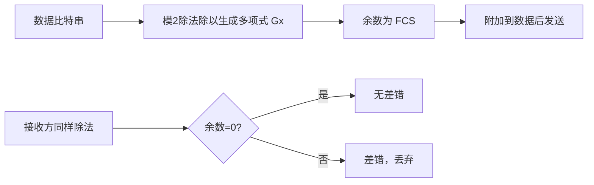
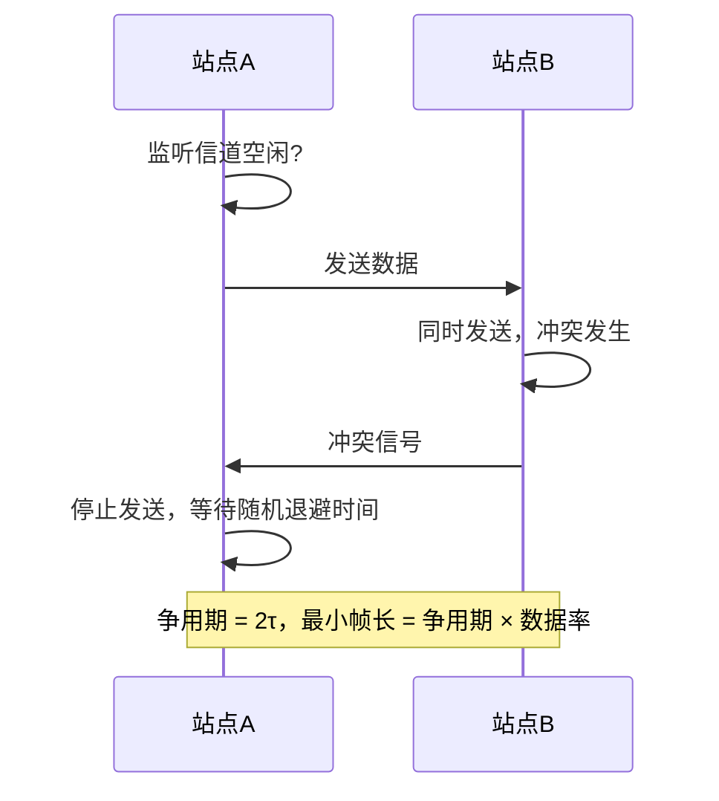
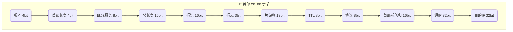
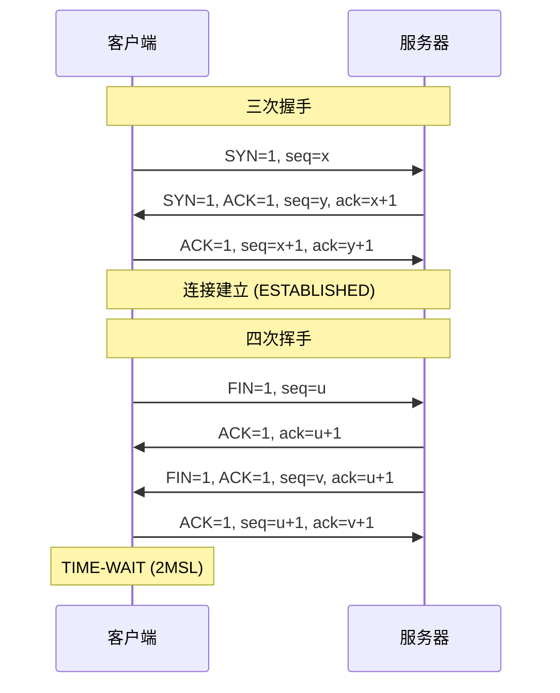
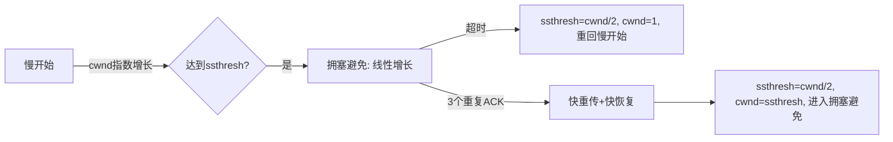
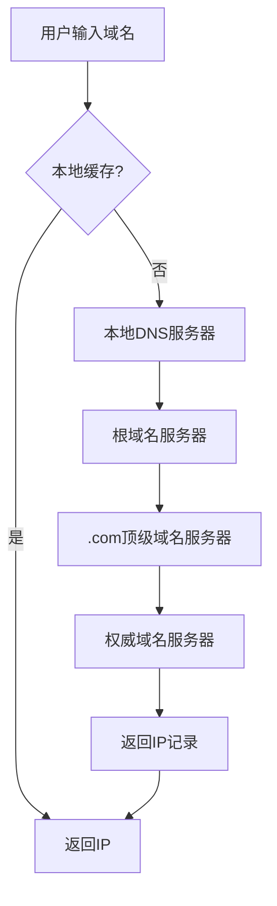

# 计算机网络 · 考研五层架构图解

> **目标：** 用流程图、公式和表格代替文字堆砌，快速梳理核心考点。\
> **使用说明：** 支持 Mermaid 图表渲染、KaTeX 公式，请在支持的环境中查看。

***

## 1. 物理层

### 1.1 核心定理

| 定理       | 公式                                        | 适用条件       |
| -------- | ----------------------------------------- | ---------- |
| **奈奎斯特** | $$C\_{max} = 2W \log\_2 V$$               | 无噪声、理想低通信道 |
| **香农**   | $$C\_{max} = W \log\_2(1 + \frac{S}{N})$$ | 有高斯噪声、带宽受限 |

> $$ \frac{S}{N} = 10^{\frac{dB}{10}} $$

### 1.2 编码与调制

### 1.3 传输介质与设备

| 介质   | 类型    | 特点                |
| ---- | ----- | ----------------- |
| 双绞线  | 铜线    | 便宜、易安装，CAT5e/6 千兆 |
| 光纤   | 玻璃/塑料 | 单模远距、多模近距、抗干扰     |
| 同轴电缆 | 铜线    | 抗干扰较好，有线电视        |
| 无线   | 电磁波   | 灵活、干扰大            |

- **中继器/集线器**：物理层设备，不隔离冲突域，半双工。

***

## 2. 数据链路层

### 2.1 成帧与差错控制

**成帧方法：**

- 比特填充：`01111110` 标志，遇5个连1插0
- 字符填充：DLE STX / DLE ETX

**CRC 校验流程：**

**海明码：** $2^r \ge m + r + 1$（r校验位，m数据位）

### 2.2 流量控制与可靠传输

| 协议       | 发送窗口            | 接收窗口            | 重传方式      |
| -------- | --------------- | --------------- | --------- |
| 停止-等待    | 1               | 1               | 超时重传      |
| 后退N帧 GBN | $$2^n -1$$      | 1               | 累积确认，回退N帧 |
| 选择重传 SR  | $$\le 2^{n-1}$$ | $$\le 2^{n-1}$$ | 只重传出错帧    |

信道利用率（停止-等待）：\
$$U = \frac{发送时延}{发送时延 + 2 \times 传播时延}$$

### 2.3 介质访问控制 CSMA/CD

**截断二进制指数退避：**\
第 k 次重传，等待时间 $r \times 2\tau$，r∈\[0, 2^k-1]，k ≤ 10。

### 2.4 以太网与交换机

- **MAC 地址**：48 位，前 24 位 OUI
- **帧格式**：前导码 8B | 目的 MAC 6B | 源 MAC 6B | 类型 2B | 数据 46\~1500B | FCS 4B
- **交换机**：自学习 MAC 表，隔离冲突域，支持全双工

***

## 3. 网络层

### 3.1 IP 数据报格式

**分片相关**：片偏移以 8 字节为单位，MF=1 表示还有分片，DF=1 禁止分片。

### 3.2 子网划分与 CIDR

- 子网掩码：网络位全 1，主机位全 0
- 子网数 = $2^{借位数}$ （注意全0全1子网）
- 可用主机数 = $2^{主机位} - 2$

**CIDR 无分类编址**：使用 `IP/前缀`，如 `192.168.1.0/24`，支持路由聚合。

### 3.3 核心协议

**ARP**：IP → MAC 映射，广播请求、单播响应。

**ICMP**：差错报告（终点不可达3、超时11）、询问（回显8/0 → Ping）。

**路由协议对比**：

| 协议   | 类型      | 算法           | 传输层     | 特点         |
| ---- | ------- | ------------ | ------- | ---------- |
| RIP  | IGP, DV | Bellman-Ford | UDP 520 | 15跳限制，慢收敛  |
| OSPF | IGP, LS | Dijkstra SPF | IP 89   | 分层区域，快速收敛  |
| BGP  | EGP     | 路径向量         | TCP 179 | AS间路由，策略控制 |

### 3.4 NAT 与 IPv6

- **NAT**：私有地址 ↔ 公共地址转换，NAPT 使用端口号区分
- **IPv6**：128 位地址，简化首部，无分片（PMTU），无校验和

***

## 4. 传输层

### 4.1 UDP 与 TCP 对比

| 特性      | UDP            | TCP       |
| ------- | -------------- | --------- |
| 连接      | 无连接            | 面向连接      |
| 可靠性     | 不可靠            | 可靠        |
| 首部长度    | 8 字节           | 20\~60 字节 |
| 流量/拥塞控制 | 无              | 有         |
| 适用场景    | DNS, DHCP, 流媒体 | 文件传输, 网页  |

### 4.2 TCP 三次握手与四次挥手

**为什么三次握手？** 防止已失效的连接请求到达服务器。

### 4.3 TCP 流量控制与拥塞控制

**流量控制**：滑动窗口机制，接收方窗口字段控制发送速率。

**拥塞控制**：

***

## 5. 应用层

### 5.1 DNS 域名解析

**记录类型**：A (IPv4)、AAAA (IPv6)、CNAME (别名)、MX (邮件)、NS (域名服务器)

### 5.2 HTTP 协议

- **请求报文**：方法 (GET/POST) | URL | 版本 | 头部字段
- **响应报文**：状态码 (2xx成功, 3xx重定向, 4xx客户端错误, 5xx服务器错误)
- **HTTP/2**：二进制分帧、多路复用、头部压缩

### 5.3 其他应用协议

| 协议   | 端口            | 传输层 | 用途          |
| ---- | ------------- | --- | ----------- |
| FTP  | 21(控制)/20(数据) | TCP | 文件传输        |
| SMTP | 25            | TCP | 发送邮件        |
| POP3 | 110           | TCP | 接收邮件(下载删除)  |
| IMAP | 143           | TCP | 接收邮件(服务器保留) |
| DHCP | 67/68         | UDP | 动态IP配置      |

**DHCP 交互过程**：Discover → Offer → Request → ACK

***

> **提示**：本文档可配合 Mermaid 插件与 KaTeX 渲染器使用，建议在 Typora、VS Code 或支持 Markdown 的笔记软件中打开。\
> 覆盖全部考研五层核心知识点，通过图表、公式串联体系，减少大段文字，提高复习效率。

以上就是一份以图解和公式为主的计算机网络知识点 MD 文件，适合在支持 Mermaid 和 KaTeX 的编辑器中查看，用于快速复习考研核心内容。
