# JVM 深度解析 · 从类加载到垃圾回收的全链路剖析

> 本文以 HotSpot JDK 21 LTS 为基准，深入剖析 JVM 内核机制：从类加载子系统与双亲委派模型，到运行时数据区与对象内存布局，从垃圾回收算法与收集器演进，到 JIT 编译优化与 JMM 内存模型。
> 每个场景均配备详细的 Mermaid 架构图与时序图，标注核心数据结构、关键 JVM 参数与源码路径，适合 #[C|3 年以上经验的 Java 后端开发者] 深入研读。

***

## JVM 核心架构总览

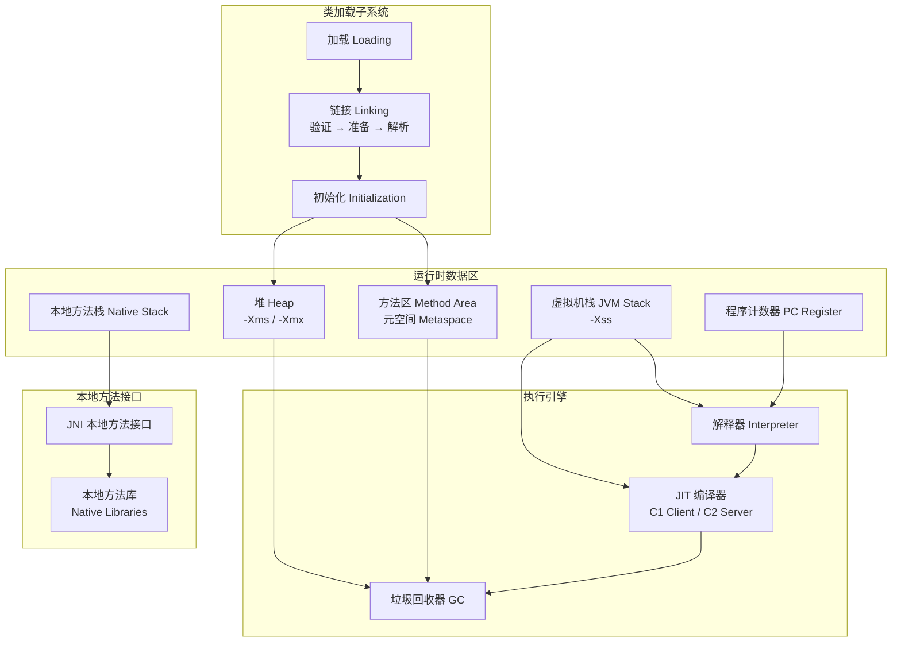

:::important
本文所有分析基于 #[R|HotSpot JDK 21 LTS]，核心源码路径位于 `src/hotspot/share/` 目录下。所有 Mermaid 图表中标注的结构体名、函数名与配置参数均为真实 API。关键源码文件：`classFileParser.cpp` 类解析、`klass.cpp` 类元信息、`universe.cpp` 堆初始化、`thread.cpp` 线程管理、`sharedRuntime.cpp` JIT 编译、`g1CollectedHeap.cpp` G1 收集器、`zCollectedHeap.cpp` ZGC 收集器。
:::

| 层级 | 组件 | 核心职责 | 关键源码 |
|------|------|----------|----------|
| 类加载 | ClassLoader 子系统 | 加载、链接、初始化类 | `src/hotspot/share/classfile/` |
| 内存管理 | 运行时数据区 | 堆、栈、方法区、程序计数器 | `src/hotspot/share/memory/` |
| 执行引擎 | 解释器 + JIT 编译器 | 字节码解释与即时编译 | `src/hotspot/share/interpreter/`、`opto/` |
| GC 子系统 | 垃圾收集器 | 自动内存回收 | `src/hotspot/share/gc/` |
| 本地接口 | JNI | 调用本地方法 | `src/hotspot/share/prims/` |

***

## 场景一：JVM 架构总览 · 从源码到运行时的全貌

### 1.0 场景概览

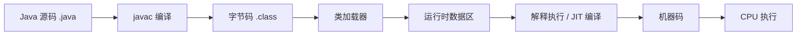

| 阶段 | 核心组件 | 关键机制 | 源码位置 |
|------|----------|----------|----------|
| 编译 | `javac` | Java 源码 → 字节码 .class 文件 | JDK `com.sun.tools.javac` |
| 类加载 | ClassLoader | 双亲委派、加载→链接→初始化 | `classFileParser.cpp` |
| 内存分配 | 运行时数据区 | 堆、栈、方法区、程序计数器 | `universe.cpp`、`thread.cpp` |
| 执行 | 解释器 + JIT | 字节码解释 → 热点代码编译 | `templateInterpreter.cpp`、`c2compiler.cpp` |
| GC | 垃圾收集器 | 自动内存回收 | `g1CollectedHeap.cpp`、`zCollectedHeap.cpp` |

### 1.1 HotSpot JVM 启动流程

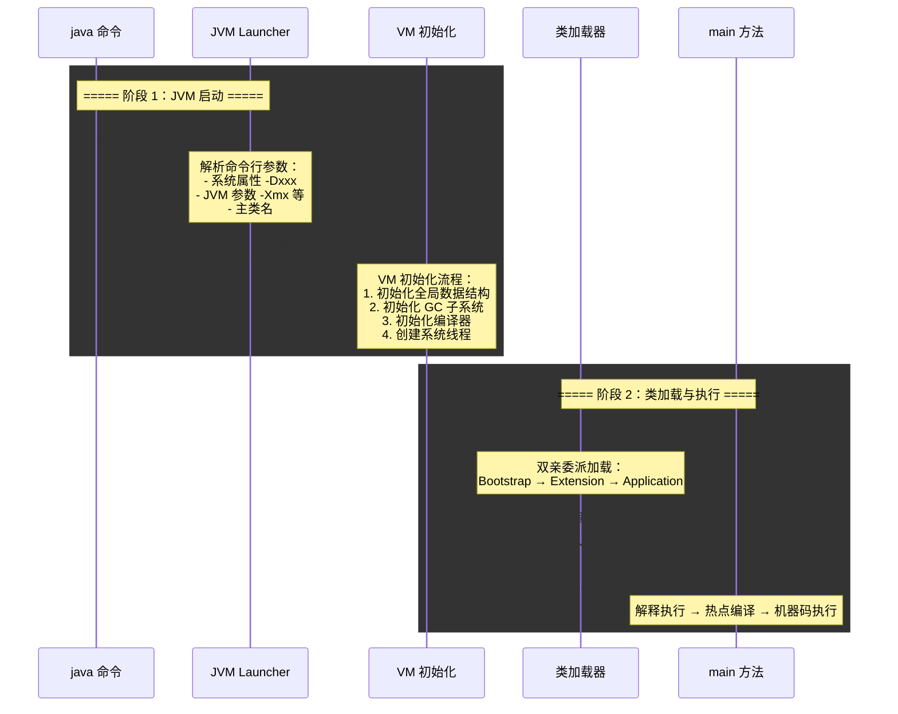

### 1.2 JVM 内存模型全景

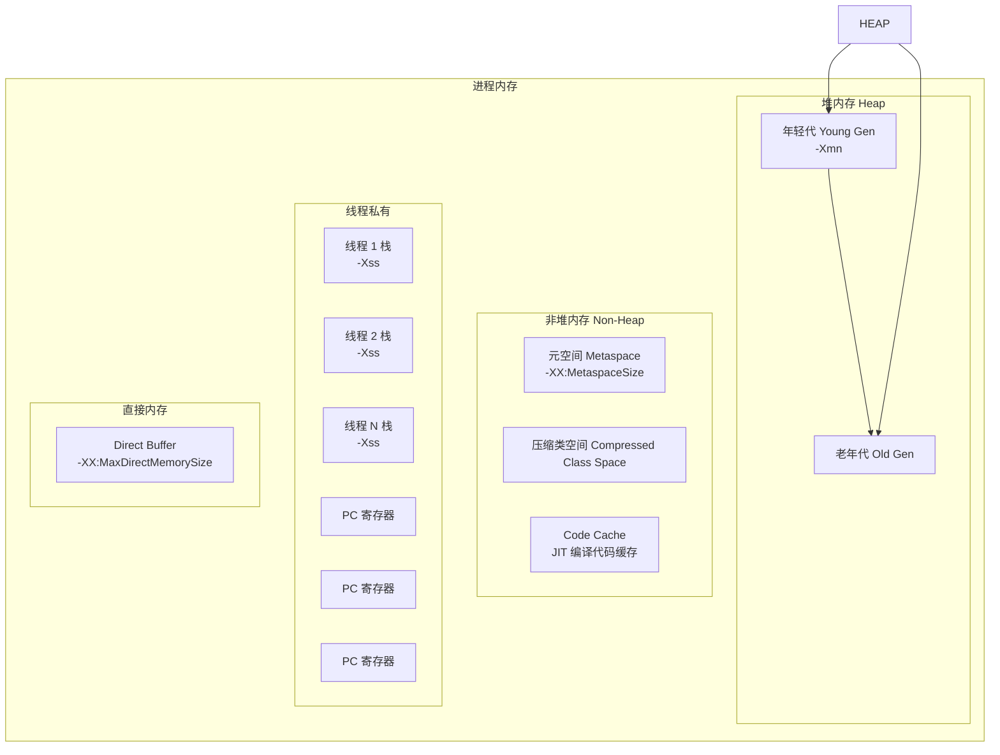

| 内存区域 | 线程共享 | 存储内容 | 关键参数 |
|----------|----------|----------|----------|
| 堆 Heap | 是 | 对象实例、数组 | `-Xms`、`-Xmx`、`-Xmn` |
| 元空间 Metaspace | 是 | 类元数据、方法信息、常量池 | `-XX:MetaspaceSize`、`-XX:MaxMetaspaceSize` |
| 虚拟机栈 | 否 | 栈帧（局部变量表、操作数栈等） | `-Xss` |
| 本地方法栈 | 否 | Native 方法调用 | 与虚拟机栈类似 |
| 程序计数器 | 否 | 当前线程执行字节码行号 | 无（很小） |
| 直接内存 | 否 | NIO DirectBuffer | `-XX:MaxDirectMemorySize` |

### 1.3 JVM 参数速查表

| 参数 | 说明 | 示例 |
|------|------|------|
| `-Xms` | 初始堆大小 | `-Xms2g` |
| `-Xmx` | 最大堆大小 | `-Xmx4g` |
| `-Xmn` | 年轻代大小 | `-Xmn1g` |
| `-Xss` | 线程栈大小 | `-Xss256k` |
| `-XX:MetaspaceSize` | 元空间初始大小 | `-XX:MetaspaceSize=128m` |
| `-XX:MaxMetaspaceSize` | 元空间最大大小 | `-XX:MaxMetaspaceSize=256m` |
| `-XX:MaxDirectMemorySize` | 最大直接内存 | `-XX:MaxDirectMemorySize=512m` |
| `-XX:SurvivorRatio` | Eden/Survivor 比例 | `-XX:SurvivorRatio=8` |
| `-XX:NewRatio` | 老年代/年轻代比例 | `-XX:NewRatio=2` |
| `-XX:+UseG1GC` | 使用 G1 收集器 | JDK 9+ 默认 |
| `-XX:+UseZGC` | 使用 ZGC 收集器 | JDK 21+ 推荐 |
| `-XX:MaxGCPauseMillis` | 最大 GC 停顿目标 | `-XX:MaxGCPauseMillis=200` |

***

## 场景二：类加载机制 · 双亲委派与打破

### 2.0 场景概览

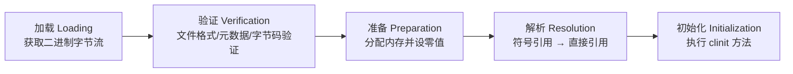

| 阶段 | 做什么 | 什么时候触发 | 可能抛出异常 |
|------|--------|-------------|-------------|
| 加载 | 获取类的二进制字节流，生成 Class 对象 | 首次主动使用 | `NoClassDefFoundError` |
| 验证 | 确保 Class 文件格式正确 | 加载完成后 | `VerifyError` |
| 准备 | 为 static 变量分配内存并设零值 | 验证通过后 | `OutOfMemoryError` |
| 解析 | 符号引用转为直接引用 | 可在初始化后 | `NoSuchFieldError`、`NoSuchMethodError` |
| 初始化 | 执行 static 代码块和赋值 | 首次主动使用 | `ExceptionInInitializerError` |

### 2.1 类加载时序图

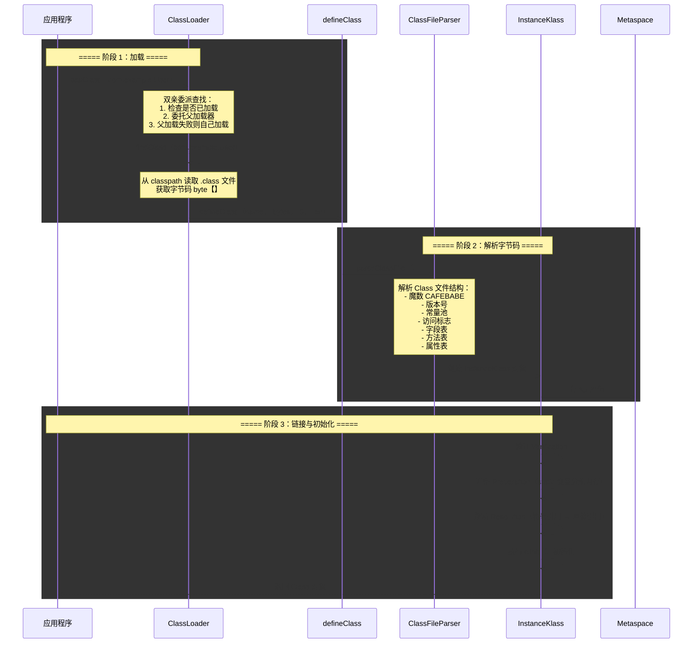

### 2.2 双亲委派模型

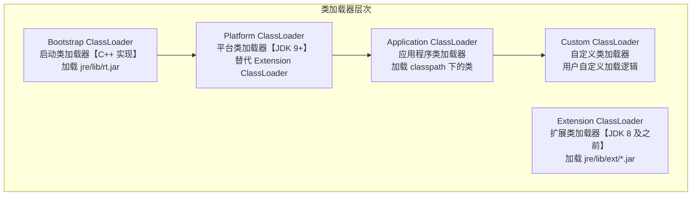

| 类加载器 | JDK 8 | JDK 9+ | 加载路径 |
|----------|-------|--------|----------|
| Bootstrap | Bootstrap ClassLoader | Bootstrap ClassLoader | `jre/lib/rt.jar`、`java.base` 模块 |
| Extension | Extension ClassLoader | —（已移除） | `jre/lib/ext/*.jar` |
| Platform | —（不存在） | Platform ClassLoader | `java.*` 模块（除 `java.base`） |
| Application | App ClassLoader | App ClassLoader | `-classpath`、`-cp` 指定路径 |

**双亲委派源码分析**（`java.lang.ClassLoader.loadClass`）：

```java
protected Class<?> loadClass(String name, boolean resolve)
        throws ClassNotFoundException {
    synchronized (getClassLoadingLock(name)) {
        // 第一步：检查是否已经加载过
        Class<?> c = findLoadedClass(name);
        if (c == null) {
            try {
                // 第二步：委托父加载器加载
                if (parent != null) {
                    c = parent.loadClass(name, false);
                } else {
                    // 第三步：父加载器为空，使用 Bootstrap ClassLoader
                    c = findBootstrapClassOrNull(name);
                }
            } catch (ClassNotFoundException e) {
                // 父加载器无法加载，继续下一步
            }
            if (c == null) {
                // 第四步：自己加载
                c = findClass(name);
            }
        }
        if (resolve) {
            resolveClass(c);
        }
        return c;
    }
}
```

**双亲委派模型优势**：
- 避免类重复加载：父加载器已加载的类，子加载器不再加载
- 安全隔离：核心 API 由 Bootstrap 加载，防止篡改（如自定义 `java.lang.String` 无效）

**自定义 ClassLoader 实现**：

```java
// 自定义类加载器：从指定路径加载 .class 文件
public class CustomClassLoader extends ClassLoader {
    private String classPath;

    public CustomClassLoader(String classPath) {
        this.classPath = classPath;
    }

    @Override
    protected Class<?> findClass(String name) throws ClassNotFoundException {
        try {
            byte[] data = loadClassData(name);
            // defineClass 将字节数组转换为 Class 对象
            return defineClass(name, data, 0, data.length);
        } catch (IOException e) {
            throw new ClassNotFoundException(name);
        }
    }

    private byte[] loadClassData(String name) throws IOException {
        String path = classPath + name.replace('.', '/') + ".class";
        try (FileInputStream fis = new FileInputStream(path);
             ByteArrayOutputStream bos = new ByteArrayOutputStream()) {
            byte[] buffer = new byte[1024];
            int len;
            while ((len = fis.read(buffer)) != -1) {
                bos.write(buffer, 0, len);
            }
            return bos.toByteArray();
        }
    }
}
```

**ClassLoader 核心方法解析**：

| 方法 | 说明 | 是否可重写 |
|------|------|-----------|
| `loadClass(String name)` | 双亲委派入口，先委托父加载器 | 建议不重写 |
| `findClass(String name)` | 查找类，由子类实现自定义加载逻辑 | 必须重写 |
| `defineClass(String name, byte[] b, int off, int len)` | 将字节数组转换为 Class 对象 | 不可重写 |
| `resolveClass(Class<?> c)` | 链接类（验证 + 准备 + 解析） | 不可重写 |
| `findLoadedClass(String name)` | 查找已加载的类 | 不可重写 |

### 2.3 打破双亲委派模型

:::warning
双亲委派模型并非强制约束，而是推荐实现。在实际应用中，以下场景需要打破双亲委派：
:::

**场景一：Tomcat 类加载机制**

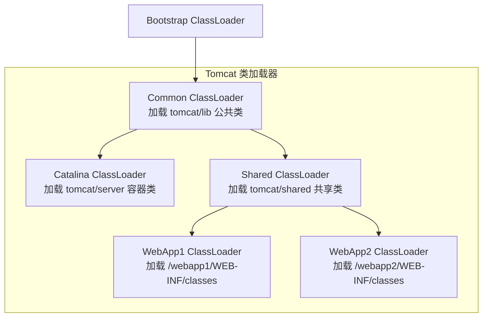

| 设计目标 | 实现方式 |
|----------|----------|
| 应用隔离 | 每个 WebApp 使用独立的 ClassLoader，互不干扰 |
| 共享库 | Common 加载器加载公共 jar，避免重复加载 |
| 热部署 | 替换 WebApp ClassLoader 即可实现热加载 |

**场景二：SPI 机制（ServiceLoader）**

JDK 的 SPI 机制使用 **线程上下文类加载器**（Thread Context ClassLoader）打破双亲委派：

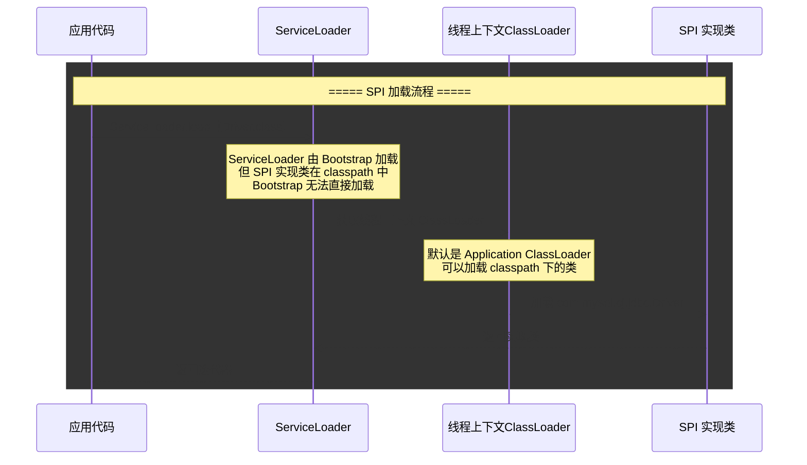

**典型 SPI 示例**：
- JDBC 驱动：`java.sql.Driver` 接口由 Bootstrap 加载，实现类 `com.mysql.cj.jdbc.Driver` 由 Application ClassLoader 加载
- SLF4J 日志门面：接口由 Bootstrap 加载，实现类由应用加载
- JAXP XML 解析器：接口由 Bootstrap 加载，实现类由应用加载

**场景三：OSGi 模块化类加载**

OSGi 使用网状类加载模型，每个 Bundle 有自己的类加载器，通过 `Import-Package` / `Export-Package` 声明依赖关系。这完全打破了双亲委派模型，实现了更灵活的模块化。

### 2.4 类的主动使用与被动使用

| 主动使用（触发初始化） | 被动使用（不触发初始化） |
|------------------------|--------------------------|
| `new` 创建实例 | 引用父类的 static 字段（子类不初始化） |
| 反射调用 | 定义类引用数组 `User[] arr = new User[10]` |
| 子类初始化触发父类初始化 | 引用编译时常量 `static final int = 100` |
| `main` 方法所在类 | — |
| `MethodHandle` 调用 | — |

**示例代码**：

```java
// 被动使用：不触发初始化
class Parent {
    static { System.out.println("Parent init"); }
    static int value = 100;
}
class Child extends Parent {
    static { System.out.println("Child init"); }
}

// 输出：Parent init（仅父类初始化，子类不初始化）
System.out.println(Child.value);
```

***

## 场景三：运行时数据区 · 内存布局与结构

### 3.0 场景概览

```mermaid
graph TB
    subgraph 堆 Heap【线程共享】
        EDEN["Eden 区<br/>对象优先分配区域"]
        S0["Survivor 0<br/>From 区"]
        S1["Survivor 1<br/>To 区"]
        OLD["老年代 Old Gen<br/>大对象 / 长期存活对象"]
    end

    subgraph 方法区【线程共享】
        META_SPACE["元空间 Metaspace<br/>类元数据 / 运行时常量池"]
    end

    subgraph 线程私有
        VM_STACK["虚拟机栈<br/>局部变量表 / 操作数栈"]
        NATIVE_STACK["本地方法栈<br/>Native 方法调用"]
        PC_REG["程序计数器<br/>字节码行号指示器"]
    end

    EDEN --> S0
    EDEN --> S1
    S0 --> OLD
    S1 --> OLD
```

### 3.1 堆内存结构详解

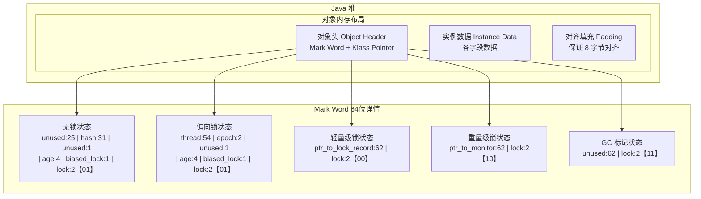

| 区域 | 大小（64位 JVM） | 说明 |
|------|------------------|------|
| Mark Word | 8 字节（未压缩） | 存储 hashCode、GC 年龄、锁状态等 |
| Klass Pointer | 4 字节（压缩后） | 指向类元数据的指针 |
| 实例数据 | 取决于字段 | boolean 1B、byte 1B、char 2B、int 4B、long 8B、引用 4B（压缩） |
| 对齐填充 | 按需 | 确保对象总大小为 8 字节的倍数 |

**对象头源码级分析**（`src/hotspot/share/oops/markWord.hpp`）：

```cpp
// Mark Word 的位布局（64 位）
// 无锁状态：  [ unused:25 | identity_hashcode:31 | cms_free:1 | age:4 | biased_lock:1 | lock:2 ]
// 偏向锁状态：[ thread:54 | epoch:2 | cms_free:1 | age:4 | biased_lock:1 | lock:2 ]
// 轻量级锁状态：[ ptr_to_lock_record:62 | lock:2 ]
// 重量级锁状态：[ ptr_to_monitor:62 | lock:2 ]
// GC 标记状态：[ unused:62 | lock:2 ]

class markWord {
  // 锁状态枚举
  enum lock_bits {
    unlocked_value         = 0b01,  // 无锁
    biased_lock_bits       = 0b01,  // 偏向锁（biased_lock=1）
    stack_locked           = 0b00,  // 轻量级锁
    inflated               = 0b10,  // 重量级锁
    gc_locked              = 0b11,  // GC 标记
  };
};
```

### 3.2 栈帧结构

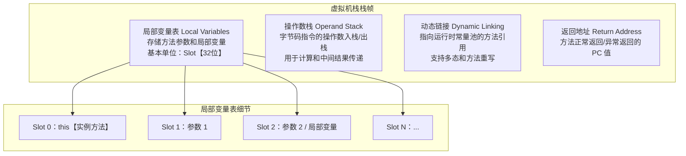

| 栈帧组件 | 作用 | 大小确定时机 |
|----------|------|-------------|
| 局部变量表 | 存储方法参数和局部变量，32 位为一个 Slot | 编译期确定 |
| 操作数栈 | 字节码指令执行时的操作数栈，最大深度编译期确定 | 编译期确定 |
| 动态链接 | 指向运行时常量池中该方法的符号引用，支持多态 | 运行时解析 |
| 返回地址 | 存储调用者 PC 寄存器的值，方法返回后继续执行 | 运行时确定 |

**字节码示例**：

```java
// Java 源码
public int add(int a, int b) {
    int sum = a + b;
    return sum;
}

// 对应字节码指令：
// 0: iload_1        // 将局部变量表 Slot 1【a】压入操作数栈
// 1: iload_2        // 将局部变量表 Slot 2【b】压入操作数栈
// 2: iadd           // 弹出栈顶两个 int 相加，结果压入栈顶
// 3: istore_3       // 将栈顶 int 存入局部变量表 Slot 3【sum】
// 4: iload_3        // 将 Slot 3【sum】压入操作数栈
// 5: ireturn        // 返回栈顶 int
```

### 3.3 方法区演变：永久代 → 元空间

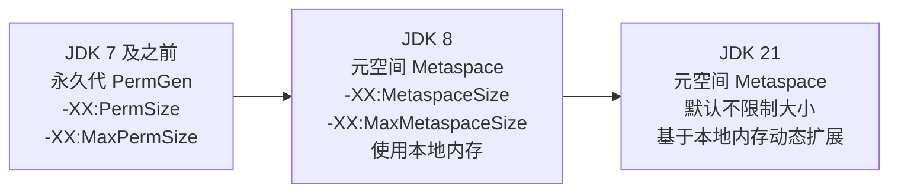

| 特性 | 永久代 PermGen（JDK ≤ 7） | 元空间 Metaspace（JDK ≥ 8） |
|------|---------------------------|----------------------------|
| 存储位置 | JVM 堆内存中 | 本地内存（Native Memory） |
| 默认大小 | 默认 82MB 上限 | 默认无上限，受限于系统内存 |
| OOM | `java.lang.OutOfMemoryError: PermGen space` | `java.lang.OutOfMemoryError: Metaspace` |
| 字符串常量池 | 在永久代中 | 移至堆中 |
| 静态变量 | 在永久代中 | 移至堆中 |
| 调优参数 | `-XX:PermSize`、`-XX:MaxPermSize` | `-XX:MetaspaceSize`、`-XX:MaxMetaspaceSize` |

**元空间内部结构**：

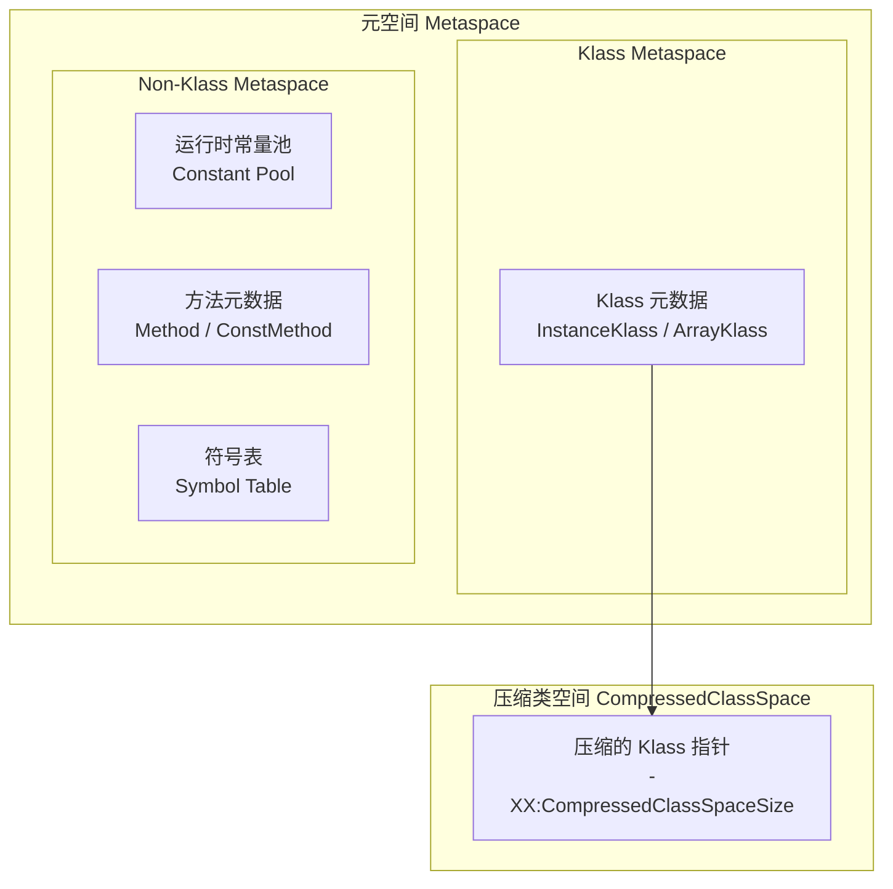

| 元空间组件 | 默认大小 | 参数 |
|------------|----------|------|
| Klass Metaspace | 约 1GB（CompressedClassSpaceSize） | `-XX:CompressedClassSpaceSize=1g` |
| Non-Klass Metaspace | 动态扩展 | `-XX:MaxMetaspaceSize=256m` |
| 元空间总大小 | 默认无限制 | `-XX:MetaspaceSize=128m` |

***

## 场景四：垃圾回收算法 · 从标记到回收

### 4.0 场景概览


| 算法 | 适用区域 | 优点 | 缺点 | 典型收集器 |
|------|----------|------|------|-----------|
| 标记-清除 | 老年代 | 实现简单，不移动对象 | 内存碎片 | CMS 基础算法 |
| 标记-复制 | 年轻代 | 无碎片，速度快 | 内存利用率仅 50% | Serial、ParNew、Parallel Scavenge |
| 标记-整理 | 老年代 | 无碎片，内存利用率高 | 移动对象开销大，停顿时间长 | Serial Old、Parallel Old |
| 分代收集 | 全堆 | 综合以上算法优势 | 跨代引用处理复杂 | G1、CMS |

### 4.1 可达性分析算法

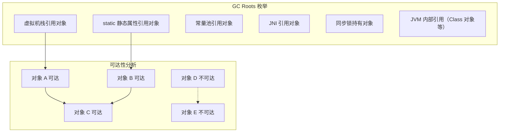

**GC Roots 包含以下内容**：

| GC Root 类型 | 说明 | 示例 |
|-------------|------|------|
| 虚拟机栈引用 | 栈帧中局部变量表引用的堆对象 | 方法参数、局部变量 |
| 静态属性引用 | 方法区中静态属性引用的对象 | `static User user = new User()` |
| 常量池引用 | 运行时常量池中的引用 | `static final String s = "hello"` |
| JNI 引用 | Native 方法中引用的对象 | JNI Global Reference |
| 同步锁持有 | `synchronized` 持有的对象 | 锁对象 |
| JVM 内部引用 | 系统 Class 对象、异常对象等 | 基本类型的 Class 对象 |

### 4.2 三色标记法


**三色标记流程**：

| 步骤 | 操作 | 颜色变化 |
|------|------|----------|
| 初始状态 | 所有对象为白色 | 全部白色 |
| 根扫描 | GC Roots 直接引用的对象标灰 | 灰色 |
| 标记阶段 | 从灰色对象出发，遍历其引用，标灰子对象，自身变黑 | 灰 → 黑 + 新灰 |
| 结束条件 | 灰色集合为空 | 仅剩白色和黑色 |
| 清除阶段 | 回收白色对象 | 黑色存活，白色回收 |

**并发标记中的漏标问题**：

:::warning
并发标记过程中，用户线程与 GC 线程同时运行，可能导致对象被漏标。漏标需要同时满足两个条件：
1. 赋值器插入了一条或多条从黑色对象到白色对象的引用
2. 赋值器删除了全部从灰色对象到该白色对象的直接或间接引用
:::

**解决方案对比**：

| 方案 | 实现方式 | 代表收集器 | 特点 |
|------|----------|-----------|------|
| 增量更新 Incremental Update | 黑色对象新增白色对象引用时，将黑色对象重新标灰 | CMS | 关注引用增加，可能产生浮动垃圾 |
| 原始快照 SATB | 灰色对象删除白色对象引用时，将引用记录到 SATB 队列 | G1、Shenandoah | 关注引用删除，保证不漏标，但可能产生浮动垃圾 |
| 读屏障 + 自愈 | 读操作时通过读屏障触发标记 | ZGC | 在访问时修复，无需 Stop-The-World |

**三色标记法伪代码实现**：

```java
// 三色标记并发标记伪代码
void concurrentMark() {
    // 初始化：所有 GC Roots 放入灰色集合
    for (Object root : gcRoots) {
        graySet.add(root);
    }

    // 标记阶段：从灰色集合取出对象，扫描其引用
    while (!graySet.isEmpty()) {
        Object obj = graySet.remove();  // 取出一个灰色对象

        for (Object ref : obj.getReferences()) {
            if (isWhite(ref)) {
                // 子对象未访问过，标记为灰色
                graySet.add(ref);
            }
        }

        // 当前对象及其所有引用都已处理，标记为黑色
        blackSet.add(obj);
        // 注意：并发期间，用户线程可能修改引用关系
        // 需要写屏障记录变更
    }

    // 清除阶段：所有白色对象都是垃圾
    for (Object obj : heap) {
        if (isWhite(obj)) {
            reclaim(obj); // 回收
        }
    }
}
```

**SATB 原始快照原理**：

SATB（Snapshot At The Beginning）在并发标记开始时拍下对象图的逻辑快照。在并发标记期间，如果某个引用被删除，SATB 会通过写屏障将该引用记录到 SATB 队列中，最终标记阶段会处理这些队列中的引用，确保不会漏标。

```java
// SATB 写屏障伪代码
void satbWriteBarrier(Object src, Object field, Object newValue) {
    // 在删除引用前，记录旧引用
    if (src != null && isBlack(src) && isWhite(field)) {
        // 将旧引用加入 SATB 队列
        satbQueue.enqueue(field);
    }
    // 执行实际的引用赋值
    src.setField(field, newValue);
}
```

**四种引用类型详解**：

| 引用类型 | 回收时机 | 使用场景 | 相关类 |
|----------|----------|----------|--------|
| 强引用 Strong Reference | 永不回收（除非不再可达） | 普通对象引用 | 默认引用 |
| 软引用 Soft Reference | 内存不足时回收 | 缓存实现 | `SoftReference` |
| 弱引用 Weak Reference | 下次 GC 时回收 | WeakHashMap、ThreadLocal | `WeakReference` |
| 虚引用 Phantom Reference | 任何时候都可能回收 | 对象回收跟踪、直接内存管理 | `PhantomReference` |

**引用队列与虚引用示例**：

```java
// 虚引用 + 引用队列：用于跟踪对象回收
ReferenceQueue<Object> queue = new ReferenceQueue<>();
Object obj = new Object();
PhantomReference<Object> phantomRef = new PhantomReference<>(obj, queue);

// 当 obj 被 GC 回收后，phantomRef 会被加入 queue
obj = null;
System.gc();

// 从队列中取出虚引用，执行清理操作
Reference<?> ref = queue.poll();
if (ref != null) {
    // 执行清理逻辑（如释放直接内存）
    System.out.println("对象已被回收，执行清理");
}
```

**引用类型在 GC 中的应用**：

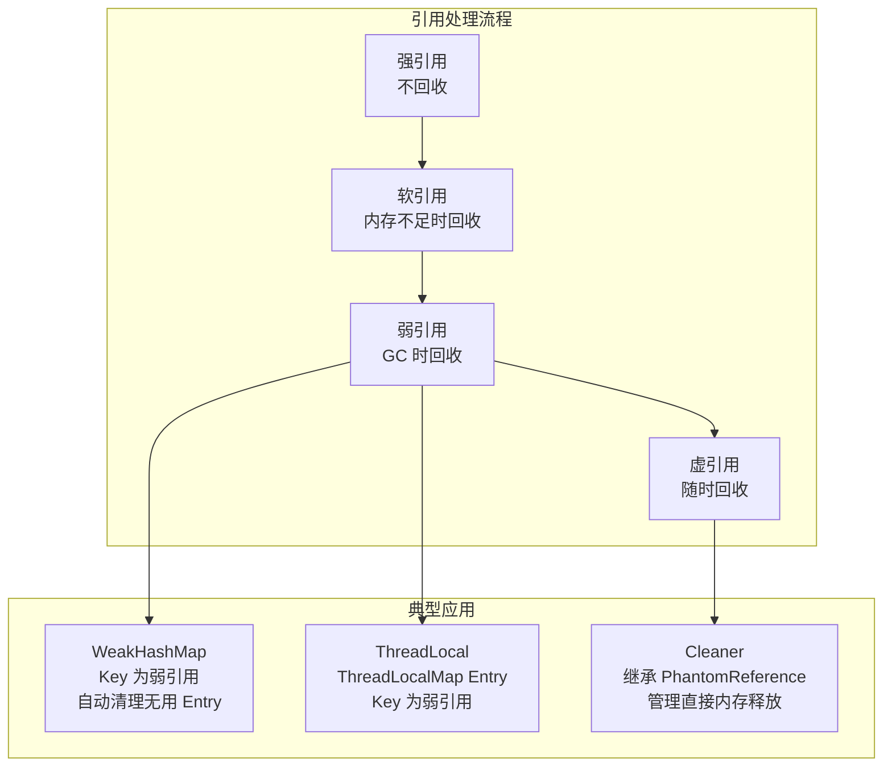

**finalize 方法**：

:::warning
`finalize()` 方法已被 JDK 9 标记为 `@Deprecated`，JDK 18 标记为 `@Deprecated(forRemoval=true)`。不推荐使用，建议使用 `Cleaner` 或 `try-with-resources` 替代。
:::

```java
// finalize 的工作流程（不推荐使用）
public class FinalizeDemo {
    @Override
    protected void finalize() throws Throwable {
        try {
            // 清理资源
            System.out.println("finalize 被调用");
        } finally {
            super.finalize();
        }
    }
}

// 对象回收流程：
// 1. 可达性分析发现对象不可达
// 2. 检查是否覆盖了 finalize() 且未执行过
// 3. 若是，放入 F-Queue 等待 Finalizer 线程执行
// 4. 执行 finalize() 后，GC 再次检查可达性
// 5. 仍不可达则回收，若在 finalize() 中重新建立引用则不回收
```

### 4.4 GC 性能指标

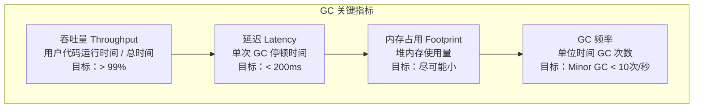

| 指标 | 计算公式 | 健康值 | 获取方式 |
|------|----------|--------|----------|
| 吞吐量 | `1 - (GC总时间 / 运行总时间)` | > 99% | `jstat -gcutil` 的 GCT 列 |
| GC 延迟 | 每次 GC 的 STW 时间 | Minor < 50ms，Full < 1s | GC 日志 |
| 内存分配速率 | 单位时间分配的对象大小 | < 1GB/s | GC 日志 |
| 晋升速率 | 单位时间晋升到老年代的对象大小 | < 100MB/s | GC 日志 |
| 存活对象比例 | Minor GC 后存活对象占比 | < 10% | GC 日志 |

### 4.5 跨代引用处理

| 机制 | 作用 | 实现方式 |
|------|------|----------|
| Card Table 卡表 | 记录老年代中哪些区域存在跨代引用 | 将老年代分成 512 字节的 Card，每个 Card 用一个 bit 标记是否"脏" |
| Remembered Set RSet | G1 中记录 Region 外部指向内部的引用 | 每个 Region 维护一个 RSet |
| 写屏障 Write Barrier | 当引用赋值时，记录跨代引用 | 在赋值操作前后插入屏障代码 |

**Card Table 源码分析**（`src/hotspot/share/gc/shared/cardTable.hpp`）：

```cpp
class CardTable : public ModRefBarrierSet {
  // 卡表大小：每个 Card 代表 512 字节（2^9 = 512）
  // card_shift = 9
  static const int card_shift = 9;
  static const int card_size  = 1 << card_shift;  // 512 字节

  // 卡表是一个字节数组，每个字节对应 512 字节的老年代区域
  // 脏卡标记为 dirty_card_val，干净卡标记为 clean_card_val
  jbyte* _byte_map;

  // 判断一个地址对应的 Card 是否脏
  bool is_card_dirty(size_t card_index) {
    return _byte_map[card_index] == dirty_card_val;
  }
};
```

***

## 场景五：垃圾收集器 · 从 Serial 到 ZGC

### 5.0 场景概览

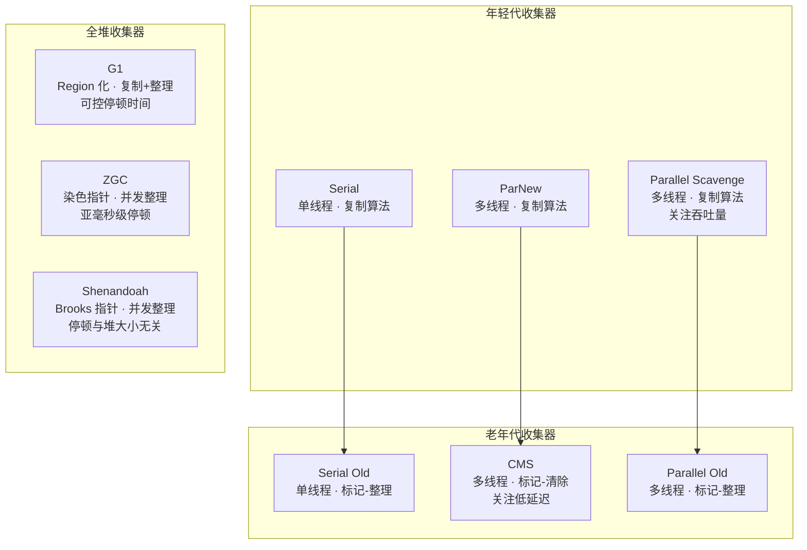

| 收集器 | 年代 | 算法 | 线程 | 目标 | 推荐场景 |
|--------|------|------|------|------|----------|
| Serial | 年轻代 | 标记-复制 | 单线程 | 简单高效 | 桌面应用、小堆 |
| ParNew | 年轻代 | 标记-复制 | 多线程 | 低延迟 | 配合 CMS 使用 |
| Parallel Scavenge | 年轻代 | 标记-复制 | 多线程 | 高吞吐量 | 批处理、科学计算 |
| Serial Old | 老年代 | 标记-整理 | 单线程 | 简单 | 配合 Serial |
| CMS | 老年代 | 标记-清除 | 多线程 | 低延迟 | JDK 8 及以前 |
| Parallel Old | 老年代 | 标记-整理 | 多线程 | 高吞吐量 | 配合 Parallel Scavenge |
| G1 | 全堆 | 复制+整理 | 多线程 | 可控停顿 | JDK 9+ 默认 |
| Shenandoah | 全堆 | 并发整理 | 多线程 | 极低延迟 | 大堆低延迟 |
| ZGC | 全堆 | 并发整理 | 多线程 | 亚毫秒级 | JDK 21+ 推荐 |

### 5.1 GC 触发流程

```mermaid
sequenceDiagram
    participant APP as 应用程序
    participant EDEN as Eden 区
    participant SURVIVOR as Survivor 区
    participant OLD_GEN as 老年代
    participant GC as GC 线程

    rect rgba【240， 248， 255， 0.4】
    Note over APP,EDEN: ===== Minor GC 触发 =====
    APP->>EDEN: 分配对象
    Note over EDEN: Eden 区满
    EDEN->>GC: 触发 Minor GC【Young GC】
    Note over GC: 复制算法：<br/>1. 标记 Eden + Survivor From 存活对象<br/>2. 复制到 Survivor To<br/>3. 清理 Eden + Survivor From<br/>4. 交换 From 和 To
    GC->>SURVIVOR: 复制存活对象到 Survivor To
    Note over SURVIVOR: 年龄 +1<br/>年龄达到阈值【默认 15】则晋升
    GC->>OLD_GEN: 晋升老年代
    end

    rect rgba【240， 255， 248， 0.4】
    Note over OLD_GEN,GC: ===== Major GC / Full GC =====
    APP->>OLD_GEN: 老年代空间不足
    OLD_GEN->>GC: 触发 Major GC / Full GC
    Note over GC: 标记-整理算法：<br/>1. 标记所有存活对象<br/>2. 将存活对象向一端移动<br/>3. 清理边界外内存
    GC->>OLD_GEN: 整理老年代
    end
```

### 5.2 CMS 收集器详解

```mermaid
sequenceDiagram
    participant APP as 应用线程
    participant CMS as CMS 收集器
    participant HEAP as 堆内存

    rect rgba【240， 248， 255， 0.4】
    Note over APP,CMS: ===== 阶段 1：初始标记 STW =====
    Note over CMS: 仅标记 GC Roots 直接关联对象<br/>速度很快，停顿时间短
    CMS->>HEAP: 标记 GC Roots 直接引用
    end

    rect rgba【240， 255， 248， 0.4】
    Note over APP,CMS: ===== 阶段 2：并发标记 =====
    Note over APP: 用户线程与 GC 线程同时运行
    Note over CMS: 从 GC Roots 开始遍历对象图<br/>使用增量更新防止漏标
    CMS->>CMS: 三色标记遍历
    APP->>APP: 用户线程正常运行
    end

    rect rgba【255， 248， 240， 0.4】
    Note over APP,CMS: ===== 阶段 3：重新标记 STW =====
    Note over CMS: 修正并发标记期间变动的引用<br/>重新标记并发期间变成的灰色对象
    CMS->>HEAP: 修正标记结果
    Note over HEAP: 增量更新：将并发期间<br/>新增引用的黑色对象重新标灰
    end

    rect rgba【255， 240， 248， 0.4】
    Note over APP,CMS: ===== 阶段 4：并发清除 =====
    Note over APP: 用户线程与 GC 线程同时运行
    Note over CMS: 清除未标记对象
    CMS->>HEAP: 清除白色对象
    APP->>APP: 用户线程正常运行
    end
```

| CMS 阶段 | 是否 STW | 耗时 | 说明 |
|----------|----------|------|------|
| 初始标记 | 是 | 短 | 标记 GC Roots 直接关联对象 |
| 并发标记 | 否 | 长 | 从 GC Roots 遍历对象图 |
| 重新标记 | 是 | 中 | 修正并发标记期间变动的引用 |
| 并发清除 | 否 | 长 | 清除未标记的垃圾对象 |

**CMS 缺点**：
- 并发标记阶段占用 CPU 资源，降低吞吐量
- 标记-清除算法产生内存碎片，可能导致 `Concurrent Mode Failure`
- 无法处理浮动垃圾，需要预留空间给并发阶段
- JDK 14 已移除 CMS，建议迁移至 G1 或 ZGC

**CMS 关键参数**：

| 参数 | 说明 | 默认值 |
|------|------|--------|
| `-XX:+UseConcMarkSweepGC` | 启用 CMS | — |
| `-XX:CMSInitiatingOccupancyFraction` | 老年代使用率触发 CMS GC | 92%（JDK 8） |
| `-XX:+UseCMSInitiatingOccupancyOnly` | 仅使用设定阈值触发 | false |
| `-XX:ConcGCThreads` | 并发 GC 线程数 | `(3 + ParallelGCThreads) / 4` |
| `-XX:+CMSScavengeBeforeRemark` | 重新标记前先执行一次 Minor GC | true |
| `-XX:+CMSClassUnloadingEnabled` | CMS 回收 PermGen/Metaspace | true |
| `-XX:+ExplicitGCInvokesConcurrent` | `System.gc()` 触发 CMS GC | false |

### 5.3 G1 收集器详解

```mermaid
graph TB
    subgraph G1 堆布局
        REGION1["Region 1<br/>Eden"]
        REGION2["Region 2<br/>Eden"]
        REGION3["Region 3<br/>Survivor"]
        REGION4["Region 4<br/>Old"]
        REGION5["Region 5<br/>Old"]
        REGION6["Region 6<br/>Humongous"]
        REGION7["Region 7<br/>Humongous"]
        REGION8["Region 8<br/>Free"]
        REGION9["Region 9<br/>Free"]
    end

    subgraph Region 类型
        FREE["Free 空闲"]
        EDEN_TYPE["Eden 新生代"]
        SURVIVOR_TYPE["Survivor 幸存区"]
        OLD_TYPE["Old 老年代"]
        HUMONGOUS["Humongous 大对象"]
    end
```

| Region 类型 | 说明 | 占比 |
|-------------|------|------|
| Free | 空闲 Region，可供分配 | 动态变化 |
| Eden | 年轻代 Eden 区 | 默认 5%-60% 堆 |
| Survivor | 年轻代 Survivor 区 | 默认 5%-60% 堆 |
| Old | 老年代 | 动态变化 |
| Humongous | 大对象（超过 Region 50%） | 独立分配 |

**G1 Mixed GC 流程**：

```mermaid
sequenceDiagram
    participant APP as 应用线程
    participant G1 as G1 收集器
    participant CSET as Collection Set
    participant RSET as Remembered Set

    rect rgba【240， 248， 255， 0.4】
    Note over APP,G1: ===== 阶段 1：初始标记 STW =====
    Note over G1: 标记 GC Roots 直接关联对象<br/>借用 Minor GC 的 STW 完成
    G1->>CSET: 标记 GC Roots 直接引用
    end

    rect rgba【240， 255， 248， 0.4】
    Note over APP,G1: ===== 阶段 2：并发标记 =====
    Note over G1: 使用 SATB 原始快照<br/>保证不漏标
    G1->>G1: 三色标记遍历
    APP->>APP: 用户线程并发运行
    end

    rect rgba【255， 248， 240， 0.4】
    Note over APP,G1: ===== 阶段 3：最终标记 STW =====
    Note over G1: 处理 SATB 队列中剩余引用<br/>处理日志缓冲区
    G1->>RSET: 处理 SATB 队列
    end

    rect rgba【255， 240， 248， 0.4】
    Note over APP,G1: ===== 阶段 4：筛选回收 STW =====
    Note over G1: 计算每个 Region 的回收价值<br/>选择回收价值高的 Region 组成 CSet
    G1->>CSET: 选择回收 Region
    G1->>G1: 复制存活对象到新 Region
    end
```

**G1 关键数据结构**：

| 数据结构 | 作用 | 实现 |
|----------|------|------|
| Remembered Set RSet | 记录 Region 外部指向内部的引用 | 每个 Region 维护一个 RSet |
| Collection Set CSet | 本次 GC 需要回收的 Region 集合 | 根据回收价值排序选择 |
| SATB 队列 | 存储并发标记期间删除的引用 | 原始快照保证不漏标 |
| 卡表 Card Table | 细粒度标记跨 Region 引用 | 类似分代收集的卡表 |

**G1 关键参数**：

| 参数 | 说明 | 推荐值 |
|------|------|--------|
| `-XX:+UseG1GC` | 启用 G1 | JDK 9+ 默认 |
| `-XX:MaxGCPauseMillis` | 最大 GC 停顿目标 | 200-500ms |
| `-XX:G1HeapRegionSize` | Region 大小 | 2MB/4MB/8MB/16MB/32MB |
| `-XX:InitiatingHeapOccupancyPercent` | 触发 Mixed GC 的堆使用率 | 45% |
| `-XX:G1NewSizePercent` | 年轻代最小占比 | 5% |
| `-XX:G1MaxNewSizePercent` | 年轻代最大占比 | 60% |
| `-XX:ParallelGCThreads` | 并行 GC 线程数 | CPU 核数 ≤ 8 时等于核数 |
| `-XX:ConcGCThreads` | 并发 GC 线程数 | `ParallelGCThreads / 4` |

### 5.4 ZGC 收集器详解

:::important
ZGC 是 JDK 11 引入的实验性低延迟收集器，JDK 15 正式生产可用，JDK 21 成为推荐选择。其核心设计目标是：**亚毫秒级停顿时间，停顿时间不随堆大小增长**。
:::

```mermaid
graph TB
    subgraph ZGC 核心技术
        COLORED["染色指针 Colored Pointers<br/>64 位指针中嵌入元数据<br/>Marked0/Marked1/Remapped/Finalizable"]
        READ_BARRIER["读屏障 Load Barrier<br/>读取对象时检查指针颜色<br/>自动修正不一致状态"]
        CONCURRENT["并发整理<br/>标记 → 并发重定位 → 并发重映射"]
        NUMA["NUMA 感知<br/>NUMA 架构下分区分配"]
    end

    subgraph 染色指针 42 位地址空间
        PTR_BITS["地址位：42 bits<br/>寻址空间 4TB"]
        COLOR_BITS["颜色位：4 bits<br/>Marked0/Marked1/Remapped/Finalizable"]
        RESERVED["保留位：18 bits"]
    end

    COLORED --> PTR_BITS
    COLORED --> COLOR_BITS
    COLORED --> RESERVED
```

**ZGC 染色指针颜色状态**：

| 颜色 | 含义 | 状态转换 |
|------|------|----------|
| Remapped | 对象已重定位/或已在新位置 | 初始状态 |
| Marked0 | 标记阶段 0 | 并发标记阶段使用 |
| Marked1 | 标记阶段 1 | 大循环标记使用 |
| Finalizable | 对象可被终结 | 仅 finalize 对象 |

**ZGC 并发整理流程**：

```mermaid
sequenceDiagram
    participant APP as 应用线程
    participant ZGC as ZGC 收集器
    participant HEAP as 堆内存

    rect rgba【240， 248， 255， 0.4】
    Note over APP,ZGC: ===== 阶段 1：初始标记 STW =====
    Note over ZGC: 标记 GC Roots 直接关联对象<br/>停顿时间 < 1ms
    ZGC->>HEAP: 标记 GC Roots
    end

    rect rgba【240， 255， 248， 0.4】
    Note over APP,ZGC: ===== 阶段 2：并发标记/重映射 =====
    Note over ZGC: 遍历对象图并标记<br/>同时进行重映射
    ZGC->>ZGC: 三色标记 + 重映射
    APP->>APP: 用户线程并发运行
    end

    rect rgba【255， 248， 240， 0.4】
    Note over APP,ZGC: ===== 阶段 3：再标记 STW =====
    Note over ZGC: 处理并发标记期间遗漏的引用<br/>停顿时间 < 1ms
    ZGC->>HEAP: 修正标记
    end

    rect rgba【255， 240， 248， 0.4】
    Note over APP,ZGC: ===== 阶段 4：并发重定位 =====
    Note over ZGC: 移动对象到新位置<br/>通过读屏障自愈
    ZGC->>HEAP: 重定位对象
    APP->>APP: 读屏障自愈转发指针
    end
```

**ZGC 读屏障自愈机制**：

当应用线程读取一个已被重定位的对象时，读屏障会：
1. 检查指针颜色是否为 Remapped
2. 如果不是，从对象头的转发指针找到新位置
3. 更新引用指向新位置（自愈）
4. 返回新位置的对象

**ZGC 关键参数**：

| 参数 | 说明 | 推荐值 |
|------|------|--------|
| `-XX:+UseZGC` | 启用 ZGC | JDK 21+ 推荐 |
| `-XX:ZAllocationSpikeTolerance` | 分配峰值容忍度 | 2.0 |
| `-XX:ZCollectionInterval` | 最小 GC 间隔（秒） | 0（不限制） |
| `-XX:ZUncommitDelay` | 内存归还延迟（秒） | 300 |
| `-XX:SoftMaxHeapSize` | 软最大堆大小 | 与 `-Xmx` 相同 |
| `-XX:+ZGenerational` | 启用分代 ZGC | JDK 21+ 默认 |

### 5.5 Shenandoah 收集器详解

:::important
Shenandoah 是 Red Hat 主导开发的低延迟收集器，JDK 12 引入（实验性），JDK 15 正式生产可用。其核心设计目标同样是低停顿，但与 ZGC 技术路线不同：使用 **Brooks 转发指针** 而非染色指针。
:::

```mermaid
graph TB
    subgraph Shenandoah 核心技术
        BROOKS["Brooks 转发指针<br/>每个对象头前增加一个转发指针<br/>指向对象当前地址"]
        CONCURRENT_RELOC["并发整理<br/>标记 → 并发整理 → 并发更新引用"]
        LOAD_REF["Load Reference Barrier<br/>读引用屏障<br/>读取时检查转发指针"]
    end

    subgraph Shenandoah GC 阶段
        INIT["初始标记 STW<br/>标记 GC Roots"]
        CONC_MARK["并发标记<br/>遍历对象图"]
        FINAL["最终标记 STW<br/>处理 SATB 队列"]
        CONC_EVAC["并发整理<br/>移动对象到新 Region"]
        CONC_UPDATE["并发更新引用<br/>更新所有指向旧地址的引用"]
        FINAL_UPDATE["最终更新引用 STW<br/>更新 GC Roots 引用"]
        CONC_CLEAN["并发清理<br/>回收空 Region"]
    end

    INIT --> CONC_MARK
    CONC_MARK --> FINAL
    FINAL --> CONC_EVAC
    CONC_EVAC --> CONC_UPDATE
    CONC_UPDATE --> FINAL_UPDATE
    FINAL_UPDATE --> CONC_CLEAN
```

**Shenandoah 与 ZGC 对比**：

| 特性 | Shenandoah | ZGC |
|------|------------|-----|
| 核心技术 | Brooks 转发指针 | 染色指针 |
| 读屏障 | 读引用屏障 | 读指针屏障 |
| 最大停顿 | 与堆大小无关 | 亚毫秒级 |
| 内存开销 | 转发指针（8 字节/对象） | 地址空间（4TB 限制） |
| 分代支持 | 否 | JDK 21+ 分代支持 |
| 平台支持 | Linux/Windows | Linux/Windows/macOS |
| 压缩指针 | 兼容 | 不兼容（64 位指针） |

**Shenandoah 关键参数**：

| 参数 | 说明 | 推荐值 |
|------|------|--------|
| `-XX:+UseShenandoahGC` | 启用 Shenandoah | — |
| `-XX:ShenandoahGCHeuristics` | 启发式策略 | `adaptive`/`static`/`compact`/`aggressive` |
| `-XX:ShenandoahAllocSpikeFactor` | 分配峰值因子 | 5.0 |
| `-XX:ShenandoahGarbageThreshold` | 触发 GC 的垃圾比例 | 60% |
| `-XX:ShenandoahUncommitDelay` | 内存归还延迟（毫秒） | 300000 |

### 5.6 GC 日志解读与调优

**启用 GC 日志（JDK 9+）**：

```bash
# 统一 GC 日志格式
-Xlog:gc*=info:file=gc.log:time,uptime,level,tags:filecount=10,filesize=100M

# 常用 GC 日志配置
-Xlog:gc+heap=debug:file=gc.log    # 包含堆变化
-Xlog:gc+age=trace:file=gc.log     # 包含年龄分布
-Xlog:safepoint:file=gc.log        # 包含安全点信息
```

**GC 日志级别详解**：

| 级别 | 内容 | 使用场景 |
|------|------|----------|
| `off` | 关闭日志 | 生产环境不输出 |
| `error` | 仅错误信息 | 生产环境最低配置 |
| `warning` | 警告 + 错误 | 生产环境推荐 |
| `info` | 关键信息 + 警告 + 错误 | 生产环境常规配置 |
| `debug` | 调试信息 + 关键信息 | 测试环境 |
| `trace` | 所有信息 | 开发环境/问题排查 |

**不同 GC 日志标签**：

| 标签 | 含义 | 示例 |
|------|------|------|
| `gc` | 基础 GC 日志 | GC 类型、堆变化、耗时 |
| `gc+heap` | 堆内存变化 | 各区域使用量变化 |
| `gc+age` | 对象年龄分布 | Survivor 区年龄分布 |
| `gc+phases` | GC 各阶段详情 | 标记、清除等各阶段耗时 |
| `gc+ergo` | GC 自适应决策 | G1 动态调整 Region 大小 |
| `gc+task` | GC 任务详情 | 各 GC 线程的任务分配 |
| `gc+meta` | 元空间 GC | 元空间回收信息 |
| `safepoint` | 安全点信息 | 到达安全点耗时 |

**G1 GC 日志示例解读**：

```
[2024-01-15T10:30:00.123+0800][info][gc] GC(100) Pause Young (Normal)
    (G1 Evacuation Pause) 150M->50M(200M) 10.5ms
[2024-01-15T10:30:00.123+0800][info][gc,cpu] GC(100) User=0.05s Sys=0.01s Real=0.01s
```

| 日志字段 | 含义 |
|----------|------|
| `GC(100)` | 第 100 次 GC |
| `Pause Young (Normal)` | 年轻代 GC，正常停顿 |
| `G1 Evacuation Pause` | G1 的疏散停顿 |
| `150M->50M(200M)` | 堆使用量从 150M 降到 50M（总容量 200M） |
| `10.5ms` | 停顿时间 10.5 毫秒 |
| `User=0.05s` | 用户态 CPU 时间 |
| `Sys=0.01s` | 内核态 CPU 时间 |
| `Real=0.01s` | 实际经过时间 |

**GC 调优决策树**：

```mermaid
graph TB
    START["开始 GC 调优"] --> Q1["堆内存是否充足？"]
    Q1 -->|"否"| A1["增大堆内存<br/>-Xms -Xmx"]
    Q1 -->|"是"| Q2["停顿时间是否满足？"]
    Q2 -->|"否"| Q3["当前使用哪种收集器？"]
    Q3 -->|"Parallel"| A2["切换 G1 或 ZGC"]
    Q3 -->|"G1"| A3["调整 MaxGCPauseMillis<br/>或切换 ZGC"]
    Q3 -->|"ZGC"| A4["检查内存分配速率<br/>增加机器内存"]
    Q2 -->|"是"| Q4["吞吐量是否满足？"]
    Q4 -->|"否"| A5["增加年轻代大小<br/>减少 GC 频率"]
    Q4 -->|"是"| END["调优完成"]
```

**GC 调优常见误区**：

| 误区 | 正确做法 | 说明 |
|------|----------|------|
| 频繁调用 `System.gc()` | 禁止手动触发 GC | 使用 `-XX:+DisableExplicitGC` 禁用 |
| 堆越大越好 | 根据实际需求设置 | 大堆导致 GC 停顿时间延长 |
| 只看 GC 频率不看耗时 | 综合评估 GC 频率和单次耗时 | 高频低耗 vs 低频高耗需权衡 |
| 忽略元空间监控 | 同时监控元空间使用率 | 元空间满也会触发 Full GC |
| 不区分 GC 类型 | 区分 Minor GC / Major GC / Full GC | 不同 GC 类型影响不同 |
| 直接复制网上参数 | 根据实际应用场景调整 | 每个应用的 GC 特征不同 |

**GC 调优实战步骤**：

1. **建立基线**：记录当前 GC 频率、耗时、堆使用率
2. **分析瓶颈**：判断是吞吐量问题还是延迟问题
3. **选择收集器**：延迟敏感选 ZGC/G1，吞吐量优先选 Parallel
4. **调整堆大小**：先调整 `-Xms`/`-Xmx`，再调整年轻代比例
5. **调整 GC 参数**：根据收集器调整停顿目标、线程数等
6. **压测验证**：在预发布环境进行压力测试，对比基线数据
7. **上线观察**：灰度发布，持续监控 GC 日志

**G1 常见问题排查**：

| 问题 | 现象 | 排查方法 | 解决方案 |
|------|------|----------|----------|
| Humongous 对象过多 | 频繁 Full GC | `-XX:+G1PrintHeapRegions` | 减少大对象创建 |
| Mixed GC 耗时过长 | 停顿时间超过目标 | GC 日志中 Mixed GC 耗时 | 降低 `IHOP` 阈值 |
| To-space 溢出 | Evacuation Failure | GC 日志中 `to-space exhausted` | 增大 `G1ReservePercent` |
| 并发标记跟不上 | 并发标记周期未完成 | 日志中 `concurrent mark abort` | 增加 `ConcGCThreads` |
| 年轻代过小 | Minor GC 频繁 | 年轻代占比 < 5% | 增大 `G1NewSizePercent` |

***

## 场景六：对象创建与内存分配

### 6.0 场景概览

```mermaid
graph TB
    NEW["new 关键字"] --> CHECK["类加载检查<br/>类是否已加载？"]
    CHECK -->|"否"| LOAD["加载类"]
    CHECK -->|"是"| ALLOC["分配内存"]
    ALLOC --> TLAB["TLAB 分配<br/>线程本地分配缓冲"]
    ALLOC --> CAS["CAS 竞争分配<br/>指针碰撞 / 空闲列表"]
    TLAB --> ZERO["初始化零值"]
    CAS --> ZERO
    ZERO --> HEADER["设置对象头"]
    HEADER --> INIT["执行 init 方法"]
    INIT --> DONE["对象创建完成"]
```

### 6.1 对象创建全流程

```mermaid
sequenceDiagram
    participant BYTECODE as new 字节码
    participant CONSTPOOL as 常量池
    participant KLASS as InstanceKlass
    participant MEMORY as 内存分配
    participant OBJ as 对象实例

    rect rgba【240， 248， 255， 0.4】
    Note over BYTECODE,KLASS: ===== 阶段 1：类加载检查 =====
    BYTECODE->>CONSTPOOL: 定位类符号引用
    CONSTPOOL->>KLASS: 检查是否已加载
    Note over KLASS: 若未加载：<br/>触发类加载 → 链接 → 初始化
    end

    rect rgba【240， 255， 248， 0.4】
    Note over MEMORY,OBJ: ===== 阶段 2：内存分配 =====
    KLASS->>MEMORY: 计算对象大小（对象头 + 实例数据 + 对齐）
    Note over MEMORY: 优先尝试 TLAB 分配<br/>TLAB 空间不足则 CAS 竞争分配
    MEMORY->>MEMORY: 指针碰撞【堆规整】/ 空闲列表【堆不规整】
    MEMORY->>OBJ: 返回内存地址
    end

    rect rgba【255， 248， 240， 0.4】
    Note over OBJ: ===== 阶段 3：初始化 =====
    OBJ->>OBJ: 初始化零值（字段默认值）
    Note over OBJ: int → 0<br/>boolean → false<br/>引用 → null
    OBJ->>OBJ: 设置对象头（Mark Word + Klass Pointer）
    OBJ->>OBJ: 执行 init 方法（构造函数）
    end
```

### 6.2 TLAB 详解

:::important
TLAB（Thread Local Allocation Buffer）是 JVM 在 Eden 区为每个线程分配的一块私有缓冲区，用于加速对象分配。默认情况下 TLAB 是开启的，占用 Eden 区 1% 的空间。
:::

```mermaid
graph TB
    subgraph Eden 区
        TLAB1["Thread 1 TLAB<br/>私有的分配缓冲区"]
        TLAB2["Thread 2 TLAB<br/>私有的分配缓冲区"]
        TLAB3["Thread 3 TLAB<br/>私有的分配缓冲区"]
        SHARED["共享 Eden 区"]
    end

    TLAB1 --> SHARED
    TLAB2 --> SHARED
    TLAB3 --> SHARED
```

| TLAB 参数 | 说明 | 默认值 |
|-----------|------|--------|
| `-XX:+UseTLAB` | 启用 TLAB | 默认开启 |
| `-XX:TLABSize` | 指定 TLAB 大小 | 自动计算 |
| `-XX:TLABWasteTargetPercent` | TLAB 浪费空间百分比 | 1% |
| `-XX:+PrintTLAB` | 打印 TLAB 使用情况 | — |
| `-XX:+ZeroTLAB` | TLAB 分配时清零 | 默认开启 |

**TLAB 分配流程**：

```java
// 伪代码：TLAB 分配
if (TLAB 中有足够空间) {
    // 直接在线程私有 TLAB 中分配，无需同步
    obj = allocate_from_tlab(size);
    // 仅需移动 TLAB 的 top 指针
} else {
    // TLAB 空间不足，需要申请新 TLAB 或直接分配
    if (对象大小 > TLAB 最大浪费空间) {
        // 大对象直接在共享 Eden 区分配
        obj = allocate_outside_tlab(size);
    } else {
        // 申请新 TLAB，在 Eden 区分配
        new_tlab = allocate_new_tlab();
        obj = allocate_from_tlab(size);
    }
}
```

### 6.3 对象内存布局

```mermaid
graph LR
    subgraph 对象内存布局【64位 JVM 开启压缩指针】
        MW["Mark Word<br/>8 字节"]
        KP["Klass Pointer<br/>4 字节（压缩）"]
        FIELD1["int 字段<br/>4 字节"]
        FIELD2["long 字段<br/>8 字节"]
        FIELD3["boolean 字段<br/>1 字节"]
        PAD["对齐填充<br/>7 字节"]
    end

    MW --> KP
    KP --> FIELD1
    FIELD1 --> FIELD2
    FIELD2 --> FIELD3
    FIELD3 --> PAD
```

**使用 JOL 分析对象布局**：

```java
// 引入依赖
// org.openjdk.jol:jol-core:0.17

import org.openjdk.jol.info.ClassLayout;
import org.openjdk.jol.vm.VM;

public class ObjectLayoutDemo {
    public static void main(String[] args) {
        System.out.println(VM.current().details());
        System.out.println(ClassLayout.parseInstance(new User()).toPrintable());
    }
}

class User {
    private int id = 1;         // 4 字节
    private String name = "AH"; // 4 字节（压缩指针）
    private long timestamp;     // 8 字节
    private boolean active;     // 1 字节
}

// 输出示例：
// 对象头：Mark Word（8 字节） + Klass Pointer（4 字节） = 12 字节
// 实例数据：id（4B） + name（4B） + timestamp（8B） + active（1B） = 17 字节
// 对齐填充：3 字节
// 总大小：32 字节
```

### 6.4 对象访问定位

```mermaid
graph TB
    subgraph 句柄池方式
        STACK_REF1["栈引用"] --> HANDLE_POOL["句柄池"]
        HANDLE_POOL --> INSTANCE1["实例数据"]
        HANDLE_POOL --> TYPE1["类型数据"]
    end

    subgraph 直接指针方式【HotSpot 默认】
        STACK_REF2["栈引用"] --> INSTANCE2["实例数据"]
        INSTANCE2 --> TYPE2["类型数据"]
    end
```

| 方式 | 优点 | 缺点 | 使用 |
|------|------|------|------|
| 句柄方式 | 对象移动时只需修改句柄池，引用不变 | 两次指针访问，速度慢 | 部分 JVM 实现 |
| 直接指针 | 一次指针访问，速度快 | 对象移动时需更新所有引用 | HotSpot 默认 |

### 6.5 逃逸分析与栈上分配

```mermaid
graph TB
    subgraph 逃逸分析流程
        NEW_OBJ["new 创建对象"] --> ESCAPE["逃逸分析"]
        ESCAPE -->|"不逃逸"| STACK_ALLOC["栈上分配<br/>随栈帧销毁自动回收"]
        ESCAPE -->|"方法逃逸"| HEAP_ALLOC["堆分配<br/>GC 回收"]
        ESCAPE -->|"线程逃逸"| HEAP_ALLOC
    end

    subgraph 优化技术
        SCALAR["标量替换 Scalar Replacement<br/>对象拆解为基本类型字段<br/>直接在栈上分配字段"]
        LOCK_ELIM["锁消除 Lock Elimination<br/>不逃逸的对象无需同步"]
        SYNC_ELIM["同步消除<br/>StringBuffer → StringBuilder"]
    end

    ESCAPE --> SCALAR
    ESCAPE --> LOCK_ELIM
    ESCAPE --> SYNC_ELIM
```

| 逃逸分析参数 | 说明 | 默认值 |
|-------------|------|--------|
| `-XX:+DoEscapeAnalysis` | 启用逃逸分析 | JDK 8+ 默认开启 |
| `-XX:+EliminateAllocations` | 启用标量替换 | 默认开启 |
| `-XX:+EliminateLocks` | 启用锁消除 | 默认开启 |
| `-XX:+PrintEscapeAnalysis` | 打印逃逸分析结果 | 默认关闭（debug 版本） |
| `-XX:+PrintEliminateAllocations` | 打印标量替换信息 | 默认关闭 |

**逃逸分析示例**：

```java
// 不逃逸示例：对象不会逃逸出方法
public int sum() {
    Point p = new Point(1, 2); // p 不逃逸 → 栈上分配 + 标量替换
    return p.x + p.y;
}

// 等价于标量替换后的代码
public int sum() {
    int x = 1;
    int y = 2;
    return x + y;
}

// 方法逃逸示例：对象返回给调用者
public Point createPoint() {
    return new Point(1, 2); // 逃逸 → 堆分配
}
```

***

## 场景七：JIT 编译优化 · 从解释到编译

### 7.0 场景概览

```mermaid
graph TB
    BYTECODE["字节码 Bytecode"] --> INTERP["解释执行<br/>逐条解释字节码"]
    INTERP --> COUNTER["计数器判断<br/>方法调用计数器 + 回边计数器"]
    COUNTER -->|"未达阈值"| INTERP
    COUNTER -->|"达到阈值"| COMPILE["触发 JIT 编译"]
    COMPILE --> C1["C1 编译 Client Compiler<br/>快速编译，较低优化<br/>用于启动阶段"]
    COMPILE --> C2["C2 编译 Server Compiler<br/>深度优化，编译耗时<br/>用于热点代码"]
    C1 --> C2
    C2 --> CACHE["Code Cache<br/>存储编译后的机器码"]
    CACHE --> EXEC["执行机器码"]
```

### 7.1 分层编译

```mermaid
graph TB
    LEVEL0["Level 0：解释执行<br/>无编译，纯解释器运行"]
    LEVEL1["Level 1：C1 简单编译<br/>无 profiling 数据"]
    LEVEL2["Level 2：C1 有限 profiling<br/>仅方法调用次数和回边次数"]
    LEVEL3["Level 3：C1 完整 profiling<br/>所有 profiling 数据"]
    LEVEL4["Level 4：C2 编译<br/>深度优化编译"]

    LEVEL0 --> LEVEL1
    LEVEL0 --> LEVEL3
    LEVEL1 --> LEVEL0
    LEVEL1 --> LEVEL2
    LEVEL2 --> LEVEL3
    LEVEL3 --> LEVEL4
    LEVEL3 --> LEVEL1
    LEVEL4 --> LEVEL1
```

| 编译层级 | 编译器 | Profiling | 编译速度 | 优化程度 |
|----------|--------|-----------|----------|----------|
| Level 0 | 解释器 | 无 | 无需编译 | 最低 |
| Level 1 | C1 | 无 | 最快 | 低 |
| Level 2 | C1 | 有限 | 快 | 中 |
| Level 3 | C1 | 完整 | 中 | 中高 |
| Level 4 | C2 | 无 | 慢 | 最高 |

**编译触发条件**：

| 计数器 | 触发条件 | 默认值 |
|--------|----------|--------|
| 方法调用计数器 | 方法被调用次数达到阈值 | C1：1500 次，C2：10000 次 |
| 回边计数器 | 循环体执行次数达到阈值 | `-XX:CompileThreshold=10000` |
| OSR 编译 | 循环体回边次数达到阈值，触发栈上替换 | 编译器阈值的一定比例 |

**分层编译参数**：

| 参数 | 说明 | 默认值 |
|------|------|--------|
| `-XX:+TieredCompilation` | 启用分层编译 | JDK 8+ 默认开启 |
| `-XX:TieredStopAtLevel` | 限制编译层级 | 4（全部层级） |
| `-XX:CompileThreshold` | 编译阈值 | 10000 |
| `-XX:OnStackReplacePercentage` | OSR 编译阈值百分比 | 140 |
| `-XX:ReservedCodeCacheSize` | Code Cache 大小 | 240MB（JDK 21） |
| `-XX:+PrintCompilation` | 打印编译日志 | 默认关闭 |

### 7.2 JIT 编译优化技术

**方法内联 Inlining**：

```java
// 内联前
public int calculate() {
    return add(1, 2) * 3; // 方法调用开销
}
public int add(int a, int b) {
    return a + b;
}

// 内联后（等价于）
public int calculate() {
    return (1 + 2) * 3; // 无方法调用开销
}
```

**JIT 编译优化技术总览**：

| 优化技术 | 说明 | 示例 |
|----------|------|------|
| 方法内联 | 将方法调用替换为方法体 | 减少方法调用开销 |
| 逃逸分析 | 分析对象作用域 | 栈上分配、标量替换、锁消除 |
| 公共子表达式消除 | 消除重复计算 | `a*b+c` 和 `a*b+d` → `a*b` 只算一次 |
| 数组边界检查消除 | 消除循环内的数组边界检查 | `for(i=0;i<arr.length;i++)` → 已知不越界 |
| 循环展开 | 减少循环迭代次数 | 每次迭代处理多个元素 |
| 空值检查消除 | 消除已知的非空检查 | 已经判空后不再重复判空 |
| 分支预测优化 | 根据 profiling 数据优化分支 | 热点路径优先 |
| 窥孔优化 | 合并相邻指令 | `a=a+1; b=a` → `b=++a` |

**编译优化决策示例**：

```java
// 原始代码
public int sum(int[] arr) {
    int result = 0;
    for (int i = 0; i < arr.length; i++) {
        result += arr[i];
    }
    return result;
}

// JIT 编译优化后等价伪代码：
// 1. 数组边界检查消除：arr.length 已知，循环内不再检查
// 2. 循环展开：每次迭代处理 4 个元素
// 3. 公共子表达式消除：arr.length 只计算一次
public int sum_optimized(int[] arr) {
    int result = 0;
    int len = arr.length; // 只计算一次
    int i = 0;
    // 循环展开 4 倍
    for (; i < len - 3; i += 4) {
        result += arr[i] + arr[i+1] + arr[i+2] + arr[i+3];
    }
    // 处理剩余元素
    for (; i < len; i++) {
        result += arr[i];
    }
    return result;
}
```

**方法内联的限制**：

| 限制条件 | 说明 | 默认值 |
|----------|------|--------|
| 方法体大小 | 超过阈值不内联 | `-XX:MaxInlineSize=35`（字节码字节数） |
| 频繁调用方法大小 | 热点方法放宽限制 | `-XX:FreqInlineSize=325` |
| 调用深度 | 最大内联深度 | `-XX:MaxInlineLevel=9` |
| 总内联代码大小 | 内联后的总代码大小限制 | `-XX:MaxRecursiveInlineLevel=1` |
| 虚方法 | 仅单态调用可内联 | 通过 CHA 分析 |

### 7.3 编译日志查看

**启用编译日志**：

```bash
# 打印编译日志
-XX:+PrintCompilation
-XX:+UnlockDiagnosticVMOptions -XX:+PrintInlining

# 查看编译后的汇编代码
-XX:+UnlockDiagnosticVMOptions -XX:+PrintAssembly
-XX:CompileCommand=print,com.example.MyClass.myMethod

# 编译日志输出示例
# 150  1  3  java.lang.String::hashCode (55 bytes)
# 151  2  3  java.lang.String::charAt (29 bytes)
# 152  3  4  com.example.User::getName (5 bytes)
```

**编译日志字段说明**：

| 字段 | 含义 |
|------|------|
| `150` | 编译 ID |
| `1` | 编译序号 |
| `3` | 编译层级（3 = C1 完整 profiling） |
| `java.lang.String::hashCode` | 编译的方法 |
| `55 bytes` | 字节码大小 |

**JIT 编译触发观测**：

```java
// 使用 JITWatch 或以下代码观测编译
public class JITWatchDemo {
    // -XX:+PrintCompilation 观察编译日志
    // -XX:CompileCommand=print,JITWatchDemo.hotMethod
    public static void main(String[] args) {
        for (int i = 0; i < 100_000; i++) {
            hotMethod(); // 触发 JIT 编译
        }
    }

    public static int hotMethod() {
        int sum = 0;
        for (int i = 0; i < 1000; i++) {
            sum += i;
        }
        return sum;
    }
}
```

### 7.4 Code Cache 管理

```mermaid
graph TB
    subgraph Code Cache 分段
        NON_PROF["Non-Profiled Code<br/>C1 Level 1-2 编译代码"]
        PROF["Profiled Code<br/>C1 Level 3 编译代码"]
        NON_METHOD["Non-Method Code<br/>JVM 内部代码、适配器"]
    end

    subgraph Code Cache 问题
        FULL["Code Cache 满<br/>JIT 编译停止<br/>仅解释执行"]
        SWEEP["Code Cache 清理<br/>Sweeper 线程清理<br/>未使用的编译代码"]
    end

    NON_PROF --> FULL
    PROF --> FULL
    NON_METHOD --> FULL
    FULL --> SWEEP
```

| Code Cache 参数 | 说明 | 默认值 |
|-----------------|------|--------|
| `-XX:ReservedCodeCacheSize` | Code Cache 总大小 | 240MB（JDK 21） |
| `-XX:InitialCodeCacheSize` | 初始 Code Cache 大小 | 2555904（约 2.5MB） |
| `-XX:CodeCacheExpansionSize` | 扩展增量 | 65536（64KB） |
| `-XX:+UseCodeCacheFlushing` | 启用 Code Cache 清理 | 默认开启 |

### 7.5 GraalVM 与 AOT 编译

:::important
GraalVM 是 Oracle 推出的高性能多语言运行时，其核心组件 Graal JIT 编译器可作为 HotSpot C2 的替代品。GraalVM 还支持 AOT（Ahead-of-Time）编译，通过 `native-image` 将 Java 应用编译为原生可执行文件。
:::

```mermaid
graph TB
    subgraph GraalVM 编译模式
        JIT_MODE["JIT 模式<br/>Graal 编译器替代 C2<br/>-XX:+UseGraalJIT"]
        NATIVE["Native Image 模式<br/>AOT 编译为原生可执行文件<br/>native-image 命令"]
        TRUFFLE["Truffle 框架<br/>多语言运行时<br/>支持 JS/Python/Ruby/R"]
    end

    subgraph Native Image 特性
        FAST_START["快速启动<br/>毫秒级启动时间"]
        LOW_MEMORY["低内存占用<br/>无 JVM 运行时开销"]
        STATIC["静态链接<br/>单体可执行文件"]
        RESTRICTION["限制<br/>不支持反射/动态代理/动态类加载<br/>需配置 reflect-config.json"]
    end

    NATIVE --> FAST_START
    NATIVE --> LOW_MEMORY
    NATIVE --> STATIC
    NATIVE --> RESTRICTION
```

**GraalVM Native Image 构建示例**：

```bash
# 安装 GraalVM 和 native-image
gu install native-image

# 编译为原生可执行文件
native-image -jar app.jar --no-fallback -H:Name=myapp

# 运行原生可执行文件
./myapp

# 高级配置示例
native-image \
    -jar app.jar \
    --no-fallback \
    -H:Name=myapp \
    -H:+ReportExceptionStackTraces \
    -H:ReflectionConfigurationFiles=reflect-config.json \
    -H:ResourceConfigurationFiles=resource-config.json \
    -H:JNIConfigurationFiles=jni-config.json \
    -H:ClassInitialization=com.example:build_time \
    --initialize-at-build-time=org.slf4j \
    -R:MaxHeapSize=256m
```

**JIT vs AOT 对比**：

| 特性 | JIT（HotSpot C2） | AOT（GraalVM Native Image） |
|------|-------------------|---------------------------|
| 启动时间 | 秒级 | 毫秒级 |
| 峰值性能 | 高（运行时 profile 优化） | 中（缺少运行时 profile） |
| 内存占用 | 高（JVM 运行时 + Code Cache） | 低（无 JVM 运行时） |
| 二进制大小 | 小（仅 jar 包） | 大（包含运行时库） |
| 动态特性 | 完全支持 | 需要配置 |
| 适用场景 | 长时间运行的服务 | 微服务、Serverless、CLI 工具 |

### 7.6 JVM 安全点 Safepoint

```mermaid
sequenceDiagram
    participant APPS as 应用线程
    participant VM as VM 线程
    participant SAFE as 安全点

    rect rgba【240， 248， 255， 0.4】
    Note over APPS,SAFE: ===== 安全点到达流程 =====
    VM->>VM: 设置全局安全点标志
    VM->>APPS: 通知所有线程需要进入安全点
    Note over APPS: 各线程在安全点位置：<br/>- 方法调用返回<br/>- 循环回边<br/>- 异常跳转<br/>- JNI 调用边界
    APPS->>SAFE: 线程到达安全点并暂停
    VM->>VM: 所有线程到达后执行 VM 操作<br/>GC / 偏向锁撤销 / 类重定义
    VM->>APPS: 清除安全点标志，恢复执行
    end
```

**安全点常见问题**：

| 问题 | 原因 | 解决方案 |
|------|------|----------|
| 安全点到达延迟 | 线程在执行长循环，无安全点检测 | 使用 `-XX:+UseCountedLoopSafepoints` |
| 安全点停顿过长 | 线程数太多，到达安全点时间长 | 减少线程数或使用 ZGC |
| 大页内存安全点停顿 | 大页内存导致的缺页中断 | 启用 `-XX:+AlwaysPreTouch` |
| JNI 临界区阻塞 | JNI 调用中无法进入安全点 | 减少 JNI 调用时间 |

***

## 场景八：JVM 调优实战

### 8.0 场景概览

```mermaid
graph TB
    MONITOR["监控 Monitoring<br/>jstat、jconsole、Prometheus"] --> ANALYZE["分析 Analysis<br/>GC 日志、Heap Dump、Thread Dump"]
    ANALYZE --> TUNE["调优 Tuning<br/>参数调整、代码优化"]
    TUNE --> VERIFY["验证 Verification<br/>压测验证、监控对比"]
    VERIFY --> MONITOR
```

### 8.1 常用 JVM 诊断工具

| 工具 | 用途 | 命令示例 |
|------|------|----------|
| `jps` | 查看 Java 进程 PID | `jps -l` |
| `jstat` | 查看 JVM 统计信息 | `jstat -gcutil <pid> 1000 10` |
| `jmap` | 生成 Heap Dump | `jmap -dump:live,format=b,file=heap.hprof <pid>` |
| `jstack` | 查看线程堆栈 | `jstack -l <pid>` |
| `jinfo` | 查看 JVM 参数 | `jinfo -flags <pid>` |
| `jcmd` | 综合诊断命令 | `jcmd <pid> VM.flags` |
| `jconsole` | 图形化监控 | `jconsole` |
| `jvisualvm` | 可视化分析 | 已从 JDK 中移除，需单独下载 |
| `Arthas` | 阿里开源 Java 诊断 | `java -jar arthas-boot.jar` |
| `MAT` | Eclipse Memory Analyzer | 分析 Heap Dump 文件 |

**jstat 示例**：

```bash
# 每 1 秒输出一次 GC 统计，共 10 次
jstat -gcutil <pid> 1000 10

# 输出列说明：
# S0: Survivor 0 使用率
# S1: Survivor 1 使用率
# E: Eden 区使用率
# O: 老年代使用率
# M: 元空间使用率
# CCS: 压缩类空间使用率
# YGC: 年轻代 GC 次数
# YGCT: 年轻代 GC 总时间
# FGC: Full GC 次数
# FGCT: Full GC 总时间
# GCT: GC 总时间
```

### 8.2 内存泄漏排查

```mermaid
sequenceDiagram
    participant DEV as 开发者
    participant JCMD as jcmd / jmap
    participant MAT as MAT 分析器
    participant CODE as 代码修复

    rect rgba【240， 248， 255， 0.4】
    Note over DEV,JCMD: ===== 步骤 1：获取 Heap Dump =====
    DEV->>JCMD: jcmd pid GC.heap_dump heap.hprof
    Note over JCMD: 或使用 -XX:+HeapDumpOnOutOfMemoryError<br/>自动在 OOM 时生成 Dump
    end

    rect rgba【240， 255， 248， 0.4】
    Note over MAT,CODE: ===== 步骤 2：分析 Heap Dump =====
    DEV->>MAT: 用 MAT 打开 heap.hprof
    Note over MAT: MAT 分析步骤：<br/>1. Leak Suspects Report<br/>2. Dominator Tree<br/>3. Path to GC Roots<br/>4. 查看大对象 / 对象数量异常
    MAT-->>DEV: 定位泄漏对象和引用链
    end

    rect rgba【255， 248， 240， 0.4】
    Note over CODE: ===== 步骤 3：修复验证 =====
    DEV->>CODE: 修复代码<br/>释放无用的引用
    end
```

**常见内存泄漏场景**：

| 场景 | 原因 | 解决方案 |
|------|------|----------|
| ThreadLocal 未清理 | 线程池复用导致 ThreadLocal 未 remove | 使用 finally 中调用 `remove()` |
| 静态集合持续增长 | static HashMap/List 持续添加不删除 | 使用 WeakHashMap 或定期清理 |
| 内部类持有外部引用 | 非静态内部类隐式持有外部类引用 | 使用静态内部类或 WeakReference |
| 未关闭资源 | Stream/Connection 未关闭 | try-with-resources |
| 监听器未注销 | 注册的 Listener 未移除 | 确保 removeListener |
| 缓存无限增长 | 本地缓存没有大小限制 | 使用 Caffeine/Guava Cache 设置最大大小 |

**Arthas 内存泄漏排查**：

```bash
# 启动 Arthas
java -jar arthas-boot.jar

# 查看当前内存使用
memory

# 查看堆内存使用情况
dashboard

# 查看对象直方图（按类型统计）
heapdump --live /tmp/dump.hprof

# 查看类的实例数量
vmtool --action getInstances --className com.example.User --limit 100

# 查看对象引用链
vmtool --action getInstances --className com.example.User --limit 10
    --express 'instances[0]'
```

### 8.3 CPU 飙高排查

```mermaid
sequenceDiagram
    participant DEV as 开发者
    participant TOP as top -Hp
    participant JSTACK as jstack
    participant ARTHAS as Arthas

    rect rgba【240， 248， 255， 0.4】
    Note over DEV,TOP: ===== 步骤 1：定位高 CPU 线程 =====
    DEV->>TOP: top -Hp pid
    Note over TOP: 找到 CPU 最高的线程 TID<br/>例如：TID = 12345
    end

    rect rgba【240， 255， 248， 0.4】
    Note over JSTACK: ===== 步骤 2：转换线程 ID =====
    DEV->>DEV: printf "%x\n" 12345<br/>转换为十六进制：0x3039
    end

    rect rgba【255， 248， 240， 0.4】
    Note over JSTACK,ARTHAS: ===== 步骤 3：查看线程堆栈 =====
    DEV->>JSTACK: jstack pid | grep -A 30 0x3039
    Note over JSTACK: 定位到具体代码行
    end

    rect rgba【255， 240， 248， 0.4】
    Note over ARTHAS: ===== 步骤 4：Arthas 快速定位 =====
    DEV->>ARTHAS: thread -n 3
    Note over ARTHAS: 直接显示 CPU 最高的 3 个线程<br/>输出线程堆栈
    end
```

**CPU 飙高常见原因**：

| 原因 | 排查方法 | 解决方案 |
|------|----------|----------|
| 死循环 | 查看线程堆栈定位循环位置 | 修复循环逻辑 |
| GC 频繁 | 查看 GC 日志，jstat 监控 | 调优 GC 参数或增加堆内存 |
| 正则表达式回溯 | 定位正则表达式使用位置 | 优化正则表达式 |
| 序列化/反序列化 | 定位大对象序列化 | 使用更高效的序列化框架 |
| 大量线程创建 | `jstack -l` 查看线程数 | 使用线程池 |

**JDK Flight Recorder 性能分析**：

```bash
# 启动 JFR 记录（JDK 11+）
java -XX:StartFlightRecording=duration=60s,filename=myrecording.jfr \
     -jar app.jar

# 运行时动态开启 JFR
jcmd <pid> JFR.start duration=60s filename=myrecording.jfr

# 查看 JFR 记录概要
jfr summary myrecording.jfr

# 查看 JFR 事件类型
jfr metadata myrecording.jfr
```

**JFR 关键事件类型**：

| 事件类型 | 说明 | 关注指标 |
|----------|------|----------|
| `jdk.GarbageCollection` | GC 事件 | 停顿时间、回收量 |
| `jdk.ThreadAllocationStatistics` | 线程分配统计 | 各线程分配速率 |
| `jdk.ClassLoadingStatistics` | 类加载统计 | 加载类数量、耗时 |
| `jdk.JavaMonitorEnter` | 锁竞争事件 | 阻塞时间、竞争次数 |
| `jdk.ThreadPark` | 线程等待事件 | 等待时间 |
| `jdk.SocketRead` / `jdk.SocketWrite` | 网络 IO 事件 | IO 耗时 |
| `jdk.FileRead` / `jdk.FileWrite` | 文件 IO 事件 | 文件读写耗时 |

### 8.4 OOM 类型与解决方案

```mermaid
graph TB
    subgraph OOM 类型
        HEAP_OOM["堆溢出<br/>java.lang.OutOfMemoryError: Java heap space"]
        META_OOM["元空间溢出<br/>java.lang.OutOfMemoryError: Metaspace"]
        DIRECT_OOM["直接内存溢出<br/>java.lang.OutOfMemoryError: Direct buffer memory"]
        THREAD_OOM["线程溢出<br/>java.lang.OutOfMemoryError: unable to create native thread"]
        GC_OOM["GC 开销超限<br/>java.lang.OutOfMemoryError: GC overhead limit exceeded"]
    end

    HEAP_OOM --> HEAP_SOL["增大堆空间 / 排查内存泄漏"]
    META_OOM --> META_SOL["增大 MaxMetaspaceSize / 排查类加载泄漏"]
    DIRECT_OOM --> DIRECT_SOL["增大 MaxDirectMemorySize / 检查 DirectBuffer 释放"]
    THREAD_OOM --> THREAD_SOL["减少线程数 / 增大系统线程限制"]
    GC_OOM --> GC_SOL["增加堆内存 / 优化 GC 参数"]
```

| OOM 类型 | 错误信息 | 原因 | 解决参数 |
|----------|----------|------|----------|
| 堆溢出 | `Java heap space` | 堆内存不足，对象太多 | `-Xmx` 增大堆 |
| 元空间溢出 | `Metaspace` | 类加载过多 | `-XX:MaxMetaspaceSize` |
| 直接内存溢出 | `Direct buffer memory` | NIO 缓冲区未释放 | `-XX:MaxDirectMemorySize` |
| 线程溢出 | `unable to create native thread` | 线程数超过系统限制 | 减少线程数或增大 `ulimit -u` |
| GC 开销超限 | `GC overhead limit exceeded` | GC 占用了 98% 以上 CPU 但回收了不到 2% 内存 | 增大堆或排查内存泄漏 |

**OOM 自动 Dump 配置**：

```bash
# 在 OOM 时自动生成 Heap Dump
-XX:+HeapDumpOnOutOfMemoryError
-XX:HeapDumpPath=/path/to/dump/heap.hprof

# 在 OOM 时执行指定脚本
-XX:OnOutOfMemoryError="kill -9 %p"

# 堆溢出时生成详细报告
-XX:+ExitOnOutOfMemoryError
```

### 8.5 高并发场景 JVM 调优

**推荐配置**：

```bash
# 高并发场景 JVM 配置模板
-Xms4g -Xmx4g                       # 堆大小固定，避免动态扩缩
-Xss256k                             # 线程栈大小，高并发时调小
-XX:MetaspaceSize=256m               # 元空间初始大小
-XX:MaxMetaspaceSize=256m            # 元空间最大大小（固定）
-XX:+UseZGC                          # 使用 ZGC 收集器
-XX:ZCollectionInterval=0            # 不限制 GC 间隔
-XX:+AlwaysPreTouch                  # 启动时预分配物理内存
-XX:+UseStringDeduplication          # 字符串去重
-XX:+UseContainerSupport             # 容器感知（Docker 环境）
-XX:MaxRAMPercentage=75.0            # 容器中堆占可用内存比例
-XX:+HeapDumpOnOutOfMemoryError      # OOM 时 Dump
-XX:HeapDumpPath=/tmp/heap.hprof     # Dump 文件路径
-Xlog:gc*=info:file=/tmp/gc.log:time,uptime,level,tags:filecount=10,filesize=100M
```

**高并发场景调优要点**：

| 调优维度 | 策略 | 说明 |
|----------|------|------|
| 堆大小 | 固定 Xms 与 Xmx | 避免运行时堆扩缩容带来的 STW |
| 线程栈 | 减小 `-Xss` | 高并发（如 1000 线程）时每个线程栈 256KB 可节省内存 |
| GC 选择 | ZGC 或 G1 | 低延迟优先，ZGC 亚毫秒级停顿 |
| 元空间 | 固定大小 | 避免元空间动态扩缩 |
| 内存预分配 | 启用 `AlwaysPreTouch` | 减少运行时缺页中断 |
| 容器环境 | 启用 `UseContainerSupport` | 正确感知容器内存限制 |
| 直接内存 | 合理设置上限 | Netty 等框架使用直接内存，避免溢出 |

**常见 JVM 性能指标**：

| 指标 | 正常范围 | 告警阈值 |
|------|----------|----------|
| Minor GC 频率 | 每秒 1-10 次 | 每秒 > 50 次 |
| Minor GC 耗时 | < 50ms | > 200ms |
| Full GC 频率 | 0 次/小时 | > 1 次/小时 |
| Full GC 耗时 | < 1s | > 5s |
| 堆使用率 | 60%-80% | > 90% |
| 元空间使用率 | < 80% | > 90% |
| CPU 使用率 | < 70% | > 90% |
| 线程数 | 100-500 | > 2000 |

**JVM 调优工具箱**：

| 工具 | 类型 | 用途 | 适用场景 |
|------|------|------|----------|
| Prometheus + Grafana | 监控 | JVM 指标持久化与可视化 | 生产环境持续监控 |
| GCViewer | 分析 | GC 日志可视化分析 | GC 调优分析 |
| Eclipse MAT | 分析 | Heap Dump 分析 | 内存泄漏排查 |
| JProfiler | 分析 | 全方位性能分析 | 开发/测试环境 |
| Arthas | 诊断 | 在线诊断 | 生产环境在线排查 |
| async-profiler | 采样 | CPU/内存采样分析 | 低开销生产环境分析 |
| PerfMa | 平台 | 在线 JVM 分析 | 社区版免费 |
| JITWatch | 分析 | JIT 编译日志分析 | 编译优化分析 |

***

## 场景九：Java 内存模型 JMM · 并发与可见性

### 9.0 场景概览

```mermaid
graph TB
    subgraph 主内存 Main Memory
        MAIN["共享变量存储区<br/>所有线程共享"]
    end

    subgraph 线程 A
        WORK_A["工作内存 Work Memory<br/>变量副本<br/>CPU 缓存 + 寄存器"]
    end

    subgraph 线程 B
        WORK_B["工作内存 Work Memory<br/>变量副本<br/>CPU 缓存 + 寄存器"]
    end

    WORK_A -->|"read / load"| MAIN
    MAIN -->|"read / load"| WORK_B
    WORK_A -->|"store / write"| MAIN
    WORK_B -->|"store / write"| MAIN
```

### 9.1 JMM 核心概念

| 操作 | 说明 | 作用 |
|------|------|------|
| read | 从主内存读取变量 | 只读操作 |
| load | 将 read 的值放入工作内存 | 工作内存副本 |
| use | 线程使用工作内存中的值 | 执行引擎使用 |
| assign | 线程将值写入工作内存 | 变量赋值 |
| store | 将工作内存中的值传回主内存 | 准备写入 |
| write | 将 store 的值写入主内存 | 实际写入主内存 |
| lock | 锁定主内存变量 | 独占使用 |
| unlock | 解锁主内存变量 | 释放独占 |

**JMM 8 大原子操作规则**：

1. read 和 load、store 和 write 必须成对出现
2. 不允许线程丢弃最近的 assign 操作
3. 不允许线程无原因地将数据同步回主内存
4. 新变量只能在主内存中诞生
5. 一个变量同一时刻只允许一个线程 lock
6. 同一个线程可多次 lock，需相同次数 unlock
7. lock 操作会清空工作内存中的副本
8. unlock 前必须将变量同步回主内存

### 9.2 happens-before 原则

```mermaid
graph LR
    subgraph happens-before 规则
        R1["程序次序规则<br/>同线程内，前面的操作 happens-before 后面的"]
        R2["管程锁定规则<br/>unlock happens-before 后续 lock"]
        R3["volatile 规则<br/>volatile 写 happens-before 后续读"]
        R4["线程启动规则<br/>Thread.start【】 happens-before 线程内操作"]
        R5["线程终止规则<br/>线程内操作 happens-before Thread.join【】"]
        R6["中断规则<br/>interrupt【】 happens-before 被中断检测"]
        R7["终结器规则<br/>构造函数结束 happens-before finalize【】"]
        R8["传递性规则<br/>A hb B 且 B hb C 则 A hb C"]
    end
```

| 规则 | 说明 | 示例 |
|------|------|------|
| 程序次序 | 单线程内按代码顺序执行 | `x=1; y=2;` → x=1 hb y=2 |
| 管程锁定 | 解锁 hb 后续加锁 | `synchronized` 保证可见性 |
| volatile | 写 hb 后续读 | `volatile` 保证可见性 |
| 线程启动 | `start()` hb 线程内代码 | 新线程可以看到启动前赋值 |
| 线程终止 | 线程内代码 hb `join()` 返回 | `join()` 后可见线程内修改 |
| 中断 | `interrupt()` hb 中断检测 | `isInterrupted()` 可见中断 |

### 9.3 volatile 关键字

```mermaid
sequenceDiagram
    participant THREAD_A as 线程 A
    participant MAIN_MEM as 主内存
    participant THREAD_B as 线程 B

    rect rgba【240， 248， 255， 0.4】
    Note over THREAD_A,MAIN_MEM: ===== volatile 写 =====
    THREAD_A->>THREAD_A: volatileVar = 1
    Note over THREAD_A: StoreStore 屏障<br/>确保之前的写操作完成
    THREAD_A->>MAIN_MEM: 立即刷新到主内存
    Note over MAIN_MEM: StoreLoad 屏障<br/>确保后续读操作从主内存读
    end

    rect rgba【240， 255， 248， 0.4】
    Note over MAIN_MEM,THREAD_B: ===== volatile 读 =====
    THREAD_B->>MAIN_MEM: 从主内存读取 volatileVar
    Note over MAIN_MEM: LoadLoad 屏障<br/>确保后续读操作从主内存读
    MAIN_MEM-->>THREAD_B: volatileVar = 1
    Note over THREAD_B: LoadStore 屏障<br/>确保后续写操作不会重排到读之前
    end
```

**volatile 三大特性**：

| 特性 | 说明 | 实现方式 |
|------|------|----------|
| 可见性 | 一个线程修改 volatile 变量后，其他线程立即可见 | 写后立即刷新到主内存，读前从主内存加载 |
| 有序性 | 禁止指令重排序 | 内存屏障 |
| 不保证原子性 | 复合操作（如 `i++`）不保证原子性 | 需要 `synchronized` 或 `AtomicInteger` |

**volatile 使用场景**：

| 场景 | 示例 | 说明 |
|------|------|------|
| 状态标志 | `volatile boolean running = true` | 多线程间传递状态 |
| 双重检查锁 DCL | `volatile Singleton instance` | 防止指令重排导致半初始化对象 |
| 独立观察 | `volatile long lastUpdate` | 不依赖当前值的独立写入 |
| 一次性安全发布 | 初始化后不再修改的对象 | 保证发布过程中对象完全构造 |

**DCL 单例模式中的 volatile**：

```java
public class Singleton {
    // volatile 防止指令重排：instance = new Singleton() 不是原子操作
    // 1. 分配内存空间
    // 2. 初始化对象（调用构造函数）
    // 3. 将引用指向内存空间
    // 若 2 和 3 重排，其他线程可能拿到未初始化的对象
    private static volatile Singleton instance;

    public static Singleton getInstance() {
        if (instance == null) {                    // 第一次检查
            synchronized (Singleton.class) {
                if (instance == null) {            // 第二次检查
                    instance = new Singleton();    // 需要 volatile 保证顺序
                }
            }
        }
        return instance;
    }
}
```

### 9.4 内存屏障

```mermaid
graph TB
    subgraph 四种内存屏障
        LL["LoadLoad 屏障<br/>Load1 必须在 Load2 之前完成"]
        SS["StoreStore 屏障<br/>Store1 必须在 Store2 之前完成"]
        LS["LoadStore 屏障<br/>Load1 必须在 Store2 之前完成"]
        SL["StoreLoad 屏障<br/>Store1 必须在 Load2 之前完成<br/>最昂贵的屏障"]
    end

    subgraph volatile 写插入的屏障
        VW["volatile 写"]
        VW_SS["StoreStore 屏障<br/>确保之前的普通写对后续 volatile 写可见"]
        VW_SL["StoreLoad 屏障<br/>确保 volatile 写对后续 volatile 读可见"]
    end

    subgraph volatile 读插入的屏障
        VR["volatile 读"]
        VR_LL["LoadLoad 屏障<br/>禁止后续读重排到 volatile 读之前"]
        VR_LS["LoadStore 屏障<br/>禁止后续写重排到 volatile 读之前"]
    end

    VW --> VW_SS
    VW_SS --> VW_SL
    VR --> VR_LL
    VR_LL --> VR_LS
```

| 屏障类型 | 作用 | 开销 | 使用场景 |
|----------|------|------|----------|
| LoadLoad | 禁止 Load1 与 Load2 重排 | 低 | volatile 读后 |
| StoreStore | 禁止 Store1 与 Store2 重排 | 低 | volatile 写前 |
| LoadStore | 禁止 Load1 与 Store2 重排 | 低 | volatile 读后 |
| StoreLoad | 禁止 Store1 与 Load2 重排 | 高 | volatile 写后（最昂贵） |

### 9.5 synchronized 锁升级

```mermaid
graph TB
    NO_LOCK["无锁状态<br/>Mark Word: 001"] -->|"线程访问"| BIASED["偏向锁 Biased Lock<br/>Mark Word: 101<br/>记录线程 ID"]
    BIASED -->|"另一个线程竞争"| LIGHT["轻量级锁 Lightweight Lock<br/>Mark Word: 00<br/>CAS 自旋获取"]
    LIGHT -->|"自旋超过阈值"| HEAVY["重量级锁 Heavyweight Lock<br/>Mark Word: 10<br/>Monitor 对象，阻塞等待"]
    LIGHT -->|"竞争消除"| NO_LOCK
    HEAVY -->|"所有线程释放"| NO_LOCK
```

**锁升级流程详解**：

| 锁状态 | Mark Word 后3位 | 获取方式 | 优点 | 缺点 |
|--------|-----------------|----------|------|------|
| 无锁 | 001 | 直接访问 | 无开销 | 无保护 |
| 偏向锁 | 101 | CAS 设置线程 ID | 无额外开销 | 有竞争时需撤销 |
| 轻量级锁 | 00 | CAS 自旋 | 竞争线程不阻塞 | 自旋消耗 CPU |
| 重量级锁 | 10 | Monitor 互斥 | CPU 不空转 | 线程阻塞/唤醒开销大 |

**偏向锁撤销流程**：

```mermaid
sequenceDiagram
    participant T1 as 线程 1【持有偏向锁】
    participant T2 as 线程 2【竞争锁】
    participant VM as VM 线程
    participant SAFE as 安全点

    rect rgba【240， 248， 255， 0.4】
    Note over T1,T2: ===== 偏向锁撤销 =====
    T2->>T2: CAS 尝试获取偏向锁
    Note over T2: CAS 失败，原偏向线程 T1
    T2->>VM: 请求撤销偏向锁
    VM->>SAFE: 等待全局安全点
    Note over SAFE: 所有线程到达安全点后暂停
    VM->>T1: 检查 T1 是否仍在同步块内
    Note over VM: 若 T1 已退出同步块：<br/>撤销偏向锁 → 升级为轻量级锁<br/>若 T1 仍在同步块内：<br/>升级为轻量级锁
    VM->>T2: 升级为轻量级锁，T2 自旋获取
    end
```

**轻量级锁 CAS 自旋过程**：

```java
// 轻量级锁获取伪代码
void lock(Object obj) {
    // 在栈帧中创建 Lock Record
    LockRecord record = new LockRecord();

    // CAS 尝试将 Mark Word 替换为指向 Lock Record 的指针
    // 期望值：无锁状态的 Mark Word
    // 新值：指向 Lock Record 的指针（锁标志位 00）
    while (!CAS(obj.markWord, UNLOCKED_MARK_WORD, record.pointer)) {
        // 检查是否已经是轻量级锁且是当前线程持有（重入）
        if (isLockedByCurrentThread(obj)) {
            // 重入：在栈帧中新增一个 Lock Record，值为 0
            record.setDisplacedMarkWord(0);
            return;
        }
        // 自旋等待
        if (spinCount++ > MAX_SPIN) {
            // 自旋超过阈值，膨胀为重量级锁
            inflateToHeavyweightLock(obj);
            return;
        }
    }
    // CAS 成功，获取轻量级锁
    record.setDisplacedMarkWord(originalMarkWord);
}
```

**重量级锁 Monitor 机制**：

```java
// Monitor 对象(ObjectMonitor) 源码结构
// src/hotspot/share/runtime/objectMonitor.hpp
class ObjectMonitor {
    // 持有锁的线程
    Thread* _owner;

    // 等待获取锁的线程队列（竞争队列）
    ObjectWaiter* _EntryList;

    // 调用了 wait() 的线程队列
    ObjectWaiter* _WaitSet;

    // 重入次数
    intptr_t _recursions;

    // 锁计数
    intptr_t _count;
};

// Monitor 工作流程
// 1. 线程进入 EntryList，等待获取锁
// 2. 获取锁的线程成为 _owner
// 3. _owner 调用 wait() 后进入 _WaitSet，释放锁
// 4. 其他线程调用 notify() 将 _WaitSet 中线程移入 EntryList
// 5. _owner 释放锁后，EntryList 中线程竞争获取锁
```

**synchronized 优化参数**：

| 参数 | 说明 | 默认值 |
|------|------|--------|
| `-XX:+UseBiasedLocking` | 启用偏向锁 | JDK 15 前默认开启，JDK 15+ 默认关闭 |
| `-XX:BiasedLockingStartupDelay` | 偏向锁延迟开启时间（秒） | 4 |
| `-XX:PreBlockSpin` | 自旋锁自旋次数 | 10（JDK 8），自适应（JDK 6+） |
| `-XX:+UseHeavyMonitors` | 强制使用重量级锁 | 默认关闭 |

**synchronized 底层实现**：

```java
// Java 源码
public synchronized void method() {
    // 方法体
}

// 等价字节码
// 方法标志：ACC_SYNCHRONIZED
// 方法调用时自动获取 Monitor，返回时释放

// 同步代码块
public void method() {
    synchronized (this) {
        // 代码块
    }
}

// 对应字节码：
// monitorenter  // 进入同步块，获取 Monitor
// 代码块
// monitorexit   // 正常退出同步块
// monitorexit   // 异常退出同步块（异常表）
```

**Monitor 对象结构**：

```mermaid
graph TB
    subgraph ObjectMonitor 结构
        OWNER["_owner<br/>持有锁的线程"]
        ENTRY["_EntryList<br/>等待获取锁的线程队列"]
        WAIT["_WaitSet<br/>调用了 wait 的线程队列"]
        COUNT["_recursions<br/>重入次数"]
    end

    ENTRY -->|"获取锁"| OWNER
    OWNER -->|"wait【】"| WAIT
    WAIT -->|"notify【】"| ENTRY
    OWNER -->|"释放锁"| ENTRY
```

***

## 附录：JVM 常用参数速查表

### A. 堆内存参数

| 参数 | 说明 | 示例 |
|------|------|------|
| `-Xms` | 初始堆大小 | `-Xms2g` |
| `-Xmx` | 最大堆大小 | `-Xmx4g` |
| `-Xmn` | 年轻代大小 | `-Xmn1g` |
| `-XX:NewRatio` | 老年代/年轻代比例 | `-XX:NewRatio=2` |
| `-XX:SurvivorRatio` | Eden/Survivor 比例 | `-XX:SurvivorRatio=8` |
| `-XX:MaxTenuringThreshold` | 晋升老年代年龄阈值 | `-XX:MaxTenuringThreshold=15` |
| `-XX:TargetSurvivorRatio` | Survivor 期望使用率 | `-XX:TargetSurvivorRatio=50` |

### B. 元空间参数

| 参数 | 说明 | 示例 |
|------|------|------|
| `-XX:MetaspaceSize` | 元空间初始大小 | `-XX:MetaspaceSize=128m` |
| `-XX:MaxMetaspaceSize` | 元空间最大大小 | `-XX:MaxMetaspaceSize=256m` |
| `-XX:MinMetaspaceFreeRatio` | 元空间最小空闲比例 | `-XX:MinMetaspaceFreeRatio=40` |
| `-XX:MaxMetaspaceFreeRatio` | 元空间最大空闲比例 | `-XX:MaxMetaspaceFreeRatio=70` |

### C. GC 参数

| 参数 | 说明 | 示例 |
|------|------|------|
| `-XX:+UseSerialGC` | 使用 Serial + Serial Old | 单核/小内存 |
| `-XX:+UseParallelGC` | 使用 Parallel Scavenge + Parallel Old | 高吞吐量 |
| `-XX:+UseConcMarkSweepGC` | 使用 CMS（JDK 14 已移除） | JDK 8 及以前 |
| `-XX:+UseG1GC` | 使用 G1（JDK 9+ 默认） | 通用推荐 |
| `-XX:+UseZGC` | 使用 ZGC | 低延迟 |
| `-XX:+UseShenandoahGC` | 使用 Shenandoah | 大堆低延迟 |
| `-XX:ParallelGCThreads` | 并行 GC 线程数 | `-XX:ParallelGCThreads=8` |
| `-XX:ConcGCThreads` | 并发 GC 线程数 | `-XX:ConcGCThreads=2` |
| `-XX:MaxGCPauseMillis` | 最大 GC 停顿目标 | `-XX:MaxGCPauseMillis=200` |

### D. 诊断参数

| 参数 | 说明 | 示例 |
|------|------|------|
| `-XX:+PrintGCDetails` | 打印 GC 详情（JDK 8 及以前） | — |
| `-Xlog:gc*=info` | 打印 GC 日志（JDK 9+） | `-Xlog:gc*=info:file=gc.log` |
| `-XX:+PrintCompilation` | 打印 JIT 编译日志 | — |
| `-XX:+HeapDumpOnOutOfMemoryError` | OOM 时生成 Heap Dump | — |
| `-XX:HeapDumpPath` | Heap Dump 文件路径 | `-XX:HeapDumpPath=/tmp/heap.hprof` |
| `-XX:ErrorFile` | JVM 崩溃日志路径 | `-XX:ErrorFile=/tmp/hs_err_%p.log` |
| `-XX:+PrintFlagsFinal` | 打印所有 JVM 参数最终值 | — |
| `-XX:+PrintFlagsRanges` | 打印参数范围 | — |

### E. JIT 编译参数

| 参数 | 说明 | 示例 |
|------|------|------|
| `-XX:+TieredCompilation` | 启用分层编译 | JDK 8+ 默认开启 |
| `-XX:CompileThreshold` | 编译阈值 | `-XX:CompileThreshold=10000` |
| `-XX:ReservedCodeCacheSize` | Code Cache 大小 | `-XX:ReservedCodeCacheSize=256m` |
| `-XX:+PrintInlining` | 打印内联信息 | — |
| `-XX:CompileCommand` | 编译命令 | `-XX:CompileCommand=print,MyClass.myMethod` |

### F. 线程参数

| 参数 | 说明 | 示例 |
|------|------|------|
| `-XX:ThreadStackSize` | 线程栈大小（同 -Xss） | `-XX:ThreadStackSize=256k` |
| `-XX:+UseThreadPriorities` | 使用本地线程优先级 | 默认开启 |
| `-XX:+UseBiasedLocking` | 启用偏向锁 | JDK 15 前默认开启 |
| `-XX:BiasedLockingStartupDelay` | 偏向锁延迟开启 | `-XX:BiasedLockingStartupDelay=0` |
| `-XX:+UseSpinning` | 启用自旋锁 | 默认开启（JDK 6+） |
| `-XX:PreBlockSpin` | 自旋次数 | 自适应 |

### G. 压缩指针参数

| 参数 | 说明 | 示例 |
|------|------|------|
| `-XX:+UseCompressedOops` | 启用普通对象指针压缩 | 堆 < 32GB 时默认开启 |
| `-XX:+UseCompressedClassPointers` | 启用类指针压缩 | 默认开启 |
| `-XX:ObjectAlignmentInBytes` | 对象对齐字节数 | 8（默认） |

### H. 安全点与安全区域参数

| 参数 | 说明 | 示例 |
|------|------|------|
| `-XX:+UseCountedLoopSafepoints` | 循环中插入安全点 | 默认开启 |
| `-XX:GuaranteedSafepointInterval` | 安全点间隔（毫秒） | 1000 |
| `-XX:+SafepointTimeout` | 安全点超时检测 | 默认关闭 |
| `-XX:SafepointTimeoutDelay` | 安全点超时阈值（毫秒） | 10000 |

### I. JDK 各版本 GC 默认配置

| JDK 版本 | 默认 GC | 关键变化 |
|----------|---------|----------|
| JDK 7 | Parallel Scavenge + Parallel Old | 默认吞吐量优先 |
| JDK 8 | Parallel Scavenge + Parallel Old | 同 JDK 7 |
| JDK 9 | G1 | 首次默认 G1 |
| JDK 11 | G1 | ZGC 实验性引入 |
| JDK 14 | G1 | 移除 CMS |
| JDK 15 | G1 | ZGC 生产可用 |
| JDK 17 LTS | G1 | ZGC/Shenandoah 均可用 |
| JDK 21 LTS | G1 | 分代 ZGC 默认启用 |

***

## 总结

JVM 是 Java 生态的基石，深入理解其内部机制是每一个 Java 开发者进阶的必经之路。本文从九个核心场景出发，系统性地梳理了 JVM 的类加载机制、运行时数据区、垃圾回收算法与收集器、对象创建与内存分配、JIT 编译优化、调优实战以及 Java 内存模型 JMM。

**核心要点回顾**：

| 场景 | 核心知识点 | 关键参数 |
|------|-----------|----------|
| 类加载 | 双亲委派、打破双亲委派 | 无 |
| 运行时数据区 | 堆、栈、方法区、PC 寄存器 | `-Xms`、`-Xmx`、`-Xss`、`-XX:MetaspaceSize` |
| 垃圾回收算法 | 标记-清除/复制/整理、三色标记、SATB | 无 |
| 垃圾收集器 | Serial/Parallel/CMS/G1/ZGC | `-XX:+UseG1GC`、`-XX:+UseZGC` |
| 对象创建 | TLAB、逃逸分析、栈上分配 | `-XX:+DoEscapeAnalysis` |
| JIT 编译 | 分层编译、方法内联、Code Cache | `-XX:+TieredCompilation` |
| 调优实战 | 内存泄漏、CPU 飙高、OOM 排查 | `-XX:+HeapDumpOnOutOfMemoryError` |
| JMM | happens-before、volatile、锁升级 | 无 |

**JVM 学习路径推荐**：

```mermaid
graph LR
    STEP1["阶段一：基础概念<br/>类加载、内存模型、GC 算法"] --> STEP2["阶段二：深入原理<br/>GC 收集器、JIT 编译、JMM"]
    STEP2 --> STEP3["阶段三：实战调优<br/>GC 日志分析、OOM 排查、性能调优"]
    STEP3 --> STEP4["阶段四：源码阅读<br/>HotSpot 源码、OpenJDK 项目"]
    STEP4 --> STEP5["阶段五：持续跟进<br/>JDK 新版本特性、GraalVM"]
```

**关键参考资源**：

| 资源 | 说明 |
|------|------|
| 《深入理解 Java 虚拟机》周志明 | 中文 JVM 经典入门书籍 |
| 《Java Performance》Scott Oaks | JVM 性能调优实战指南 |
| 《The Garbage Collection Handbook》 | GC 算法与实现权威参考 |
| OpenJDK 源码 | `https://github.com/openjdk/jdk` |
| JVM Anatomy Quarks | Aleksey Shipilëv 的 JVM 深度解析系列 |
| Plumbr GC Handbook | 在线 GC 问题排查手册 |
| JITWatch | 可视化 JIT 编译日志分析工具 |

> 掌握 JVM 不仅是面试的敲门砖，更是解决生产环境疑难杂症的利器。从 #[R|类加载机制] 到 #[R|GC 调优]，从 #[C|JIT 编译优化] 到 #[C|JMM 内存模型]，每一层知识都将帮助你在 #[G|Java 性能优化] 的道路上走得更远，理解更深。