# Java后端生态全景 · 从请求到响应的全链路深度剖析

> **目标：** 用一个 #[C|典型电商秒杀系统] 的完整请求链路，串联 #[C|Spring Boot]、#[G|Spring Cloud]、#[Y|MySQL]、#[R|Redis]、#[C|MyBatis-Plus]、#[G|Nginx]、#[Y|Docker/K8s]、#[R|Kafka/RabbitMQ]、#[C|Elasticsearch]、#[G|Netty]、#[Y|JVM]、#[R|Prometheus/Grafana] 等 Java 后端生态的全部核心组件。
> 每一阶段都标注了内部架构、核心数据结构、关键机制与源码路径，体现"组件协同、全栈贯通"的工程全景。

## 场景描述

**#[C|电商秒杀系统]（Flash Sale System）**

用户通过浏览器/App 发起秒杀请求，系统需要完成：

- **接入层：** Nginx 反向代理 → 限流/熔断 → SSL 终结 → 静态资源分离
- **网关层：** Spring Cloud Gateway → 路由转发 → 鉴权 → 负载均衡 → 灰度发布
- **服务层：** Spring Boot 微服务集群 → 库存扣减 → 订单创建 → 异步消息
- **数据层：** MySQL InnoDB 事务 → Redis 缓存/分布式锁 → Elasticsearch 搜索
- **中间件层：** Kafka 异步削峰 → RabbitMQ 订单延迟队列 → Seata 分布式事务
- **基础设施层：** Docker 容器化 → Kubernetes 编排调度 → Prometheus 监控 → Grafana 可视化
- **JVM 层：** 类加载 → 字节码执行 → GC 调优 → JIT 编译优化

整个系统跨越 **接入层、网关层、服务层、数据层、中间件层、基础设施层、JVM 层** 七层架构，体现 Java 后端工程师的完整技术栈。

## Java 后端生态全景图

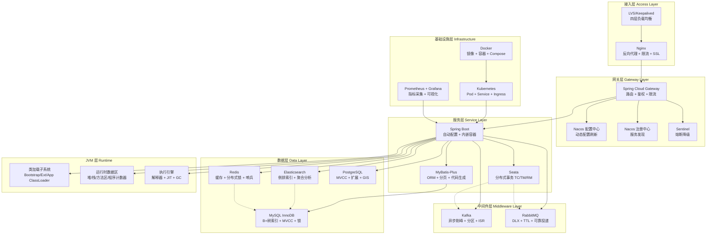

:::important
以下十七场景覆盖 #[R|Java 后端工程师] 全部核心技术栈。每个场景中标注了 `[SB]` Spring Boot、`[SC]` Spring Cloud、`[SQL]` MySQL/PostgreSQL、`[KV]` Redis、`[ORM]` MyBatis/MyBatis-Plus、`[MQ]` Kafka/RabbitMQ、`[SE]` Elasticsearch、`[NET]` Netty/Nginx、`[INF]` Docker/K8s、`[MON]` Prometheus/Grafana、`[JVM]` JVM，便于定位所属技术领域。建议按照请求链路顺序阅读——从接入层到数据层再到 JVM 层，形成完整的端到端认知。
:::

***

## 场景一：Nginx 接入层 · 反向代理与负载均衡

## 1.0 场景概览

本场景追踪用户秒杀请求从公网进入系统，经过 Nginx 反向代理、SSL 终结、限流过滤、负载均衡后到达 Spring Cloud Gateway 的完整路径。

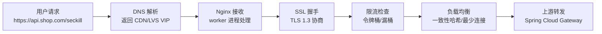

| 阶段 | 组件 | 核心知识点 | 关键机制 |
|------|------|-----------|---------|
| DNS 解析 | #[C|NET] DNS | A 记录/CNAME | 智能解析返回最近节点 |
| 连接建立 | #[C|NET] TCP | 三次握手/SYN Cookie | backlog 队列、tcp_tw_reuse |
| SSL 终结 | #[C|NET] OpenSSL | TLS 1.3/证书链 | Session Ticket 复用 |
| 限流过滤 | #[C|Nginx] limit_req | 令牌桶算法 | 突发流量 burst 处理 |
| 负载均衡 | #[C|Nginx] upstream | 加权轮询/一致性哈希 | 健康检查 passive/active |
| 反向代理 | #[C|Nginx] proxy_pass | HTTP/1.1 连接池 | keepalive 长连接复用 |

## 1.1 Nginx 接入全链路时序图

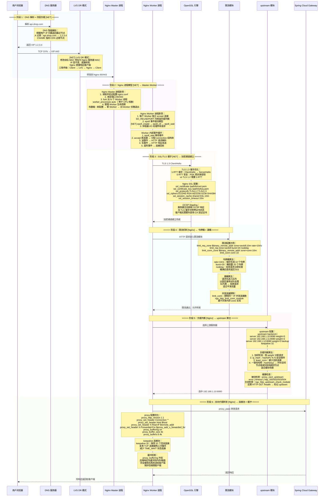

## 1.2 Nginx 配置关键参数详解

| 参数 | 推荐值 | 说明 |
|------|--------|------|
| worker_processes | auto | Worker 进程数等于 CPU 核数 |
| worker_connections | 65535 | 每个 Worker 最大连接数 |
| worker_rlimit_nofile | 65535 | Worker 进程最大文件描述符 |
| multi_accept | on | 一次 accept 所有新连接 |
| sendfile | on | 零拷贝文件传输 |
| tcp_nopush | on | 在 sendfile 模式下合并数据包 |
| tcp_nodelay | on | 禁用 Nagle 算法，实时传输 |
| keepalive_timeout | 65 | 长连接超时时间 |
| keepalive_requests | 1000 | 单个长连接最大请求数 |
| client_max_body_size | 10m | 请求体最大大小 |

## 1.3 Nginx 限流算法对比

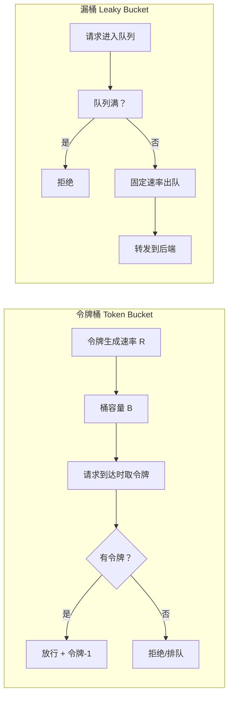

| 对比维度 | 令牌桶 | 漏桶 |
|----------|--------|------|
| 突发流量 | #[G|支持] burst 参数 | #[R|不支持] 严格平滑 |
| 流量整形 | 允许突发 | 强制平滑 |
| 适用场景 | 秒杀场景（允许突发） | API 速率限制 |
| 实现复杂度 | 中等 | 简单 |
| Nginx 模块 | limit_req | limit_req（可配置） |

:::warning
**Nginx 性能调优易错点：** `worker_processes` 设置过多会导致 CPU 上下文切换开销增大；`worker_connections` 受限于系统 `ulimit -n` 文件描述符上限；`keepalive_timeout` 过长会占用连接资源导致新连接无法建立。#[R|worker_connections × worker_processes = 最大并发连接数]，需确保不超过系统限制。
:::

:::important
**Nginx 在秒杀场景的核心价值：** 作为第一道防线，Nginx 承担了 SSL 终结、限流、负载均衡、静态资源分离四大关键职责。通过 `limit_req` 模块在网关层就拒绝超量请求，保护后端服务不被流量冲垮。#[C|limit_req_zone 共享内存 zone] 需要在所有 Worker 之间共享计数值，因此必须使用共享内存而非进程本地内存。
:::

***

## 场景二：Spring Cloud 微服务治理 · 网关 + 注册中心 + 配置中心

## 2.0 场景概览

本场景追踪请求从 Spring Cloud Gateway 进入微服务体系，经过服务发现、负载均衡、熔断降级、配置中心动态刷新后到达具体业务服务。

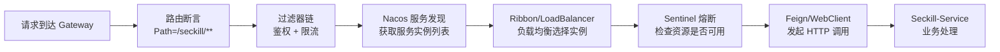

| 阶段 | 组件 | 核心知识点 | 关键机制 |
|------|------|-----------|---------|
| 路由断言 | #[C|SCG] Predicate | Path/Header/Query 匹配 | 路由定位器 RouteLocator |
| 过滤器链 | #[C|SCG] Filter | 全局/局部过滤器 | GatewayFilter + GlobalFilter |
| 服务发现 | #[C|Nacos] 注册中心 | AP 协议 + Distro | 临时实例心跳 + 持久实例 Raft |
| 负载均衡 | #[C|SCL] LoadBalancer | 轮询/随机/加权 | ServiceInstanceListSupplier |
| 熔断降级 | #[C|Sentinel] | 滑动窗口 + 令牌桶 | 资源规则 + 降级策略 |
| 配置中心 | #[C|Nacos] Config | 长轮询 + MD5 | @RefreshScope 动态刷新 |
| 远程调用 | #[C|OpenFeign] | 动态代理 + 编解码 | Contract 协议解析 |

## 2.1 微服务网关全链路时序图

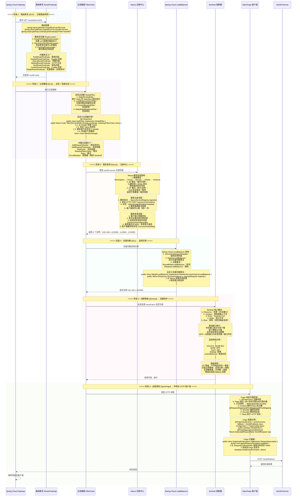

## 2.2 Nacos 配置中心动态刷新机制

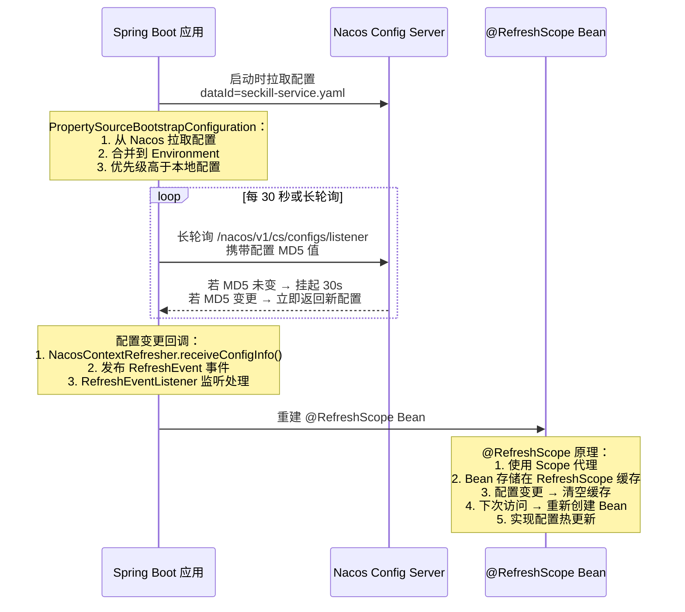

## 2.3 Sentinel 核心架构

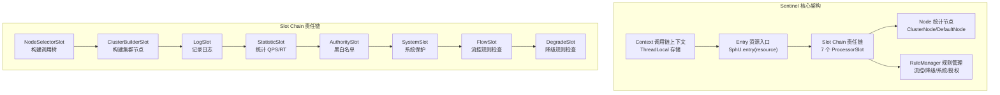

| 规则类型 | 说明 | 配置示例 |
|----------|------|----------|
| FlowRule | 流控规则 | QPS=100，快速失败 |
| DegradeRule | 降级规则 | RT>500ms，10s 内降级 |
| SystemRule | 系统保护 | LOAD>5.0，触发保护 |
| AuthorityRule | 授权规则 | 白名单 IP 放行 |
| ParamFlowRule | 热点规则 | 参数值=1001 时 QPS=10 |

:::warning
**Sentinel 规则持久化陷阱：** 默认 Sentinel 规则存储在 JVM 内存中，应用重启后规则丢失。生产环境必须配置规则持久化到 Nacos/Apollo 等配置中心，使用 `SentinelDataSource` 实现规则从配置中心动态加载。#[R|切勿使用默认内存模式] 用于生产环境。
:::

:::important
**Spring Cloud Gateway 与 Zuul 对比：** Gateway 基于 Spring WebFlux 和 Netty，使用非阻塞 I/O，线程开销小，适合高并发场景。Zuul 1.x 基于 Servlet 阻塞模型，性能较低。Zuul 2.x 也引入了 Netty 但生态不如 Gateway 成熟。新项目建议使用 Gateway。
:::

***

## 场景三：MySQL 数据层 · InnoDB 存储引擎深度剖析

## 3.0 场景概览

本场景追踪秒杀扣减库存的 SQL 在 MySQL InnoDB 引擎内部的完整执行路径，覆盖索引查找、事务 MVCC、行锁机制、Buffer Pool、Redo Log 与 Binlog 的两阶段提交。

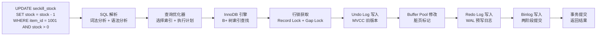

| 阶段 | 组件 | 核心知识点 | 关键机制 |
|------|------|-----------|---------|
| SQL 解析 | #[C|SQL] 解析器 | 词法分析/语法分析 | AST 查询树 |
| 查询优化 | #[C|SQL] 优化器 | 代价估算/索引选择 | Cardinality 基数统计 |
| 索引查找 | #[C|SQL] B+ 树 | 聚簇索引/二级索引 | 回表查询 |
| 事务 MVCC | #[C|SQL] InnoDB | ReadView/Undo Log | 快照读/当前读 |
| 行锁机制 | #[C|SQL] InnoDB | Record/Gap/Next-Key Lock | 锁升级/死锁检测 |
| Buffer Pool | #[C|SQL] InnoDB | LRU 链表/Flush 链表 | 预读/自适应哈希 |
| Redo Log | #[C|SQL] InnoDB | WAL 机制 | 崩溃恢复 |
| Binlog | #[C|SQL] Server | 两阶段提交 | 主从复制 |

## 3.1 InnoDB 更新语句全链路时序图

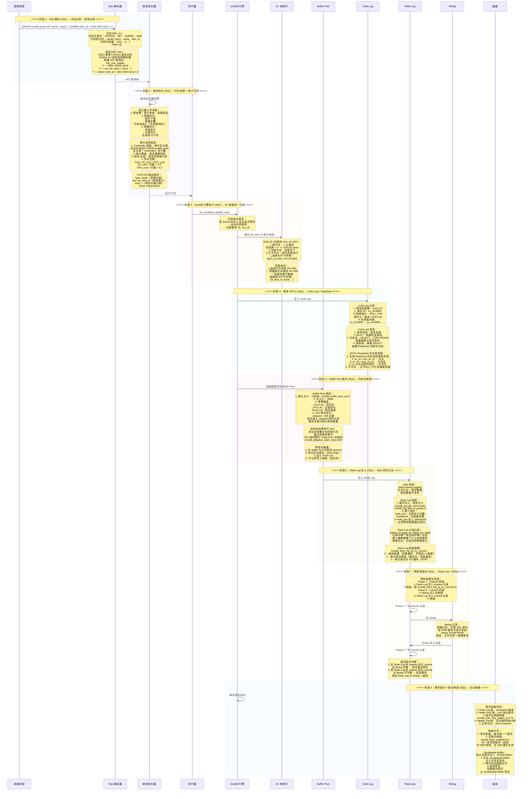

## 3.2 InnoDB 锁机制详解

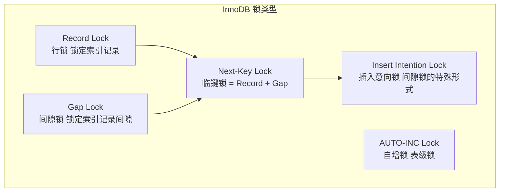

| 锁类型 | 锁定范围 | 冲突关系 | 适用场景 |
|--------|----------|----------|----------|
| Record Lock | 单行记录 | 读锁兼容，写锁互斥 | 等值查询命中唯一索引 |
| Gap Lock | 索引记录间隙 | 仅排斥插入操作 | 防止幻读 |
| Next-Key Lock | 记录 + 前间隙 | 默认 RR 隔离级别 | 范围查询 |
| Insert Intention Lock | 间隙 | 相互兼容 | 多事务并发插入不同行 |
| AUTO-INC Lock | 表级 | 互斥 | 自增主键插入 |

| 隔离级别 | 脏读 | 不可重复读 | 幻读 | 加锁策略 |
|----------|------|-----------|------|---------|
| READ UNCOMMITTED | #[R|是] | #[R|是] | #[R|是] | 无锁 |
| READ COMMITTED | #[G|否] | #[R|是] | #[R|是] | Record Lock |
| REPEATABLE READ | #[G|否] | #[G|否] | #[G|部分] | Next-Key Lock |
| SERIALIZABLE | #[G|否] | #[G|否] | #[G|否] | 全表锁 |

## 3.3 MySQL 索引优化实战

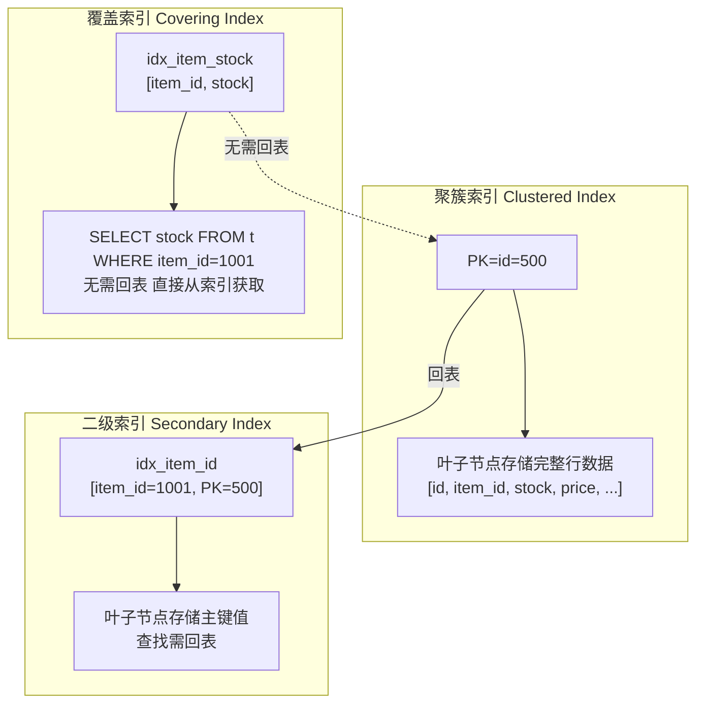

| 索引优化策略 | 说明 | 示例 |
|-------------|------|------|
| 最左前缀原则 | 联合索引从左到右匹配 | idx(a,b,c) → WHERE a=1 AND b=2 |
| 覆盖索引 | 索引包含查询所需所有列 | CREATE INDEX idx ON t(a,b,c) |
| 索引下推 ICP | 引擎层过滤，减少回表 | WHERE a LIKE '%x%' AND b=1 |
| MRR 优化 | 多范围读取，排序后回表 | 减少随机 I/O |
| 索引合并 | 多个索引的并集/交集 | index_merge 算法 |

:::warning
**MySQL 死锁常见场景：** 两个事务以不同顺序更新相同行时容易发生死锁。例如：事务A 更新 id=1 再更新 id=2，事务B 更新 id=2 再更新 id=1。#[R|RR 隔离级别下 Gap Lock 容易引发死锁]，因为间隙锁之间不冲突但会阻塞插入。解决方案：统一加锁顺序、缩短事务时间、使用 `SELECT ... FOR UPDATE NOWAIT` 快速失败。
:::

:::important
**秒杀扣减库存的正确姿势：** 使用 `UPDATE seckill_stock SET stock = stock - 1 WHERE item_id = ? AND stock > 0` 利用 MySQL 行锁实现原子扣减。避免先 SELECT 再 UPDATE 的竞态条件。InnoDB 在 UPDATE 时自动加行锁，WHERE 条件 `stock > 0` 确保不会超卖。#[C|行锁 + 条件过滤] 是秒杀场景最简洁可靠的方案。
:::

***

## 场景四：Redis 缓存层 · 分布式锁与缓存策略

## 4.0 场景概览

本场景追踪秒杀系统中 Redis 承担的多重角色——热点数据缓存、分布式锁、库存预扣减、布隆过滤器防穿透。

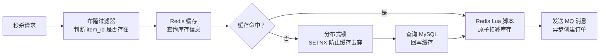

| 阶段 | 组件 | 核心知识点 | 关键机制 |
|------|------|-----------|---------|
| 布隆过滤器 | #[C|KV] RedisBloom | 位数组 + 多哈希 | 防止缓存穿透 |
| 缓存查询 | #[C|KV] Redis | String/Hash 数据结构 | 单线程 + IO 多路复用 |
| 分布式锁 | #[C|KV] Redis | SETNX + Lua 释放 | RedLock 算法 |
| 原子扣减 | #[C|KV] Redis | Lua 脚本 | 原子性保证 |
| 缓存策略 | #[C|KV] Redis | 旁路缓存/读写穿透 | 延迟双删 |
| 持久化 | #[C|KV] Redis | RDB/AOF 混合 | 数据恢复 |
| 高可用 | #[C|KV] Redis | 哨兵/集群 | 故障转移 |

## 4.1 Redis 缓存全链路时序图

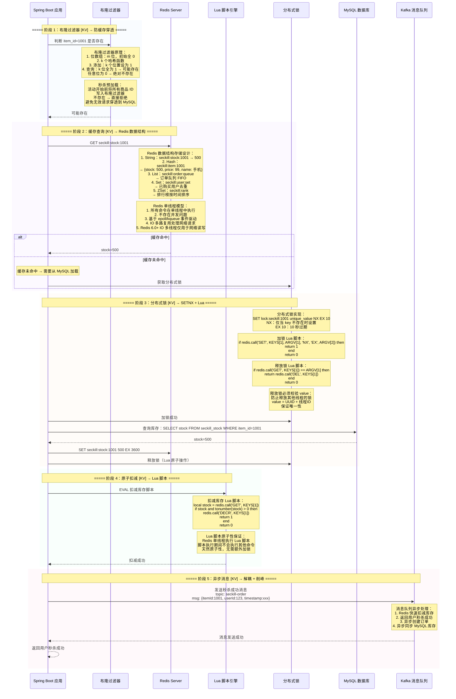

## 4.2 Redis 持久化机制对比

```mermaid
graph TB
    subgraph "RDB 快照"
        RDB1["SAVE/BGSAVE 命令"] --> RDB2["fork 子进程"]
        RDB2 --> RDB3["子进程写 RDB 文件"]
        RDB3 --> RDB4["二进制压缩格式"]
        RDB4 --> RDB5["恢复快，但可能丢数据"]
    end

    subgraph "AOF 日志"
        AOF1["每条写命令追加"] --> AOF2["AOF 缓冲区"]
        AOF2 --> AOF3["fsync 刷盘策略"]
        AOF3 --> AOF4["AOF 重写压缩"]
        AOF4 --> AOF5["数据安全，恢复慢"]
    end

    subgraph "混合持久化 Redis 4.0+"
        MIX1["RDB 快照 + 增量 AOF"] --> MIX2["兼顾恢复速度和安全"]
    end
```

| 特性 | RDB | AOF | 混合持久化 |
|------|-----|-----|-----------|
| 文件大小 | 小（压缩） | 大（文本） | 中等 |
| 恢复速度 | #[G|快] | #[R|慢] | #[G|快] |
| 数据安全 | #[R|可能丢数据] | #[G|可配置] | #[G|高] |
| 写入性能 | 不影响 | 影响（取决于 fsync） | 轻微影响 |
| 适用场景 | 备份、灾难恢复 | 数据安全优先 | 生产环境推荐 |

## 4.3 Redis 集群模式

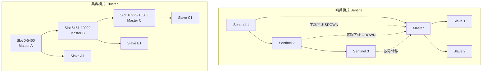

| 对比维度 | 哨兵模式 | 集群模式 |
|----------|----------|----------|
| 数据分片 | #[R|不支持] | #[G|支持] 16384 个 Slot |
| 高可用 | 自动故障转移 | 自动故障转移 + 数据迁移 |
| 扩展性 | 垂直扩展 | 水平扩展 |
| 客户端 | 简单 | 需支持 MOVED/ASK 重定向 |
| 槽位迁移 | 不支持 | 在线迁移 |
| 适用场景 | 数据量 < 机器内存 | 大数据量 |

:::warning
**Redis 缓存三大问题：** #[R|缓存穿透]：查询不存在的数据 → 布隆过滤器；#[R|缓存击穿]：热点 key 过期 → 分布式锁 + 互斥更新；#[R|缓存雪崩]：大量 key 同时过期 → 过期时间加随机值、多级缓存、限流降级。三者场景不同，解决方案也不同，切勿混淆。
:::

:::important
**Redis 在秒杀场景的核心价值：** 利用 Redis 单线程模型和 Lua 脚本原子性，在内存中完成库存预扣减，QPS 可达 10 万+/秒，远超 MySQL 的几千 QPS。扣减成功后再异步写入 MySQL，实现"#[C|Redis 抗量 + MySQL 兜底]"的架构。#[C|库存预热] 是关键——活动开始前将库存数据加载到 Redis，避免冷启动。
:::

***

## 场景五：MyBatis-Plus ORM 层 · 从 Mapper 代理到 SQL 执行

## 5.0 场景概览

本场景追踪 MyBatis-Plus 从 Mapper 接口代理到最终 SQL 执行的全链路，覆盖动态代理、SQL 解析、插件拦截器链、分页插件、乐观锁等核心机制。

```mermaid
graph LR
    A["stockMapper.selectById(1001)"] --> B["MapperProxy<br/>JDK 动态代理"]
    B --> C["MyBatis SqlSession<br/>获取 MappedStatement"]
    C --> D["Executor 执行器<br/>BaseExecutor/CachingExecutor"]
    D --> E["StatementHandler<br/>创建 PreparedStatement"]
    E --> F["ParameterHandler<br/>参数设置"]
    F --> G["TypeHandler<br/>类型转换"]
    G --> H["JDBC 执行<br/>返回 ResultSet"]
    H --> I["ResultSetHandler<br/>结果映射"]
```

| 阶段 | 组件 | 核心知识点 | 关键机制 |
|------|------|-----------|---------|
| Mapper 代理 | #[C|ORM] MyBatis | JDK 动态代理 | MapperProxyFactory |
| SQL 获取 | #[C|ORM] MyBatis | MappedStatement | XML/注解解析 |
| 执行器 | #[C|ORM] MyBatis | Executor 接口 | 一级/二级缓存 |
| SQL 构建 | #[C|ORM] MyBatis | StatementHandler | 预处理/参数化 |
| 插件拦截 | #[C|ORM] MyBatis | 责任链模式 | InterceptorChain |
| 分页插件 | #[C|ORM] MP | PaginationInnerInterceptor | 物理分页 + 计数 |
| 乐观锁 | #[C|ORM] MP | @Version | 版本号 CAS 更新 |
| 代码生成 | #[C|ORM] MP | AutoGenerator | 模板引擎 FreeMarker |

## 5.1 MyBatis-Plus 全链路时序图

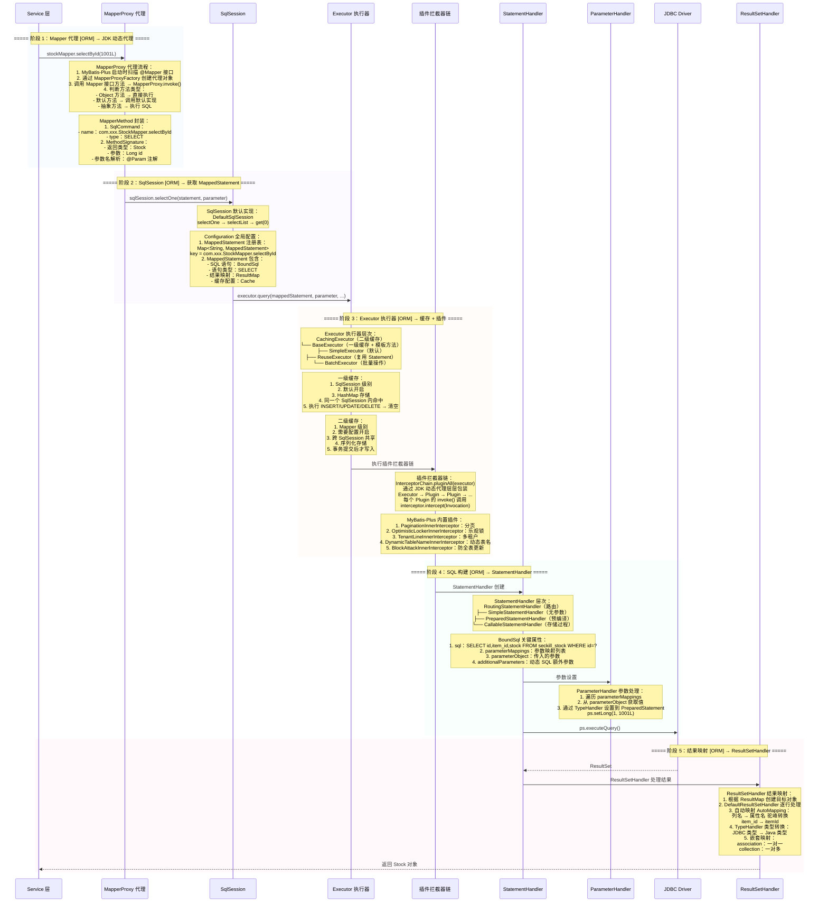

## 5.2 MyBatis 插件拦截器链原理

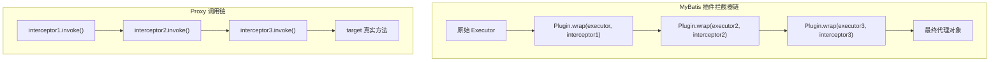

| 拦截器接口 | 可拦截对象 | 典型插件 |
|-----------|-----------|---------|
| `Interceptor` | Executor/StatementHandler/ParameterHandler/ResultSetHandler | 分页/乐观锁/多租户 |
| `@Intercepts` | 声明拦截位置和方法 | 指定 signature |
| `@Signature` | type + method + args | 精确匹配 |

## 5.3 MyBatis-Plus 分页插件原理

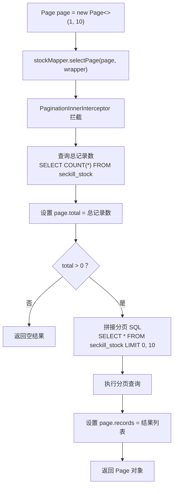

:::warning
**MyBatis 一级缓存失效场景：** 同一个 SqlSession 内执行 DML 操作后一级缓存会清空；不同 SqlSession 之间一级缓存不共享；Spring 整合 MyBatis 时，每次查询默认使用新的 SqlSession，一级缓存无法命中。#[R|Spring 事务内同一 SqlSession 才共享一级缓存]，需要注意事务边界。
:::

:::important
**MyBatis-Plus 与 MyBatis 的关系：** MyBatis-Plus 是对 MyBatis 的增强而非替代，完全兼容 MyBatis 原生功能。它通过拦截 Executor 和 StatementHandler 实现分页、乐观锁、多租户等增强功能。核心增强点：BaseMapper 通用 CRUD、条件构造器 QueryWrapper、分页插件、代码生成器、自动填充。
:::

***

## 场景六：Kafka + RabbitMQ 消息中间件 · 异步削峰与可靠投递

## 6.0 场景概览

本场景追踪秒杀成功后，通过 Kafka 异步削峰和 RabbitMQ 延迟队列实现订单创建与超时取消的完整链路。

```mermaid
graph LR
    A["秒杀成功"] --> B["Kafka<br/>异步削峰<br/>订单创建消息"]
    B --> C["订单消费者<br/>创建订单"]
    C --> D["RabbitMQ<br/>延迟队列<br/>30 分钟超时检查"]
    D --> E["超时检查消费者<br/>取消未支付订单"]
    E --> F["回滚库存<br/>Redis + MySQL"]
```

| 阶段 | 组件 | 核心知识点 | 关键机制 |
|------|------|-----------|---------|
| 异步削峰 | #[C|MQ] Kafka | 分区 + 消费者组 | ISR + HW 高水位 |
| 消息持久化 | #[C|MQ] Kafka | 分段日志 + 索引 | 零拷贝 sendfile |
| 延迟投递 | #[C|MQ] RabbitMQ | DLX + TTL | 死信队列 |
| 可靠投递 | #[C|MQ] RabbitMQ | 确认 + 重试 | Publisher Confirm |
| 消息幂等 | #[C|MQ] 通用 | 唯一 ID 去重 | Redis SETNX 去重表 |

## 6.1 Kafka 异步削峰全链路时序图

```mermaid
sequenceDiagram
    participant PROD as 秒杀服务 Producer
    participant KAFKA as Kafka Broker
    participant PART as Partition 分区
    participant ISR as ISR 副本集
    participant CONS as 订单服务 Consumer
    participant GROUP as Consumer Group
    participant ZK as ZooKeeper/KRaft

    rect rgba(240, 248, 255, 0.4)
    Note over PROD,KAFKA: ===== 阶段 1：消息生产 [MQ] → 分区选择 + 批量发送 =====
    PROD->>KAFKA: 发送秒杀成功消息
    Note over PROD: Producer 发送配置：<br/>1. acks：<br/>   acks=0：不等待确认（最快，可能丢）<br/>   acks=1：Leader 写入成功即可<br/>   acks=all/-1：所有 ISR 确认（最安全）<br/>2. batch.size：批量大小（默认 16KB）<br/>3. linger.ms：等待时间（默认 0）<br/>4. buffer.memory：缓冲区大小（默认 32MB）<br/>5. compression.type：压缩类型<br/>   none/gzip/snappy/lz4/zstd
    Note over PROD: 分区选择策略：<br/>1. 指定 partition → 直接使用<br/>2. 指定 key → hash(key) % partition_count<br/>3. 无 key → 轮询（Kafka 2.4+ 粘性分区）<br/>   粘性分区：同一批次尽量发往同一分区<br/>   减少网络开销
    Note over PROD: 消息发送流程：<br/>1. 序列化：key + value 序列化为字节数组<br/>2. 分区选择<br/>3. 追加到 RecordAccumulator 缓冲区<br/>4. Sender 线程批量发送<br/>5. 等待 Broker 确认
    PROD->>PART: 消息写入 Partition Leader
    end

    rect rgba(248, 240, 255, 0.4)
    Note over PART,ISR: ===== 阶段 2：消息存储 [MQ] → 分段日志 + 索引 =====
    Note over PART: Kafka 存储架构：<br/>topic = seckill-order<br/>├── partition-0<br/>│   ├── 00000000000000000000.log<br/>│   ├── 00000000000000000000.index<br/>│   └── 00000000000000000000.timeindex<br/>├── partition-1<br/>└── partition-2
    Note over PART: 日志分段存储：<br/>1. .log：消息数据文件<br/>   [offset, position, timestamp, key, value]<br/>2. .index：偏移量索引<br/>   相对 offset → 物理位置<br/>3. .timeindex：时间戳索引<br/>   时间戳 → 偏移量<br/>4. 稀疏索引：每隔 4KB 记录一个索引项
    PART->>ISR: 同步到 ISR 副本
    Note over ISR: ISR 机制：<br/>1. ISR = In-Sync Replicas<br/>2. 与 Leader 保持同步的副本集合<br/>3. 落后超过 replica.lag.time.max.ms<br/>   → 从 ISR 中移除<br/>4. acks=all 时需所有 ISR 确认<br/>5. min.insync.replicas：最少 ISR 数量
    Note over ISR: HW 高水位机制：<br/>1. HW = High Watermark<br/>2. 所有 ISR 副本都已复制的最大 offset<br/>3. Consumer 只能消费 HW 之前的消息<br/>4. 保证数据一致性<br/>5. LEO = Log End Offset<br/>   每个副本的日志末尾
    ISR-->>KAFKA: ISR 确认完成
    KAFKA-->>PROD: ack 确认
    end

    rect rgba(255, 248, 240, 0.4)
    Note over KAFKA,CONS: ===== 阶段 3：消息消费 [MQ] → Consumer Group 重平衡 =====
    Note over GROUP: Consumer Group 协调：<br/>1. GroupCoordinator 管理消费者组<br/>2. 每个 partition 只能被同组一个 consumer 消费<br/>3. 消费者数量 ≤ 分区数（多了浪费）<br/>4. Rebalance 重平衡：<br/>   消费者加入/离开 → 重新分配分区
    Note over GROUP: 分区分配策略：<br/>1. Range：按 topic 分区范围分配<br/>2. RoundRobin：轮询分配所有分区<br/>3. Sticky：粘性分配，尽量保持原有分配<br/>4. CooperativeSticky：<br/>   增量重平衡（Kafka 2.4+）<br/>   减少暂停时间
    CONS->>KAFKA: 拉取消息 Consumer.poll()
    Note over CONS: Consumer 消费配置：<br/>1. enable.auto.commit：<br/>   false（手动提交偏移量）<br/>2. max.poll.records：<br/>   一次 poll 最大记录数（默认 500）<br/>3. max.poll.interval.ms：<br/>   两次 poll 最大间隔<br/>   超时 → 触发 Rebalance<br/>4. isolation.level：<br/>   read_committed（读已提交）
    Note over CONS: 手动提交偏移量：<br/>1. 处理完消息后提交 offset<br/>2. commitSync()：同步提交（阻塞）<br/>3. commitAsync()：异步提交（非阻塞）<br/>4. 建议：异步提交 + 异常重试
    KAFKA-->>CONS: 返回消息列表
    CONS->>CONS: 处理消息（创建订单）
    CONS->>KAFKA: commitAsync() 提交 offset
    end
```

## 6.2 RabbitMQ 延迟队列实现

```mermaid
sequenceDiagram
    participant ORDER as 订单服务
    participant RMQ as RabbitMQ Exchange
    participant DLX_NORMAL as 普通队列 ttl=30min
    participant DLX as 死信交换机 DLX
    participant DLX_QUEUE as 死信队列
    participant CHECK as 超时检查消费者

    rect rgba(240, 248, 255, 0.4)
    Note over ORDER,RMQ: ===== 阶段 1：发送延迟消息 [MQ] → TTL + DLX =====
    ORDER->>RMQ: 发送订单创建消息<br/>routing_key=order.create
    Note over RMQ: RabbitMQ 交换机类型：<br/>1. Direct：精确匹配 routing key<br/>2. Topic：通配符匹配<br/>3. Fanout：广播到所有绑定队列<br/>4. Headers：根据 Header 匹配
    RMQ->>DLX_NORMAL: 路由到普通队列
    Note over DLX_NORMAL: 队列配置：<br/>x-message-ttl：30000（30分钟）<br/>x-dead-letter-exchange：order.dlx<br/>x-dead-letter-routing-key：order.timeout<br/>消息过期后自动转发到 DLX
    end

    rect rgba(248, 240, 255, 0.4)
    Note over DLX_NORMAL,DLX: ===== 阶段 2：消息过期后转发 [MQ] → 死信队列 =====
    Note over DLX_NORMAL: 30 分钟后消息过期
    DLX_NORMAL->>DLX: 转发到死信交换机
    DLX->>DLX_QUEUE: 路由到死信队列
    DLX_QUEUE->>CHECK: 消费者收到超时消息
    end

    rect rgba(255, 248, 240, 0.4)
    Note over CHECK,ORDER: ===== 阶段 3：超时检查 [MQ] → 幂等处理 =====
    CHECK->>CHECK: 检查订单状态
    Note over CHECK: 订单状态检查：<br/>1. 查询 MySQL 订单状态<br/>2. 若已支付 → 忽略消息<br/>3. 若未支付 → 取消订单<br/>   回滚库存<br/>   更新订单状态为已取消
    Note over CHECK: 消息幂等处理：<br/>1. 每条消息携带唯一 messageId<br/>2. Redis SETNX 记录已处理消息<br/>3. 数据库去重表<br/>   UNIQUE KEY uk_message_id<br/>4. 防止重复消费
    end
```

## 6.3 Kafka vs RabbitMQ 对比

| 对比维度 | Kafka | RabbitMQ |
|----------|-------|----------|
| 设计目标 | 高吞吐、日志流 | 可靠投递、灵活路由 |
| 吞吐量 | #[G|极高] 百万级/秒 | #[Y|中等] 万级/秒 |
| 延迟 | 毫秒级 | 微秒级 |
| 消息持久化 | 磁盘顺序写 | 内存 + 磁盘 |
| 消费模式 | Pull 拉取 | Push 推送 |
| 消息回溯 | #[G|支持] 按 offset 回放 | #[R|不支持] |
| 延迟队列 | #[R|不支持] | #[G|支持] DLX + TTL |
| 路由能力 | 简单 Topic | 丰富 Exchange + Binding |
| 协议 | 自定义 TCP 协议 | AMQP 0-9-1 |
| 适用场景 | 日志收集、流处理、削峰 | 业务消息、延迟任务、RPC |

:::warning
**Kafka 消息丢失的三个场景：** #[R|Producer 端]：acks=0 不等待确认；#[R|Broker 端]：ISR 副本数不足，Leader 宕机后数据丢失；#[R|Consumer 端]：先提交 offset 再处理消息，处理失败导致消息丢失。解决方案：acks=all、min.insync.replicas=2、先处理后提交 offset。
:::

:::important
**Kafka 精确一次语义（Exactly-Once）：** Kafka 0.11+ 支持幂等 Producer（enable.idempotence=true）和事务 Producer。幂等 Producer 通过 ProducerID + SequenceNumber 去重；事务 Producer 通过 `initTransactions()` + `beginTransaction()` + `commitTransaction()` 实现跨分区原子写入。结合 `isolation.level=read_committed` 实现端到端的精确一次语义。
:::

***

## 场景七：Docker + Kubernetes 基础设施 · 容器化与编排

## 7.0 场景概览

本场景追踪秒杀微服务从源码到容器化部署再到 Kubernetes 集群调度运行的完整路径。

```mermaid
graph LR
    A["源码 Java 项目"] --> B["Dockerfile<br/>构建镜像"]
    B --> C["Docker Registry<br/>镜像仓库"]
    C --> D["Kubernetes<br/>Deployment 部署"]
    D --> E["Service<br/>服务发现 + 负载均衡"]
    E --> F["Ingress<br/>外部流量入口"]
    F --> G["HPA<br/>自动伸缩"]
    G --> H["Prometheus<br/>监控 + 告警"]
```

| 阶段 | 组件 | 核心知识点 | 关键机制 |
|------|------|-----------|---------|
| 镜像构建 | #[C|INF] Docker | Dockerfile + 分层 | UnionFS + 写时复制 |
| 镜像仓库 | #[C|INF] Registry | 镜像推送/拉取 | 分层存储 + 内容寻址 |
| 容器运行 | #[C|INF] Docker | Namespace + Cgroup | 资源隔离 + 限制 |
| 部署管理 | #[C|INF] K8s | Deployment + ReplicaSet | 滚动更新 + 回滚 |
| 服务发现 | #[C|INF] K8s | Service + Endpoints | kube-proxy iptables/IPVS |
| 流量入口 | #[C|INF] K8s | Ingress + Ingress Controller | Nginx/Traefik 实现 |
| 自动伸缩 | #[C|INF] K8s | HPA + VPA | 资源指标 + 自定义指标 |
| 配置管理 | #[C|INF] K8s | ConfigMap + Secret | 环境变量/挂载卷 |
| 监控告警 | #[C|INF] Prometheus | 指标采集 + PromQL | AlertManager 告警路由 |

## 7.1 Docker 镜像构建与容器运行时序图

```mermaid
sequenceDiagram
    participant DEV as 开发者
    participant DOCKER as Docker Daemon
    participant REGISTRY as Docker Registry
    participant K8S as Kubernetes API Server
    participant SCHED as K8s Scheduler
    participant KUBELET as Kubelet
    participant CONTAINER as Container Runtime
    participant CGROUP as Cgroup/Namespace

    rect rgba(240, 248, 255, 0.4)
    Note over DEV,DOCKER: ===== 阶段 1：Dockerfile 构建镜像 [INF] → 分层构建 =====
    DEV->>DOCKER: docker build -t seckill-service:v1.0 .
    Note over DOCKER: Dockerfile 示例：<br/>FROM openjdk:17-slim<br/>WORKDIR /app<br/>COPY target/seckill-service.jar app.jar<br/>RUN mkdir -p /app/logs<br/>EXPOSE 8080<br/>ENTRYPOINT [java, -jar, -Xms512m, -Xmx1024m, app.jar]
    Note over DOCKER: Docker 分层构建：<br/>1. 每条指令创建一个层<br/>2. 层是只读的<br/>3. 最上层是可写容器层<br/>4. 使用 UnionFS（Overlay2）<br/>5. 相同层可复用，加速构建<br/>6. 层缓存：未变更的层跳过重建
    DOCKER-->>DEV: 镜像构建成功 seckill-service:v1.0
    end

    rect rgba(248, 240, 255, 0.4)
    Note over DOCKER,REGISTRY: ===== 阶段 2：推送镜像到仓库 [INF] → 分层上传 =====
    DEV->>DOCKER: docker push registry.example.com/seckill-service:v1.0
    Note over DOCKER: 镜像推送流程：<br/>1. 计算镜像各层 SHA256<br/>2. 检查 Registry 已有层<br/>3. 仅上传 Registry 中没有的层<br/>4. 上传镜像 Manifest<br/>5. 添加标签 v1.0
    DOCKER->>REGISTRY: 上传镜像层
    REGISTRY-->>DOCKER: 上传完成
    end

    rect rgba(255, 248, 240, 0.4)
    Note over REGISTRY,K8S: ===== 阶段 3：Kubernetes 部署 [INF] → Deployment 创建 =====
    DEV->>K8S: kubectl apply -f deployment.yaml
    Note over K8S: Deployment YAML 配置：<br/>apiVersion: apps/v1<br/>kind: Deployment<br/>metadata:<br/>  name: seckill-service<br/>spec:<br/>  replicas: 3<br/>  selector:<br/>    matchLabels:<br/>      app: seckill-service<br/>  template:<br/>    metadata:<br/>      labels:<br/>        app: seckill-service<br/>    spec:<br/>      containers:<br/>      - name: seckill-service<br/>        image: registry.example.com/seckill-service:v1.0<br/>        ports:<br/>        - containerPort: 8080<br/>        resources:<br/>          requests:<br/>            memory: 512Mi<br/>            cpu: 500m<br/>          limits:<br/>            memory: 1Gi<br/>            cpu: 1000m<br/>        livenessProbe:<br/>          httpGet:<br/>            path: /actuator/health<br/>            port: 8080<br/>          initialDelaySeconds: 30<br/>          periodSeconds: 10<br/>        readinessProbe:<br/>          httpGet:<br/>            path: /actuator/health/readiness<br/>            port: 8080<br/>          initialDelaySeconds: 10<br/>          periodSeconds: 5
    K8S->>K8S: 创建 ReplicaSet<br/>期望副本数 = 3
    end

    rect rgba(240, 255, 248, 0.4)
    Note over K8S,SCHED: ===== 阶段 4：调度 [INF] → Pod 分配节点 =====
    K8S->>SCHED: 调度 Pod 到节点
    Note over SCHED: K8s 调度流程：<br/>1. 过滤阶段 Filtering：<br/>   - 资源是否满足：CPU/内存<br/>   - 节点选择器：nodeSelector<br/>   - 污点容忍：Tolerations<br/>   - 亲和性：Affinity<br/>2. 打分阶段 Scoring：<br/>   - 资源均衡度<br/>   - 镜像本地性<br/>   - Pod 亲和性<br/>3. 绑定 Pod 到节点
    SCHED-->>K8S: Pod 调度到 Node-1、Node-2、Node-3
    end

    rect rgba(255, 240, 245, 0.4)
    Note over K8S,CGROUP: ===== 阶段 5：容器运行 [INF] → Namespace + Cgroup =====
    K8S->>KUBELET: 创建 Pod
    KUBELET->>CONTAINER: 拉取镜像 + 启动容器
    Note over CGROUP: Linux Namespace 隔离：<br/>1. PID Namespace：进程隔离<br/>2. Network Namespace：网络隔离<br/>3. Mount Namespace：文件系统隔离<br/>4. UTS Namespace：主机名隔离<br/>5. IPC Namespace：进程间通信隔离<br/>6. User Namespace：用户隔离
    Note over CGROUP: Cgroup 资源限制：<br/>1. cpu.shares：CPU 权重<br/>2. cpu.cfs_period_us：CPU 周期<br/>3. cpu.cfs_quota_us：CPU 配额<br/>4. memory.limit_in_bytes：内存上限<br/>5. memory.soft_limit_in_bytes：软限制<br/>6. blkio：IO 限制
    Note over CGROUP: 容器运行时：<br/>1. containerd：CNCF 标准容器运行时<br/>2. runc：OCI 标准实现<br/>3. CRI-O：Kubernetes 专用运行时<br/>4. 容器进程 = 宿主机进程<br/>   Namespace + Cgroup 隔离<br/>   共享宿主机内核
    CONTAINER-->>KUBELET: 容器启动成功
    KUBELET-->>K8S: Pod 状态 Running
    end
```

## 7.2 Kubernetes 核心资源对象

```mermaid
graph TB
    subgraph "工作负载 Workloads"
        DP["Deployment<br/>无状态应用 滚动更新"]
        RS["ReplicaSet<br/>维护 Pod 副本数"]
        STS["StatefulSet<br/>有状态应用 有序部署"]
        DS["DaemonSet<br/>每个节点运行一个 Pod"]
        JOB["Job/CronJob<br/>一次性/定时任务"]
    end

    subgraph "服务与网络 Service & Network"
        SVC["Service<br/>ClusterIP/NodePort/LoadBalancer"]
        EP["Endpoints<br/>Pod IP 列表"]
        ING["Ingress<br/>HTTP/HTTPS 路由"]
        NP["NetworkPolicy<br/>网络策略"]
    end

    subgraph "配置与存储 Config & Storage"
        CM["ConfigMap<br/>配置数据"]
        SEC["Secret<br/>敏感数据"]
        PVC["PersistentVolumeClaim<br/>持久卷声明"]
        PV["PersistentVolume<br/>持久卷"]
    end

    subgraph "自动伸缩 Autoscaling"
        HPA["HorizontalPodAutoscaler<br/>水平自动伸缩"]
        VPA["VerticalPodAutoscaler<br/>垂直自动伸缩"]
    end

    DP --> RS --> DP
    SVC --> EP
    ING --> SVC
    HPA --> DP
```

## 7.3 Prometheus + Grafana 监控体系

```mermaid
graph TB
    subgraph "数据采集"
        EXP["Exporter<br/>Node/MySQL/Redis/Kafka"]
        MICRO["Micrometer<br/>Spring Boot Actuator"]
        PUSH["Pushgateway<br/>短生命周期任务"]
    end

    subgraph "Prometheus Server"
        PULL["Pull 拉取<br/>HTTP GET /metrics"]
        TSDB["TSDB 时序数据库<br/>2 小时内存 + 磁盘"]
        PROMQL["PromQL 查询引擎<br/>rate/irate/histogram_quantile"]
        ALERT["AlertManager<br/>告警路由 + 静默 + 分组"]
    end

    subgraph "可视化"
        GRAFANA["Grafana<br/>Dashboard + Panel"]
        JVM_DASH["JVM 监控面板<br/>堆内存/GC/线程/类加载"]
        APP_DASH["应用监控面板<br/>QPS/RT/错误率"]
    end

    EXP --> PULL
    MICRO --> PULL
    PUSH --> PULL
    PULL --> TSDB
    TSDB --> PROMQL
    PROMQL --> ALERT
    PROMQL --> GRAFANA
    ALERT --> GRAFANA
    GRAFANA --> JVM_DASH
    GRAFANA --> APP_DASH
```

| 监控指标 | PromQL 示例 | 告警阈值 |
|----------|-----------|---------|
| 服务 QPS | `rate(http_server_requests_seconds_count[1m])` | - |
| 平均响应时间 | `rate(http_server_requests_seconds_sum[1m]) / rate(http_server_requests_seconds_count[1m])` | > 500ms |
| P99 响应时间 | `histogram_quantile(0.99, rate(http_server_requests_seconds_bucket[1m]))` | > 2s |
| 错误率 | `rate(http_server_requests_seconds_count{status=~"5.."}[1m]) / rate(http_server_requests_seconds_count[1m])` | > 1% |
| JVM 堆使用率 | `jvm_memory_used_bytes{area="heap"} / jvm_memory_max_bytes{area="heap"}` | > 85% |
| GC 暂停时间 | `rate(jvm_gc_pause_seconds_sum[1m])` | > 100ms |
| CPU 使用率 | `system_cpu_usage` | > 80% |
| 数据库连接池 | `hikaricp_connections_active` | > 80% 最大连接数 |

:::warning
**Kubernetes 资源限制易错点：** 必须设置 `resources.requests` 和 `resources.limits`。requests 决定调度时的资源预留，limits 决定运行时的资源上限。#[R|不设置 limits 可能导致 Pod 耗尽节点资源引发 OOM Kill]；requests 设置过高会导致调度失败。Java 应用需特别注意 `-Xmx` 必须小于 `memory.limits`，否则容器 OOMKilled。
:::

:::important
**Docker 镜像优化策略：** 1) 使用多阶段构建减少镜像大小；2) 选择 alpine/slim 基础镜像；3) 合并 RUN 指令减少层数；4) .dockerignore 排除无用文件；5) 将变化频繁的层放在最后（如 jar 包）。# 推荐使用 `jib-maven-plugin` 或 `Spring Boot build-image` 直接构建容器镜像，无需 Dockerfile。
:::

***

## 场景八：JVM 深度剖析 · 从类加载到 GC 调优

## 8.0 场景概览

本场景以秒杀服务启动和运行为例，追踪 JVM 从类加载、字节码执行、内存分配、GC 回收到 JIT 编译优化的完整内部机制。

```mermaid
graph LR
    A["java -jar seckill-service.jar"] --> B["类加载子系统<br/>Bootstrap/Ext/App"]
    B --> C["运行时数据区<br/>堆/栈/方法区"]
    C --> D["执行引擎<br/>解释器 + JIT"]
    D --> E["垃圾回收<br/>GC 算法 + 收集器"]
    E --> F["内存模型<br/>JMM volatile/synchronized"]
```

| 阶段 | 组件 | 核心知识点 | 关键机制 |
|------|------|-----------|---------|
| 类加载 | #[C|JVM] ClassLoader | 双亲委派 | 加载→链接→初始化 |
| 运行时数据区 | #[C|JVM] Runtime | 堆/栈/方法区/PC | 线程私有/共享 |
| 对象创建 | #[C|JVM] Heap | TLAB 分配 | 指针碰撞/空闲列表 |
| GC 回收 | #[C|JVM] GC | G1/ZGC | 分代/分区收集 |
| JIT 编译 | #[C|JVM] JIT | C1/C2 编译器 | 分层编译 |
| 内存模型 | #[C|JVM] JMM | happens-before | volatile/锁/final |

## 8.1 JVM 类加载与初始化全链路

```mermaid
sequenceDiagram
    participant JVM as JVM 启动
    participant CL as ClassLoader 类加载器
    participant LINK as 链接阶段
    participant INIT as 初始化阶段
    participant HEAP as 堆内存
    participant META as 方法区/元空间
    participant STACK as 虚拟机栈

    rect rgba(240, 248, 255, 0.4)
    Note over JVM,CL: ===== 阶段 1：类加载 [JVM] → 双亲委派模型 =====
    JVM->>JVM: 启动 JVM，加载核心类
    Note over JVM: JVM 启动流程：<br/>1. 创建 Bootstrap ClassLoader<br/>  加载 rt.jar / java.base 模块<br/>2. 创建 Ext ClassLoader<br/>  加载 jre/lib/ext 目录<br/>3. 创建 App ClassLoader<br/>  加载 classpath 下的类<br/>4. 加载 main 类<br/>  SeckillApplication
    JVM->>CL: 加载 SeckillApplication 类
    Note over CL: 双亲委派模型：<br/>1. App CL 收到加载请求<br/>2. 委托给 Ext CL<br/>3. Ext CL 委托给 Bootstrap CL<br/>4. Bootstrap CL 尝试加载<br/>5. 找不到 → Ext CL 尝试<br/>6. 找不到 → App CL 尝试<br/>7. 找不到 → ClassNotFoundException
    Note over CL: 打破双亲委派的场景：<br/>1. SPI 机制：<br/>   ServiceLoader 使用线程上下文类加载器<br/>2. Tomcat/Spring Boot：<br/>   每个应用使用独立 ClassLoader<br/>3. OSGi：<br/>   网状类加载结构
    Note over CL: 类加载过程：<br/>1. findClass()：<br/>   读取 .class 文件字节流<br/>2. defineClass()：<br/>   将字节流转为 Class 对象<br/>   存入方法区/元空间
    end

    rect rgba(248, 240, 255, 0.4)
    Note over CL,LINK: ===== 阶段 2：链接 [JVM] → 验证 + 准备 + 解析 =====
    CL->>LINK: 链接阶段
    Note over LINK: 验证 Verify：<br/>1. 文件格式验证：<br/>   魔数 0xCAFEBABE<br/>   版本号检查<br/>2. 元数据验证：<br/>   是否有父类<br/>   是否继承了 final 类<br/>3. 字节码验证：<br/>   类型安全<br/>   跳转指令合法<br/>4. 符号引用验证：<br/>   引用的类是否存在
    Note over LINK: 准备 Prepare：<br/>1. 为 static 变量分配内存<br/>2. 设置默认零值<br/>   int → 0<br/>   boolean → false<br/>   reference → null<br/>3. static final 常量直接赋值<br/>   static final int MAX = 100 → 100
    Note over LINK: 解析 Resolve：<br/>1. 符号引用 → 直接引用<br/>2. 类/接口解析<br/>3. 字段解析<br/>4. 方法解析<br/>5. 接口方法解析
    end

    rect rgba(255, 248, 240, 0.4)
    Note over LINK,INIT: ===== 阶段 3：初始化 [JVM] → clinit 方法执行 =====
    LINK->>INIT: 初始化阶段
    Note over INIT: 初始化时机（主动引用）：<br/>1. new 创建实例<br/>2. 访问 static 变量<br/>3. 调用 static 方法<br/>4. 反射调用<br/>5. 初始化子类触发父类初始化<br/>6. main 方法所在类
    Note over INIT: clinit 方法：<br/>1. 编译器自动收集 static 赋值<br/>   和 static 代码块<br/>2. 按源码顺序合并<br/>3. 父类 clinit 先于子类<br/>4. 多线程安全：<br/>   JVM 保证 clinit 只执行一次<br/>   通过加锁实现
    INIT->>HEAP: Spring Boot 容器初始化
    Note over HEAP: Spring Boot 启动过程：<br/>1. new SpringApplication()<br/>2. 推断应用类型：SERVLET/REACTIVE<br/>3. 加载 ApplicationContextInitializer<br/>4. 加载 ApplicationListener<br/>5. run()：<br/>   - 创建 ApplicationContext<br/>   - 刷新上下文<br/>   - 自动配置 @EnableAutoConfiguration<br/>   - 启动内嵌 Web 服务器
    end
```

## 8.2 JVM 运行时数据区

```mermaid
graph TB
    subgraph "线程私有"
        PC["程序计数器 PC<br/>当前执行字节码行号"]
        VMS["虚拟机栈 Stack<br/>栈帧：局部变量表<br/>操作数栈/动态链接/返回地址"]
        NMS["本地方法栈<br/>Native 方法调用"]
    end

    subgraph "线程共享"
        HEAP["堆 Heap<br/>新生代 Eden + S0 + S1<br/>老年代 Old<br/>字符串常量池（JDK 7+）"]
        META["方法区/元空间 Metaspace<br/>类信息/常量/静态变量<br/>JIT 编译缓存<br/>直接内存（堆外）"]
    end

    PC -.-> VMS
    VMS -.-> HEAP
    VMS -.-> META
```

## 8.3 JVM 垃圾回收器详解

```mermaid
graph TB
    subgraph "分代收集 Generational"
        SERIAL["Serial + Serial Old<br/>单线程 STW 客户端"]
        PARN["ParNew + CMS<br/>多线程 + 并发标记清除"]
        PS["Parallel Scavenge + Parallel Old<br/>吞吐量优先"]
    end

    subgraph "分区收集 Regional"
        G1["G1 Garbage First<br/>Region + 并发标记<br/>JDK 9+ 默认"]
        ZGC["ZGC<br/>超低延迟 < 1ms<br/>染色指针 + 读屏障<br/>JDK 15+ 生产可用"]
        SHEN["Shenandoah<br/>低延迟<br/>JDK 12+ 可用"]
    end
```

| 收集器 | 目标 | STW 时间 | 适用场景 | 核心算法 |
|--------|------|----------|----------|---------|
| Serial | 简单高效 | 长 | 客户端、小内存 | 标记-复制 + 标记-整理 |
| Parallel | 吞吐量 | 中等 | 批处理、后台计算 | 标记-复制 + 标记-整理 |
| CMS | 低延迟 | 较短 | Web 服务 | 标记-清除（并发） |
| G1 | 可控延迟 | 可控 | 大内存、多核 | 标记-复制 + 分区 |
| ZGC | 超低延迟 | #[G|< 1ms] | 超大内存、实时 | 染色指针 + 读屏障 |

## 8.4 G1 垃圾回收器核心流程

```mermaid
sequenceDiagram
    participant G1 as G1 收集器
    participant HEAP as G1 堆内存
    participant REGION as Region 分区
    participant RSET as Remembered Set
    participant SATB as SATB 快照

    rect rgba(240, 248, 255, 0.4)
    Note over G1,HEAP: ===== G1 堆内存布局 =====
    Note over HEAP: G1 堆结构：<br/>堆被划分为等大小的 Region<br/>默认 2048 个 Region<br/>Region 大小：1MB ~ 32MB<br/>Region 角色：<br/>Eden / Survivor / Old / Humongous
    Note over HEAP: Humongous 对象：<br/>超过 Region 大小 50% 的对象<br/>分配在连续的 Humongous Region<br/>直接放入老年代
    end

    rect rgba(248, 240, 255, 0.4)
    Note over G1,REGION: ===== Young GC 年轻代收集 =====
    Note over G1: 触发条件：<br/>Eden 区满
    G1->>REGION: 扫描 GC Roots
    Note over REGION: GC Roots 包括：<br/>1. 虚拟机栈引用<br/>2. 静态变量引用<br/>3. JNI 引用<br/>4. 活跃线程
    G1->>REGION: 复制存活对象到 Survivor/Old
    Note over REGION: 复制算法：<br/>1. 将 Eden + Survivor 中存活对象<br/>   复制到新的 Survivor 或 Old Region<br/>2. 清空原 Region<br/>3. 更新 RSet
    end

    rect rgba(255, 248, 240, 0.4)
    Note over G1,RSET: ===== Mixed GC 混合收集 =====
    Note over G1: 触发条件：<br/>老年代占用超过 IHOP 阈值<br/>InitiatingHeapOccupancyPercent=45
    G1->>G1: 并发标记阶段
    Note over G1: 并发标记流程：<br/>1. 初始标记：STW，标记 GC Roots<br/>2. 并发标记：并发，SATB 记录变更<br/>3. 最终标记：STW，处理 SATB<br/>4. 筛选回收：STW，选择回收 Region
    Note over RSET: Remembered Set 跨代引用：<br/>1. 每个 Region 维护 RSet<br/>2. 记录哪些 Region 引用了本 Region<br/>3. Card Table 实现：<br/>   堆划分为 512 字节的 Card<br/>   引用变更 → 写屏障标记 Card<br/>4. GC 时扫描 RSet 而非全堆
    G1->>REGION: 选择回收价值最高的 Region
    Note over REGION: 回收选择：<br/>优先回收垃圾最多的 Region<br/>Garbage First 核心思想<br/>用户可设置最大暂停时间<br/>-XX:MaxGCPauseMillis=200
    end
```

## 8.5 JVM 调优参数速查

| 参数 | 说明 | 推荐值 |
|------|------|--------|
| `-Xms` / `-Xmx` | 初始/最大堆大小 | 相同值，避免动态扩容 |
| `-Xss` | 线程栈大小 | 256k ~ 1M |
| `-XX:MetaspaceSize` | 元空间初始大小 | 128M |
| `-XX:MaxMetaspaceSize` | 元空间最大大小 | 256M |
| `-XX:+UseG1GC` | 使用 G1 收集器 | JDK 9+ 默认 |
| `-XX:MaxGCPauseMillis` | 最大 GC 暂停 | 200ms |
| `-XX:G1HeapRegionSize` | G1 Region 大小 | 4M ~ 16M |
| `-XX:InitiatingHeapOccupancyPercent` | IHOP 阈值 | 45 |
| `-XX:+PrintGCDetails` | 打印 GC 详细日志 | 生产环境开启 |
| `-XX:+HeapDumpOnOutOfMemoryError` | OOM 时 Dump 堆 | 生产环境开启 |

:::warning
**JVM 调优常见误区：** 1) 堆内存设置过大导致 GC 暂停时间过长；2) 未设置 `-Xms` 与 `-Xmx` 相等导致动态扩容开销；3) 使用默认 Parallel GC 而非 G1（大内存场景）；4) 未开启 GC 日志导致无法定位问题。#[R|GC 日志是 JVM 调优最重要的依据]，没有日志就无法分析。
:::

:::important
**JVM 内存模型 JMM 关键原则：** 1) `volatile` 保证可见性和有序性，但不保证原子性；2) `synchronized` 保证原子性、可见性和有序性；3) `final` 字段在构造函数中正确初始化后，其他线程可见；4) happens-before 原则是判断并发安全的基础：解锁 happens-before 加锁、volatile 写 happens-before 读、start() happens-before run()。
:::

***

## 场景九：Netty 网络通信 · 高性能 I/O 模型

## 9.0 场景概览

Spring Cloud Gateway 底层基于 Netty 实现非阻塞 I/O。本场景追踪 Netty 的 EventLoop 模型、Channel Pipeline、ByteBuf 内存管理和零拷贝机制。

```mermaid
graph LR
    A["客户端连接"] --> B["EventLoopGroup<br/>bossGroup + workerGroup"]
    B --> C["Channel<br/>NioServerSocketChannel"]
    C --> D["ChannelPipeline<br/>Handler 责任链"]
    D --> E["ChannelHandler<br/>编解码 + 业务处理"]
    E --> F["ByteBuf<br/>内存池 + 零拷贝"]
```

| 阶段 | 组件 | 核心知识点 | 关键机制 |
|------|------|-----------|---------|
| 线程模型 | #[C|NET] EventLoop | Reactor 模式 | 一个 EventLoop 服务多个 Channel |
| 管道模型 | #[C|NET] Pipeline | 责任链模式 | ChannelHandler 有序执行 |
| 编解码 | #[C|NET] Codec | 粘包/拆包 | LengthFieldBasedFrameDecoder |
| 内存管理 | #[C|NET] ByteBuf | 池化内存 | PooledByteBufAllocator |
| 零拷贝 | #[C|NET] Zero-Copy | CompositeByteBuf | sendfile/FileRegion |

## 9.1 Netty 核心架构

```mermaid
graph TB
    subgraph "Netty Reactor 线程模型"
        BOSS["bossGroup<br/>NioEventLoopGroup(1)<br/>处理 accept 事件"]
        WORKER["workerGroup<br/>NioEventLoopGroup(N)<br/>处理 read/write 事件"]
        CHANNEL["Channel<br/>SocketChannel<br/>每个连接一个 Channel"]
        PIPELINE["ChannelPipeline<br/>Handler 双向链表"]
    end

    subgraph "ChannelPipeline 结构"
        HEAD["HeadContext<br/>ChannelOutboundHandler"]
        DECODER["Decoder<br/>ByteToMessageDecoder<br/>ByteBuf → POJO"]
        ENCODER["Encoder<br/>MessageToByteEncoder<br/>POJO → ByteBuf"]
        BIZ["BusinessHandler<br/>SimpleChannelInboundHandler<br/>业务逻辑处理"]
        TAIL["TailContext<br/>ChannelInboundHandler"]

        HEAD --> DECODER --> BIZ --> ENCODER --> TAIL
    end

    BOSS --> WORKER
    WORKER --> CHANNEL
    CHANNEL --> PIPELINE
```

## 9.2 Netty 零拷贝机制

| 零拷贝方式 | 说明 | 实现 |
|-----------|------|------|
| CompositeByteBuf | 多个 ByteBuf 合并为一个逻辑 ByteBuf | 无数据拷贝，虚拟合并 |
| wrap | 包装字节数组为 ByteBuf | 无数据拷贝，共享内存 |
| slice | 分割 ByteBuf | 无数据拷贝，共享同一内存 |
| FileRegion | 文件直接传输到 Channel | 底层 sendfile 系统调用 |
| DirectByteBuf | 堆外内存 | 避免堆内→堆外拷贝 |

:::warning
**Netty 内存泄漏排查：** 使用 `-Dio.netty.leakDetection.level=PARANOID` 开启内存泄漏检测。ByteBuf 使用后必须调用 `release()` 释放引用计数。使用 `SimpleChannelInboundHandler` 可自动释放 ByteBuf。#[R|忘记释放 ByteBuf 是 Netty 内存泄漏最常见的原因]。
:::

:::important
**Netty EventLoop 与线程安全：** 一个 Channel 的所有 I/O 事件都由同一个 EventLoop 线程处理，因此 ChannelHandler 中无需加锁（线程安全）。但要注意：#[R|不要在 EventLoop 线程中执行耗时操作]，否则会阻塞该 EventLoop 下所有 Channel 的事件处理。耗时操作应提交到业务线程池。
:::

***

## 场景十：Spring Boot 核心机制 · 自动配置与 Starter

## 10.0 场景概览

本场景剖析 Spring Boot 自动配置原理、Starter 机制、内嵌 Tomcat 启动流程和 Actuator 监控端点。

```mermaid
graph LR
    A["@SpringBootApplication"] --> B["@EnableAutoConfiguration<br/>自动配置"]
    B --> C["spring.factories<br/>加载自动配置类"]
    C --> D["@ConditionalOnXXX<br/>条件装配"]
    D --> E["自动配置 Bean<br/>DataSource/RedisTemplate/KafkaTemplate"]
    E --> F["内嵌 Tomcat<br/>启动 Web 服务器"]
    F --> G["Actuator<br/>监控端点暴露"]
```

## 10.1 Spring Boot 自动配置原理

```mermaid
sequenceDiagram
    participant APP as SpringApplication
    participant CONTEXT as ApplicationContext
    participant AUTO as AutoConfigurationImportSelector
    participant FACTORIES as spring.factories
    participant CONDITION as @Conditional 条件判断
    participant BEAN as Bean 注册

    rect rgba(240, 248, 255, 0.4)
    Note over APP,AUTO: ===== 阶段 1：自动配置入口 =====
    APP->>APP: @SpringBootApplication
    Note over APP: @SpringBootApplication 组合注解：<br/>1. @SpringBootConfiguration<br/>2. @EnableAutoConfiguration<br/>   → @Import(AutoConfigurationImportSelector)<br/>3. @ComponentScan
    APP->>AUTO: AutoConfigurationImportSelector
    AUTO->>FACTORIES: 读取 spring.factories
    Note over FACTORIES: spring.factories 文件：<br/>org.springframework.boot.autoconfigure.EnableAutoConfiguration=\<br/>org.springframework.boot.autoconfigure.data.redis.RedisAutoConfiguration,\<br/>org.springframework.boot.autoconfigure.kafka.KafkaAutoConfiguration,\<br/>...共 100+ 个自动配置类
    end

    rect rgba(248, 240, 255, 0.4)
    Note over AUTO,CONDITION: ===== 阶段 2：条件装配 =====
    AUTO->>CONDITION: 逐类检查条件
    Note over CONDITION: 条件注解类型：<br/>1. @ConditionalOnClass：<br/>   类路径存在指定类<br/>2. @ConditionalOnMissingBean：<br/>   容器中不存在指定 Bean<br/>3. @ConditionalOnProperty：<br/>   配置属性存在/等于特定值<br/>4. @ConditionalOnBean：<br/>   容器中存在指定 Bean<br/>5. @ConditionalOnMissingClass<br/>6. @ConditionalOnWebApplication
    Note over CONDITION: RedisAutoConfiguration 条件：<br/>@ConditionalOnClass(RedisOperations.class)<br/>→ 检查 classpath 是否有 spring-data-redis<br/>@ConditionalOnMissingBean(RedisConnectionFactory.class)<br/>→ 检查用户是否自定义了连接工厂
    end

    rect rgba(255, 248, 240, 0.4)
    Note over CONDITION,BEAN: ===== 阶段 3：Bean 注册 =====
    CONDITION->>BEAN: 满足条件的配置类注册 Bean
    Note over BEAN: 自动配置 Bean 示例：<br/>RedisTemplate<br/>DataSource<br/>KafkaTemplate<br/>RabbitTemplate<br/>RestTemplate<br/>ElasticsearchRestTemplate<br/>...<br/>所有 Bean 基于 @ConfigurationProperties 配置
    Note over BEAN: 配置属性绑定：<br/>@ConfigurationProperties(prefix = spring.redis)<br/>binding: spring.redis.host → host<br/>spring.redis.port → port<br/>spring.redis.password → password<br/>spring.redis.lettuce.pool.max-active → pool.maxActive
    end
```

## 10.2 内嵌 Tomcat 启动流程

```mermaid
sequenceDiagram
    participant APP as SpringApplication
    participant CONTEXT as ServletWebServerApplicationContext
    participant FACTORY as TomcatServletWebServerFactory
    participant TOMCAT as Tomcat 实例
    participant CONNECTOR as Connector
    participant PROTOCOL as Http11NioProtocol
    participant NETTY as 或 Netty（WebFlux）

    APP->>CONTEXT: refresh() → onRefresh()
    CONTEXT->>FACTORY: createWebServer()
    FACTORY->>TOMCAT: new Tomcat()
    Note over TOMCAT: Tomcat 核心组件：<br/>1. Server：最高层容器<br/>2. Service：连接器 + 引擎<br/>3. Connector：HTTP 连接器<br/>4. Engine：Servlet 引擎<br/>5. Host：虚拟主机<br/>6. Context：Web 应用
    FACTORY->>CONNECTOR: 创建 Connector
    CONNECTOR->>PROTOCOL: 设置 NIO 协议
    Note over PROTOCOL: Http11NioProtocol：<br/>1. Acceptor：接收连接<br/>2. Poller：IO 事件分发<br/>3. Worker：业务处理线程池<br/>server.tomcat.accept-count：等待队列<br/>server.tomcat.max-connections：最大连接<br/>server.tomcat.threads.max：最大线程
    TOMCAT->>TOMCAT: start() 启动
    Note over TOMCAT: 启动流程：<br/>1. 初始化 Connector<br/>2. 绑定端口 8080<br/>3. 启动 Acceptor 线程<br/>4. 启动 Poller 线程<br/>5. 注册 ShutdownHook
    Note over NETTY: WebFlux 模式：<br/>替换 Tomcat 为 Netty<br/>spring-boot-starter-webflux<br/>NettyReactiveWebServerFactory<br/>非阻塞 I/O，线程开销小
```

## 10.3 Spring Boot 典型配置文件

| 配置分类 | 配置项 | 示例值 |
|----------|--------|--------|
| 服务器 | server.port | 8080 |
| 数据源 | spring.datasource.url | jdbc:mysql://localhost:3306/seckill |
| 连接池 | spring.datasource.hikari.maximum-pool-size | 20 |
| Redis | spring.redis.host | 127.0.0.1 |
| Redis 连接池 | spring.redis.lettuce.pool.max-active | 8 |
| Kafka | spring.kafka.bootstrap-servers | localhost:9092 |
| RabbitMQ | spring.rabbitmq.host | localhost |
| MyBatis-Plus | mybatis-plus.mapper-locations | classpath:mapper/*.xml |
| 日志 | logging.level.com.example | DEBUG |
| Actuator | management.endpoints.web.exposure.include | health,info,metrics,prometheus |

:::warning
**Spring Boot 自动配置冲突处理：** 当引入多个数据源、多个 Redis 连接、多个 MQ 组件时，自动配置可能冲突。#[R|使用 @SpringBootApplication(exclude = ...) 排除不需要的自动配置类]，或使用 @Primary 指定主 Bean。例如同时引入 spring-boot-starter-data-redis 和 spring-boot-starter-data-redis-reactive 时需手动指定。
:::

:::important
**Spring Boot 设计模式总结：** 1) IoC/DI：控制反转 + 依赖注入；2) AOP：面向切面编程（事务、日志、权限）；3) 模板方法：JdbcTemplate、RestTemplate、RedisTemplate；4) 工厂模式：BeanFactory、ApplicationContext；5) 代理模式：AOP 实现、事务代理；6) 观察者模式：ApplicationListener、事件发布；7) 策略模式：ResourceLoader、ViewResolver。
:::

***

***

## 场景十一：PostgreSQL 高级特性 · MVCC 对比与扩展生态

## 11.0 场景概览

本场景深入对比 PostgreSQL 与 MySQL 在 MVCC 实现、索引类型、扩展机制、高级 SQL 特性等方面的差异，以及 PostgreSQL 在特定场景下的独特优势。

```mermaid
graph LR
    A["PostgreSQL 请求"] --> B["查询优化器<br/>基于代价 + 遗传算法"]
    B --> C["执行器<br/>火山模型 + JIT 编译"]
    C --> D["MVCC 元组版本<br/>Xmin/Xmax 可见性"]
    D --> E["索引扫描<br/>B-Tree/GIN/GiST/BRIN"]
    E --> F["扩展机制<br/>PostGIS/Citus/pg_stat_statements"]
    F --> G["返回结果"]
```

| 阶段 | 组件 | 核心知识点 | 关键机制 |
|------|------|-----------|---------|
| MVCC 实现 | #[C|SQL] PG | 元组版本链 + VACUUM | Xmin/Xmax 事务ID 可见性 |
| 索引类型 | #[C|SQL] PG | B-Tree/GIN/GiST/BRIN | 九种索引类型 |
| 扩展机制 | #[C|SQL] PG | Extension + Hook | PostGIS/Citus 分布式 |
| 查询优化 | #[C|SQL] PG | 遗传算法优化器 | GEQO 复杂 JOIN 优化 |
| 高级 SQL | #[C|SQL] PG | CTE/窗口函数/LATERAL | WITH RECURSIVE 递归查询 |

## 11.1 PostgreSQL MVCC vs MySQL MVCC

```mermaid
sequenceDiagram
    participant TX1 as 事务 A trx_id=100
    participant TX2 as 事务 B trx_id=101
    participant TUPLE as 元组 Tuple
    participant VACUUM as VACUUM 进程

    rect rgba(240, 248, 255, 0.4)
    Note over TX1,TUPLE: ===== PostgreSQL MVCC 实现 =====
    TX1->>TUPLE: UPDATE stock=stock-1 WHERE item_id=1001
    Note over TUPLE: PG MVCC 原理：<br/>1. 不原地修改数据<br/>2. 旧元组标记为已删除<br/>   xmax = 100（事务A的ID）<br/>3. 插入新元组<br/>   xmin = 100<br/>   stock = 旧值 - 1<br/>4. 旧版本保留在数据页中<br/>5. 通过 VACUUM 清理死元组
    Note over TUPLE: 元组可见性判断：<br/>1. xmin ≤ 当前快照 → 已创建<br/>2. xmax = 0 或 xmax > 快照 → 未删除<br/>3. 查询开始时获取快照：<br/>   snapshot = {xmin, xmax, xip_list}<br/>4. 不需要 Undo Log！
    end

    rect rgba(248, 240, 255, 0.4)
    Note over VACUUM,TUPLE: ===== VACUUM 清理机制 =====
    Note over VACUUM: VACUUM 作用：<br/>1. 标记死元组空间为可复用<br/>2. 更新可见性映射（VM）<br/>3. 冻结老事务ID防止回卷<br/>   autovacuum_freeze_max_age=2亿<br/>4. 更新统计信息
    Note over VACUUM: 膨胀问题：<br/>频繁 UPDATE/DELETE 导致表膨胀<br/>死元组占据空间<br/>VACUUM FULL 需要锁表重建<br/>pg_repack 在线重组
    end
```

## 11.2 PostgreSQL vs MySQL MVCC 核心差异

| 对比维度 | PostgreSQL | MySQL InnoDB |
|----------|-----------|-------------|
| 多版本存储 | 数据页内保留新旧版本 | Undo Log 回滚段 |
| 版本清理 | VACUUM 标记可复用 | Purge 线程清理 Undo |
| 回滚方式 | 不需要回滚（旧版本保留） | 从 Undo Log 恢复 |
| 表膨胀 | 需要 VACUUM 管理 | 需要 Purge 管理 |
| 事务 ID 回卷 | 需要冻结处理 | 无此问题 |
| 可见性判断 | 快照 + Xmin/Xmax | ReadView + trx_id |
| 长事务影响 | 阻止 VACUUM 清理 | 阻止 Undo Purge |

## 11.3 PostgreSQL 九种索引类型

```mermaid
graph TB
    subgraph "通用索引"
        BTREE["B-Tree<br/>默认索引 排序+范围查询"]
        HASH["Hash<br/>等值查询 O(1)"]
    end

    subgraph "专用索引"
        GIN["GIN 倒排索引<br/>全文搜索/数组/JSONB"]
        GIST["GiST 通用搜索树<br/>几何/全文/自定义"]
        SPGIST["SP-GiST 空间分区<br/>点/范围/非平衡数据"]
        BRIN["BRIN 块范围索引<br/>大规模顺序数据"]
    end

    subgraph "特殊索引"
        PARTIAL["部分索引<br/>WHERE 条件过滤"]
        EXPRESSION["表达式索引<br/>索引计算结果"]
        COVERING["覆盖索引<br/>INCLUDE 附加列<br/>PG 11+"]
    end
```

| 索引类型 | 适用场景 | 典型查询 |
|----------|----------|----------|
| B-Tree | 排序、范围查询、等值查询 | `WHERE id = 1001` |
| Hash | 仅等值查询 | `WHERE email = 'user@example.com'` |
| GIN | 全文搜索、JSONB、数组 | `WHERE data @> '{"key":"value"}'` |
| GiST | 地理空间、全文搜索 | `WHERE ST_DWithin(...)` |
| BRIN | 时间序列、超大表 | `WHERE created_at BETWEEN ...` |
| 部分索引 | 子集查询 | `WHERE status = 'active'` |
| 表达式索引 | 函数结果索引 | `WHERE LOWER(name) = 'john'` |

## 11.4 PostgreSQL 核心扩展生态

| 扩展 | 功能 | 适用场景 |
|------|------|----------|
| PostGIS | 地理空间数据 | 地图、LBS 服务 |
| Citus | 分布式数据库 | 水平分片、多租户 |
| TimescaleDB | 时序数据库 | IoT、监控、指标 |
| pg_partman | 分区管理 | 自动分区维护 |
| pg_stat_statements | SQL 统计 | 慢查询分析 |
| pg_cron | 定时任务 | 定期维护 |
| pg_repack | 在线重组 | 表膨胀治理 |
| pgaudit | 审计日志 | 安全合规 |

## 11.5 PostgreSQL 高级 SQL 特性

```mermaid
graph TB
    subgraph "CTE 公共表表达式"
        CTE1["WITH regional_sales AS (<br/>  SELECT region, SUM(amount) AS total<br/>  FROM orders GROUP BY region<br/>) SELECT * FROM regional_sales"]
    end

    subgraph "递归 CTE"
        RCTE["WITH RECURSIVE subordinates AS (<br/>  SELECT id, name, manager_id FROM employees WHERE id = 1<br/>  UNION ALL<br/>  SELECT e.id, e.name, e.manager_id<br/>  FROM employees e JOIN subordinates s ON e.manager_id = s.id<br/>) SELECT * FROM subordinates"]
    end

    subgraph "窗口函数"
        WF["ROW_NUMBER() OVER (PARTITION BY dept ORDER BY salary DESC)<br/>RANK() / DENSE_RANK() / NTILE(n)<br/>LAG() / LEAD() 前后行访问<br/>SUM() OVER (ORDER BY date ROWS 6 PRECEDING) 滚动窗口"]
    end

    subgraph "LATERAL 子查询"
        LAT["SELECT * FROM users u<br/>LEFT JOIN LATERAL (<br/>  SELECT * FROM orders o<br/>  WHERE o.user_id = u.id<br/>  ORDER BY o.created_at DESC LIMIT 3<br/>) latest ON true"]
    end
```

:::warning
**PostgreSQL 事务 ID 回卷问题：** PG 使用 32 位事务 ID，约 21 亿个。当消耗超过 2 亿（`autovacuum_freeze_max_age`）时，必须 VACUUM FREEZE 冻结老事务 ID，否则数据库会进入只读模式直到 VACUUM 完成。#[R|生产环境必须配置 autovacuum 并监控事务 ID 年龄]，否则可能导致服务中断。
:::

:::important
**PG vs MySQL 选型建议：** PostgreSQL 适合复杂查询、GIS 地理空间、JSONB 文档存储、需要高级 SQL 特性（窗口函数、CTE、LATERAL）的场景；MySQL 适合简单 CRUD、高并发读写、主从复制简单、运维成熟的场景。两者都是优秀的数据库，选型依据是业务场景而非技术偏好。
:::

***

## 场景十二：Elasticsearch 搜索引擎 · 倒排索引与全文检索

## 12.0 场景概览

本场景深入 Elasticsearch 内部机制，追踪秒杀商品搜索从分词、倒排索引匹配、相关性评分、聚合分析到最终返回结果的完整链路。

```mermaid
graph LR
    A["搜索请求<br/>手机 旗舰"] --> B["分词器<br/>ik_smart 中文分词"]
    B --> C["倒排索引<br/>Term → Posting List"]
    C --> D["相关性评分<br/>TF-IDF/BM25"]
    D --> E["聚合分析<br/>Bucket + Metric"]
    E --> F["分片路由<br/>hash(routing) % shards"]
    F --> G["返回结果<br/>高亮 + 排序"]
```

| 阶段 | 组件 | 核心知识点 | 关键机制 |
|------|------|-----------|---------|
| 分词 | #[C|SE] Analyzer | 标准/IK/拼音分词 | Character Filter + Tokenizer + Token Filter |
| 倒排索引 | #[C|SE] Index | Term Dictionary + Posting List | FST 压缩 + Skip List |
| 相关性评分 | #[C|SE] Similarity | TF-IDF/BM25 | 词频 + 逆文档频率 + 字段长度 |
| 聚合分析 | #[C|SE] Aggregation | Bucket/Metric/Pipeline | 近似算法（HyperLogLog） |
| 分片与副本 | #[C|SE] Shard | Primary + Replica | 路由 + 故障转移 |
| 近实时搜索 | #[C|SE] Refresh | 内存 Buffer → Segment | 每秒刷新（可配置） |

## 12.1 Elasticsearch 倒排索引结构

```mermaid
graph TB
    subgraph "倒排索引结构"
        TD["Term Dictionary 词项字典<br/>FST（有限状态转换器）压缩存储<br/>有序，支持二分查找"]
        TD --> PL["Posting List 倒排列表<br/>[doc_id, term_freq, positions, offsets]"]
        PL --> SL["Skip List 跳表<br/>加速多词项的 AND/OR 查询<br/>快速跳转到目标 doc_id"]
    end

    subgraph "文档 1：华为手机旗舰"
        D1["doc_id=1<br/>tokens: [华为, 手机, 旗舰]"]
    end

    subgraph "文档 2：小米手机旗舰"
        D2["doc_id=2<br/>tokens: [小米, 手机, 旗舰]"]
    end

    D1 --> PL
    D2 --> PL
```

## 12.2 Elasticsearch 写入与查询流程

```mermaid
sequenceDiagram
    participant CLIENT as 客户端
    participant COORD as 协调节点
    participant PRIMARY as 主分片
    participant REPLICA as 副本分片
    participant MEMORY as 内存 Buffer
    participant SEGMENT as Segment
    participant DISK as 磁盘

    rect rgba(240, 248, 255, 0.4)
    Note over CLIENT,MEMORY: ===== 阶段 1：写入流程 [SE] → 路由 + 刷新 =====
    CLIENT->>COORD: POST /seckill_items/_doc/1001
    Note over COORD: 路由计算：<br/>shard_num = hash(routing) % num_primary_shards<br/>默认 routing = _id<br/>一致性哈希确定目标分片
    COORD->>PRIMARY: 转发到主分片
    PRIMARY->>MEMORY: 写入内存 Buffer
    PRIMARY->>PRIMARY: 写入 Translog（WAL 日志）
    Note over PRIMARY: 近实时搜索 Refresh：<br/>默认每 1 秒刷新一次<br/>内存 Buffer → 新 Segment<br/>Segment 打开后即可搜索<br/>refresh_interval=1s
    MEMORY->>SEGMENT: 刷新生成新 Segment
    Note over SEGMENT: Segment 特性：<br/>1. 不可变（Immutable）<br/>2. 倒排索引 + 正排索引<br/>3. 文档删除用 .del 标记<br/>4. 多个 Segment 合并（Merge）
    PRIMARY->>REPLICA: 同步到副本分片
    end

    rect rgba(248, 240, 255, 0.4)
    Note over COORD,SEGMENT: ===== 阶段 2：查询流程 [SE] → 两阶段查询 =====
    CLIENT->>COORD: GET /seckill_items/_search<br/>{"query": {"match": {"name": "手机"}}}
    Note over COORD: 两阶段查询：<br/>Phase 1 - Query：<br/>  协调节点广播到所有分片<br/>  每个分片返回 doc_id + score<br/>  每分片返回 from+size 条<br/>Phase 2 - Fetch：<br/>  协调节点汇总排序<br/>  根据 doc_id 获取完整数据<br/>  仅获取最终需要的文档
    COORD->>PRIMARY: Query Phase：广播到分片
    Note over PRIMARY: 分片内查询：<br/>1. 解析查询生成 Query 对象<br/>2. 查 Term Dictionary 定位词项<br/>3. 遍历 Posting List 获取 doc_id<br/>4. 计算 BM25 相关性得分<br/>5. 返回 Top N
    PRIMARY-->>COORD: 返回 doc_id + score 列表
    COORD->>COORD: 按 score 排序，取 Top 10
    COORD->>PRIMARY: Fetch Phase：获取完整文档
    PRIMARY-->>COORD: 返回完整 _source
    COORD-->>CLIENT: 返回搜索结果
    end
```

## 12.3 BM25 相关性评分算法

| 因子 | 含义 | 趋势 |
|------|------|------|
| TF（词频） | 词在文档中出现的次数 | 出现越多，得分越高（有上限） |
| IDF（逆文档频率） | log(1 + (N - n + 0.5) / (n + 0.5)) | 越罕见的词权重越高 |
| Field Length | 字段长度归一化 | 短字段中匹配权重更高 |
| b 参数 | 字段长度影响因子 | 默认 0.75 |
| k1 参数 | 词频饱和度控制 | 默认 1.2 |

## 12.4 Elasticsearch 聚合分析

```mermaid
graph TB
    subgraph "Bucket 分桶聚合"
        B1["Terms 词项聚合<br/>按品牌分组统计"]
        B2["Range 范围聚合<br/>价格区间：0-100/100-500/500+"]
        B3["Date Histogram<br/>按时间间隔分组"]
        B4["Histogram<br/>按数值间隔分组"]
    end

    subgraph "Metric 指标聚合"
        M1["avg/max/min/sum<br/>平均值/最大值/最小值/求和"]
        M2["stats/extended_stats<br/>统计 + 方差/标准差"]
        M3["percentiles<br/>百分位数"]
        M4["cardinality<br/>基数去重 HyperLogLog"]
    end

    subgraph "Pipeline 管道聚合"
        P1["derivative 导数<br/>变化率"]
        P2["moving_avg 移动平均<br/>平滑处理"]
        P3["bucket_sort 排序<br/>分桶排序"]
    end
```

| 聚合类型 | 示例 DSL | 说明 |
|----------|----------|------|
| Terms | `aggs: {by_brand: {terms: {field: "brand"}}}` | 按品牌分组 |
| Range | `aggs: {by_price: {range: {field: "price", ranges: [{to: 100}, {from: 100, to: 500}]}}}` | 按价格区间 |
| Avg | `aggs: {avg_price: {avg: {field: "price"}}}` | 平均价格 |
| Percentiles | `aggs: {p99: {percentiles: {field: "price"}}}` | P99 价格 |
| Cardinality | `aggs: {unique_brands: {cardinality: {field: "brand"}}}` | 品牌数去重 |

:::warning
**Elasticsearch 脑裂问题：** 当集群中多个节点认为自己是 Master 时发生脑裂。解决方案：`discovery.seed_hosts` 配置所有候选 Master 节点；`cluster.initial_master_nodes` 初始化集群；`discovery.zen.minimum_master_nodes` 设为 `(N/2)+1`（ES 7.x 之前）。#[R|ES 7.x+ 使用新的集群协调层，但仍需注意网络分区]。
:::

:::important
**Elasticsearch 性能优化要点：** 1) 合理设置分片数（单分片 10-50GB）；2) 使用 Bulk API 批量写入；3) 禁用不需要的 `_source`/`_all` 字段；4) 使用 `filter` 上下文代替 `query` 上下文（不计算分数）；5) 设置合理的 `refresh_interval`（写多场景可设为 30s 或 -1）；6) 使用 Routing 减少查询分片数。
:::

***

## 场景十三：Seata 分布式事务 · AT/TCC/Saga 模式

## 13.0 场景概览

本场景追踪秒杀系统中跨服务（库存服务 + 订单服务 + 积分服务）的分布式事务处理，深入 Seata AT、TCC、Saga 三种模式的实现原理和适用场景。

```mermaid
graph LR
    A["秒杀请求"] --> B["库存服务<br/>扣减库存"]
    B --> C["订单服务<br/>创建订单"]
    C --> D["积分服务<br/>增加积分"]
    D --> E["全局事务提交<br/>或回滚"]
```

| 模式 | 事务模型 | 侵入性 | 性能 | 适用场景 |
|------|----------|--------|------|----------|
| AT 模式 | 二阶段提交 | 低（数据源代理） | 中 | 关系型数据库 |
| TCC 模式 | Try-Confirm-Cancel | 高（需实现接口） | 高 | 高性能、自定义资源 |
| Saga 模式 | 正向补偿 | 中（状态机） | 高 | 长事务、多服务 |
| XA 模式 | 数据库 XA 协议 | 低 | 低 | 强一致性需求 |

## 13.1 Seata AT 模式原理

```mermaid
sequenceDiagram
    participant TM as Transaction Manager
    participant TC as Seata Server TC
    participant RM1 as 库存服务 RM
    participant RM2 as 订单服务 RM
    participant RM3 as 积分服务 RM

    rect rgba(240, 248, 255, 0.4)
    Note over TM,TC: ===== 阶段 1：开启全局事务 =====
    TM->>TC: 开启全局事务<br/>返回 XID
    Note over TM: @GlobalTransactional 注解<br/>标记全局事务入口<br/>方法执行前开启全局事务
    end

    rect rgba(248, 240, 255, 0.4)
    Note over RM1,RM2: ===== 阶段 2：执行分支事务 Phase 1 =====
    TM->>RM1: 扣减库存（XID 传播）
    RM1->>RM1: 执行本地事务<br/>1. 扣减库存 SQL<br/>2. 记录 UNDO_LOG<br/>   before_image：{stock=100}<br/>   after_image：{stock=99}<br/>3. 提交本地事务
    RM1->>TC: 注册分支事务 + 报告状态

    TM->>RM2: 创建订单（XID 传播）
    RM2->>RM2: 执行本地事务<br/>1. 插入订单 SQL<br/>2. 记录 UNDO_LOG<br/>   before_image：{}<br/>   after_image：{order_id=1001}<br/>3. 提交本地事务
    RM2->>TC: 注册分支事务 + 报告状态

    TM->>RM3: 增加积分（XID 传播）
    RM3->>RM3: 执行本地事务<br/>1. 更新积分 SQL<br/>2. 记录 UNDO_LOG<br/>3. 提交本地事务
    RM3->>TC: 注册分支事务 + 报告状态
    end

    rect rgba(255, 248, 240, 0.4)
    Note over TM,TC: ===== 阶段 3：全局提交 Phase 2 =====
    TM->>TC: 全局提交（所有分支成功）
    TC->>RM1: 异步删除 UNDO_LOG
    TC->>RM2: 异步删除 UNDO_LOG
    TC->>RM3: 异步删除 UNDO_LOG
    Note over TC: 全局提交后：<br/>各 RM 异步删除 UNDO_LOG<br/>不影响业务性能<br/>若删除失败保留 7 天自动清理
    end
```

## 13.2 Seata AT 模式回滚流程

```mermaid
sequenceDiagram
    participant TM as Transaction Manager
    participant TC as Seata Server TC
    participant RM1 as 库存服务 RM
    participant RM2 as 订单服务 RM

    TM->>RM1: 扣减库存（成功）
    RM1->>TC: 报告成功
    TM->>RM2: 创建订单（失败！）
    RM2->>TC: 报告失败

    Note over TM: 检测到分支失败<br/>发起全局回滚

    TM->>TC: 全局回滚请求
    TC->>RM1: 回滚库存服务
    Note over RM1: 回滚执行：<br/>1. 读取 UNDO_LOG<br/>2. 校验 after_image 与当前数据<br/>  若一致 → 使用 before_image 回滚<br/>  若不一致 → 脏写，需人工处理<br/>3. 删除 UNDO_LOG
    TC->>RM2: 回滚订单服务
    Note over RM2: 订单服务也需回滚<br/>但订单未创建成功<br/>回滚操作为空操作
```

## 13.3 TCC 模式 vs AT 模式

```mermaid
graph TB
    subgraph "TCC 模式 Try-Confirm-Cancel"
        T1["Try 阶段<br/>资源预留<br/>冻结库存：stock-1, frozen+1"]
        T2["Confirm 阶段<br/>确认提交<br/>扣减冻结：frozen-1"]
        T3["Cancel 阶段<br/>取消回滚<br/>释放冻结：frozen-1, stock+1"]
        T1 --> T2
        T1 --> T3
    end

    subgraph "AT 模式 Auto Transaction"
        A1["Phase 1<br/>执行业务 SQL<br/>自动记录 UNDO_LOG"]
        A2["Phase 2 Commit<br/>删除 UNDO_LOG"]
        A3["Phase 2 Rollback<br/>通过 UNDO_LOG 回滚"]
        A1 --> A2
        A1 --> A3
    end
```

| 对比维度 | TCC 模式 | AT 模式 |
|----------|----------|---------|
| 业务侵入 | #[R|高] 需实现 Try/Confirm/Cancel | #[G|低] 仅需 @GlobalTransactional |
| 性能 | 高（无全局锁） | 中（Phase 1 有全局锁） |
| 空回滚 | 需处理 | 自动处理 |
| 悬挂控制 | 需处理 | 自动处理 |
| 适用场景 | 高性能、自定义资源 | 关系型数据库快速接入 |

## 13.4 Saga 模式状态机

```mermaid
stateDiagram-v2
    [*] --> 扣减库存
    扣减库存 --> 创建订单: 成功
    扣减库存 --> 扣减库存补偿: 失败（回滚）
    创建订单 --> 扣减积分: 成功
    创建订单 --> 创建订单补偿: 失败（回滚）
    扣减积分 --> 完成: 成功
    扣减积分 --> 扣减积分补偿: 失败（回滚）
    创建订单补偿 --> 扣减库存补偿: 补偿成功
    扣减库存补偿 --> [*]
    扣减积分补偿 --> 创建订单补偿: 补偿成功
    创建订单补偿 --> 扣减库存补偿: 补偿成功
    完成 --> [*]
```

:::warning
**Seata AT 模式脏写问题：** AT 模式在 Phase 1 提交本地事务后，其他事务可能修改同一行数据。Phase 2 回滚时，若 after_image 与当前数据不一致则说明发生了脏写，此时无法自动回滚。#[R|需要业务层处理脏写回滚]，或通过 `SELECT FOR UPDATE` 防止脏写，或使用 TCC 模式在 Try 阶段锁定资源。
:::

:::important
**分布式事务选型决策：** 1) 简单场景、关系型数据库 → AT 模式；2) 高性能、需要自定义资源锁定 → TCC 模式；3) 长事务、多服务编排 → Saga 模式；4) 强一致性需求 → XA 模式（性能最低）。大多数场景推荐使用 #[C|本地消息表 + MQ 最终一致性] 替代分布式事务，性能和复杂度更优。
:::

***

## 场景十四：Spring 设计模式 · IoC/DI/AOP 深度剖析

## 14.0 场景概览

本场景剖析 Spring 框架中核心设计模式的实现原理，从 IoC 容器初始化、Bean 生命周期、AOP 动态代理到事务管理的完整链路。

```mermaid
graph LR
    A["@SpringBootApplication"] --> B["IoC 容器初始化<br/>BeanFactory → ApplicationContext"]
    B --> C["Bean 生命周期<br/>实例化 → 属性填充 → 初始化 → 销毁"]
    C --> D["依赖注入 DI<br/>@Autowired 按类型 + 名称注入"]
    D --> E["AOP 动态代理<br/>JDK 动态代理 + CGLIB"]
    E --> F["事务管理<br/>@Transactional 声明式事务"]
```

| 模式 | Spring 实现 | 核心类 | 应用场景 |
|------|------------|--------|---------|
| IoC 控制反转 | BeanFactory/ApplicationContext | DefaultListableBeanFactory | Bean 容器管理 |
| DI 依赖注入 | @Autowired/@Resource | AutowiredAnnotationBeanPostProcessor | 自动装配 |
| AOP 面向切面 | JDK 动态代理 + CGLIB | JdkDynamicAopProxy/CglibAopProxy | 事务、日志、权限 |
| 模板方法 | JdbcTemplate/RestTemplate | JdbcTemplate | 简化重复代码 |
| 工厂模式 | BeanFactory | AbstractBeanFactory | Bean 创建 |
| 代理模式 | AOP 代理 | ProxyFactoryBean | 方法拦截 |
| 观察者模式 | ApplicationEvent | ApplicationEventPublisher | 事件驱动 |
| 策略模式 | ResourceLoader | DefaultResourceLoader | 资源加载 |
| 责任链模式 | HandlerInterceptor | HandlerExecutionChain | 请求拦截 |

## 14.1 Spring IoC 容器初始化流程

```mermaid
sequenceDiagram
    participant APP as SpringApplication
    participant CONTEXT as AnnotationConfigApplicationContext
    participant BF as DefaultListableBeanFactory
    participant READER as AnnotatedBeanDefinitionReader
    participant SCANNER as ClassPathBeanDefinitionScanner
    participant POST as BeanPostProcessor 链

    rect rgba(240, 248, 255, 0.4)
    Note over APP,BF: ===== 阶段 1：容器创建 + 配置加载 =====
    APP->>CONTEXT: new AnnotationConfigApplicationContext()
    CONTEXT->>BF: 创建 DefaultListableBeanFactory
    Note over BF: DefaultListableBeanFactory 核心数据结构：<br/>1. beanDefinitionMap：<br/>   ConcurrentHashMap<String, BeanDefinition><br/>2. beanDefinitionNames：<br/>   ArrayList<String> 保持注册顺序<br/>3. singletonObjects：<br/>   ConcurrentHashMap<String, Object><br/>   一级缓存 完全初始化好的 Bean<br/>4. earlySingletonObjects：<br/>   HashMap<String, Object><br/>   二级缓存 早期暴露的 Bean<br/>5. singletonFactories：<br/>   HashMap<String, ObjectFactory><br/>   三级缓存 创建 Bean 的工厂
    CONTEXT->>READER: 注册配置类 BeanDefinition
    CONTEXT->>SCANNER: 扫描 @Component/@Service/@Controller
    end

    rect rgba(248, 240, 255, 0.4)
    Note over CONTEXT,POST: ===== 阶段 2：容器刷新 refresh() =====
    CONTEXT->>CONTEXT: refresh() 十二步刷新流程
    Note over CONTEXT: refresh() 核心步骤：<br/>1. prepareRefresh()：预处理<br/>2. obtainFreshBeanFactory()：获取 BeanFactory<br/>3. prepareBeanFactory()：配置 BeanFactory<br/>4. postProcessBeanFactory()：后处理<br/>5. invokeBeanFactoryPostProcessors()：<br/>   执行 BeanFactoryPostProcessor<br/>   → ConfigurationClassPostProcessor<br/>   → 解析 @Configuration 类<br/>   → 扫描 @Bean 方法<br/>6. registerBeanPostProcessors()：<br/>   注册 BeanPostProcessor<br/>7. initMessageSource()：国际化<br/>8. initApplicationEventMulticaster()：事件广播<br/>9. onRefresh()：创建 Web 服务器<br/>10. registerListeners()：注册监听器<br/>11. finishBeanFactoryInitialization()：<br/>   实例化所有非懒加载单例 Bean<br/>12. finishRefresh()：完成刷新
    end

    rect rgba(255, 248, 240, 0.4)
    Note over CONTEXT,POST: ===== 阶段 3：Bean 实例化 + 初始化 =====
    CONTEXT->>BF: preInstantiateSingletons()
    Note over BF: Bean 创建流程（getBean → doGetBean → createBean）：<br/>1. 实例化 Instantiation：<br/>   createBeanInstance()<br/>   反射调用构造函数<br/>   newInstance()<br/>2. 属性填充 Populate：<br/>   populateBean()<br/>   处理 @Autowired/@Value 注解<br/>   AutowiredAnnotationBeanPostProcessor<br/>3. 初始化 Initialization：<br/>   initializeBean()<br/>   - Aware 接口回调<br/>   - BeanPostProcessor.postProcessBeforeInitialization<br/>   - @PostConstruct / InitializingBean<br/>   - BeanPostProcessor.postProcessAfterInitialization<br/>   → AOP 代理在此创建
    BF->>POST: 执行 BeanPostProcessor 链
    Note over POST: AOP 代理创建时机：<br/>AbstractAutoProxyCreator<br/>postProcessAfterInitialization()<br/>→ wrapIfNecessary()<br/>→ 判断是否需要代理<br/>→ 创建 JDK 动态代理 或 CGLIB 代理
    end
```

## 14.2 Spring AOP 动态代理原理

```mermaid
graph TB
    subgraph "JDK 动态代理"
        JDK1["接口：UserService"] --> JDK2["Proxy.newProxyInstance()"]
        JDK2 --> JDK3["$Proxy 类"]
        JDK3 --> JDK4["InvocationHandler.invoke()"]
        JDK4 --> JDK5["MethodInterceptor 链<br/>Before → Target → After"]
    end

    subgraph "CGLIB 代理"
        CGLIB1["类：UserServiceImpl"] --> CGLIB2["Enhancer.create()"]
        CGLIB2 --> CGLIB3["UserServiceImpl$$EnhancerByCGLIB"]
        CGLIB3 --> CGLIB4["MethodInterceptor.intercept()"]
        CGLIB4 --> CGLIB5["MethodProxy.invokeSuper()"]
    end
```

| 代理方式 | 适用范围 | 性能 | 限制 |
|----------|----------|------|------|
| JDK 动态代理 | 实现接口的类 | 反射调用，略慢 | 必须有接口 |
| CGLIB 代理 | 任何非 final 类 | 字节码增强，较快 | 不能代理 final 方法 |
| Spring 默认策略 | 有接口 → JDK；无接口 → CGLIB | Spring Boot 2.x 默认 CGLIB | - |

## 14.3 Spring 三级缓存解决循环依赖

```mermaid
sequenceDiagram
    participant BF as BeanFactory
    participant CACHE1 as 一级缓存<br/>singletonObjects
    participant CACHE2 as 二级缓存<br/>earlySingletonObjects
    participant CACHE3 as 三级缓存<br/>singletonFactories

    Note over BF,CACHE3: 场景：A 依赖 B，B 依赖 A（循环依赖）

    BF->>BF: 创建 A
    BF->>BF: A 实例化（构造函数）
    BF->>CACHE3: A 的 ObjectFactory 放入三级缓存
    BF->>BF: A 属性填充 → 发现依赖 B
    
    BF->>BF: 创建 B
    BF->>BF: B 实例化（构造函数）
    BF->>CACHE3: B 的 ObjectFactory 放入三级缓存
    BF->>BF: B 属性填充 → 发现依赖 A
    
    BF->>CACHE3: 从三级缓存获取 A 的 ObjectFactory
    CACHE3-->>BF: 返回 A 的早期引用
    BF->>CACHE2: A 的早期引用放入二级缓存
    BF->>CACHE3: 删除 A 的三级缓存
    
    BF->>BF: B 注入 A（早期引用）
    BF->>BF: B 初始化完成
    BF->>CACHE1: B 放入一级缓存
    BF->>CACHE2: 删除 B 的二级缓存
    BF->>CACHE3: 删除 B 的三级缓存
    
    BF->>BF: 回到 A 的属性填充
    BF->>CACHE1: 从一级缓存获取 B
    BF->>BF: A 注入 B
    BF->>BF: A 初始化完成
    BF->>CACHE1: A 放入一级缓存
```

:::warning
**Spring AOP 自调用失效问题：** 在同一个类中，方法 A 调用方法 B（B 有 @Transactional），事务不会生效。因为自调用不经过代理对象，而是直接调用 this.B()。#[R|解决方案：注入自身代理对象、将方法拆分到不同类、使用 AopContext.currentProxy() 获取代理]。
:::

:::important
**Spring 设计模式的核心思想：** IoC 容器是 Spring 的基石，通过"控制反转"将对象创建权交给容器，解耦了组件之间的依赖。AOP 是 Spring 的"瑞士军刀"，通过动态代理在不修改源码的情况下增强功能（事务、日志、缓存）。模板方法模式通过 JdbcTemplate、RestTemplate 等简化了重复代码。理解这些设计模式不仅有助于阅读 Spring 源码，更是设计高质量 Java 应用的基础。
:::

***

## 场景十五：Netty 高性能网络框架 · Reactor 模型与零拷贝

## 15.0 场景概览

本场景深入 Netty 核心架构，追踪 NIO 事件驱动、Reactor 线程模型、Channel Pipeline 处理链、ByteBuf 内存管理与零拷贝技术在高并发场景下的底层实现。

```mermaid
graph LR
    A["客户端连接"] --> B["Boss EventLoopGroup<br/>accept 新连接"]
    B --> C["Worker EventLoopGroup<br/>IO 读写事件处理"]
    C --> D["Channel Pipeline<br/>Handler 链式处理"]
    D --> E["ByteBuf<br/>内存池 + 零拷贝"]
    E --> F["业务线程池<br/>耗时任务异步处理"]
    F --> G["返回响应"]
```

| 阶段 | 组件 | 核心知识点 | 关键机制 |
|------|------|-----------|---------|
| Reactor 模型 | #[C|NET] EventLoop | 主从 Reactor 多线程 | Boss + Worker 线程池 |
| Channel 抽象 | #[C|NET] Channel | 连接生命周期管理 | ChannelFuture 异步通知 |
| Pipeline 处理链 | #[C|NET] Pipeline | 责任链模式 | ChannelInbound/OutboundHandler |
| ByteBuf 内存管理 | #[C|NET] ByteBuf | 池化 + 引用计数 | PooledByteBufAllocator |
| 零拷贝 | #[C|NET] FileRegion | sendfile + mmap | CompositeByteBuf |
| 编解码 | #[C|NET] Codec | 粘包/拆包处理 | LengthFieldBasedFrameDecoder |

## 15.1 Netty Reactor 主从线程模型

```mermaid
sequenceDiagram
    participant CLIENT as 客户端
    participant BOSS as Boss EventLoopGroup<br/>默认 1 个线程
    participant WORKER as Worker EventLoopGroup<br/>默认 CPU 核数 × 2
    participant PIPELINE as Channel Pipeline
    participant HANDLER as ChannelHandler 链
    participant BIZ as 业务线程池

    rect rgba(240, 248, 255, 0.4)
    Note over CLIENT,BOSS: ===== 阶段 1：连接建立 [NET] → Boss 线程 =====
    CLIENT->>BOSS: TCP 连接请求
    Note over BOSS: Boss EventLoop 职责：<br/>1. 监听 OP_ACCEPT 事件<br/>2. accept 新连接<br/>3. 创建 NioSocketChannel<br/>4. 注册到 Worker EventLoop<br/>   register(channel, OP_READ)
    Note over BOSS: Boss 线程数量：<br/>通常设置为 1<br/>因为一个端口只需一个 accept 线程<br/>NioEventLoopGroup bossGroup = new NioEventLoopGroup(1)
    end

    rect rgba(248, 240, 255, 0.4)
    Note over BOSS,WORKER: ===== 阶段 2：IO 事件处理 [NET] → Worker 线程 =====
    BOSS->>WORKER: 将 Channel 注册到 Worker
    Note over WORKER: Worker EventLoop 职责：<br/>1. 每个 Channel 绑定唯一的 EventLoop<br/>   线程安全，无需同步<br/>2. 监听 OP_READ/OP_WRITE 事件<br/>3. 轮询所有注册的 Channel<br/>4. 处理 IO 事件 → 触发 Pipeline
    Note over WORKER: Worker 线程数量：<br/>默认值为 CPU 核数 × 2<br/>NioEventLoopGroup workerGroup = new NioEventLoopGroup()
    Note over WORKER: EventLoop 内部循环：<br/>while (true) {<br/>  1. selector.select() 阻塞等待事件<br/>  2. processSelectedKeys() 处理 IO 事件<br/>  3. runAllTasks() 执行任务队列<br/>}
    end

    rect rgba(255, 248, 240, 0.4)
    Note over WORKER,PIPELINE: ===== 阶段 3：Pipeline 处理链 [NET] → 责任链 =====
    WORKER->>PIPELINE: 触发 ChannelRead 事件
    Note over PIPELINE: Pipeline 双向链表结构：<br/>Head → Handler1 → Handler2 → ... → HandlerN → Tail<br/>每个节点是 ChannelHandlerContext<br/>包含 handler + next + prev 指针
    Note over PIPELINE: Inbound 事件传播（从 Head 到 Tail）：<br/>channelRegistered → channelActive → channelRead<br/>→ channelReadComplete → channelInactive<br/>Outbound 事件传播（从 Tail 到 Head）：<br/>bind → connect → write → flush → close
    PIPELINE->>HANDLER: 依次执行 Handler 链
    Note over HANDLER: 典型 Handler 链配置：<br/>1. IdleStateHandler：空闲检测<br/>2. LengthFieldBasedFrameDecoder：拆包<br/>3. StringDecoder：字节 → 字符串<br/>4. BusinessHandler：业务处理<br/>5. StringEncoder：字符串 → 字节<br/>6. LengthFieldPrepender：封包
    end

    rect rgba(240, 255, 248, 0.4)
    Note over HANDLER,BIZ: ===== 阶段 4：业务处理 [NET] → 异步线程池 =====
    HANDLER->>BIZ: 耗时任务提交到业务线程池
    Note over BIZ: 为什么需要业务线程池？<br/>1. IO 线程不能阻塞<br/>2. 一个 IO 线程处理多个 Channel<br/>3. 若 IO 线程阻塞 → 所有 Channel 饥饿<br/>4. 耗时任务（DB 查询/HTTP 调用）<br/>   必须提交到独立线程池
    Note over BIZ: 线程池配置示例：<br/>EventExecutorGroup bizGroup = new DefaultEventExecutorGroup(16)<br/>pipeline.addLast(bizGroup, new BusinessHandler())
    BIZ-->>HANDLER: 异步回调返回结果
    HANDLER->>PIPELINE: 写入响应（writeAndFlush）
    WORKER-->>CLIENT: 发送响应数据
    end
```

## 15.2 Netty 内存管理 · ByteBuf 与零拷贝

```mermaid
graph TB
    subgraph "ByteBuf 内存模型"
        BB1["PooledByteBufAllocator<br/>池化分配器 默认"]
        BB2["UnpooledByteBufAllocator<br/>非池化分配器"]
        BB1 --> BB3["PoolArena<br/>内存区域"]
        BB3 --> BB4["PoolChunk<br/>16MB 连续内存块"]
        BB4 --> BB5["PoolSubpage<br/>小内存分配（< 8KB）"]
        BB4 --> BB6["PoolChunkList<br/>按使用率分桶管理"]
    end

    subgraph "零拷贝技术"
        ZC1["CompositeByteBuf<br/>合并多个 ByteBuf 不复制数据<br/>逻辑合并，物理分离"]
        ZC2["FileRegion.transferTo()<br/>文件直接发送到 Socket<br/>内核态 sendfile 系统调用<br/>数据不经过用户态"]
        ZC3["Unpooled.wrappedBuffer()<br/>包装已有字节数组<br/>不复制，共享同一内存"]
        ZC4["slice() / duplicate()<br/>共享同一块内存<br/>独立读写指针"]
    end
```

| 零拷贝方式 | 原理 | 性能提升 | 适用场景 |
|----------|------|---------|---------|
| CompositeByteBuf | 多个 ByteBuf 逻辑合并 | 避免内存复制 | 协议头 + 消息体合并 |
| FileRegion | sendfile 系统调用 | DMA 直接传输 | 静态文件传输 |
| wrappedBuffer | 包装已有 byte[] | 避免分配新内存 | 协议解析 |
| slice/duplicate | 共享同一内存块 | 避免复制 | 分包处理 |

## 15.3 Netty 粘包/拆包处理

```mermaid
graph LR
    subgraph "粘包原因"
        SB1["发送端：Nagle 算法<br/>小包合并发送"]
        SB2["接收端：读取不及时<br/>多个包缓存在接收缓冲区"]
        SB1 --> SB3["多个业务包粘在一起<br/>接收端难以区分边界"]
    end

    subgraph "拆包原因"
        CP1["发送端：数据包 > MSS<br/>IP 层分片"]
        CP2["接收端：缓冲区太小<br/>一次读不完一个完整包"]
        CP1 --> CP3["一个业务包被拆成多段<br/>接收端需要拼接"]
    end

    subgraph "Netty 解决方案"
        NS1["FixedLengthFrameDecoder<br/>固定长度"]
        NS2["LineBasedFrameDecoder<br/>换行符分隔"]
        NS3["DelimiterBasedFrameDecoder<br/>自定义分隔符"]
        NS4["LengthFieldBasedFrameDecoder<br/>长度字段标识"]
    end
```

| 拆包器 | 适用场景 | 配置示例 |
|--------|----------|---------|
| FixedLengthFrameDecoder | 固定长度协议 | `new FixedLengthFrameDecoder(1024)` |
| LineBasedFrameDecoder | 文本协议（换行分隔） | `new LineBasedFrameDecoder(8192)` |
| DelimiterBasedFrameDecoder | 自定义分隔符 | `new DelimiterBasedFrameDecoder(8192, Delimiters.lineDelimiter())` |
| LengthFieldBasedFrameDecoder | 二进制协议（长度字段） | `new LengthFieldBasedFrameDecoder(65535, 0, 4, 0, 4)` |

:::warning
**Netty IO 线程阻塞陷阱：** #[R|绝不能在 EventLoop 线程中执行阻塞操作（数据库查询、HTTP 调用、文件 IO）]，因为一个 EventLoop 线程管理多个 Channel，一旦阻塞会导致该线程上所有 Channel 的 IO 事件都无法处理。必须将耗时任务提交到独立的业务线程池（`EventExecutorGroup`）处理，或使用 `ctx.channel().eventLoop().execute()` 提交异步任务。
:::

:::important
**Netty 在 Java 后端生态中的定位：** Netty 是 Java 高性能网络编程的事实标准。Spring Cloud Gateway 基于 Netty 实现非阻塞 HTTP 网关；Dubbo 基于 Netty 实现 RPC 通信；Elasticsearch 基于 Netty 实现节点间通信；Redis 客户端 Lettuce 基于 Netty 实现异步连接。掌握 Netty 的 Reactor 模型、Pipeline 责任链、ByteBuf 内存管理三大核心机制，是理解 Java 后端高并发通信的基石。
:::

***

## 场景十六：Prometheus + Grafana 监控体系 · 指标采集与可视化

## 16.0 场景概览

本场景深入 Prometheus 监控体系，追踪秒杀系统从指标埋点、Prometheus 抓取、PromQL 查询、Grafana 可视化到告警通知的完整链路。

```mermaid
graph LR
    A["Spring Boot 应用<br/>Micrometer 埋点"] --> B["Prometheus Server<br/>定时 Pull 指标"]
    B --> C["TSDB 时序存储<br/>2h 内存 + 磁盘持久化"]
    C --> D["PromQL 查询引擎<br/>聚合 + 函数计算"]
    D --> E["Grafana 可视化<br/>Dashboard 面板"]
    D --> F["AlertManager<br/>告警规则 → 通知"]
    F --> G["钉钉/邮件/微信<br/>告警通知"]
```

| 阶段 | 组件 | 核心知识点 | 关键机制 |
|------|------|-----------|---------|
| 指标埋点 | #[C|INF] Micrometer | Meter 注册表 | Counter/Gauge/Timer/DistributionSummary |
| 指标采集 | #[C|INF] Prometheus | Pull 模式 + HTTP | 定时抓取 /actuator/prometheus |
| 时序存储 | #[C|INF] TSDB | 倒排索引 + WAL | 2h 内存块 + 压缩合并 |
| 查询引擎 | #[C|INF] PromQL | 即时查询 + 范围查询 | rate/irate/histogram_quantile |
| 可视化 | #[C|INF] Grafana | Dashboard + Panel | 数据源 + 变量 + 模板 |
| 告警 | #[C|INF] AlertManager | 分组 + 抑制 + 静默 | 路由树 + 通知模板 |

## 16.1 Micrometer 指标埋点

```mermaid
sequenceDiagram
    participant APP as Spring Boot 应用
    participant METER as MeterRegistry
    participant COUNTER as Counter<br/>计数器
    participant TIMER as Timer<br/>计时器
    participant GAUGE as Gauge<br/>瞬时值
    participant PROM as Prometheus Endpoint

    rect rgba(240, 248, 255, 0.4)
    Note over APP,METER: ===== 阶段 1：指标注册 [INF] → Micrometer =====
    APP->>METER: 创建 Meter 实例
    Note over METER: Micrometer 核心接口：<br/>MeterRegistry：指标注册中心<br/>Meter：指标基类<br/>Tag：维度标签（Key-Value）<br/>MeterFilter：指标过滤器
    Note over METER: 支持的监控系统：<br/>Prometheus、Graphite、JMX、<br/>Datadog、InfluxDB、New Relic<br/>通过 SPI 机制自动适配
    end

    rect rgba(248, 240, 255, 0.4)
    Note over APP,COUNTER: ===== 阶段 2：Counter 计数器 [INF] → 单调递增 =====
    APP->>COUNTER: 秒杀请求计数
    Note over COUNTER: Counter 使用示例：<br/>Counter seckillCounter = Counter.builder("seckill.requests.total")<br/>  .tag("status", "success")<br/>  .description("秒杀成功请求总数")<br/>  .register(meterRegistry)<br/>seckillCounter.increment()
    Note over COUNTER: Counter 适用场景：<br/>1. HTTP 请求总数<br/>2. 错误总数<br/>3. 订单创建总数<br/>4. 消息发送总数<br/>特点：只增不减，重启归零
    end

    rect rgba(255, 248, 240, 0.4)
    Note over APP,TIMER: ===== 阶段 3：Timer 计时器 [INF] → 延迟分布 =====
    APP->>TIMER: 记录接口耗时
    Note over TIMER: Timer 使用示例：<br/>Timer timer = Timer.builder("seckill.request.duration")<br/>  .tag("api", "createOrder")<br/>  .publishPercentiles(0.5, 0.95, 0.99)<br/>  .register(meterRegistry)<br/>timer.record(() -> { seckillService.execute(); })
    Note over TIMER: Timer 底层实现：<br/>1. 记录每次耗时<br/>2. 内部维护 Histogram<br/>3. 自动计算 P50/P95/P99<br/>4. 同时生成 _count、_sum、_max<br/>5. Prometheus 中为 Summary 类型
    end

    rect rgba(240, 255, 248, 0.4)
    Note over APP,GAUGE: ===== 阶段 4：Gauge 瞬时值 [INF] → 可增可减 =====
    APP->>GAUGE: 记录队列长度/连接数
    Note over GAUGE: Gauge 使用示例：<br/>Gauge.builder("seckill.queue.size", queue, Queue::size)<br/>  .tag("queue", "order")<br/>  .register(meterRegistry)
    Note over GAUGE: Gauge 适用场景：<br/>1. 线程池活跃线程数<br/>2. 数据库连接池活跃连接数<br/>3. JVM 堆内存使用量<br/>4. Kafka 消费延迟<br/>5. 消息队列积压数量
    end

    rect rgba(255, 240, 245, 0.4)
    Note over APP,PROM: ===== 阶段 5：指标暴露 [INF] → Prometheus 格式 =====
    APP->>PROM: GET /actuator/prometheus
    Note over PROM: 暴露的指标格式：<br/># HELP seckill_requests_total 秒杀请求总数<br/># TYPE seckill_requests_total counter<br/>seckill_requests_total{status="success"} 12345<br/>seckill_requests_total{status="failed"} 89<br/># HELP seckill_request_duration_seconds<br/># TYPE seckill_request_duration_seconds summary<br/>seckill_request_duration_seconds{quantile="0.5"} 0.012<br/>seckill_request_duration_seconds{quantile="0.99"} 0.287
    Note over PROM: 配置暴露端点：<br/>management.endpoints.web.exposure.include=prometheus<br/>management.metrics.tags.application=${spring.application.name}
    end
```

## 16.2 Prometheus 核心架构

```mermaid
graph TB
    subgraph "数据采集 Service Discovery"
        SD1["Kubernetes SD<br/>自动发现 Pod"]
        SD2["Consul SD<br/>服务注册发现"]
        SD3["Static Config<br/>静态配置 targets"]
    end

    subgraph "Prometheus Server"
        PS1["Scrape Manager<br/>定时抓取 15s/次"]
        PS2["TSDB 时序数据库<br/>Head Block（2h 内存）<br/>+ Block（磁盘压缩）"]
        PS3["PromQL 查询引擎<br/>rate()/irate()<br/>histogram_quantile()"]
        PS4["Rules Engine<br/>Recording Rules<br/>Alerting Rules"]
    end

    subgraph "告警与可视化"
        AM["AlertManager<br/>分组/抑制/静默"]
        GF["Grafana<br/>Dashboard 可视化"]
    end

    SD1 --> PS1
    SD2 --> PS1
    SD3 --> PS1
    PS1 --> PS2
    PS2 --> PS3
    PS3 --> GF
    PS4 --> AM
    AM --> AM
```

## 16.3 PromQL 核心查询语法

| 查询类型 | PromQL 表达式 | 说明 |
|----------|--------------|------|
| 瞬时查询 | `seckill_requests_total` | 当前时刻的指标值 |
| 范围查询 | `seckill_requests_total[5m]` | 过去 5 分钟的所有样本 |
| 速率计算 | `rate(seckill_requests_total[1m])` | 每秒增长率（适合 Counter） |
| 瞬时速率 | `irate(seckill_requests_total[1m])` | 最后两个样本的增长率 |
| 分位数 | `histogram_quantile(0.99, rate(http_request_duration_seconds_bucket[5m]))` | P99 延迟 |
| 聚合求和 | `sum(rate(seckill_requests_total[1m])) by (status)` | 按状态聚合 |
| Top K | `topk(5, rate(seckill_requests_total[1m]))` | 请求量 Top 5 |
| 预测 | `predict_linear(disk_free[1h], 4*3600)` | 4 小时后磁盘空间预测 |

## 16.4 Grafana 仪表盘配置

```mermaid
graph TB
    subgraph "Grafana 核心概念"
        G1["Data Source 数据源<br/>Prometheus / MySQL / ES"]
        G2["Dashboard 仪表盘<br/>一组 Panel 的集合"]
        G3["Panel 面板<br/>单个图表/表格/统计"]
        G4["Variable 变量<br/>动态筛选器 下拉选择"]
        G5["Alert 告警<br/>Grafana 内置告警"]
    end

    G1 --> G2
    G2 --> G3
    G4 --> G3
    G3 --> G5
```

| 面板类型 | 适用场景 | 典型配置 |
|----------|----------|---------|
| Time Series | 时序趋势图 | QPS、延迟、CPU 趋势 |
| Stat | 当前值/瞬时值 | 在线用户数、当前 QPS |
| Gauge | 仪表盘 | 内存使用率、CPU 使用率 |
| Table | 表格数据 | Top N 接口、错误日志 |
| Heatmap | 热力图 | 延迟分布、请求频率 |
| Bar Gauge | 条形图 | 各服务实例对比 |

:::warning
**Prometheus 高基数问题：** 标签值过多会导致时间序列爆炸，消耗大量内存。#[R|避免使用用户 ID、订单号、Session ID 等无界值作为标签]，这些值应使用日志系统（ELK）记录。每个唯一标签组合产生一个时间序列，通常控制在 10 万以内。可使用 `MeterFilter` 过滤高基数标签。
:::

:::important
**监控体系选型建议：** Micrometer 作为指标门面，提供统一的 Meter API，屏蔽底层监控系统差异。Prometheus 是云原生监控标准，与 Kubernetes 深度集成。Grafana 是可视化标准，支持多数据源。三者组合（Micrometer + Prometheus + Grafana）是 Java 后端监控的最佳实践，覆盖指标采集、存储、查询、可视化、告警全链路。
:::

***

## 场景十七：MyBatis 核心原理 · SQL Session 与 Mapper 代理

## 17.0 场景概览

本场景深入 MyBatis 核心架构，追踪从 Mapper 接口调用到 SQL 执行、结果映射、插件拦截的全链路，并与 MyBatis-Plus 进行对比分析。

```mermaid
graph LR
    A["Mapper 接口调用<br/>seckillMapper.selectById(1001)"] --> B["MapperProxy 代理<br/>JDK 动态代理拦截"]
    B --> C["SqlSession<br/>执行器 Executor"]
    C --> D["StatementHandler<br/>SQL 预处理 + 参数映射"]
    D --> E["ResultSetHandler<br/>结果集映射"]
    E --> F["Plugin 拦截器链<br/>分页/加密/审计"]
    F --> G["返回映射结果"]
```

| 阶段 | 组件 | 核心知识点 | 关键机制 |
|------|------|-----------|---------|
| Mapper 代理 | #[C|ORM] MapperProxy | JDK 动态代理 | MapperProxyFactory + MapperMethod |
| SQL 会话 | #[C|ORM] SqlSession | 执行器模板 | SimpleExecutor/ReuseExecutor/BatchExecutor |
| 参数映射 | #[C|ORM] ParameterHandler | TypeHandler 类型转换 | 预处理语句参数设置 |
| 结果映射 | #[C|ORM] ResultSetHandler | 自动映射 + 嵌套映射 | ResultMap + 延迟加载 |
| 插件拦截 | #[C|ORM] Interceptor | 责任链 + 动态代理 | Plugin.wrap() 生成代理 |
| 缓存 | #[C|ORM] Cache | 一级缓存 + 二级缓存 | PerpetualCache + LRU/FIFO |

## 17.1 MyBatis Mapper 代理原理

```mermaid
sequenceDiagram
    participant APP as 业务代码
    participant PROXY as MapperProxy<br/>JDK 动态代理
    participant METHOD as MapperMethod
    participant SQL as SqlSession
    participant EXEC as Executor 执行器
    participant STMT as StatementHandler
    participant RS as ResultSetHandler
    participant PLUGIN as Plugin 拦截器链

    rect rgba(240, 248, 255, 0.4)
    Note over APP,PROXY: ===== 阶段 1：Mapper 代理 [ORM] → JDK 动态代理 =====
    APP->>PROXY: seckillMapper.selectById(1001)
    Note over PROXY: MapperProxy 代理原理：<br/>1. @MapperScan 扫描 Mapper 接口<br/>2. MapperProxyFactory 创建代理<br/>3. Proxy.newProxyInstance(<br/>   ClassLoader, [MapperInterface], MapperProxy)<br/>4. 所有接口方法调用 → MapperProxy.invoke()
    Note over PROXY: MapperProxy.invoke() 核心逻辑：<br/>1. 判断方法是否为 Object 方法<br/>   → toString/equals/hashCode 直接调用<br/>2. 判断方法是否为 default 方法<br/>   → 直接执行 default 方法<br/>3. 否则 → 封装为 MapperMethod<br/>   → 调用 SqlSession 执行
    PROXY->>METHOD: 创建 MapperMethod
    Note over METHOD: MapperMethod 结构：<br/>SqlCommand：SQL 类型 + 语句 ID<br/>  name = "com.example.SeckillMapper.selectById"<br/>  type = SqlCommandType.SELECT<br/>MethodSignature：方法签名<br/>  returnType = SeckillItem.class<br/>  paramNameResolver = {arg0: "id"}
    end

    rect rgba(248, 240, 255, 0.4)
    Note over METHOD,EXEC: ===== 阶段 2：SqlSession 执行 [ORM] → 二级缓存 =====
    METHOD->>SQL: sqlSession.selectOne(statementId, params)
    Note over SQL: SqlSession 职责：<br/>1. 获取 MappedStatement<br/>2. 委托 Executor 执行<br/>3. 管理事务提交/回滚<br/>DefaultSqlSession 是默认实现
    SQL->>EXEC: executor.query(ms, params, rowBounds, resultHandler)
    Note over EXEC: Executor 执行器类型：<br/>1. SimpleExecutor：<br/>   每次执行创建新 Statement<br/>2. ReuseExecutor：<br/>   复用 Statement（缓存 PreparedStatement）<br/>3. BatchExecutor：<br/>   批量执行（JDBC batch）<br/>4. CachingExecutor：<br/>   二级缓存装饰器
    Note over EXEC: 二级缓存查询流程：<br/>1. 检查二级缓存中是否有结果<br/>   CachingExecutor → TransactionalCacheManager<br/>2. 若命中 → 直接返回缓存结果<br/>3. 若未命中 → 委托 BaseExecutor<br/>   → 一级缓存 → 数据库查询
    end

    rect rgba(255, 248, 240, 0.4)
    Note over EXEC,STMT: ===== 阶段 3：SQL 执行 [ORM] → 一级缓存 =====
    Note over EXEC: 一级缓存查询流程：<br/>1. 检查 localCache（HashMap）<br/>   key = CacheKey(stmtId + params + rowBounds)<br/>2. 若命中 → 直接返回<br/>3. 若未命中 → 执行数据库查询<br/>4. 结果存入 localCache<br/>5. 事务提交/回滚时清空 localCache
    EXEC->>STMT: 创建 StatementHandler
    Note over STMT: StatementHandler 职责：<br/>1. ParameterHandler：参数映射<br/>   将 Java 对象转换为 JDBC 参数<br/>2. 创建 JDBC Statement<br/>3. 设置超时、fetchSize<br/>4. 执行 SQL 获取 ResultSet
    STMT->>STMT: 执行 JDBC SQL
    STMT->>RS: 传入 ResultSet 进行映射
    end

    rect rgba(240, 255, 248, 0.4)
    Note over RS,APP: ===== 阶段 4：结果映射 [ORM] → ORM =====
    Note over RS: ResultSetHandler 映射流程：<br/>1. 获取 ResultMap 配置<br/>2. 创建目标对象（反射）<br/>3. 逐列映射：<br/>   - 简单映射：column → property<br/>   - TypeHandler：类型转换<br/>   - 嵌套映射：association/collection<br/>4. 延迟加载：<br/>   关联对象生成代理<br/>   首次访问时才查询
    RS-->>EXEC: 返回映射结果
    EXEC-->>SQL: 返回结果
    SQL-->>PROXY: 返回结果
    PROXY-->>APP: 返回 SeckillItem 对象
    end
```

## 17.2 MyBatis 插件拦截器链

```mermaid
graph TB
    subgraph "MyBatis 插件拦截点"
        P1["Executor<br/>update/query/commit/rollback"]
        P2["StatementHandler<br/>prepare/parameterize/batch/update/query"]
        P3["ParameterHandler<br/>getParameterObject/setParameters"]
        P4["ResultSetHandler<br/>handleResultSets/handleOutputParameters"]
    end

    subgraph "插件实现"
        IMPL["@Intercepts({@Signature(type=Executor.class, method='query', args={MappedStatement.class, Object.class, RowBounds.class, ResultHandler.class})})<br/>public class MyPlugin implements Interceptor {<br/>  public Object intercept(Invocation invocation) {<br/>    // 前置处理<br/>    Object result = invocation.proceed()<br/>    // 后置处理<br/>    return result<br/>  }<br/>}"]
    end

    subgraph "插件链"
        CHAIN["Plugin.wrap(target, interceptor)<br/>→ 生成多层代理<br/>Executor 代理 → StatementHandler 代理<br/>→ ParameterHandler 代理<br/>→ ResultSetHandler 代理"]
    end

    P1 --> IMPL
    P2 --> IMPL
    P3 --> IMPL
    P4 --> IMPL
    IMPL --> CHAIN
```

| 拦截点 | 可拦截方法 | 典型插件应用 |
|--------|-----------|-------------|
| Executor | update/query/commit | 分页插件（PageHelper）、SQL 审计 |
| StatementHandler | prepare/query | 分页插件改写 SQL、SQL 加密 |
| ParameterHandler | setParameters | 参数加密、参数脱敏 |
| ResultSetHandler | handleResultSets | 结果加密、数据脱敏 |

## 17.3 MyBatis vs MyBatis-Plus 对比

| 对比维度 | MyBatis | MyBatis-Plus |
|----------|---------|-------------|
| 基础 CRUD | 需手写 SQL | 内置 BaseMapper 自动生成 |
| 分页查询 | 需手动写 LIMIT | 内置 Page + PaginationInterceptor |
| 条件构造 | 需手动拼接 SQL | LambdaQueryWrapper 链式调用 |
| 代码生成 | 需第三方工具 | 内置 AutoGenerator |
| 乐观锁 | 需手动实现 | @Version 注解自动支持 |
| 逻辑删除 | 需手动处理 | @TableLogic 注解自动支持 |
| 自动填充 | 需手动实现 | @TableField(fill=...) 自动填充 |
| 动态表名 | 需手动处理 | DynamicTableNameInnerInterceptor |
| SQL 注入防护 | 需手动验证 | 自动参数化预编译 |
| 学习成本 | 低 | 中（基于 MyBatis 扩展） |

## 17.4 MyBatis 一级缓存与二级缓存

```mermaid
graph TB
    subgraph "一级缓存 Local Cache"
        L1_1["作用域：SqlSession 级别"]
        L1_2["默认开启，无法关闭"]
        L1_3["存储：HashMap<br/>PerpetualCache"]
        L1_4["生命周期：<br/>SqlSession 关闭时清空<br/>执行 update/commit/rollback 时清空"]
        L1_5["问题：Spring 集成后<br/>每次查询新建 SqlSession<br/>一级缓存失效"]
    end

    subgraph "二级缓存 Second Level Cache"
        L2_1["作用域：Namespace 级别<br/>Mapper 级别"]
        L2_2["默认关闭，需配置开启<br/>cacheEnabled=true<br/>Mapper XML 添加 <cache/>"]
        L2_3["存储：可自定义<br/>默认 PerpetualCache<br/>可集成 Redis/Ehcache/Caffeine"]
        L2_4["生命周期：<br/>跨 SqlSession 共享<br/>update 时清空"]
        L2_5["注意：序列化要求<br/>实体类需实现 Serializable"]
    end
```

:::warning
**MyBatis 一级缓存失效问题：** Spring 集成 MyBatis 时，每次查询都会新建一个 SqlSession（通过 SqlSessionTemplate），查询结束后立即关闭。因此 #[R|一级缓存（SqlSession 级别）在 Spring 环境下实际上不会生效]。如果需要跨查询缓存，应使用二级缓存（Mapper 级别），并注意实体类必须实现 Serializable 接口。
:::

:::important
**MyBatis 与 MyBatis-Plus 的关系：** MyBatis-Plus 不是替代 MyBatis，而是增强。它基于 MyBatis 的 Plugin 机制和 Mapper 代理机制，在原有基础上扩展了自动 CRUD、分页插件、条件构造器等功能。#[C|理解 MyBatis 的核心原理（MapperProxy + SqlSession + Executor + Plugin）是掌握 MyBatis-Plus 的前提]，也是排查数据库相关问题的必备知识。
:::

***

## 总结：Java 后端生态全景交叉点

## 总结

### 七大技术领域交叉点汇总表

| 核心场景 | Spring 生态 | 数据层 | 中间件 | 基础设施 | JVM |
|----------|:-----------:|:------:|:------:|:--------:|:---:|
| 接入层限流 | - | - | - | Nginx 令牌桶 | - |
| 微服务网关 | SCG + Nacos + Sentinel | - | - | Netty Reactor | - |
| 库存扣减 | Spring Boot + MyBatis-Plus | MySQL 行锁 + MVCC | Kafka 削峰 | - | 事务隔离 |
| 缓存加速 | @Cacheable | Redis Lua 原子操作 | - | - | - |
| 异步订单 | @Async + 事件驱动 | - | Kafka + RabbitMQ | - | 线程池 |
| 搜索服务 | - | Elasticsearch 倒排索引 | - | - | - |
| 高级查询 | - | PostgreSQL + PostGIS | - | - | - |
| 分布式事务 | @GlobalTransactional | Seata AT UNDO_LOG | - | - | - |
| 容器化部署 | Spring Boot Docker | - | - | Docker + K8s | JVM 参数优化 |
| 监控告警 | Actuator + Micrometer | - | - | Prometheus + Grafana | GC 日志分析 |
| ORM 映射 | MapperProxy + Plugin | MyBatis 缓存 | - | - | - |

### 技术选型决策树

```mermaid
graph TB
    A["项目需求分析"] --> B{"高并发？"}
    B -->|"是"| C["Nginx 限流 + Redis 缓存 + Kafka 削峰"]
    B -->|"否"| D["直接 Spring Boot + MySQL"]
    C --> E{"数据一致性要求？"}
    E -->|"强一致"| F["MySQL 事务 + Seata AT"]
    E -->|"最终一致"| G["本地消息表 + MQ 可靠投递"]
    F --> H{"需要搜索？"}
    G --> H
    H -->|"是"| I["Elasticsearch 搜索引擎"]
    H -->|"否"| J["MySQL 全文索引"]
    I --> K{"微服务拆分？"}
    J --> K
    K -->|"是"| L["Spring Cloud Gateway + Nacos + Sentinel"]
    K -->|"否"| M["单体 Spring Boot"]
    L --> N["Docker + K8s 部署"]
    M --> N
    N --> O["Prometheus + Grafana 监控"]
```

### 学习路径建议

:::note
**Java 后端工程师学习路径**

#[C|第一阶段：Java 基础 + Spring Boot]（3-4 个月）
  1. Java 核心基础：集合、多线程、IO、反射、注解
  2. Spring Boot：自动配置、Starter、Actuator、内嵌容器
  3. MyBatis-Plus：Mapper 代理、分页、条件构造、代码生成
  4. MySQL：索引优化、事务、MVCC、锁机制、SQL 调优

#[G|第二阶段：微服务 + 中间件]（2-3 个月）
  5. Spring Cloud：Gateway、Nacos、Sentinel、OpenFeign
  6. Redis：数据结构、缓存策略、分布式锁、哨兵/集群
  7. Kafka/RabbitMQ：消息模型、可靠投递、幂等处理
  8. Elasticsearch：倒排索引、分词、聚合、搜索优化

#[Y|第三阶段：基础设施 + 运维]（1-2 个月）
  9. Docker：镜像构建、容器管理、Compose、网络
  10. Kubernetes：Pod、Service、Deployment、Ingress、HPA
  11. Nginx：反向代理、负载均衡、限流、SSL
  12. Prometheus + Grafana：指标采集、PromQL、告警、Dashboard

#[R|第四阶段：JVM + 性能调优]（1-2 个月）
  13. JVM：类加载、运行时数据区、GC 调优、JIT 编译
  14. 性能调优：线程池调优、连接池调优、JVM 参数优化
  15. 分布式事务：Seata、Saga、TCC、可靠消息最终一致
  16. Netty：Reactor 模型、Pipeline、ByteBuf、零拷贝
:::

:::important
#[C|Java 后端生态的核心思想]：Java 后端不是单一技术，而是一个庞大而精密的生态系统。Spring Boot 负责"快速开发"——自动配置、开箱即用；Spring Cloud 负责"服务治理"——注册发现、配置管理、熔断降级；MySQL 负责"可靠存储"——事务、索引、MVCC；Redis 负责"极致性能"——缓存、分布式锁、原子操作；MyBatis-Plus 负责"ORM 增强"——自动 CRUD、分页、代码生成；Kafka 负责"异步解耦"——削峰填谷、流处理；Netty 负责"高性能通信"——Reactor 模型、零拷贝；Prometheus 负责"可观测性"——指标采集、告警；Docker/K8s 负责"标准化交付"——容器化、编排调度；JVM 负责"底层引擎"——内存管理、GC、JIT。十者如同 #[G|齿轮组] 般精密咬合，缺一不可。只有理解它们之间的协同关系，才能真正掌握 Java 后端工程的全貌。
:::

## 全文完

***

*本文涵盖了 Java 后端生态中 Spring Boot、Spring Cloud、MySQL、PostgreSQL、Redis、MyBatis、MyBatis-Plus、Kafka、RabbitMQ、Elasticsearch、Nginx、Netty、Seata、Docker、Kubernetes、Prometheus、Grafana、JVM 等全部核心组件的关键知识点。建议配合官方文档和源码深入学习每个组件，再回到本文理解组件之间的关联与协同。*