# Kubernetes 容器编排深度解析 · 从架构内核到生产实践的全面剖析

> 本文以 Kubernetes v1.30+ 为基准，深入剖析容器编排平台的九大核心场景：#[C|架构总览]、#[G|Pod 生命周期]、#[Y|调度器内核]、#[R|Service 网络模型]、#[C|控制器工作负载]、#[G|存储持久化]、#[Y|安全机制]、#[R|Java 微服务实践]、#[C|监控可观测性]。
> 每个场景均配备详细的 Mermaid 架构图与时序图，标注核心组件、关键配置参数与最佳实践，适合 #[C|3 年以上经验的云原生开发者与架构师] 深入研读。

***

## Kubernetes 核心架构全景

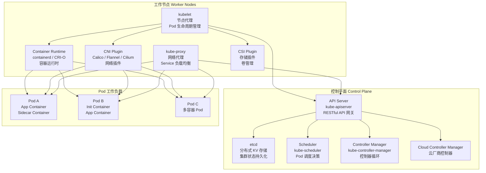

:::important
本文所有分析基于 #[R|Kubernetes v1.30+] 与 #[R|containerd v2.0+]，核心组件源码路径位于 `kubernetes/` 仓库。关键源码目录：`staging/src/k8s.io/apiserver/` API Server、`pkg/scheduler/` 调度器、`pkg/controller/` 控制器、`pkg/kubelet/` kubelet、`pkg/proxy/` kube-proxy。
:::

| 层级 | 组件 | 核心职责 | 关键路径 |
|------|------|----------|----------|
| 控制平面 | API Server | 集群统一入口、RESTful API、认证授权准入控制 | `staging/src/k8s.io/apiserver/` |
| 控制平面 | etcd | 集群状态持久化存储、Watch 机制通知变更 | `vendor/go.etcd.io/etcd/` |
| 控制平面 | Scheduler | Pod 调度决策、预选优选、亲和性计算 | `pkg/scheduler/` |
| 控制平面 | Controller Manager | 副本控制器、节点控制器、端点控制器等 | `pkg/controller/` |
| 数据平面 | kubelet | Pod 生命周期管理、容器健康检查、卷挂载 | `pkg/kubelet/` |
| 数据平面 | kube-proxy | Service 网络代理、iptables/IPVS 规则管理 | `pkg/proxy/` |
| 数据平面 | Container Runtime | 容器生命周期、镜像管理、cgroups 资源限制 | CRI 接口实现 |

***

## 场景一：Kubernetes 架构总览 · 控制平面与数据平面

### 1.0 场景概览

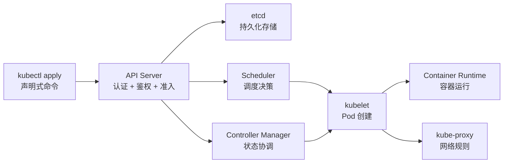

| 阶段 | 核心组件 | 关键机制 | 说明 |
|------|----------|----------|------|
| 请求入口 | API Server | 认证、鉴权、准入控制 | 所有操作必须经过 API Server |
| 状态存储 | etcd | Watch 机制、MVCC、Raft 共识 | 集群唯一状态源 |
| 调度决策 | Scheduler | 预选 + 优选 + 绑定 | 为 Pod 选择最优节点 |
| 状态协调 | Controller Manager | 控制循环、Reconcile 模式 | 持续驱动实际状态向期望状态收敛 |
| 容器运行 | kubelet | CRI 调用、健康检查、卷挂载 | 节点上的 Pod 生命周期管理器 |
| 网络代理 | kube-proxy | iptables/IPVS 规则 | Service 负载均衡实现 |

### 1.1 API Server 核心机制

API Server 是 Kubernetes 集群的 **唯一入口**，所有组件之间的通信都必须经过它。它提供了 RESTful API 接口，支持对资源的 CRUD 操作以及 Watch 监听。

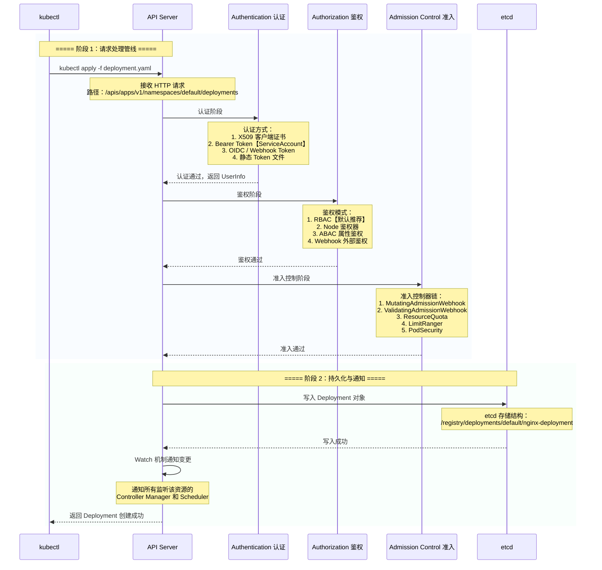

| 认证方式 | 描述 | 适用场景 |
|----------|------|----------|
| X509 客户端证书 | 基于 TLS 双向认证 | 集群组件间通信 |
| Bearer Token | ServiceAccount 自动挂载 Token | Pod 内访问 API Server |
| OIDC | OpenID Connect 身份提供者 | 企业统一身份认证 |
| Webhook Token | 外部 Token 验证服务 | 自定义认证逻辑 |

**准入控制器链**是 API Server 中最强大的扩展机制：

```yaml
# MutatingWebhookConfiguration 示例
apiVersion: admissionregistration.k8s.io/v1
kind: MutatingWebhookConfiguration
metadata:
  name: sidecar-injector
webhooks:
  - name: sidecar-injector.example.com
    clientConfig:
      service:
        name: sidecar-injector-svc
        namespace: default
        path: "/mutate"
      caBundle: LS0tLS1CRUdJTi...
    rules:
      - operations: ["CREATE"]
        apiGroups: [""]
        apiVersions: ["v1"]
        resources: ["pods"]
    failurePolicy: Fail
    sideEffects: None
```

### 1.2 etcd 分布式存储

etcd 是 Kubernetes 的 **唯一状态源**，所有集群状态数据都存储在 etcd 中。

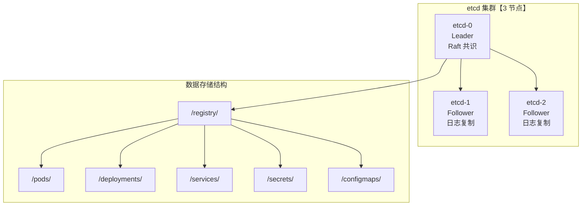

| 特性 | 说明 | 配置建议 |
|------|------|----------|
| Raft 共识 | 需要奇数节点【≥ 3】，半数以上存活即可工作 | 生产环境至少 3 节点 |
| 数据压缩 | 定期压缩历史版本减少存储空间 | `--auto-compaction-mode=periodic` |
| 备份 | 定期快照备份防止数据丢失 | `etcdctl snapshot save` |
| 高可用 | 跨可用区部署 etcd 节点 | 3 个可用区各 1 节点 |

```bash
# etcd 健康检查
etcdctl endpoint health --endpoints=https://127.0.0.1:2379

# etcd 数据备份
etcdctl snapshot save /backup/etcd-$(date +%Y%m%d).db

# 查看 Kubernetes 数据
etcdctl get /registry/ --prefix --keys-only | head -20
```

### 1.3 声明式 API 设计哲学

Kubernetes 的核心设计理念是 **声明式 API**：用户描述期望的系统状态，而不是逐步的命令。控制循环持续监控实际状态，并自动将其调整为期望状态。

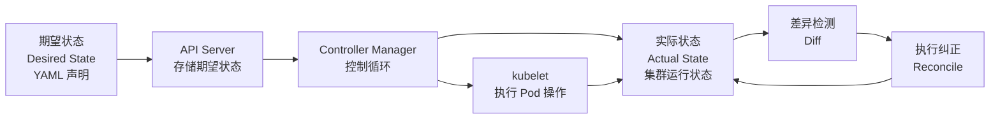

| 声明式 API 特性 | 说明 | 优势 |
|------|------|------|
| 自愈能力 | 自动检测并修复异常状态 | 无需人工介入 |
| 版本管理 | YAML 文件可纳入 Git 版本控制 | GitOps 工作流 |
| 幂等性 | 多次 apply 相同配置结果一致 | 避免重复操作副作用 |
| 可扩展性 | CRD 自定义资源扩展 API | 生态丰富 |

***

## 场景二：Pod 生命周期全链路

### 2.0 场景概览

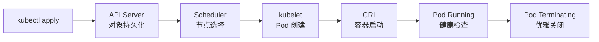

| 阶段 | 核心组件 | 关键操作 | 耗时估算 |
|------|----------|----------|----------|
| 1. 请求提交 | kubectl → API Server | 认证、鉴权、准入、持久化 | < 100ms |
| 2. 调度决策 | Scheduler | 预选 → 优选 → 绑定 | < 500ms |
| 3. 镜像拉取 | kubelet → CRI | 拉取容器镜像 | 取决于镜像大小 |
| 4. 容器创建 | kubelet → CRI | 创建 Sandbox → 创建容器 | < 1s |
| 5. 健康检查 | kubelet | readinessProbe 通过 | 取决于探针配置 |
| 6. 网络就绪 | CNI | 分配 IP、配置网络 | < 500ms |
| 7. Service 发现 | kube-proxy | 更新 iptables/IPVS 规则 | < 500ms |
| 8. 就绪状态 | API Server | Pod Status 更新为 Ready | < 100ms |

### 2.1 Pod 创建完整流程

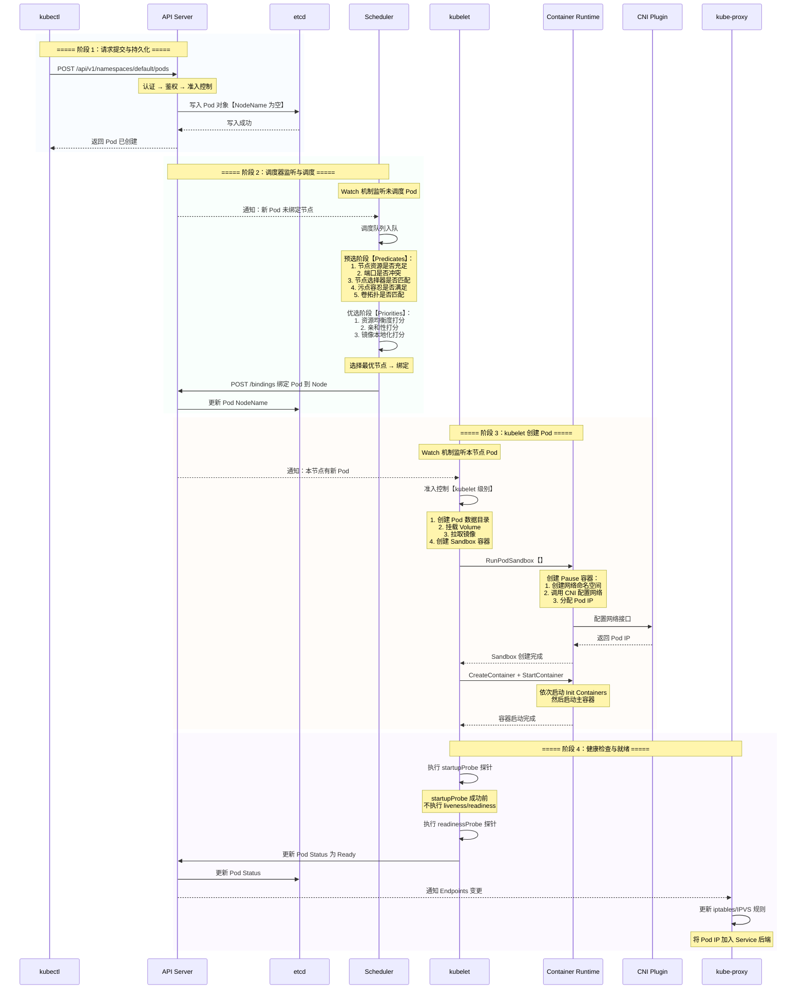

### 2.2 Init Container 与 Sidecar 模式

**Init Container**：在应用容器启动前执行的初始化容器，常用于数据库迁移、配置初始化等场景。

```yaml
apiVersion: v1
kind: Pod
metadata:
  name: app-with-init
spec:
  initContainers:
    - name: init-db
      image: busybox:1.36
      command: ['sh', '-c', 'until nc -z mysql 3306； do echo waiting for mysql； sleep 2； done']
    - name: init-migration
      image: myapp-flyway:latest
      command: ['flyway', 'migrate']
  containers:
    - name: app
      image: myapp:latest
      ports:
        - containerPort: 8080
```

**Sidecar 模式**：将辅助功能（日志收集、代理、监控）作为独立容器与主容器共存于同一 Pod 中。

```yaml
apiVersion: v1
kind: Pod
metadata:
  name: app-with-sidecar
spec:
  containers:
    - name: app
      image: myapp:latest
      volumeMounts:
        - name: shared-logs
          mountPath: /var/log/app
    - name: log-collector          # Sidecar 容器
      image: fluentd:latest
      volumeMounts:
        - name: shared-logs
          mountPath: /var/log/app
  volumes:
    - name: shared-logs
      emptyDir: {}
```

| 模式 | 用途 | 典型场景 |
|------|------|----------|
| Init Container | 应用启动前初始化 | 数据库迁移、证书生成、依赖等待 |
| Sidecar | 与主容器协同工作 | 日志收集、服务网格代理、配置热更新 |
| Ambassador | 代理外部服务 | 数据库代理、缓存代理 |
| Adapter | 标准化输出 | 日志格式转换、指标导出 |

### 2.3 Pod 生命周期钩子

```yaml
apiVersion: v1
kind: Pod
metadata:
  name: lifecycle-demo
spec:
  containers:
    - name: app
      image: nginx:1.25
      lifecycle:
        postStart:
          exec:
            command: ["/bin/sh", "-c", "echo Pod started at $(date) >> /var/log/lifecycle.log"]
        preStop:
          exec:
            command: ["/bin/sh", "-c", "nginx -s quit && sleep 30"]
```

| 钩子 | 触发时机 | 用途 | 注意事项 |
|------|----------|------|----------|
| postStart | 容器创建后立即执行 | 初始化资源、注册服务 | 与 ENTRYPOINT 异步执行 |
| preStop | 容器终止前执行 | 优雅关闭、清理连接 | 必须在 terminationGracePeriodSeconds 内完成 |

### 2.4 健康检查探针

```yaml
apiVersion: v1
kind: Pod
metadata:
  name: probe-demo
spec:
  containers:
    - name: app
      image: myapp:latest
      ports:
        - containerPort: 8080
      startupProbe:                    # 启动探针
        httpGet:
          path: /actuator/health
          port: 8080
        failureThreshold: 30
        periodSeconds: 10
      livenessProbe:                   # 存活探针
        httpGet:
          path: /actuator/health/liveness
          port: 8080
        initialDelaySeconds: 0
        periodSeconds: 15
        failureThreshold: 3
      readinessProbe:                  # 就绪探针
        httpGet:
          path: /actuator/health/readiness
          port: 8080
        initialDelaySeconds: 5
        periodSeconds: 10
        failureThreshold: 3
```

| 探针类型 | 用途 | 检查失败后果 | 检查方式 |
|----------|------|-------------|----------|
| startupProbe | 判断容器是否已启动 | 重启容器 | httpGet / tcpSocket / exec |
| livenessProbe | 判断容器是否存活 | 重启容器 | httpGet / tcpSocket / exec |
| readinessProbe | 判断容器是否就绪 | 从 Service 后端移除 | httpGet / tcpSocket / exec |

| 检查方式 | 说明 | 示例 |
|----------|------|------|
| httpGet | HTTP GET 请求检查 | 返回 2xx/3xx 表示成功 |
| tcpSocket | TCP 端口连通性检查 | 端口可连接表示成功 |
| exec | 在容器内执行命令 | 退出码为 0 表示成功 |

***

## 场景三：调度器深度剖析

### 3.0 场景概览

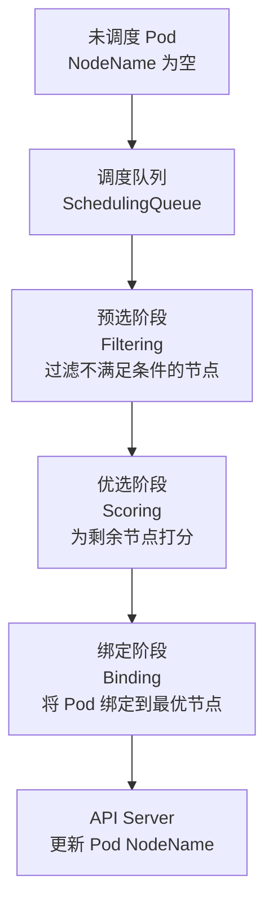

| 阶段 | 机制 | 核心逻辑 | 性能特性 |
|------|------|----------|----------|
| 调度队列 | 优先级队列 + 重试机制 | 高优先级 Pod 优先调度 | 支持 Pod 优先级抢占 |
| 预选 | Filter 插件链 | 过滤资源不足、端口冲突等节点 | 并行执行，性能高 |
| 优选 | Score 插件链 | 加权打分，选择最优节点 | 支持自定义打分权重 |
| 绑定 | 原子绑定 | 乐观锁更新 Pod NodeName | 避免并发冲突 |

### 3.1 调度框架

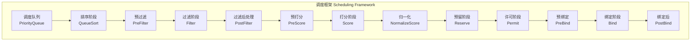

| 扩展点 | 说明 | 典型插件 |
|--------|------|----------|
| QueueSort | 决定 Pod 调度顺序 | PrioritySort |
| PreFilter | 预过滤，收集 Pod 信息 | NodeResourcesFit |
| Filter | 过滤不满足条件的节点 | NodeUnschedulable、TaintToleration |
| PostFilter | 过滤后处理，抢占调度 | DefaultPreemption |
| PreScore | 预打分，准备打分数据 | - |
| Score | 对节点打分 | NodeResourcesBalancedAllocation、ImageLocality |
| Reserve | 预留资源，避免竞态 | VolumeBinding |
| Permit | 许可/延迟/拒绝调度 | - |
| PreBind | 绑定前准备 | VolumeBinding |
| Bind | 执行绑定 | DefaultBinder |
| PostBind | 绑定后清理 | - |

### 3.2 预选阶段

调度器在预选阶段会过滤掉所有不满足 Pod 运行条件的节点。

| 预选插件 | 检查条件 | 说明 |
|----------|----------|------|
| NodeUnschedulable | 节点是否被标记为不可调度 | `kubectl cordon` 标记 |
| TaintToleration | Pod 是否容忍节点的污点 | 污点与容忍匹配 |
| NodeResourcesFit | 节点资源是否满足请求 | CPU、内存、临时存储 |
| NodePorts | 节点端口是否冲突 | HostPort 端口检查 |
| VolumeBinding | 节点是否能挂载所需的卷 | PV/PVC 拓扑检查 |
| NodeAffinity | 节点亲和性是否匹配 | nodeSelector/nodeAffinity |

### 3.3 优选阶段

通过预选的节点进入优选阶段，按权重打分选出最优节点。

| 优选插件 | 打分策略 | 默认权重 |
|----------|----------|----------|
| NodeResourcesBalancedAllocation | 资源使用均衡度 | 1 |
| NodeResourcesLeastAllocated | 资源空闲率 | 1 |
| ImageLocality | 节点上已有镜像 | 1 |
| NodeAffinity | 亲和性偏好匹配 | 1 |
| InterPodAffinity | Pod 亲和性/反亲和性 | 1 |
| TaintToleration | 污点容忍偏好 | 1 |

### 3.4 亲和性与反亲和性

```yaml
apiVersion: v1
kind: Pod
metadata:
  name: affinity-demo
spec:
  affinity:
    nodeAffinity:                       # 节点亲和性
      requiredDuringSchedulingIgnoredDuringExecution:
        nodeSelectorTerms:
          - matchExpressions:
              - key: topology.kubernetes.io/zone
                operator: In
                values:
                  - zone-a
                  - zone-b
      preferredDuringSchedulingIgnoredDuringExecution:
        - weight: 80
          preference:
            matchExpressions:
              - key: node-type
                operator: In
                values:
                  - compute-optimized
    podAffinity:                        # Pod 亲和性
      requiredDuringSchedulingIgnoredDuringExecution:
        - labelSelector:
            matchLabels:
              app: cache
          topologyKey: topology.kubernetes.io/hostname
    podAntiAffinity:                    # Pod 反亲和性
      preferredDuringSchedulingIgnoredDuringExecution:
        - weight: 100
          podAffinityTerm:
            labelSelector:
              matchLabels:
                app: web-server
            topologyKey: topology.kubernetes.io/zone
```

| 亲和性类型 | 硬性要求 | 软性偏好 | 说明 |
|------|------|------|------|
| nodeAffinity | requiredDuringScheduling... | preferredDuringScheduling... | 约束 Pod 调度到特定节点 |
| podAffinity | requiredDuringScheduling... | preferredDuringScheduling... | 将 Pod 调度到已有 Pod 的节点 |
| podAntiAffinity | requiredDuringScheduling... | preferredDuringScheduling... | 将 Pod 分散到不同节点 |

### 3.5 污点与容忍

```yaml
# 给节点添加污点
# kubectl taint nodes node1 dedicated=critical:NoSchedule

apiVersion: v1
kind: Pod
metadata:
  name: tolerated-pod
spec:
  tolerations:
    - key: "dedicated"
      operator: "Equal"
      value: "critical"
      effect: "NoSchedule"
    - key: "node.kubernetes.io/not-ready"
      operator: "Exists"
      effect: "NoExecute"
      tolerationSeconds: 300          # 300 秒后驱逐
```

| 污点效果 | 说明 |
|----------|------|
| NoSchedule | 不允许新 Pod 调度到该节点 |
| PreferNoSchedule | 尽量不调度到该节点 |
| NoExecute | 驱逐已有 Pod 且不允许新 Pod 调度 |

### 3.6 拓扑分布约束

```yaml
apiVersion: v1
kind: Pod
metadata:
  name: spread-demo
spec:
  topologySpreadConstraints:
    - maxSkew: 1
      topologyKey: topology.kubernetes.io/zone
      whenUnsatisfiable: DoNotSchedule
      labelSelector:
        matchLabels:
          app: web-server
    - maxSkew: 1
      topologyKey: kubernetes.io/hostname
      whenUnsatisfiable: ScheduleAnyway
      labelSelector:
        matchLabels:
          app: web-server
```

| 参数 | 说明 |
|------|------|
| maxSkew | 允许的最大不均衡度 |
| topologyKey | 拓扑域标识 |
| whenUnsatisfiable | DoNotSchedule 或 ScheduleAnyway |
| labelSelector | 匹配需要进行分布计算的 Pod |

***

## 场景四：Service 与网络模型

### 4.0 场景概览

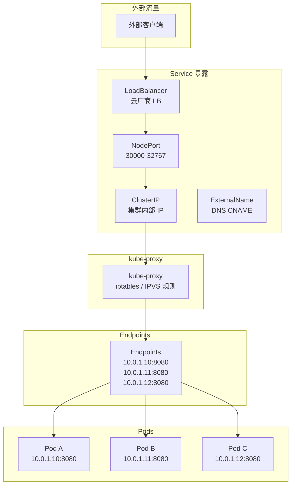

### 4.1 四种 Service 类型

```yaml
# ClusterIP - 集群内部访问
apiVersion: v1
kind: Service
metadata:
  name: internal-svc
spec:
  type: ClusterIP
  selector:
    app: myapp
  ports:
    - port: 80
      targetPort: 8080
      protocol: TCP

---
# NodePort - 节点端口暴露
apiVersion: v1
kind: Service
metadata:
  name: nodeport-svc
spec:
  type: NodePort
  selector:
    app: myapp
  ports:
    - port: 80
      targetPort: 8080
      nodePort: 30080

---
# LoadBalancer - 云厂商负载均衡
apiVersion: v1
kind: Service
metadata:
  name: lb-svc
  annotations:
    service.beta.kubernetes.io/aws-load-balancer-type: "nlb"
spec:
  type: LoadBalancer
  selector:
    app: myapp
  ports:
    - port: 443
      targetPort: 8080
      protocol: TCP

---
# ExternalName - DNS 别名
apiVersion: v1
kind: Service
metadata:
  name: external-svc
spec:
  type: ExternalName
  externalName: database.example.com
```

| Service 类型 | 访问方式 | 使用场景 |
|------|------|------|
| ClusterIP | 集群内部 IP 访问 | 微服务间内部通信 |
| NodePort | 节点 IP + 端口访问 | 开发测试、简单暴露 |
| LoadBalancer | 云厂商负载均衡器 | 生产环境外部访问 |
| ExternalName | DNS CNAME 别名 | 访问外部服务 |

### 4.2 kube-proxy 三种模式

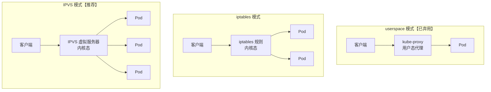

| 模式 | 实现方式 | 性能 | 负载均衡算法 | 推荐度 |
|------|----------|------|-------------|--------|
| userspace | 用户态代理转发 | 低 | 轮询 | 已弃用 |
| iptables | 内核态 netfilter 规则 | 中 | 随机 | 小规模集群 |
| IPVS | 内核态 IPVS 模块 | 高 | rr/wrr/lc/wlc/sh/dh 等 | 推荐 |

```bash
# 配置 kube-proxy 使用 IPVS 模式
kubectl edit configmap kube-proxy -n kube-system
# 修改 mode: "ipvs"

# 查看 IPVS 规则
ipvsadm -Ln
```

### 4.3 Ingress 与 Ingress Controller

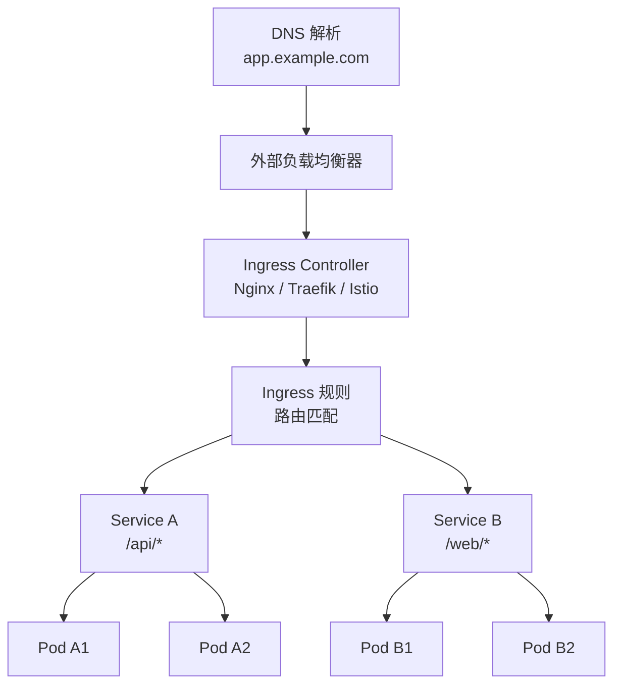

```yaml
apiVersion: networking.k8s.io/v1
kind: Ingress
metadata:
  name: app-ingress
  annotations:
    nginx.ingress.kubernetes.io/rewrite-target: /
    nginx.ingress.kubernetes.io/ssl-redirect: "true"
    cert-manager.io/cluster-issuer: "letsencrypt-prod"
spec:
  ingressClassName: nginx
  tls:
    - hosts:
        - app.example.com
      secretName: app-tls
  rules:
    - host: app.example.com
      http:
        paths:
          - path: /api
            pathType: Prefix
            backend:
              service:
                name: api-service
                port:
                  number: 8080
          - path: /
            pathType: Prefix
            backend:
              service:
                name: web-service
                port:
                  number: 80
```

### 4.4 NetworkPolicy 网络策略

```yaml
apiVersion: networking.k8s.io/v1
kind: NetworkPolicy
metadata:
  name: api-network-policy
  namespace: default
spec:
  podSelector:
    matchLabels:
      app: api-server
  policyTypes:
    - Ingress
    - Egress
  ingress:
    - from:
        - podSelector:
            matchLabels:
              app: web-frontend
        - namespaceSelector:
            matchLabels:
              name: monitoring
      ports:
        - protocol: TCP
          port: 8080
  egress:
    - to:
        - podSelector:
            matchLabels:
              app: database
      ports:
        - protocol: TCP
          port: 5432
    - to:
        - namespaceSelector: {}
          podSelector:
            matchLabels:
              k8s-app: kube-dns
      ports:
        - protocol: UDP
          port: 53
```

| 策略类型 | 说明 | 默认行为 |
|----------|------|----------|
| Ingress | 控制入站流量 | 不指定则允许所有入站 |
| Egress | 控制出站流量 | 不指定则允许所有出站 |
| podSelector | 选择受策略影响的 Pod | 空则选择所有 Pod |
| namespaceSelector | 选择命名空间 | 用于跨命名空间访问控制 |

### 4.5 CNI 网络插件对比

| 插件 | 网络模型 | 网络策略 | 加密 | 性能 | 适用场景 |
|------|----------|----------|------|------|----------|
| Calico | BGP / IPIP / VXLAN | 丰富 | WireGuard | 高 | 企业级、大规模集群 |
| Flannel | VXLAN / host-gw | 基础 | 无 | 中 | 简单场景、快速部署 |
| Cilium | eBPF | 丰富 | 透明加密 | 极高 | 高性能、可观测性 |

```bash
# 安装 Calico
kubectl apply -f https://raw.githubusercontent.com/projectcalico/calico/v3.28.0/manifests/calico.yaml

# 验证 CNI 状态
kubectl get pods -n kube-system | grep calico
```

***

## 场景五：控制器与工作负载

### 5.0 场景概览

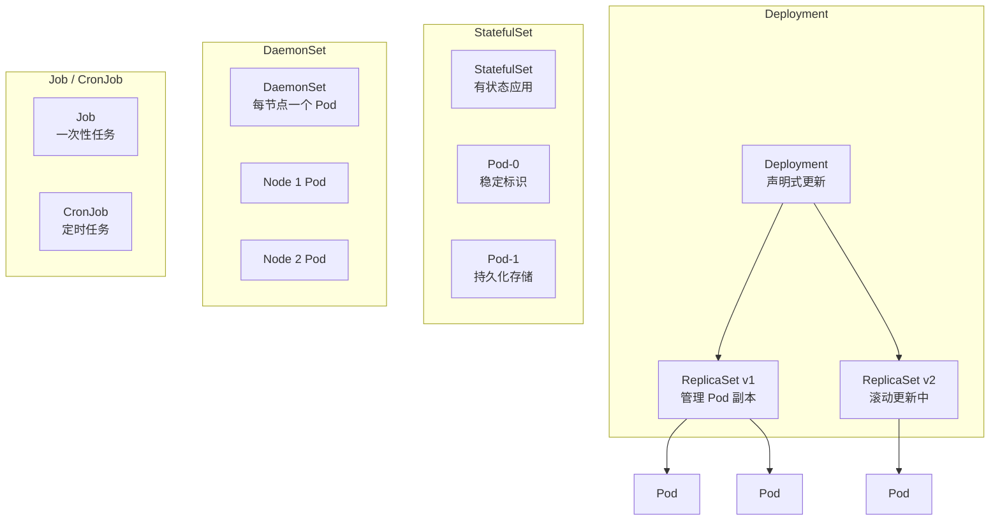

### 5.1 Deployment 滚动更新

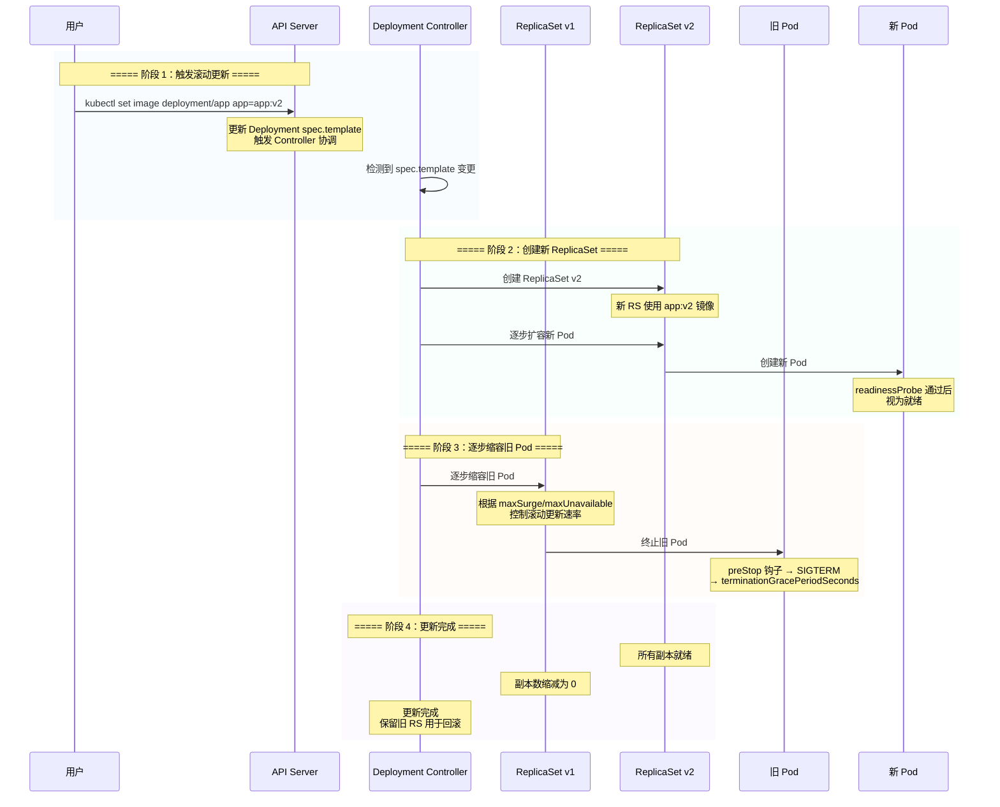

```yaml
apiVersion: apps/v1
kind: Deployment
metadata:
  name: app-deployment
spec:
  replicas: 3
  revisionHistoryLimit: 10           # 保留 10 个历史版本用于回滚
  strategy:
    type: RollingUpdate
    rollingUpdate:
      maxSurge: 25%                  # 最多额外创建 25% 的 Pod
      maxUnavailable: 25%            # 最多 25% 的 Pod 不可用
  selector:
    matchLabels:
      app: myapp
  template:
    metadata:
      labels:
        app: myapp
        version: v1
    spec:
      containers:
        - name: app
          image: myapp:v1
          ports:
            - containerPort: 8080
          resources:
            requests:
              cpu: "500m"
              memory: "512Mi"
            limits:
              cpu: "1000m"
              memory: "1Gi"
```

| 更新策略 | 方式 | 适用场景 |
|----------|------|----------|
| RollingUpdate | 逐步替换旧 Pod | 无状态应用、Web 服务 |
| Recreate | 先删除所有旧 Pod 再创建新 Pod | 有状态应用、数据库迁移 |

```bash
# 滚动更新
kubectl set image deployment/app-deployment app=myapp:v2

# 查看滚动更新状态
kubectl rollout status deployment/app-deployment

# 暂停/恢复滚动更新
kubectl rollout pause deployment/app-deployment
kubectl rollout resume deployment/app-deployment

# 回滚到上一个版本
kubectl rollout undo deployment/app-deployment

# 回滚到指定版本
kubectl rollout undo deployment/app-deployment --to-revision=3
```

### 5.2 StatefulSet 有状态应用

```yaml
apiVersion: apps/v1
kind: StatefulSet
metadata:
  name: mysql
spec:
  serviceName: mysql-headless
  replicas: 3
  podManagementPolicy: OrderedReady   # OrderedReady 或 Parallel
  selector:
    matchLabels:
      app: mysql
  template:
    metadata:
      labels:
        app: mysql
    spec:
      containers:
        - name: mysql
          image: mysql:8.0
          ports:
            - containerPort: 3306
          volumeMounts:
            - name: data
              mountPath: /var/lib/mysql
          env:
            - name: MYSQL_ROOT_PASSWORD
              valueFrom:
                secretKeyRef:
                  name: mysql-secret
                  key: password
  volumeClaimTemplates:
    - metadata:
        name: data
      spec:
        accessModes: ["ReadWriteOnce"]
        storageClassName: "ssd"
        resources:
          requests:
            storage: 100Gi
```

| StatefulSet 特性 | 说明 |
|------|------|
| 稳定网络标识 | Pod 名称格式为 `<statefulset-name>-<ordinal>` |
| 稳定持久化存储 | 每个 Pod 绑定独立的 PVC，Pod 重建后 PVC 不变 |
| 有序部署与扩缩 | 从 0 到 N-1 依次创建，从 N-1 到 0 依次删除 |
| 有序滚动更新 | 从 N-1 到 0 依次更新 |

### 5.3 DaemonSet 守护进程集

```yaml
apiVersion: apps/v1
kind: DaemonSet
metadata:
  name: fluentd
spec:
  selector:
    matchLabels:
      name: fluentd
  template:
    metadata:
      labels:
        name: fluentd
    spec:
      tolerations:
        - key: node-role.kubernetes.io/master
          effect: NoSchedule
      containers:
        - name: fluentd
          image: fluentd:latest
          volumeMounts:
            - name: varlog
              mountPath: /var/log
            - name: containers
              mountPath: /var/lib/docker/containers
              readOnly: true
      volumes:
        - name: varlog
          hostPath:
            path: /var/log
        - name: containers
          hostPath:
            path: /var/lib/docker/containers
```

### 5.4 Job 与 CronJob

```yaml
# Job - 一次性任务
apiVersion: batch/v1
kind: Job
metadata:
  name: data-migration
spec:
  backoffLimit: 3
  completions: 1
  parallelism: 1
  ttlSecondsAfterFinished: 3600      # 完成后 1 小时自动清理
  template:
    spec:
      restartPolicy: Never
      containers:
        - name: migration
          image: data-migration:latest
          command: ["python", "migrate.py"]

---
# CronJob - 定时任务
apiVersion: batch/v1
kind: CronJob
metadata:
  name: daily-backup
spec:
  schedule: "0 2 * * *"               # 每天凌晨 2 点
  concurrencyPolicy: Forbid           # Allow / Forbid / Replace
  successfulJobsHistoryLimit: 3
  failedJobsHistoryLimit: 1
  jobTemplate:
    spec:
      template:
        spec:
          restartPolicy: Never
          containers:
            - name: backup
              image: backup-tool:latest
              command: ["/bin/sh", "-c", "backup.sh"]
```

### 5.5 HPA 水平自动扩缩容

```yaml
apiVersion: autoscaling/v2
kind: HorizontalPodAutoscaler
metadata:
  name: app-hpa
spec:
  scaleTargetRef:
    apiVersion: apps/v1
    kind: Deployment
    name: app-deployment
  minReplicas: 2
  maxReplicas: 10
  metrics:
    - type: Resource
      resource:
        name: cpu
        target:
          type: Utilization
          averageUtilization: 70
    - type: Resource
      resource:
        name: memory
        target:
          type: Utilization
          averageUtilization: 80
    - type: Pods
      pods:
        metric:
          name: http_requests_per_second
        target:
          type: AverageValue
          averageValue: "1000"
  behavior:
    scaleDown:
      stabilizationWindowSeconds: 300  # 缩容稳定窗口 5 分钟
      policies:
        - type: Percent
          value: 10
          periodSeconds: 60
    scaleUp:
      stabilizationWindowSeconds: 0
      policies:
        - type: Percent
          value: 100
          periodSeconds: 15
```

| HPA 参数 | 说明 |
|------|------|
| minReplicas / maxReplicas | 最小/最大副本数 |
| metrics | 扩缩容依据的指标 |
| behavior.scaleDown | 缩容行为配置 |
| behavior.scaleUp | 扩容行为配置 |
| stabilizationWindowSeconds | 稳定窗口，避免频繁扩缩 |

***

## 场景六：存储与持久化

### 6.0 场景概览

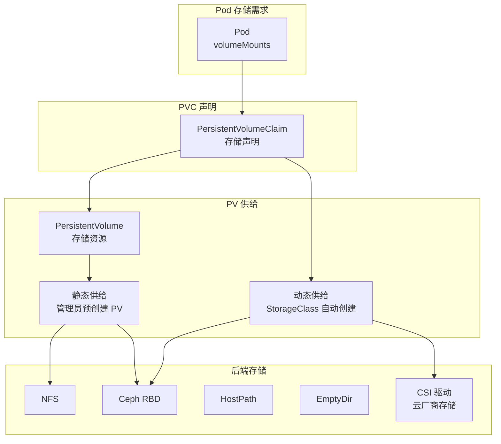

### 6.1 静态绑定 vs 动态绑定

```yaml
# 静态绑定：管理员预创建 PV
apiVersion: v1
kind: PersistentVolume
metadata:
  name: nfs-pv-10g
spec:
  capacity:
    storage: 10Gi
  accessModes:
    - ReadWriteMany
  persistentVolumeReclaimPolicy: Retain
  nfs:
    server: 192.168.1.100
    path: /data/nfs/k8s

---
# 动态绑定：使用 StorageClass 自动创建
apiVersion: storage.k8s.io/v1
kind: StorageClass
metadata:
  name: ssd-sc
provisioner: kubernetes.io/aws-ebs
parameters:
  type: gp3
  iops: "3000"
  throughput: "125"
reclaimPolicy: Delete
allowVolumeExpansion: true
volumeBindingMode: WaitForFirstConsumer

---
apiVersion: v1
kind: PersistentVolumeClaim
metadata:
  name: app-pvc
spec:
  accessModes:
    - ReadWriteOnce
  storageClassName: ssd-sc
  resources:
    requests:
      storage: 50Gi
```

| 绑定方式 | 说明 | 适用场景 |
|----------|------|----------|
| 静态绑定 | 管理员手动创建 PV，PVC 按条件匹配 | 固定存储资源 |
| 动态绑定 | StorageClass 自动按需创建 PV | 弹性存储、云原生 |

### 6.2 存储类型对比

| 存储类型 | 持久性 | 性能 | 共享 | 使用场景 |
|----------|------|------|------|----------|
| EmptyDir | Pod 生命周期 | 高 | 同 Pod 容器 | 临时缓存、共享日志 |
| HostPath | 节点持久 | 高 | 同节点 Pod | 日志收集、监控代理 |
| NFS | 持久 | 中 | 多 Pod 跨节点 | 共享文件存储 |
| Ceph RBD | 持久 | 高 | 块设备 | 数据库、有状态应用 |
| CSI | 持久 | 取决于后端 | 取决于后端 | 云厂商存储、第三方存储 |

### 6.3 ConfigMap 与 Secret

```yaml
# ConfigMap
apiVersion: v1
kind: ConfigMap
metadata:
  name: app-config
data:
  application.yml: |
    server:
      port: 8080
    spring:
      datasource:
        url: jdbc:mysql://mysql-service:3306/mydb
  log-level: DEBUG

---
# Secret
apiVersion: v1
kind: Secret
metadata:
  name: app-secret
type: Opaque
data:
  db-username: YWRtaW4=            # base64: admin
  db-password: c2VjcmV0MTIz       # base64: secret123

---
# Pod 使用 ConfigMap 和 Secret
apiVersion: v1
kind: Pod
metadata:
  name: app-with-config
spec:
  containers:
    - name: app
      image: myapp:latest
      env:
        - name: LOG_LEVEL
          valueFrom:
            configMapKeyRef:
              name: app-config
              key: log-level
        - name: DB_USERNAME
          valueFrom:
            secretKeyRef:
              name: app-secret
              key: db-username
        - name: DB_PASSWORD
          valueFrom:
            secretKeyRef:
              name: app-secret
              key: db-password
      volumeMounts:
        - name: config-volume
          mountPath: /app/config
        - name: secret-volume
          mountPath: /app/secrets
          readOnly: true
  volumes:
    - name: config-volume
      configMap:
        name: app-config
        items:
          - key: application.yml
            path: application.yml
    - name: secret-volume
      secret:
        secretName: app-secret
```

| 注入方式 | 说明 | 优势 |
|----------|------|------|
| 环境变量 | 通过 env.valueFrom 注入 | 简单直接 |
| 文件挂载 | 通过 volumeMounts 挂载 | 支持热更新 |
| 命令行参数 | 通过 env 注入后在 command 中使用 | 灵活性高 |

:::warning
Secret 默认只做 base64 编码，并非加密。生产环境需启用 #[R|Encryption at Rest]，或使用 #[R|Vault / Sealed Secrets] 等外部密钥管理方案。
:::

***

## 场景七：安全机制

### 7.0 场景概览

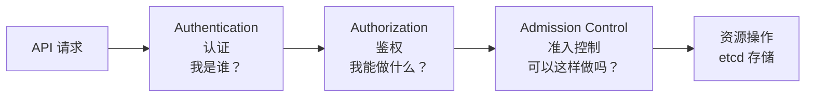

| 阶段 | 安全机制 | 核心组件 | 说明 |
|------|----------|----------|------|
| 认证 | Authentication | X509、Token、OIDC | 验证请求者身份 |
| 鉴权 | Authorization | RBAC、Node、Webhook | 检查操作权限 |
| 准入 | Admission Control | Mutating/Validating Webhook | 修改或拒绝请求 |
| 传输 | TLS | etcd、API Server 通信加密 | 防止中间人攻击 |
| 存储 | Encryption at Rest | etcd 加密 | 保护静态数据 |

### 7.1 RBAC 角色访问控制

```yaml
# Role - 命名空间级别权限
apiVersion: rbac.authorization.k8s.io/v1
kind: Role
metadata:
  namespace: default
  name: pod-reader
rules:
  - apiGroups: [""]
    resources: ["pods"]
    verbs: ["get", "list", "watch"]
  - apiGroups: [""]
    resources: ["pods/log"]
    verbs: ["get"]

---
# ClusterRole - 集群级别权限
apiVersion: rbac.authorization.k8s.io/v1
kind: ClusterRole
metadata:
  name: node-reader
rules:
  - apiGroups: [""]
    resources: ["nodes"]
    verbs: ["get", "list", "watch"]
  - apiGroups: [""]
    resources: ["persistentvolumes"]
    verbs: ["get", "list"]

---
# RoleBinding - 命名空间级别绑定
apiVersion: rbac.authorization.k8s.io/v1
kind: RoleBinding
metadata:
  name: read-pods
  namespace: default
subjects:
  - kind: ServiceAccount
    name: app-sa
    namespace: default
roleRef:
  kind: Role
  name: pod-reader
  apiGroup: rbac.authorization.k8s.io

---
# ClusterRoleBinding - 集群级别绑定
apiVersion: rbac.authorization.k8s.io/v1
kind: ClusterRoleBinding
metadata:
  name: read-nodes
subjects:
  - kind: Group
    name: developers
    apiGroup: rbac.authorization.k8s.io
roleRef:
  kind: ClusterRole
  name: node-reader
  apiGroup: rbac.authorization.k8s.io
```

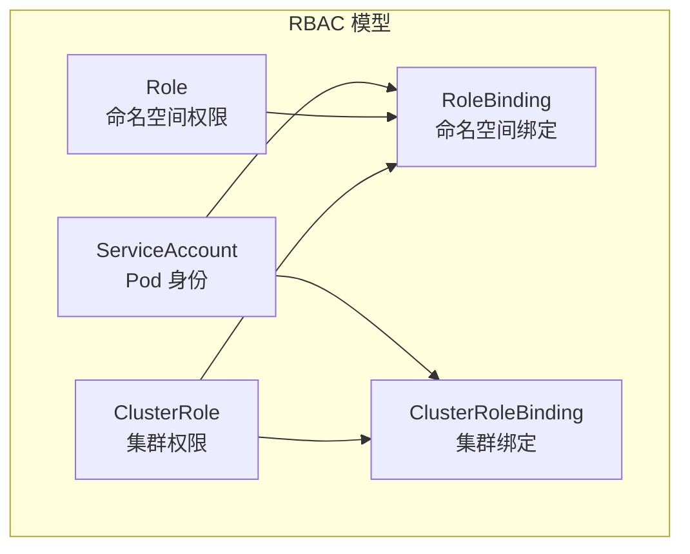

### 7.2 ServiceAccount

```yaml
apiVersion: v1
kind: ServiceAccount
metadata:
  name: app-sa
  namespace: default
automountServiceAccountToken: true

---
apiVersion: apps/v1
kind: Deployment
metadata:
  name: app
spec:
  template:
    spec:
      serviceAccountName: app-sa
      containers:
        - name: app
          image: myapp:latest
```

| ServiceAccount 特性 | 说明 |
|------|------|
| 自动挂载 Token | 默认挂载到 `/var/run/secrets/kubernetes.io/serviceaccount/token` |
| 命名空间隔离 | 每个 ServiceAccount 属于特定命名空间 |
| 短期 Token | v1.24+ 支持有有效期的 Token |

### 7.3 PodSecurityStandards

```yaml
apiVersion: v1
kind: Namespace
metadata:
  name: secure-app
  labels:
    pod-security.kubernetes.io/enforce: restricted
    pod-security.kubernetes.io/enforce-version: latest
    pod-security.kubernetes.io/audit: restricted
    pod-security.kubernetes.io/warn: restricted
```

| 安全级别 | 说明 | 典型限制 |
|----------|------|----------|
| privileged | 无限制 | 允许特权容器 |
| baseline | 基础防护 | 禁止 hostNetwork、hostPID 等 |
| restricted | 严格限制 | 强制非 root 用户、只读根文件系统 |

```yaml
# 受限制的安全 Pod 配置
apiVersion: v1
kind: Pod
metadata:
  name: secure-pod
spec:
  securityContext:
    runAsNonRoot: true
    runAsUser: 1000
    runAsGroup: 3000
    fsGroup: 2000
    seccompProfile:
      type: RuntimeDefault
  containers:
    - name: app
      image: myapp:latest
      securityContext:
        allowPrivilegeEscalation: false
        readOnlyRootFilesystem: true
        capabilities:
          drop:
            - ALL
        runAsNonRoot: true
```

### 7.4 网络策略安全隔离

```yaml
# 默认拒绝所有入站流量
apiVersion: networking.k8s.io/v1
kind: NetworkPolicy
metadata:
  name: default-deny-ingress
  namespace: production
spec:
  podSelector: {}
  policyTypes:
    - Ingress

---
# 默认拒绝所有出站流量
apiVersion: networking.k8s.io/v1
kind: NetworkPolicy
metadata:
  name: default-deny-egress
  namespace: production
spec:
  podSelector: {}
  policyTypes:
    - Egress
```

***

## 场景八：Kubernetes 在 Java 微服务中的实践

### 8.0 场景概览

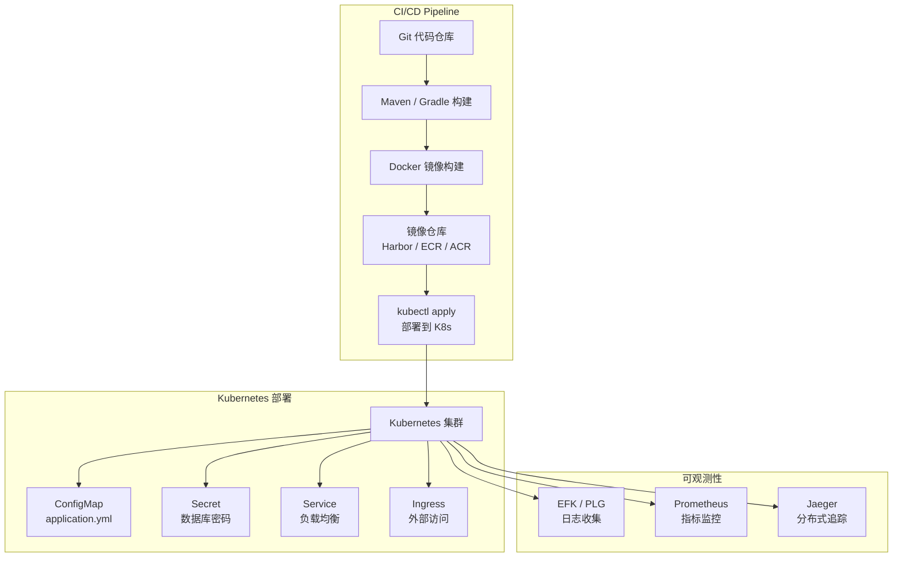

### 8.1 Spring Boot 应用容器化

```dockerfile
# 多阶段构建 Dockerfile - 最佳实践
FROM maven:3.9-eclipse-temurin-21 AS builder
WORKDIR /app
COPY pom.xml .
RUN mvn dependency:go-offline -B
COPY src ./src
RUN mvn package -DskipTests -B

FROM eclipse-temurin:21-jre-alpine
WORKDIR /app
# 创建非 root 用户
RUN addgroup -g 1000 appgroup && \
    adduser -u 1000 -G appgroup -s /bin/sh -D appuser
# 安装必要工具
RUN apk add --no-cache curl
COPY --from=builder /app/target/*.jar app.jar
USER appuser
EXPOSE 8080
# JVM 参数优化
ENV JAVA_OPTS="-XX:+UseG1GC \
  -XX:MaxRAMPercentage=75.0 \
  -XX:InitialRAMPercentage=50.0 \
  -XX:+ExitOnOutOfMemoryError \
  -XX:+HeapDumpOnOutOfMemoryError \
  -XX:HeapDumpPath=/tmp/heapdump.hprof"
ENTRYPOINT ["sh", "-c", "java $JAVA_OPTS -jar app.jar"]
```

| JVM 参数 | 说明 | 推荐值 |
|----------|------|--------|
| -XX:MaxRAMPercentage | 堆内存最大占用容器内存比例 | 75.0 |
| -XX:InitialRAMPercentage | 堆内存初始占用容器内存比例 | 50.0 |
| -XX:+UseG1GC | 使用 G1 垃圾收集器 | 推荐 |
| -XX:+ExitOnOutOfMemoryError | OOM 时退出进程 | 必须 |
| -XX:+HeapDumpOnOutOfMemoryError | OOM 时生成堆转储 | 推荐 |

### 8.2 Kubernetes 部署配置

```yaml
apiVersion: apps/v1
kind: Deployment
metadata:
  name: spring-app
  namespace: production
  labels:
    app: spring-app
    version: v1.0.0
spec:
  replicas: 3
  strategy:
    type: RollingUpdate
    rollingUpdate:
      maxSurge: 1
      maxUnavailable: 0
  selector:
    matchLabels:
      app: spring-app
  template:
    metadata:
      labels:
        app: spring-app
        version: v1.0.0
      annotations:
        prometheus.io/scrape: "true"
        prometheus.io/path: "/actuator/prometheus"
        prometheus.io/port: "8080"
    spec:
      serviceAccountName: spring-app-sa
      terminationGracePeriodSeconds: 60
      topologySpreadConstraints:
        - maxSkew: 1
          topologyKey: topology.kubernetes.io/zone
          whenUnsatisfiable: DoNotSchedule
          labelSelector:
            matchLabels:
              app: spring-app
      containers:
        - name: spring-app
          image: registry.example.com/spring-app:v1.0.0
          imagePullPolicy: IfNotPresent
          ports:
            - name: http
              containerPort: 8080
              protocol: TCP
          env:
            - name: JAVA_OPTS
              value: "-XX:MaxRAMPercentage=75.0 -XX:+UseG1GC"
            - name: SPRING_PROFILES_ACTIVE
              value: "k8s"
            - name: DB_PASSWORD
              valueFrom:
                secretKeyRef:
                  name: db-secret
                  key: password
          resources:
            requests:
              cpu: "500m"
              memory: "512Mi"
            limits:
              cpu: "2000m"
              memory: "2Gi"
          startupProbe:
            httpGet:
              path: /actuator/health
              port: http
            failureThreshold: 30
            periodSeconds: 10
          livenessProbe:
            httpGet:
              path: /actuator/health/liveness
              port: http
            periodSeconds: 15
            failureThreshold: 3
          readinessProbe:
            httpGet:
              path: /actuator/health/readiness
              port: http
            initialDelaySeconds: 5
            periodSeconds: 10
            failureThreshold: 3
          lifecycle:
            preStop:
              exec:
                command:
                  - /bin/sh
                  - -c
                  - |
                    echo "Starting graceful shutdown..."
                    curl -X POST http://localhost:8080/actuator/shutdown
                    sleep 45
          volumeMounts:
            - name: config
              mountPath: /app/config
              readOnly: true
            - name: tmp
              mountPath: /tmp
      volumes:
        - name: config
          configMap:
            name: spring-app-config
        - name: tmp
          emptyDir:
            sizeLimit: 500Mi
```

### 8.3 优雅关闭配置

```yaml
# application-k8s.yml - Spring Boot 优雅关闭
server:
  port: 8080
  shutdown: graceful
spring:
  lifecycle:
    timeout-per-shutdown-phase: 40s
management:
  endpoint:
    shutdown:
      access: unrestricted
    health:
      probes:
        enabled: true
      show-details: always
  endpoints:
    web:
      exposure:
        include: health,info,metrics,prometheus,shutdown
```

| 优雅关闭参数 | 说明 | 推荐值 |
|------|------|------|
| server.shutdown | 优雅关闭模式 | graceful |
| spring.lifecycle.timeout-per-shutdown-phase | 关闭超时时间 | 应小于 terminationGracePeriodSeconds |
| terminationGracePeriodSeconds | K8s 等待 Pod 关闭的最大时间 | 60s |
| preStop hook | 关闭前执行的操作 | curl shutdown + sleep 缓冲 |

### 8.4 配置管理

```yaml
apiVersion: v1
kind: ConfigMap
metadata:
  name: spring-app-config
  namespace: production
data:
  application-k8s.yml: |
    spring:
      datasource:
        url: jdbc:mysql://mysql-service:3306/mydb?useSSL=true&serverTimezone=Asia/Shanghai
        hikari:
          maximum-pool-size: 20
          minimum-idle: 5
          connection-timeout: 30000
          idle-timeout: 600000
          max-lifetime: 1800000
      data:
        redis:
          host: redis-service
          port: 6379
          lettuce:
            pool:
              max-active: 16
              max-idle: 8
              min-idle: 4
    logging:
      level:
        root: INFO
        com.example: DEBUG
      pattern:
        console: "%d{yyyy-MM-dd HH:mm:ss.SSS} [%thread] %-5level %logger{36} - %msg%n"
```

### 8.5 日志收集方案

```yaml
# EFK Stack - Fluentd DaemonSet
apiVersion: apps/v1
kind: DaemonSet
metadata:
  name: fluentd
  namespace: kube-logging
spec:
  selector:
    matchLabels:
      app: fluentd
  template:
    metadata:
      labels:
        app: fluentd
    spec:
      serviceAccountName: fluentd
      containers:
        - name: fluentd
          image: fluentd:v1.16-elasticsearch
          env:
            - name: FLUENT_ELASTICSEARCH_HOST
              value: "elasticsearch.kube-logging.svc.cluster.local"
            - name: FLUENT_ELASTICSEARCH_PORT
              value: "9200"
          volumeMounts:
            - name: varlog
              mountPath: /var/log
            - name: containers
              mountPath: /var/lib/docker/containers
              readOnly: true
      volumes:
        - name: varlog
          hostPath:
            path: /var/log
        - name: containers
          hostPath:
            path: /var/lib/docker/containers
```

| 日志方案 | 组件 | 特点 |
|----------|------|------|
| EFK | Elasticsearch + Fluentd + Kibana | 成熟稳定、功能丰富 |
| PLG | Promtail + Loki + Grafana | 轻量、与 Grafana 集成 |
| Filebeat | Filebeat + Elasticsearch + Kibana | Elastic 官方、性能好 |

***

## 场景九：监控与可观测性

### 9.0 场景概览

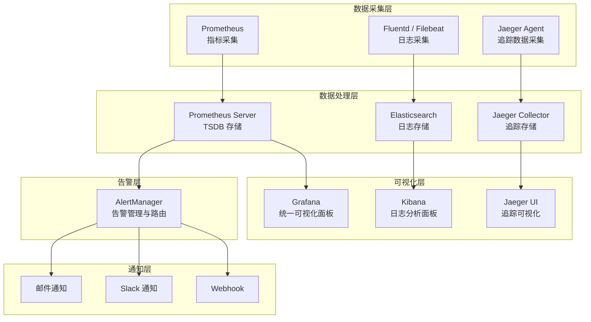

### 9.1 Prometheus Operator 部署

```yaml
# ServiceMonitor - 自动发现 Spring Boot 指标
apiVersion: monitoring.coreos.com/v1
kind: ServiceMonitor
metadata:
  name: spring-app-monitor
  namespace: production
spec:
  selector:
    matchLabels:
      app: spring-app
  endpoints:
    - port: http
      path: /actuator/prometheus
      interval: 15s
      scrapeTimeout: 10s

---
# PrometheusRule - 告警规则
apiVersion: monitoring.coreos.com/v1
kind: PrometheusRule
metadata:
  name: spring-app-alerts
  namespace: production
spec:
  groups:
    - name: spring-app.rules
      rules:
        - alert: HighErrorRate
          expr: |
            rate(http_server_requests_seconds_count{status=~"5.."}[5m]) > 0.05
          for: 5m
          labels:
            severity: critical
          annotations:
            summary: "High 5xx error rate detected"
            description: "Service {{ $labels.app }} has 5xx error rate of {{ $value }}"
        - alert: HighLatency
          expr: |
            histogram_quantile(0.99, rate(http_server_requests_seconds_bucket[5m])) > 2
          for: 5m
          labels:
            severity: warning
          annotations:
            summary: "P99 latency exceeds 2 seconds"
        - alert: PodRestarting
          expr: |
            rate(kube_pod_container_status_restarts_total[15m]) > 0
          for: 5m
          labels:
            severity: warning
          annotations:
            summary: "Pod {{ $labels.pod }} is restarting"
```

### 9.2 核心监控指标

| 指标类别 | PromQL 示例 | 说明 |
|----------|------------|------|
| CPU 使用率 | `rate(container_cpu_usage_seconds_total[5m])` | 容器 CPU 使用率 |
| 内存使用率 | `container_memory_working_set_bytes / container_spec_memory_limit_bytes` | 容器内存使用百分比 |
| Pod 重启次数 | `rate(kube_pod_container_status_restarts_total[15m])` | Pod 重启频率 |
| 网络流量 | `rate(container_network_transmit_bytes_total[5m])` | 网络发送速率 |
| 磁盘使用率 | `kubelet_volume_stats_used_bytes / kubelet_volume_stats_capacity_bytes` | 卷使用百分比 |
| JVM 堆内存 | `jvm_memory_used_bytes{area="heap"}` | JVM 堆内存使用量 |
| HTTP 请求速率 | `rate(http_server_requests_seconds_count[5m])` | HTTP QPS |
| HTTP 错误率 | `rate(http_server_requests_seconds_count{status=~"5.."}[5m])` | 5xx 错误率 |
| HTTP 延迟 P99 | `histogram_quantile(0.99, rate(http_server_requests_seconds_bucket[5m]))` | P99 响应时间 |

### 9.3 分布式追踪

```yaml
# Spring Boot Jaeger 集成配置
# application-k8s.yml
management:
  tracing:
    sampling:
      probability: 0.1          # 采样率 10%
  zipkin:
    tracing:
      endpoint: http://jaeger-collector.observability:9411/api/v2/spans

---
# Jaeger 部署
apiVersion: apps/v1
kind: Deployment
metadata:
  name: jaeger
  namespace: observability
spec:
  replicas: 1
  selector:
    matchLabels:
      app: jaeger
  template:
    metadata:
      labels:
        app: jaeger
    spec:
      containers:
        - name: jaeger
          image: jaegertracing/all-in-one:1.55
          ports:
            - containerPort: 16686
              name: ui
            - containerPort: 4317
              name: otlp-grpc
            - containerPort: 4318
              name: otlp-http
          env:
            - name: COLLECTOR_OTLP_ENABLED
              value: "true"
            - name: SPAN_STORAGE_TYPE
              value: "elasticsearch"
            - name: ES_SERVER_URLS
              value: "http://elasticsearch:9200"
```

### 9.4 Grafana 仪表板

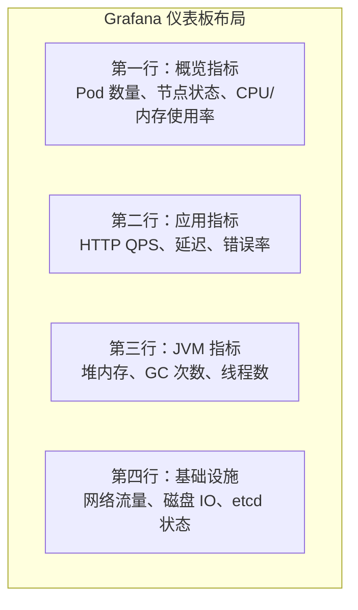

| Dashboard ID | 名称 | 用途 |
|------|------|------|
| 315 | Kubernetes Cluster Monitoring | 集群级别监控 |
| 6417 | Kubernetes Cluster Prometheus | 节点和 Pod 指标 |
| 12900 | Spring Boot 2.x Statistics | Spring Boot 应用指标 |
| 14370 | JVM Micrometer | JVM 详细指标 |
| 9614 | NGINX Ingress Controller | Ingress 流量监控 |

### 9.5 关键 kubectl 命令速查

```bash
# 集群状态
kubectl cluster-info
kubectl get nodes -o wide
kubectl top nodes
kubectl top pods -A

# 资源管理
kubectl get all -n <namespace>
kubectl describe pod <pod-name> -n <namespace>
kubectl logs -f <pod-name> -c <container-name> -n <namespace>
kubectl logs --tail=100 <pod-name> -n <namespace>

# 故障排查
kubectl get events -n <namespace> --sort-by='.lastTimestamp'
kubectl exec -it <pod-name> -n <namespace> -- /bin/sh
kubectl port-forward <pod-name> 8080:8080 -n <namespace>
kubectl debug -it <pod-name> --image=busybox --target=<container-name>

# 伸缩管理
kubectl scale deployment <deploy-name> --replicas=5 -n <namespace>
kubectl rollout history deployment/<deploy-name> -n <namespace>
kubectl rollout undo deployment/<deploy-name> -n <namespace>

# 配置管理
kubectl create configmap <name> --from-file=app.yml -n <namespace>
kubectl create secret generic <name> --from-literal=key=value -n <namespace>
kubectl apply -f <file.yaml> --dry-run=client

# 节点管理
kubectl cordon <node-name>
kubectl drain <node-name> --ignore-daemonsets --delete-emptydir-data
kubectl uncordon <node-name>
```

### 9.6 生产环境最佳实践清单

| 类别 | 最佳实践 | 说明 |
|------|----------|------|
| 资源管理 | 始终设置 requests 和 limits | 避免资源争抢和 OOM |
| 健康检查 | 配置 startupProbe + livenessProbe + readinessProbe | 确保流量只路由到健康 Pod |
| 优雅关闭 | preStop Hook + Spring graceful shutdown | 避免请求丢失 |
| 安全加固 | 使用非 root 用户 + readOnlyRootFilesystem | 最小权限原则 |
| 镜像管理 | 使用特定版本标签，避免 latest | 确保可重现部署 |
| 配置管理 | ConfigMap + Secret 外部化配置 | 配置与代码分离 |
| 网络策略 | 默认拒绝 + 按需开放 | 最小网络权限 |
| 日志收集 | 标准输出 + 日志聚合系统 | 集中化管理 |
| 监控告警 | Prometheus + Grafana + AlertManager | 主动发现问题 |
| 备份恢复 | 定期 etcd 备份 + Velero 应用备份 | 灾难恢复能力 |
| 资源配额 | Namespace ResourceQuota + LimitRange | 多租户隔离 |
| 亲和性 | PodAntiAffinity 跨节点/可用区 | 高可用部署 |

### 9.7 故障排查实战指南

| 常见故障 | 排查命令 | 解决方案 |
|----------|----------|----------|
| Pod 一直 Pending | `kubectl describe pod <name>` | 检查资源不足、节点选择器、污点、PVC 绑定 |
| Pod CrashLoopBackOff | `kubectl logs <pod> --previous` | 查看崩溃前日志，检查 OOM、启动命令错误 |
| Pod ImagePullBackOff | `kubectl describe pod <name>` | 检查镜像名称、imagePullSecret、仓库连通性 |
| Service 无法访问 | `kubectl get endpoints <svc>` | 检查 selector 匹配、Pod readinessProbe |
| 节点 NotReady | `kubectl describe node <name>` | 检查 kubelet 状态、磁盘压力、内存压力 |
| PVC 卡在 Pending | `kubectl describe pvc <name>` | 检查 StorageClass、PV 可用性、访问模式匹配 |

```bash
# 常用故障排查命令组合
# 1. 快速定位问题 Pod
kubectl get pods -A --field-selector=status.phase!=Running

# 2. 查看 Pod 事件时间线
kubectl get events --sort-by='.lastTimestamp' | tail -20

# 3. 检查资源使用 Top
kubectl top pods -A --sort-by=cpu
kubectl top nodes --sort-by=memory

# 4. 查看 Pod 退出码
kubectl get pod <name> -o jsonpath='{.status.containerStatuses[*].lastState.terminated.exitCode}'

# 5. 调试无法启动的容器
kubectl debug <pod-name> -it --image=busybox --share-processes --copy-to=debug-pod

# 6. 检查 DNS 解析
kubectl run dns-test --rm -it --image=busybox -- nslookup kubernetes.default
```

### 9.8 自定义资源与 Operator 模式

CRD 是 Kubernetes 最强大的扩展机制，允许开发者定义自己的 API 资源类型。

```yaml
# CRD 定义示例 - 自定义 MySQL 集群资源
apiVersion: apiextensions.k8s.io/v1
kind: CustomResourceDefinition
metadata:
  name: mysqlclusters.database.example.com
spec:
  group: database.example.com
  names:
    kind: MySQLCluster
    listKind: MySQLClusterList
    plural: mysqlclusters
    singular: mysqlcluster
    shortNames:
      - mc
  scope: Namespaced
  versions:
    - name: v1
      served: true
      storage: true
      schema:
        openAPIV3Schema:
          type: object
          properties:
            spec:
              type: object
              properties:
                replicas:
                  type: integer
                  minimum: 1
                  maximum: 5
                version:
                  type: string
                  pattern: '^8\.\d+$'
                storageSize:
                  type: string
                  pattern: '^\d+Gi$'
              required: ["replicas", "version"]
            status:
              type: object
              properties:
                phase:
                  type: string
                  enum: ["Pending", "Creating", "Running", "Failed"]
                masterEndpoint:
                  type: string
      subresources:
        status: {}

---
# 自定义资源实例
apiVersion: database.example.com/v1
kind: MySQLCluster
metadata:
  name: my-mysql
  namespace: production
spec:
  replicas: 3
  version: "8.0"
  storageSize: "100Gi"
```

| Operator 组件 | 说明 | 示例 |
|------|------|------|
| CRD | 自定义资源定义 | MySQLCluster、RedisCluster |
| Controller | 控制循环，Reconcile 逻辑 | 监控 CR 变更、创建/更新子资源 |
| Webhook | 校验和默认值注入 | 参数校验、默认值设置 |
| RBAC | 权限控制 | ServiceAccount + Role/ClusterRole |

### 9.9 资源配额与多租户管理

```yaml
# ResourceQuota - 命名空间资源配额
apiVersion: v1
kind: ResourceQuota
metadata:
  name: compute-quota
  namespace: team-a
spec:
  hard:
    requests.cpu: "20"
    requests.memory: "40Gi"
    limits.cpu: "40"
    limits.memory: "80Gi"
    persistentvolumeclaims: "10"
    pods: "50"
    services: "10"
    secrets: "20"
    configmaps: "20"

---
# LimitRange - 默认资源限制
apiVersion: v1
kind: LimitRange
metadata:
  name: default-limits
  namespace: team-a
spec:
  limits:
    - type: Container
      default:
        cpu: "500m"
        memory: "512Mi"
      defaultRequest:
        cpu: "200m"
        memory: "256Mi"
      max:
        cpu: "4"
        memory: "8Gi"
      min:
        cpu: "100m"
        memory: "128Mi"
```

| 资源管控机制 | 作用范围 | 说明 |
|------|------|------|
| ResourceQuota | Namespace | 限制命名空间的总资源使用量 |
| LimitRange | Namespace | 设置 Pod/容器的默认和最大/最小资源限制 |
| NetworkPolicy | Namespace | 控制 Pod 间网络通信 |
| PodSecurityStandards | Namespace | 限制 Pod 安全上下文 |

### 9.10 集群升级与维护策略

```bash
# 节点维护标准流程
# 1. 标记节点不可调度
kubectl cordon node-1

# 2. 驱逐节点上的 Pod
kubectl drain node-1 --ignore-daemonsets --delete-emptydir-data --grace-period=60

# 3. 执行节点维护操作
# （升级内核、安装补丁、硬件维护等）

# 4. 恢复节点调度
kubectl uncordon node-1

# 5. 验证 Pod 重新调度
kubectl get pods -o wide --field-selector spec.nodeName=node-1
```

```yaml
# PodDisruptionBudget - 确保维护期间最小可用副本
apiVersion: policy/v1
kind: PodDisruptionBudget
metadata:
  name: app-pdb
spec:
  minAvailable: 2
  selector:
    matchLabels:
      app: myapp
```

| 维护操作 | 命令 | 注意事项 |
|----------|------|----------|
| 节点封锁 | `kubectl cordon` | 新 Pod 不再调度到该节点 |
| 节点驱逐 | `kubectl drain` | 先 cordon 再驱逐已有 Pod |
| 节点恢复 | `kubectl uncordon` | 恢复后可接收新 Pod |
| 版本升级 | `kubeadm upgrade` | 先升级控制平面，再升级工作节点 |
| etcd 备份 | `etcdctl snapshot save` | 升级前必须备份 |

:::note
本文涵盖了 Kubernetes 容器编排的核心知识点，从架构设计到生产实践进行了全面剖析。建议读者结合实际环境动手实践，深入理解每个组件的运行机制。对于进阶内容，可进一步研究 #[C|Operator 模式]、#[C|自定义调度器]、#[C|CRD 扩展] 和 #[C|服务网格 Istio] 等方向。
:::