# MyBatis-Plus 深度解析 · 从 CRUD 基类到插件体系的全面剖析

> 本文以 MyBatis-Plus 3.5.x 为基准，深入剖析其核心机制：从 BaseMapper 通用 CRUD 的底层实现，到条件构造器 Wrapper 体系的 SQL 拼接原理，再到分页插件、代码生成器、自动填充、逻辑删除、多数据源、连表查询与插件拦截器链的完整体系。
> 每个场景均配备详细的 Mermaid 架构图与时序图，标注核心类名、方法签名与源码位置，适合 #[C|3 年以上经验的 Java 后端开发者] 深入研读。

***

## MyBatis-Plus 核心架构总览

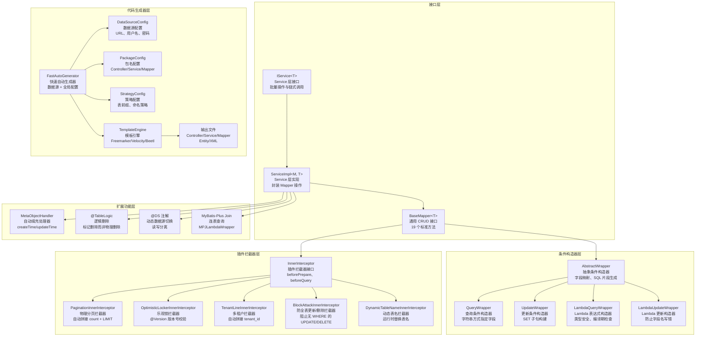

:::important
本文所有源码分析基于 #[R|MyBatis-Plus 3.5.x] 与 #[R|MyBatis 3.5.x]，核心包路径为 `com.baomidou.mybatisplus`。
所有 Mermaid 图表中的类名与方法名均为真实 API，关键源码文件在 `com.baomidou.mybatisplus.core` 包下。
:::

| 层级 | 组件 | 核心职责 | 关键类/包路径 |
|------|------|----------|---------------|
| 接口层 | BaseMapper / IService | 提供通用 CRUD 接口 | `com.baomidou.mybatisplus.core.mapper.BaseMapper` |
| 条件构造器 | AbstractWrapper 体系 | 构建类型安全的 SQL 条件 | `com.baomidou.mybatisplus.core.conditions` |
| 插件层 | InnerInterceptor 链 | 拦截 SQL 执行、注入逻辑 | `com.baomidou.mybatisplus.extension.plugins` |
| 代码生成器 | FastAutoGenerator | 一键生成全套代码 | `com.baomidou.mybatisplus.generator` |
| 扩展功能 | 自动填充/逻辑删除 | 减少样板代码 | `com.baomidou.mybatisplus.extension` |

***

## 场景一：MyBatis-Plus 架构总览

### 1.0 场景概览

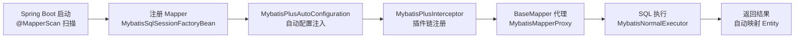

| 阶段 | 核心类 | 关键机制 | 源码位置 |
|------|--------|----------|----------|
| Mapper 扫描 | `MapperScannerConfigurer` | 扫描 @Mapper 注解、注册 MapperFactoryBean | `org.mybatis.spring.mapper.MapperScannerConfigurer` |
| 自动配置 | `MybatisPlusAutoConfiguration` | 自动注入 SqlSessionFactory、SqlSessionTemplate | `com.baomidou.mybatisplus.autoconfigure` |
| 插件注册 | `MybatisPlusInterceptor` | 拦截器链式组装、按优先级排序 | `com.baomidou.mybatisplus.extension.plugins` |
| 代理生成 | `MybatisMapperProxy` | JDK 动态代理、拦截 Mapper 方法调用 | `org.apache.ibatis.binding.MapperProxy` |
| SQL 执行 | `MybatisNormalExecutor` | SimpleExecutor → StatementHandler → ParameterHandler | `com.baomidou.mybatisplus.core.executor` |

### 1.1 MyBatis vs MyBatis-Plus 对比

```mermaid
graph TB
    subgraph MyBatis 原生
        NATIVE_MAPPER["Mapper 接口<br/>每个方法需手写 SQL"]
        NATIVE_XML["XML 映射文件<br/>完整 SQL 语句<br/>ResultMap 配置"]
        NATIVE_SQL["SqlSession<br/>selectOne/selectList<br/>insert/update/delete"]
        NATIVE_CRUD["单表 CRUD<br/>每个表需重复编写<br/>insert/update/delete/select"]
    end

    subgraph MyBatis-Plus 增强
        MP_BASE["BaseMapper 基类<br/>继承即用 19 个通用方法"]
        MP_WRAPPER["Wrapper 条件构造器<br/>链式构建 WHERE 条件<br/>LambdaQueryWrapper 类型安全"]
        MP_PLUGIN["插件体系<br/>分页/乐观锁/多租户<br/>防全表更新/删除"]
        MP_AUTO["自动填充/逻辑删除<br/>@TableField fill<br/>@TableLogic"]
        MP_GEN["代码生成器<br/>一键生成全套代码<br/>Controller/Service/Mapper"]
    end

    NATIVE_MAPPER --> NATIVE_XML
    NATIVE_XML --> NATIVE_SQL
    NATIVE_SQL --> NATIVE_CRUD

    MP_BASE --> MP_WRAPPER
    MP_WRAPPER --> MP_PLUGIN
    MP_PLUGIN --> MP_AUTO
    MP_AUTO --> MP_GEN
```

| 对比维度 | MyBatis 原生 | MyBatis-Plus |
|----------|-------------|-------------|
| 单表 CRUD | 需手写 SQL 和 XML | 继承 BaseMapper 即可，零 SQL |
| 条件查询 | 需在 XML 中写 `<where>` 和 `<if>` | 使用 Wrapper 链式 API，Lambda 表达式 |
| 分页 | 需手动 count + limit | 一行配置 + Page 对象 |
| 主键策略 | 需手动设置 | 内置 ASSIGN_ID / UUID / AUTO |
| 逻辑删除 | 需手写 update flag | @TableLogic 注解自动处理 |
| 代码生成 | 需第三方工具 | 内置 FastAutoGenerator |
| 多租户 | 需手写 tenant_id 过滤 | TenantLineInnerInterceptor 自动注入 |
| SQL 注入 | 无内置保护 | BlockAttackInnerInterceptor 防全表操作 |

### 1.2 核心设计理念

MyBatis-Plus 的设计遵循三大核心理念：

**理念一：约定优于配置【Convention over Configuration】**

MyBatis-Plus 默认映射规则极大地减少了配置量：

| 约定项 | 默认规则 | 示例 |
|--------|----------|------|
| 类名 → 表名 | 驼峰转下划线 | `UserInfo` → `user_info` |
| 字段名 → 列名 | 驼峰转下划线 | `userName` → `user_name` |
| 主键字段 | 名为 `id` 的字段 | `private Long id` |
| 逻辑删除字段 | 名为 `deleted` 的字段 | `private Integer deleted` |
| 乐观锁字段 | 名为 `version` 的字段 | `private Integer version` |

**理念二：Lambda 表达式类型安全**

```java
// 传统方式：字符串拼写字段名，重构时可能遗漏
queryWrapper.eq("user_name", "张三");

// MyBatis-Plus Lambda 方式：编译期类型检查，重构安全
lambdaQueryWrapper.eq(User::getUserName, "张三");
```

**理念三：自动填充与拦截器链**

通过 `MetaObjectHandler` 和 `InnerInterceptor` 接口，将横切关注点【自动填充、分页、多租户、乐观锁】从业务代码中剥离，实现 AOP 式的无侵入增强。

***

## 场景二：Mapper CRUD 底层原理

### 2.0 场景概览

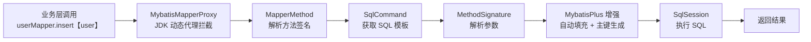

### 2.1 BaseMapper 插入操作全链路

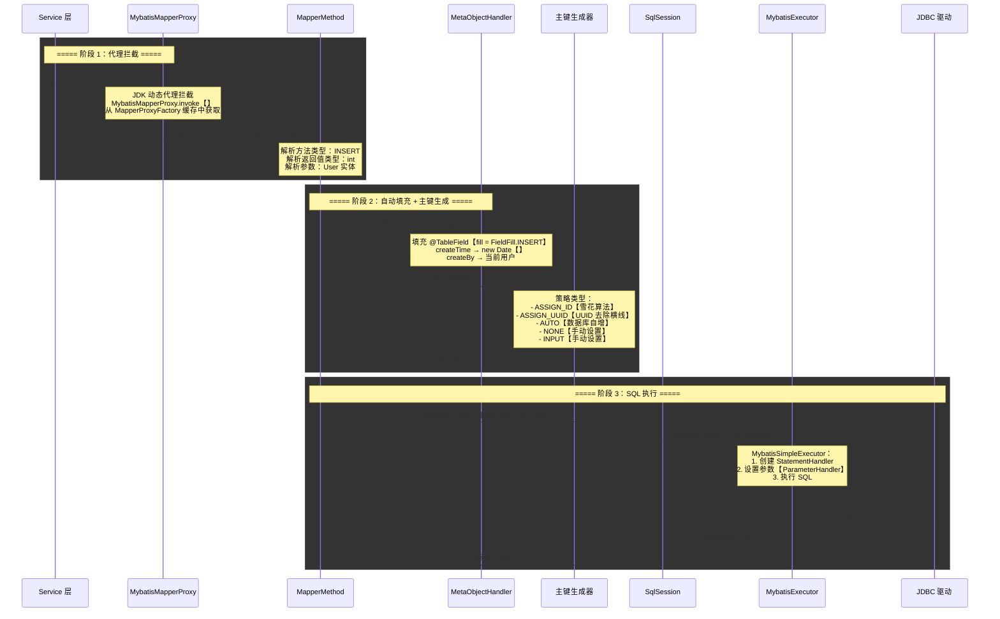

### 2.2 BaseMapper 19 个通用方法源码分析

BaseMapper 接口定义了 19 个通用 CRUD 方法，位于 `com.baomidou.mybatisplus.core.mapper.BaseMapper`：

| 分类 | 方法签名 | 功能说明 |
|------|----------|----------|
| 插入 | `int insert(T entity)` | 插入一条记录，自动填充 + 主键生成 |
| 插入 | `int insertBatch(Collection<T> entityList)` | 批量插入【3.5.4+】 |
| 删除 | `int deleteById(Serializable id)` | 按主键删除 |
| 删除 | `int deleteByMap(Map<String, Object> columnMap)` | 按 Map 条件删除 |
| 删除 | `int delete(Wrapper<T> queryWrapper)` | 按 Wrapper 条件删除 |
| 删除 | `int deleteBatchIds(Collection<?> idList)` | 按主键批量删除 |
| 更新 | `int updateById(T entity)` | 按主键更新 |
| 更新 | `int update(T entity, Wrapper<T> updateWrapper)` | 按 Wrapper 条件更新 |
| 查询 | `T selectById(Serializable id)` | 按主键查询 |
| 查询 | `List<T> selectBatchIds(Collection<?> idList)` | 按主键批量查询 |
| 查询 | `List<T> selectByMap(Map<String, Object> columnMap)` | 按 Map 条件查询 |
| 查询 | `T selectOne(Wrapper<T> queryWrapper)` | 查询单条记录 |
| 查询 | `boolean exists(Wrapper<T> queryWrapper)` | 判断是否存在 |
| 查询 | `Long selectCount(Wrapper<T> queryWrapper)` | 统计记录数 |
| 查询 | `List<T> selectList(Wrapper<T> queryWrapper)` | 按条件查询列表 |
| 查询 | `List<Map<String, Object>> selectMaps(Wrapper<T> queryWrapper)` | 查询返回 Map 列表 |
| 查询 | `List<Object> selectObjs(Wrapper<T> queryWrapper)` | 查询返回第一个字段值列表 |
| 查询 | `<P> IPage<T> selectPage(IPage<T> page, Wrapper<T> queryWrapper)` | 分页查询 |
| 查询 | `<P> IPage<Map<String, Object>> selectMapsPage(IPage<T> page, Wrapper<T> queryWrapper)` | 分页查询返回 Map |

### 2.3 主键策略详解

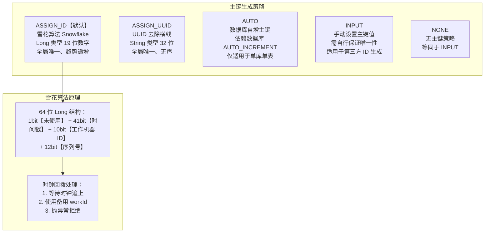

| 策略 | 注解配置 | 适用场景 | 优点 | 缺点 |
|------|----------|----------|------|------|
| ASSIGN_ID | `@TableId(type = IdType.ASSIGN_ID)` | 分布式系统 | 全局唯一、趋势递增 | 依赖机器时钟 |
| ASSIGN_UUID | `@TableId(type = IdType.ASSIGN_UUID)` | 分布式系统 | 绝对唯一、无时钟依赖 | 无序、索引性能差 |
| AUTO | `@TableId(type = IdType.AUTO)` | 单库小项目 | 简单、自增有序 | 分库分表冲突 |
| INPUT | `@TableId(type = IdType.INPUT)` | 自定义 ID 生成 | 灵活 | 需自行保证唯一 |

```java
// 配置示例
@Data
@TableName("user")
public class User {
    @TableId(type = IdType.ASSIGN_ID)
    private Long id;

    private String userName;
    private Integer age;
    private String email;
}
```

### 2.4 批量操作原理

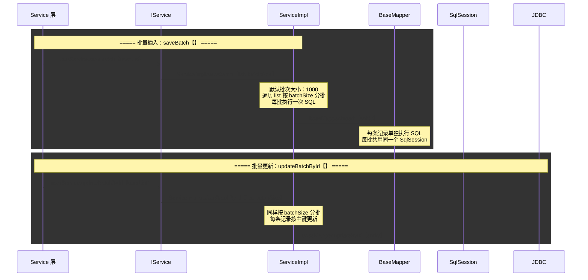

:::warning
`saveBatch` 默认是逐条执行 INSERT 语句，并非真正的 JDBC 批量提交。如需高性能批量插入，建议使用 `insertBatchSomeColumn` 方法或自定义 SQL 的 `INSERT INTO ... VALUES ...` 语句。可通过 `rewriteBatchedStatements=true` JDBC 参数启用 MySQL 驱动级别的批量重写。
:::

***

## 场景三：条件构造器 Wrapper 体系

### 3.0 场景概览

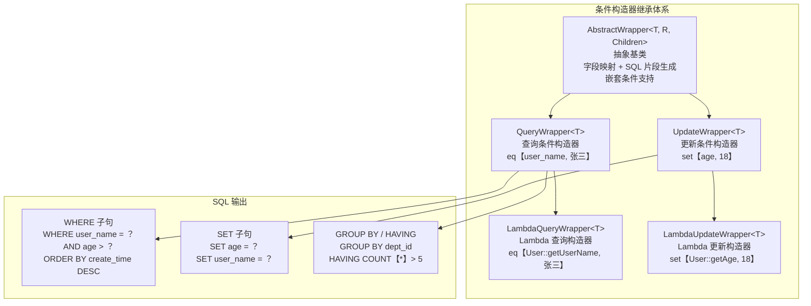

### 3.1 条件构造器核心链路

```mermaid
sequenceDiagram
    participant CTRL as Controller
    participant SVC as Service
    participant LQW as LambdaQueryWrapper
    participant AW as AbstractWrapper
    participant SEG as 条件片段收集器
    participant SQL as SQL 生成器

    rect rgba【240, 248, 255, 0.4】
    Note over CTRL,LQW: ===== 阶段 1：构建条件 =====
    CTRL->>SVC: userService.list【wrapper】
    SVC->>LQW: new LambdaQueryWrapper&lt;User&gt;【】
    SVC->>LQW: .eq【User::getAge, 18】
    Note over LQW: Lambda 解析：<br/>1. SFunction 序列化获取方法名<br/>2. SerializedLambda 解析<br/>3. 方法名转字段名：getAge → age<br/>4. 驼峰转下划线：age → age
    SVC->>LQW: .like【User::getUserName, 张】
    SVC->>LQW: .gt【User::getCreateTime, startTime】
    SVC->>LQW: .orderByDesc【User::getCreateTime】
    end

    rect rgba【240, 255, 248, 0.4】
    Note over LQW,SQL: ===== 阶段 2：SQL 片段生成 =====
    LQW->>AW: 调用父类 addCondition 方法
    Note over AW: 条件收集：<br/>1. 将条件加入 expression 列表<br/>2. 构建 NormalSegmentList<br/>3. 管理参数值 paramNameValuePairs
    AW->>SEG: 生成 SQL 片段
    Note over SEG: 片段内容：<br/>age = #{ew.paramNameValuePairs.MPGENVAL1}<br/>AND user_name LIKE CONCAT【%】, #{...},【%】<br/>AND create_time &gt; #{...}<br/>ORDER BY create_time DESC
    end

    rect rgba【255, 248, 240, 0.4】
    Note over SEG,SQL: ===== 阶段 3：SQL 最终拼接 =====
    SEG->>SQL: 生成完整 SQL
    Note over SQL: SELECT * FROM user<br/>WHERE age = ？<br/>AND user_name LIKE ？<br/>AND create_time &gt; ？<br/>ORDER BY create_time DESC
    SQL-->>SVC: 执行 SQL 返回 List
    end
```

### 3.2 常用条件方法速查

| 方法 | 说明 | 示例 | 生成 SQL |
|------|------|------|----------|
| `eq` | 等于 = | `eq(User::getAge, 18)` | `age = 18` |
| `ne` | 不等于 <> | `ne(User::getStatus, 0)` | `status <> 0` |
| `gt` | 大于 > | `gt(User::getAge, 18)` | `age > 18` |
| `ge` | 大于等于 >= | `ge(User::getAge, 18)` | `age >= 18` |
| `lt` | 小于 < | `lt(User::getAge, 60)` | `age < 60` |
| `le` | 小于等于 <= | `le(User::getAge, 60)` | `age <= 60` |
| `like` | 模糊查询 LIKE | `like(User::getName, "张")` | `name LIKE '%张%'` |
| `likeLeft` | 左模糊 LIKE | `likeLeft(User::getName, "张")` | `name LIKE '%张'` |
| `likeRight` | 右模糊 LIKE | `likeRight(User::getName, "张")` | `name LIKE '张%'` |
| `between` | 区间 BETWEEN | `between(User::getAge, 18, 60)` | `age BETWEEN 18 AND 60` |
| `notBetween` | 非区间 | `notBetween(User::getAge, 18, 60)` | `age NOT BETWEEN 18 AND 60` |
| `in` | 包含 IN | `in(User::getId, ids)` | `id IN 【1, 2, 3】` |
| `notIn` | 不包含 NOT IN | `notIn(User::getId, ids)` | `id NOT IN 【1, 2, 3】` |
| `isNull` | 为空 IS NULL | `isNull(User::getEmail)` | `email IS NULL` |
| `isNotNull` | 非空 IS NOT NULL | `isNotNull(User::getEmail)` | `email IS NOT NULL` |
| `groupBy` | 分组 GROUP BY | `groupBy(User::getDeptId)` | `GROUP BY dept_id` |
| `orderByAsc` | 升序 ASC | `orderByAsc(User::getAge)` | `ORDER BY age ASC` |
| `orderByDesc` | 降序 DESC | `orderByDesc(User::getAge)` | `ORDER BY age DESC` |
| `having` | HAVING 条件 | `having("COUNT(*) > {0}", 5)` | `HAVING COUNT【*】> 5` |
| `or` | 或条件 | `eq(...).or().eq(...)` | `【...】 OR 【...】` |
| `and` | 与条件嵌套 | `and(w -> w.eq(...))` | `AND 【...】` |
| `nested` | 嵌套条件 | `nested(w -> ...)` | ` 【...】 ` |
| `exists` | EXISTS 子查询 | `exists("select 1 from ...")` | `EXISTS 【select ...】` |
| `notExists` | NOT EXISTS | `notExists("select 1 from ...")` | `NOT EXISTS 【select ...】` |
| `apply` | 自定义 SQL 片段 | `apply("date_format(...)")` | 直接拼接 |

### 3.3 嵌套条件实战

```java
// 复杂查询示例：查询年龄 > 18 且【姓名包含"张"或邮箱不为空】的用户
LambdaQueryWrapper<User> wrapper = new LambdaQueryWrapper<>();
wrapper.gt(User::getAge, 18)
       .and(w -> w.like(User::getUserName, "张")
                  .or()
                  .isNotNull(User::getEmail))
       .orderByDesc(User::getCreateTime);

// 生成 SQL：
// SELECT * FROM user
// WHERE age > 18
// AND 【user_name LIKE '%张%' OR email IS NOT NULL】
// ORDER BY create_time DESC
```

```java
// nested 嵌套：条件【age > 18 且【name = '张三' 或 name = '李四'】】
LambdaQueryWrapper<User> wrapper = new LambdaQueryWrapper<>();
wrapper.nested(w -> w.gt(User::getAge, 18)
                     .and(w2 -> w2.eq(User::getUserName, "张三")
                                  .or()
                                  .eq(User::getUserName, "李四")));

// 生成 SQL：... WHERE 【age > 18 AND 【user_name = '张三' OR user_name = '李四'】】
```

### 3.4 动态条件拼接

```java
// 常见场景：根据前端传入参数动态构建查询条件
public List<User> queryUsers(String name, Integer minAge, Integer maxAge, String email) {
    LambdaQueryWrapper<User> wrapper = new LambdaQueryWrapper<>();

    // 只有参数非空时才添加条件
    wrapper.like(StringUtils.isNotBlank(name), User::getUserName, name)
           .ge(minAge != null, User::getAge, minAge)
           .le(maxAge != null, User::getAge, maxAge)
           .eq(StringUtils.isNotBlank(email), User::getEmail, email);

    return userMapper.selectList(wrapper);
}
```

### 3.5 动态表名

```mermaid
sequenceDiagram
    participant SVC as Service 层
    participant DTN as DynamicTableNameInnerInterceptor
    participant Handler as TableNameHandler
    participant SQL as SQL 执行器

    rect rgba【240, 248, 255, 0.4】
    Note over SVC,Handler: ===== 动态表名替换流程 =====
    SVC->>DTN: 拦截器 beforePrepare 回调
    Note over DTN: 检查当前 SQL 涉及的表名<br/>匹配已注册的 TableNameHandler
    DTN->>Handler: dynamicTableName【sql, tableName】
    Note over Handler: 自定义替换逻辑：<br/>user → user_2026<br/>user → user_01【分表】
    Handler-->>DTN: 返回替换后的表名
    DTN->>SQL: 执行替换后的 SQL
    Note over SQL: SELECT * FROM user_2026<br/>WHERE age &gt; 18
    end
```

```java
// 配置动态表名拦截器
@Configuration
public class MybatisPlusConfig {
    @Bean
    public MybatisPlusInterceptor mybatisPlusInterceptor() {
        MybatisPlusInterceptor interceptor = new MybatisPlusInterceptor();
        DynamicTableNameInnerInterceptor dynamicTableName = new DynamicTableNameInnerInterceptor();
        dynamicTableName.setTableNameHandler((sql, tableName) -> {
            // 按月分表：user → user_202607
            if ("user".equals(tableName)) {
                return "user_" + LocalDate.now().format(DateTimeFormatter.ofPattern("yyyyMM"));
            }
            return tableName;
        });
        interceptor.addInnerInterceptor(dynamicTableName);
        return interceptor;
    }
}
```

***

## 场景四：分页插件原理

### 4.0 场景概览

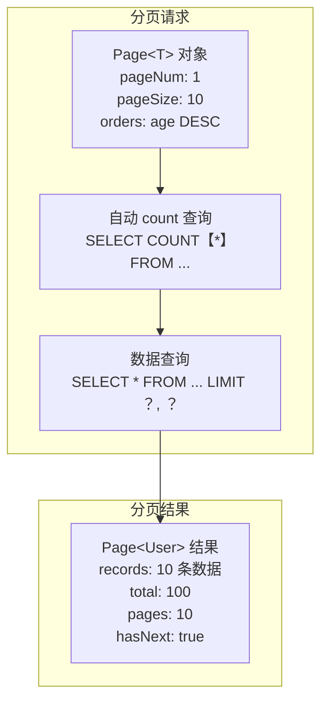

### 4.1 分页插件全链路

```mermaid
sequenceDiagram
    participant SVC as Service 层
    participant BM as BaseMapper
    participant MP as MybatisPlusInterceptor
    participant PAG as PaginationInnerInterceptor
    participant COUNT as CountSqlParser
    participant EXE as MybatisExecutor
    participant JDBC as JDBC

    rect rgba【240, 248, 255, 0.4】
    Note over SVC,PAG: ===== 阶段 1：分页请求 =====
    SVC->>BM: userMapper.selectPage【page, wrapper】
    Note over SVC: Page 对象：<br/>pageNum = 1<br/>pageSize = 10<br/>orders = 【OrderItem.desc【create_time】】
    BM->>MP: 拦截器链 beforeQuery 回调
    MP->>PAG: PaginationInnerInterceptor.beforeQuery
    end

    rect rgba【240, 255, 248, 0.4】
    Note over PAG,COUNT: ===== 阶段 2：拦截器处理 =====
    PAG->>PAG: 判断是否需要分页
    Note over PAG: 检查 pageSize > 0<br/>如果 pageSize < 0 则查询全部
    PAG->>COUNT: 生成 count SQL
    Note over COUNT: CountSqlParser.smartCount【】：<br/>1. 移除 ORDER BY 子句<br/>2. 移除不必要的 JOIN<br/>3. 包装为 SELECT COUNT【*】<br/>4. 优化子查询为 COUNT【*】
    PAG->>EXE: 执行 count SQL
    EXE->>JDBC: SELECT COUNT【*】 FROM user WHERE age &gt; 18
    JDBC-->>EXE: count = 100
    EXE-->>PAG: 总数：100
    end

    rect rgba【255, 248, 240, 0.4】
    Note over PAG,JDBC: ===== 阶段 3：分页查询数据 =====
    PAG->>PAG: 计算分页参数
    Note over PAG: offset =【pageNum - 1】* pageSize = 0<br/>limit = pageSize = 10
    PAG->>EXE: 拼接 LIMIT 子句
    Note over EXE: 原始 SQL + LIMIT 0, 10<br/>根据数据库方言自动适配：<br/>MySQL → LIMIT 0, 10<br/>PostgreSQL → LIMIT 10 OFFSET 0<br/>Oracle → ROWNUM 嵌套
    EXE->>JDBC: SELECT * FROM user WHERE age &gt; 18<br/>ORDER BY create_time DESC LIMIT 0, 10
    JDBC-->>EXE: 10 条数据
    EXE-->>PAG: 返回数据列表
    end

    rect rgba【248, 240, 255, 0.4】
    Note over PAG,SVC: ===== 阶段 4：封装结果 =====
    PAG->>PAG: 组装 Page 对象
    Note over PAG: page.setTotal【100】<br/>page.setRecords【list】<br/>page.setPages【10】<br/>page.setCurrent【1】<br/>page.setSize【10】<br/>page.hasNext【】= true
    PAG-->>SVC: 返回 Page&lt;User&gt;
    end
```

### 4.2 物理分页 vs 内存分页

| 对比维度 | 物理分页 | 内存分页 |
|----------|----------|----------|
| 实现方式 | SQL 层 LIMIT/OFFSET | 查询全部数据后在内存中截取 |
| SQL 执行 | 仅查询所需页的数据 | 查询全部数据 |
| 网络开销 | 仅传输当前页数据 | 传输全部数据 |
| 内存占用 | 仅当前页数据量 | 全部数据量 |
| 性能 | 高【大数据量优势明显】 | 低【数据量大时 OOM 风险】 |
| MyBatis-Plus 行为 | `pageSize > 0` 时自动启用 | `pageSize < 0` 时走内存分页 |

### 4.3 分页配置

```java
@Configuration
public class MybatisPlusConfig {
    @Bean
    public MybatisPlusInterceptor mybatisPlusInterceptor() {
        MybatisPlusInterceptor interceptor = new MybatisPlusInterceptor();
        PaginationInnerInterceptor pagination = new PaginationInnerInterceptor();

        // 数据库类型【默认自动检测】
        pagination.setDbType(DbType.MYSQL);

        // 溢出处理：页码超过最大页时回到第一页【默认 false】
        pagination.setOverflow(true);

        // 单页最大记录数限制【默认 -1 不限制】
        pagination.setMaxLimit(500L);

        // 优化 count SQL：当 left join 时不生成 count【默认 true】
        pagination.setOptimizeJoin(true);

        interceptor.addInnerInterceptor(pagination);
        return interceptor;
    }
}
```

### 4.4 乐观锁插件

```mermaid
sequenceDiagram
    participant T1 as 事务 T1
    participant OPT as OptimisticLockerInnerInterceptor
    participant DB as 数据库
    participant T2 as 事务 T2

    rect rgba【240, 248, 255, 0.4】
    Note over T1,DB: ===== 乐观锁更新流程 =====
    T1->>DB: SELECT id, name, version FROM user WHERE id=1
    DB-->>T1: version = 1
    T2->>DB: SELECT id, name, version FROM user WHERE id=1
    DB-->>T2: version = 1

    T1->>T1: 修改 name = 张三_new
    T1->>OPT: UPDATE user SET name=?, version=version+1<br/>WHERE id=1 AND version=1
    Note over OPT: 拦截器自动处理：<br/>1. 在 SET 子句中 version = version + 1<br/>2. 在 WHERE 子句中 version = 原值
    OPT->>DB: 执行 UPDATE
    DB-->>T1: affectedRows = 1【更新成功】

    T2->>T2: 修改 name = 张三_v2
    T2->>OPT: UPDATE user SET name=?, version=version+1<br/>WHERE id=1 AND version=1
    OPT->>DB: 执行 UPDATE
    DB-->>T2: affectedRows = 0【version 已变为 2，更新失败】
    Note over T2: 乐观锁冲突：<br/>抛出 OptimisticLockerException<br/>需重试或提示用户
    end
```

```java
@Data
@TableName("user")
public class User {
    @TableId(type = IdType.ASSIGN_ID)
    private Long id;
    private String userName;
    private Integer age;

    @Version  // 乐观锁版本号字段
    private Integer version;
}
```

***

## 场景五：代码生成器

### 5.0 场景概览

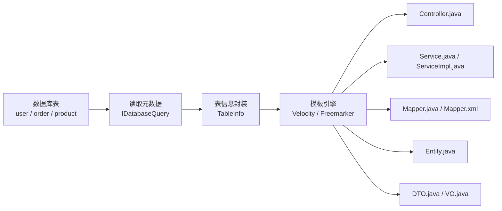

### 5.1 代码生成器核心流程

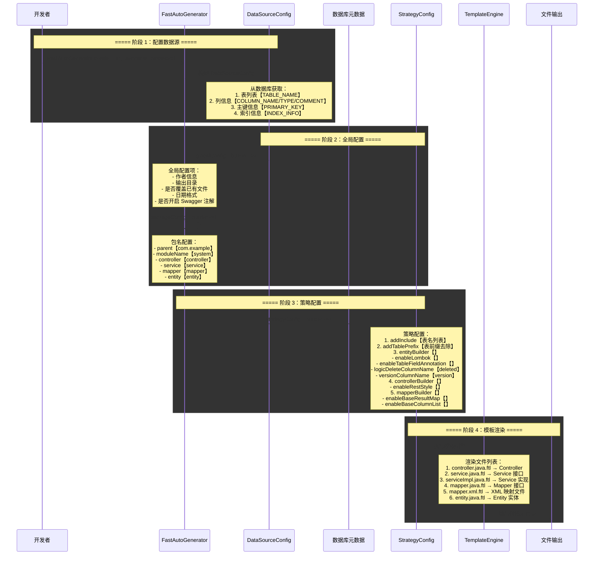

### 5.2 代码生成器配置详解

```java
// 完整配置示例
FastAutoGenerator.create("jdbc:mysql://localhost:3306/mybatis_plus?useUnicode=true&characterEncoding=utf-8",
                         "root", "password")
    // 全局配置
    .globalConfig(builder -> builder
        .author("AH")                          // 作者
        .outputDir("D:\\project\\src\\main\\java")  // 输出目录
        .disableOpenDir()                      // 生成后不打开目录
        .commentDate("yyyy-MM-dd")             // 注释日期格式
    )
    // 包名配置
    .packageConfig(builder -> builder
        .parent("com.example")                 // 父包名
        .moduleName("system")                  // 模块名
        .entity("entity")                      // Entity 包名
        .mapper("mapper")                      // Mapper 包名
        .service("service")                    // Service 包名
        .serviceImpl("service.impl")           // ServiceImpl 包名
        .controller("controller")              // Controller 包名
        .xml("mapper.xml")                     // XML 映射文件路径
    )
    // 策略配置
    .strategyConfig(builder -> builder
        .addInclude("user", "order", "product")  // 指定生成的表
        .addTablePrefix("t_", "sys_")            // 表前缀过滤【t_user → User】
        .addFieldPrefix("f_")                    // 字段前缀过滤

        // Entity 策略
        .entityBuilder()
        .enableLombok()                          // 使用 Lombok
        .enableTableFieldAnnotation()            // 生成 @TableField 注解
        .enableFileOverride()                    // 覆盖已有文件
        .logicDeleteColumnName("deleted")        // 逻辑删除字段
        .versionColumnName("version")            // 乐观锁字段
        .idType(IdType.ASSIGN_ID)                // 主键策略
        .formatFileName("%sEntity")              // 文件名格式

        // Mapper 策略
        .mapperBuilder()
        .enableBaseResultMap()                   // 生成 BaseResultMap
        .enableBaseColumnList()                  // 生成 BaseColumnList
        .formatMapperFileName("%sMapper")
        .formatXmlFileName("%sMapper")

        // Service 策略
        .serviceBuilder()
        .formatServiceFileName("%sService")
        .formatServiceImplFileName("%sServiceImpl")

        // Controller 策略
        .controllerBuilder()
        .enableRestStyle()                       // @RestController
        .enableHyphenStyle()                     // URL 使用连字符
        .formatFileName("%sController")
    )
    // 模板引擎配置【默认 Velocity】
    .templateEngine(new FreemarkerTemplateEngine())
    // 执行生成
    .execute();
```

### 5.3 自定义模板

```xml
<!-- pom.xml 依赖 -->
<dependency>
    <groupId>com.baomidou</groupId>
    <artifactId>mybatis-plus-generator</artifactId>
    <version>3.5.5</version>
</dependency>
<dependency>
    <groupId>org.freemarker</groupId>
    <artifactId>freemarker</artifactId>
</dependency>
```

```java
// 自定义模板注入
FastAutoGenerator.create(...)
    .injectionConfig(builder -> builder
        .customFile(customFile -> customFile
            .fileName("DTO.java")
            .templatePath("/templates/dto.java.ftl")
            .packageName("dto")
        )
        .customFile(customFile -> customFile
            .fileName("VO.java")
            .templatePath("/templates/vo.java.ftl")
            .packageName("vo")
        )
        .beforeOutputFile((tableInfo, objectMap) -> {
            // 输出前回调：可自定义文件名、路径
            System.out.println("生成表：" + tableInfo.getName());
        })
    )
    .execute();
```

***

## 场景六：自动填充与逻辑删除

### 6.0 场景概览

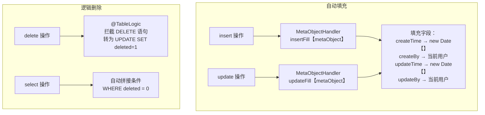

### 6.1 自动填充全链路

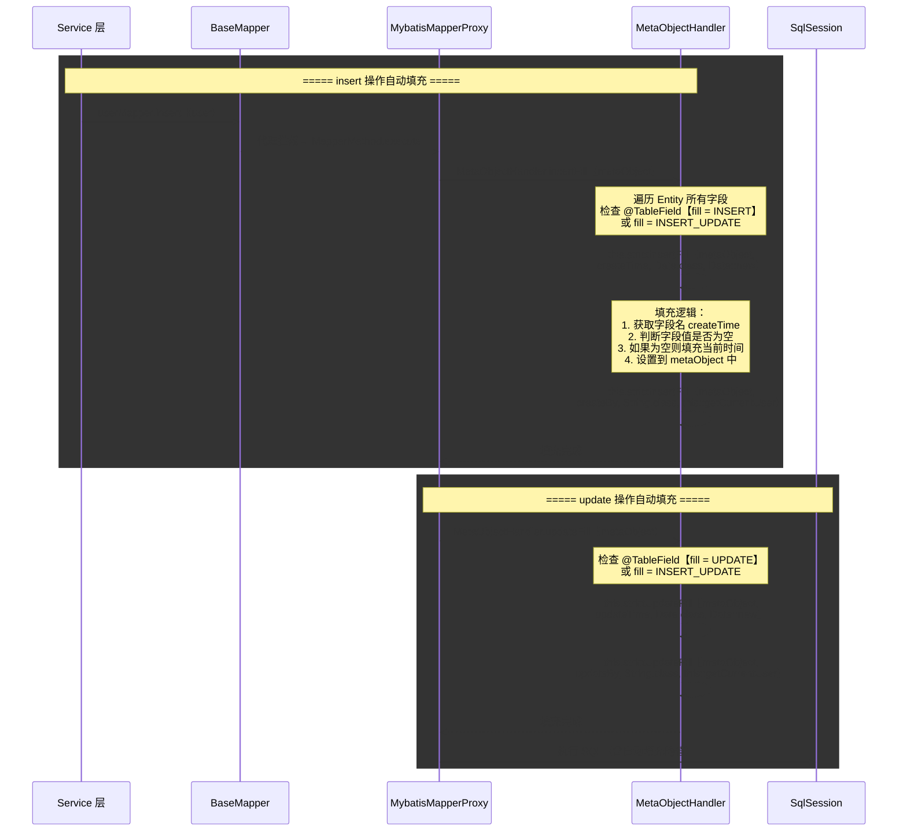

### 6.2 自动填充配置

```java
// Entity 定义
@Data
@TableName("user")
public class User {
    @TableId(type = IdType.ASSIGN_ID)
    private Long id;

    private String userName;

    @TableField(fill = FieldFill.INSERT)        // 仅在插入时填充
    private Date createTime;

    @TableField(fill = FieldFill.INSERT_UPDATE) // 插入和更新时都填充
    private Date updateTime;

    @TableField(fill = FieldFill.INSERT)
    private String createBy;

    @TableField(fill = FieldFill.INSERT_UPDATE)
    private String updateBy;

    @TableLogic                                // 逻辑删除
    private Integer deleted;
}
```

```java
// 自动填充处理器
@Component
public class MyMetaObjectHandler implements MetaObjectHandler {

    @Override
    public void insertFill(MetaObject metaObject) {
        this.strictInsertFill(metaObject, "createTime", Date.class, new Date());
        this.strictInsertFill(metaObject, "updateTime", Date.class, new Date());
        this.strictInsertFill(metaObject, "createBy", String.class, getCurrentUser());
        this.strictInsertFill(metaObject, "updateBy", String.class, getCurrentUser());
    }

    @Override
    public void updateFill(MetaObject metaObject) {
        this.strictUpdateFill(metaObject, "updateTime", Date.class, new Date());
        this.strictUpdateFill(metaObject, "updateBy", String.class, getCurrentUser());
    }

    private String getCurrentUser() {
        // 从 SecurityContext 或 ThreadLocal 获取当前用户
        return SecurityUtils.getCurrentUsername();
    }
}
```

### 6.3 逻辑删除 @TableLogic

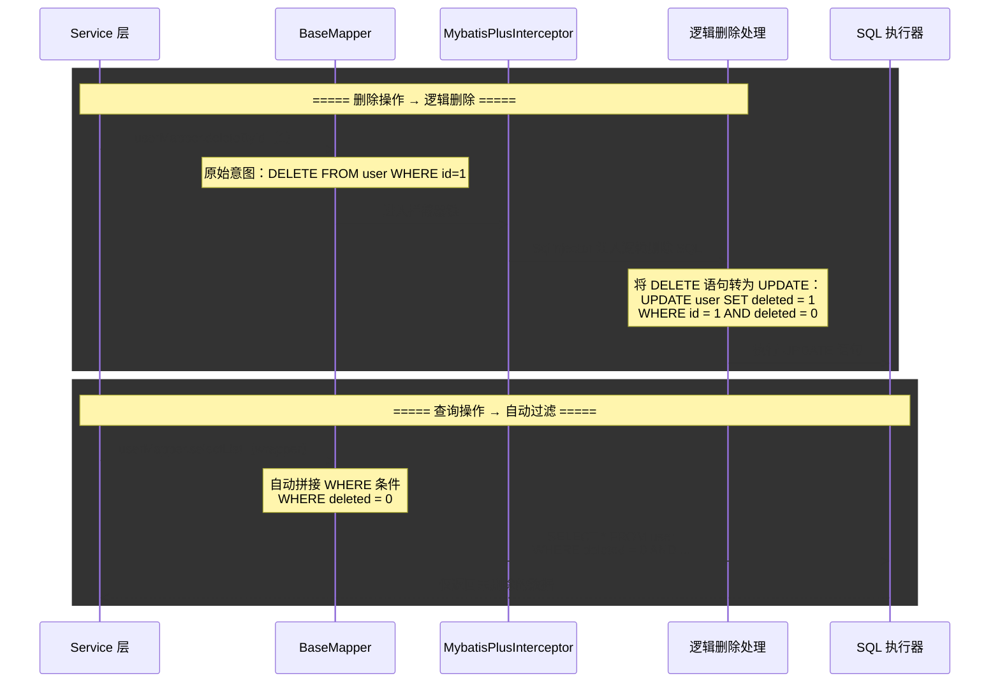

| 配置方式 | 说明 | 示例 |
|----------|------|------|
| 注解配置 | `@TableLogic` 标注逻辑删除字段 | `@TableLogic private Integer deleted;` |
| 全局配置 | `application.yml` 中配置 | `mybatis-plus.global-config.db-config.logic-delete-field: deleted` |
| 删除值 | 默认 1 表示已删除 | `@TableLogic(value = "0", delval = "1")` |
| 未删除值 | 默认 0 表示未删除 | `logic-not-delete-value: 0` |

```yaml
# application.yml 逻辑删除全局配置
mybatis-plus:
  global-config:
    db-config:
      logic-delete-field: deleted      # 全局逻辑删除字段名
      logic-delete-value: 1            # 逻辑已删除值
      logic-not-delete-value: 0        # 逻辑未删除值
```

:::warning
逻辑删除仅对 `BaseMapper` 的内置方法生效【deleteById、deleteBatchIds、delete、deleteByMap】。如果手动在 XML 中编写 DELETE 语句，不会自动应用逻辑删除，需手动改为 UPDATE。
:::

***

## 场景七：多数据源与读写分离

### 7.0 场景概览

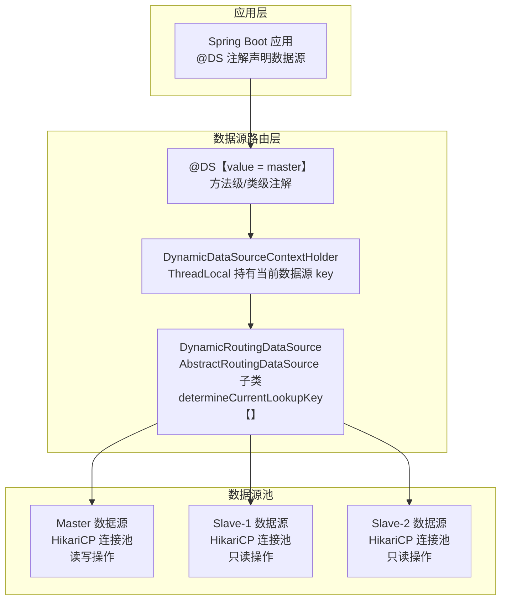

### 7.1 多数据源切换全链路

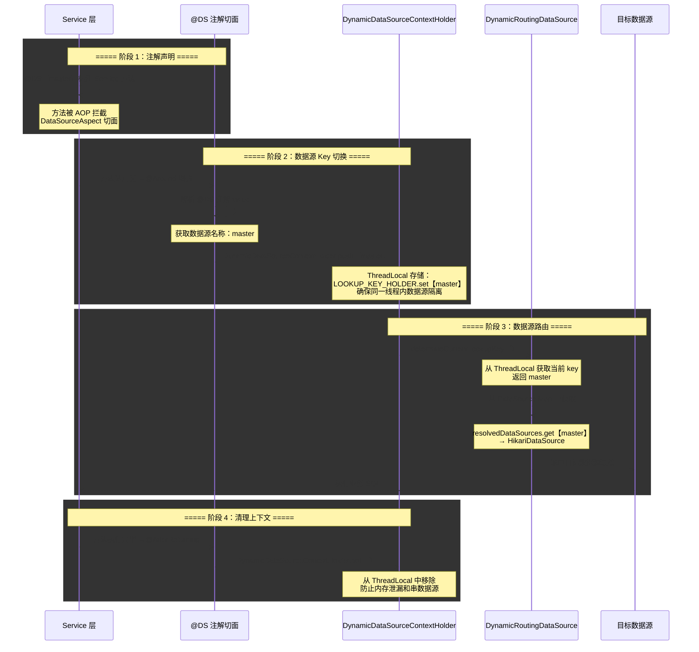

### 7.2 多数据源配置

```yaml
# application.yml
spring:
  datasource:
    dynamic:
      primary: master                    # 默认数据源
      strict: false                      # 严格模式：找不到数据源时是否抛异常
      datasource:
        master:                          # 主库【写】
          url: jdbc:mysql://192.168.1.100:3306/db_master
          username: root
          password: master123
          driver-class-name: com.mysql.cj.jdbc.Driver
        slave-1:                         # 从库1【读】
          url: jdbc:mysql://192.168.1.101:3306/db_master
          username: root
          password: slave123
          driver-class-name: com.mysql.cj.jdbc.Driver
        slave-2:                         # 从库2【读】
          url: jdbc:mysql://192.168.1.102:3306/db_master
          username: root
          password: slave123
          driver-class-name: com.mysql.cj.jdbc.Driver
```

```xml
<!-- pom.xml 依赖 -->
<dependency>
    <groupId>com.baomidou</groupId>
    <artifactId>dynamic-datasource-spring-boot-starter</artifactId>
    <version>4.3.1</version>
</dependency>
```

### 7.3 读写分离实战

```java
@Service
@DS("master")  // 类级别默认使用主库
public class UserServiceImpl extends ServiceImpl<UserMapper, User> implements UserService {

    @Override
    @DS("master")  // 写操作明确指定主库
    public boolean save(User user) {
        return super.save(user);
    }

    @Override
    @DS("master")
    public boolean updateById(User user) {
        return super.updateById(user);
    }

    @Override
    @DS("slave-1")  // 读操作指定从库
    public User getById(Long id) {
        return super.getById(id);
    }

    @Override
    @DS("slave-2")  // 另一个读操作使用从库2
    public List<User> list() {
        return super.list();
    }
}
```

### 7.4 多数据源高级特性

| 特性 | 说明 | 配置示例 |
|------|------|----------|
| 一主多从 | 写走主库，读走从库 | `@DS("master")` / `@DS("slave-1")` |
| 多主多从 | 多组主从，按业务拆分 | `@DS("order_master")` / `@DS("product_master")` |
| 负载均衡 | 从库负载均衡策略 | `spring.datasource.dynamic.seata: false` |
| 本地事务 | 单数据源事务 | `@Transactional` + `@DS` |
| 分布式事务 | 跨数据源事务 | 集成 Seata AT 模式 |
| 动态添加 | 运行时动态添加数据源 | `DynamicDataSourceEvent` 事件监听 |
| 加密配置 | 数据库密码加密 | `public-key` + `encrypt` 配置 |

```java
// 动态添加数据源示例
@RestController
public class DataSourceController {

    @Autowired
    private DataSource dataSource;

    @PostMapping("/datasource/add")
    public String addDataSource(@RequestBody DataSourceDTO dto) {
        DynamicRoutingDataSource ds = (DynamicRoutingDataSource) dataSource;

        HikariDataSource newDs = new HikariDataSource();
        newDs.setJdbcUrl(dto.getUrl());
        newDs.setUsername(dto.getUsername());
        newDs.setPassword(dto.getPassword());

        ds.addDataSource(dto.getKey(), newDs);
        return "数据源添加成功：" + dto.getKey();
    }
}
```

***

## 场景八：MyBatis-Plus Join 连表查询

### 8.0 场景概览

```mermaid
graph TB
    subgraph 连表查询方案
        XML["手写 XML SQL<br/>LEFT JOIN / INNER JOIN<br/>ResultMap 自定义映射"]
        ANN["@Select 注解 SQL<br/>简单的 JOIN 查询<br/>不推荐复杂查询"]
        MPJ["MyBatis-Plus Join<br/>MPJLambdaWrapper<br/>链式连表查询"]
    end

    subgraph MPJ 核心能力
        MPJ_SELECT["连表字段选择<br/>selectAs【】别名映射"]
        MPJ_JOIN["连表操作<br/>leftJoin / rightJoin / innerJoin"]
        MPJ_ON["连表条件<br/>on / onEq"]
        MPJ_RESULT["封装结果<br/>单表 VO / 多表 VO"]
    end

    XML --> MPJ
    ANN --> MPJ
    MPJ --> MPJ_SELECT
    MPJ --> MPJ_JOIN
    MPJ --> MPJ_ON
    MPJ --> MPJ_RESULT
```

### 8.1 手写 XML 连表查询

```xml
<!-- UserMapper.xml -->
<resultMap id="UserOrderVO" type="com.example.vo.UserOrderVO">
    <id property="userId" column="user_id"/>
    <result property="userName" column="user_name"/>
    <result property="userAge" column="user_age"/>
    <association property="order" javaType="com.example.entity.Order">
        <id property="orderId" column="order_id"/>
        <result property="orderNo" column="order_no"/>
        <result property="amount" column="amount"/>
        <result property="createTime" column="order_create_time"/>
    </association>
</resultMap>

<select id="selectUserWithOrders" resultMap="UserOrderVO">
    SELECT
        u.id AS user_id,
        u.user_name,
        u.age AS user_age,
        o.id AS order_id,
        o.order_no,
        o.amount,
        o.create_time AS order_create_time
    FROM user u
    LEFT JOIN `order` o ON u.id = o.user_id
    WHERE u.deleted = 0
    <if test="userName != null and userName != ''">
        AND u.user_name LIKE CONCAT('%', #{userName}, '%')
    </if>
    ORDER BY o.create_time DESC
</select>
```

### 8.2 MyBatis-Plus Join 插件

```xml
<!-- pom.xml 依赖 -->
<dependency>
    <groupId>com.github.yulichang</groupId>
    <artifactId>mybatis-plus-join-boot-starter</artifactId>
    <version>1.4.5</version>
</dependency>
```

```java
// MPJ 连表查询示例
@RestController
public class UserController {

    @Autowired
    private UserMapper userMapper;

    @GetMapping("/user/order/list")
    public List<UserOrderVO> listUserOrders() {
        MPJLambdaWrapper<User> wrapper = new MPJLambdaWrapper<User>()
            // 选择字段
            .selectAll(User.class)
            .selectAs(Order::getId, UserOrderVO::getOrderId)
            .selectAs(Order::getOrderNo, UserOrderVO::getOrderNo)
            .selectAs(Order::getAmount, UserOrderVO::getAmount)
            .selectAs(Order::getCreateTime, UserOrderVO::getOrderCreateTime)
            // 左连接
            .leftJoin(Order.class, Order::getUserId, User::getId)
            // 条件
            .eq(User::getDeleted, 0)
            .gt(Order::getAmount, 100)
            // 排序
            .orderByDesc(Order::getCreateTime);

        return userMapper.selectJoinList(UserOrderVO.class, wrapper);
    }
}
```

### 8.3 多种连表方式

```java
// 一对多查询
public List<UserOrdersVO> getUserWithOrders(Long userId) {
    MPJLambdaWrapper<User> wrapper = new MPJLambdaWrapper<User>()
        .selectAll(User.class)
        .selectCollection(Order.class, UserOrdersVO::getOrderList)
        .leftJoin(Order.class, Order::getUserId, User::getId)
        .eq(User::getId, userId);

    return userMapper.selectJoinList(UserOrdersVO.class, wrapper);
}

// 多表关联
public List<OrderDetailVO> getOrderDetail() {
    MPJLambdaWrapper<Order> wrapper = new MPJLambdaWrapper<Order>()
        .selectAll(Order.class)
        .selectAs(User::getUserName, OrderDetailVO::getUserName)
        .selectAs(Product::getName, OrderDetailVO::getProductName)
        .leftJoin(User.class, User::getId, Order::getUserId)
        .leftJoin(Product.class, Product::getId, Order::getProductId)
        .eq(Order::getDeleted, 0);

    return orderMapper.selectJoinList(OrderDetailVO.class, wrapper);
}

// 分页连表查询
public IPage<OrderDetailVO> pageOrderDetail(int pageNum, int pageSize) {
    MPJLambdaWrapper<Order> wrapper = new MPJLambdaWrapper<Order>()
        .selectAll(Order.class)
        .selectAs(User::getUserName, OrderDetailVO::getUserName)
        .leftJoin(User.class, User::getId, Order::getUserId)
        .orderByDesc(Order::getCreateTime);

    Page<OrderDetailVO> page = new Page<>(pageNum, pageSize);
    return orderMapper.selectJoinPage(page, OrderDetailVO.class, wrapper);
}
```

### 8.4 自定义 SQL 片段

```java
// 在 Wrapper 中拼接自定义 SQL 片段
LambdaQueryWrapper<User> wrapper = new LambdaQueryWrapper<>();
wrapper.apply("DATE_FORMAT(create_time, '%Y-%m-%d') = {0}", "2026-06-29")
       .apply("IFNULL(email, '') <> ''")
       .last("LIMIT 10");  // 拼接在 SQL 最后

// 生成 SQL：
// SELECT * FROM user
// WHERE DATE_FORMAT【create_time, '%Y-%m-%d'】 = '2026-06-29'
// AND IFNULL【email, ''】 <> ''
// LIMIT 10
```

***

## 场景九：插件拦截器体系

### 9.0 场景概览

```mermaid
graph TB
    subgraph SQL 执行流程
        SQL["SQL 语句"] --> INTF["MybatisPlusInterceptor<br/>拦截器链"]
        INTF --> PAG["PaginationInnerInterceptor<br/>分页拦截器"]
        PAG --> OPT["OptimisticLockerInnerInterceptor<br/>乐观锁拦截器"]
        OPT --> TN["TenantLineInnerInterceptor<br/>多租户拦截器"]
        TN --> BA["BlockAttackInnerInterceptor<br/>防全表操作拦截器"]
        BA --> DTN["DynamicTableNameInnerInterceptor<br/>动态表名拦截器"]
        DTN --> EXEC["Mybatis Executor<br/>执行 SQL"]
    end

    subgraph 拦截器优先级
        ORDER["@Order 注解排序<br/>数字越小优先级越高"]
        ORDER --> HIGH["高优先级：分页、乐观锁<br/>先执行、后返回"]
        ORDER --> LOW["低优先级：防全表操作<br/>后执行、先返回"]
    end
```

### 9.1 拦截器链执行全链路

```mermaid
sequenceDiagram
    participant BM as BaseMapper
    participant MPI as MybatisPlusInterceptor
    participant CHAIN as 拦截器链
    participant PAG_INT as PaginationInnerInterceptor
    participant OPT_INT as OptimisticLockerInnerInterceptor
    participant TN_INT as TenantLineInnerInterceptor
    participant BA_INT as BlockAttackInnerInterceptor
    participant EXE as Mybatis Executor

    rect rgba【240, 248, 255, 0.4】
    Note over BM,MPI: ===== 阶段 1：拦截器链入口 =====
    BM->>MPI: executor.update【ms, parameter】
    Note over MPI: MybatisPlusInterceptor 实现<br/>org.apache.ibatis.plugin.Interceptor<br/>通过 @Intercepts 注解拦截 Executor
    MPI->>CHAIN: 遍历拦截器链【按 @Order 排序】
    end

    rect rgba【240, 255, 248, 0.4】
    Note over CHAIN,PAG_INT: ===== 阶段 2：分页拦截器 =====
    CHAIN->>PAG_INT: beforeQuery【boundSql, ...】
    Note over PAG_INT: 检查 Page 对象参数<br/>修改 SQL 添加 COUNT 子句<br/>添加 LIMIT/OFFSET 子句
    PAG_INT-->>CHAIN: 返回修改后的 SQL
    end

    rect rgba【255, 248, 240, 0.4】
    Note over CHAIN,OPT_INT: ===== 阶段 3：乐观锁拦截器 =====
    CHAIN->>OPT_INT: beforeUpdate【parameter】
    Note over OPT_INT: 检查 @Version 字段<br/>SQL 中追加 version = version + 1<br/>WHERE 条件中追加 version = 原值
    OPT_INT-->>CHAIN: 返回修改后的 SQL
    end

    rect rgba【248, 240, 255, 0.4】
    Note over CHAIN,TN_INT: ===== 阶段 4：多租户拦截器 =====
    CHAIN->>TN_INT: beforeQuery【boundSql】
    Note over TN_INT: 解析 SQL 涉及的表<br/>对每个表注入 tenant_id 条件<br/>WHERE tenant_id = 当前租户ID
    TN_INT-->>CHAIN: 返回修改后的 SQL
    end

    rect rgba【255, 240, 245, 0.4】
    Note over CHAIN,EXE: ===== 阶段 5：防全表操作拦截器 =====
    CHAIN->>BA_INT: beforeUpdate【boundSql】
    Note over BA_INT: 检查 UPDATE/DELETE 语句<br/>是否包含 WHERE 条件<br/>若无 WHERE 则抛异常阻止
    BA_INT-->>CHAIN: 通过检查或抛异常
    CHAIN->>EXE: 执行最终 SQL
    end
```

### 9.2 拦截器配置

```java
@Configuration
public class MybatisPlusConfig {

    @Bean
    public MybatisPlusInterceptor mybatisPlusInterceptor() {
        MybatisPlusInterceptor interceptor = new MybatisPlusInterceptor();

        // 1. 分页拦截器【优先级最高】
        PaginationInnerInterceptor pagination = new PaginationInnerInterceptor(DbType.MYSQL);
        pagination.setOverflow(true);
        pagination.setMaxLimit(500L);
        interceptor.addInnerInterceptor(pagination);

        // 2. 乐观锁拦截器
        interceptor.addInnerInterceptor(new OptimisticLockerInnerInterceptor());

        // 3. 多租户拦截器
        TenantLineInnerInterceptor tenant = new TenantLineInnerInterceptor();
        tenant.setTenantLineHandler(new TenantLineHandler() {
            @Override
            public Expression getTenantId() {
                // 从上下文中获取当前租户 ID
                Long tenantId = TenantContextHolder.getTenantId();
                return new LongValue(tenantId);
            }

            @Override
            public String getTenantIdColumn() {
                return "tenant_id";
            }

            @Override
            public boolean ignoreTable(String tableName) {
                // 某些表不进行多租户过滤
                return "sys_config".equalsIgnoreCase(tableName)
                    || "sys_dict".equalsIgnoreCase(tableName);
            }
        });
        interceptor.addInnerInterceptor(tenant);

        // 4. 防全表更新/删除拦截器【优先级最低】
        BlockAttackInnerInterceptor blockAttack = new BlockAttackInnerInterceptor();
        interceptor.addInnerInterceptor(blockAttack);

        return interceptor;
    }
}
```

### 9.3 多租户插件详解

```mermaid
sequenceDiagram
    participant APP as 业务代码
    participant TN as TenantLineInnerInterceptor
    participant Handler as TenantLineHandler
    participant SQL as SQL 执行器

    rect rgba【240, 248, 255, 0.4】
    Note over APP,Handler: ===== 多租户 SQL 注入 =====
    APP->>TN: 拦截器 beforeQuery 回调
    TN->>Handler: getTenantIdColumn【】
    Handler-->>TN: tenant_id
    TN->>Handler: getTenantId【】
    Handler-->>TN: 从 TenantContextHolder 获取

    TN->>TN: 解析 SQL 来源表
    Note over TN: 原始 SQL：<br/>SELECT * FROM user WHERE age &gt; 18<br/><br/>注入后：<br/>SELECT * FROM user<br/>WHERE tenant_id = 1001<br/>AND age &gt; 18
    TN->>SQL: 执行注入后的 SQL
    end
```

```java
// 租户上下文工具类
public class TenantContextHolder {
    private static final ThreadLocal<Long> TENANT_HOLDER = new ThreadLocal<>();

    public static void setTenantId(Long tenantId) {
        TENANT_HOLDER.set(tenantId);
    }

    public static Long getTenantId() {
        return TENANT_HOLDER.get();
    }

    public static void clear() {
        TENANT_HOLDER.remove();
    }
}

// 在 Filter 或拦截器中设置租户 ID
@Component
public class TenantFilter extends OncePerRequestFilter {
    @Override
    protected void doFilterInternal(HttpServletRequest request,
                                    HttpServletResponse response,
                                    FilterChain filterChain)
            throws ServletException, IOException {
        String tenantId = request.getHeader("X-Tenant-Id");
        if (StringUtils.isNotBlank(tenantId)) {
            TenantContextHolder.setTenantId(Long.valueOf(tenantId));
        }
        try {
            filterChain.doFilter(request, response);
        } finally {
            TenantContextHolder.clear();
        }
    }
}
```

### 9.4 防全表更新/删除插件

```mermaid
sequenceDiagram
    participant APP as 业务代码
    participant BA as BlockAttackInnerInterceptor
    participant SQL as SQL 执行器

    rect rgba【240, 248, 255, 0.4】
    Note over APP,BA: ===== 正常 UPDATE 含 WHERE =====
    APP->>BA: UPDATE user SET name=? WHERE id=?
    Note over BA: 检查 SQL 包含 WHERE 子句<br/>检查通过，放行
    BA->>SQL: 执行 SQL
    end

    rect rgba【255, 240, 245, 0.4】
    Note over APP,BA: ===== 危险 UPDATE 无 WHERE =====
    APP->>BA: UPDATE user SET name=?
    Note over BA: 检查 SQL 不包含 WHERE 子句<br/>检查失败，抛出异常
    BA-->>APP: MybatisPlusException<br/>Prohibition of full table update/delete
    end
```

```java
// 规则说明
// BlockAttackInnerInterceptor 拦截规则：
// 1. UPDATE 语句必须包含 WHERE 子句
// 2. DELETE 语句必须包含 WHERE 子句
// 3. 允许 WHERE 1=1 等恒真条件【不检查条件是否有实际过滤效果】
// 4. 可以通过 @InterceptorIgnore 注解临时跳过

@Service
public class UserService {
    // 临时跳过拦截器检查【谨慎使用】
    @InterceptorIgnore(blockAttack = "true")
    public void initAllUsers() {
        // 允许执行全表更新
        userMapper.update(null, new LambdaUpdateWrapper<User>()
            .set(User::getStatus, 1));
    }
}
```

### 9.5 自定义拦截器

```java
// 自定义 SQL 执行时间统计拦截器
public class SqlCostInnerInterceptor implements InnerInterceptor {

    @Override
    public boolean willDoQuery(Executor executor, MappedStatement ms, Object parameter,
                                RowBounds rowBounds, ResultHandler resultHandler,
                                BoundSql boundSql) {
        // 方法执行前记录时间
        SqlCostContext.start();
        return true;
    }

    @Override
    public void beforeQuery(Executor executor, MappedStatement ms, Object parameter,
                            RowBounds rowBounds, ResultHandler resultHandler,
                            BoundSql boundSql) {
        // 查询前回调
        String sql = boundSql.getSql();
        if (sql.length() > 5000) {
            log.warn("SQL 过长【{}】字符：{}", sql.length(), sql.substring(0, 500));
        }
    }

    @Override
    public void afterQuery(Executor executor, MappedStatement ms, Object parameter,
                           RowBounds rowBounds, ResultHandler resultHandler,
                           BoundSql boundSql) {
        // 查询后回调：记录执行时间
        long cost = SqlCostContext.end();
        if (cost > 1000) {
            log.warn("慢 SQL【{}ms】：{}", cost, boundSql.getSql());
        }
    }
}

// ThreadLocal 辅助类
public class SqlCostContext {
    private static final ThreadLocal<Long> COST = new ThreadLocal<>();

    public static void start() {
        COST.set(System.currentTimeMillis());
    }

    public static long end() {
        Long start = COST.get();
        COST.remove();
        return start == null ? 0 : System.currentTimeMillis() - start;
    }
}

// 注册自定义拦截器
@Configuration
public class MybatisPlusConfig {
    @Bean
    public MybatisPlusInterceptor mybatisPlusInterceptor() {
        MybatisPlusInterceptor interceptor = new MybatisPlusInterceptor();
        // ... 其他拦截器
        interceptor.addInnerInterceptor(new SqlCostInnerInterceptor());
        return interceptor;
    }
}
```

### 9.6 InnerInterceptor 接口方法

| 方法 | 触发时机 | 用途 |
|------|----------|------|
| `willDoQuery` | 查询执行前 | 可返回 false 阻止查询 |
| `willDoUpdate` | 更新执行前 | 可返回 false 阻止更新 |
| `beforePrepare` | StatementHandler 准备后 | 修改 SQL 语句 |
| `beforeQuery` | 查询 SQL 执行前 | 修改查询 SQL、记录日志 |
| `beforeUpdate` | 更新 SQL 执行前 | 修改更新 SQL、乐观锁注入 |
| `afterQuery` | 查询 SQL 执行后 | 记录耗时、结果处理 |
| `afterUpdate` | 更新 SQL 执行后 | 记录耗时、影响行数 |

***

## 场景十：高级特性与进阶技巧

### 10.0 IService 链式调用

```mermaid
graph LR
    A["IService 链式调用"] --> B["lambdaQuery【】<br/>链式查询"]
    A --> C["lambdaUpdate【】<br/>链式更新"]
    B --> D[".eq【】.like【】.list【】"]
    C --> E[".set【】.eq【】.update【】"]
```

```java
// IService 链式查询
@Service
public class UserServiceImpl extends ServiceImpl<UserMapper, User> implements UserService {

    public void chainExamples() {
        // 链式查询：查询年龄大于18的用户，按创建时间降序
        List<User> users = lambdaQuery()
            .gt(User::getAge, 18)
            .orderByDesc(User::getCreateTime)
            .list();

        // 链式查询：统计符合条件的记录数
        long count = lambdaQuery()
            .eq(User::getStatus, 1)
            .count();

        // 链式查询：查询单条记录
        User user = lambdaQuery()
            .eq(User::getEmail, "test@example.com")
            .one();

        // 链式更新：将状态为0的用户批量更新为1
        boolean updated = lambdaUpdate()
            .set(User::getStatus, 1)
            .eq(User::getStatus, 0)
            .update();

        // 链式更新：条件更新指定字段
        lambdaUpdate()
            .set(User::getAge, 25)
            .set(User::getEmail, "new@example.com")
            .eq(User::getId, 1L)
            .update();
    }
}
```

### 10.2 自定义 SQL 注入器

```java
// 自定义 SQL 注入器：添加 alwaysUpdateSomeColumnById 方法
// 始终更新指定字段，即使值为 null 也会更新
@Component
public class MySqlInjector extends DefaultSqlInjector {

    @Override
    public List<AbstractMethod> getMethodList(Configuration configuration,
                                               Class<?> mapperClass) {
        List<AbstractMethod> methodList = super.getMethodList(configuration, mapperClass);
        // 添加自定义方法：忽略 null 值的更新
        methodList.add(new AlwaysUpdateSomeColumnById());
        // 添加自定义方法：批量插入指定列
        methodList.add(new InsertBatchSomeColumn());
        return methodList;
    }
}

// 自定义方法实现
public class AlwaysUpdateSomeColumnById extends AbstractMethod {

    @Override
    public MappedStatement injectMappedStatement(Class<?> mapperClass,
                                                  Class<?> modelClass,
                                                  TableInfo tableInfo) {
        String sql = "<script>\nUPDATE %s %s WHERE %s=#{%s} %s\n</script>";
        String tableName = tableInfo.getTableName();
        String setSql = this.sqlSet(tableInfo, false, ENTITY, ENTITY_DOT, true);
        String whereId = tableInfo.getKeyColumn();
        String whereIdProperty = tableInfo.getKeyProperty();
        String versionWhere = tableInfo.isWithVersion() ? "AND " + tableInfo.getVersionColumn()
            + "=#{" + ENTITY_DOT + tableInfo.getVersionProperty() + "}" : "";

        String result = String.format(sql, tableName, setSql, whereId,
                                       whereIdProperty, versionWhere);
        SqlSource sqlSource = languageDriver.createSqlSource(configuration, result, modelClass);
        return this.addUpdateMappedStatement(mapperClass, modelClass,
                                              "alwaysUpdateSomeColumnById", sqlSource);
    }

    private String sqlSet(TableInfo tableInfo, boolean predicate, String prefix,
                          String entityDot, boolean ignoreNull) {
        // 构建 SET 子句，忽略指定的 null 字段
        StringBuilder sb = new StringBuilder("SET ");
        tableInfo.getFieldList().forEach(field -> {
            sb.append(field.getColumn()).append("=#{").append(prefix).append(".")
              .append(field.getProperty()).append("}, ");
        });
        return sb.substring(0, sb.length() - 2);
    }
}

// 自定义 Mapper 基类
public interface MyBaseMapper<T> extends BaseMapper<T> {
    // 始终更新指定字段，即使值为 null
    int alwaysUpdateSomeColumnById(@Param(Constants.ENTITY) T entity);
}
```

### 10.3 字段类型处理器 TypeHandler

```java
// 自定义 TypeHandler：JSON 类型字段自动序列化/反序列化
@MappedTypes(JSONObject.class)
@MappedJdbcTypes(JdbcType.VARCHAR)
public class JsonTypeHandler extends BaseTypeHandler<JSONObject> {

    @Override
    public void setNonNullParameter(PreparedStatement ps, int i,
                                     JSONObject parameter, JdbcType jdbcType)
            throws SQLException {
        ps.setString(i, parameter.toJSONString());
    }

    @Override
    public JSONObject getNullableResult(ResultSet rs, String columnName)
            throws SQLException {
        String json = rs.getString(columnName);
        return StringUtils.isNotBlank(json) ? JSONObject.parseObject(json) : null;
    }

    @Override
    public JSONObject getNullableResult(ResultSet rs, int columnIndex)
            throws SQLException {
        String json = rs.getString(columnIndex);
        return StringUtils.isNotBlank(json) ? JSONObject.parseObject(json) : null;
    }

    @Override
    public JSONObject getNullableResult(CallableStatement cs, int columnIndex)
            throws SQLException {
        String json = cs.getString(columnIndex);
        return StringUtils.isNotBlank(json) ? JSONObject.parseObject(json) : null;
    }
}

// 在 Entity 中使用
@Data
@TableName(value = "user", autoResultMap = true)  // 必须设置 autoResultMap = true
public class User {
    @TableId(type = IdType.ASSIGN_ID)
    private Long id;

    @TableField(typeHandler = JsonTypeHandler.class)
    private JSONObject extraInfo;  // JSON 字段自动序列化
}
```

### 10.4 枚举类型映射

```java
// 通用枚举接口
public enum GenderEnum implements IEnum<Integer> {
    MALE(1, "男"),
    FEMALE(2, "女"),
    UNKNOWN(0, "未知");

    private final int value;
    private final String desc;

    GenderEnum(int value, String desc) {
        this.value = value;
        this.desc = desc;
    }

    @Override
    public Integer getValue() {
        return this.value;
    }

    @Override
    public String toString() {
        return this.desc;
    }
}

// Entity 中使用枚举
@Data
@TableName("user")
public class User {
    @TableId(type = IdType.ASSIGN_ID)
    private Long id;

    private GenderEnum gender;  // 自动映射：数据库存储 1/2/0
}
```

```yaml
# 枚举包扫描配置
mybatis-plus:
  type-enums-package: com.example.enums
```

### 10.5 数据安全与字段加密

```java
// 字段加密处理器
@MappedTypes(String.class)
@MappedJdbcTypes(JdbcType.VARCHAR)
public class EncryptTypeHandler extends BaseTypeHandler<String> {

    private static final String AES_KEY = "your-16-byte-key!";

    @Override
    public void setNonNullParameter(PreparedStatement ps, int i,
                                     String parameter, JdbcType jdbcType)
            throws SQLException {
        // 写入数据库时加密
        ps.setString(i, AESUtils.encrypt(parameter, AES_KEY));
    }

    @Override
    public String getNullableResult(ResultSet rs, String columnName)
            throws SQLException {
        // 读取数据库时解密
        String encrypted = rs.getString(columnName);
        return encrypted != null ? AESUtils.decrypt(encrypted, AES_KEY) : null;
    }

    @Override
    public String getNullableResult(ResultSet rs, int columnIndex)
            throws SQLException {
        String encrypted = rs.getString(columnIndex);
        return encrypted != null ? AESUtils.decrypt(encrypted, AES_KEY) : null;
    }

    @Override
    public String getNullableResult(CallableStatement cs, int columnIndex)
            throws SQLException {
        String encrypted = cs.getString(columnIndex);
        return encrypted != null ? AESUtils.decrypt(encrypted, AES_KEY) : null;
    }
}

// Entity 使用加密字段
@Data
@TableName(value = "user", autoResultMap = true)
public class User {
    @TableId(type = IdType.ASSIGN_ID)
    private Long id;

    @TableField(typeHandler = EncryptTypeHandler.class)
    private String phone;       // 手机号加密存储

    @TableField(typeHandler = EncryptTypeHandler.class)
    private String idCard;      // 身份证号加密存储
}
```

### 10.6 ActiveRecord 模式

MyBatis-Plus 支持 ActiveRecord 模式，实体类继承 `Model<T>` 后可直接调用 CRUD 方法：

```java
@Data
@TableName("user")
public class User extends Model<User> {
    @TableId(type = IdType.ASSIGN_ID)
    private Long id;
    private String userName;
    private Integer age;
    private String email;
}

// 使用 ActiveRecord 模式
public class ActiveRecordDemo {
    public void demo() {
        User user = new User();
        user.setUserName("张三");
        user.setAge(25);

        // 直接调用插入方法
        boolean success = user.insert();

        // 直接调用查询方法
        User result = new User();
        result.setId(1L);
        User dbUser = result.selectById();

        // 直接调用更新方法
        dbUser.setAge(26);
        dbUser.updateById();

        // 链式查询
        List<User> users = new User()
            .selectList(new LambdaQueryWrapper<User>()
                .gt(User::getAge, 18));
    }
}
```

### 10.7 多租户数据隔离方案对比

| 隔离方案 | 实现方式 | 优点 | 缺点 | 适用场景 |
|----------|----------|------|------|----------|
| 独立数据库 | 每个租户独立数据库 | 最强隔离、简单 | 成本高、维护复杂 | 高安全要求 |
| 共享数据库独立 Schema | 同一数据库不同 Schema | 隔离较好、成本适中 | 跨租户查询困难 | 中型 SaaS |
| 共享数据库共享表 | 通过 tenant_id 区分 | 成本最低、维护简单 | 隔离最弱 | 小型 SaaS |
| 混合模式 | 大租户独立库、小租户共享表 | 灵活 | 实现复杂 | 混合型 SaaS |

```java
// 多租户混合模式实现
public class HybridTenantHandler implements TenantLineHandler {

    @Override
    public Expression getTenantId() {
        return new LongValue(TenantContextHolder.getTenantId());
    }

    @Override
    public String getTenantIdColumn() {
        return "tenant_id";
    }

    @Override
    public boolean ignoreTable(String tableName) {
        // 大租户独立 Schema 的表不注入 tenant_id
        return TenantContextHolder.isLargeTenant();
    }
}
```

### 10.8 常见问题与排查

```mermaid
graph TB
    subgraph 常见问题
        Q1["分页不生效<br/>原因：未配置 PaginationInnerInterceptor"]
        Q2["逻辑删除不生效<br/>原因：手写 XML 中使用了 DELETE 语句"]
        Q3["自动填充不生效<br/>原因：未实现 MetaObjectHandler 或未注册"]
        Q4["Lambda 字段名错误<br/>原因：使用了 getXxx【】而非方法引用"]
        Q5["多数据源切换失败<br/>原因：@DS 注解不生效<br/>嵌套调用导致事务传播"]
    end

    subgraph 排查方法
        D1["检查拦截器配置<br/>MybatisPlusInterceptor Bean"]
        D2["启用 SQL 日志<br/>log-impl: StdOutImpl"]
        D3["检查 @TableField 注解<br/>fill 属性是否正确"]
        D4["检查 MapperScan 路径<br/>是否扫描到 Mapper"]
        D5["检查 @Transactional 传播<br/>是否影响数据源切换"]
    end

    Q1 --> D1
    Q2 --> D2
    Q3 --> D3
    Q4 --> D4
    Q5 --> D5
```

| 问题 | 现象 | 排查步骤 | 解决方案 |
|------|------|----------|----------|
| 分页不生效 | 返回全部数据 | 检查拦截器配置、检查 pageSize 是否 > 0 | 添加 PaginationInnerInterceptor |
| 逻辑删除不生效 | 数据被物理删除 | 检查 @TableLogic 注解、检查 XML 语句 | 注解 + 全局配置双重保障 |
| 自动填充不生效 | createTime 为 null | 检查 @TableField fill 值、检查 Handler | 实现 MetaObjectHandler 并注册 |
| 多数据源切换失败 | 始终走主库 | 检查 @DS 位置、检查事务传播 | 确认注解在 public 方法上 |
| Lambda 报错 | SFunction 序列化异常 | 检查是否使用了 getter 方法引用 | 确保使用实体类 getter 方法 |

***

## 最佳实践总结

### 配置推荐

```yaml
# application.yml 完整推荐配置
mybatis-plus:
  # 全局配置
  global-config:
    db-config:
      id-type: ASSIGN_ID              # 主键策略：雪花算法
      logic-delete-field: deleted     # 逻辑删除字段
      logic-delete-value: 1           # 删除值
      logic-not-delete-value: 0       # 未删除值
      table-underline: true           # 表名驼峰转下划线
      update-strategy: NOT_NULL       # 更新策略：仅非 NULL 字段
      insert-strategy: NOT_NULL       # 插入策略：仅非 NULL 字段
      where-strategy: NOT_NULL        # WHERE 策略：仅非 NULL 条件
  # 配置扫描
  mapper-locations: classpath*:mapper/**/*.xml
  type-aliases-package: com.example.entity
  # 配置日志
  configuration:
    log-impl: org.apache.ibatis.logging.slf4j.Slf4jImpl
    map-underscore-to-camel-case: true
    cache-enabled: false              # 默认关闭二级缓存
    call-setters-on-nulls: false      # 不映射 NULL 值
    jdbc-type-for-null: NULL
```

### 开发规范

| 规范项 | 推荐做法 | 避免做法 |
|--------|----------|----------|
| 条件构造 | 优先使用 `LambdaQueryWrapper` | 避免字符串硬编码字段名 |
| 分页查询 | 始终设置 `maxLimit` 防止大分页 | 不限制 pageSize |
| 批量操作 | 控制 `batchSize` 为 500-1000 | 一次提交过多数据 |
| 逻辑删除 | 统一使用 `@TableLogic` | 手动写 UPDATE 标记删除 |
| 多租户 | 使用 `TenantLineInnerInterceptor` | 每个查询手动拼接 tenant_id |
| 更新操作 | 使用 `UpdateWrapper` 精确更新 | 全量更新所有字段 |
| 连表查询 | 简单连表用 MPJ，复杂用 XML | 所有查询都用 MPJ |
| 插件注册 | 注意拦截器优先级顺序 | 随意添加不排序 |

### 性能优化建议

```mermaid
graph TB
    subgraph 性能优化方向
        A1["SQL 优化<br/>- 避免 SELECT *<br/>- 使用 select【】指定字段<br/>- 合理使用索引"]
        A2["批量操作<br/>- 批量插入用 insertBatch<br/>- JDBC 参数 rewriteBatchedStatements<br/>- 控制批次大小 500-1000"]
        A3["分页优化<br/>- 设置 maxLimit<br/>- 大数据量用游标分页<br/>- count 优化：关闭 optimizeJoin"]
        A4["缓存策略<br/>- 热点数据用 Redis<br/>- 关闭 MyBatis 二级缓存<br/>- 合理使用本地缓存"]
        A5["连接池<br/>- HikariCP 默认<br/>- 合理配置连接池大小<br/>- 监控连接使用率"]
    end
```

### 从 MyBatis 迁移到 MyBatis-Plus 指南

| 迁移步骤 | 操作 | 注意事项 |
|----------|------|----------|
| 1. 替换依赖 | 将 `mybatis-spring-boot-starter` 替换为 `mybatis-plus-boot-starter` | 版本兼容性检查 |
| 2. 修改 Mapper | 继承 `BaseMapper<T>` 接口 | 保留自定义 XML 方法 |
| 3. 修改 Entity | 添加 `@TableName`、`@TableId`、`@TableField` 注解 | 字段映射检查 |
| 4. 配置拦截器 | 添加 `MybatisPlusInterceptor` Bean | 分页、乐观锁等 |
| 5. 替换分页逻辑 | 使用 `Page<T>` 替换手动分页 | SQL 中移除 LIMIT 子句 |
| 6. 添加逻辑删除 | 添加 `deleted` 字段 + `@TableLogic` | 历史数据迁移 |
| 7. 逐步替换 | 单表 CRUD 逐步替换为 BaseMapper 方法 | 保留复杂查询的 XML |

```java
// 迁移前后对比
// 迁移前：手写 Mapper 接口 + XML
public interface UserMapper {
    int insert(User user);
    User selectById(Long id);
    List<User> selectByAge(Integer age);
    int updateById(User user);
    int deleteById(Long id);
}

// 迁移后：继承 BaseMapper，零 SQL
@Mapper
public interface UserMapper extends BaseMapper<User> {
    // 仅保留复杂自定义查询
    List<UserVO> selectUserWithOrders(@Param("userName") String userName);
}
```

### 项目结构推荐

```
src/main/java/com/example/
├── config/
│   └── MybatisPlusConfig.java          # 拦截器、分页、乐观锁配置
├── entity/
│   ├── User.java                        # 实体类
│   └── enums/
│       └── GenderEnum.java              # 枚举类
├── mapper/
│   ├── UserMapper.java                  # Mapper 接口
│   └── xml/
│       └── UserMapper.xml               # 自定义 SQL XML
├── service/
│   ├── UserService.java                # Service 接口
│   └── impl/
│       └── UserServiceImpl.java         # Service 实现
├── handler/
│   ├── MyMetaObjectHandler.java         # 自动填充处理器
│   └── JsonTypeHandler.java             # 自定义 TypeHandler
├── interceptor/
│   └── SqlCostInnerInterceptor.java     # 自定义拦截器
├── context/
│   └── TenantContextHolder.java         # 租户上下文
└── vo/
    ├── UserVO.java                      # 视图对象
    └── UserOrderVO.java                 # 连表查询 VO
```

### 核心依赖版本对照

| 组件 | 推荐版本 | 说明 |
|------|----------|------|
| mybatis-plus-boot-starter | 3.5.5 | 核心启动器 |
| mybatis-plus-generator | 3.5.5 | 代码生成器 |
| dynamic-datasource | 4.3.1 | 多数据源 |
| mybatis-plus-join | 1.4.5 | 连表查询插件 |
| MySQL Connector | 8.0.33 | 数据库驱动 |
| HikariCP | 随 Spring Boot 管理 | 连接池 |
| Freemarker / Velocity | 按需 | 模板引擎 |

### 核心类路径速查

| 功能 | 核心类 | 包路径 |
|------|--------|--------|
| Mapper 基类 | `BaseMapper<T>` | `com.baomidou.mybatisplus.core.mapper` |
| Service 基类 | `ServiceImpl<M, T>` | `com.baomidou.mybatisplus.extension.service.impl` |
| 查询构造器 | `LambdaQueryWrapper<T>` | `com.baomidou.mybatisplus.core.conditions.query` |
| 更新构造器 | `LambdaUpdateWrapper<T>` | `com.baomidou.mybatisplus.core.conditions.update` |
| 分页对象 | `Page<T>` | `com.baomidou.mybatisplus.extension.plugins.pagination` |
| 拦截器链 | `MybatisPlusInterceptor` | `com.baomidou.mybatisplus.extension.plugins` |
| 自动填充 | `MetaObjectHandler` | `com.baomidou.mybatisplus.core.handlers` |
| 代码生成器 | `FastAutoGenerator` | `com.baomidou.mybatisplus.generator` |
| 主键策略 | `IdType` | `com.baomidou.mybatisplus.annotation` |
| 填充策略 | `FieldFill` | `com.baomidou.mybatisplus.annotation` |
| 逻辑删除 | `@TableLogic` | `com.baomidou.mybatisplus.annotation` |
| 乐观锁 | `@Version` | `com.baomidou.mybatisplus.annotation` |
| 数据源切换 | `@DS` | `com.baomidou.dynamic.datasource.annotation` |
| 拦截器忽略 | `@InterceptorIgnore` | `com.baomidou.mybatisplus.annotation` |

### 安全最佳实践

| 安全项 | 推荐做法 | 说明 |
|--------|----------|------|
| SQL 注入防护 | 使用 LambdaQueryWrapper 参数化查询 | 避免 `apply()` 拼接用户输入 |
| 全表操作防护 | 始终启用 BlockAttackInnerInterceptor | 防止误操作导致数据丢失 |
| 敏感字段加密 | 使用自定义 TypeHandler 加密存储 | 手机号、身份证等个人信息 |
| 数据源密码 | 使用配置中心或加密存储 | 避免明文写在配置文件中 |
| 租户数据隔离 | 使用 TenantLineInnerInterceptor | 确保多租户数据严格隔离 |
| 乐观锁 | 关键业务表添加 @Version 字段 | 防止并发更新覆盖 |
| SQL 日志 | 生产环境关闭 SQL 日志或脱敏 | 避免敏感数据泄露到日志 |

### 测试建议

```java
// MyBatis-Plus 集成测试示例
@SpringBootTest
@AutoConfigureMybatisPlus
class UserMapperTest {

    @Autowired
    private UserMapper userMapper;

    @Test
    void testInsert() {
        User user = new User();
        user.setUserName("测试用户");
        user.setAge(25);
        int result = userMapper.insert(user);
        assertThat(result).isEqualTo(1);
        assertThat(user.getId()).isNotNull();  // 主键自动生成
    }

    @Test
    void testLambdaQuery() {
        LambdaQueryWrapper<User> wrapper = new LambdaQueryWrapper<>();
        wrapper.eq(User::getAge, 25)
               .orderByDesc(User::getCreateTime);
        List<User> users = userMapper.selectList(wrapper);
        assertThat(users).isNotEmpty();
    }

    @Test
    void testPage() {
        Page<User> page = new Page<>(1, 10);
        IPage<User> result = userMapper.selectPage(page, null);
        assertThat(result.getRecords()).isNotEmpty();
        assertThat(result.getTotal()).isGreaterThan(0);
    }

    @Test
    void testLogicDelete() {
        LambdaQueryWrapper<User> wrapper = new LambdaQueryWrapper<>();
        wrapper.eq(User::getDeleted, 0);  // 逻辑删除字段
        List<User> users = userMapper.selectList(wrapper);
        assertThat(users).allMatch(u -> u.getDeleted() == 0);
    }
}
```

:::note
MyBatis-Plus 是一个持续演进的框架，建议关注官方仓库 `https://github.com/baomidou/mybatis-plus` 的最新版本更新。本文基于 3.5.x 版本编写，部分 API 在更高版本中可能有调整，请以官方文档为准。
:::