# MySQL 深度解析 · 从架构到存储引擎的全链路剖析

> 本文以 MySQL 8.0 为基准，深入剖析 MySQL 内核机制：从连接管理到 SQL 解析，从 InnoDB 存储引擎到 B+树索引原理，从事务与 MVCC 到锁机制，从 SQL 优化到主从复制与分库分表。
> 每个场景均配备详细的 Mermaid 架构图与时序图，标注核心数据结构、关键参数与源码路径，适合 #[C|3 年以上经验的数据库开发者和后端工程师] 深入研读。

***

## MySQL 核心架构总览

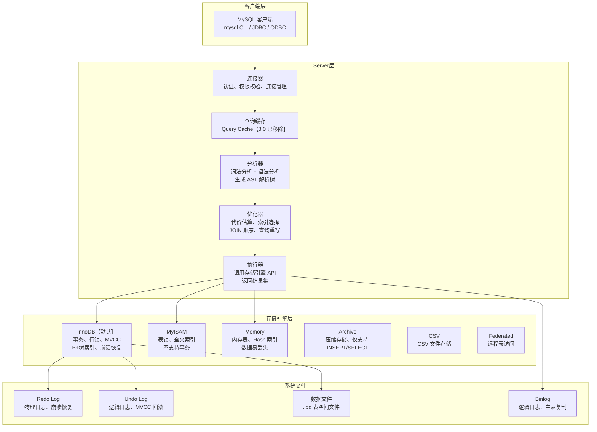

:::important
本文所有分析基于 #[R|MySQL 8.0.x] 与 #[R|InnoDB 存储引擎]，核心源码路径为 `sql/` 和 `storage/innobase/`。
MySQL 8.0 已移除查询缓存模块，所有涉及查询缓存的讨论仅作为历史参考。
:::

| 层级 | 组件 | 核心职责 | 关键文件 |
|------|------|----------|----------|
| 连接层 | 连接器/线程池 | 认证、权限校验、连接管理 | `sql/conn_handler/` |
| 服务层 | 分析器/优化器/执行器 | SQL 解析、优化、执行 | `sql/sql_parse.cc`、`sql/sql_optimizer.cc` |
| 引擎层 | InnoDB/MyISAM/Memory | 数据存储、索引、事务 | `storage/innobase/` |
| 日志层 | Redo/Undo/Binlog | 崩溃恢复、MVCC、复制 | `storage/innobase/log/` |

***

## 场景一：MySQL 架构总览

### 1.0 场景概览


| 阶段 | 核心组件 | 关键机制 | 源码位置 |
|------|----------|----------|----------|
| 连接管理 | `THD` 线程描述符 | 线程池、连接限制、超时断开 | `sql/conn_handler/connection_handler_manager.cc` |
| 词法分析 | `MYSQLlex` | 关键字识别、Token 生成 | `sql/sql_lex.cc` |
| 语法分析 | `MYSQLparse` | 构建 AST 解析树 | `sql/sql_yacc.yy` |
| 查询优化 | `JOIN::optimize` | 代价估算、索引选择、JOIN 重排 | `sql/sql_optimizer.cc` |
| 查询执行 | `JOIN::exec` | Nested Loop Join、索引扫描 | `sql/sql_executor.cc` |

### 1.1 Server 层与存储引擎层分离架构

MySQL 最核心的设计哲学是 **Server 层与存储引擎层的分离**，通过统一的 Handler 接口实现插件式引擎管理。

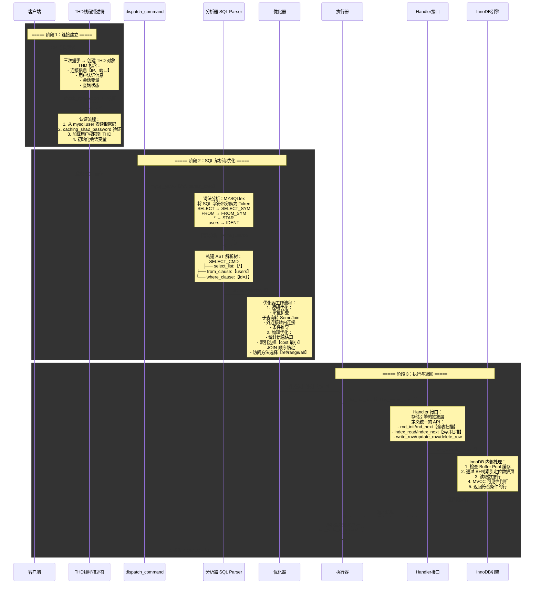

### 1.2 连接管理与线程池

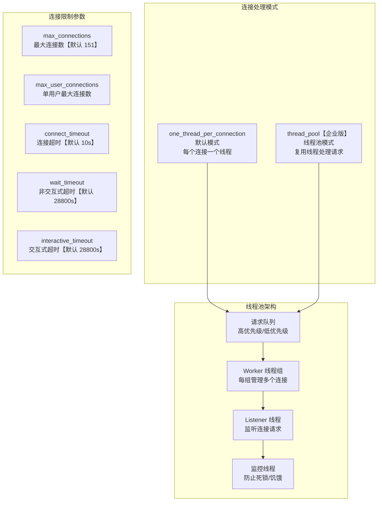

| 连接参数 | 默认值 | 调优建议 |
|----------|--------|----------|
| `max_connections` | 151 | 根据内存和 CPU 核数调整，单连接约 2MB 内存 |
| `thread_cache_size` | 9 | 设置为 `max_connections` 的 10%-20% |
| `back_log` | 151 | 短时间内大量连接的队列大小，建议 500-1000 |
| `wait_timeout` | 28800 | 建议缩短至 600-1800s，释放空闲连接 |
| `max_connect_errors` | 100 | 防止暴力破解，达到阈值后拒绝连接 |

### 1.3 一条 SQL 的执行路径全景

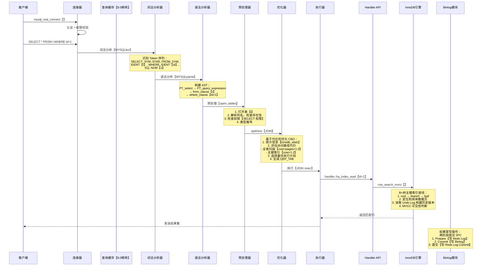

***

## 场景二：InnoDB 存储引擎深度剖析

### 2.0 场景概览

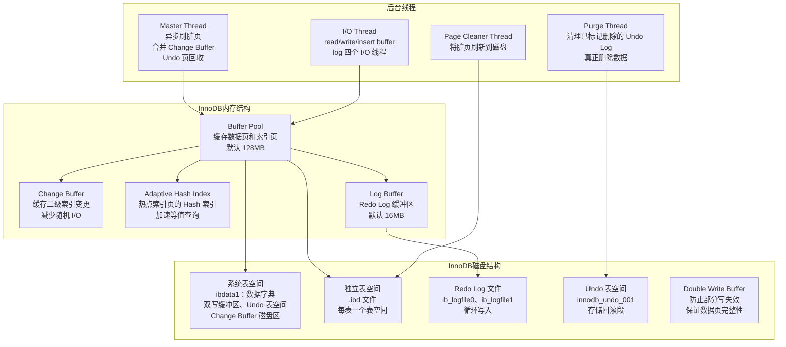

### 2.1 更新一行数据的完整流程

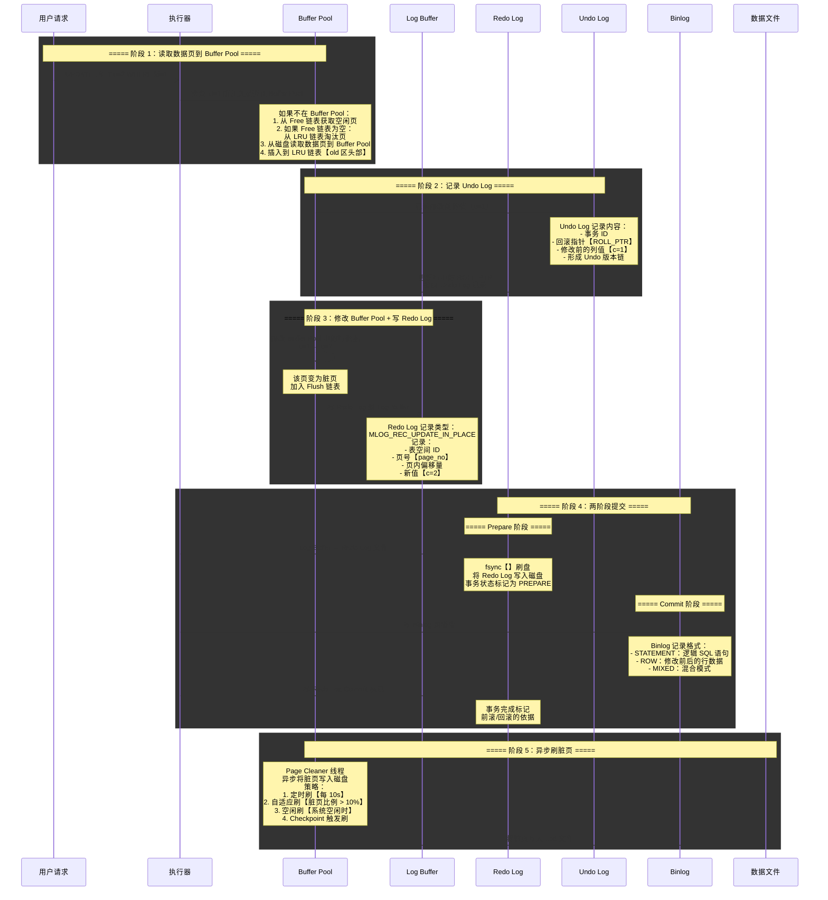

### 2.2 Buffer Pool 深度解析

Buffer Pool 是 InnoDB 最核心的内存结构，所有数据页和索引页的读写都经过它。

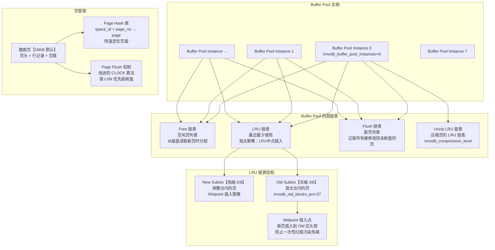

| Buffer Pool 参数 | 默认值 | 说明 |
|------------------|--------|------|
| `innodb_buffer_pool_size` | 128MB | Buffer Pool 总大小，建议设为物理内存的 50%-80% |
| `innodb_buffer_pool_instances` | 8【>=1GB 时】 | 多实例减少锁竞争 |
| `innodb_buffer_pool_chunk_size` | 128MB | 动态调整 Buffer Pool 时的块大小 |
| `innodb_old_blocks_pct` | 37 | Old 区占 LRU 链表比例 |
| `innodb_old_blocks_time` | 1000ms | Old 区页停留时间阈值，超过则移到 New 区 |
| `innodb_max_dirty_pages_pct` | 90 | 脏页最大比例，超过则强制刷盘 |
| `innodb_flush_neighbors` | 0【SSD 推荐】 | 刷脏页时是否刷新相邻页 |

### 2.3 Change Buffer 与 Adaptive Hash Index

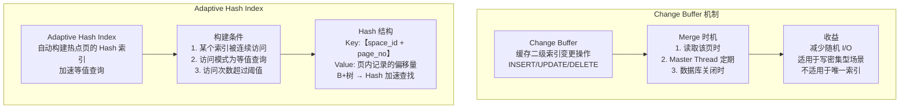

**Change Buffer 配置参数**：

| 参数 | 默认值 | 说明 |
|------|--------|------|
| `innodb_change_buffering` | all | 缓存操作类型：inserts/deletes/purges/changes/all/none |
| `innodb_change_buffer_max_size` | 25 | 占 Buffer Pool 的最大比例 |
| `innodb_adaptive_hash_index` | ON | 是否启用自适应哈希索引 |
| `innodb_adaptive_hash_index_parts` | 8 | 自适应哈希索引分区数 |

### 2.4 Double Write、Redo Log 与 Undo Log

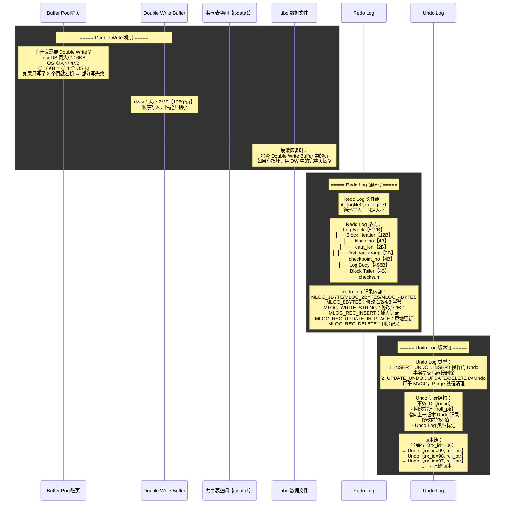

### 2.5 Checkpoint 机制

| Checkpoint 类型 | 触发条件 | 作用 |
|-----------------|----------|------|
| **Sharp Checkpoint** | 数据库正常关闭 | 将所有脏页刷盘，LSN 追上 |
| **Fuzzy Checkpoint** | 脏页比例 > 阈值 | 部分刷盘，记录 Checkpoint LSN |
| **Master Thread Checkpoint** | 每 1 秒或每 10 秒 | Master Thread 定时触发 |
| **FLUSH_LRU_LIST Checkpoint** | Free 链表不足 | 淘汰 LRU 尾部脏页，释放空闲页 |
| **Async/Sync Flush Checkpoint** | Redo Log 空间不足 | 根据 Redo Log 使用率刷脏页 |
| **Dirty Page Too Much Checkpoint** | 脏页比例 > `innodb_max_dirty_pages_pct` | 强制刷脏页 |

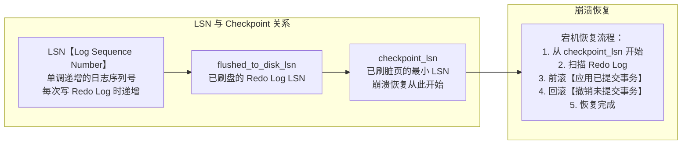

| Redo Log 参数 | 默认值 | 说明 |
|---------------|--------|------|
| `innodb_log_file_size` | 48MB | 单个 Redo Log 文件大小 |
| `innodb_log_files_in_group` | 2 | Redo Log 文件组数量 |
| `innodb_log_buffer_size` | 16MB | Log Buffer 大小 |
| `innodb_flush_log_at_trx_commit` | 1 | 0:每秒刷/1:每次提交刷/2:写OS缓存 |
| `innodb_flush_log_at_timeout` | 1s | 每秒刷 Log Buffer 间隔 |

### 2.6 InnoDB 数据页结构

```mermaid
graph TB
    subgraph 数据页结构【16KB】
        FH["File Header【38B】<br/>页类型、页号、<br/>上一页/下一页指针<br/>LSN、Checksum"]
        PH["Page Header【56B】<br/>槽数量、记录数<br/>Free Space 指针<br/>最后插入位置<br/>页目录槽数"]
        IR["Infimum + Supremum【26B】<br/>最小虚拟记录 + 最大虚拟记录<br/>记录链表的边界"]
        UR["User Records【动态】<br/>用户数据行记录<br/>按主键顺序排列<br/>Free Space 从中间分配"]
        FS["Free Space【动态】<br/>空闲空间<br/>用于插入新记录"]
        PD["Page Directory【动态】<br/>页目录【槽数组】<br/>每个槽指向一组记录<br/>用于二分查找"]
        FT["File Trailer【8B】<br/>Checksum + LSN 低 4 字节<br/>用于校验页完整性"]
    end

    FH --> PH
    PH --> IR
    IR --> UR
    UR --> FS
    FS --> PD
    PD --> FT
```

### 2.7 InnoDB 行格式

| 行格式 | 特点 | 适用场景 |
|--------|------|----------|
| `REDUNDANT` | 最老的格式，兼容性最好 | 旧版本兼容 |
| `COMPACT` | 紧凑格式，变长字段长度列表 + NULL 位图 | 通用场景 |
| `DYNAMIC`【默认】 | 长字段溢出页存储，只存 20B 指针 | 包含大字段的表 |
| `COMPRESSED` | 支持页压缩，节省磁盘空间 | 读多写少的大表 |

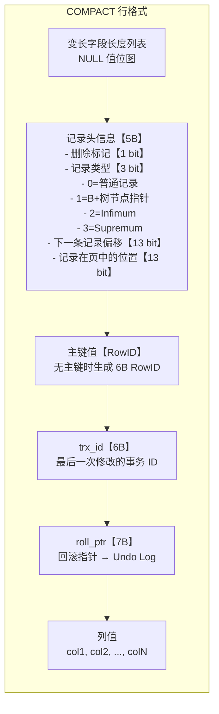

***

## 场景三：B+树索引原理

### 3.0 场景概览

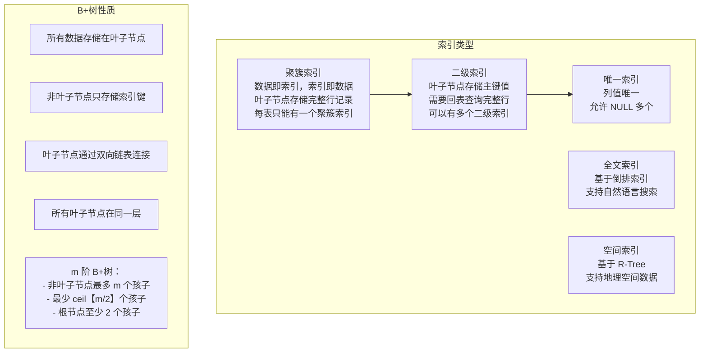

### 3.1 聚簇索引 vs 二级索引查找流程

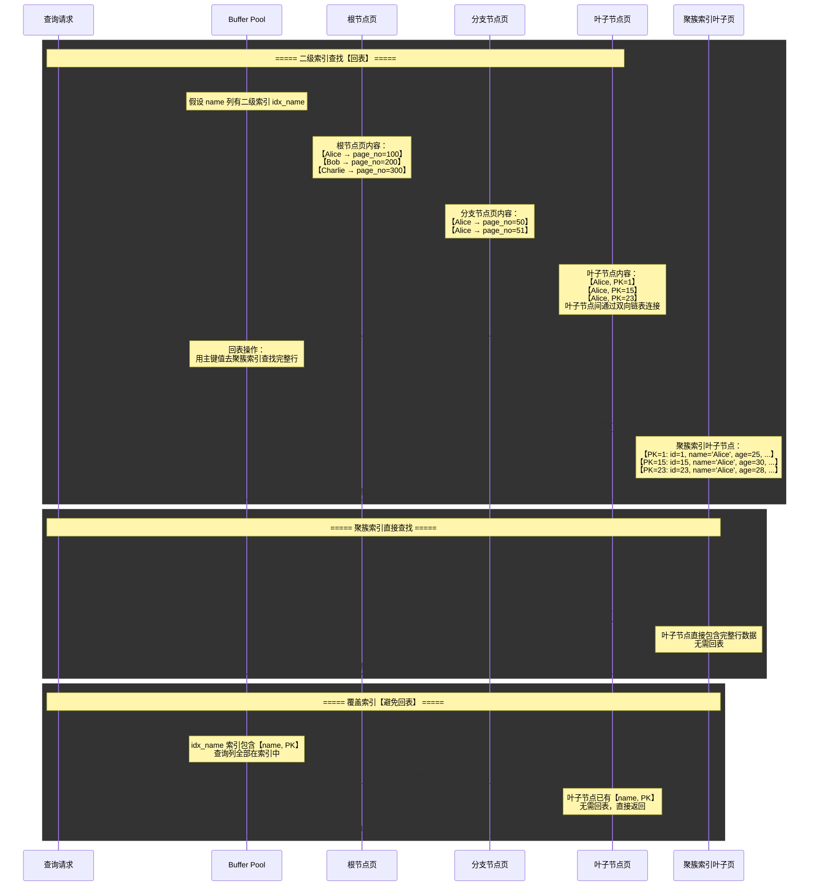

### 3.2 B+树页分裂与页合并

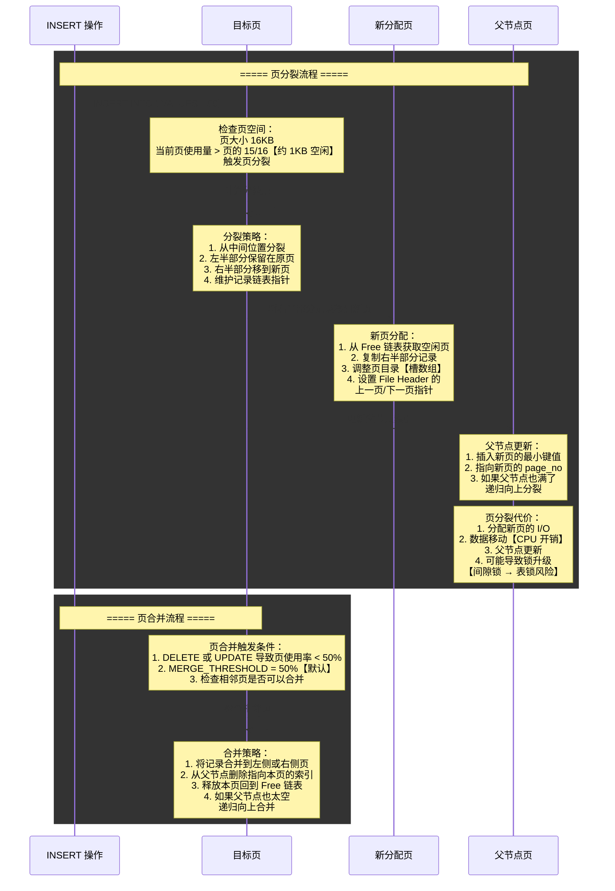

| 索引参数 | 默认值 | 说明 |
|----------|--------|------|
| `innodb_page_size` | 16KB | 页大小，影响 B+树扇出度 |
| `MERGE_THRESHOLD` | 50% | 页合并阈值，页使用率低于此值时触发合并 |
| `innodb_fill_factor` | 100% | 页填充因子，预留空间减少页分裂 |

### 3.3 联合索引与最左前缀原则

```mermaid
graph TB
    subgraph 联合索引结构【idx_a_b_c】
        IDX["联合索引 KEY【a, b, c】"]
        NODE1["节点1:【a=1, b=1, c=1 → PK】<br/>节点2:【a=1, b=1, c=2 → PK】<br/>节点3:【a=1, b=2, c=1 → PK】<br/>节点4:【a=2, b=1, c=1 → PK】"]
    end

    subgraph 最左前缀匹配
        MATCH1["WHERE a=1 ✓<br/>使用索引，a 列匹配"]
        MATCH2["WHERE a=1 AND b=1 ✓<br/>使用索引，a、b 列匹配"]
        MATCH3["WHERE a=1 AND b=1 AND c=1 ✓<br/>使用索引，全部匹配"]
        MATCH4["WHERE a=1 AND c=1<br/>只用 a 列，c 无法使用索引<br/>【跳过 b 列】"]
        MATCH5["WHERE b=1 ✗<br/>无法使用索引，没有 a 列"]
        MATCH6["WHERE a>1 AND b=1<br/>a 用范围索引，b 无法使用"]
        MATCH7["WHERE a=1 AND b>1 AND c=1<br/>a、b 用索引，c 无法使用"]
    end

    IDX --> NODE1
    MATCH1 --> MATCH2
    MATCH2 --> MATCH3
    MATCH3 --> MATCH4
    MATCH5 --> MATCH6
    MATCH6 --> MATCH7
```

:::important
联合索引的最左前缀原则是索引优化的核心。查询条件必须从联合索引的最左侧列开始，且不能跳过中间的列。范围查询后面的列无法使用索引。
:::

### 3.4 索引下推 ICP 与 MRR 优化

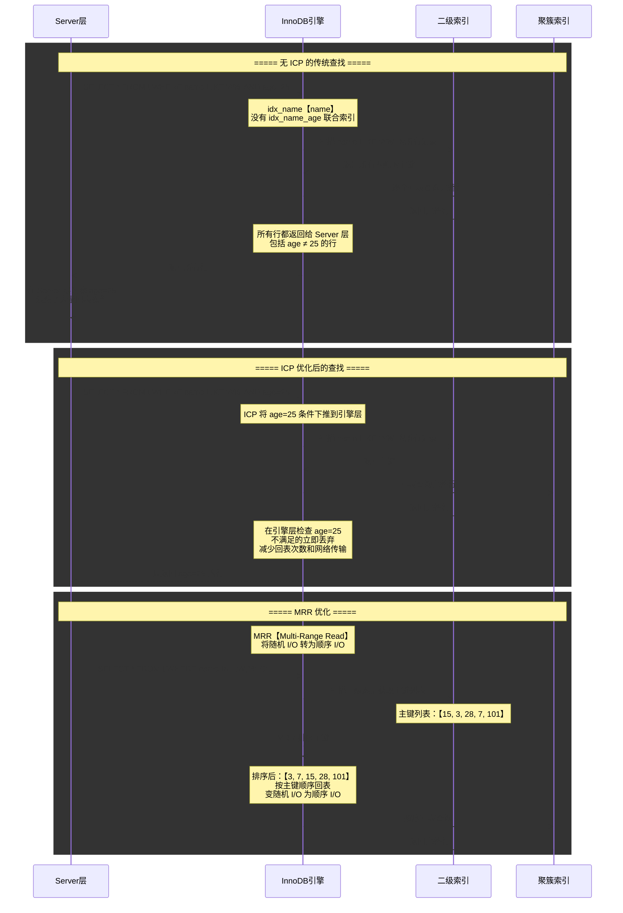

### 3.5 EXPLAIN 分析索引选择

```mermaid
graph TB
    subgraph EXPLAIN 输出字段
        ID["id<br/>SELECT 标识符<br/>执行顺序编号"]
        SELECT_TYPE["select_type<br/>SIMPLE/PRIMARY/SUBQUERY<br/>DERIVED/UNION"]
        TABLE["table<br/>表名"]
        PARTITIONS["partitions<br/>匹配的分区"]
        TYPE["type<br/>访问类型：<br/>ALL > index > range > ref<br/>> eq_ref > const > system"]
        POSSIBLE_KEYS["possible_keys<br/>可能使用的索引"]
        KEY["key<br/>实际使用的索引"]
        KEY_LEN["key_len<br/>使用索引的长度"]
        REF["ref<br/>与索引比较的列"]
        ROWS["rows<br/>预估扫描行数"]
        FILTERED["filtered<br/>按表条件过滤的百分比"]
        EXTRA["Extra<br/>额外信息：<br/>Using index【覆盖索引】<br/>Using where【Server 过滤】<br/>Using index condition【ICP】<br/>Using filesort【文件排序】<br/>Using temporary【临时表】<br/>Using join buffer【BNL/BKA】"]
    end

    subgraph type 访问类型排序
        T1["system<br/>表只有一行"]
        T2["const<br/>主键或唯一索引等值查询"]
        T3["eq_ref<br/>JOIN 时主键/唯一索引匹配"]
        T4["ref<br/>非唯一索引等值匹配"]
        T5["range<br/>索引范围扫描"]
        T6["index<br/>全索引扫描"]
        T7["ALL<br/>全表扫描【最差】"]
    end

    ID --> SELECT_TYPE
    SELECT_TYPE --> TABLE
    TABLE --> TYPE
    TYPE --> POSSIBLE_KEYS
    POSSIBLE_KEYS --> KEY
    KEY --> KEY_LEN
    KEY_LEN --> REF
    REF --> ROWS
    ROWS --> FILTERED
    FILTERED --> EXTRA

    T1 --> T2
    T2 --> T3
    T3 --> T4
    T4 --> T5
    T5 --> T6
    T6 --> T7
```

***

## 场景四：事务与 MVCC

### 4.0 场景概览

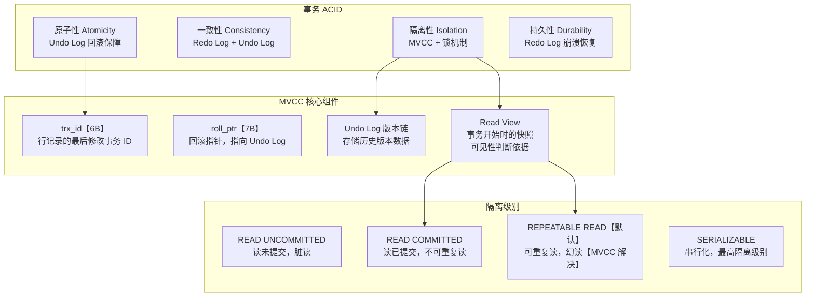

### 4.1 两个事务并发操作同一行数据

```mermaid
sequenceDiagram
    participant TRX_A as 事务A【trx_id=100】
    participant TRX_B as 事务B【trx_id=200】
    participant ROW as 数据行【id=1】
    participant UNDO as Undo Log
    participant MVCC as MVCC Read View

    Note over ROW: 初始状态：id=1, c=10<br/>trx_id=99, roll_ptr=...

    rect rgba【240, 248, 255, 0.4】
    Note over TRX_A,TRX_B: ===== 时刻 1：事务 A 开始 =====
    TRX_A->>MVCC: BEGIN【创建 Read View A】
    Note over MVCC: Read View A 内容：<br/>- m_ids: 活跃事务列表【100, ...】<br/>- min_trx_id: 100<br/>- max_trx_id: 101<br/>- creator_trx_id: 100
    end

    rect rgba【240, 255, 248, 0.4】
    Note over TRX_A,TRX_B: ===== 时刻 2：事务 A 更新 =====
    TRX_A->>ROW: UPDATE t SET c=20 WHERE id=1
    Note over ROW: 1. 加 X 锁<br/>2. 记录 Undo Log【c=10, trx_id=99】<br/>3. 修改行：c=20, trx_id=100<br/>4. roll_ptr 指向新 Undo 记录
    ROW->>UNDO: 写入 Undo 记录
    Note over UNDO: Undo 记录：<br/>trx_id=100, c=10<br/>roll_ptr → 上一版本
    end

    rect rgba【255, 248, 240, 0.4】
    Note over TRX_B,ROW: ===== 时刻 3：事务 B 开始并查询 =====
    TRX_B->>MVCC: BEGIN【创建 Read View B】
    Note over MVCC: Read View B：<br/>- m_ids:【100, 200, ...】<br/>- min_trx_id: 100<br/>- max_trx_id: 201<br/>- creator_trx_id: 200

    TRX_B->>ROW: SELECT c FROM t WHERE id=1
    Note over ROW: 当前行：trx_id=100<br/>Read View B 判断：<br/>1. trx_id=100 < min_trx_id=100？<br/>   → 否【相等】<br/>2. trx_id=100 在 m_ids 中？<br/>   → 是【事务 A 仍在活跃】<br/>   → 且 trx_id=100 ≠ creator_trx_id=200<br/>   → 不可见！

    ROW->>UNDO: 沿 roll_ptr 查找历史版本
    Note over UNDO: 找到 Undo 记录：trx_id=99, c=10<br/>1. trx_id=99 < min_trx_id=100？<br/>   → 是【已提交】<br/>2. 可见！
    UNDO-->>TRX_B: 返回 c=10【一致性读】
    end

    rect rgba【248, 240, 255, 0.4】
    Note over TRX_A,UNDO: ===== 时刻 4：事务 A 提交 =====
    TRX_A->>TRX_A: COMMIT
    Note over TRX_A: 事务 A 提交后：<br/>1. 释放锁<br/>2. 写 Redo Log Commit<br/>3. trx_id=100 从活跃列表移除

    Note over TRX_B: 事务 B 再次查询【RR 级别】<br/>Read View 不变<br/>→ 仍然读到 c=10<br/>→ 可重复读！
    TRX_B->>ROW: SELECT c FROM t WHERE id=1
    ROW->>UNDO: 历史版本判断
    UNDO-->>TRX_B: 仍然返回 c=10
    end
```

### 4.2 Read View 可见性判断算法

```mermaid
graph TB
    subgraph Read View 结构
        RV1["m_ids: 创建时刻活跃事务 ID 列表"]
        RV2["min_trx_id: m_ids 中的最小值"]
        RV3["max_trx_id: 系统下一个未分配的事务 ID"]
        RV4["creator_trx_id: 创建 Read View 的事务 ID"]
    end

    subgraph 可见性判断流程
        JUDGE["判断行记录的 trx_id 是否可见"]
        STEP1["1. trx_id == creator_trx_id？<br/>→ 是：可见【自己修改的】"]
        STEP2["2. trx_id < min_trx_id？<br/>→ 是：可见【已提交的事务】"]
        STEP3["3. trx_id >= max_trx_id？<br/>→ 是：不可见【未来事务】"]
        STEP4["4. trx_id 在 m_ids 中？<br/>→ 是：不可见【仍在活跃】<br/>→ 否：可见【已提交】"]
    end

    RV1 --> RV2
    RV2 --> RV3
    RV3 --> RV4
    JUDGE --> STEP1
    STEP1 --> STEP2
    STEP2 --> STEP3
    STEP3 --> STEP4
```

### 4.3 四种隔离级别实现原理

| 隔离级别 | 脏读 | 不可重复读 | 幻读 | 实现原理 |
|----------|------|------------|------|----------|
| `READ UNCOMMITTED` | 可能 | 可能 | 可能 | 直接读最新数据，不加锁 |
| `READ COMMITTED` | 不可能 | 可能 | 可能 | 每次查询创建新 Read View |
| `REPEATABLE READ` | 不可能 | 不可能 | 不可能 | 事务开始时创建 Read View，快照读 + 临键锁防止幻读 |
| `SERIALIZABLE` | 不可能 | 不可能 | 不可能 | 所有 SELECT 隐式加 LOCK IN SHARE MODE |

```mermaid
sequenceDiagram
    participant RC as READ COMMITTED
    participant RR as REPEATABLE READ
    participant ROW as 数据行
    participant UNDO as Undo Log

    rect rgba【240, 248, 255, 0.4】
    Note over RC,ROW: ===== RC 级别：每次查询创建新 Read View =====
    RC->>ROW: 事务 A：第一次 SELECT<br/>创建 Read View_1
    Note over ROW: 此时 trx_id=100, c=10
    ROW-->>RC: 返回 c=10

    Note over ROW: 事务 B 修改 c=20 并提交

    RC->>ROW: 事务 A：第二次 SELECT<br/>创建 Read View_2
    Note over ROW: 此时 trx_id=200, c=20<br/>Read View_2：trx_id=200 不在 m_ids<br/>→ 可见！
    ROW-->>RC: 返回 c=20【不可重复读】
    end

    rect rgba【240, 255, 248, 0.4】
    Note over RR,ROW: ===== RR 级别：复用同一个 Read View =====
    RR->>ROW: 事务 A：第一次 SELECT<br/>创建 Read View【复用】
    Note over ROW: 此时 trx_id=100, c=10
    ROW-->>RR: 返回 c=10

    Note over ROW: 事务 B 修改 c=20 并提交

    RR->>ROW: 事务 A：第二次 SELECT<br/>复用 Read View
    Note over ROW: 此时 trx_id=200, c=20<br/>Read View：trx_id=200 >= max_trx_id<br/>→ 不可见！沿 Undo 链查找
    ROW->>UNDO: 查找历史版本
    UNDO-->>RR: 返回 c=10【可重复读】
    end
```

### 4.4 快照读 vs 当前读

```mermaid
graph TB
    subgraph 快照读 Snapshot Read
        SNAP1["SELECT * FROM t<br/>普通 SELECT 语句"]
        SNAP2["基于 MVCC Read View<br/>读历史版本"]
        SNAP3["不加锁【非锁定读】<br/>高并发性能好"]
        SNAP4["RR 级别：<br/>事务开始时的快照<br/>RC 级别：<br/>每次查询的快照"]
    end

    subgraph 当前读 Current Read
        CUR1["SELECT ... FOR UPDATE<br/>SELECT ... LOCK IN SHARE MODE"]
        CUR2["UPDATE / DELETE / INSERT<br/>写操作"]
        CUR3["读取最新提交版本<br/>加锁【锁定读】"]
        CUR4["保证数据一致性<br/>读取最新已提交数据"]
    end

    SNAP1 --> SNAP2
    SNAP2 --> SNAP3
    SNAP3 --> SNAP4
    CUR1 --> CUR2
    CUR2 --> CUR3
    CUR3 --> CUR4
```

| 读类型 | SQL 示例 | 读版本 | 加锁 | 使用场景 |
|--------|----------|--------|------|----------|
| 快照读 | `SELECT * FROM t WHERE id=1` | 历史版本 | 否 | 普通查询 |
| 当前读-共享锁 | `SELECT ... LOCK IN SHARE MODE` | 最新版本 | S 锁 | 需要读最新数据 |
| 当前读-排他锁 | `SELECT ... FOR UPDATE` | 最新版本 | X 锁 | 读取后即将修改 |
| 当前读-写操作 | `UPDATE/DELETE/INSERT` | 最新版本 | X 锁 | 数据修改 |

***

## 场景五：锁机制

### 5.0 场景概览

```mermaid
graph TB
    subgraph 锁粒度
        TABLE_LOCK["表锁<br/>LOCK TABLES ... READ/WRITE<br/>MyISAM 默认"]
        PAGE_LOCK["页锁<br/>BDB 存储引擎使用<br/>介于表锁和行锁之间"]
        ROW_LOCK["行锁<br/>InnoDB 默认<br/>基于索引加锁"]
    end

    subgraph 行锁类型
        RECORD["记录锁 Record Lock<br/>锁定单条索引记录"]
        GAP["间隙锁 Gap Lock<br/>锁定索引记录间的间隙<br/>防止插入新记录"]
        NEXT_KEY["临键锁 Next-Key Lock<br/>记录锁 + 间隙锁<br/>防止幻读的默认锁"]
        INSERT_INTENTION["插入意向锁<br/>INSERT 时的间隙锁<br/>不互斥，等待即可"]
    end

    subgraph 表级意向锁
        IS["意向共享锁 IS<br/>事务想要获取表中某行的 S 锁"]
        IX["意向排他锁 IX<br/>事务想要获取表中某行的 X 锁"]
        AUTO_INC["自增锁 AUTO-INC<br/>INSERT 自增列时使用<br/>innodb_autoinc_lock_mode"]
    end

    TABLE_LOCK --> ROW_LOCK
    ROW_LOCK --> RECORD
    ROW_LOCK --> GAP
    RECORD --> NEXT_KEY
    GAP --> NEXT_KEY
    NEXT_KEY --> INSERT_INTENTION
    IS --> IX
    IX --> AUTO_INC
```

### 5.1 行锁、间隙锁、临键锁关系图

```mermaid
graph TB
    subgraph 索引记录分布
        IDX["主键索引：id = 1, 5, 10, 15, 20"]
    end

    subgraph 记录锁 Record Lock
        RL["SELECT * FROM t WHERE id=5 FOR UPDATE<br/>锁定 id=5 这一条记录"]
    end

    subgraph 间隙锁 Gap Lock
        GL1["间隙【1, 5】：<br/>锁定 1 和 5 之间的间隙"]
        GL2["间隙【5, 10】：<br/>锁定 5 和 10 之间的间隙"]
        GL3["间隙【10, 15】：<br/>锁定 10 和 15 之间的间隙"]
        GL4["间隙【15, 20】：<br/>锁定 15 和 20 之间的间隙"]
        GL5["间隙【20, +∞】：<br/>锁定 20 之后的间隙<br/>由 Supremum 伪记录表示"]
    end

    subgraph 临键锁 Next-Key Lock
        NL1["【-∞, 1】：<br/>间隙 + id=1 记录锁"]
        NL2["【1, 5】：<br/>间隙【1,5】+ id=5 记录锁"]
        NL3["【5, 10】：<br/>间隙【5,10】+ id=10 记录锁"]
        NL4["【10, 15】：<br/>间隙【10,15】+ id=15 记录锁"]
        NL5["【15, 20】：<br/>间隙【15,20】+ id=20 记录锁"]
        NL6["【20, +∞】：<br/>间隙【20,+∞】+ Supremum"]
    end

    IDX --> RL
    IDX --> GL1
    IDX --> GL2
    IDX --> GL3
    IDX --> GL4
    IDX --> GL5
    GL1 --> NL1
    GL2 --> NL2
    GL3 --> NL3
    GL4 --> NL4
    GL5 --> NL5
    GL5 --> NL6
```

### 5.2 锁兼容矩阵

| 请求锁 \ 持有锁 | IS | IX | S | X | AUTO_INC |
|-----------------|-----|-----|-----|-----|----------|
| **IS** | 兼容 | 兼容 | 兼容 | 冲突 | 兼容 |
| **IX** | 兼容 | 兼容 | 冲突 | 冲突 | 兼容 |
| **S** | 兼容 | 冲突 | 兼容 | 冲突 | 冲突 |
| **X** | 冲突 | 冲突 | 冲突 | 冲突 | 冲突 |
| **AUTO_INC** | 兼容 | 兼容 | 冲突 | 冲突 | 冲突 |

| 请求锁 \ 持有锁 | 记录锁 | 间隙锁 | 临键锁 | 插入意向锁 |
|-----------------|--------|--------|--------|------------|
| **记录锁** | 冲突 | 兼容 | 冲突 | 兼容 |
| **间隙锁** | 兼容 | 兼容 | 兼容 | 冲突 |
| **临键锁** | 冲突 | 兼容 | 冲突 | 兼容 |
| **插入意向锁** | 兼容 | 冲突 | 兼容 | 冲突 |

### 5.3 死锁检测与处理

```mermaid
sequenceDiagram
    participant A as 事务A
    participant B as 事务B
    participant LOCK as 锁管理器
    participant DEADLOCK as 死锁检测器

    rect rgba【240, 248, 255, 0.4】
    Note over A,B: ===== 死锁产生 =====
    A->>LOCK: SELECT * FROM t WHERE id=1 FOR UPDATE
    Note over LOCK: 事务 A 获取 id=1 的 X 锁

    B->>LOCK: SELECT * FROM t WHERE id=2 FOR UPDATE
    Note over LOCK: 事务 B 获取 id=2 的 X 锁

    A->>LOCK: UPDATE t SET c=10 WHERE id=2
    Note over LOCK: 事务 A 等待 id=2 的 X 锁<br/>【被事务 B 持有】

    B->>LOCK: UPDATE t SET c=20 WHERE id=1
    Note over LOCK: 事务 B 等待 id=1 的 X 锁<br/>【被事务 A 持有】<br/>→ 死锁！
    end

    rect rgba【255, 248, 240, 0.4】
    Note over LOCK,DEADLOCK: ===== 死锁检测 =====
    LOCK->>DEADLOCK: 等待图检测
    Note over DEADLOCK: 检测算法：<br/>1. 构建等待图【Wait-for Graph】<br/>   节点：事务<br/>   边：A 等待 B → A→B<br/>2. 检测图中是否存在环<br/>3. 如果存在环 → 死锁
    Note over DEADLOCK: 等待图：<br/>事务 A → 事务 B【A 等待 B】<br/>事务 B → 事务 A【B 等待 A】<br/>→ 检测到环！
    end

    rect rgba【248, 240, 255, 0.4】
    Note over DEADLOCK,B: ===== 死锁处理 =====
    DEADLOCK->>DEADLOCK: 选择回滚代价最小的事务
    Note over DEADLOCK: 选择策略：<br/>1. 回滚 undo log 最少的事务<br/>2. 事务权重最小的事务<br/>3. 事务开始时间最晚的事务
    DEADLOCK->>B: 回滚事务 B
    Note over B: 事务 B 收到死锁错误：<br/>ERROR 1213【40001】: Deadlock found<br/>try restarting transaction
    DEADLOCK->>LOCK: 释放事务 B 的所有锁
    LOCK->>A: 事务 A 获取 id=2 的 X 锁<br/>继续执行
    end
```

| 死锁参数 | 默认值 | 说明 |
|----------|--------|------|
| `innodb_deadlock_detect` | ON | 是否启用死锁检测 |
| `innodb_lock_wait_timeout` | 50s | 锁等待超时时间 |
| `innodb_print_all_deadlocks` | OFF | 是否将所有死锁记录到错误日志 |

### 5.4 乐观锁 vs 悲观锁

```mermaid
graph TB
    subgraph 悲观锁 Pessimistic Lock
        PES1["假定会发生冲突<br/>先加锁再操作"]
        PES2["SELECT ... FOR UPDATE<br/>数据库行锁实现"]
        PES3["优点：<br/>数据一致性高<br/>冲突严重时效率高"]
        PES4["缺点：<br/>死锁风险<br/>并发性能低<br/>长事务阻塞"]
    end

    subgraph 乐观锁 Optimistic Lock
        OPT1["假定不会发生冲突<br/>先操作再检查"]
        OPT2["版本号机制：<br/>UPDATE t SET c=10, version=version+1<br/>WHERE id=1 AND version=3"]
        OPT3["CAS 机制：<br/>UPDATE t SET c=10<br/>WHERE id=1 AND c=5"]
        OPT4["优点：<br/>无锁等待<br/>高并发性能<br/>无死锁"]
        OPT5["缺点：<br/>重试逻辑复杂<br/>冲突严重时重试次数多"]
    end

    PES1 --> PES2
    PES2 --> PES3
    PES2 --> PES4
    OPT1 --> OPT2
    OPT2 --> OPT3
    OPT3 --> OPT4
    OPT3 --> OPT5
```

| 对比维度 | 乐观锁 | 悲观锁 |
|----------|--------|--------|
| 实现方式 | 版本号/CAS | 数据库行锁 |
| 加锁时机 | 更新时检查 | 读取时加锁 |
| 并发性能 | 高 | 低 |
| 冲突严重时 | 重试次数多 | 效率高 |
| 死锁风险 | 无 | 有 |
| 适用场景 | 读多写少 | 写多读少 |

### 5.5 自增锁模式

| 模式 | 值 | 行为 | 适用场景 |
|------|------|------|----------|
| `innodb_autoinc_lock_mode=0` | 传统模式 | 所有 INSERT 加表级 AUTO-INC 锁，语句结束释放 | 兼容旧版本 |
| `innodb_autoinc_lock_mode=1` | 连续模式【默认】 | 简单 INSERT 不加锁，批量 INSERT 加锁 | 通用场景 |
| `innodb_autoinc_lock_mode=2` | 交错模式 | 所有 INSERT 不加锁，自增值可能不连续 | 高并发 INSERT |

***

## 场景六：SQL 优化实战

### 6.0 场景概览

```mermaid
graph LR
    A["慢查询日志<br/>long_query_time=1s"] --> B["EXPLAIN 分析<br/>查看执行计划"]
    B --> C["索引优化<br/>覆盖索引、联合索引"]
    C --> D["SQL 重写<br/>避免 SELECT *<br/>避免函数索引"]
    D --> E["JOIN 优化<br/>小表驱动大表<br/>NLJ/BNL/MRR"]
    E --> F["分页优化<br/>延迟关联<br/>游标分页"]
    F --> G["大表 DDL<br/>pt-online-schema-change<br/>gh-ost"]
```

### 6.1 一条慢 SQL 的优化流程

```mermaid
sequenceDiagram
    participant DBA as DBA/开发者
    participant SLOW as 慢查询日志
    participant EXPLAIN as EXPLAIN
    participant OPTIM as 优化器
    participant IDX as 索引分析
    participant REWRITE as SQL 重写
    participant TEST as 测试验证

    rect rgba【240, 248, 255, 0.4】
    Note over DBA,SLOW: ===== 阶段 1：发现慢 SQL =====
    DBA->>SLOW: 开启慢查询日志
    Note over SLOW: 配置：<br/>slow_query_log = ON<br/>long_query_time = 1s<br/>log_queries_not_using_indexes = ON
    SLOW->>SLOW: 分析慢查询日志
    Note over SLOW: 工具：<br/>mysqldumpslow<br/>pt-query-digest
    SLOW-->>DBA: 发现慢 SQL：<br/>SELECT * FROM orders<br/>WHERE status='pending'<br/>ORDER BY create_time DESC<br/>LIMIT 20
    end

    rect rgba【240, 255, 248, 0.4】
    Note over DBA,EXPLAIN: ===== 阶段 2：EXPLAIN 分析 =====
    DBA->>EXPLAIN: EXPLAIN SELECT ... FROM orders ...
    Note over EXPLAIN: 输出分析：<br/>type: ALL【全表扫描】<br/>rows: 5000000<br/>Extra: Using filesort
    Note over EXPLAIN: 问题诊断：<br/>1. 没有 status 索引 → 全表扫描<br/>2. ORDER BY create_time → 文件排序<br/>3. 500 万行扫描 → 极慢
    end

    rect rgba【255, 248, 240, 0.4】
    Note over DBA,IDX: ===== 阶段 3：索引优化 =====
    DBA->>IDX: 创建联合索引
    Note over IDX: ALTER TABLE orders<br/>ADD INDEX idx_status_time【status, create_time】
    DBA->>OPTIM: 分析索引选择
    Note over OPTIM: 新索引 idx_status_time：<br/>1. status='pending' 走索引<br/>2. create_time 在索引中有序<br/>   避免 filesort<br/>3. 覆盖索引：避免回表【如果 SELECT 列少】
    end

    rect rgba【248, 240, 255, 0.4】
    Note over DBA,REWRITE: ===== 阶段 4：SQL 重写 =====
    DBA->>REWRITE: 优化 SELECT 列
    Note over REWRITE: 改写前：<br/>SELECT * FROM orders<br/>改写后：<br/>SELECT id, order_no, status, amount, create_time<br/>FROM orders
    Note over REWRITE: 如果 idx_status_time 覆盖了所有查询列<br/>→ 覆盖索引，无需回表
    end

    rect rgba【255, 240, 245, 0.4】
    Note over DBA,TEST: ===== 阶段 5：测试验证 =====
    DBA->>TEST: EXPLAIN 再次分析
    Note over TEST: 优化后 EXPLAIN：<br/>type: ref【索引查找】<br/>key: idx_status_time<br/>rows: 1000【过滤后】<br/>Extra: Using index【覆盖索引】<br/>查询时间：5s → 0.01s
    end
```

### 6.2 EXPLAIN 各字段深度解读

| 字段 | 含义 | 常见值 | 优化建议 |
|------|------|--------|----------|
| `id` | 查询序号 | 数字 | id 相同从上到下执行，id 越大越先执行 |
| `select_type` | 查询类型 | SIMPLE/PRIMARY/SUBQUERY/DERIVED/UNION | DERIVED 派生表尽量优化 |
| `type` | 访问类型 | system > const > eq_ref > ref > range > index > ALL | 至少达到 range 级别 |
| `possible_keys` | 可能索引 | 索引名列表 | 可能索引越多，优化器选择越困难 |
| `key` | 实际索引 | 索引名 | NULL 表示未使用索引 |
| `key_len` | 索引长度 | 字节数 | 越大表示使用索引列越多 |
| `ref` | 比较的列或常量 | const/列名 | 判断索引匹配方式 |
| `rows` | 预估扫描行数 | 数字 | 越小越好，越准确越好 |
| `filtered` | 过滤百分比 | 0-100 | 乘以 rows 得到实际返回行数 |
| `Extra` | 额外信息 | Using index/Using where/Using filesort/Using temporary | 避免 Using filesort 和 Using temporary |

**Extra 字段关键值解读**：

| Extra 值 | 含义 | 严重程度 |
|----------|------|----------|
| `Using index` | 覆盖索引，无需回表 | 最佳 |
| `Using index condition` | 使用 ICP 优化 | 良好 |
| `Using where` | Server 层过滤 | 一般 |
| `Using MRR` | 使用 MRR 优化 | 良好 |
| `Using filesort` | 需要额外排序 | 较差 |
| `Using temporary` | 需要临时表 | 很差 |
| `Using join buffer` | JOIN 使用连接缓冲 | 一般 |

### 6.3 JOIN 优化

```mermaid
graph TB
    subgraph NLJ【Nested Loop Join】
        NLJ1["嵌套循环连接<br/>外层表每行，扫描内层表"]
        NLJ2["适用场景：<br/>- 内层表有索引<br/>- 外层表结果集小"]
        NLJ3["伪代码：<br/>for each row in outer_table:<br/>  for each row in inner_table:<br/>    if join_condition matches:<br/>      output row"]
    end

    subgraph BNL【Block Nested Loop Join】
        BNL1["块嵌套循环连接<br/>批量读取外层表到 Join Buffer"]
        BNL2["适用场景：<br/>- 内层表无索引<br/>- 减少内层表扫描次数"]
        BNL3["伪代码：<br/>for each block in outer_table:<br/>  load block into join_buffer<br/>  for each row in inner_table:<br/>    match against join_buffer"]
    end

    subgraph MRR【Multi-Range Read】
        MRR1["多范围读取<br/>批量读取并排序"]
        MRR2["优化效果：<br/>- 随机 I/O → 顺序 I/O<br/>- 减少磁盘寻道次数"]
    end

    subgraph BKA【Batched Key Access】
        BKA1["批量键访问<br/>MRR + BNL 的结合"]
        BKA2["流程：<br/>1. 批量获取外层表 JOIN 键<br/>2. 排序后批量回表<br/>3. 使用 JOIN 条件匹配"]
    end

    NLJ1 --> NLJ2
    NLJ2 --> NLJ3
    BNL1 --> BNL2
    BNL2 --> BNL3
    MRR1 --> MRR2
    BKA1 --> BKA2
```

| JOIN 算法 | 适用场景 | 索引要求 | 性能 |
|-----------|----------|----------|------|
| **NLJ** | 小表 JOIN 大表 | 内层表 JOIN 列有索引 | 高 |
| **BNL** | 无索引的 JOIN | 无 | 中等 |
| **BKA** | 批量 JOIN | 内层表有索引 | 较高 |
| **Hash Join** | 等值 JOIN【8.0.18+】 | 无 | 较高 |

### 6.4 分页优化

```mermaid
graph TB
    subgraph 传统分页问题
        TRAD1["SELECT * FROM t<br/>ORDER BY id<br/>LIMIT 1000000, 20"]
        TRAD2["问题：<br/>需要扫描前 1000020 行<br/>丢弃前 1000000 行<br/>只返回最后 20 行<br/>数据量越大越慢"]
    end

    subgraph 延迟关联优化
        DELAY1["SELECT * FROM t<br/>INNER JOIN【<br/>  SELECT id FROM t<br/>  ORDER BY id<br/>  LIMIT 1000000, 20<br/>】 AS tmp<br/>ON t.id = tmp.id"]
        DELAY2["原理：<br/>1. 子查询只扫描索引【覆盖索引】<br/>2. 快速跳过 1000000 行<br/>3. 只用 20 个 id 回表<br/>大幅减少回表次数"]
    end

    subgraph 游标分页
        CURSOR1["SELECT * FROM t<br/>WHERE id > 1000000<br/>ORDER BY id<br/>LIMIT 20"]
        CURSOR2["原理：<br/>使用上一页最后一条记录的主键<br/>直接定位到起始位置<br/>不需要扫描前面的行<br/>但要求主键连续递增"]
    end

    TRAD1 --> TRAD2
    DELAY1 --> DELAY2
    CURSOR1 --> CURSOR2
```

### 6.5 大表 DDL 优化

```mermaid
sequenceDiagram
    participant DBA as DBA
    participant PT as pt-online-schema-change
    participant OLD as 原表【orders】
    participant NEW as 新表【_orders_new】
    participant TRIGGER as 触发器
    participant BINLOG as Binlog

    rect rgba【240, 248, 255, 0.4】
    Note over DBA,OLD: ===== 阶段 1：创建新表 =====
    DBA->>PT: pt-online-schema-change<br/>--alter "ADD COLUMN addr VARCHAR【200】"<br/>D=test,t=orders
    PT->>OLD: 分析原表结构
    PT->>NEW: CREATE TABLE _orders_new LIKE orders
    PT->>NEW: ALTER TABLE _orders_new ADD COLUMN addr VARCHAR【200】
    end

    rect rgba【240, 255, 248, 0.4】
    Note over PT,TRIGGER: ===== 阶段 2：创建触发器 =====
    PT->>TRIGGER: 创建三个触发器
    Note over TRIGGER: 1. INSERT 触发器：<br/>   新插入原表的数据<br/>   同步插入新表<br/>2. UPDATE 触发器：<br/>   原表更新时同步更新新表<br/>3. DELETE 触发器：<br/>   原表删除时同步删除新表
    end

    rect rgba【255, 248, 240, 0.4】
    Note over PT,NEW: ===== 阶段 3：数据迁移 =====
    PT->>OLD: 分批读取原表数据
    Note over OLD: 按主键分批：<br/>chunk-size=1000<br/>每批读取 1000 行<br/>低峰期可增大
    PT->>NEW: INSERT INTO _orders_new SELECT ... FROM orders LIMIT ...
    Note over NEW: 数据迁移期间：<br/>触发器保证增量数据同步<br/>原表在线可用
    end

    rect rgba【248, 240, 255, 0.4】
    Note over PT,BINLOG: ===== 阶段 4：原子切换 =====
    PT->>TRIGGER: 检查数据一致性
    Note over PT: 验证行数一致
    PT->>OLD: RENAME TABLE orders TO _orders_old<br/>_orders_new TO orders
    Note over OLD: 原子操作：<br/>RENAME 是原子操作<br/>切换瞬间完成<br/>应用无感知
    PT->>TRIGGER: 删除触发器
    PT->>OLD: 清理旧表【可选保留】
    end
```

| 大表 DDL 工具 | 特点 | 适用场景 |
|---------------|------|----------|
| `pt-online-schema-change` | 触发器 + 分批复制 | 通用大表变更 |
| `gh-ost` | Binlog 同步，无触发器 | 对性能要求更高的场景 |
| `ALGORITHM=INPLACE` | 原地修改，不复制表 | 修改列默认值等轻量变更 |
| `ALGORITHM=INSTANT` | 8.0.12+ 即时修改 | 添加列到最后、修改列名 |

### 6.6 索引优化原则总结

| 原则 | 说明 | 示例 |
|------|------|------|
| **覆盖索引** | 查询列全部在索引中，避免回表 | `SELECT id,name FROM t WHERE name='A'` 有 idx_name |
| **最左前缀** | 联合索引从最左列开始匹配 | idx_a_b_c 支持 WHERE a=1 |
| **避免函数索引** | WHERE 条件列上不要使用函数 | `WHERE DATE(create_time)='2026-01-01'` 无法用索引 |
| **避免隐式转换** | 类型不匹配导致索引失效 | `WHERE phone=13800138000`【phone 是 varchar】 |
| **区分度原则** | 高区分度列优先建索引 | 性别列区分度低，不适合索引 |
| **前缀索引** | 长字符串列使用前缀索引 | `INDEX idx_desc【description【20】】` |
| **避免冗余索引** | 删除重复和冗余索引 | idx_a 和 idx_a_b 中 idx_a 是冗余的 |
| **定期维护** | 定期分析表、重建索引 | `ANALYZE TABLE` / `OPTIMIZE TABLE` |

***

## 场景七：主从复制与高可用

### 7.0 场景概览

```mermaid
graph TB
    subgraph 主从复制架构
        MASTER["Master<br/>读写操作<br/>生成 Binlog"]
        DUMP["Binlog Dump Thread<br/>将 Binlog 发送给 Slave"]
        SLAVE_IO["Slave I/O Thread<br/>接收 Binlog 写入 Relay Log"]
        RELAY["Relay Log<br/>Slave 本地中继日志"]
        SLAVE_SQL["Slave SQL Thread<br/>读取 Relay Log 回放"]
        SLAVE_DB["Slave<br/>只读操作<br/>数据副本"]
    end

    subgraph 复制格式
        STATEMENT["STATEMENT<br/>记录 SQL 语句<br/>日志量小<br/>可能不一致"]
        ROW["ROW<br/>记录行级变更<br/>日志量大<br/>一致性强【默认】"]
        MIXED["MIXED<br/>混合模式<br/>默认 STATEMENT<br/>不确定时用 ROW"]
    end

    MASTER --> DUMP
    DUMP --> SLAVE_IO
    SLAVE_IO --> RELAY
    RELAY --> SLAVE_SQL
    SLAVE_SQL --> SLAVE_DB
    STATEMENT --> ROW
    ROW --> MIXED
```

### 7.1 主从复制完整流程

```mermaid
sequenceDiagram
    participant MASTER as Master
    participant BINLOG as Binlog
    participant DUMP as Binlog Dump Thread
    participant SLAVE_IO as Slave I/O Thread
    participant RELAY as Relay Log
    participant SLAVE_SQL as Slave SQL Thread
    participant SLAVE as Slave数据库

    rect rgba【240, 248, 255, 0.4】
    Note over MASTER,SLAVE: ===== 阶段 1：建立复制连接 =====
    SLAVE_IO->>MASTER: 发起复制连接请求
    Note over SLAVE_IO: CHANGE MASTER TO<br/>MASTER_HOST='master_ip'<br/>MASTER_USER='repl'<br/>MASTER_PASSWORD='xxx'<br/>MASTER_LOG_FILE='binlog.000001'<br/>MASTER_LOG_POS=154
    MASTER->>MASTER: 认证 + 权限检查【REPLICATION SLAVE】
    MASTER->>DUMP: 创建 Binlog Dump 线程
    Note over DUMP: 每个 Slave 对应一个<br/>Binlog Dump 线程
    DUMP->>BINLOG: 定位到指定 Binlog 位置
    end

    rect rgba【240, 255, 248, 0.4】
    Note over DUMP,SLAVE_IO: ===== 阶段 2：Binlog 传输 =====
    Note over MASTER: 用户在 Master 执行：<br/>INSERT INTO t VALUES【1, 'Alice'】
    MASTER->>BINLOG: 写入 Binlog Event
    Note over BINLOG: Binlog Event 格式：<br/>1. Format_desc【格式描述】<br/>2. GTID【GTID 事件】<br/>3. Query【BEGIN】<br/>4. Table_map【表映射】<br/>5. Write_rows【行数据】<br/>6. Xid【COMMIT】
    DUMP->>BINLOG: 读取 Binlog Event
    DUMP->>SLAVE_IO: 发送 Binlog Event
    Note over SLAVE_IO: 接收 Binlog Event
    SLAVE_IO->>RELAY: 写入 Relay Log
    Note over RELAY: Relay Log 格式：<br/>与 Binlog 格式相同<br/>额外记录 Master 信息
    end

    rect rgba【255, 248, 240, 0.4】
    Note over SLAVE_SQL,SLAVE: ===== 阶段 3：回放 =====
    SLAVE_SQL->>RELAY: 读取 Relay Log Event
    Note over SLAVE_SQL: SQL 线程解析 Event：<br/>1. 识别 Event 类型<br/>2. 提取 SQL 或行数据<br/>3. 在 Slave 上执行
    SLAVE_SQL->>SLAVE: 执行 INSERT INTO t VALUES【1, 'Alice'】
    SLAVE-->>SLAVE_SQL: 执行成功
    SLAVE_SQL->>RELAY: 更新 relay-log.info<br/>记录已回放到的位置
    Note over SLAVE_IO: I/O 线程更新<br/>master.info 文件<br/>记录已接收到的位置
    end
```

### 7.2 并行复制 MTS

```mermaid
graph TB
    subgraph 传统单线程复制
        OLD_SQL["单 SQL 线程<br/>串行回放 Relay Log<br/>主库并发高时延迟大"]
    end

    subgraph MTS 并行复制
        COORDINATOR["Coordinator 线程<br/>分发 Event 到 Worker"]
        WORKER1["Worker 1<br/>回放 db1 的 Event"]
        WORKER2["Worker 2<br/>回放 db2 的 Event"]
        WORKER3["Worker 3<br/>回放 db3 的 Event"]
        WORKER_N["Worker N<br/>按数据库或逻辑时钟分发"]
    end

    subgraph 分发策略
        DB_PART["DATABASE 策略<br/>按数据库名分发<br/>不同库可并行"]
        LOGICAL_CLOCK["LOGICAL_CLOCK 策略<br/>基于组提交的并行<br/>同组内无冲突可并行<br/>8.0 默认"]
        WRITESET["WRITESET 策略<br/>基于事务写集合<br/>更精确的冲突检测<br/>8.0 新增"]
    end

    OLD_SQL --> COORDINATOR
    COORDINATOR --> WORKER1
    COORDINATOR --> WORKER2
    COORDINATOR --> WORKER3
    COORDINATOR --> WORKER_N
    DB_PART --> LOGICAL_CLOCK
    LOGICAL_CLOCK --> WRITESET
```

| MTS 参数 | 默认值 | 说明 |
|----------|--------|------|
| `slave_parallel_workers` | 4 | Worker 线程数 |
| `slave_parallel_type` | LOGICAL_CLOCK | 并行策略 |
| `slave_preserve_commit_order` | ON | 保持提交顺序 |
| `binlog_transaction_dependency_tracking` | COMMIT_ORDER | 事务依赖追踪 |
| `transaction_write_set_extraction` | XXHASH64 | 写集合提取算法 |

### 7.3 GTID 复制

```mermaid
sequenceDiagram
    participant MASTER as Master
    participant GTID as GTID集合
    participant SLAVE as Slave
    participant BINLOG as Binlog

    rect rgba【240, 248, 255, 0.4】
    Note over MASTER,SLAVE: ===== GTID 复制流程 =====
    Note over GTID: GTID 格式：<br/>server_uuid:transaction_id<br/>示例：<br/>3E11FA47-71CA-11E1-9E33-C80AA9429562:1-100

    MASTER->>BINLOG: 事务提交时生成 GTID
    Note over BINLOG: 每个事务在 Binlog 中<br/>包含 GTID Event

    SLAVE->>MASTER: 发送已接收的 GTID 集合
    Note over SLAVE: gtid_executed:【uuid1:1-100, uuid2:1-50】
    MASTER->>MASTER: 计算差异
    Note over MASTER: 比较 Master 的 gtid_executed<br/>和 Slave 的 gtid_executed<br/>找出 Slave 缺失的 GTID

    MASTER->>SLAVE: 发送缺失的 Binlog Event
    Note over SLAVE: 无需手动指定<br/>Binlog 文件和位置<br/>自动定位
    end

    rect rgba【240, 255, 248, 0.4】
    Note over MASTER,SLAVE: ===== GTID 故障切换 =====
    Note over SLAVE: Master 宕机
    SLAVE->>SLAVE: 选择一个 Slave 提升为新 Master
    Note over SLAVE: 新 Master 的 GTID 集合<br/>包含所有已提交事务
    Note over SLAVE: 其他 Slave 重新 CHANGE MASTER TO<br/>MASTER_AUTO_POSITION=1<br/>自动与新 Master 同步
    end
```

### 7.4 高可用方案对比

| 方案 | 原理 | 自动切换 | 数据一致性 | 复杂度 | 适用场景 |
|------|------|----------|------------|--------|----------|
| **MHA** | Manager 监控 Master，故障时选新主 + 日志补偿 | 半自动 | 较高 | 低 | 中小规模、一主多从 |
| **MGR** | 基于 Paxos 的组复制，多主/单主模式 | 自动 | 高 | 高 | 强一致性要求 |
| **Orchestrator** | 拓扑发现 + 自动故障恢复 | 自动 | 中 | 中 | 大规模集群管理 |
| **MySQL InnoDB Cluster** | MySQL Shell + MGR + Router | 自动 | 高 | 中 | 官方方案、完整生态 |
| **Keepalived + 脚本** | VIP 漂移 + 自定义检测脚本 | 自动 | 低 | 低 | 简单场景 |

### 7.5 读写分离

```mermaid
graph TB
    subgraph 读写分离架构
        APP["应用层"]
        PROXY["中间件代理<br/>ShardingSphere-Proxy<br/>MyCat / ProxySQL"]
        WRITE["写请求<br/>Master<br/>INSERT/UPDATE/DELETE"]
        READ["读请求<br/>Slave<br/>SELECT"]
    end

    subgraph 读写分离策略
        WEIGHT["权重策略<br/>根据 Slave 性能分配权重"]
        ROUND_ROBIN["轮询策略<br/>均匀分发到各 Slave"]
        LATENCY["延迟优先策略<br/>优先选择延迟最小的 Slave"]
        HINT["Hint 策略<br/>应用层强制指定走主库"]
    end

    subgraph 读写分离问题
        DELAY["主从延迟<br/>刚写入主库的数据<br/>从库还未同步"]
        SOLUTION["解决方案：<br/>1. 强制走主库【Hint】<br/>2. 延迟阈值【超过阈值走主库】<br/>3. 半同步复制<br/>4. 缓存 + 失效策略"]
    end

    APP --> PROXY
    PROXY --> WRITE
    PROXY --> READ
    READ --> WEIGHT
    READ --> ROUND_ROBIN
    READ --> LATENCY
    WRITE --> HINT
    DELAY --> SOLUTION
```

***

## 场景八：分库分表

### 8.0 场景概览

```mermaid
graph TB
    subgraph 拆分策略
        VERTICAL["垂直拆分<br/>按业务模块拆分<br/>用户库/订单库/商品库"]
        HORIZONTAL["水平拆分<br/>按数据行拆分<br/>订单表拆分到多个库"]
    end

    subgraph 分片维度
        SHARD_KEY["分片键选择<br/>用户ID / 订单ID / 时间"]
        SHARD_ALGO["分片算法<br/>Hash取模 / 范围分片<br/>一致性Hash / 自定义"]
    end

    subgraph 核心问题
        ID_GEN["分布式ID生成<br/>雪花算法 / 号段模式"]
        CROSS_SHARD["跨分片查询<br/>聚合/排序/JOIN问题"]
        DIST_TX["分布式事务<br/>Seata / 消息队列最终一致性"]
        DATA_MIGRATE["数据迁移<br/>扩容/缩容<br/>一致性Hash + 虚拟节点"]
    end

    VERTICAL --> HORIZONTAL
    HORIZONTAL --> SHARD_KEY
    SHARD_KEY --> SHARD_ALGO
    SHARD_ALGO --> ID_GEN
    SHARD_ALGO --> CROSS_SHARD
    SHARD_ALGO --> DIST_TX
    SHARD_ALGO --> DATA_MIGRATE
```

### 8.1 垂直拆分 vs 水平拆分

| 维度 | 垂直拆分 | 水平拆分 |
|------|----------|----------|
| **拆分依据** | 按业务模块/按列 | 按数据行 |
| **示例** | 把用户表拆到 user_db，订单表拆到 order_db | 把订单表按 user_id 拆分到 4 个库 |
| **优点** | 业务清晰、维护简单 | 解决单表数据量大、支持横向扩展 |
| **缺点** | 跨库 JOIN 困难 | 跨分片聚合复杂 |
| **适用场景** | 微服务架构、多业务模块 | 单表数据量大、高并发写入 |
| **复杂度** | 低 | 高 |

```mermaid
graph TB
    subgraph 垂直拆分示例
        V1["原数据库【monolith_db】<br/>users / orders / products / payments"]
        V2["user_db：用户表<br/>user_info / user_address"]
        V3["order_db：订单表<br/>orders / order_items"]
        V4["product_db：商品表<br/>products / inventory"]
        V5["payment_db：支付表<br/>payments / refunds"]
    end

    subgraph 水平拆分示例
        H1["原表：orders【5000 万行】"]
        H2["orders_0【user_id % 4 = 0】"]
        H3["orders_1【user_id % 4 = 1】"]
        H4["orders_2【user_id % 4 = 2】"]
        H5["orders_3【user_id % 4 = 3】"]
    end

    V1 --> V2
    V1 --> V3
    V1 --> V4
    V1 --> V5
    H1 --> H2
    H1 --> H3
    H1 --> H4
    H1 --> H5
```

### 8.2 分片算法

```mermaid
graph TB
    subgraph Hash 取模
        HASH_MOD["公式：shard_id = key % N<br/>N 为分片数"]
        HASH_MOD_PRO["优点：数据分布均匀"]
        HASH_MOD_CON["缺点：扩容时需要全量迁移<br/>N 变化导致所有数据重新分布"]
    end

    subgraph 一致性 Hash
        CONSISTENT["Hash 环：0 ~ 2^32-1<br/>节点映射到环上<br/>数据顺时针找到最近节点"]
        CONSISTENT_PRO["优点：扩容仅影响相邻节点<br/>数据迁移量小"]
        CONSISTENT_CON["缺点：节点少时分布不均<br/>需要虚拟节点"]
    end

    subgraph 范围分片
        RANGE["按范围分片<br/>user_id 1-1000W → 分片1<br/>user_id 1000W-2000W → 分片2"]
        RANGE_PRO["优点：天然支持范围查询<br/>扩容简单"]
        RANGE_CON["缺点：热点数据集中<br/>分布不均"]
    end

    subgraph 复合分片
        COMPOSITE["多级分片<br/>先按时间范围分片<br/>再按 Hash 取模分片<br/>兼顾范围和均匀性"]
    end

    HASH_MOD --> CONSISTENT
    CONSISTENT --> RANGE
    RANGE --> COMPOSITE
```

### 8.3 分布式 ID 生成

```mermaid
graph TB
    subgraph 雪花算法 Snowflake
        SNOW1["64 位结构：<br/>1 bit 符号位【0】<br/>41 bit 时间戳【毫秒】<br/>10 bit 工作机器 ID<br/>  【5 bit 数据中心 + 5 bit 机器】<br/>12 bit 序列号"]
        SNOW2["优点：<br/>全局唯一、趋势递增<br/>纯内存生成、高性能<br/>单机 4096/ms"]
        SNOW3["缺点：<br/>依赖时钟、时钟回拨问题<br/>长度偏长【19 位】"]
    end

    subgraph 号段模式
        SEGMENT1["从数据库批量获取 ID 号段<br/>内存中分配，用完再取"]
        SEGMENT2["优点：<br/>强依赖数据库，但性能高<br/>趋势递增<br/>无时钟回拨问题"]
        SEGMENT3["缺点：<br/>依赖数据库<br/>ID 连续性不如自增"]
    end

    subgraph Redis 生成
        REDIS1["利用 Redis INCR 原子递增<br/>单线程保证唯一性"]
        REDIS2["优点：<br/>实现简单、性能高"]
        REDIS3["缺点：<br/>依赖 Redis<br/>持久化可能丢失"]
    end

    SNOW1 --> SNOW2
    SNOW2 --> SNOW3
    SEGMENT1 --> SEGMENT2
    SEGMENT2 --> SEGMENT3
    REDIS1 --> REDIS2
    REDIS2 --> REDIS3
```

### 8.4 跨分片查询问题

```mermaid
graph TB
    subgraph 跨分片问题
        P1["跨分片 JOIN<br/>用户表和订单表在不同分片"]
        P2["跨分片聚合<br/>COUNT/SUM/AVG/MAX/MIN"]
        P3["跨分片排序<br/>ORDER BY + LIMIT 全局排序"]
        P4["跨分片分页<br/>LIMIT offset, count 性能问题"]
        P5["跨分片事务<br/>分布式事务保证一致性"]
    end

    subgraph 解决方案
        S1["JOIN 问题：<br/>1. 应用层 JOIN<br/>2. 冗余字段/宽表<br/>3. 全局表<br/>4. 搜索引擎【ES】"]
        S2["聚合问题：<br/>1. 各分片分别计算<br/>2. 应用层二次聚合<br/>3. 定时汇总到统计表"]
        S3["排序问题：<br/>1. 各分片排序取 TOP N<br/>2. 应用层归并排序<br/>3. 限制排序范围"]
        S4["分页问题：<br/>1. 禁止跳页<br/>2. 游标分页<br/>3. ES 搜索<br/>4. 提前计算分页结果"]
        S5["事务问题：<br/>1. Seata AT 模式<br/>2. TCC 模式<br/>3. 消息队列最终一致性<br/>4. 本地消息表"]
    end

    P1 --> S1
    P2 --> S2
    P3 --> S3
    P4 --> S4
    P5 --> S5
```

### 8.5 分库分表后的数据迁移

```mermaid
sequenceDiagram
    participant ADMIN as 运维人员
    participant PROXY as 分片中间件
    participant OLD_SHARD as 旧分片集群
    participant NEW_SHARD as 新分片集群
    participant SYNC as 数据同步服务

    rect rgba【240, 248, 255, 0.4】
    Note over ADMIN,NEW_SHARD: ===== 阶段 1：准备阶段 =====
    ADMIN->>PROXY: 配置新分片规则
    Note over PROXY: 配置双写路由：<br/>旧分片 → 新分片 + 旧分片
    ADMIN->>NEW_SHARD: 创建新分片表结构
    end

    rect rgba【240, 255, 248, 0.4】
    Note over ADMIN,SYNC: ===== 阶段 2：全量 + 增量同步 =====
    ADMIN->>SYNC: 启动全量数据迁移
    Note over SYNC: 迁移策略：<br/>1. 按主键范围分批导出<br/>2. 写入新分片<br/>3. 记录迁移进度
    SYNC->>OLD_SHARD: 读取历史数据
    SYNC->>NEW_SHARD: 写入新分片

    Note over PROXY: 迁移期间：<br/>写操作双写【新旧分片】<br/>读操作读旧分片

    ADMIN->>SYNC: 全量迁移完成
    SYNC->>SYNC: 增量同步【消费 Binlog】
    Note over SYNC: 增量同步保证：<br/>1. 不漏数据<br/>2. 不丢数据<br/>3. 数据一致性校验
    end

    rect rgba【255, 248, 240, 0.4】
    Note over ADMIN,PROXY: ===== 阶段 3：灰度切换 =====
    ADMIN->>PROXY: 切换部分流量到新分片
    Note over PROXY: 灰度策略：<br/>1. 按用户 ID 灰度<br/>2. 逐步放量 10% → 50% → 100%<br/>3. 监控异常和性能
    ADMIN->>ADMIN: 对比新旧分片数据
    Note over ADMIN: 数据校验：<br/>1. 行数对比<br/>2. 关键字段校验<br/>3. 业务数据抽样
    end

    rect rgba【248, 240, 255, 0.4】
    Note over ADMIN,PROXY: ===== 阶段 4：全量切换 =====
    ADMIN->>PROXY: 全量切换到新分片
    Note over PROXY: 切换完成：<br/>读写都指向新分片
    ADMIN->>OLD_SHARD: 旧分片保留一段时间
    Note over OLD_SHARD: 保留策略：<br/>1. 至少保留 7 天<br/>2. 确认无问题后下线<br/>3. 归档到冷存储
    end
```

***

## 补充：InnoDB 锁内存结构详解

InnoDB 的锁在内存中以 `lock_t` 结构体表示，锁信息存储在锁系统的哈希表中。

```mermaid
graph TB
    subgraph 锁系统数据结构
        LOCK_SYS["lock_sys_t 锁系统<br/>全局锁管理器"]
        REC_HASH["rec_hash【哈希表】<br/>Key:【space_id, page_no】<br/>Value: 该页上的锁列表"]
        LOCK_T["lock_t 锁结构<br/>- trx: 所属事务<br/>- type_mode: 锁类型+模式<br/>- rec_lock: 行锁信息"]
    end

    subgraph 锁类型编码
        LOCK_TABLE["LOCK_TABLE【16】<br/>表锁"]
        LOCK_REC["LOCK_REC【32】<br/>行锁"]
        LOCK_GAP["LOCK_GAP【512】<br/>间隙锁"]
        LOCK_ORDINARY["LOCK_ORDINARY<br/>临键锁=REC+GAP"]
        LOCK_INSERT_INTENTION["LOCK_INSERT_INTENTION【2048】<br/>插入意向锁"]
        LOCK_WAIT["LOCK_WAIT【256】<br/>等待标志"]
    end

    subgraph 锁模式
        LOCK_S["LOCK_S【1】<br/>共享锁"]
        LOCK_X["LOCK_X【2】<br/>排他锁"]
        LOCK_IS["LOCK_IS【4】<br/>意向共享锁"]
        LOCK_IX["LOCK_IX【8】<br/>意向排他锁"]
        LOCK_AUTO_INC["LOCK_AUTO_INC【16】<br/>自增锁"]
    end

    LOCK_SYS --> REC_HASH
    REC_HASH --> LOCK_T
    LOCK_T --> LOCK_TABLE
    LOCK_T --> LOCK_REC
    LOCK_REC --> LOCK_GAP
    LOCK_REC --> LOCK_ORDINARY
    LOCK_REC --> LOCK_INSERT_INTENTION
    LOCK_T --> LOCK_WAIT
    LOCK_S --> LOCK_X
    LOCK_X --> LOCK_IS
    LOCK_IS --> LOCK_IX
    LOCK_IX --> LOCK_AUTO_INC
```

| 锁信息查询 | 版本 | 表名 |
|-----------|------|------|
| 当前事务锁信息 | 5.7 | `information_schema.INNODB_LOCKS` |
| 当前锁等待 | 5.7 | `information_schema.INNODB_LOCK_WAITS` |
| 当前锁信息 | 8.0 | `performance_schema.data_locks` |
| 当前锁等待 | 8.0 | `performance_schema.data_lock_waits` |
| 活跃事务 | 全部 | `information_schema.INNODB_TRX` |

***

## 补充：InnoDB 压缩与透明页压缩

| 压缩技术 | 粒度 | 实现方式 | 适用场景 |
|----------|------|----------|----------|
| `ROW_FORMAT=COMPRESSED` | 表级 | 页压缩，key_block_size 指定压缩页大小 | 读多写少的大表 |
| 透明页压缩 | 表空间级 | 8.0+ 支持，通过 `COMPRESSION='zlib'` 或 `lz4` | 通用压缩 |
| OS 文件系统压缩 | 文件系统级 | NTFS 压缩 / ZFS 压缩 | 简单但性能不可控 |

```ini
# 行格式压缩配置
CREATE TABLE t_compressed【
  id INT PRIMARY KEY,
  data TEXT
】 ENGINE=InnoDB
ROW_FORMAT=COMPRESSED
KEY_BLOCK_SIZE=8；

# 透明页压缩配置
CREATE TABLESPACE ts1
ADD DATAFILE 'ts1.ibd'
COMPRESSION='lz4'；
```

:::warning
压缩会增加 CPU 开销。在 CPU 资源紧张或写入密集型场景下，压缩可能反而降低性能。建议在测试环境验证压缩效果后上线。
:::

***

## 补充：MySQL 8.0 关键新特性

| 特性 | 版本 | 说明 |
|------|------|------|
| **原子 DDL** | 8.0 | DDL 操作原子化，失败自动回滚 |
| **不可见索引** | 8.0 | `ALTER TABLE t ALTER INDEX idx INVISIBLE`，测试索引效果 |
| **降序索引** | 8.0 | `INDEX idx【col1 ASC, col2 DESC】` 真正支持降序 |
| **窗口函数** | 8.0 | `ROW_NUMBER【】/RANK【】/DENSE_RANK【】/LAG【】/LEAD【】` |
| **CTE 公共表表达式** | 8.0 | `WITH cte AS【SELECT ...】SELECT ... FROM cte` |
| **Hash Join** | 8.0.18 | 替代 BNL 用于等值 JOIN |
| **即时添加列** | 8.0.12 | `ALGORITHM=INSTANT` 添加列立即完成 |
| **资源组** | 8.0 | 线程绑定到 CPU 资源组 |
| **克隆插件** | 8.0.17 | 物理克隆数据库实例 |
| **双密码** | 8.0.14 | 保留旧密码，平滑变更密码 |

***

## 补充：SQL 优化反模式与案例

### 常见反模式

| 反模式 | 错误示例 | 正确写法 | 原因 |
|--------|----------|----------|------|
| 函数索引 | `WHERE DATE【create_time】= '2026-01-01'` | `WHERE create_time >= '2026-01-01' AND create_time < '2026-01-02'` | 函数导致索引失效 |
| 隐式转换 | `WHERE phone = 13800138000` | `WHERE phone = '13800138000'` | 类型转换导致索引失效 |
| 负向查询 | `WHERE status != 'deleted'` | `WHERE status IN【'active','pending'】` | 负向查询无法使用索引 |
| 前导模糊 | `WHERE name LIKE '%Alice'` | 避免前导 %，或使用全文索引 | 前导 % 无法使用索引 |
| OR 条件 | `WHERE a=1 OR b=2` | 拆分为 UNION ALL 或使用联合索引 | OR 可能导致全表扫描 |
| SELECT * | `SELECT * FROM orders` | 明确列出需要的列 | 减少网络传输、便于覆盖索引 |
| 大事务 | 一个事务处理 100 万行 | 分批处理，每批 1000 行 | 减少锁持有时间 |
| 大偏移分页 | `LIMIT 1000000, 20` | 延迟关联或游标分页 | 避免扫描大量无用行 |

### 优化案例：千万级用户表查询优化

**原始场景**：用户表 `users` 1000 万行，查询 `SELECT * FROM users WHERE email = 'alice@example.com'`

| 优化步骤 | 操作 | 效果 |
|----------|------|------|
| 1. 创建索引 | `CREATE INDEX idx_email ON users【email】` | type 从 ALL 变为 ref，rows 从 1000 万降到 1 |
| 2. 覆盖索引 | `SELECT id, email, name FROM users WHERE email = ?` | 避免回表，Extra 显示 Using index |
| 3. 前缀索引 | `CREATE INDEX idx_email_prefix ON users【email【20】】` | 如果 email 字段很长，减少索引大小 |
| 4. 分区表 | 按 `create_time` 范围分区 | 分区裁剪，减少扫描范围 |

```mermaid
sequenceDiagram
    participant APP as 应用层
    participant CACHE as Redis 缓存
    participant DB as MySQL

    rect rgba【240, 248, 255, 0.4】
    Note over APP,DB: ===== 缓存穿透防护 =====
    APP->>CACHE: 查询用户 alice@example.com
    alt 缓存命中
        CACHE-->>APP: 返回用户信息
    else 缓存未命中
        CACHE->>DB: 回源查询
        DB->>DB: SELECT id, email, name FROM users<br/>WHERE email = 'alice@example.com'
        Note over DB: 使用 idx_email 索引<br/>type=ref, rows=1
        DB-->>CACHE: 返回用户数据
        CACHE->>CACHE: 写入缓存【TTL=3600s】
        CACHE-->>APP: 返回用户信息
    end
    end

    rect rgba【240, 255, 248, 0.4】
    Note over APP,DB: ===== 缓存穿透保护 =====
    Note over CACHE: 对于不存在的数据：<br/>1. 缓存空值【TTL=60s】<br/>2. 布隆过滤器预判<br/>3. 限制查询频率
    end
```

***

## 补充：半同步复制与组复制

### 半同步复制

```mermaid
sequenceDiagram
    participant MASTER as Master
    participant SLAVE as Slave
    participant BINLOG as Binlog
    participant SEMI as 半同步插件

    rect rgba【240, 248, 255, 0.4】
    Note over MASTER,SLAVE: ===== 半同步复制流程 =====
    MASTER->>MASTER: 事务提交
    MASTER->>BINLOG: 写 Binlog
    Note over BINLOG: 写入 Binlog 后<br/>等待 Slave 确认
    MASTER->>SLAVE: 发送 Binlog Event
    SLAVE->>SLAVE: 写入 Relay Log
    SLAVE->>SLAVE: fsync【】刷盘 Relay Log
    SLAVE-->>MASTER: ACK 确认【已接收】
    MASTER->>MASTER: 收到 ACK → 提交事务<br/>返回客户端
    end

    rect rgba【255, 248, 240, 0.4】
    Note over MASTER,SLAVE: ===== 超时降级 =====
    Note over MASTER: 如果 Slave 未在<br/>rpl_semi_sync_master_timeout<br/>时间内返回 ACK：<br/>1. 自动降级为异步复制<br/>2. Slave 恢复后自动切回半同步
    end
```

| 半同步参数 | 默认值 | 说明 |
|-----------|--------|------|
| `rpl_semi_sync_master_enabled` | OFF | 主库开启半同步 |
| `rpl_semi_sync_slave_enabled` | OFF | 从库开启半同步 |
| `rpl_semi_sync_master_timeout` | 10000ms | 等待 ACK 超时时间 |
| `rpl_semi_sync_master_wait_for_slave_count` | 1 | 需要等待的 Slave 数量 |
| `rpl_semi_sync_master_wait_point` | AFTER_SYNC | 等待点：AFTER_SYNC/AFTER_COMMIT |

### MGR 组复制

```mermaid
graph TB
    subgraph MGR 组复制架构
        NODE1["Primary 节点<br/>读写操作"]
        NODE2["Secondary 节点<br/>只读、可提升为主"]
        NODE3["Secondary 节点<br/>只读、可提升为主"]
        PAXOS["Paxos 协议<br/>事务提案 → 多数派确认 → 提交"]
    end

    subgraph 单主模式 vs 多主模式
        SINGLE["单主模式 Single-Primary<br/>只有 Primary 可写<br/>Secondary 只读<br/>自动故障切换"]
        MULTI["多主模式 Multi-Primary<br/>所有节点可写<br/>冲突检测【乐观锁】<br/>需要应用层处理冲突"]
    end

    subgraph 流控 Flow Control
        FC["流控机制：<br/>1. 限制 Primary 写入速度<br/>2. 防止 Secondary 落后太多<br/>3. 基于事务队列长度<br/>4. 基于等待的 Certifier 事务数"]
    end

    NODE1 --> PAXOS
    NODE2 --> PAXOS
    NODE3 --> PAXOS
    PAXOS --> SINGLE
    SINGLE --> MULTI
    PAXOS --> FC
```

***

## 补充：分库分表最佳实践

### 分片键选择原则

| 原则 | 说明 | 好示例 | 坏示例 |
|------|------|--------|--------|
| **高区分度** | 数据均匀分布到各分片 | user_id【Hash取模】 | gender【只有 2 个值】 |
| **查询频率高** | 大多数查询都带这个条件 | order_id【订单查询】 | remark【很少查询】 |
| **避免跨分片** | 关联数据在同一分片 | user_id【用户+订单同分片】 | 无关联的字段 |
| **避免热点** | 不存在数据倾斜 | 随机分布的 user_id | 大卖家 ID【热点】 |
| **业务稳定** | 分片键不会频繁变更 | user_id【不变】 | 手机号【可能变更】 |

### 分库分表中间件对比

| 中间件 | 类型 | 特点 | 适用场景 |
|--------|------|------|----------|
| **ShardingSphere-Proxy** | 代理 | 透明接入、支持多种分片算法、分布式事务 | 标准分库分表 |
| **ShardingSphere-JDBC** | SDK | 无代理层、性能高、与 Java 应用集成 | Java 应用 |
| **MyCat** | 代理 | 成熟稳定、社区活跃 | 通用分库分表 |
| **Vitess** | 代理 | 云原生、Kubernetes 友好、YouTube 出品 | 大规模集群 |
| **DBLE** | 代理 | 基于 MyCat 的企业版 | 企业级需求 |

### 数据迁移 CheckList

| 阶段 | 检查项 | 风险 |
|------|--------|------|
| 迁移前 | 备份数据 | 数据丢失 |
| 迁移前 | 评估迁移时间窗口 | 迁移超时 |
| 迁移中 | 监控主从延迟 | 数据不一致 |
| 迁移中 | 监控磁盘 I/O | 磁盘满 |
| 迁移中 | 监控 CPU 和内存 | 影响线上服务 |
| 迁移后 | 数据一致性校验 | 数据丢失/重复 |
| 迁移后 | 业务功能回归测试 | 功能异常 |
| 迁移后 | 性能对比测试 | 性能下降 |
| 回滚 | 保留旧库至少 7 天 | 无法回滚 |
| 回滚 | 准备回滚方案 | 回滚失败 |

***

## 补充：Performance Schema 性能诊断

Performance Schema 是 MySQL 内置的性能诊断引擎，提供了丰富的运行时指标。

```mermaid
graph TB
    subgraph Performance Schema 核心表
        EVENTS_WAITS["events_waits_current<br/>当前等待事件"]
        EVENTS_STAGES["events_stages_current<br/>当前执行阶段"]
        EVENTS_STATEMENTS["events_statements_current<br/>当前执行的 SQL"]
        EVENTS_TRANSACTIONS["events_transactions_current<br/>当前事务"]
    end

    subgraph 常用诊断查询
        TOP_SQL["TOP 10 慢 SQL：<br/>SELECT DIGEST_TEXT, COUNT_STAR,<br/>AVG_TIMER_WAIT<br/>FROM events_statements_summary<br/>ORDER BY AVG_TIMER_WAIT DESC"]
        WAIT_ANALYSIS["等待事件分析：<br/>SELECT EVENT_NAME, COUNT_STAR,<br/>SUM_TIMER_WAIT<br/>FROM events_waits_summary_global<br/>ORDER BY SUM_TIMER_WAIT DESC"]
        TABLE_IO["表 I/O 分析：<br/>SELECT OBJECT_NAME, COUNT_READ,<br/>COUNT_WRITE<br/>FROM table_io_waits_summary<br/>ORDER BY SUM_TIMER_WAIT DESC"]
        MEMORY_USAGE["内存使用分析：<br/>SELECT EVENT_NAME,<br/>CURRENT_NUMBER_OF_BYTES_USED<br/>FROM memory_summary_global<br/>ORDER BY 2 DESC"]
    end

    EVENTS_WAITS --> TOP_SQL
    EVENTS_STATEMENTS --> TOP_SQL
    EVENTS_STAGES --> WAIT_ANALYSIS
    EVENTS_WAITS --> WAIT_ANALYSIS
    EVENTS_STATEMENTS --> TABLE_IO
    EVENTS_TRANSACTIONS --> MEMORY_USAGE
```

| 诊断工具 | 功能 | 使用场景 |
|----------|------|----------|
| `performance_schema` | 运行时性能指标 | 实时性能分析 |
| `sys schema` | 基于 P_S 的易用视图 | 日常诊断 |
| `SHOW ENGINE INNODB STATUS` | InnoDB 引擎状态 | 锁、事务、死锁分析 |
| `SHOW PROCESSLIST` | 当前连接和查询 | 快速排查慢查询 |
| `pt-query-digest` | 慢查询日志分析 | 慢 SQL 汇总分析 |
| `pt-stalk` | 性能问题触发采集 | 偶发性性能问题 |
| `pt-mysql-summary` | 数据库配置摘要 | 配置审查 |

**sys Schema 常用视图**：

| 视图 | 用途 |
|------|------|
| `sys.schema_unused_indexes` | 查找未使用的索引 |
| `sys.schema_redundant_indexes` | 查找冗余索引 |
| `sys.statements_with_full_table_scans` | 全表扫描的 SQL |
| `sys.statements_with_sorting` | 需要排序的 SQL |
| `sys.statements_with_temp_tables` | 使用临时表的 SQL |
| `sys.io_global_by_file_by_bytes` | 文件 I/O 分布 |
| `sys.user_summary` | 用户资源消耗汇总 |
| `sys.host_summary` | 主机资源消耗汇总 |

***

## 补充：MySQL 备份与恢复策略

```mermaid
graph TB
    subgraph 备份方式
        LOGICAL["逻辑备份<br/>mysqldump / mydumper<br/>导出 SQL 语句"]
        PHYSICAL["物理备份<br/>XtraBackup / MySQL Enterprise<br/>直接复制数据文件"]
        SNAPSHOT["快照备份<br/>LVM / 文件系统快照<br/>秒级快照"]
    end

    subgraph 备份策略
        FULL["全量备份<br/>每周一次全量备份<br/>备份所有数据"]
        INCREMENTAL["增量备份<br/>每天一次增量备份<br/>只备份变化的数据"]
        BINLOG["Binlog 备份<br/>持续备份 Binlog<br/>支持时间点恢复"]
    end

    subgraph 恢复流程
        RESTORE["恢复步骤：<br/>1. 恢复最近全量备份<br/>2. 恢复增量备份<br/>3. 应用 Binlog 到指定时间点<br/>4. 验证数据一致性"]
    end

    LOGICAL --> FULL
    PHYSICAL --> FULL
    SNAPSHOT --> FULL
    FULL --> INCREMENTAL
    INCREMENTAL --> BINLOG
    BINLOG --> RESTORE
```

| 备份工具 | 类型 | 特点 | 适用场景 |
|----------|------|------|----------|
| `mysqldump` | 逻辑 | 官方工具，简单易用 | 小数据量备份 |
| `mydumper` | 逻辑 | 多线程并行导出，速度快 | 中大数据量 |
| `XtraBackup` | 物理 | 热备份，不锁表 | 大数据库备份 |
| `mysqlbackup` | 物理 | MySQL Enterprise 官方 | 企业版 |
| `mysqlpump` | 逻辑 | 8.0 官方并行导出 | 中等数据量 |

**mysqldump 常用参数**：

| 参数 | 说明 |
|------|------|
| `--single-transaction` | 事务一致性备份，不锁表【InnoDB】 |
| `--master-data=2` | 记录 Binlog 位置，注释形式 |
| `--routines` | 备份存储过程和函数 |
| `--triggers` | 备份触发器 |
| `--events` | 备份事件 |
| `--set-gtid-purged=OFF` | 导出时不包含 GTID 信息 |
| `--databases db1 db2` | 指定备份的数据库 |
| `--all-databases` | 备份所有数据库 |
| `--where='id > 1000'` | 条件导出，按条件过滤 |

***

## 补充：常见故障排查手册

| 故障现象 | 可能原因 | 排查步骤 |
|----------|----------|----------|
| **连接数满** `Too many connections` | max_connections 太小、连接泄漏 | `SHOW PROCESSLIST` 查看连接数，检查 `wait_timeout` |
| **锁等待超时** `Lock wait timeout` | 长事务、未提交事务 | `SELECT * FROM information_schema.INNODB_TRX` 查看活跃事务 |
| **死锁** `Deadlock found` | 事务交叉加锁 | `SHOW ENGINE INNODB STATUS` 查看死锁详情 |
| **主从延迟** | 大事务、网络延迟、SQL 线程慢 | `SHOW SLAVE STATUS` 查看 `Seconds_Behind_Master` |
| **CPU 100%** | 慢 SQL、无索引查询 | `SHOW PROCESSLIST` + `performance_schema` 定位高消耗 SQL |
| **内存 OOM** | Buffer Pool 过大、连接过多 | 降低 `innodb_buffer_pool_size`，减少 `max_connections` |
| **磁盘 I/O 高** | 刷脏页频繁、Redo Log 太小 | 增大 `innodb_log_file_size`，检查 `innodb_io_capacity` |
| **表损坏** | 掉电、磁盘故障 | `CHECK TABLE`，`innodb_force_recovery` 参数恢复 |

**应急恢复参数**：

| 参数 | 值 | 说明 |
|------|------|------|
| `innodb_force_recovery` | 1-6 | 强制 InnoDB 启动，跳过某些步骤 |
| 1【SRV_FORCE_IGNORE_CORRUPT】 | 忽略损坏页 | 让服务器继续运行 |
| 2【SRV_FORCE_NO_BACKGROUND】 | 禁止后台线程 | 防止 Purge 线程崩溃 |
| 3【SRV_FORCE_NO_TRX_UNDO】 | 不执行事务回滚 | 跳过未完成事务的回滚 |
| 4【SRV_FORCE_NO_IBUF_MERGE】 | 不合并 Change Buffer | 跳过 Change Buffer 合并 |
| 5【SRV_FORCE_NO_UNDO_LOG_SCAN】 | 不扫描 Undo Log | 跳过 Undo 扫描 |
| 6【SRV_FORCE_NO_LOG_REDO】 | 不执行前滚 | 跳过 Redo Log 前滚 |

:::warning
`innodb_force_recovery` 仅在紧急情况下使用，值越大风险越高。恢复数据后应立即重新导出数据并重建实例。
:::

***

## 附录：MySQL 核心配置参数速查

```ini
# ===== InnoDB 基础配置 =====
innodb_buffer_pool_size = 8G                    # Buffer Pool 大小，建议物理内存的 50%-80%
innodb_buffer_pool_instances = 8                # Buffer Pool 实例数
innodb_log_file_size = 2G                       # 单个 Redo Log 文件大小
innodb_log_files_in_group = 2                   # Redo Log 文件组数量
innodb_log_buffer_size = 64M                    # Log Buffer 大小
innodb_flush_log_at_trx_commit = 1              # 每次提交刷 Redo Log【1=最安全，2=性能】
innodb_flush_method = O_DIRECT                  # 数据文件刷盘方式【避免双缓存】
innodb_io_capacity = 2000                       # SSD 建议 2000+，HDD 建议 200
innodb_io_capacity_max = 4000                   # I/O 能力上限

# ===== 事务与锁配置 =====
innodb_lock_wait_timeout = 50                   # 锁等待超时【秒】
innodb_deadlock_detect = ON                     # 死锁检测
innodb_print_all_deadlocks = ON                 # 记录所有死锁到错误日志
transaction_isolation = REPEATABLE-READ         # 事务隔离级别
autocommit = ON                                 # 自动提交

# ===== 主从复制配置 =====
server_id = 1                                   # 服务器唯一 ID
log_bin = mysql-bin                             # 开启 Binlog
binlog_format = ROW                             # Binlog 格式【ROW 推荐】
sync_binlog = 1                                 # 每次提交刷 Binlog
expire_logs_days = 7                            # Binlog 保留天数
gtid_mode = ON                                  # 开启 GTID
enforce_gtid_consistency = ON                   # 强制 GTID 一致性
slave_parallel_workers = 4                      # 并行复制 Worker 数
slave_parallel_type = LOGICAL_CLOCK             # 并行复制策略
binlog_transaction_dependency_tracking = WRITESET # 事务依赖追踪

# ===== 连接与线程配置 =====
max_connections = 500                           # 最大连接数
thread_cache_size = 100                         # 线程缓存大小
back_log = 500                                  # 连接等待队列
wait_timeout = 600                              # 非交互式超时【秒】
interactive_timeout = 600                       # 交互式超时【秒】

# ===== 慢查询配置 =====
slow_query_log = ON                             # 开启慢查询日志
long_query_time = 1                             # 慢查询阈值【秒】
log_queries_not_using_indexes = ON              # 记录未使用索引的查询
log_slow_admin_statements = ON                  # 记录慢管理语句
slow_query_log_file = /var/log/mysql/slow.log   # 慢查询日志路径

# ===== 其他优化配置 =====
tmp_table_size = 64M                            # 内存临时表大小
max_heap_table_size = 64M                       # 内存表最大大小
join_buffer_size = 2M                           # JOIN 缓冲区大小
sort_buffer_size = 2M                           # 排序缓冲区大小
read_buffer_size = 2M                           # 顺序读缓冲区
read_rnd_buffer_size = 4M                       # 随机读缓冲区
table_open_cache = 4000                         # 表缓存数量
table_definition_cache = 2000                   # 表定义缓存
open_files_limit = 65535                        # 文件描述符限制
```

***

## 附录：MySQL 核心源码路径速查

| 模块 | 核心文件 | 说明 |
|------|----------|------|
| 连接管理 | `sql/conn_handler/connection_handler_manager.cc` | 连接管理器 |
| SQL 解析 | `sql/sql_parse.cc` | SQL 解析入口 |
| 词法分析 | `sql/sql_lex.cc` | 词法分析器 |
| 语法分析 | `sql/sql_yacc.yy` | 语法分析器【Bison】 |
| 查询优化 | `sql/sql_optimizer.cc` | 优化器主逻辑 |
| 查询执行 | `sql/sql_executor.cc` | 执行器 |
| Handler 接口 | `sql/handler.h` | 存储引擎抽象接口 |
| Buffer Pool | `storage/innobase/buf/buf0buf.cc` | Buffer Pool 实现 |
| B+树 | `storage/innobase/btr/btr0btr.cc` | B+树索引操作 |
| 行锁 | `storage/innobase/lock/lock0lock.cc` | 锁管理器 |
| Redo Log | `storage/innobase/log/log0log.cc` | Redo Log 实现 |
| Undo Log | `storage/innobase/trx/trx0undo.cc` | Undo Log 实现 |
| MVCC | `storage/innobase/trx/trx0sys.cc` | 事务系统 |
| 行格式 | `storage/innobase/rem/rem0rec.cc` | 行记录管理 |
| 页结构 | `storage/innobase/include/page0page.h` | 页结构定义 |
| Binlog | `sql/binlog.cc` | Binlog 实现 |
| 主从复制 | `sql/rpl_slave.cc` | Slave 复制逻辑 |
| GTID | `sql/rpl_gtid.h` | GTID 数据结构 |

***

## 附录：常用诊断命令速查

| 命令 | 用途 |
|------|------|
| `SHOW ENGINE INNODB STATUS\G` | InnoDB 引擎状态（锁、事务、Buffer Pool） |
| `SHOW PROCESSLIST` | 当前连接和查询状态 |
| `SHOW VARIABLES LIKE '%innodb%'` | InnoDB 相关参数 |
| `SHOW STATUS LIKE '%innodb%'` | InnoDB 运行时状态 |
| `SELECT * FROM information_schema.INNODB_TRX` | 当前活跃事务 |
| `SELECT * FROM information_schema.INNODB_LOCKS` | 当前锁信息【8.0 之前】 |
| `SELECT * FROM performance_schema.data_locks` | 当前锁信息【8.0】 |
| `SELECT * FROM performance_schema.data_lock_waits` | 当前锁等待信息【8.0】 |
| `SHOW BINARY LOGS` | Binlog 文件列表 |
| `SHOW SLAVE STATUS\G` | 主从复制状态 |
| `SHOW MASTER STATUS` | 主库 Binlog 位置 |
| `ANALYZE TABLE t` | 更新表统计信息 |
| `OPTIMIZE TABLE t` | 重建表，回收空间 |
| `CHECK TABLE t` | 检查表完整性 |

***

> **全书总结**：MySQL 是 Java 后端工程师必须深入掌握的数据库。理解其架构分层、InnoDB 存储引擎、B+树索引、MVCC 与事务、锁机制、SQL 优化、主从复制与分库分表的底层原理，是成为 #[C|高级数据库工程师] 和 #[R|后端架构师] 的必经之路。
> 建议结合本文的 Mermaid 图表，在本地搭建 MySQL 环境，通过 `SHOW ENGINE INNODB STATUS`、`EXPLAIN`、`performance_schema` 等工具，验证和加深对每个知识点的理解。
>
> 更多文章持续更新中。如有建议或勘误，欢迎 #[C|提交 Issue]。

:::note
本文由 AH 编写，基于 MySQL 8.0.x 与 InnoDB 存储引擎源码分析。所有 Mermaid 图表均遵循 MySQL 实际源码行为，数据结构与算法描述均对应 InnoDB 内部实现。
:::