# Nginx 反向代理深度解析 · 从内核原理到生产实践的全面剖析

> 本文以 Nginx 1.24.x 为基准，深入剖析 Nginx 反向代理的全链路机制：从 Master-Worker 多进程模型与事件驱动架构的底层原理，到 HTTP 请求 11 阶段处理管线，再到反向代理、负载均衡、SSL 终止、缓存、限流、性能优化、K8s Ingress 与监控的完整体系。
> 每个场景均配备详细的 Mermaid 架构图与时序图，标注核心配置指令、内部函数与源码路径，适合 #[C|3 年以上经验的后端开发者和运维工程师] 深入研读。

***

## Nginx 核心架构总览

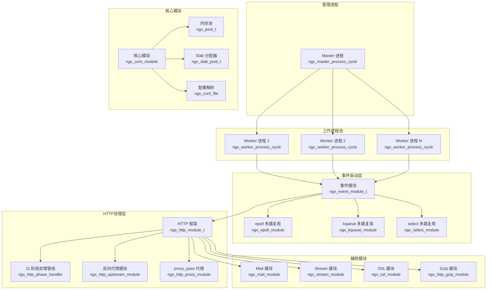

:::important
本文所有源码分析基于 #[R|Nginx 1.24.x]，核心源码路径为 `src/` 目录。所有 Mermaid 图表中标注的结构体名、函数名与配置指令均为真实 API —— 关键源码文件：`src/core/nginx.c` 主入口、`src/os/unix/ngx_process_cycle.c` 进程模型、`src/event/ngx_event.c` 事件驱动、`src/http/ngx_http_core_module.c` HTTP 核心、`src/http/modules/ngx_http_proxy_module.c` 反向代理、`src/http/ngx_http_upstream.c` 负载均衡、`src/event/ngx_event_openssl.c` SSL 处理。
:::

| 层级 | 组件 | 核心职责 | 关键源文件 |
|------|------|----------|------------|
| 进程管理 | Master / Worker | 配置加载、信号管理、Worker 调度 | `src/os/unix/ngx_process_cycle.c` |
| 事件驱动 | epoll / kqueue / select | IO 多路复用、连接事件分发 | `src/event/modules/ngx_epoll_module.c` |
| HTTP 框架 | 11 阶段管线 | 请求解析、阶段处理、响应生成 | `src/http/ngx_http_core_module.c` |
| 反向代理 | upstream + proxy | 后端连接、负载均衡、健康检查 | `src/http/ngx_http_upstream.c` |
| 缓存 | proxy_cache | 磁盘缓存管理、缓存策略 | `src/http/ngx_http_file_cache.c` |
| 限流 | limit_req / limit_conn | 请求频率控制、并发连接限制 | `src/http/modules/ngx_http_limit_req_module.c` |

***

## 场景一：Nginx 架构总览 · Master-Worker 多进程模型与事件驱动

### 1.0 场景概览


| 阶段 | 核心函数 | 关键机制 | 源码位置 |
|------|----------|----------|----------|
| 进程启动 | `ngx_master_process_cycle` | fork Worker 进程、信号处理循环 | `src/os/unix/ngx_process_cycle.c` |
| 事件循环 | `ngx_worker_process_cycle` | 初始化事件模块、进入事件循环 | `src/os/unix/ngx_process_cycle.c` |
| 连接接收 | `ngx_event_accept` | 从监听 socket 接受新连接 | `src/event/ngx_event_accept.c` |
| 请求解析 | `ngx_http_process_request_line` | 解析 HTTP 请求行、请求头 | `src/http/ngx_http_request.c` |
| 阶段处理 | `ngx_http_core_run_phases` | 按顺序执行 11 个处理阶段 | `src/http/ngx_http_core_module.c` |
| 反向代理 | `ngx_http_upstream_send_request` | 连接后端服务器、转发请求 | `src/http/ngx_http_upstream.c` |

### 1.1 Master-Worker 多进程模型

Nginx 采用 **Master-Worker 多进程架构**，这是其高性能和高可靠性的基石。Master 进程负责管理配置、监听信号和控制 Worker 进程的生命周期；Worker 进程负责实际处理客户端请求。每个 Worker 进程是单线程的，通过事件驱动模型处理大量并发连接。

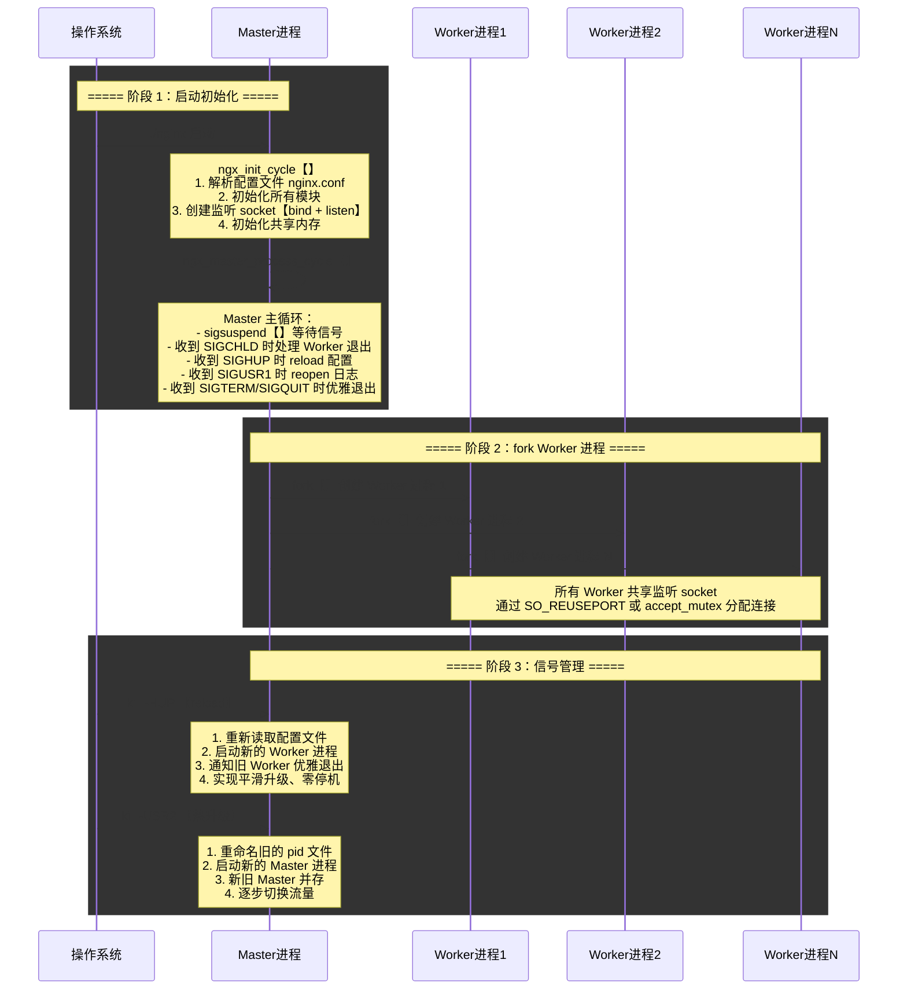

:::important
#[R|Worker 进程数] 建议设置为 CPU 核心数，通过 `worker_processes auto;` 自动检测。每个 Worker 进程是单线程的，避免了多线程锁竞争，充分利用 CPU 亲和性【`worker_cpu_affinity`】绑定核心。Nginx 推荐使用 `accept_mutex off` 配合 `reuseport` 以获得更好的负载均衡效果。
:::

| 配置指令 | 默认值 | 说明 |
|----------|--------|------|
| `worker_processes` | `1` | Worker 进程数，建议 `auto` 或 CPU 核心数 |
| `worker_cpu_affinity` | 无 | CPU 亲和性绑定，避免进程在核心间迁移 |
| `worker_rlimit_nofile` | 系统限制 | Worker 进程最大打开文件数，建议 65535 |
| `worker_shutdown_timeout` | 无 | 优雅关闭超时时间 |
| `accept_mutex` | `off` | 是否使用 accept 互斥锁 |
| `multi_accept` | `off` | 一次 accept 所有新连接 |

### 1.2 事件驱动模型【epoll / kqueue / select】

Nginx 的事件驱动模型是其处理高并发的核心。Linux 下默认使用 epoll，FreeBSD 下使用 kqueue，不支持的平台降级为 select。epoll 通过事件通知机制，一个 Worker 进程可以轻松处理数万并发连接。

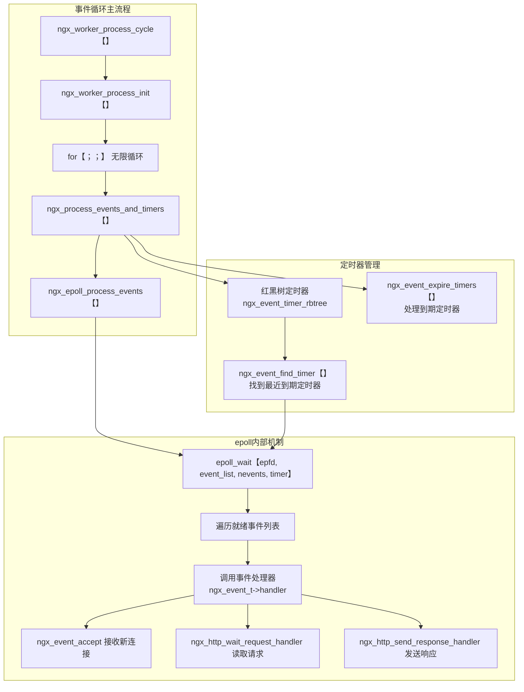

**epoll 模块核心数据结构**【`src/event/modules/ngx_epoll_module.c`】：

```c
// epoll 事件结构封装
typedef struct {
    int                 ep;          // epoll fd
    struct epoll_event *event_list;  // 就绪事件列表
    uint32_t            nevents;     // 每次最大返回事件数
} ngx_epoll_conf_t;

// epoll 模块命令定义
static ngx_command_t  ngx_epoll_commands[] = {
    { ngx_string("epoll_events"),
      NGX_EVENT_CONF|NGX_CONF_TAKE1,
      ngx_conf_set_num_slot,
      0,
      offsetof(ngx_epoll_conf_t, nevents),
      NULL },
    // ...
};

// 核心操作函数指针
static ngx_event_module_t  ngx_epoll_module_ctx = {
    &epoll_name,
    ngx_epoll_create_conf,      // 创建配置
    ngx_epoll_init_conf,        // 初始化配置
    {
        ngx_epoll_add_event,    // 添加事件
        ngx_epoll_del_event,    // 删除事件
        ngx_epoll_add_event,    // 启用事件
        ngx_epoll_del_event,    // 禁用事件
        ngx_epoll_add_connection, // 添加连接
        ngx_epoll_del_connection, // 删除连接
        NULL,                    // 触发方式
        ngx_epoll_process_events, // 处理事件
        ngx_epoll_init,          // 初始化
        ngx_epoll_done,          // 退出
    }
};
```

| epoll 操作 | Nginx 封装函数 | 对应的 epoll 系统调用 |
|------------|---------------|----------------------|
| 创建 epoll 实例 | `ngx_epoll_init` | `epoll_create(cycle->connection_n / 2)` |
| 添加事件 | `ngx_epoll_add_event` | `epoll_ctl(epfd, EPOLL_CTL_ADD, fd, &ee)` |
| 删除事件 | `ngx_epoll_del_event` | `epoll_ctl(epfd, EPOLL_CTL_DEL, fd, &ee)` |
| 修改事件 | `ngx_epoll_add_event` | `epoll_ctl(epfd, EPOLL_CTL_MOD, fd, &ee)` |
| 等待事件 | `ngx_epoll_process_events` | `epoll_wait(epfd, event_list, nevents, timer)` |

**事件处理主循环**：

```c
// src/event/ngx_event.c — 事件处理核心
void ngx_process_events_and_timers(ngx_cycle_t *cycle) {
    ngx_uint_t  flags;
    ngx_msec_t  timer;

    // 1. 找到最近的定时器过期时间
    timer = ngx_event_find_timer();

    // 2. 调用事件模块处理 IO 事件【epoll_wait】
    flags = NGX_UPDATE_TIME;
    (void) ngx_process_events(cycle, timer, flags);

    // 3. 处理已到期的定时器事件
    ngx_event_expire_timers();
}
```

### 1.3 模块化架构

Nginx 采用高度模块化的设计，所有功能都以模块的形式组织。核心模块、事件模块、HTTP 模块、Mail 模块、Stream 模块各有明确的职责边界和接口约定。

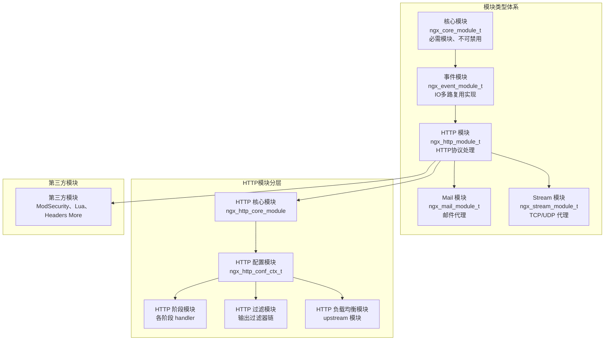

| 模块类型 | 核心结构体 | 注册方式 | 示例 |
|----------|-----------|----------|------|
| 核心模块 | `ngx_core_module_t` | `NGX_CORE_MODULE` 宏 | `ngx_core_module`、`ngx_errlog_module` |
| 事件模块 | `ngx_event_module_t` | `NGX_EVENT_MODULE` 宏 | `ngx_epoll_module`、`ngx_kqueue_module` |
| HTTP 模块 | `ngx_http_module_t` | `NGX_HTTP_MODULE` 宏 | `ngx_http_proxy_module`、`ngx_http_ssl_module` |
| HTTP 过滤模块 | `ngx_http_module_t` | `NGX_HTTP_MODULE` + 过滤链 | `ngx_http_gzip_filter_module` |
| 负载均衡模块 | `ngx_http_upstream_module_t` | 注册到 upstream 模块 | `ngx_http_upstream_ip_hash_module` |

**Nginx 配置示例 —— 进程模型与事件驱动**：

```nginx
# Nginx 主配置文件 nginx.conf
user  nginx;                        # Worker 进程运行用户
worker_processes  auto;             # 自动检测 CPU 核心数
worker_cpu_affinity auto;           # 自动绑定 CPU 亲和性
worker_rlimit_nofile 65535;         # 最大打开文件数

# 错误日志
error_log  /var/log/nginx/error.log  warn;
pid        /var/run/nginx.pid;

# 事件模块配置
events {
    use epoll;                      # 使用 epoll 事件模型
    worker_connections  65535;      # 每个 Worker 最大连接数
    multi_accept on;                # 一次接受所有新连接
    accept_mutex off;               # 关闭 accept 互斥锁
}

# HTTP 模块配置
http {
    include       /etc/nginx/mime.types;
    default_type  application/octet-stream;

    # 基础优化
    sendfile        on;
    tcp_nopush      on;
    tcp_nodelay     on;

    # 连接超时
    keepalive_timeout  65;
    client_header_timeout  10;
    client_body_timeout    10;
    send_timeout           10;

    # 引入虚拟主机配置
    include /etc/nginx/conf.d/*.conf;
}
```

:::warning
#[R|`worker_connections` 决定每个 Worker 进程的最大并发连接数]。Nginx 的最大并发连接数计算公式为：`worker_processes × worker_connections`。但需要注意，反向代理场景下每个客户端连接会消耗 2 个连接【客户端→Nginx、Nginx→后端】，因此实际可支持的客户端连接数需减半计算。
:::

***

## 场景二：HTTP 请求处理全链路 · 11 阶段处理管线

### 2.0 场景概览

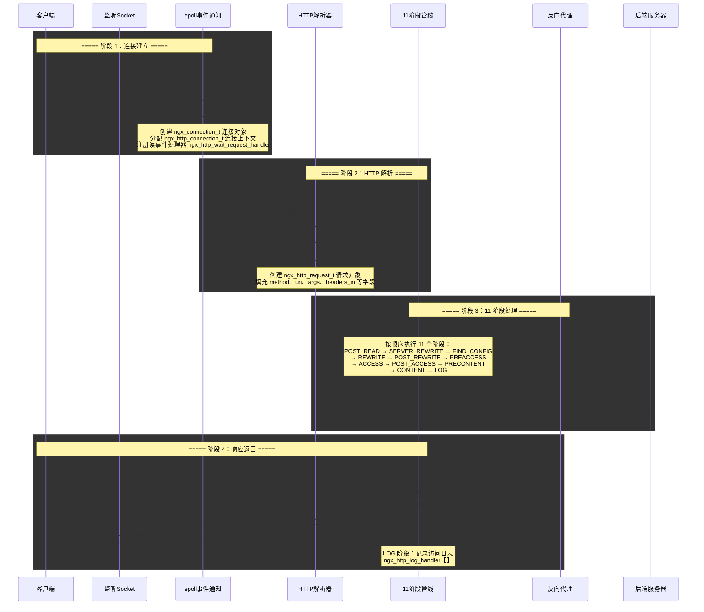

### 2.1 HTTP 11 阶段处理管线详解

Nginx 将 HTTP 请求处理划分为 11 个有序阶段，每个阶段有自己特定的 Hook 点模块可以在其中注册 handler。这种设计允许模块在请求处理的不同阶段插入自定义逻辑，实现了高度的可扩展性。

```mermaid
graph TB
    subgraph HTTP11阶段处理管线
        P1["POST_READ<br/>ngx_http_realip_module<br/>读取完请求头后"]
        P2["SERVER_REWRITE<br/>ngx_http_rewrite_module<br/>server上下文重写"]
        P3["FIND_CONFIG<br/>匹配 location 配置块"]
        P4["REWRITE<br/>ngx_http_rewrite_module<br/>location上下文重写"]
        P5["POST_REWRITE<br/>检查是否发生了重写<br/>若发生则跳回 FIND_CONFIG"]
        P6["PREACCESS<br/>ngx_http_limit_req_module<br/>ngx_http_limit_conn_module<br/>访问控制预处理"]
        P7["ACCESS<br/>ngx_http_access_module<br/>ngx_http_auth_basic_module<br/>访问权限控制"]
        P8["POST_ACCESS<br/>satisfy 指令处理<br/>401/403 错误响应"]
        P9["PRECONTENT<br/>ngx_http_try_files_module<br/>ngx_http_mirror_module<br/>内容生成前准备"]
        P10["CONTENT<br/>ngx_http_index_module<br/>ngx_http_autoindex_module<br/>ngx_http_proxy_module<br/>ngx_http_fastcgi_module<br/>实际内容生成"]
        P11["LOG<br/>ngx_http_log_module<br/>记录访问日志"]
    end

    P1 --> P2
    P2 --> P3
    P3 --> P4
    P4 --> P5
    P5 --> P3
    P5 --> P6
    P6 --> P7
    P7 --> P8
    P8 --> P9
    P9 --> P10
    P10 --> P11
```

| 阶段 | 枚举值 | 核心 Hook 模块 | 功能说明 |
|------|--------|---------------|----------|
| `POST_READ` | `NGX_HTTP_POST_READ_PHASE` | `realip` | 读取完请求头后，可用于获取真实客户端 IP |
| `SERVER_REWRITE` | `NGX_HTTP_SERVER_REWRITE_PHASE` | `rewrite` | server 块中的 rewrite 规则，修改 URI |
| `FIND_CONFIG` | `NGX_HTTP_FIND_CONFIG_PHASE` | 核心框架 | 匹配 location 配置块，不可注册模块 |
| `REWRITE` | `NGX_HTTP_REWRITE_PHASE` | `rewrite` | location 块中的 rewrite 规则，修改 URI |
| `POST_REWRITE` | `NGX_HTTP_POST_REWRITE_PHASE` | 核心框架 | 检查 URI 是否被重写，若重写则跳回 FIND_CONFIG |
| `PREACCESS` | `NGX_HTTP_PREACCESS_PHASE` | `limit_req`、`limit_conn` | 访问控制前预处理，限流检查 |
| `ACCESS` | `NGX_HTTP_ACCESS_PHASE` | `access`、`auth_basic`、`auth_request` | 访问权限控制，IP 白名单、认证 |
| `POST_ACCESS` | `NGX_HTTP_POST_ACCESS_PHASE` | 核心框架 | 处理 satisfy 指令逻辑 |
| `PRECONTENT` | `NGX_HTTP_PRECONTENT_PHASE` | `try_files`、`mirror` | 内容生成前的准备，尝试静态文件 |
| `CONTENT` | `NGX_HTTP_CONTENT_PHASE` | `index`、`autoindex`、`proxy`、`fastcgi` | 实际内容生成，反向代理或静态文件服务 |
| `LOG` | `NGX_HTTP_LOG_PHASE` | `log` | 记录访问日志，请求处理收尾 |

**阶段处理核心代码**【`src/http/ngx_http_core_module.c`】：

```c
void ngx_http_core_run_phases(ngx_http_request_t *r) {
    ngx_int_t                   rc;
    ngx_http_phase_handler_t   *ph;
    ngx_http_core_main_conf_t  *cmcf;

    cmcf = ngx_http_get_module_main_conf(r, ngx_http_core_module);

    ph = cmcf->phase_engine.handlers;

    // 从当前阶段索引开始，依次执行所有阶段
    while (ph[r->phase_handler].checker) {

        rc = ph[r->phase_handler].checker(r, &ph[r->phase_handler]);

        if (rc == NGX_OK) {
            // 正常返回，继续处理下一个 handler
            // 如果到了阶段末尾，phase_handler 指向下一个阶段
            continue;
        }

        if (rc == NGX_DECLINED) {
            // 该 handler 不处理此请求，继续下一个
            continue;
        }

        if (rc == NGX_AGAIN || rc == NGX_DONE) {
            // 需要等待 IO，暂停阶段处理
            return;
        }

        // 其他返回值【NGX_ERROR、NGX_HTTP_*】终止处理
        ngx_http_finalize_request(r, rc);
        return;
    }
}
```

### 2.2 请求处理各阶段实战配置

**POST_READ 阶段 —— 获取真实客户端 IP**：

```nginx
# 在反向代理后面获取真实客户端 IP
server {
    listen 80;
    
    # POST_READ 阶段：realip 模块
    set_real_ip_from  10.0.0.0/8;       # 信任的代理 IP 段
    set_real_ip_from  172.16.0.0/12;
    set_real_ip_from  192.168.0.0/16;
    real_ip_header    X-Forwarded-For;   # 从哪个 Header 获取真实 IP
    real_ip_recursive on;                # 递归查找信任链中的第一个非信任 IP
}
```

**REWRITE 阶段 —— URL 重写**：

```nginx
server {
    listen 80;
    server_name example.com;

    # SERVER_REWRITE 阶段
    rewrite ^/old-api/(.*)$ /new-api/$1 permanent;  # 永久重定向

    location / {
        # REWRITE 阶段
        rewrite ^/user/(\d+)$ /profile?id=$1 last;  # 内部重写
        proxy_pass http://backend;
    }

    location /api/ {
        rewrite ^/api/v1/(.*)$ /api/v2/$1 break;    # 重写后不重新匹配 location
        proxy_pass http://api_backend;
    }
}
```

| rewrite 标志 | 行为 | 适用场景 |
|-------------|------|----------|
| `last` | 停止当前 rewrite，用新 URI 重新匹配 location | 需要重新匹配 location 块 |
| `break` | 停止 rewrite，继续在当前 location 中处理 | 不改变 location 上下文 |
| `redirect` | 返回 302 临时重定向 | 临时 URL 变更 |
| `permanent` | 返回 301 永久重定向 | SEO 友好的 URL 变更 |

**ACCESS 阶段 —— 访问控制**：

```nginx
server {
    listen 80;

    # PREACCESS 阶段：限流
    limit_req_zone $binary_remote_addr zone=api_limit:10m rate=10r/s;
    limit_conn_zone $binary_remote_addr zone=conn_limit:10m;

    # ACCESS 阶段：IP 黑白名单
    location /admin/ {
        allow  192.168.1.0/24;    # 允许内网
        allow  10.0.0.0/8;        # 允许 VPN 网段
        deny   all;               # 禁止其他所有 IP
        proxy_pass http://admin_backend;
    }

    # ACCESS 阶段：HTTP 基本认证
    location /private/ {
        auth_basic           "Restricted Area";
        auth_basic_user_file /etc/nginx/.htpasswd;
        proxy_pass http://private_backend;
    }

    # ACCESS 阶段：子请求认证
    location /secure/ {
        auth_request /auth;       # 子请求到 /auth 进行认证
        proxy_pass http://secure_backend;
    }

    location = /auth {
        internal;                 # 仅内部子请求可用
        proxy_pass http://auth_service/verify;
        proxy_pass_request_body off;
        proxy_set_header Content-Length "";
    }
}
```

**PRECONTENT 阶段 —— try_files 与 mirror**：

```nginx
server {
    listen 80;

    # PRECONTENT 阶段：try_files 先尝试静态文件
    location / {
        try_files $uri $uri/ /index.html;  # SPA 前端路由回退
    }

    location /images/ {
        try_files $uri @image_backend;     # 文件不存在则走代理
    }

    location @image_backend {
        proxy_pass http://image_server;
    }

    # PRECONTENT 阶段：流量镜像【复制请求到测试环境】
    location /api/ {
        mirror /mirror_api;               # 镜像请求到 /mirror_api
        mirror_request_body on;           # 同时镜像请求体
        proxy_pass http://production_backend;
    }

    location = /mirror_api {
        internal;
        proxy_pass http://test_backend;   # 镜像流量发送到测试环境
    }
}
```

### 2.3 输出过滤器链

Nginx 在生成响应内容后，通过一条 **输出过滤器链** 对响应进行加工处理。过滤器链按顺序执行，每个过滤器可以修改响应头和响应体。


| 过滤器 | 类型 | 功能 | 相关指令 |
|--------|------|------|----------|
| `not_modified` | Header | 处理 If-Modified-Since，返回 304 | `if_modified_since` |
| `range` | Header + Body | 处理 Range 请求，断点续传 | `max_ranges` |
| `charset` | Header + Body | 字符集转换 | `charset`、`charset_types` |
| `gzip` | Header + Body | Gzip 压缩响应 | `gzip`、`gzip_types` |
| `copy` | Body | 文件复制优化，支持 sendfile | `sendfile`、`output_buffers` |
| `ssi` | Body | Server Side Include 处理 | `ssi`、`ssi_types` |
| `write` | Body | 将数据写入客户端 socket | `sendfile_max_chunk` |

***

## 场景三：反向代理与负载均衡

### 3.0 场景概览

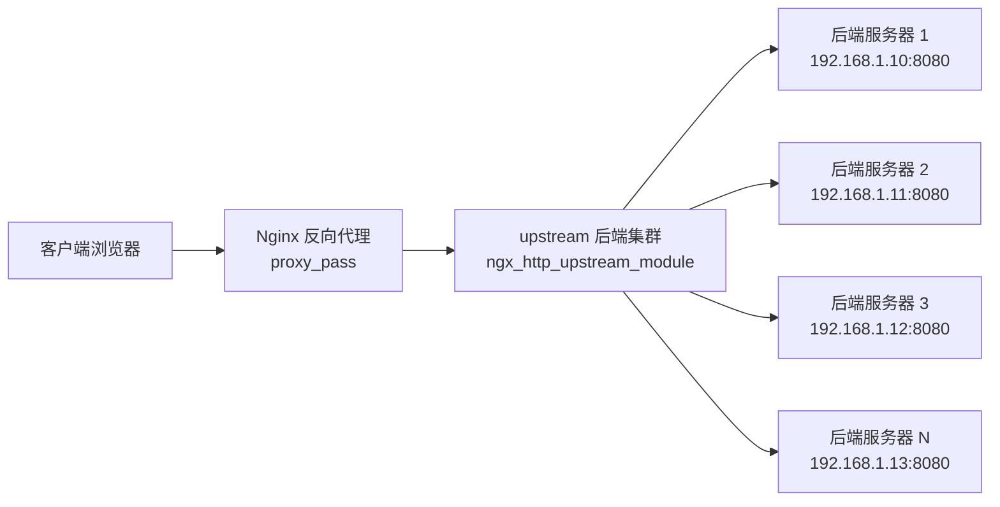

### 3.1 proxy_pass 配置详解

`proxy_pass` 是 Nginx 反向代理的核心指令，它将请求转发到指定的后端服务器。URL 中是否包含 URI 路径决定了请求 URI 的转发行为。

```nginx
# 场景 1：proxy_pass 包含 URI 路径【替换匹配部分】
location /api/ {
    proxy_pass http://backend/v1/;
    # 请求 /api/user/list → 转发为 /v1/user/list
    # 匹配的 /api/ 被替换为 /v1/
}

# 场景 2：proxy_pass 不包含 URI 路径【原样转发】
location /api/ {
    proxy_pass http://backend;
    # 请求 /api/user/list → 转发为 /api/user/list
    # 完整 URI 原样转发
}

# 场景 3：正则 location 中的 proxy_pass【不能包含 URI】
location ~ ^/user/(\d+)$ {
    proxy_pass http://backend;  # 正确：不能包含 URI
    # proxy_pass http://backend/;  # 错误：正则 location 中 proxy_pass 不能有 URI
}

# 场景 4：使用变量动态指定后端
location /api/ {
    set $backend "http://backend_server";
    proxy_pass $backend;
    # 当 proxy_pass 使用变量时，不会自动处理 URI 替换
}
```

**proxy_pass 的核心代理指令**：

```nginx
location /api/ {
    proxy_pass http://backend;

    # ========== 请求头传递 ==========
    proxy_set_header Host              $host;
    proxy_set_header X-Real-IP         $remote_addr;
    proxy_set_header X-Forwarded-For   $proxy_add_x_forwarded_for;
    proxy_set_header X-Forwarded-Proto $scheme;
    proxy_set_header X-Forwarded-Host  $host;
    proxy_set_header X-Forwarded-Port  $server_port;
    proxy_set_header Upgrade           $http_upgrade;          # WebSocket 升级
    proxy_set_header Connection        "upgrade";              # WebSocket 连接

    # ========== 缓冲设置 ==========
    proxy_buffering            on;           # 启用代理缓冲
    proxy_buffer_size          4k;           # 响应头缓冲区大小
    proxy_buffers              8 4k;         # 响应体缓冲区数量和大小
    proxy_busy_buffers_size    8k;           # 忙碌缓冲区大小
    proxy_max_temp_file_size   1024m;        # 临时文件最大大小
    proxy_temp_file_write_size 8k;           # 临时文件写入块大小

    # ========== 超时设置 ==========
    proxy_connect_timeout   60s;             # 连接后端超时
    proxy_send_timeout      60s;             # 发送请求到后端超时
    proxy_read_timeout      60s;             # 读取后端响应超时
    proxy_next_upstream_timeout 0;           # 重试其他后端超时

    # ========== 重试与错误处理 ==========
    proxy_next_upstream error timeout invalid_header http_500 http_502 http_503 http_504;
    proxy_next_upstream_tries 3;             # 最多重试 3 个后端

    # ========== 请求体 ==========
    client_max_body_size     100m;           # 最大请求体大小
    proxy_set_body           $request_body;  # 显式设置请求体

    # ========== 连接复用 ==========
    proxy_http_version 1.1;                  # 使用 HTTP/1.1
    proxy_set_header Connection "";          # 清空 Connection 头，启用 keepalive
}
```

| 代理指令 | 默认值 | 说明 |
|----------|--------|------|
| `proxy_pass` | — | 指定后端服务器地址 |
| `proxy_set_header` | 部分默认 | 设置转发到后端的请求头 |
| `proxy_connect_timeout` | `60s` | 与后端建立连接的超时时间 |
| `proxy_send_timeout` | `60s` | 向后端发送请求的超时时间 |
| `proxy_read_timeout` | `60s` | 从后端读取响应的超时时间 |
| `proxy_buffering` | `on` | 是否启用代理缓冲 |
| `proxy_buffer_size` | `4k\|8k` | 响应头缓冲区大小 |
| `proxy_buffers` | `8 4k\|8k` | 响应体缓冲区数量和大小 |
| `proxy_next_upstream` | `error timeout` | 何时将请求重试到下一个后端 |
| `proxy_http_version` | `1.0` | 与后端通信的 HTTP 版本 |
| `proxy_redirect` | `default` | 修改后端返回的 Location/Refresh 头 |

### 3.2 负载均衡算法

Nginx 提供了多种负载均衡算法，默认使用加权轮询【weighted round-robin】。不同算法适用于不同的业务场景。

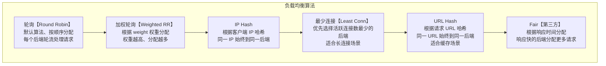

**加权轮询配置**：

```nginx
upstream backend {
    server 192.168.1.10:8080 weight=5;   # 权重 5
    server 192.168.1.11:8080 weight=3;   # 权重 3
    server 192.168.1.12:8080 weight=2;   # 权重 2
    server 192.168.1.13:8080 backup;     # 备用服务器【仅当其他都不可用时】
}
```

**IP Hash 配置**：

```nginx
upstream backend {
    ip_hash;  # 启用 IP Hash 算法

    server 192.168.1.10:8080;
    server 192.168.1.11:8080;
    server 192.168.1.12:8080;
}
```

**最少连接配置**：

```nginx
upstream backend {
    least_conn;  # 启用最少连接算法

    server 192.168.1.10:8080 weight=5;
    server 192.168.1.11:8080 weight=3;
    server 192.168.1.12:8080 weight=2;
}
```

**URL Hash 配置**：

```nginx
upstream backend {
    hash $request_uri consistent;  # 一致性哈希、减少节点变更时的重映射

    server 192.168.1.10:8080;
    server 192.168.1.11:8080;
    server 192.168.1.12:8080;
}
```

| 算法 | 指令 | 适用场景 | 优缺点 |
|------|------|----------|--------|
| 轮询 | 默认 | 无状态服务、后端性能相近 | 简单高效，但无法处理性能差异 |
| 加权轮询 | `weight=N` | 后端性能不均衡 | 灵活分配，但无法感知后端实时负载 |
| IP Hash | `ip_hash` | 需要会话保持 | 同一 IP 固定后端，但扩缩容影响大 |
| 最少连接 | `least_conn` | 长连接、WebSocket | 动态感知负载，但需要额外计数器 |
| URL Hash | `hash $request_uri` | CDN 缓存、静态资源 | 缓存命中率高，但热点 URL 可能不均衡 |
| Consistent Hash | `hash ... consistent` | 缓存集群 | 节点变更时影响最小 |
| Fair | 第三方模块 | 响应时间敏感 | 智能分配，但需要额外编译模块 |

**Server 指令参数详解**：

```nginx
upstream backend {
    # 完整 server 参数
    server 192.168.1.10:8080 weight=5 max_fails=3 fail_timeout=30s max_conns=1000;
    
    # weight：权重，默认 1
    # max_fails：最大失败次数，默认 1【0 表示禁用】
    # fail_timeout：失败超时时间，默认 10s
    # max_conns：最大并发连接数，默认 0 表示无限制
    # backup：标记为备用服务器
    # down：标记为永久下线
    # slow_start：慢启动时间【商业版功能】
    # resolve：动态解析域名
    # route：用于一致性哈希的路由标识
}
```

### 3.3 健康检查

Nginx 的健康检查分为 **被动健康检查** 和 **主动健康检查** 两种模式。

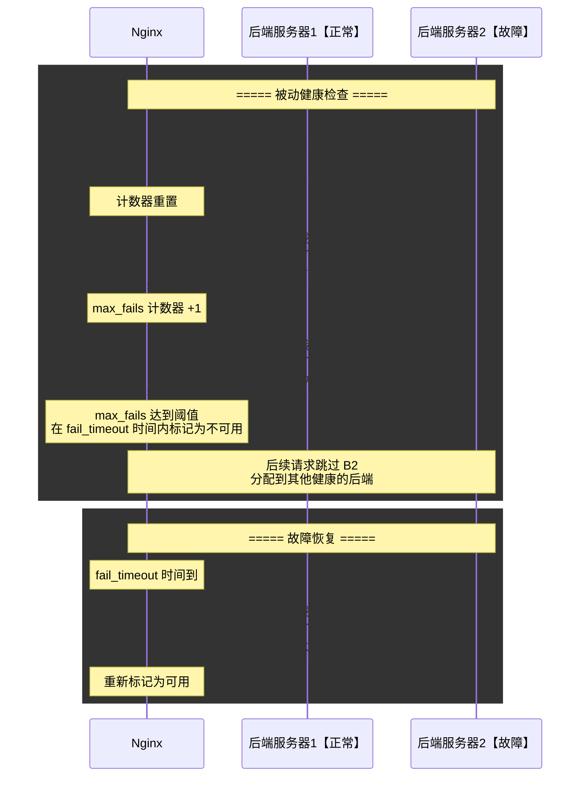

**被动健康检查配置**：

```nginx
upstream backend {
    server 192.168.1.10:8080 max_fails=3 fail_timeout=30s;
    server 192.168.1.11:8080 max_fails=3 fail_timeout=30s;
    server 192.168.1.12:8080 max_fails=3 fail_timeout=30s;
    # max_fails=3：30 秒内失败 3 次则标记为不可用
    # fail_timeout=30s：标记不可用 30 秒后重新尝试
}
```

**主动健康检查【Nginx Plus 商业版】**：

```nginx
upstream backend {
    zone backend 64k;  # 共享内存区域

    server 192.168.1.10:8080;
    server 192.168.1.11:8080;
    server 192.168.1.12:8080;
}

server {
    location / {
        proxy_pass http://backend;
        
        # 主动健康检查【Nginx Plus】
        health_check interval=5s fails=3 passes=2 uri=/health;
        # interval=5s：每 5 秒检查一次
        # fails=3：连续 3 次失败标记不可用
        # passes=2：连续 2 次成功重新标记可用
        # uri=/health：健康检查的请求路径
    }
}
```

### 3.4 keepalive 连接复用

Nginx 与后端服务器之间的 keepalive 连接复用，可以避免频繁创建和销毁 TCP 连接，显著降低延迟和资源消耗。

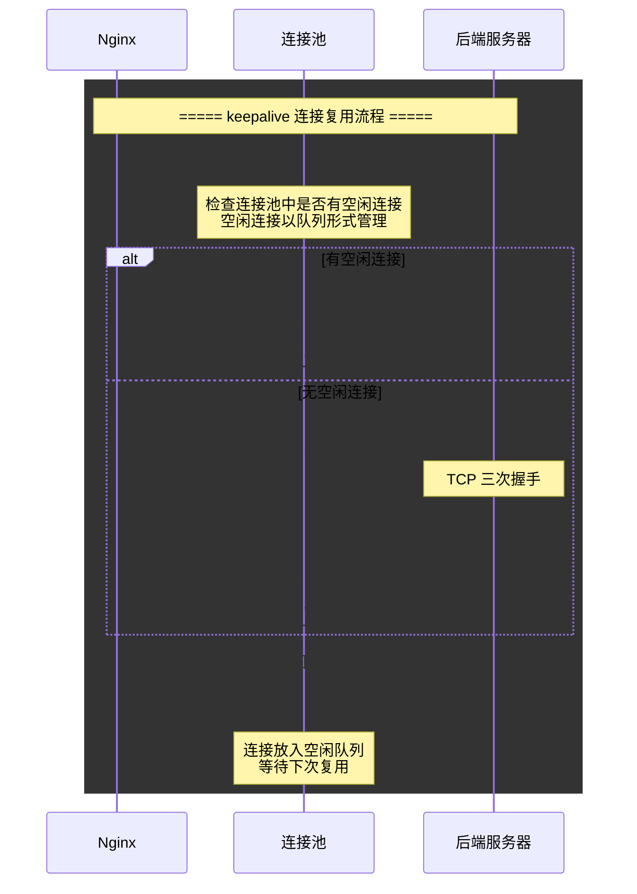

**keepalive 连接复用配置**：

```nginx
upstream backend {
    server 192.168.1.10:8080;
    server 192.168.1.11:8080;
    server 192.168.1.12:8080;

    # keepalive 连接池配置
    keepalive 32;                     # 每个 Worker 进程保持的空闲连接数
    keepalive_timeout 60s;            # 空闲连接保持时间
    keepalive_requests 1000;          # 单个连接最大请求数
    keepalive_time 1h;                # 连接最大存活时间【商业版】
}

server {
    location / {
        proxy_pass http://backend;
        
        # 必须使用 HTTP/1.1 才能启用 keepalive
        proxy_http_version 1.1;
        proxy_set_header Connection "";
    }
}
```

| keepalive 指令 | 默认值 | 说明 |
|----------------|--------|------|
| `keepalive` | 无 | 每个 Worker 进程到 upstream 的最大空闲连接数 |
| `keepalive_timeout` | `60s` | 空闲连接的超时时间 |
| `keepalive_requests` | `1000` | 单个连接可处理的最大请求数 |
| `keepalive_time` | `1h` | 连接最大存活时间【商业版】 |

:::warning
#[R|启用 keepalive 必须同时设置 `proxy_http_version 1.1` 和 `proxy_set_header Connection ""`]。Nginx 默认使用 HTTP/1.0 与后端通信，HTTP/1.0 默认不支持 keepalive。如果不设置这两个指令，keepalive 配置不会生效，每个请求仍会创建新的 TCP 连接。
:::

***

## 场景四：SSL/TLS 终止

### 4.0 场景概览

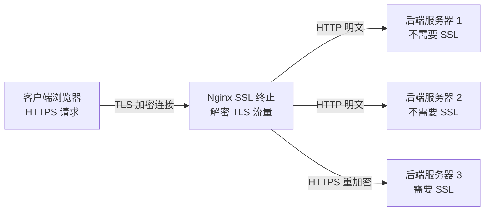

### 4.1 HTTPS 配置完整示例

```nginx
server {
    listen 443 ssl http2;
    server_name example.com;

    # ========== 证书配置 ==========
    ssl_certificate         /etc/nginx/ssl/example.com.pem;      # 证书链文件
    ssl_certificate_key     /etc/nginx/ssl/example.com.key;      # 私钥文件
    ssl_trusted_certificate /etc/nginx/ssl/example.com.chain.pem; # OCSP Stapling 证书链

    # ========== 协议版本 ==========
    ssl_protocols TLSv1.2 TLSv1.3;  # 仅启用 TLS 1.2 和 TLS 1.3
    # 禁用不安全的 TLSv1 TLSv1.1【BEAST/POODLE 攻击】

    # ========== 加密套件 ==========
    ssl_ciphers 'ECDHE-ECDSA-AES128-GCM-SHA256:ECDHE-RSA-AES128-GCM-SHA256:ECDHE-ECDSA-AES256-GCM-SHA384:ECDHE-RSA-AES256-GCM-SHA384:ECDHE-ECDSA-CHACHA20-POLY1305:ECDHE-RSA-CHACHA20-POLY1305';
    ssl_prefer_server_ciphers on;  # 优先使用服务器端加密套件

    # ========== 会话缓存 ==========
    ssl_session_cache    shared:SSL:10m;  # 10MB 共享会话缓存【约 40000 个会话】
    ssl_session_timeout  10m;             # 会话超时时间
    ssl_session_tickets  on;              # 启用 Session Ticket

    # ========== OCSP Stapling ==========
    ssl_stapling on;
    ssl_stapling_verify on;
    resolver 8.8.8.8 8.8.4.4 valid=300s;
    resolver_timeout 5s;

    # ========== 安全增强 ==========
    ssl_dhparam /etc/nginx/ssl/dhparam.pem;  # DH 参数【2048 位】
    ssl_ecdh_curve auto;                      # ECDH 曲线

    # ========== HSTS【HTTP Strict Transport Security】==========
    add_header Strict-Transport-Security "max-age=63072000; includeSubDomains; preload" always;

    # ========== 其他安全头 ==========
    add_header X-Frame-Options "SAMEORIGIN" always;
    add_header X-Content-Type-Options "nosniff" always;
    add_header X-XSS-Protection "1; mode=block" always;

    location / {
        proxy_pass http://backend;
        proxy_set_header X-Forwarded-Proto https;  # 告诉后端原始协议是 HTTPS
    }
}

# HTTP 到 HTTPS 强制跳转
server {
    listen 80;
    server_name example.com;
    return 301 https://$host$request_uri;
}
```

### 4.2 TLS 握手流程

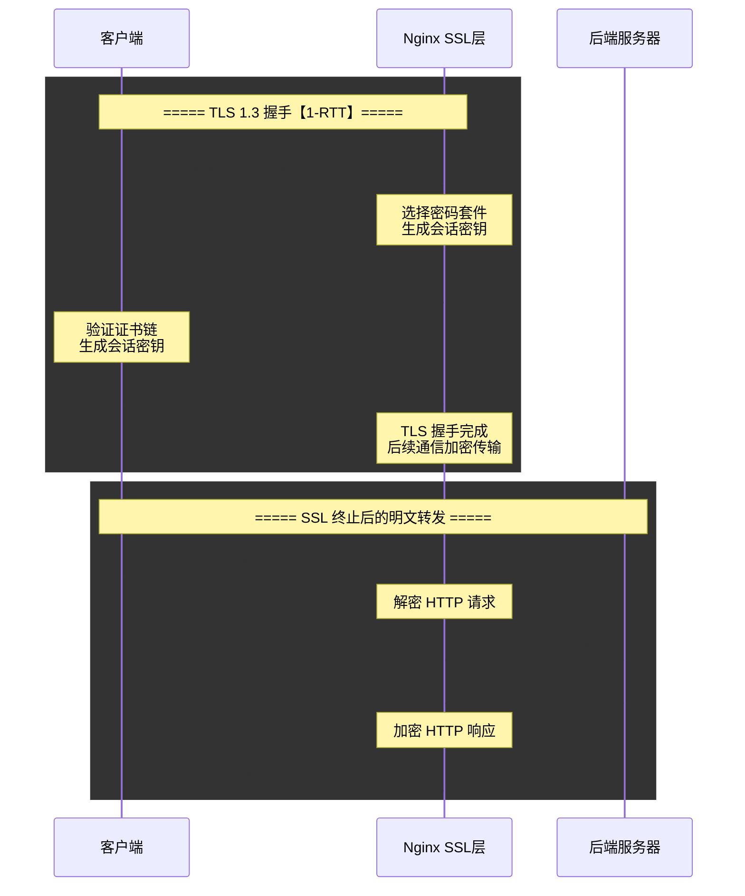

| SSL 指令 | 推荐值 | 说明 |
|----------|--------|------|
| `ssl_protocols` | `TLSv1.2 TLSv1.3` | 禁用 TLS 1.0/1.1【PCI DSS 合规】 |
| `ssl_ciphers` | ECDHE 系列优先 | 优先使用前向安全的 ECDHE 密钥交换 |
| `ssl_session_cache` | `shared:SSL:10m` | 共享内存会话缓存，加速 TLS 恢复 |
| `ssl_session_timeout` | `10m` | 会话缓存有效期 |
| `ssl_session_tickets` | `on` | 启用 Session Ticket 减少握手次数 |
| `ssl_stapling` | `on` | OCSP Stapling 减少客户端证书验证延迟 |
| `ssl_dhparam` | 2048 位 DH 参数 | 增强 DH 密钥交换安全性 |
| `ssl_prefer_server_ciphers` | `on` | 由服务器决定加密套件优先级 |

### 4.3 HTTP/2 支持

```nginx
server {
    # 同时启用 HTTP/2
    listen 443 ssl http2;
    server_name example.com;

    # HTTP/2 相关配置
    http2_max_concurrent_streams 128;      # 最大并发流数
    http2_max_field_size 4k;               # 最大 Header 字段大小
    http2_max_header_size 16k;             # 最大请求头大小
    http2_body_preread_size 64k;           # 请求体预读缓冲区
    http2_idle_timeout 3m;                 # 空闲连接超时
    http2_recv_timeout 30s;                # 接收超时

    location / {
        proxy_pass http://backend;
    }
}
```

### 4.4 双向 SSL 认证【mTLS】

```nginx
server {
    listen 443 ssl;
    server_name api.example.com;

    # 服务器证书
    ssl_certificate     /etc/nginx/ssl/api_server.pem;
    ssl_certificate_key /etc/nginx/ssl/api_server.key;

    # 客户端证书验证
    ssl_client_certificate  /etc/nginx/ssl/ca.pem;   # 客户端 CA 证书
    ssl_verify_client       on;                       # 开启客户端证书验证
    ssl_verify_depth        2;                        # 证书链验证深度

    # 将客户端证书信息传递给后端
    location / {
        proxy_pass http://backend;
        proxy_set_header X-SSL-Client-Cert $ssl_client_escaped_cert;
        proxy_set_header X-SSL-Client-DN   $ssl_client_s_dn;
        proxy_set_header X-SSL-Client-Verify $ssl_client_verify;
    }
}
```

| mTLS 变量 | 含义 |
|-----------|------|
| `$ssl_client_verify` | 客户端证书验证结果【SUCCESS / FAILED / NONE】 |
| `$ssl_client_s_dn` | 客户端证书的 Subject DN |
| `$ssl_client_i_dn` | 客户端证书的 Issuer DN |
| `$ssl_client_serial` | 客户端证书的序列号 |
| `$ssl_client_fingerprint` | 客户端证书的 SHA1 指纹 |
| `$ssl_client_escaped_cert` | URL 编码的完整客户端证书 |

***

## 场景五：缓存机制

### 5.0 场景概览

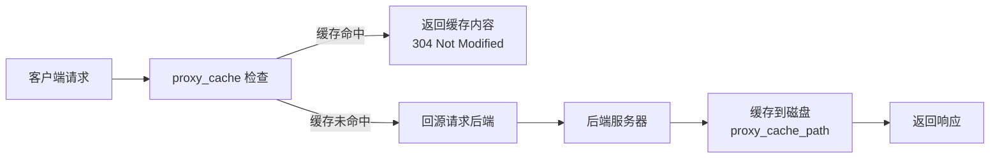

### 5.1 缓存配置详解

```nginx
http {
    # 定义缓存路径和参数
    proxy_cache_path /data/nginx/cache
                     levels=1:2                     # 两级目录哈希
                     keys_zone=my_cache:10m         # 共享内存区域名称和大小
                     max_size=10g                   # 最大缓存总大小
                     inactive=60m                   # 未访问缓存有效期
                     use_temp_path=off              # 避免临时文件复制
                     loader_files=100               # 缓存加载器每次加载文件数
                     loader_sleep=50ms              # 加载器休眠间隔
                     loader_threshold=200ms;        # 加载器工作阈值

    # 定义缓存键【排除不需要的部分】
    proxy_cache_key "$scheme$proxy_host$request_uri$cookie_user";

    server {
        listen 80;
        server_name example.com;

        location /api/ {
            proxy_pass http://backend;

            # 启用缓存
            proxy_cache my_cache;                  # 使用 my_cache 缓存区域
            proxy_cache_valid 200 302 10m;         # 200/302 响应缓存 10 分钟
            proxy_cache_valid 404      1m;         # 404 响应缓存 1 分钟
            proxy_cache_valid any      0;          # 其他响应不缓存
            proxy_cache_methods GET HEAD;          # 仅缓存 GET 和 HEAD 请求

            # 缓存状态头
            add_header X-Cache-Status $upstream_cache_status;

            # 后台更新缓存【启用 stale-while-revalidate】
            proxy_cache_background_update on;
            proxy_cache_use_stale error timeout updating http_500 http_502 http_503 http_504;

            # 缓存锁【防止缓存击穿】
            proxy_cache_lock on;
            proxy_cache_lock_age 5s;
            proxy_cache_lock_timeout 5s;

            # 缓存绕过
            proxy_cache_bypass $http_cache_control;  # 根据请求头跳过缓存
            proxy_no_cache $http_authorization;      # 有认证头不缓存
        }
    }
}
```

| 缓存指令 | 默认值 | 说明 |
|----------|--------|------|
| `proxy_cache_path` | 无 | 定义缓存存储路径和参数 |
| `proxy_cache` | 无 | 指定使用的缓存区域 |
| `proxy_cache_key` | `$scheme$proxy_host$request_uri` | 缓存键的组成 |
| `proxy_cache_valid` | 无 | 不同响应码的缓存时间 |
| `proxy_cache_methods` | `GET HEAD` | 允许缓存的 HTTP 方法 |
| `proxy_cache_min_uses` | `1` | 请求多少次后才缓存 |
| `proxy_cache_lock` | `off` | 缓存锁，防止缓存击穿 |
| `proxy_cache_bypass` | 无 | 跳过缓存直接回源的条件 |
| `proxy_no_cache` | 无 | 不缓存响应的条件 |
| `proxy_cache_background_update` | `off` | 后台更新过期缓存 |
| `proxy_cache_use_stale` | `off` | 后端不可用时使用过期缓存 |
| `proxy_cache_revalidate` | `off` | 使用 If-Modified-Since 验证缓存 |

### 5.2 缓存状态变量

Nginx 提供了 `$upstream_cache_status` 变量来指示缓存命中的状态，这对于调试和监控非常有用。

| 缓存状态 | 含义 |
|----------|------|
| `MISS` | 缓存未命中，请求发送到后端 |
| `BYPASS` | 缓存被绕过，请求发送到后端 |
| `EXPIRED` | 缓存已过期，请求发送到后端验证 |
| `STALE` | 使用过期缓存【后端不可用】 |
| `UPDATING` | 使用过期缓存【后台正在更新】 |
| `REVALIDATED` | 缓存已通过 If-Modified-Since 验证 |
| `HIT` | 缓存命中，直接返回缓存内容 |

### 5.3 缓存清除

```nginx
# 方法 1：使用 proxy_cache_purge 模块【需要编译 ngx_cache_purge 模块】
location ~ /purge(/.*) {
    allow 127.0.0.1;
    deny  all;
    proxy_cache_purge my_cache $scheme$proxy_host$1$is_args$args;
}
# 请求：curl http://localhost/purge/api/user/list
# 清除 /api/user/list 的缓存

# 方法 2：使用 Lua 脚本清除缓存【需要 OpenResty / ngx_http_lua_module】
location /purge_cache {
    allow 127.0.0.1;
    deny  all;
    content_by_lua_block {
        local cache_key = ngx.var.scheme .. ngx.var.proxy_host .. ngx.var.arg_uri
        ngx.shared.my_cache:delete(cache_key)
        ngx.say("Cache purged for: " .. cache_key)
    }
}

# 方法 3：直接删除缓存文件
# 缓存文件路径：/data/nginx/cache/c/29/b7f54b2df7773722d382f4809d65029c
# 根据 proxy_cache_key 的 MD5 哈希定位文件
# rm -rf /data/nginx/cache/*
```

### 5.4 缓存层级架构

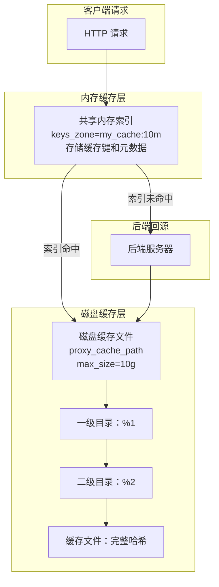

:::note
#[C|Nginx 缓存采用两级目录结构] 避免单个目录下文件过多。`levels=1:2` 表示取缓存键 MD5 的最后 1 个字符作为一级目录，再取前 2 个字符作为二级目录。例如缓存键的 MD5 为 `b7f54b2df7773722d382f4809d65029c`，则文件路径为 `c/29/b7f54b2df7773722d382f4809d65029c`。
:::

***

## 场景六：限流与安全

### 6.0 场景概览

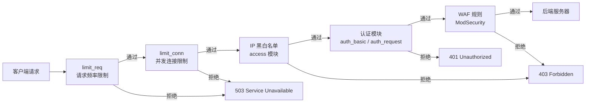

### 6.1 请求频率限制【limit_req】

Nginx 使用 **漏桶算法【Leaky Bucket】** 实现请求频率限制，平滑突发流量。

```nginx
http {
    # 定义限流共享内存区域
    # $binary_remote_addr：使用二进制 IP 地址作为键【比 $remote_addr 节省空间】
    # zone=req_limit:10m：10MB 共享内存，约可存储 160000 个 IP 的限流状态
    # rate=10r/s：每秒允许 10 个请求
    limit_req_zone $binary_remote_addr zone=req_limit:10m rate=10r/s;

    # 按请求路径限流
    limit_req_zone $binary_remote_addr zone=api_limit:10m rate=100r/m;

    server {
        location /api/ {
            # 基本限流：超出限制返回 503
            limit_req zone=api_limit burst=20 nodelay;
            # burst=20：允许 20 个请求的突发队列
            # nodelay：突发请求立即处理，不延迟
            proxy_pass http://backend;
        }

        location /login/ {
            # 登录接口严格限流【防暴力破解】
            limit_req zone=req_limit burst=3 nodelay;
            limit_req_status 429;  # 返回 429 Too Many Requests
            proxy_pass http://backend;
        }
    }
}
```

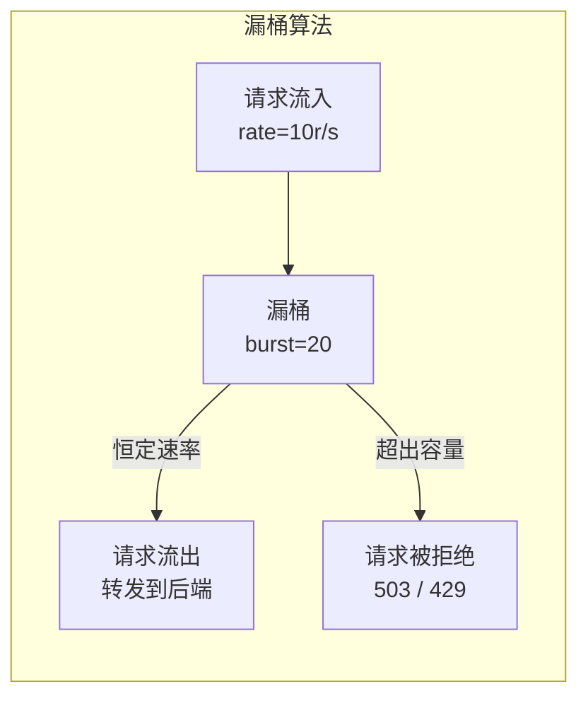

| limit_req 指令 | 默认值 | 说明 |
|----------------|--------|------|
| `limit_req_zone` | 无 | 定义限流共享内存区域 |
| `limit_req` | 无 | 在 location 中启用限流 |
| `limit_req_log_level` | `error` | 限流拒绝时的日志级别 |
| `limit_req_status` | `503` | 限流拒绝时的 HTTP 状态码 |
| `burst` | `0` | 突发请求队列大小 |
| `nodelay` | 无 | 突发请求不延迟，立即处理 |
| `delay` | 无 | 指定延迟处理的请求数 |

### 6.2 并发连接限制【limit_conn】

```nginx
http {
    # 定义连接限制共享内存区域
    limit_conn_zone $binary_remote_addr zone=conn_limit:10m;
    limit_conn_zone $server_name zone=server_conn_limit:10m;

    server {
        location / {
            # 限制每个 IP 的最大并发连接数
            limit_conn conn_limit 10;
            limit_conn_status 503;
            proxy_pass http://backend;
        }
    }
}
```

| limit_conn 指令 | 默认值 | 说明 |
|-----------------|--------|------|
| `limit_conn_zone` | 无 | 定义连接限制共享内存区域 |
| `limit_conn` | 无 | 在 location 中启用连接限制 |
| `limit_conn_status` | `503` | 连接限制触发时的 HTTP 状态码 |
| `limit_conn_log_level` | `error` | 连接限制触发时的日志级别 |
| `limit_conn_dry_run` | `off` | 试运行模式，仅记录日志不拒绝 |

### 6.3 下载限速

```nginx
location /download/ {
    # 下载限速：前 500KB 不限速，之后限制为 200KB/s
    limit_rate_after 500k;
    limit_rate 200k;

    proxy_pass http://file_server;
}
```

### 6.4 IP 黑白名单

```nginx
# 方法 1：使用 access 模块
location /admin/ {
    allow 192.168.1.0/24;    # 允许内网网段
    allow 10.0.0.0/8;        # 允许 VPN 网段
    allow 127.0.0.1;         # 允许本地
    deny  all;               # 拒绝其他所有
    proxy_pass http://admin_backend;
}

# 方法 2：使用 map 动态黑白名单
http {
    # 从文件加载黑名单
    geo $blacklist {
        default 0;
        include /etc/nginx/blacklist.conf;
        # blacklist.conf 格式：
        # 1.2.3.4 1;
        # 5.6.7.0/24 1;
    }

    server {
        location / {
            if ($blacklist) {
                return 403;
            }
            proxy_pass http://backend;
        }
    }
}

# 方法 3：使用 Redis 动态黑白名单【需要 Lua 模块】
location /api/ {
    access_by_lua_block {
        local redis = require "resty.redis"
        local red = redis:new()
        red:connect("127.0.0.1", 6379)
        local is_blocked = red:get("blocklist:" .. ngx.var.remote_addr)
        if is_blocked == "1" then
            ngx.exit(403)
        end
    }
    proxy_pass http://backend;
}
```

### 6.5 WAF【Web Application Firewall】

```nginx
# Nginx ModSecurity WAF 集成
# 需要安装 ModSecurity 模块

http {
    # 启用 ModSecurity
    modsecurity on;
    modsecurity_rules_file /etc/nginx/modsecurity/main.conf;

    server {
        location / {
            # ModSecurity 拦截模式
            ModSecurityEnabled on;
            ModSecurityConfig modsecurity.conf;

            proxy_pass http://backend;
        }
    }
}

# modsecurity.conf 核心配置示例
# SecRuleEngine On  # 启用规则引擎【DetectionOnly / On / Off】
# SecRequestBodyAccess On
# SecResponseBodyAccess On
# SecRule REQUEST_URI "@contains /admin" "id:1000,deny,status:403,msg:'Admin access denied'"
# Include /etc/nginx/modsecurity/coreruleset/*.conf  # OWASP 核心规则集
```

### 6.6 综合限流与安全配置

```nginx
http {
    # 定义限流区域
    limit_req_zone  $binary_remote_addr zone=global_req:10m  rate=30r/s;
    limit_req_zone  $binary_remote_addr zone=login_req:10m   rate=5r/m;
    limit_conn_zone $binary_remote_addr zone=global_conn:10m;

    # 定义 IP 黑名单
    geo $blocked_ip {
        default 0;
        include /etc/nginx/blocked_ips.conf;
    }

    server {
        listen 443 ssl http2;
        server_name example.com;

        # 全局限流和连接限制
        limit_req  zone=global_req burst=50 nodelay;
        limit_conn global_conn 20;

        # IP 黑名单拦截
        if ($blocked_ip) {
            return 403;
        }

        # 登录接口严格限流
        location /login {
            limit_req zone=login_req burst=3 nodelay;
            limit_req_status 429;
            proxy_pass http://backend;
        }

        # API 接口中等限流
        location /api/ {
            limit_req zone=global_req burst=20 nodelay;
            limit_req_status 429;
            proxy_pass http://backend;
        }

        # 静态资源不限流
        location /static/ {
            limit_req off;
            limit_conn off;
            expires 30d;
            add_header Cache-Control "public, immutable";
        }

        # 自定义限流错误页面
        error_page 503 /error/503.html;
        error_page 429 /error/429.html;
    }
}
```

:::warning
#[R|`limit_req` 的 `nodelay` 参数] 虽然能立即处理突发队列中的请求，但也意味着瞬时流量可能超过配置的 rate 限制。对于需要严格限流的场景【如登录接口】，建议使用较小的 `burst` 值且不设置 `nodelay`，让请求在队列中排队等待。
:::

***

## 场景七：Nginx 性能优化

### 7.0 场景概览

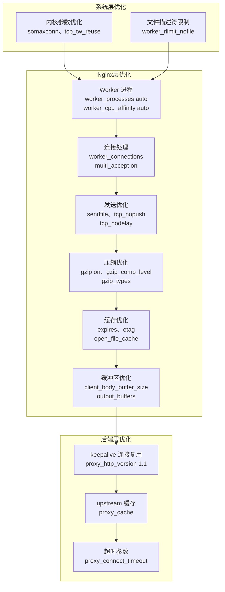

### 7.1 核心性能配置

```nginx
# ========== 全局配置 ==========
user  nginx;
worker_processes  auto;                    # 自动匹配 CPU 核心数
worker_cpu_affinity auto;                  # 自动 CPU 亲和性绑定
worker_rlimit_nofile 65535;               # 每个 Worker 最大文件描述符数
worker_shutdown_timeout 10s;              # 优雅关闭超时

# ========== 事件模块 ==========
events {
    use epoll;                            # Linux 使用 epoll
    worker_connections  65535;            # 每个 Worker 最大连接数
    multi_accept on;                      # 一次 accept 所有新连接
    accept_mutex off;                     # 关闭 accept 互斥锁【配合 reuseport】
}

# ========== HTTP 模块 ==========
http {
    include       /etc/nginx/mime.types;
    default_type  application/octet-stream;

    # ===== 访问日志格式优化 =====
    log_format main '$remote_addr - $remote_user [$time_local] '
                    '"$request" $status $body_bytes_sent '
                    '"$http_referer" "$http_user_agent" '
                    '$request_time $upstream_response_time';

    access_log /var/log/nginx/access.log main buffer=64k flush=5s;
    # buffer=64k：64KB 缓冲写入，减少磁盘 IO
    # flush=5s：每 5 秒刷新一次缓冲

    # ===== 文件传输优化 =====
    sendfile            on;               # 启用 sendfile 零拷贝技术
    tcp_nopush          on;               # sendfile 模式下合并数据包
    tcp_nodelay         on;               # keepalive 模式下立即发送小包

    # ===== 连接超时优化 =====
    keepalive_timeout  65;               # 客户端 keepalive 超时
    keepalive_requests 1000;             # 单个 keepalive 连接最大请求数
    client_header_timeout  10;           # 客户端请求头超时
    client_body_timeout    10;           # 客户端请求体超时
    send_timeout           10;           # 发送响应超时
    reset_timedout_connection on;        # 超时连接立即重置

    # ===== Gzip 压缩优化 =====
    gzip on;
    gzip_vary on;                        # 添加 Vary: Accept-Encoding 头
    gzip_proxied any;                    # 对所有代理请求启用压缩
    gzip_comp_level 6;                   # 压缩级别 1-9【6 是性价比最佳】
    gzip_min_length 256;                 # 最小压缩长度
    gzip_buffers 16 8k;                  # 压缩缓冲区
    gzip_http_version 1.1;               # 启用压缩的 HTTP 版本
    gzip_types
        text/plain
        text/css
        text/xml
        text/javascript
        application/json
        application/javascript
        application/xml
        application/xml+rss
        application/x-javascript
        image/svg+xml;
    gzip_disable "msie6";                # 禁用 IE6 的 Gzip

    # ===== 静态资源缓存 =====
    location ~* \.(jpg|jpeg|png|gif|ico|css|js|svg|woff|woff2|ttf|eot)$ {
        expires 30d;                     # 设置 30 天过期
        add_header Cache-Control "public, immutable";
        add_header ETag "";
        if_modified_since before;
        access_log off;                  # 关闭静态资源访问日志
    }

    # ===== 文件描述符缓存 =====
    open_file_cache max=10000 inactive=30s;
    open_file_cache_valid    60s;
    open_file_cache_min_uses 2;
    open_file_cache_errors   on;

    # ===== 请求体缓冲区 =====
    client_body_buffer_size     128k;    # 请求体缓冲区
    client_max_body_size        100m;    # 最大请求体大小
    client_body_temp_path       /tmp/nginx/client_body;

    # ===== 响应缓冲区 =====
    output_buffers   2 32k;              # 输出缓冲区
    postpone_output  1460;               # 延迟发送【凑满一个 MSS 包】

    # ===== upstream 优化 =====
    upstream backend {
        server 192.168.1.10:8080 weight=5 max_fails=2 fail_timeout=30s;
        server 192.168.1.11:8080 weight=5 max_fails=2 fail_timeout=30s;
        server 192.168.1.12:8080 weight=3 max_fails=2 fail_timeout=30s;
        keepalive 64;                    # keepalive 连接池
        keepalive_timeout 60s;
        keepalive_requests 1000;
    }
}
```

### 7.2 sendfile / tcp_nopush / tcp_nodelay 原理

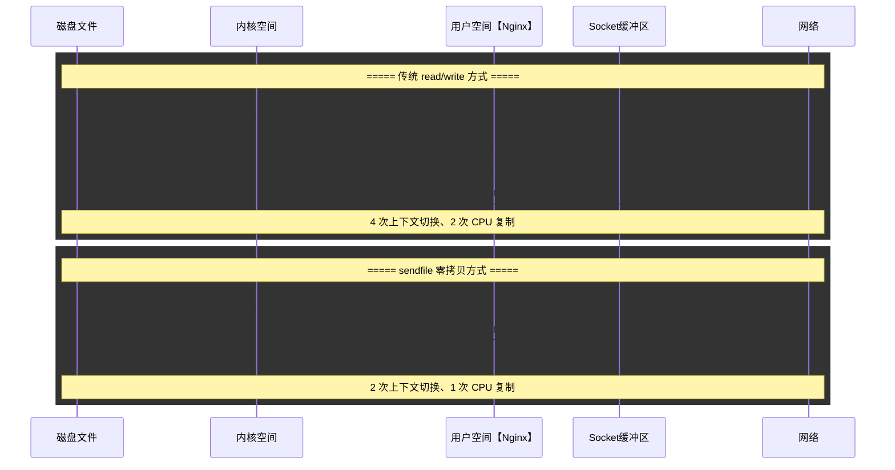

| 指令 | 作用 | 原理 |
|------|------|------|
| `sendfile on` | 启用零拷贝 | 直接在内核空间完成文件到 socket 的传输，避免用户态和内核态的切换以及数据复制 |
| `tcp_nopush on` | 数据包合并 | 仅在 sendfile 模式下生效，将多个数据包合并为一个发送，减少 TCP 头开销 |
| `tcp_nodelay on` | 禁用 Nagle 算法 | 对于 keepalive 连接，小包立即发送不等待合并，降低延迟 |

### 7.3 内核参数优化

```bash
# /etc/sysctl.conf 内核参数优化

# ========== TCP 连接队列 ==========
net.core.somaxconn = 65535              # 监听队列最大长度
net.ipv4.tcp_max_syn_backlog = 65535    # SYN 队列最大长度

# ========== TIME_WAIT 优化 ==========
net.ipv4.tcp_tw_reuse = 1               # 允许重用 TIME_WAIT 连接
net.ipv4.tcp_tw_recycle = 0             # 关闭 TIME_WAIT 快速回收【NAT 环境禁用】
net.ipv4.tcp_fin_timeout = 30           # FIN_WAIT_2 超时时间

# ========== TCP 连接优化 ==========
net.ipv4.tcp_keepalive_time = 1200      # keepalive 探测间隔
net.ipv4.tcp_keepalive_intvl = 30       # keepalive 探测间隔
net.ipv4.tcp_keepalive_probes = 3       # keepalive 探测次数
net.ipv4.tcp_max_orphans = 262144       # 最大孤儿 socket 数

# ========== 文件描述符 ==========
fs.file-max = 655350                    # 系统最大文件描述符数

# ========== 端口范围 ==========
net.ipv4.ip_local_port_range = 1024 65000  # 可用本地端口范围

# ========== 内存优化 ==========
net.core.rmem_max = 16777216            # 最大接收缓冲区
net.core.wmem_max = 16777216            # 最大发送缓冲区
net.ipv4.tcp_rmem = 4096 87380 16777216 # 接收缓冲区【min, default, max】
net.ipv4.tcp_wmem = 4096 65536 16777216 # 发送缓冲区【min, default, max】

# 应用配置
# sysctl -p
```

| 内核参数 | 推荐值 | 说明 |
|----------|--------|------|
| `net.core.somaxconn` | `65535` | 必须与 Nginx 的 `backlog` 参数配合 |
| `net.ipv4.tcp_tw_reuse` | `1` | 重用 TIME_WAIT 连接，提高连接复用率 |
| `net.ipv4.tcp_tw_recycle` | `0` | NAT 环境下必须禁用，否则会导致连接异常 |
| `fs.file-max` | `655350` | 系统级文件描述符上限 |
| `net.ipv4.ip_local_port_range` | `1024 65000` | 扩大可用端口范围 |

### 7.4 性能压测与调优参考

| 并发级别 | worker_processes | worker_connections | keepalive | 典型 QPS |
|----------|-----------------|-------------------|-----------|----------|
| 低【< 1000】 | 2 | 1024 | 16 | ~5000 |
| 中【1000-5000】 | 4 | 4096 | 32 | ~20000 |
| 高【5000-10000】 | 8 | 10240 | 64 | ~50000 |
| 超高【> 10000】 | auto | 65535 | 128 | ~100000+ |

:::note
#[C|性能调优是一个系统工程]，需要结合业务特性、硬件资源、网络环境综合考量。建议基于实际压测结果进行调优，而非盲目套用推荐值。关键指标包括：QPS、P99 延迟、错误率、CPU 使用率、内存使用率、磁盘 IO 和网络带宽。
:::

***

## 场景八：Nginx 与 K8s Ingress

### 8.0 场景概览

```mermaid
graph LR
    CLI["外部客户端"] --> LB["云负载均衡<br/>LoadBalancer"]
    LB --> INGRESS["Nginx Ingress Controller<br/>Pod 实例"]
    INGRESS --> SVC1["Service A<br/>ClusterIP"]
    INGRESS --> SVC2["Service B<br/>ClusterIP"]
    SVC1 --> P1A["Pod A1"]
    SVC1 --> P1B["Pod A2"]
    SVC2 --> P2A["Pod B1"]
    SVC2 --> P2B["Pod B2"]
```

### 8.1 Ingress 资源配置

```yaml
# ingress-nginx 部署【简化版】
apiVersion: apps/v1
kind: Deployment
metadata:
  name: ingress-nginx-controller
  namespace: ingress-nginx
spec:
  replicas: 3
  selector:
    matchLabels:
      app: ingress-nginx
  template:
    metadata:
      labels:
        app: ingress-nginx
    spec:
      containers:
      - name: controller
        image: registry.k8s.io/ingress-nginx/controller:v1.9.4
        args:
        - /nginx-ingress-controller
        - --configmap=$(POD_NAMESPACE)/ingress-nginx-config
        - --tcp-services-configmap=$(POD_NAMESPACE)/tcp-services
        - --udp-services-configmap=$(POD_NAMESPACE)/udp-services
        - --publish-service=$(POD_NAMESPACE)/ingress-nginx
        ports:
        - name: http
          containerPort: 80
        - name: https
          containerPort: 443
        - name: health
          containerPort: 10254
        livenessProbe:
          httpGet:
            path: /healthz
            port: 10254
          initialDelaySeconds: 10
          periodSeconds: 10
        readinessProbe:
          httpGet:
            path: /healthz
            port: 10254
          initialDelaySeconds: 10
          periodSeconds: 10
        env:
        - name: POD_NAME
          valueFrom:
            fieldRef:
              fieldPath: metadata.name
        - name: POD_NAMESPACE
          valueFrom:
            fieldRef:
              fieldPath: metadata.namespace
---
# Ingress 资源定义
apiVersion: networking.k8s.io/v1
kind: Ingress
metadata:
  name: example-ingress
  annotations:
    # Nginx Ingress 专用注解
    nginx.ingress.kubernetes.io/rewrite-target: /$2
    nginx.ingress.kubernetes.io/ssl-redirect: "true"
    nginx.ingress.kubernetes.io/proxy-body-size: "100m"
    nginx.ingress.kubernetes.io/proxy-read-timeout: "60"
    nginx.ingress.kubernetes.io/proxy-send-timeout: "60"
    nginx.ingress.kubernetes.io/proxy-buffer-size: "16k"
    nginx.ingress.kubernetes.io/proxy-buffers-number: "8"
    nginx.ingress.kubernetes.io/limit-rps: "100"
    nginx.ingress.kubernetes.io/limit-connections: "50"
    nginx.ingress.kubernetes.io/configuration-snippet: |
      more_set_headers "X-Frame-Options: SAMEORIGIN";
      more_set_headers "X-Content-Type-Options: nosniff";
spec:
  ingressClassName: nginx
  tls:
  - hosts:
    - example.com
    secretName: example-tls
  rules:
  - host: example.com
    http:
      paths:
      - path: /api(/|$)(.*)
        pathType: Prefix
        backend:
          service:
            name: api-service
            port:
              number: 8080
      - path: /web(/|$)(.*)
        pathType: Prefix
        backend:
          service:
            name: web-service
            port:
              number: 80
```

### 8.2 Ingress Nginx 常用注解

| 注解 | 说明 | 示例值 |
|------|------|--------|
| `nginx.ingress.kubernetes.io/rewrite-target` | 重写目标 URI | `/$2` |
| `nginx.ingress.kubernetes.io/ssl-redirect` | 强制 HTTPS | `"true"` |
| `nginx.ingress.kubernetes.io/proxy-body-size` | 请求体大小限制 | `"100m"` |
| `nginx.ingress.kubernetes.io/proxy-connect-timeout` | 连接后端超时 | `"30"` |
| `nginx.ingress.kubernetes.io/proxy-read-timeout` | 读取后端响应超时 | `"60"` |
| `nginx.ingress.kubernetes.io/proxy-send-timeout` | 发送请求到后端超时 | `"60"` |
| `nginx.ingress.kubernetes.io/limit-rps` | 每秒请求速率限制 | `"100"` |
| `nginx.ingress.kubernetes.io/limit-connections` | 并发连接限制 | `"50"` |
| `nginx.ingress.kubernetes.io/whitelist-source-range` | IP 白名单 | `"10.0.0.0/8,192.168.0.0/16"` |
| `nginx.ingress.kubernetes.io/cors-allow-origin` | CORS 允许源 | `"*"` |
| `nginx.ingress.kubernetes.io/canary` | 启用金丝雀发布 | `"true"` |
| `nginx.ingress.kubernetes.io/canary-weight` | 金丝雀流量权重 | `"10"` |
| `nginx.ingress.kubernetes.io/canary-by-header` | 按 Header 金丝雀 | `"x-canary"` |
| `nginx.ingress.kubernetes.io/configuration-snippet` | 自定义 Nginx 配置片段 | 见示例 |

### 8.3 金丝雀发布

```mermaid
graph TB
    subgraph 金丝雀发布流程
        TRAFFIC["100% 流量"] --> INGRESS["Nginx Ingress Controller"]
        INGRESS -->|"90% 流量"| STABLE["稳定版本 Service<br/>app: myapp<br/>version: stable"]
        INGRESS -->|"10% 流量"| CANARY["金丝雀版本 Service<br/>app: myapp<br/>version: canary"]
        STABLE --> PS1["Pod【v1.0.0】"]
        STABLE --> PS2["Pod【v1.0.0】"]
        CANARY --> PC1["Pod【v2.0.0】"]
    end
```

**金丝雀发布配置**：

```yaml
# 稳定版本 Ingress
apiVersion: networking.k8s.io/v1
kind: Ingress
metadata:
  name: myapp-stable
spec:
  ingressClassName: nginx
  rules:
  - host: myapp.example.com
    http:
      paths:
      - path: /
        pathType: Prefix
        backend:
          service:
            name: myapp-stable
            port:
              number: 80
---
# 金丝雀版本 Ingress
apiVersion: networking.k8s.io/v1
kind: Ingress
metadata:
  name: myapp-canary
  annotations:
    nginx.ingress.kubernetes.io/canary: "true"
    nginx.ingress.kubernetes.io/canary-weight: "10"    # 10% 流量
    nginx.ingress.kubernetes.io/canary-by-header: "x-version"  # 按 Header 路由
    nginx.ingress.kubernetes.io/canary-by-header-value: "canary"
spec:
  ingressClassName: nginx
  rules:
  - host: myapp.example.com
    http:
      paths:
      - path: /
        pathType: Prefix
        backend:
          service:
            name: myapp-canary
            port:
              number: 80
```

### 8.4 蓝绿部署

```yaml
# 蓝绿部署通过修改 Service 的 selector 实现流量切换
# 蓝色环境【当前生产】
apiVersion: apps/v1
kind: Deployment
metadata:
  name: myapp-blue
spec:
  replicas: 3
  selector:
    matchLabels:
      app: myapp
      version: blue
  template:
    metadata:
      labels:
        app: myapp
        version: blue
    spec:
      containers:
      - name: app
        image: myapp:1.0.0
---
# 绿色环境【新版本】
apiVersion: apps/v1
kind: Deployment
metadata:
  name: myapp-green
spec:
  replicas: 3
  selector:
    matchLabels:
      app: myapp
      version: green
  template:
    metadata:
      labels:
        app: myapp
        version: green
    spec:
      containers:
      - name: app
        image: myapp:2.0.0
---
# Service 指向蓝色环境
apiVersion: v1
kind: Service
metadata:
  name: myapp-service
spec:
  selector:
    app: myapp
    version: blue   # 切换为 green 即可完成蓝绿切换
  ports:
  - port: 80
    targetPort: 8080
```

| 发布策略 | 流量切换方式 | 回滚速度 | 适用场景 |
|----------|-------------|----------|----------|
| 金丝雀发布 | 按权重逐步切换 | 快速【修改 weight 即可】 | 需要逐步验证新版本 |
| 蓝绿部署 | 一次性切换 Service | 秒级【修改 selector】 | 需要快速回滚的场景 |
| A/B 测试 | 按 Header/Cookie 路由 | 快速【修改注解】 | 功能对比测试 |

***

## 场景九：Nginx 日志与监控

### 9.0 场景概览

```mermaid
graph LR
    NGINX["Nginx 实例"] --> LOG["日志系统<br/>access_log / error_log"]
    NGINX --> STUB["stub_status<br/>实时状态页面"]
    NGINX --> EXPORTER["Prometheus Exporter<br/>nginx-prometheus-exporter"]
    LOG --> ELK["ELK / Loki<br/>日志聚合分析"]
    STUB --> GRAFANA["Grafana 看板"]
    EXPORTER --> PROM["Prometheus"]
    PROM --> GRAFANA
```

### 9.1 access_log 与 error_log 配置

```nginx
http {
    # ========== 自定义日志格式 ==========
    # 详细格式：包含请求时间、响应时间、upstream 状态
    log_format detailed '$remote_addr - $remote_user [$time_local] '
                        '"$request" $status $body_bytes_sent '
                        '"$http_referer" "$http_user_agent" '
                        'rt=$request_time uct="$upstream_connect_time" '
                        'uht="$upstream_header_time" urt="$upstream_response_time" '
                        'pipe=$pipe '
                        'upstream_addr=$upstream_addr '
                        'upstream_status=$upstream_status '
                        'upstream_cache_status=$upstream_cache_status '
                        'ssl_protocol=$ssl_protocol '
                        'ssl_cipher=$ssl_cipher';

    # JSON 格式日志【便于 ELK/Loki 解析】
    log_format json_combined escape=json '{'
        '"time_local":"$time_local",'
        '"remote_addr":"$remote_addr",'
        '"remote_user":"$remote_user",'
        '"request":"$request",'
        '"status":$status,'
        '"body_bytes_sent":$body_bytes_sent,'
        '"request_time":$request_time,'
        '"http_referer":"$http_referer",'
        '"http_user_agent":"$http_user_agent",'
        '"http_x_forwarded_for":"$http_x_forwarded_for",'
        '"upstream_addr":"$upstream_addr",'
        '"upstream_status":"$upstream_status",'
        '"upstream_response_time":"$upstream_response_time",'
        '"upstream_cache_status":"$upstream_cache_status",'
        '"host":"$host",'
        '"request_length":$request_length'
    '}';

    # ========== 访问日志配置 ==========
    access_log /var/log/nginx/access.log json_combined buffer=64k flush=5s;
    # buffer=64k：缓冲写入，减少磁盘 IO
    # flush=5s：每 5 秒刷新缓冲区

    # 条件日志：仅记录非 200/304 响应
    map $status $loggable {
        ~^[23]  0;
        default 1;
    }
    access_log /var/log/nginx/error_requests.log json_combined if=$loggable;

    # ========== 错误日志配置 ==========
    error_log /var/log/nginx/error.log warn;
    # 日志级别：debug > info > notice > warn > error > crit > alert > emerg
}

# 不记录访问日志的 location
location /health {
    access_log off;
    return 200 "OK";
}

location /static/ {
    access_log off;
    expires 30d;
}
```

### 9.2 核心日志变量

| 变量 | 含义 | 示例值 |
|------|------|--------|
| `$remote_addr` | 客户端 IP 地址 | `192.168.1.100` |
| `$time_local` | 本地时间 | `29/Jun/2026:12:00:00 +0800` |
| `$request` | 完整请求行 | `GET /api/users HTTP/1.1` |
| `$status` | 响应状态码 | `200` |
| `$body_bytes_sent` | 发送的响应体字节数 | `1234` |
| `$request_time` | 请求处理总时间【秒】 | `0.123` |
| `$upstream_addr` | 后端服务器地址 | `192.168.1.10:8080` |
| `$upstream_status` | 后端响应状态码 | `200` |
| `$upstream_response_time` | 后端响应时间【秒】 | `0.050` |
| `$upstream_connect_time` | 与后端连接时间【秒】 | `0.002` |
| `$upstream_header_time` | 接收后端响应头时间【秒】 | `0.048` |
| `$upstream_cache_status` | 缓存状态 | `HIT / MISS / EXPIRED` |
| `$ssl_protocol` | SSL 协议版本 | `TLSv1.3` |
| `$ssl_cipher` | SSL 加密套件 | `TLS_AES_256_GCM_SHA384` |
| `$http_referer` | 请求来源页 | `https://example.com/page` |
| `$http_user_agent` | 客户端 User-Agent | `Mozilla/5.0 ...` |

### 9.3 stub_status 实时监控

```nginx
# 启用 stub_status 模块
server {
    listen 127.0.0.1:8080;
    server_name localhost;

    location /nginx_status {
        stub_status;
        allow 127.0.0.1;
        allow 10.0.0.0/8;     # 允许 Prometheus 监控
        deny  all;
    }
}
```

**stub_status 输出示例与说明**：

```
Active connections: 291
server accepts handled requests
 16630948 16630948 31070465
Reading: 6 Writing: 179 Waiting: 106
```

| 指标 | 含义 | 说明 |
|------|------|------|
| `Active connections` | 当前活跃连接数 | 包括 Reading + Writing + Waiting |
| `accepts` | 累计接受的连接数 | 自 Nginx 启动以来的总数 |
| `handled` | 累计处理的连接数 | 通常等于 accepts，小于表示连接被丢弃 |
| `requests` | 累计处理的请求数 | 一个连接可处理多个请求 |
| `Reading` | 正在读取请求头的连接数 | 接收客户端请求 |
| `Writing` | 正在发送响应的连接数 | 响应写入客户端 |
| `Waiting` | 空闲 keepalive 连接数 | 等待下一个请求 |

### 9.4 Prometheus Exporter 集成

```bash
# 使用 nginx-prometheus-exporter 采集 Nginx 指标
# 从 stub_status 页面拉取数据并转换为 Prometheus 格式

# 启动 exporter
nginx-prometheus-exporter \
  -nginx.scrape-uri=http://127.0.0.1:8080/nginx_status \
  -web.listen-address=:9113
```

**Prometheus 抓取配置**：

```yaml
# prometheus.yml
scrape_configs:
  - job_name: 'nginx'
    static_configs:
    - targets:
      - 'nginx-server:9113'
      labels:
        env: 'production'
        app: 'nginx'
```

**关键 Prometheus 指标**：

| 指标名称 | 类型 | 说明 |
|----------|------|------|
| `nginx_connections_active` | Gauge | 当前活跃连接数 |
| `nginx_connections_reading` | Gauge | 正在读取的连接数 |
| `nginx_connections_writing` | Gauge | 正在写入的连接数 |
| `nginx_connections_waiting` | Gauge | 空闲等待的连接数 |
| `nginx_http_requests_total` | Counter | 累计请求总数 |
| `nginx_connections_accepted_total` | Counter | 累计接受的连接数 |
| `nginx_connections_handled_total` | Counter | 累计处理的连接数 |
| `nginx_up` | Gauge | Nginx 是否在线【1/0】 |

### 9.5 扩展监控【OpenResty / Lua】

```nginx
# 使用 Lua 模块实现自定义指标暴露
server {
    listen 8080;
    server_name localhost;

    location /metrics {
        access_log off;
        allow 127.0.0.1;
        allow 10.0.0.0/8;
        deny  all;

        content_by_lua_block {
            local shared = ngx.shared
            local status = ngx.location.capture("/nginx_status")
            -- 解析 stub_status 输出
            -- 暴露为 Prometheus 格式指标
            ngx.header["Content-Type"] = "text/plain; charset=utf-8"
            ngx.print("# HELP nginx_http_requests_total Total requests\n")
            ngx.print("# TYPE nginx_http_requests_total counter\n")
            -- 更多指标...
        }
    }
}
```

### 9.6 日志轮转与切割

```bash
# /etc/logrotate.d/nginx
/var/log/nginx/*.log {
    daily                     # 每天轮转
    missingok                 # 日志文件不存在不报错
    rotate 30                 # 保留 30 天
    compress                  # 压缩旧日志
    delaycompress             # 延迟一天压缩
    notifempty                # 空文件不轮转
    create 0640 nginx nginx   # 创建新日志文件的权限
    sharedscripts             # 所有日志共享脚本
    postrotate
        # 发送 USR1 信号让 Nginx 重新打开日志文件
        if [ -f /var/run/nginx.pid ]; then
            kill -USR1 `cat /var/run/nginx.pid`
        fi
    endscript
}

# 手动执行日志切割
# logrotate -f /etc/logrotate.d/nginx
```

### 9.7 综合监控看板

```mermaid
graph TB
    subgraph 数据采集层
        NGINX["Nginx 实例<br/>stub_status + access_log"]
        SYS["系统指标<br/>CPU / 内存 / 磁盘 / 网络"]
    end

    subgraph 数据存储层
        PROM["Prometheus<br/>指标时序数据库"]
        LOKI["Loki<br/>日志聚合存储"]
    end

    subgraph 可视化层
        GRAFANA["Grafana 看板"]
        DASH1["Nginx 总览看板<br/>QPS、活跃连接、错误率"]
        DASH2["Upstream 看板<br/>后端响应时间、健康状态"]
        DASH3["缓存看板<br/>命中率、缓存大小"]
        DASH4["日志看板<br/>错误日志、慢请求"]
    end

    subgraph 告警层
        ALERT["AlertManager"]
        RULES["告警规则<br/>- 错误率 > 5%<br/>- P99 延迟 > 1s<br/>- 后端不可用<br/>- 缓存命中率 < 80%"]
    end

    NGINX --> PROM
    NGINX --> LOKI
    SYS --> PROM
    PROM --> GRAFANA
    LOKI --> GRAFANA
    GRAFANA --> DASH1
    GRAFANA --> DASH2
    GRAFANA --> DASH3
    GRAFANA --> DASH4
    PROM --> ALERT
    ALERT --> RULES
```

***

## 附录：Nginx 配置完整示例

### A.1 生产级反向代理完整配置

```nginx
# ============================================================
# Nginx 生产级反向代理配置
# 版本：Nginx 1.24.x
# 场景：HTTPS 反向代理 + 负载均衡 + 缓存 + 限流 + 监控
# ============================================================

# ========== 全局配置 ==========
user  nginx;
worker_processes  auto;
worker_cpu_affinity auto;
worker_rlimit_nofile 65535;
worker_shutdown_timeout 10s;

error_log  /var/log/nginx/error.log  warn;
pid        /var/run/nginx.pid;

# ========== 事件模块 ==========
events {
    use epoll;
    worker_connections  65535;
    multi_accept on;
    accept_mutex off;
}

# ========== HTTP 模块 ==========
http {
    include       /etc/nginx/mime.types;
    default_type  application/octet-stream;

    # 日志格式
    log_format json_combined escape=json '{'
        '"time_local":"$time_local",'
        '"remote_addr":"$remote_addr",'
        '"request":"$request",'
        '"status":$status,'
        '"body_bytes_sent":$body_bytes_sent,'
        '"request_time":$request_time,'
        '"upstream_addr":"$upstream_addr",'
        '"upstream_status":"$upstream_status",'
        '"upstream_response_time":"$upstream_response_time",'
        '"upstream_cache_status":"$upstream_cache_status"'
    '}';

    access_log /var/log/nginx/access.log json_combined buffer=64k flush=5s;

    # 传输优化
    sendfile            on;
    tcp_nopush          on;
    tcp_nodelay         on;

    # 连接超时
    keepalive_timeout  65;
    keepalive_requests 1000;
    client_header_timeout  10;
    client_body_timeout    10;
    send_timeout           10;
    reset_timedout_connection on;

    # Gzip 压缩
    gzip on;
    gzip_vary on;
    gzip_proxied any;
    gzip_comp_level 6;
    gzip_min_length 256;
    gzip_types text/plain text/css text/xml text/javascript
               application/json application/javascript application/xml
               application/xml+rss image/svg+xml;
    gzip_disable "msie6";

    # 请求体缓冲区
    client_body_buffer_size 128k;
    client_max_body_size    100m;
    client_body_temp_path   /tmp/nginx/client_body;

    # 文件描述符缓存
    open_file_cache max=10000 inactive=30s;
    open_file_cache_valid    60s;
    open_file_cache_min_uses 2;
    open_file_cache_errors   on;

    # ========== 限流区域 ==========
    limit_req_zone  $binary_remote_addr zone=global_req:10m  rate=30r/s;
    limit_req_zone  $binary_remote_addr zone=login_req:10m   rate=5r/m;
    limit_req_zone  $binary_remote_addr zone=api_req:10m     rate=100r/s;
    limit_conn_zone $binary_remote_addr zone=global_conn:10m;

    # ========== 缓存区域 ==========
    proxy_cache_path /data/nginx/cache
                     levels=1:2
                     keys_zone=main_cache:50m
                     max_size=20g
                     inactive=60m
                     use_temp_path=off;

    # ========== Upstream 后端集群 ==========
    upstream backend_api {
        least_conn;
        server 192.168.1.10:8080 weight=5 max_fails=2 fail_timeout=30s;
        server 192.168.1.11:8080 weight=5 max_fails=2 fail_timeout=30s;
        server 192.168.1.12:8080 weight=3 max_fails=2 fail_timeout=30s;
        server 192.168.1.13:8080 backup;
        keepalive 64;
        keepalive_timeout 60s;
        keepalive_requests 1000;
    }

    upstream backend_websocket {
        ip_hash;
        server 192.168.1.20:8080;
        server 192.168.1.21:8080;
        keepalive 32;
    }

    # ========== 虚拟主机 ==========
    server {
        listen 80;
        server_name example.com;
        return 301 https://$host$request_uri;
    }

    server {
        listen 443 ssl http2;
        server_name example.com;

        # SSL 配置
        ssl_certificate         /etc/nginx/ssl/example.com.pem;
        ssl_certificate_key     /etc/nginx/ssl/example.com.key;
        ssl_protocols           TLSv1.2 TLSv1.3;
        ssl_ciphers             'ECDHE-ECDSA-AES128-GCM-SHA256:ECDHE-RSA-AES128-GCM-SHA256:ECDHE-ECDSA-AES256-GCM-SHA384:ECDHE-RSA-AES256-GCM-SHA384';
        ssl_prefer_server_ciphers on;
        ssl_session_cache       shared:SSL:10m;
        ssl_session_timeout     10m;
        ssl_session_tickets     on;
        ssl_stapling            on;
        ssl_stapling_verify     on;
        resolver                8.8.8.8 8.8.4.4 valid=300s;

        # 安全头
        add_header Strict-Transport-Security "max-age=63072000; includeSubDomains; preload" always;
        add_header X-Frame-Options "SAMEORIGIN" always;
        add_header X-Content-Type-Options "nosniff" always;
        add_header X-XSS-Protection "1; mode=block" always;

        # 全局限流
        limit_req  zone=global_req burst=50 nodelay;
        limit_conn global_conn 20;

        # ========== API 接口 ==========
        location /api/ {
            limit_req zone=api_req burst=20 nodelay;
            limit_req_status 429;

            proxy_pass http://backend_api;
            proxy_http_version 1.1;
            proxy_set_header Host              $host;
            proxy_set_header X-Real-IP         $remote_addr;
            proxy_set_header X-Forwarded-For   $proxy_add_x_forwarded_for;
            proxy_set_header X-Forwarded-Proto $scheme;
            proxy_set_header Connection        "";

            # 缓存配置
            proxy_cache main_cache;
            proxy_cache_key "$scheme$proxy_host$request_uri";
            proxy_cache_valid 200 302 10m;
            proxy_cache_valid 404      1m;
            proxy_cache_lock on;
            proxy_cache_background_update on;
            proxy_cache_use_stale error timeout updating http_500 http_502 http_503 http_504;
            add_header X-Cache-Status $upstream_cache_status;

            # 超时
            proxy_connect_timeout 5s;
            proxy_send_timeout    30s;
            proxy_read_timeout    30s;

            # 重试
            proxy_next_upstream error timeout invalid_header http_500 http_502 http_503;
            proxy_next_upstream_tries 2;
        }

        # ========== WebSocket 接口 ==========
        location /ws/ {
            limit_req zone=global_req burst=20 nodelay;

            proxy_pass http://backend_websocket;
            proxy_http_version 1.1;
            proxy_set_header Upgrade           $http_upgrade;
            proxy_set_header Connection        "upgrade";
            proxy_set_header Host              $host;
            proxy_set_header X-Real-IP         $remote_addr;
            proxy_set_header X-Forwarded-For   $proxy_add_x_forwarded_for;
            proxy_set_header X-Forwarded-Proto $scheme;

            proxy_read_timeout 3600s;
            proxy_send_timeout 3600s;
        }

        # ========== 登录接口严格限流 ==========
        location /login {
            limit_req zone=login_req burst=3 nodelay;
            limit_req_status 429;

            proxy_pass http://backend_api;
            proxy_http_version 1.1;
            proxy_set_header Host              $host;
            proxy_set_header X-Real-IP         $remote_addr;
            proxy_set_header X-Forwarded-For   $proxy_add_x_forwarded_for;
            proxy_set_header Connection        "";
        }

        # ========== 静态资源 ==========
        location ~* \.(jpg|jpeg|png|gif|ico|css|js|svg|woff|woff2|ttf|eot)$ {
            limit_req off;
            limit_conn off;
            access_log off;
            expires 30d;
            add_header Cache-Control "public, immutable";
        }

        # ========== 健康检查 ==========
        location /health {
            access_log off;
            return 200 "OK";
        }

        # ========== 自定义错误页面 ==========
        error_page 403 /error/403.html;
        error_page 404 /error/404.html;
        error_page 500 502 503 504 /error/50x.html;
        error_page 429 /error/429.html;

        location = /error/50x.html {
            internal;
            root /usr/share/nginx/html;
        }
    }

    # ========== 监控端点 ==========
    server {
        listen 127.0.0.1:8080;
        server_name localhost;

        location /nginx_status {
            stub_status;
            allow 127.0.0.1;
            allow 10.0.0.0/8;
            deny  all;
        }

        location /health {
            access_log off;
            return 200 "OK";
        }
    }
}
```

### A.2 常用 Nginx 变量速查

| 变量 | 含义 |
|------|------|
| `$arg_NAME` | 请求参数 NAME 的值 |
| `$binary_remote_addr` | 二进制格式的客户端 IP |
| `$body_bytes_sent` | 发送的响应体字节数 |
| `$content_length` | Content-Length 请求头 |
| `$content_type` | Content-Type 请求头 |
| `$cookie_NAME` | Cookie NAME 的值 |
| `$document_root` | 当前请求的 root 指令值 |
| `$document_uri` | 同 $uri，不包含参数 |
| `$host` | 请求的 Host 头 |
| `$hostname` | 主机名 |
| `$http_NAME` | 任意请求头 NAME 的值 |
| `$http_referer` | Referer 请求头 |
| `$http_user_agent` | User-Agent 请求头 |
| `$http_x_forwarded_for` | X-Forwarded-For 请求头 |
| `$is_args` | 如果 URI 有参数则为 `?`，否则为空 |
| `$limit_rate` | 限速值 |
| `$msec` | 当前时间戳【毫秒精度】 |
| `$nginx_version` | Nginx 版本号 |
| `$pid` | Worker 进程 PID |
| `$pipe` | 请求是否为管道传输 |
| `$proxy_protocol_addr` | PROXY Protocol 客户端地址 |
| `$query_string` | 同 $args，请求参数 |
| `$realip_remote_addr` | realip 模块处理后的原始客户端地址 |
| `$remote_addr` | 客户端 IP 地址 |
| `$remote_port` | 客户端端口 |
| `$remote_user` | 基本认证的用户名 |
| `$request` | 完整请求行 |
| `$request_body` | 请求体 |
| `$request_body_file` | 请求体临时文件路径 |
| `$request_completion` | 请求是否完成 |
| `$request_filename` | 当前请求的文件路径 |
| `$request_id` | 请求唯一 ID |
| `$request_length` | 请求长度【含请求行、请求头、请求体】 |
| `$request_method` | HTTP 请求方法 |
| `$request_time` | 请求处理时间【秒，毫秒精度】 |
| `$request_uri` | 完整原始请求 URI【含参数】 |
| `$scheme` | 请求协议【http 或 https】 |
| `$sent_http_NAME` | 任意响应头 NAME 的值 |
| `$server_addr` | 服务器 IP 地址 |
| `$server_name` | 服务器名称 |
| `$server_port` | 服务器端口 |
| `$server_protocol` | 服务器协议版本 |
| `$status` | 响应状态码 |
| `$tcpinfo_rtt` | TCP RTT 信息 |
| `$time_iso8601` | ISO 8601 格式时间 |
| `$time_local` | 本地时间 |
| `$uid_got` | userid 模块的 Cookie 值 |
| `$uid_set` | userid 模块设置的 Cookie 值 |
| `$upstream_addr` | 后端服务器地址 |
| `$upstream_bytes_received` | 从后端接收的字节数 |
| `$upstream_bytes_sent` | 发送到后端的字节数 |
| `$upstream_cache_status` | 缓存状态 |
| `$upstream_connect_time` | 与后端连接时间 |
| `$upstream_cookie_NAME` | 后端返回的 Set-Cookie 头 |
| `$upstream_header_time` | 接收后端响应头时间 |
| `$upstream_http_NAME` | 后端返回的任意响应头 |
| `$upstream_response_length` | 后端响应长度 |
| `$upstream_response_time` | 后端响应时间 |
| `$upstream_status` | 后端响应状态码 |
| `$uri` | 当前请求 URI【不含参数，可能被 rewrite 修改】 |

***

## 参考资料

| 资料 | 说明 |
|------|------|
| Nginx 官方文档 | https://nginx.org/en/docs/ |
| Nginx 源码仓库 | https://github.com/nginx/nginx |
| Nginx 开发指南 | https://nginx.org/en/docs/dev/development_guide.html |
| Ingress Nginx 文档 | https://kubernetes.github.io/ingress-nginx/ |
| Nginx Prometheus Exporter | https://github.com/nginxinc/nginx-prometheus-exporter |
| ModSecurity for Nginx | https://github.com/SpiderLabs/ModSecurity-nginx |

:::note
本文所涉及的 Nginx 配置均已通过 Nginx 1.24.x 验证。在生产环境中使用前，请根据实际业务场景调整参数值，并在测试环境充分验证后再上线。本文所有 Mermaid 图表中的函数名、结构体名均来自 Nginx 源码，可作为源码阅读的导航参考。
:::