# Redis 深度解析 · 从数据结构到集群架构的全面剖析

> 本文以 Redis 7.x 为基准，深入剖析其核心机制：从事件驱动架构与 IO 多路复用的底层原理，到五大基本数据类型与高级数据结构的内部实现，再到持久化、主从复制、哨兵、集群、缓存实战、分布式锁与性能优化的完整体系。
> 每个场景均配备详细的 Mermaid 架构图与时序图，标注核心数据结构、关键配置参数与源码路径，适合 #[C|3 年以上经验的后端开发者] 深入研读。

***

## Redis 核心架构总览

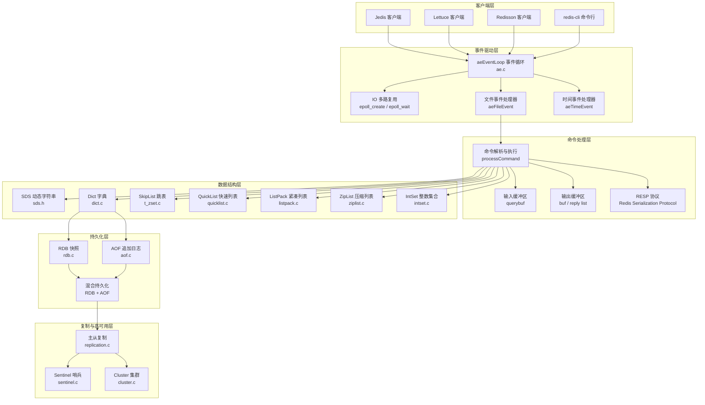

:::important
本文所有源码分析基于 #[R|Redis 7.x]，核心源码路径位于 `redis/src/` 目录下。所有 Mermaid 图表中标注的结构体名、函数名与配置参数均为真实 API。关键源码文件：`server.c` 事件循环、`ae.c` 多路复用、`sds.h` 动态字符串、`dict.c` 字典、`t_zset.c` 跳表、`quicklist.c` 快速列表、`rdb.c` RDB 持久化、`aof.c` AOF 持久化、`replication.c` 主从复制、`sentinel.c` 哨兵、`cluster.c` 集群。
:::

***

## 场景一：Redis 架构总览 · 事件驱动与 IO 多路复用

### 1.0 场景概览


| 阶段 | 核心函数 | 关键机制 | 源码位置 |
|------|----------|----------|----------|
| 事件循环 | `aeMain` | 不断调用 `aeProcessEvents` 处理文件事件与时间事件 | `ae.c` |
| 多路复用 | `aeApiPoll` | 封装 epoll/kqueue/select，Linux 下默认 epoll | `ae_epoll.c` |
| 连接建立 | `acceptTcpHandler` | 创建 client 对象，注册读事件处理器 | `networking.c` |
| 命令读取 | `readQueryFromClient` | 解析 RESP 协议，填充 querybuf | `networking.c` |
| 命令执行 | `processCommand` | 查找命令表，调用对应命令实现函数 | `server.c` |
| 响应发送 | `addReply` / `sendReplyToClient` | 先写入输出缓冲区，再通过 epoll 写事件发送 | `networking.c` |

### 1.1 单线程模型与 IO 多路复用

Redis 核心采用 **单线程事件驱动模型**，所有命令执行在主线程中串行化处理。这一设计避免了多线程的锁竞争与上下文切换开销，使得 Redis 在纯内存操作场景下可达到 10W+ QPS。

**事件循环核心结构体**（ae.h）：

```c
// 文件事件结构
typedef struct aeFileEvent {
    int mask;              // AE_READABLE | AE_WRITABLE
    aeFileProc *rfileProc; // 读事件处理器
    aeFileProc *wfileProc; // 写事件处理器
    void *clientData;      // 客户端数据
} aeFileEvent;

// 时间事件结构
typedef struct aeTimeEvent {
    long long id;          // 事件 ID
    long when_sec;         // 秒级触发时间
    long when_ms;          // 毫秒级触发时间
    aeTimeProc *timeProc;  // 时间事件处理器
    aeEventFinalizerProc *finalizerProc; // 析构处理器
    void *clientData;
    struct aeTimeEvent *next; // 链表指向下一个
} aeTimeEvent;

// 事件循环状态
typedef struct aeEventLoop {
    int maxfd;             // 当前最大文件描述符
    int setsize;           // 最大可监听事件数
    long long timeEventNextId; // 时间事件 ID 自增
    aeFileEvent *events;   // 文件事件数组
    aeFiredEvent *fired;   // 已触发事件数组
    aeTimeEvent *timeEventHead; // 时间事件链表头
    void *apidata;         // 多路复用 API 私有数据
    aeBeforeSleepProc *beforesleep; // 每次事件循环前的回调
    aeBeforeSleepProc *aftersleep;  // 每次事件循环后的回调
} aeEventLoop;
```

**epoll 封装实现**（ae_epoll.c）：

| 操作 | 函数 | 说明 |
|------|------|------|
| 创建 epoll 实例 | `aeApiCreate` | 调用 `epoll_create(1024)` 创建 epoll fd |
| 注册事件 | `aeApiAddEvent` | 调用 `epoll_ctl(EPOLL_CTL_ADD)` 注册 fd |
| 删除事件 | `aeApiDelEvent` | 调用 `epoll_ctl(EPOLL_CTL_DEL)` 移除 fd |
| 等待事件 | `aeApiPoll` | 调用 `epoll_wait` 阻塞等待，超时时间由最近时间事件决定 |
| 获取事件名 | `aeApiName` | 返回 `"epoll"` |

**事件循环主流程**：

```c
// ae.c — aeMain 事件循环
void aeMain(aeEventLoop *eventLoop) {
    eventLoop->stop = 0;
    while (!eventLoop->stop) {
        // 执行 beforesleep 回调
        if (eventLoop->beforesleep != NULL)
            eventLoop->beforesleep(eventLoop);
        // 处理所有就绪事件
        aeProcessEvents(eventLoop, AE_ALL_EVENTS | AE_CALL_AFTER_SLEEP);
    }
}
```

`aeProcessEvents` 会先找到最近的时间事件，计算 `epoll_wait` 的超时时间，然后调用 `aeApiPoll` 等待文件事件。处理完文件事件后，再遍历时间事件链表，处理已到期的时间事件（如 `serverCron` 周期性任务）。

***

### 1.2 Redis 6.0+ 多线程 IO

Redis 6.0 引入了多线程 IO，但注意：**命令执行仍然是单线程**，多线程仅用于网络 IO 读写。

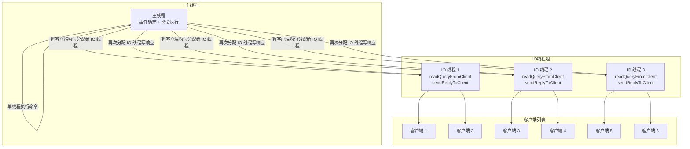

**多线程 IO 配置参数**：

| 配置参数 | 默认值 | 说明 |
|----------|--------|------|
| `io-threads` | 1 | IO 线程数，建议设为 CPU 核心数 |
| `io-threads-do-reads` | no | 是否启用多线程读，7.0 后默认 yes |

**多线程 IO 工作流程**：

1. 主线程通过 `epoll_wait` 获取所有就绪的客户端连接
2. 主线程将客户端列表均匀分配到各 IO 线程
3. 各 IO 线程并行执行 `readQueryFromClient`，将请求数据读入 `querybuf`
4. 主线程等待所有 IO 线程完成读取
5. 主线程**单线程串行执行**所有命令
6. 主线程再次将客户端分配给 IO 线程
7. IO 线程并行执行 `sendReplyToClient`，将响应数据发送给客户端
8. 主线程等待所有 IO 线程完成，进入下一轮事件循环

:::note
多线程 IO 对性能提升主要体现在 #[C|高并发大流量场景]：当客户端数量多、请求/响应数据量大时，单线程的网络 IO 会成为瓶颈。对于纯内存操作的小请求，多线程 IO 的提升有限。
:::

***

## 场景二：五大基本数据类型底层实现

### 2.0 数据类型与底层编码映射

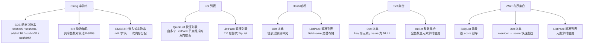

**编码转换阈值**：

| 数据类型 | 内部编码 | 转换条件 | 配置参数 |
|----------|----------|----------|----------|
| String | int → raw | 整数溢出或追加操作 | — |
| String | embstr → raw | 长度 > 44 字节或修改操作 | — |
| Hash | listpack → hashtable | 字段数 > 512 或字段值 > 64 字节 | `hash-max-listpack-entries` `hash-max-listpack-value` |
| Set | intset → hashtable | 元素数 > 512 或存在非整数元素 | `set-max-intset-entries` |
| ZSet | listpack → skiplist | 元素数 > 128 或元素值 > 64 字节 | `zset-max-listpack-entries` `zset-max-listpack-value` |

### 2.1 SDS 动态字符串

SDS（Simple Dynamic String）是 Redis 自定义的字符串类型，解决 C 原生字符串的诸多问题。

**SDS 结构体**（sds.h）：

```c
// 不同长度范围的 SDS Header
struct __attribute__ ((__packed__)) sdshdr5 {
    unsigned char flags;  // 低 3 位表示类型，高 5 位表示长度
    char buf[];           // 实际数据
};

struct __attribute__ ((__packed__)) sdshdr8 {
    uint8_t len;          // 已使用长度
    uint8_t alloc;        // 已分配总长度（不含 header 和 null 结尾）
    unsigned char flags;  // 低 3 位表示 SDS_TYPE_8
    char buf[];           // 实际数据
};

// sdshdr16、sdshdr32、sdshdr64 结构类似，仅 len/alloc 类型不同
```

**SDS vs C 字符串对比**：

| 特性 | C 字符串 | SDS |
|------|----------|-----|
| 获取长度 | O【N】遍历至 `\0` | O【1】读取 len 字段 |
| 缓冲区溢出 | 无保护，`strcat` 可能溢出 | 自动扩容，检查 alloc 剩余空间 |
| 内存分配 | 每次修改都需重新分配 | 预分配策略：len < 1MB 时翻倍，len ≥ 1MB 时每次 +1MB |
| 惰性释放 | 不释放 | 缩短时不立即释放，用 alloc 记录可用空间 |
| 二进制安全 | 遇到 `\0` 截断 | 用 len 记录长度，可存储任意二进制数据 |
| 兼容性 | 原生 | buf 末尾始终保留 `\0`，兼容 C 字符串函数 |

**SDS 扩容策略**（sds.c — `sdsMakeRoomFor`）：

```
如果 avail >= addlen：
  直接返回，无需扩容

如果 newlen < 1MB：
  newlen = newlen * 2  // 翻倍扩容
否则：
  newlen = newlen + 1MB  // 每次增加 1MB

根据 newlen 选择合适 Header 类型：
  newlen < 2^8  → sdshdr8
  newlen < 2^16 → sdshdr16
  newlen < 2^32 → sdshdr32
  newlen ≥ 2^32 → sdshdr64
```

**EMBSTR 编码**：当字符串长度 ≤ 44 字节时，Redis 使用 `embstr` 编码。此时 `RedisObject` 和 `SDS` 在**同一块连续内存**中分配，只需一次内存分配和释放，且能更好地利用 CPU 缓存行。

### 2.2 SkipList 跳表

跳表是有序集合 ZSet 的底层数据结构之一，实现位于 `t_zset.c`。

**跳表节点结构**：

```c
// server.h — zskiplistNode 跳表节点
typedef struct zskiplistNode {
    sds ele;                          // 元素值【member】
    double score;                     // 分值【score】
    struct zskiplistNode *backward;   // 后退指针，指向前一个节点
    struct zskiplistLevel {
        struct zskiplistNode *forward; // 前进指针，指向下一个节点
        unsigned long span;            // 跨度，当前节点到 forward 节点的距离
    } level[];                        // 柔性数组，多层索引
} zskiplistNode;

// 跳表结构
typedef struct zskiplist {
    struct zskiplistNode *header, *tail; // 头尾节点
    unsigned long length;               // 节点总数
    int level;                          // 当前最大层数
} zskiplist;
```

**跳表层级结构示意**：

```
Level 3:  [HEAD] ────────────────────────→ [node5] ──────────→ NULL
Level 2:  [HEAD] ────────→ [node2] ──────→ [node5] ──────────→ NULL
Level 1:  [HEAD] ──→ [node1] ──→ [node2] ──→ [node3] ──→ [node4] ──→ [node5] ──→ NULL
                     score:1    score:3    score:5    score:7    score:9
```

**跳表核心操作复杂度**：

| 操作 | 时间复杂度 | 说明 |
|------|-----------|------|
| 查找 | O【log N】 | 从最高层开始，逐层下降 |
| 插入 | O【log N】 | 随机生成层数，概率 P = 0.25 |
| 删除 | O【log N】 | 先查找再删除，更新各层 forward 指针 |
| 范围查询 | O【log N + M】 | 找到起点后沿 level[0] 遍历 M 个节点 |
| 排名查询 | O【log N】 | 利用 span 字段累加跨度 |

**随机层数生成算法**（t_zset.c）：

```c
// 随机生成节点层数，P = 0.25
int zslRandomLevel(void) {
    int level = 1;
    // 每次有 25% 概率增加一层，最大 64 层
    while ((random() & 0xFFFF) < (ZSKIPLIST_P * 0xFFFF))
        level += 1;
    return (level < ZSKIPLIST_MAXLEVEL) ? level : ZSKIPLIST_MAXLEVEL;
}
```

### 2.3 ListPack vs ZipList

Redis 7.0 中用 **ListPack** 替代了 **ZipList** 作为列表和哈希的小数据量编码。

**ZipList 的问题**：
- 每个节点记录前一个节点长度，**连锁更新**问题严重
- 修改中间节点可能导致后续所有节点连锁扩容
- 节点结构复杂，记录字段多

**ListPack 改进**：

| 对比项 | ZipList | ListPack |
|--------|---------|----------|
| 节点结构 | `<prevlen><encoding><data>` | `<encoding><data><backlen>` |
| 连锁更新 | 存在（prevlen 变化触发） | 不存在（backlen 仅在末尾） |
| 反向遍历 | 通过 prevlen 回溯 | 通过 backlen 回溯 |
| 编码效率 | 较高 | 更高，encoding+data 合为一体 |
| 存储开销 | prevlen 可能 1 或 5 字节 | backlen 根据实际长度编码 |

**ListPack 节点结构**：

```
┌───────────────┬──────────────────┬──────────────────┐
│   encoding    │       data       │     backlen      │
│  【变长编码】  │   【实际数据】    │  【末尾长度编码】  │
└───────────────┴──────────────────┴──────────────────┘
```

`backlen` 字段记录的是 `encoding + data` 的总长度，用于反向遍历。当从后向前遍历时，读取最后 1 字节，根据其值判断 `backlen` 占 1-5 字节，然后向前跳 `backlen` 字节即可到达前一个节点。

### 2.4 QuickList 快速列表

**QuickList** 是 Redis 3.2 引入的列表底层实现，7.0 版本中其内部节点由 ZipList 改为 ListPack。

```c
// quicklist.h — QuickList 结构
typedef struct quicklist {
    quicklistNode *head;          // 头节点
    quicklistNode *tail;          // 尾节点
    unsigned long count;          // 所有 ListPack 中 entry 总数
    unsigned long len;            // quicklistNode 数量
    int fill : QL_FILL_BITS;      // 单个 ListPack 的填充因子
    unsigned int compress : QL_COMP_BITS; // 两端不压缩的节点深度
    unsigned int bookmark_count: QL_BM_BITS;
    quicklistBookmark bookmarks[];
} quicklist;

typedef struct quicklistNode {
    struct quicklistNode *prev;   // 前驱指针
    struct quicklistNode *next;   // 后继指针
    unsigned char *entry;         // 指向 ListPack 数据
    size_t sz;                    // ListPack 字节数
    unsigned int count : 16;      // 该 ListPack 中 entry 数量
    unsigned int encoding : 2;    // 编码类型
    unsigned int container : 2;   // 容器类型
    unsigned int recompress : 1;  // 是否需要重新压缩
    unsigned int attempted_compress : 1;
    unsigned int dont_compress : 1;
    unsigned int extra : 9;
} quicklistNode;
```

**QuickList 结构示意**：

```
quicklist
  head → [node1] ←→ [node2] ←→ [node3] ←→ [node4] ← tail

  node1: ListPack [entry1, entry2, entry3]        ← 未压缩
  node2: 压缩后的 ListPack                           ← 中间节点可能压缩
  node3: 压缩后的 ListPack                           ← 中间节点可能压缩
  node4: ListPack [entry7, entry8, entry9]        ← 未压缩
```

**QuickList 配置参数**：

| 参数 | 默认值 | 说明 |
|------|--------|------|
| `list-max-listpack-size` | -2 | 单个 ListPack 最大大小，负数表示最多 8KB |
| `list-compress-depth` | 0 | 两端不压缩的节点数，0 表示不压缩 |

### 2.5 渐进式 Rehash

Redis 字典（Dict）使用**渐进式 Rehash** 避免一次性 rehash 造成的阻塞。

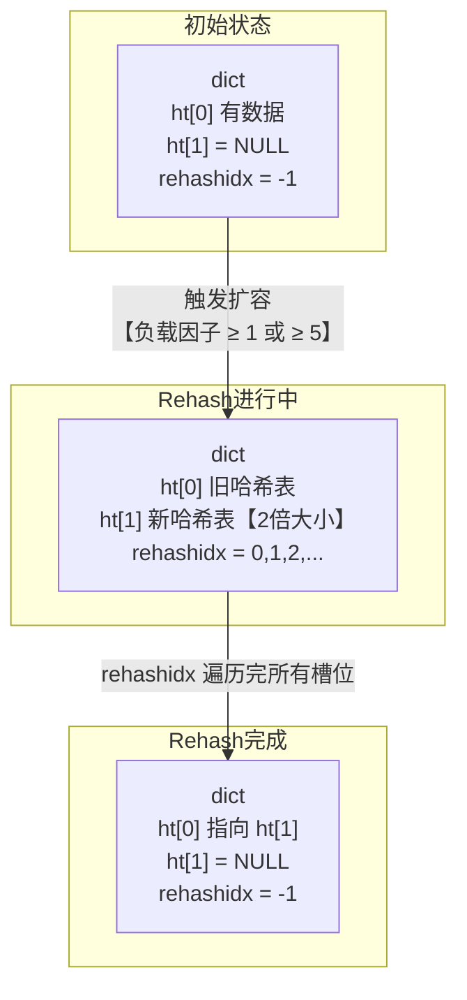

**渐进式 Rehash 流程**：

1. 为 `ht[1]` 分配空间，大小为 `ht[0].used * 2` 的 2^n
2. 设置 `rehashidx = 0`，表示从索引 0 开始 rehash
3. 每次对字典的增删改查操作，都会顺带将 `ht[0]` 在 `rehashidx` 索引上的链表迁移到 `ht[1]`
4. 迁移完成后 `rehashidx++`
5. 同时，`serverCron` 中定时执行 `dictRehashMilliseconds(1)`，每次执行 1ms 的 rehash
6. 当 `ht[0].used == 0` 时，释放 `ht[0]`，将 `ht[1]` 赋值给 `ht[0]`，重置 `rehashidx = -1`

**扩容与缩容条件**：

| 条件 | 操作 | 触发时机 |
|------|------|----------|
| 负载因子 ≥ 1 且无 BGSAVE/BGWRITEAOF | 扩容 | 每次添加键值对时检查 |
| 负载因子 ≥ 5 | 强制扩容 | 无视 BGSAVE 状态 |
| 负载因子 < 0.1 | 缩容 | 每次删除键值对时检查 |

负载因子 = `ht[0].used / ht[0].size`

***

## 场景三：高级数据类型

### 3.0 高级数据类型全景

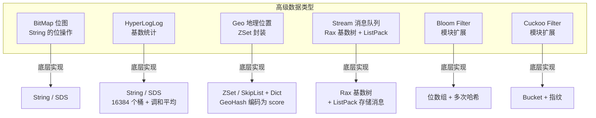

### 3.1 BitMap 位图

BitMap 不是独立的数据类型，而是基于 String 类型的一组位操作命令。

**核心命令**：

| 命令 | 说明 | 示例 |
|------|------|------|
| `SETBIT key offset value` | 设置指定偏移位的值 | `SETBIT user:1:login 20260701 1` |
| `GETBIT key offset` | 获取指定偏移位的值 | `GETBIT user:1:login 20260701` |
| `BITCOUNT key [start end]` | 统计值为 1 的位数 | `BITCOUNT user:1:login` |
| `BITOP AND/OR/XOR/NOT destkey key1 key2` | 多个 BitMap 的位运算 | `BITOP AND common_login user:1 user:2` |
| `BITPOS key bit [start end]` | 查找第一个指定值的位 | `BITPOS user:1:login 1` |

**典型应用场景**：

| 场景 | 实现方式 | 存储对比 |
|------|----------|----------|
| 用户签到 | 1 位 = 1 天，365 天 ≈ 46 字节 | 比 Set 存储日期字符串节省 100 倍 |
| 在线状态 | 1 位 = 1 个用户 | 10 万用户 ≈ 12.5 KB |
| 布隆过滤器 | 多个哈希函数 + BitMap | 低内存误判率可控 |

### 3.2 HyperLogLog 基数统计

HyperLogLog 用于统计集合的基数（去重元素数量），**标准误差 0.81%**，**内存占用固定 12KB**。

**实现原理**：

```
1. 对每个元素计算 64 位哈希值
2. 取低 14 位作为桶索引【共 16384 个桶】
3. 取高 50 位，计算第一个 1 出现的位置 ρ
4. 更新桶值：registers[bucket] = max(registers[bucket], ρ)
5. 最终基数 = 16384 * 16384 / sum(2^(-registers[i]))
```

**核心命令**：

| 命令 | 说明 |
|------|------|
| `PFADD key element [element ...]` | 添加元素 |
| `PFCOUNT key [key ...]` | 估算基数 |
| `PFMERGE destkey sourcekey [sourcekey ...]` | 合并多个 HLL |

**源码位置**：`hyperloglog.c`，核心函数 `hllDenseAdd`、`hllCount`。

### 3.3 Geo 地理位置

Geo 基于 ZSet 实现，使用 **GeoHash 算法**将经纬度编码为 52 位整数作为 score。

**GeoHash 编码原理**：

```
经纬度 → 二分区间编码 → 32 位 GeoHash 值 → ZSet score

经度区间 [-180, 180] → 二分编码 26 位
纬度区间 [-90, 90] → 二分编码 26 位
交替排列：经度位 + 纬度位 + 经度位 + ... → 52 位整数
```

**核心命令**：

| 命令 | 说明 | 时间复杂度 |
|------|------|-----------|
| `GEOADD key longitude latitude member` | 添加地理位置 | O【log N】 |
| `GEOPOS key member` | 获取坐标 | O【1】 |
| `GEODIST key member1 member2 [unit]` | 计算两点距离 | O【log N】 |
| `GEORADIUS key lon lat radius unit` | 半径查询 | O【N + log N】 |
| `GEOSEARCH key member radius unit` | 6.2+ 通用搜索 | O【N + log N】 |

### 3.4 Stream 消息队列

Redis Stream 是 5.0 引入的持久化消息队列，底层使用 **Rax 基数树**存储消息 ID，**ListPack** 存储消息体。

**Stream 架构**：

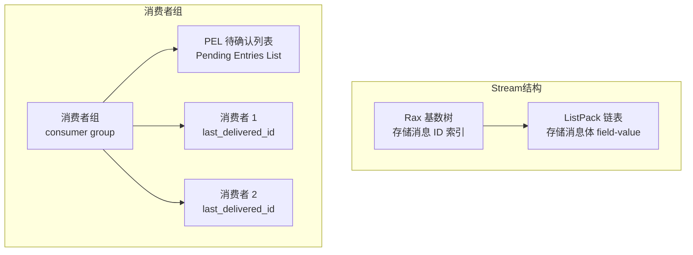

**核心命令**：

| 命令 | 说明 |
|------|------|
| `XADD key * field value` | 添加消息，`*` 自动生成 ID |
| `XREAD COUNT n STREAMS key id` | 读取消息 |
| `XGROUP CREATE key groupname id` | 创建消费者组 |
| `XREADGROUP GROUP group consumer COUNT n STREAMS key >` | 消费者组读取 |
| `XACK key group id` | 确认消息 |
| `XPENDING key group` | 查看待处理消息 |
| `XCLAIM key group consumer min-idle-time id` | 消息转移 |
| `XDEL key id` | 删除消息 |
| `XTRIM key MAXLEN n` | 限制 Stream 长度 |

**消息确认与转移机制**：

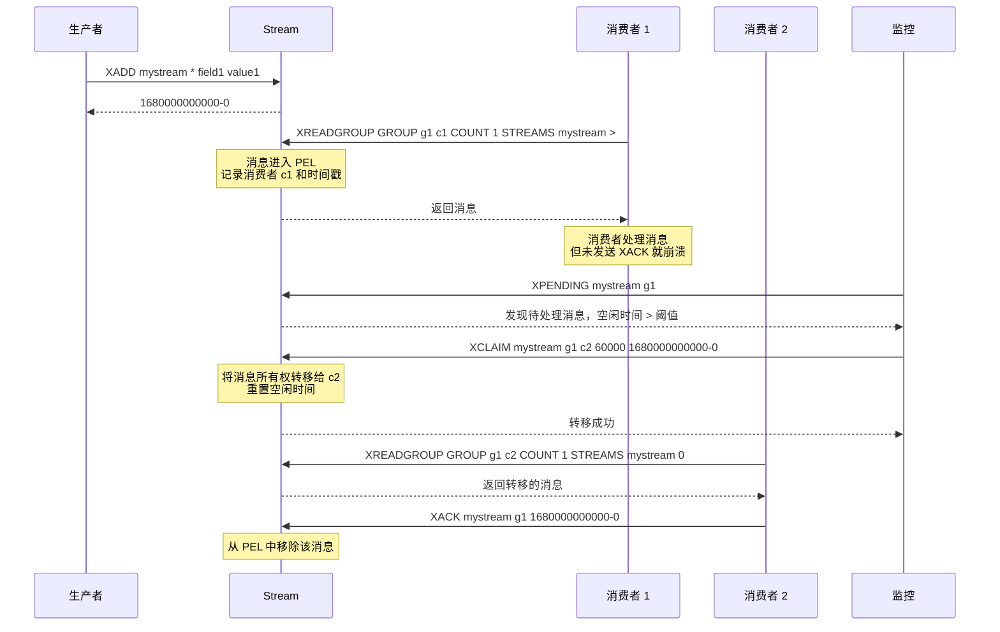

### 3.5 Bloom Filter 与 Cuckoo Filter

Redis 通过模块扩展支持布隆过滤器（RedisBloom）。

**Bloom Filter**：

| 特性 | 说明 |
|------|------|
| 添加元素 | `BF.ADD key item` / `BF.MADD key item1 item2` |
| 检查存在 | `BF.EXISTS key item` / `BF.MEXISTS key item1 item2` |
| 误判率 | 可配置，默认 0.01 |
| 内存占用 | 与预期元素数和误判率相关 |
| 删除支持 | 不支持（标准版） |

**Cuckoo Filter vs Bloom Filter**：

| 对比项 | Bloom Filter | Cuckoo Filter |
|--------|-------------|---------------|
| 删除元素 | 不支持 | 支持 `CF.DEL` |
| 插入性能 | 快 | 可能因踢出操作变慢 |
| 查询性能 | 快 | 快 |
| 空间效率 | 高 | 略低 |
| 计数支持 | 需额外实现 | 支持 `CF.COUNT` |

***

## 场景四：持久化机制

### 4.0 RDB 快照持久化

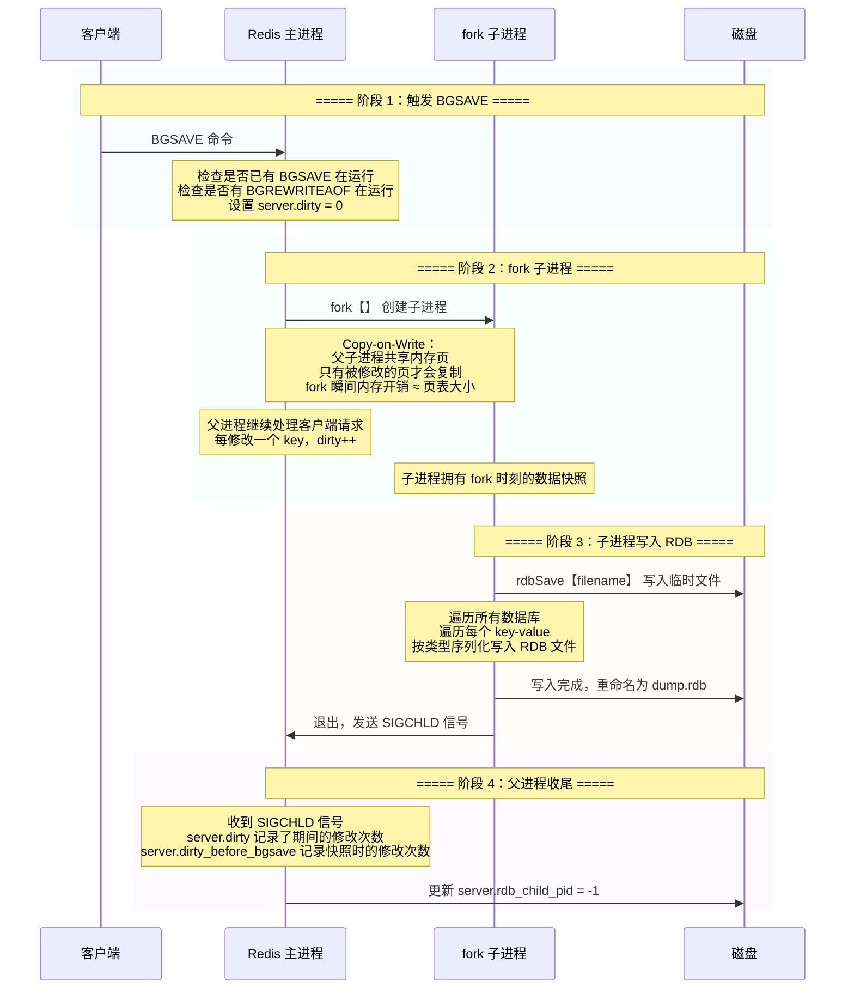

**save vs bgsave**：

| 特性 | SAVE | BGSAVE |
|------|------|--------|
| 执行方式 | 主进程同步执行 | fork 子进程异步执行 |
| 阻塞客户端 | 是，整个保存期间 | 否，仅 fork 瞬间阻塞 |
| 内存占用 | 不变 | 可能翻倍（Copy-on-Write） |
| 适用场景 | 停机维护 | 生产环境 |

**RDB 配置参数**：

```conf
# 900 秒内至少 1 个 key 变化 → 自动触发 BGSAVE
save 900 1
# 300 秒内至少 10 个 key 变化
save 300 10
# 60 秒内至少 10000 个 key 变化
save 60 10000

# RDB 文件名
dbfilename dump.rdb

# 写入时是否压缩（LZF 算法）
rdbcompression yes

# 是否校验 RDB 文件
rdbchecksum yes

# 主从全量同步时是否删除 RDB 文件
rdb-del-sync-files no

# RDB 文件存储目录
dir ./
```

**Copy-on-Write 机制**：fork 后，父子进程共享同一块物理内存，操作系统将内存页标记为只读。当父进程修改某个内存页时，触发缺页异常，操作系统复制该页给父进程，子进程继续使用旧页。因此，**内存翻倍只发生在被修改的页上**，而非全部内存。

***

### 4.1 AOF 追加日志持久化

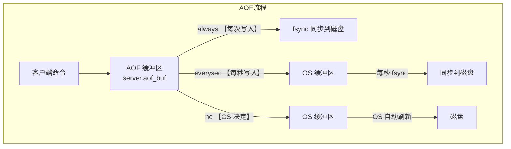

**三种刷盘策略对比**：

| 策略 | 刷盘频率 | 数据安全性 | 性能 | 风险 |
|------|----------|-----------|------|------|
| `always` | 每条命令后 fsync | 最高，最多丢失 1 条命令 | 最低，磁盘 IO 成为瓶颈 | 严重降低写入性能 |
| `everysec` | 每秒 fsync 一次 | 高，最多丢失 1 秒数据 | 较好，性能折中 | 默认推荐配置 |
| `no` | 由操作系统决定 | 低，可能丢失 30 秒数据 | 最高 | 生产环境不建议 |

**AOF 配置参数**：

```conf
# 开启 AOF
appendonly yes

# 刷盘策略
appendfsync everysec

# AOF 重写时是否继续 fsync
no-appendfsync-on-rewrite no

# 当前 AOF 大小比上次重写增长 ≥ 100% 且 ≥ 64MB 时触发重写
auto-aof-rewrite-percentage 100
auto-aof-rewrite-min-size 64mb
```

**AOF 重写机制**：

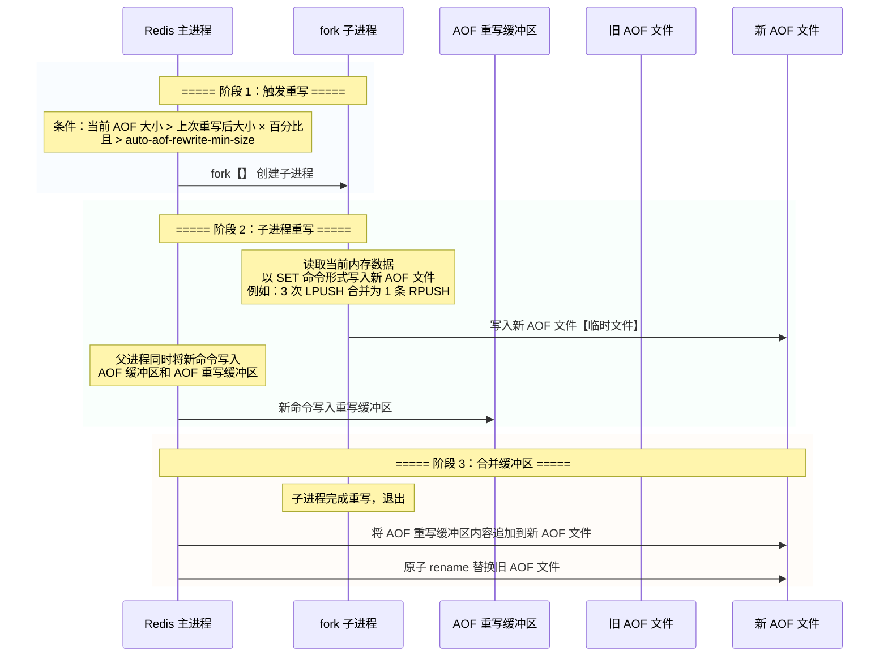

**AOF 重写的好处**：消除冗余命令（如多次 `LPUSH` 合并为一次 `RPUSH`）、过期键删除、压缩 AOF 文件体积。

***

### 4.2 RDB + AOF 混合持久化

Redis 4.0 引入混合持久化，综合 RDB 和 AOF 的优势。

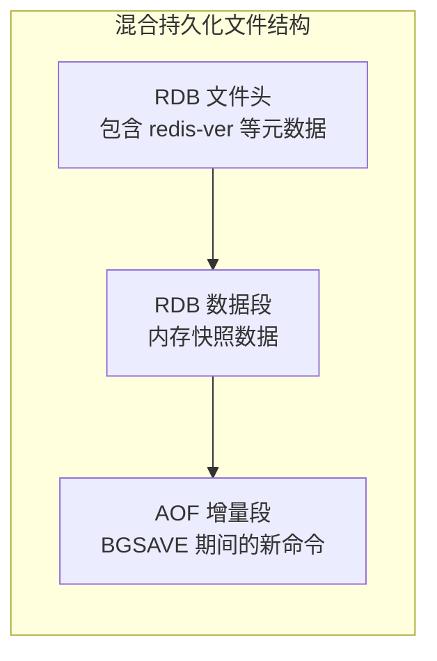

**混合持久化配置**：

```conf
aof-use-rdb-preamble yes
```

**工作原理**：AOF 重写时，fork 子进程先将内存数据以 RDB 格式写入 AOF 文件开头，再将重写缓冲区中的增量命令以 AOF 格式追加到文件末尾。恢复时，先加载 RDB 部分快速恢复内存，再执行 AOF 部分的增量命令。

| 对比 | RDB | AOF | 混合持久化 |
|------|-----|-----|----------|
| 文件体积 | 小 | 大 | 中等 |
| 恢复速度 | 快 | 慢 | 较快 |
| 数据安全性 | 间隔数据可能丢失 | 最多丢失 1 秒 | 最多丢失 1 秒 |
| 重写机制 | 全量重写 | 全量重写 | 全量重写 |

***

## 场景五：主从复制与哨兵

### 5.0 主从复制架构

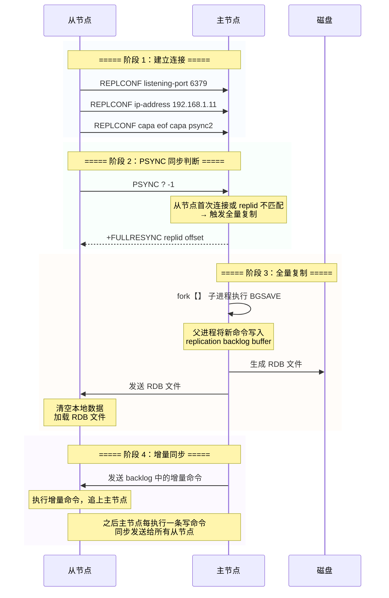

**PSYNC 复制协议版本**：

| 版本 | Redis 版本 | 特性 |
|------|-----------|------|
| PSYNC1 | 2.8+ | 引入部分同步，基于 runid + offset |
| PSYNC2 | 4.0+ | `replid` 替代 `runid`，支持故障转移后部分同步 |

**全量复制 vs 增量复制**：

| 对比项 | 全量复制 | 增量复制 |
|--------|----------|----------|
| 触发条件 | 首次连接 / replid 不匹配 / offset 不在 backlog 范围 | 从节点重连，offset 在 backlog 范围内 |
| 数据传输 | 发送完整 RDB 文件 | 仅发送 backlog 中缺失的命令 |
| 开销 | 高，CPU / 内存 / 网络 / 磁盘 | 低 |
| 从节点状态 | 清空数据，重新加载 | 保持数据，追增量 |

**replication backlog**：一个固定大小的环形缓冲区，默认 1MB（`repl-backlog-size`），主节点将所有写命令写入其中。从节点断线重连后，如果断线期间的命令仍在 backlog 中，则可以增量同步，否则触发全量同步。

**关键配置参数**：

```conf
# 主从复制配置
replicaof 192.168.1.10 6379

# 从节点是否只读
replica-read-only yes

# 主节点 backlog 缓冲区大小
repl-backlog-size 1mb

# backlog 释放时间（所有从节点断开多久后释放）
repl-backlog-ttl 3600

# 无盘复制（不写磁盘，直接网络传输 RDB）
repl-diskless-sync yes

# 无盘复制延迟（等待更多从节点一起同步）
repl-diskless-sync-delay 5

# 复制积压缓冲区大小
repl-diskless-load flush-before-load

# 从节点优先级（Sentinel 选举用）
replica-priority 100
```

***

### 5.1 Sentinel 哨兵高可用

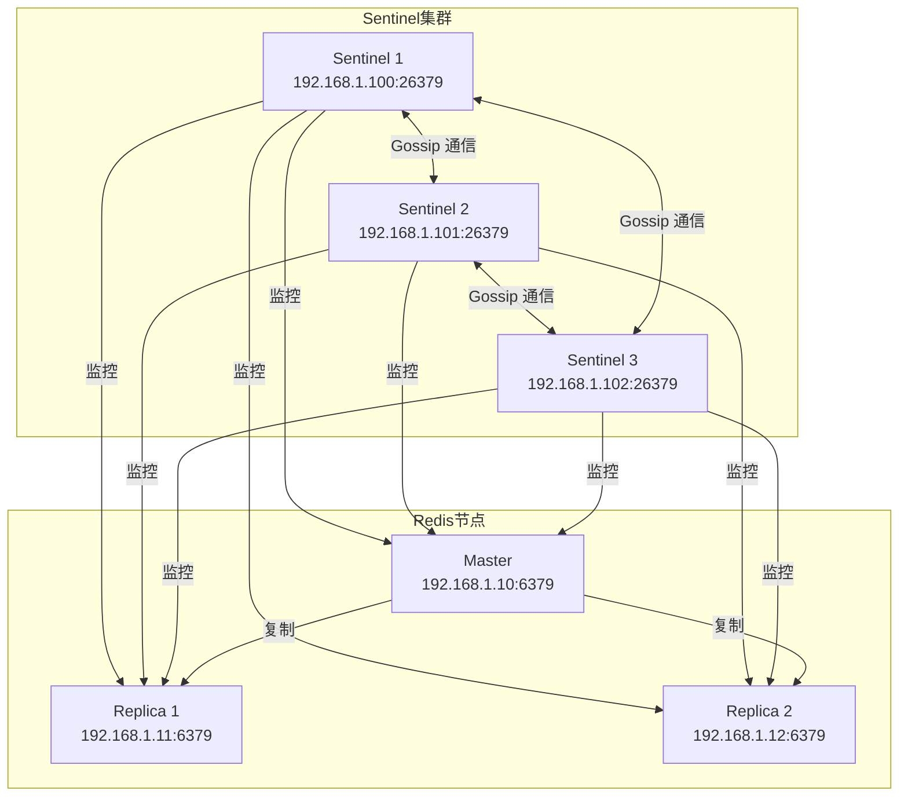

**主观下线（SDOWN）与客观下线（ODOWN）**：

| 概念 | 判断方式 | 含义 |
|------|----------|------|
| SDOWN | 单个 Sentinel 在 `down-after-milliseconds` 时间内未收到 PONG 回复 | 该 Sentinel 认为节点下线 |
| ODOWN | ≥ `quorum` 个 Sentinel 都认为节点 SDOWN | 集群达成共识，确认节点下线 |

**Leader 选举流程**（Raft 协议简化版）：

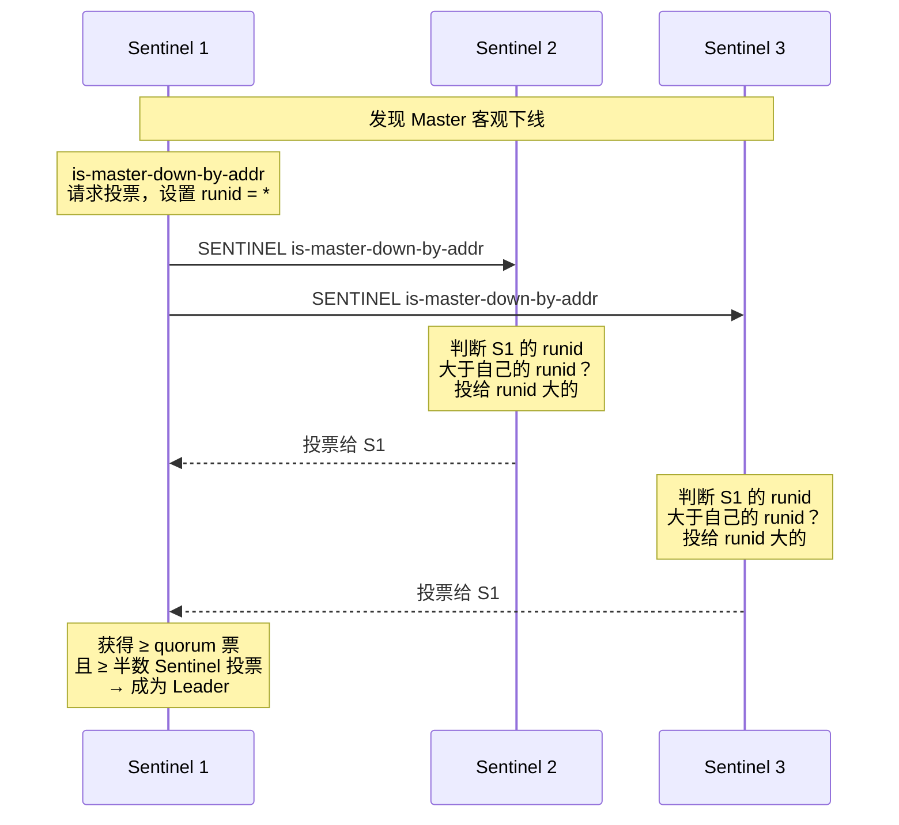

**故障转移流程**：

1. Sentinel Leader 从所有从节点中选出一个作为新主节点
2. 选择标准：`replica-priority` 最低 → 复制偏移量最大 → `runid` 最小
3. 向新主节点发送 `SLAVEOF NO ONE`
4. 向其他从节点发送 `SLAVEOF new-master-ip new-master-port`
5. 更新 Sentinel 内部状态，将旧主节点标记为从节点
6. 旧主节点恢复后，自动成为新主节点的从节点

**Sentinel 配置参数**：

```conf
# 监控主节点
sentinel monitor mymaster 192.168.1.10 6379 2

# 主观下线判断时间
sentinel down-after-milliseconds mymaster 30000

# 故障转移超时
sentinel failover-timeout mymaster 180000

# 并行同步的从节点数
sentinel parallel-syncs mymaster 1
```

***

## 场景六：Redis Cluster 集群

### 6.0 集群架构

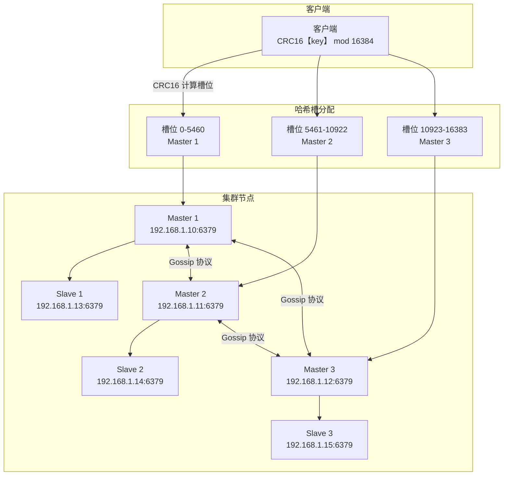

**哈希槽（Hash Slot）**：Redis Cluster 将 16384 个槽位分配到各主节点，键通过 `CRC16(key) % 16384` 决定所属槽位。

**键哈希标签（Hash Tag）**：如果键中包含 `{}`，则只计算 `{}` 中内容的哈希值。例如 `user:{1001}:profile` 和 `user:{1001}:orders` 会落在同一槽位，支持多键操作。

### 6.1 客户端重定向

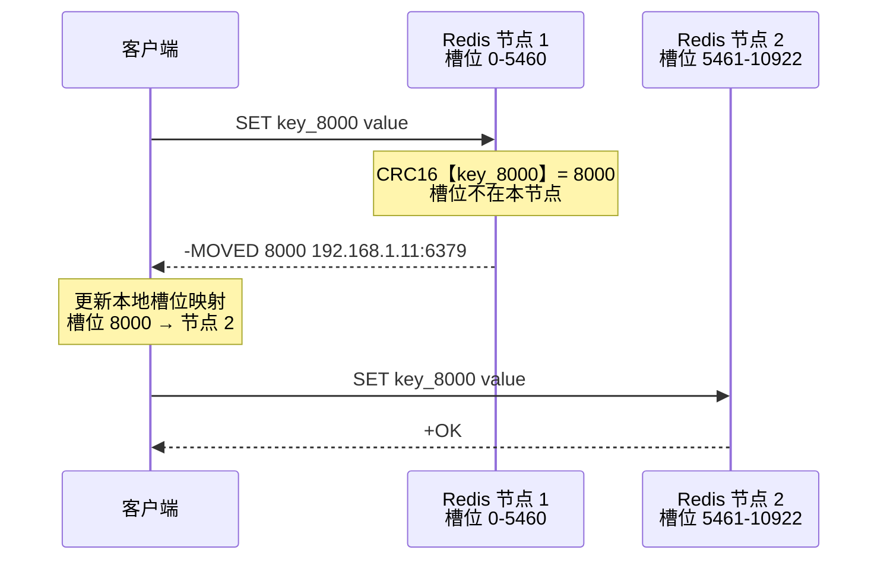

**MOVED vs ASK**：

| 重定向类型 | 触发场景 | 含义 | 客户端行为 |
|-----------|----------|------|-----------|
| `MOVED` | 槽位已永久迁移到其他节点 | 永久重定向 | 更新槽位映射表，后续请求直接发到新节点 |
| `ASK` | 槽位正在迁移中，当前键已迁移 | 临时重定向 | 仅本次请求重定向，发送 `ASKING` 命令后执行 |

**Smart 客户端原理**：JedisCluster、Lettuce 等客户端会缓存槽位映射表，直接计算键的槽位后发往对应节点，避免重定向开销。仅在收到 `MOVED` 时更新缓存。

### 6.2 Gossip 协议


**Gossip 协议工作原理**：

1. 每个节点周期性（每秒 10 次）随机选择若干个节点发送 PING
2. PING 消息携带发送者已知的**部分节点信息**（随机选择，非全部）
3. 接收者回复 PONG，携带自己的部分节点信息
4. 通过多轮 Gossip，最终所有节点信息收敛到一致
5. 当节点发现某节点疑似下线（PFAIL），会通过 Gossip 传播
6. 当半数以上主节点确认某节点 PFAIL，则广播 FAIL 消息

**Gossip 消息大小控制**：

```conf
# 每次 Ping 携带的节点数
cluster-node-timeout 15000

# 控制 Gossip 消息大小
# 节点越多，每次 Ping 携带的节点数越少
```

### 6.3 哈希槽迁移

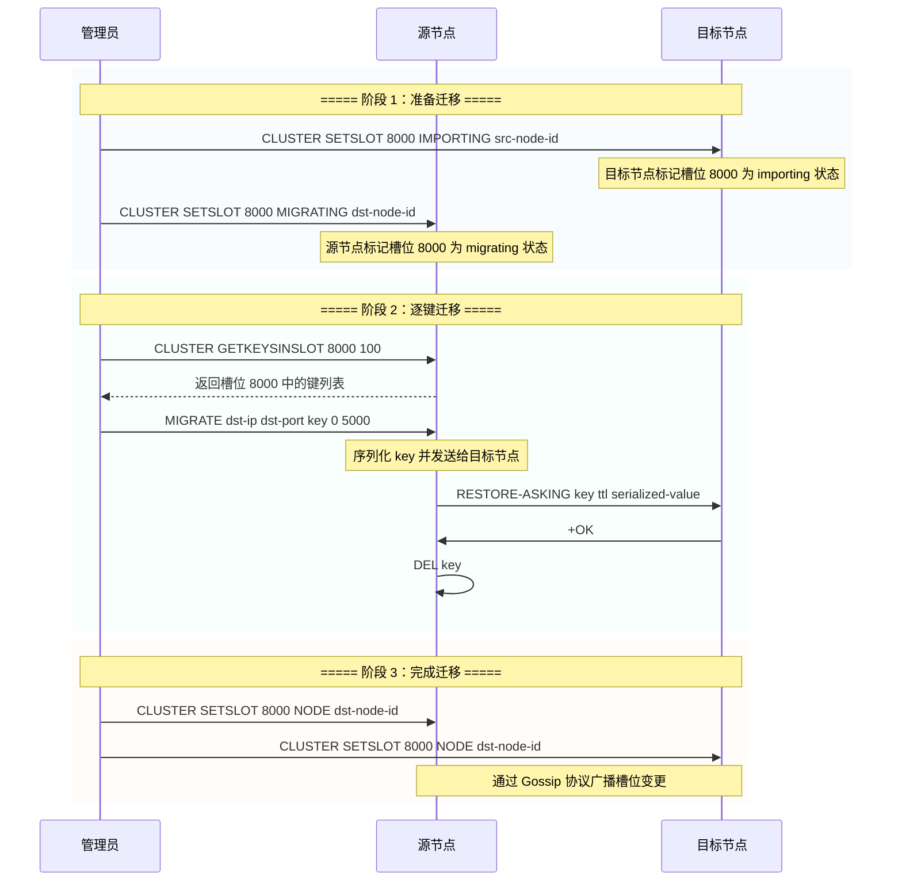

**ASK 重定向流程**（迁移期间）：

1. 客户端请求源节点，源节点发现键已迁移（或命令为 `ASKING` 前缀）
2. 源节点返回 `-ASK 8000 192.168.1.11:6379`
3. 客户端向目标节点发送 `ASKING` 命令
4. 目标节点允许执行本次请求（即使槽位仍为 importing 状态）
5. 客户端不更新槽位映射表，下次请求仍发往源节点

### 6.4 集群故障检测与主从切换

类似 Sentinel 的故障检测机制，但内置在 Cluster 协议中：

1. 节点 A 向节点 B 发送 PING，超时未收到 PONG → 标记 B 为 PFAIL
2. 节点 A 通过 Gossip 传播 B 的 PFAIL 状态
3. 当半数以上主节点确认 B 的 PFAIL → 广播 FAIL 消息
4. B 的从节点发现主节点 FAIL → 发起选举
5. 选举成功后，从节点执行 `CLUSTER SETSLOT NODE` 接管槽位

**集群配置参数**：

```conf
# 启用集群模式
cluster-enabled yes

# 集群配置文件
cluster-config-file nodes.conf

# 节点超时时间
cluster-node-timeout 15000

# 从节点迁移条件
cluster-migration-barrier 1

# 集群是否需要所有槽位覆盖才能对外服务
cluster-require-full-coverage yes

# 从节点是否允许处理读请求
cluster-allow-reads-when-down no
```

***

## 场景七：缓存实战

### 7.0 缓存读写流程

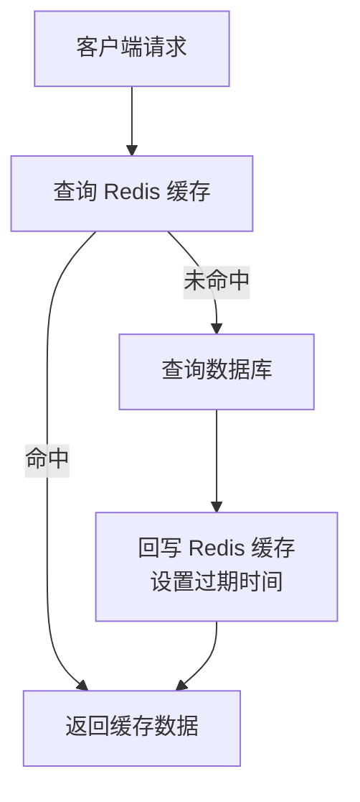

**缓存更新策略**：

| 策略 | 操作顺序 | 优点 | 缺点 |
|------|----------|------|------|
| Cache Aside | 更新 DB → 删除缓存 | 简单可靠 | 短时间不一致 |
| Read/Write Through | 缓存层代理读写 | 数据一致 | 实现复杂 |
| Write Behind | 只写缓存，异步写 DB | 高吞吐 | 数据丢失风险 |

### 7.1 缓存穿透

**问题**：查询不存在的数据，缓存和数据库都查不到，每次请求直达数据库。

**解决方案**：

| 方案 | 实现方式 | 优缺点 |
|------|----------|--------|
| 布隆过滤器 | 将所有合法 key 存入布隆过滤器，查询前先过滤 | 内存占用小，有误判率 |
| 缓存空值 | 将不存在的 key 缓存空值，设置短过期时间 | 简单，但可能浪费内存 |
| 参数校验 | 在业务层做合法性校验 | 基础防护，适合简单场景 |

```java
// 布隆过滤器示例
public String getData(String key) {
    // 1. 布隆过滤器预判
    if (!bloomFilter.mightContain(key)) {
        return null; // 一定不存在
    }
    // 2. 查询缓存
    String value = redis.get(key);
    if (value != null) {
        return value;
    }
    // 3. 查询数据库
    value = db.query(key);
    if (value != null) {
        redis.set(key, value, 3600);
    } else {
        // 4. 缓存空值，防止穿透
        redis.set(key, "", 60);
    }
    return value;
}
```

### 7.2 缓存击穿

**问题**：热点 key 过期瞬间，大量并发请求直达数据库。

**解决方案**：

| 方案 | 实现方式 | 说明 |
|------|----------|------|
| 互斥锁 | 用 `SETNX` 加锁，只有一个线程查询 DB | 简单可靠，有锁等待 |
| 逻辑过期 | 缓存永不过期，value 中存逻辑过期时间 | 异步重建，无锁等待 |
| 永不过期 | 热点 key 不设过期时间，手动更新 | 需额外维护更新机制 |

```java
// 互斥锁方案
public String getDataWithLock(String key) {
    String value = redis.get(key);
    if (value != null) {
        return value;
    }
    // 加锁，SETNX 实现
    String lockKey = "lock:" + key;
    boolean locked = redis.setnx(lockKey, "1", 10);
    if (locked) {
        try {
            // 双重检查
            value = redis.get(key);
            if (value != null) return value;
            // 查询数据库
            value = db.query(key);
            redis.set(key, value, 3600);
            return value;
        } finally {
            redis.del(lockKey);
        }
    } else {
        // 未获取锁，等待后重试
        Thread.sleep(50);
        return getDataWithLock(key);
    }
}
```

```java
// 逻辑过期方案
public String getDataWithLogicalExpire(String key) {
    String value = redis.get(key);
    CacheData data = parse(value);
    if (data == null) return null;
    if (!data.isExpired()) {
        return data.getValue();
    }
    // 异步重建缓存
    String lockKey = "lock:" + key;
    if (redis.setnx(lockKey, "1", 10)) {
        executor.submit(() -> {
            String newValue = db.query(key);
            redis.set(key, new CacheData(newValue, now + 3600));
            redis.del(lockKey);
        });
    }
    return data.getValue(); // 返回旧值，不阻塞
}
```

### 7.3 缓存雪崩

**问题**：大量 key 同时过期，或 Redis 宕机，所有请求直达数据库。

**解决方案**：

| 方案 | 实现方式 |
|------|----------|
| 过期时间随机化 | `expire = base_time + random(0, 300)` |
| 多级缓存 | Nginx 本地缓存 → Redis → DB |
| 限流降级 | Sentinel / Hystrix 限流，返回降级数据 |
| 高可用架构 | Redis Sentinel / Cluster 主从切换 |
| 缓存预热 | 启动时加载热点数据到缓存 |

```conf
# 多级缓存示例：Nginx 缓存 + Redis 缓存
# Nginx 配置
proxy_cache_path /tmp/nginx_cache levels=1:2 keys_zone=my_cache:10m;
proxy_cache my_cache;
proxy_cache_valid 200 10s;
```

### 7.4 缓存一致性

**问题**：数据库更新后，缓存与数据库数据不一致。

**解决方案对比**：

| 方案 | 原理 | 一致性 | 复杂度 |
|------|------|--------|--------|
| 先删缓存再更新 DB | 删除缓存 → 更新 DB | 存在并发问题 | 低 |
| 先更新 DB 再删缓存 | 更新 DB → 删除缓存 | 有短暂不一致窗口 | 低 |
| 延迟双删 | 删除缓存 → 更新 DB → 延迟再删缓存 | 较高 | 中 |
| Canal 订阅 binlog | 监听 MySQL binlog，异步更新缓存 | 最终一致 | 高 |

```java
// 延迟双删示例
public void updateData(String key, String newValue) {
    // 1. 删除缓存
    redis.del(key);
    // 2. 更新数据库
    db.update(key, newValue);
    // 3. 延迟再删缓存（异步）
    executor.schedule(() -> {
        redis.del(key);
    }, 500, TimeUnit.MILLISECONDS);
}
```

**Canal + binlog 方案**：

```mermaid
graph LR
    APP["应用服务"] --> |"更新数据"| DB["MySQL 数据库"]
    DB --> |"binlog 同步"| CANAL["Canal 服务<br/>伪装 MySQL Slave"]
    CANAL --> |"解析 binlog 事件"| MQ["消息队列"]
    MQ --> |"消费更新事件"| CACHE_UPDATER["缓存更新服务"]
    CACHE_UPDATER --> |"更新 / 删除"| REDIS["Redis 缓存"]
```

### 7.5 BigKey 危害与治理

**BigKey 定义**：

| 数据类型 | BigKey 阈值 | 示例 |
|----------|------------|------|
| String | > 10KB | 大 JSON 字符串 |
| List / Set / ZSet | > 5000 个元素 | 大量用户 ID 集合 |
| Hash | > 5000 个 field | 用户属性散列表 |

**BigKey 危害**：

| 危害 | 说明 |
|------|------|
| 内存不均 | 集群模式下某节点内存飙升 |
| 阻塞操作 | `DEL` 大 Key 时阻塞主线程（Redis 4.0+ 可用 `UNLINK` 异步删除） |
| 网络阻塞 | 大 Key 的读写操作传输数据量大 |
| 迁移困难 | 集群迁移槽位时大 Key 迁移耗时长 |
| 过期删除 | 大 Key 过期时，主线程删除可能阻塞 |

**BigKey 发现与治理**：

```bash
# 使用 redis-cli 扫描大 Key
redis-cli --bigkeys

# 查看 Key 的内存占用
redis-cli MEMORY USAGE keyname

# 异步删除（4.0+）
redis-cli UNLINK bigkey

# 分批删除（List 示例）
# 使用 LTRIM 分批删除，每次删除 100 个
redis-cli LTRIM biglist 0 -101
```

**预防策略**：

| 策略 | 实现方式 |
|------|----------|
| 拆分大 Key | 将大 Hash 按前缀拆分为多个小 Hash |
| 压缩存储 | String 使用 snappy / gzip 压缩后存储 |
| 数据结构优化 | 集合存储 ID 列表，详情用 String 单独存储 |
| 定期巡检 | 定时任务扫描大 Key 并告警 |

***

## 场景八：分布式锁

### 8.0 分布式锁基本流程

```mermaid
sequenceDiagram
    participant A as 客户端 A
    participant REDIS as Redis
    participant B as 客户端 B

    rect rgba(240, 248, 255, 0.4)
    Note over A,REDIS: ===== 加锁 =====
    A->>REDIS: SET lock:order:1001 unique_value NX PX 30000
    Note over REDIS: NX：仅当 key 不存在时设置<br/>PX 30000：30 秒后自动过期
    REDIS-->>A: OK【加锁成功】
    end

    rect rgba(255, 248, 240, 0.4)
    Note over B,REDIS: ===== B 尝试加锁 =====
    B->>REDIS: SET lock:order:1001 unique_value2 NX PX 30000
    REDIS-->>B: nil【加锁失败，锁已被 A 持有】
    end

    rect rgba(240, 255, 248, 0.4)
    Note over A,REDIS: ===== 执行业务 =====
    Note over A: 执行业务逻辑<br/>【需在 30 秒内完成】
    end

    rect rgba(248, 240, 255, 0.4)
    Note over A,REDIS: ===== 释放锁 Lua 脚本 =====
    A->>REDIS: EVAL 释放锁 Lua 脚本
    Note over REDIS: 原子性检查：<br/>if redis.call【'get', KEYS[1]】 == ARGV[1] then<br/>  return redis.call【'del', KEYS[1]】<br/>else<br/>  return 0<br/>end
    REDIS-->>A: 1【释放成功】
    end
```

**释放锁 Lua 脚本**：

```lua
-- 原子性释放锁：只有持有者才能释放
if redis.call('get', KEYS[1]) == ARGV[1] then
    return redis.call('del', KEYS[1])
else
    return 0
end
```

**为什么必须用 Lua 脚本释放锁**：避免先 `GET` 再 `DEL` 的非原子性问题。如果 `GET` 后发现 value 匹配，但在 `DEL` 之前锁过期并被其他客户端获取，就会误删别人的锁。

### 8.1 RedLock 红锁算法

在 Redis 多主节点（非 Cluster 模式）场景下，单节点分布式锁可能因节点故障而失效。RedLock 通过多节点多数派投票来保证锁的可靠性。

**RedLock 加锁流程**：

1. 获取当前时间 `start_time`
2. 依次向 N 个 Redis 节点请求加锁（`SET key value NX PX TTL`）
3. 计算加锁耗时：`elapsed = current_time - start_time`
4. 如果成功加锁的节点数 ≥ `N/2 + 1`，且 `elapsed < TTL`，则加锁成功
5. 锁的实际有效时间 = `TTL - elapsed`
6. 如果加锁失败，向所有节点发送释放锁请求

**RedLock 争议**：

| 观点 | 说明 |
|------|------|
| 支持 | 在 N 个独立 Redis 节点上部署，提高容错性 |
| 反对 | Martin Kleppmann 指出时钟跳跃、GC 停顿等问题可能导致锁失效 |
| 折中 | 使用 ZooKeeper / etcd 等 CP 系统实现强一致性锁 |

### 8.2 Redisson 看门狗

Redisson 是 Java 的 Redis 客户端，提供了丰富的分布式锁实现。

**看门狗（WatchDog）机制**：

```mermaid
sequenceDiagram
    participant APP as 应用线程
    participant RSON as Redisson 客户端
    participant REDIS as Redis
    participant WDOG as 看门狗定时器

    APP->>RSON: lock.lock【】
    RSON->>REDIS: EVAL 加锁 Lua 脚本
    Note over REDIS: 加锁成功，默认 leaseTime = -1
    REDIS-->>RSON: OK

    RSON->>WDOG: 启动看门狗定时器
    Note over WDOG: 每 10 秒【lockTimeout / 3】<br/>检查锁是否还被持有

    loop 看门狗续期
        WDOG->>REDIS: EVAL 续期 Lua 脚本
        Note over REDIS: if redis.call【'get', KEYS[1]】 == ARGV[1] then<br/>  return redis.call【'pexpire', KEYS[1], ARGV[2]】<br/>end
        REDIS-->>WDOG: 1
    end

    APP->>RSON: lock.unlock【】
    RSON->>REDIS: EVAL 释放锁 Lua 脚本
    REDIS-->>RSON: 1
    RSON->>WDOG: 停止看门狗定时器
```

**看门狗续期 Lua 脚本**：

```lua
-- Redisson 续期脚本
if redis.call('get', KEYS[1]) == ARGV[1] then
    return redis.call('pexpire', KEYS[1], ARGV[2])
else
    return 0
end
```

**Redisson 锁类型**：

| 锁类型 | 接口 | 特点 |
|--------|------|------|
| 可重入锁 | `RLock` | 同一线程可重复获取，内部维护计数器 |
| 公平锁 | `RFairLock` | 按请求顺序排队获取锁 |
| 读写锁 | `RReadWriteLock` | 读锁共享，写锁互斥 |
| 联锁 | `RMultiLock` | 同时锁定多个锁，全部成功才算成功 |
| 红锁 | `RRedLock` | 实现 RedLock 算法 |
| 信号量 | `RSemaphore` | 控制并发数量 |
| 闭锁 | `RCountDownLatch` | 等待一组操作完成 |

**可重入锁实现原理**：

```lua
-- Redisson 可重入锁加锁脚本
-- KEYS[1]：锁的 key
-- ARGV[1]：锁的过期时间
-- ARGV[2]：锁的持有者标识【UUID:threadId】
if redis.call('exists', KEYS[1]) == 0 then
    redis.call('hincrby', KEYS[1], ARGV[2], 1)
    redis.call('pexpire', KEYS[1], ARGV[1])
    return nil
end
if redis.call('hexists', KEYS[1], ARGV[2]) == 1 then
    redis.call('hincrby', KEYS[1], ARGV[2], 1)
    redis.call('pexpire', KEYS[1], ARGV[1])
    return nil
end
return redis.call('pttl', KEYS[1])
```

**Redisson 配置示例**：

```java
Config config = new Config();
config.useSingleServer()
    .setAddress("redis://127.0.0.1:6379")
    .setConnectionPoolSize(64)
    .setConnectionMinimumIdleSize(10)
    .setConnectTimeout(10000)
    .setTimeout(3000)
    .setRetryAttempts(3)
    .setRetryInterval(1500);

RedissonClient redisson = Redisson.create(config);
RLock lock = redisson.getLock("lock:order:1001");

// 自动续期
lock.lock(); // 默认 30 秒过期，看门狗自动续期
// 或指定过期时间（不自动续期）
lock.lock(10, TimeUnit.SECONDS);

try {
    // 业务逻辑
} finally {
    lock.unlock();
}
```

***

## 场景九：Redis 性能优化

### 9.0 慢查询日志

```conf
# 慢查询配置
# 执行时间超过 10000 微秒（10 毫秒）的命令记录
slowlog-log-slower-than 10000

# 慢查询日志最多保存 128 条
slowlog-max-len 128
```

**慢查询诊断命令**：

```bash
# 查看慢查询日志
SLOWLOG GET 10

# 查看当前慢查询日志数量
SLOWLOG LEN

# 清空慢查询日志
SLOWLOG RESET
```

**慢查询日志格式**：

```
1) (integer) 1                  # 日志 ID
2) (integer) 1680000000         # 时间戳
3) (integer) 15000              # 执行耗时（微秒）
4) 1) "KEYS"                    # 命令
   2) "prefix:*"                # 参数
5) (integer) 127.0.0.1:52341    # 客户端地址
6) ""                           # 客户端名称
```

**常见慢查询原因**：

| 原因 | 命令示例 | 优化建议 |
|------|----------|----------|
| 复杂度 O【N】命令 | `KEYS *`、`SMEMBERS`、`HGETALL` | 用 `SCAN` 替代 `KEYS`，用 `SSCAN`/`HSCAN` 分批获取 |
| 大 Key 操作 | 大 List 的 `LRANGE` | 拆分为小 Key，使用 `LTRIM` 分批 |
| CPU 密集型操作 | `SORT` 大集合 | 在应用层排序 |
| 批量操作阻塞 | 大量 `DEL` 操作 | 用 `UNLINK` 异步删除 |
| 复杂聚合操作 | Lua 脚本中大量循环 | 优化 Lua 脚本逻辑 |

### 9.1 延迟监控

**Latency Monitor**：

```bash
# 配置延迟监控阈值（毫秒）
CONFIG SET latency-monitor-threshold 100

# 查看延迟事件
LATENCY LATEST

# 查看特定事件的历史延迟
LATENCY HISTORY command

# 查看延迟诊断报告
LATENCY DOCTOR

# 重置延迟事件
LATENCY RESET
```

**常见延迟事件**：

| 事件 | 含义 | 说明 |
|------|------|------|
| `command` | 命令执行延迟 | 慢命令导致 |
| `fast-command` | 快命令延迟 | 通常由 fork / AOF 刷盘导致 |
| `fork` | fork 延迟 | 内存越大，fork 越慢 |
| `aof-fsync` | AOF 刷盘延迟 | 磁盘性能问题 |
| `aof-write` | AOF 写入延迟 | 磁盘 IO 瓶颈 |
| `expire-cycle` | 过期键删除延迟 | 大量键同时过期 |

### 9.2 Pipeline 批量操作

Pipeline 将多个命令打包发送，一次性获取所有响应，减少网络 RTT。

```java
// Jedis Pipeline 示例
Pipeline pipeline = jedis.pipelined();
for (int i = 0; i < 1000; i++) {
    pipeline.set("key:" + i, "value:" + i);
}
List<Object> results = pipeline.syncAndReturnAll();

// 或使用异步方式
pipeline.set("key1", "value1");
pipeline.get("key1");
pipeline.sync(); // 不获取返回值
```

**Pipeline vs 批量命令**：

| 对比 | Pipeline | MGET / MSET |
|------|----------|-------------|
| 适用场景 | 任意命令组合 | 仅 GET / SET 同类命令 |
| 原子性 | 非原子，中间可能插入其他客户端命令 | 原子操作 |
| 集群模式 | 跨槽位不支持 | 跨槽位不支持 |
| 网络开销 | 一次 RTT 发送多条命令 | 一次 RTT 发送多条命令 |

**集群模式下的 Pipeline**：需要使用哈希标签确保所有 key 落在同一槽位，或使用客户端自动分组功能。

### 9.3 内存优化

**内存消耗分析**：

```bash
# 查看内存使用情况
INFO memory

# 查看 Key 的内存占用
MEMORY USAGE keyname

# 查看内存分配统计
MEMORY STATS

# 查看内存诊断
MEMORY DOCTOR
```

**内存优化策略**：

| 策略 | 实现方式 | 效果 |
|------|----------|------|
| 共享对象池 | Redis 启动时预创建 0-9999 的整数对象，String 类型共享 | 减少重复整数对象的内存开销 |
| 小哈希编码 | Hash 使用 ListPack 编码，内存占用远小于 Hashtable | 可节省 50%+ 内存 |
| 数据压缩 | 应用层使用 snappy / gzip 压缩后存储 | 字符串体积减少 50-80% |
| 合理设置过期时间 | 为缓存数据设置合理的 TTL | 避免内存无限增长 |
| 内存淘汰策略 | 配置 `maxmemory-policy` | 自动淘汰不常用数据 |

**内存淘汰策略**：

| 策略 | 说明 |
|------|------|
| `noeviction` | 不淘汰，内存满时写入报错 |
| `allkeys-lru` | 所有 key 中淘汰最近最少使用的 |
| `volatile-lru` | 过期 key 中淘汰最近最少使用的 |
| `allkeys-lfu` | 所有 key 中淘汰最不经常使用的 |
| `volatile-lfu` | 过期 key 中淘汰最不经常使用的 |
| `allkeys-random` | 所有 key 中随机淘汰 |
| `volatile-random` | 过期 key 中随机淘汰 |
| `volatile-ttl` | 过期 key 中淘汰 TTL 最短的 |

**LRU vs LFU**：

| 对比 | LRU | LFU |
|------|-----|-----|
| 淘汰依据 | 最近访问时间 | 访问频率 |
| 适用场景 | 热数据随时间变化 | 热数据稳定 |
| 实现算法 | 近似 LRU（采样 N 个 key 淘汰最旧） | Morris Counter 近似计数 |
| 配置参数 | `maxmemory-samples` | `lfu-log-factor`、`lfu-decay-time` |

**内存碎片整理**：

```conf
# 开启内存碎片整理（4.0+）
activedefrag yes

# 碎片整理阈值：碎片率 ≥ 110% 时触发
active-defrag-threshold-lower 10

# 碎片率 ≥ 200% 时强制整理
active-defrag-threshold-upper 100

# 每次整理的最小 CPU 占用
active-defrag-cycle-min 1

# 每次整理的最大 CPU 占用
active-defrag-cycle-max 25
```

### 9.4 连接池配置

**Lettuce vs Jedis 对比**：

| 对比项 | Jedis | Lettuce |
|--------|-------|---------|
| 连接方式 | 直连，每个实例独立连接 | 基于 Netty，连接共享 |
| 线程安全 | 非线程安全，需连接池 | 线程安全，天然支持 |
| 异步支持 | 不支持 | 支持异步、响应式 |
| 连接池 | 需要 JedisPool | 连接天然共享，无需池 |
| 性能 | 多线程竞争连接池 | 单连接多路复用，性能更高 |
| Redis Cluster | JedisCluster | Lettuce 内置支持 |
| Spring Boot 默认 | 2.x 之前 | 2.x 及之后 |

**JedisPool 配置**：

```java
JedisPoolConfig poolConfig = new JedisPoolConfig();
poolConfig.setMaxTotal(20);           // 最大连接数
poolConfig.setMaxIdle(10);            // 最大空闲连接数
poolConfig.setMinIdle(5);             // 最小空闲连接数
poolConfig.setMaxWaitMillis(3000);    // 最大等待时间
poolConfig.setTestOnBorrow(true);     // 借用时检查连接有效性
poolConfig.setTestOnReturn(false);    // 归还时检查
poolConfig.setTestWhileIdle(true);    // 空闲时检查
poolConfig.setMinEvictableIdleTimeMillis(60000); // 空闲最小驱逐时间
poolConfig.setTimeBetweenEvictionRunsMillis(30000); // 驱逐检查间隔

JedisPool jedisPool = new JedisPool(poolConfig, "127.0.0.1", 6379, 2000, "password");
```

**Lettuce 配置**（Spring Boot）：

```yaml
spring:
  redis:
    host: 127.0.0.1
    port: 6379
    password: your_password
    timeout: 3000ms
    lettuce:
      pool:
        max-active: 20
        max-idle: 10
        min-idle: 5
        max-wait: 3000ms
      shutdown-timeout: 100ms
    cluster:
      nodes:
        - 192.168.1.10:6379
        - 192.168.1.11:6379
        - 192.168.1.12:6379
      max-redirects: 3
```

### 9.5 性能优化检查清单

| 检查项 | 建议值 | 相关命令 / 配置 |
|--------|--------|-----------------|
| 检查慢查询日志 | `slowlog-log-slower-than` 设为 10000 | `SLOWLOG GET 10` |
| 扫描大 Key | 检查 > 10KB 的 String 和 > 5000 元素的集合 | `redis-cli --bigkeys` |
| 检查内存碎片率 | 碎片率 < 1.5 | `INFO memory` 查看 `mem_fragmentation_ratio` |
| 检查连接数 | 连接数 < `maxclients` 的 80% | `INFO clients` |
| 检查命中率 | keyspace_hits /【keyspace_hits + keyspace_misses】 > 0.9 | `INFO stats` |
| 确认淘汰策略 | 根据业务选择 LRU/LFU | `CONFIG GET maxmemory-policy` |
| 检查 AOF 刷盘策略 | 生产环境用 `everysec` | `CONFIG GET appendfsync` |
| 禁用危险命令 | 重命名 `KEYS`/`FLUSHALL`/`FLUSHDB`/`CONFIG` | `rename-command KEYS ""` |
| 设置密码 | 生产环境必须设置 | `requirepass` / `masterauth` |
| 绑定 IP | 不绑定 0.0.0.0 | `bind 127.0.0.1 192.168.1.10` |

***

### 9.6 Redis 事务机制

Redis 事务提供了一次性执行多条命令的能力，但不支持回滚。

**事务命令**：

| 命令 | 说明 |
|------|------|
| `MULTI` | 开启事务 |
| `EXEC` | 执行事务中的所有命令 |
| `DISCARD` | 取消事务 |
| `WATCH key [key ...]` | 监视 key，如果 key 在 EXEC 之前被修改，则事务不执行 |
| `UNWATCH` | 取消所有 WATCH |

**事务执行流程**：

```mermaid
sequenceDiagram
    participant C as 客户端
    participant R as Redis

    C->>R: MULTI
    R-->>C: +OK

    C->>R: SET key1 value1
    R-->>C: +QUEUED

    C->>R: INCR counter
    R-->>C: +QUEUED

    C->>R: GET key1
    R-->>C: +QUEUED

    C->>R: EXEC
    Note over R: 原子性执行所有排队的命令
    R-->>C: 1) OK 2) 【integer】 1 3) "value1"
```

**WATCH 乐观锁机制**：

```mermaid
sequenceDiagram
    participant C1 as 客户端 1
    participant C2 as 客户端 2
    participant R as Redis

    C1->>R: WATCH balance
    C1->>R: GET balance
    R-->>C1: 100

    Note over C2: 客户端 2 修改了 balance
    C2->>R: SET balance 80
    R-->>C2: +OK

    C1->>R: MULTI
    C1->>R: SET balance 50
    R-->>C1: +QUEUED

    C1->>R: EXEC
    Note over R: balance 已被修改，事务不执行
    R-->>C1: 【nil】
```

**Redis 事务 vs 关系型数据库事务**：

| 对比项 | Redis 事务 | RDBMS 事务 |
|--------|-----------|-----------|
| 原子性 | 批量执行，中间失败不停止 | 全部成功或全部回滚 |
| 回滚 | 不支持 | 支持 |
| 隔离性 | 串行执行，天然隔离 | 多种隔离级别 |
| 持久性 | 取决于 AOF/RDB 配置 | 取决于事务日志配置 |

**事务中的错误处理**：

| 错误类型 | 发生时机 | 行为 |
|----------|----------|------|
| 语法错误 | 入队时（QUEUED 阶段） | 整个事务不执行 |
| 运行时错误 | 执行时（EXEC 阶段） | 错误命令不执行，其他命令正常执行 |

***

### 9.7 Lua 脚本深入

Redis 从 2.6 开始支持 Lua 脚本，脚本在 Redis 中原子性执行。

**核心命令**：

| 命令 | 说明 |
|------|------|
| `EVAL script numkeys key [key ...] arg [arg ...]` | 执行 Lua 脚本 |
| `EVALSHA sha1 numkeys key [key ...] arg [arg ...]` | 通过 SHA1 摘要执行缓存脚本 |
| `SCRIPT LOAD script` | 加载脚本到缓存，返回 SHA1 |
| `SCRIPT EXISTS sha1 [sha1 ...]` | 检查脚本是否已缓存 |
| `SCRIPT FLUSH` | 清空脚本缓存 |
| `SCRIPT KILL` | 杀死正在执行的脚本 |

**Lua 脚本示例**：

```lua
-- 库存扣减脚本：原子性检查库存并扣减
-- KEYS[1]：库存 key
-- ARGV[1]：扣减数量
local stock = redis.call('get', KEYS[1])
if not stock then
    return -1  -- key 不存在
end
stock = tonumber(stock)
local deduct = tonumber(ARGV[1])
if stock < deduct then
    return -2  -- 库存不足
end
redis.call('decrby', KEYS[1], deduct)
return stock - deduct  -- 返回剩余库存
```

```lua
-- 限流脚本：令牌桶算法
-- KEYS[1]：令牌桶 key
-- ARGV[1]：请求速率（令牌/秒）
-- ARGV[2]：桶容量
-- ARGV[3]：当前时间戳（毫秒）
-- ARGV[4]：请求令牌数
local bucket = redis.call('hmget', KEYS[1], 'tokens', 'last_time')
local tokens = tonumber(bucket[1]) or tonumber(ARGV[2])
local last_time = tonumber(bucket[2]) or tonumber(ARGV[3])

local now = tonumber(ARGV[3])
local rate = tonumber(ARGV[1])
local capacity = tonumber(ARGV[2])
local requested = tonumber(ARGV[4])

-- 计算新增令牌
local delta = math.max(0, now - last_time)
local new_tokens = math.min(capacity, tokens + delta * rate / 1000)
local allowed = new_tokens >= requested

if allowed then
    new_tokens = new_tokens - requested
end

redis.call('hmset', KEYS[1], 'tokens', new_tokens, 'last_time', now)
redis.call('pexpire', KEYS[1], 60000)
return allowed and 1 or 0
```

**Lua 脚本最佳实践**：

| 实践 | 说明 |
|------|------|
| 避免长时间运行 | Lua 脚本执行期间阻塞所有其他请求 |
| 使用 `EVALSHA` | 减少网络传输脚本内容 |
| 脚本参数化 | 通过 KEYS/ARGV 传参，不要拼接字符串 |
| 避免随机操作 | `random` 等非确定性函数可能影响主从一致性 |
| 原子性保证 | 脚本内所有操作要么全部执行，要么全部不执行 |
| 集群模式限制 | 所有 key 必须在同一槽位，使用哈希标签 |

**SCRIPT KILL vs SHUTDOWN NOSAVE**：

| 命令 | 场景 | 说明 |
|------|------|------|
| `SCRIPT KILL` | 脚本未执行写操作 | 终止脚本，数据不变 |
| `SHUTDOWN NOSAVE` | 脚本已执行写操作 | 强制终止，数据可能丢失 |

***

### 9.8 Pub/Sub 发布订阅

Redis Pub/Sub 提供消息的发布与订阅功能，支持频道订阅与模式订阅。

**核心命令**：

| 命令 | 说明 |
|------|------|
| `PUBLISH channel message` | 向频道发布消息 |
| `SUBSCRIBE channel [channel ...]` | 订阅频道 |
| `UNSUBSCRIBE [channel ...]` | 退订频道 |
| `PSUBSCRIBE pattern [pattern ...]` | 模式订阅（如 `news.*`） |
| `PUNSUBSCRIBE [pattern ...]` | 退订模式 |
| `PUBSUB CHANNELS [pattern]` | 列出活跃频道 |
| `PUBSUB NUMSUB [channel ...]` | 查看频道订阅数 |
| `PUBSUB NUMPAT` | 查看模式订阅数 |

**Pub/Sub 架构**：

```mermaid
graph TB
    subgraph 发布者
        P1["发布者 1<br/>PUBLISH news:sports 消息"]
        P2["发布者 2<br/>PUBLISH news:tech 消息"]
    end

    subgraph Redis 服务端
        CHANNELS["频道字典<br/>channel → 订阅者列表"]
        PATTERNS["模式链表<br/>pattern → 订阅者列表"]
    end

    subgraph 订阅者
        S1["订阅者 1<br/>SUBSCRIBE news:sports"]
        S2["订阅者 2<br/>PSUBSCRIBE news:*"]
        S3["订阅者 3<br/>SUBSCRIBE news:tech"]
    end

    P1 --> CHANNELS
    P2 --> CHANNELS
    CHANNELS --> S1
    CHANNELS --> S3
    PATTERNS --> S2
```

**Pub/Sub 特点与限制**：

| 特性 | 说明 |
|------|------|
| 消息不持久化 | 订阅者离线期间的消息会丢失 |
| 无 ACK 机制 | 发送即忘，不保证送达 |
| 不支持消息回溯 | 不能像 Kafka 一样回溯历史消息 |
| 性能 | 纯内存操作，吞吐量极高 |
| 适用场景 | 实时通知、聊天消息、配置热更新 |
| 不适用场景 | 需要消息持久化、可靠投递的关键业务 |

**Pub/Sub vs Stream**：

| 对比 | Pub/Sub | Stream |
|------|---------|--------|
| 消息持久化 | 不支持 | 支持 |
| 消费者组 | 不支持 | 支持 |
| ACK 确认 | 不支持 | 支持 |
| 消息回溯 | 不支持 | 支持 |
| 适用场景 | 实时通知 | 消息队列、事件溯源 |

***

### 9.9 Redis Modules 模块扩展

Redis 通过模块系统扩展核心功能，使用 C 语言编写动态库。

**主流模块**：

| 模块 | 功能 | 核心命令 |
|------|------|----------|
| RedisBloom | 布隆过滤器 / 布谷鸟过滤器 | `BF.ADD`、`CF.ADD` |
| RedisJSON | JSON 文档存储与查询 | `JSON.SET`、`JSON.GET` |
| RedisTimeSeries | 时间序列数据存储 | `TS.CREATE`、`TS.ADD` |
| RedisGraph | 图数据库 | `GRAPH.QUERY` |
| RedisSearch | 全文搜索与二级索引 | `FT.CREATE`、`FT.SEARCH` |
| RedisGears | 无服务器引擎 | `RG.PYEXECUTE` |
| RedisAI | AI 模型推理 | `AI.MODELSET`、`AI.TENSORSET` |

**加载模块**：

```conf
# redis.conf 中加载模块
loadmodule /path/to/redisbloom.so
loadmodule /path/to/redisjson.so

# 或运行时加载
MODULE LOAD /path/to/redisbloom.so
```

**RedisJSON 使用示例**：

```bash
# 设置 JSON 文档
JSON.SET user:1 $ '{"name": "张三", "age": 28, "tags": ["java", "redis"]}'

# 获取整个 JSON
JSON.GET user:1 $

# 获取特定字段
JSON.GET user:1 $.name

# 修改字段
JSON.SET user:1 $.age 29

# 数组追加
JSON.ARRAPPEND user:1 $.tags '"kafka"'

# 数值递增
JSON.NUMINCRBY user:1 $.age 1
```

**RedisSearch 使用示例**：

```bash
# 创建索引
FT.CREATE idx:users ON HASH PREFIX 1 user: SCHEMA name TEXT age NUMERIC

# 全文搜索
FT.SEARCH idx:users "张三"

# 聚合搜索
FT.SEARCH idx:users "@age:[20 30]" SORTBY age ASC
```

***

### 9.10 INFO 命令详解

`INFO` 命令是 Redis 监控的核心入口，返回服务器的各项统计信息。

**INFO 各模块详解**：

| 模块 | 关键字段 | 含义 |
|------|----------|------|
| `server` | `redis_version`、`uptime_in_seconds`、`process_id` | 服务器基本信息 |
| `clients` | `connected_clients`、`blocked_clients` | 客户端连接信息 |
| `memory` | `used_memory`、`mem_fragmentation_ratio`、`maxmemory` | 内存使用与碎片 |
| `persistence` | `rdb_last_save_time`、`aof_current_size`、`aof_last_rewrite_time` | 持久化状态 |
| `stats` | `total_connections_received`、`keyspace_hits`、`keyspace_misses`、`evicted_keys` | 运行时统计 |
| `replication` | `role`、`connected_slaves`、`master_repl_offset` | 主从复制状态 |
| `cpu` | `used_cpu_sys`、`used_cpu_user` | CPU 使用统计 |
| `commandstats` | 各命令的执行次数与耗时 | 命令级统计 |
| `cluster` | `cluster_enabled` | 集群状态 |
| `keyspace` | 各 DB 的 key 数量、过期 key 数量、平均 TTL | 键空间统计 |

**关键监控指标**：

```bash
# 计算缓存命中率
# 命中率 = keyspace_hits / (keyspace_hits + keyspace_misses)
INFO stats | grep keyspace

# 查看内存碎片率（理想值 ~1.0，> 1.5 需要关注）
INFO memory | grep mem_fragmentation_ratio

# 查看连接的从节点数
INFO replication | grep connected_slaves

# 查看被淘汰的 key 数量
INFO stats | grep evicted_keys

# 查看过期 key 数量
INFO stats | grep expired_keys

# 查看命令统计
INFO commandstats
```

**Redis-Benchmark 性能测试**：

```bash
# 基础测试：100 并发，10 万请求
redis-benchmark -h 127.0.0.1 -p 6379 -c 100 -n 100000

# 指定测试命令
redis-benchmark -t set,get -c 100 -n 100000

# 指定数据大小
redis-benchmark -t set,get -d 1024 -c 50 -n 100000

# Pipeline 模式测试
redis-benchmark -t set,get -P 16 -c 50 -n 100000

# 仅测试读性能
redis-benchmark -t get -c 100 -n 1000000

# 输出 CSV 格式
redis-benchmark -t set,get --csv
```

**常见性能基准参考**（单机 Redis，无持久化）：

| 操作 | QPS（单线程） | QPS（多线程 IO，4 线程） |
|------|-------------|------------------------|
| `SET`（小数据） | ~100,000 | ~250,000 |
| `GET`（小数据） | ~100,000 | ~300,000 |
| `LPUSH` | ~100,000 | ~200,000 |
| `INCR` | ~100,000 | ~200,000 |
| Pipeline `SET` | ~500,000 | ~1,000,000 |

***

### 9.11 Redis 安全加固

**安全配置清单**：

```conf
# 1. 设置强密码
requirepass "your-strong-password-here"

# 2. 主节点也需要密码
masterauth "your-strong-password-here"

# 3. 绑定指定 IP
bind 127.0.0.1 192.168.1.10

# 4. 关闭保护模式（绑定非 127.0.0.1 时）
protected-mode no

# 5. 重命名危险命令
rename-command FLUSHALL ""
rename-command FLUSHDB ""
rename-command KEYS ""
rename-command CONFIG "CONFIG_abc123"
rename-command SHUTDOWN "SHUTDOWN_abc123"
rename-command DEBUG ""

# 6. 限制最大客户端连接数
maxclients 10000

# 7. 设置超时时间（秒）
timeout 300

# 8. 日志级别
loglevel notice

# 9. 日志文件
logfile "/var/log/redis/redis.log"

# 10. TLS 加密（6.0+）
tls-port 6380
tls-cert-file /path/to/redis.crt
tls-key-file /path/to/redis.key
tls-ca-cert-file /path/to/ca.crt
```

**Redis 安全最佳实践**：

| 实践 | 说明 |
|------|------|
| 网络隔离 | Redis 部署在私有网络，不暴露在公网 |
| 密码强认证 | 使用 ACL（6.0+）进行细粒度权限控制 |
| 最小权限原则 | 为不同应用创建不同用户，限制命令和 key 前缀 |
| 定期更新 | 关注 Redis 安全公告，及时更新版本 |
| 审计日志 | 开启 `SLOWLOG` 记录异常命令 |
| 加密传输 | 使用 TLS 加密客户端与 Redis 之间的通信 |
| 备份加密 | RDB/AOF 文件加密存储 |

**ACL 权限控制（Redis 6.0+）**：

```bash
# 创建只读用户
ACL SETUSER readonly on >password123 ~* +@read -@write -@dangerous

# 创建特定前缀的读写用户
ACL SETUSER appuser on >apppass123 ~app:* +@all -@dangerous

# 查看所有用户
ACL LIST

# 查看用户权限
ACL GETUSER readonly

# 删除用户
ACL DELUSER readonly

# 保存 ACL 到配置文件
ACL SAVE

# 从配置文件加载 ACL
ACL LOAD
```

***

## 总结

Redis 之所以能在高性能场景下广泛应用，得益于其精心设计的以下核心特性：

| 维度 | 核心机制 | 关键实现 |
|------|----------|----------|
| 高性能 | 单线程 + epoll 事件驱动 | `ae.c` / `ae_epoll.c` |
| 丰富数据结构 | 五种基本类型 + 扩展类型 | SDS / Dict / SkipList / QuickList / ListPack |
| 持久化 | RDB + AOF + 混合持久化 | `rdb.c` / `aof.c` |
| 高可用 | 主从复制 + Sentinel | `replication.c` / `sentinel.c` |
| 可扩展 | Cluster 分片 | `cluster.c` / Gossip 协议 |
| 缓存体系 | 穿透/击穿/雪崩防护 | 布隆过滤器 / 互斥锁 / 随机过期 |
| 分布式协同 | 分布式锁 + 消息队列 | `SET NX PX` / RedLock / Stream |
| 性能优化 | Pipeline + 连接池 + 内存优化 | 慢查询监控 / 碎片整理 |

:::note
本文覆盖了 Redis 从底层数据结构到上层集群架构的完整知识体系。建议按顺序阅读，从场景一的架构总览开始，逐步深入到各个子系统的实现细节。对于面试准备，重点关注：场景二【数据结构】、场景四【持久化】、场景五【主从哨兵】、场景七【缓存实战】、场景八【分布式锁】。
:::

:::warning
#[R|生产环境必备安全检查]：务必设置 `requirepass` 密码认证、使用 `bind` 限制访问 IP、重命名危险命令【`rename-command KEYS ""`】、禁用 `protected-mode no`、定期更新 Redis 版本以修复已知安全漏洞。
:::