# Spring Boot 深度解析 · 从自动配置到生产部署

> 本文以 Spring Boot 3.x 为基准，深入剖析其核心机制：从启动流程的全链路追踪，到自动配置的魔法背后，再到嵌入式服务器、Actuator 监控、配置管理、数据访问与安全防护。
> 每个场景均配备详细的 Mermaid 时序图与架构图，标注核心类名、方法签名与源码位置，适合 #[C|3 年以上经验的 Java 后端开发者] 深入研读。

***

## Spring Boot 核心架构总览

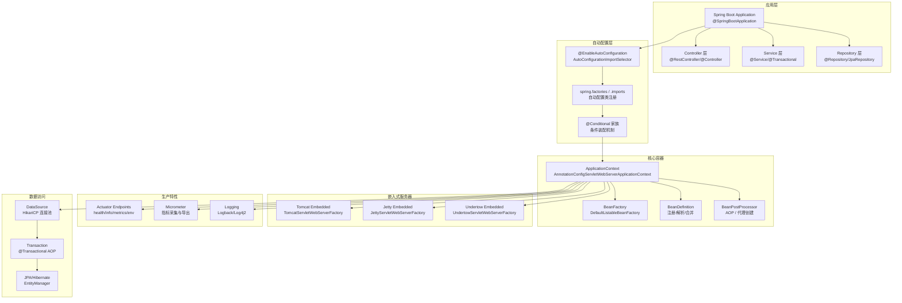
```mermaid
graph TB
    subgraph 应用层
        APP["Spring Boot Application<br/>@SpringBootApplication"]
        CTRL["Controller 层<br/>@RestController/@Controller"]
        SVC["Service 层<br/>@Service/@Transactional"]
        REPO["Repository 层<br/>@Repository/JpaRepository"]
    end

    subgraph 自动配置层
        ENABLE["@EnableAutoConfiguration<br/>AutoConfigurationImportSelector"]
        FACTORIES["spring.factories / .imports<br/>自动配置类注册"]
        CONDITIONAL["@Conditional 家族<br/>条件装配机制"]
    end

    subgraph 核心容器
        CTX["ApplicationContext<br/>AnnotationConfigServletWebServerApplicationContext"]
        BF["BeanFactory<br/>DefaultListableBeanFactory"]
        BDP["BeanDefinition<br/>注册/解析/合并"]
        POST["BeanPostProcessor<br/>AOP / 代理创建"]
    end

    subgraph 嵌入式服务器
        TOMCAT["Tomcat Embedded<br/>TomcatServletWebServerFactory"]
        JETTY["Jetty Embedded<br/>JettyServletWebServerFactory"]
        UNDR["Undertow Embedded<br/>UndertowServletWebServerFactory"]
    end

    subgraph 生产特性
        ACT["Actuator Endpoints<br/>health/info/metrics/env"]
        MICRO["Micrometer<br/>指标采集与导出"]
        LOG["Logging<br/>Logback/Log4j2"]
    end

    subgraph 数据访问
        DS["DataSource<br/>HikariCP 连接池"]
        TX["Transaction<br/>@Transactional AOP"]
        JPA["JPA/Hibernate<br/>EntityManager"]
    end

    APP --> ENABLE
    ENABLE --> FACTORIES
    FACTORIES --> CONDITIONAL
    CONDITIONAL --> CTX
    CTX --> BF
    CTX --> BDP
    CTX --> POST
    APP --> CTRL
    APP --> SVC
    APP --> REPO
    CTX --> TOMCAT
    CTX --> JETTY
    CTX --> UNDR
    CTX --> ACT
    CTX --> MICRO
    CTX --> LOG
    CTX --> DS
    DS --> TX
    TX --> JPA
```

:::important
本文所有源码分析基于 #[R|Spring Boot 3.2.x] 与 #[R|Spring Framework 6.1.x]，核心包路径为 `org.springframework.boot` 和 `org.springframework.boot.autoconfigure`。
关键类的源码位置均以相对路径标注，所有 Mermaid 图表中的类名与方法名均为真实 API。
:::

***

## 场景一：Spring Boot 启动流程全链路

### 1.0 场景概览

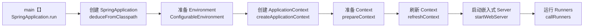
```mermaid
graph LR
    A["main【】<br/>SpringApplication.run"] --> B["创建 SpringApplication<br/>deduceFromClasspath"]
    B --> C["准备 Environment<br/>ConfigurableEnvironment"]
    C --> D["创建 ApplicationContext<br/>createApplicationContext"]
    D --> E["准备 Context<br/>prepareContext"]
    E --> F["刷新 Context<br/>refreshContext"]
    F --> G["启动嵌入式 Server<br/>startWebServer"]
    G --> H["运行 Runners<br/>callRunners"]
```

| 阶段 | 核心类 | 关键机制 | 源码位置 |
|------|--------|----------|----------|
| 创建 SpringApplication | `SpringApplication` | 推断应用类型、设置 Initializers/Listeners | `org.springframework.boot.SpringApplication` |
| 准备 Environment | `SpringApplicationRunListeners` | 加载 properties/yml、激活 Profile | `org.springframework.boot.SpringApplication#prepareEnvironment` |
| 创建 ApplicationContext | `createApplicationContext()` | 根据 WebApplicationType 选择 Context 类型 | `org.springframework.boot.SpringApplication#createApplicationContext` |
| 准备 Context | `prepareContext()` | 注册 BeanDefinition、执行 Initializers | `org.springframework.boot.SpringApplication#prepareContext` |
| 刷新 Context | `AbstractApplicationContext#refresh()` | 13 步标准刷新流程 | `org.springframework.context.support.AbstractApplicationContext` |
| 启动嵌入式 Server | `WebServerStartStopLifecycle` | 创建 Tomcat/Jetty/Undertow 并启动 | `org.springframework.boot.web.servlet.context.ServletWebServerApplicationContext` |
| 运行 Runners | `ApplicationRunner` / `CommandLineRunner` | 回调执行用户自定义启动逻辑 | `org.springframework.boot.SpringApplication#callRunners` |

### 1.1 启动流程全链路时序图

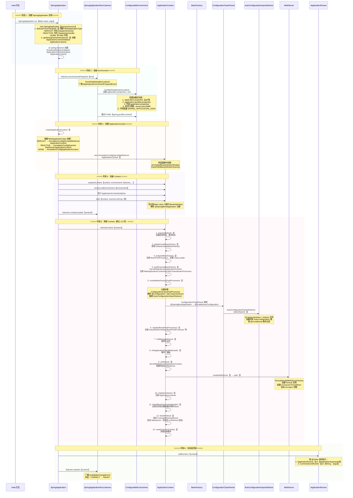
```mermaid
sequenceDiagram
    participant Main as main方法
    participant SA as SpringApplication
    participant SL as SpringApplicationRunListeners
    participant ENV as ConfigurableEnvironment
    participant CTX as ApplicationContext
    participant BF as BeanFactory
    participant BDP as ConfigurationClassParser
    participant AUTO as AutoConfigurationImportSelector
    participant WEB as WebServer
    participant RUN as ApplicationRunner

    rect rgba(240, 248, 255, 0.4)
    Note over Main,SA: ===== 阶段 1：创建 SpringApplication 实例 =====
    Main->>SA: SpringApplication.run【Main.class, args】
    Note over SA: new SpringApplication【primarySources】<br/>1. deduceFromClasspath【】推断 WebApplicationType<br/>   - SERVLET: 存在 DispatcherServlet<br/>   - REACTIVE: 存在 DispatcherHandler<br/>   - NONE: 非 Web 环境<br/>2. getSpringFactoriesInstances【】加载<br/>   ApplicationContextInitializer<br/>   ApplicationListener
    SA->>SA: 从 spring.factories 加载<br/>BootstrapRegistryInitializer<br/>ApplicationContextInitializer<br/>ApplicationListener
    end

    rect rgba(240, 255, 248, 0.4)
    Note over SA,ENV: ===== 阶段 2：准备 Environment =====
    SA->>SL: listeners.environmentPrepared【env】
    Note over SL: EventPublishingRunListener<br/>广播 ApplicationEnvironmentPreparedEvent
    SL->>ENV: ConfigFileApplicationListener<br/>加载 application.properties / yml
    Note over ENV: 配置加载优先级：<br/>1. application.properties【jar内】<br/>2. application-{profile}.properties<br/>3. 外部 application.properties<br/>4. 命令行参数 --server.port=8080<br/>5. 环境变量 SPRING_APPLICATION_JSON
    SL->>ENV: 激活 Profile【spring.profiles.active】
    end

    rect rgba(255, 248, 240, 0.4)
    Note over SA,CTX: ===== 阶段 3：创建 ApplicationContext =====
    SA->>SA: createApplicationContext【】
    Note over SA: 根据 WebApplicationType 创建：<br/>SERVLET → AnnotationConfigServletWebServer<br/>ApplicationContext<br/>REACTIVE → AnnotationConfigReactive<br/>WebServerApplicationContext<br/>NONE → AnnotationConfigApplicationContext
    SA->>CTX: new AnnotationConfigServletWebServer<br/>ApplicationContext【】
    Note over CTX: 构造函数中创建：<br/>AnnotatedBeanDefinitionReader<br/>ClassPathBeanDefinitionScanner
    end

    rect rgba(248, 240, 255, 0.4)
    Note over SA,CTX: ===== 阶段 4：准备 Context =====
    SA->>CTX: prepareContext【context, environment, listeners, ...】
    SA->>CTX: context.setEnvironment【environment】
    SA->>CTX: 执行 ApplicationContextInitializer
    SA->>CTX: load【context, sources.toArray【】】
    Note over CTX: 将主类 Main.class 注册为 BeanDefinition<br/>解析 @SpringBootApplication 注解
    SA->>SL: listeners.contextLoaded【context】
    end

    rect rgba(255, 240, 245, 0.4)
    Note over SA,CTX: ===== 阶段 5：刷新 Context【核心 13 步】 =====
    SA->>CTX: refreshContext【context】
    CTX->>CTX: 1. prepareRefresh【】<br/>设置启动时间、激活标志
    CTX->>CTX: 2. obtainFreshBeanFactory【】<br/>获取 DefaultListableBeanFactory
    CTX->>CTX: 3. prepareBeanFactory【】<br/>注册 BeanPostProcessor、设置 ClassLoader
    CTX->>CTX: 4. postProcessBeanFactory【】<br/>ServletWebServerApplicationContext<br/>注册 WebApplicationContextServletContextAwareProcessor
    CTX->>CTX: 5. invokeBeanFactoryPostProcessors【】
    Note over CTX: 关键步骤：<br/>ConfigurationClassPostProcessor<br/>解析 @Configuration / @ComponentScan<br/>触发 AutoConfigurationImportSelector
    CTX->>BDP: ConfigurationClassParser 解析<br/>@SpringBootApplication → @EnableAutoConfiguration
    BDP->>AUTO: AutoConfigurationImportSelector<br/>selectImports【】
    Note over AUTO: 从 spring.factories / .imports 文件<br/>加载所有 AutoConfiguration 类<br/>按 @Conditional 条件过滤
    CTX->>CTX: 6. registerBeanPostProcessors【】<br/>注册 AutowiredAnnotationBeanPostProcessor 等
    CTX->>CTX: 7. initMessageSource【】<br/>国际化支持
    CTX->>CTX: 8. initApplicationEventMulticaster【】<br/>事件广播器
    CTX->>CTX: 9. onRefresh【】<br/>ServletWebServerApplicationContext<br/>创建并启动 WebServer
    CTX->>WEB: createWebServer【】→ start【】
    Note over WEB: TomcatServletWebServerFactory<br/>创建 Tomcat 实例<br/>配置 Connector/ThreadPool<br/>启动 Acceptor 线程
    CTX->>CTX: 10. registerListeners【】<br/>注册 ApplicationListener
    CTX->>CTX: 11. finishBeanFactoryInitialization【】<br/>实例化所有非懒加载的单例 Bean
    CTX->>CTX: 12. finishRefresh【】<br/>发布 ContextRefreshedEvent<br/>启动 WebServer（若未在 onRefresh 启动）
    CTX->>CTX: 13. resetCommonCaches【】<br/>清理反射缓存
    end

    rect rgba(245, 250, 240, 0.4)
    Note over SA,RUN: ===== 阶段 6：启动后回调 =====
    SA->>RUN: callRunners【context】
    Note over RUN: 按 @Order 排序执行：<br/>1. ApplicationRunner【run【ApplicationArguments】】<br/>2. CommandLineRunner【run【String... args】】
    SA->>SL: listeners.started【context】
    Note over SL: 广播 AvailabilityChangeEvent<br/>状态：CORRECT → READY
    end
```

### 1.2 SpringApplication 构造函数详解

`SpringApplication` 的构造函数是理解启动流程的入口。在 `new SpringApplication(primarySources)` 中，它会执行以下关键操作：

**步骤一：推断 Web 应用类型**

```java
// 源码位置：org.springframework.boot.SpringApplication#SpringApplication
this.webApplicationType = WebApplicationType.deduceFromClasspath();
```

`deduceFromClasspath()` 通过检查 classpath 中是否存在特定类来判断：

| 条件 | Web 类型 |
|------|----------|
| 存在 `DispatcherHandler` 但不存在 `DispatcherServlet` | `REACTIVE` |
| 不存在 `javax.servlet.Servlet` 或 `ConfigurableWebApplicationContext` | `NONE` |
| 其他情况 | `SERVLET` |

**步骤二：加载 BootstrapRegistryInitializer**

```java
this.bootstrapRegistryInitializers = new ArrayList<>(
    getSpringFactoriesInstances(BootstrapRegistryInitializer.class));
```

从 `META-INF/spring.factories` 中读取 `BootstrapRegistryInitializer` 的实现类，用于在 ApplicationContext 创建之前进行早期初始化。

**步骤三：加载 ApplicationContextInitializer**

```java
setInitializers(
    (Collection) getSpringFactoriesInstances(ApplicationContextInitializer.class));
```

`ApplicationContextInitializer` 用于在 Context 刷新之前执行初始化逻辑，如添加 PropertySource、激活 Profile 等。

**步骤四：加载 ApplicationListener**

```java
setListeners((Collection) getSpringFactoriesInstances(ApplicationListener.class));
```

`ApplicationListener` 是 Spring 事件机制的核心，监听启动过程中的各个阶段事件。

### 1.3 Environment 准备阶段

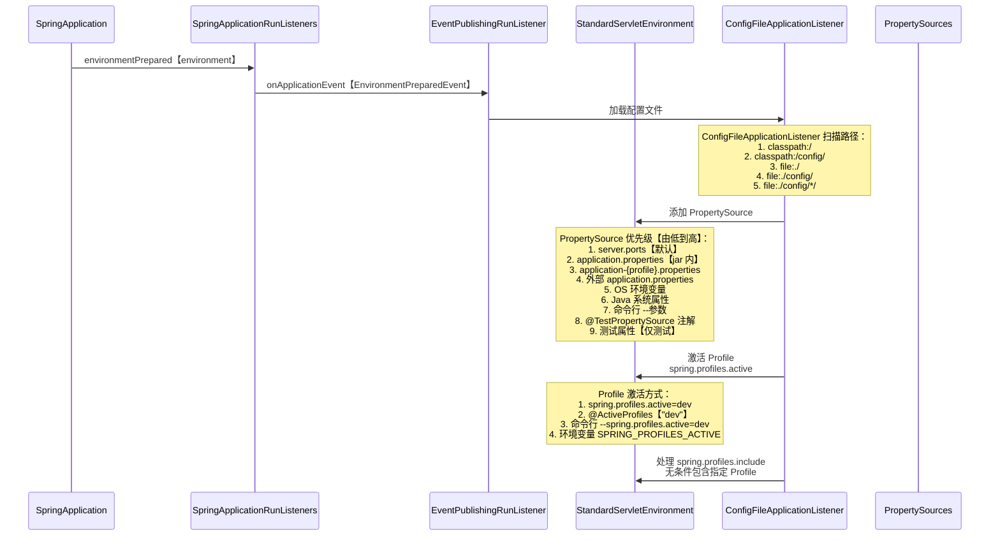
```mermaid
sequenceDiagram
    participant SA as SpringApplication
    participant SL as SpringApplicationRunListeners
    participant EP as EventPublishingRunListener
    participant ENV as StandardServletEnvironment
    participant CFL as ConfigFileApplicationListener
    participant PS as PropertySources

    SA->>SL: environmentPrepared【environment】
    SL->>EP: onApplicationEvent【EnvironmentPreparedEvent】
    EP->>CFL: 加载配置文件
    Note over CFL: ConfigFileApplicationListener 扫描路径：<br/>1. classpath:/<br/>2. classpath:/config/<br/>3. file:./<br/>4. file:./config/<br/>5. file:./config/*/

    CFL->>ENV: 添加 PropertySource
    Note over ENV: PropertySource 优先级【由低到高】：<br/>1. server.ports【默认】<br/>2. application.properties【jar 内】<br/>3. application-{profile}.properties<br/>4. 外部 application.properties<br/>5. OS 环境变量<br/>6. Java 系统属性<br/>7. 命令行 --参数<br/>8. @TestPropertySource 注解<br/>9. 测试属性【仅测试】

    CFL->>ENV: 激活 Profile<br/>spring.profiles.active
    Note over ENV: Profile 激活方式：<br/>1. spring.profiles.active=dev<br/>2. @ActiveProfiles【"dev"】<br/>3. 命令行 --spring.profiles.active=dev<br/>4. 环境变量 SPRING_PROFILES_ACTIVE

    CFL->>ENV: 处理 spring.profiles.include<br/>无条件包含指定 Profile
```

### 1.4 ApplicationContext 的层次结构

Spring Boot 根据 `WebApplicationType` 选择不同的 ApplicationContext 实现：

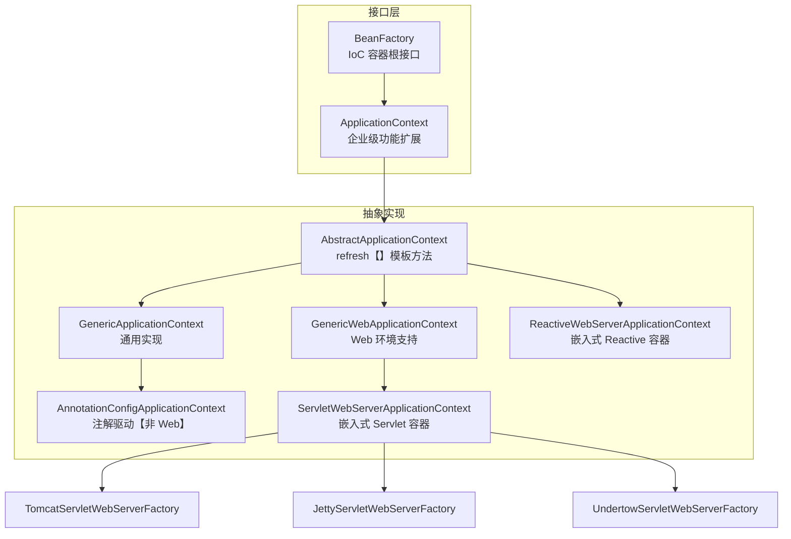
```mermaid
graph TB
    subgraph 接口层
        BF["BeanFactory<br/>IoC 容器根接口"] --> AC["ApplicationContext<br/>企业级功能扩展"]
    end

    subgraph 抽象实现
        AC --> AAC["AbstractApplicationContext<br/>refresh【】模板方法"]
        AAC --> GAC["GenericApplicationContext<br/>通用实现"]
        GAC --> AAAC["AnnotationConfigApplicationContext<br/>注解驱动【非 Web】"]
        AAC --> GWSAC["GenericWebApplicationContext<br/>Web 环境支持"]
        GWSAC --> SWAC["ServletWebServerApplicationContext<br/>嵌入式 Servlet 容器"]
        AAC --> RWSAC["ReactiveWebServerApplicationContext<br/>嵌入式 Reactive 容器"]
    end

    SWAC --> TS["TomcatServletWebServerFactory"]
    SWAC --> JS["JettyServletWebServerFactory"]
    SWAC --> US["UndertowServletWebServerFactory"]
```

| Context 类型 | 适用场景 | 关键特性 |
|-------------|----------|----------|
| `AnnotationConfigApplicationContext` | 非 Web 应用 | 仅注解配置，无 Web 特性 |
| `AnnotationConfigServletWebServerApplicationContext` | Servlet Web | 内嵌 Tomcat/Jetty/Undertow |
| `AnnotationConfigReactiveWebServerApplicationContext` | Reactive Web | 内嵌 Netty/Tomcat/Undertow |
| `GenericApplicationContext` | 通用/测试 | 灵活的 BeanDefinition 注册 |

### 1.5 refresh() 13 步详解

| 步骤 | 方法 | 核心操作 | 关键 Bean |
|------|------|----------|-----------|
| 1 | `prepareRefresh()` | 设置启动时间、关闭/活跃标志、初始化 PropertySource | `Environment` |
| 2 | `obtainFreshBeanFactory()` | 获取 `DefaultListableBeanFactory`、设置序列化 ID | `BeanFactory` |
| 3 | `prepareBeanFactory()` | 注册 `BeanPostProcessor`、设置 ClassLoader、注册默认 Bean | `ApplicationContextAwareProcessor` |
| 4 | `postProcessBeanFactory()` | 子类扩展点，Servlet Web 注册 `WebApplicationContextServletContextAwareProcessor` | `ServletContextAwareProcessor` |
| 5 | `invokeBeanFactoryPostProcessors()` | 执行 `BeanFactoryPostProcessor`，**触发自动配置解析** | `ConfigurationClassPostProcessor` |
| 6 | `registerBeanPostProcessors()` | 注册 `BeanPostProcessor` 到 BeanFactory | `AutowiredAnnotationBeanPostProcessor` |
| 7 | `initMessageSource()` | 初始化国际化 `MessageSource` | `MessageSource` |
| 8 | `initApplicationEventMulticaster()` | 初始化事件广播器 | `SimpleApplicationEventMulticaster` |
| 9 | `onRefresh()` | 子类扩展点，**创建并启动嵌入式 WebServer** | `TomcatWebServer` |
| 10 | `registerListeners()` | 注册 `ApplicationListener` Bean | `ApplicationListener` |
| 11 | `finishBeanFactoryInitialization()` | **实例化所有非懒加载单例 Bean** | 所有用户 Bean |
| 12 | `finishRefresh()` | 发布 `ContextRefreshedEvent`、启动 `LifecycleProcessor` | `DefaultLifecycleProcessor` |
| 13 | `resetCommonCaches()` | 清理反射、注解、类加载器缓存 | - |

***

## 场景二：自动配置原理深度剖析

### 2.0 场景概览

Spring Boot 的自动配置是其最核心的特性，通过 `@EnableAutoConfiguration` 注解和 `spring.factories` 机制实现"约定优于配置"。

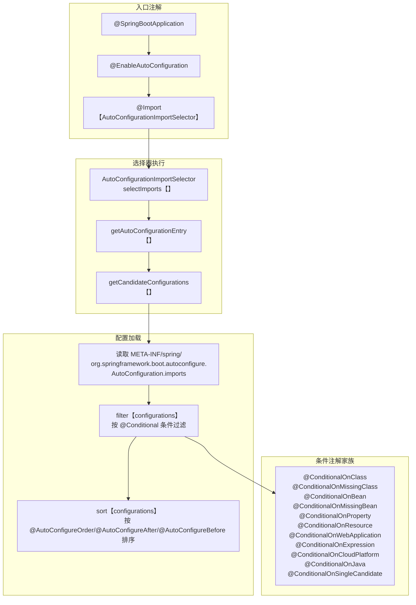
```mermaid
graph TB
    subgraph 入口注解
        SBA["@SpringBootApplication"] --> ENABLE["@EnableAutoConfiguration"]
        ENABLE --> IMPORT["@Import【AutoConfigurationImportSelector】"]
    end

    subgraph 选择器执行
        IMPORT --> SELECT["AutoConfigurationImportSelector<br/>selectImports【】"]
        SELECT --> LOAD["getAutoConfigurationEntry【】"]
        LOAD --> CANDIDATE["getCandidateConfigurations【】"]
    end

    subgraph 配置加载
        CANDIDATE --> FACT["读取 META-INF/spring/<br/>org.springframework.boot.autoconfigure.<br/>AutoConfiguration.imports"]
        FACT --> FILTER["filter【configurations】<br/>按 @Conditional 条件过滤"]
        FILTER --> SORT["sort【configurations】<br/>按 @AutoConfigureOrder/@AutoConfigureAfter/@AutoConfigureBefore 排序"]
    end

    subgraph 条件注解家族
        CONDITION["@ConditionalOnClass<br/>@ConditionalOnMissingClass<br/>@ConditionalOnBean<br/>@ConditionalOnMissingBean<br/>@ConditionalOnProperty<br/>@ConditionalOnResource<br/>@ConditionalOnWebApplication<br/>@ConditionalOnExpression<br/>@ConditionalOnCloudPlatform<br/>@ConditionalOnJava<br/>@ConditionalOnSingleCandidate"]
    end

    FILTER --> CONDITION
```

### 2.1 从 @SpringBootApplication 到自动配置

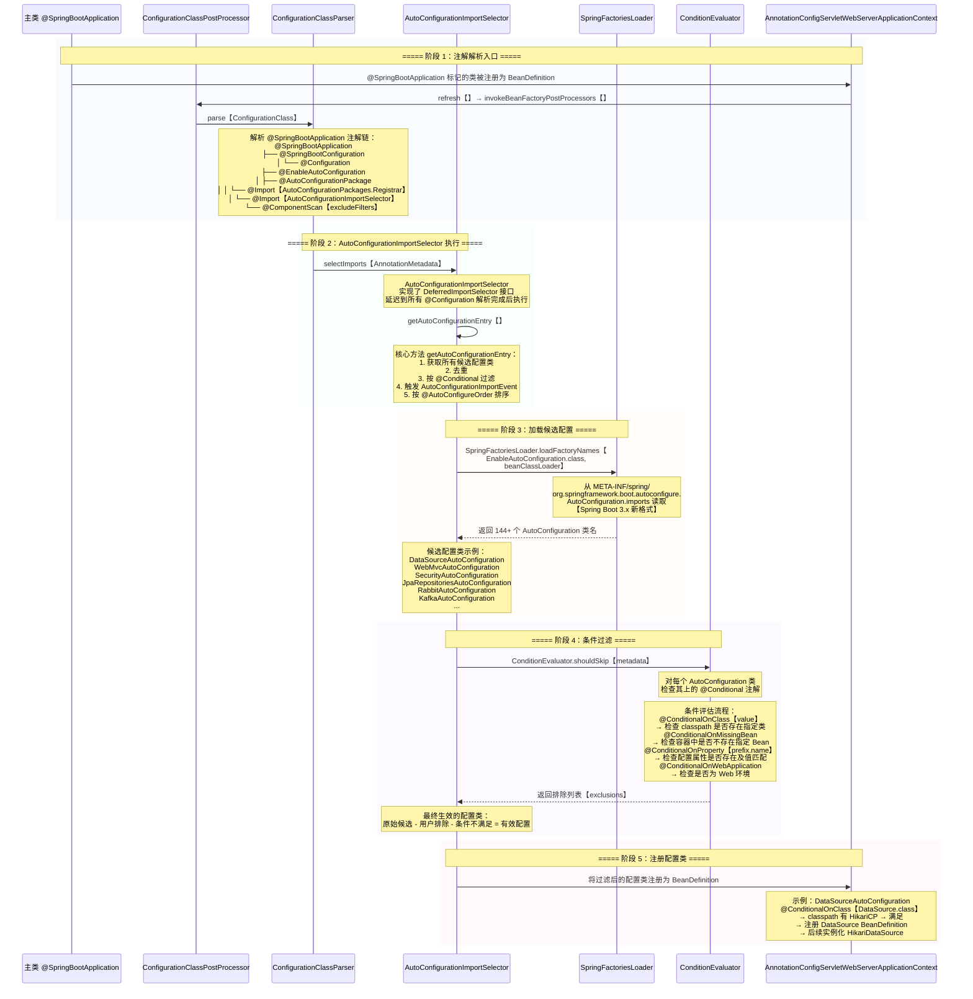
```mermaid
sequenceDiagram
    participant APP as 主类 @SpringBootApplication
    participant CCP as ConfigurationClassPostProcessor
    participant CP as ConfigurationClassParser
    participant AIS as AutoConfigurationImportSelector
    participant SL as SpringFactoriesLoader
    participant COND as ConditionEvaluator
    participant CTX as AnnotationConfigServletWebServerApplicationContext

    rect rgba(240, 248, 255, 0.4)
    Note over APP,CTX: ===== 阶段 1：注解解析入口 =====
    APP->>CTX: @SpringBootApplication 标记的类被注册为 BeanDefinition
    CTX->>CCP: refresh【】→ invokeBeanFactoryPostProcessors【】
    CCP->>CP: parse【ConfigurationClass】
    Note over CP: 解析 @SpringBootApplication 注解链：<br/>@SpringBootApplication<br/>  ├── @SpringBootConfiguration<br/>  │     └── @Configuration<br/>  ├── @EnableAutoConfiguration<br/>  │     ├── @AutoConfigurationPackage<br/>  │     │     └── @Import【AutoConfigurationPackages.Registrar】<br/>  │     └── @Import【AutoConfigurationImportSelector】<br/>  └── @ComponentScan【excludeFilters】
    end

    rect rgba(240, 255, 248, 0.4)
    Note over CP,AIS: ===== 阶段 2：AutoConfigurationImportSelector 执行 =====
    CP->>AIS: selectImports【AnnotationMetadata】
    Note over AIS: AutoConfigurationImportSelector<br/>实现了 DeferredImportSelector 接口<br/>延迟到所有 @Configuration 解析完成后执行
    AIS->>AIS: getAutoConfigurationEntry【】
    Note over AIS: 核心方法 getAutoConfigurationEntry：<br/>1. 获取所有候选配置类<br/>2. 去重<br/>3. 按 @Conditional 过滤<br/>4. 触发 AutoConfigurationImportEvent<br/>5. 按 @AutoConfigureOrder 排序
    end

    rect rgba(255, 248, 240, 0.4)
    Note over AIS,SL: ===== 阶段 3：加载候选配置 =====
    AIS->>SL: SpringFactoriesLoader.loadFactoryNames【<br/>  EnableAutoConfiguration.class,<br/>  beanClassLoader】
    Note over SL: 从 META-INF/spring/<br/>org.springframework.boot.autoconfigure.<br/>AutoConfiguration.imports 读取<br/>【Spring Boot 3.x 新格式】
    SL-->>AIS: 返回 144+ 个 AutoConfiguration 类名
    Note over AIS: 候选配置类示例：<br/>DataSourceAutoConfiguration<br/>WebMvcAutoConfiguration<br/>SecurityAutoConfiguration<br/>JpaRepositoriesAutoConfiguration<br/>RabbitAutoConfiguration<br/>KafkaAutoConfiguration<br/>...
    end

    rect rgba(248, 240, 255, 0.4)
    Note over AIS,COND: ===== 阶段 4：条件过滤 =====
    AIS->>COND: ConditionEvaluator.shouldSkip【metadata】
    Note over COND: 对每个 AutoConfiguration 类<br/>检查其上的 @Conditional 注解
    Note over COND: 条件评估流程：<br/>@ConditionalOnClass【value】<br/>→ 检查 classpath 是否存在指定类<br/>@ConditionalOnMissingBean<br/>→ 检查容器中是否不存在指定 Bean<br/>@ConditionalOnProperty【prefix.name】<br/>→ 检查配置属性是否存在及值匹配<br/>@ConditionalOnWebApplication<br/>→ 检查是否为 Web 环境
    COND-->>AIS: 返回排除列表【exclusions】
    Note over AIS: 最终生效的配置类：<br/>原始候选 - 用户排除 - 条件不满足 = 有效配置
    end

    rect rgba(255, 240, 245, 0.4)
    Note over AIS,CTX: ===== 阶段 5：注册配置类 =====
    AIS->>CTX: 将过滤后的配置类注册为 BeanDefinition
    Note over CTX: 示例：DataSourceAutoConfiguration<br/>@ConditionalOnClass【DataSource.class】<br/>→ classpath 有 HikariCP → 满足<br/>→ 注册 DataSource BeanDefinition<br/>→ 后续实例化 HikariDataSource
    end
```

### 2.2 spring.factories 与 .imports 文件

Spring Boot 3.x 引入了新的自动配置注册机制，逐步从 `spring.factories` 迁移到 `.imports` 文件：

| 版本 | 文件路径 | 格式 |
|------|----------|------|
| 2.x | `META-INF/spring.factories` | `key=value1,value2` |
| 3.x | `META-INF/spring/org.springframework.boot.autoconfigure.AutoConfiguration.imports` | 每行一个类名 |
| 3.x 兼容 | 两者均支持，但新格式为推荐方式 | - |

**spring.factories 可注册的组件类型**：

| Key | 说明 |
|-----|------|
| `org.springframework.boot.autoconfigure.EnableAutoConfiguration` | 自动配置类 |
| `org.springframework.context.ApplicationContextInitializer` | Context 初始化器 |
| `org.springframework.context.ApplicationListener` | 应用事件监听器 |
| `org.springframework.boot.SpringApplicationRunListener` | 启动流程监听器 |
| `org.springframework.boot.env.EnvironmentPostProcessor` | 环境后处理器 |
| `org.springframework.boot.diagnostics.FailureAnalyzer` | 启动失败分析器 |
| `org.springframework.boot.autoconfigure.template.TemplateAvailabilityProvider` | 模板可用性检查 |

### 2.3 @Conditional 注解家族详解

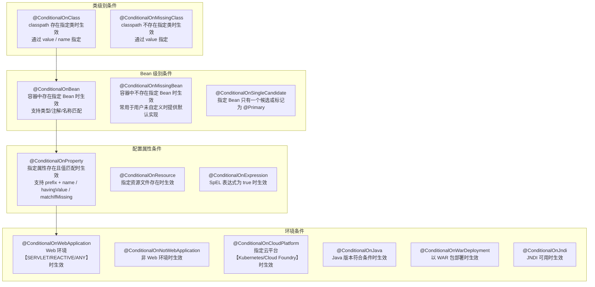
```mermaid
graph TB
    subgraph 类级别条件
        C1["@ConditionalOnClass<br/>classpath 存在指定类时生效<br/>通过 value / name 指定"]
        C2["@ConditionalOnMissingClass<br/>classpath 不存在指定类时生效<br/>通过 value 指定"]
    end

    subgraph Bean 级别条件
        C3["@ConditionalOnBean<br/>容器中存在指定 Bean 时生效<br/>支持类型/注解/名称匹配"]
        C4["@ConditionalOnMissingBean<br/>容器中不存在指定 Bean 时生效<br/>常用于"用户未自定义时提供默认实现""]
        C5["@ConditionalOnSingleCandidate<br/>指定 Bean 只有一个候选或标记为 @Primary"]
    end

    subgraph 配置属性条件
        C6["@ConditionalOnProperty<br/>指定属性存在且值匹配时生效<br/>支持 prefix + name / havingValue / matchIfMissing"]
        C7["@ConditionalOnResource<br/>指定资源文件存在时生效"]
        C8["@ConditionalOnExpression<br/>SpEL 表达式为 true 时生效"]
    end

    subgraph 环境条件
        C9["@ConditionalOnWebApplication<br/>Web 环境【SERVLET/REACTIVE/ANY】时生效"]
        C10["@ConditionalOnNotWebApplication<br/>非 Web 环境时生效"]
        C11["@ConditionalOnCloudPlatform<br/>指定云平台【Kubernetes/Cloud Foundry】时生效"]
        C12["@ConditionalOnJava<br/>Java 版本符合条件时生效"]
        C13["@ConditionalOnWarDeployment<br/>以 WAR 包部署时生效"]
        C14["@ConditionalOnJndi<br/>JNDI 可用时生效"]
    end

    C1 --> C3
    C3 --> C6
    C6 --> C9
```

**@Conditional 自定义条件实现**：

```java
// 自定义条件类
public class MyCustomCondition implements Condition {
    @Override
    public boolean matches(ConditionContext context, AnnotatedTypeMetadata metadata) {
        // 1. 获取 BeanFactory
        ConfigurableListableBeanFactory beanFactory = context.getBeanFactory();
        // 2. 获取 Environment
        Environment environment = context.getEnvironment();
        // 3. 获取 ClassLoader
        ClassLoader classLoader = context.getClassLoader();
        // 4. 获取 ResourceLoader
        ResourceLoader resourceLoader = context.getResourceLoader();
        // 5. 获取 Registry
        BeanDefinitionRegistry registry = context.getRegistry();
        // 自定义判断逻辑
        return true;
    }
}
```

### 2.4 自动配置的条件评估示例

以 `DataSourceAutoConfiguration` 为例，展示条件评估的完整链路：

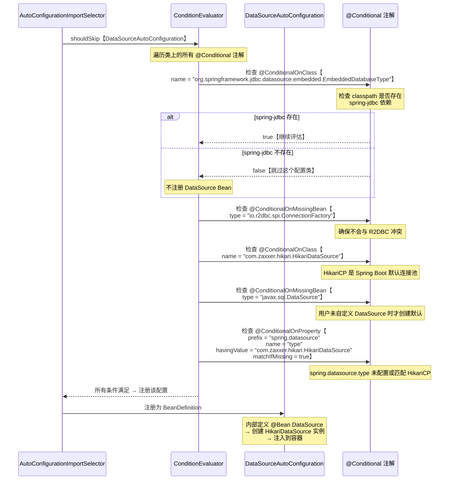
```mermaid
sequenceDiagram
    participant AIS as AutoConfigurationImportSelector
    participant CE as ConditionEvaluator
    participant DSA as DataSourceAutoConfiguration
    participant COND as @Conditional 注解

    AIS->>CE: shouldSkip【DataSourceAutoConfiguration】
    Note over CE: 遍历类上的所有 @Conditional 注解

    CE->>COND: 检查 @ConditionalOnClass【<br/>  name = "org.springframework.jdbc.datasource.embedded.EmbeddedDatabaseType"】
    Note over COND: 检查 classpath 是否存在<br/>spring-jdbc 依赖
    alt spring-jdbc 存在
        COND-->>CE: true【继续评估】
    else spring-jdbc 不存在
        COND-->>CE: false【跳过这个配置类】
        Note over CE: 不注册 DataSource Bean
    end

    CE->>COND: 检查 @ConditionalOnMissingBean【<br/>  type = "io.r2dbc.spi.ConnectionFactory"】
    Note over COND: 确保不会与 R2DBC 冲突

    CE->>COND: 检查 @ConditionalOnClass【<br/>  name = "com.zaxxer.hikari.HikariDataSource"】
    Note over COND: HikariCP 是 Spring Boot 默认连接池

    CE->>COND: 检查 @ConditionalOnMissingBean【<br/>  type = "javax.sql.DataSource"】
    Note over COND: 用户未自定义 DataSource 时才创建默认

    CE->>COND: 检查 @ConditionalOnProperty【<br/>  prefix = "spring.datasource"<br/>  name = "type"<br/>  havingValue = "com.zaxxer.hikari.HikariDataSource"<br/>  matchIfMissing = true】
    Note over COND: spring.datasource.type 未配置或匹配 HikariCP

    CE-->>AIS: 所有条件满足 → 注册该配置
    AIS->>DSA: 注册为 BeanDefinition
    Note over DSA: 内部定义 @Bean DataSource<br/>→ 创建 HikariDataSource 实例<br/>→ 注入到容器
```

### 2.5 自定义 Starter 实战

创建一个完整的自定义 Starter 需要以下组件：

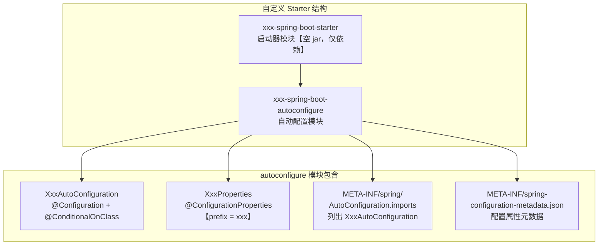
```mermaid
graph TB
    subgraph 自定义 Starter 结构
        AUTO["xxx-spring-boot-autoconfigure<br/>自动配置模块"]
        STARTER["xxx-spring-boot-starter<br/>启动器模块【空 jar，仅依赖】"]
    end

    subgraph autoconfigure 模块包含
        AC["XxxAutoConfiguration<br/>@Configuration + @ConditionalOnClass"]
        PROPS["XxxProperties<br/>@ConfigurationProperties【prefix = xxx】"]
        IMPORTS["META-INF/spring/<br/>AutoConfiguration.imports<br/>列出 XxxAutoConfiguration"]
        FACTORY["META-INF/spring-configuration-metadata.json<br/>配置属性元数据"]
    end

    STARTER --> AUTO
    AUTO --> AC
    AUTO --> PROPS
    AUTO --> IMPORTS
    AUTO --> FACTORY
```

**自定义自动配置类示例**：

```java
@AutoConfiguration  // Spring Boot 3.x 新注解，替代 @Configuration
@ConditionalOnClass({XxxClient.class})
@EnableConfigurationProperties(XxxProperties.class)
public class XxxAutoConfiguration {

    @Bean
    @ConditionalOnMissingBean
    public XxxClient xxxClient(XxxProperties properties) {
        return new XxxClient(properties.getHost(), properties.getPort());
    }
}
```

**配置属性类**：

```java
@ConfigurationProperties(prefix = "xxx")
public class XxxProperties {
    private String host = "localhost";
    private int port = 8080;
    private boolean enabled = true;
    // getters and setters
}
```

**AutoConfiguration.imports 文件**：

```
com.example.autoconfigure.XxxAutoConfiguration
```

| 文件 | 位置 | 作用 |
|------|------|------|
| `AutoConfiguration.imports` | `META-INF/spring/` | 注册自动配置类 |
| `spring-configuration-metadata.json` | `META-INF/` | IDE 自动补全配置属性 |
| `additional-spring-configuration-metadata.json` | `META-INF/` | 补充配置元数据 |

### 2.6 自动配置的排除与覆盖

| 方式 | 实现 | 优先级 |
|------|------|--------|
| `@SpringBootApplication(exclude = ...)` | 注解级排除 | 最高 |
| `spring.autoconfigure.exclude` | 配置文件排除 | 高 |
| `@ConditionalOnMissingBean` | 用户自定义 Bean 覆盖 | 中 |
| 自定义 `AutoConfiguration` | 替换默认实现 | 由 @AutoConfigureOrder 决定 |
| `spring.factories` 排除 | 通过 `EnableAutoConfiguration` 排除 | 低 |

```java
// 方式 1：注解排除
@SpringBootApplication(exclude = {
    DataSourceAutoConfiguration.class,
    SecurityAutoConfiguration.class
})

// 方式 2：配置文件排除
// spring.autoconfigure.exclude=org.springframework.boot.autoconfigure.jdbc.DataSourceAutoConfiguration

// 方式 3：自定义 Bean 覆盖
@Bean
public DataSource dataSource() {
    // 因为 @ConditionalOnMissingBean，此 Bean 会覆盖自动配置
    return new MyCustomDataSource();
}
```

***

## 场景三：嵌入式 Web 服务器

### 3.0 场景概览

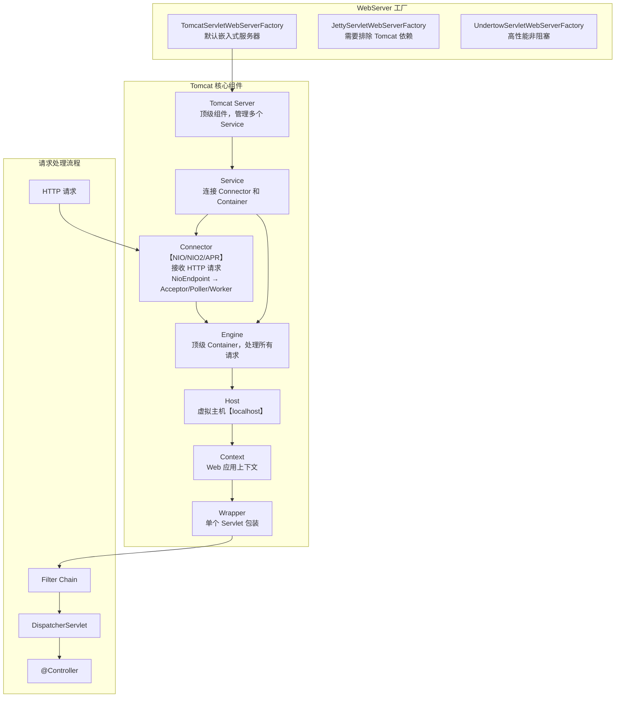
```mermaid
graph TB
    subgraph WebServer 工厂
        TSF["TomcatServletWebServerFactory<br/>默认嵌入式服务器"]
        JSF["JettyServletWebServerFactory<br/>需要排除 Tomcat 依赖"]
        USF["UndertowServletWebServerFactory<br/>高性能非阻塞"]
    end

    subgraph Tomcat 核心组件
        SERVER["Tomcat Server<br/>顶级组件，管理多个 Service"]
        SERVICE["Service<br/>连接 Connector 和 Container"]
        CONNECTOR["Connector【NIO/NIO2/APR】<br/>接收 HTTP 请求<br/>NioEndpoint → Acceptor/Poller/Worker"]
        ENGINE["Engine<br/>顶级 Container，处理所有请求"]
        HOST["Host<br/>虚拟主机【localhost】"]
        CTX_TOM["Context<br/>Web 应用上下文"]
        WRAPPER["Wrapper<br/>单个 Servlet 包装"]
    end

    subgraph 请求处理流程
        REQ["HTTP 请求"] --> CONNECTOR
        CONNECTOR --> ENGINE
        ENGINE --> HOST
        HOST --> CTX_TOM
        CTX_TOM --> WRAPPER
        WRAPPER --> FILTER["Filter Chain"]
        FILTER --> DS["DispatcherServlet"]
        DS --> CTRL["@Controller"]
    end

    TSF --> SERVER
    SERVER --> SERVICE
    SERVICE --> CONNECTOR
    SERVICE --> ENGINE
```

### 3.1 嵌入式服务器对比

| 特性 | Tomcat | Jetty | Undertow |
|------|--------|-------|----------|
| **默认** | 是 | 否 | 否 |
| **Servlet 规范** | 6.0 | 6.0 | 6.0 |
| **连接器模型** | NIO/NIO2/APR | NIO | XNIO【NIO】 |
| **线程模型** | 线程池 + 请求队列 | 线程池 + 有界队列 | XNIO Worker + I/O 线程 |
| **内存占用** | 中等 | 较小 | 较小 |
| **并发性能** | 良好 | 良好 | 优秀 |
| **HTTP/2 支持** | 通过 ALPN | 通过 ALPN | 原生支持 |
| **WebSocket** | 支持 | 支持 | 原生支持 |
| **适用场景** | 通用，生态最丰富 | 轻量级、嵌入式 | 高并发、低延迟 |

**切换嵌入式服务器**：

```xml
<!-- 默认 Tomcat【无需额外配置】 -->
<dependency>
    <groupId>org.springframework.boot</groupId>
    <artifactId>spring-boot-starter-web</artifactId>
</dependency>

<!-- 切换到 Jetty -->
<dependency>
    <groupId>org.springframework.boot</groupId>
    <artifactId>spring-boot-starter-web</artifactId>
    <exclusions>
        <exclusion>
            <groupId>org.springframework.boot</groupId>
            <artifactId>spring-boot-starter-tomcat</artifactId>
        </exclusion>
    </exclusions>
</dependency>
<dependency>
    <groupId>org.springframework.boot</groupId>
    <artifactId>spring-boot-starter-jetty</artifactId>
</dependency>
```

### 3.2 ServletWebServerApplicationContext 创建服务器

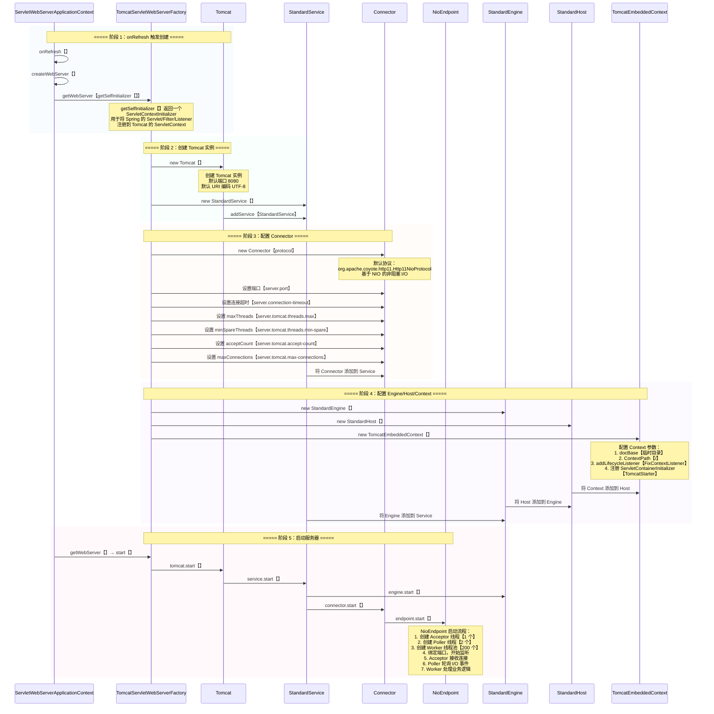
```mermaid
sequenceDiagram
    participant CTX as ServletWebServerApplicationContext
    participant TSF as TomcatServletWebServerFactory
    participant TOM as Tomcat
    participant SVC as StandardService
    participant CONN as Connector
    participant EP as NioEndpoint
    participant ENG as StandardEngine
    participant HOST as StandardHost
    participant CTX_TOM as TomcatEmbeddedContext

    rect rgba(240, 248, 255, 0.4)
    Note over CTX,TOM: ===== 阶段 1：onRefresh 触发创建 =====
    CTX->>CTX: onRefresh【】
    CTX->>CTX: createWebServer【】
    CTX->>TSF: getWebServer【getSelfInitializer【】】
    Note over TSF: getSelfInitializer【】返回一个<br/>ServletContextInitializer<br/>用于将 Spring 的 Servlet/Filter/Listener<br/>注册到 Tomcat 的 ServletContext
    end

    rect rgba(240, 255, 248, 0.4)
    Note over TSF,TOM: ===== 阶段 2：创建 Tomcat 实例 =====
    TSF->>TOM: new Tomcat【】
    Note over TOM: 创建 Tomcat 实例<br/>默认端口 8080<br/>默认 URI 编码 UTF-8
    TSF->>SVC: new StandardService【】
    TOM->>SVC: addService【StandardService】
    end

    rect rgba(255, 248, 240, 0.4)
    Note over TSF,CONN: ===== 阶段 3：配置 Connector =====
    TSF->>CONN: new Connector【protocol】
    Note over CONN: 默认协议：<br/>org.apache.coyote.http11.Http11NioProtocol<br/>基于 NIO 的非阻塞 I/O
    TSF->>CONN: 设置端口【server.port】
    TSF->>CONN: 设置连接超时【server.connection-timeout】
    TSF->>CONN: 设置 maxThreads【server.tomcat.threads.max】
    TSF->>CONN: 设置 minSpareThreads【server.tomcat.threads.min-spare】
    TSF->>CONN: 设置 acceptCount【server.tomcat.accept-count】
    TSF->>CONN: 设置 maxConnections【server.tomcat.max-connections】
    SVC->>CONN: 将 Connector 添加到 Service
    end

    rect rgba(248, 240, 255, 0.4)
    Note over TSF,CTX_TOM: ===== 阶段 4：配置 Engine/Host/Context =====
    TSF->>ENG: new StandardEngine【】
    TSF->>HOST: new StandardHost【】
    TSF->>CTX_TOM: new TomcatEmbeddedContext【】
    Note over CTX_TOM: 配置 Context 参数：<br/>1. docBase【临时目录】<br/>2. ContextPath【/】<br/>3. addLifecycleListener【FixContextListener】<br/>4. 注册 ServletContainerInitializer<br/>   【TomcatStarter】
    HOST->>CTX_TOM: 将 Context 添加到 Host
    ENG->>HOST: 将 Host 添加到 Engine
    SVC->>ENG: 将 Engine 添加到 Service
    end

    rect rgba(255, 240, 245, 0.4)
    Note over TSF,EP: ===== 阶段 5：启动服务器 =====
    CTX->>TSF: getWebServer【】→ start【】
    TSF->>TOM: tomcat.start【】
    TOM->>SVC: service.start【】
    SVC->>ENG: engine.start【】
    SVC->>CONN: connector.start【】
    CONN->>EP: endpoint.start【】
    Note over EP: NioEndpoint 启动流程：<br/>1. 创建 Acceptor 线程【1 个】<br/>2. 创建 Poller 线程【2 个】<br/>3. 创建 Worker 线程池【200 个】<br/>4. 绑定端口，开始监听<br/>5. Acceptor 接收连接<br/>6. Poller 轮询 I/O 事件<br/>7. Worker 处理业务逻辑
    end
```

### 3.3 HTTP 请求处理全链路

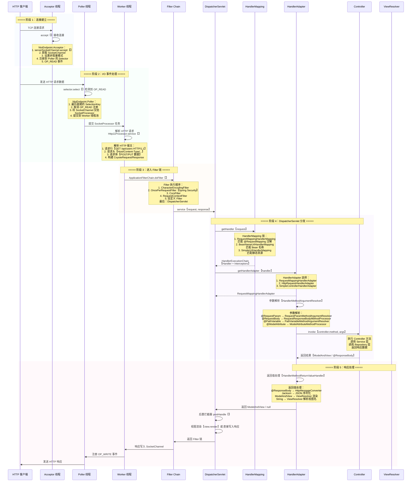
```mermaid
sequenceDiagram
    participant CLIENT as HTTP 客户端
    participant ACC as Acceptor 线程
    participant POLL as Poller 线程
    participant WORK as Worker 线程
    participant FILTER as Filter Chain
    participant DS as DispatcherServlet
    participant HM as HandlerMapping
    participant HA as HandlerAdapter
    participant CTRL as Controller
    participant VIEW as ViewResolver

    rect rgba(240, 248, 255, 0.4)
    Note over CLIENT,ACC: ===== 阶段 1：连接建立 =====
    CLIENT->>ACC: TCP 连接请求
    ACC->>ACC: accept【】接收连接
    Note over ACC: NioEndpoint.Acceptor：<br/>1. serverSocketChannel.accept【】<br/>2. 获取 SocketChannel<br/>3. 设置非阻塞模式<br/>4. 注册到 Poller 的 Selector<br/>5. OP_READ 事件
    end

    rect rgba(240, 255, 248, 0.4)
    Note over POLL,WORK: ===== 阶段 2：I/O 事件处理 =====
    CLIENT->>POLL: 发送 HTTP 请求数据
    POLL->>POLL: selector.select【】检测到 OP_READ
    Note over POLL: NioEndpoint.Poller：<br/>1. 遍历就绪的 SelectionKey<br/>2. 取消 OP_READ 注册<br/>3. 将 SocketChannel 交给<br/>   SocketProcessor<br/>4. 提交到 Worker 线程池
    POLL->>WORK: 提交 SocketProcessor 任务
    WORK->>WORK: 解析 HTTP 请求<br/>Http11Processor.service【】
    Note over WORK: 解析 HTTP 报文：<br/>1. 请求行【GET /api/users HTTP/1.1】<br/>2. 请求头【Host/Content-Type/...】<br/>3. 请求体【POST/PUT 数据】<br/>4. 构建 CoyoteRequest/Response
    end

    rect rgba(255, 248, 240, 0.4)
    Note over WORK,FILTER: ===== 阶段 3：进入 Filter 链 =====
    WORK->>FILTER: ApplicationFilterChain.doFilter【】
    Note over FILTER: Filter 执行顺序：<br/>1. CharacterEncodingFilter<br/>2. OncePerRequestFilter【Spring Security】<br/>3. CorsFilter<br/>4. RequestContextFilter<br/>5. 自定义 Filter<br/>最后：DispatcherServlet
    FILTER->>DS: service【request, response】
    end

    rect rgba(248, 240, 255, 0.4)
    Note over DS,CTRL: ===== 阶段 4：DispatcherServlet 分发 =====
    DS->>HM: getHandler【request】
    Note over HM: HandlerMapping 链：<br/>1. RequestMappingHandlerMapping<br/>   匹配 @RequestMapping 注解<br/>2. BeanNameUrlHandlerMapping<br/>   匹配 Bean 名称<br/>3. SimpleUrlHandlerMapping<br/>   匹配静态资源
    HM-->>DS: HandlerExecutionChain<br/>【Handler + Interceptors】
    DS->>HA: getHandlerAdapter【handler】
    Note over HA: HandlerAdapter 选择：<br/>1. RequestMappingHandlerAdapter<br/>2. HttpRequestHandlerAdapter<br/>3. SimpleControllerHandlerAdapter
    HA-->>DS: RequestMappingHandlerAdapter
    HA->>HA: 参数解析【HandlerMethodArgumentResolver】
    Note over HA: 参数解析：<br/>@RequestParam → RequestParamMethodArgumentResolver<br/>@RequestBody → RequestResponseBodyMethodProcessor<br/>@PathVariable → PathVariableMethodArgumentResolver<br/>@ModelAttribute → ModelAttributeMethodProcessor
    HA->>CTRL: invoke【controller.method, args】
    Note over CTRL: 执行 Controller 方法<br/>调用 Service 层<br/>调用 Repository 层<br/>返回响应数据
    CTRL-->>HA: 返回结果【ModelAndView / @ResponseBody】
    end

    rect rgba(255, 240, 245, 0.4)
    Note over HA,VIEW: ===== 阶段 5：响应处理 =====
    HA->>HA: 返回值处理【HandlerMethodReturnValueHandler】
    Note over HA: 返回值处理：<br/>@ResponseBody → HttpMessageConverter<br/>  Jackson → JSON 序列化<br/>ModelAndView → ViewResolver 渲染<br/>String → ViewResolver 解析视图名
    HA->>DS: 返回 ModelAndView / null
    DS->>DS: 后置拦截器 postHandle【】
    DS->>DS: 视图渲染【view.render】或 直接写入响应
    DS->>FILTER: 返回 Filter 链
    FILTER->>WORK: 响应写入 SocketChannel
    WORK->>POLL: 注册 OP_WRITE 事件
    POLL->>CLIENT: 发送 HTTP 响应
    end
```

### 3.4 Tomcat 线程模型详解

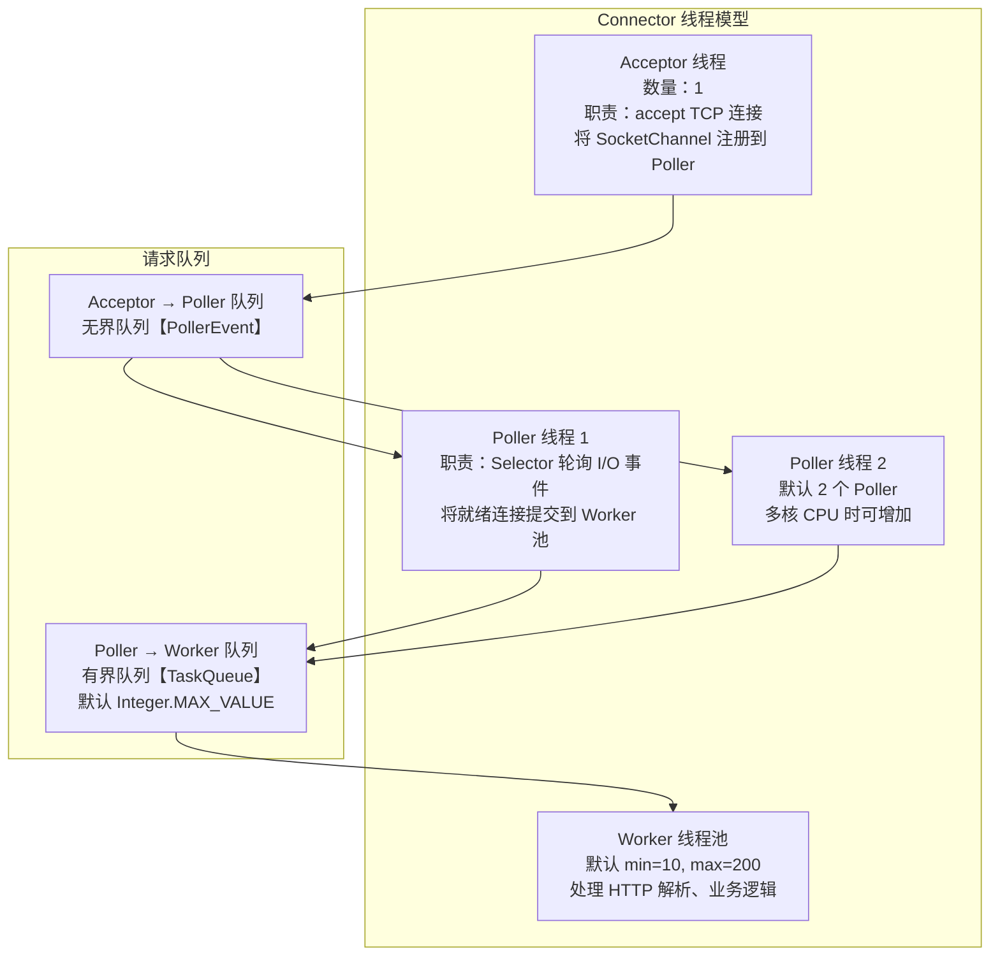
```mermaid
graph TB
    subgraph Connector 线程模型
        ACC["Acceptor 线程<br/>数量：1<br/>职责：accept TCP 连接<br/>将 SocketChannel 注册到 Poller"]
        PLR1["Poller 线程 1<br/>职责：Selector 轮询 I/O 事件<br/>将就绪连接提交到 Worker 池"]
        PLR2["Poller 线程 2<br/>默认 2 个 Poller<br/>多核 CPU 时可增加"]
        WORK_POOL["Worker 线程池<br/>默认 min=10, max=200<br/>处理 HTTP 解析、业务逻辑"]
    end

    subgraph 请求队列
        ACC_QUEUE["Acceptor → Poller 队列<br/>无界队列【PollerEvent】"]
        WORK_QUEUE["Poller → Worker 队列<br/>有界队列【TaskQueue】<br/>默认 Integer.MAX_VALUE"]
    end

    ACC --> ACC_QUEUE
    ACC_QUEUE --> PLR1
    ACC_QUEUE --> PLR2
    PLR1 --> WORK_QUEUE
    PLR2 --> WORK_QUEUE
    WORK_QUEUE --> WORK_POOL
```

| 配置项 | 默认值 | 含义 |
|--------|--------|------|
| `server.tomcat.accept-count` | 100 | 当所有线程忙碌时，等待队列的最大长度 |
| `server.tomcat.threads.max` | 200 | Worker 线程池最大线程数 |
| `server.tomcat.threads.min-spare` | 10 | Worker 线程池最小空闲线程数 |
| `server.tomcat.max-connections` | 8192 | 最大连接数【BIO 模式】 |
| `server.tomcat.max-keep-alive-requests` | 100 | 单个 Keep-Alive 连接的最大请求数 |
| `server.tomcat.connection-timeout` | 60000ms | 连接超时时间 |

**Tomcat 线程调优建议**：

| 场景 | max-threads | accept-count | 说明 |
|------|-------------|--------------|------|
| 低延迟 API | 50-100 | 100 | 避免过多线程竞争 |
| 高并发 Web | 200-500 | 200-500 | 需要较大线程池 |
| 长连接/WebSocket | 100-200 | 100 | 保持适中的线程数 |
| 批处理/后台任务 | 50-100 | 50 | 控制并发任务数 |

***

## 场景四：Spring Boot Actuator 生产特性

### 4.0 场景概览

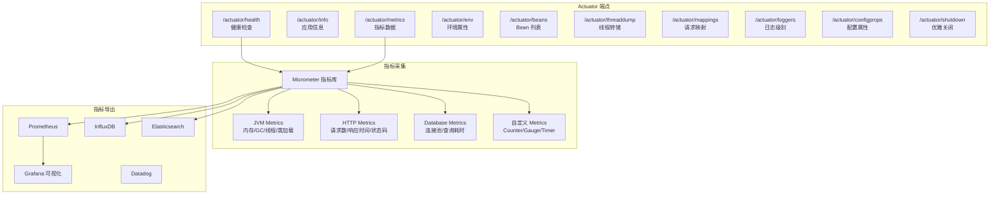
```mermaid
graph TB
    subgraph Actuator 端点
        HEALTH["/actuator/health<br/>健康检查"]
        INFO["/actuator/info<br/>应用信息"]
        METRICS["/actuator/metrics<br/>指标数据"]
        ENV_EP["/actuator/env<br/>环境属性"]
        BEANS["/actuator/beans<br/>Bean 列表"]
        THREAD["/actuator/threaddump<br/>线程转储"]
        MAPPING["/actuator/mappings<br/>请求映射"]
        LOGGER["/actuator/loggers<br/>日志级别"]
        CONFIG["/actuator/configprops<br/>配置属性"]
        SHUTDOWN["/actuator/shutdown<br/>优雅关闭"]
    end

    subgraph 指标采集
        MICRO["Micrometer 指标库"]
        JVM["JVM Metrics<br/>内存/GC/线程/类加载"]
        HTTP["HTTP Metrics<br/>请求数/响应时间/状态码"]
        DB["Database Metrics<br/>连接池/查询耗时"]
        CUSTOM["自定义 Metrics<br/>Counter/Gauge/Timer"]
    end

    subgraph 指标导出
        PROM["Prometheus"]
        GRAF["Grafana 可视化"]
        INFX["InfluxDB"]
        ELK["Elasticsearch"]
        DATADOG["Datadog"]
    end

    HEALTH --> MICRO
    METRICS --> MICRO
    MICRO --> JVM
    MICRO --> HTTP
    MICRO --> DB
    MICRO --> CUSTOM
    MICRO --> PROM
    MICRO --> INFX
    MICRO --> ELK
    PROM --> GRAF
```

### 4.1 Actuator 端点全览

| 端点 | 默认启用 | HTTP 暴露 | 说明 |
|------|----------|-----------|------|
| `health` | 是 | 是 | 应用健康状态，包含各组件的健康详情 |
| `health/readiness` | 是 | 是 | Kubernetes Readiness Probe |
| `health/liveness` | 是 | 是 | Kubernetes Liveness Probe |
| `info` | 是 | 是 | 应用自定义信息 |
| `metrics` | 是 | 是 | 所有指标的列表 |
| `metrics/{name}` | 是 | 是 | 具体指标的详细数据 |
| `env` | 是 | 否 | 当前环境属性【敏感信息】 |
| `env/{name}` | 是 | 否 | 具体环境属性值 |
| `beans` | 是 | 否 | Spring Bean 列表及依赖关系 |
| `threaddump` | 是 | 否 | 线程转储【类似 jstack】 |
| `heapdump` | 是 | 否 | 堆转储文件【类似 jmap】 |
| `mappings` | 是 | 否 | 所有 @RequestMapping 映射 |
| `loggers` | 是 | 否 | 日志级别查看与修改 |
| `loggers/{name}` | 是 | 否 | 修改特定 Logger 级别 |
| `configprops` | 是 | 否 | @ConfigurationProperties 列表 |
| `conditions` | 是 | 否 | 自动配置条件评估报告 |
| `scheduledtasks` | 是 | 否 | @Scheduled 定时任务 |
| `caches` | 是 | 否 | 缓存管理器及缓存详情 |
| `startup` | 否 | 否 | 应用启动步骤耗时分析 |
| `shutdown` | 否 | 否 | 优雅关闭应用 |

### 4.2 健康检查机制

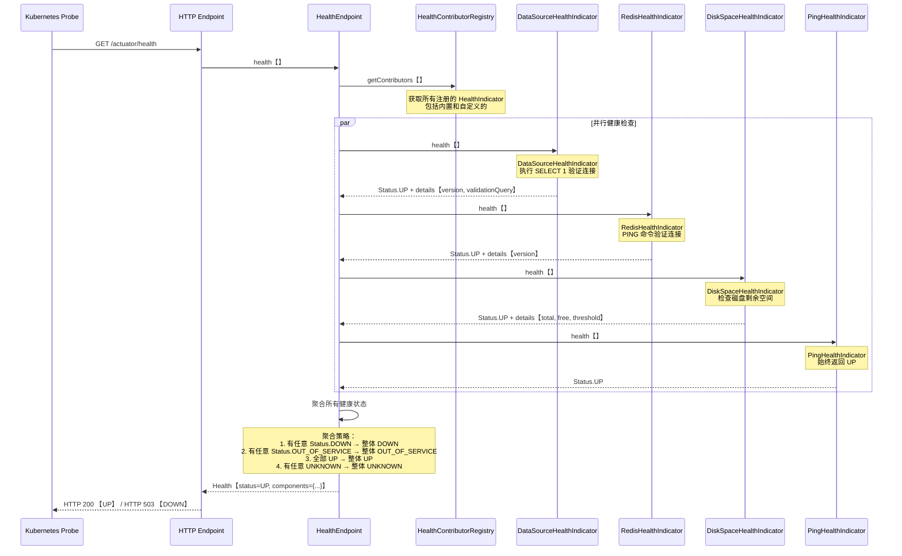
```mermaid
sequenceDiagram
    participant K8S as Kubernetes Probe
    participant HTTP as HTTP Endpoint
    participant HE as HealthEndpoint
    participant HCR as HealthContributorRegistry
    participant DB as DataSourceHealthIndicator
    participant REDIS as RedisHealthIndicator
    participant DISK as DiskSpaceHealthIndicator
    participant PING as PingHealthIndicator

    K8S->>HTTP: GET /actuator/health
    HTTP->>HE: health【】
    HE->>HCR: getContributors【】
    Note over HCR: 获取所有注册的 HealthIndicator<br/>包括内置和自定义的

    par 并行健康检查
        HE->>DB: health【】
        Note over DB: DataSourceHealthIndicator<br/>执行 SELECT 1 验证连接
        DB-->>HE: Status.UP + details【version, validationQuery】

        HE->>REDIS: health【】
        Note over REDIS: RedisHealthIndicator<br/>PING 命令验证连接
        REDIS-->>HE: Status.UP + details【version】

        HE->>DISK: health【】
        Note over DISK: DiskSpaceHealthIndicator<br/>检查磁盘剩余空间
        DISK-->>HE: Status.UP + details【total, free, threshold】

        HE->>PING: health【】
        Note over PING: PingHealthIndicator<br/>始终返回 UP
        PING-->>HE: Status.UP
    end

    HE->>HE: 聚合所有健康状态
    Note over HE: 聚合策略：<br/>1. 有任意 Status.DOWN → 整体 DOWN<br/>2. 有任意 Status.OUT_OF_SERVICE → 整体 OUT_OF_SERVICE<br/>3. 全部 UP → 整体 UP<br/>4. 有任意 UNKNOWN → 整体 UNKNOWN

    HE-->>HTTP: Health【status=UP, components={...}】
    HTTP-->>K8S: HTTP 200 【UP】 / HTTP 503 【DOWN】
```

**自定义健康检查实现**：

```java
@Component
public class MyCustomHealthIndicator implements HealthIndicator {
    @Override
    public Health health() {
        // 检查外部服务连接
        boolean externalServiceUp = checkExternalService();
        if (externalServiceUp) {
            return Health.up()
                .withDetail("service", "external-api")
                .withDetail("responseTime", "120ms")
                .build();
        }
        return Health.down()
            .withDetail("service", "external-api")
            .withDetail("error", "Connection timeout")
            .build();
    }
}
```

### 4.3 Micrometer 指标体系

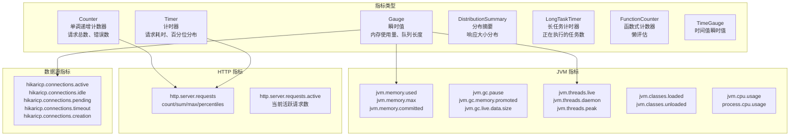
```mermaid
graph TB
    subgraph 指标类型
        COUNTER["Counter<br/>单调递增计数器<br/>请求总数、错误数"]
        GAUGE["Gauge<br/>瞬时值<br/>内存使用量、队列长度"]
        TIMER["Timer<br/>计时器<br/>请求耗时、百分位分布"]
        DIST_SUM["DistributionSummary<br/>分布摘要<br/>响应大小分布"]
        LONG_TASK["LongTaskTimer<br/>长任务计时器<br/>正在执行的任务数"]
        FCT_COUNTER["FunctionCounter<br/>函数式计数器<br/>懒评估"]
        TIME_GAUGE["TimeGauge<br/>时间值瞬时值"]
    end

    subgraph JVM 指标
        JVM_MEM["jvm.memory.used<br/>jvm.memory.max<br/>jvm.memory.committed"]
        JVM_GC["jvm.gc.pause<br/>jvm.gc.memory.promoted<br/>jvm.gc.live.data.size"]
        JVM_THR["jvm.threads.live<br/>jvm.threads.daemon<br/>jvm.threads.peak"]
        JVM_CLS["jvm.classes.loaded<br/>jvm.classes.unloaded"]
        JVM_CPU["jvm.cpu.usage<br/>process.cpu.usage"]
    end

    subgraph HTTP 指标
        HTTP_REQ["http.server.requests<br/>count/sum/max/percentiles"]
        HTTP_ACT["http.server.requests.active<br/>当前活跃请求数"]
    end

    subgraph 数据源指标
        DS_POOL["hikaricp.connections.active<br/>hikaricp.connections.idle<br/>hikaricp.connections.pending<br/>hikaricp.connections.timeout<br/>hikaricp.connections.creation"]
    end

    COUNTER --> HTTP_REQ
    TIMER --> HTTP_REQ
    GAUGE --> JVM_MEM
    GAUGE --> JVM_THR
    GAUGE --> DS_POOL
```

### 4.4 自定义指标

```java
// Counter 示例：记录 API 调用次数
@RestController
public class MetricsController {

    private final MeterRegistry meterRegistry;

    public MetricsController(MeterRegistry meterRegistry) {
        this.meterRegistry = meterRegistry;
        // 注册 Counter
        Counter.builder("api.orders.created")
            .description("Number of orders created")
            .tag("region", "cn-east")
            .register(meterRegistry);
    }

    @PostMapping("/orders")
    public Order createOrder(@RequestBody Order order) {
        // 业务逻辑
        // 递增计数器
        meterRegistry.counter("api.orders.created",
            "status", "success").increment();
        return order;
    }

    // Timer 示例：记录方法耗时
    @Timed(value = "api.orders.process", percentiles = {0.5, 0.95, 0.99})
    @GetMapping("/orders/{id}")
    public Order getOrder(@PathVariable Long id) {
        return orderService.findById(id);
    }
}
```

### 4.5 Prometheus + Grafana 集成

```yaml
# application.yml 配置
management:
  endpoints:
    web:
      exposure:
        include: health,info,metrics,prometheus
  metrics:
    export:
      prometheus:
        enabled: true
    tags:
      application: ${spring.application.name}
      environment: ${spring.profiles.active}
```

**Prometheus 抓取配置**：

```yaml
# prometheus.yml
scrape_configs:
  - job_name: 'spring-boot-app'
    metrics_path: '/actuator/prometheus'
    scrape_interval: 15s
    static_configs:
      - targets: ['localhost:8080']
```

| 监控维度 | 核心指标 | 告警建议 |
|----------|----------|----------|
| JVM 堆内存 | `jvm.memory.used` / `jvm.memory.max` | 使用率 > 85% 告警 |
| GC 频率 | `jvm.gc.pause` | 1 分钟 GC 次数 > 10 或 GC 暂停 > 500ms |
| 线程数 | `jvm.threads.live` | 线程数 > 500 |
| HTTP 响应时间 | `http.server.requests` P99 | P99 > 2s 告警 |
| HTTP 错误率 | `http.server.requests` 5xx | 5xx 比例 > 1% 告警 |
| 连接池 | `hikaricp.connections.pending` | pending > 0 持续 5 分钟 |
| 磁盘空间 | `disk.free` | 剩余 < 10% 告警 |

***

## 场景五：Spring Boot 配置管理

### 5.0 场景概览

```mermaid
graph TB
    subgraph 配置来源
        PROPS["application.properties"]
        YML["application.yml"]
        CMD["命令行参数"]
        ENV_VAR["环境变量"]
        SPRING_JSON["SPRING_APPLICATION_JSON"]
        CLOUD_CFG["Spring Cloud Config Server"]
        VAULT["HashiCorp Vault"]
        CONSUL["Consul KV"]
        K8S_CFG["Kubernetes ConfigMap/Secret"]
    end

    subgraph 配置绑定
        CP["@ConfigurationProperties<br/>prefix = xxx"]
        VALUE["@Value【${...}】"]
        BINDER["Binder API<br/>编程式绑定"]
    end

    subgraph Profile 机制
        PROFILE["spring.profiles.active"]
        DEFAULT["application-{profile}.yml"]
        INCLUDE["spring.profiles.include"]
        GROUP["spring.profiles.group"]
    end

    subgraph 配置优先级【高到低】
        P1["1. 命令行 --参数"]
        P2["2. SPRING_APPLICATION_JSON"]
        P3["3. Servlet 参数"]
        P4["4. JNDI"]
        P5["5. Java 系统属性"]
        P6["6. OS 环境变量"]
        P7["7. 随机值 random.*"]
        P8["8. 外部 application-{profile}.yml"]
        P9["9. 内部 application-{profile}.yml"]
        P10["10. 外部 application.yml"]
        P11["11. 内部 application.yml"]
        P12["12. @PropertySource"]
        P13["13. 默认属性"]
    end

    PROPS --> CP
    YML --> CP
    CMD --> VALUE
    ENV_VAR --> VALUE
    PROFILE --> DEFAULT
    DEFAULT --> P8
```

### 5.1 @ConfigurationProperties 详解

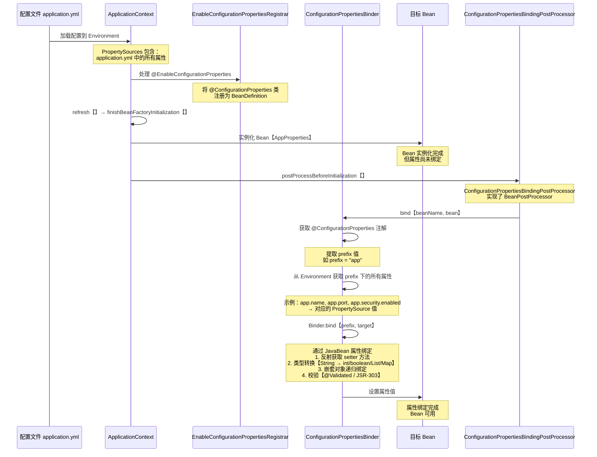
```mermaid
sequenceDiagram
    participant CFG as 配置文件 application.yml
    participant CTX as ApplicationContext
    participant ECP as EnableConfigurationPropertiesRegistrar
    participant BIND as ConfigurationPropertiesBinder
    participant BEAN as 目标 Bean
    participant POST as ConfigurationPropertiesBindingPostProcessor

    CFG->>CTX: 加载配置到 Environment
    Note over CTX: PropertySources 包含：<br/>application.yml 中的所有属性

    CTX->>ECP: 处理 @EnableConfigurationProperties
    Note over ECP: 将 @ConfigurationProperties 类<br/>注册为 BeanDefinition

    CTX->>CTX: refresh【】→ finishBeanFactoryInitialization【】
    CTX->>BEAN: 实例化 Bean【AppProperties】
    Note over BEAN: Bean 实例化完成<br/>但属性尚未绑定

    CTX->>POST: postProcessBeforeInitialization【】
    Note over POST: ConfigurationPropertiesBindingPostProcessor<br/>实现了 BeanPostProcessor

    POST->>BIND: bind【beanName, bean】
    BIND->>BIND: 获取 @ConfigurationProperties 注解
    Note over BIND: 提取 prefix 值<br/>如 prefix = "app"

    BIND->>BIND: 从 Environment 获取 prefix 下的所有属性
    Note over BIND: 示例：app.name, app.port, app.security.enabled<br/>→ 对应的 PropertySource 值

    BIND->>BIND: Binder.bind【prefix, target】
    Note over BIND: 通过 JavaBean 属性绑定<br/>1. 反射获取 setter 方法<br/>2. 类型转换【String → int/boolean/List/Map】<br/>3. 嵌套对象递归绑定<br/>4. 校验【@Validated / JSR-303】

    BIND->>BEAN: 设置属性值
    Note over BEAN: 属性绑定完成<br/>Bean 可用
```

**@ConfigurationProperties 示例**：

```java
@ConfigurationProperties(prefix = "app")
@Validated
public class AppProperties {
    @NotBlank
    private String name;

    @Min(1) @Max(65535)
    private int port = 8080;

    private Security security = new Security();
    private List<String> allowedOrigins = new ArrayList<>();
    private Map<String, String> headers = new HashMap<>();

    public static class Security {
        private boolean enabled = true;
        private String tokenSecret;
        // getters and setters
    }
    // getters and setters
}
```

```yaml
# application.yml
app:
  name: "My Application"
  port: 8080
  security:
    enabled: true
    token-secret: "${JWT_SECRET:default-secret}"
  allowed-origins:
    - "http://localhost:3000"
    - "https://example.com"
  headers:
    X-Custom: "value1"
    X-Version: "1.0"
```

### 5.2 配置属性绑定原理

| 绑定方式 | 松散绑定 | 类型安全 | 嵌套对象 | 校验支持 | 元数据 |
|----------|----------|----------|----------|----------|--------|
| `@ConfigurationProperties` | 是 | 是 | 是 | 是 | 是 |
| `@Value` | 否 | 否 | 否 | 否 | 否 |
| `Binder API` | 是 | 是 | 是 | 否 | 否 |
| `Environment.getProperty()` | 否 | 否 | 否 | 否 | 否 |

**松散绑定规则**：

| 属性名格式 | 示例 | 匹配 |
|-----------|------|------|
| `camelCase` | `tokenSecret` | `token-secret`, `token_secret`, `TOKEN_SECRET` |
| `kebab-case` | `token-secret` | `tokenSecret`, `token_secret`, `TOKEN_SECRET` |
| `snake_case` | `token_secret` | `tokenSecret`, `token-secret`, `TOKEN_SECRET` |
| `UPPER_CASE` | `TOKEN_SECRET` | `tokenSecret`, `token-secret`, `token_secret` |

### 5.3 Profile 多环境配置

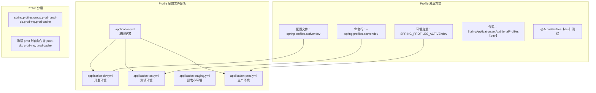
```mermaid
graph TB
    subgraph Profile 配置文件命名
        BASE["application.yml<br/>基础配置"]
        DEV["application-dev.yml<br/>开发环境"]
        TEST["application-test.yml<br/>测试环境"]
        STAGING["application-staging.yml<br/>预发布环境"]
        PROD["application-prod.yml<br/>生产环境"]
    end

    subgraph Profile 激活方式
        ACTIVE1["配置文件：spring.profiles.active=dev"]
        ACTIVE2["命令行：--spring.profiles.active=dev"]
        ACTIVE3["环境变量：SPRING_PROFILES_ACTIVE=dev"]
        ACTIVE4["代码：SpringApplication.setAdditionalProfiles【dev】"]
        ACTIVE5["@ActiveProfiles【dev】测试"]
    end

    subgraph Profile 分组
        GROUP1["spring.profiles.group.prod=prod-db,prod-mq,prod-cache"]
        GROUP2["激活 prod 时自动包含 prod-db, prod-mq, prod-cache"]
    end

    BASE --> DEV
    BASE --> TEST
    BASE --> PROD
    ACTIVE1 --> DEV
    ACTIVE2 --> TEST
    ACTIVE3 --> PROD
```

**Profile 配置示例**：

```yaml
# application.yml【基础配置】
spring:
  application:
    name: my-app
  profiles:
    group:
      production:
        - prod-db
        - prod-mq
        - prod-monitor

---
# application-dev.yml
spring:
  config:
    activate:
      on-profile: dev
server:
  port: 8080
app:
  debug: true

---
# application-prod.yml
spring:
  config:
    activate:
      on-profile: prod
server:
  port: 80
app:
  debug: false
```

### 5.4 Spring Cloud Config 集成

```mermaid
sequenceDiagram
    participant APP as Spring Boot 应用
    participant BOOT as Bootstrap Context
    participant CFG_SVR as Config Server
    participant GIT as Git 仓库
    participant BUS as Spring Cloud Bus
    participant RMQ as RabbitMQ / Kafka

    rect rgba(240, 248, 255, 0.4)
    Note over APP,BOOT: ===== 阶段 1：Bootstrap 阶段 =====
    APP->>BOOT: 创建 Bootstrap Context
    Note over BOOT: 加载 bootstrap.yml<br/>优先级高于 application.yml
    BOOT->>BOOT: 读取 spring.cloud.config.uri
    BOOT->>CFG_SVR: GET /{application}/{profile}/{label}
    Note over CFG_SVR: 请求示例：<br/>GET /my-app/dev/main<br/>返回该应用在 dev 环境的配置
    end

    rect rgba(240, 255, 248, 0.4)
    Note over CFG_SVR,GIT: ===== 阶段 2：Config Server 处理 =====
    CFG_SVR->>GIT: clone / pull 配置仓库
    Note over GIT: 配置仓库结构：<br/>my-app.yml<br/>my-app-dev.yml<br/>my-app-prod.yml<br/>application.yml
    CFG_SVR->>CFG_SVR: 合并配置<br/>application.yml + my-app.yml + my-app-dev.yml
    CFG_SVR-->>BOOT: 返回配置 JSON
    end

    rect rgba(255, 248, 240, 0.4)
    Note over BOOT,APP: ===== 阶段 3：配置注入 =====
    BOOT->>BOOT: 将配置添加到 Environment
    Note over BOOT: 配置作为 PropertySource 加入<br/>优先级高于本地配置
    BOOT->>APP: 传递配置到主 ApplicationContext
    APP->>APP: 正常启动流程

    rect rgba(248, 240, 255, 0.4)
    Note over APP,BUS: ===== 阶段 4：动态刷新 =====
    CFG_SVR->>GIT: Webhook 触发配置更新
    CFG_SVR->>BUS: 发送 RefreshRemoteApplicationEvent
    BUS->>RMQ: 通过消息中间件广播
    RMQ->>APP: 通知所有实例刷新配置
    APP->>APP: @RefreshScope Bean 重新初始化
    APP->>CFG_SVR: 重新拉取最新配置
    end
```

***

## 场景六：Spring Boot 数据访问层

### 6.0 场景概览

```mermaid
graph TB
    subgraph 数据源自动配置
        DSA["DataSourceAutoConfiguration<br/>自动创建 DataSource"]
        EMBED["EmbeddedDataSourceConfiguration<br/>内嵌数据库 H2/HSQLDB/Derby"]
        POOL["DataSourcePoolMetadataProvidersConfiguration<br/>连接池元数据"]
    end

    subgraph 连接池实现
        HIKARI["HikariCP【默认】<br/>高性能、低延迟"]
        TOMCAT_POOL["Tomcat JDBC Pool<br/>备用连接池"]
        DBCP2["Commons DBCP2<br/>Apache 连接池"]
        DRUID["Druid<br/>阿里巴巴开源，监控强大"]
    end

    subgraph ORM 集成
        JPA["JPA / Hibernate<br/>spring-boot-starter-data-jpa"]
        MYBATIS["MyBatis / MyBatis-Plus<br/>mybatis-spring-boot-starter"]
        JDBC_TMP["JdbcTemplate<br/>spring-boot-starter-jdbc"]
        R2DBC["R2DBC<br/>spring-boot-starter-data-r2dbc"]
    end

    subgraph 事务管理
        TX_MGR["PlatformTransactionManager<br/>DataSourceTransactionManager"]
        TX_AOP["@Transactional AOP<br/>TransactionInterceptor"]
        TX_ISOLATION["隔离级别<br/>READ_UNCOMMITTED<br/>READ_COMMITTED<br/>REPEATABLE_READ<br/>SERIALIZABLE"]
        TX_PROPAG["传播行为<br/>REQUIRED/REQUIRES_NEW<br/>NESTED/SUPPORTS"]
    end

    DSA --> HIKARI
    DSA --> TOMCAT_POOL
    DSA --> DBCP2
    HIKARI --> JPA
    HIKARI --> JDBC_TMP
    JPA --> TX_MGR
    TX_MGR --> TX_AOP
```

### 6.1 DataSource 自动配置

```mermaid
sequenceDiagram
    participant DSA as DataSourceAutoConfiguration
    participant CTX as ApplicationContext
    participant HIKARI as HikariDataSource
    participant PROP as DataSourceProperties
    participant POOL as HikariPool
    participant DB as MySQL/PostgreSQL

    rect rgba(240, 248, 255, 0.4)
    Note over DSA,CTX: ===== 阶段 1：条件评估 =====
    DSA->>DSA: @ConditionalOnClass【DataSource.class】
    Note over DSA: 检查 classpath 是否存在<br/>javax.sql.DataSource
    DSA->>DSA: @ConditionalOnMissingBean【DataSource.class】
    Note over DSA: 用户未自定义 DataSource 时才自动配置
    DSA->>DSA: 检测连接池类型
    Note over DSA: 连接池优先级：<br/>1. HikariCP【默认】<br/>2. Tomcat JDBC Pool<br/>3. Commons DBCP2<br/>4. Oracle UCP
    end

    rect rgba(240, 255, 248, 0.4)
    Note over DSA,HIKARI: ===== 阶段 2：创建 DataSource =====
    DSA->>PROP: 读取 spring.datasource.* 配置
    Note over PROP: DataSourceProperties 绑定：<br/>spring.datasource.url<br/>spring.datasource.username<br/>spring.datasource.password<br/>spring.datasource.driver-class-name
    DSA->>HIKARI: new HikariDataSource【hikariConfig】
    Note over HIKARI: HikariConfig 配置：<br/>spring.datasource.hikari.connection-timeout<br/>spring.datasource.hikari.maximum-pool-size<br/>spring.datasource.hikari.minimum-idle<br/>spring.datasource.hikari.idle-timeout<br/>spring.datasource.hikari.max-lifetime<br/>spring.datasource.hikari.connection-test-query
    DSA->>CTX: 注册 HikariDataSource Bean
    end

    rect rgba(255, 248, 240, 0.4)
    Note over HIKARI,DB: ===== 阶段 3：连接池初始化 =====
    CTX->>HIKARI: 首次获取连接时初始化
    HIKARI->>POOL: new HikariPool【config】
    Note over POOL: HikariPool 初始化：<br/>1. 创建 ConcurrentBag【连接容器】<br/>2. 创建 HouseKeeper 线程<br/>   【空闲连接清理】<br/>3. 填充 minimum-idle 个连接<br/>4. 每个连接：<br/>   - DriverManager.getConnection【】<br/>   - 验证连接有效性<br/>   - 加入 ConcurrentBag
    POOL->>DB: 建立 TCP 连接 + MySQL 握手
    DB-->>POOL: 连接建立成功
    end

    rect rgba(248, 240, 255, 0.4)
    Note over HIKARI,DB: ===== 阶段 4：连接获取与归还 =====
    Note over POOL: 应用请求连接：<br/>1. ConcurrentBag.borrow【】<br/>2. 有空闲连接 → 直接返回<br/>3. 无空闲且未达 max → 创建新连接<br/>4. 已达 max → 等待【connectionTimeout】<br/>5. 超时 → SQLException
    Note over POOL: 连接归还：<br/>1. ConcurrentBag.requite【】<br/>2. 连接回到空闲池<br/>3. 标记为可用状态<br/>4. 管理连接生命周期
    end
```

### 6.2 HikariCP 连接池内部机制

```mermaid
graph TB
    subgraph HikariCP 核心组件
        HP["HikariPool<br/>连接池核心"]
        CB["ConcurrentBag<br/>并发连接容器<br/>无锁设计"]
        HK["HouseKeeper<br/>空闲连接清理线程<br/>每 30s 运行"]
        METRICS["MetricsTracker<br/>连接池指标采集"]
    end

    subgraph ConcurrentBag 数据结构
        SHARED["sharedList<br/>CopyOnWriteArrayList<br/>所有连接"]
        THREAD_LOCAL["threadList<br/>ThreadLocal 缓存<br/>同线程连接复用"]
        HANDOFF["handoffQueue<br/>SynchronousQueue<br/>等待者阻塞队列"]
        BORROW["borrow 流程：<br/>1. 从 threadList 获取<br/>2. 从 sharedList 获取<br/>3. 创建新连接<br/>4. 等待超时"]
    end

    subgraph 连接生命周期
        CREATE["创建连接<br/>DriverManager.getConnection"]
        VALIDATE["验证连接<br/>connection.isValid【timeout】"]
        IDLE["空闲状态<br/>等待被借用"]
        ACTIVE["活跃状态<br/>正在使用中"]
        EVICT["驱逐连接<br/>超过 maxLifetime<br/>或空闲超过 idleTimeout"]
    end

    HP --> CB
    HP --> HK
    HP --> METRICS
    CB --> SHARED
    CB --> THREAD_LOCAL
    CB --> HANDOFF
    CREATE --> VALIDATE
    VALIDATE --> IDLE
    IDLE --> ACTIVE
    ACTIVE --> IDLE
    IDLE --> EVICT
```

| 配置项 | 默认值 | 建议值 | 说明 |
|--------|--------|--------|------|
| `maximum-pool-size` | 10 | CPU 核心数 × 2 + 1 | 最大连接数 |
| `minimum-idle` | 10 | 与 maximum-pool-size 相同 | 最小空闲连接 |
| `connection-timeout` | 30000ms | 30000ms | 获取连接超时 |
| `idle-timeout` | 600000ms | 600000ms | 空闲连接超时 |
| `max-lifetime` | 1800000ms | 比数据库 wait_timeout 短 30s | 连接最大存活时间 |
| `connection-test-query` | - | SELECT 1 | 连接有效性测试 |
| `leak-detection-threshold` | 0【禁用】 | 10000ms | 连接泄漏检测 |

**HikariCP 连接池大小公式**：

$$connections = (core\_count \times 2) + effective\_spindle\_count$$

其中 `effective_spindle_count` 对于 SSD 通常为 1。

### 6.3 事务管理

```mermaid
sequenceDiagram
    participant CTRL as Controller
    participant SVC as Service【@Transactional】
    participant TI as TransactionInterceptor
    participant TM as PlatformTransactionManager
    participant DS as DataSource
    participant CONN as Connection
    participant DB as MySQL

    CTRL->>SVC: createOrder【order】
    Note over SVC: @Transactional【<br/>  propagation = REQUIRED<br/>  isolation = READ_COMMITTED<br/>  timeout = 30<br/>  rollbackFor = Exception.class】

    SVC->>TI: AOP 代理拦截
    TI->>TI: invoke【MethodInvocation】
    Note over TI: TransactionInterceptor 继承<br/>TransactionAspectSupport

    TI->>TM: getTransaction【txAttr】
    Note over TM: DataSourceTransactionManager<br/>1. 获取数据库连接<br/>2. 设置 autoCommit = false<br/>3. 设置事务隔离级别<br/>4. 绑定连接到当前线程<br/>   TransactionSynchronizationManager

    TM->>DS: getConnection【】
    DS->>CONN: HikariPool.borrow【】
    CONN->>DB: 获取连接

    TM->>CONN: connection.setAutoCommit【false】
    TM->>CONN: connection.setTransactionIsolation【READ_COMMITTED】

    TI->>SVC: 执行目标方法
    Note over SVC: 执行业务逻辑：<br/>1. orderRepository.save【order】<br/>2. inventoryRepository.deduct【productId】<br/>3. paymentRepository.create【payment】

    SVC-->>TI: 返回结果 / 抛出异常

    alt 方法正常返回
        TI->>TM: commit【transactionStatus】
        TM->>CONN: connection.commit【】
        TM->>CONN: connection.setAutoCommit【true】
        TM->>DS: 归还连接到连接池
        Note over TM: 清理 TransactionSynchronizationManager<br/>解绑连接资源
    else 方法抛出异常
        TI->>TI: 检查异常类型
        Note over TI: rollbackFor 规则：<br/>默认 RuntimeException/Error → 回滚<br/>受检异常 → 提交<br/>可通过 rollbackFor/noRollbackFor 自定义
        TI->>TM: rollback【transactionStatus】
        TM->>CONN: connection.rollback【】
        TM->>CONN: connection.setAutoCommit【true】
        TM->>DS: 归还连接到连接池
    end
```

**事务传播行为**：

| 传播行为 | 说明 | 使用场景 |
|----------|------|----------|
| `REQUIRED` | 默认，有事务则加入，无则创建 | 大多数场景 |
| `REQUIRES_NEW` | 总是新建事务，挂起当前事务 | 日志记录、审计 |
| `NESTED` | 嵌套事务，使用 savepoint | 批量操作中部分回滚 |
| `SUPPORTS` | 有事务则加入，无则非事务执行 | 查询操作 |
| `NOT_SUPPORTED` | 非事务执行，挂起当前事务 | 不需要事务的操作 |
| `MANDATORY` | 必须在事务中，否则抛异常 | 强事务依赖 |
| `NEVER` | 不能在事务中，否则抛异常 | 禁止事务的只读操作 |

### 6.4 JDBC 到数据库的完整链路

```mermaid
graph LR
    subgraph 应用层
        A["@Repository<br/>JpaRepository"]
        B["@Transactional<br/>Service"]
        C["JdbcTemplate"]
    end

    subgraph Spring 抽象层
        D["DataSourceTransactionManager"]
        E["DataSourceUtils"]
        F["TransactionSynchronizationManager"]
    end

    subgraph 连接池
        G["HikariCP<br/>HikariPool"]
        H["ProxyConnection<br/>Connection 代理"]
    end

    subgraph JDBC 驱动
        I["java.sql.Connection"]
        J["java.sql.PreparedStatement"]
        K["mysql-connector-j"]
    end

    subgraph 数据库
        L["MySQL Server<br/>端口 3306"]
        M["InnoDB 存储引擎"]
        N["Buffer Pool"]
        O["Redo Log / Undo Log"]
    end

    A --> B
    B --> C
    C --> D
    D --> E
    E --> F
    E --> G
    G --> H
    H --> I
    I --> J
    J --> K
    K --> L
    L --> M
    M --> N
    M --> O
```

| 层级 | 组件 | 职责 |
|------|------|------|
| 应用层 | `JpaRepository` / `JdbcTemplate` | 数据访问接口 |
| Spring 抽象层 | `DataSourceTransactionManager` | 事务管理 |
| 连接池 | `HikariCP` | 连接复用、连接管理 |
| JDBC 驱动 | `mysql-connector-j` | 协议转换、SQL 执行 |
| 数据库 | MySQL / PostgreSQL | 数据持久化、事务支持 |

***

## 场景七：Spring Boot 安全与监控

### 7.0 场景概览

```mermaid
graph TB
    subgraph 安全框架
        SEC["Spring Security<br/>安全框架核心"]
        AUTH["认证 Authentication<br/>用户名密码/JWT/OAuth2"]
        AUTHZ["授权 Authorization<br/>角色/权限/方法安全"]
    end

    subgraph 认证流程
        LOGIN["登录请求 → /login"]
        FILTER["UsernamePasswordAuthenticationFilter"]
        PROVIDER["AuthenticationProvider<br/>DaoAuthenticationProvider"]
        USER_SVC["UserDetailsService<br/>loadUserByUsername【】"]
        TOKEN["JWT Token 生成<br/>返回客户端"]
    end

    subgraph 授权流程
        SEC_FILTER["SecurityFilterChain"]
        ACCESS["AuthorizationManager<br/>权限决策"]
        METHOD["@PreAuthorize 方法安全<br/>@Secured / @RolesAllowed"]
    end

    subgraph 防护机制
        CSRF["CSRF 防护<br/>CsrfToken"]
        CORS["CORS 跨域<br/>CorsConfigurationSource"]
        RATE["Rate Limiter<br/>Resilience4j / Bucket4j"]
        CB["Circuit Breaker<br/>Resilience4j 断路器"]
        RETRY["Retry<br/>Resilience4j 重试"]
        BULK["Bulkhead<br/>Resilience4j 隔离"]
    end

    SEC --> AUTH
    SEC --> AUTHZ
    LOGIN --> FILTER
    FILTER --> PROVIDER
    PROVIDER --> USER_SVC
    USER_SVC --> TOKEN
    AUTHZ --> SEC_FILTER
    SEC_FILTER --> ACCESS
    ACCESS --> METHOD
```

### 7.1 Spring Security 自动配置

```mermaid
sequenceDiagram
    participant AUTO as SecurityAutoConfiguration
    participant CTX as ApplicationContext
    participant SEC as SecurityFilterChain
    participant FILTERS as Filter Chain
    participant AUTH as AuthenticationManager
    participant PROVIDER as DaoAuthenticationProvider
    participant USER_DETAIL as UserDetailsService
    participant ENCODER as PasswordEncoder

    rect rgba(240, 248, 255, 0.4)
    Note over AUTO,CTX: ===== 阶段 1：自动配置加载 =====
    AUTO->>AUTO: @ConditionalOnClass【DefaultAuthenticationEventPublisher】
    Note over AUTO: 检查 classpath 存在<br/>Spring Security 相关类
    AUTO->>AUTO: @ConditionalOnMissingBean【AuthenticationManager】
    Note over AUTO: 用户未自定义 AuthenticationManager 时自动配置
    AUTO->>CTX: 注册默认 SecurityFilterChain Bean
    Note over CTX: 默认 SecurityFilterChain：<br/>1. 所有请求需要认证<br/>2. 表单登录【/login】<br/>3. HTTP Basic 认证<br/>4. 生成默认用户【user/随机密码】
    end

    rect rgba(240, 255, 248, 0.4)
    Note over CTX,FILTERS: ===== 阶段 2：Filter Chain 构建 =====
    CTX->>SEC: 创建 SecurityFilterChain
    Note over SEC: SecurityFilterChain 包含的 Filter：<br/>1. WebAsyncManagerIntegrationFilter<br/>2. SecurityContextPersistenceFilter<br/>3. HeaderWriterFilter<br/>4. CsrfFilter<br/>5. LogoutFilter<br/>6. UsernamePasswordAuthenticationFilter<br/>7. DefaultLoginPageGeneratingFilter<br/>8. DefaultLogoutPageGeneratingFilter<br/>9. BasicAuthenticationFilter<br/>10. RequestCacheAwareFilter<br/>11. SecurityContextHolderAwareRequestFilter<br/>12. AnonymousAuthenticationFilter<br/>13. SessionManagementFilter<br/>14. ExceptionTranslationFilter<br/>15. AuthorizationFilter
    SEC->>FILTERS: 注册到 Servlet Filter Chain
    end

    rect rgba(255, 248, 240, 0.4)
    Note over AUTH,ENCODER: ===== 阶段 3：认证组件配置 =====
    CTX->>AUTH: 创建 AuthenticationManager
    AUTH->>PROVIDER: 注册 DaoAuthenticationProvider
    PROVIDER->>USER_DETAIL: 注入 UserDetailsService
    Note over USER_DETAIL: 默认 InMemoryUserDetailsManager<br/>用户自定义后注入自定义实现
    PROVIDER->>ENCODER: 注入 PasswordEncoder
    Note over ENCODER: 默认 BCryptPasswordEncoder<br/>Spring Boot 3.x 强制要求<br/>密码必须加密存储
    end
```

### 7.2 JWT 认证完整流程

```mermaid
sequenceDiagram
    participant CLIENT as 客户端
    participant FILTER as JwtAuthenticationFilter
    participant SEC as SecurityContextHolder
    participant AUTH as AuthenticationManager
    participant PROVIDER as AuthenticationProvider
    participant USER_SVC as UserDetailsService
    participant JWT as JwtTokenProvider
    participant DB as 数据库

    rect rgba(240, 248, 255, 0.4)
    Note over CLIENT,FILTER: ===== 阶段 1：登录 → 获取 Token =====
    CLIENT->>FILTER: POST /api/auth/login<br/>【username, password】
    FILTER->>AUTH: authenticate【UsernamePasswordAuthenticationToken】
    AUTH->>PROVIDER: authenticate【】
    PROVIDER->>USER_SVC: loadUserByUsername【username】
    USER_SVC->>DB: 查询用户信息
    DB-->>USER_SVC: UserDetails【id, username, password, roles】
    PROVIDER->>PROVIDER: 验证密码【BCryptPasswordEncoder.matches】
    PROVIDER-->>AUTH: Authentication【已认证】
    AUTH->>JWT: generateToken【userDetails】
    Note over JWT: 生成 JWT Token：<br/>1. Header:【alg=HS256, typ=JWT】<br/>2. Payload:【sub=userId, roles=【ROLE_USER】,<br/>   iat=issuedAt, exp=expiration】<br/>3. Signature: HMAC256【payload, secretKey】
    JWT-->>FILTER: JWT Token 字符串
    FILTER-->>CLIENT: 200 OK【token, refreshToken】
    end

    rect rgba(240, 255, 248, 0.4)
    Note over CLIENT,DB: ===== 阶段 2：携带 Token 请求 =====
    CLIENT->>FILTER: GET /api/users<br/>Authorization: Bearer eyJhbG...
    FILTER->>JWT: validateToken【token】
    Note over JWT: 验证 Token：<br/>1. 解析 JWT 三部分<br/>2. 验证签名【HMAC256】<br/>3. 检查过期时间【exp】<br/>4. 检查是否在黑名单中
    JWT-->>FILTER: 验证通过 → 返回 claims
    FILTER->>FILTER: 从 claims 提取用户信息<br/>构建 Authentication
    FILTER->>SEC: SecurityContextHolder.setAuthentication【auth】
    Note over SEC: 将认证信息存入 SecurityContext<br/>后续 AuthorizationFilter 使用
    FILTER->>FILTER: filterChain.doFilter【request, response】
    Note over FILTER: 请求到达 Controller<br/>可通过 @AuthenticationPrincipal 获取用户信息
    end

    rect rgba(255, 248, 240, 0.4)
    Note over CLIENT,JWT: ===== 阶段 3：Token 刷新 =====
    CLIENT->>FILTER: POST /api/auth/refresh<br/>【refreshToken】
    FILTER->>JWT: validateToken【refreshToken】
    JWT-->>FILTER: 验证通过
    JWT->>JWT: 生成新的 accessToken<br/>【短期有效，如 15min】
    JWT-->>CLIENT: 200 OK【newAccessToken】
    end
```

### 7.3 自定义安全配置

```java
@Configuration
@EnableWebSecurity
@EnableMethodSecurity  // 启用方法级别安全
public class SecurityConfig {

    @Bean
    public SecurityFilterChain securityFilterChain(HttpSecurity http) throws Exception {
        http
            // 禁用 CSRF【REST API 通常不需要】
            .csrf(AbstractHttpConfigurer::disable)
            // 配置 CORS
            .cors(cors -> cors.configurationSource(corsConfigurationSource()))
            // 配置会话管理【无状态 JWT】
            .sessionManagement(session ->
                session.sessionCreationPolicy(SessionCreationPolicy.STATELESS))
            // 配置请求授权
            .authorizeHttpRequests(auth -> auth
                .requestMatchers("/api/auth/**").permitAll()
                .requestMatchers("/api/public/**").permitAll()
                .requestMatchers("/actuator/health").permitAll()
                .requestMatchers("/api/admin/**").hasRole("ADMIN")
                .requestMatchers(HttpMethod.GET, "/api/users/**").hasAnyRole("USER", "ADMIN")
                .anyRequest().authenticated()
            )
            // 添加 JWT 过滤器
            .addFilterBefore(jwtAuthenticationFilter(),
                UsernamePasswordAuthenticationFilter.class)
            // 异常处理
            .exceptionHandling(ex -> ex
                .authenticationEntryPoint(new HttpStatusEntryPoint(HttpStatus.UNAUTHORIZED))
                .accessDeniedHandler(new HttpStatusEntryPoint(HttpStatus.FORBIDDEN))
            );

        return http.build();
    }

    @Bean
    public AuthenticationManager authenticationManager(
            AuthenticationConfiguration authConfig) throws Exception {
        return authConfig.getAuthenticationManager();
    }

    @Bean
    public PasswordEncoder passwordEncoder() {
        return new BCryptPasswordEncoder(12);
    }
}
```

### 7.4 Resilience4j 弹性防护

```mermaid
sequenceDiagram
    participant CLIENT as 客户端
    participant CTRL as Controller
    participant CB as CircuitBreaker
    participant RL as RateLimiter
    participant RETRY as Retry
    participant BH as Bulkhead
    participant SVC as Service
    participant DB as 数据库

    CLIENT->>CTRL: GET /api/orders/123

    CTRL->>RL: RateLimiter.acquirePermission【】
    Note over RL: 基于令牌桶算法：<br/>limitForPeriod = 100<br/>limitRefreshPeriod = 1s<br/>超过限制 → RequestNotPermitted 异常

    alt 限流通过
        RL-->>CTRL: 允许

        CTRL->>CB: CircuitBreaker.executeSupplier【】
        Note over CB: 断路器状态机：<br/>CLOSED【正常】<br/>→ 失败率 > 50% → OPEN<br/>→ waitDurationInOpenState 后 → HALF_OPEN<br/>→ 成功 → CLOSED / 失败 → OPEN

        alt 断路器 CLOSED 或 HALF_OPEN
            CB->>RETRY: Retry.decorateSupplier【】
            Note over RETRY: 重试配置：<br/>maxAttempts = 3<br/>waitDuration = 500ms<br/>retryOn =【TimeoutException,<br/>  ConnectException】

            alt 重试成功
                RETRY->>BH: Bulkhead.decorateSupplier【】
                Note over BH: 信号量隔离：<br/>maxConcurrentCalls = 10<br/>maxWaitDuration = 100ms<br/>超过并发限制或等待超时<br/>→ BulkheadFullException

                BH->>SVC: 执行业务逻辑
                SVC->>DB: 查询数据库
                DB-->>SVC: 返回结果
                SVC-->>BH: 返回 Order 对象
                BH-->>RETRY: 返回结果
                RETRY-->>CB: 返回结果【记录成功】
                CB-->>CTRL: 返回 Order
            else 重试全部失败
                RETRY-->>CB: 抛出异常【记录失败】
                Note over CB: 失败率累计<br/>达到阈值 → 状态变为 OPEN
                CB-->>CTRL: CallNotPermittedException
            end
        else 断路器 OPEN
            CB-->>CTRL: CallNotPermittedException
            Note over CTRL: 返回降级响应：
            CTRL-->>CLIENT: 503 Service Unavailable
        end
    else 限流拒绝
        RL-->>CTRL: RequestNotPermitted
        CTRL-->>CLIENT: 429 Too Many Requests
    end
```

**Resilience4j 配置示例**：

```yaml
resilience4j:
  circuitbreaker:
    instances:
      orderService:
        sliding-window-type: COUNT_BASED
        sliding-window-size: 10
        failure-rate-threshold: 50
        wait-duration-in-open-state: 10000ms
        permitted-number-of-calls-in-half-open-state: 3
        minimum-number-of-calls: 5
        automatic-transition-from-open-to-half-open-enabled: true

  retry:
    instances:
      orderService:
        max-attempts: 3
        wait-duration: 500ms
        retry-exceptions:
          - java.net.ConnectException
          - java.util.concurrent.TimeoutException

  ratelimiter:
    instances:
      orderService:
        limit-for-period: 100
        limit-refresh-period: 1s
        timeout-duration: 500ms

  bulkhead:
    instances:
      orderService:
        max-concurrent-calls: 10
        max-wait-duration: 100ms

  timelimiter:
    instances:
      orderService:
        timeout-duration: 3s
```

### 7.5 断路器状态机

```mermaid
graph LR
    CLOSED["CLOSED【关闭】<br/>正常状态<br/>请求正常通过<br/>失败率累计"] -->|"失败率 > threshold<br/>【如 50%】"| OPEN["OPEN【开启】<br/>请求直接拒绝<br/>抛出 CallNotPermittedException<br/>返回降级响应"]
    OPEN -->|"等待 waitDuration<br/>【如 10 秒】"| HALF_OPEN["HALF_OPEN【半开】<br/>允许少量请求<br/>【permittedNumberOfCalls】"]
    HALF_OPEN -->|"请求成功<br/>【恢复】"| CLOSED
    HALF_OPEN -->|"请求失败<br/>【继续熔断】"| OPEN
```

### 7.6 日志框架配置

```mermaid
graph TB
    subgraph 日志框架
        SLF4J["SLF4J<br/>日志门面接口"]
        LOGBACK["Logback【默认】<br/>高性能、Spring Boot 原生支持"]
        LOG4J2["Log4j2<br/>异步日志、无 GC"]
        JUL["java.util.logging<br/>JDK 内置日志"]
    end

    subgraph Logback 架构
        LOGGER["Logger<br/>日志记录器"]
        APPENDER["Appender<br/>输出目的地"]
        LAYOUT["Layout/Encoder<br/>格式定义"]
        FILTER["Filter<br/>过滤规则"]
    end

    subgraph Appender 类型
        CONSOLE["ConsoleAppender<br/>控制台输出"]
        FILE["FileAppender<br/>文件输出"]
        ROLLING["RollingFileAppender<br/>滚动文件"]
        ASYNC["AsyncAppender<br/>异步输出"]
        SOCKET["SocketAppender<br/>远程日志"]
    end

    SLF4J --> LOGBACK
    SLF4J --> LOG4J2
    SLF4J --> JUL
    LOGBACK --> LOGGER
    LOGGER --> APPENDER
    APPENDER --> LAYOUT
    APPENDER --> FILTER
    APPENDER --> CONSOLE
    APPENDER --> FILE
    APPENDER --> ROLLING
    APPENDER --> ASYNC
```

**Logback 配置示例**：

```xml
<!-- logback-spring.xml -->
<configuration>
    <!-- 引入 Spring 默认配置 -->
    <include resource="org/springframework/boot/logging/logback/base.xml"/>

    <!-- 定义属性 -->
    <springProperty scope="context" name="APP_NAME"
        source="spring.application.name"/>

    <!-- 控制台输出 -->
    <appender name="CONSOLE" class="ch.qos.logback.core.ConsoleAppender">
        <encoder>
            <pattern>
                %d{yyyy-MM-dd HH:mm:ss.SSS} [%thread] %-5level
                %logger{36} - %msg%n
            </pattern>
        </encoder>
    </appender>

    <!-- 滚动文件输出 -->
    <appender name="FILE" class="ch.qos.logback.core.rolling.RollingFileAppender">
        <file>logs/${APP_NAME}.log</file>
        <rollingPolicy class="ch.qos.logback.core.rolling.TimeBasedRollingPolicy">
            <fileNamePattern>logs/${APP_NAME}.%d{yyyy-MM-dd}.%i.log</fileNamePattern>
            <maxHistory>30</maxHistory>
            <totalSizeCap>3GB</totalSizeCap>
            <timeBasedFileNamingAndTriggeringPolicy
                class="ch.qos.logback.core.rolling.SizeAndTimeBasedFNATP">
                <maxFileSize>100MB</maxFileSize>
            </timeBasedFileNamingAndTriggeringPolicy>
        </rollingPolicy>
        <encoder>
            <pattern>%d{yyyy-MM-dd HH:mm:ss.SSS} [%thread] %-5level %logger{36} - %msg%n</pattern>
        </encoder>
    </appender>

    <!-- 异步输出 -->
    <appender name="ASYNC_FILE" class="ch.qos.logback.classic.AsyncAppender">
        <appender-ref ref="FILE"/>
        <queueSize>512</queueSize>
        <discardingThreshold>0</discardingThreshold>
        <neverBlock>true</neverBlock>
    </appender>

    <!-- 日志级别配置 -->
    <logger name="com.example" level="DEBUG"/>
    <logger name="org.springframework.web" level="INFO"/>
    <logger name="org.hibernate.SQL" level="DEBUG"/>
    <logger name="com.zaxxer.hikari" level="INFO"/>

    <!-- 根 Logger -->
    <root level="INFO">
        <appender-ref ref="CONSOLE"/>
        <appender-ref ref="ASYNC_FILE"/>
    </root>
</configuration>
```

| 日志级别 | 数值 | 使用场景 |
|----------|------|----------|
| `TRACE` | 最低 | 最详细的追踪信息 |
| `DEBUG` | 低 | 调试信息 |
| `INFO` | 中 | 关键业务事件 |
| `WARN` | 高 | 潜在问题警告 |
| `ERROR` | 最高 | 错误信息 |

***

## 附录：Spring Boot 核心源码路径速查

| 模块 | 核心类 | 源码位置 |
|------|--------|----------|
| 启动入口 | `SpringApplication` | `org.springframework.boot.SpringApplication` |
| 自动配置 | `AutoConfigurationImportSelector` | `org.springframework.boot.autoconfigure.AutoConfigurationImportSelector` |
| 条件评估 | `ConditionEvaluator` | `org.springframework.boot.autoconfigure.condition.ConditionEvaluator` |
| 配置类解析 | `ConfigurationClassParser` | `org.springframework.context.annotation.ConfigurationClassParser` |
| Context 刷新 | `AbstractApplicationContext` | `org.springframework.context.support.AbstractApplicationContext` |
| Servlet Context | `ServletWebServerApplicationContext` | `org.springframework.boot.web.servlet.context.ServletWebServerApplicationContext` |
| Tomcat 工厂 | `TomcatServletWebServerFactory` | `org.springframework.boot.web.embedded.tomcat.TomcatServletWebServerFactory` |
| 配置绑定 | `ConfigurationPropertiesBinder` | `org.springframework.boot.context.properties.ConfigurationPropertiesBinder` |
| 健康检查 | `HealthEndpoint` | `org.springframework.boot.actuate.health.HealthEndpoint` |
| 指标采集 | `MeterRegistry` | `io.micrometer.core.instrument.MeterRegistry` |
| 数据源配置 | `DataSourceAutoConfiguration` | `org.springframework.boot.autoconfigure.jdbc.DataSourceAutoConfiguration` |
| 连接池 | `HikariDataSource` | `com.zaxxer.hikari.HikariDataSource` |
| 事务管理 | `DataSourceTransactionManager` | `org.springframework.jdbc.datasource.DataSourceTransactionManager` |
| 安全配置 | `SecurityAutoConfiguration` | `org.springframework.boot.autoconfigure.security.servlet.SecurityAutoConfiguration` |
| 日志配置 | `LoggingApplicationListener` | `org.springframework.boot.context.logging.LoggingApplicationListener` |

***

## 附录：Spring Boot 常用配置速查

```yaml
# 服务器配置
server:
  port: 8080
  tomcat:
    threads:
      max: 200
      min-spare: 10
    accept-count: 100
    max-connections: 8192
  compression:
    enabled: true
    mime-types: text/html,text/xml,text/plain,application/json

# 数据源配置
spring:
  datasource:
    url: jdbc:mysql://localhost:3306/mydb
    username: root
    password: ${DB_PASSWORD}
    hikari:
      maximum-pool-size: 20
      minimum-idle: 10
      connection-timeout: 30000
      idle-timeout: 600000
      max-lifetime: 1800000

  # JPA 配置
  jpa:
    hibernate:
      ddl-auto: validate
    show-sql: false
    properties:
      hibernate:
        format_sql: true
        jdbc:
          batch_size: 50

  # 安全配置
  security:
    user:
      name: admin
      password: ${ADMIN_PASSWORD}
    oauth2:
      resourceserver:
        jwt:
          issuer-uri: https://auth.example.com

# 日志配置
logging:
  level:
    root: INFO
    com.example: DEBUG
    org.springframework.web: INFO
    org.hibernate.SQL: DEBUG
  file:
    path: /var/log/myapp
    name: myapp.log

# Actuator 配置
management:
  endpoints:
    web:
      exposure:
        include: health,info,metrics,prometheus
      base-path: /actuator
  endpoint:
    health:
      show-details: always
      probes:
        enabled: true
  metrics:
    export:
      prometheus:
        enabled: true
    tags:
      application: ${spring.application.name}
  info:
    env:
      enabled: true

# 应用信息
info:
  app:
    name: "@project.name@"
    version: "@project.version@"
    java:
      version: "@java.version@"
```

---

> **全书总结**：Spring Boot 通过自动配置机制极大地简化了 Spring 应用的开发。理解其启动流程、自动配置原理、嵌入式服务器、Actuator 监控、配置管理、数据访问和安全防护的底层机制，是成为 #[C|高级 Java 后端工程师] 的必经之路。建议结合源码阅读本文，配合 IDE 断点调试，深入理解 Spring Boot 的每一个设计决策。
>
> 更多文章持续更新中。如有建议或勘误，欢迎 #[C|提交 Issue]。

:::note
本文由 AH 编写，基于 Spring Boot 3.2.x 源码分析。所有 Mermaid 图表均遵循 Spring Boot 实际源码行为，类名与方法名均为真实 API。
:::