# Spring Cloud 微服务架构 · 从服务治理到分布式协同的深度剖析

> 本文以 Spring Cloud 2023.x / Spring Cloud Alibaba 2023.x 为基准，深入剖析微服务架构的八大核心场景：#[C|服务注册与发现]、#[G|配置中心]、#[Y|API 网关]、#[R|服务调用]、#[C|熔断降级]、#[G|分布式事务]、#[Y|链路追踪]、#[R|消息驱动]。
> 每个场景均配备详细的 Mermaid 时序图与架构图，标注核心类名、方法签名与源码位置，适合 #[C|5 年以上经验的 Java 架构师] 深入研读。

***

## Spring Cloud 微服务架构全景

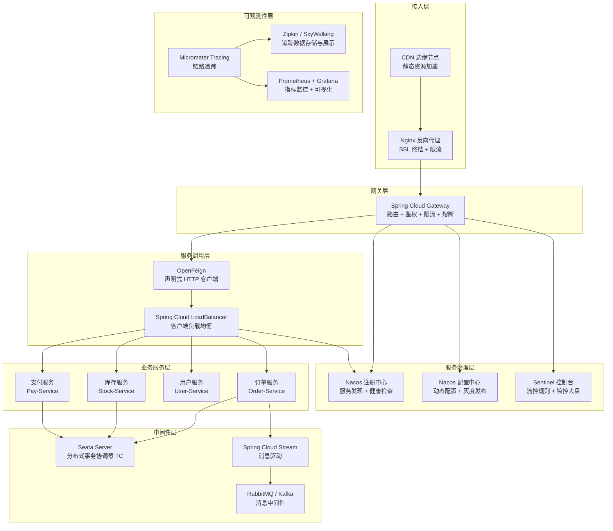

:::important
本文所有源码分析基于 #[R|Spring Cloud 2023.0.x]、#[R|Spring Cloud Alibaba 2023.0.x]、#[R|Spring Boot 3.2.x] 与 #[R|Spring Framework 6.1.x]，核心包路径覆盖 `org.springframework.cloud`、`com.alibaba.cloud`、`com.alibaba.csp.sentinel`、`io.seata` 等。关键类的源码位置均以相对路径标注，所有 Mermaid 图表中的类名与方法名均为真实 API。
:::

***

## Spring Cloud 版本演进与架构设计哲学

### 版本演进路线

| 版本 | 发布时间 | 核心变化 | Spring Boot 基线 |
|------|----------|----------|-----------------|
| Angel.SR6 | 2015 | 首版发布，微服务基础设施 | 1.2.x |
| Brixton.SR7 | 2016 | 引入 Spring Cloud Stream | 1.3.x |
| Camden.SR7 | 2016 | 引入 Spring Cloud Contract | 1.4.x |
| Dalston.SR5 | 2017 | 稳定版本，广泛使用 | 1.5.x |
| Edgware.SR6 | 2017 | 最后一个 1.x 系列 | 1.5.x |
| Finchley.SR4 | 2018 | 升级到 Spring Boot 2.x | 2.0.x |
| Greenwich.SR6 | 2019 | 引入 Spring Cloud Gateway 正式版 | 2.1.x |
| Hoxton.SR12 | 2020 | 引入 Spring Cloud LoadBalancer 替代 Ribbon | 2.2.x / 2.3.x |
| 2020.0.x（Ilford） | 2020 | 版本命名变更，移除 spring-cloud-netflix | 2.4.x / 2.5.x |
| 2021.0.x（Jubilee） | 2021 | 引入 Spring Native 支持 | 2.6.x / 2.7.x |
| 2022.0.x（Kilburn） | 2022 | 升级到 Spring Boot 3.x / Jakarta EE 9 | 3.0.x |
| 2023.0.x（Leyton） | 2023 | 当前推荐版本，全面支持虚拟线程 | 3.2.x |

### 架构设计核心原则

Spring Cloud 的架构设计遵循以下核心原则，这些原则是理解微服务架构设计的关键：

**1. 约定优于配置（Convention over Configuration）**

```java
// 源码位置：org.springframework.cloud.commons.util.SpringFactoryImportSelector
// Spring Cloud 通过 spring.factories / .imports 机制实现自动配置
// 开发者只需引入依赖，无需手动配置 Bean
// 例如：引入 spring-cloud-starter-gateway 即可获得完整的网关功能
```

**2. 抽象优于实现（Abstraction over Implementation）**

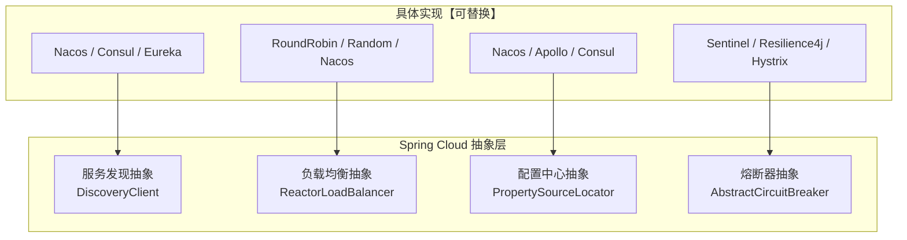

**3. 声明式编程（Declarative Programming）**

Spring Cloud 推崇声明式编程模型，通过注解和配置来描述系统行为，而非编写大量样板代码。`@FeignClient`、`@GlobalTransactional`、`@RefreshScope` 等都是声明式编程的典型体现。

**4. 分层架构（Layered Architecture）**

| 层级 | 职责 | 核心组件 |
|------|------|----------|
| Commons 层 | 通用抽象与工具 | `spring-cloud-commons`：`DiscoveryClient`、`LoadBalancer`、`ServiceRegistry` |
| Context 层 | Spring 上下文集成 | `spring-cloud-context`：`BootstrapConfiguration`、`RefreshScope`、`@RefreshScope` |
| Netflix 层 | 已弃用的 Netflix 组件 | `Eureka`、`Ribbon`【已废弃】、`Hystrix`【已废弃】 |
| Alibaba 层 | 阿里巴巴开源组件 | `Nacos`、`Sentinel`、`Seata`、`RocketMQ` |
| Gateway 层 | 网关与路由 | `Spring Cloud Gateway`、`Spring Cloud LoadBalancer` |
| Stream 层 | 消息驱动 | `Spring Cloud Stream`、`Binder`（RabbitMQ / Kafka） |
| Sleuth 层 | 链路追踪 | `Micrometer Tracing`、`Zipkin`、`Wavefront` |
| Config 层 | 配置管理 | `Spring Cloud Config`、`Consul Config`、`Vault` |

**5. 服务治理三角模型**

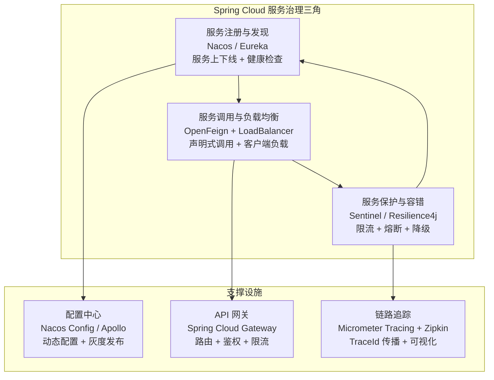

:::note
#[C|架构设计哲学总结：] Spring Cloud 的设计哲学是"提供一套分布式系统的常用模式，让开发者专注于业务逻辑而非基础设施"。通过抽象层隔离具体实现，实现组件的可替换性；通过声明式编程降低使用门槛；通过分层架构保持模块的内聚性。理解这些设计原则，有助于在架构选型时做出更合理的决策。
:::

***

## 场景一：服务注册与发现（Nacos / Eureka）

### 1.0 场景概览

服务注册与发现是微服务架构的基石。本场景追踪服务提供者从启动到被消费者调用的完整链路，涵盖 Nacos 注册中心的 CP / AP 模式切换、临时实例与持久实例的心跳机制，以及 Eureka 的自我保护机制。

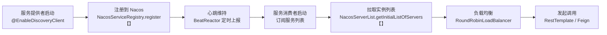

| 阶段 | 核心组件 | 关键机制 | 源码位置 |
|------|----------|----------|----------|
| 服务注册 | `NacosAutoServiceRegistration` | 应用启动时自动注册到 Nacos | `com.alibaba.cloud.nacos.registry.NacosAutoServiceRegistration` |
| 心跳维持 | `BeatReactor` | 定时 5s 发送心跳，超时 15s 标记不健康 | `com.alibaba.nacos.client.naming.beat.BeatReactor` |
| 服务发现 | `NacosServiceDiscovery` | 首次全量拉取 + 后续长轮询订阅 | `com.alibaba.cloud.nacos.discovery.NacosServiceDiscovery` |
| 负载均衡 | `RoundRobinLoadBalancer` | 轮询选择实例 | `org.springframework.cloud.loadbalancer.core.RoundRobinLoadBalancer` |
| 自我保护 | `ServerConfig.isSelfPreservation()` | Eureka 触发自我保护后不再剔除实例 | `com.netflix.eureka.registry.PeerAwareInstanceRegistryImpl` |

### 1.1 服务注册与发现全链路时序图

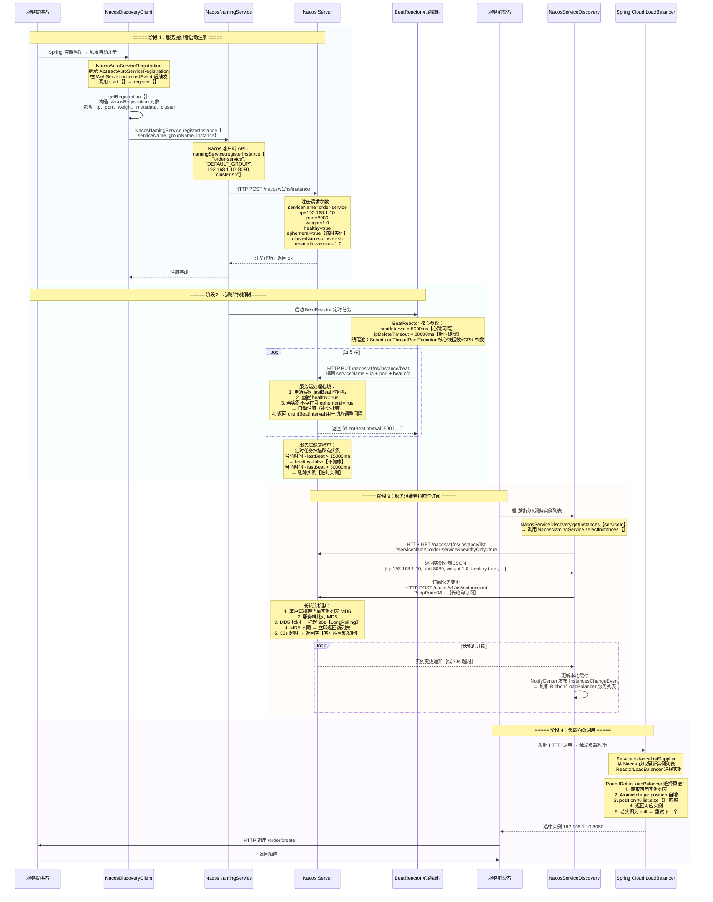

### 1.2 Nacos CP + AP 模式切换

Nacos 的注册中心同时支持 AP（可用性优先）和 CP（一致性优先）两种模式，这是其相对于 Eureka 和 Consul 的核心优势。

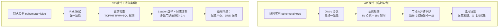

| 对比维度 | 临时实例【AP 模式】 | 持久实例【CP 模式】 |
|----------|---------------------|---------------------|
| 一致性协议 | Distro 协议 | Raft 协议 |
| 一致性保证 | 最终一致性 | 强一致性 |
| 心跳机制 | 客户端主动上报 5s/次 | 服务端主动探测 |
| 健康检查 | 超时 15s 标记不健康 | 支持 TCP/HTTP/MySQL/Custom |
| 剔除机制 | 超时 30s 自动剔除 | 不自动剔除，需手动下线 |
| 元数据 | 支持 | 支持 |
| 适用场景 | 微服务注册发现 | DNS、核心服务 |
| 容灾能力 | 高可用，可容忍多节点故障 | 需半数以上节点存活 |

**配置方式**：

```yaml
# 服务提供者配置临时实例
spring:
  cloud:
    nacos:
      discovery:
        ephemeral: true  # 默认 true，AP 模式
        namespace: dev
        group: DEFAULT_GROUP
        cluster-name: cluster-sh
        metadata:
          version: "1.0"
          region: "shanghai"

# 服务提供者配置持久实例
spring:
  cloud:
    nacos:
      discovery:
        ephemeral: false  # 持久实例，CP 模式
        namespace: prod
        group: CORE_SERVICE
```

**Nacos Distro 协议同步流程**：

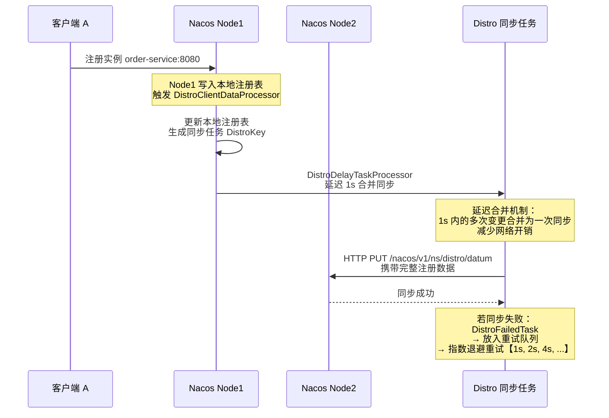

**Nacos 服务发现源码关键路径**：

```java
// 源码位置：com.alibaba.nacos.client.naming.NacosNamingService
// 服务注册核心方法
public void registerInstance(String serviceName, String groupName,
                             String ip, int port, String clusterName)
        throws NacosException {
    Instance instance = new Instance();
    instance.setIp(ip);
    instance.setPort(port);
    instance.setWeight(1.0);
    instance.setClusterName(clusterName);
    instance.setEphemeral(true);  // 临时实例标识
    instance.setHealthy(true);
    // 调用 NamingProxy 发送 HTTP 请求到 Nacos Server
    namingProxy.registerService(serviceName, groupName, instance);
}

// 源码位置：com.alibaba.nacos.client.naming.core.HostReactor
// 服务发现 — 获取实例列表
public List<Instance> getInstances(String serviceName, String groupName,
                                    String clusters) {
    // 1. 优先从本地缓存获取
    ServiceInfo serviceInfo = serviceInfoMap.get(serviceName);
    if (serviceInfo != null && serviceInfo.getHosts() != null) {
        return serviceInfo.getHosts();
    }
    // 2. 缓存未命中 → 从 Server 拉取
    return getServiceInfo(serviceName, groupName, clusters).getHosts();
}

// 源码位置：com.alibaba.nacos.client.naming.core.HostReactor
// 订阅服务变更 — 长轮询机制
public void subscribe(String serviceName, String groupName, String clusters) {
    // 1. 注册到本地监听器列表
    // 2. 启动定时任务 checkUpdateThread
    // 3. 每 2s 检查一次是否需要更新
    scheduledExecutorService.scheduleWithFixedDelay(
        new UpdateTask(serviceName, groupName, clusters),
        0, 2000, TimeUnit.MILLISECONDS);
}
```

**Nacos 集群部署关键配置**：

```bash
# Nacos Server 集群配置 cluster.conf
# 每个 Nacos 节点 IP:PORT 一行
192.168.1.10:8848
192.168.1.11:8848
192.168.1.12:8848

# application.properties
# 数据源配置【生产必须使用 MySQL，不能用内置 Derby】
spring.datasource.platform=mysql
db.num=1
db.url.0=jdbc:mysql://192.168.1.20:3306/nacos_config?useSSL=false&characterEncoding=utf8
db.user=nacos
db.password=xxxxxx
```

### 1.3 Eureka 自我保护机制

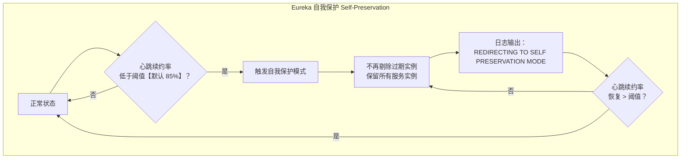

| 配置项 | 默认值 | 说明 |
|--------|--------|------|
| `eureka.server.enable-self-preservation` | true | 是否开启自我保护 |
| `eureka.server.renewal-percent-threshold` | 0.85 | 心跳续约率阈值 |
| `eureka.server.renewal-threshold-update-interval-ms` | 900000【15min】 | 阈值更新间隔 |
| `eureka.instance.lease-renewal-interval-in-seconds` | 30 | 客户端心跳间隔 |
| `eureka.instance.lease-expiration-duration-in-seconds` | 90 | 服务端过期剔除时间 |

:::warning
#[R|Eureka 自我保护模式的风险：] 在网络分区场景下，Eureka 触发自我保护后会保留所有实例（包括已下线的），导致客户端调用到不可用的服务。生产环境建议：监控心跳续约率，当持续低于阈值时，人工介入排查网络问题而非依赖自动剔除。#[Y|CAP 理论视角：Eureka 是典型的 AP 系统，牺牲一致性换取可用性。]
:::

:::important
#[C|Nacos vs Eureka 选型建议：] Nacos 同时支持 AP 和 CP 模式，且内置了配置中心功能，是 Spring Cloud Alibaba 生态的核心组件。Eureka 2.0 已停止开发，仅维护 1.x 版本。新项目建议使用 Nacos，存量 Eureka 项目可逐步迁移。迁移时注意：Nacos 的临时实例默认心跳间隔为 5s，Eureka 为 30s，需调整健康检查超时策略。
:::

***

## 场景二：配置中心（Nacos Config）

### 2.0 场景概览

配置中心是微服务架构中实现配置集中管理、动态刷新的核心设施。本场景深入 Nacos Config 的长轮询机制、配置优先级模型、灰度发布与配置回滚策略。

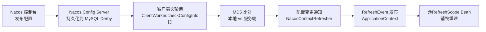

| 阶段 | 核心类 | 关键机制 | 源码位置 |
|------|--------|----------|----------|
| 配置发布 | `ConfigController` | HTTP POST 发布配置 | `com.alibaba.nacos.config.server.controller.ConfigController` |
| 长轮询 | `ClientWorker` | 30s 超时长轮询 | `com.alibaba.nacos.client.config.impl.ClientWorker` |
| 配置监听 | `CacheData` | 监听器回调 + MD5 比对 | `com.alibaba.nacos.client.config.impl.CacheData` |
| 配置刷新 | `NacosContextRefresher` | 发布 RefreshEvent 事件 | `com.alibaba.cloud.nacos.refresh.NacosContextRefresher` |
| 热更新 | `RefreshScope` | Bean 缓存清空 + 懒重建 | `org.springframework.cloud.context.scope.refresh.RefreshScope` |

### 2.1 配置中心全链路时序图

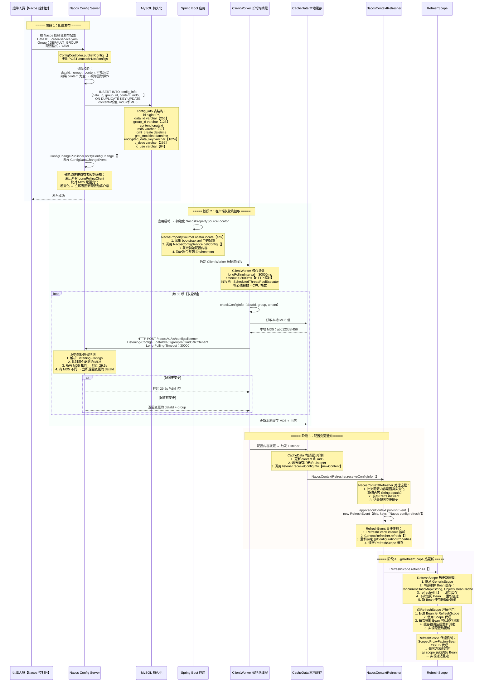

### 2.2 配置优先级模型

Spring Boot 与 Spring Cloud 的配置加载遵循严格的优先级顺序，理解这个优先级模型对于排查配置问题至关重要。

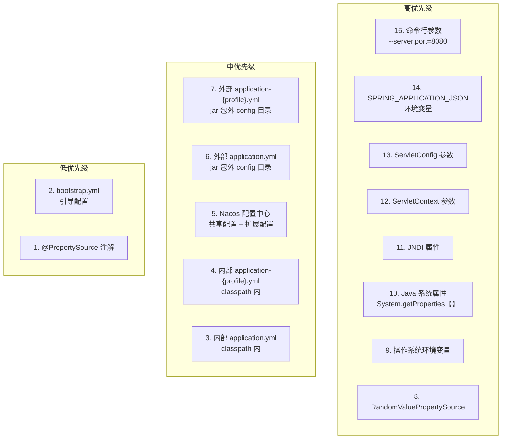

| 优先级 | 配置来源 | 示例 | 说明 |
|--------|----------|------|------|
| 最高 | 命令行参数 | `--server.port=8080` | 启动命令传入，覆盖所有 |
| 高 | 环境变量 | `SPRING_APPLICATION_JSON` | 系统级环境变量 |
| 高 | Java 系统属性 | `-Dserver.port=8080` | JVM 启动参数 |
| 中 | 外部配置文件 | `./config/application.yml` | jar 包外部的 config 目录 |
| 中 | Nacos 共享配置 | `shared-configs` | 多个服务共享的公共配置 |
| 中 | Nacos 扩展配置 | `extension-configs` | 服务专属扩展配置 |
| 中 | Nacos 主配置 | `order-service.yaml` | 当前服务的主配置 |
| 低 | 内部配置文件 | `classpath:application.yml` | jar 包内的配置文件 |
| 最低 | bootstrap.yml | `classpath:bootstrap.yml` | 引导上下文配置 |

**Nacos 配置中心多配置加载示例**：

```yaml
# bootstrap.yml
spring:
  application:
    name: order-service
  cloud:
    nacos:
      config:
        server-addr: 127.0.0.1:8848
        namespace: dev
        group: DEFAULT_GROUP
        file-extension: yaml
        refresh-enabled: true
        # 共享配置【优先级最低】
        shared-configs:
          - data-id: common-redis.yaml
            group: COMMON
            refresh: true
          - data-id: common-mysql.yaml
            group: COMMON
            refresh: true
        # 扩展配置【优先级高于共享配置】
        extension-configs:
          - data-id: order-datasource.yaml
            group: ORDER
            refresh: true
          - data-id: order-threadpool.yaml
            group: ORDER
            refresh: true
```

### 2.3 灰度发布与配置回滚

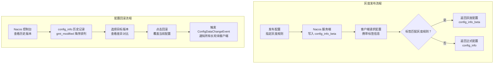

| 灰度发布参数 | 说明 | 示例 |
|-------------|------|------|
| `spring.cloud.nacos.config.group` | 配置分组 | `DEFAULT_GROUP` |
| `spring.cloud.nacos.config.namespace` | 命名空间【隔离环境】 | `dev / test / prod` |
| 标签路由 | 基于 IP / 版本号灰度 | `tag=192.168.1.*` |
| Beta 配置 | 仅对指定 IP 生效 | `betaIps=192.168.1.100,192.168.1.101` |

:::warning
#[R|配置灰度发布注意事项：] 灰度配置通过 `config_info_beta` 表存储，仅对匹配 `betaIps` 的客户端生效。灰度发布后，需验证灰度实例的日志确认配置生效，确认无误后再全量发布。若灰度配置与正式配置存在冲突，优先返回灰度配置。
:::

:::note
#[C|配置回滚的最佳实践：] Nacos 默认保留 30 天内的配置历史版本，可在 `application.properties` 中通过 `nacos.config.retention.days=30` 配置。每次配置变更都会记录 MD5 值，支持按 MD5 快速定位版本。生产环境建议开启配置变更审计日志，记录每次变更的操作人、时间、内容摘要。
:::

***

## 场景三：API 网关（Spring Cloud Gateway）

### 3.0 场景概览

Spring Cloud Gateway 是基于 Spring WebFlux 和 Netty 的响应式 API 网关，提供路由、断言、过滤器三大核心能力。本场景深入剖析其路由匹配、过滤器链执行、限流熔断与重试机制。

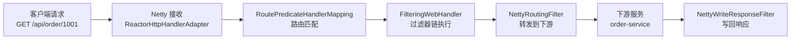

| 核心概念 | 说明 | 关键接口 |
|----------|------|----------|
| Route 路由 | 网关的基本构建块，包含 ID、URI、Predicate、Filter | `RouteDefinition` |
| Predicate 断言 | 匹配 HTTP 请求的条件，基于 Java 8 Predicate | `RoutePredicateFactory` |
| Filter 过滤器 | 对请求/响应进行修改，支持前置/后置过滤 | `GatewayFilter` / `GlobalFilter` |
| RouteLocator | 路由定位器，加载和管理路由定义 | `RouteLocator` / `RouteDefinitionRouteLocator` |

### 3.1 API 网关全链路时序图

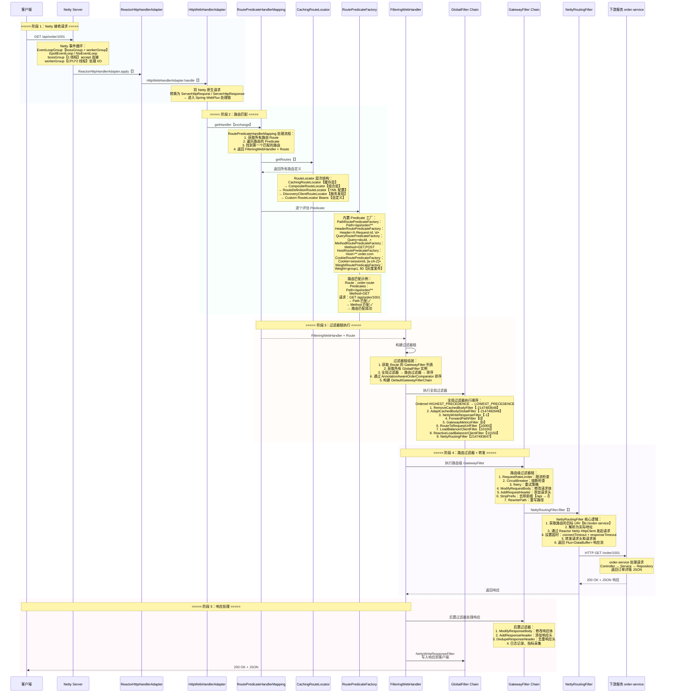

### 3.2 网关路由配置详解

```yaml
spring:
  cloud:
    gateway:
      routes:
        # 路由一：订单服务
        - id: order-route
          uri: lb://order-service
          predicates:
            - Path=/api/order/**
            - Method=GET,POST
          filters:
            - StripPrefix=1
            - AddRequestHeader=X-Gateway-Route, order-route
            - name: RequestRateLimiter
              args:
                redis-rate-limiter.replenishRate: 10
                redis-rate-limiter.burstCapacity: 20
                key-resolver: "#{@ipKeyResolver}"
            - name: CircuitBreaker
              args:
                name: orderCircuitBreaker
                fallbackUri: forward:/fallback/order
            - name: Retry
              args:
                retries: 3
                statuses: BAD_GATEWAY, SERVICE_UNAVAILABLE
                methods: GET
                backoff:
                  firstBackoff: 50ms
                  maxBackoff: 500ms
                  factor: 2
                  basedOnPreviousValue: true

        # 路由二：库存服务
        - id: stock-route
          uri: lb://stock-service
          predicates:
            - Path=/api/stock/**
          filters:
            - StripPrefix=1
            - name: RequestRateLimiter
              args:
                redis-rate-limiter.replenishRate: 100
                redis-rate-limiter.burstCapacity: 200
                key-resolver: "#{@ipKeyResolver}"

        # 路由三：灰度发布路由
        - id: order-canary-route
          uri: lb://order-service-canary
          predicates:
            - Path=/api/order/**
            - Header=X-Canary, true
          filters:
            - StripPrefix=1
```

### 3.3 限流机制（Redis Rate Limiter）

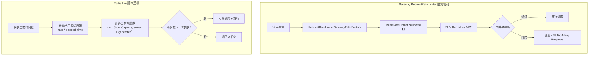

| 配置参数 | 说明 | 示例值 |
|----------|------|--------|
| `redis-rate-limiter.replenishRate` | 令牌填充速率【令牌/秒】 | 10 |
| `redis-rate-limiter.burstCapacity` | 令牌桶容量 | 20 |
| `redis-rate-limiter.requestedTokens` | 每次请求消耗令牌数 | 1 |
| `key-resolver` | 限流 Key 解析器 | `#{@ipKeyResolver}` |

**KeyResolver 自定义实现**：

```java
// 源码位置：项目中自定义，参考 org.springframework.cloud.gateway.filter.ratelimit.KeyResolver
@Configuration
public class RateLimiterConfig {

    // 基于 IP 限流
    @Bean
    public KeyResolver ipKeyResolver() {
        return exchange -> Mono.just(
            exchange.getRequest().getRemoteAddress()
                .getAddress().getHostAddress()
        );
    }

    // 基于用户 ID 限流
    @Bean
    public KeyResolver userKeyResolver() {
        return exchange -> Mono.just(
            exchange.getRequest().getHeaders()
                .getFirst("X-User-Id")
        );
    }

    // 基于接口路径限流
    @Bean
    public KeyResolver apiKeyResolver() {
        return exchange -> Mono.just(
            exchange.getRequest().getPath().value()
        );
    }
}
```

**Gateway 全局过滤器自定义实现**：

```java
// 源码位置：项目中自定义，参考 org.springframework.cloud.gateway.filter.GlobalFilter
@Component
@Order(-1)  // 优先级最高，在所有过滤器之前执行
public class AuthGlobalFilter implements GlobalFilter, Ordered {

    private static final AntPathMatcher PATH_MATCHER = new AntPathMatcher();

    // 白名单路径，无需鉴权
    private static final List<String> WHITE_LIST = Arrays.asList(
        "/api/auth/login", "/api/auth/register", "/api/health"
    );

    @Override
    public Mono<Void> filter(ServerWebExchange exchange, GatewayFilterChain chain) {
        ServerHttpRequest request = exchange.getRequest();
        String path = request.getURI().getPath();

        // 1. 白名单路径直接放行
        if (WHITE_LIST.stream().anyMatch(pattern ->
                PATH_MATCHER.match(pattern, path))) {
            return chain.filter(exchange);
        }

        // 2. 从 Header 获取 Token
        String token = request.getHeaders().getFirst("Authorization");
        if (!StringUtils.hasText(token) || !token.startsWith("Bearer ")) {
            // 返回 401 Unauthorized
            ServerHttpResponse response = exchange.getResponse();
            response.setStatusCode(HttpStatus.UNAUTHORIZED);
            return response.setComplete();
        }

        // 3. 验证 Token 并解析用户信息
        try {
            String realToken = token.substring(7);
            // JWT 解析逻辑
            Map<String, Object> claims = JwtUtils.parseToken(realToken);
            String userId = (String) claims.get("userId");
            String username = (String) claims.get("username");

            // 4. 将用户信息写入请求头，传递给下游服务
            ServerHttpRequest modifiedRequest = request.mutate()
                .header("X-User-Id", userId)
                .header("X-Username", username)
                .build();
            return chain.filter(exchange.mutate()
                .request(modifiedRequest).build());
        } catch (Exception e) {
            // Token 无效 → 返回 401
            ServerHttpResponse response = exchange.getResponse();
            response.setStatusCode(HttpStatus.UNAUTHORIZED);
            return response.setComplete();
        }
    }

    @Override
    public int getOrder() {
        return -1;
    }
}

// 动态路由配置 — 从数据库加载路由规则
@Component
public class DynamicRouteConfig implements ApplicationEventPublisherAware {

    private ApplicationEventPublisher publisher;

    @Autowired
    private RouteDefinitionWriter routeDefinitionWriter;

    // 从数据库加载路由配置
    @PostConstruct
    public void initRoutes() {
        // 从 MySQL 查询路由配置
        List<RouteDefinition> routes = routeRepository.findAll();
        routes.forEach(route -> {
            routeDefinitionWriter.save(Mono.just(route)).subscribe();
            publisher.publishEvent(new RefreshRoutesEvent(this));
        });
    }

    // 动态添加路由
    public void addRoute(RouteDefinition definition) {
        routeDefinitionWriter.save(Mono.just(definition)).subscribe();
        publisher.publishEvent(new RefreshRoutesEvent(this));
    }

    // 动态删除路由
    public void deleteRoute(String routeId) {
        routeDefinitionWriter.delete(Mono.just(routeId)).subscribe();
        publisher.publishEvent(new RefreshRoutesEvent(this));
    }

    @Override
    public void setApplicationEventPublisher(
            ApplicationEventPublisher applicationEventPublisher) {
        this.publisher = applicationEventPublisher;
    }
}
```

### 3.4 Gateway vs Zuul 对比

| 对比维度 | Spring Cloud Gateway | Zuul 1.x | Zuul 2.x |
|----------|---------------------|----------|----------|
| 网络模型 | 非阻塞 I/O【Netty】 | 阻塞 I/O【Servlet】 | 非阻塞 I/O【Netty】 |
| 线程模型 | 少量 EventLoop 线程 | 每连接一线程 | EventLoop 线程 |
| 框架基础 | Spring WebFlux【Reactor】 | Spring MVC | Netty 原生 |
| 路由方式 | 编程式/声明式 | 配置式 | 配置式 |
| 过滤器 | GatewayFilter + GlobalFilter | ZuulFilter【pre/route/post】 | ZuulFilter |
| 性能 | 高【异步非阻塞】 | 低【同步阻塞】 | 高【异步非阻塞】 |
| 长连接支持 | 好 | 差 | 好 |
| 内存消耗 | 低 | 高 | 低 |
| 生态成熟度 | 成熟【Spring 官方】 | EOL 不再维护 | 不成熟，社区小 |
| Spring Boot 3.x | 支持 | 不支持 | 不支持 |
| 限流 | 内置 Redis Rate Limiter | 需自定义 | 需自定义 |
| 熔断 | 内置 CircuitBreaker 集成 Sentinel | 需自定义 | 需自定义 |

:::important
#[C|Gateway 选型结论：] Spring Cloud Gateway 是 Spring 官方推荐的网关，基于非阻塞 I/O 模型，在高并发场景下性能远优于 Zuul 1.x。Zuul 1.x 已停止维护，Zuul 2.x 生态不成熟。新项目必须使用 Gateway，存量 Zuul 项目应制定迁移计划。迁移时注意：ZuulFilter 的 pre/route/post 三个阶段对应 Gateway 的前置/路由/后置过滤器，需要逐一映射。
:::

***

## 场景四：服务调用（OpenFeign + LoadBalancer）

### 4.0 场景概览

OpenFeign 是声明式 HTTP 客户端，通过动态代理将 Java 接口映射为 HTTP 请求。结合 Spring Cloud LoadBalancer 实现客户端负载均衡。本场景深入 Feign 的动态代理机制、Contract 协议解析、Encoder/Decoder 编解码以及负载均衡策略。


| 核心组件 | 说明 | 关键类 |
|----------|------|--------|
| FeignClientFactoryBean | 创建 Feign 代理对象的工厂 Bean | `org.springframework.cloud.openfeign.FeignClientFactoryBean` |
| Contract | 解析方法注解生成 RequestTemplate | `feign.Contract` |
| Encoder | 请求体编码器 | `feign.codec.Encoder` |
| Decoder | 响应体解码器 | `feign.codec.Decoder` |
| Client | HTTP 客户端执行器 | `feign.Client` |
| RequestInterceptor | 请求拦截器 | `feign.RequestInterceptor` |
| Retryer | 重试策略 | `feign.Retryer` |

### 4.1 OpenFeign 全链路时序图

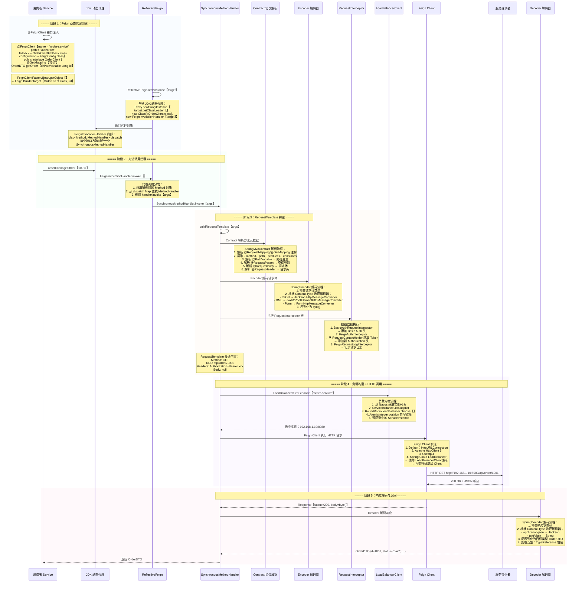

### 4.2 Feign Contract 协议解析

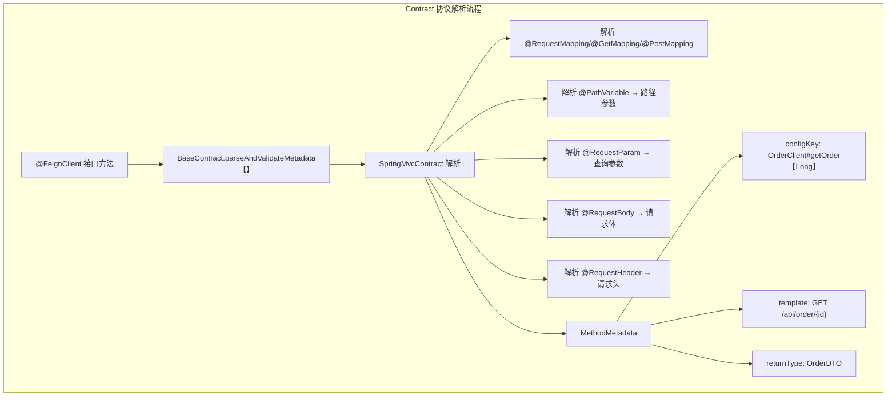

| 注解 | 解析后位置 | 示例 |
|------|-----------|------|
| `@GetMapping("/{id}")` | `RequestTemplate.method` + `.path` | `GET /api/order/{id}` |
| `@PathVariable("id")` | `RequestTemplate.url` 变量替换 | `{id} → 1001` |
| `@RequestParam("page")` | `RequestTemplate.queries` | `?page=1` |
| `@RequestBody` | `RequestTemplate.body` | JSON 序列化后 |
| `@RequestHeader("X-Token")` | `RequestTemplate.headers` | `X-Token: abc123` |

### 4.3 Feign 配置与拦截器

```java
// Feign 配置类
@Configuration
public class FeignConfig {

    // 配置日志级别
    @Bean
    public Logger.Level feignLoggerLevel() {
        return Logger.Level.FULL;  // NONE, BASIC, HEADERS, FULL
    }

    // 配置重试策略
    @Bean
    public Retryer feignRetryer() {
        return new Retryer.Default(
            100,    // period：初始重试间隔 100ms
            1000,   // maxPeriod：最大重试间隔 1000ms
            3       // maxAttempts：最大重试次数 3
        );
    }

    // 配置超时时间
    @Bean
    public Request.Options options() {
        return new Request.Options(
            10, TimeUnit.SECONDS,   // connectTimeout
            60, TimeUnit.SECONDS,   // readTimeout
            true                    // followRedirects
        );
    }

    // 请求拦截器：传递认证 Token
    @Bean
    public RequestInterceptor authRequestInterceptor() {
        return template -> {
            ServletRequestAttributes attributes =
                (ServletRequestAttributes) RequestContextHolder.getRequestAttributes();
            if (attributes != null) {
                String token = attributes.getRequest()
                    .getHeader("Authorization");
                if (StringUtils.hasText(token)) {
                    template.header("Authorization", token);
                }
            }
        };
    }

    // 解码器：支持自定义解码逻辑
    @Bean
    public Decoder feignDecoder(ObjectMapper objectMapper) {
        return new JacksonDecoder(objectMapper);
    }

    // 错误解码器：处理非 2xx 响应
    @Bean
    public ErrorDecoder feignErrorDecoder() {
        return (methodKey, response) -> {
            int status = response.status();
            if (status == 400) {
                return new BadRequestException("Bad Request");
            } else if (status == 404) {
                return new NotFoundException("Not Found");
            } else if (status >= 500) {
                return new ServiceUnavailableException("Server Error");
            }
            return new Default().decode(methodKey, response);
        };
    }
}
```

```yaml
# application.yml Feign 配置
spring:
  cloud:
    openfeign:
      client:
        config:
          # 默认配置【所有 Feign 客户端】
          default:
            connectTimeout: 5000
            readTimeout: 30000
            loggerLevel: BASIC
            retryer: feign.Retryer.Default
            errorDecoder: feign.codec.ErrorDecoder.Default
            requestInterceptors:
              - com.example.interceptor.FeignAuthInterceptor
          # 指定服务的配置
          order-service:
            connectTimeout: 3000
            readTimeout: 10000
            loggerLevel: FULL
```

### 4.4 负载均衡策略详解

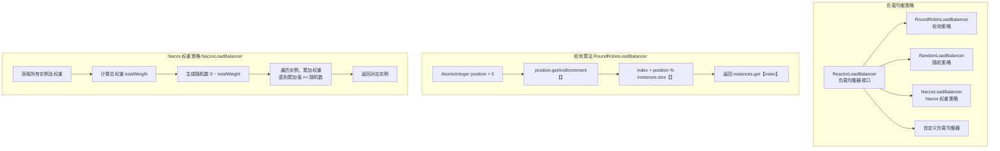

| 负载均衡策略 | 类名 | 说明 | 适用场景 |
|-------------|------|------|----------|
| 轮询 | `RoundRobinLoadBalancer` | 按顺序依次选择 | 实例性能相同 |
| 随机 | `RandomLoadBalancer` | 随机选择实例 | 简单场景 |
| 加权 | `NacosLoadBalancer` | 基于 Nacos 权重值 | 实例性能不均 |
| 最小连接数 | 自定义实现 | 选择活跃连接数最少的实例 | 长连接场景 |
| 一致性哈希 | 自定义实现 | 相同请求路由到同一实例 | 缓存命中场景 |

**自定义负载均衡器实现**：

```java
// 最小连接数负载均衡器
@Configuration
public class LeastConnectionLoadBalancerConfig {

    private final Map<String, AtomicInteger> connectionCounters = new ConcurrentHashMap<>();

    @Bean
    public ReactorLoadBalancer<ServiceInstance> leastConnectionLoadBalancer(
            Environment environment,
            LoadBalancerClientFactory loadBalancerClientFactory) {

        String name = environment.getProperty(
            LoadBalancerClientFactory.PROPERTY_NAME);
        return new LeastConnectionLoadBalancer(name);
    }

    @LoadBalanced
    @Bean
    public RestTemplate restTemplate() {
        return new RestTemplate();
    }
}

// 自定义 ConsistentHashLoadBalancer
public class ConsistentHashLoadBalancer
        implements ReactorServiceInstanceLoadBalancer {

    private final String serviceId;
    private final ObjectProvider<ServiceInstanceListSupplier> supplierProvider;

    @Override
    public Mono<Response<ServiceInstance>> choose(Request request) {
        ServiceInstanceListSupplier supplier =
            supplierProvider.getIfAvailable();
        return supplier.get()
            .next()
            .map(instances -> {
                // 获取请求中的哈希 Key
                String hashKey = ((RequestDataContext) request.getContext())
                    .getClientRequest()
                    .getUrl()
                    .getPath();
                int hash = hashKey.hashCode() & Integer.MAX_VALUE;
                int index = hash % instances.size();
                return new DefaultResponse(instances.get(index));
            });
    }
}
```

:::warning
#[R|Feign 超时配置注意事项：] Feign 的 `connectTimeout` 和 `readTimeout` 需要与 Ribbon/LoadBalancer 的超时配合使用。如果两者都配置了，Feign 的超时会覆盖 LoadBalancer 的超时。公式：`Ribbon 超时 = (connectTimeout + readTimeout) * (maxAutoRetries + 1) * (maxAutoRetriesNextServer + 1)`。为避免超时配置混乱，建议统一在 Feign 层面配置超时。
:::

***

## 场景五：熔断降级（Sentinel）

### 5.0 场景概览

Sentinel 是阿里巴巴开源的流量防卫兵，提供流量控制、熔断降级、系统负载保护、热点参数限流等核心能力。本场景深入 Sentinel 的责任链 Slot 机制、滑动窗口限流算法、热点参数限流以及控制台 Dashboard 的使用。


| 核心概念 | 说明 | 关键类 |
|----------|------|--------|
| Resource | 被保护资源，可以是方法/接口 | `com.alibaba.csp.sentinel.slots.block.flow.FlowRule` |
| Context | 调用链路上下文，ThreadLocal 存储 | `com.alibaba.csp.sentinel.Context` |
| Entry | Sentinel 入口，表示一次资源访问 | `com.alibaba.csp.sentinel.Entry` |
| Slot | 责任链中的处理单元 | `com.alibaba.csp.sentinel.slotchain.ProcessorSlot` |
| Node | 统计节点，存储实时统计数据 | `com.alibaba.csp.sentinel.node.StatisticNode` |
| Rule | 规则定义，包括流控/降级/系统/授权 | `com.alibaba.csp.sentinel.slots.block.flow.FlowRule` |

### 5.1 Sentinel 责任链全链路时序图

```mermaid
sequenceDiagram
    participant APP as 业务代码
    participant SPHU as SphU
    participant CTX_UTIL as ContextUtil
    participant SLOT_CHAIN as ProcessorSlotChain
    participant NODE_SLOT as NodeSelectorSlot
    participant CLUSTER_SLOT as ClusterBuilderSlot
    participant STAT_SLOT as StatisticSlot
    participant FLOW_SLOT as FlowSlot
    participant DEGRADE_SLOT as DegradeSlot
    participant SYSTEM_SLOT as SystemSlot
    participant RULE_MGR as FlowRuleManager

    rect rgba(240, 248, 255, 0.4)
    Note over APP,CTX_UTIL: ===== 阶段 1：创建调用上下文 =====
    APP->>SPHU: SphU.entry【"order-create"】
    Note over SPHU: 入口方法：<br/>SphU.entry【resourceName】<br/>→ Env.sph.entryWithType【】<br/>→ CtSph.entryWithType【】<br/>→ 获取 Slot Chain 并执行
    SPHU->>CTX_UTIL: ContextUtil.getContext【】
    Note over CTX_UTIL: Context 创建逻辑：<br/>1. 从 ThreadLocal 获取当前 Context<br/>2. 若不存在 → 创建新 Context<br/>   Context context = new Context【<br/>     nodeName, origin】<br/>3. context.setCurEntry【entry】<br/>4. 存储到 ThreadLocal
    CTX_UTIL-->>SPHU: 返回 Context
    SPHU->>SLOT_CHAIN: 获取 Slot Chain
    end

    rect rgba(240, 255, 248, 0.4)
    Note over SLOT_CHAIN,NODE_SLOT: ===== 阶段 2：NodeSelectorSlot 构建调用树 =====
    SLOT_CHAIN->>NODE_SLOT: NodeSelectorSlot.entry【context, resource, ...】
    Note over NODE_SLOT: NodeSelectorSlot 核心逻辑：<br/>1. 获取 Context 对应的 DefaultNode<br/>2. context.getCurNode【】<br/>3. 创建或获取子节点<br/>   DefaultNode node = new DefaultNode【<br/>     resource, clusterNode】<br/>4. 构建调用树结构：<br/>   entranceNode<br/>     ├── order-create<br/>     │   ├── stock-deduct<br/>     │   └── pay-create<br/>     └── user-query
    NODE_SLOT->>CLUSTER_SLOT: 触发下一个 Slot
    end

    rect rgba(255, 248, 240, 0.4)
    Note over CLUSTER_SLOT,STAT_SLOT: ===== 阶段 3：ClusterBuilderSlot + StatisticSlot =====
    CLUSTER_SLOT->>CLUSTER_SLOT: ClusterBuilderSlot.entry【】
    Note over CLUSTER_SLOT: ClusterBuilderSlot 逻辑：<br/>1. 为每个资源创建 ClusterNode<br/>2. ClusterNode 聚合所有对该资源的调用<br/>3. 全局唯一，按资源名区分<br/>4. 存储：Map<String, ClusterNode>
    CLUSTER_SLOT->>STAT_SLOT: StatisticSlot.entry【】
    Note over STAT_SLOT: StatisticSlot 核心逻辑：<br/>1. 记录入口时间 startTime<br/>2. 调用 fireEntry【】触发后续 Slot<br/>3. 若后续 Slot 抛出 BlockException<br/>   → 记录阻塞统计<br/>4. 记录出口时间<br/>5. 计算 RT = endTime - startTime<br/>6. 更新 StatisticNode 统计
    end

    rect rgba(248, 240, 255, 0.4)
    Note over STAT_SLOT,FLOW_SLOT: ===== 阶段 4：流控规则检查 FlowSlot =====
    STAT_SLOT->>FLOW_SLOT: FlowSlot.entry【】
    Note over FLOW_SLOT: FlowSlot 检查流程：<br/>1. 从 FlowRuleManager 获取规则<br/>2. 遍历所有 FlowRule<br/>3. 调用 FlowRuleChecker.checkFlow【】<br/>4. 根据规则类型执行检查：<br/>   - FLOW_GRADE_QPS【QPS 限流】<br/>   - FLOW_GRADE_THREAD【线程数限流】
    FLOW_SLOT->>RULE_MGR: FlowRuleManager.getRules【resource】
    RULE_MGR-->>FLOW_SLOT: 返回规则列表
    Note over FLOW_SLOT: 流控规则示例：<br/>[<br/>  {<br/>    resource: "order-create"<br/>    grade: FLOW_GRADE_QPS【1】<br/>    count: 100.0<br/>    strategy: STRATEGY_DIRECT【0】<br/>    controlBehavior: CONTROL_BEHAVIOR_DEFAULT<br/>    statIntervalMs: 1000<br/>  }<br/>]
    Note over FLOW_SLOT: 流控效果判断：<br/>1. 获取当前 QPS 统计<br/>2. QPS >= count → 触发限流<br/>3. 抛出 FlowException<br/>4. controlBehavior 决定行为：<br/>   - DEFAULT【快速失败】<br/>   - WARM_UP【预热】<br/>   - RATE_LIMITER【匀速排队】
    alt 流控通过
        FLOW_SLOT->>DEGRADE_SLOT: 触发下一个 Slot
    else 流控触发
        FLOW_SLOT-->>STAT_SLOT: 抛出 FlowException
        STAT_SLOT-->>APP: BlockException → 执行 fallback
    end
    end

    rect rgba(255, 240, 245, 0.4)
    Note over DEGRADE_SLOT,SYSTEM_SLOT: ===== 阶段 5：降级检查 + 系统保护 =====
    DEGRADE_SLOT->>DEGRADE_SLOT: DegradeSlot.entry【】
    Note over DEGRADE_SLOT: 降级规则检查：<br/>1. 获取 DegradeRule 列表<br/>2. 遍历规则检查：<br/>   - DEGRADE_GRADE_RT【平均响应时间】<br/>     RT > 阈值 → 进入半开状态<br/>   - DEGRADE_GRADE_EXCEPTION_RATIO【异常比例】<br/>     异常比例 > 阈值 → 开启熔断<br/>   - DEGRADE_GRADE_EXCEPTION_COUNT【异常数】<br/>     异常数 > 阈值 → 开启熔断<br/>3. 熔断器状态机：<br/>   CLOSED → OPEN → HALF_OPEN → CLOSED
    DEGRADE_SLOT->>SYSTEM_SLOT: SystemSlot.entry【】
    Note over SYSTEM_SLOT: 系统保护规则：<br/>1. LOAD【系统负载】<br/>2. RT【平均响应时间】<br/>3. 线程数<br/>4. 入口 QPS<br/>5. CPU 使用率<br/>触发系统保护 → 抛出 SystemBlockException
    SYSTEM_SLOT-->>SLOT_CHAIN: 所有检查通过
    end
```

### 5.2 滑动窗口限流算法

```mermaid
graph TB
    subgraph "滑动窗口核心结构"
        A["时间轴【1s 窗口】"] --> B["窗口划分<br/>默认 2 个桶，每个 500ms"]
        B --> C["每个桶包含：<br/>MetricBucket<br/>├── pass【通过数】<br/>├── block【阻塞数】<br/>├── success【成功数】<br/>├── exception【异常数】<br/>└── rt【响应时间】"]
    end

    subgraph "滑动窗口数组 LeapArray"
        D["LeapArray<MetricBucket>"] --> E["windowLengthInMs = 500ms"]
        D --> F["sampleCount = 2"]
        D --> G["intervalInMs = 1000ms"]
        D --> H["array: AtomicReferenceArray<WindowWrap>"]
    end

    subgraph "窗口滑动逻辑"
        I["获取当前时间戳"] --> J["计算当前窗口索引<br/>idx = time / windowLength % sampleCount"]
        J --> K["获取当前窗口 WindowWrap"]
        K --> L{"窗口时间是否过期？"}
        L -->|"否"| M["返回当前窗口"]
        L -->|"是"| N["重置窗口 + 返回"]
        N --> O["window.reset【newStartTime】"]
    end
```

| 参数 | 默认值 | 说明 |
|------|--------|------|
| `sampleCount` | 2 | 窗口内的桶数量 |
| `intervalInMs` | 1000 | 统计时间窗口长度【ms】 |
| `windowLengthInMs` | 500 | 每个桶的时间长度【ms】 |

**QPS 计算逻辑**：

```java
// 源码位置：com.alibaba.csp.sentinel.slots.statistic.base.LeapArray
public long pass() {
    // 获取当前滑动窗口
    data.currentWindow();
    long pass = 0;
    // 遍历所有有效窗口桶
    List<MetricBucket> list = data.values();
    for (MetricBucket window : list) {
        pass += window.pass();
    }
    return pass;
}
// QPS = pass / intervalInMs * 1000
// 即：当前窗口内所有桶的通过数之和
```

### 5.3 热点参数限流

```mermaid
graph TB
    subgraph "热点参数限流 ParamFlowSlot"
        A["请求进入<br/>携带参数 itemId=1001"] --> B["ParamFlowChecker.checkFlow【】"]
        B --> C["获取 ParamFlowRule"]
        C --> D["提取指定参数索引的值"]
        D --> E["参数值 1001 的独立统计<br/>ParamMapBucket"]
        E --> F{"参数值 1001 的 QPS<br/>是否超过阈值？"}
        F -->|"是"| G["触发限流<br/>抛出 ParamFlowException"]
        F -->|"否"| H["放行"]
    end
```

```java
// 热点参数限流规则配置示例
@PostConstruct
public void initParamFlowRule() {
    List<ParamFlowRule> rules = new ArrayList<>();
    ParamFlowRule rule = new ParamFlowRule();
    rule.setResource("order-create");     // 资源名
    rule.setParamIdx(1);                  // 参数索引【第 2 个参数】
    rule.setGrade(RuleConstant.FLOW_GRADE_QPS);
    rule.setCount(10);                    // 默认阈值

    // 特殊参数值设置不同阈值
    ParamFlowItem item1 = new ParamFlowItem();
    item1.setObject("1001");              // 参数值
    item1.setClassType(String.class.getName());
    item1.setCount(100);                  // 特殊阈值：100 QPS
    rule.setParamFlowItemList(Collections.singletonList(item1));

    rules.add(rule);
    ParamFlowRuleManager.loadRules(rules);
}
```

### 5.4 Sentinel Dashboard 控制台

```yaml
# Sentinel Dashboard 配置
spring:
  cloud:
    sentinel:
      transport:
        dashboard: 127.0.0.1:8080       # Dashboard 地址
        port: 8719                       # 客户端通信端口
        heartbeat-interval-ms: 10000     # 心跳间隔
      eager: true                        # 立即注册
      datasource:
        # 规则持久化到 Nacos
        flow:
          nacos:
            server-addr: 127.0.0.1:8848
            namespace: dev
            group-id: DEFAULT_GROUP
            data-id: ${spring.application.name}-flow-rules
            rule-type: flow
            data-type: json
        degrade:
          nacos:
            server-addr: 127.0.0.1:8848
            namespace: dev
            group-id: DEFAULT_GROUP
            data-id: ${spring.application.name}-degrade-rules
            rule-type: degrade
            data-type: json
        system:
          nacos:
            server-addr: 127.0.0.1:8848
            namespace: dev
            group-id: DEFAULT_GROUP
            data-id: ${spring.application.name}-system-rules
            rule-type: system
            data-type: json
```

:::warning
#[R|Sentinel 规则持久化陷阱：] 默认 Sentinel 规则存储在 JVM 内存中，应用重启后规则丢失。生产环境必须配置规则持久化到 Nacos / Apollo 等配置中心。使用 `SentinelDataSource` 实现规则从配置中心动态加载。切勿使用默认内存模式用于生产环境。同时注意：Dashboard 上修改规则后，需要同步更新到配置中心，否则重启后规则会回退。
:::

:::note
#[C|Sentinel 与 Hystrix 对比：] Hystrix 已进入维护模式，不再开发新功能。Sentinel 提供了更丰富的流控策略【QPS、线程数、预热、匀速排队】、更灵活的热点参数限流、更完善的系统自适应保护。Sentinel 的滑动窗口统计粒度更细【500ms 桶】，相比 Hystrix 的 10s 滚动窗口，能更快响应流量变化。建议新项目使用 Sentinel，存量 Hystrix 项目逐步迁移。
:::

### 5.5 Sentinel 与 OpenFeign 集成

```java
// Sentinel 与 Feign 集成 — Fallback 降级实现
@FeignClient(
    name = "order-service",
    path = "/api/order",
    fallback = OrderClientFallback.class,  // 降级处理类
    fallbackFactory = OrderClientFallbackFactory.class  // 获取异常信息
)
public interface OrderClient {

    @GetMapping("/{id}")
    OrderDTO getOrder(@PathVariable Long id);

    @PostMapping("/create")
    Result<Long> createOrder(@RequestBody OrderDTO order);
}

// Fallback 降级实现
@Component
public class OrderClientFallback implements OrderClient {

    @Override
    public OrderDTO getOrder(Long id) {
        // 降级逻辑：返回缓存数据或默认值
        log.warn("OrderClient.getOrder fallback, id={}", id);
        return OrderDTO.builder()
            .id(id)
            .status("UNKNOWN")
            .build();
    }

    @Override
    public Result<Long> createOrder(OrderDTO order) {
        // 降级逻辑：返回错误信息
        log.error("OrderClient.createOrder fallback");
        return Result.error("服务暂不可用，请稍后重试");
    }
}

// FallbackFactory — 获取异常信息
@Component
public class OrderClientFallbackFactory
        implements FallbackFactory<OrderClient> {

    @Override
    public OrderClient create(Throwable cause) {
        log.error("OrderClient 调用异常", cause);
        return new OrderClient() {
            @Override
            public OrderDTO getOrder(Long id) {
                if (cause instanceof FlowException) {
                    // 限流异常
                    return OrderDTO.builder().status("FLOW_LIMITED").build();
                } else if (cause instanceof DegradeException) {
                    // 熔断异常
                    return OrderDTO.builder().status("DEGRADED").build();
                }
                return OrderDTO.builder().status("FALLBACK").build();
            }

            @Override
            public Result<Long> createOrder(OrderDTO order) {
                return Result.error("服务异常：" + cause.getMessage());
            }
        };
    }
}

// Sentinel 注解方式 — 代码中定义资源
@Service
public class OrderService {

    @SentinelResource(
        value = "order-create",
        blockHandler = "createOrderBlockHandler",   // 限流/熔断处理
        fallback = "createOrderFallback",           // 业务异常处理
        blockHandlerClass = BlockHandlerClass.class
    )
    public Result<Long> createOrder(OrderDTO order) {
        // 业务逻辑
        return orderRepository.save(order);
    }

    // 限流/熔断时的处理
    public Result<Long> createOrderBlockHandler(
            OrderDTO order, BlockException ex) {
        log.warn("Order create blocked: {}", ex.getMessage());
        return Result.error("订单创建请求过多，请稍后重试");
    }

    // 业务异常时的处理
    public Result<Long> createOrderFallback(
            OrderDTO order, Throwable ex) {
        log.error("Order create failed", ex);
        return Result.error("订单创建失败");
    }
}
```

***

## 场景六：分布式事务（Seata）

### 6.0 场景概览

Seata 是阿里巴巴开源的分布式事务解决方案，提供 AT、TCC、Saga、XA 四种事务模式。本场景深入 AT 模式的两阶段提交、undo_log 回滚机制、TCC 的 Try-Confirm-Cancel 三阶段以及 Saga 的长事务补偿。

```mermaid
graph LR
    A["TM 事务管理器<br/>@GlobalTransactional"] --> B["TC 事务协调器<br/>Seata Server"]
    B --> C["RM 资源管理器<br/>订单服务"]
    B --> D["RM 资源管理器<br/>库存服务"]
    B --> E["RM 资源管理器<br/>账户服务"]
```

| 角色 | 说明 | 关键类 |
|------|------|--------|
| TM（Transaction Manager） | 事务管理器，定义全局事务边界 | `@GlobalTransactional` |
| TC（Transaction Coordinator） | 事务协调器，维护全局事务状态 | `io.seata.server.Server` |
| RM（Resource Manager） | 资源管理器，管理分支事务 | `io.seata.rm.datasource.DataSourceProxy` |

### 6.1 Seata AT 模式两阶段提交流程

```mermaid
sequenceDiagram
    participant TM as TM 事务管理器<br/>订单服务
    participant TC as TC 事务协调器<br/>Seata Server
    participant RM1 as RM1 订单服务<br/>DataSourceProxy
    participant RM2 as RM2 库存服务<br/>DataSourceProxy
    participant DB1 as 订单数据库
    participant DB2 as 库存数据库

    rect rgba(240, 248, 255, 0.4)
    Note over TM,TC: ===== 阶段 1：开启全局事务 =====
    TM->>TM: @GlobalTransactional<br/>public void createOrder【OrderDTO dto】
    TM->>TC: 向 TC 注册全局事务<br/>begin【applicationId, txServiceGroup, name, timeout】
    Note over TC: TC 生成全局事务 ID：<br/>XID = ip:port:transactionId<br/>例如：192.168.1.10:8091:2034567890
    TC-->>TM: 返回 XID + RootContext.bind【XID】
    Note over TM: RootContext 存储 XID：<br/>ThreadLocal<String> KEY_XID
    end

    rect rgba(240, 255, 248, 0.4)
    Note over TM,RM1: ===== 阶段 2：执行分支事务一【订单服务】=====
    TM->>RM1: 执行本地 SQL【订单服务】<br/>INSERT INTO t_order【...】
    Note over RM1: DataSourceProxy 拦截 SQL：<br/>1. 解析 SQL 类型【INSERT/UPDATE/DELETE】<br/>2. 查询前镜像：SELECT * FROM t_order WHERE id=?<br/>   结果：无【新插入】<br/>3. 执行 SQL：INSERT INTO t_order<br/>4. 查询后镜像：SELECT * FROM t_order WHERE id=?<br/>   结果：{id=1, status=new, ...}<br/>5. 生成 undo_log：<br/>   {<br/>     beforeImage: {rows: []}<br/>     afterImage: {rows: [{id=1, status=new}]}<br/>     sqlType: INSERT<br/>     xid: 192.168.1.10:8091:2034567890<br/>     branchId: 2034567891<br/>   }
    RM1->>DB1: INSERT INTO t_order【...】
    DB1-->>RM1: 插入成功
    RM1->>DB1: INSERT INTO undo_log【xid, branchId, rollbackInfo】
    DB1-->>RM1: undo_log 写入成功
    RM1->>TC: 注册分支事务 + 报告状态<br/>branchRegister【XID, branchId, resourceId, lockKey】
    Note over TC: TC 记录分支事务：<br/>globalSession.addBranch【branchSession】<br/>锁定资源：t_order:1
    TC-->>RM1: 分支注册成功
    end

    rect rgba(255, 248, 240, 0.4)
    Note over TM,RM2: ===== 阶段 3：执行分支事务二【库存服务】=====
    TM->>RM2: 通过 Feign 调用库存服务<br/>stockClient.deduct【itemId, count】
    Note over RM2: Feign 拦截器传递 XID：<br/>SeataFeignRequestInterceptor<br/>→ Header: TX_XID = XID<br/>库存服务接收后：<br/>RootContext.bind【XID】
    RM2->>RM2: 执行本地 SQL<br/>UPDATE t_stock SET stock = stock - 1<br/>WHERE item_id = 1001
    Note over RM2: DataSourceProxy 拦截 SQL：<br/>1. 解析 SQL 类型【UPDATE】<br/>2. 查询前镜像：<br/>   SELECT * FROM t_stock WHERE item_id=1001<br/>   → {stock=10}<br/>3. 执行 SQL：UPDATE t_stock<br/>   → {stock=9}<br/>4. 查询后镜像：<br/>   SELECT * FROM t_stock WHERE item_id=1001<br/>   → {stock=9}<br/>5. 生成 undo_log：<br/>   {<br/>     beforeImage: {stock=10}<br/>     afterImage: {stock=9}<br/>     sqlType: UPDATE<br/>   }
    RM2->>DB2: UPDATE t_stock SET stock=9
    DB2-->>RM2: 更新成功
    RM2->>DB2: INSERT INTO undo_log
    DB2-->>RM2: undo_log 写入成功
    RM2->>TC: 注册分支事务<br/>branchRegister【XID, branchId, resourceId, lockKey】
    Note over TC: TC 锁定资源：t_stock:1001
    TC-->>RM2: 分支注册成功
    end

    rect rgba(248, 240, 255, 0.4)
    Note over TM,TC: ===== 阶段 4：全局提交【一阶段成功】=====
    TM->>TC: 本地事务执行完毕<br/>→ 发起全局提交
    TC->>TC: 检查所有分支事务状态<br/>全部 PhaseOne_Done → 全局提交
    TC->>RM1: 异步通知：分支提交<br/>branchCommit【branchId, resourceId, XID】
    Note over RM1: 分支提交流程：<br/>1. 删除 undo_log 记录<br/>   DELETE FROM undo_log<br/>   WHERE xid=? AND branchId=?<br/>2. 释放本地锁
    RM1->>DB1: DELETE FROM undo_log
    TC->>RM2: 异步通知：分支提交
    RM2->>DB2: DELETE FROM undo_log
    TC-->>TM: 全局事务提交成功
    end
```

### 6.2 AT 模式全局回滚流程

```mermaid
sequenceDiagram
    participant RM2 as RM2 库存服务
    participant TC as TC 事务协调器
    participant RM1 as RM1 订单服务
    participant DB1 as 订单数据库
    participant DB2 as 库存数据库

    rect rgba(255, 240, 245, 0.4)
    Note over RM2,TC: ===== 全局回滚流程 =====
    RM2->>TC: 分支事务执行失败<br/>→ 报告 PhaseOne_Failed
    Note over TC: TC 检测到分支事务失败：<br/>1. 将全局事务状态标记为 Rollbacking<br/>2. 遍历所有已注册分支事务<br/>3. 逐个发起回滚
    TC->>RM1: 通知回滚：branchRollback【branchId】
    Note over RM1: 回滚流程：<br/>1. 从 undo_log 读取回滚信息<br/>   SELECT rollbackInfo FROM undo_log<br/>   WHERE xid=? AND branchId=?<br/>2. 解析 undo_log JSON<br/>3. 获取 beforeImage 前镜像<br/>4. 根据 sqlType 生成回滚 SQL：<br/>   INSERT → DELETE<br/>   UPDATE → UPDATE 还原<br/>   DELETE → INSERT 还原<br/>5. 执行回滚 SQL<br/>6. 删除 undo_log 记录
    RM1->>DB1: SELECT rollbackInfo FROM undo_log
    DB1-->>RM1: 返回 undo_log 数据
    RM1->>DB1: 执行回滚 SQL<br/>DELETE FROM t_order WHERE id=1
    DB1-->>RM1: 回滚成功
    RM1->>DB1: DELETE FROM undo_log
    RM1-->>TC: 回滚成功
    TC->>RM2: 通知回滚
    RM2->>DB2: 回滚 + 删除 undo_log
    RM2-->>TC: 回滚成功
    TC-->>TC: 全局事务状态：Rollbacked
    end
```

### 6.3 Seata AT 模式核心配置

```yaml
# Seata 客户端配置 application.yml
seata:
  enabled: true
  application-id: ${spring.application.name}
  tx-service-group: default_tx_group
  # 注册中心配置
  registry:
    type: nacos
    nacos:
      server-addr: 127.0.0.1:8848
      namespace: dev
      group: SEATA_GROUP
      application: seata-server
  # 配置中心
  config:
    type: nacos
    nacos:
      server-addr: 127.0.0.1:8848
      namespace: dev
      group: SEATA_GROUP
      data-id: seataServer.properties
  # 数据源代理配置
  enable-auto-data-source-proxy: true
  # AT 模式配置
  service:
    vgroup-mapping:
      default_tx_group: default
    disable-global-transaction: false

# 数据库 undo_log 表【MySQL DDL】
# CREATE TABLE `undo_log` (
#   `id` bigint(20) NOT NULL AUTO_INCREMENT,
#   `branch_id` bigint(20) NOT NULL,
#   `xid` varchar(100) NOT NULL,
#   `context` varchar(128) NOT NULL,
#   `rollback_info` longblob NOT NULL,
#   `log_status` int(11) NOT NULL,
#   `log_created` datetime NOT NULL,
#   `log_modified` datetime NOT NULL,
#   PRIMARY KEY (`id`),
#   UNIQUE KEY `ux_undo_log` (`xid`,`branch_id`)
# ) ENGINE=InnoDB DEFAULT CHARSET=utf8mb4;
```

### 6.4 TCC 模式 Try-Confirm-Cancel

```mermaid
sequenceDiagram
    participant TM as TM 事务管理器
    participant TC as TC 事务协调器
    participant RM1 as RM1 订单 TCC 服务
    participant RM2 as RM2 库存 TCC 服务

    rect rgba(240, 248, 255, 0.4)
    Note over TM,RM2: ===== 阶段 1：Try 预留资源 =====
    TM->>TC: 开启全局事务
    TM->>RM1: Try：冻结订单资源<br/>【状态改为 Freezing，预留订单号】
    Note over RM1: Try 阶段逻辑：<br/>INSERT INTO t_order【<br/>  id, status='FREEZING', ...】<br/>不扣减库存，仅标记状态
    RM1->>TC: 注册分支 + 报告 Try 成功
    TM->>RM2: Try：冻结库存<br/>【冻结库存 f_frozen + 1，可用库存 stock - 1】
    Note over RM2: Try 阶段逻辑：<br/>UPDATE t_stock<br/>SET stock = stock - 1,<br/>    frozen = frozen + 1<br/>WHERE item_id = 1001 AND stock > 0
    RM2->>TC: 注册分支 + 报告 Try 成功
    end

    rect rgba(240, 255, 248, 0.4)
    Note over TM,RM2: ===== 阶段 2：Confirm 确认提交 =====
    TC->>RM1: Confirm：确认订单<br/>【状态改为 Confirmed，释放冻结】
    Note over RM1: Confirm 阶段逻辑：<br/>UPDATE t_order<br/>SET status = 'CONFIRMED'<br/>WHERE id = 1 AND status = 'FREEZING'
    RM1-->>TC: Confirm 成功
    TC->>RM2: Confirm：确认扣减<br/>【冻结库存 - 1，不可逆】
    Note over RM2: Confirm 阶段逻辑：<br/>UPDATE t_stock<br/>SET frozen = frozen - 1<br/>WHERE item_id = 1001
    RM2-->>TC: Confirm 成功
    TC-->>TM: 全局事务提交
    end

    Note over TM,RM2: ===== Cancel 阶段【任一 Try 失败时触发】=====
    TC->>RM1: Cancel：取消订单<br/>【删除订单或标记为已取消】
    TC->>RM2: Cancel：释放冻结库存<br/>【stock + 1, frozen - 1】
```

| 事务模式 | 优点 | 缺点 | 适用场景 |
|----------|------|------|----------|
| AT 模式 | 无侵入，自动回滚 | 需 undo_log 表，依赖数据库 | 大多数场景 |
| TCC 模式 | 性能高，不锁数据 | 业务侵入大，需实现 3 个接口 | 高并发扣减场景 |
| Saga 模式 | 长事务，异步补偿 | 补偿逻辑复杂，需自定义 | 长流程、跨系统 |
| XA 模式 | 强一致性 | 性能差，锁资源时间长 | 金融级别场景 |

### 6.5 Saga 长事务补偿

```mermaid
graph TB
    subgraph "Saga 正向流程"
        S1["服务 A：创建订单<br/>状态=PENDING"] --> S2["服务 B：扣减库存<br/>stock - 1"]
        S2 --> S3["服务 C：扣减余额<br/>balance - 100"]
        S3 --> S4["服务 D：创建物流单<br/>status=CREATED"]
        S4 --> S5["全局事务成功"]
    end

    subgraph "Saga 补偿流程【服务 C 失败】"
        R1["服务 C 失败"] --> R2["服务 C：补偿余额<br/>balance + 100"]
        R2 --> R3["服务 B：补偿库存<br/>stock + 1"]
        R3 --> R4["服务 A：补偿订单<br/>状态=CANCELLED"]
        R4 --> R5["全局事务回滚完成"]
    end
```

:::warning
#[R|Seata 生产环境注意事项：] 1. undo_log 表必须与业务表在同一个数据库实例中，否则无法保证本地事务的原子性；2. AT 模式需要数据库支持本地事务【InnoDB】，且隔离级别建议为 READ_COMMITTED；3. TC 必须是高可用部署，建议使用集群模式 + Nacos 注册中心；4. 全局事务超时时间需合理配置，默认 60s，长事务需适当调大。
:::

***

## 场景七：链路追踪（Sleuth + Zipkin / SkyWalking）

### 7.0 场景概览

Spring Cloud Sleuth（现整合为 Micrometer Tracing）提供分布式链路追踪能力，集成 Zipkin 或 SkyWalking 实现调用链路的可视化。本场景深入 Trace/Span 模型、TraceId 生成与传递机制、采样策略以及 Zipkin 的上报流程。

```mermaid
graph LR
    A["请求进入<br/>Gateway"] --> B["生成 TraceId<br/>TraceIdGenerator"]
    B --> C["创建 Span<br/>SpanCustomizer"]
    C --> D["传播 TraceId<br/>Propagation"]
    D --> E["采样判断<br/>SamplerFunction"]
    E --> F["记录 Span<br/>SpanProcessor"]
    F --> G["上报 Zipkin<br/>ZipkinReporter"]
    G --> H["Zipkin Server<br/>存储 + 可视化"]
```

| 核心概念 | 说明 | 关键类 |
|----------|------|--------|
| Trace | 一次完整的请求链路，由一组 Span 组成 | `io.micrometer.tracing.TraceContext` |
| Span | 链路中的一个操作单元，记录开始/结束时间、标签、事件 | `io.micrometer.tracing.Span` |
| TraceId | 全局唯一标识，贯穿整个调用链路 | `io.micrometer.tracing.TraceContext.traceId` |
| SpanId | 单个 Span 的标识 | `io.micrometer.tracing.TraceContext.spanId` |
| ParentSpanId | 父 Span 的标识 | `io.micrometer.tracing.TraceContext.parentId` |
| Annotation | 时间点标注，如 CS/CR/SS/SR | `io.micrometer.tracing.Span.event` |

### 7.1 链路追踪全链路时序图

```mermaid
sequenceDiagram
    participant GW as Gateway
    participant TRACER as Tracer / Observation
    participant GEN as TraceIdGenerator
    participant PROP as Propagation
    participant SAMPLER as Sampler
    participant ORDER_SVC as Order-Service
    participant STOCK_SVC as Stock-Service
    participant REPORTER as ZipkinReporter
    participant ZIPKIN as Zipkin Server

    rect rgba(240, 248, 255, 0.4)
    Note over GW,GEN: ===== 阶段 1：TraceId 生成 =====
    GW->>TRACER: 请求到达 Gateway<br/>→ ObservationDocumentation 创建 Observation
    Note over TRACER: Micrometer Tracing 架构：<br/>Tracer【接口】 → BraveTracer / OTelTracer<br/>Span【接口】 → BraveSpan / OTelSpan<br/>Brave / OpenTelemetry 作为底层实现
    TRACER->>GEN: 生成 TraceId + SpanId
    Note over GEN: TraceId 生成规则：<br/>1. 16 字节随机数<br/>2. 高 8 字节：traceId<br/>3. 低 8 字节：spanId<br/>4. 通过 ThreadLocalRandom 生成<br/>5. 格式：32 位十六进制字符串
    Note over GEN: 若请求携带 traceparent Header：<br/>traceparent: 00-{traceId}-{spanId}-{flags}<br/>→ 复用上游 TraceId<br/>→ 生成新 SpanId<br/>→ 形成父子 Span 关系
    end

    rect rgba(240, 255, 248, 0.4)
    Note over TRACER,PROP: ===== 阶段 2：Span 创建与传播 =====
    TRACER->>TRACER: 创建 Span<br/>span = tracer.nextSpan【】.name【"gateway-handle"】.start【】
    TRACER->>PROP: Propagation 提取/注入 TraceContext
    Note over PROP: Propagation 传播机制：<br/>1. 注入：将 TraceContext 写入 HTTP Header<br/>   - traceparent: 00-{traceId}-{spanId}-01<br/>   - tracestate: 厂商自定义<br/>2. 提取：从 HTTP Header 恢复 TraceContext<br/>   - 解析 traceparent Header<br/>   - 构建 TraceContext
    Note over PROP: W3C TraceContext 规范：<br/>traceparent = version-traceId-spanId-traceFlags<br/>version: 00【当前版本】<br/>traceId: 32 位十六进制<br/>spanId: 16 位十六进制<br/>traceFlags: 01=采样，00=不采样
    end

    rect rgba(255, 248, 240, 0.4)
    Note over GW,SAMPLER: ===== 阶段 3：采样判断 =====
    TRACER->>SAMPLER: 采样决策
    Note over SAMPLER: 采样策略：<br/>1. AlwaysSampler【始终采样】<br/>2. NeverSampler【从不采样】<br/>3. ProbabilitySampler【概率采样】<br/>   probability = 0.1【10% 采样率】<br/>4. RateLimitingSampler【限速采样】<br/>   每秒最多 N 个 Trace<br/>5. BoundarySampler【边界采样】<br/>   基于 TraceId 哈希值
    Note over SAMPLER: 采样环境配置：<br/>spring.sleuth.sampler.probability=1.0<br/>management.tracing.sampling.probability=0.1
    alt 命中采样
        SAMPLER-->>TRACER: 采样 = true
        Note over TRACER: 标记 Span 为 exported<br/>后续数据会上报到 Zipkin
    else 未命中采样
        SAMPLER-->>TRACER: 采样 = false
        Note over TRACER: Span 不导出，仅本地记录
    end
    end

    rect rgba(248, 240, 255, 0.4)
    Note over GW,STOCK_SVC: ===== 阶段 4：跨服务 Span 传递 =====
    GW->>ORDER_SVC: 通过 Feign 调用<br/>Header: traceparent: 00-{traceId}-{spanId}-01
    Note over ORDER_SVC: Order-Service 接收请求：<br/>1. TracingFilter 拦截请求<br/>2. Propagation 提取 traceparent<br/>3. 恢复 TraceContext【traceId 不变】<br/>4. 创建新 Span【parentSpanId=上游 spanId】<br/>5. span.name = "order-service-find"
    ORDER_SVC->>STOCK_SVC: 通过 Feign 调用<br/>Header: traceparent: 00-{traceId}-{newSpanId}-01
    Note over STOCK_SVC: Stock-Service 同理<br/>提取 traceparent → 创建 Span
    Note over STOCK_SVC: 最终链路结构：<br/>TraceId: abc123def456<br/>├── Span【gateway-handle】spanId=001<br/>│   ├── Span【order-service-find】spanId=002, parentId=001<br/>│   │   ├── Span【stock-service-deduct】spanId=003, parentId=002<br/>│   │   └── Span【stock-service-query】spanId=004, parentId=002<br/>│   └── Span【gateway-response】spanId=005, parentId=001
    end

    rect rgba(255, 240, 245, 0.4)
    Note over STOCK_SVC,ZIPKIN: ===== 阶段 5：Span 上报 Zipkin =====
    STOCK_SVC->>REPORTER: Span 完成 → 异步上报
    Note over REPORTER: ZipkinReporter 上报流程：<br/>1. SpanProcessor.onEnd【span】<br/>2. 将 Span 转换为 Zipkin Span 格式<br/>   - traceId / id / parentId<br/>   - name / kind / timestamp / duration<br/>   - localEndpoint / remoteEndpoint<br/>   - tags / annotations<br/>3. 通过 ByteBoundedQueue 批量发送<br/>4. HTTP POST /api/v2/spans → Zipkin
    REPORTER->>ZIPKIN: HTTP POST /api/v2/spans<br/>[<br/>  {<br/>    traceId: "abc123def456",<br/>    id: "003",<br/>    parentId: "002",<br/>    name: "stock-service-deduct",<br/>    kind: "SERVER",<br/>    timestamp: 1689000000000,<br/>    duration: 150000,<br/>    localEndpoint: {<br/>      serviceName: "stock-service"<br/>    },<br/>    tags: {<br/>      http.method: "POST",<br/>      http.path: "/api/stock/deduct"<br/>    }<br/>  }<br/>]
    ZIPKIN->>ZIPKIN: 存储 Span 数据<br/>默认：内存存储【测试】<br/>生产：Elasticsearch / MySQL / Cassandra
    end
```

### 7.2 Trace / Span / Annotation 模型

```mermaid
graph TB
    subgraph "Trace 模型"
        TRACE["Trace<br/>traceId: abc123def456<br/>duration: 500ms"] --> SPAN1["Span 1: gateway-handle<br/>spanId: 001, parentId: null<br/>kind: SERVER<br/>duration: 480ms"]
        SPAN1 --> SPAN2["Span 2: order-service-find<br/>spanId: 002, parentId: 001<br/>kind: SERVER<br/>duration: 300ms"]
        SPAN2 --> SPAN3["Span 3: stock-service-deduct<br/>spanId: 003, parentId: 002<br/>kind: SERVER<br/>duration: 150ms"]
        SPAN2 --> SPAN4["Span 4: pay-service-pay<br/>spanId: 004, parentId: 002<br/>kind: SERVER<br/>duration: 200ms"]
    end

    subgraph "Annotation 时间点标注"
        CS["CS: Client Send<br/>客户端发起请求"] --> SR["SR: Server Receive<br/>服务端接收请求"]
        SR --> SS["SS: Server Send<br/>服务端发送响应"]
        SS --> CR["CR: Client Receive<br/>客户端接收响应"]
    end
```

| 字段 | 说明 | 示例 |
|------|------|------|
| `traceId` | 全局链路 ID | `abc123def4567890` |
| `id` | 当前 Span ID | `001` |
| `parentId` | 父 Span ID | `null`【根 Span】 |
| `name` | Span 名称 | `gateway-handle` |
| `kind` | Span 类型 | `SERVER / CLIENT / PRODUCER / CONSUMER` |
| `timestamp` | 开始时间戳【微秒】 | `1689000000000000` |
| `duration` | 持续时间【微秒】 | `150000`【150ms】 |
| `localEndpoint` | 本地服务信息 | `{serviceName: "order-service"}` |
| `remoteEndpoint` | 远程服务信息 | `{serviceName: "stock-service"}` |
| `tags` | 自定义标签 | `{http.method: "GET", http.status_code: "200"}` |
| `annotations` | 时间点标注 | `[{timestamp: ..., value: "cs"}, ...]` |

### 7.3 链路追踪配置

```yaml
# 链路追踪配置 application.yml
spring:
  application:
    name: order-service

management:
  tracing:
    sampling:
      probability: 1.0   # 采样率 100%【生产环境建议 0.1】
    baggage:
      enabled: true
      correlation:
        fields:
          - userId
          - orderId
      remote-fields:
        - userId
  zipkin:
    tracing:
      endpoint: http://127.0.0.1:9411/api/v2/spans
      connect-timeout: 1s
      read-timeout: 10s

logging:
  pattern:
    level: "%5p [${spring.application.name:},%X{traceId:-},%X{spanId:-}]"
```

**Zipkin 数据持久化配置**：

```bash
# 使用 Elasticsearch 存储 Zipkin 数据
docker run -d --name zipkin \
  -p 9411:9411 \
  -e STORAGE_TYPE=elasticsearch \
  -e ES_HOSTS=http://127.0.0.1:9200 \
  -e ES_INDEX=zipkin \
  -e ES_INDEX_SHARDS=5 \
  -e ES_INDEX_REPLICAS=1 \
  openzipkin/zipkin:latest
```

:::note
#[C|Zipkin vs SkyWalking 选型建议：] Zipkin 轻量级，部署简单，适合中小规模微服务架构。SkyWalking 功能更丰富，支持 JVM 监控、数据库慢查询分析、服务拓扑图、告警规则等，适合大规模微服务架构。SkyWalking 使用 Java Agent 方式采集数据，对代码零侵入，但需要额外的 SkyWalking OAP 和 UI 组件。小团队建议 Zipkin，大团队建议 SkyWalking。
:::

***

## 场景八：消息驱动（Spring Cloud Stream）

### 8.0 场景概览

Spring Cloud Stream 是构建消息驱动微服务的框架，通过 Binder 抽象层屏蔽底层消息中间件的差异，支持 RabbitMQ 和 Kafka 两种主流 Binder。本场景深入 Stream 的编程模型、Binder 绑定机制、消息分区与消费者组。

```mermaid
graph LR
    A["Source 生产者<br/>Supplier / StreamBridge"] --> B["Channel 通道<br/>MessageChannel"]
    B --> C["Binder 绑定器<br/>RabbitMQ / Kafka"]
    C --> D["Broker 消息中间件<br/>Exchange / Topic"]
    D --> E["Binder 绑定器<br/>Consumer 端"]
    E --> F["Channel 通道<br/>SubscribableChannel"]
    F --> G["Sink 消费者<br/>Consumer / Function"]
```

| 核心概念 | 说明 | 关键类 |
|----------|------|--------|
| Binder | 绑定器，连接消息中间件的适配层 | `org.springframework.cloud.stream.binder.Binder` |
| Binding | 绑定，连接 Channel 和 Binder 的桥梁 | `org.springframework.cloud.stream.binding.Binding` |
| Channel | 消息通道，抽象消息的传输 | `org.springframework.messaging.MessageChannel` |
| Destination | 目的地，即队列/Topic 名称 | 配置中的 `spring.cloud.stream.bindings.<name>.destination` |
| Consumer Group | 消费者组，实现消息竞争消费 | `spring.cloud.stream.bindings.<name>.group` |

### 8.1 Spring Cloud Stream 全链路时序图

```mermaid
sequenceDiagram
    participant PRODUCER_APP as Producer 应用
    participant STREAM_BRIDGE as StreamBridge
    participant BINDER_FACTORY as BinderFactory
    participant RABBIT_BINDER as RabbitMQ Binder
    participant RABBIT_BROKER as RabbitMQ Broker
    participant CONSUMER_BINDER as Consumer Binder
    participant CONSUMER_APP as Consumer 应用
    participant MESSAGE_HANDLER as MessageHandler

    rect rgba(240, 248, 255, 0.4)
    Note over PRODUCER_APP,RABBIT_BINDER: ===== 阶段 1：生产者发送消息 =====
    PRODUCER_APP->>PRODUCER_APP: 构造函数式 Bean<br/>@Bean<br/>public Supplier<OrderMessage> orderSupplier【】 {<br/>  return 【】 → new OrderMessage【...】<br/>}
    Note over PRODUCER_APP: 函数式编程模型【Spring Cloud Stream 3.x】：<br/>Supplier【生产者】<br/>Function【有输入有输出】<br/>Consumer【消费者】
    PRODUCER_APP->>STREAM_BRIDGE: StreamBridge.send【"order-out-0", message】
    Note over STREAM_BRIDGE: StreamBridge 是动态发送工具：<br/>streamBridge.send【bindingName, payload】<br/>适用于非轮询场景【命令式发送】
    STREAM_BRIDGE->>BINDER_FACTORY: 获取 Binder 实例
    Note over BINDER_FACTORY: BinderFactory 根据配置：<br/>spring.cloud.stream.binders.<name>.type<br/>决定使用 RabbitMQ 还是 Kafka Binder
    BINDER_FACTORY-->>STREAM_BRIDGE: RabbitMQ Binder
    STREAM_BRIDGE->>RABBIT_BINDER: 发送消息到 Binding
    Note over RABBIT_BINDER: RabbitMQ Binder 发送流程：<br/>1. 获取 Binding 对应的 Destination<br/>   【Exchange 名称】<br/>2. 获取 RoutingKey<br/>3. 通过 RabbitTemplate 发送<br/>4. 设置消息头：<br/>   - contentType: application/json<br/>   - deliveryMode: PERSISTENT<br/>   - spring.cloud.stream.sendto.destination
    RABBIT_BINDER->>RABBIT_BROKER: RabbitTemplate.send【exchange, routingKey, message】
    Note over RABBIT_BROKER: RabbitMQ 处理：<br/>1. Exchange 接收消息<br/>2. 根据 RoutingKey 路由到 Queue<br/>3. Queue 名称：<br/>   {destination}.{group}【有消费者组】<br/>   {destination}.anonymous.{uuid}【无消费者组】
    end

    rect rgba(240, 255, 248, 0.4)
    Note over RABBIT_BROKER,CONSUMER_APP: ===== 阶段 2：消费者接收消息 =====
    CONSUMER_APP->>CONSUMER_APP: 定义 Consumer 函数<br/>@Bean<br/>public Consumer<OrderMessage> orderConsumer【】 {<br/>  return message → processOrder【message】<br/>}
    CONSUMER_APP->>CONSUMER_BINDER: 启动时绑定 Queue
    Note over CONSUMER_BINDER: 消费者绑定流程：<br/>1. 根据 spring.cloud.stream.bindings 配置<br/>2. 创建 MessageChannel<br/>3. 绑定到 Broker 的 Queue<br/>4. 启动消息监听器
    CONSUMER_BINDER->>RABBIT_BROKER: 订阅 Queue<br/>channel.basicConsume【queue, autoAck=false】
    Note over RABBIT_BROKER: 消费者组机制：<br/>同组消费者：竞争消费【每条消息只有一个消费者】<br/>不同组消费者：广播消费【每个组都收到消息】
    RABBIT_BROKER->>CONSUMER_BINDER: 推送消息到 Channel
    CONSUMER_BINDER->>MESSAGE_HANDLER: 调用 Consumer 函数
    Note over MESSAGE_HANDLER: 消息处理流程：<br/>1. 消息转换：byte[] → OrderMessage<br/>2. 执行 Consumer 函数<br/>3. 处理成功 → 手动 ACK<br/>4. 处理失败 → NACK + 重试/死信
    MESSAGE_HANDLER->>RABBIT_BROKER: channel.basicAck【deliveryTag】
    end
```

### 8.2 Stream 函数式编程模型

```java
// 函数式编程模型示例
@Configuration
public class StreamFunctionConfig {

    // Supplier：生产者【轮询模式】
    @Bean
    public Supplier<OrderMessage> orderSupplier() {
        return () -> {
            // 按固定周期被调用【pollable】
            // 返回 null 表示本次无消息
            return new OrderMessage("ORD-" + System.currentTimeMillis());
        };
    }

    // Consumer：消费者
    @Bean
    public Consumer<OrderMessage> orderConsumer() {
        return message -> {
            log.info("Received order: {}", message.getOrderId());
            // 处理订单消息
            orderService.process(message);
        };
    }

    // Function：有输入有输出，消息转换
    @Bean
    public Function<OrderMessage, PayMessage> orderToPayTransformer() {
        return order -> {
            // 将订单消息转换为支付消息
            return new PayMessage(order.getOrderId(), order.getAmount());
        };
    }
}
```

```yaml
# Spring Cloud Stream 配置
spring:
  cloud:
    stream:
      # 默认 Binder 配置
      default-binder: rabbit
      # 函数绑定
      function:
        definition: orderSupplier;orderConsumer;orderToPayTransformer
      # 绑定配置
      bindings:
        # Supplier 绑定
        orderSupplier-out-0:
          destination: order-topic
          content-type: application/json
          producer:
            partition-key-expression: headers['partitionKey']
            partition-count: 3
            required-groups: order-group
        # Consumer 绑定
        orderConsumer-in-0:
          destination: order-topic
          content-type: application/json
          group: order-group
          consumer:
            max-attempts: 3
            back-off-initial-interval: 1000
            back-off-max-interval: 10000
            back-off-multiplier: 2.0
            # 死信队列配置
            dlq-name: order-topic.dlq
            dlq-ttl: 86400000
        # Function 绑定
        orderToPayTransformer-out-0:
          destination: pay-topic
          content-type: application/json
        orderToPayTransformer-in-0:
          destination: order-topic
          content-type: application/json
          group: transformer-group

      # RabbitMQ Binder 配置
      rabbit:
        bindings:
          orderConsumer-in-0:
            consumer:
              binding-routing-key: order.#
              declare-exchange: true
              exchange-type: topic
              auto-bind-dlq: true
              dead-letter-exchange: order-dlx
              dead-letter-routing-key: order.dlq
              # 手动 ACK 模式
              acknowledge-mode: MANUAL
              # 预取数量
              prefetch: 100
              # 重试配置
              max-concurrency: 10
              # 延时队列配置
              delayed-exchange: true
```

### 8.3 RabbitMQ vs Kafka Binder 对比

| 对比维度 | RabbitMQ Binder | Kafka Binder |
|----------|-----------------|--------------|
| 消息模型 | 队列模型【Exchange + Queue】 | 发布订阅【Topic + Partition】 |
| 消息顺序 | 单个队列内有序 | 单个 Partition 内有序 |
| 消息回溯 | 不支持 | 支持【按 Offset 重置】 |
| 消息持久化 | 支持 | 支持【磁盘 + 副本】 |
| 消费者组 | Queue 级别 | Group + Partition 级别 |
| 重试机制 | DLX 死信队列 | 应用层重试 + 死信 Topic |
| 吞吐量 | 中等【万级 TPS】 | 高【十万级 TPS】 |
| 延时消息 | 原生支持【TTL + DLX】 | 需要额外实现 |
| 事务消息 | 不直接支持 | 支持【幂等 + 事务】 |
| 适用场景 | 业务解耦、延时消息、RPC | 大数据流、日志采集、事件溯源 |

### 8.4 消息分区与消费者组

```mermaid
graph TB
    subgraph "Kafka 分区模型"
        K1["Topic: order-topic<br/>Partition-0"] --> KG1["Consumer Group: order-group<br/>Consumer-1 ← Partition-0"]
        K2["Partition-1"] --> KG2["Consumer-2 ← Partition-1"]
        K3["Partition-2"] --> KG3["Consumer-3 ← Partition-2"]
    end

    subgraph "RabbitMQ 消费者组模型"
        R1["Exchange: order-topic"] --> R2["Queue: order-topic.order-group"]
        R2 --> RG1["Consumer Group: order-group<br/>Consumer-1: 竞争消费"]
        R2 --> RG2["Consumer-2: 竞争消费"]
        R2 --> RG3["Consumer-3: 竞争消费"]
    end
```

| 概念 | Kafka | RabbitMQ |
|------|-------|----------|
| 分区 | Topic 分区 → 消费者一对一 | 不支持分区，通过 RoutingKey 分发 |
| 消费者组 | 组内消费者平分 Partition | 组内消费者竞争消费同一条 Queue |
| 广播 | 不同消费者组各自消费 | 不同消费者组绑定不同 Queue |
| 顺序消费 | Partition 内有序 | Queue 内有序 |
| 重复消费 | 通过 Offset 管理 | 通过 ACK 确认 |

:::important
#[C|Spring Cloud Stream 设计原则：] 1. 使用函数式编程模型【Supplier/Function/Consumer】，避免使用 `@EnableBinding` 等旧注解；2. 消费者必须配置 `group` 来实现消息持久化订阅，否则服务重启后会丢失消息；3. 生产环境必须配置死信队列【DLQ】来处理消费失败的消息，避免消息丢失；4. 选择合适的 Binder：RabbitMQ 适合业务解耦和延时消息，Kafka 适合大数据量流处理和事件溯源。
:::

***

## Spring Cloud 微服务架构最佳实践总结

### 架构选型决策矩阵

| 决策维度 | 推荐方案 | 备选方案 | 说明 |
|----------|----------|----------|------|
| 注册中心 | Nacos | Consul / Eureka | Nacos 同时支持 AP/CP，内置配置中心 |
| 配置中心 | Nacos Config | Apollo / Spring Cloud Config | 与注册中心统一，降低运维成本 |
| API 网关 | Spring Cloud Gateway | Kong / APISIX | Spring 官方推荐，非阻塞 I/O |
| 服务调用 | OpenFeign + LoadBalancer | Dubbo / gRPC | 声明式 HTTP，生态成熟 |
| 熔断降级 | Sentinel | Resilience4j | 功能丰富，Dashboard 可视化 |
| 分布式事务 | Seata【AT 模式】 | TCC / Saga | 无侵入自动回滚，适用大多数场景 |
| 链路追踪 | Micrometer Tracing + Zipkin | SkyWalking | 轻量级，部署简单 |
| 消息驱动 | Spring Cloud Stream | RocketMQ Binder | 屏蔽底层中间件差异 |

### 版本兼容性矩阵

| 组件 | 推荐版本 | 兼容 Spring Boot | 兼容 Spring Cloud |
|------|----------|-----------------|-------------------|
| Spring Cloud | 2023.0.x | 3.2.x | - |
| Spring Cloud Alibaba | 2023.0.x | 3.2.x | 2023.0.x |
| Nacos | 2.3.x | 3.2.x | 2023.0.x |
| Sentinel | 1.8.6 | 3.2.x | 2023.0.x |
| Seata | 1.8.x | 3.2.x | 2023.0.x |
| Gateway | 4.1.x | 3.2.x | 2023.0.x |
| OpenFeign | 4.1.x | 3.2.x | 2023.0.x |

### 生产环境 CheckList

| 检查项 | 要点 | 风险等级 |
|--------|------|----------|
| 注册中心高可用 | Nacos 集群部署 ≥ 3 节点 | #[R|高] |
| 配置中心持久化 | Nacos 配置存储到 MySQL | #[R|高] |
| 网关限流 | 配置 Redis Rate Limiter + 自定义 KeyResolver | #[R|高] |
| Sentinel 规则持久化 | 规则同步到 Nacos 配置中心 | #[R|高] |
| Feign 超时 | 统一配置 connectTimeout + readTimeout | #[Y|中] |
| Seata undo_log | 每个业务库单独建表 | #[R|高] |
| 链路追踪采样率 | 生产环境 0.1 ~ 0.3 | #[Y|中] |
| 消息消费者组 | 必须配置 group 实现持久化订阅 | #[R|高] |
| 死信队列 | 配置 DLQ 避免消息丢失 | #[R|高] |
| 日志 TraceId | 日志格式包含 %X{traceId} | #[Y|中] |

:::warning
#[R|微服务架构的三大陷阱：] 1. 过度拆分：服务粒度过细导致调用链路过长、调试困难、事务复杂，建议按业务边界而非技术边界拆分；2. 分布式事务滥用：能用最终一致性解决的问题不要引入强一致性事务，优先使用消息队列 + 补偿表实现最终一致性；3. 配置中心单点故障：Nacos 必须集群部署，否则配置中心宕机会导致所有服务的配置动态刷新失败，甚至影响服务启动。
:::

> **总结：** Spring Cloud 微服务架构是一套完整的分布式系统解决方案，涵盖了#[C|服务治理]、#[G|配置管理]、#[Y|流量控制]、#[R|服务调用]、#[C|熔断降级]、#[G|分布式事务]、#[Y|链路追踪]、#[R|消息驱动]八大核心能力。本文从架构师视角深入剖析了每个场景的核心机制、源码实现与生产实践，帮助开发者在设计微服务架构时做出合理的技术选型与架构决策。
> 微服务不是银弹，合理的技术选型、规范的团队协作、完善的监控体系，才是保障微服务架构稳定运行的关键。

***