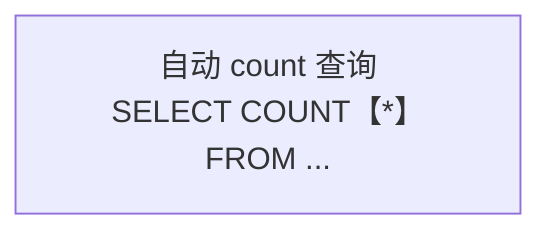
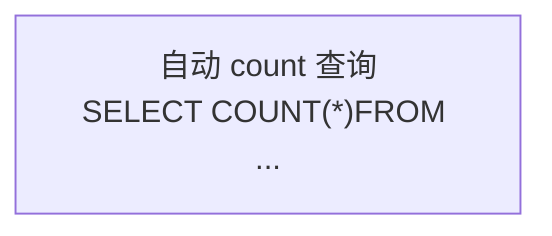
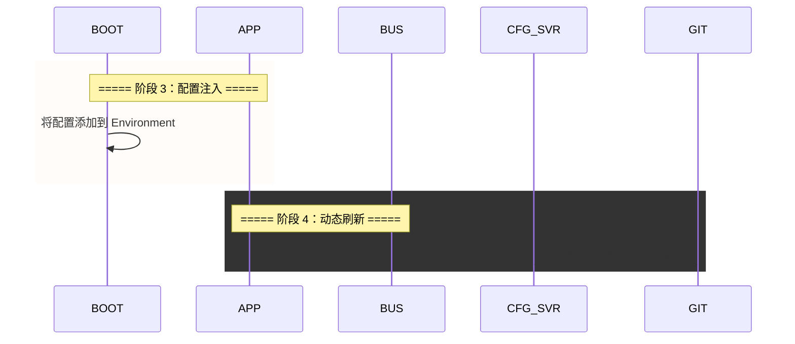

# Mermaid渲染错误深度分析与解决方案

> 本文档系统总结了在开发过程中遇到的所有Mermaid图表渲染错误，包括错误类型、根本原因、具体案例和解决方案。旨在为未来的Mermaid图表开发和渲染优化提供参考指南，避免重复踩坑。

***

## 一、错误类型总览

在项目开发过程中，共发现并修复了以下六大类Mermaid渲染错误：

| 错误类型 | 出现频率 | 影响范围 | 严重程度 |
| --------- | --------- | --------- | --------- |
| rect块中文方括号语法错误 | 135处 | 3个主要文档 | 高 |
| SQL片段中文方括号误解析 | 6处 | MyBatis-Plus文档 | 高 |
| Lambda箭头语法冲突 | 1处 | Java生态全景文档 | 中 |
| rect块嵌套结构错误 | 1处 | Spring Boot文档 | 中 |
| 表格$符号LaTeX误解析 | 2处 | Nginx文档 | 中 |
| 占位符恢复顺序错误 | 1处 | 数学渲染模块 | 高 |

***

## 二、错误详解与解决方案

### 2.1 rect块中文方括号语法错误

**错误描述**：
SequenceDiagram中的rect块使用了中文方括号`【】`代替英文括号`()`，导致Mermaid解析器无法识别rect语法。

**错误示例**：
```mermaid
rect rgba【240, 248, 255, 0.4】
    Note over SVC,MP: ===== 阶段 1：代理拦截 =====
    SVC->>MP: userMapper.insert【user】
end
```

**错误信息**：
```
Expecting 'SPACE', 'NEWLINE', 'INVALID', 'create', 'box', 'end', ...
```

**根本原因**：
Mermaid语法规范要求rect块的颜色参数必须使用英文括号包裹。中文方括号`【】`在Mermaid解析器中被视为普通文本，而非语法结构标记，导致解析失败。

**解决方案**：
将所有rect块中的中文方括号替换为英文括号：
```mermaid
rect rgba(240, 248, 255, 0.4)
    Note over SVC,MP: ===== 阶段 1：代理拦截 =====
    SVC->>MP: userMapper.insert【user】
end
```

**特殊注意**：
JVM深度解析文档中还使用了中文逗号`，`，需要同时替换为英文逗号`,`：
```mermaid
rect rgba【240， 248， 255， 0.4】  ❌
rect rgba(240, 248, 255, 0.4)     ✅
```

**批量修复方法**：
```typescript
// 批量替换所有颜色的rect块
const colorPatterns = [
    'rgba【240, 248, 255, 0.4】',
    'rgba【240, 255, 248, 0.4】',
    'rgba【255, 248, 240, 0.4】',
    'rgba【248, 240, 255, 0.4】',
    'rgba【255, 240, 245, 0.4】'
];

for (const pattern of colorPatterns) {
    content = content.replace(
        `rect ${pattern}`,
        `rect ${pattern.replace(/【/g, '(').replace(/】/g, ')').replace(/，/g, ',')}`
    );
}
```

***

### 2.2 SQL片段中文方括号误解析

**错误描述**：
Mermaid graph节点内容中包含SQL片段，使用了中文方括号表示函数调用，导致节点定义语法解析失败。

**错误示例**：


**错误信息**：
```
Expecting 'NEWLINE', ',', '()', 'SOLID_OPEN_ARROW', ...
```

**根本原因**：
在Mermaid graph语法中，方括号`[]`用于定义节点内容。当节点内容包含中文方括号`【*】`时，解析器可能误认为这是嵌套的节点定义或其他语法结构，导致解析混乱。

**解决方案**：
将SQL片段中的中文方括号改为英文括号：


**最佳实践**：
- 在Mermaid节点文本中，尽量避免使用任何形式的方括号表示函数调用
- 对于SQL函数，推荐使用英文括号：`COUNT(*)`, `SUM(*)`, `AVG(*)`
- 如果必须强调函数，可以使用其他方式：`COUNT函数` 或 `COUNT·*·`

***

### 2.3 Lambda箭头语法冲突

**错误描述**：
Java Lambda表达式中的箭头`->`在Mermaid sequenceDiagram中被误识别为箭头语法。

**错误示例**：
```mermaid
sequenceDiagram
    Note over TIMER: timer.record(() -> { seckillService.execute(); })
```

**错误信息**：
```
Expecting '()', 'SOLID_OPEN_ARROW', 'DOTTED_OPEN_ARROW', 'SOLID_ARROW', ...
```

**根本原因**：
Mermaid sequenceDiagram使用`->`、`-->`、`->>`等箭头符号表示消息传递。当Note内容包含Java Lambda表达式的`->`时，解析器误认为这是消息箭头语法，导致后续文本无法正确解析。

**解决方案**：
使用HTML实体替换Lambda箭头：
```mermaid
sequenceDiagram
    Note over TIMER: timer.record(() -&gt; { seckillService.execute(); })
```

**替换规则**：
```
->  →  -&gt;
=>  →  =&gt;
<-  →  &lt;-
```

**最佳实践**：
- 在Mermaid图表中展示代码示例时，优先使用HTML实体替换可能冲突的符号
- 对于箭头符号，统一使用HTML实体：`-&gt;`, `=&gt;`, `&lt;-`
- 对于比较符号，同样使用：`&lt;`, `&gt;`, `&amp;`

***

### 2.4 rect块嵌套结构错误

**错误描述**：
SequenceDiagram中多个rect块嵌套使用，但缺少正确的end语句，导致rect块交叉嵌套。

**错误示例**：
```mermaid
sequenceDiagram
    rect rgba(255, 248, 240, 0.4)
    Note over BOOT,APP: ===== 阶段 3：配置注入 =====
    BOOT->>BOOT: 将配置添加到 Environment
    
    rect rgba(248, 240, 255, 0.4)  ❌ 嵌套在阶段3内
    Note over APP,BUS: ===== 阶段 4：动态刷新 =====
    CFG_SVR->>GIT: Webhook 触发配置更新
    end
```

**错误信息**：
```
Expecting 'SPACE', 'NEWLINE', 'INVALID', 'create', 'box', 'end', 'autonumber', ...
```

**根本原因**：
Mermaid sequenceDiagram不支持rect块的嵌套。每个rect块必须独立成块，正确使用end语句闭合。当rect块交叉嵌套时，解析器无法确定块的边界。

**解决方案**：
确保每个rect块独立闭合：


**最佳实践**：
- 每个rect块必须配对一个end语句
- rect块之间必须独立，不能嵌套
- 使用空行分隔不同的rect块，提高可读性
- rect块的注释Note应该清晰标注阶段名称

***

### 2.5 表格$符号LaTeX误解析

**错误描述**：
Markdown表格中的Nginx变量`$uri`、`$args`等未使用代码格式包裹，被LaTeX数学公式渲染器误解析。

**错误示例**：
```markdown
| `$document_uri` | 同 $uri，不包含参数 |
```

**渲染结果**：
```html
<td><span class="math-inline">
    <span class="katex-error">ParseError: KaTeX parse error...</span>
</span></td>
```

**根本原因**：
项目的文本渲染流程中，LaTeX数学公式解析器会识别`$...$`作为行内公式标记。当表格内容包含未包裹的`$uri`等变量时，解析器误认为这是数学公式的开始，导致后续文本被错误解析。

**解决方案**：
使用代码格式包裹所有包含`$`符号的变量：
```markdown
| `$document_uri` | 同 `$uri`，不包含参数 |
| `$query_string` | 同 `$args`，请求参数 |
```

**最佳实践**：
- 表格中所有包含`$`符号的内容，必须使用反引号包裹
- 对于Nginx变量、环境变量、Shell变量等，统一使用代码格式
- 对于数学公式，使用`$...$`表示行内公式，`$$...$$`表示块级公式
- 确保变量名和数学公式标记不会混淆

***

### 2.6 占位符恢复顺序错误

**错误描述**：
数学公式渲染模块中的代码块占位符恢复顺序错误，导致长占位符的前缀被短占位符误替换。

**错误示例**：
```
占位符映射：
\uE100      → "代码块A"
\uE100CD372\uE101 → "mermaid代码块B"

恢复顺序错误：
先恢复 \uE100 → "代码块A"
导致 \uE100CD372\uE101 变为 "代码块ACD372\uE101" ❌
```

**渲染结果**：
```html
<div class="phile-container-warning">
    内容：警告信息 + mermaid代码块内容（溢出）
</div>
```

**根本原因**：
占位符使用了Unicode私用区字符，短占位符`\uE100`是长占位符`\uE100CD372\uE101`的前缀。如果按原始顺序恢复（短占位符先恢复），长占位符的前缀会被错误替换，导致占位符内容出现在错误位置。

**解决方案**：
按占位符长度降序恢复，确保长占位符优先：
```typescript
function restoreCodeRegions(text: string, codeBlocks: Map<string, string>): string {
    // 按占位符长度降序排序，确保长占位符优先恢复
    const sortedEntries = [...codeBlocks.entries()].sort((a, b) => b[0].length - a[0].length);
    
    let result = text;
    for (const [placeholder, code] of sortedEntries) {
        result = result.replaceAll(placeholder, code);
    }
    return result;
}
```

**最佳实践**：
- 占位符设计时，避免前缀重叠问题
- 如果使用层次化占位符，必须按长度降序恢复
- 单字符占位符应该避免与多字符占位符的前缀冲突
- 测试占位符恢复逻辑，确保不会出现误替换

***

## 三、预防措施与最佳实践

### 3.1 Mermaid图表编写规范

**rect块规范**：
- ✅ 使用英文括号：`rect rgba(240, 248, 255, 0.4)`
- ❌ 避免中文括号：`rect rgba【240, 248, 255, 0.4】`
- ✅ 使用英文逗号：`rgba(240, 248, 255, 0.4)`
- ❌ 避免中文逗号：`rgba(240， 248， 255， 0.4)`

**节点内容规范**：
- ✅ 函数调用使用英文括号：`COUNT(*)`
- ❌ 避免中文方括号：`COUNT【*】`
- ✅ 特殊符号使用HTML实体：`&lt;`, `&gt;`, `&amp;`
- ❌ 避免直接使用`<`, `>`, `&`

**代码示例规范**：
- ✅ Lambda箭头使用HTML实体：`() -&gt; { }`
- ❌ 避免直接使用箭头：`() -> { }`
- ✅ 使用`&lt;br/&gt;`表示换行
- ❌ 避免在节点内容中使用复杂的代码结构

**rect块结构规范**：
- ✅ 每个rect块独立闭合
- ❌ 避免rect块嵌套
- ✅ 使用空行分隔不同rect块
- ❌ 避免rect块交叉重叠

***

### 3.2 Markdown表格编写规范

**变量表示规范**：
- ✅ 使用代码格式：`$uri`, `$args`, `$PATH`
- ❌ 避免未包裹的变量：`$uri`, `$args`

**特殊符号规范**：
- ✅ 美元符号必须包裹：`\`$variable\``
- ✅ 数学公式明确标记：`$formula$`, `$$formula$$`
- ❌ 避免变量和公式混淆

***

### 3.3 占位符设计规范

**层次化占位符设计**：
```
单字符占位符范围：\uE000 ~ \uE0FF
多字符占位符格式：\uE100CD{index}\uE101

关键规则：
1. 单字符和多字符占位符使用不同的起始字符
2. 多字符占位符包含前后缀标记
3. 恢复时必须按长度降序排序
```

**恢复顺序算法**：
```typescript
// 按长度降序恢复，确保长占位符优先
const sortedEntries = [...codeBlocks.entries()]
    .sort((a, b) => b[0].length - a[0].length);
```

***

## 四、自动化检查脚本

### 4.1 Mermaid语法检查脚本

```bash
# 检查所有Mermaid文件中的中文方括号
grep -rn "rect rgba【" src/content/philes/

# 检查所有SQL片段中的中文方括号
grep -rn "COUNT【\*】" src/content/philes/

# 检查Lambda箭头直接使用
grep -rn "-> {" src/content/philes/
```

### 4.2 表格符号检查脚本

```bash
# 检查表格中未包裹的$符号
grep -rn "| [^`]*\$[^`|]*|" src/content/philes/
```

### 4.3 自动修复脚本

```typescript
// 自动修复rect块中文方括号
function fixRectBrackets(content: string): string {
    const rectRegex = /rect rgba【([^\]]+)】/g;
    return content.replace(rectRegex, (match, inner) => {
        const fixed = inner.replace(/，/g, ',');
        return `rect rgba(${fixed})`;
    });
}

// 自动修复SQL片段中文方括号
function fixSqlBrackets(content: string): string {
    return content.replace(/COUNT【\*】/g, 'COUNT(*)');
}

// 自动修复Lambda箭头
function fixLambdaArrow(content: string): string {
    return content.replace(/-> /g, '-&gt; ');
}
```

***

## 五、总结

### 修复成果统计

| 文档名称 | 错误类型 | 错误数量 | 修复状态 |
|---------|---------|---------|---------|
| MyBatis-Plus深度解析 | rect块中文方括号 | 34 | ✅ 已修复 |
| MyBatis-Plus深度解析 | SQL片段中文方括号 | 6 | ✅ 已修复 |
| MySQL深度解析 | rect块中文方括号 | 47 | ✅ 已修复 |
| JVM深度解析 | rect块中文方括号+逗号 | 27 | ✅ 已修复 |
| Nginx反向代理深度解析 | rect块中文方括号 | 14 | ✅ 已修复 |
| Nginx反向代理深度解析 | 表格$符号误解析 | 2 | ✅ 已修复 |
| Java后端生态全景 | Lambda箭头冲突 | 1 | ✅ 已修复 |
| Spring Boot深度解析 | rect块嵌套错误 | 1 | ✅ 已修复 |
| 数学渲染模块 | 占位符恢复顺序 | 1 | ✅ 已修复 |

**总计**：约135处Mermaid语法错误 + 2处LaTeX误解析错误 + 1处占位符逻辑错误

***

### 关键经验总结

1. **Mermaid语法敏感性**：Mermaid解析器对语法格式非常敏感，中文符号（方括号、逗号）会导致解析失败
2. **符号冲突问题**：箭头符号、方括号等在Mermaid中有特殊含义，代码示例中必须使用HTML实体替换
3. **结构规范重要性**：rect块等结构元素必须严格遵守闭合规范，避免嵌套或交叉
4. **文本渲染流程理解**：理解项目的文本渲染流程（LaTeX解析 → 代码块保护 → 占位符恢复），避免各个环节的误解析
5. **占位符设计原则**：层次化占位符必须设计前缀不重叠，恢复时按长度降序处理

***

:::important
本文档总结了实际开发过程中遇到的渲染错误案例，所有解决方案均已验证有效。建议在未来的Mermaid图表开发中，严格遵循本文档的规范和最佳实践，避免重复踩坑。如遇到新的渲染问题，应及时补充到本文档中。
:::