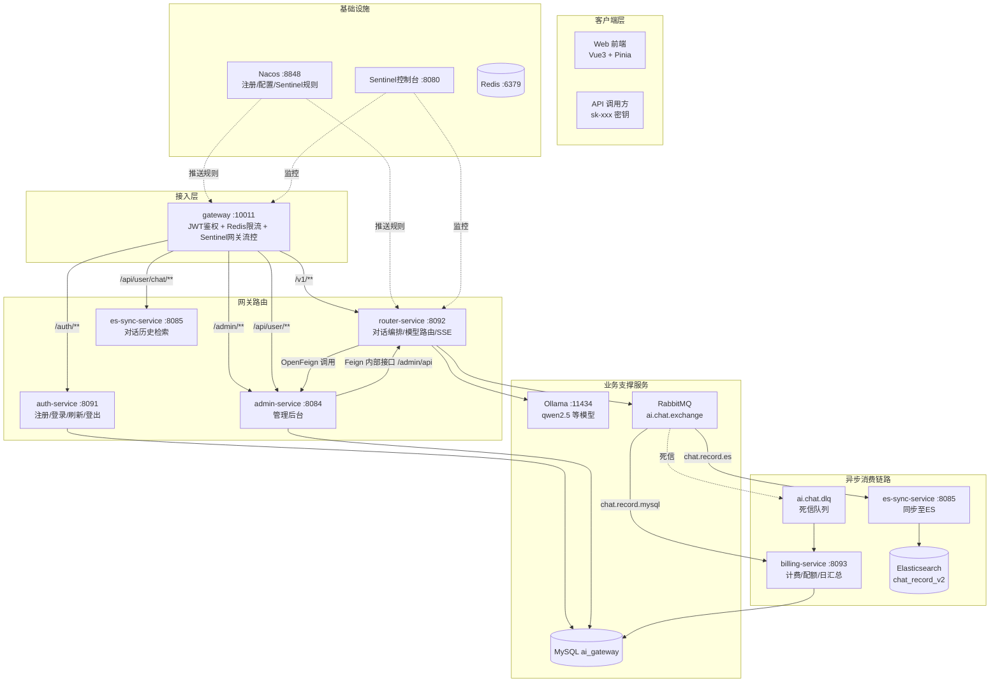
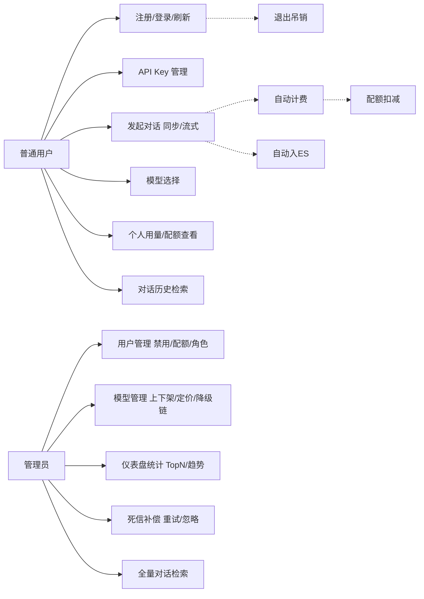
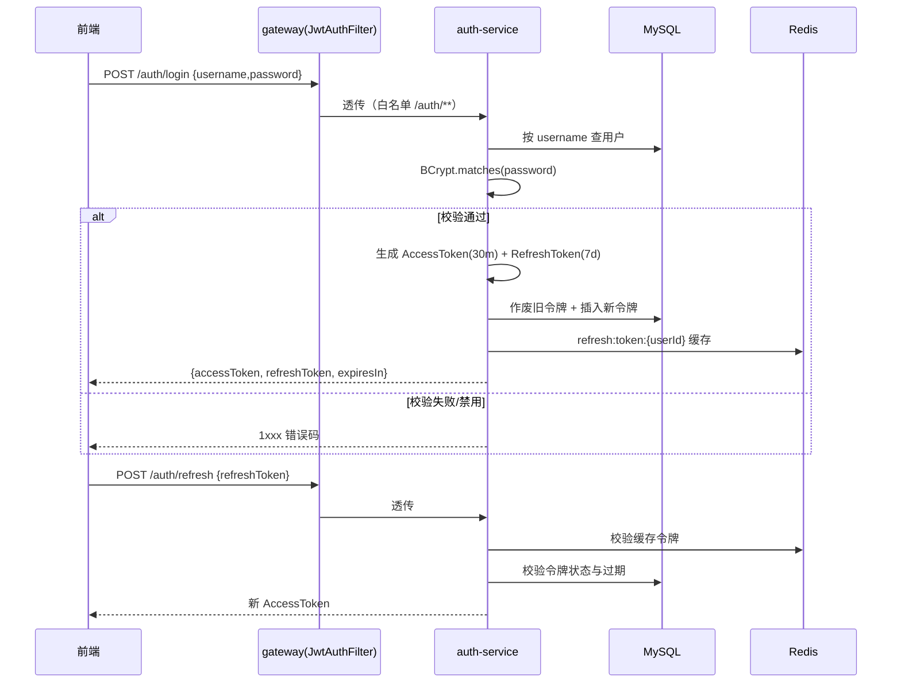
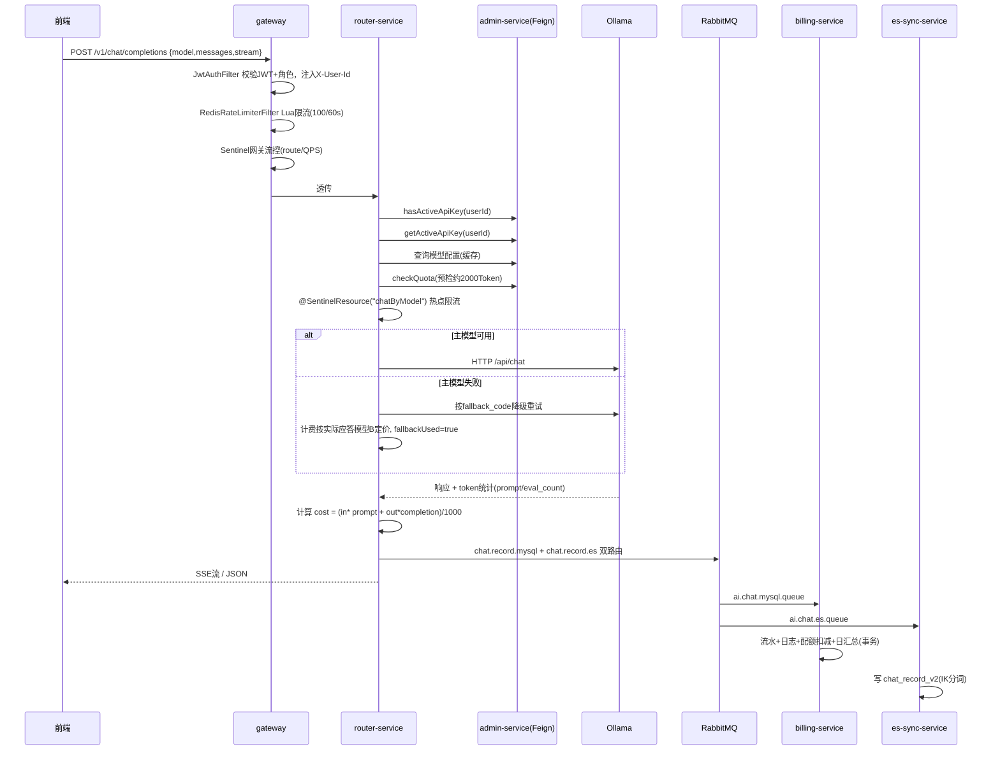
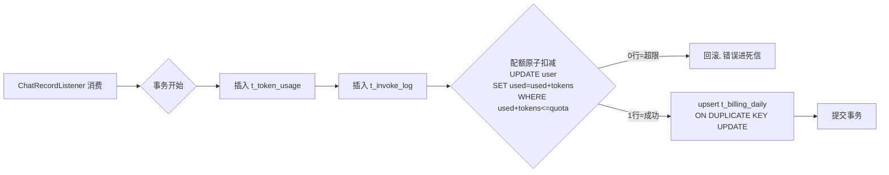
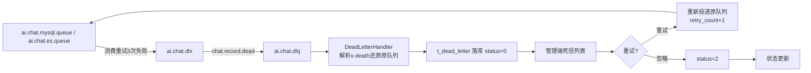
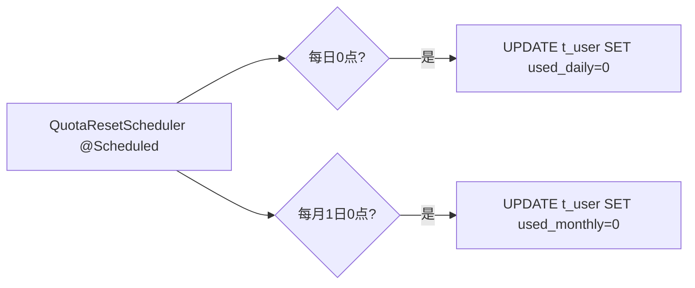

# 项目地址

[项目地址](https://github.com/AH23333/SDU2024-DB-design)

# 系统设计报告

**LLM API 网关与计费系统（AI Gateway Platform）**

软件学院 软件工程专业 2024级8班  
姓名：_
学号：_
任课教师：杜云涛  
实验教师：杜云涛

---

## 目录

- 一、项目概述
  - 1.1 项目背景
  - 1.2 项目目标
  - 1.3 技术选型
- 二、系统定义
  - 2.1 系统边界
  - 2.2 用户视图
  - 2.3 外部接口定义
  - 2.4 权限与角色
  - 2.5 业务约束与规则
  - 2.6 异常与容错
  - 2.7 性能与容量边界
- 三、需求分析
  - 3.1 功能需求分析
  - 3.2 非功能需求分析
- 四、数据库规划
  - 4.1 设计目标
  - 4.2 命名与主键
  - 4.3 表分类与用途
  - 4.4 索引规划
  - 4.5 外键与约束
  - 4.6 字段与数据类型
  - 4.7 安全与权限
- 五、数据库逻辑设计
  - 5.1 数据库概念设计
  - 5.2 ER图
  - 5.3 数据字典
  - 5.4 关系表
  - 5.5 关系说明
  - 5.6 建表语句（MySQL）
- 六、数据库物理设计
  - 6.1 字符集与排序规则
  - 6.2 存储引擎与行格式
  - 6.3 表结构与约束设计
  - 6.4 存储参数与自增
  - 6.5 容量与性能估算
- 七、应用程序设计
  - 7.1 业务逻辑设计
  - 7.2 前端UI设计
  - 7.3 核心功能实现
  - 7.4 接口设计
  - 7.5 安全设计
  - 7.6 性能优化设计
- 八、系统测试
  - 8.1 输入校验与异常处理
  - 8.2 性能测试
- 九、总结
- 参考文献

---

## 一、项目概述

### 1.1 项目背景

大语言模型（LLM）服务在企业内外部研发中的使用量快速增长，由此产生三类典型问题：

1. **接入分散**：不同模型（本地 Ollama、云端 API）调用方式各异，前端与业务方需要面对多个媒体流、多套鉴权与不同报文格式；
2. **成本失控**：Token 消耗按千次调用计价，缺乏对"谁、在何时、用了哪个模型、花费多少"的精确计量，也没有日/月配额管控；
3. **稳定性风险**：模型服务过载或宕机时缺少降级、限流与异步故障补偿手段，单点故障会直接放大到网关入口。

本课程设计以"LLM API 网关与计费系统（AI Gateway Platform）"为题，采用微服务架构构建一套面向产品化的 AI 服务中台：所有对话请求经统一网关完成鉴权、路由与限流，按 Token 用量实时计费并落库，通过 RabbitMQ 实现异步记账与死信补偿，通过 Elasticsearch 提供海量对话记录检索，管理端提供用户、模型、密钥、配额与统计的多维度运营能力。

### 1.2 项目目标

本项目旨在围绕"统一入口、精确计费、稳定可靠、可运营可分析"构建完整的 AI 网关平台，具体目标包括：

- **统一模型接入**：前端仅对接一个网关地址 `/v1/chat/completions`，即可访问全部已注册模型，同时支持同步 JSON 与 SSE 流式两种应答模式；
- **精确计费**：每次调用的输入 Token、输出 Token 与费用逐条落库，按"输入单价 + 输出单价"进行千 Token 计价，并支持按天按模型汇总；
- **配额管控**：日/月配额预检与原子扣减，超限请求被拒绝且不产生脏数据；支持管理端调整配额与重置用量；
- **高可用与降级**：单模型故障时按 `fallback_code` 自动降级备用模型，并保证计费标识与实际应答模型一致（公平计费）；
- **异步记账与补偿**：对话成功后通过 RabbitMQ 异步写入计费链路，消息处理失败进入死信队列并落库，管理端支持一键重试与忽略；
- **可分析与检索**：管理端提供用户总览、模型统计、每日趋势、TopN 排行；对话记录同步至 ES，支持关键字、模型、时间多条件检索与单条全文详情。

### 1.3 技术选型

#### 微服务与框架技术栈

| 类别          | 选型                 | 版本                        | 用途                                              |
| ------------- | -------------------- | --------------------------- | ------------------------------------------------- |
| 语言          | Java                 | 1.8                         | 全部后端服务                                      |
| 基础框架      | Spring Boot          | 2.3.10.RELEASE              | 应用运行时                                        |
| 微服务框架    | Spring Cloud         | Hoxton.SR8                  | 服务治理                                          |
| 微服务组件    | Spring Cloud Alibaba | 2.2.5.RELEASE               | Nacos + Sentinel 集成                             |
| 注册/配置中心 | Nacos                | 服务器 192.168.135.131:8848 | 服务发现、配置下发                                |
| 服务网关      | Spring Cloud Gateway | Hoxton 内置                 | 统一入口、JWT 鉴权、限流                          |
| 流量防护      | Sentinel             | 客户端 1.8.0，控制台 :8080  | 流控、降级、热点参数限流，规则持久化到 Nacos      |
| 服务间调用    | OpenFeign            | Hoxton 内置                 | router → admin 声明式调用（含 Sentinel Fallback） |
| ORM           | MyBatis-Plus         | 3.4.2                       | 数据持久化、分页插件                              |
| 分布式 ID     | UIDGenerator（百度） | 0.0.4-RELEASE               | 雪花算法 ID，DB 登记 WorkerId                     |
| 文档          | Knife4j              | 2.0.9                       | Swagger 接口文档（auth/router/admin）             |
| 工具库        | Hutool               | 5.7.22                      | 通用工具、无 DB 时兜底雪花 ID                     |

#### 中间件与环境

| 类别     | 选型                               | 说明                                      |
| -------- | ---------------------------------- | ----------------------------------------- |
| 数据库   | MySQL 8.x（InnoDB / utf8mb4）      | 标准库 `ai_gateway`，9 张业务表           |
| 缓存     | Redis（192.168.135.131:6379）      | JWT 黑名单、Refresh Token 缓存、限流计数  |
| 消息队列 | RabbitMQ（192.168.135.131:5672）   | 主题交换机广播计费/同步消息，死信队列补偿 |
| 检索     | Elasticsearch 7.12.1（:9200 集群） | 对话记录索引 `chat_record_v2`，IK 分词    |
| 模型引擎 | Ollama（192.168.135.1:11434）      | 本地开源模型推理，默认模型 qwen2.5:3b     |
| 前端     | Vue3 + TypeScript + Pinia + Vite   | 对话工作台、管理后台统计图表              |

#### 服务拆分

| 服务            | 端口  | 职责                                                               |
| --------------- | ----- | ------------------------------------------------------------------ |
| gateway         | 10011 | 统一入口、JWT 鉴权过滤、Redis 限流、Sentinel 网关流控、路由分发    |
| auth-service    | 8091  | 用户注册、登录、双 Token 签发与刷新、退出吊销                      |
| router-service  | 8092  | 对话编排、模型路由与降级、Ollama 调用、SSE 流式、MQ 生产者         |
| billing-service | 8093  | 计费消息消费、流水落库、配额扣减、日汇总、死信持久化               |
| admin-service   | 8084  | 用户/模型/密钥管理、仪表盘统计、配额重置、死信管理、Feign 内部接口 |
| es-sync-service | 8085  | ES 同步消费、用户对话历史检索接口                                  |
| common          | —     | 共享实体、DTO、常量、工具与 ES Repository                          |
| feign-api       | —     | Feign 客户端接口与熔断回退工厂                                     |

<!-- 图1：系统架构图 -->



---

## 二、系统定义

### 2.1 系统边界

#### (1) 目标与范围

- 面向普通用户提供注册登录、API Key 管理、模型选择、发起对话（同步/流式）、个人用量统计与配额感知；
- 面向管理员提供用户禁用/配额调整、模型上下架与定价、全局用量与成本监控、死信队列补偿、对话记录检索。

#### (2) 功能边界

- 认证子系统：注册、登录、双 Token（Access+Refresh）签发与刷新、退出吊销、JWT 黑名单；
- 密钥子系统：API Key 创建、吊销、脱敏展示、调用校验；
- 对话网关子系统：统一入口 `/v1/chat/completions`，OpenAI 兼容报文，同步 JSON 与 SSE 流式双模式；
- 模型管理子系统：模型注册、千 Token 输入/输出定价、权重分配、故障自动降级链；
- 计费配额子系统：实时 Token 计量 → 单条流水 → 日汇总 → 配额预检与原子扣减；
- 异步补偿子系统：RabbitMQ 异步记账，失败进死信表，管理端一键重试/忽略；
- 统计分析子系统：用户/模型/时间三维统计视图、7 日趋势、TopN 排行、配额告警。

#### (3) 外部依赖与接口边界

- Ollama 推理引擎：router 通过 HTTP 调用模型 endpoint（`/api/chat`），负责除推理外的全部能力；
- 数据库、Redis、RabbitMQ、ES、Nacos 部署于 192.168.135.131 与宿主机，通过网络地址解耦；
- 本系统不包含模型训练与支付结算对接，费用仅做内部账户扣减与度量。

#### (4) 数据边界与隐私

- 存储并审计每次调用的请求/响应报文（`t_invoke_log`），用于追溯与检索；
- 用户密码使用 BCrypt 加密存储，Token 使用 HS256 签名；
- API Key 仅存储前缀脱敏展示；对话内容索引于私有 ES 集群，不对外暴露。

### 2.2 用户视图

#### (1) 普通用户视图

1. 注册/登录：账号密码注册，登录即获取双 Token，会话自动续期与主动退出；
2. 密钥管理：创建个人 API Key（`sk-` 前缀），吊销失效，列表脱敏展示；
3. 对话工作台：选择模型（下钻当前角色可用模型列表）、维护多轮会话上下文、发起对话并流式渲染；可查看单次调用的 Token 用量与费用；
4. 个人中心：查看日/月配额与已用量、个人用量明细与趋势、对话历史检索与详情回顾。

#### (2) 管理员视图

1. 用户管理：列表分页、禁用/启用、调整日/月配额、重置用量、角色调整（保护最后一名管理员）；
2. 模型管理：模型上架/下架、新增/编辑模型（价格、超时、权重）、设置降级链、查看定价；
3. 密钥管理：全量 API Key 列表、按用户查看、吊销管理；
4. 用量监控：仪表盘总览（用户数、模型数、今日/本月调用数与费用）、7 日趋势、用户/模型 TopN、配额超 80% 告警；
5. 死信补偿：查看死信列表（按状态筛选 0 待处理/1 已重试/2 已忽略），一键重试重新投递原队列，或标记忽略；
6. 对话检索：按关键字、模型、时间检索全量对话记录，查看单条请求/应答全文。

### 2.3 外部接口定义

系统以网关为唯一外部入口（端口 10011），对公告 `/auth/**`、对话 `/v1/**`、管理 `/admin/**`、个人 `/api/user/**`、历史 `/api/user/chat/**` 五类路径统一路由；HTTP 客户端通过网关访问时可携带 JWT（用户身份）或 API Key（`X-API-Key` 场景，由内部校验）。服务内部通过 OpenFeign（`admin-service /admin/api/**`）与 RabbitMQ 完成解耦协作。所有接口统一返回 `Result{code, msg, data}` 结构。

### 2.4 权限与角色

采用 RBAC 模型，通过网关统一鉴权：

| 角色     | 标识         | 可访问路径               | 说明                       |
| -------- | ------------ | ------------------------ | -------------------------- |
| 匿名     | —            | `/auth/**`、文档路径     | 注册、登录、Swagger        |
| 普通用户 | `role=USER`  | `/v1/**`、`/api/user/**` | 对话、个人密钥/用量/历史   |
| 管理员   | `role=ADMIN` | 追加 `/admin/**`         | 用户/模型/密钥/仪表盘/死信 |

令牌策略：登录签发 AccessToken（30 分钟，HS256，含 userId/username/role）与 RefreshToken（7 天，含 jti），Redis 维护黑名单与刷新缓存；JwtAuthFilter 在网关层校验并注入 `X-User-Id / X-Username / X-User-Role` 请求头，业务服务通过 Feign 头部透传继续鉴权。

### 2.5 业务约束与规则

1. **配额规则**：需有有效 API Key 且日/月已用量未超限方可调用；配额扣减使用原子 SQL（`WHERE used + tokens <= quota`），超限整单拒绝不入库；
2. **降级规则**：主模型调用失败时按 `fallback_code` 降级重试一次；降级成功后计费与响应 `model` 字段均按**实际应答模型**计价（公平计费），并标记 `fallbackUsed=true`；
3. **限流规则**：网关按用户+路径 Redis 固定窗口限流（默认 100 次/60s）；Sentinel 对路由/接口 QPS、慢调用降级、按 modelCode 热点参数限流，规则持久化于 Nacos；
4. **死信规则**：计费/ES 消费失败重试 3 次仍失败后进入死信队列并落库，管理端可重试（重新投递原队列）或忽略，重试后 `retry_count+1`；
5. **管理员保护**：系统仅存一名管理员（role=ADMIN）时禁止将其降级，至少保留一名管理员；
6. **模型配置**：模型 ID、API Key 等使用雪花 ID/`sk-` 前缀，避免自增序号泄露业务规模。

### 2.6 异常与容错

| 场景              | 处理策略                                                                           |
| ----------------- | ---------------------------------------------------------------------------------- |
| 模型服务超时/宕机 | 按降级链切换备用模型；超时阈值、`maxQueueingTimeMs` 队列化，切换后的失败不重复降级 |
| 配额不足          | 网关预检 + 计费原子扣减双保险，超限请求返回明确错误码 5xxx 且不产生计费流水        |
| MQ 消费异常       | 3 次重试 → 死信队列 → `t_dead_letter` 落库 → 管理台手动重试/忽略                   |
| 服务间调用失败    | OpenFeign + Sentinel FallbackFactory 返回安全默认值（null/false）                  |
| 非法访问          | 网关 JWT 黑名单、角色校验、统一异常处理 `GlobalExceptionHandler` 返回标准 `Result` |
| 分布式 ID 冲突    | UIDGenerator（DB WorkerId）+ Hutool 雪花兜底                                       |
| 下游 ES 不可用    | es-sync 消费失败进入死信，DB 侧 `t_invoke_log` 保证明细不丢，可事后重放            |

### 2.7 性能与容量边界

- **网关吞吐**：Redis Lua 固定窗口限流单用户 100 QPS/路径；Sentinel 网关流控分别约束 auth=10、router=50、admin=20、user-self=40、chat_api=20；
- **对话链路**：router 对 `GET .../validate`=50、`.../models/list`=20、`.../quota/check`=100、`/v1/chat/completions`=30 流控；慢调用降级阈值 2000ms、RT 比例 50%、窗口 10s；热点参数按 modelCode 单模型 30 QPS；
- **数据写入**：计费走 MQ 异步削峰，DB 仅做顺序插入 + 事务内原子扣减，日汇总使用 `INSERT ... ON DUPLICATE KEY UPDATE` 幂等刷新；
- **检索**：对话记录入 ES（IK 分词），关键字使用 `*.raw` 子字段通配符检索，时间与模型过滤走 Term 查询，保障大数据量下毫秒级响应。

---

## 三、需求分析

### 3.1 功能需求分析

<!-- 图2：系统功能用例图 -->



#### (1) 用户端功能

1. 注册登录：账号+密码注册、登录，支持双 Token 自动续期与主动退出；
2. 密钥管理：创建 / 查看（脱敏） / 吊销个人 API Key；
3. 发起对话：选择模型、维护多轮上下文，支持 `stream=false` 同步 JSON 与 `stream=true` SSE 流式，前端逐字渲染；
4. 用量感知：日/月配额展示、个人调用明细、费用趋势；
5. 历史检索：按关键字、模型、时间检索个人对话，查看单条详情。

#### (2) 管理员端功能

1. 用户管理：分页列表、禁用/启用、配额调整、用量重置、角色调整（含最后管理员保护）；
2. 模型管理：新增/编辑/删除/上下架模型，配置 endpoint、超时、输入/输出单价、权重、降级链；
3. 密钥管理：全量密钥列表、吊销；
4. 用量监控：仪表盘多指标总览、7 日趋势、用户/模型排行、配额告警；
5. 死信补偿：死信列表与状态筛选、一键重试重新投递、忽略；
6. 对话检索：全量关键字/模型/时间检索与单条详情（基于 ES）。

### 3.2 非功能需求分析

1. **一致性**：计费事务内"流水 + 日志 + 配额扣减 + 日汇总"原子完成；配额扣减原子条件防止超卖；日汇总幂等刷写；
2. **可用性**：模型故障自动降级；MQ 死信可补偿；Feign 熔断；网关限流保护下游；
3. **实时性**：流式对话首 Token 低延迟，SEI 事件流渲染；计费消息经 MQ 异步解耦，吞吐高、链路短；
4. **安全性**：BCrypt 密码、HS256 JWT、网关统一鉴权、敏感字段脱敏、密码与密钥不落日志；
5. **可观测性**：`t_invoke_log` 全链路审计（请求/响应/耗时/是否降级/错误信息），仪表盘多维统计；
6. **可维护性**：8 模块职责单一，common 收敛共享实体，规则持久化 Nacos 可热更新，开箱脚本一键启停。

---

## 四、数据库规划

### 4.1 设计目标

- **一致性**：命名、索引与约束风格统一（snake*case、`idx*`/`uk\_` 前缀）；
- **性能**：覆盖高频路径（按用户查流水、按时间汇总、按编码查模型、配额扣减）建立索引；
- **可靠性**：InnoDB 事务保障计费原子性，唯一键防重复，`ON DUPLICATE KEY` 幂等；
- **安全**：密码 BCrypt、密钥脱敏、最小权限库账号；
- **可扩展**：主键雪花化支持分布式写入，日汇总按天分片天然可归档。

### 4.2 命名与主键

- 表名统一 `t_xxx`（业务表），索引/约束前缀 `idx_`/`uk_`；
- 业务表主键统一为**雪花 ID**（`BIGINT UNSIGNED`），由 UIDGenerator 生成，避免自增暴露规模并支持分布式写入；`t_refresh_token`、`t_dead_letter` 使用自增主键；
- 业务唯一号：API Key 使用 `sk-<UUID>`；对话使用 `traceId`（雪花 ID）；统计唯一键 `(user_id, stat_date, model_code)`。

### 4.3 表分类与用途

| 表名            | 用途                                                            |
| --------------- | --------------------------------------------------------------- |
| t_user          | 用户/管理员账号、BCrypt 密码、日/月配额与已用量、角色、状态     |
| t_refresh_token | 刷新令牌持久化（用户关联、过期时间、状态）                      |
| t_api_key       | 第三方接入密钥（前缀脱敏、状态、过期时间）                      |
| t_model_config  | 模型配置（endpoint、定价、超时、权重、降级链、状态）            |
| t_token_usage   | 按调用计量的 Token 明细（输入/输出/总量、费用、是否降级、耗时） |
| t_invoke_log    | 调用审计日志（请求/响应全文 JSON、错误信息）                    |
| t_billing_daily | 按用户+日期+模型的每日计费汇总                                  |
| t_dead_letter   | 死信队列持久化（队列名、报文、错误、重试次数、状态）            |
| WORKER_NODE     | UIDGenerator 工作节点登记表                                     |

### 4.4 索引规划

| 表名            | 索引                                                   | 说明                         |
| --------------- | ------------------------------------------------------ | ---------------------------- |
| t_token_usage   | `idx_user_time(user_id, gmt_create)`                   | 用户用量分页                 |
| t_token_usage   | `idx_trace(trace_id)`                                  | 单次调用回查                 |
| t_token_usage   | `idx_model(model_code, gmt_create)`                    | 模型维度统计                 |
| t_invoke_log    | `idx_trace(trace_id)`、`idx_user(user_id, gmt_create)` | 审计回查                     |
| t_billing_daily | `uk_stat(user_id, stat_date, model_code)`              | 每日汇总唯一键               |
| t_api_key       | `uk_api_key(api_key)`、`idx_user(user_id)`             | 密钥校验、按用户查询         |
| t_model_config  | `uk_model_code(model_code)`                            | 模型编码唯一                 |
| t_refresh_token | `uk_token(token)`、`idx_user(user_id)`                 | Token 校验与单用户多设备管理 |
| t_dead_letter   | `idx_status(status)`                                   | 死信状态筛选                 |

### 4.5 外键与约束

- 业务表不强制物理外键（分布式扩展友好），以应用层保证一致性；`t_refresh_token` 通过 `user_id` 逻辑关联 `t_user`；
- 唯一约束保证幂等：API Key、模型编码、每日汇总键、Refresh Token；
- 检查约束：`gmt_expire > gmt_create`、`price_input >= 0`、`quota >= 0` 等由应用层校验并在 DDL 中补充；
- 配额扣减使用条件更新（`WHERE used + tokens <= quota`）在 SQL 层防止超发，等效于乐观约束。

### 4.6 字段与数据类型

- 主键：`BIGINT UNSIGNED`（雪花）；自增表用 `BIGINT`；
- 金额：`DECIMAL(10,4)`（千 Token 单价可到 4 位小数）；Token 数 `BIGINT`；
- 时间：`DATETIME` + 时区统一；业务日 `VARCHAR(10)`（yyyy-MM-dd）便于按天分组；
- 报文：请求/响应全文 `MEDIUMTEXT`；
- 状态：`TINYINT`（0/1/2）表达启用/禁用/已忽略，字符串枚举表达角色与队列名。

### 4.7 安全与权限

- 密码 BCrypt 不可逆；JWT HS256 密钥在网关/认证微服务统一初始化；
- 数据库账号最小权限：仅对 `ai_gateway.*` 读写，无管理权限；
- API Key 仅有存储前缀，接口只返回脱敏值；`t_invoke_log` 保留完整报文供审计但接口按角色控制访问。

---

## 五、数据库逻辑设计

### 5.1 数据库概念设计

核心实体与关键属性：

- 用户（t_user）：账号、密码、邮箱、日/月配额、已用量、角色、状态；
- 刷新令牌（t_refresh_token）：用户、令牌、过期时间、状态；
- API Key（t_api_key）：所属用户、密钥、名称、状态、过期时间；
- 模型（t_model_config）：编码、名称、endpoint、密钥、超时、输入/输出单价、降级链、权重、状态；
- Token 用量（t_token_usage）：traceId、用户、密钥、模型、输入/输出/总量 Token、费用、是否降级、耗时；
- 调用日志（t_invoke_log）：traceId、用户、模型、全文报文、Token、费用、耗时、成功、错误；
- 每日计费（t_billing_daily）：用户、统计日、模型、调用次数、各类 Token、总费用；
- 死信（t_dead_letter）：队列、报文、错误、重试次数、状态。

关系基数：

- 用户 1:N 刷新令牌 / API Key / Token 用量 / 调用日志 / 每日计费；
- 模型 1:N Token 用量 / 调用日志（按 model_code 逻辑关联）；
- 用户 N:M 模型 → 在 Token 用量中体现（每次调用一条，双向可统计）。

### 5.2 ER图


### 5.3 数据字典

#### 表：t_user（用户表）

| 字段名        | 类型            | 可空 | 默认值   | 注释            |
| ------------- | --------------- | ---- | -------- | --------------- |
| id            | bigint unsigned | 否   | 雪花ID   | 主键            |
| username      | varchar(64)     | 否   | NULL     | 用户名（唯一）  |
| password      | varchar(255)    | 否   | NULL     | BCrypt 密码     |
| email         | varchar(128)    | 是   | NULL     | 邮箱            |
| daily_quota   | bigint          | 否   | 1000000  | 每日 Token 配额 |
| monthly_quota | bigint          | 否   | 10000000 | 每月 Token 配额 |
| used_daily    | bigint          | 否   | 0        | 今日已用        |
| used_monthly  | bigint          | 否   | 0        | 本月已用        |
| role          | varchar(20)     | 否   | USER     | 角色 ADMIN/USER |
| status        | tinyint         | 否   | 1        | 0禁用 1启用     |

#### 表：t_refresh_token（刷新令牌表）

| 字段名      | 类型         | 可空 | 默认值 | 注释             |
| ----------- | ------------ | ---- | ------ | ---------------- |
| id          | bigint       | 否   | 自增   | 主键             |
| user_id     | bigint       | 否   | NULL   | 用户 ID          |
| token       | varchar(512) | 否   | NULL   | 刷新令牌（唯一） |
| expire_time | datetime     | 否   | NULL   | 过期时间         |
| status      | tinyint      | 否   | 1      | 1有效 0失效      |

#### 表：t_api_key（API 密钥表）

| 字段名     | 类型            | 可空 | 默认值 | 注释                 |
| ---------- | --------------- | ---- | ------ | -------------------- |
| id         | bigint unsigned | 否   | 雪花ID | 主键                 |
| user_id    | bigint          | 否   | NULL   | 所属用户             |
| api_key    | varchar(128)    | 否   | NULL   | sk- 前缀密钥（唯一） |
| key_name   | varchar(64)     | 是   | NULL   | 密钥名称             |
| status     | tinyint         | 否   | 1      | 1启用 0吊销          |
| gmt_expire | datetime        | 是   | NULL   | 过期时间             |

#### 表：t_model_config（模型配置表）

| 字段名        | 类型            | 可空 | 默认值 | 注释                     |
| ------------- | --------------- | ---- | ------ | ------------------------ |
| id            | bigint unsigned | 否   | 雪花ID | 主键                     |
| model_code    | varchar(64)     | 否   | NULL   | 模型编码（唯一）         |
| model_name    | varchar(128)    | 否   | NULL   | 展示名称                 |
| endpoint      | varchar(255)    | 否   | NULL   | 调用地址                 |
| api_key       | varchar(255)    | 是   | NULL   | 供应商密钥（云端模型用） |
| timeout       | int             | 否   | 60000  | 超时毫秒                 |
| price_input   | decimal(10,4)   | 否   | 0      | 千输入 Token 单价        |
| price_output  | decimal(10,4)   | 否   | 0      | 千输出 Token 单价        |
| fallback_code | varchar(64)     | 是   | NULL   | 降级目标模型编码         |
| weight        | int             | 否   | 1      | 权重                     |
| status        | tinyint         | 否   | 1      | 1启用 0停用              |

#### 表：t_token_usage（Token 用量明细表）

| 字段名            | 类型            | 可空 | 默认值            | 注释         |
| ----------------- | --------------- | ---- | ----------------- | ------------ |
| id                | bigint unsigned | 否   | 雪花ID            | 主键         |
| trace_id          | varchar(64)     | 否   | NULL              | 调用链路 ID  |
| user_id           | bigint          | 否   | NULL              | 用户 ID      |
| api_key_id        | bigint          | 是   | NULL              | API Key ID   |
| model_code        | varchar(64)     | 否   | NULL              | 实际应答模型 |
| prompt_tokens     | bigint          | 否   | 0                 | 输入 Token   |
| completion_tokens | bigint          | 否   | 0                 | 输出 Token   |
| total_tokens      | bigint          | 否   | 0                 | 总 Token     |
| cost_amount       | decimal(10,6)   | 否   | 0                 | 费用         |
| success           | tinyint         | 否   | 1                 | 1成功 0失败  |
| fallback_used     | tinyint         | 否   | 0                 | 是否降级     |
| latency           | bigint          | 否   | 0                 | 耗时毫秒     |
| gmt_create        | datetime        | 否   | CURRENT_TIMESTAMP | 创建时间     |

#### 表：t_invoke_log（调用审计表）

| 字段名            | 类型            | 可空 | 默认值            | 注释         |
| ----------------- | --------------- | ---- | ----------------- | ------------ |
| id                | bigint unsigned | 否   | 雪花ID            | 主键         |
| trace_id          | varchar(64)     | 否   | NULL              | 调用链路 ID  |
| user_id           | bigint          | 否   | NULL              | 用户 ID      |
| api_key_id        | bigint          | 是   | NULL              | API Key ID   |
| model_code        | varchar(64)     | 否   | NULL              | 实际应答模型 |
| request_json      | mediumtext      | 否   | NULL              | 请求报文     |
| response_json     | mediumtext      | 否   | NULL              | 响应报文     |
| prompt_tokens     | bigint          | 否   | 0                 | 输入 Token   |
| completion_tokens | bigint          | 否   | 0                 | 输出 Token   |
| total_tokens      | bigint          | 否   | 0                 | 总 Token     |
| cost_amount       | decimal(10,6)   | 否   | 0                 | 费用         |
| latency           | bigint          | 否   | 0                 | 耗时         |
| success           | tinyint         | 否   | 1                 | 是否成功     |
| fallback_used     | tinyint         | 否   | 0                 | 是否降级     |
| error_msg         | text            | 是   | NULL              | 错误信息     |
| gmt_create        | datetime        | 否   | CURRENT_TIMESTAMP | 创建时间     |

#### 表：t_billing_daily（每日计费汇总表）

| 字段名                  | 类型            | 可空 | 默认值 | 注释     |
| ----------------------- | --------------- | ---- | ------ | -------- |
| id                      | bigint unsigned | 否   | 雪花ID | 主键     |
| user_id                 | bigint          | 否   | NULL   | 用户 ID  |
| stat_date               | varchar(10)     | 否   | NULL   | 统计日   |
| model_code              | varchar(64)     | 否   | NULL   | 模型编码 |
| call_count              | bigint          | 否   | 0      | 调用次数 |
| total_prompt_tokens     | bigint          | 否   | 0      | 输入合计 |
| total_completion_tokens | bigint          | 否   | 0      | 输出合计 |
| total_tokens            | bigint          | 否   | 0      | 总 Token |
| total_cost              | decimal(10,6)   | 否   | 0      | 总费用   |

#### 表：t_dead_letter（死信表）

| 字段名       | 类型        | 可空 | 默认值            | 注释                    |
| ------------ | ----------- | ---- | ----------------- | ----------------------- |
| id           | bigint      | 否   | 自增              | 主键                    |
| trace_id     | varchar(64) | 是   | NULL              | 链路 ID                 |
| queue_name   | varchar(64) | 否   | NULL              | 原队列名                |
| message_body | text        | 否   | NULL              | 消息报文                |
| error_msg    | text        | 是   | NULL              | 失败原因                |
| retry_count  | int         | 否   | 0                 | 重试次数                |
| status       | tinyint     | 否   | 0                 | 0待处理 1已重试 2已忽略 |
| gmt_create   | datetime    | 否   | CURRENT_TIMESTAMP | 创建时间                |

### 5.4 关系表


### 5.5 关系说明

- 用户与刷新令牌：一对多，`user_id` 关联，登录时作废旧令牌、新增新令牌；
- 用户与 API Key：一对多，`user_id` 关联，一个用户可有多个密钥，调用时按密钥计费归属；
- 用户与 Token 用量 / 调用日志 / 每日计费：一对多，分别按 `user_id` 关联，构成"用户-调用-汇总"数据链；
- 模型与 Token 用量 / 调用日志：按 `model_code` 逻辑关联（存储冗余编码便于国产模型切换，不建物理外键）；
- 无外键实际约束，一致性由服务层事务与唯一键保证（适配分布式扩展）。

### 5.6 建表语句（MySQL）

```sql
CREATE DATABASE IF NOT EXISTS `ai_gateway` DEFAULT CHARACTER SET utf8mb4 COLLATE utf8mb4_unicode_ci;
USE `ai_gateway`;

-- 用户表
CREATE TABLE `t_user` (
  `id` bigint unsigned NOT NULL COMMENT '雪花ID',
  `username` varchar(64) CHARACTER SET utf8mb4 COLLATE utf8mb4_unicode_ci NOT NULL COMMENT '用户名',
  `password` varchar(255) NOT NULL COMMENT 'BCrypt密码',
  `email` varchar(128) DEFAULT NULL,
  `daily_quota` bigint NOT NULL DEFAULT 1000000 COMMENT '每日Token配额',
  `monthly_quota` bigint NOT NULL DEFAULT 10000000 COMMENT '每月Token配额',
  `used_daily` bigint NOT NULL DEFAULT 0 COMMENT '今日已用',
  `used_monthly` bigint NOT NULL DEFAULT 0 COMMENT '本月已用',
  `role` varchar(20) NOT NULL DEFAULT 'USER' COMMENT 'ADMIN/USER',
  `status` tinyint NOT NULL DEFAULT 1 COMMENT '0禁用 1启用',
  `gmt_create` datetime NOT NULL DEFAULT CURRENT_TIMESTAMP,
  PRIMARY KEY (`id`),
  UNIQUE KEY `uk_username` (`username`)
) ENGINE=InnoDB COMMENT='用户表';

-- 刷新令牌表
CREATE TABLE `t_refresh_token` (
  `id` bigint NOT NULL AUTO_INCREMENT,
  `user_id` bigint NOT NULL,
  `token` varchar(512) NOT NULL,
  `expire_time` datetime NOT NULL,
  `status` tinyint NOT NULL DEFAULT 1 COMMENT '1有效 0失效',
  `gmt_create` datetime NOT NULL DEFAULT CURRENT_TIMESTAMP,
  PRIMARY KEY (`id`),
  UNIQUE KEY `uk_token` (`token`),
  KEY `idx_user` (`user_id`)
) ENGINE=InnoDB COMMENT='刷新令牌表';

-- API Key 表
CREATE TABLE `t_api_key` (
  `id` bigint unsigned NOT NULL COMMENT '雪花ID',
  `user_id` bigint NOT NULL,
  `api_key` varchar(128) NOT NULL COMMENT 'sk-前缀',
  `key_name` varchar(64) DEFAULT NULL,
  `status` tinyint NOT NULL DEFAULT 1 COMMENT '1启用 0吊销',
  `gmt_expire` datetime DEFAULT NULL,
  `gmt_create` datetime NOT NULL DEFAULT CURRENT_TIMESTAMP,
  PRIMARY KEY (`id`),
  UNIQUE KEY `uk_api_key` (`api_key`),
  KEY `idx_user` (`user_id`)
) ENGINE=InnoDB COMMENT='API密钥表';

-- 模型配置表
CREATE TABLE `t_model_config` (
  `id` bigint unsigned NOT NULL COMMENT '雪花ID',
  `model_code` varchar(64) NOT NULL,
  `model_name` varchar(128) NOT NULL,
  `endpoint` varchar(255) NOT NULL,
  `api_key` varchar(255) DEFAULT NULL,
  `timeout` int NOT NULL DEFAULT 60000,
  `price_input` decimal(10,4) NOT NULL DEFAULT 0 COMMENT '千输入Token单价',
  `price_output` decimal(10,4) NOT NULL DEFAULT 0 COMMENT '千输出Token单价',
  `fallback_code` varchar(64) DEFAULT NULL COMMENT '降级模型',
  `weight` int NOT NULL DEFAULT 1,
  `status` tinyint NOT NULL DEFAULT 1,
  `gmt_create` datetime NOT NULL DEFAULT CURRENT_TIMESTAMP,
  PRIMARY KEY (`id`),
  UNIQUE KEY `uk_model_code` (`model_code`)
) ENGINE=InnoDB COMMENT='模型配置表';

-- Token 用量明细表
CREATE TABLE `t_token_usage` (
  `id` bigint unsigned NOT NULL COMMENT '雪花ID',
  `trace_id` varchar(64) NOT NULL,
  `user_id` bigint NOT NULL,
  `api_key_id` bigint DEFAULT NULL,
  `model_code` varchar(64) NOT NULL,
  `prompt_tokens` bigint NOT NULL DEFAULT 0,
  `completion_tokens` bigint NOT NULL DEFAULT 0,
  `total_tokens` bigint NOT NULL DEFAULT 0,
  `cost_amount` decimal(10,6) NOT NULL DEFAULT 0,
  `success` tinyint NOT NULL DEFAULT 1,
  `fallback_used` tinyint NOT NULL DEFAULT 0,
  `latency` bigint NOT NULL DEFAULT 0,
  `gmt_create` datetime NOT NULL DEFAULT CURRENT_TIMESTAMP,
  PRIMARY KEY (`id`),
  KEY `idx_user_time` (`user_id`,`gmt_create`),
  KEY `idx_trace` (`trace_id`),
  KEY `idx_model` (`model_code`,`gmt_create`)
) ENGINE=InnoDB COMMENT='Token用量明细表';

-- 调用审计表
CREATE TABLE `t_invoke_log` (
  `id` bigint unsigned NOT NULL COMMENT '雪花ID',
  `trace_id` varchar(64) NOT NULL,
  `user_id` bigint NOT NULL,
  `api_key_id` bigint DEFAULT NULL,
  `model_code` varchar(64) NOT NULL,
  `request_json` mediumtext,
  `response_json` mediumtext,
  `prompt_tokens` bigint NOT NULL DEFAULT 0,
  `completion_tokens` bigint NOT NULL DEFAULT 0,
  `total_tokens` bigint NOT NULL DEFAULT 0,
  `cost_amount` decimal(10,6) NOT NULL DEFAULT 0,
  `latency` bigint NOT NULL DEFAULT 0,
  `success` tinyint NOT NULL DEFAULT 1,
  `fallback_used` tinyint NOT NULL DEFAULT 0,
  `error_msg` text,
  `gmt_create` datetime NOT NULL DEFAULT CURRENT_TIMESTAMP,
  PRIMARY KEY (`id`),
  KEY `idx_trace` (`trace_id`),
  KEY `idx_user` (`user_id`,`gmt_create`)
) ENGINE=InnoDB COMMENT='调用审计表';

-- 每日计费汇总表
CREATE TABLE `t_billing_daily` (
  `id` bigint unsigned NOT NULL COMMENT '雪花ID',
  `user_id` bigint NOT NULL,
  `stat_date` varchar(10) NOT NULL COMMENT 'yyyy-MM-dd',
  `model_code` varchar(64) NOT NULL,
  `call_count` bigint NOT NULL DEFAULT 0,
  `total_prompt_tokens` bigint NOT NULL DEFAULT 0,
  `total_completion_tokens` bigint NOT NULL DEFAULT 0,
  `total_tokens` bigint NOT NULL DEFAULT 0,
  `total_cost` decimal(10,6) NOT NULL DEFAULT 0,
  `gmt_update` datetime NOT NULL DEFAULT CURRENT_TIMESTAMP ON UPDATE CURRENT_TIMESTAMP,
  PRIMARY KEY (`id`),
  UNIQUE KEY `uk_stat` (`user_id`,`stat_date`,`model_code`)
) ENGINE=InnoDB COMMENT='每日计费汇总表';

-- 死信表
CREATE TABLE `t_dead_letter` (
  `id` bigint NOT NULL AUTO_INCREMENT,
  `trace_id` varchar(64) DEFAULT NULL,
  `queue_name` varchar(64) NOT NULL,
  `message_body` text NOT NULL,
  `error_msg` text,
  `retry_count` int NOT NULL DEFAULT 0,
  `status` tinyint NOT NULL DEFAULT 0 COMMENT '0待处理 1已重试 2已忽略',
  `gmt_create` datetime NOT NULL DEFAULT CURRENT_TIMESTAMP,
  `gmt_update` datetime NOT NULL DEFAULT CURRENT_TIMESTAMP ON UPDATE CURRENT_TIMESTAMP,
  PRIMARY KEY (`id`),
  KEY `idx_status` (`status`)
) ENGINE=InnoDB COMMENT='死信表';

-- UIDGenerator 工作节点表
CREATE TABLE `WORKER_NODE` (
  `ID` bigint NOT NULL AUTO_INCREMENT,
  `HOST_NAME` varchar(64) NOT NULL,
  `PORT` varchar(64) NOT NULL,
  `TYPE` int NOT NULL,
  `LAUNCH_DATE` date NOT NULL,
  `MODIFIED` datetime NOT NULL,
  `CREATED` datetime NOT NULL,
  PRIMARY KEY (`ID`)
) ENGINE=InnoDB COMMENT='UIDGenerator工作节点表';
```

---

## 六、数据库物理设计

### 6.1 字符集与排序规则

库、表、字段统一 `utf8mb4` + `utf8mb4_unicode_ci`：支持四字节 emoji 与全量中文，排序规则与 Java/ES 侧 `ik` 分词前的规范化保持一致，避免大小写/口音导致查询不一致。

### 6.2 存储引擎与行格式

存储引擎统一 InnoDB（事务、行级锁、崩溃恢复、`ON DUPLICATE KEY UPDATE` 支持）；行格式 `DYNAMIC`，适合 `t_invoke_log` 的 `MEDIUMTEXT` 大字段，减少行溢出、降低碎片。

### 6.3 表结构与约束设计

#### 6.3.1 主键与唯一约束

- 业务表雪花 ID 主键（BIGINT UNSIGNED），无自增暴露；`t_refresh_token`/`t_dead_letter` 自增；
- 唯一键：`uk_username`、`uk_token`、`uk_api_key`、`uk_model_code`、`uk_stat(user_id, stat_date, model_code)`，分别防重复账户/重复令牌/重复密钥/重复模型/重复汇总行。

#### 6.3.2 二级索引

- `t_token_usage.idx_user_time(user_id, gmt_create)`：个人用量分页主路径；
- `t_token_usage.idx_model(model_code, gmt_create)`：模型维度 TopN 与趋势；
- `t_invoke_log.idx_trace` / `idx_user`：链路回查与审计；
- `t_dead_letter.idx_status`：死信状态筛选；
- `t_api_key.idx_user`：按用户查密钥。

#### 6.3.3 外键与参照完整性

不建物理外键（适配分库分表演进、避免分布式锁与级联）。参照完整性由应用层保证：删除用户前禁用其密钥；刷新令牌随登录轮换；日汇总唯一键保证行级幂等。

#### 6.3.4 检查约束与生成列

- 配额扣减采用条件 UPDATE（`used + tokens <= quota`）等效乐观约束；
- `t_billing_daily` 使用 `ON DUPLICATE KEY UPDATE` 实现一招幂等累加；
- 角色、状态、队列名使用 `TINYINT`/`VARCHAR` 枚举，服务层校验。

### 6.4 存储参数与自增

统一 `ENGINE=InnoDB`、`ROW_FORMAT=DYNAMIC`、`utf8mb4_unicode_ci`；`t_refresh_token`、`t_dead_letter`、`WORKER_NODE` 使用自增；其余表主键由应用生成，不依赖数据库自增。

### 6.5 容量与性能估算

| 路径                           | 手法                                                       |
| ------------------------------ | ---------------------------------------------------------- |
| 高频写（每次调用 2~3 行）      | 走 MQ 异步落库，DB 吞吐不随 QPS 直连放大                   |
| 高频查（个人用量、仪表盘汇总） | 唯一键 + 复合索引覆盖；日汇总行数 = 用户×日×模型，量级可控 |
| 大字段（t_invoke_log）         | MEDIUMTEXT + DYNAMIC，仅按需读取，不回表扫描               |
| 归档                           | 日汇总按 stat_date 范围分区/迁移；明细表可按月归档至备份表 |

---

## 七、应用程序设计

### 7.1 业务逻辑设计

#### 1. 注册登录与双 Token 续期



#### 2. 对话链路（鉴权 → 限流 → 路由 → 降级 → 异步计费）



#### 3. 计费与配额扣减



#### 4. 死信补偿链路



#### 5. 配额重置调度



### 7.2 前端UI设计

<!-- | 页面 | 说明 | 关键交互 |
|---|---|---|
| 登录/注册页 | 账号密码、双 Token 会话 | 登录即建会话，失败给出明确错误 |
| 对话工作台 | 模型选择、会话上下文、消息列表 | SSE 流式逐字渲染、模型切换、清空会话 |
| 个人中心 | 配额环图、用量明细表、费用趋势 | 日/月用量进度、按模型过滤 |
| API Key 管理 | 密钥列表（脱敏）、创建/吊销 | 一键创建 `sk-xxx`、复制前确认 |
| 对话历史 | 关键字/模型/时间检索列表 | 分页浏览、点击查看单条详情 |
| 管理-用户 | 用户表格、禁用/配额/角色操作 | 行内操作、最后管理员保护提示 |
| 管理-模型 | 模型表格、上下架、价格编辑 | 降级链下拉配置、费率输入 |
| 管理-仪表盘 | 统计卡片、7 日趋势图、TopN 排行 | ECharts 图表、配额告警标红 |
| 管理-死信 | 死信表格、状态筛选、重试/忽略 | 一键重试确认、失败原因展示 |
| 管理-对话检索 | 全量对话检索与详情 | 关键字命中高亮、报文详情 | -->

##### 登录/注册页


##### 仪表盘


##### 对话工作台


##### 对话检索


##### API-Key


##### 用量统计


##### 管理后台

##### 仪表盘


##### 用户管理


##### 模型管理


##### 死信管理


### 7.3 核心功能实现

#### 网关 JWT 鉴权过滤（JwtAuthFilter）

```java
@Override
public Mono<Void> filter(ServerWebExchange exchange, GatewayFilterChain chain) {
    ServerHttpRequest request = exchange.getRequest();
    if (whitelistMatch(request.getURI().getPath())) return chain.filter(exchange);

    String token = resolveToken(request);            // Bearer 提取
    if (token == null || isBlacklisted(token)) return unauthorized(exchange);
    Claims claims = JwtUtil.parseToken(token);        // HS256 校验
    if (claims == null || jwtSecretMismatch(claims)) return unauthorized(exchange);

    // 注入业务头，供下游 Feign 透传鉴权
    ServerHttpRequest mutated = request
        .mutate()
        .header("X-User-Id", claims.get("userId", String.class))
        .header("X-Username", claims.get("username", String.class))
        .header("X-User-Role", claims.get("role", String.class))
        .build();
    return chain.filter(exchange.mutate().request(mutated).build());
}
```

#### Redis 固定窗口限流（RedisRateLimiterFilter）

```java
// Lua：key = rate:limit:{userId}:{path}，固定窗口内自增，超阈值返回 0 拒绝
private static final String RATE_LUA =
    "local c = redis.call('INCR', KEYS[1]) " +
    "if c == 1 then redis.call('EXPIRE', KEYS[1], ARGV[1]) end " +
    "if c > tonumber(ARGV[2]) then return 0 else return 1 end";

Mono<Void> rateLimit(ServerWebExchange exchange, GatewayFilterChain chain) {
    String key = "rate:limit:" + userId + ":" + request.getPath().value();
    return reactiveRedis.execute(RATE_LUA, Arrays.asList(key), limit, window)
        .flatMap(r -> r == 1
            ? chain.filter(exchange)
            : writeLimited(exchange)); // 429
}
```

#### 对话编排与降级计费（ChatService）

```java
public ChatResponse doChat(ChatRequest req, Long userId) {
    validate(req);                                  // model必填/messages<=50/长度<=32768
    requireActiveApiKey(userId);
    ModelConfig A = lookupModel(req.getModel());
    preCheckQuota(userId);                          // 预检约2000Token

    ModelConfig serving = A;
    boolean fallbackUsed = false;
    try {
        return invokeAndRecord(A, req, userId, serving, fallbackUsed);
    } catch (Exception e) {
        if (StrUtil.isBlank(A.getFallbackCode())) throw wrap(e);
        ModelConfig B = lookupModel(A.getFallbackCode());
        serving = B; fallbackUsed = true;           // 公平计费：单价、MQ、响应model均跟随B
        return invokeAndRecord(B, req, userId, serving, fallbackUsed);
    }
}
```

#### 流式对话（SSE）

```java
@PostMapping("/v1/chat/completions")
public ResponseEntity<SseEmitter> chatStream(@RequestBody ChatRequest req,
                                             @RequestHeader Integer userId) {
    SseEmitter emitter = new SseEmitter(180_000L);
    executor.submit(() -> chatService.chatStream(req, userId, emitter));
    return ResponseEntity.ok()
        .contentType(MediaType.TEXT_EVENT_STREAM)
        .body(emitter);
}
// chatStream 内部：HttpURLConnection 逐行解析 NDJSON，
// 每行封装为 `data: {...}\n\n` 推送；结束后补 `[DONE]`，异常调 emitter.completeWithError
```

#### 配额扣减（BillingService 原子 SQL）

```java
@Transactional(rollbackFor = Exception.class)
public void processChatRecord(ChatRecordMessage msg) {
    tokenUsageMapper.insert(buildUsage(msg));
    invokeLogMapper.insert(buildLog(msg));
    int rows = userMapper.deductQuota(msg.getUserId(), msg.getTotalTokens());
    if (rows == 0) throw new BizException(5000, "配额不足，扣除失败"); // 回滚
    billingDailyMapper.upsert(msg.getUserId(), date, model, tokens, cost);
}
```

```xml
<update id="deductQuota">
  UPDATE t_user
     SET used_daily = used_daily + #{tokens},
         used_monthly = used_monthly + #{tokens}
   WHERE id = #{userId}
     AND used_daily + #{tokens} &lt;= daily_quota
     AND used_monthly + #{tokens} &lt;= monthly_quota
</update>
```

#### ES 对话检索（ChatRecordSearchImpl）

```java
public PageResult<ChatDetailVO> searchByCriteria(Long userId, String keyword,
        String modelCode, String start, String end, int page, int size) {
    BoolQueryBuilder bool = QueryBuilders.boolQuery()
        .filter(QueryBuilders.termQuery("userId", userId));
    if (StrUtil.isNotBlank(keyword)) {
        bool.must(QueryBuilders.wildcardQuery("requestJson.raw",
            "*" + escape(keyword) + "*"))
            .should(QueryBuilders.wildcardQuery("responseJson.raw",
                "*" + escape(keyword) + "*"));
    }
    if (StrUtil.isNotBlank(modelCode))
        bool.filter(QueryBuilders.termQuery("modelCode", modelCode));
    if (StrUtil.isNotBlank(start) && StrUtil.isNotBlank(end))
        bool.filter(QueryBuilders.rangeQuery("gmtCreate").gte(start).lte(end));

    NativeSearchQuery query = new NativeSearchQueryBuilder()
        .withQuery(bool)
        .withPageable(PageRequest.of(page - 1, size))
        .build();
    // repository.search(query) → 映射 ChatDetailVO
}
```

### 7.4 接口设计

统一响应 `Result{code, msg, data}`，错误码分段：`1xxx` 认证、`2xxx` 管理、`3xxx` 模型/对话、`4xxx` 密钥、`5xxx` 配额、`6xxx` 参数校验、`7xxx` 死信。

#### 认证（/auth）— 网关白名单

| 方法 | 路径           | 说明                 |
| ---- | -------------- | -------------------- |
| POST | /auth/register | 注册（返回双 Token） |
| POST | /auth/login    | 登录                 |
| POST | /auth/refresh  | 刷新令牌             |
| POST | /auth/logout   | 退出（黑名单+吊销）  |

#### 对话（/v1）

| 方法 | 路径                             | 说明                         |
| ---- | -------------------------------- | ---------------------------- |
| POST | /v1/chat/completions             | 对话（stream=true 返回 SSE） |
| POST | /router/api/models/refresh-cache | 刷新指定模型缓存             |
| POST | /router/api/models/clear-cache   | 清空模型缓存                 |

#### 管理（/admin，ADMIN 角色）

| 方法   | 路径                           | 说明                       |
| ------ | ------------------------------ | -------------------------- |
| GET    | /admin/users                   | 用户分页                   |
| PUT    | /admin/users/{id}/status       | 启用/禁用                  |
| PUT    | /admin/users/{id}/quota        | 调整日/月配额              |
| PUT    | /admin/users/{id}/reset-usage  | 用量清零                   |
| PUT    | /admin/users/{id}/role         | 调整角色（保护最后管理员） |
| GET    | /admin/models                  | 模型分页                   |
| POST   | /admin/models                  | 新增模型                   |
| PUT    | /admin/models/{id}             | 编辑模型                   |
| PUT    | /admin/models/{id}/status      | 上下架                     |
| DELETE | /admin/models/{id}             | 删除模型                   |
| GET    | /admin/models/list             | 启用模型列表（前端下拉）   |
| GET    | /admin/usage                   | 用量明细（可过滤 userId）  |
| GET    | /admin/apikeys                 | 密钥列表                   |
| POST   | /admin/apikeys                 | 创建密钥                   |
| PUT    | /admin/apikeys/{id}/revoke     | 吊销密钥                   |
| GET    | /admin/dashboard               | 仪表盘统计                 |
| GET    | /admin/deadletters             | 死信分页（status 过滤）    |
| PUT    | /admin/deadletters/{id}/retry  | 重试（重新投递）           |
| PUT    | /admin/deadletters/{id}/ignore | 忽略                       |

#### 个人（/api/user）

| 方法 | 路径                          | 说明         |
| ---- | ----------------------------- | ------------ |
| GET  | /api/user/dashboard           | 个人统计     |
| GET  | /api/user/apikeys             | 个人密钥     |
| POST | /api/user/apikeys             | 创建密钥     |
| PUT  | /api/user/apikeys/{id}/revoke | 吊销         |
| GET  | /api/user/usage               | 个人用量     |
| GET  | /api/user/models              | 启用模型列表 |

#### 对话历史（/api/user/chat）

| 方法 | 路径                             | 说明                                     |
| ---- | -------------------------------- | ---------------------------------------- |
| GET  | /api/user/chat/history           | 检索（keyword/modelCode/时间，分页，ES） |
| GET  | /api/user/chat/history/{traceId} | 单条详情（用户隔离）                     |

#### 内部 Feign（admin-service /admin/api）

| 方法 | 路径                              | 调用方     | 说明               |
| ---- | --------------------------------- | ---------- | ------------------ |
| GET  | /admin/api/api-keys/validate      | router     | 校验密钥           |
| GET  | /admin/api/api-keys/has-active    | router     | 用户是否有生效密钥 |
| GET  | /admin/api/api-keys/active        | router     | 取用户首个生效密钥 |
| GET  | /admin/api/models/list            | router     | 按编码查模型       |
| GET  | /admin/api/models/fallback        | router     | 查降级模型         |
| GET  | /admin/api/users/quota/check      | router     | 配额预检           |
| GET  | /admin/api/chat/history           | admin 内部 | 全量检索           |
| GET  | /admin/api/chat/history/{traceId} | admin 内部 | 详情               |

#### RabbitMQ 拓扑

```
ai.chat.exchange (topic)
 ├─ chat.record.mysql → ai.chat.mysql.queue    (billing-service)
 │    └─ x-dead-letter-exchange: ai.chat.dlx, routing-key: chat.record.dead
 ├─ chat.record.es    → ai.chat.es.queue       (es-sync-service)
 │    └─ x-dead-letter-exchange: ai.chat.dlx, routing-key: chat.record.dead
ai.chat.dlx (direct)
 └─ chat.record.dead  → ai.chat.dlq            (DeadLetterHandler → t_dead_letter)
```

### 7.5 安全设计

- **认证**：BCrypt 存密码；AccessToken 30 分钟 / RefreshToken 7 天双令牌；Redis 黑名单即时吊销；RefreshToken 落库并轮换；
- **授权**：网关统一角色校验（USER 不能访问 /admin），业务头 `X-User-Role` 二次校验；Feign 内部接口 `<admin>/admin/api/**` 不暴露到网关公网；
- **限流防滥用**：网关 Lua 固定窗口限流（用户+路径）+ Sentinel 网关/接口/热点参数三级流控，规则持久化 Nacos 热更新；
- **数据脱敏**：API Key 只返回前缀，`t_invoke_log` 需 ADMIN 权限访问；密码/密钥不打印日志；
- **报文防护**：对话输入长度上限 32768、消息条数上限 50，防超长 DoS；MyBatis 参数化查询防注入；ES 通配符特殊字符转义。

### 7.6 性能优化设计

- **缓存**：模型配置经 `ConcurrentHashMap` 本地缓存 + Nacos 提示失效（refresh/clear 接口），减少 Feign 往返；
- **异步削峰**：计费与 ES 同步全部走 MQ，调用返回与流水写入解耦，QPS 陡增不阻塞首 Token；
- **原子扣减**：配额扣减单条 UPDATE 条件命中，避免 SELECT+UPDATE 竞态；
- **幂等汇总**：`t_billing_daily` 唯一键 + `ON DUPLICATE KEY UPDATE`，重复消费不重复计费；
- **检索提速**：ES IK 分词 + `.raw` keyword 子字段通配 + Term 过滤 + 分页限深；DB 侧复合索引覆盖个人/模型查询；
- **流式网络**：gateway response-timeout 180s、max-in-memory 10MB 适配 SSE 大响应；Ollama 会话复用连接。

---

## 八、系统测试

测试数据准备：

- 用户数据：ADMIN（apitest01）+ 普通用户（testuser99、admin1 等），覆盖启用/禁用/配额差异；
- 模型数据：qwen2.5:3b 等多模型，覆盖定价、降级链、权重；
- 密钥数据：多用户多密钥，覆盖启用/吊销；
- 死信数据：`DLQTEST!` 前缀 traceId 触发的强制消费失败用例；
- 边界数据：超长输入、消息条数超 50、超配额、仅剩一名管理员降级。

### 8.1 输入校验与异常处理

| 用例              | 验证点                                                           | 结果 |
| ----------------- | ---------------------------------------------------------------- | ---- |
| 注册/登录         | 必填校验、BCrypt 匹配、错误密码明确错误码                        | 通过 |
| 令牌刷新          | RefreshToken 效力、作废令牌被拒                                  | 通过 |
| 禁用用户登录/调用 | status=0 时登录拒绝、对话 4xxx                                   | 通过 |
| 无密钥调用对话    | hasActiveApiKey=false 拒绝                                       | 通过 |
| 配额超限          | 预检与原子扣减双路径均拒绝、无脏流水                             | 通过 |
| 仅一名管理员降级  | 触发 2002"系统仅有一名管理员，无法将其降级"                      | 通过 |
| 死信消费          | `DLQTEST!` 消息 3 次失败进死信表 status=0                        | 通过 |
| 死信重试          | 重试后重新投递原队列、retry_count+1、消费者恢复正常              | 通过 |
| 模型降级          | 主模型不可达自动切 fallback，计费与响应 model 均为实际应答模型 B | 通过 |
| 网关未授权访问    | 无 Token / 过期 / USER 访问 /admin → 401/403                     | 通过 |

### 8.2 性能测试

| 项            | 手段                                            | 结果/目标                       |
| ------------- | ----------------------------------------------- | ------------------------------- |
| 网关限流      | 连续快速请求 /v1/chat/completions，观察 429     | Lua 窗口 100/60s 生效           |
| Sentinel 流控 | 对 chat_api 压测，触发 5 条网关流控规则         | 命中 `Blocked by Sentinel` 响应 |
| 热点参数限流  | 同一 modelCode 高频调用 chatByModel             | 30 QPS 后触发热点限制           |
| 降级熔断      | 使 admin Feign 慢调用，触发 DEGRADE(2000ms/50%) | 窗口 10s 内快速失败，避免雪崩   |
| 计费吞吐      | 并发对话，观察 MQ 消费与入库                    | 流水无丢失、无重复计费          |
| 配额并发      | 同一用户并发对话直至配额用尽                    | 无超发（条件 UPDATE 保证）      |
| ES 检索       | 关键字/模型/时间组合查询                        | 毫秒级返回，分页正常            |
| 全链路演示    | 登录→建密钥→SSE 对话→仪表盘核对费用             | 端到端数据一致                  |

---

## 九、总结

本次课程设计完整实现了"LLM API 网关与计费系统"，将分散的 AI 模型接入、Token 计量、配额管控与运营分析收敛为统一的微服务中台。通过 8 个 Maven 模块分治（网关、认证、路由、计费、管理、ES 同步、公共、Feign），我真正体会到微服务架构"边界清晰、职责单一、可独立扩展"的价值，也深刻理解到微服务带来的新课题：服务间鉴权透传、分布式事务补偿、规则集中管理、链路可观测。

在实现过程中，我经历并解决了一系列真实问题：Sentinel 网关调 2→1 与"规则消失"其实是控制台 8719 端口被自身占用、网关传输端口隐式漂移所致，最终通过显式指定 8721 消除歧义；ES 的 `chat_record` 别名设计一度造成索引命中的脆弱依赖，通过改为直连 `chat_record_v2` 根治；模型降级的计费最初按主模型定价，存在"按 A 宣传、按 A 扣费、实际用 B 应答"的不公平，改为按实际应答模型 B 定价后与响应字段一致。

这些问题的排查让我掌握了"从现象定位到真实根因"的方法：先核对 Nacos 持久化数据是否完好，再核对运行实例实际加载的规则，最后才确认是端口冲突这类基础设施层面问题——而不是盲目认为是规则丢失。测试阶段我从登录、建密钥、SSE 对话，到仪表盘核对费用、死信重试补偿，走通并验证了全链路数据一致。

后续可以继续完善的方向：支付结算对接与退款流程、分布式链路追踪（TraceID 全链路透传与日志聚合）、Sentinel 规则在控制台的全自动持久化同步置（避免手工改 Nacos）、多租户组织架构与子账号体系，以及密钥的 AES 加密存储替代明文留档。这门课让我不只是"会写接口"，而是建立了对分布式系统一致性与工程化交付的完整认识。

---

## 参考文献

1. Spring Cloud Alibaba 官方文档. https://github.com/alibaba/spring-cloud-alibaba
2. Sentinel 官方文档. https://sentinelguard.io/zh-cn/
3. Nacos 官方文档. https://nacos.io/zh-cn/
4. RabbitMQ 官方文档. https://www.rabbitmq.com/documentation.html
5. Elasticsearch 官方文档. https://www.elastic.co/guide/index.html
6. MySQL 8.0 官方文档. https://dev.mysql.com/doc/
7. 《深入理解 Spring Cloud 与实战》. 汪文君. 机械工业出版社
8. 《Elasticsearch 权威指南》. 赵建亭译. 人民邮电出版社
